<!-- ```{r setup, include=FALSE} -->
<!-- # knitr::opts_chunk$set(echo = FALSE,message = FALSE, warning = FALSE) -->
<!-- ``` -->

## Linear Regression

Linear regression and plot, using only base R

``` r
# Load one of R's built-in data sets about cars
data(mtcars)

# Fit a straight line for mpg vs hp and plot the result.

mpg_model = lm(mpg ~ hp, data=mtcars) # Fit Linera Model
plot(mtcars$hp, mtcars$mpg) # Plot Linear Model
abline(mpg_model) # Draw the best fit line
```

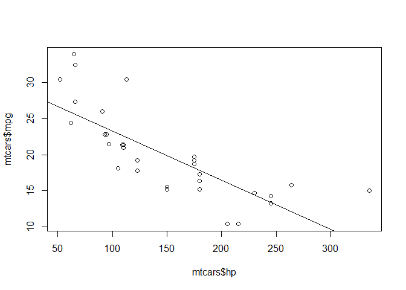

``` r
print(coef(mpg_model)) # Print the coefficients to command line
```

    ## (Intercept)          hp 
    ## 30.09886054 -0.06822828

## Reading Data & Simple Statistics

``` r
str(tv_df) # Basic dataframe info  
```

    ## 'data.frame':    40 obs. of  6 variables:
    ##  $ Show    : chr  "Living with Ed" "Monarch Cove" "Top Chef" "Iron Chef America" ...
    ##  $ Network : chr  "HGTV" "LIFE" "BRAVO" "FOOD" ...
    ##  $ PE      : num  54 64.6 78.6 62.6 56 ...
    ##  $ GRP     : num  151 375.5 808.5 17.3 44.1 ...
    ##  $ Genre   : chr  "Reality" "Drama/Adventure" "Reality" "Reality" ...
    ##  $ Duration: int  30 60 60 30 60 60 60 30 30 30 ...

``` r
head(tv_df) # View the first 6 rows
```

    ##                                 Show Network      PE   GRP           Genre
    ## 1                     Living with Ed    HGTV 54.0000 151.0         Reality
    ## 2                       Monarch Cove    LIFE 64.6479 375.5 Drama/Adventure
    ## 3                           Top Chef   BRAVO 78.5980 808.5         Reality
    ## 4                  Iron Chef America    FOOD 62.5703  17.3         Reality
    ## 5          Trading Spaces: All Stars     TLC 56.0000  44.1         Reality
    ## 6 Lisa Williams: Life Among the Dead    LIFE 56.2056 382.6         Reality
    ##   Duration
    ## 1       30
    ## 2       60
    ## 3       60
    ## 4       30
    ## 5       60
    ## 6       60

### Simple Analysis

``` r
xtabs(~Genre + Duration, data=tv_df) # Cross tabulate the data
```

    ##                   Duration
    ## Genre              30 60
    ##   Drama/Adventure   0 19
    ##   Reality           9  8
    ##   Situation Comedy  4  0

``` r
# Get the Average audience size  by genre
tv_df %>% group_by(Genre) %>% summarise(mean_GRP = mean(GRP))
```

    ## # A tibble: 3 x 2
    ##   Genre            mean_GRP
    ##   <chr>               <dbl>
    ## 1 Drama/Adventure     1243.
    ## 2 Reality              401.
    ## 3 Situation Comedy     631.

``` r
# Plot engagement by genre
ggplot(tv_df) + geom_point(aes(x=GRP,y=PE,color=Genre))
```

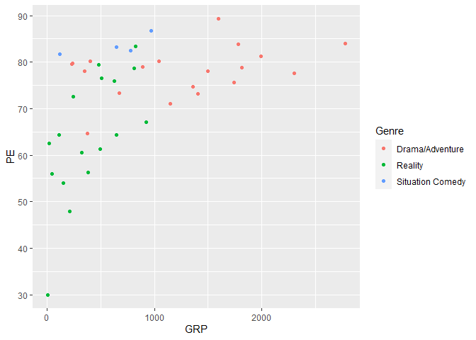

### ACL dataset

``` r
acl_df = read.csv('data/aclfest.csv', header=TRUE)
str(acl_df)
```

    ## 'data.frame':    1238 obs. of  7 variables:
    ##  $ band        : chr  "ALO" "Battles" "Bon Iver" "Flogging Molly" ...
    ##  $ acl         : int  0 0 0 0 0 0 0 0 0 0 ...
    ##  $ bonnaroo    : int  0 1 0 0 0 0 0 1 1 0 ...
    ##  $ coachella   : int  0 1 0 1 0 0 1 0 0 0 ...
    ##  $ lollapalooza: int  0 1 0 1 0 1 0 0 0 0 ...
    ##  $ outsidelands: int  1 0 1 0 1 1 0 0 0 1 ...
    ##  $ year        : int  2008 2008 2008 2008 2008 2008 2008 2008 2008 2008 ...

``` r
head(acl_df)
```

    ##                          band acl bonnaroo coachella lollapalooza outsidelands
    ## 1                         ALO   0        0         0            0            1
    ## 2                     Battles   0        1         1            1            0
    ## 3                    Bon Iver   0        0         0            0            1
    ## 4              Flogging Molly   0        0         1            1            0
    ## 5 Ivan Neville's Dumpstaphunk   0        0         0            0            1
    ## 6                   Radiohead   0        0         0            1            1
    ##   year
    ## 1 2008
    ## 2 2008
    ## 3 2008
    ## 4 2008
    ## 5 2008
    ## 6 2008

``` r
# How many bands played at lallapalooza
palooza_counts = xtabs(~lollapalooza, data=acl_df)
print(palooza_counts)
```

    ## lollapalooza
    ##   0   1 
    ## 800 438

``` r
palooza_proportions = prop.table(palooza_counts)
palooza_proportions
```

    ## lollapalooza
    ##         0         1 
    ## 0.6462036 0.3537964

``` r
# Same as above but with piping
xtabs(~lollapalooza,data=acl_df) %>% prop.table %>% round(3)
```

    ## lollapalooza
    ##     0     1 
    ## 0.646 0.354

``` r
# Joint probs of acl and lolla
xtabs(~acl + lollapalooza, data=acl_df)
```

    ##    lollapalooza
    ## acl   0   1
    ##   0 719 361
    ##   1  81  77

``` r
xtabs(~acl + lollapalooza, data=acl_df) %>% prop.table %>%  round(3)
```

    ##    lollapalooza
    ## acl     0     1
    ##   0 0.581 0.292
    ##   1 0.065 0.062

``` r
# Or probability of playing at Bonnaroo or Coachella
 # Add margins, just adds the total rows
xtabs(~bonnaroo + coachella, data=acl_df) %>%
  prop.table %>%
  addmargins
```

    ##         coachella
    ## bonnaroo          0          1        Sum
    ##      0   0.33925687 0.40064620 0.73990307
    ##      1   0.21486268 0.04523425 0.26009693
    ##      Sum 0.55411955 0.44588045 1.00000000

## Plotting

Keep this in mind for plotting:

1.  Scatter plots, to show relationships among numerical variables.
2.  Line graphs, to show change over time.
3.  Histograms, to show data distributions.
4.  Boxplots, to show between-group and within-group variation.
5.  Bar plots, to show summary statistics (like counts, means, or
    proportions).

Use faceting and aesthetic variation (e.g. color) to encode multivariate
information.

For more in-depth guide, see:
<https://bookdown.org/jgscott/DSGI/plots.html>

``` r
tvshows = read.csv('data/tvshows.csv', header=TRUE)
# head(tvshows)
power_christmas2015 = read.csv('data/power_christmas2015.csv', header=TRUE)
# head(power_christmas2015)
rapidcity = read.csv('data/rapidcity.csv', header=TRUE)
# head(rapidcity)
kroger = read.csv('data/kroger.csv', header=TRUE)
# head(kroger)
car_class_summaries = read.csv('data/car_class_summaries.csv', header=TRUE)
# head(car_class_summaries)


# Scatter Plot with shape as a facet
ggplot(tvshows) + 
  geom_point(aes(x=GRP, y=PE, shape=Genre))
```

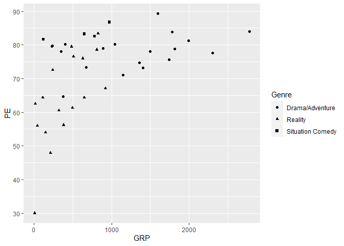

``` r
# Scatter Plot with size as a facet. 
# This makes more sense to do on a quantitative variable though.
ggplot(tvshows) + 
  geom_point(aes(x=GRP, y=PE, size=Genre))
```

    ## Warning: Using size for a discrete variable is not advised.

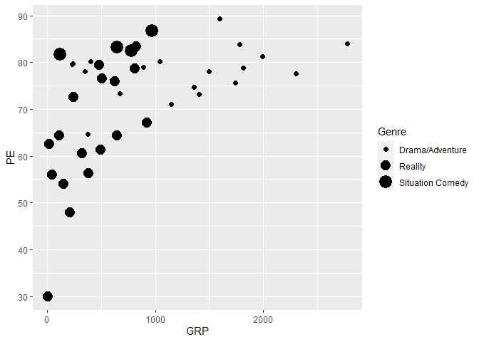

``` r
# Facet plot by different genre
ggplot(tvshows) + 
  geom_point(aes(x=GRP, y=PE)) + 
  facet_wrap(~Genre)
```

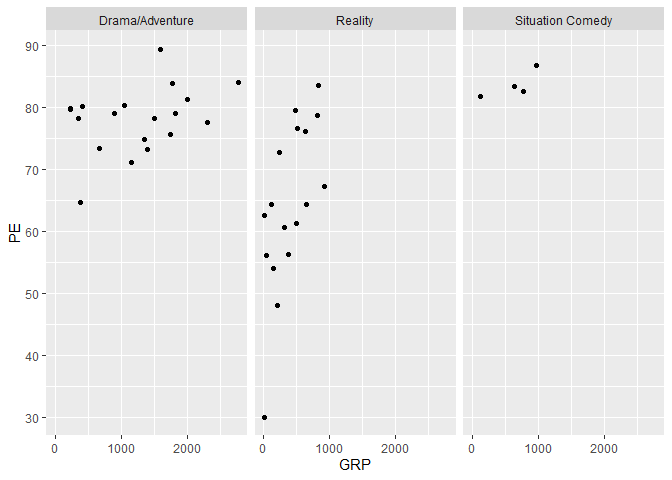

``` r
# Line plot
ggplot(power_christmas2015) + 
  geom_line(aes(x=hour, y=ERCOT))
```

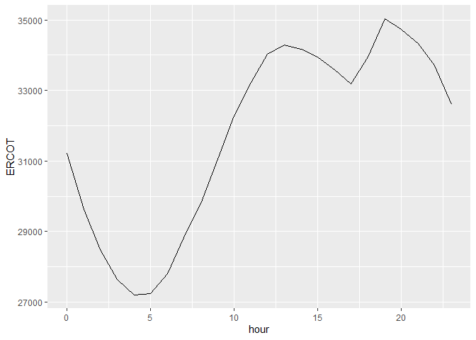

``` r
# Historgram
ggplot(rapidcity) + 
  geom_histogram(aes(x=Temp),bins=30)
```

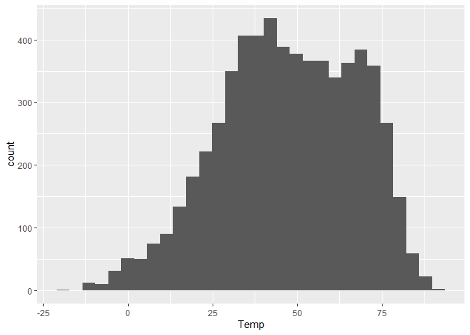

``` r
# Histogram faceted by month
ggplot(rapidcity) + 
  geom_histogram(aes(x=Temp), binwidth=3) + 
  facet_wrap(~Month)
```

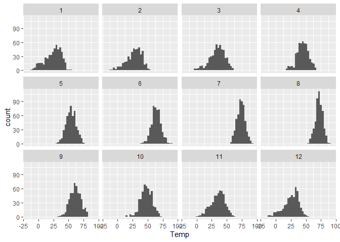

``` r
# Histogram with probabilities
ggplot(rapidcity) + 
  geom_histogram(aes(x=Temp, y=..density..), binwidth=3)
```

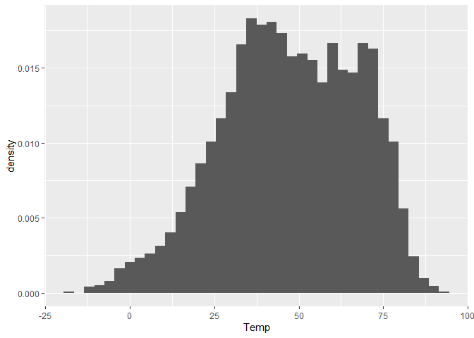

``` r
# Boxplots, grouped by city
ggplot(kroger) + 
  geom_boxplot(aes(x = city, y = vol))
```

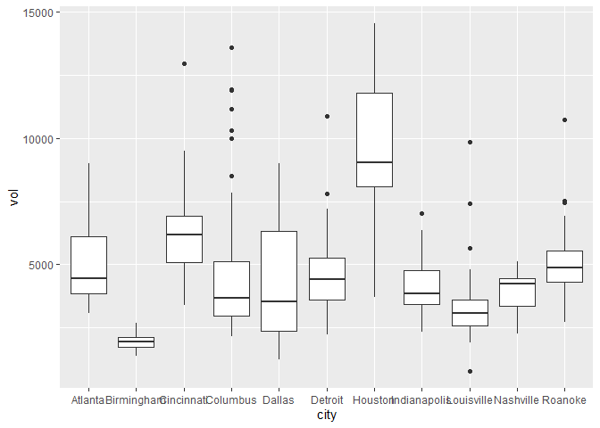

``` r
# Demand graph
ggplot(kroger) + 
  geom_point(aes(x = vol, y = price))
```

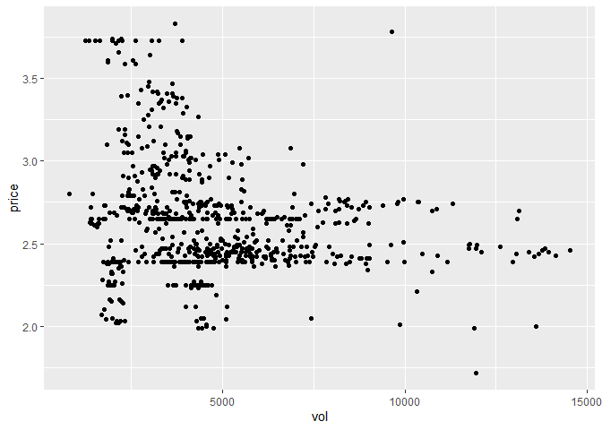

``` r
# Bar plot of summary stats

# Use geom_col when the data is already summarized
ggplot(car_class_summaries) + 
  geom_col(aes(x=class, y=average_cty))
```

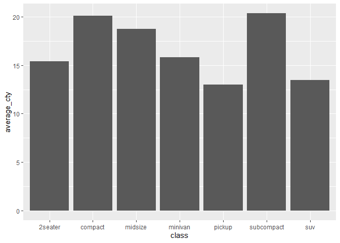

``` r
# Use geom_bar when you need R to do the counting of the raw data
data(mpg) # read in the dataset
ggplot(mpg) + 
  geom_bar(aes(x=class))
```


``` r
# Adding better labels to plot and adjusting the font size

ggplot(kroger) + 
  geom_boxplot(aes(x = city, y = vol)) + 
  labs(x="Location of Kroger store",
       y="Weekly sales volume (packages sold)",
       title="Weekly cheese sales at 11 U.S. Kroger stores") + 
  theme(axis.text = element_text(size = 8)) 
```

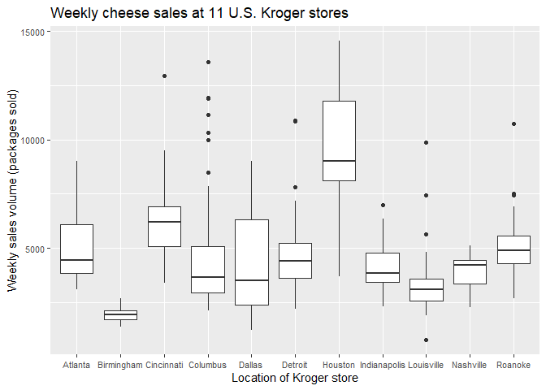

## Summarizing Data
