<!-- ```{r setup, include=FALSE} -->
<!-- # knitr::opts_chunk$set(echo = FALSE,message = FALSE, warning = FALSE) -->
<!-- ``` -->

Most of this is stolen from my former professor’s book:

[Data Science in R: A Gentle
Introduction](Data%20Science%20in%20R:%20A%20Gentle%20Introduction)

-   *James Scott*

## Linear Regression

Linear regression and plot, using only base R

``` r
# Load one of R's built-in data sets about cars
data(mtcars)

# Fit a straight line for mpg vs hp and plot the result.

mpg_model = lm(mpg ~ hp, data=mtcars) # Fit Linera Model
plot(mtcars$hp, mtcars$mpg) # Plot Linear Model
abline(mpg_model) # Draw the best fit line
```


``` r
print(coef(mpg_model)) # Print the coefficients to command line
```

    ## (Intercept)          hp 
    ## 30.09886054 -0.06822828

## Reading Data & Simple Statistics

``` r
str(tv_df) # Basic dataframe info  
```

    ## 'data.frame':    40 obs. of  6 variables:
    ##  $ Show    : chr  "Living with Ed" "Monarch Cove" "Top Chef" "Iron Chef America" ...
    ##  $ Network : chr  "HGTV" "LIFE" "BRAVO" "FOOD" ...
    ##  $ PE      : num  54 64.6 78.6 62.6 56 ...
    ##  $ GRP     : num  151 375.5 808.5 17.3 44.1 ...
    ##  $ Genre   : chr  "Reality" "Drama/Adventure" "Reality" "Reality" ...
    ##  $ Duration: int  30 60 60 30 60 60 60 30 30 30 ...

``` r
head(tv_df) # View the first 6 rows
```

    ##                                 Show Network      PE   GRP           Genre
    ## 1                     Living with Ed    HGTV 54.0000 151.0         Reality
    ## 2                       Monarch Cove    LIFE 64.6479 375.5 Drama/Adventure
    ## 3                           Top Chef   BRAVO 78.5980 808.5         Reality
    ## 4                  Iron Chef America    FOOD 62.5703  17.3         Reality
    ## 5          Trading Spaces: All Stars     TLC 56.0000  44.1         Reality
    ## 6 Lisa Williams: Life Among the Dead    LIFE 56.2056 382.6         Reality
    ##   Duration
    ## 1       30
    ## 2       60
    ## 3       60
    ## 4       30
    ## 5       60
    ## 6       60

### Simple Analysis

``` r
xtabs(~Genre + Duration, data=tv_df) # Cross tabulate the data
```

    ##                   Duration
    ## Genre              30 60
    ##   Drama/Adventure   0 19
    ##   Reality           9  8
    ##   Situation Comedy  4  0

``` r
# Get the Average audience size  by genre
tv_df %>% group_by(Genre) %>% summarise(mean_GRP = mean(GRP))
```

    ## # A tibble: 3 x 2
    ##   Genre            mean_GRP
    ##   <chr>               <dbl>
    ## 1 Drama/Adventure     1243.
    ## 2 Reality              401.
    ## 3 Situation Comedy     631.

``` r
# Plot engagement by genre
ggplot(tv_df) + geom_point(aes(x=GRP,y=PE,color=Genre))
```


### ACL dataset

``` r
acl_df = read.csv('data/aclfest.csv', header=TRUE)
str(acl_df)
```

    ## 'data.frame':    1238 obs. of  7 variables:
    ##  $ band        : chr  "ALO" "Battles" "Bon Iver" "Flogging Molly" ...
    ##  $ acl         : int  0 0 0 0 0 0 0 0 0 0 ...
    ##  $ bonnaroo    : int  0 1 0 0 0 0 0 1 1 0 ...
    ##  $ coachella   : int  0 1 0 1 0 0 1 0 0 0 ...
    ##  $ lollapalooza: int  0 1 0 1 0 1 0 0 0 0 ...
    ##  $ outsidelands: int  1 0 1 0 1 1 0 0 0 1 ...
    ##  $ year        : int  2008 2008 2008 2008 2008 2008 2008 2008 2008 2008 ...

``` r
head(acl_df)
```

    ##                          band acl bonnaroo coachella lollapalooza outsidelands
    ## 1                         ALO   0        0         0            0            1
    ## 2                     Battles   0        1         1            1            0
    ## 3                    Bon Iver   0        0         0            0            1
    ## 4              Flogging Molly   0        0         1            1            0
    ## 5 Ivan Neville's Dumpstaphunk   0        0         0            0            1
    ## 6                   Radiohead   0        0         0            1            1
    ##   year
    ## 1 2008
    ## 2 2008
    ## 3 2008
    ## 4 2008
    ## 5 2008
    ## 6 2008

``` r
# How many bands played at lallapalooza
palooza_counts = xtabs(~lollapalooza, data=acl_df)
print(palooza_counts)
```

    ## lollapalooza
    ##   0   1 
    ## 800 438

``` r
palooza_proportions = prop.table(palooza_counts)
palooza_proportions
```

    ## lollapalooza
    ##         0         1 
    ## 0.6462036 0.3537964

``` r
# Same as above but with piping
xtabs(~lollapalooza,data=acl_df) %>% prop.table %>% round(3)
```

    ## lollapalooza
    ##     0     1 
    ## 0.646 0.354

``` r
# Joint probs of acl and lolla
xtabs(~acl + lollapalooza, data=acl_df)
```

    ##    lollapalooza
    ## acl   0   1
    ##   0 719 361
    ##   1  81  77

``` r
xtabs(~acl + lollapalooza, data=acl_df) %>% prop.table %>%  round(3)
```

    ##    lollapalooza
    ## acl     0     1
    ##   0 0.581 0.292
    ##   1 0.065 0.062

``` r
# Or probability of playing at Bonnaroo or Coachella
 # Add margins, just adds the total rows
xtabs(~bonnaroo + coachella, data=acl_df) %>%
  prop.table %>%
  addmargins
```

    ##         coachella
    ## bonnaroo          0          1        Sum
    ##      0   0.33925687 0.40064620 0.73990307
    ##      1   0.21486268 0.04523425 0.26009693
    ##      Sum 0.55411955 0.44588045 1.00000000

## Plotting

Keep this in mind for plotting:

1.  Scatter plots, to show relationships among numerical variables.
2.  Line graphs, to show change over time.
3.  Histograms, to show data distributions.
4.  Boxplots, to show between-group and within-group variation.
5.  Bar plots, to show summary statistics (like counts, means, or
    proportions).

Use faceting and aesthetic variation (e.g. color) to encode multivariate
information.

For more in-depth guide, see:
<https://bookdown.org/jgscott/DSGI/plots.html>

``` r
tvshows = read.csv('data/tvshows.csv', header=TRUE)
# head(tvshows)
power_christmas2015 = read.csv('data/power_christmas2015.csv', header=TRUE)
# head(power_christmas2015)
rapidcity = read.csv('data/rapidcity.csv', header=TRUE)
# head(rapidcity)
kroger = read.csv('data/kroger.csv', header=TRUE)
# head(kroger)
car_class_summaries = read.csv('data/car_class_summaries.csv', header=TRUE)
# head(car_class_summaries)


# Scatter Plot with shape as a facet
ggplot(tvshows) + 
  geom_point(aes(x=GRP, y=PE, shape=Genre))
```


``` r
# Scatter Plot with size as a facet. 
# This makes more sense to do on a quantitative variable though.
ggplot(tvshows) + 
  geom_point(aes(x=GRP, y=PE, size=Genre))
```

    ## Warning: Using size for a discrete variable is not advised.


``` r
# Facet plot by different genre
ggplot(tvshows) + 
  geom_point(aes(x=GRP, y=PE)) + 
  facet_wrap(~Genre)
```


``` r
# Line plot
ggplot(power_christmas2015) + 
  geom_line(aes(x=hour, y=ERCOT))
```


``` r
# Historgram
ggplot(rapidcity) + 
  geom_histogram(aes(x=Temp),bins=30)
```


``` r
# Histogram faceted by month
ggplot(rapidcity) + 
  geom_histogram(aes(x=Temp), binwidth=3) + 
  facet_wrap(~Month)
```


``` r
# Histogram with probabilities
ggplot(rapidcity) + 
  geom_histogram(aes(x=Temp, y=..density..), binwidth=3)
```


``` r
# Boxplots, grouped by city
ggplot(kroger) + 
  geom_boxplot(aes(x = city, y = vol))
```


``` r
# Demand graph
ggplot(kroger) + 
  geom_point(aes(x = vol, y = price))
```


``` r
# Bar plot of summary stats

# Use geom_col when the data is already summarized
ggplot(car_class_summaries) + 
  geom_col(aes(x=class, y=average_cty))
```


``` r
# Use geom_bar when you need R to do the counting of the raw data
data(mpg) # read in the dataset
ggplot(mpg) + 
  geom_bar(aes(x=class))
```


``` r
# Adding better labels to plot and adjusting the font size

ggplot(kroger) + 
  geom_boxplot(aes(x = city, y = vol)) + 
  labs(x="Location of Kroger store",
       y="Weekly sales volume (packages sold)",
       title="Weekly cheese sales at 11 U.S. Kroger stores") + 
  theme(axis.text = element_text(size = 8)) 
```


## Summarizing Data

``` r
#Calculate summary stats
rapidcity %>%
  summarize(avg_temp = mean(Temp),
            median_temp = median(Temp),
            sd_temp = sd(Temp),
            iqr_temp = IQR(Temp),
            min_temp = min(Temp),
            max_temp = max(Temp),
            q05_temp = quantile(Temp, 0.05),
            q95_temp = quantile(Temp, 0.95)) %>%
  round(1)
```

    ##   avg_temp median_temp sd_temp iqr_temp min_temp max_temp q05_temp q95_temp
    ## 1     47.3        47.6    20.1     30.7      -19     91.9     12.9     77.2

``` r
# Add a column to rapidcity to calculate the z score
rapidcity = rapidcity %>%
  mutate(z = (Temp - mean(Temp))/sd(Temp))

rapidcity
```

    ##      Year Month Day  Temp             z
    ## 1    1995     1   1  12.6 -1.7294066178
    ## 2    1995     1   2  19.9 -1.3653901737
    ## 3    1995     1   3   9.2 -1.8989485232
    ## 4    1995     1   4   6.2 -2.0485443222
    ## 5    1995     1   5  16.0 -1.5598647123
    ## 6    1995     1   6  17.8 -1.4701072329
    ## 7    1995     1   7  19.8 -1.3703767003
    ## 8    1995     1   8  24.2 -1.1509695285
    ## 9    1995     1   9  36.3 -0.5475998062
    ## 10   1995     1  10  45.4 -0.0938258827
    ## 11   1995     1  11  50.9  0.1804330820
    ## 12   1995     1  12  42.8 -0.2234755751
    ## 13   1995     1  13  36.4 -0.5426132795
    ## 14   1995     1  14  25.9 -1.0661985758
    ## 15   1995     1  15  25.4 -1.0911312090
    ## 16   1995     1  16  24.5 -1.1360099487
    ## 17   1995     1  17  22.7 -1.2257674280
    ## 18   1995     1  18  25.8 -1.0711851024
    ## 19   1995     1  19  33.0 -0.7121551850
    ## 20   1995     1  20  33.7 -0.6772494986
    ## 21   1995     1  21  22.7 -1.2257674280
    ## 22   1995     1  22  24.8 -1.1210503688
    ## 23   1995     1  23  25.5 -1.0861446823
    ## 24   1995     1  24  30.3 -0.8467914040
    ## 25   1995     1  25  25.4 -1.0911312090
    ## 26   1995     1  26  31.4 -0.7919396111
    ## 27   1995     1  27  34.6 -0.6323707589
    ## 28   1995     1  28  34.0 -0.6622899187
    ## 29   1995     1  29  30.7 -0.8268452975
    ## 30   1995     1  30  35.2 -0.6024515991
    ## 31   1995     1  31  44.0 -0.1636372556
    ## 32   1995     2   1  49.1  0.0906756026
    ## 33   1995     2   2  42.1 -0.2583812616
    ## 34   1995     2   3  36.9 -0.5176806464
    ## 35   1995     2   4  38.1 -0.4578423268
    ## 36   1995     2   5  35.3 -0.5974650725
    ## 37   1995     2   6  30.1 -0.8567644573
    ## 38   1995     2   7  25.9 -1.0661985758
    ## 39   1995     2   8  26.8 -1.0213198361
    ## 40   1995     2   9  33.3 -0.6971956051
    ## 41   1995     2  10  26.2 -1.0512389959
    ## 42   1995     2  11  11.5 -1.7842584107
    ## 43   1995     2  12   7.6 -1.9787329493
    ## 44   1995     2  13   2.7 -2.2230727543
    ## 45   1995     2  14  13.3 -1.6945009314
    ## 46   1995     2  15   8.2 -1.9488137895
    ## 47   1995     2  16  23.7 -1.1759021617
    ## 48   1995     2  17  36.9 -0.5176806464
    ## 49   1995     2  18  46.9 -0.0190279833
    ## 50   1995     2  19  41.9 -0.2683543148
    ## 51   1995     2  20  49.6  0.1156082358
    ## 52   1995     2  21  52.0  0.2352848749
    ## 53   1995     2  22  48.9  0.0807025494
    ## 54   1995     2  23  38.0 -0.4628288534
    ## 55   1995     2  24  43.3 -0.1985429420
    ## 56   1995     2  25  54.0  0.3350154076
    ## 57   1995     2  26  38.1 -0.4578423268
    ## 58   1995     2  27  20.9 -1.3155249074
    ## 59   1995     2  28   8.7 -1.9238811564
    ## 60   1995     3   1   3.7 -2.1732074880
    ## 61   1995     3   2   9.0 -1.9089215765
    ## 62   1995     3   3  20.2 -1.3504305938
    ## 63   1995     3   4  14.0 -1.6595952449
    ## 64   1995     3   5   1.3 -2.2928841271
    ## 65   1995     3   6  -1.8 -2.4474664527
    ## 66   1995     3   7  -2.1 -2.4624260326
    ## 67   1995     3   8   4.8 -2.1183556950
    ## 68   1995     3   9  27.5 -0.9864141497
    ## 69   1995     3  10  49.7  0.1205947624
    ## 70   1995     3  11  55.9  0.4297594136
    ## 71   1995     3  12  52.9  0.2801636146
    ## 72   1995     3  13  49.8  0.1255812890
    ## 73   1995     3  14  49.9  0.1305678157
    ## 74   1995     3  15  50.1  0.1405408689
    ## 75   1995     3  16  52.4  0.2552309815
    ## 76   1995     3  17  37.7 -0.4777884333
    ## 77   1995     3  18  40.5 -0.3381656877
    ## 78   1995     3  19  52.1  0.2402714016
    ## 79   1995     3  20  42.9 -0.2184890485
    ## 80   1995     3  21  47.0 -0.0140414566
    ## 81   1995     3  22  47.8  0.0258507564
    ## 82   1995     3  23  45.5 -0.0888393561
    ## 83   1995     3  24  48.8  0.0757160227
    ## 84   1995     3  25  44.4 -0.1436911490
    ## 85   1995     3  26  34.6 -0.6323707589
    ## 86   1995     3  27  31.5 -0.7869530845
    ## 87   1995     3  28  29.0 -0.9116162502
    ## 88   1995     3  29  25.6 -1.0811581557
    ## 89   1995     3  30  28.3 -0.9465219367
    ## 90   1995     3  31  33.6 -0.6822360252
    ## 91   1995     4   1  46.8 -0.0240145099
    ## 92   1995     4   2  50.8  0.1754465554
    ## 93   1995     4   3  45.1 -0.1087854626
    ## 94   1995     4   4  34.4 -0.6423438122
    ## 95   1995     4   5  47.2 -0.0040684034
    ## 96   1995     4   6  49.3  0.1006486559
    ## 97   1995     4   7  49.2  0.0956621293
    ## 98   1995     4   8  40.4 -0.3431522143
    ## 99   1995     4   9  28.3 -0.9465219367
    ## 100  1995     4  10  24.6 -1.1310234220
    ## 101  1995     4  11  24.4 -1.1409964753
    ## 102  1995     4  12  36.3 -0.5475998062
    ## 103  1995     4  13  44.2 -0.1536642023
    ## 104  1995     4  14  40.4 -0.3431522143
    ## 105  1995     4  15  44.3 -0.1486776757
    ## 106  1995     4  16  43.6 -0.1835833621
    ## 107  1995     4  17  39.7 -0.3780579007
    ## 108  1995     4  18  35.1 -0.6074381257
    ## 109  1995     4  19  35.5 -0.5874920192
    ## 110  1995     4  20  35.4 -0.5924785459
    ## 111  1995     4  21  37.6 -0.4827749600
    ## 112  1995     4  22  41.8 -0.2733408415
    ## 113  1995     4  23  45.7 -0.0788663028
    ## 114  1995     4  24  40.8 -0.3232061078
    ## 115  1995     4  25  45.7 -0.0788663028
    ## 116  1995     4  26  37.0 -0.5126941198
    ## 117  1995     4  27  39.3 -0.3980040072
    ## 118  1995     4  28  41.4 -0.2932869480
    ## 119  1995     4  29  36.6 -0.5326402263
    ## 120  1995     4  30  39.1 -0.4079770605
    ## 121  1995     5   1  38.6 -0.4329096937
    ## 122  1995     5   2  43.0 -0.2135025219
    ## 123  1995     5   3  44.5 -0.1387046224
    ## 124  1995     5   4  47.1 -0.0090549300
    ## 125  1995     5   5  49.1  0.0906756026
    ## 126  1995     5   6  49.8  0.1255812890
    ## 127  1995     5   7  52.9  0.2801636146
    ## 128  1995     5   8  53.1  0.2901366679
    ## 129  1995     5   9  45.3 -0.0988124094
    ## 130  1995     5  10  52.2  0.2452579282
    ## 131  1995     5  11  56.7  0.4696516266
    ## 132  1995     5  12  59.2  0.5943147924
    ## 133  1995     5  13  44.7 -0.1287315691
    ## 134  1995     5  14  45.2 -0.1037989360
    ## 135  1995     5  15  58.7  0.5693821592
    ## 136  1995     5  16  59.0  0.5843417391
    ## 137  1995     5  17  49.0  0.0856890760
    ## 138  1995     5  18  53.3  0.3001097211
    ## 139  1995     5  19  58.6  0.5643956326
    ## 140  1995     5  20  52.8  0.2751770880
    ## 141  1995     5  21  57.3  0.4995707864
    ## 142  1995     5  22  50.1  0.1405408689
    ## 143  1995     5  23  47.8  0.0258507564
    ## 144  1995     5  24  48.4  0.0557699162
    ## 145  1995     5  25  50.4  0.1555004488
    ## 146  1995     5  26  52.6  0.2652040347
    ## 147  1995     5  27  52.3  0.2502444548
    ## 148  1995     5  28  52.4  0.2552309815
    ## 149  1995     5  29  55.5  0.4098133070
    ## 150  1995     5  30  59.4  0.6042878456
    ## 151  1995     5  31  58.1  0.5394629994
    ## 152  1995     6   1  65.2  0.8935063903
    ## 153  1995     6   2  66.6  0.9633177631
    ## 154  1995     6   3  64.1  0.8386545973
    ## 155  1995     6   4  61.8  0.7239644848
    ## 156  1995     6   5  63.5  0.8087354375
    ## 157  1995     6   6  66.8  0.9732908164
    ## 158  1995     6   7  58.4  0.5544225793
    ## 159  1995     6   8  44.5 -0.1387046224
    ## 160  1995     6   9  43.3 -0.1985429420
    ## 161  1995     6  10  46.9 -0.0190279833
    ## 162  1995     6  11  55.0  0.3848806739
    ## 163  1995     6  12  61.1  0.6890587984
    ## 164  1995     6  13  70.6  1.1627788283
    ## 165  1995     6  14  72.8  1.2724824142
    ## 166  1995     6  15  76.5  1.4569838996
    ## 167  1995     6  16  77.1  1.4869030594
    ## 168  1995     6  17  72.7  1.2674958876
    ## 169  1995     6  18  70.0  1.1328596686
    ## 170  1995     6  19  68.8  1.0730213490
    ## 171  1995     6  20  71.1  1.1877114615
    ## 172  1995     6  21  72.0  1.2325902012
    ## 173  1995     6  22  63.7  0.8187084908
    ## 174  1995     6  23  61.9  0.7289510114
    ## 175  1995     6  24  60.8  0.6740992185
    ## 176  1995     6  25  61.0  0.6840722717
    ## 177  1995     6  26  62.0  0.7339375381
    ## 178  1995     6  27  65.8  0.9234255500
    ## 179  1995     6  28  58.8  0.5743686859
    ## 180  1995     6  29  57.0  0.4846112065
    ## 181  1995     6  30  52.5  0.2602175081
    ## 182  1995     7   1  58.9  0.5793552125
    ## 183  1995     7   2  66.1  0.9383851299
    ## 184  1995     7   3  65.1  0.8885198636
    ## 185  1995     7   4  64.2  0.8436411239
    ## 186  1995     7   5  62.9  0.7788162777
    ## 187  1995     7   6  67.1  0.9882503963
    ## 188  1995     7   7  71.1  1.1877114615
    ## 189  1995     7   8  75.4  1.4021321066
    ## 190  1995     7   9  75.9  1.4270647398
    ## 191  1995     7  10  79.1  1.5866335920
    ## 192  1995     7  11  79.6  1.6115662252
    ## 193  1995     7  12  79.6  1.6115662252
    ## 194  1995     7  13  77.6  1.5118356925
    ## 195  1995     7  14  67.1  0.9882503963
    ## 196  1995     7  15  68.8  1.0730213490
    ## 197  1995     7  16  65.8  0.9234255500
    ## 198  1995     7  17  66.8  0.9732908164
    ## 199  1995     7  18  69.1  1.0879809289
    ## 200  1995     7  19  66.3  0.9483581832
    ## 201  1995     7  20  66.0  0.9333986033
    ## 202  1995     7  21  69.8  1.1228866153
    ## 203  1995     7  22  64.4  0.8536141772
    ## 204  1995     7  23  66.3  0.9483581832
    ## 205  1995     7  24  71.9  1.2276036746
    ## 206  1995     7  25  68.0  1.0331291359
    ## 207  1995     7  26  73.5  1.3073881007
    ## 208  1995     7  27  77.2  1.4918895860
    ## 209  1995     7  28  72.8  1.2724824142
    ## 210  1995     7  29  79.3  1.5966066453
    ## 211  1995     7  30  78.3  1.5467413789
    ## 212  1995     7  31  62.5  0.7588701712
    ## 213  1995     8   1  63.6  0.8137219642
    ## 214  1995     8   2  74.0  1.3323207338
    ## 215  1995     8   3  69.7  1.1179000887
    ## 216  1995     8   4  69.1  1.0879809289
    ## 217  1995     8   5  70.6  1.1627788283
    ## 218  1995     8   6  75.7  1.4170916865
    ## 219  1995     8   7  80.2  1.6414853849
    ## 220  1995     8   8  78.7  1.5666874855
    ## 221  1995     8   9  66.7  0.9683042897
    ## 222  1995     8  10  72.6  1.2625093610
    ## 223  1995     8  11  79.9  1.6265258050
    ## 224  1995     8  12  79.5  1.6065796985
    ## 225  1995     8  13  71.0  1.1827249349
    ## 226  1995     8  14  63.6  0.8137219642
    ## 227  1995     8  15  73.3  1.2974150474
    ## 228  1995     8  16  80.5  1.6564449648
    ## 229  1995     8  17  85.0  1.8808386632
    ## 230  1995     8  18  72.5  1.2575228343
    ## 231  1995     8  19  58.6  0.5643956326
    ## 232  1995     8  20  69.7  1.1179000887
    ## 233  1995     8  21  74.7  1.3672264202
    ## 234  1995     8  22  77.1  1.4869030594
    ## 235  1995     8  23  79.3  1.5966066453
    ## 236  1995     8  24  80.9  1.6763910714
    ## 237  1995     8  25  73.1  1.2874419941
    ## 238  1995     8  26  69.8  1.1228866153
    ## 239  1995     8  27  74.0  1.3323207338
    ## 240  1995     8  28  70.5  1.1577923017
    ## 241  1995     8  29  74.0  1.3323207338
    ## 242  1995     8  30  73.8  1.3223476805
    ## 243  1995     8  31  65.0  0.8835333370
    ## 244  1995     9   1  72.4  1.2525363077
    ## 245  1995     9   2  79.3  1.5966066453
    ## 246  1995     9   3  74.7  1.3672264202
    ## 247  1995     9   4  77.1  1.4869030594
    ## 248  1995     9   5  75.0  1.3821860001
    ## 249  1995     9   6  68.1  1.0381156626
    ## 250  1995     9   7  53.5  0.3100827744
    ## 251  1995     9   8  52.5  0.2602175081
    ## 252  1995     9   9  61.1  0.6890587984
    ## 253  1995     9  10  65.3  0.8984929169
    ## 254  1995     9  11  67.4  1.0032099761
    ## 255  1995     9  12  67.9  1.0281426093
    ## 256  1995     9  13  68.6  1.0630482957
    ## 257  1995     9  14  60.9  0.6790857451
    ## 258  1995     9  15  71.4  1.2026710414
    ## 259  1995     9  16  65.1  0.8885198636
    ## 260  1995     9  17  56.2  0.4447189934
    ## 261  1995     9  18  56.0  0.4347459402
    ## 262  1995     9  19  43.5 -0.1885698887
    ## 263  1995     9  20  38.8 -0.4229366404
    ## 264  1995     9  21  35.2 -0.6024515991
    ## 265  1995     9  22  36.7 -0.5276536996
    ## 266  1995     9  23  53.4  0.3050962478
    ## 267  1995     9  24  49.3  0.1006486559
    ## 268  1995     9  25  51.9  0.2302983483
    ## 269  1995     9  26  54.0  0.3350154076
    ## 270  1995     9  27  59.6  0.6142608989
    ## 271  1995     9  28  64.3  0.8486276506
    ## 272  1995     9  29  65.4  0.9034794435
    ## 273  1995     9  30  60.3  0.6491665853
    ## 274  1995    10   1  54.0  0.3350154076
    ## 275  1995    10   2  51.2  0.1953926619
    ## 276  1995    10   3  49.4  0.1056351825
    ## 277  1995    10   4  49.1  0.0906756026
    ## 278  1995    10   5  42.1 -0.2583812616
    ## 279  1995    10   6  45.2 -0.1037989360
    ## 280  1995    10   7  40.6 -0.3331791610
    ## 281  1995    10   8  50.5  0.1604869755
    ## 282  1995    10   9  49.8  0.1255812890
    ## 283  1995    10  10  47.9  0.0308372831
    ## 284  1995    10  11  61.0  0.6840722717
    ## 285  1995    10  12  65.8  0.9234255500
    ## 286  1995    10  13  48.8  0.0757160227
    ## 287  1995    10  14  44.9 -0.1187585159
    ## 288  1995    10  15  55.8  0.4247728869
    ## 289  1995    10  16  55.9  0.4297594136
    ## 290  1995    10  17  57.4  0.5045573130
    ## 291  1995    10  18  51.6  0.2153387684
    ## 292  1995    10  19  46.0 -0.0639067229
    ## 293  1995    10  20  41.6 -0.2833138947
    ## 294  1995    10  21  41.7 -0.2783273681
    ## 295  1995    10  22  40.6 -0.3331791610
    ## 296  1995    10  23  34.3 -0.6473303388
    ## 297  1995    10  24  35.0 -0.6124246524
    ## 298  1995    10  25  43.0 -0.2135025219
    ## 299  1995    10  26  43.5 -0.1885698887
    ## 300  1995    10  27  45.4 -0.0938258827
    ## 301  1995    10  28  37.5 -0.4877614866
    ## 302  1995    10  29  37.7 -0.4777884333
    ## 303  1995    10  30  32.4 -0.7420743448
    ## 304  1995    10  31  29.4 -0.8916701437
    ## 305  1995    11   1  25.7 -1.0761716291
    ## 306  1995    11   2  13.7 -1.6745548248
    ## 307  1995    11   3   8.5 -1.9338542097
    ## 308  1995    11   4  18.4 -1.4401880732
    ## 309  1995    11   5  31.2 -0.8019126644
    ## 310  1995    11   6  36.7 -0.5276536996
    ## 311  1995    11   7  26.1 -1.0562255226
    ## 312  1995    11   8  28.0 -0.9614815166
    ## 313  1995    11   9  43.4 -0.1935564154
    ## 314  1995    11  10  23.2 -1.2008347949
    ## 315  1995    11  11  19.4 -1.3903228068
    ## 316  1995    11  12  44.2 -0.1536642023
    ## 317  1995    11  13  36.9 -0.5176806464
    ## 318  1995    11  14  41.1 -0.3082465279
    ## 319  1995    11  15  42.8 -0.2234755751
    ## 320  1995    11  16  43.5 -0.1885698887
    ## 321  1995    11  17  46.0 -0.0639067229
    ## 322  1995    11  18  45.7 -0.0788663028
    ## 323  1995    11  19  48.3  0.0507833896
    ## 324  1995    11  20  36.2 -0.5525863328
    ## 325  1995    11  21  28.6 -0.9315623568
    ## 326  1995    11  22  42.6 -0.2334486284
    ## 327  1995    11  23  32.9 -0.7171417116
    ## 328  1995    11  24  43.4 -0.1935564154
    ## 329  1995    11  25  43.4 -0.1935564154
    ## 330  1995    11  26  43.3 -0.1985429420
    ## 331  1995    11  27  21.3 -1.2955788009
    ## 332  1995    11  28  14.3 -1.6446356650
    ## 333  1995    11  29  27.1 -1.0063602562
    ## 334  1995    11  30  52.0  0.2352848749
    ## 335  1995    12   1  47.6  0.0158777032
    ## 336  1995    12   2  46.5 -0.0389740898
    ## 337  1995    12   3  35.9 -0.5675459127
    ## 338  1995    12   4  40.5 -0.3381656877
    ## 339  1995    12   5  27.3 -0.9963872030
    ## 340  1995    12   6  23.4 -1.1908617416
    ## 341  1995    12   7  21.4 -1.2905922742
    ## 342  1995    12   8   4.7 -2.1233422216
    ## 343  1995    12   9  -2.1 -2.4624260326
    ## 344  1995    12  10  14.6 -1.6296760851
    ## 345  1995    12  11  12.5 -1.7343931444
    ## 346  1995    12  12  10.5 -1.8341236770
    ## 347  1995    12  13  24.8 -1.1210503688
    ## 348  1995    12  14  37.3 -0.4977345399
    ## 349  1995    12  15  34.2 -0.6523168654
    ## 350  1995    12  16  31.6 -0.7819665578
    ## 351  1995    12  17  23.5 -1.1858752150
    ## 352  1995    12  18  19.3 -1.3953093335
    ## 353  1995    12  19  19.8 -1.3703767003
    ## 354  1995    12  20  21.0 -1.3105383807
    ## 355  1995    12  21  22.1 -1.2556865878
    ## 356  1995    12  22  16.4 -1.5399186058
    ## 357  1995    12  23  15.2 -1.5997569254
    ## 358  1995    12  24  23.9 -1.1659291084
    ## 359  1995    12  25  31.5 -0.7869530845
    ## 360  1995    12  26  32.8 -0.7221282383
    ## 361  1995    12  27  25.2 -1.1011042622
    ## 362  1995    12  28  21.5 -1.2856057476
    ## 363  1995    12  29  24.4 -1.1409964753
    ## 364  1995    12  30  28.1 -0.9564949899
    ## 365  1995    12  31  29.7 -0.8767105638
    ## 366  1996     1   1  28.1 -0.9564949899
    ## 367  1996     1   2  13.2 -1.6994874580
    ## 368  1996     1   3  21.3 -1.2955788009
    ## 369  1996     1   4  12.5 -1.7343931444
    ## 370  1996     1   5   1.5 -2.2829110738
    ## 371  1996     1   6  -2.2 -2.4674125592
    ## 372  1996     1   7   7.6 -1.9787329493
    ## 373  1996     1   8  35.8 -0.5725324393
    ## 374  1996     1   9  35.4 -0.5924785459
    ## 375  1996     1  10  37.6 -0.4827749600
    ## 376  1996     1  11  36.9 -0.5176806464
    ## 377  1996     1  12  44.5 -0.1387046224
    ## 378  1996     1  13  46.1 -0.0589201963
    ## 379  1996     1  14  33.8 -0.6722629720
    ## 380  1996     1  15  26.2 -1.0512389959
    ## 381  1996     1  16  42.7 -0.2284621018
    ## 382  1996     1  17  17.0 -1.5099994460
    ## 383  1996     1  18  -4.5 -2.5821026717
    ## 384  1996     1  19 -10.6 -2.8862807962
    ## 385  1996     1  20  -4.4 -2.5771161451
    ## 386  1996     1  21  30.3 -0.8467914040
    ## 387  1996     1  22  11.0 -1.8091910439
    ## 388  1996     1  23  11.6 -1.7792718841
    ## 389  1996     1  24  11.7 -1.7742853575
    ## 390  1996     1  25   2.8 -2.2180862276
    ## 391  1996     1  26   0.1 -2.3527224467
    ## 392  1996     1  27   1.1 -2.3028571804
    ## 393  1996     1  28   0.6 -2.3277898135
    ## 394  1996     1  29 -10.4 -2.8763077430
    ## 395  1996     1  30 -11.0 -2.9062269027
    ## 396  1996     1  31  -5.4 -2.6269814114
    ## 397  1996     2   1  -3.8 -2.5471969853
    ## 398  1996     2   2 -19.0 -3.3051490332
    ## 399  1996     2   3 -11.8 -2.9461191158
    ## 400  1996     2   4   2.2 -2.2480053874
    ## 401  1996     2   5  23.4 -1.1908617416
    ## 402  1996     2   6  37.4 -0.4927480132
    ## 403  1996     2   7  43.4 -0.1935564154
    ## 404  1996     2   8  43.3 -0.1985429420
    ## 405  1996     2   9  47.9  0.0308372831
    ## 406  1996     2  10  38.1 -0.4578423268
    ## 407  1996     2  11  33.6 -0.6822360252
    ## 408  1996     2  12  35.4 -0.5924785459
    ## 409  1996     2  13  42.0 -0.2633677882
    ## 410  1996     2  14  39.9 -0.3680848474
    ## 411  1996     2  15  26.4 -1.0412659427
    ## 412  1996     2  16  23.9 -1.1659291084
    ## 413  1996     2  17  37.6 -0.4827749600
    ## 414  1996     2  18  38.0 -0.4628288534
    ## 415  1996     2  19  45.4 -0.0938258827
    ## 416  1996     2  20  42.1 -0.2583812616
    ## 417  1996     2  21  37.1 -0.5077075931
    ## 418  1996     2  22  45.0 -0.1137719893
    ## 419  1996     2  23  35.9 -0.5675459127
    ## 420  1996     2  24  43.2 -0.2035294686
    ## 421  1996     2  25  26.2 -1.0512389959
    ## 422  1996     2  26  12.1 -1.7543392509
    ## 423  1996     2  27   4.4 -2.1383018015
    ## 424  1996     2  28   5.5 -2.0834500086
    ## 425  1996     2  29   3.8 -2.1682209613
    ## 426  1996     3   1  25.3 -1.0961177356
    ## 427  1996     3   2  19.2 -1.4002958601
    ## 428  1996     3   3  18.7 -1.4252284933
    ## 429  1996     3   4  19.4 -1.3903228068
    ## 430  1996     3   5  10.4 -1.8391102037
    ## 431  1996     3   6   4.5 -2.1333152749
    ## 432  1996     3   7  -0.6 -2.3876281331
    ## 433  1996     3   8  -4.0 -2.5571700386
    ## 434  1996     3   9  11.3 -1.7942314640
    ## 435  1996     3  10  40.7 -0.3281926344
    ## 436  1996     3  11  44.2 -0.1536642023
    ## 437  1996     3  12  45.8 -0.0738797762
    ## 438  1996     3  13  42.8 -0.2234755751
    ## 439  1996     3  14  39.5 -0.3880309540
    ## 440  1996     3  15  44.8 -0.1237450425
    ## 441  1996     3  16  43.9 -0.1686237822
    ## 442  1996     3  17  34.7 -0.6273842323
    ## 443  1996     3  18  33.1 -0.7071686584
    ## 444  1996     3  19  25.6 -1.0811581557
    ## 445  1996     3  20  26.6 -1.0312928894
    ## 446  1996     3  21  39.1 -0.4079770605
    ## 447  1996     3  22  36.1 -0.5575728594
    ## 448  1996     3  23  39.9 -0.3680848474
    ## 449  1996     3  24  15.0 -1.6097299786
    ## 450  1996     3  25   7.5 -1.9837194760
    ## 451  1996     3  26  18.9 -1.4152554400
    ## 452  1996     3  27  24.8 -1.1210503688
    ## 453  1996     3  28  20.5 -1.3354710139
    ## 454  1996     3  29  20.5 -1.3354710139
    ## 455  1996     3  30  24.6 -1.1310234220
    ## 456  1996     3  31  29.5 -0.8866836171
    ## 457  1996     4   1  33.0 -0.7121551850
    ## 458  1996     4   2  33.6 -0.6822360252
    ## 459  1996     4   3  34.1 -0.6573033921
    ## 460  1996     4   4  29.3 -0.8966566704
    ## 461  1996     4   5  31.3 -0.7969261377
    ## 462  1996     4   6  48.5  0.0607564428
    ## 463  1996     4   7  46.7 -0.0290010365
    ## 464  1996     4   8  53.2  0.2951231945
    ## 465  1996     4   9  52.9  0.2801636146
    ## 466  1996     4  10  62.6  0.7638566978
    ## 467  1996     4  11  46.2 -0.0539336697
    ## 468  1996     4  12  27.2 -1.0013737296
    ## 469  1996     4  13  31.8 -0.7719935046
    ## 470  1996     4  14  33.7 -0.6772494986
    ## 471  1996     4  15  40.9 -0.3182195811
    ## 472  1996     4  16  47.4  0.0059046499
    ## 473  1996     4  17  56.7  0.4696516266
    ## 474  1996     4  18  49.6  0.1156082358
    ## 475  1996     4  19  49.5  0.1106217092
    ## 476  1996     4  20  46.4 -0.0439606164
    ## 477  1996     4  21  44.4 -0.1436911490
    ## 478  1996     4  22  37.7 -0.4777884333
    ## 479  1996     4  23  45.7 -0.0788663028
    ## 480  1996     4  24  58.1  0.5394629994
    ## 481  1996     4  25  51.5  0.2103522418
    ## 482  1996     4  26  45.4 -0.0938258827
    ## 483  1996     4  27  43.8 -0.1736103088
    ## 484  1996     4  28  38.7 -0.4279231670
    ## 485  1996     4  29  37.9 -0.4678153801
    ## 486  1996     4  30  45.7 -0.0788663028
    ## 487  1996     5   1  42.1 -0.2583812616
    ## 488  1996     5   2  47.6  0.0158777032
    ## 489  1996     5   3  43.3 -0.1985429420
    ## 490  1996     5   4  38.2 -0.4528558002
    ## 491  1996     5   5  41.6 -0.2833138947
    ## 492  1996     5   6  50.3  0.1505139222
    ## 493  1996     5   7  49.5  0.1106217092
    ## 494  1996     5   8  49.9  0.1305678157
    ## 495  1996     5   9  42.1 -0.2583812616
    ## 496  1996     5  10  32.5 -0.7370878182
    ## 497  1996     5  11  37.3 -0.4977345399
    ## 498  1996     5  12  45.9 -0.0688932496
    ## 499  1996     5  13  51.1  0.1904061353
    ## 500  1996     5  14  58.4  0.5544225793
    ## 501  1996     5  15  63.8  0.8236950174
    ## 502  1996     5  16  65.3  0.8984929169
    ## 503  1996     5  17  65.6  0.9134524968
    ## 504  1996     5  18  63.2  0.7937758576
    ## 505  1996     5  19  60.1  0.6391935321
    ## 506  1996     5  20  53.2  0.2951231945
    ## 507  1996     5  21  50.5  0.1604869755
    ## 508  1996     5  22  57.0  0.4846112065
    ## 509  1996     5  23  51.4  0.2053657151
    ## 510  1996     5  24  47.3  0.0009181233
    ## 511  1996     5  25  45.4 -0.0938258827
    ## 512  1996     5  26  45.1 -0.1087854626
    ## 513  1996     5  27  41.4 -0.2932869480
    ## 514  1996     5  28  43.9 -0.1686237822
    ## 515  1996     5  29  50.8  0.1754465554
    ## 516  1996     5  30  60.1  0.6391935321
    ## 517  1996     5  31  58.1  0.5394629994
    ## 518  1996     6   1  57.8  0.5245034195
    ## 519  1996     6   2  55.2  0.3948537271
    ## 520  1996     6   3  56.2  0.4447189934
    ## 521  1996     6   4  64.0  0.8336680707
    ## 522  1996     6   5  63.6  0.8137219642
    ## 523  1996     6   6  57.7  0.5195168929
    ## 524  1996     6   7  54.0  0.3350154076
    ## 525  1996     6   8  58.0  0.5344764728
    ## 526  1996     6   9  68.5  1.0580617691
    ## 527  1996     6  10  68.1  1.0381156626
    ## 528  1996     6  11  68.8  1.0730213490
    ## 529  1996     6  12  65.7  0.9184390234
    ## 530  1996     6  13  68.0  1.0331291359
    ## 531  1996     6  14  69.8  1.1228866153
    ## 532  1996     6  15  64.5  0.8586007038
    ## 533  1996     6  16  66.8  0.9732908164
    ## 534  1996     6  17  64.6  0.8635872305
    ## 535  1996     6  18  69.8  1.1228866153
    ## 536  1996     6  19  61.2  0.6940453250
    ## 537  1996     6  20  55.5  0.4098133070
    ## 538  1996     6  21  64.6  0.8635872305
    ## 539  1996     6  22  62.1  0.7389240647
    ## 540  1996     6  23  61.0  0.6840722717
    ## 541  1996     6  24  70.2  1.1428327218
    ## 542  1996     6  25  74.8  1.3722129469
    ## 543  1996     6  26  77.5  1.5068491659
    ## 544  1996     6  27  77.8  1.5218087458
    ## 545  1996     6  28  76.6  1.4619704262
    ## 546  1996     6  29  70.3  1.1478192485
    ## 547  1996     6  30  68.2  1.0431021892
    ## 548  1996     7   1  78.7  1.5666874855
    ## 549  1996     7   2  72.8  1.2724824142
    ## 550  1996     7   3  77.7  1.5168222192
    ## 551  1996     7   4  76.4  1.4519973730
    ## 552  1996     7   5  77.8  1.5218087458
    ## 553  1996     7   6  69.8  1.1228866153
    ## 554  1996     7   7  69.6  1.1129135620
    ## 555  1996     7   8  64.5  0.8586007038
    ## 556  1996     7   9  62.3  0.7488971180
    ## 557  1996     7  10  69.2  1.0929674555
    ## 558  1996     7  11  72.4  1.2525363077
    ## 559  1996     7  12  66.2  0.9433716566
    ## 560  1996     7  13  65.0  0.8835333370
    ## 561  1996     7  14  67.6  1.0131830294
    ## 562  1996     7  15  70.7  1.1677653550
    ## 563  1996     7  16  79.0  1.5816470654
    ## 564  1996     7  17  80.3  1.6464719116
    ## 565  1996     7  18  76.8  1.4719434795
    ## 566  1996     7  19  78.7  1.5666874855
    ## 567  1996     7  20  77.3  1.4968761126
    ## 568  1996     7  21  73.1  1.2874419941
    ## 569  1996     7  22  70.9  1.1777384082
    ## 570  1996     7  23  71.9  1.2276036746
    ## 571  1996     7  24  67.9  1.0281426093
    ## 572  1996     7  25  66.3  0.9483581832
    ## 573  1996     7  26  70.6  1.1627788283
    ## 574  1996     7  27  69.4  1.1029405088
    ## 575  1996     7  28  67.2  0.9932369229
    ## 576  1996     7  29  69.5  1.1079270354
    ## 577  1996     7  30  67.7  1.0181695560
    ## 578  1996     7  31  69.5  1.1079270354
    ## 579  1996     8   1  72.3  1.2475497811
    ## 580  1996     8   2  78.3  1.5467413789
    ## 581  1996     8   3  79.2  1.5916201186
    ## 582  1996     8   4  71.7  1.2176306213
    ## 583  1996     8   5  67.9  1.0281426093
    ## 584  1996     8   6  71.9  1.2276036746
    ## 585  1996     8   7  66.9  0.9782773430
    ## 586  1996     8   8  72.6  1.2625093610
    ## 587  1996     8   9  76.8  1.4719434795
    ## 588  1996     8  10  66.1  0.9383851299
    ## 589  1996     8  11  73.2  1.2924285208
    ## 590  1996     8  12  78.9  1.5766605387
    ## 591  1996     8  13  80.8  1.6714045447
    ## 592  1996     8  14  74.8  1.3722129469
    ## 593  1996     8  15  71.4  1.2026710414
    ## 594  1996     8  16  69.1  1.0879809289
    ## 595  1996     8  17  74.3  1.3472803137
    ## 596  1996     8  18  77.4  1.5018626393
    ## 597  1996     8  19  68.5  1.0580617691
    ## 598  1996     8  20  71.2  1.1926979881
    ## 599  1996     8  21  74.8  1.3722129469
    ## 600  1996     8  22  68.9  1.0780078756
    ## 601  1996     8  23  71.8  1.2226171479
    ## 602  1996     8  24  78.1  1.5367683257
    ## 603  1996     8  25  75.0  1.3821860001
    ## 604  1996     8  26  67.6  1.0131830294
    ## 605  1996     8  27  71.4  1.2026710414
    ## 606  1996     8  28  77.4  1.5018626393
    ## 607  1996     8  29  73.7  1.3173611539
    ## 608  1996     8  30  66.5  0.9583312365
    ## 609  1996     8  31  69.7  1.1179000887
    ## 610  1996     9   1  71.6  1.2126440947
    ## 611  1996     9   2  64.5  0.8586007038
    ## 612  1996     9   3  67.0  0.9832638696
    ## 613  1996     9   4  73.3  1.2974150474
    ## 614  1996     9   5  81.7  1.7162832844
    ## 615  1996     9   6  61.8  0.7239644848
    ## 616  1996     9   7  58.5  0.5594091060
    ## 617  1996     9   8  64.8  0.8735602837
    ## 618  1996     9   9  70.1  1.1378461952
    ## 619  1996     9  10  71.6  1.2126440947
    ## 620  1996     9  11  62.4  0.7538836446
    ## 621  1996     9  12  61.4  0.7040183783
    ## 622  1996     9  13  62.3  0.7488971180
    ## 623  1996     9  14  64.1  0.8386545973
    ## 624  1996     9  15  59.6  0.6142608989
    ## 625  1996     9  16  60.2  0.6441800587
    ## 626  1996     9  17  61.1  0.6890587984
    ## 627  1996     9  18  53.1  0.2901366679
    ## 628  1996     9  19  49.1  0.0906756026
    ## 629  1996     9  20  51.2  0.1953926619
    ## 630  1996     9  21  52.0  0.2352848749
    ## 631  1996     9  22  52.3  0.2502444548
    ## 632  1996     9  23  52.7  0.2701905614
    ## 633  1996     9  24  49.6  0.1156082358
    ## 634  1996     9  25  44.7 -0.1287315691
    ## 635  1996     9  26  39.5 -0.3880309540
    ## 636  1996     9  27  45.0 -0.1137719893
    ## 637  1996     9  28  58.4  0.5544225793
    ## 638  1996     9  29  53.8  0.3250423543
    ## 639  1996     9  30  59.2  0.5943147924
    ## 640  1996    10   1  56.3  0.4497055201
    ## 641  1996    10   2  42.9 -0.2184890485
    ## 642  1996    10   3  43.6 -0.1835833621
    ## 643  1996    10   4  58.5  0.5594091060
    ## 644  1996    10   5  64.0  0.8336680707
    ## 645  1996    10   6  56.8  0.4746381532
    ## 646  1996    10   7  52.0  0.2352848749
    ## 647  1996    10   8  56.6  0.4646651000
    ## 648  1996    10   9  53.8  0.3250423543
    ## 649  1996    10  10  50.4  0.1555004488
    ## 650  1996    10  11  63.4  0.8037489109
    ## 651  1996    10  12  64.1  0.8386545973
    ## 652  1996    10  13  58.7  0.5693821592
    ## 653  1996    10  14  58.7  0.5693821592
    ## 654  1996    10  15  51.2  0.1953926619
    ## 655  1996    10  16  44.2 -0.1536642023
    ## 656  1996    10  17  36.6 -0.5326402263
    ## 657  1996    10  18  36.6 -0.5326402263
    ## 658  1996    10  19  54.5  0.3599480407
    ## 659  1996    10  20  42.5 -0.2384351550
    ## 660  1996    10  21  35.5 -0.5874920192
    ## 661  1996    10  22  35.4 -0.5924785459
    ## 662  1996    10  23  43.4 -0.1935564154
    ## 663  1996    10  24  38.6 -0.4329096937
    ## 664  1996    10  25  43.4 -0.1935564154
    ## 665  1996    10  26  40.8 -0.3232061078
    ## 666  1996    10  29  32.5 -0.7370878182
    ## 667  1996    10  30  25.5 -1.0861446823
    ## 668  1996    10  31  25.6 -1.0811581557
    ## 669  1996    11   1  30.7 -0.8268452975
    ## 670  1996    11   2  38.1 -0.4578423268
    ## 671  1996    11   3  43.4 -0.1935564154
    ## 672  1996    11   4  43.0 -0.2135025219
    ## 673  1996    11   5  35.9 -0.5675459127
    ## 674  1996    11   6  36.6 -0.5326402263
    ## 675  1996    11   7  32.7 -0.7271147649
    ## 676  1996    11   8  31.3 -0.7969261377
    ## 677  1996    11   9  35.3 -0.5974650725
    ## 678  1996    11  10  24.9 -1.1160638421
    ## 679  1996    11  11  19.6 -1.3803497536
    ## 680  1996    11  12  20.5 -1.3354710139
    ## 681  1996    11  13  23.0 -1.2108078481
    ## 682  1996    11  14  27.7 -0.9764410965
    ## 683  1996    11  15  29.7 -0.8767105638
    ## 684  1996    11  16  18.9 -1.4152554400
    ## 685  1996    11  17  13.1 -1.7044739846
    ## 686  1996    11  18  11.6 -1.7792718841
    ## 687  1996    11  19  17.4 -1.4900533395
    ## 688  1996    11  20  19.8 -1.3703767003
    ## 689  1996    11  21  13.6 -1.6795413515
    ## 690  1996    11  22   9.9 -1.8640428368
    ## 691  1996    11  23   8.2 -1.9488137895
    ## 692  1996    11  24   6.5 -2.0335847423
    ## 693  1996    11  25  13.5 -1.6845278781
    ## 694  1996    11  26  13.0 -1.7094605112
    ## 695  1996    11  27  17.7 -1.4750937596
    ## 696  1996    11  28  28.9 -0.9166027769
    ## 697  1996    11  29  32.3 -0.7470608714
    ## 698  1996    11  30  28.4 -0.9415354100
    ## 699  1996    12   1  26.2 -1.0512389959
    ## 700  1996    12   2  31.0 -0.8118857176
    ## 701  1996    12   3  23.5 -1.1858752150
    ## 702  1996    12   4  24.6 -1.1310234220
    ## 703  1996    12   5  25.6 -1.0811581557
    ## 704  1996    12   6  33.3 -0.6971956051
    ## 705  1996    12   7  32.3 -0.7470608714
    ## 706  1996    12   8  25.7 -1.0761716291
    ## 707  1996    12   9  40.4 -0.3431522143
    ## 708  1996    12  10  34.6 -0.6323707589
    ## 709  1996    12  11  32.1 -0.7570339247
    ## 710  1996    12  12  32.5 -0.7370878182
    ## 711  1996    12  13  34.8 -0.6223977056
    ## 712  1996    12  14  26.6 -1.0312928894
    ## 713  1996    12  15  19.6 -1.3803497536
    ## 714  1996    12  16  24.8 -1.1210503688
    ## 715  1996    12  17   9.0 -1.9089215765
    ## 716  1996    12  18   3.5 -2.1831805412
    ## 717  1996    12  19  -2.5 -2.4823721391
    ## 718  1996    12  20  21.8 -1.2706461677
    ## 719  1996    12  21  19.2 -1.4002958601
    ## 720  1996    12  22  -2.1 -2.4624260326
    ## 721  1996    12  23  -6.3 -2.6718601511
    ## 722  1996    12  24 -10.6 -2.8862807962
    ## 723  1996    12  25  -6.1 -2.6618870978
    ## 724  1996    12  26 -10.8 -2.8962538495
    ## 725  1996    12  27   2.8 -2.2180862276
    ## 726  1996    12  28  10.5 -1.8341236770
    ## 727  1996    12  29  -0.6 -2.3876281331
    ## 728  1996    12  30  11.7 -1.7742853575
    ## 729  1996    12  31  35.7 -0.5775189660
    ## 730  1997     1   1  40.9 -0.3182195811
    ## 731  1997     1   2  41.8 -0.2733408415
    ## 732  1997     1   3  38.0 -0.4628288534
    ## 733  1997     1   4  31.5 -0.7869530845
    ## 734  1997     1   5  21.2 -1.3005653275
    ## 735  1997     1   6  17.7 -1.4750937596
    ## 736  1997     1   7  24.8 -1.1210503688
    ## 737  1997     1   8  27.8 -0.9714545698
    ## 738  1997     1   9  21.6 -1.2806192210
    ## 739  1997     1  10  -1.1 -2.4125607663
    ## 740  1997     1  11 -10.2 -2.8663346897
    ## 741  1997     1  12  -9.6 -2.8364155299
    ## 742  1997     1  13  -3.7 -2.5422104587
    ## 743  1997     1  14   7.9 -1.9637733694
    ## 744  1997     1  15  14.4 -1.6396491384
    ## 745  1997     1  16   1.9 -2.2629649673
    ## 746  1997     1  17   4.9 -2.1133691684
    ## 747  1997     1  18  28.4 -0.9415354100
    ## 748  1997     1  19  38.0 -0.4628288534
    ## 749  1997     1  20  35.8 -0.5725324393
    ## 750  1997     1  21  42.2 -0.2533947349
    ## 751  1997     1  22  22.7 -1.2257674280
    ## 752  1997     1  23  16.7 -1.5249590259
    ## 753  1997     1  24  12.5 -1.7343931444
    ## 754  1997     1  25  -5.7 -2.6419409913
    ## 755  1997     1  26  -5.2 -2.6170083581
    ## 756  1997     1  27  -1.9 -2.4524529793
    ## 757  1997     1  28   7.5 -1.9837194760
    ## 758  1997     1  29  19.8 -1.3703767003
    ## 759  1997     1  30  31.4 -0.7919396111
    ## 760  1997     1  31  45.1 -0.1087854626
    ## 761  1997     2   1  38.6 -0.4329096937
    ## 762  1997     2   2  36.5 -0.5376267529
    ## 763  1997     2   3  32.5 -0.7370878182
    ## 764  1997     2   4  27.5 -0.9864141497
    ## 765  1997     2   5  16.3 -1.5449051324
    ## 766  1997     2   6  19.2 -1.4002958601
    ## 767  1997     2   7  19.6 -1.3803497536
    ## 768  1997     2   8  18.4 -1.4401880732
    ## 769  1997     2   9  22.5 -1.2357404813
    ## 770  1997     2  10  23.6 -1.1808886883
    ## 771  1997     2  11  23.2 -1.2008347949
    ## 772  1997     2  12  21.8 -1.2706461677
    ## 773  1997     2  13  31.0 -0.8118857176
    ## 774  1997     2  14  30.9 -0.8168722443
    ## 775  1997     2  15  32.6 -0.7321012915
    ## 776  1997     2  16  36.7 -0.5276536996
    ## 777  1997     2  17  43.5 -0.1885698887
    ## 778  1997     2  18  42.5 -0.2384351550
    ## 779  1997     2  19  36.2 -0.5525863328
    ## 780  1997     2  20  42.3 -0.2484082083
    ## 781  1997     2  21  33.6 -0.6822360252
    ## 782  1997     2  22  30.8 -0.8218587709
    ## 783  1997     2  23  16.5 -1.5349320792
    ## 784  1997     2  24  22.8 -1.2207809014
    ## 785  1997     2  25  31.7 -0.7769800312
    ## 786  1997     2  26  32.1 -0.7570339247
    ## 787  1997     2  27  26.9 -1.0163333095
    ## 788  1997     2  28  28.7 -0.9265758301
    ## 789  1997     3   1  23.5 -1.1858752150
    ## 790  1997     3   2  32.0 -0.7620204513
    ## 791  1997     3   3  28.9 -0.9166027769
    ## 792  1997     3   4  16.5 -1.5349320792
    ## 793  1997     3   5  21.2 -1.3005653275
    ## 794  1997     3   6  22.4 -1.2407270079
    ## 795  1997     3   7  35.9 -0.5675459127
    ## 796  1997     3   8  38.5 -0.4378962203
    ## 797  1997     3   9  35.0 -0.6124246524
    ## 798  1997     3  10  43.7 -0.1785968355
    ## 799  1997     3  11  40.6 -0.3331791610
    ## 800  1997     3  12  26.6 -1.0312928894
    ## 801  1997     3  13  21.5 -1.2856057476
    ## 802  1997     3  14   8.3 -1.9438272629
    ## 803  1997     3  15  15.5 -1.5847973455
    ## 804  1997     3  16  40.9 -0.3182195811
    ## 805  1997     3  17  38.8 -0.4229366404
    ## 806  1997     3  18  29.7 -0.8767105638
    ## 807  1997     3  19  51.3  0.2003791885
    ## 808  1997     3  20  57.1  0.4895977331
    ## 809  1997     3  21  51.2  0.1953926619
    ## 810  1997     3  22  41.4 -0.2932869480
    ## 811  1997     3  23  40.4 -0.3431522143
    ## 812  1997     3  24  41.3 -0.2982734746
    ## 813  1997     3  25  38.4 -0.4428827469
    ## 814  1997     3  26  51.4  0.2053657151
    ## 815  1997     3  27  54.3  0.3499749875
    ## 816  1997     3  28  39.9 -0.3680848474
    ## 817  1997     3  29  40.7 -0.3281926344
    ## 818  1997     3  30  40.4 -0.3431522143
    ## 819  1997     3  31  51.8  0.2253118217
    ## 820  1997     4   1  49.1  0.0906756026
    ## 821  1997     4   2  40.6 -0.3331791610
    ## 822  1997     4   3  43.8 -0.1736103088
    ## 823  1997     4   4  48.8  0.0757160227
    ## 824  1997     4   5  27.3 -0.9963872030
    ## 825  1997     4   6  22.2 -1.2507000612
    ## 826  1997     4   7  18.0 -1.4601341797
    ## 827  1997     4   8  15.9 -1.5648512389
    ## 828  1997     4   9  20.6 -1.3304844873
    ## 829  1997     4  10  17.6 -1.4800802862
    ## 830  1997     4  11  16.9 -1.5149859726
    ## 831  1997     4  12  22.8 -1.2207809014
    ## 832  1997     4  13  22.8 -1.2207809014
    ## 833  1997     4  14  39.4 -0.3930174806
    ## 834  1997     4  15  43.7 -0.1785968355
    ## 835  1997     4  16  40.1 -0.3581117942
    ## 836  1997     4  17  51.0  0.1854196086
    ## 837  1997     4  18  59.0  0.5843417391
    ## 838  1997     4  19  54.7  0.3699210940
    ## 839  1997     4  20  55.4  0.4048267804
    ## 840  1997     4  21  51.6  0.2153387684
    ## 841  1997     4  22  44.4 -0.1436911490
    ## 842  1997     4  23  41.4 -0.2932869480
    ## 843  1997     4  24  42.8 -0.2234755751
    ## 844  1997     4  25  44.6 -0.1337180958
    ## 845  1997     4  26  48.4  0.0557699162
    ## 846  1997     4  27  47.7  0.0208642298
    ## 847  1997     4  28  53.0  0.2851501412
    ## 848  1997     4  29  44.5 -0.1387046224
    ## 849  1997     4  30  45.7 -0.0788663028
    ## 850  1997     5   1  42.7 -0.2284621018
    ## 851  1997     5   2  40.8 -0.3232061078
    ## 852  1997     5   3  42.0 -0.2633677882
    ## 853  1997     5   4  51.9  0.2302983483
    ## 854  1997     5   5  55.0  0.3848806739
    ## 855  1997     5   6  58.6  0.5643956326
    ## 856  1997     5   7  58.9  0.5793552125
    ## 857  1997     5   8  50.7  0.1704600287
    ## 858  1997     5   9  48.9  0.0807025494
    ## 859  1997     5  10  64.1  0.8386545973
    ## 860  1997     5  11  54.6  0.3649345673
    ## 861  1997     5  12  47.4  0.0059046499
    ## 862  1997     5  13  54.1  0.3400019342
    ## 863  1997     5  14  52.1  0.2402714016
    ## 864  1997     5  15  54.0  0.3350154076
    ## 865  1997     5  16  67.0  0.9832638696
    ## 866  1997     5  17  67.4  1.0032099761
    ## 867  1997     5  18  55.5  0.4098133070
    ## 868  1997     5  19  43.8 -0.1736103088
    ## 869  1997     5  20  47.8  0.0258507564
    ## 870  1997     5  21  61.0  0.6840722717
    ## 871  1997     5  22  60.0  0.6342070054
    ## 872  1997     5  23  58.2  0.5444495261
    ## 873  1997     5  24  55.2  0.3948537271
    ## 874  1997     5  25  54.5  0.3599480407
    ## 875  1997     5  26  47.5  0.0108911765
    ## 876  1997     5  27  42.1 -0.2583812616
    ## 877  1997     5  28  43.2 -0.2035294686
    ## 878  1997     5  29  50.2  0.1455273956
    ## 879  1997     5  30  54.1  0.3400019342
    ## 880  1997     5  31  64.4  0.8536141772
    ## 881  1997     6   1  70.7  1.1677653550
    ## 882  1997     6   2  64.4  0.8536141772
    ## 883  1997     6   3  63.0  0.7838028044
    ## 884  1997     6   4  63.7  0.8187084908
    ## 885  1997     6   5  64.7  0.8685737571
    ## 886  1997     6   6  66.1  0.9383851299
    ## 887  1997     6   7  66.3  0.9483581832
    ## 888  1997     6   8  68.7  1.0680348224
    ## 889  1997     6   9  67.7  1.0181695560
    ## 890  1997     6  10  63.4  0.8037489109
    ## 891  1997     6  11  61.4  0.7040183783
    ## 892  1997     6  12  59.1  0.5893282658
    ## 893  1997     6  13  58.9  0.5793552125
    ## 894  1997     6  14  64.2  0.8436411239
    ## 895  1997     6  15  64.7  0.8685737571
    ## 896  1997     6  16  65.4  0.9034794435
    ## 897  1997     6  17  67.8  1.0231560827
    ## 898  1997     6  18  66.4  0.9533447098
    ## 899  1997     6  19  66.1  0.9383851299
    ## 900  1997     6  20  64.8  0.8735602837
    ## 901  1997     6  21  65.3  0.8984929169
    ## 902  1997     6  22  72.2  1.2425632544
    ## 903  1997     6  23  74.0  1.3323207338
    ## 904  1997     6  24  66.4  0.9533447098
    ## 905  1997     6  25  61.0  0.6840722717
    ## 906  1997     6  26  66.1  0.9383851299
    ## 907  1997     6  27  74.1  1.3373072604
    ## 908  1997     6  28  71.7  1.2176306213
    ## 909  1997     6  29  70.4  1.1528057751
    ## 910  1997     6  30  68.7  1.0680348224
    ## 911  1997     7   1  70.7  1.1677653550
    ## 912  1997     7   2  58.4  0.5544225793
    ## 913  1997     7   3  58.7  0.5693821592
    ## 914  1997     7   4  59.2  0.5943147924
    ## 915  1997     7   5  66.4  0.9533447098
    ## 916  1997     7   6  64.8  0.8735602837
    ## 917  1997     7   7  70.3  1.1478192485
    ## 918  1997     7   8  69.7  1.1179000887
    ## 919  1997     7   9  74.8  1.3722129469
    ## 920  1997     7  10  78.4  1.5517279056
    ## 921  1997     7  11  74.0  1.3323207338
    ## 922  1997     7  12  71.1  1.1877114615
    ## 923  1997     7  13  67.5  1.0081965028
    ## 924  1997     7  14  69.8  1.1228866153
    ## 925  1997     7  15  76.3  1.4470108463
    ## 926  1997     7  16  81.7  1.7162832844
    ## 927  1997     7  17  80.4  1.6514584382
    ## 928  1997     7  18  78.8  1.5716740121
    ## 929  1997     7  19  71.0  1.1827249349
    ## 930  1997     7  20  67.8  1.0231560827
    ## 931  1997     7  21  67.5  1.0081965028
    ## 932  1997     7  22  71.0  1.1827249349
    ## 933  1997     7  23  75.1  1.3871725268
    ## 934  1997     7  24  74.5  1.3572533670
    ## 935  1997     7  25  73.3  1.2974150474
    ## 936  1997     7  26  73.9  1.3273342072
    ## 937  1997     7  27  71.8  1.2226171479
    ## 938  1997     7  28  67.0  0.9832638696
    ## 939  1997     7  29  61.8  0.7239644848
    ## 940  1997     7  30  61.2  0.6940453250
    ## 941  1997     7  31  71.7  1.2176306213
    ## 942  1997     8   1  72.5  1.2575228343
    ## 943  1997     8   2  73.1  1.2874419941
    ## 944  1997     8   3  75.3  1.3971455800
    ## 945  1997     8   4  73.2  1.2924285208
    ## 946  1997     8   5  68.4  1.0530752425
    ## 947  1997     8   6  68.9  1.0780078756
    ## 948  1997     8   7  66.4  0.9533447098
    ## 949  1997     8   8  71.3  1.1976845148
    ## 950  1997     8   9  67.5  1.0081965028
    ## 951  1997     8  10  56.5  0.4596785733
    ## 952  1997     8  11  56.7  0.4696516266
    ## 953  1997     8  12  64.4  0.8536141772
    ## 954  1997     8  13  63.0  0.7838028044
    ## 955  1997     8  14  63.8  0.8236950174
    ## 956  1997     8  15  66.3  0.9483581832
    ## 957  1997     8  16  60.3  0.6491665853
    ## 958  1997     8  17  58.1  0.5394629994
    ## 959  1997     8  18  62.8  0.7738297511
    ## 960  1997     8  19  68.4  1.0530752425
    ## 961  1997     8  20  66.1  0.9383851299
    ## 962  1997     8  21  67.3  0.9982234495
    ## 963  1997     8  22  71.7  1.2176306213
    ## 964  1997     8  23  74.9  1.3771994735
    ## 965  1997     8  24  74.1  1.3373072604
    ## 966  1997     8  25  73.6  1.3123746273
    ## 967  1997     8  26  72.8  1.2724824142
    ## 968  1997     8  27  69.9  1.1278731419
    ## 969  1997     8  28  69.9  1.1278731419
    ## 970  1997     8  29  73.1  1.2874419941
    ## 971  1997     8  30  70.4  1.1528057751
    ## 972  1997     8  31  72.9  1.2774689409
    ## 973  1997     9   1  70.3  1.1478192485
    ## 974  1997     9   2  59.9  0.6292204788
    ## 975  1997     9   3  64.4  0.8536141772
    ## 976  1997     9   4  73.7  1.3173611539
    ## 977  1997     9   5  68.9  1.0780078756
    ## 978  1997     9   6  69.3  1.0979539821
    ## 979  1997     9   7  70.8  1.1727518816
    ## 980  1997     9   8  66.1  0.9383851299
    ## 981  1997     9   9  59.3  0.5993013190
    ## 982  1997     9  10  62.7  0.7688432245
    ## 983  1997     9  11  68.3  1.0480887158
    ## 984  1997     9  12  72.0  1.2325902012
    ## 985  1997     9  13  66.5  0.9583312365
    ## 986  1997     9  14  72.1  1.2375767278
    ## 987  1997     9  15  70.0  1.1328596686
    ## 988  1997     9  16  67.5  1.0081965028
    ## 989  1997     9  17  60.2  0.6441800587
    ## 990  1997     9  18  65.8  0.9234255500
    ## 991  1997     9  19  52.2  0.2452579282
    ## 992  1997     9  20  44.3 -0.1486776757
    ## 993  1997     9  21  52.5  0.2602175081
    ## 994  1997     9  22  50.0  0.1355543423
    ## 995  1997     9  23  52.6  0.2652040347
    ## 996  1997     9  24  54.2  0.3449884608
    ## 997  1997     9  25  63.5  0.8087354375
    ## 998  1997     9  26  65.5  0.9084659702
    ## 999  1997     9  27  59.8  0.6242339522
    ## 1000 1997     9  28  56.2  0.4447189934
    ## 1001 1997     9  29  57.6  0.5145303663
    ## 1002 1997     9  30  59.5  0.6092743723
    ## 1003 1997    10   1  65.2  0.8935063903
    ## 1004 1997    10   2  67.7  1.0181695560
    ## 1005 1997    10   3  65.8  0.9234255500
    ## 1006 1997    10   4  59.0  0.5843417391
    ## 1007 1997    10   5  62.6  0.7638566978
    ## 1008 1997    10   6  58.5  0.5594091060
    ## 1009 1997    10   7  56.5  0.4596785733
    ## 1010 1997    10   8  54.2  0.3449884608
    ## 1011 1997    10   9  44.6 -0.1337180958
    ## 1012 1997    10  10  57.4  0.5045573130
    ## 1013 1997    10  11  63.8  0.8236950174
    ## 1014 1997    10  12  44.6 -0.1337180958
    ## 1015 1997    10  13  37.1 -0.5077075931
    ## 1016 1997    10  14  47.8  0.0258507564
    ## 1017 1997    10  15  53.4  0.3050962478
    ## 1018 1997    10  16  50.0  0.1355543423
    ## 1019 1997    10  17  57.7  0.5195168929
    ## 1020 1997    10  18  61.4  0.7040183783
    ## 1021 1997    10  19  45.8 -0.0738797762
    ## 1022 1997    10  20  40.4 -0.3431522143
    ## 1023 1997    10  21  36.2 -0.5525863328
    ## 1024 1997    10  22  42.2 -0.2533947349
    ## 1025 1997    10  23  46.7 -0.0290010365
    ## 1026 1997    10  24  34.6 -0.6323707589
    ## 1027 1997    10  25  19.6 -1.3803497536
    ## 1028 1997    10  26  15.9 -1.5648512389
    ## 1029 1997    10  27  37.3 -0.4977345399
    ## 1030 1997    10  28  47.3  0.0009181233
    ## 1031 1997    10  29  45.7 -0.0788663028
    ## 1032 1997    10  30  49.5  0.1106217092
    ## 1033 1997    10  31  49.3  0.1006486559
    ## 1034 1997    11   1  48.1  0.0408103363
    ## 1035 1997    11   2  43.3 -0.1985429420
    ## 1036 1997    11   3  37.7 -0.4777884333
    ## 1037 1997    11   4  45.9 -0.0688932496
    ## 1038 1997    11   5  40.0 -0.3630983208
    ## 1039 1997    11   6  35.0 -0.6124246524
    ## 1040 1997    11   7  43.6 -0.1835833621
    ## 1041 1997    11   8  40.5 -0.3381656877
    ## 1042 1997    11   9  30.9 -0.8168722443
    ## 1043 1997    11  10  18.2 -1.4501611264
    ## 1044 1997    11  11  21.7 -1.2756326943
    ## 1045 1997    11  12  19.9 -1.3653901737
    ## 1046 1997    11  13  26.0 -1.0612120492
    ## 1047 1997    11  14  16.4 -1.5399186058
    ## 1048 1997    11  15  10.2 -1.8490832569
    ## 1049 1997    11  16  17.7 -1.4750937596
    ## 1050 1997    11  17  30.1 -0.8567644573
    ## 1051 1997    11  18  35.8 -0.5725324393
    ## 1052 1997    11  19  33.5 -0.6872225518
    ## 1053 1997    11  20  34.0 -0.6622899187
    ## 1054 1997    11  21  38.4 -0.4428827469
    ## 1055 1997    11  22  30.5 -0.8368183508
    ## 1056 1997    11  23  25.3 -1.0961177356
    ## 1057 1997    11  24  37.9 -0.4678153801
    ## 1058 1997    11  25  41.5 -0.2883004213
    ## 1059 1997    11  26  31.6 -0.7819665578
    ## 1060 1997    11  27  44.3 -0.1486776757
    ## 1061 1997    11  28  37.9 -0.4678153801
    ## 1062 1997    11  29  40.3 -0.3481387409
    ## 1063 1997    11  30  32.4 -0.7420743448
    ## 1064 1997    12   1  37.1 -0.5077075931
    ## 1065 1997    12   2  34.5 -0.6373572855
    ## 1066 1997    12   3  27.1 -1.0063602562
    ## 1067 1997    12   4  25.5 -1.0861446823
    ## 1068 1997    12   5  15.5 -1.5847973455
    ## 1069 1997    12   6  14.1 -1.6546087183
    ## 1070 1997    12   7  21.6 -1.2806192210
    ## 1071 1997    12   8  19.4 -1.3903228068
    ## 1072 1997    12   9  24.5 -1.1360099487
    ## 1073 1997    12  10  26.2 -1.0512389959
    ## 1074 1997    12  11  30.9 -0.8168722443
    ## 1075 1997    12  12  29.3 -0.8966566704
    ## 1076 1997    12  13  42.1 -0.2583812616
    ## 1077 1997    12  14  39.9 -0.3680848474
    ## 1078 1997    12  15  43.8 -0.1736103088
    ## 1079 1997    12  16  34.9 -0.6174111790
    ## 1080 1997    12  17  41.9 -0.2683543148
    ## 1081 1997    12  18  38.9 -0.4179501138
    ## 1082 1997    12  19  29.2 -0.9016431970
    ## 1083 1997    12  20  19.2 -1.4002958601
    ## 1084 1997    12  21  23.9 -1.1659291084
    ## 1085 1997    12  22  32.7 -0.7271147649
    ## 1086 1997    12  23  25.2 -1.1011042622
    ## 1087 1997    12  24  30.1 -0.8567644573
    ## 1088 1997    12  25  28.8 -0.9215893035
    ## 1089 1997    12  26  34.1 -0.6573033921
    ## 1090 1997    12  27  28.8 -0.9215893035
    ## 1091 1997    12  28  32.5 -0.7370878182
    ## 1092 1997    12  29  37.8 -0.4728019067
    ## 1093 1997    12  30  37.2 -0.5027210665
    ## 1094 1997    12  31  30.9 -0.8168722443
    ## 1095 1998     1   1  45.9 -0.0688932496
    ## 1096 1998     1   2  53.1  0.2901366679
    ## 1097 1998     1   3  12.8 -1.7194335645
    ## 1098 1998     1   4  16.0 -1.5598647123
    ## 1099 1998     1   5  17.3 -1.4950398661
    ## 1100 1998     1   6  24.9 -1.1160638421
    ## 1101 1998     1   7  25.7 -1.0761716291
    ## 1102 1998     1   8  24.1 -1.1559560552
    ## 1103 1998     1   9   5.8 -2.0684904287
    ## 1104 1998     1  10   2.2 -2.2480053874
    ## 1105 1998     1  11   0.5 -2.3327763402
    ## 1106 1998     1  12  -4.9 -2.6020487782
    ## 1107 1998     1  13  -2.1 -2.4624260326
    ## 1108 1998     1  14  18.7 -1.4252284933
    ## 1109 1998     1  15  27.1 -1.0063602562
    ## 1110 1998     1  16  32.5 -0.7370878182
    ## 1111 1998     1  17  24.3 -1.1459830019
    ## 1112 1998     1  18  28.7 -0.9265758301
    ## 1113 1998     1  19  24.5 -1.1360099487
    ## 1114 1998     1  20  26.3 -1.0462524693
    ## 1115 1998     1  21  16.9 -1.5149859726
    ## 1116 1998     1  22  23.4 -1.1908617416
    ## 1117 1998     1  23  26.5 -1.0362794160
    ## 1118 1998     1  24  24.7 -1.1260368954
    ## 1119 1998     1  25  35.4 -0.5924785459
    ## 1120 1998     1  26  34.8 -0.6223977056
    ## 1121 1998     1  27  36.8 -0.5226671730
    ## 1122 1998     1  28  38.6 -0.4329096937
    ## 1123 1998     1  29  31.6 -0.7819665578
    ## 1124 1998     1  30  36.2 -0.5525863328
    ## 1125 1998     1  31  38.9 -0.4179501138
    ## 1126 1998     2   1  33.2 -0.7021821317
    ## 1127 1998     2   2  29.4 -0.8916701437
    ## 1128 1998     2   3  29.9 -0.8667375106
    ## 1129 1998     2   4  31.4 -0.7919396111
    ## 1130 1998     2   5  34.5 -0.6373572855
    ## 1131 1998     2   6  33.0 -0.7121551850
    ## 1132 1998     2   7  35.0 -0.6124246524
    ## 1133 1998     2   8  39.0 -0.4129635871
    ## 1134 1998     2   9  35.0 -0.6124246524
    ## 1135 1998     2  10  35.5 -0.5874920192
    ## 1136 1998     2  11  32.9 -0.7171417116
    ## 1137 1998     2  12  35.0 -0.6124246524
    ## 1138 1998     2  13  32.3 -0.7470608714
    ## 1139 1998     2  14  35.8 -0.5725324393
    ## 1140 1998     2  15  37.3 -0.4977345399
    ## 1141 1998     2  16  41.6 -0.2833138947
    ## 1142 1998     2  17  36.4 -0.5426132795
    ## 1143 1998     2  18  35.6 -0.5825054926
    ## 1144 1998     2  19  35.8 -0.5725324393
    ## 1145 1998     2  20  29.2 -0.9016431970
    ## 1146 1998     2  21  31.6 -0.7819665578
    ## 1147 1998     2  22  40.6 -0.3331791610
    ## 1148 1998     2  23  39.2 -0.4029905339
    ## 1149 1998     2  24  34.7 -0.6273842323
    ## 1150 1998     2  25  37.4 -0.4927480132
    ## 1151 1998     2  26  28.5 -0.9365488834
    ## 1152 1998     2  27  25.9 -1.0661985758
    ## 1153 1998     2  28  23.1 -1.2058213215
    ## 1154 1998     3   1  20.7 -1.3254979606
    ## 1155 1998     3   2  19.9 -1.3653901737
    ## 1156 1998     3   3  17.4 -1.4900533395
    ## 1157 1998     3   4  17.4 -1.4900533395
    ## 1158 1998     3   5  13.9 -1.6645817716
    ## 1159 1998     3   6   8.9 -1.9139081031
    ## 1160 1998     3   7  15.3 -1.5947703987
    ## 1161 1998     3   8  11.6 -1.7792718841
    ## 1162 1998     3   9   7.9 -1.9637733694
    ## 1163 1998     3  10   2.7 -2.2230727543
    ## 1164 1998     3  11  -4.2 -2.5671430918
    ## 1165 1998     3  12  28.1 -0.9564949899
    ## 1166 1998     3  13  35.1 -0.6074381257
    ## 1167 1998     3  14  24.2 -1.1509695285
    ## 1168 1998     3  15  22.6 -1.2307539546
    ## 1169 1998     3  16  32.8 -0.7221282383
    ## 1170 1998     3  17  39.2 -0.4029905339
    ## 1171 1998     3  18  30.3 -0.8467914040
    ## 1172 1998     3  19  29.9 -0.8667375106
    ## 1173 1998     3  20  40.8 -0.3232061078
    ## 1174 1998     3  21  36.6 -0.5326402263
    ## 1175 1998     3  22  39.0 -0.4129635871
    ## 1176 1998     3  23  34.1 -0.6573033921
    ## 1177 1998     3  24  44.0 -0.1636372556
    ## 1178 1998     3  25  54.3  0.3499749875
    ## 1179 1998     3  26  57.3  0.4995707864
    ## 1180 1998     3  27  46.9 -0.0190279833
    ## 1181 1998     3  28  36.8 -0.5226671730
    ## 1182 1998     3  29  32.7 -0.7271147649
    ## 1183 1998     3  30  30.8 -0.8218587709
    ## 1184 1998     3  31  33.6 -0.6822360252
    ## 1185 1998     4   1  37.8 -0.4728019067
    ## 1186 1998     4   2  40.1 -0.3581117942
    ## 1187 1998     4   3  42.1 -0.2583812616
    ## 1188 1998     4   4  41.9 -0.2683543148
    ## 1189 1998     4   5  47.6  0.0158777032
    ## 1190 1998     4   6  44.5 -0.1387046224
    ## 1191 1998     4   7  40.3 -0.3481387409
    ## 1192 1998     4   8  38.3 -0.4478692735
    ## 1193 1998     4   9  38.6 -0.4329096937
    ## 1194 1998     4  10  46.8 -0.0240145099
    ## 1195 1998     4  11  56.9  0.4796246799
    ## 1196 1998     4  12  61.5  0.7090049049
    ## 1197 1998     4  13  46.0 -0.0639067229
    ## 1198 1998     4  14  42.5 -0.2384351550
    ## 1199 1998     4  15  40.7 -0.3281926344
    ## 1200 1998     4  16  34.8 -0.6223977056
    ## 1201 1998     4  17  40.3 -0.3481387409
    ## 1202 1998     4  18  40.1 -0.3581117942
    ## 1203 1998     4  19  38.1 -0.4578423268
    ## 1204 1998     4  20  41.4 -0.2932869480
    ## 1205 1998     4  21  46.9 -0.0190279833
    ## 1206 1998     4  22  51.1  0.1904061353
    ## 1207 1998     4  23  58.5  0.5594091060
    ## 1208 1998     4  24  63.1  0.7887893310
    ## 1209 1998     4  25  57.5  0.5095438397
    ## 1210 1998     4  26  51.0  0.1854196086
    ## 1211 1998     4  27  45.6 -0.0838528295
    ## 1212 1998     4  28  47.9  0.0308372831
    ## 1213 1998     4  29  51.3  0.2003791885
    ## 1214 1998     4  30  58.7  0.5693821592
    ## 1215 1998     5   1  59.7  0.6192474255
    ## 1216 1998     5   2  44.9 -0.1187585159
    ## 1217 1998     5   3  55.0  0.3848806739
    ## 1218 1998     5   4  61.6  0.7139914315
    ## 1219 1998     5   5  54.1  0.3400019342
    ## 1220 1998     5   6  58.9  0.5793552125
    ## 1221 1998     5   7  43.6 -0.1835833621
    ## 1222 1998     5   8  40.6 -0.3331791610
    ## 1223 1998     5   9  43.9 -0.1686237822
    ## 1224 1998     5  10  53.3  0.3001097211
    ## 1225 1998     5  11  51.9  0.2302983483
    ## 1226 1998     5  12  52.6  0.2652040347
    ## 1227 1998     5  13  59.3  0.5993013190
    ## 1228 1998     5  14  66.6  0.9633177631
    ## 1229 1998     5  15  59.2  0.5943147924
    ## 1230 1998     5  16  58.6  0.5643956326
    ## 1231 1998     5  17  67.1  0.9882503963
    ## 1232 1998     5  18  65.1  0.8885198636
    ## 1233 1998     5  19  60.2  0.6441800587
    ## 1234 1998     5  20  62.0  0.7339375381
    ## 1235 1998     5  21  57.6  0.5145303663
    ## 1236 1998     5  22  53.7  0.3200558277
    ## 1237 1998     5  23  53.9  0.3300288809
    ## 1238 1998     5  24  52.6  0.2652040347
    ## 1239 1998     5  25  57.0  0.4846112065
    ## 1240 1998     5  26  60.6  0.6641261652
    ## 1241 1998     5  27  68.4  1.0530752425
    ## 1242 1998     5  28  66.9  0.9782773430
    ## 1243 1998     5  29  63.3  0.7987623843
    ## 1244 1998     5  30  69.3  1.0979539821
    ## 1245 1998     5  31  60.6  0.6641261652
    ## 1246 1998     6   1  64.5  0.8586007038
    ## 1247 1998     6   2  56.0  0.4347459402
    ## 1248 1998     6   3  38.8 -0.4229366404
    ## 1249 1998     6   4  42.8 -0.2234755751
    ## 1250 1998     6   5  45.7 -0.0788663028
    ## 1251 1998     6   6  50.1  0.1405408689
    ## 1252 1998     6   7  50.1  0.1405408689
    ## 1253 1998     6   8  47.8  0.0258507564
    ## 1254 1998     6   9  53.5  0.3100827744
    ## 1255 1998     6  10  59.9  0.6292204788
    ## 1256 1998     6  11  60.7  0.6691126919
    ## 1257 1998     6  12  61.6  0.7139914315
    ## 1258 1998     6  13  61.3  0.6990318516
    ## 1259 1998     6  14  59.6  0.6142608989
    ## 1260 1998     6  15  58.9  0.5793552125
    ## 1261 1998     6  16  60.1  0.6391935321
    ## 1262 1998     6  17  55.7  0.4197863603
    ## 1263 1998     6  18  54.3  0.3499749875
    ## 1264 1998     6  19  60.4  0.6541531120
    ## 1265 1998     6  20  61.7  0.7189779582
    ## 1266 1998     6  21  59.8  0.6242339522
    ## 1267 1998     6  22  63.1  0.7887893310
    ## 1268 1998     6  23  64.2  0.8436411239
    ## 1269 1998     6  24  66.8  0.9732908164
    ## 1270 1998     6  25  66.0  0.9333986033
    ## 1271 1998     6  26  73.1  1.2874419941
    ## 1272 1998     6  27  67.7  1.0181695560
    ## 1273 1998     6  28  64.3  0.8486276506
    ## 1274 1998     6  29  68.7  1.0680348224
    ## 1275 1998     6  30  68.0  1.0331291359
    ## 1276 1998     7   1  68.6  1.0630482957
    ## 1277 1998     7   2  73.5  1.3073881007
    ## 1278 1998     7   3  72.1  1.2375767278
    ## 1279 1998     7   4  70.3  1.1478192485
    ## 1280 1998     7   5  73.2  1.2924285208
    ## 1281 1998     7   6  73.1  1.2874419941
    ## 1282 1998     7   7  71.5  1.2076575680
    ## 1283 1998     7   8  73.5  1.3073881007
    ## 1284 1998     7   9  71.2  1.1926979881
    ## 1285 1998     7  10  74.4  1.3522668403
    ## 1286 1998     7  11  75.8  1.4220782132
    ## 1287 1998     7  12  76.2  1.4420243197
    ## 1288 1998     7  13  76.6  1.4619704262
    ## 1289 1998     7  14  77.7  1.5168222192
    ## 1290 1998     7  15  75.9  1.4270647398
    ## 1291 1998     7  16  74.7  1.3672264202
    ## 1292 1998     7  17  80.4  1.6514584382
    ## 1293 1998     7  18  82.6  1.7611620241
    ## 1294 1998     7  19  80.4  1.6514584382
    ## 1295 1998     7  20  83.3  1.7960677105
    ## 1296 1998     7  21  72.4  1.2525363077
    ## 1297 1998     7  22  66.5  0.9583312365
    ## 1298 1998     7  23  64.0  0.8336680707
    ## 1299 1998     7  24  66.3  0.9483581832
    ## 1300 1998     7  25  69.6  1.1129135620
    ## 1301 1998     7  26  72.4  1.2525363077
    ## 1302 1998     7  27  76.2  1.4420243197
    ## 1303 1998     7  28  72.5  1.2575228343
    ## 1304 1998     7  29  65.6  0.9134524968
    ## 1305 1998     7  30  63.8  0.8236950174
    ## 1306 1998     7  31  65.0  0.8835333370
    ## 1307 1998     8   1  71.5  1.2076575680
    ## 1308 1998     8   2  69.3  1.0979539821
    ## 1309 1998     8   3  67.8  1.0231560827
    ## 1310 1998     8   4  64.9  0.8785468104
    ## 1311 1998     8   5  66.4  0.9533447098
    ## 1312 1998     8   6  69.0  1.0829944022
    ## 1313 1998     8   7  69.7  1.1179000887
    ## 1314 1998     8   8  71.4  1.2026710414
    ## 1315 1998     8   9  75.5  1.4071186333
    ## 1316 1998     8  10  71.8  1.2226171479
    ## 1317 1998     8  11  69.0  1.0829944022
    ## 1318 1998     8  12  68.8  1.0730213490
    ## 1319 1998     8  13  73.9  1.3273342072
    ## 1320 1998     8  14  72.3  1.2475497811
    ## 1321 1998     8  15  69.0  1.0829944022
    ## 1322 1998     8  16  83.0  1.7811081306
    ## 1323 1998     8  17  71.5  1.2076575680
    ## 1324 1998     8  18  77.0  1.4819165327
    ## 1325 1998     8  19  75.4  1.4021321066
    ## 1326 1998     8  20  73.6  1.3123746273
    ## 1327 1998     8  21  71.2  1.1926979881
    ## 1328 1998     8  22  74.9  1.3771994735
    ## 1329 1998     8  23  70.8  1.1727518816
    ## 1330 1998     8  24  69.0  1.0829944022
    ## 1331 1998     8  25  66.1  0.9383851299
    ## 1332 1998     8  26  72.7  1.2674958876
    ## 1333 1998     8  27  74.5  1.3572533670
    ## 1334 1998     8  28  75.0  1.3821860001
    ## 1335 1998     8  29  72.8  1.2724824142
    ## 1336 1998     8  30  71.4  1.2026710414
    ## 1337 1998     8  31  74.0  1.3323207338
    ## 1338 1998     9   1  69.4  1.1029405088
    ## 1339 1998     9   2  76.5  1.4569838996
    ## 1340 1998     9   3  80.1  1.6364988583
    ## 1341 1998     9   4  78.3  1.5467413789
    ## 1342 1998     9   5  77.9  1.5267952724
    ## 1343 1998     9   6  71.9  1.2276036746
    ## 1344 1998     9   7  65.8  0.9234255500
    ## 1345 1998     9   8  69.3  1.0979539821
    ## 1346 1998     9   9  79.6  1.6115662252
    ## 1347 1998     9  10  78.6  1.5617009588
    ## 1348 1998     9  11  75.3  1.3971455800
    ## 1349 1998     9  12  71.0  1.1827249349
    ## 1350 1998     9  13  68.0  1.0331291359
    ## 1351 1998     9  14  67.0  0.9832638696
    ## 1352 1998     9  15  66.8  0.9732908164
    ## 1353 1998     9  16  68.6  1.0630482957
    ## 1354 1998     9  17  71.9  1.2276036746
    ## 1355 1998     9  18  73.3  1.2974150474
    ## 1356 1998     9  19  69.3  1.0979539821
    ## 1357 1998     9  20  52.4  0.2552309815
    ## 1358 1998     9  21  46.9 -0.0190279833
    ## 1359 1998     9  22  47.9  0.0308372831
    ## 1360 1998     9  23  56.2  0.4447189934
    ## 1361 1998     9  24  59.2  0.5943147924
    ## 1362 1998     9  25  61.3  0.6990318516
    ## 1363 1998     9  26  64.7  0.8685737571
    ## 1364 1998     9  27  56.6  0.4646651000
    ## 1365 1998     9  28  61.7  0.7189779582
    ## 1366 1998     9  29  64.2  0.8436411239
    ## 1367 1998     9  30  55.5  0.4098133070
    ## 1368 1998    10   1  46.7 -0.0290010365
    ## 1369 1998    10   2  42.6 -0.2334486284
    ## 1370 1998    10   3  43.0 -0.2135025219
    ## 1371 1998    10   4  42.4 -0.2434216817
    ## 1372 1998    10   5  38.6 -0.4329096937
    ## 1373 1998    10   6  46.1 -0.0589201963
    ## 1374 1998    10   7  48.8  0.0757160227
    ## 1375 1998    10   8  57.9  0.5294899462
    ## 1376 1998    10   9  58.5  0.5594091060
    ## 1377 1998    10  10  55.7  0.4197863603
    ## 1378 1998    10  11  51.2  0.1953926619
    ## 1379 1998    10  12  42.5 -0.2384351550
    ## 1380 1998    10  13  45.5 -0.0888393561
    ## 1381 1998    10  14  53.3  0.3001097211
    ## 1382 1998    10  15  47.5  0.0108911765
    ## 1383 1998    10  16  46.2 -0.0539336697
    ## 1384 1998    10  17  40.9 -0.3182195811
    ## 1385 1998    10  18  43.9 -0.1686237822
    ## 1386 1998    10  19  45.0 -0.1137719893
    ## 1387 1998    10  20  45.1 -0.1087854626
    ## 1388 1998    10  21  45.5 -0.0888393561
    ## 1389 1998    10  22  46.5 -0.0389740898
    ## 1390 1998    10  23  56.0  0.4347459402
    ## 1391 1998    10  24  56.0  0.4347459402
    ## 1392 1998    10  25  47.7  0.0208642298
    ## 1393 1998    10  26  50.6  0.1654735021
    ## 1394 1998    10  27  51.4  0.2053657151
    ## 1395 1998    10  28  49.7  0.1205947624
    ## 1396 1998    10  29  49.8  0.1255812890
    ## 1397 1998    10  30  39.0 -0.4129635871
    ## 1398 1998    10  31  39.5 -0.3880309540
    ## 1399 1998    11   1  39.3 -0.3980040072
    ## 1400 1998    11   2  38.3 -0.4478692735
    ## 1401 1998    11   3  32.2 -0.7520473980
    ## 1402 1998    11   4  27.4 -0.9914006763
    ## 1403 1998    11   5  27.4 -0.9914006763
    ## 1404 1998    11   6  28.5 -0.9365488834
    ## 1405 1998    11   7  28.5 -0.9365488834
    ## 1406 1998    11   8  27.4 -0.9914006763
    ## 1407 1998    11   9  30.2 -0.8517779307
    ## 1408 1998    11  10  24.6 -1.1310234220
    ## 1409 1998    11  11  23.6 -1.1808886883
    ## 1410 1998    11  12  25.4 -1.0911312090
    ## 1411 1998    11  13  34.3 -0.6473303388
    ## 1412 1998    11  14  41.8 -0.2733408415
    ## 1413 1998    11  15  37.6 -0.4827749600
    ## 1414 1998    11  16  46.0 -0.0639067229
    ## 1415 1998    11  17  37.8 -0.4728019067
    ## 1416 1998    11  18  29.9 -0.8667375106
    ## 1417 1998    11  19  28.6 -0.9315623568
    ## 1418 1998    11  20  34.3 -0.6473303388
    ## 1419 1998    11  21  37.8 -0.4728019067
    ## 1420 1998    11  22  54.1  0.3400019342
    ## 1421 1998    11  23  39.7 -0.3780579007
    ## 1422 1998    11  24  47.4  0.0059046499
    ## 1423 1998    11  25  39.3 -0.3980040072
    ## 1424 1998    11  26  46.5 -0.0389740898
    ## 1425 1998    11  27  50.7  0.1704600287
    ## 1426 1998    11  28  43.4 -0.1935564154
    ## 1427 1998    11  29  52.5  0.2602175081
    ## 1428 1998    11  30  36.6 -0.5326402263
    ## 1429 1998    12   1  50.5  0.1604869755
    ## 1430 1998    12   2  50.3  0.1505139222
    ## 1431 1998    12   3  44.3 -0.1486776757
    ## 1432 1998    12   4  31.6 -0.7819665578
    ## 1433 1998    12   5  31.6 -0.7819665578
    ## 1434 1998    12   6  24.4 -1.1409964753
    ## 1435 1998    12   7  25.1 -1.1060907889
    ## 1436 1998    12   8  27.9 -0.9664680432
    ## 1437 1998    12   9  35.1 -0.6074381257
    ## 1438 1998    12  10  27.5 -0.9864141497
    ## 1439 1998    12  11  35.5 -0.5874920192
    ## 1440 1998    12  12  34.7 -0.6273842323
    ## 1441 1998    12  13  37.0 -0.5126941198
    ## 1442 1998    12  14  44.1 -0.1586507289
    ## 1443 1998    12  15  34.6 -0.6323707589
    ## 1444 1998    12  16  36.8 -0.5226671730
    ## 1445 1998    12  17  39.7 -0.3780579007
    ## 1446 1998    12  18  32.1 -0.7570339247
    ## 1447 1998    12  19   4.2 -2.1482748548
    ## 1448 1998    12  20  -1.2 -2.4175472929
    ## 1449 1998    12  21  -7.6 -2.7366849973
    ## 1450 1998    12  22  -0.2 -2.3676820266
    ## 1451 1998    12  23   1.6 -2.2779245472
    ## 1452 1998    12  26  26.4 -1.0412659427
    ## 1453 1998    12  27  31.7 -0.7769800312
    ## 1454 1998    12  28  36.2 -0.5525863328
    ## 1455 1998    12  29  15.5 -1.5847973455
    ## 1456 1999     1   1  20.2 -1.3504305938
    ## 1457 1999     1   2   7.0 -2.0086521091
    ## 1458 1999     1   3   3.6 -2.1781940146
    ## 1459 1999     1   4   6.0 -2.0585173754
    ## 1460 1999     1   5  32.6 -0.7321012915
    ## 1461 1999     1   6  20.2 -1.3504305938
    ## 1462 1999     1   7   7.7 -1.9737464227
    ## 1463 1999     1   8  11.0 -1.8091910439
    ## 1464 1999     1   9  15.5 -1.5847973455
    ## 1465 1999     1  11  39.1 -0.4079770605
    ## 1466 1999     1  12  32.9 -0.7171417116
    ## 1467 1999     1  13  24.2 -1.1509695285
    ## 1468 1999     1  14  28.9 -0.9166027769
    ## 1469 1999     1  15  39.0 -0.4129635871
    ## 1470 1999     1  16  32.1 -0.7570339247
    ## 1471 1999     1  17  35.0 -0.6124246524
    ## 1472 1999     1  18  23.7 -1.1759021617
    ## 1473 1999     1  19  37.2 -0.5027210665
    ## 1474 1999     1  20  36.7 -0.5276536996
    ## 1475 1999     1  21  34.2 -0.6523168654
    ## 1476 1999     1  22  31.5 -0.7869530845
    ## 1477 1999     1  23  24.8 -1.1210503688
    ## 1478 1999     1  24  13.4 -1.6895144047
    ## 1479 1999     1  25  13.8 -1.6695682982
    ## 1480 1999     1  26  25.9 -1.0661985758
    ## 1481 1999     1  27  24.8 -1.1210503688
    ## 1482 1999     1  28  20.2 -1.3504305938
    ## 1483 1999     1  29  29.9 -0.8667375106
    ## 1484 1999     1  30  30.9 -0.8168722443
    ## 1485 1999     1  31  40.5 -0.3381656877
    ## 1486 1999     2   1  38.9 -0.4179501138
    ## 1487 1999     2   2  30.3 -0.8467914040
    ## 1488 1999     2   3  41.8 -0.2733408415
    ## 1489 1999     2   4  33.1 -0.7071686584
    ## 1490 1999     2   5  43.4 -0.1935564154
    ## 1491 1999     2   6  34.3 -0.6473303388
    ## 1492 1999     2   7  43.7 -0.1785968355
    ## 1493 1999     2   8  47.9  0.0308372831
    ## 1494 1999     2   9  39.4 -0.3930174806
    ## 1495 1999     2  10  40.6 -0.3331791610
    ## 1496 1999     2  11  26.1 -1.0562255226
    ## 1497 1999     2  12  31.4 -0.7919396111
    ## 1498 1999     2  13  35.9 -0.5675459127
    ## 1499 1999     2  14  43.5 -0.1885698887
    ## 1500 1999     2  15  35.2 -0.6024515991
    ## 1501 1999     2  16  31.5 -0.7869530845
    ## 1502 1999     2  17  30.2 -0.8517779307
    ## 1503 1999     2  18  35.3 -0.5974650725
    ## 1504 1999     2  19  30.0 -0.8617509839
    ## 1505 1999     2  20  31.7 -0.7769800312
    ## 1506 1999     2  21  29.4 -0.8916701437
    ## 1507 1999     2  22  33.3 -0.6971956051
    ## 1508 1999     2  23  30.4 -0.8418048774
    ## 1509 1999     2  24  37.8 -0.4728019067
    ## 1510 1999     2  25  46.6 -0.0339875632
    ## 1511 1999     2  26  46.9 -0.0190279833
    ## 1512 1999     2  27  41.1 -0.3082465279
    ## 1513 1999     2  28  38.7 -0.4279231670
    ## 1514 1999     3   1  41.7 -0.2783273681
    ## 1515 1999     3   2  32.1 -0.7570339247
    ## 1516 1999     3   3  25.8 -1.0711851024
    ## 1517 1999     3   4  37.2 -0.5027210665
    ## 1518 1999     3   5  26.5 -1.0362794160
    ## 1519 1999     3   6  19.8 -1.3703767003
    ## 1520 1999     3   7  22.6 -1.2307539546
    ## 1521 1999     3   8  28.8 -0.9215893035
    ## 1522 1999     3   9  22.4 -1.2407270079
    ## 1523 1999     3  10  25.1 -1.1060907889
    ## 1524 1999     3  11  22.7 -1.2257674280
    ## 1525 1999     3  12  28.6 -0.9315623568
    ## 1526 1999     3  13  26.6 -1.0312928894
    ## 1527 1999     3  14  33.4 -0.6922090785
    ## 1528 1999     3  15  45.0 -0.1137719893
    ## 1529 1999     3  16  49.1  0.0906756026
    ## 1530 1999     3  17  39.7 -0.3780579007
    ## 1531 1999     3  18  35.1 -0.6074381257
    ## 1532 1999     3  19  44.6 -0.1337180958
    ## 1533 1999     3  20  44.5 -0.1387046224
    ## 1534 1999     3  21  38.4 -0.4428827469
    ## 1535 1999     3  22  41.3 -0.2982734746
    ## 1536 1999     3  23  39.0 -0.4129635871
    ## 1537 1999     3  24  39.3 -0.3980040072
    ## 1538 1999     3  25  40.3 -0.3481387409
    ## 1539 1999     3  26  52.8  0.2751770880
    ## 1540 1999     3  27  48.5  0.0607564428
    ## 1541 1999     3  28  37.3 -0.4977345399
    ## 1542 1999     3  29  40.2 -0.3531252676
    ## 1543 1999     3  30  51.7  0.2203252950
    ## 1544 1999     3  31  49.9  0.1305678157
    ## 1545 1999     4   1  33.2 -0.7021821317
    ## 1546 1999     4   2  26.0 -1.0612120492
    ## 1547 1999     4   3  22.5 -1.2357404813
    ## 1548 1999     4   4  23.4 -1.1908617416
    ## 1549 1999     4   5  34.8 -0.6223977056
    ## 1550 1999     4   6  42.9 -0.2184890485
    ## 1551 1999     4   7  50.3  0.1505139222
    ## 1552 1999     4   8  48.2  0.0457968629
    ## 1553 1999     4   9  45.5 -0.0888393561
    ## 1554 1999     4  10  38.8 -0.4229366404
    ## 1555 1999     4  11  40.9 -0.3182195811
    ## 1556 1999     4  12  40.0 -0.3630983208
    ## 1557 1999     4  13  52.2  0.2452579282
    ## 1558 1999     4  14  46.2 -0.0539336697
    ## 1559 1999     4  15  36.7 -0.5276536996
    ## 1560 1999     4  16  35.3 -0.5974650725
    ## 1561 1999     4  17  36.4 -0.5426132795
    ## 1562 1999     4  18  50.6  0.1654735021
    ## 1563 1999     4  19  52.7  0.2701905614
    ## 1564 1999     4  20  55.7  0.4197863603
    ## 1565 1999     4  21  46.9 -0.0190279833
    ## 1566 1999     4  22  41.4 -0.2932869480
    ## 1567 1999     4  23  39.8 -0.3730713741
    ## 1568 1999     4  24  43.6 -0.1835833621
    ## 1569 1999     4  25  45.2 -0.1037989360
    ## 1570 1999     4  26  47.5  0.0108911765
    ## 1571 1999     4  27  50.9  0.1804330820
    ## 1572 1999     4  28  52.4  0.2552309815
    ## 1573 1999     4  29  49.9  0.1305678157
    ## 1574 1999     4  30  52.6  0.2652040347
    ## 1575 1999     5   1  53.9  0.3300288809
    ## 1576 1999     5   2  52.7  0.2701905614
    ## 1577 1999     5   3  51.7  0.2203252950
    ## 1578 1999     5   4  50.6  0.1654735021
    ## 1579 1999     5   5  48.8  0.0757160227
    ## 1580 1999     5   6  49.2  0.0956621293
    ## 1581 1999     5   7  48.5  0.0607564428
    ## 1582 1999     5   8  49.6  0.1156082358
    ## 1583 1999     5   9  49.0  0.0856890760
    ## 1584 1999     5  10  43.2 -0.2035294686
    ## 1585 1999     5  11  43.5 -0.1885698887
    ## 1586 1999     5  12  47.2 -0.0040684034
    ## 1587 1999     5  13  49.2  0.0956621293
    ## 1588 1999     5  14  48.7  0.0707294961
    ## 1589 1999     5  15  48.4  0.0557699162
    ## 1590 1999     5  16  50.5  0.1604869755
    ## 1591 1999     5  17  48.1  0.0408103363
    ## 1592 1999     5  18  54.8  0.3749076206
    ## 1593 1999     5  19  58.8  0.5743686859
    ## 1594 1999     5  20  61.7  0.7189779582
    ## 1595 1999     5  21  58.8  0.5743686859
    ## 1596 1999     5  22  55.9  0.4297594136
    ## 1597 1999     5  23  56.5  0.4596785733
    ## 1598 1999     5  24  61.6  0.7139914315
    ## 1599 1999     5  25  58.1  0.5394629994
    ## 1600 1999     5  26  61.9  0.7289510114
    ## 1601 1999     5  27  59.3  0.5993013190
    ## 1602 1999     5  28  63.0  0.7838028044
    ## 1603 1999     5  29  67.2  0.9932369229
    ## 1604 1999     5  30  57.6  0.5145303663
    ## 1605 1999     5  31  47.3  0.0009181233
    ## 1606 1999     6   1  56.3  0.4497055201
    ## 1607 1999     6   2  64.0  0.8336680707
    ## 1608 1999     6   3  67.4  1.0032099761
    ## 1609 1999     6   4  65.9  0.9284120767
    ## 1610 1999     6   5  63.3  0.7987623843
    ## 1611 1999     6   6  58.3  0.5494360527
    ## 1612 1999     6   7  61.8  0.7239644848
    ## 1613 1999     6   8  65.4  0.9034794435
    ## 1614 1999     6   9  63.0  0.7838028044
    ## 1615 1999     6  10  55.3  0.3998402538
    ## 1616 1999     6  11  53.3  0.3001097211
    ## 1617 1999     6  12  58.8  0.5743686859
    ## 1618 1999     6  13  57.2  0.4945842598
    ## 1619 1999     6  14  58.5  0.5594091060
    ## 1620 1999     6  15  54.7  0.3699210940
    ## 1621 1999     6  16  52.6  0.2652040347
    ## 1622 1999     6  17  57.9  0.5294899462
    ## 1623 1999     6  18  66.5  0.9583312365
    ## 1624 1999     6  19  65.9  0.9284120767
    ## 1625 1999     6  20  71.6  1.2126440947
    ## 1626 1999     6  21  73.3  1.2974150474
    ## 1627 1999     6  22  69.3  1.0979539821
    ## 1628 1999     6  23  61.3  0.6990318516
    ## 1629 1999     6  24  68.0  1.0331291359
    ## 1630 1999     6  25  73.7  1.3173611539
    ## 1631 1999     6  26  68.0  1.0331291359
    ## 1632 1999     6  27  61.7  0.7189779582
    ## 1633 1999     6  28  58.5  0.5594091060
    ## 1634 1999     6  29  60.0  0.6342070054
    ## 1635 1999     6  30  60.1  0.6391935321
    ## 1636 1999     7   1  60.0  0.6342070054
    ## 1637 1999     7   2  63.5  0.8087354375
    ## 1638 1999     7   3  69.1  1.0879809289
    ## 1639 1999     7   4  73.4  1.3024015740
    ## 1640 1999     7   5  71.1  1.1877114615
    ## 1641 1999     7   6  64.5  0.8586007038
    ## 1642 1999     7   7  73.5  1.3073881007
    ## 1643 1999     7   8  77.2  1.4918895860
    ## 1644 1999     7   9  67.1  0.9882503963
    ## 1645 1999     7  10  61.2  0.6940453250
    ## 1646 1999     7  11  67.1  0.9882503963
    ## 1647 1999     7  12  74.7  1.3672264202
    ## 1648 1999     7  13  76.5  1.4569838996
    ## 1649 1999     7  14  76.9  1.4769300061
    ## 1650 1999     7  15  77.9  1.5267952724
    ## 1651 1999     7  16  61.8  0.7239644848
    ## 1652 1999     7  17  62.9  0.7788162777
    ## 1653 1999     7  18  68.2  1.0431021892
    ## 1654 1999     7  19  70.9  1.1777384082
    ## 1655 1999     7  20  68.2  1.0431021892
    ## 1656 1999     7  21  76.3  1.4470108463
    ## 1657 1999     7  22  79.0  1.5816470654
    ## 1658 1999     7  23  74.8  1.3722129469
    ## 1659 1999     7  24  78.6  1.5617009588
    ## 1660 1999     7  25  78.2  1.5417548523
    ## 1661 1999     7  26  71.0  1.1827249349
    ## 1662 1999     7  27  78.2  1.5417548523
    ## 1663 1999     7  28  81.3  1.6963371779
    ## 1664 1999     7  29  82.4  1.7511889708
    ## 1665 1999     7  30  79.6  1.6115662252
    ## 1666 1999     7  31  63.6  0.8137219642
    ## 1667 1999     8   1  59.5  0.6092743723
    ## 1668 1999     8   2  64.4  0.8536141772
    ## 1669 1999     8   3  68.3  1.0480887158
    ## 1670 1999     8   4  70.2  1.1428327218
    ## 1671 1999     8   5  71.4  1.2026710414
    ## 1672 1999     8   6  69.8  1.1228866153
    ## 1673 1999     8   7  69.8  1.1228866153
    ## 1674 1999     8   8  72.0  1.2325902012
    ## 1675 1999     8   9  76.9  1.4769300061
    ## 1676 1999     8  10  73.7  1.3173611539
    ## 1677 1999     8  11  74.3  1.3472803137
    ## 1678 1999     8  12  66.6  0.9633177631
    ## 1679 1999     8  13  59.7  0.6192474255
    ## 1680 1999     8  14  68.9  1.0780078756
    ## 1681 1999     8  15  77.3  1.4968761126
    ## 1682 1999     8  16  67.2  0.9932369229
    ## 1683 1999     8  17  70.5  1.1577923017
    ## 1684 1999     8  18  68.3  1.0480887158
    ## 1685 1999     8  19  68.6  1.0630482957
    ## 1686 1999     8  20  74.6  1.3622398936
    ## 1687 1999     8  21  72.0  1.2325902012
    ## 1688 1999     8  22  70.4  1.1528057751
    ## 1689 1999     8  23  70.1  1.1378461952
    ## 1690 1999     8  24  68.0  1.0331291359
    ## 1691 1999     8  25  73.7  1.3173611539
    ## 1692 1999     8  26  77.9  1.5267952724
    ## 1693 1999     8  27  77.0  1.4819165327
    ## 1694 1999     8  28  74.5  1.3572533670
    ## 1695 1999     8  29  71.4  1.2026710414
    ## 1696 1999     8  30  70.3  1.1478192485
    ## 1697 1999     8  31  78.8  1.5716740121
    ## 1698 1999     9   1  67.6  1.0131830294
    ## 1699 1999     9   2  58.6  0.5643956326
    ## 1700 1999     9   3  54.1  0.3400019342
    ## 1701 1999     9   4  51.3  0.2003791885
    ## 1702 1999     9   5  53.2  0.2951231945
    ## 1703 1999     9   6  65.6  0.9134524968
    ## 1704 1999     9   7  64.3  0.8486276506
    ## 1705 1999     9   8  53.9  0.3300288809
    ## 1706 1999     9   9  55.2  0.3948537271
    ## 1707 1999     9  10  60.2  0.6441800587
    ## 1708 1999     9  11  62.2  0.7439105913
    ## 1709 1999     9  12  49.1  0.0906756026
    ## 1710 1999     9  13  51.0  0.1854196086
    ## 1711 1999     9  14  52.1  0.2402714016
    ## 1712 1999     9  15  52.8  0.2751770880
    ## 1713 1999     9  16  59.5  0.6092743723
    ## 1714 1999     9  17  64.1  0.8386545973
    ## 1715 1999     9  18  63.0  0.7838028044
    ## 1716 1999     9  19  51.3  0.2003791885
    ## 1717 1999     9  20  50.9  0.1804330820
    ## 1718 1999     9  21  55.0  0.3848806739
    ## 1719 1999     9  22  65.3  0.8984929169
    ## 1720 1999     9  23  68.0  1.0331291359
    ## 1721 1999     9  24  64.0  0.8336680707
    ## 1722 1999     9  25  62.7  0.7688432245
    ## 1723 1999     9  26  52.9  0.2801636146
    ## 1724 1999     9  27  40.8 -0.3232061078
    ## 1725 1999     9  28  41.8 -0.2733408415
    ## 1726 1999     9  29  47.9  0.0308372831
    ## 1727 1999     9  30  53.8  0.3250423543
    ## 1728 1999    10   1  38.2 -0.4528558002
    ## 1729 1999    10   2  33.7 -0.6772494986
    ## 1730 1999    10   3  35.7 -0.5775189660
    ## 1731 1999    10   4  47.7  0.0208642298
    ## 1732 1999    10   5  53.9  0.3300288809
    ## 1733 1999    10   6  53.9  0.3300288809
    ## 1734 1999    10   7  57.4  0.5045573130
    ## 1735 1999    10   8  55.2  0.3948537271
    ## 1736 1999    10   9  56.2  0.4447189934
    ## 1737 1999    10  10  54.3  0.3499749875
    ## 1738 1999    10  11  56.4  0.4546920467
    ## 1739 1999    10  12  56.4  0.4546920467
    ## 1740 1999    10  13  48.7  0.0707294961
    ## 1741 1999    10  14  58.2  0.5444495261
    ## 1742 1999    10  15  48.8  0.0757160227
    ## 1743 1999    10  16  40.9 -0.3182195811
    ## 1744 1999    10  17  36.1 -0.5575728594
    ## 1745 1999    10  18  46.3 -0.0489471430
    ## 1746 1999    10  19  40.0 -0.3630983208
    ## 1747 1999    10  20  48.1  0.0408103363
    ## 1748 1999    10  21  56.2  0.4447189934
    ## 1749 1999    10  22  50.0  0.1355543423
    ## 1750 1999    10  23  44.6 -0.1337180958
    ## 1751 1999    10  24  50.7  0.1704600287
    ## 1752 1999    10  25  58.3  0.5494360527
    ## 1753 1999    10  26  58.2  0.5444495261
    ## 1754 1999    10  27  48.0  0.0358238097
    ## 1755 1999    10  28  39.8 -0.3730713741
    ## 1756 1999    10  29  54.7  0.3699210940
    ## 1757 1999    10  30  49.4  0.1056351825
    ## 1758 1999    10  31  53.3  0.3001097211
    ## 1759 1999    11   1  47.6  0.0158777032
    ## 1760 1999    11   2  31.5 -0.7869530845
    ## 1761 1999    11   3  47.1 -0.0090549300
    ## 1762 1999    11   4  50.3  0.1505139222
    ## 1763 1999    11   5  43.5 -0.1885698887
    ## 1764 1999    11   6  49.2  0.0956621293
    ## 1765 1999    11   7  56.0  0.4347459402
    ## 1766 1999    11   8  61.7  0.7189779582
    ## 1767 1999    11   9  57.5  0.5095438397
    ## 1768 1999    11  10  46.3 -0.0489471430
    ## 1769 1999    11  11  53.0  0.2851501412
    ## 1770 1999    11  12  52.7  0.2701905614
    ## 1771 1999    11  13  59.0  0.5843417391
    ## 1772 1999    11  14  46.1 -0.0589201963
    ## 1773 1999    11  15  52.4  0.2552309815
    ## 1774 1999    11  16  44.1 -0.1586507289
    ## 1775 1999    11  17  44.0 -0.1636372556
    ## 1776 1999    11  18  40.1 -0.3581117942
    ## 1777 1999    11  19  34.0 -0.6622899187
    ## 1778 1999    11  20  38.0 -0.4628288534
    ## 1779 1999    11  21  41.5 -0.2883004213
    ## 1780 1999    11  22  30.4 -0.8418048774
    ## 1781 1999    11  23  31.6 -0.7819665578
    ## 1782 1999    11  24  29.3 -0.8966566704
    ## 1783 1999    11  25  34.5 -0.6373572855
    ## 1784 1999    11  26  36.2 -0.5525863328
    ## 1785 1999    11  27  34.5 -0.6373572855
    ## 1786 1999    11  28  33.9 -0.6672764453
    ## 1787 1999    11  29  34.7 -0.6273842323
    ## 1788 1999    11  30  39.6 -0.3830444273
    ## 1789 1999    12   1  51.5  0.2103522418
    ## 1790 1999    12   2  38.0 -0.4628288534
    ## 1791 1999    12   3  35.4 -0.5924785459
    ## 1792 1999    12   4  33.3 -0.6971956051
    ## 1793 1999    12   5  25.2 -1.1011042622
    ## 1794 1999    12   6  36.1 -0.5575728594
    ## 1795 1999    12   7  32.9 -0.7171417116
    ## 1796 1999    12   8  27.6 -0.9814276231
    ## 1797 1999    12   9  25.6 -1.0811581557
    ## 1798 1999    12  10  27.2 -1.0013737296
    ## 1799 1999    12  11  31.3 -0.7969261377
    ## 1800 1999    12  12  33.1 -0.7071686584
    ## 1801 1999    12  13  33.8 -0.6722629720
    ## 1802 1999    12  14  32.5 -0.7370878182
    ## 1803 1999    12  15  25.7 -1.0761716291
    ## 1804 1999    12  16  33.0 -0.7121551850
    ## 1805 1999    12  17  35.9 -0.5675459127
    ## 1806 1999    12  18  35.4 -0.5924785459
    ## 1807 1999    12  19  29.1 -0.9066297236
    ## 1808 1999    12  20  11.9 -1.7643123042
    ## 1809 1999    12  21  20.9 -1.3155249074
    ## 1810 1999    12  22  17.8 -1.4701072329
    ## 1811 1999    12  23  34.9 -0.6174111790
    ## 1812 1999    12  24  41.3 -0.2982734746
    ## 1813 1999    12  25  43.7 -0.1785968355
    ## 1814 1999    12  26  36.9 -0.5176806464
    ## 1815 1999    12  27  42.4 -0.2434216817
    ## 1816 1999    12  28  52.8  0.2751770880
    ## 1817 1999    12  29  44.5 -0.1387046224
    ## 1818 1999    12  30  35.8 -0.5725324393
    ## 1819 1999    12  31  34.2 -0.6523168654
    ## 1820 2000     1   1  26.9 -1.0163333095
    ## 1821 2000     1   2  26.4 -1.0412659427
    ## 1822 2000     1   3  22.0 -1.2606731144
    ## 1823 2000     1   4  14.1 -1.6546087183
    ## 1824 2000     1   5  35.8 -0.5725324393
    ## 1825 2000     1   6  27.8 -0.9714545698
    ## 1826 2000     1   7  27.4 -0.9914006763
    ## 1827 2000     1   8  32.4 -0.7420743448
    ## 1828 2000     1   9  36.4 -0.5426132795
    ## 1829 2000     1  10  30.7 -0.8268452975
    ## 1830 2000     1  11  21.9 -1.2656596411
    ## 1831 2000     1  12  17.4 -1.4900533395
    ## 1832 2000     1  13  21.9 -1.2656596411
    ## 1833 2000     1  14  35.8 -0.5725324393
    ## 1834 2000     1  15  38.4 -0.4428827469
    ## 1835 2000     1  16  26.6 -1.0312928894
    ## 1836 2000     1  17  35.3 -0.5974650725
    ## 1837 2000     1  18  33.0 -0.7121551850
    ## 1838 2000     1  19  30.3 -0.8467914040
    ## 1839 2000     1  20  19.4 -1.3903228068
    ## 1840 2000     1  21  25.2 -1.1011042622
    ## 1841 2000     1  22  31.0 -0.8118857176
    ## 1842 2000     1  23  20.9 -1.3155249074
    ## 1843 2000     1  24  24.6 -1.1310234220
    ## 1844 2000     1  25  16.3 -1.5449051324
    ## 1845 2000     1  26  26.2 -1.0512389959
    ## 1846 2000     1  27  24.4 -1.1409964753
    ## 1847 2000     1  28  28.0 -0.9614815166
    ## 1848 2000     1  29  20.9 -1.3155249074
    ## 1849 2000     1  30  17.3 -1.4950398661
    ## 1850 2000     1  31  17.4 -1.4900533395
    ## 1851 2000     2   1  15.9 -1.5648512389
    ## 1852 2000     2   2  36.4 -0.5426132795
    ## 1853 2000     2   3  36.4 -0.5426132795
    ## 1854 2000     2   4  26.8 -1.0213198361
    ## 1855 2000     2   5  29.0 -0.9116162502
    ## 1856 2000     2   6  33.4 -0.6922090785
    ## 1857 2000     2   7  35.2 -0.6024515991
    ## 1858 2000     2   8  42.1 -0.2583812616
    ## 1859 2000     2   9  41.8 -0.2733408415
    ## 1860 2000     2  10  26.8 -1.0213198361
    ## 1861 2000     2  11  15.0 -1.6097299786
    ## 1862 2000     2  12  22.2 -1.2507000612
    ## 1863 2000     2  13  15.2 -1.5997569254
    ## 1864 2000     2  14  17.4 -1.4900533395
    ## 1865 2000     2  15  23.4 -1.1908617416
    ## 1866 2000     2  16  24.0 -1.1609425818
    ## 1867 2000     2  17  28.3 -0.9465219367
    ## 1868 2000     2  18  22.1 -1.2556865878
    ## 1869 2000     2  19  29.6 -0.8816970905
    ## 1870 2000     2  20  32.2 -0.7520473980
    ## 1871 2000     2  21  48.7  0.0707294961
    ## 1872 2000     2  22  50.9  0.1804330820
    ## 1873 2000     2  23  46.4 -0.0439606164
    ## 1874 2000     2  24  43.0 -0.2135025219
    ## 1875 2000     2  25  41.0 -0.3132330545
    ## 1876 2000     2  26  33.3 -0.6971956051
    ## 1877 2000     2  27  34.9 -0.6174111790
    ## 1878 2000     2  28  43.9 -0.1686237822
    ## 1879 2000     2  29  43.0 -0.2135025219
    ## 1880 2000     3   1  34.0 -0.6622899187
    ## 1881 2000     3   2  39.2 -0.4029905339
    ## 1882 2000     3   3  44.2 -0.1536642023
    ## 1883 2000     3   4  45.7 -0.0788663028
    ## 1884 2000     3   5  52.2  0.2452579282
    ## 1885 2000     3   6  50.3  0.1505139222
    ## 1886 2000     3   7  41.4 -0.2932869480
    ## 1887 2000     3   8  36.1 -0.5575728594
    ## 1888 2000     3   9  21.3 -1.2955788009
    ## 1889 2000     3  10  22.5 -1.2357404813
    ## 1890 2000     3  11  29.6 -0.8816970905
    ## 1891 2000     3  12  31.9 -0.7670069779
    ## 1892 2000     3  13  33.9 -0.6672764453
    ## 1893 2000     3  14  36.3 -0.5475998062
    ## 1894 2000     3  15  33.3 -0.6971956051
    ## 1895 2000     3  16  28.6 -0.9315623568
    ## 1896 2000     3  17  37.2 -0.5027210665
    ## 1897 2000     3  18  40.4 -0.3431522143
    ## 1898 2000     3  19  40.0 -0.3630983208
    ## 1899 2000     3  20  36.6 -0.5326402263
    ## 1900 2000     3  21  34.8 -0.6223977056
    ## 1901 2000     3  22  39.5 -0.3880309540
    ## 1902 2000     3  23  46.7 -0.0290010365
    ## 1903 2000     3  24  47.7  0.0208642298
    ## 1904 2000     3  25  40.9 -0.3182195811
    ## 1905 2000     3  26  48.1  0.0408103363
    ## 1906 2000     3  27  45.3 -0.0988124094
    ## 1907 2000     3  28  40.8 -0.3232061078
    ## 1908 2000     3  29  47.1 -0.0090549300
    ## 1909 2000     3  30  41.8 -0.2733408415
    ## 1910 2000     3  31  39.3 -0.3980040072
    ## 1911 2000     4   1  40.8 -0.3232061078
    ## 1912 2000     4   2  41.7 -0.2783273681
    ## 1913 2000     4   3  33.4 -0.6922090785
    ## 1914 2000     4   4  42.0 -0.2633677882
    ## 1915 2000     4   5  55.8  0.4247728869
    ## 1916 2000     4   6  38.5 -0.4378962203
    ## 1917 2000     4   7  36.6 -0.5326402263
    ## 1918 2000     4   8  38.4 -0.4428827469
    ## 1919 2000     4   9  44.2 -0.1536642023
    ## 1920 2000     4  10  44.4 -0.1436911490
    ## 1921 2000     4  11  33.1 -0.7071686584
    ## 1922 2000     4  12  40.8 -0.3232061078
    ## 1923 2000     4  13  55.2  0.3948537271
    ## 1924 2000     4  14  37.9 -0.4678153801
    ## 1925 2000     4  15  20.7 -1.3254979606
    ## 1926 2000     4  16  27.3 -0.9963872030
    ## 1927 2000     4  17  46.2 -0.0539336697
    ## 1928 2000     4  18  53.8  0.3250423543
    ## 1929 2000     4  19  36.6 -0.5326402263
    ## 1930 2000     4  20  33.1 -0.7071686584
    ## 1931 2000     4  21  39.7 -0.3780579007
    ## 1932 2000     4  22  53.2  0.2951231945
    ## 1933 2000     4  23  55.7  0.4197863603
    ## 1934 2000     4  24  49.8  0.1255812890
    ## 1935 2000     4  25  49.7  0.1205947624
    ## 1936 2000     4  26  51.7  0.2203252950
    ## 1937 2000     4  27  49.7  0.1205947624
    ## 1938 2000     4  28  49.0  0.0856890760
    ## 1939 2000     4  29  51.4  0.2053657151
    ## 1940 2000     4  30  50.1  0.1405408689
    ## 1941 2000     5   1  53.7  0.3200558277
    ## 1942 2000     5   2  60.9  0.6790857451
    ## 1943 2000     5   3  65.8  0.9234255500
    ## 1944 2000     5   4  65.1  0.8885198636
    ## 1945 2000     5   5  68.3  1.0480887158
    ## 1946 2000     5   6  60.2  0.6441800587
    ## 1947 2000     5   7  55.9  0.4297594136
    ## 1948 2000     5   8  48.2  0.0457968629
    ## 1949 2000     5   9  52.1  0.2402714016
    ## 1950 2000     5  10  56.8  0.4746381532
    ## 1951 2000     5  11  51.6  0.2153387684
    ## 1952 2000     5  12  44.1 -0.1586507289
    ## 1953 2000     5  13  42.1 -0.2583812616
    ## 1954 2000     5  14  50.2  0.1455273956
    ## 1955 2000     5  15  56.3  0.4497055201
    ## 1956 2000     5  16  59.0  0.5843417391
    ## 1957 2000     5  17  54.7  0.3699210940
    ## 1958 2000     5  18  46.0 -0.0639067229
    ## 1959 2000     5  19  52.5  0.2602175081
    ## 1960 2000     5  20  59.2  0.5943147924
    ## 1961 2000     5  21  60.7  0.6691126919
    ## 1962 2000     5  22  65.5  0.9084659702
    ## 1963 2000     5  23  61.3  0.6990318516
    ## 1964 2000     5  24  55.9  0.4297594136
    ## 1965 2000     5  25  56.5  0.4596785733
    ## 1966 2000     5  26  57.3  0.4995707864
    ## 1967 2000     5  27  57.4  0.5045573130
    ## 1968 2000     5  28  64.2  0.8436411239
    ## 1969 2000     5  29  64.2  0.8436411239
    ## 1970 2000     5  30  53.8  0.3250423543
    ## 1971 2000     5  31  53.7  0.3200558277
    ## 1972 2000     6   1  54.1  0.3400019342
    ## 1973 2000     6   2  50.8  0.1754465554
    ## 1974 2000     6   3  62.5  0.7588701712
    ## 1975 2000     6   4  56.2  0.4447189934
    ## 1976 2000     6   5  54.6  0.3649345673
    ## 1977 2000     6   6  67.1  0.9882503963
    ## 1978 2000     6   7  73.4  1.3024015740
    ## 1979 2000     6   8  77.7  1.5168222192
    ## 1980 2000     6   9  76.0  1.4320512664
    ## 1981 2000     6  10  68.9  1.0780078756
    ## 1982 2000     6  11  66.7  0.9683042897
    ## 1983 2000     6  12  67.9  1.0281426093
    ## 1984 2000     6  13  64.8  0.8735602837
    ## 1985 2000     6  14  61.1  0.6890587984
    ## 1986 2000     6  15  62.8  0.7738297511
    ## 1987 2000     6  16  54.5  0.3599480407
    ## 1988 2000     6  17  52.5  0.2602175081
    ## 1989 2000     6  18  58.0  0.5344764728
    ## 1990 2000     6  19  67.5  1.0081965028
    ## 1991 2000     6  20  59.1  0.5893282658
    ## 1992 2000     6  21  60.2  0.6441800587
    ## 1993 2000     6  22  69.0  1.0829944022
    ## 1994 2000     6  23  69.6  1.1129135620
    ## 1995 2000     6  24  65.6  0.9134524968
    ## 1996 2000     6  25  63.9  0.8286815441
    ## 1997 2000     6  26  59.0  0.5843417391
    ## 1998 2000     6  27  56.5  0.4596785733
    ## 1999 2000     6  28  59.7  0.6192474255
    ## 2000 2000     6  29  62.5  0.7588701712
    ## 2001 2000     6  30  70.8  1.1727518816
    ## 2002 2000     7   1  76.1  1.4370377931
    ## 2003 2000     7   2  74.5  1.3572533670
    ## 2004 2000     7   3  74.8  1.3722129469
    ## 2005 2000     7   4  72.9  1.2774689409
    ## 2006 2000     7   5  71.5  1.2076575680
    ## 2007 2000     7   6  77.6  1.5118356925
    ## 2008 2000     7   7  77.9  1.5267952724
    ## 2009 2000     7   8  76.0  1.4320512664
    ## 2010 2000     7   9  72.0  1.2325902012
    ## 2011 2000     7  10  71.0  1.1827249349
    ## 2012 2000     7  11  73.1  1.2874419941
    ## 2013 2000     7  12  76.7  1.4669569529
    ## 2014 2000     7  13  79.3  1.5966066453
    ## 2015 2000     7  14  80.4  1.6514584382
    ## 2016 2000     7  15  77.7  1.5168222192
    ## 2017 2000     7  16  68.9  1.0780078756
    ## 2018 2000     7  17  63.7  0.8187084908
    ## 2019 2000     7  18  64.3  0.8486276506
    ## 2020 2000     7  19  63.9  0.8286815441
    ## 2021 2000     7  20  61.6  0.7139914315
    ## 2022 2000     7  21  63.4  0.8037489109
    ## 2023 2000     7  22  66.9  0.9782773430
    ## 2024 2000     7  23  72.8  1.2724824142
    ## 2025 2000     7  24  79.7  1.6165527518
    ## 2026 2000     7  25  73.3  1.2974150474
    ## 2027 2000     7  26  73.7  1.3173611539
    ## 2028 2000     7  27  78.3  1.5467413789
    ## 2029 2000     7  28  77.7  1.5168222192
    ## 2030 2000     7  29  74.9  1.3771994735
    ## 2031 2000     7  30  77.2  1.4918895860
    ## 2032 2000     7  31  80.2  1.6414853849
    ## 2033 2000     8   1  77.3  1.4968761126
    ## 2034 2000     8   2  73.7  1.3173611539
    ## 2035 2000     8   3  73.2  1.2924285208
    ## 2036 2000     8   4  77.0  1.4819165327
    ## 2037 2000     8   5  78.8  1.5716740121
    ## 2038 2000     8   6  74.7  1.3672264202
    ## 2039 2000     8   7  72.3  1.2475497811
    ## 2040 2000     8   8  72.1  1.2375767278
    ## 2041 2000     8   9  75.7  1.4170916865
    ## 2042 2000     8  10  85.3  1.8957982431
    ## 2043 2000     8  11  84.7  1.8658790833
    ## 2044 2000     8  12  78.0  1.5317817991
    ## 2045 2000     8  13  76.5  1.4569838996
    ## 2046 2000     8  14  82.9  1.7761216040
    ## 2047 2000     8  15  72.4  1.2525363077
    ## 2048 2000     8  16  71.2  1.1926979881
    ## 2049 2000     8  17  69.5  1.1079270354
    ## 2050 2000     8  18  66.4  0.9533447098
    ## 2051 2000     8  19  75.1  1.3871725268
    ## 2052 2000     8  20  73.3  1.2974150474
    ## 2053 2000     8  21  68.8  1.0730213490
    ## 2054 2000     8  22  69.4  1.1029405088
    ## 2055 2000     8  23  72.1  1.2375767278
    ## 2056 2000     8  24  81.8  1.7212698110
    ## 2057 2000     8  25  81.3  1.6963371779
    ## 2058 2000     8  26  75.2  1.3921590534
    ## 2059 2000     8  27  78.5  1.5567144322
    ## 2060 2000     8  28  69.6  1.1129135620
    ## 2061 2000     8  29  65.8  0.9234255500
    ## 2062 2000     8  30  78.3  1.5467413789
    ## 2063 2000     8  31  62.0  0.7339375381
    ## 2064 2000     9   1  68.0  1.0331291359
    ## 2065 2000     9   2  75.4  1.4021321066
    ## 2066 2000     9   3  73.1  1.2874419941
    ## 2067 2000     9   4  73.3  1.2974150474
    ## 2068 2000     9   5  77.9  1.5267952724
    ## 2069 2000     9   6  72.5  1.2575228343
    ## 2070 2000     9   7  60.2  0.6441800587
    ## 2071 2000     9   8  70.0  1.1328596686
    ## 2072 2000     9   9  71.6  1.2126440947
    ## 2073 2000     9  10  61.5  0.7090049049
    ## 2074 2000     9  11  62.1  0.7389240647
    ## 2075 2000     9  12  61.8  0.7239644848
    ## 2076 2000     9  13  69.9  1.1278731419
    ## 2077 2000     9  14  65.3  0.8984929169
    ## 2078 2000     9  15  66.1  0.9383851299
    ## 2079 2000     9  16  73.5  1.3073881007
    ## 2080 2000     9  17  73.6  1.3123746273
    ## 2081 2000     9  18  79.8  1.6215392784
    ## 2082 2000     9  19  62.9  0.7788162777
    ## 2083 2000     9  20  52.4  0.2552309815
    ## 2084 2000     9  21  51.5  0.2103522418
    ## 2085 2000     9  22  43.1 -0.2085159952
    ## 2086 2000     9  23  34.3 -0.6473303388
    ## 2087 2000     9  24  38.9 -0.4179501138
    ## 2088 2000     9  25  47.6  0.0158777032
    ## 2089 2000     9  26  57.4  0.5045573130
    ## 2090 2000     9  27  59.3  0.5993013190
    ## 2091 2000     9  28  62.3  0.7488971180
    ## 2092 2000     9  29  67.3  0.9982234495
    ## 2093 2000     9  30  64.8  0.8735602837
    ## 2094 2000    10   1  60.4  0.6541531120
    ## 2095 2000    10   2  52.7  0.2701905614
    ## 2096 2000    10   3  46.3 -0.0489471430
    ## 2097 2000    10   4  39.8 -0.3730713741
    ## 2098 2000    10   5  35.8 -0.5725324393
    ## 2099 2000    10   6  30.6 -0.8318318241
    ## 2100 2000    10   7  28.6 -0.9315623568
    ## 2101 2000    10   8  35.6 -0.5825054926
    ## 2102 2000    10   9  49.1  0.0906756026
    ## 2103 2000    10  10  51.9  0.2302983483
    ## 2104 2000    10  11  55.3  0.3998402538
    ## 2105 2000    10  12  56.1  0.4397324668
    ## 2106 2000    10  13  55.6  0.4147998337
    ## 2107 2000    10  14  48.0  0.0358238097
    ## 2108 2000    10  15  43.6 -0.1835833621
    ## 2109 2000    10  16  51.4  0.2053657151
    ## 2110 2000    10  17  54.1  0.3400019342
    ## 2111 2000    10  18  56.9  0.4796246799
    ## 2112 2000    10  19  62.8  0.7738297511
    ## 2113 2000    10  20  55.2  0.3948537271
    ## 2114 2000    10  21  58.3  0.5494360527
    ## 2115 2000    10  22  53.0  0.2851501412
    ## 2116 2000    10  23  46.4 -0.0439606164
    ## 2117 2000    10  24  52.2  0.2452579282
    ## 2118 2000    10  25  54.4  0.3549615141
    ## 2119 2000    10  26  50.2  0.1455273956
    ## 2120 2000    10  27  48.4  0.0557699162
    ## 2121 2000    10  28  54.9  0.3798941472
    ## 2122 2000    10  29  55.3  0.3998402538
    ## 2123 2000    10  30  53.0  0.2851501412
    ## 2124 2000    10  31  49.6  0.1156082358
    ## 2125 2000    11   1  42.6 -0.2334486284
    ## 2126 2000    11   2  40.9 -0.3182195811
    ## 2127 2000    11   3  35.5 -0.5874920192
    ## 2128 2000    11   4  36.8 -0.5226671730
    ## 2129 2000    11   5  40.8 -0.3232061078
    ## 2130 2000    11   6  27.1 -1.0063602562
    ## 2131 2000    11   7  19.7 -1.3753632270
    ## 2132 2000    11   8  23.3 -1.1958482682
    ## 2133 2000    11   9  18.0 -1.4601341797
    ## 2134 2000    11  10  16.4 -1.5399186058
    ## 2135 2000    11  11  16.2 -1.5498916590
    ## 2136 2000    11  12  11.2 -1.7992179906
    ## 2137 2000    11  13  15.0 -1.6097299786
    ## 2138 2000    11  14  19.2 -1.4002958601
    ## 2139 2000    11  15  24.3 -1.1459830019
    ## 2140 2000    11  16  18.2 -1.4501611264
    ## 2141 2000    11  17  18.8 -1.4202419666
    ## 2142 2000    11  18  23.5 -1.1858752150
    ## 2143 2000    11  19  30.6 -0.8318318241
    ## 2144 2000    11  20  22.9 -1.2157943748
    ## 2145 2000    11  21  30.4 -0.8418048774
    ## 2146 2000    11  22  29.7 -0.8767105638
    ## 2147 2000    11  23  34.3 -0.6473303388
    ## 2148 2000    11  24  35.0 -0.6124246524
    ## 2149 2000    11  25  37.4 -0.4927480132
    ## 2150 2000    11  26  28.3 -0.9465219367
    ## 2151 2000    11  27  34.7 -0.6273842323
    ## 2152 2000    11  28  37.8 -0.4728019067
    ## 2153 2000    11  29  29.7 -0.8767105638
    ## 2154 2000    11  30  24.7 -1.1260368954
    ## 2155 2000    12   1  20.5 -1.3354710139
    ## 2156 2000    12   2  22.6 -1.2307539546
    ## 2157 2000    12   3  33.5 -0.6872225518
    ## 2158 2000    12   4  32.6 -0.7321012915
    ## 2159 2000    12   5  22.0 -1.2606731144
    ## 2160 2000    12   6  27.6 -0.9814276231
    ## 2161 2000    12   7  38.8 -0.4229366404
    ## 2162 2000    12   8  28.7 -0.9265758301
    ## 2163 2000    12   9  28.7 -0.9265758301
    ## 2164 2000    12  10   0.7 -2.3228032869
    ## 2165 2000    12  11  -1.9 -2.4524529793
    ## 2166 2000    12  12  -9.0 -2.8064963701
    ## 2167 2000    12  13  -1.6 -2.4374933994
    ## 2168 2000    12  14  11.5 -1.7842584107
    ## 2169 2000    12  15  15.1 -1.6047434520
    ## 2170 2000    12  16   6.1 -2.0535308488
    ## 2171 2000    12  17  11.2 -1.7992179906
    ## 2172 2000    12  18  25.7 -1.0761716291
    ## 2173 2000    12  19  16.8 -1.5199724993
    ## 2174 2000    12  20  26.7 -1.0263063628
    ## 2175 2000    12  21   3.0 -2.2081131744
    ## 2176 2000    12  22   4.0 -2.1582479081
    ## 2177 2000    12  23  12.3 -1.7443661977
    ## 2178 2000    12  24   7.4 -1.9887060026
    ## 2179 2000    12  25  14.7 -1.6246895585
    ## 2180 2000    12  26  17.3 -1.4950398661
    ## 2181 2000    12  27  29.9 -0.8667375106
    ## 2182 2000    12  28  36.9 -0.5176806464
    ## 2183 2000    12  29  28.2 -0.9515084633
    ## 2184 2000    12  30  16.4 -1.5399186058
    ## 2185 2000    12  31  11.1 -1.8042045172
    ## 2186 2001     1   1  13.1 -1.7044739846
    ## 2187 2001     1   2  28.8 -0.9215893035
    ## 2188 2001     1   3  40.7 -0.3281926344
    ## 2189 2001     1   4  44.1 -0.1586507289
    ## 2190 2001     1   5  36.6 -0.5326402263
    ## 2191 2001     1   6  42.4 -0.2434216817
    ## 2192 2001     1   7  38.3 -0.4478692735
    ## 2193 2001     1   8  29.0 -0.9116162502
    ## 2194 2001     1   9  36.6 -0.5326402263
    ## 2195 2001     1  10  34.1 -0.6573033921
    ## 2196 2001     1  11  36.1 -0.5575728594
    ## 2197 2001     1  12  31.6 -0.7819665578
    ## 2198 2001     1  13  28.2 -0.9515084633
    ## 2199 2001     1  14  21.0 -1.3105383807
    ## 2200 2001     1  15  25.8 -1.0711851024
    ## 2201 2001     1  16  20.3 -1.3454440672
    ## 2202 2001     1  17  18.2 -1.4501611264
    ## 2203 2001     1  18  30.3 -0.8467914040
    ## 2204 2001     1  19  18.4 -1.4401880732
    ## 2205 2001     1  20  30.8 -0.8218587709
    ## 2206 2001     1  21  31.9 -0.7670069779
    ## 2207 2001     1  22  34.8 -0.6223977056
    ## 2208 2001     1  23  29.0 -0.9116162502
    ## 2209 2001     1  24  26.9 -1.0163333095
    ## 2210 2001     1  25  33.7 -0.6772494986
    ## 2211 2001     1  26  28.7 -0.9265758301
    ## 2212 2001     1  27  23.2 -1.2008347949
    ## 2213 2001     1  28  24.8 -1.1210503688
    ## 2214 2001     1  29  31.1 -0.8068991910
    ## 2215 2001     1  30  34.0 -0.6622899187
    ## 2216 2001     1  31  25.1 -1.1060907889
    ## 2217 2001     2   1  15.3 -1.5947703987
    ## 2218 2001     2   2  25.2 -1.1011042622
    ## 2219 2001     2   3  40.8 -0.3232061078
    ## 2220 2001     2   4  38.5 -0.4378962203
    ## 2221 2001     2   5  37.3 -0.4977345399
    ## 2222 2001     2   6  29.3 -0.8966566704
    ## 2223 2001     2   7  15.6 -1.5798108188
    ## 2224 2001     2   8   8.0 -1.9587868428
    ## 2225 2001     2   9  -3.9 -2.5521835119
    ## 2226 2001     2  10   1.8 -2.2679514939
    ## 2227 2001     2  11  -0.5 -2.3826416065
    ## 2228 2001     2  12   6.8 -2.0186251624
    ## 2229 2001     2  13  17.3 -1.4950398661
    ## 2230 2001     2  14   6.5 -2.0335847423
    ## 2231 2001     2  15  12.2 -1.7493527243
    ## 2232 2001     2  16   7.6 -1.9787329493
    ## 2233 2001     2  17   9.0 -1.9089215765
    ## 2234 2001     2  18  17.4 -1.4900533395
    ## 2235 2001     2  19  35.3 -0.5974650725
    ## 2236 2001     2  20  21.9 -1.2656596411
    ## 2237 2001     2  21  21.7 -1.2756326943
    ## 2238 2001     2  22  27.8 -0.9714545698
    ## 2239 2001     2  23  22.0 -1.2606731144
    ## 2240 2001     2  24  24.4 -1.1409964753
    ## 2241 2001     2  25  20.8 -1.3205114340
    ## 2242 2001     2  26  14.0 -1.6595952449
    ## 2243 2001     2  27   7.6 -1.9787329493
    ## 2244 2001     2  28  13.2 -1.6994874580
    ## 2245 2001     3   1  24.5 -1.1360099487
    ## 2246 2001     3   2  29.5 -0.8866836171
    ## 2247 2001     3   3  34.6 -0.6323707589
    ## 2248 2001     3   4  32.1 -0.7570339247
    ## 2249 2001     3   5  26.2 -1.0512389959
    ## 2250 2001     3   6  30.9 -0.8168722443
    ## 2251 2001     3   7  36.9 -0.5176806464
    ## 2252 2001     3   8  34.4 -0.6423438122
    ## 2253 2001     3   9  37.1 -0.5077075931
    ## 2254 2001     3  10  34.5 -0.6373572855
    ## 2255 2001     3  11  27.4 -0.9914006763
    ## 2256 2001     3  12  33.7 -0.6772494986
    ## 2257 2001     3  13  42.4 -0.2434216817
    ## 2258 2001     3  14  40.0 -0.3630983208
    ## 2259 2001     3  15  30.3 -0.8467914040
    ## 2260 2001     3  16  28.6 -0.9315623568
    ## 2261 2001     3  17  33.0 -0.7121551850
    ## 2262 2001     3  18  40.2 -0.3531252676
    ## 2263 2001     3  19  37.8 -0.4728019067
    ## 2264 2001     3  20  44.7 -0.1287315691
    ## 2265 2001     3  21  42.9 -0.2184890485
    ## 2266 2001     3  22  36.5 -0.5376267529
    ## 2267 2001     3  23  28.3 -0.9465219367
    ## 2268 2001     3  24  24.7 -1.1260368954
    ## 2269 2001     3  25  26.5 -1.0362794160
    ## 2270 2001     3  26  29.3 -0.8966566704
    ## 2271 2001     3  27  36.0 -0.5625593861
    ## 2272 2001     3  28  39.9 -0.3680848474
    ## 2273 2001     3  29  42.0 -0.2633677882
    ## 2274 2001     3  30  38.9 -0.4179501138
    ## 2275 2001     3  31  34.2 -0.6523168654
    ## 2276 2001     4   1  40.5 -0.3381656877
    ## 2277 2001     4   2  37.8 -0.4728019067
    ## 2278 2001     4   3  37.8 -0.4728019067
    ## 2279 2001     4   4  42.5 -0.2384351550
    ## 2280 2001     4   5  41.2 -0.3032600012
    ## 2281 2001     4   6  43.8 -0.1736103088
    ## 2282 2001     4   7  41.3 -0.2982734746
    ## 2283 2001     4   8  43.2 -0.2035294686
    ## 2284 2001     4   9  42.5 -0.2384351550
    ## 2285 2001     4  10  40.7 -0.3281926344
    ## 2286 2001     4  11  41.9 -0.2683543148
    ## 2287 2001     4  12  41.0 -0.3132330545
    ## 2288 2001     4  13  44.3 -0.1486776757
    ## 2289 2001     4  14  41.8 -0.2733408415
    ## 2290 2001     4  15  39.2 -0.4029905339
    ## 2291 2001     4  16  32.4 -0.7420743448
    ## 2292 2001     4  17  34.0 -0.6622899187
    ## 2293 2001     4  18  54.5  0.3599480407
    ## 2294 2001     4  19  58.6  0.5643956326
    ## 2295 2001     4  20  49.5  0.1106217092
    ## 2296 2001     4  21  40.5 -0.3381656877
    ## 2297 2001     4  22  31.7 -0.7769800312
    ## 2298 2001     4  23  34.7 -0.6273842323
    ## 2299 2001     4  24  47.4  0.0059046499
    ## 2300 2001     4  25  55.8  0.4247728869
    ## 2301 2001     4  26  63.3  0.7987623843
    ## 2302 2001     4  27  62.3  0.7488971180
    ## 2303 2001     4  28  68.1  1.0381156626
    ## 2304 2001     4  29  64.2  0.8436411239
    ## 2305 2001     4  30  54.1  0.3400019342
    ## 2306 2001     5   1  59.7  0.6192474255
    ## 2307 2001     5   2  48.9  0.0807025494
    ## 2308 2001     5   3  49.4  0.1056351825
    ## 2309 2001     5   4  50.7  0.1704600287
    ## 2310 2001     5   5  45.6 -0.0838528295
    ## 2311 2001     5   6  48.1  0.0408103363
    ## 2312 2001     5   7  47.8  0.0258507564
    ## 2313 2001     5   8  57.3  0.4995707864
    ## 2314 2001     5   9  62.9  0.7788162777
    ## 2315 2001     5  10  54.4  0.3549615141
    ## 2316 2001     5  11  52.8  0.2751770880
    ## 2317 2001     5  12  60.9  0.6790857451
    ## 2318 2001     5  13  68.8  1.0730213490
    ## 2319 2001     5  14  74.3  1.3472803137
    ## 2320 2001     5  15  66.8  0.9732908164
    ## 2321 2001     5  16  60.6  0.6641261652
    ## 2322 2001     5  17  57.3  0.4995707864
    ## 2323 2001     5  18  60.2  0.6441800587
    ## 2324 2001     5  19  64.2  0.8436411239
    ## 2325 2001     5  20  56.2  0.4447189934
    ## 2326 2001     5  21  47.7  0.0208642298
    ## 2327 2001     5  22  51.9  0.2302983483
    ## 2328 2001     5  23  54.9  0.3798941472
    ## 2329 2001     5  24  49.1  0.0906756026
    ## 2330 2001     5  25  49.5  0.1106217092
    ## 2331 2001     5  26  56.5  0.4596785733
    ## 2332 2001     5  27  65.7  0.9184390234
    ## 2333 2001     5  28  62.8  0.7738297511
    ## 2334 2001     5  29  59.2  0.5943147924
    ## 2335 2001     5  30  59.0  0.5843417391
    ## 2336 2001     5  31  60.6  0.6641261652
    ## 2337 2001     6   1  59.1  0.5893282658
    ## 2338 2001     6   2  59.9  0.6292204788
    ## 2339 2001     6   3  55.7  0.4197863603
    ## 2340 2001     6   4  50.8  0.1754465554
    ## 2341 2001     6   5  51.3  0.2003791885
    ## 2342 2001     6   6  59.8  0.6242339522
    ## 2343 2001     6   7  59.2  0.5943147924
    ## 2344 2001     6   8  62.2  0.7439105913
    ## 2345 2001     6   9  68.5  1.0580617691
    ## 2346 2001     6  10  67.8  1.0231560827
    ## 2347 2001     6  11  69.6  1.1129135620
    ## 2348 2001     6  12  61.1  0.6890587984
    ## 2349 2001     6  13  60.7  0.6691126919
    ## 2350 2001     6  14  55.2  0.3948537271
    ## 2351 2001     6  15  55.6  0.4147998337
    ## 2352 2001     6  16  60.3  0.6491665853
    ## 2353 2001     6  17  64.3  0.8486276506
    ## 2354 2001     6  18  64.9  0.8785468104
    ## 2355 2001     6  19  56.2  0.4447189934
    ## 2356 2001     6  20  57.9  0.5294899462
    ## 2357 2001     6  21  60.4  0.6541531120
    ## 2358 2001     6  22  65.9  0.9284120767
    ## 2359 2001     6  23  75.4  1.4021321066
    ## 2360 2001     6  24  81.9  1.7262563377
    ## 2361 2001     6  25  80.1  1.6364988583
    ## 2362 2001     6  26  72.3  1.2475497811
    ## 2363 2001     6  27  75.6  1.4121051599
    ## 2364 2001     6  28  78.7  1.5666874855
    ## 2365 2001     6  29  75.7  1.4170916865
    ## 2366 2001     6  30  72.6  1.2625093610
    ## 2367 2001     7   1  58.7  0.5693821592
    ## 2368 2001     7   2  61.7  0.7189779582
    ## 2369 2001     7   3  69.9  1.1278731419
    ## 2370 2001     7   4  73.6  1.3123746273
    ## 2371 2001     7   5  76.9  1.4769300061
    ## 2372 2001     7   6  83.1  1.7860946572
    ## 2373 2001     7   7  75.3  1.3971455800
    ## 2374 2001     7   8  73.3  1.2974150474
    ## 2375 2001     7   9  73.3  1.2974150474
    ## 2376 2001     7  10  71.4  1.2026710414
    ## 2377 2001     7  11  72.2  1.2425632544
    ## 2378 2001     7  12  72.8  1.2724824142
    ## 2379 2001     7  13  75.7  1.4170916865
    ## 2380 2001     7  14  75.5  1.4071186333
    ## 2381 2001     7  15  71.0  1.1827249349
    ## 2382 2001     7  16  76.7  1.4669569529
    ## 2383 2001     7  17  78.2  1.5417548523
    ## 2384 2001     7  18  77.9  1.5267952724
    ## 2385 2001     7  19  76.8  1.4719434795
    ## 2386 2001     7  20  76.4  1.4519973730
    ## 2387 2001     7  21  80.9  1.6763910714
    ## 2388 2001     7  22  76.5  1.4569838996
    ## 2389 2001     7  23  74.7  1.3672264202
    ## 2390 2001     7  24  72.8  1.2724824142
    ## 2391 2001     7  25  73.1  1.2874419941
    ## 2392 2001     7  26  69.2  1.0929674555
    ## 2393 2001     7  27  69.3  1.0979539821
    ## 2394 2001     7  28  75.7  1.4170916865
    ## 2395 2001     7  29  76.3  1.4470108463
    ## 2396 2001     7  30  78.2  1.5417548523
    ## 2397 2001     7  31  74.8  1.3722129469
    ## 2398 2001     8   1  73.6  1.3123746273
    ## 2399 2001     8   2  77.2  1.4918895860
    ## 2400 2001     8   3  82.3  1.7462024442
    ## 2401 2001     8   4  85.1  1.8858251899
    ## 2402 2001     8   5  84.2  1.8409464502
    ## 2403 2001     8   6  81.8  1.7212698110
    ## 2404 2001     8   7  87.3  1.9955287758
    ## 2405 2001     8   8  83.7  1.8160138170
    ## 2406 2001     8   9  67.9  1.0281426093
    ## 2407 2001     8  10  63.7  0.8187084908
    ## 2408 2001     8  11  73.0  1.2824554675
    ## 2409 2001     8  12  72.9  1.2774689409
    ## 2410 2001     8  13  72.2  1.2425632544
    ## 2411 2001     8  14  73.2  1.2924285208
    ## 2412 2001     8  15  70.7  1.1677653550
    ## 2413 2001     8  16  65.6  0.9134524968
    ## 2414 2001     8  17  73.0  1.2824554675
    ## 2415 2001     8  18  68.8  1.0730213490
    ## 2416 2001     8  19  69.9  1.1278731419
    ## 2417 2001     8  20  75.0  1.3821860001
    ## 2418 2001     8  21  79.3  1.5966066453
    ## 2419 2001     8  22  75.3  1.3971455800
    ## 2420 2001     8  23  72.9  1.2774689409
    ## 2421 2001     8  24  73.2  1.2924285208
    ## 2422 2001     8  25  76.6  1.4619704262
    ## 2423 2001     8  26  76.8  1.4719434795
    ## 2424 2001     8  27  72.9  1.2774689409
    ## 2425 2001     8  28  73.5  1.3073881007
    ## 2426 2001     8  29  70.2  1.1428327218
    ## 2427 2001     8  30  67.1  0.9882503963
    ## 2428 2001     8  31  70.4  1.1528057751
    ## 2429 2001     9   1  76.0  1.4320512664
    ## 2430 2001     9   2  78.5  1.5567144322
    ## 2431 2001     9   3  72.1  1.2375767278
    ## 2432 2001     9   4  78.8  1.5716740121
    ## 2433 2001     9   5  81.7  1.7162832844
    ## 2434 2001     9   6  71.5  1.2076575680
    ## 2435 2001     9   7  58.9  0.5793552125
    ## 2436 2001     9   8  52.8  0.2751770880
    ## 2437 2001     9   9  51.4  0.2053657151
    ## 2438 2001     9  10  56.9  0.4796246799
    ## 2439 2001     9  11  69.6  1.1129135620
    ## 2440 2001     9  12  61.8  0.7239644848
    ## 2441 2001     9  13  56.2  0.4447189934
    ## 2442 2001     9  14  54.4  0.3549615141
    ## 2443 2001     9  15  53.1  0.2901366679
    ## 2444 2001     9  16  55.5  0.4098133070
    ## 2445 2001     9  17  55.2  0.3948537271
    ## 2446 2001     9  18  58.9  0.5793552125
    ## 2447 2001     9  19  64.0  0.8336680707
    ## 2448 2001     9  20  63.1  0.7887893310
    ## 2449 2001     9  21  57.3  0.4995707864
    ## 2450 2001     9  22  67.2  0.9932369229
    ## 2451 2001     9  23  50.2  0.1455273956
    ## 2452 2001     9  24  52.1  0.2402714016
    ## 2453 2001     9  25  60.4  0.6541531120
    ## 2454 2001     9  26  61.7  0.7189779582
    ## 2455 2001     9  27  65.2  0.8935063903
    ## 2456 2001     9  28  64.5  0.8586007038
    ## 2457 2001     9  29  68.4  1.0530752425
    ## 2458 2001     9  30  61.4  0.7040183783
    ## 2459 2001    10   1  63.3  0.7987623843
    ## 2460 2001    10   2  66.2  0.9433716566
    ## 2461 2001    10   3  51.6  0.2153387684
    ## 2462 2001    10   4  47.6  0.0158777032
    ## 2463 2001    10   5  40.3 -0.3481387409
    ## 2464 2001    10   6  42.8 -0.2234755751
    ## 2465 2001    10   7  51.2  0.1953926619
    ## 2466 2001    10   8  60.3  0.6491665853
    ## 2467 2001    10   9  52.1  0.2402714016
    ## 2468 2001    10  10  48.2  0.0457968629
    ## 2469 2001    10  11  42.9 -0.2184890485
    ## 2470 2001    10  12  47.4  0.0059046499
    ## 2471 2001    10  13  44.7 -0.1287315691
    ## 2472 2001    10  14  43.6 -0.1835833621
    ## 2473 2001    10  15  41.3 -0.2982734746
    ## 2474 2001    10  16  37.2 -0.5027210665
    ## 2475 2001    10  17  51.7  0.2203252950
    ## 2476 2001    10  18  45.6 -0.0838528295
    ## 2477 2001    10  19  46.4 -0.0439606164
    ## 2478 2001    10  20  50.8  0.1754465554
    ## 2479 2001    10  21  47.8  0.0258507564
    ## 2480 2001    10  22  53.0  0.2851501412
    ## 2481 2001    10  23  49.7  0.1205947624
    ## 2482 2001    10  24  40.2 -0.3531252676
    ## 2483 2001    10  25  37.6 -0.4827749600
    ## 2484 2001    10  26  35.0 -0.6124246524
    ## 2485 2001    10  27  44.4 -0.1436911490
    ## 2486 2001    10  28  58.0  0.5344764728
    ## 2487 2001    10  29  40.5 -0.3381656877
    ## 2488 2001    10  30  45.7 -0.0788663028
    ## 2489 2001    10  31  51.1  0.1904061353
    ## 2490 2001    11   1  48.9  0.0807025494
    ## 2491 2001    11   2  44.2 -0.1536642023
    ## 2492 2001    11   3  50.3  0.1505139222
    ## 2493 2001    11   4  49.4  0.1056351825
    ## 2494 2001    11   5  52.0  0.2352848749
    ## 2495 2001    11   6  52.0  0.2352848749
    ## 2496 2001    11   7  47.4  0.0059046499
    ## 2497 2001    11   8  37.2 -0.5027210665
    ## 2498 2001    11   9  45.4 -0.0938258827
    ## 2499 2001    11  10  47.1 -0.0090549300
    ## 2500 2001    11  11  44.2 -0.1536642023
    ## 2501 2001    11  12  48.4  0.0557699162
    ## 2502 2001    11  13  46.9 -0.0190279833
    ## 2503 2001    11  14  51.0  0.1854196086
    ## 2504 2001    11  15  51.7  0.2203252950
    ## 2505 2001    11  16  47.2 -0.0040684034
    ## 2506 2001    11  17  45.3 -0.0988124094
    ## 2507 2001    11  18  40.4 -0.3431522143
    ## 2508 2001    11  19  25.3 -1.0961177356
    ## 2509 2001    11  20  40.4 -0.3431522143
    ## 2510 2001    11  21  43.2 -0.2035294686
    ## 2511 2001    11  22  41.7 -0.2783273681
    ## 2512 2001    11  23  39.1 -0.4079770605
    ## 2513 2001    11  24  39.6 -0.3830444273
    ## 2514 2001    11  25  32.2 -0.7520473980
    ## 2515 2001    11  26  20.9 -1.3155249074
    ## 2516 2001    11  27  10.9 -1.8141775705
    ## 2517 2001    11  28   4.1 -2.1532613814
    ## 2518 2001    11  29  15.1 -1.6047434520
    ## 2519 2001    11  30  25.9 -1.0661985758
    ## 2520 2001    12   1  25.1 -1.1060907889
    ## 2521 2001    12   2  40.0 -0.3630983208
    ## 2522 2001    12   3  41.8 -0.2733408415
    ## 2523 2001    12   4  37.7 -0.4777884333
    ## 2524 2001    12   5  33.9 -0.6672764453
    ## 2525 2001    12   6  35.2 -0.6024515991
    ## 2526 2001    12   7  35.0 -0.6124246524
    ## 2527 2001    12   8  31.8 -0.7719935046
    ## 2528 2001    12   9  38.5 -0.4378962203
    ## 2529 2001    12  10  31.4 -0.7919396111
    ## 2530 2001    12  11  27.3 -0.9963872030
    ## 2531 2001    12  12  24.0 -1.1609425818
    ## 2532 2001    12  13  25.1 -1.1060907889
    ## 2533 2001    12  14  31.4 -0.7919396111
    ## 2534 2001    12  15  32.8 -0.7221282383
    ## 2535 2001    12  16  28.9 -0.9166027769
    ## 2536 2001    12  17  34.6 -0.6323707589
    ## 2537 2001    12  18  35.4 -0.5924785459
    ## 2538 2001    12  19  24.4 -1.1409964753
    ## 2539 2001    12  20  31.6 -0.7819665578
    ## 2540 2001    12  21  33.8 -0.6722629720
    ## 2541 2001    12  22  23.5 -1.1858752150
    ## 2542 2001    12  23  22.7 -1.2257674280
    ## 2543 2001    12  24  21.8 -1.2706461677
    ## 2544 2001    12  25  26.9 -1.0163333095
    ## 2545 2001    12  26  34.6 -0.6323707589
    ## 2546 2001    12  27  32.6 -0.7321012915
    ## 2547 2001    12  28  22.7 -1.2257674280
    ## 2548 2001    12  29  13.6 -1.6795413515
    ## 2549 2001    12  30  10.9 -1.8141775705
    ## 2550 2001    12  31   7.7 -1.9737464227
    ## 2551 2002     1   1   8.3 -1.9438272629
    ## 2552 2002     1   2   9.2 -1.8989485232
    ## 2553 2002     1   3  25.2 -1.1011042622
    ## 2554 2002     1   4  39.6 -0.3830444273
    ## 2555 2002     1   5  34.9 -0.6174111790
    ## 2556 2002     1   6  31.9 -0.7670069779
    ## 2557 2002     1   7  38.0 -0.4628288534
    ## 2558 2002     1   8  47.4  0.0059046499
    ## 2559 2002     1   9  44.4 -0.1436911490
    ## 2560 2002     1  10  35.1 -0.6074381257
    ## 2561 2002     1  11  33.5 -0.6872225518
    ## 2562 2002     1  12  32.5 -0.7370878182
    ## 2563 2002     1  13  38.9 -0.4179501138
    ## 2564 2002     1  14  29.4 -0.8916701437
    ## 2565 2002     1  15  17.0 -1.5099994460
    ## 2566 2002     1  16  15.5 -1.5847973455
    ## 2567 2002     1  17  20.1 -1.3554171204
    ## 2568 2002     1  18  12.6 -1.7294066178
    ## 2569 2002     1  19  20.3 -1.3454440672
    ## 2570 2002     1  20  29.6 -0.8816970905
    ## 2571 2002     1  21  33.6 -0.6822360252
    ## 2572 2002     1  22  38.8 -0.4229366404
    ## 2573 2002     1  23  26.7 -1.0263063628
    ## 2574 2002     1  24  26.6 -1.0312928894
    ## 2575 2002     1  25  41.9 -0.2683543148
    ## 2576 2002     1  26  46.1 -0.0589201963
    ## 2577 2002     1  27  31.4 -0.7919396111
    ## 2578 2002     1  28  12.9 -1.7144470379
    ## 2579 2002     1  29   6.4 -2.0385712689
    ## 2580 2002     1  30  13.6 -1.6795413515
    ## 2581 2002     1  31  18.2 -1.4501611264
    ## 2582 2002     2   1  27.3 -0.9963872030
    ## 2583 2002     2   2  32.4 -0.7420743448
    ## 2584 2002     2   3  28.0 -0.9614815166
    ## 2585 2002     2   4  27.4 -0.9914006763
    ## 2586 2002     2   5  29.8 -0.8717240372
    ## 2587 2002     2   6  39.3 -0.3980040072
    ## 2588 2002     2   7  42.2 -0.2533947349
    ## 2589 2002     2   8  37.7 -0.4777884333
    ## 2590 2002     2   9  30.1 -0.8567644573
    ## 2591 2002     2  10  25.6 -1.0811581557
    ## 2592 2002     2  11  39.4 -0.3930174806
    ## 2593 2002     2  12  30.9 -0.8168722443
    ## 2594 2002     2  13  29.1 -0.9066297236
    ## 2595 2002     2  14  40.8 -0.3232061078
    ## 2596 2002     2  15  30.2 -0.8517779307
    ## 2597 2002     2  16  53.4  0.3050962478
    ## 2598 2002     2  17  44.3 -0.1486776757
    ## 2599 2002     2  18  42.6 -0.2334486284
    ## 2600 2002     2  19  37.0 -0.5126941198
    ## 2601 2002     2  20  31.6 -0.7819665578
    ## 2602 2002     2  21  40.0 -0.3630983208
    ## 2603 2002     2  22  42.5 -0.2384351550
    ## 2604 2002     2  23  43.1 -0.2085159952
    ## 2605 2002     2  24  22.7 -1.2257674280
    ## 2606 2002     2  25  11.1 -1.8042045172
    ## 2607 2002     2  26   8.1 -1.9538003162
    ## 2608 2002     2  27  16.2 -1.5498916590
    ## 2609 2002     2  28  17.9 -1.4651207063
    ## 2610 2002     3   1   5.3 -2.0934230619
    ## 2611 2002     3   2   2.5 -2.2330458075
    ## 2612 2002     3   3   5.9 -2.0635039021
    ## 2613 2002     3   4  33.4 -0.6922090785
    ## 2614 2002     3   5  39.5 -0.3880309540
    ## 2615 2002     3   6  22.0 -1.2606731144
    ## 2616 2002     3   7  17.7 -1.4750937596
    ## 2617 2002     3   8  11.3 -1.7942314640
    ## 2618 2002     3   9   7.5 -1.9837194760
    ## 2619 2002     3  10  15.9 -1.5648512389
    ## 2620 2002     3  11  31.6 -0.7819665578
    ## 2621 2002     3  12  48.2  0.0457968629
    ## 2622 2002     3  13  36.7 -0.5276536996
    ## 2623 2002     3  14  26.7 -1.0263063628
    ## 2624 2002     3  15  17.8 -1.4701072329
    ## 2625 2002     3  16  19.5 -1.3853362802
    ## 2626 2002     3  17  27.9 -0.9664680432
    ## 2627 2002     3  18  25.1 -1.1060907889
    ## 2628 2002     3  19  23.6 -1.1808886883
    ## 2629 2002     3  20  18.6 -1.4302150199
    ## 2630 2002     3  21   6.6 -2.0285982156
    ## 2631 2002     3  22   7.8 -1.9687598961
    ## 2632 2002     3  23  21.9 -1.2656596411
    ## 2633 2002     3  24  21.3 -1.2955788009
    ## 2634 2002     3  25  15.4 -1.5897838721
    ## 2635 2002     3  26  21.4 -1.2905922742
    ## 2636 2002     3  27  32.3 -0.7470608714
    ## 2637 2002     3  28  33.4 -0.6922090785
    ## 2638 2002     3  29  36.3 -0.5475998062
    ## 2639 2002     3  30  36.3 -0.5475998062
    ## 2640 2002     3  31  34.9 -0.6174111790
    ## 2641 2002     4   1  41.9 -0.2683543148
    ## 2642 2002     4   2  20.6 -1.3304844873
    ## 2643 2002     4   3  17.2 -1.5000263927
    ## 2644 2002     4   4  29.1 -0.9066297236
    ## 2645 2002     4   5  38.8 -0.4229366404
    ## 2646 2002     4   6  57.5  0.5095438397
    ## 2647 2002     4   7  50.8  0.1754465554
    ## 2648 2002     4   8  40.0 -0.3630983208
    ## 2649 2002     4   9  48.6  0.0657429695
    ## 2650 2002     4  10  51.3  0.2003791885
    ## 2651 2002     4  11  49.9  0.1305678157
    ## 2652 2002     4  12  52.6  0.2652040347
    ## 2653 2002     4  13  60.1  0.6391935321
    ## 2654 2002     4  14  63.8  0.8236950174
    ## 2655 2002     4  15  59.9  0.6292204788
    ## 2656 2002     4  16  51.6  0.2153387684
    ## 2657 2002     4  17  47.2 -0.0040684034
    ## 2658 2002     4  18  48.5  0.0607564428
    ## 2659 2002     4  19  33.4 -0.6922090785
    ## 2660 2002     4  20  36.0 -0.5625593861
    ## 2661 2002     4  21  31.8 -0.7719935046
    ## 2662 2002     4  22  45.2 -0.1037989360
    ## 2663 2002     4  23  53.6  0.3150693010
    ## 2664 2002     4  24  40.6 -0.3331791610
    ## 2665 2002     4  25  39.0 -0.4129635871
    ## 2666 2002     4  26  39.3 -0.3980040072
    ## 2667 2002     4  27  43.1 -0.2085159952
    ## 2668 2002     4  28  42.9 -0.2184890485
    ## 2669 2002     4  29  51.8  0.2253118217
    ## 2670 2002     4  30  49.3  0.1006486559
    ## 2671 2002     5   1  38.4 -0.4428827469
    ## 2672 2002     5   2  42.0 -0.2633677882
    ## 2673 2002     5   3  54.3  0.3499749875
    ## 2674 2002     5   4  46.4 -0.0439606164
    ## 2675 2002     5   5  55.1  0.3898672005
    ## 2676 2002     5   6  47.3  0.0009181233
    ## 2677 2002     5   7  37.2 -0.5027210665
    ## 2678 2002     5   8  42.0 -0.2633677882
    ## 2679 2002     5   9  41.1 -0.3082465279
    ## 2680 2002     5  10  47.2 -0.0040684034
    ## 2681 2002     5  11  43.2 -0.2035294686
    ## 2682 2002     5  12  48.2  0.0457968629
    ## 2683 2002     5  13  53.9  0.3300288809
    ## 2684 2002     5  14  60.1  0.6391935321
    ## 2685 2002     5  15  61.4  0.7040183783
    ## 2686 2002     5  16  50.5  0.1604869755
    ## 2687 2002     5  17  47.3  0.0009181233
    ## 2688 2002     5  18  50.6  0.1654735021
    ## 2689 2002     5  19  51.7  0.2203252950
    ## 2690 2002     5  20  53.0  0.2851501412
    ## 2691 2002     5  21  62.9  0.7788162777
    ## 2692 2002     5  22  58.3  0.5494360527
    ## 2693 2002     5  23  44.0 -0.1636372556
    ## 2694 2002     5  24  39.0 -0.4129635871
    ## 2695 2002     5  25  53.9  0.3300288809
    ## 2696 2002     5  26  60.4  0.6541531120
    ## 2697 2002     5  27  60.4  0.6541531120
    ## 2698 2002     5  28  66.2  0.9433716566
    ## 2699 2002     5  29  69.9  1.1278731419
    ## 2700 2002     5  30  71.8  1.2226171479
    ## 2701 2002     5  31  68.8  1.0730213490
    ## 2702 2002     6   1  71.5  1.2076575680
    ## 2703 2002     6   2  62.5  0.7588701712
    ## 2704 2002     6   3  58.6  0.5643956326
    ## 2705 2002     6   4  59.5  0.6092743723
    ## 2706 2002     6   5  59.1  0.5893282658
    ## 2707 2002     6   6  69.0  1.0829944022
    ## 2708 2002     6   7  66.1  0.9383851299
    ## 2709 2002     6   8  64.6  0.8635872305
    ## 2710 2002     6   9  71.7  1.2176306213
    ## 2711 2002     6  10  67.9  1.0281426093
    ## 2712 2002     6  11  62.2  0.7439105913
    ## 2713 2002     6  12  62.1  0.7389240647
    ## 2714 2002     6  13  59.2  0.5943147924
    ## 2715 2002     6  14  62.4  0.7538836446
    ## 2716 2002     6  15  68.0  1.0331291359
    ## 2717 2002     6  16  69.5  1.1079270354
    ## 2718 2002     6  17  74.6  1.3622398936
    ## 2719 2002     6  22  81.9  1.7262563377
    ## 2720 2002     6  23  76.5  1.4569838996
    ## 2721 2002     6  24  78.6  1.5617009588
    ## 2722 2002     6  25  80.2  1.6414853849
    ## 2723 2002     6  26  79.9  1.6265258050
    ## 2724 2002     6  27  81.1  1.6863641246
    ## 2725 2002     6  28  86.2  1.9406769828
    ## 2726 2002     6  29  89.4  2.1002458350
    ## 2727 2002     6  30  84.0  1.8309733969
    ## 2728 2002     7   1  78.4  1.5517279056
    ## 2729 2002     7   2  76.9  1.4769300061
    ## 2730 2002     7   3  76.8  1.4719434795
    ## 2731 2002     7   4  85.2  1.8908117165
    ## 2732 2002     7   5  79.7  1.6165527518
    ## 2733 2002     7   6  79.1  1.5866335920
    ## 2734 2002     7   7  75.5  1.4071186333
    ## 2735 2002     7   8  78.3  1.5467413789
    ## 2736 2002     7   9  79.0  1.5816470654
    ## 2737 2002     7  10  71.1  1.1877114615
    ## 2738 2002     7  11  66.2  0.9433716566
    ## 2739 2002     7  12  70.9  1.1777384082
    ## 2740 2002     7  13  77.8  1.5218087458
    ## 2741 2002     7  14  82.0  1.7312428643
    ## 2742 2002     7  15  89.3  2.0952593084
    ## 2743 2002     7  16  88.4  2.0503805687
    ## 2744 2002     7  17  86.7  1.9656096160
    ## 2745 2002     7  18  80.9  1.6763910714
    ## 2746 2002     7  19  82.0  1.7312428643
    ## 2747 2002     7  20  85.1  1.8858251899
    ## 2748 2002     7  21  71.1  1.1877114615
    ## 2749 2002     7  22  69.8  1.1228866153
    ## 2750 2002     7  23  75.1  1.3871725268
    ## 2751 2002     7  24  79.0  1.5816470654
    ## 2752 2002     7  25  79.2  1.5916201186
    ## 2753 2002     7  26  76.4  1.4519973730
    ## 2754 2002     7  27  76.7  1.4669569529
    ## 2755 2002     7  28  73.1  1.2874419941
    ## 2756 2002     7  29  75.0  1.3821860001
    ## 2757 2002     7  30  82.2  1.7412159176
    ## 2758 2002     7  31  83.2  1.7910811839
    ## 2759 2002     8   1  71.4  1.2026710414
    ## 2760 2002     8   2  69.5  1.1079270354
    ## 2761 2002     8   3  82.1  1.7362293909
    ## 2762 2002     8   4  71.4  1.2026710414
    ## 2763 2002     8   5  68.4  1.0530752425
    ## 2764 2002     8   6  75.7  1.4170916865
    ## 2765 2002     8   7  84.9  1.8758521366
    ## 2766 2002     8   8  77.0  1.4819165327
    ## 2767 2002     8   9  65.2  0.8935063903
    ## 2768 2002     8  10  68.8  1.0730213490
    ## 2769 2002     8  11  76.0  1.4320512664
    ## 2770 2002     8  12  62.4  0.7538836446
    ## 2771 2002     8  13  63.5  0.8087354375
    ## 2772 2002     8  14  74.4  1.3522668403
    ## 2773 2002     8  15  69.5  1.1079270354
    ## 2774 2002     8  16  72.4  1.2525363077
    ## 2775 2002     8  17  59.2  0.5943147924
    ## 2776 2002     8  18  60.7  0.6691126919
    ## 2777 2002     8  19  65.3  0.8984929169
    ## 2778 2002     8  20  72.8  1.2724824142
    ## 2779 2002     8  21  69.3  1.0979539821
    ## 2780 2002     8  22  68.8  1.0730213490
    ## 2781 2002     8  23  70.7  1.1677653550
    ## 2782 2002     8  24  69.4  1.1029405088
    ## 2783 2002     8  25  70.4  1.1528057751
    ## 2784 2002     8  26  71.4  1.2026710414
    ## 2785 2002     8  27  59.4  0.6042878456
    ## 2786 2002     8  28  70.8  1.1727518816
    ## 2787 2002     8  29  74.0  1.3323207338
    ## 2788 2002     8  30  75.3  1.3971455800
    ## 2789 2002     8  31  76.9  1.4769300061
    ## 2790 2002     9   1  77.2  1.4918895860
    ## 2791 2002     9   2  71.2  1.1926979881
    ## 2792 2002     9   3  71.3  1.1976845148
    ## 2793 2002     9   4  79.2  1.5916201186
    ## 2794 2002     9   5  77.5  1.5068491659
    ## 2795 2002     9   6  82.1  1.7362293909
    ## 2796 2002     9   8  72.6  1.2625093610
    ## 2797 2002     9   9  60.8  0.6740992185
    ## 2798 2002     9  10  60.5  0.6591396386
    ## 2799 2002     9  11  64.2  0.8436411239
    ## 2800 2002     9  12  61.0  0.6840722717
    ## 2801 2002     9  13  57.9  0.5294899462
    ## 2802 2002     9  14  61.0  0.6840722717
    ## 2803 2002     9  15  64.9  0.8785468104
    ## 2804 2002     9  16  69.7  1.1179000887
    ## 2805 2002     9  17  71.6  1.2126440947
    ## 2806 2002     9  18  59.0  0.5843417391
    ## 2807 2002     9  19  56.6  0.4646651000
    ## 2808 2002     9  20  55.7  0.4197863603
    ## 2809 2002     9  21  51.9  0.2302983483
    ## 2810 2002     9  22  47.4  0.0059046499
    ## 2811 2002     9  23  49.6  0.1156082358
    ## 2812 2002     9  24  52.6  0.2652040347
    ## 2813 2002     9  25  46.1 -0.0589201963
    ## 2814 2002     9  26  47.3  0.0009181233
    ## 2815 2002     9  27  49.5  0.1106217092
    ## 2816 2002     9  28  45.7 -0.0788663028
    ## 2817 2002     9  29  54.3  0.3499749875
    ## 2818 2002     9  30  65.1  0.8885198636
    ## 2819 2002    10   1  49.2  0.0956621293
    ## 2820 2002    10   2  40.7 -0.3281926344
    ## 2821 2002    10   3  44.0 -0.1636372556
    ## 2822 2002    10   4  48.9  0.0807025494
    ## 2823 2002    10   5  45.7 -0.0788663028
    ## 2824 2002    10   6  44.6 -0.1337180958
    ## 2825 2002    10   7  52.6  0.2652040347
    ## 2826 2002    10   8  49.6  0.1156082358
    ## 2827 2002    10   9  49.2  0.0956621293
    ## 2828 2002    10  10  52.7  0.2701905614
    ## 2829 2002    10  11  52.5  0.2602175081
    ## 2830 2002    10  12  38.9 -0.4179501138
    ## 2831 2002    10  13  40.4 -0.3431522143
    ## 2832 2002    10  14  50.2  0.1455273956
    ## 2833 2002    10  15  43.2 -0.2035294686
    ## 2834 2002    10  16  41.7 -0.2783273681
    ## 2835 2002    10  17  40.8 -0.3232061078
    ## 2836 2002    10  18  48.6  0.0657429695
    ## 2837 2002    10  19  41.3 -0.2982734746
    ## 2838 2002    10  20  45.5 -0.0888393561
    ## 2839 2002    10  21  34.8 -0.6223977056
    ## 2840 2002    10  22  27.8 -0.9714545698
    ## 2841 2002    10  23  21.9 -1.2656596411
    ## 2842 2002    10  24  25.8 -1.0711851024
    ## 2843 2002    10  25  32.8 -0.7221282383
    ## 2844 2002    10  26  37.0 -0.5126941198
    ## 2845 2002    10  27  35.1 -0.6074381257
    ## 2846 2002    10  28  35.6 -0.5825054926
    ## 2847 2002    10  29  28.8 -0.9215893035
    ## 2848 2002    10  30  15.5 -1.5847973455
    ## 2849 2002    10  31  14.4 -1.6396491384
    ## 2850 2002    11   1  15.0 -1.6097299786
    ## 2851 2002    11   2  21.6 -1.2806192210
    ## 2852 2002    11   3  32.3 -0.7470608714
    ## 2853 2002    11   4  32.6 -0.7321012915
    ## 2854 2002    11   5  39.1 -0.4079770605
    ## 2855 2002    11   6  42.0 -0.2633677882
    ## 2856 2002    11   7  46.2 -0.0539336697
    ## 2857 2002    11   8  48.6  0.0657429695
    ## 2858 2002    11   9  49.6  0.1156082358
    ## 2859 2002    11  10  34.8 -0.6223977056
    ## 2860 2002    11  11  34.5 -0.6373572855
    ## 2861 2002    11  12  40.2 -0.3531252676
    ## 2862 2002    11  13  46.2 -0.0539336697
    ## 2863 2002    11  14  41.8 -0.2733408415
    ## 2864 2002    11  15  41.0 -0.3132330545
    ## 2865 2002    11  16  37.6 -0.4827749600
    ## 2866 2002    11  17  44.7 -0.1287315691
    ## 2867 2002    11  18  41.7 -0.2783273681
    ## 2868 2002    11  19  44.1 -0.1586507289
    ## 2869 2002    11  20  52.7  0.2701905614
    ## 2870 2002    11  21  50.4  0.1555004488
    ## 2871 2002    11  22  45.9 -0.0688932496
    ## 2872 2002    11  23  38.0 -0.4628288534
    ## 2873 2002    11  24  24.0 -1.1609425818
    ## 2874 2002    11  25  14.5 -1.6346626118
    ## 2875 2002    11  26  18.7 -1.4252284933
    ## 2876 2002    11  27  26.8 -1.0213198361
    ## 2877 2002    11  28  38.8 -0.4229366404
    ## 2878 2002    11  29  46.1 -0.0589201963
    ## 2879 2002    11  30  32.1 -0.7570339247
    ## 2880 2002    12   1  37.6 -0.4827749600
    ## 2881 2002    12   2  37.4 -0.4927480132
    ## 2882 2002    12   3  25.8 -1.0711851024
    ## 2883 2002    12   4  14.1 -1.6546087183
    ## 2884 2002    12   5  13.6 -1.6795413515
    ## 2885 2002    12   6  30.7 -0.8268452975
    ## 2886 2002    12   7  31.6 -0.7819665578
    ## 2887 2002    12   8  27.8 -0.9714545698
    ## 2888 2002    12   9  31.6 -0.7819665578
    ## 2889 2002    12  10  36.2 -0.5525863328
    ## 2890 2002    12  11  39.5 -0.3880309540
    ## 2891 2002    12  12  35.5 -0.5874920192
    ## 2892 2002    12  13  33.2 -0.7021821317
    ## 2893 2002    12  14  40.2 -0.3531252676
    ## 2894 2002    12  15  43.9 -0.1686237822
    ## 2895 2002    12  16  43.8 -0.1736103088
    ## 2896 2002    12  17  38.5 -0.4378962203
    ## 2897 2002    12  18  34.3 -0.6473303388
    ## 2898 2002    12  19  35.1 -0.6074381257
    ## 2899 2002    12  20  32.6 -0.7321012915
    ## 2900 2002    12  21  22.3 -1.2457135345
    ## 2901 2002    12  22  16.7 -1.5249590259
    ## 2902 2002    12  23  17.8 -1.4701072329
    ## 2903 2002    12  24  16.6 -1.5299455525
    ## 2904 2002    12  25  22.5 -1.2357404813
    ## 2905 2002    12  26  21.5 -1.2856057476
    ## 2906 2002    12  27  32.4 -0.7420743448
    ## 2907 2002    12  28  46.6 -0.0339875632
    ## 2908 2002    12  29  41.2 -0.3032600012
    ## 2909 2002    12  30  39.5 -0.3880309540
    ## 2910 2002    12  31  26.1 -1.0562255226
    ## 2911 2003     1   1  31.1 -0.8068991910
    ## 2912 2003     1   2  27.0 -1.0113467829
    ## 2913 2003     1   3  39.4 -0.3930174806
    ## 2914 2003     1   4  45.9 -0.0688932496
    ## 2915 2003     1   5  34.6 -0.6323707589
    ## 2916 2003     1   6  37.9 -0.4678153801
    ## 2917 2003     1   7  40.5 -0.3381656877
    ## 2918 2003     1   8  46.5 -0.0389740898
    ## 2919 2003     1   9  31.0 -0.8118857176
    ## 2920 2003     1  10  15.3 -1.5947703987
    ## 2921 2003     1  11  12.2 -1.7493527243
    ## 2922 2003     1  12  26.7 -1.0263063628
    ## 2923 2003     1  13  25.8 -1.0711851024
    ## 2924 2003     1  14  14.5 -1.6346626118
    ## 2925 2003     1  15  13.6 -1.6795413515
    ## 2926 2003     1  16  13.7 -1.6745548248
    ## 2927 2003     1  17  12.6 -1.7294066178
    ## 2928 2003     1  18  23.5 -1.1858752150
    ## 2929 2003     1  19  34.5 -0.6373572855
    ## 2930 2003     1  20  27.1 -1.0063602562
    ## 2931 2003     1  21  11.1 -1.8042045172
    ## 2932 2003     1  22   3.2 -2.1981401211
    ## 2933 2003     1  23  -1.0 -2.4075742396
    ## 2934 2003     1  24  27.4 -0.9914006763
    ## 2935 2003     1  25  21.5 -1.2856057476
    ## 2936 2003     1  26   5.1 -2.1033961151
    ## 2937 2003     1  27  35.8 -0.5725324393
    ## 2938 2003     1  28  38.9 -0.4179501138
    ## 2939 2003     1  29  30.1 -0.8567644573
    ## 2940 2003     1  30  35.3 -0.5974650725
    ## 2941 2003     1  31  37.9 -0.4678153801
    ## 2942 2003     2   1  44.9 -0.1187585159
    ## 2943 2003     2   2  36.7 -0.5276536996
    ## 2944 2003     2   3  23.4 -1.1908617416
    ## 2945 2003     2   4  22.3 -1.2457135345
    ## 2946 2003     2   5  18.8 -1.4202419666
    ## 2947 2003     2   6  10.8 -1.8191640971
    ## 2948 2003     2   7   5.4 -2.0884365352
    ## 2949 2003     2   8  27.0 -1.0113467829
    ## 2950 2003     2   9  15.1 -1.6047434520
    ## 2951 2003     2  10  18.8 -1.4202419666
    ## 2952 2003     2  11  24.9 -1.1160638421
    ## 2953 2003     2  12  21.7 -1.2756326943
    ## 2954 2003     2  13  27.1 -1.0063602562
    ## 2955 2003     2  14  27.0 -1.0113467829
    ## 2956 2003     2  15  16.5 -1.5349320792
    ## 2957 2003     2  16  28.3 -0.9465219367
    ## 2958 2003     2  17  41.1 -0.3082465279
    ## 2959 2003     2  18  36.6 -0.5326402263
    ## 2960 2003     2  19  34.8 -0.6223977056
    ## 2961 2003     2  20  36.3 -0.5475998062
    ## 2962 2003     2  21  32.8 -0.7221282383
    ## 2963 2003     2  22  11.4 -1.7892449373
    ## 2964 2003     2  23   1.0 -2.3078437070
    ## 2965 2003     2  24  -5.0 -2.6070353049
    ## 2966 2003     2  25   2.0 -2.2579784407
    ## 2967 2003     2  26  18.4 -1.4401880732
    ## 2968 2003     2  27  23.3 -1.1958482682
    ## 2969 2003     2  28  26.3 -1.0462524693
    ## 2970 2003     3   2  18.4 -1.4401880732
    ## 2971 2003     3   3  30.5 -0.8368183508
    ## 2972 2003     3   4   9.8 -1.8690293634
    ## 2973 2003     3   5  14.3 -1.6446356650
    ## 2974 2003     3   6  23.5 -1.1858752150
    ## 2975 2003     3   7  19.2 -1.4002958601
    ## 2976 2003     3   8   6.0 -2.0585173754
    ## 2977 2003     3   9   6.0 -2.0585173754
    ## 2978 2003     3  10  18.8 -1.4202419666
    ## 2979 2003     3  11  38.7 -0.4279231670
    ## 2980 2003     3  12  30.8 -0.8218587709
    ## 2981 2003     3  13  49.1  0.0906756026
    ## 2982 2003     3  14  56.3  0.4497055201
    ## 2983 2003     3  15  58.3  0.5494360527
    ## 2984 2003     3  16  50.1  0.1405408689
    ## 2985 2003     3  17  48.4  0.0557699162
    ## 2986 2003     3  18  35.4 -0.5924785459
    ## 2987 2003     3  19  34.3 -0.6473303388
    ## 2988 2003     3  20  39.1 -0.4079770605
    ## 2989 2003     3  21  39.2 -0.4029905339
    ## 2990 2003     3  22  46.9 -0.0190279833
    ## 2991 2003     3  23  48.4  0.0557699162
    ## 2992 2003     3  24  42.2 -0.2533947349
    ## 2993 2003     3  25  40.4 -0.3431522143
    ## 2994 2003     3  26  44.9 -0.1187585159
    ## 2995 2003     3  27  35.7 -0.5775189660
    ## 2996 2003     3  28  30.3 -0.8467914040
    ## 2997 2003     3  29  26.6 -1.0312928894
    ## 2998 2003     3  30  39.9 -0.3680848474
    ## 2999 2003     3  31  59.3  0.5993013190
    ## 3000 2003     4   1  58.2  0.5444495261
    ## 3001 2003     4   2  42.8 -0.2234755751
    ## 3002 2003     4   3  37.4 -0.4927480132
    ## 3003 2003     4   4  34.5 -0.6373572855
    ## 3004 2003     4   5  33.0 -0.7121551850
    ## 3005 2003     4   6  34.9 -0.6174111790
    ## 3006 2003     4   7  31.8 -0.7719935046
    ## 3007 2003     4   8  40.4 -0.3431522143
    ## 3008 2003     4   9  51.2  0.1953926619
    ## 3009 2003     4  10  57.6  0.5145303663
    ## 3010 2003     4  11  54.0  0.3350154076
    ## 3011 2003     4  12  61.9  0.7289510114
    ## 3012 2003     4  13  65.3  0.8984929169
    ## 3013 2003     4  14  63.2  0.7937758576
    ## 3014 2003     4  15  55.3  0.3998402538
    ## 3015 2003     4  16  46.7 -0.0290010365
    ## 3016 2003     4  17  48.4  0.0557699162
    ## 3017 2003     4  18  45.3 -0.0988124094
    ## 3018 2003     4  19  41.2 -0.3032600012
    ## 3019 2003     4  20  49.1  0.0906756026
    ## 3020 2003     4  21  51.3  0.2003791885
    ## 3021 2003     4  22  53.1  0.2901366679
    ## 3022 2003     4  23  53.2  0.2951231945
    ## 3023 2003     4  24  47.9  0.0308372831
    ## 3024 2003     4  25  45.0 -0.1137719893
    ## 3025 2003     4  26  55.3  0.3998402538
    ## 3026 2003     4  27  52.6  0.2652040347
    ## 3027 2003     4  28  48.1  0.0408103363
    ## 3028 2003     4  29  44.8 -0.1237450425
    ## 3029 2003     4  30  43.3 -0.1985429420
    ## 3030 2003     5   1  44.7 -0.1287315691
    ## 3031 2003     5   2  48.5  0.0607564428
    ## 3032 2003     5   3  54.9  0.3798941472
    ## 3033 2003     5   4  50.7  0.1704600287
    ## 3034 2003     5   5  52.1  0.2402714016
    ## 3035 2003     5   6  44.1 -0.1586507289
    ## 3036 2003     5   7  48.1  0.0408103363
    ## 3037 2003     5   8  51.3  0.2003791885
    ## 3038 2003     5   9  45.7 -0.0788663028
    ## 3039 2003     5  10  44.3 -0.1486776757
    ## 3040 2003     5  11  45.4 -0.0938258827
    ## 3041 2003     5  12  49.5  0.1106217092
    ## 3042 2003     5  13  56.6  0.4646651000
    ## 3043 2003     5  14  54.2  0.3449884608
    ## 3044 2003     5  15  56.0  0.4347459402
    ## 3045 2003     5  16  62.7  0.7688432245
    ## 3046 2003     5  17  54.8  0.3749076206
    ## 3047 2003     5  18  55.9  0.4297594136
    ## 3048 2003     5  19  46.6 -0.0339875632
    ## 3049 2003     5  20  43.2 -0.2035294686
    ## 3050 2003     5  21  53.5  0.3100827744
    ## 3051 2003     5  22  59.4  0.6042878456
    ## 3052 2003     5  23  60.3  0.6491665853
    ## 3053 2003     5  24  64.0  0.8336680707
    ## 3054 2003     5  25  61.5  0.7090049049
    ## 3055 2003     5  26  66.1  0.9383851299
    ## 3056 2003     5  27  68.7  1.0680348224
    ## 3057 2003     5  28  70.9  1.1777384082
    ## 3058 2003     5  29  72.0  1.2325902012
    ## 3059 2003     5  30  70.6  1.1627788283
    ## 3060 2003     5  31  57.8  0.5245034195
    ## 3061 2003     6   1  54.9  0.3798941472
    ## 3062 2003     6   2  59.3  0.5993013190
    ## 3063 2003     6   3  57.0  0.4846112065
    ## 3064 2003     6   4  55.6  0.4147998337
    ## 3065 2003     6   5  54.9  0.3798941472
    ## 3066 2003     6   6  54.1  0.3400019342
    ## 3067 2003     6   7  49.2  0.0956621293
    ## 3068 2003     6   8  55.1  0.3898672005
    ## 3069 2003     6   9  61.1  0.6890587984
    ## 3070 2003     6  10  60.6  0.6641261652
    ## 3071 2003     6  11  60.4  0.6541531120
    ## 3072 2003     6  12  64.2  0.8436411239
    ## 3073 2003     6  13  63.5  0.8087354375
    ## 3074 2003     6  14  67.1  0.9882503963
    ## 3075 2003     6  15  70.1  1.1378461952
    ## 3076 2003     6  16  73.7  1.3173611539
    ## 3077 2003     6  17  69.1  1.0879809289
    ## 3078 2003     6  18  68.8  1.0730213490
    ## 3079 2003     6  19  69.5  1.1079270354
    ## 3080 2003     6  20  72.6  1.2625093610
    ## 3081 2003     6  21  70.8  1.1727518816
    ## 3082 2003     6  22  66.4  0.9533447098
    ## 3083 2003     6  23  65.2  0.8935063903
    ## 3084 2003     6  24  53.8  0.3250423543
    ## 3085 2003     6  25  52.7  0.2701905614
    ## 3086 2003     6  26  58.9  0.5793552125
    ## 3087 2003     6  27  67.4  1.0032099761
    ## 3088 2003     6  28  59.9  0.6292204788
    ## 3089 2003     6  29  63.8  0.8236950174
    ## 3090 2003     6  30  71.9  1.2276036746
    ## 3091 2003     7   1  81.6  1.7112967578
    ## 3092 2003     7   2  82.6  1.7611620241
    ## 3093 2003     7   3  79.0  1.5816470654
    ## 3094 2003     7   4  75.4  1.4021321066
    ## 3095 2003     7   5  69.7  1.1179000887
    ## 3096 2003     7   6  70.0  1.1328596686
    ## 3097 2003     7   7  69.4  1.1029405088
    ## 3098 2003     7   8  73.8  1.3223476805
    ## 3099 2003     7   9  75.5  1.4071186333
    ## 3100 2003     7  10  73.7  1.3173611539
    ## 3101 2003     7  11  72.7  1.2674958876
    ## 3102 2003     7  12  74.4  1.3522668403
    ## 3103 2003     7  13  81.3  1.6963371779
    ## 3104 2003     7  14  81.4  1.7013237045
    ## 3105 2003     7  15  77.5  1.5068491659
    ## 3106 2003     7  16  83.6  1.8110272904
    ## 3107 2003     7  17  84.3  1.8459329768
    ## 3108 2003     7  18  77.7  1.5168222192
    ## 3109 2003     7  19  81.0  1.6813775980
    ## 3110 2003     7  20  85.4  1.9007847698
    ## 3111 2003     7  21  77.2  1.4918895860
    ## 3112 2003     7  22  72.5  1.2575228343
    ## 3113 2003     7  23  74.7  1.3672264202
    ## 3114 2003     7  24  87.1  1.9855557225
    ## 3115 2003     7  25  88.3  2.0453940421
    ## 3116 2003     7  26  84.0  1.8309733969
    ## 3117 2003     7  27  73.3  1.2974150474
    ## 3118 2003     7  28  73.0  1.2824554675
    ## 3119 2003     7  29  79.0  1.5816470654
    ## 3120 2003     7  30  75.5  1.4071186333
    ## 3121 2003     7  31  77.1  1.4869030594
    ## 3122 2003     8   1  72.5  1.2575228343
    ## 3123 2003     8   2  72.4  1.2525363077
    ## 3124 2003     8   3  75.8  1.4220782132
    ## 3125 2003     8   4  79.5  1.6065796985
    ## 3126 2003     8   5  77.8  1.5218087458
    ## 3127 2003     8   6  72.5  1.2575228343
    ## 3128 2003     8   7  77.2  1.4918895860
    ## 3129 2003     8   8  79.5  1.6065796985
    ## 3130 2003     8   9  77.4  1.5018626393
    ## 3131 2003     8  10  77.5  1.5068491659
    ## 3132 2003     8  11  75.9  1.4270647398
    ## 3133 2003     8  12  79.2  1.5916201186
    ## 3134 2003     8  13  82.0  1.7312428643
    ## 3135 2003     8  14  83.9  1.8259868703
    ## 3136 2003     8  15  83.7  1.8160138170
    ## 3137 2003     8  16  81.8  1.7212698110
    ## 3138 2003     8  17  80.3  1.6464719116
    ## 3139 2003     8  18  74.5  1.3572533670
    ## 3140 2003     8  19  73.7  1.3173611539
    ## 3141 2003     8  20  77.0  1.4819165327
    ## 3142 2003     8  21  73.0  1.2824554675
    ## 3143 2003     8  22  78.3  1.5467413789
    ## 3144 2003     8  23  88.9  2.0753132019
    ## 3145 2003     8  24  80.8  1.6714045447
    ## 3146 2003     8  25  79.8  1.6215392784
    ## 3147 2003     8  26  79.0  1.5816470654
    ## 3148 2003     8  27  82.7  1.7661485507
    ## 3149 2003     8  28  77.0  1.4819165327
    ## 3150 2003     8  29  63.4  0.8037489109
    ## 3151 2003     8  30  55.8  0.4247728869
    ## 3152 2003     8  31  60.1  0.6391935321
    ## 3153 2003     9   1  67.0  0.9832638696
    ## 3154 2003     9   2  70.6  1.1627788283
    ## 3155 2003     9   3  64.6  0.8635872305
    ## 3156 2003     9   4  69.4  1.1029405088
    ## 3157 2003     9   5  79.0  1.5816470654
    ## 3158 2003     9   6  76.5  1.4569838996
    ## 3159 2003     9   7  76.8  1.4719434795
    ## 3160 2003     9   8  71.9  1.2276036746
    ## 3161 2003     9   9  68.2  1.0431021892
    ## 3162 2003     9  10  61.2  0.6940453250
    ## 3163 2003     9  11  58.0  0.5344764728
    ## 3164 2003     9  12  59.7  0.6192474255
    ## 3165 2003     9  13  51.7  0.2203252950
    ## 3166 2003     9  14  53.5  0.3100827744
    ## 3167 2003     9  15  62.1  0.7389240647
    ## 3168 2003     9  16  64.1  0.8386545973
    ## 3169 2003     9  17  57.4  0.5045573130
    ## 3170 2003     9  18  44.9 -0.1187585159
    ## 3171 2003     9  19  50.8  0.1754465554
    ## 3172 2003     9  20  58.8  0.5743686859
    ## 3173 2003     9  21  54.2  0.3449884608
    ## 3174 2003     9  22  50.5  0.1604869755
    ## 3175 2003     9  23  60.8  0.6740992185
    ## 3176 2003     9  24  56.8  0.4746381532
    ## 3177 2003     9  25  54.5  0.3599480407
    ## 3178 2003     9  26  58.8  0.5743686859
    ## 3179 2003     9  27  53.2  0.2951231945
    ## 3180 2003     9  28  49.0  0.0856890760
    ## 3181 2003     9  29  47.8  0.0258507564
    ## 3182 2003     9  30  46.2 -0.0539336697
    ## 3183 2003    10   1  47.3  0.0009181233
    ## 3184 2003    10   2  52.3  0.2502444548
    ## 3185 2003    10   3  57.4  0.5045573130
    ## 3186 2003    10   4  57.2  0.4945842598
    ## 3187 2003    10   5  61.0  0.6840722717
    ## 3188 2003    10   6  63.0  0.7838028044
    ## 3189 2003    10   7  63.5  0.8087354375
    ## 3190 2003    10   8  64.8  0.8735602837
    ## 3191 2003    10   9  64.2  0.8436411239
    ## 3192 2003    10  10  62.5  0.7588701712
    ## 3193 2003    10  11  49.3  0.1006486559
    ## 3194 2003    10  12  51.3  0.2003791885
    ## 3195 2003    10  13  53.4  0.3050962478
    ## 3196 2003    10  14  44.6 -0.1337180958
    ## 3197 2003    10  15  43.2 -0.2035294686
    ## 3198 2003    10  16  43.1 -0.2085159952
    ## 3199 2003    10  17  52.6  0.2652040347
    ## 3200 2003    10  18  65.9  0.9284120767
    ## 3201 2003    10  19  62.1  0.7389240647
    ## 3202 2003    10  20  65.9  0.9284120767
    ## 3203 2003    10  21  66.0  0.9333986033
    ## 3204 2003    10  22  67.2  0.9932369229
    ## 3205 2003    10  23  55.9  0.4297594136
    ## 3206 2003    10  24  52.7  0.2701905614
    ## 3207 2003    10  25  37.5 -0.4877614866
    ## 3208 2003    10  26  42.0 -0.2633677882
    ## 3209 2003    10  27  51.6  0.2153387684
    ## 3210 2003    10  28  46.3 -0.0489471430
    ## 3211 2003    10  29  39.8 -0.3730713741
    ## 3212 2003    10  30  33.0 -0.7121551850
    ## 3213 2003    10  31  23.3 -1.1958482682
    ## 3214 2003    11   1  25.5 -1.0861446823
    ## 3215 2003    11   2  25.7 -1.0761716291
    ## 3216 2003    11   3  25.6 -1.0811581557
    ## 3217 2003    11   4  20.4 -1.3404575405
    ## 3218 2003    11   5  14.4 -1.6396491384
    ## 3219 2003    11   6  13.7 -1.6745548248
    ## 3220 2003    11   7  17.7 -1.4750937596
    ## 3221 2003    11   8  17.9 -1.4651207063
    ## 3222 2003    11   9  20.7 -1.3254979606
    ## 3223 2003    11  10  37.7 -0.4777884333
    ## 3224 2003    11  11  39.6 -0.3830444273
    ## 3225 2003    11  12  36.3 -0.5475998062
    ## 3226 2003    11  13  31.8 -0.7719935046
    ## 3227 2003    11  14  41.0 -0.3132330545
    ## 3228 2003    11  15  40.9 -0.3182195811
    ## 3229 2003    11  16  38.9 -0.4179501138
    ## 3230 2003    11  17  45.2 -0.1037989360
    ## 3231 2003    11  18  38.6 -0.4329096937
    ## 3232 2003    11  19  52.9  0.2801636146
    ## 3233 2003    11  20  50.0  0.1355543423
    ## 3234 2003    11  21  25.9 -1.0661985758
    ## 3235 2003    11  22  15.9 -1.5648512389
    ## 3236 2003    11  23   7.1 -2.0036655825
    ## 3237 2003    11  24  13.8 -1.6695682982
    ## 3238 2003    11  25  26.9 -1.0163333095
    ## 3239 2003    11  26  22.0 -1.2606731144
    ## 3240 2003    11  27  24.2 -1.1509695285
    ## 3241 2003    11  28  21.1 -1.3055518541
    ## 3242 2003    11  29  36.1 -0.5575728594
    ## 3243 2003    11  30  38.0 -0.4628288534
    ## 3244 2003    12   1  32.2 -0.7520473980
    ## 3245 2003    12   2  30.9 -0.8168722443
    ## 3246 2003    12   3  33.0 -0.7121551850
    ## 3247 2003    12   4  32.9 -0.7171417116
    ## 3248 2003    12   5  23.6 -1.1808886883
    ## 3249 2003    12   6  35.5 -0.5874920192
    ## 3250 2003    12   7  43.9 -0.1686237822
    ## 3251 2003    12   8  32.2 -0.7520473980
    ## 3252 2003    12   9  29.4 -0.8916701437
    ## 3253 2003    12  10  21.9 -1.2656596411
    ## 3254 2003    12  11  15.5 -1.5847973455
    ## 3255 2003    12  12  10.8 -1.8191640971
    ## 3256 2003    12  13  23.7 -1.1759021617
    ## 3257 2003    12  14  31.5 -0.7869530845
    ## 3258 2003    12  15  35.3 -0.5974650725
    ## 3259 2003    12  16  28.7 -0.9265758301
    ## 3260 2003    12  17  37.0 -0.5126941198
    ## 3261 2003    12  18  34.4 -0.6423438122
    ## 3262 2003    12  19  30.9 -0.8168722443
    ## 3263 2003    12  20  40.8 -0.3232061078
    ## 3264 2003    12  21  42.5 -0.2384351550
    ## 3265 2003    12  22  35.5 -0.5874920192
    ## 3266 2003    12  23  32.5 -0.7370878182
    ## 3267 2003    12  24  31.6 -0.7819665578
    ## 3268 2003    12  25  38.7 -0.4279231670
    ## 3269 2003    12  26  33.8 -0.6722629720
    ## 3270 2003    12  27  34.2 -0.6523168654
    ## 3271 2003    12  28  27.5 -0.9864141497
    ## 3272 2003    12  29  21.8 -1.2706461677
    ## 3273 2003    12  30  20.4 -1.3404575405
    ## 3274 2003    12  31  23.5 -1.1858752150
    ## 3275 2004     1   1  38.3 -0.4478692735
    ## 3276 2004     1   2  35.3 -0.5974650725
    ## 3277 2004     1   3   8.4 -1.9388407363
    ## 3278 2004     1   4   2.4 -2.2380323342
    ## 3279 2004     1   5  -5.6 -2.6369544647
    ## 3280 2004     1   6  -4.2 -2.5671430918
    ## 3281 2004     1   7  11.6 -1.7792718841
    ## 3282 2004     1   8  23.1 -1.2058213215
    ## 3283 2004     1   9  30.9 -0.8168722443
    ## 3284 2004     1  10  30.4 -0.8418048774
    ## 3285 2004     1  11  38.4 -0.4428827469
    ## 3286 2004     1  12  36.1 -0.5575728594
    ## 3287 2004     1  13  33.6 -0.6822360252
    ## 3288 2004     1  14  40.0 -0.3630983208
    ## 3289 2004     1  15  40.0 -0.3630983208
    ## 3290 2004     1  16  39.1 -0.4079770605
    ## 3291 2004     1  17  32.5 -0.7370878182
    ## 3292 2004     1  18  26.1 -1.0562255226
    ## 3293 2004     1  19  21.5 -1.2856057476
    ## 3294 2004     1  20  34.2 -0.6523168654
    ## 3295 2004     1  21  30.8 -0.8218587709
    ## 3296 2004     1  22  30.6 -0.8318318241
    ## 3297 2004     1  23  40.7 -0.3281926344
    ## 3298 2004     1  24  34.6 -0.6323707589
    ## 3299 2004     1  25  19.3 -1.3953093335
    ## 3300 2004     1  26   1.6 -2.2779245472
    ## 3301 2004     1  27   3.3 -2.1931535945
    ## 3302 2004     1  28  -3.7 -2.5422104587
    ## 3303 2004     1  29   1.0 -2.3078437070
    ## 3304 2004     1  30   7.1 -2.0036655825
    ## 3305 2004     1  31  19.7 -1.3753632270
    ## 3306 2004     2   1  19.5 -1.3853362802
    ## 3307 2004     2   2  18.1 -1.4551476531
    ## 3308 2004     2   3  12.4 -1.7393796710
    ## 3309 2004     2   4  10.2 -1.8490832569
    ## 3310 2004     2   5  16.9 -1.5149859726
    ## 3311 2004     2   6  10.2 -1.8490832569
    ## 3312 2004     2   7  12.7 -1.7244200911
    ## 3313 2004     2   8  28.2 -0.9515084633
    ## 3314 2004     2   9  25.4 -1.0911312090
    ## 3315 2004     2  10  23.2 -1.2008347949
    ## 3316 2004     2  11  20.4 -1.3404575405
    ## 3317 2004     2  12   9.7 -1.8740158901
    ## 3318 2004     2  13  29.1 -0.9066297236
    ## 3319 2004     2  14  24.1 -1.1559560552
    ## 3320 2004     2  15  26.1 -1.0562255226
    ## 3321 2004     2  16  35.0 -0.6124246524
    ## 3322 2004     2  17  35.0 -0.6124246524
    ## 3323 2004     2  18  42.0 -0.2633677882
    ## 3324 2004     2  19  44.4 -0.1436911490
    ## 3325 2004     2  20  37.8 -0.4728019067
    ## 3326 2004     2  21  33.8 -0.6722629720
    ## 3327 2004     2  22  35.5 -0.5874920192
    ## 3328 2004     2  23  30.7 -0.8268452975
    ## 3329 2004     2  24  34.9 -0.6174111790
    ## 3330 2004     2  25  42.7 -0.2284621018
    ## 3331 2004     2  26  42.4 -0.2434216817
    ## 3332 2004     2  27  47.5  0.0108911765
    ## 3333 2004     2  28  39.2 -0.4029905339
    ## 3334 2004     2  29  29.6 -0.8816970905
    ## 3335 2004     3   1  24.5 -1.1360099487
    ## 3336 2004     3   2  20.4 -1.3404575405
    ## 3337 2004     3   3  21.7 -1.2756326943
    ## 3338 2004     3   4  24.5 -1.1360099487
    ## 3339 2004     3   5  26.5 -1.0362794160
    ## 3340 2004     3   6  31.9 -0.7670069779
    ## 3341 2004     3   7  33.3 -0.6971956051
    ## 3342 2004     3   8  44.2 -0.1536642023
    ## 3343 2004     3   9  42.4 -0.2434216817
    ## 3344 2004     3  10  43.3 -0.1985429420
    ## 3345 2004     3  11  34.3 -0.6473303388
    ## 3346 2004     3  12  40.1 -0.3581117942
    ## 3347 2004     3  13  46.4 -0.0439606164
    ## 3348 2004     3  14  32.2 -0.7520473980
    ## 3349 2004     3  15  34.1 -0.6573033921
    ## 3350 2004     3  16  43.0 -0.2135025219
    ## 3351 2004     3  17  44.7 -0.1287315691
    ## 3352 2004     3  18  44.5 -0.1387046224
    ## 3353 2004     3  19  59.3  0.5993013190
    ## 3354 2004     3  20  45.9 -0.0688932496
    ## 3355 2004     3  21  32.4 -0.7420743448
    ## 3356 2004     3  22  35.6 -0.5825054926
    ## 3357 2004     3  23  45.6 -0.0838528295
    ## 3358 2004     3  24  55.3  0.3998402538
    ## 3359 2004     3  25  58.1  0.5394629994
    ## 3360 2004     3  26  54.5  0.3599480407
    ## 3361 2004     3  27  51.0  0.1854196086
    ## 3362 2004     3  28  45.4 -0.0938258827
    ## 3363 2004     3  29  44.5 -0.1387046224
    ## 3364 2004     3  30  42.2 -0.2533947349
    ## 3365 2004     3  31  50.6  0.1654735021
    ## 3366 2004     4   1  54.8  0.3749076206
    ## 3367 2004     4   2  49.8  0.1255812890
    ## 3368 2004     4   3  41.3 -0.2982734746
    ## 3369 2004     4   4  49.3  0.1006486559
    ## 3370 2004     4   5  58.7  0.5693821592
    ## 3371 2004     4   6  55.1  0.3898672005
    ## 3372 2004     4   7  55.3  0.3998402538
    ## 3373 2004     4   8  51.7  0.2203252950
    ## 3374 2004     4   9  44.5 -0.1387046224
    ## 3375 2004     4  10  37.1 -0.5077075931
    ## 3376 2004     4  11  32.7 -0.7271147649
    ## 3377 2004     4  12  32.3 -0.7470608714
    ## 3378 2004     4  13  46.6 -0.0339875632
    ## 3379 2004     4  14  59.2  0.5943147924
    ## 3380 2004     4  15  59.9  0.6292204788
    ## 3381 2004     4  16  59.6  0.6142608989
    ## 3382 2004     4  17  53.2  0.2951231945
    ## 3383 2004     4  18  54.3  0.3499749875
    ## 3384 2004     4  19  47.8  0.0258507564
    ## 3385 2004     4  20  54.2  0.3449884608
    ## 3386 2004     4  21  49.9  0.1305678157
    ## 3387 2004     4  22  42.4 -0.2434216817
    ## 3388 2004     4  23  44.2 -0.1536642023
    ## 3389 2004     4  24  48.9  0.0807025494
    ## 3390 2004     4  25  48.4  0.0557699162
    ## 3391 2004     4  26  49.9  0.1305678157
    ## 3392 2004     4  27  61.1  0.6890587984
    ## 3393 2004     4  28  63.0  0.7838028044
    ## 3394 2004     4  29  36.5 -0.5376267529
    ## 3395 2004     4  30  42.2 -0.2533947349
    ## 3396 2004     5   1  45.4 -0.0938258827
    ## 3397 2004     5   2  44.6 -0.1337180958
    ## 3398 2004     5   3  60.4  0.6541531120
    ## 3399 2004     5   4  61.5  0.7090049049
    ## 3400 2004     5   5  71.2  1.1926979881
    ## 3401 2004     5   6  60.6  0.6641261652
    ## 3402 2004     5   7  59.8  0.6242339522
    ## 3403 2004     5   8  69.6  1.1129135620
    ## 3404 2004     5   9  64.7  0.8685737571
    ## 3405 2004     5  10  57.4  0.5045573130
    ## 3406 2004     5  11  68.3  1.0480887158
    ## 3407 2004     5  12  41.9 -0.2683543148
    ## 3408 2004     5  13  36.4 -0.5426132795
    ## 3409 2004     5  14  44.4 -0.1436911490
    ## 3410 2004     5  15  53.9  0.3300288809
    ## 3411 2004     5  16  49.0  0.0856890760
    ## 3412 2004     5  17  44.4 -0.1436911490
    ## 3413 2004     5  18  52.8  0.2751770880
    ## 3414 2004     5  19  62.5  0.7588701712
    ## 3415 2004     5  20  56.6  0.4646651000
    ## 3416 2004     5  21  58.2  0.5444495261
    ## 3417 2004     5  22  55.8  0.4247728869
    ## 3418 2004     5  23  54.8  0.3749076206
    ## 3419 2004     5  24  54.4  0.3549615141
    ## 3420 2004     5  25  48.2  0.0457968629
    ## 3421 2004     5  26  54.3  0.3499749875
    ## 3422 2004     5  27  61.2  0.6940453250
    ## 3423 2004     5  28  64.1  0.8386545973
    ## 3424 2004     5  29  64.2  0.8436411239
    ## 3425 2004     5  30  54.2  0.3449884608
    ## 3426 2004     5  31  55.0  0.3848806739
    ## 3427 2004     6   1  58.2  0.5444495261
    ## 3428 2004     6   2  56.1  0.4397324668
    ## 3429 2004     6   3  62.0  0.7339375381
    ## 3430 2004     6   4  71.7  1.2176306213
    ## 3431 2004     6   5  71.4  1.2026710414
    ## 3432 2004     6   6  72.6  1.2625093610
    ## 3433 2004     6   7  72.3  1.2475497811
    ## 3434 2004     6   8  61.7  0.7189779582
    ## 3435 2004     6   9  53.5  0.3100827744
    ## 3436 2004     6  10  60.3  0.6491665853
    ## 3437 2004     6  11  59.8  0.6242339522
    ## 3438 2004     6  12  62.9  0.7788162777
    ## 3439 2004     6  13  65.1  0.8885198636
    ## 3440 2004     6  14  64.0  0.8336680707
    ## 3441 2004     6  15  64.6  0.8635872305
    ## 3442 2004     6  16  56.7  0.4696516266
    ## 3443 2004     6  17  54.4  0.3549615141
    ## 3444 2004     6  18  50.9  0.1804330820
    ## 3445 2004     6  19  49.3  0.1006486559
    ## 3446 2004     6  20  57.0  0.4846112065
    ## 3447 2004     6  21  60.8  0.6740992185
    ## 3448 2004     6  22  60.7  0.6691126919
    ## 3449 2004     6  23  66.4  0.9533447098
    ## 3450 2004     6  24  59.2  0.5943147924
    ## 3451 2004     6  25  61.2  0.6940453250
    ## 3452 2004     6  26  63.4  0.8037489109
    ## 3453 2004     6  27  62.5  0.7588701712
    ## 3454 2004     6  28  63.1  0.7887893310
    ## 3455 2004     6  29  70.2  1.1428327218
    ## 3456 2004     6  30  74.5  1.3572533670
    ## 3457 2004     7   1  73.4  1.3024015740
    ## 3458 2004     7   2  78.1  1.5367683257
    ## 3459 2004     7   3  71.3  1.1976845148
    ## 3460 2004     7   4  67.5  1.0081965028
    ## 3461 2004     7   5  61.2  0.6940453250
    ## 3462 2004     7   6  58.5  0.5594091060
    ## 3463 2004     7   7  67.8  1.0231560827
    ## 3464 2004     7   8  70.1  1.1378461952
    ## 3465 2004     7   9  68.6  1.0630482957
    ## 3466 2004     7  10  75.6  1.4121051599
    ## 3467 2004     7  11  73.6  1.3123746273
    ## 3468 2004     7  12  74.9  1.3771994735
    ## 3469 2004     7  13  74.4  1.3522668403
    ## 3470 2004     7  14  78.0  1.5317817991
    ## 3471 2004     7  15  82.1  1.7362293909
    ## 3472 2004     7  16  76.0  1.4320512664
    ## 3473 2004     7  17  76.5  1.4569838996
    ## 3474 2004     7  18  83.8  1.8210003437
    ## 3475 2004     7  19  83.4  1.8010542371
    ## 3476 2004     7  20  79.5  1.6065796985
    ## 3477 2004     7  21  78.0  1.5317817991
    ## 3478 2004     7  22  70.8  1.1727518816
    ## 3479 2004     7  23  60.7  0.6691126919
    ## 3480 2004     7  24  61.0  0.6840722717
    ## 3481 2004     7  25  64.6  0.8635872305
    ## 3482 2004     7  26  73.6  1.3123746273
    ## 3483 2004     7  27  79.3  1.5966066453
    ## 3484 2004     7  28  68.5  1.0580617691
    ## 3485 2004     7  29  67.0  0.9832638696
    ## 3486 2004     7  30  65.5  0.9084659702
    ## 3487 2004     7  31  77.3  1.4968761126
    ## 3488 2004     8   1  79.8  1.6215392784
    ## 3489 2004     8   2  80.3  1.6464719116
    ## 3490 2004     8   3  74.2  1.3422937871
    ## 3491 2004     8   4  64.8  0.8735602837
    ## 3492 2004     8   5  68.8  1.0730213490
    ## 3493 2004     8   6  76.0  1.4320512664
    ## 3494 2004     8   7  76.3  1.4470108463
    ## 3495 2004     8   8  71.5  1.2076575680
    ## 3496 2004     8   9  65.6  0.9134524968
    ## 3497 2004     8  10  62.3  0.7488971180
    ## 3498 2004     8  11  57.0  0.4846112065
    ## 3499 2004     8  12  62.4  0.7538836446
    ## 3500 2004     8  13  58.9  0.5793552125
    ## 3501 2004     8  14  64.2  0.8436411239
    ## 3502 2004     8  15  70.2  1.1428327218
    ## 3503 2004     8  16  70.4  1.1528057751
    ## 3504 2004     8  17  70.5  1.1577923017
    ## 3505 2004     8  18  69.8  1.1228866153
    ## 3506 2004     8  19  58.0  0.5344764728
    ## 3507 2004     8  20  63.1  0.7887893310
    ## 3508 2004     8  21  71.6  1.2126440947
    ## 3509 2004     8  22  76.7  1.4669569529
    ## 3510 2004     8  23  70.6  1.1627788283
    ## 3511 2004     8  24  71.4  1.2026710414
    ## 3512 2004     8  25  72.2  1.2425632544
    ## 3513 2004     8  26  67.3  0.9982234495
    ## 3514 2004     8  27  60.0  0.6342070054
    ## 3515 2004     8  28  58.2  0.5444495261
    ## 3516 2004     8  29  69.6  1.1129135620
    ## 3517 2004     8  30  69.6  1.1129135620
    ## 3518 2004     8  31  76.7  1.4669569529
    ## 3519 2004     9   1  77.1  1.4869030594
    ## 3520 2004     9   2  77.1  1.4869030594
    ## 3521 2004     9   3  68.7  1.0680348224
    ## 3522 2004     9   4  59.1  0.5893282658
    ## 3523 2004     9   5  58.0  0.5344764728
    ## 3524 2004     9   6  60.1  0.6391935321
    ## 3525 2004     9   7  57.0  0.4846112065
    ## 3526 2004     9   8  60.2  0.6441800587
    ## 3527 2004     9   9  71.6  1.2126440947
    ## 3528 2004     9  10  69.3  1.0979539821
    ## 3529 2004     9  11  66.6  0.9633177631
    ## 3530 2004     9  12  73.9  1.3273342072
    ## 3531 2004     9  13  68.4  1.0530752425
    ## 3532 2004     9  14  56.1  0.4397324668
    ## 3533 2004     9  15  55.8  0.4247728869
    ## 3534 2004     9  16  55.6  0.4147998337
    ## 3535 2004     9  17  63.7  0.8187084908
    ## 3536 2004     9  18  73.8  1.3223476805
    ## 3537 2004     9  19  73.3  1.2974150474
    ## 3538 2004     9  20  60.6  0.6641261652
    ## 3539 2004     9  21  48.2  0.0457968629
    ## 3540 2004     9  22  47.9  0.0308372831
    ## 3541 2004     9  23  50.6  0.1654735021
    ## 3542 2004     9  24  56.8  0.4746381532
    ## 3543 2004     9  25  59.9  0.6292204788
    ## 3544 2004     9  26  64.3  0.8486276506
    ## 3545 2004     9  27  60.4  0.6541531120
    ## 3546 2004     9  28  55.2  0.3948537271
    ## 3547 2004     9  29  62.3  0.7488971180
    ## 3548 2004     9  30  59.8  0.6242339522
    ## 3549 2004    10   1  46.9 -0.0190279833
    ## 3550 2004    10   2  44.7 -0.1287315691
    ## 3551 2004    10   3  57.8  0.5245034195
    ## 3552 2004    10   4  50.1  0.1405408689
    ## 3553 2004    10   5  58.4  0.5544225793
    ## 3554 2004    10   6  58.0  0.5344764728
    ## 3555 2004    10   7  60.6  0.6641261652
    ## 3556 2004    10   8  59.1  0.5893282658
    ## 3557 2004    10   9  59.5  0.6092743723
    ## 3558 2004    10  10  61.1  0.6890587984
    ## 3559 2004    10  11  55.0  0.3848806739
    ## 3560 2004    10  12  54.9  0.3798941472
    ## 3561 2004    10  13  47.9  0.0308372831
    ## 3562 2004    10  14  46.0 -0.0639067229
    ## 3563 2004    10  15  48.2  0.0457968629
    ## 3564 2004    10  16  36.5 -0.5376267529
    ## 3565 2004    10  17  40.1 -0.3581117942
    ## 3566 2004    10  18  44.2 -0.1536642023
    ## 3567 2004    10  19  45.7 -0.0788663028
    ## 3568 2004    10  20  49.2  0.0956621293
    ## 3569 2004    10  21  53.1  0.2901366679
    ## 3570 2004    10  22  46.3 -0.0489471430
    ## 3571 2004    10  23  45.6 -0.0838528295
    ## 3572 2004    10  24  49.1  0.0906756026
    ## 3573 2004    10  25  38.0 -0.4628288534
    ## 3574 2004    10  26  44.4 -0.1436911490
    ## 3575 2004    10  27  48.7  0.0707294961
    ## 3576 2004    10  28  59.1  0.5893282658
    ## 3577 2004    10  29  50.4  0.1555004488
    ## 3578 2004    10  30  42.4 -0.2434216817
    ## 3579 2004    10  31  41.3 -0.2982734746
    ## 3580 2004    11   1  37.6 -0.4827749600
    ## 3581 2004    11   2  34.2 -0.6523168654
    ## 3582 2004    11   3  45.0 -0.1137719893
    ## 3583 2004    11   4  42.7 -0.2284621018
    ## 3584 2004    11   5  47.2 -0.0040684034
    ## 3585 2004    11   6  54.7  0.3699210940
    ## 3586 2004    11   7  44.5 -0.1387046224
    ## 3587 2004    11   8  44.8 -0.1237450425
    ## 3588 2004    11   9  47.3  0.0009181233
    ## 3589 2004    11  10  46.2 -0.0539336697
    ## 3590 2004    11  11  34.7 -0.6273842323
    ## 3591 2004    11  12  31.6 -0.7819665578
    ## 3592 2004    11  13  34.9 -0.6174111790
    ## 3593 2004    11  14  36.9 -0.5176806464
    ## 3594 2004    11  15  37.5 -0.4877614866
    ## 3595 2004    11  16  36.5 -0.5376267529
    ## 3596 2004    11  17  52.2  0.2452579282
    ## 3597 2004    11  18  42.2 -0.2533947349
    ## 3598 2004    11  19  37.6 -0.4827749600
    ## 3599 2004    11  20  30.5 -0.8368183508
    ## 3600 2004    11  21  29.8 -0.8717240372
    ## 3601 2004    11  22  33.8 -0.6722629720
    ## 3602 2004    11  23  30.6 -0.8318318241
    ## 3603 2004    11  24  30.3 -0.8467914040
    ## 3604 2004    11  25  40.7 -0.3281926344
    ## 3605 2004    11  26  41.6 -0.2833138947
    ## 3606 2004    11  27  29.8 -0.8717240372
    ## 3607 2004    11  28  25.0 -1.1110773155
    ## 3608 2004    11  29  18.8 -1.4202419666
    ## 3609 2004    11  30  24.1 -1.1559560552
    ## 3610 2004    12   1  29.9 -0.8667375106
    ## 3611 2004    12   2  31.4 -0.7919396111
    ## 3612 2004    12   3  39.7 -0.3780579007
    ## 3613 2004    12   4  41.4 -0.2932869480
    ## 3614 2004    12   5  31.2 -0.8019126644
    ## 3615 2004    12   6  32.5 -0.7370878182
    ## 3616 2004    12   7  28.2 -0.9515084633
    ## 3617 2004    12   8  39.2 -0.4029905339
    ## 3618 2004    12   9  40.7 -0.3281926344
    ## 3619 2004    12  10  40.7 -0.3281926344
    ## 3620 2004    12  11  43.0 -0.2135025219
    ## 3621 2004    12  12  38.6 -0.4329096937
    ## 3622 2004    12  13  28.0 -0.9614815166
    ## 3623 2004    12  14  26.3 -1.0462524693
    ## 3624 2004    12  15  40.1 -0.3581117942
    ## 3625 2004    12  16  39.9 -0.3680848474
    ## 3626 2004    12  17  37.6 -0.4827749600
    ## 3627 2004    12  18  40.5 -0.3381656877
    ## 3628 2004    12  19  31.0 -0.8118857176
    ## 3629 2004    12  20  42.2 -0.2533947349
    ## 3630 2004    12  21  20.2 -1.3504305938
    ## 3631 2004    12  22   8.8 -1.9188946298
    ## 3632 2004    12  23   2.6 -2.2280592809
    ## 3633 2004    12  24  15.0 -1.6097299786
    ## 3634 2004    12  25  40.0 -0.3630983208
    ## 3635 2004    12  26  27.6 -0.9814276231
    ## 3636 2004    12  27  25.1 -1.1060907889
    ## 3637 2004    12  28  30.4 -0.8418048774
    ## 3638 2004    12  29  35.3 -0.5974650725
    ## 3639 2004    12  30  41.7 -0.2783273681
    ## 3640 2004    12  31  19.6 -1.3803497536
    ## 3641 2005     1   1  14.0 -1.6595952449
    ## 3642 2005     1   2   7.2 -1.9986790559
    ## 3643 2005     1   3  12.1 -1.7543392509
    ## 3644 2005     1   4   6.3 -2.0435577955
    ## 3645 2005     1   5  -1.8 -2.4474664527
    ## 3646 2005     1   6  -2.9 -2.5023182456
    ## 3647 2005     1   7  17.2 -1.5000263927
    ## 3648 2005     1   8  14.9 -1.6147165053
    ## 3649 2005     1   9  17.2 -1.5000263927
    ## 3650 2005     1  10  10.8 -1.8191640971
    ## 3651 2005     1  11  18.1 -1.4551476531
    ## 3652 2005     1  12  23.9 -1.1659291084
    ## 3653 2005     1  13   3.4 -2.1881670678
    ## 3654 2005     1  14  -3.9 -2.5521835119
    ## 3655 2005     1  15  -0.8 -2.3976011864
    ## 3656 2005     1  16  -3.0 -2.5073047722
    ## 3657 2005     1  17  12.0 -1.7593257776
    ## 3658 2005     1  18  32.0 -0.7620204513
    ## 3659 2005     1  19  45.2 -0.1037989360
    ## 3660 2005     1  20  46.0 -0.0639067229
    ## 3661 2005     1  21  42.0 -0.2633677882
    ## 3662 2005     1  22  17.1 -1.5050129194
    ## 3663 2005     1  23  38.0 -0.4628288534
    ## 3664 2005     1  24  50.0  0.1355543423
    ## 3665 2005     1  25  47.5  0.0108911765
    ## 3666 2005     1  26  34.2 -0.6523168654
    ## 3667 2005     1  27  29.6 -0.8816970905
    ## 3668 2005     1  28  37.9 -0.4678153801
    ## 3669 2005     1  29  32.9 -0.7171417116
    ## 3670 2005     1  30  30.8 -0.8218587709
    ## 3671 2005     1  31  35.7 -0.5775189660
    ## 3672 2005     2   1  32.1 -0.7570339247
    ## 3673 2005     2   2  38.8 -0.4229366404
    ## 3674 2005     2   3  45.2 -0.1037989360
    ## 3675 2005     2   4  48.3  0.0507833896
    ## 3676 2005     2   5  46.8 -0.0240145099
    ## 3677 2005     2   6  29.3 -0.8966566704
    ## 3678 2005     2   7  17.2 -1.5000263927
    ## 3679 2005     2   8   8.3 -1.9438272629
    ## 3680 2005     2   9  19.7 -1.3753632270
    ## 3681 2005     2  10  28.8 -0.9215893035
    ## 3682 2005     2  11  37.3 -0.4977345399
    ## 3683 2005     2  12  39.8 -0.3730713741
    ## 3684 2005     2  13  48.3  0.0507833896
    ## 3685 2005     2  14  38.7 -0.4279231670
    ## 3686 2005     2  15  32.6 -0.7321012915
    ## 3687 2005     2  16  23.6 -1.1808886883
    ## 3688 2005     2  17  27.9 -0.9664680432
    ## 3689 2005     2  18  27.2 -1.0013737296
    ## 3690 2005     2  19  29.2 -0.9016431970
    ## 3691 2005     2  20  24.5 -1.1360099487
    ## 3692 2005     2  21  26.0 -1.0612120492
    ## 3693 2005     2  22  31.1 -0.8068991910
    ## 3694 2005     2  23  34.0 -0.6622899187
    ## 3695 2005     2  24  31.6 -0.7819665578
    ## 3696 2005     2  25  41.3 -0.2982734746
    ## 3697 2005     2  26  42.0 -0.2633677882
    ## 3698 2005     2  27  39.3 -0.3980040072
    ## 3699 2005     2  28  27.1 -1.0063602562
    ## 3700 2005     3   1  29.6 -0.8816970905
    ## 3701 2005     3   2  43.7 -0.1785968355
    ## 3702 2005     3   3  42.3 -0.2484082083
    ## 3703 2005     3   4  45.0 -0.1137719893
    ## 3704 2005     3   5  44.1 -0.1586507289
    ## 3705 2005     3   6  49.5  0.1106217092
    ## 3706 2005     3   7  40.1 -0.3581117942
    ## 3707 2005     3   8  37.8 -0.4728019067
    ## 3708 2005     3   9  41.2 -0.3032600012
    ## 3709 2005     3  10  47.2 -0.0040684034
    ## 3710 2005     3  11  45.3 -0.0988124094
    ## 3711 2005     3  12  48.8  0.0757160227
    ## 3712 2005     3  13  32.6 -0.7321012915
    ## 3713 2005     3  14  26.6 -1.0312928894
    ## 3714 2005     3  15  25.8 -1.0711851024
    ## 3715 2005     3  16  32.6 -0.7321012915
    ## 3716 2005     3  17  33.1 -0.7071686584
    ## 3717 2005     3  18  28.1 -0.9564949899
    ## 3718 2005     3  19  25.2 -1.1011042622
    ## 3719 2005     3  20  36.4 -0.5426132795
    ## 3720 2005     3  21  35.5 -0.5874920192
    ## 3721 2005     3  22  31.2 -0.8019126644
    ## 3722 2005     3  23  36.2 -0.5525863328
    ## 3723 2005     3  24  34.4 -0.6423438122
    ## 3724 2005     3  25  20.7 -1.3254979606
    ## 3725 2005     3  26  30.2 -0.8517779307
    ## 3726 2005     3  27  43.2 -0.2035294686
    ## 3727 2005     3  28  55.3  0.3998402538
    ## 3728 2005     3  29  57.9  0.5294899462
    ## 3729 2005     3  30  44.1 -0.1586507289
    ## 3730 2005     3  31  43.9 -0.1686237822
    ## 3731 2005     4   1  39.1 -0.4079770605
    ## 3732 2005     4   2  52.4  0.2552309815
    ## 3733 2005     4   3  53.9  0.3300288809
    ## 3734 2005     4   4  59.5  0.6092743723
    ## 3735 2005     4   5  53.4  0.3050962478
    ## 3736 2005     4   6  51.1  0.1904061353
    ## 3737 2005     4   7  54.1  0.3400019342
    ## 3738 2005     4   8  62.5  0.7588701712
    ## 3739 2005     4   9  55.5  0.4098133070
    ## 3740 2005     4  10  46.3 -0.0489471430
    ## 3741 2005     4  11  42.1 -0.2583812616
    ## 3742 2005     4  12  44.1 -0.1586507289
    ## 3743 2005     4  13  46.3 -0.0489471430
    ## 3744 2005     4  14  55.8  0.4247728869
    ## 3745 2005     4  15  50.9  0.1804330820
    ## 3746 2005     4  16  49.7  0.1205947624
    ## 3747 2005     4  17  62.4  0.7538836446
    ## 3748 2005     4  18  64.9  0.8785468104
    ## 3749 2005     4  19  54.3  0.3499749875
    ## 3750 2005     4  20  39.7 -0.3780579007
    ## 3751 2005     4  21  40.9 -0.3182195811
    ## 3752 2005     4  22  47.2 -0.0040684034
    ## 3753 2005     4  23  42.8 -0.2234755751
    ## 3754 2005     4  24  47.1 -0.0090549300
    ## 3755 2005     4  25  50.0  0.1355543423
    ## 3756 2005     4  26  44.8 -0.1237450425
    ## 3757 2005     4  27  37.0 -0.5126941198
    ## 3758 2005     4  28  33.3 -0.6971956051
    ## 3759 2005     4  29  33.4 -0.6922090785
    ## 3760 2005     4  30  33.3 -0.6971956051
    ## 3761 2005     5   1  33.8 -0.6722629720
    ## 3762 2005     5   2  35.3 -0.5974650725
    ## 3763 2005     5   3  38.3 -0.4478692735
    ## 3764 2005     5   4  49.8  0.1255812890
    ## 3765 2005     5   5  57.4  0.5045573130
    ## 3766 2005     5   6  60.8  0.6740992185
    ## 3767 2005     5   7  61.7  0.7189779582
    ## 3768 2005     5   8  52.9  0.2801636146
    ## 3769 2005     5   9  52.9  0.2801636146
    ## 3770 2005     5  10  50.4  0.1555004488
    ## 3771 2005     5  11  41.4 -0.2932869480
    ## 3772 2005     5  12  33.7 -0.6772494986
    ## 3773 2005     5  13  39.4 -0.3930174806
    ## 3774 2005     5  14  47.5  0.0108911765
    ## 3775 2005     5  15  50.2  0.1455273956
    ## 3776 2005     5  16  61.8  0.7239644848
    ## 3777 2005     5  17  64.0  0.8336680707
    ## 3778 2005     5  18  61.0  0.6840722717
    ## 3779 2005     5  19  65.8  0.9234255500
    ## 3780 2005     5  20  70.8  1.1727518816
    ## 3781 2005     5  21  69.7  1.1179000887
    ## 3782 2005     5  22  63.5  0.8087354375
    ## 3783 2005     5  23  63.9  0.8286815441
    ## 3784 2005     5  24  60.7  0.6691126919
    ## 3785 2005     5  25  54.4  0.3549615141
    ## 3786 2005     5  26  53.3  0.3001097211
    ## 3787 2005     5  27  54.6  0.3649345673
    ## 3788 2005     5  28  55.9  0.4297594136
    ## 3789 2005     5  29  51.3  0.2003791885
    ## 3790 2005     5  30  49.8  0.1255812890
    ## 3791 2005     5  31  50.5  0.1604869755
    ## 3792 2005     6   1  57.2  0.4945842598
    ## 3793 2005     6   2  59.3  0.5993013190
    ## 3794 2005     6   3  59.9  0.6292204788
    ## 3795 2005     6   4  61.5  0.7090049049
    ## 3796 2005     6   5  62.4  0.7538836446
    ## 3797 2005     6   6  66.9  0.9782773430
    ## 3798 2005     6   7  65.8  0.9234255500
    ## 3799 2005     6   8  58.9  0.5793552125
    ## 3800 2005     6   9  56.2  0.4447189934
    ## 3801 2005     6  10  56.2  0.4447189934
    ## 3802 2005     6  11  60.4  0.6541531120
    ## 3803 2005     6  12  58.4  0.5544225793
    ## 3804 2005     6  13  57.9  0.5294899462
    ## 3805 2005     6  14  61.4  0.7040183783
    ## 3806 2005     6  15  64.2  0.8436411239
    ## 3807 2005     6  16  69.7  1.1179000887
    ## 3808 2005     6  17  69.6  1.1129135620
    ## 3809 2005     6  18  76.2  1.4420243197
    ## 3810 2005     6  19  75.9  1.4270647398
    ## 3811 2005     6  20  76.2  1.4420243197
    ## 3812 2005     6  21  77.6  1.5118356925
    ## 3813 2005     6  22  77.1  1.4869030594
    ## 3814 2005     6  23  79.4  1.6015931719
    ## 3815 2005     6  24  69.9  1.1278731419
    ## 3816 2005     6  25  71.4  1.2026710414
    ## 3817 2005     6  26  76.4  1.4519973730
    ## 3818 2005     6  27  68.3  1.0480887158
    ## 3819 2005     6  28  71.2  1.1926979881
    ## 3820 2005     6  29  71.8  1.2226171479
    ## 3821 2005     6  30  65.4  0.9034794435
    ## 3822 2005     7   1  65.0  0.8835333370
    ## 3823 2005     7   2  73.9  1.3273342072
    ## 3824 2005     7   3  68.1  1.0381156626
    ## 3825 2005     7   4  67.1  0.9882503963
    ## 3826 2005     7   5  66.2  0.9433716566
    ## 3827 2005     7   6  72.1  1.2375767278
    ## 3828 2005     7   7  77.5  1.5068491659
    ## 3829 2005     7   8  81.1  1.6863641246
    ## 3830 2005     7   9  85.5  1.9057712964
    ## 3831 2005     7  10  82.1  1.7362293909
    ## 3832 2005     7  11  75.2  1.3921590534
    ## 3833 2005     7  12  76.9  1.4769300061
    ## 3834 2005     7  13  81.6  1.7112967578
    ## 3835 2005     7  14  83.7  1.8160138170
    ## 3836 2005     7  15  75.2  1.3921590534
    ## 3837 2005     7  16  85.3  1.8957982431
    ## 3838 2005     7  17  79.5  1.6065796985
    ## 3839 2005     7  18  70.1  1.1378461952
    ## 3840 2005     7  19  81.7  1.7162832844
    ## 3841 2005     7  20  81.9  1.7262563377
    ## 3842 2005     7  21  78.3  1.5467413789
    ## 3843 2005     7  22  79.4  1.6015931719
    ## 3844 2005     7  23  86.8  1.9705961426
    ## 3845 2005     7  24  82.3  1.7462024442
    ## 3846 2005     7  25  70.4  1.1528057751
    ## 3847 2005     7  26  58.0  0.5344764728
    ## 3848 2005     7  27  61.5  0.7090049049
    ## 3849 2005     7  28  73.8  1.3223476805
    ## 3850 2005     7  29  81.1  1.6863641246
    ## 3851 2005     7  30  82.2  1.7412159176
    ## 3852 2005     7  31  78.3  1.5467413789
    ## 3853 2005     8   1  80.4  1.6514584382
    ## 3854 2005     8   2  84.2  1.8409464502
    ## 3855 2005     8   3  75.8  1.4220782132
    ## 3856 2005     8   4  64.5  0.8586007038
    ## 3857 2005     8   5  69.8  1.1228866153
    ## 3858 2005     8   6  79.2  1.5916201186
    ## 3859 2005     8   7  79.4  1.6015931719
    ## 3860 2005     8   8  81.1  1.6863641246
    ## 3861 2005     8   9  77.3  1.4968761126
    ## 3862 2005     8  10  72.2  1.2425632544
    ## 3863 2005     8  11  71.4  1.2026710414
    ## 3864 2005     8  12  65.4  0.9034794435
    ## 3865 2005     8  13  55.0  0.3848806739
    ## 3866 2005     8  14  59.7  0.6192474255
    ## 3867 2005     8  15  65.3  0.8984929169
    ## 3868 2005     8  16  72.8  1.2724824142
    ## 3869 2005     8  17  73.3  1.2974150474
    ## 3870 2005     8  18  69.6  1.1129135620
    ## 3871 2005     8  19  62.2  0.7439105913
    ## 3872 2005     8  20  67.9  1.0281426093
    ## 3873 2005     8  21  71.9  1.2276036746
    ## 3874 2005     8  22  71.1  1.1877114615
    ## 3875 2005     8  23  72.2  1.2425632544
    ## 3876 2005     8  24  70.5  1.1577923017
    ## 3877 2005     8  25  68.2  1.0431021892
    ## 3878 2005     8  26  65.3  0.8984929169
    ## 3879 2005     8  27  70.8  1.1727518816
    ## 3880 2005     8  28  72.3  1.2475497811
    ## 3881 2005     8  29  73.7  1.3173611539
    ## 3882 2005     8  30  75.3  1.3971455800
    ## 3883 2005     8  31  64.2  0.8436411239
    ## 3884 2005     9   1  65.2  0.8935063903
    ## 3885 2005     9   2  72.3  1.2475497811
    ## 3886 2005     9   3  79.9  1.6265258050
    ## 3887 2005     9   4  79.6  1.6115662252
    ## 3888 2005     9   5  77.3  1.4968761126
    ## 3889 2005     9   6  70.0  1.1328596686
    ## 3890 2005     9   7  64.9  0.8785468104
    ## 3891 2005     9   8  74.0  1.3323207338
    ## 3892 2005     9   9  79.9  1.6265258050
    ## 3893 2005     9  10  77.4  1.5018626393
    ## 3894 2005     9  11  68.9  1.0780078756
    ## 3895 2005     9  12  64.5  0.8586007038
    ## 3896 2005     9  13  55.0  0.3848806739
    ## 3897 2005     9  14  56.8  0.4746381532
    ## 3898 2005     9  15  63.3  0.7987623843
    ## 3899 2005     9  16  67.1  0.9882503963
    ## 3900 2005     9  17  67.2  0.9932369229
    ## 3901 2005     9  18  58.8  0.5743686859
    ## 3902 2005     9  19  62.4  0.7538836446
    ## 3903 2005     9  20  66.9  0.9782773430
    ## 3904 2005     9  21  70.6  1.1627788283
    ## 3905 2005     9  22  58.7  0.5693821592
    ## 3906 2005     9  23  59.6  0.6142608989
    ## 3907 2005     9  24  54.0  0.3350154076
    ## 3908 2005     9  25  50.1  0.1405408689
    ## 3909 2005     9  26  56.3  0.4497055201
    ## 3910 2005     9  27  62.3  0.7488971180
    ## 3911 2005     9  28  52.0  0.2352848749
    ## 3912 2005     9  29  53.2  0.2951231945
    ## 3913 2005     9  30  66.4  0.9533447098
    ## 3914 2005    10   1  70.3  1.1478192485
    ## 3915 2005    10   2  65.1  0.8885198636
    ## 3916 2005    10   3  53.4  0.3050962478
    ## 3917 2005    10   4  43.5 -0.1885698887
    ## 3918 2005    10   5  34.7 -0.6273842323
    ## 3919 2005    10   6  38.8 -0.4229366404
    ## 3920 2005    10   7  47.1 -0.0090549300
    ## 3921 2005    10   8  52.5  0.2602175081
    ## 3922 2005    10   9  49.8  0.1255812890
    ## 3923 2005    10  10  43.7 -0.1785968355
    ## 3924 2005    10  11  46.5 -0.0389740898
    ## 3925 2005    10  12  52.6  0.2652040347
    ## 3926 2005    10  13  50.7  0.1704600287
    ## 3927 2005    10  14  57.3  0.4995707864
    ## 3928 2005    10  15  55.7  0.4197863603
    ## 3929 2005    10  16  62.1  0.7389240647
    ## 3930 2005    10  17  58.9  0.5793552125
    ## 3931 2005    10  18  59.9  0.6292204788
    ## 3932 2005    10  19  47.0 -0.0140414566
    ## 3933 2005    10  20  49.9  0.1305678157
    ## 3934 2005    10  21  49.9  0.1305678157
    ## 3935 2005    10  22  41.7 -0.2783273681
    ## 3936 2005    10  23  33.6 -0.6822360252
    ## 3937 2005    10  24  35.3 -0.5974650725
    ## 3938 2005    10  25  50.2  0.1455273956
    ## 3939 2005    10  26  49.5  0.1106217092
    ## 3940 2005    10  27  49.3  0.1006486559
    ## 3941 2005    10  28  57.6  0.5145303663
    ## 3942 2005    10  29  52.8  0.2751770880
    ## 3943 2005    10  30  45.7 -0.0788663028
    ## 3944 2005    10  31  41.5 -0.2883004213
    ## 3945 2005    11   1  50.1  0.1405408689
    ## 3946 2005    11   2  55.4  0.4048267804
    ## 3947 2005    11   3  42.4 -0.2434216817
    ## 3948 2005    11   4  39.4 -0.3930174806
    ## 3949 2005    11   5  38.5 -0.4378962203
    ## 3950 2005    11   6  38.0 -0.4628288534
    ## 3951 2005    11   7  43.2 -0.2035294686
    ## 3952 2005    11   8  47.8  0.0258507564
    ## 3953 2005    11   9  46.0 -0.0639067229
    ## 3954 2005    11  10  44.1 -0.1586507289
    ## 3955 2005    11  11  57.6  0.5145303663
    ## 3956 2005    11  12  50.1  0.1405408689
    ## 3957 2005    11  13  39.4 -0.3930174806
    ## 3958 2005    11  14  35.3 -0.5974650725
    ## 3959 2005    11  15  28.3 -0.9465219367
    ## 3960 2005    11  16  21.9 -1.2656596411
    ## 3961 2005    11  17  32.1 -0.7570339247
    ## 3962 2005    11  18  37.4 -0.4927480132
    ## 3963 2005    11  19  43.4 -0.1935564154
    ## 3964 2005    11  20  39.2 -0.4029905339
    ## 3965 2005    11  21  44.7 -0.1287315691
    ## 3966 2005    11  22  45.4 -0.0938258827
    ## 3967 2005    11  23  54.3  0.3499749875
    ## 3968 2005    11  24  38.3 -0.4478692735
    ## 3969 2005    11  25  40.3 -0.3481387409
    ## 3970 2005    11  26  37.0 -0.5126941198
    ## 3971 2005    11  27  37.4 -0.4927480132
    ## 3972 2005    11  28  22.4 -1.2407270079
    ## 3973 2005    11  29  23.1 -1.2058213215
    ## 3974 2005    11  30  16.2 -1.5498916590
    ## 3975 2005    12   1  12.3 -1.7443661977
    ## 3976 2005    12   2   9.8 -1.8690293634
    ## 3977 2005    12   3   9.0 -1.9089215765
    ## 3978 2005    12   4   7.3 -1.9936925292
    ## 3979 2005    12   5   4.2 -2.1482748548
    ## 3980 2005    12   6   1.8 -2.2679514939
    ## 3981 2005    12   7   1.3 -2.2928841271
    ## 3982 2005    12   8  -0.9 -2.4025877130
    ## 3983 2005    12   9  21.3 -1.2955788009
    ## 3984 2005    12  10  39.7 -0.3780579007
    ## 3985 2005    12  11  45.2 -0.1037989360
    ## 3986 2005    12  12  37.4 -0.4927480132
    ## 3987 2005    12  13  34.1 -0.6573033921
    ## 3988 2005    12  14  32.8 -0.7221282383
    ## 3989 2005    12  15  26.1 -1.0562255226
    ## 3990 2005    12  16  18.6 -1.4302150199
    ## 3991 2005    12  17   9.8 -1.8690293634
    ## 3992 2005    12  18   2.9 -2.2130997010
    ## 3993 2005    12  19   9.9 -1.8640428368
    ## 3994 2005    12  20  20.1 -1.3554171204
    ## 3995 2005    12  21  36.2 -0.5525863328
    ## 3996 2005    12  22  43.5 -0.1885698887
    ## 3997 2005    12  23  41.8 -0.2733408415
    ## 3998 2005    12  24  44.3 -0.1486776757
    ## 3999 2005    12  25  41.2 -0.3032600012
    ## 4000 2005    12  26  47.8  0.0258507564
    ## 4001 2005    12  27  45.7 -0.0788663028
    ## 4002 2005    12  28  40.8 -0.3232061078
    ## 4003 2005    12  29  37.2 -0.5027210665
    ## 4004 2005    12  30  31.7 -0.7769800312
    ## 4005 2005    12  31  25.1 -1.1060907889
    ## 4006 2006     1   1  28.5 -0.9365488834
    ## 4007 2006     1   2  27.8 -0.9714545698
    ## 4008 2006     1   3  35.4 -0.5924785459
    ## 4009 2006     1   4  34.8 -0.6223977056
    ## 4010 2006     1   5  37.9 -0.4678153801
    ## 4011 2006     1   6  38.6 -0.4329096937
    ## 4012 2006     1   7  42.6 -0.2334486284
    ## 4013 2006     1   8  37.9 -0.4678153801
    ## 4014 2006     1   9  31.0 -0.8118857176
    ## 4015 2006     1  10  36.4 -0.5426132795
    ## 4016 2006     1  11  46.1 -0.0589201963
    ## 4017 2006     1  12  42.0 -0.2633677882
    ## 4018 2006     1  13  33.7 -0.6772494986
    ## 4019 2006     1  14  41.5 -0.2883004213
    ## 4020 2006     1  15  52.9  0.2801636146
    ## 4021 2006     1  16  35.2 -0.6024515991
    ## 4022 2006     1  17  26.1 -1.0562255226
    ## 4023 2006     1  18  35.0 -0.6124246524
    ## 4024 2006     1  19  35.9 -0.5675459127
    ## 4025 2006     1  20  31.4 -0.7919396111
    ## 4026 2006     1  21  30.9 -0.8168722443
    ## 4027 2006     1  22  29.5 -0.8866836171
    ## 4028 2006     1  23  31.7 -0.7769800312
    ## 4029 2006     1  24  41.8 -0.2733408415
    ## 4030 2006     1  25  36.0 -0.5625593861
    ## 4031 2006     1  26  39.8 -0.3730713741
    ## 4032 2006     1  27  40.7 -0.3281926344
    ## 4033 2006     1  28  37.9 -0.4678153801
    ## 4034 2006     1  29  34.7 -0.6273842323
    ## 4035 2006     1  30  32.5 -0.7370878182
    ## 4036 2006     1  31  36.9 -0.5176806464
    ## 4037 2006     2   1  31.3 -0.7969261377
    ## 4038 2006     2   2  37.9 -0.4678153801
    ## 4039 2006     2   3  28.4 -0.9415354100
    ## 4040 2006     2   4  28.7 -0.9265758301
    ## 4041 2006     2   5  28.3 -0.9465219367
    ## 4042 2006     2   6  32.6 -0.7321012915
    ## 4043 2006     2   7  29.5 -0.8866836171
    ## 4044 2006     2   8  27.0 -1.0113467829
    ## 4045 2006     2   9  33.1 -0.7071686584
    ## 4046 2006     2  10  25.9 -1.0661985758
    ## 4047 2006     2  11  20.8 -1.3205114340
    ## 4048 2006     2  12  33.1 -0.7071686584
    ## 4049 2006     2  13  43.5 -0.1885698887
    ## 4050 2006     2  14  35.0 -0.6124246524
    ## 4051 2006     2  15  23.1 -1.2058213215
    ## 4052 2006     2  16  12.1 -1.7543392509
    ## 4053 2006     2  17  -7.1 -2.7117523641
    ## 4054 2006     2  18 -11.5 -2.9311595359
    ## 4055 2006     2  19   1.4 -2.2878976005
    ## 4056 2006     2  20  15.6 -1.5798108188
    ## 4057 2006     2  21  25.5 -1.0861446823
    ## 4058 2006     2  22  27.6 -0.9814276231
    ## 4059 2006     2  23  29.9 -0.8667375106
    ## 4060 2006     2  24  34.0 -0.6622899187
    ## 4061 2006     2  25  23.8 -1.1709156351
    ## 4062 2006     2  26  32.2 -0.7520473980
    ## 4063 2006     2  27  45.7 -0.0788663028
    ## 4064 2006     2  28  48.2  0.0457968629
    ## 4065 2006     3   1  53.5  0.3100827744
    ## 4066 2006     3   2  34.1 -0.6573033921
    ## 4067 2006     3   3  32.5 -0.7370878182
    ## 4068 2006     3   4  42.0 -0.2633677882
    ## 4069 2006     3   5  39.8 -0.3730713741
    ## 4070 2006     3   6  43.9 -0.1686237822
    ## 4071 2006     3   7  51.0  0.1854196086
    ## 4072 2006     3   8  40.7 -0.3281926344
    ## 4073 2006     3   9  35.4 -0.5924785459
    ## 4074 2006     3  10  31.3 -0.7969261377
    ## 4075 2006     3  11  31.6 -0.7819665578
    ## 4076 2006     3  12  29.5 -0.8866836171
    ## 4077 2006     3  13  22.0 -1.2606731144
    ## 4078 2006     3  14  20.5 -1.3354710139
    ## 4079 2006     3  15  27.3 -0.9963872030
    ## 4080 2006     3  16  23.5 -1.1858752150
    ## 4081 2006     3  17  20.4 -1.3404575405
    ## 4082 2006     3  18  31.5 -0.7869530845
    ## 4083 2006     3  19  27.3 -0.9963872030
    ## 4084 2006     3  20  22.1 -1.2556865878
    ## 4085 2006     3  21  20.9 -1.3155249074
    ## 4086 2006     3  22  23.7 -1.1759021617
    ## 4087 2006     3  23  24.3 -1.1459830019
    ## 4088 2006     3  24  22.0 -1.2606731144
    ## 4089 2006     3  25  24.4 -1.1409964753
    ## 4090 2006     3  26  33.9 -0.6672764453
    ## 4091 2006     3  27  39.8 -0.3730713741
    ## 4092 2006     3  28  41.1 -0.3082465279
    ## 4093 2006     3  29  54.8  0.3749076206
    ## 4094 2006     3  30  50.5  0.1604869755
    ## 4095 2006     3  31  44.2 -0.1536642023
    ## 4096 2006     4   1  48.7  0.0707294961
    ## 4097 2006     4   2  48.3  0.0507833896
    ## 4098 2006     4   3  46.0 -0.0639067229
    ## 4099 2006     4   4  48.6  0.0657429695
    ## 4100 2006     4   5  59.2  0.5943147924
    ## 4101 2006     4   6  53.6  0.3150693010
    ## 4102 2006     4   7  36.9 -0.5176806464
    ## 4103 2006     4   8  42.0 -0.2633677882
    ## 4104 2006     4   9  56.6  0.4646651000
    ## 4105 2006     4  10  56.6  0.4646651000
    ## 4106 2006     4  11  56.6  0.4646651000
    ## 4107 2006     4  12  54.0  0.3350154076
    ## 4108 2006     4  13  64.1  0.8386545973
    ## 4109 2006     4  14  64.7  0.8685737571
    ## 4110 2006     4  15  62.9  0.7788162777
    ## 4111 2006     4  16  58.2  0.5444495261
    ## 4112 2006     4  17  60.1  0.6391935321
    ## 4113 2006     4  18  43.2 -0.2035294686
    ## 4114 2006     4  19  35.0 -0.6124246524
    ## 4115 2006     4  20  39.8 -0.3730713741
    ## 4116 2006     4  21  44.1 -0.1586507289
    ## 4117 2006     4  22  53.1  0.2901366679
    ## 4118 2006     4  23  51.7  0.2203252950
    ## 4119 2006     4  24  33.8 -0.6722629720
    ## 4120 2006     4  25  35.4 -0.5924785459
    ## 4121 2006     4  26  40.4 -0.3431522143
    ## 4122 2006     4  27  53.9  0.3300288809
    ## 4123 2006     4  28  51.5  0.2103522418
    ## 4124 2006     4  29  51.5  0.2103522418
    ## 4125 2006     4  30  49.6  0.1156082358
    ## 4126 2006     5   1  51.8  0.2253118217
    ## 4127 2006     5   2  50.4  0.1555004488
    ## 4128 2006     5   3  47.3  0.0009181233
    ## 4129 2006     5   4  42.1 -0.2583812616
    ## 4130 2006     5   5  43.7 -0.1785968355
    ## 4131 2006     5   6  51.6  0.2153387684
    ## 4132 2006     5   7  58.1  0.5394629994
    ## 4133 2006     5   8  55.5  0.4098133070
    ## 4134 2006     5   9  45.7 -0.0788663028
    ## 4135 2006     5  10  38.8 -0.4229366404
    ## 4136 2006     5  11  47.9  0.0308372831
    ## 4137 2006     5  12  50.6  0.1654735021
    ## 4138 2006     5  13  56.2  0.4447189934
    ## 4139 2006     5  14  54.3  0.3499749875
    ## 4140 2006     5  15  54.7  0.3699210940
    ## 4141 2006     5  16  56.9  0.4796246799
    ## 4142 2006     5  17  64.9  0.8785468104
    ## 4143 2006     5  18  68.6  1.0630482957
    ## 4144 2006     5  19  70.4  1.1528057751
    ## 4145 2006     5  20  65.5  0.9084659702
    ## 4146 2006     5  21  60.6  0.6641261652
    ## 4147 2006     5  22  68.7  1.0680348224
    ## 4148 2006     5  23  71.0  1.1827249349
    ## 4149 2006     5  24  69.2  1.0929674555
    ## 4150 2006     5  25  67.3  0.9982234495
    ## 4151 2006     5  26  72.6  1.2625093610
    ## 4152 2006     5  27  71.0  1.1827249349
    ## 4153 2006     5  28  70.0  1.1328596686
    ## 4154 2006     5  29  58.6  0.5643956326
    ## 4155 2006     5  30  59.0  0.5843417391
    ## 4156 2006     5  31  57.0  0.4846112065
    ## 4157 2006     6   1  63.1  0.7887893310
    ## 4158 2006     6   2  67.1  0.9882503963
    ## 4159 2006     6   3  70.9  1.1777384082
    ## 4160 2006     6   4  70.6  1.1627788283
    ## 4161 2006     6   5  72.3  1.2475497811
    ## 4162 2006     6   6  70.0  1.1328596686
    ## 4163 2006     6   7  72.0  1.2325902012
    ## 4164 2006     6   8  71.3  1.1976845148
    ## 4165 2006     6   9  70.0  1.1328596686
    ## 4166 2006     6  10  58.9  0.5793552125
    ## 4167 2006     6  11  61.4  0.7040183783
    ## 4168 2006     6  12  68.6  1.0630482957
    ## 4169 2006     6  13  79.4  1.6015931719
    ## 4170 2006     6  14  82.3  1.7462024442
    ## 4171 2006     6  15  70.4  1.1528057751
    ## 4172 2006     6  16  69.0  1.0829944022
    ## 4173 2006     6  17  70.2  1.1428327218
    ## 4174 2006     6  18  69.5  1.1079270354
    ## 4175 2006     6  19  67.5  1.0081965028
    ## 4176 2006     6  20  70.8  1.1727518816
    ## 4177 2006     6  21  69.7  1.1179000887
    ## 4178 2006     6  22  68.9  1.0780078756
    ## 4179 2006     6  23  69.0  1.0829944022
    ## 4180 2006     6  24  67.6  1.0131830294
    ## 4181 2006     6  25  65.3  0.8984929169
    ## 4182 2006     6  26  68.8  1.0730213490
    ## 4183 2006     6  27  71.7  1.2176306213
    ## 4184 2006     6  28  73.5  1.3073881007
    ## 4185 2006     6  29  81.5  1.7063102311
    ## 4186 2006     6  30  81.9  1.7262563377
    ## 4187 2006     7   1  76.7  1.4669569529
    ## 4188 2006     7   2  71.2  1.1926979881
    ## 4189 2006     7   3  75.5  1.4071186333
    ## 4190 2006     7   4  68.8  1.0730213490
    ## 4191 2006     7   5  70.7  1.1677653550
    ## 4192 2006     7   6  76.5  1.4569838996
    ## 4193 2006     7   7  82.4  1.7511889708
    ## 4194 2006     7   8  82.8  1.7711350774
    ## 4195 2006     7   9  76.1  1.4370377931
    ## 4196 2006     7  10  73.3  1.2974150474
    ## 4197 2006     7  11  76.5  1.4569838996
    ## 4198 2006     7  12  83.9  1.8259868703
    ## 4199 2006     7  13  83.2  1.7910811839
    ## 4200 2006     7  14  81.8  1.7212698110
    ## 4201 2006     7  15  89.0  2.0802997285
    ## 4202 2006     7  16  90.7  2.1650706812
    ## 4203 2006     7  17  82.5  1.7561754975
    ## 4204 2006     7  18  84.4  1.8509195035
    ## 4205 2006     7  19  87.9  2.0254479355
    ## 4206 2006     7  20  74.6  1.3622398936
    ## 4207 2006     7  21  68.2  1.0431021892
    ## 4208 2006     7  22  73.0  1.2824554675
    ## 4209 2006     7  23  80.1  1.6364988583
    ## 4210 2006     7  24  85.6  1.9107578230
    ## 4211 2006     7  25  85.8  1.9207308763
    ## 4212 2006     7  26  77.9  1.5267952724
    ## 4213 2006     7  27  80.0  1.6315123317
    ## 4214 2006     7  28  86.1  1.9356904562
    ## 4215 2006     7  29  86.4  1.9506500361
    ## 4216 2006     7  30  89.8  2.1201919415
    ## 4217 2006     7  31  82.4  1.7511889708
    ## 4218 2006     8   1  73.2  1.2924285208
    ## 4219 2006     8   2  68.9  1.0780078756
    ## 4220 2006     8   3  77.8  1.5218087458
    ## 4221 2006     8   4  82.5  1.7561754975
    ## 4222 2006     8   5  81.9  1.7262563377
    ## 4223 2006     8   6  73.3  1.2974150474
    ## 4224 2006     8   7  77.9  1.5267952724
    ## 4225 2006     8   8  75.5  1.4071186333
    ## 4226 2006     8   9  78.0  1.5317817991
    ## 4227 2006     8  10  78.1  1.5367683257
    ## 4228 2006     8  11  78.1  1.5367683257
    ## 4229 2006     8  12  76.3  1.4470108463
    ## 4230 2006     8  13  69.3  1.0979539821
    ## 4231 2006     8  14  68.7  1.0680348224
    ## 4232 2006     8  15  72.3  1.2475497811
    ## 4233 2006     8  16  79.1  1.5866335920
    ## 4234 2006     8  17  75.7  1.4170916865
    ## 4235 2006     8  18  66.6  0.9633177631
    ## 4236 2006     8  19  64.6  0.8635872305
    ## 4237 2006     8  20  72.9  1.2774689409
    ## 4238 2006     8  21  73.2  1.2924285208
    ## 4239 2006     8  22  77.8  1.5218087458
    ## 4240 2006     8  23  80.3  1.6464719116
    ## 4241 2006     8  24  83.1  1.7860946572
    ## 4242 2006     8  25  64.7  0.8685737571
    ## 4243 2006     8  26  61.5  0.7090049049
    ## 4244 2006     8  27  60.6  0.6641261652
    ## 4245 2006     8  28  62.6  0.7638566978
    ## 4246 2006     8  29  65.9  0.9284120767
    ## 4247 2006     8  30  73.1  1.2874419941
    ## 4248 2006     8  31  71.2  1.1926979881
    ## 4249 2006     9   1  55.7  0.4197863603
    ## 4250 2006     9   2  54.3  0.3499749875
    ## 4251 2006     9   3  56.0  0.4347459402
    ## 4252 2006     9   4  59.0  0.5843417391
    ## 4253 2006     9   5  62.4  0.7538836446
    ## 4254 2006     9   6  66.8  0.9732908164
    ## 4255 2006     9   7  70.1  1.1378461952
    ## 4256 2006     9   8  61.1  0.6890587984
    ## 4257 2006     9   9  55.9  0.4297594136
    ## 4258 2006     9  10  59.1  0.5893282658
    ## 4259 2006     9  11  59.3  0.5993013190
    ## 4260 2006     9  12  62.8  0.7738297511
    ## 4261 2006     9  13  67.4  1.0032099761
    ## 4262 2006     9  14  73.3  1.2974150474
    ## 4263 2006     9  15  70.0  1.1328596686
    ## 4264 2006     9  16  55.3  0.3998402538
    ## 4265 2006     9  17  47.3  0.0009181233
    ## 4266 2006     9  18  43.8 -0.1736103088
    ## 4267 2006     9  19  43.6 -0.1835833621
    ## 4268 2006     9  20  49.6  0.1156082358
    ## 4269 2006     9  21  53.7  0.3200558277
    ## 4270 2006     9  22  48.8  0.0757160227
    ## 4271 2006     9  23  48.8  0.0757160227
    ## 4272 2006     9  24  51.9  0.2302983483
    ## 4273 2006     9  25  56.4  0.4546920467
    ## 4274 2006     9  26  60.5  0.6591396386
    ## 4275 2006     9  27  53.1  0.2901366679
    ## 4276 2006     9  28  47.1 -0.0090549300
    ## 4277 2006     9  29  62.2  0.7439105913
    ## 4278 2006     9  30  62.9  0.7788162777
    ## 4279 2006    10   1  67.6  1.0131830294
    ## 4280 2006    10   2  63.2  0.7937758576
    ## 4281 2006    10   3  60.6  0.6641261652
    ## 4282 2006    10   4  46.4 -0.0439606164
    ## 4283 2006    10   5  52.6  0.2652040347
    ## 4284 2006    10   6  64.0  0.8336680707
    ## 4285 2006    10   7  67.1  0.9882503963
    ## 4286 2006    10   8  50.6  0.1654735021
    ## 4287 2006    10   9  44.1 -0.1586507289
    ## 4288 2006    10  10  44.1 -0.1586507289
    ## 4289 2006    10  11  37.2 -0.5027210665
    ## 4290 2006    10  12  31.5 -0.7869530845
    ## 4291 2006    10  13  35.7 -0.5775189660
    ## 4292 2006    10  14  37.5 -0.4877614866
    ## 4293 2006    10  15  49.0  0.0856890760
    ## 4294 2006    10  16  55.6  0.4147998337
    ## 4295 2006    10  17  40.0 -0.3630983208
    ## 4296 2006    10  18  32.5 -0.7370878182
    ## 4297 2006    10  19  40.0 -0.3630983208
    ## 4298 2006    10  20  43.5 -0.1885698887
    ## 4299 2006    10  21  30.3 -0.8467914040
    ## 4300 2006    10  22  33.0 -0.7121551850
    ## 4301 2006    10  23  34.6 -0.6323707589
    ## 4302 2006    10  24  43.9 -0.1686237822
    ## 4303 2006    10  25  42.8 -0.2234755751
    ## 4304 2006    10  26  46.8 -0.0240145099
    ## 4305 2006    10  27  43.0 -0.2135025219
    ## 4306 2006    10  28  47.4  0.0059046499
    ## 4307 2006    10  29  51.1  0.1904061353
    ## 4308 2006    10  30  37.2 -0.5027210665
    ## 4309 2006    10  31  20.4 -1.3404575405
    ## 4310 2006    11   1  26.4 -1.0412659427
    ## 4311 2006    11   2  23.9 -1.1659291084
    ## 4312 2006    11   3  26.7 -1.0263063628
    ## 4313 2006    11   4  42.0 -0.2633677882
    ## 4314 2006    11   5  48.5  0.0607564428
    ## 4315 2006    11   6  47.2 -0.0040684034
    ## 4316 2006    11   7  59.2  0.5943147924
    ## 4317 2006    11   8  58.8  0.5743686859
    ## 4318 2006    11   9  41.8 -0.2733408415
    ## 4319 2006    11  10  29.0 -0.9116162502
    ## 4320 2006    11  11  30.7 -0.8268452975
    ## 4321 2006    11  12  39.9 -0.3680848474
    ## 4322 2006    11  13  34.1 -0.6573033921
    ## 4323 2006    11  14  36.8 -0.5226671730
    ## 4324 2006    11  15  34.9 -0.6174111790
    ## 4325 2006    11  16  35.2 -0.6024515991
    ## 4326 2006    11  17  42.9 -0.2184890485
    ## 4327 2006    11  18  32.9 -0.7171417116
    ## 4328 2006    11  19  36.2 -0.5525863328
    ## 4329 2006    11  20  48.4  0.0557699162
    ## 4330 2006    11  21  46.3 -0.0489471430
    ## 4331 2006    11  22  54.9  0.3798941472
    ## 4332 2006    11  23  40.8 -0.3232061078
    ## 4333 2006    11  24  38.7 -0.4279231670
    ## 4334 2006    11  25  26.5 -1.0362794160
    ## 4335 2006    11  26  16.5 -1.5349320792
    ## 4336 2006    11  27  17.8 -1.4701072329
    ## 4337 2006    11  28  20.5 -1.3354710139
    ## 4338 2006    11  29   7.9 -1.9637733694
    ## 4339 2006    11  30  17.0 -1.5099994460
    ## 4340 2006    12   1  28.9 -0.9166027769
    ## 4341 2006    12   2  18.3 -1.4451745998
    ## 4342 2006    12   3   9.2 -1.8989485232
    ## 4343 2006    12   4  30.8 -0.8218587709
    ## 4344 2006    12   5  37.7 -0.4777884333
    ## 4345 2006    12   6  29.2 -0.9016431970
    ## 4346 2006    12   7  11.2 -1.7992179906
    ## 4347 2006    12   8  38.0 -0.4628288534
    ## 4348 2006    12   9  41.3 -0.2982734746
    ## 4349 2006    12  10  36.7 -0.5276536996
    ## 4350 2006    12  11  26.6 -1.0312928894
    ## 4351 2006    12  12  32.1 -0.7570339247
    ## 4352 2006    12  13  39.2 -0.4029905339
    ## 4353 2006    12  14  47.9  0.0308372831
    ## 4354 2006    12  15  37.5 -0.4877614866
    ## 4355 2006    12  16  37.4 -0.4927480132
    ## 4356 2006    12  17  25.8 -1.0711851024
    ## 4357 2006    12  18  26.0 -1.0612120492
    ## 4358 2006    12  19  23.2 -1.2008347949
    ## 4359 2006    12  20  33.0 -0.7121551850
    ## 4360 2006    12  21  30.6 -0.8318318241
    ## 4361 2006    12  22  26.9 -1.0163333095
    ## 4362 2006    12  23  34.6 -0.6323707589
    ## 4363 2006    12  24  36.7 -0.5276536996
    ## 4364 2006    12  25  24.1 -1.1559560552
    ## 4365 2006    12  26  38.6 -0.4329096937
    ## 4366 2006    12  27  32.0 -0.7620204513
    ## 4367 2006    12  28  32.4 -0.7420743448
    ## 4368 2006    12  29  27.7 -0.9764410965
    ## 4369 2006    12  30  20.2 -1.3504305938
    ## 4370 2006    12  31  21.7 -1.2756326943
    ## 4371 2007     1   1  24.2 -1.1509695285
    ## 4372 2007     1   2  27.6 -0.9814276231
    ## 4373 2007     1   3  40.3 -0.3481387409
    ## 4374 2007     1   4  39.2 -0.4029905339
    ## 4375 2007     1   5  31.7 -0.7769800312
    ## 4376 2007     1   6  23.5 -1.1858752150
    ## 4377 2007     1   7  31.1 -0.8068991910
    ## 4378 2007     1   8  37.0 -0.5126941198
    ## 4379 2007     1   9  32.7 -0.7271147649
    ## 4380 2007     1  10  41.2 -0.3032600012
    ## 4381 2007     1  11  20.4 -1.3404575405
    ## 4382 2007     1  12   0.6 -2.3277898135
    ## 4383 2007     1  13   5.3 -2.0934230619
    ## 4384 2007     1  14  10.7 -1.8241506238
    ## 4385 2007     1  15  10.0 -1.8590563102
    ## 4386 2007     1  16  19.6 -1.3803497536
    ## 4387 2007     1  17  23.7 -1.1759021617
    ## 4388 2007     1  18  28.6 -0.9315623568
    ## 4389 2007     1  19  25.0 -1.1110773155
    ## 4390 2007     1  20  27.4 -0.9914006763
    ## 4391 2007     1  21  29.3 -0.8966566704
    ## 4392 2007     1  22  25.2 -1.1011042622
    ## 4393 2007     1  23  39.6 -0.3830444273
    ## 4394 2007     1  24  40.5 -0.3381656877
    ## 4395 2007     1  25  42.2 -0.2533947349
    ## 4396 2007     1  26  41.4 -0.2932869480
    ## 4397 2007     1  27  20.8 -1.3205114340
    ## 4398 2007     1  28  16.6 -1.5299455525
    ## 4399 2007     1  29  27.2 -1.0013737296
    ## 4400 2007     1  30  12.3 -1.7443661977
    ## 4401 2007     1  31  19.8 -1.3703767003
    ## 4402 2007     2   1  12.5 -1.7343931444
    ## 4403 2007     2   2   1.5 -2.2829110738
    ## 4404 2007     2   3   3.5 -2.1831805412
    ## 4405 2007     2   4  12.7 -1.7244200911
    ## 4406 2007     2   5  26.9 -1.0163333095
    ## 4407 2007     2   6  37.2 -0.5027210665
    ## 4408 2007     2   7  17.0 -1.5099994460
    ## 4409 2007     2   8  10.3 -1.8440967303
    ## 4410 2007     2   9   9.9 -1.8640428368
    ## 4411 2007     2  10  11.9 -1.7643123042
    ## 4412 2007     2  11  17.9 -1.4651207063
    ## 4413 2007     2  12  14.1 -1.6546087183
    ## 4414 2007     2  13  -4.6 -2.5870891983
    ## 4415 2007     2  14  -6.0 -2.6569005712
    ## 4416 2007     2  15  -9.9 -2.8513751098
    ## 4417 2007     2  16  28.0 -0.9614815166
    ## 4418 2007     2  17  34.9 -0.6174111790
    ## 4419 2007     2  18  41.4 -0.2932869480
    ## 4420 2007     2  19  41.0 -0.3132330545
    ## 4421 2007     2  20  34.8 -0.6223977056
    ## 4422 2007     2  21  41.5 -0.2883004213
    ## 4423 2007     2  22  33.2 -0.7021821317
    ## 4424 2007     2  23  38.7 -0.4279231670
    ## 4425 2007     2  24  34.6 -0.6323707589
    ## 4426 2007     2  25  28.5 -0.9365488834
    ## 4427 2007     2  26  23.6 -1.1808886883
    ## 4428 2007     2  27  23.9 -1.1659291084
    ## 4429 2007     2  28  30.5 -0.8368183508
    ## 4430 2007     3   1  26.5 -1.0362794160
    ## 4431 2007     3   2  21.6 -1.2806192210
    ## 4432 2007     3   3  24.1 -1.1559560552
    ## 4433 2007     3   4  40.4 -0.3431522143
    ## 4434 2007     3   5  39.6 -0.3830444273
    ## 4435 2007     3   6  37.4 -0.4927480132
    ## 4436 2007     3   7  39.9 -0.3680848474
    ## 4437 2007     3   8  46.8 -0.0240145099
    ## 4438 2007     3   9  44.6 -0.1337180958
    ## 4439 2007     3  10  41.5 -0.2883004213
    ## 4440 2007     3  11  47.6  0.0158777032
    ## 4441 2007     3  12  57.9  0.5294899462
    ## 4442 2007     3  13  61.9  0.7289510114
    ## 4443 2007     3  14  42.7 -0.2284621018
    ## 4444 2007     3  15  38.4 -0.4428827469
    ## 4445 2007     3  16  34.7 -0.6273842323
    ## 4446 2007     3  17  47.0 -0.0140414566
    ## 4447 2007     3  18  53.5  0.3100827744
    ## 4448 2007     3  19  42.9 -0.2184890485
    ## 4449 2007     3  20  52.9  0.2801636146
    ## 4450 2007     3  21  54.8  0.3749076206
    ## 4451 2007     3  22  44.9 -0.1187585159
    ## 4452 2007     3  23  49.7  0.1205947624
    ## 4453 2007     3  24  51.0  0.1854196086
    ## 4454 2007     3  25  56.7  0.4696516266
    ## 4455 2007     3  26  58.7  0.5693821592
    ## 4456 2007     3  27  47.2 -0.0040684034
    ## 4457 2007     3  28  54.9  0.3798941472
    ## 4458 2007     3  29  36.1 -0.5575728594
    ## 4459 2007     3  30  31.6 -0.7819665578
    ## 4460 2007     3  31  34.0 -0.6622899187
    ## 4461 2007     4   1  40.9 -0.3182195811
    ## 4462 2007     4   2  41.4 -0.2932869480
    ## 4463 2007     4   3  32.7 -0.7271147649
    ## 4464 2007     4   4  28.3 -0.9465219367
    ## 4465 2007     4   5  24.0 -1.1609425818
    ## 4466 2007     4   6  20.7 -1.3254979606
    ## 4467 2007     4   7  20.8 -1.3205114340
    ## 4468 2007     4   8  24.7 -1.1260368954
    ## 4469 2007     4   9  36.0 -0.5625593861
    ## 4470 2007     4  10  43.3 -0.1985429420
    ## 4471 2007     4  11  37.6 -0.4827749600
    ## 4472 2007     4  12  33.0 -0.7121551850
    ## 4473 2007     4  13  38.6 -0.4329096937
    ## 4474 2007     4  14  42.7 -0.2284621018
    ## 4475 2007     4  15  53.4  0.3050962478
    ## 4476 2007     4  16  56.2  0.4447189934
    ## 4477 2007     4  17  47.1 -0.0090549300
    ## 4478 2007     4  18  52.6  0.2652040347
    ## 4479 2007     4  19  53.6  0.3150693010
    ## 4480 2007     4  20  48.8  0.0757160227
    ## 4481 2007     4  21  56.1  0.4397324668
    ## 4482 2007     4  22  53.0  0.2851501412
    ## 4483 2007     4  23  48.3  0.0507833896
    ## 4484 2007     4  24  47.7  0.0208642298
    ## 4485 2007     4  25  48.3  0.0507833896
    ## 4486 2007     4  26  51.1  0.1904061353
    ## 4487 2007     4  27  52.3  0.2502444548
    ## 4488 2007     4  28  59.0  0.5843417391
    ## 4489 2007     4  29  65.0  0.8835333370
    ## 4490 2007     4  30  64.2  0.8436411239
    ## 4491 2007     5   1  55.6  0.4147998337
    ## 4492 2007     5   2  57.8  0.5245034195
    ## 4493 2007     5   3  66.2  0.9433716566
    ## 4494 2007     5   4  55.8  0.4247728869
    ## 4495 2007     5   5  52.3  0.2502444548
    ## 4496 2007     5   6  51.8  0.2253118217
    ## 4497 2007     5   7  51.5  0.2103522418
    ## 4498 2007     5   8  58.6  0.5643956326
    ## 4499 2007     5   9  63.1  0.7887893310
    ## 4500 2007     5  10  62.6  0.7638566978
    ## 4501 2007     5  11  63.5  0.8087354375
    ## 4502 2007     5  12  63.2  0.7937758576
    ## 4503 2007     5  13  72.9  1.2774689409
    ## 4504 2007     5  14  62.8  0.7738297511
    ## 4505 2007     5  15  52.3  0.2502444548
    ## 4506 2007     5  16  54.8  0.3749076206
    ## 4507 2007     5  17  58.8  0.5743686859
    ## 4508 2007     5  18  69.7  1.1179000887
    ## 4509 2007     5  19  69.0  1.0829944022
    ## 4510 2007     5  20  62.7  0.7688432245
    ## 4511 2007     5  21  69.4  1.1029405088
    ## 4512 2007     5  22  58.8  0.5743686859
    ## 4513 2007     5  23  51.9  0.2302983483
    ## 4514 2007     5  24  50.4  0.1555004488
    ## 4515 2007     5  25  58.9  0.5793552125
    ## 4516 2007     5  26  51.1  0.1904061353
    ## 4517 2007     5  27  56.5  0.4596785733
    ## 4518 2007     5  28  71.1  1.1877114615
    ## 4519 2007     5  29  59.2  0.5943147924
    ## 4520 2007     5  30  56.2  0.4447189934
    ## 4521 2007     5  31  52.1  0.2402714016
    ## 4522 2007     6   1  53.8  0.3250423543
    ## 4523 2007     6   2  58.7  0.5693821592
    ## 4524 2007     6   3  67.3  0.9982234495
    ## 4525 2007     6   4  64.8  0.8735602837
    ## 4526 2007     6   5  64.4  0.8536141772
    ## 4527 2007     6   6  71.4  1.2026710414
    ## 4528 2007     6   7  54.2  0.3449884608
    ## 4529 2007     6   8  55.5  0.4098133070
    ## 4530 2007     6   9  64.5  0.8586007038
    ## 4531 2007     6  10  69.8  1.1228866153
    ## 4532 2007     6  11  74.7  1.3672264202
    ## 4533 2007     6  12  72.4  1.2525363077
    ## 4534 2007     6  13  65.1  0.8885198636
    ## 4535 2007     6  14  67.1  0.9882503963
    ## 4536 2007     6  15  68.5  1.0580617691
    ## 4537 2007     6  16  69.0  1.0829944022
    ## 4538 2007     6  17  73.8  1.3223476805
    ## 4539 2007     6  18  64.6  0.8635872305
    ## 4540 2007     6  19  67.0  0.9832638696
    ## 4541 2007     6  20  72.1  1.2375767278
    ## 4542 2007     6  21  74.5  1.3572533670
    ## 4543 2007     6  22  74.4  1.3522668403
    ## 4544 2007     6  23  77.6  1.5118356925
    ## 4545 2007     6  24  84.7  1.8658790833
    ## 4546 2007     6  25  81.1  1.6863641246
    ## 4547 2007     6  26  71.4  1.2026710414
    ## 4548 2007     6  27  68.0  1.0331291359
    ## 4549 2007     6  28  73.9  1.3273342072
    ## 4550 2007     6  29  80.8  1.6714045447
    ## 4551 2007     6  30  80.1  1.6364988583
    ## 4552 2007     7   1  82.1  1.7362293909
    ## 4553 2007     7   2  83.7  1.8160138170
    ## 4554 2007     7   3  74.9  1.3771994735
    ## 4555 2007     7   4  78.0  1.5317817991
    ## 4556 2007     7   5  83.1  1.7860946572
    ## 4557 2007     7   6  80.1  1.6364988583
    ## 4558 2007     7   7  91.9  2.2249090008
    ## 4559 2007     7   8  80.1  1.6364988583
    ## 4560 2007     7   9  76.2  1.4420243197
    ## 4561 2007     7  10  70.8  1.1727518816
    ## 4562 2007     7  11  66.8  0.9732908164
    ## 4563 2007     7  12  73.0  1.2824554675
    ## 4564 2007     7  13  75.7  1.4170916865
    ## 4565 2007     7  14  81.6  1.7112967578
    ## 4566 2007     7  15  78.6  1.5617009588
    ## 4567 2007     7  16  85.0  1.8808386632
    ## 4568 2007     7  17  86.4  1.9506500361
    ## 4569 2007     7  18  82.2  1.7412159176
    ## 4570 2007     7  19  75.2  1.3921590534
    ## 4571 2007     7  20  80.4  1.6514584382
    ## 4572 2007     7  21  87.3  1.9955287758
    ## 4573 2007     7  22  86.6  1.9606230893
    ## 4574 2007     7  23  89.5  2.1052323616
    ## 4575 2007     7  24  89.5  2.1052323616
    ## 4576 2007     7  25  87.0  1.9805691959
    ## 4577 2007     7  26  76.5  1.4569838996
    ## 4578 2007     7  27  73.7  1.3173611539
    ## 4579 2007     7  28  73.0  1.2824554675
    ## 4580 2007     7  29  77.5  1.5068491659
    ## 4581 2007     7  30  80.1  1.6364988583
    ## 4582 2007     7  31  84.4  1.8509195035
    ## 4583 2007     8   1  82.3  1.7462024442
    ## 4584 2007     8   2  74.3  1.3472803137
    ## 4585 2007     8   3  74.0  1.3323207338
    ## 4586 2007     8   4  73.8  1.3223476805
    ## 4587 2007     8   5  79.8  1.6215392784
    ## 4588 2007     8   6  79.7  1.6165527518
    ## 4589 2007     8   7  78.2  1.5417548523
    ## 4590 2007     8   8  75.3  1.3971455800
    ## 4591 2007     8   9  79.5  1.6065796985
    ## 4592 2007     8  10  86.0  1.9307039296
    ## 4593 2007     8  11  80.5  1.6564449648
    ## 4594 2007     8  12  71.0  1.1827249349
    ## 4595 2007     8  13  84.7  1.8658790833
    ## 4596 2007     8  14  82.4  1.7511889708
    ## 4597 2007     8  15  77.9  1.5267952724
    ## 4598 2007     8  16  73.5  1.3073881007
    ## 4599 2007     8  17  77.2  1.4918895860
    ## 4600 2007     8  18  71.0  1.1827249349
    ## 4601 2007     8  19  69.5  1.1079270354
    ## 4602 2007     8  20  70.9  1.1777384082
    ## 4603 2007     8  21  69.2  1.0929674555
    ## 4604 2007     8  22  70.4  1.1528057751
    ## 4605 2007     8  23  62.9  0.7788162777
    ## 4606 2007     8  24  57.9  0.5294899462
    ## 4607 2007     8  25  60.4  0.6541531120
    ## 4608 2007     8  26  72.9  1.2774689409
    ## 4609 2007     8  27  70.6  1.1627788283
    ## 4610 2007     8  29  60.1  0.6391935321
    ## 4611 2007     8  30  69.5  1.1079270354
    ## 4612 2007     8  31  74.2  1.3422937871
    ## 4613 2007     9   1  80.8  1.6714045447
    ## 4614 2007     9   2  76.6  1.4619704262
    ## 4615 2007     9   3  81.4  1.7013237045
    ## 4616 2007     9   4  75.7  1.4170916865
    ## 4617 2007     9   5  77.9  1.5267952724
    ## 4618 2007     9   6  66.1  0.9383851299
    ## 4619 2007     9   7  64.1  0.8386545973
    ## 4620 2007     9   8  58.5  0.5594091060
    ## 4621 2007     9   9  47.2 -0.0040684034
    ## 4622 2007     9  10  48.3  0.0507833896
    ## 4623 2007     9  11  59.4  0.6042878456
    ## 4624 2007     9  12  64.3  0.8486276506
    ## 4625 2007     9  13  59.2  0.5943147924
    ## 4626 2007     9  14  46.8 -0.0240145099
    ## 4627 2007     9  15  60.9  0.6790857451
    ## 4628 2007     9  16  68.0  1.0331291359
    ## 4629 2007     9  17  71.0  1.1827249349
    ## 4630 2007     9  18  62.2  0.7439105913
    ## 4631 2007     9  19  57.0  0.4846112065
    ## 4632 2007     9  20  70.6  1.1627788283
    ## 4633 2007     9  21  63.8  0.8236950174
    ## 4634 2007     9  22  66.7  0.9683042897
    ## 4635 2007     9  23  74.6  1.3622398936
    ## 4636 2007     9  24  55.4  0.4048267804
    ## 4637 2007     9  25  49.2  0.0956621293
    ## 4638 2007     9  26  57.1  0.4895977331
    ## 4639 2007     9  27  57.5  0.5095438397
    ## 4640 2007     9  28  62.4  0.7538836446
    ## 4641 2007     9  29  69.3  1.0979539821
    ## 4642 2007     9  30  59.2  0.5943147924
    ## 4643 2007    10   1  59.9  0.6292204788
    ## 4644 2007    10   2  64.4  0.8536141772
    ## 4645 2007    10   3  58.1  0.5394629994
    ## 4646 2007    10   4  60.0  0.6342070054
    ## 4647 2007    10   5  55.7  0.4197863603
    ## 4648 2007    10   6  57.3  0.4995707864
    ## 4649 2007    10   7  47.1 -0.0090549300
    ## 4650 2007    10   8  49.1  0.0906756026
    ## 4651 2007    10   9  56.3  0.4497055201
    ## 4652 2007    10  10  48.0  0.0358238097
    ## 4653 2007    10  11  52.6  0.2652040347
    ## 4654 2007    10  12  51.8  0.2253118217
    ## 4655 2007    10  13  52.0  0.2352848749
    ## 4656 2007    10  14  45.4 -0.0938258827
    ## 4657 2007    10  15  44.2 -0.1536642023
    ## 4658 2007    10  16  43.3 -0.1985429420
    ## 4659 2007    10  17  43.8 -0.1736103088
    ## 4660 2007    10  18  47.5  0.0108911765
    ## 4661 2007    10  19  47.5  0.0108911765
    ## 4662 2007    10  20  51.9  0.2302983483
    ## 4663 2007    10  21  45.2 -0.1037989360
    ## 4664 2007    10  22  41.4 -0.2932869480
    ## 4665 2007    10  23  57.3  0.4995707864
    ## 4666 2007    10  24  55.6  0.4147998337
    ## 4667 2007    10  25  62.5  0.7588701712
    ## 4668 2007    10  26  47.1 -0.0090549300
    ## 4669 2007    10  27  38.9 -0.4179501138
    ## 4670 2007    10  28  43.9 -0.1686237822
    ## 4671 2007    10  29  52.6  0.2652040347
    ## 4672 2007    10  30  54.1  0.3400019342
    ## 4673 2007    10  31  41.4 -0.2932869480
    ## 4674 2007    11   1  43.2 -0.2035294686
    ## 4675 2007    11   2  43.4 -0.1935564154
    ## 4676 2007    11   3  41.8 -0.2733408415
    ## 4677 2007    11   4  49.0  0.0856890760
    ## 4678 2007    11   5  41.9 -0.2683543148
    ## 4679 2007    11   6  29.7 -0.8767105638
    ## 4680 2007    11   7  43.3 -0.1985429420
    ## 4681 2007    11   8  52.9  0.2801636146
    ## 4682 2007    11   9  49.5  0.1106217092
    ## 4683 2007    11  10  50.5  0.1604869755
    ## 4684 2007    11  11  53.2  0.2951231945
    ## 4685 2007    11  12  44.1 -0.1586507289
    ## 4686 2007    11  13  55.6  0.4147998337
    ## 4687 2007    11  14  40.7 -0.3281926344
    ## 4688 2007    11  15  30.6 -0.8318318241
    ## 4689 2007    11  16  48.3  0.0507833896
    ## 4690 2007    11  17  49.6  0.1156082358
    ## 4691 2007    11  18  45.7 -0.0788663028
    ## 4692 2007    11  19  43.8 -0.1736103088
    ## 4693 2007    11  20  33.0 -0.7121551850
    ## 4694 2007    11  21  25.8 -1.0711851024
    ## 4695 2007    11  22  21.3 -1.2955788009
    ## 4696 2007    11  23  22.8 -1.2207809014
    ## 4697 2007    11  24  27.3 -0.9963872030
    ## 4698 2007    11  25  35.8 -0.5725324393
    ## 4699 2007    11  26  34.6 -0.6323707589
    ## 4700 2007    11  27  21.5 -1.2856057476
    ## 4701 2007    11  28  28.7 -0.9265758301
    ## 4702 2007    11  29  24.9 -1.1160638421
    ## 4703 2007    11  30  16.6 -1.5299455525
    ## 4704 2007    12   1  20.6 -1.3304844873
    ## 4705 2007    12   2  12.3 -1.7443661977
    ## 4706 2007    12   3  30.3 -0.8467914040
    ## 4707 2007    12   4  48.4  0.0557699162
    ## 4708 2007    12   5  27.2 -1.0013737296
    ## 4709 2007    12   6  26.4 -1.0412659427
    ## 4710 2007    12   7  20.8 -1.3205114340
    ## 4711 2007    12   8  16.3 -1.5449051324
    ## 4712 2007    12   9  14.8 -1.6197030319
    ## 4713 2007    12  10  16.7 -1.5249590259
    ## 4714 2007    12  11  23.4 -1.1908617416
    ## 4715 2007    12  12  11.0 -1.8091910439
    ## 4716 2007    12  13  27.5 -0.9864141497
    ## 4717 2007    12  14  24.3 -1.1459830019
    ## 4718 2007    12  15  17.6 -1.4800802862
    ## 4719 2007    12  16  23.7 -1.1759021617
    ## 4720 2007    12  17  22.2 -1.2507000612
    ## 4721 2007    12  18  30.3 -0.8467914040
    ## 4722 2007    12  19  30.8 -0.8218587709
    ## 4723 2007    12  20  31.7 -0.7769800312
    ## 4724 2007    12  21  35.0 -0.6124246524
    ## 4725 2007    12  22  18.2 -1.4501611264
    ## 4726 2007    12  23  20.8 -1.3205114340
    ## 4727 2007    12  24  25.2 -1.1011042622
    ## 4728 2007    12  25  33.6 -0.6822360252
    ## 4729 2007    12  26  19.0 -1.4102689134
    ## 4730 2007    12  27  16.8 -1.5199724993
    ## 4731 2007    12  28  15.9 -1.5648512389
    ## 4732 2007    12  29  18.4 -1.4401880732
    ## 4733 2007    12  30  20.5 -1.3354710139
    ## 4734 2007    12  31  25.0 -1.1110773155
    ## 4735 2008     1   1  19.2 -1.4002958601
    ## 4736 2008     1   2  13.9 -1.6645817716
    ## 4737 2008     1   3  31.2 -0.8019126644
    ## 4738 2008     1   4  37.3 -0.4977345399
    ## 4739 2008     1   5  44.7 -0.1287315691
    ## 4740 2008     1   6  38.7 -0.4279231670
    ## 4741 2008     1   7  32.6 -0.7321012915
    ## 4742 2008     1   8  24.6 -1.1310234220
    ## 4743 2008     1   9  27.8 -0.9714545698
    ## 4744 2008     1  10  29.6 -0.8816970905
    ## 4745 2008     1  11  34.4 -0.6423438122
    ## 4746 2008     1  12  28.8 -0.9215893035
    ## 4747 2008     1  13  30.2 -0.8517779307
    ## 4748 2008     1  14  32.1 -0.7570339247
    ## 4749 2008     1  15  31.0 -0.8118857176
    ## 4750 2008     1  16  19.7 -1.3753632270
    ## 4751 2008     1  17  13.3 -1.6945009314
    ## 4752 2008     1  18  15.4 -1.5897838721
    ## 4753 2008     1  19   0.5 -2.3327763402
    ## 4754 2008     1  20   8.8 -1.9188946298
    ## 4755 2008     1  21   4.0 -2.1582479081
    ## 4756 2008     1  22  -0.7 -2.3926146597
    ## 4757 2008     1  23  15.4 -1.5897838721
    ## 4758 2008     1  24   3.3 -2.1931535945
    ## 4759 2008     1  25  18.3 -1.4451745998
    ## 4760 2008     1  26  27.3 -0.9963872030
    ## 4761 2008     1  27  37.3 -0.4977345399
    ## 4762 2008     1  28  42.2 -0.2533947349
    ## 4763 2008     1  29   1.3 -2.2928841271
    ## 4764 2008     1  30   4.4 -2.1383018015
    ## 4765 2008     1  31  15.8 -1.5698377656
    ## 4766 2008     2   1  30.1 -0.8567644573
    ## 4767 2008     2   2  27.7 -0.9764410965
    ## 4768 2008     2   3  25.5 -1.0861446823
    ## 4769 2008     2   4  26.4 -1.0412659427
    ## 4770 2008     2   5  11.4 -1.7892449373
    ## 4771 2008     2   6  16.7 -1.5249590259
    ## 4772 2008     2   7  24.2 -1.1509695285
    ## 4773 2008     2   8  32.4 -0.7420743448
    ## 4774 2008     2   9  18.3 -1.4451745998
    ## 4775 2008     2  10   0.7 -2.3228032869
    ## 4776 2008     2  11  17.0 -1.5099994460
    ## 4777 2008     2  13  32.1 -0.7570339247
    ## 4778 2008     2  14  20.1 -1.3554171204
    ## 4779 2008     2  15  24.0 -1.1609425818
    ## 4780 2008     2  16  32.3 -0.7470608714
    ## 4781 2008     2  17  31.7 -0.7769800312
    ## 4782 2008     2  18  18.9 -1.4152554400
    ## 4783 2008     2  19  22.3 -1.2457135345
    ## 4784 2008     2  20  14.0 -1.6595952449
    ## 4785 2008     2  21  20.6 -1.3304844873
    ## 4786 2008     2  22  29.7 -0.8767105638
    ## 4787 2008     2  23  34.0 -0.6622899187
    ## 4788 2008     2  24  37.0 -0.5126941198
    ## 4789 2008     2  25  33.3 -0.6971956051
    ## 4790 2008     2  26  26.4 -1.0412659427
    ## 4791 2008     2  27  33.3 -0.6971956051
    ## 4792 2008     2  28  43.2 -0.2035294686
    ## 4793 2008     2  29  41.4 -0.2932869480
    ## 4794 2008     3   1  45.6 -0.0838528295
    ## 4795 2008     3   2  42.8 -0.2234755751
    ## 4796 2008     3   3  32.6 -0.7321012915
    ## 4797 2008     3   4  39.8 -0.3730713741
    ## 4798 2008     3   5  25.8 -1.0711851024
    ## 4799 2008     3   6  22.7 -1.2257674280
    ## 4800 2008     3   7  13.5 -1.6845278781
    ## 4801 2008     3   8  36.4 -0.5426132795
    ## 4802 2008     3   9  36.6 -0.5326402263
    ## 4803 2008     3  10  50.6  0.1654735021
    ## 4804 2008     3  11  48.8  0.0757160227
    ## 4805 2008     3  12  48.1  0.0408103363
    ## 4806 2008     3  13  39.2 -0.4029905339
    ## 4807 2008     3  14  32.0 -0.7620204513
    ## 4808 2008     3  15  29.8 -0.8717240372
    ## 4809 2008     3  16  28.4 -0.9415354100
    ## 4810 2008     3  17  35.4 -0.5924785459
    ## 4811 2008     3  18  39.8 -0.3730713741
    ## 4812 2008     3  19  36.2 -0.5525863328
    ## 4813 2008     3  20  37.9 -0.4678153801
    ## 4814 2008     3  21  33.7 -0.6772494986
    ## 4815 2008     3  22  32.9 -0.7171417116
    ## 4816 2008     3  23  30.7 -0.8268452975
    ## 4817 2008     3  24  41.5 -0.2883004213
    ## 4818 2008     3  25  43.2 -0.2035294686
    ## 4819 2008     3  26  36.9 -0.5176806464
    ## 4820 2008     3  27  29.4 -0.8916701437
    ## 4821 2008     3  28  30.5 -0.8368183508
    ## 4822 2008     3  29  41.4 -0.2932869480
    ## 4823 2008     3  30  31.2 -0.8019126644
    ## 4824 2008     3  31  27.5 -0.9864141497
    ## 4825 2008     4   1  25.8 -1.0711851024
    ## 4826 2008     4   2  35.7 -0.5775189660
    ## 4827 2008     4   3  39.4 -0.3930174806
    ## 4828 2008     4   4  44.4 -0.1436911490
    ## 4829 2008     4   5  44.7 -0.1287315691
    ## 4830 2008     4   6  33.7 -0.6772494986
    ## 4831 2008     4   7  29.2 -0.9016431970
    ## 4832 2008     4   8  35.1 -0.6074381257
    ## 4833 2008     4   9  36.2 -0.5525863328
    ## 4834 2008     4  10  34.5 -0.6373572855
    ## 4835 2008     4  11  34.4 -0.6423438122
    ## 4836 2008     4  12  39.4 -0.3930174806
    ## 4837 2008     4  13  39.7 -0.3780579007
    ## 4838 2008     4  14  51.2  0.1953926619
    ## 4839 2008     4  15  65.5  0.9084659702
    ## 4840 2008     4  16  44.2 -0.1536642023
    ## 4841 2008     4  17  39.4 -0.3930174806
    ## 4842 2008     4  18  45.6 -0.0838528295
    ## 4843 2008     4  19  52.3  0.2502444548
    ## 4844 2008     4  20  55.9  0.4297594136
    ## 4845 2008     4  21  34.8 -0.6223977056
    ## 4846 2008     4  22  43.6 -0.1835833621
    ## 4847 2008     4  23  48.2  0.0457968629
    ## 4848 2008     4  24  41.4 -0.2932869480
    ## 4849 2008     4  25  35.1 -0.6074381257
    ## 4850 2008     4  26  38.1 -0.4578423268
    ## 4851 2008     4  27  38.1 -0.4578423268
    ## 4852 2008     4  28  44.0 -0.1636372556
    ## 4853 2008     4  29  55.6  0.4147998337
    ## 4854 2008     4  30  58.4  0.5544225793
    ## 4855 2008     5   1  42.3 -0.2484082083
    ## 4856 2008     5   2  30.8 -0.8218587709
    ## 4857 2008     5   3  34.9 -0.6174111790
    ## 4858 2008     5   4  54.1  0.3400019342
    ## 4859 2008     5   5  53.8  0.3250423543
    ## 4860 2008     5   6  59.1  0.5893282658
    ## 4861 2008     5   7  51.0  0.1854196086
    ## 4862 2008     5   8  48.5  0.0607564428
    ## 4863 2008     5   9  43.7 -0.1785968355
    ## 4864 2008     5  10  41.3 -0.2982734746
    ## 4865 2008     5  11  45.0 -0.1137719893
    ## 4866 2008     5  12  53.0  0.2851501412
    ## 4867 2008     5  13  48.2  0.0457968629
    ## 4868 2008     5  14  48.9  0.0807025494
    ## 4869 2008     5  15  53.5  0.3100827744
    ## 4870 2008     5  16  61.0  0.6840722717
    ## 4871 2008     5  17  65.6  0.9134524968
    ## 4872 2008     5  18  64.8  0.8735602837
    ## 4873 2008     5  19  66.8  0.9732908164
    ## 4874 2008     5  20  60.5  0.6591396386
    ## 4875 2008     5  21  57.3  0.4995707864
    ## 4876 2008     5  22  50.7  0.1704600287
    ## 4877 2008     5  23  48.4  0.0557699162
    ## 4878 2008     5  24  55.2  0.3948537271
    ## 4879 2008     5  25  58.2  0.5444495261
    ## 4880 2008     5  26  49.6  0.1156082358
    ## 4881 2008     5  27  40.2 -0.3531252676
    ## 4882 2008     5  28  46.3 -0.0489471430
    ## 4883 2008     5  29  55.6  0.4147998337
    ## 4884 2008     5  30  58.8  0.5743686859
    ## 4885 2008     5  31  58.9  0.5793552125
    ## 4886 2008     6   1  61.7  0.7189779582
    ## 4887 2008     6   2  63.8  0.8236950174
    ## 4888 2008     6   3  59.8  0.6242339522
    ## 4889 2008     6   4  59.9  0.6292204788
    ## 4890 2008     6   5  56.3  0.4497055201
    ## 4891 2008     6   6  54.6  0.3649345673
    ## 4892 2008     6   7  57.9  0.5294899462
    ## 4893 2008     6   8  55.7  0.4197863603
    ## 4894 2008     6   9  58.6  0.5643956326
    ## 4895 2008     6  10  55.6  0.4147998337
    ## 4896 2008     6  11  55.1  0.3898672005
    ## 4897 2008     6  12  50.5  0.1604869755
    ## 4898 2008     6  13  59.6  0.6142608989
    ## 4899 2008     6  14  62.9  0.7788162777
    ## 4900 2008     6  15  62.5  0.7588701712
    ## 4901 2008     6  16  57.0  0.4846112065
    ## 4902 2008     6  17  62.4  0.7538836446
    ## 4903 2008     6  18  65.1  0.8885198636
    ## 4904 2008     6  19  66.0  0.9333986033
    ## 4905 2008     6  20  64.5  0.8586007038
    ## 4906 2008     6  21  64.4  0.8536141772
    ## 4907 2008     6  22  66.7  0.9683042897
    ## 4908 2008     6  23  66.4  0.9533447098
    ## 4909 2008     6  24  69.9  1.1278731419
    ## 4910 2008     6  25  71.6  1.2126440947
    ## 4911 2008     6  26  69.3  1.0979539821
    ## 4912 2008     6  27  68.8  1.0730213490
    ## 4913 2008     6  28  62.4  0.7538836446
    ## 4914 2008     6  29  63.4  0.8037489109
    ## 4915 2008     6  30  66.7  0.9683042897
    ## 4916 2008     7   1  73.7  1.3173611539
    ## 4917 2008     7   2  67.2  0.9932369229
    ## 4918 2008     7   3  62.3  0.7488971180
    ## 4919 2008     7   4  67.6  1.0131830294
    ## 4920 2008     7   5  75.1  1.3871725268
    ## 4921 2008     7   6  73.1  1.2874419941
    ## 4922 2008     7   7  71.1  1.1877114615
    ## 4923 2008     7   8  66.2  0.9433716566
    ## 4924 2008     7   9  67.5  1.0081965028
    ## 4925 2008     7  10  76.0  1.4320512664
    ## 4926 2008     7  11  74.1  1.3373072604
    ## 4927 2008     7  12  61.2  0.6940453250
    ## 4928 2008     7  13  67.3  0.9982234495
    ## 4929 2008     7  14  71.1  1.1877114615
    ## 4930 2008     7  15  75.4  1.4021321066
    ## 4931 2008     7  16  73.7  1.3173611539
    ## 4932 2008     7  17  72.1  1.2375767278
    ## 4933 2008     7  18  69.7  1.1179000887
    ## 4934 2008     7  19  70.2  1.1428327218
    ## 4935 2008     7  20  71.7  1.2176306213
    ## 4936 2008     7  21  72.7  1.2674958876
    ## 4937 2008     7  22  72.9  1.2774689409
    ## 4938 2008     7  23  75.3  1.3971455800
    ## 4939 2008     7  24  74.0  1.3323207338
    ## 4940 2008     7  25  68.5  1.0580617691
    ## 4941 2008     7  26  75.2  1.3921590534
    ## 4942 2008     7  27  76.9  1.4769300061
    ## 4943 2008     7  28  76.6  1.4619704262
    ## 4944 2008     7  29  74.9  1.3771994735
    ## 4945 2008     7  30  77.6  1.5118356925
    ## 4946 2008     7  31  77.7  1.5168222192
    ## 4947 2008     8   1  74.7  1.3672264202
    ## 4948 2008     8   2  80.5  1.6564449648
    ## 4949 2008     8   3  75.5  1.4071186333
    ## 4950 2008     8   4  68.1  1.0381156626
    ## 4951 2008     8   5  69.5  1.1079270354
    ## 4952 2008     8   6  69.7  1.1179000887
    ## 4953 2008     8   7  72.7  1.2674958876
    ## 4954 2008     8   8  75.2  1.3921590534
    ## 4955 2008     8   9  73.4  1.3024015740
    ## 4956 2008     8  10  73.1  1.2874419941
    ## 4957 2008     8  11  67.2  0.9932369229
    ## 4958 2008     8  12  69.1  1.0879809289
    ## 4959 2008     8  13  71.2  1.1926979881
    ## 4960 2008     8  14  64.0  0.8336680707
    ## 4961 2008     8  15  56.9  0.4796246799
    ## 4962 2008     8  16  63.4  0.8037489109
    ## 4963 2008     8  17  68.5  1.0580617691
    ## 4964 2008     8  19  71.8  1.2226171479
    ## 4965 2008     8  20  75.7  1.4170916865
    ## 4966 2008     8  21  79.3  1.5966066453
    ## 4967 2008     8  22  71.5  1.2076575680
    ## 4968 2008     8  23  62.1  0.7389240647
    ## 4969 2008     8  24  70.2  1.1428327218
    ## 4970 2008     8  25  74.4  1.3522668403
    ## 4971 2008     8  26  75.0  1.3821860001
    ## 4972 2008     8  27  64.4  0.8536141772
    ## 4973 2008     8  28  66.8  0.9732908164
    ## 4974 2008     8  29  68.4  1.0530752425
    ## 4975 2008     8  30  74.6  1.3622398936
    ## 4976 2008     8  31  80.3  1.6464719116
    ## 4977 2008     9   1  65.4  0.9034794435
    ## 4978 2008     9   2  52.5  0.2602175081
    ## 4979 2008     9   3  51.6  0.2153387684
    ## 4980 2008     9   4  56.4  0.4546920467
    ## 4981 2008     9   5  53.9  0.3300288809
    ## 4982 2008     9   6  53.3  0.3001097211
    ## 4983 2008     9   7  48.6  0.0657429695
    ## 4984 2008     9   8  51.4  0.2053657151
    ## 4985 2008     9   9  56.5  0.4596785733
    ## 4986 2008     9  10  66.0  0.9333986033
    ## 4987 2008     9  11  59.1  0.5893282658
    ## 4988 2008     9  12  55.7  0.4197863603
    ## 4989 2008     9  13  58.6  0.5643956326
    ## 4990 2008     9  14  50.8  0.1754465554
    ## 4991 2008     9  15  56.9  0.4796246799
    ## 4992 2008     9  16  63.8  0.8236950174
    ## 4993 2008     9  17  68.6  1.0630482957
    ## 4994 2008     9  18  70.6  1.1627788283
    ## 4995 2008     9  19  69.7  1.1179000887
    ## 4996 2008     9  20  64.0  0.8336680707
    ## 4997 2008     9  21  67.5  1.0081965028
    ## 4998 2008     9  22  62.2  0.7439105913
    ## 4999 2008     9  23  52.5  0.2602175081
    ## 5000 2008     9  25  64.3  0.8486276506
    ## 5001 2008     9  26  69.0  1.0829944022
    ## 5002 2008     9  27  58.5  0.5594091060
    ## 5003 2008     9  28  62.9  0.7788162777
    ## 5004 2008     9  29  53.7  0.3200558277
    ## 5005 2008     9  30  56.4  0.4546920467
    ## 5006 2008    10   1  58.0  0.5344764728
    ## 5007 2008    10   2  57.6  0.5145303663
    ## 5008 2008    10   3  56.7  0.4696516266
    ## 5009 2008    10   4  62.8  0.7738297511
    ## 5010 2008    10   5  59.9  0.6292204788
    ## 5011 2008    10   6  54.8  0.3749076206
    ## 5012 2008    10   7  51.2  0.1953926619
    ## 5013 2008    10   8  54.9  0.3798941472
    ## 5014 2008    10   9  45.3 -0.0988124094
    ## 5015 2008    10  10  37.8 -0.4728019067
    ## 5016 2008    10  11  35.1 -0.6074381257
    ## 5017 2008    10  12  37.1 -0.5077075931
    ## 5018 2008    10  13  36.4 -0.5426132795
    ## 5019 2008    10  14  42.6 -0.2334486284
    ## 5020 2008    10  15  44.1 -0.1586507289
    ## 5021 2008    10  16  42.4 -0.2434216817
    ## 5022 2008    10  17  48.7  0.0707294961
    ## 5023 2008    10  18  52.9  0.2801636146
    ## 5024 2008    10  19  54.3  0.3499749875
    ## 5025 2008    10  20  45.9 -0.0688932496
    ## 5026 2008    10  21  46.7 -0.0290010365
    ## 5027 2008    10  22  42.4 -0.2434216817
    ## 5028 2008    10  23  35.8 -0.5725324393
    ## 5029 2008    10  24  39.5 -0.3880309540
    ## 5030 2008    10  25  46.2 -0.0539336697
    ## 5031 2008    10  26  36.8 -0.5226671730
    ## 5032 2008    10  27  30.4 -0.8418048774
    ## 5033 2008    10  28  42.0 -0.2633677882
    ## 5034 2008    10  29  49.0  0.0856890760
    ## 5035 2008    10  30  58.0  0.5344764728
    ## 5036 2008    10  31  50.0  0.1355543423
    ## 5037 2008    11   1  52.6  0.2652040347
    ## 5038 2008    11   2  54.2  0.3449884608
    ## 5039 2008    11   3  58.2  0.5444495261
    ## 5040 2008    11   4  47.4  0.0059046499
    ## 5041 2008    11   5  43.6 -0.1835833621
    ## 5042 2008    11   6  29.6 -0.8816970905
    ## 5043 2008    11   7  28.8 -0.9215893035
    ## 5044 2008    11   8  32.4 -0.7420743448
    ## 5045 2008    11   9  20.3 -1.3454440672
    ## 5046 2008    11  10  21.2 -1.3005653275
    ## 5047 2008    11  11  31.3 -0.7969261377
    ## 5048 2008    11  12  38.5 -0.4378962203
    ## 5049 2008    11  13  45.2 -0.1037989360
    ## 5050 2008    11  14  35.3 -0.5974650725
    ## 5051 2008    11  15  30.9 -0.8168722443
    ## 5052 2008    11  16  43.2 -0.2035294686
    ## 5053 2008    11  17  33.5 -0.6872225518
    ## 5054 2008    11  18  38.7 -0.4279231670
    ## 5055 2008    11  19  44.4 -0.1436911490
    ## 5056 2008    11  20  27.6 -0.9814276231
    ## 5057 2008    11  21  25.7 -1.0761716291
    ## 5058 2008    11  22  36.7 -0.5276536996
    ## 5059 2008    11  23  36.6 -0.5326402263
    ## 5060 2008    11  24  29.9 -0.8667375106
    ## 5061 2008    11  25  37.9 -0.4678153801
    ## 5062 2008    11  26  34.2 -0.6523168654
    ## 5063 2008    11  27  34.8 -0.6223977056
    ## 5064 2008    11  28  29.1 -0.9066297236
    ## 5065 2008    11  29  32.4 -0.7420743448
    ## 5066 2008    11  30  36.8 -0.5226671730
    ## 5067 2008    12   1  31.8 -0.7719935046
    ## 5068 2008    12   2  37.1 -0.5077075931
    ## 5069 2008    12   3  21.3 -1.2955788009
    ## 5070 2008    12   4  15.1 -1.6047434520
    ## 5071 2008    12   5  16.0 -1.5598647123
    ## 5072 2008    12   6  35.4 -0.5924785459
    ## 5073 2008    12   7  34.5 -0.6373572855
    ## 5074 2008    12   8  34.3 -0.6473303388
    ## 5075 2008    12   9  20.2 -1.3504305938
    ## 5076 2008    12  10  32.5 -0.7370878182
    ## 5077 2008    12  11  34.0 -0.6622899187
    ## 5078 2008    12  12  27.0 -1.0113467829
    ## 5079 2008    12  13  26.6 -1.0312928894
    ## 5080 2008    12  14  -2.4 -2.4773856125
    ## 5081 2008    12  15 -12.2 -2.9660652223
    ## 5082 2008    12  16  -8.8 -2.7965233169
    ## 5083 2008    12  17   4.0 -2.1582479081
    ## 5084 2008    12  18  13.0 -1.7094605112
    ## 5085 2008    12  19   7.7 -1.9737464227
    ## 5086 2008    12  20  -0.9 -2.4025877130
    ## 5087 2008    12  21  -1.6 -2.4374933994
    ## 5088 2008    12  22   5.8 -2.0684904287
    ## 5089 2008    12  23   7.1 -2.0036655825
    ## 5090 2008    12  24   4.1 -2.1532613814
    ## 5091 2008    12  25  22.2 -1.2507000612
    ## 5092 2008    12  26  22.3 -1.2457135345
    ## 5093 2008    12  27  18.7 -1.4252284933
    ## 5094 2008    12  28  27.9 -0.9664680432
    ## 5095 2008    12  29  35.4 -0.5924785459
    ## 5096 2008    12  30  35.2 -0.6024515991
    ## 5097 2008    12  31  18.3 -1.4451745998
    ## 5098 2009     1   1  30.7 -0.8268452975
    ## 5099 2009     1   2  20.3 -1.3454440672
    ## 5100 2009     1   3  16.9 -1.5149859726
    ## 5101 2009     1   4   8.0 -1.9587868428
    ## 5102 2009     1   5  13.9 -1.6645817716
    ## 5103 2009     1   6  28.2 -0.9515084633
    ## 5104 2009     1   7  26.0 -1.0612120492
    ## 5105 2009     1   8  31.5 -0.7869530845
    ## 5106 2009     1   9  30.9 -0.8168722443
    ## 5107 2009     1  10  21.4 -1.2905922742
    ## 5108 2009     1  11  32.4 -0.7420743448
    ## 5109 2009     1  12  29.5 -0.8866836171
    ## 5110 2009     1  13  25.8 -1.0711851024
    ## 5111 2009     1  14  17.1 -1.5050129194
    ## 5112 2009     1  15   3.5 -2.1831805412
    ## 5113 2009     1  16  27.7 -0.9764410965
    ## 5114 2009     1  17  41.0 -0.3132330545
    ## 5115 2009     1  18  44.7 -0.1287315691
    ## 5116 2009     1  19  46.2 -0.0539336697
    ## 5117 2009     1  20  41.6 -0.2833138947
    ## 5118 2009     1  21  42.0 -0.2633677882
    ## 5119 2009     1  22  39.3 -0.3980040072
    ## 5120 2009     1  23  17.7 -1.4750937596
    ## 5121 2009     1  24   1.2 -2.2978706537
    ## 5122 2009     1  25   3.9 -2.1632344347
    ## 5123 2009     1  26   2.7 -2.2230727543
    ## 5124 2009     1  27  -3.9 -2.5521835119
    ## 5125 2009     1  28  22.4 -1.2407270079
    ## 5126 2009     1  29  28.5 -0.9365488834
    ## 5127 2009     1  30  41.8 -0.2733408415
    ## 5128 2009     1  31  38.8 -0.4229366404
    ## 5129 2009     2   1  29.8 -0.8717240372
    ## 5130 2009     2   2  24.4 -1.1409964753
    ## 5131 2009     2   3  23.4 -1.1908617416
    ## 5132 2009     2   4  33.8 -0.6722629720
    ## 5133 2009     2   5  42.6 -0.2334486284
    ## 5134 2009     2   6  44.0 -0.1636372556
    ## 5135 2009     2   7  40.3 -0.3481387409
    ## 5136 2009     2   8  32.6 -0.7321012915
    ## 5137 2009     2   9  35.1 -0.6074381257
    ## 5138 2009     2  10  38.5 -0.4378962203
    ## 5139 2009     2  11  30.7 -0.8268452975
    ## 5140 2009     2  12  28.4 -0.9415354100
    ## 5141 2009     2  13  22.6 -1.2307539546
    ## 5142 2009     2  14  19.7 -1.3753632270
    ## 5143 2009     2  15  24.3 -1.1459830019
    ## 5144 2009     2  16  26.6 -1.0312928894
    ## 5145 2009     2  17  30.7 -0.8268452975
    ## 5146 2009     2  18  22.2 -1.2507000612
    ## 5147 2009     2  19  27.0 -1.0113467829
    ## 5148 2009     2  20  30.1 -0.8567644573
    ## 5149 2009     2  21  18.7 -1.4252284933
    ## 5150 2009     2  22  22.7 -1.2257674280
    ## 5151 2009     2  23  29.6 -0.8816970905
    ## 5152 2009     2  24  39.8 -0.3730713741
    ## 5153 2009     2  25  38.4 -0.4428827469
    ## 5154 2009     2  26  17.0 -1.5099994460
    ## 5155 2009     2  27   5.8 -2.0684904287
    ## 5156 2009     2  28   7.3 -1.9936925292
    ## 5157 2009     3   1  10.4 -1.8391102037
    ## 5158 2009     3   2  28.1 -0.9564949899
    ## 5159 2009     3   3  36.4 -0.5426132795
    ## 5160 2009     3   4  43.2 -0.2035294686
    ## 5161 2009     3   5  40.3 -0.3481387409
    ## 5162 2009     3   6  26.9 -1.0163333095
    ## 5163 2009     3   7  24.7 -1.1260368954
    ## 5164 2009     3   8  31.4 -0.7919396111
    ## 5165 2009     3   9  20.0 -1.3604036471
    ## 5166 2009     3  10   1.9 -2.2629649673
    ## 5167 2009     3  11  -1.3 -2.4225338195
    ## 5168 2009     3  12   9.5 -1.8839889433
    ## 5169 2009     3  13  25.3 -1.0961177356
    ## 5170 2009     3  14  39.8 -0.3730713741
    ## 5171 2009     3  15  43.6 -0.1835833621
    ## 5172 2009     3  16  46.8 -0.0240145099
    ## 5173 2009     3  17  43.7 -0.1785968355
    ## 5174 2009     3  18  43.0 -0.2135025219
    ## 5175 2009     3  19  41.0 -0.3132330545
    ## 5176 2009     3  20  50.6  0.1654735021
    ## 5177 2009     3  21  51.9  0.2302983483
    ## 5178 2009     3  22  60.4  0.6541531120
    ## 5179 2009     3  23  41.8 -0.2733408415
    ## 5180 2009     3  24  24.0 -1.1609425818
    ## 5181 2009     3  25  31.7 -0.7769800312
    ## 5182 2009     3  26  24.6 -1.1310234220
    ## 5183 2009     3  27  21.9 -1.2656596411
    ## 5184 2009     3  28  32.0 -0.7620204513
    ## 5185 2009     3  29  35.9 -0.5675459127
    ## 5186 2009     3  30  31.0 -0.8118857176
    ## 5187 2009     3  31  23.4 -1.1908617416
    ## 5188 2009     4   1  21.1 -1.3055518541
    ## 5189 2009     4   2  28.4 -0.9415354100
    ## 5190 2009     4   3  31.4 -0.7919396111
    ## 5191 2009     4   4  26.3 -1.0462524693
    ## 5192 2009     4   5  24.1 -1.1559560552
    ## 5193 2009     4   6  20.3 -1.3454440672
    ## 5194 2009     4   7  29.9 -0.8667375106
    ## 5195 2009     4   8  34.6 -0.6323707589
    ## 5196 2009     4  10  32.2 -0.7520473980
    ## 5197 2009     4  11  40.1 -0.3581117942
    ## 5198 2009     4  12  43.0 -0.2135025219
    ## 5199 2009     4  13  48.4  0.0557699162
    ## 5200 2009     4  14  51.5  0.2103522418
    ## 5201 2009     4  15  53.3  0.3001097211
    ## 5202 2009     4  16  40.4 -0.3431522143
    ## 5203 2009     4  17  40.4 -0.3431522143
    ## 5204 2009     4  18  43.6 -0.1835833621
    ## 5205 2009     4  19  47.5  0.0108911765
    ## 5206 2009     4  20  49.3  0.1006486559
    ## 5207 2009     4  21  55.3  0.3998402538
    ## 5208 2009     4  22  61.0  0.6840722717
    ## 5209 2009     4  23  65.0  0.8835333370
    ## 5210 2009     4  24  41.8 -0.2733408415
    ## 5211 2009     4  25  34.4 -0.6423438122
    ## 5212 2009     4  26  34.2 -0.6523168654
    ## 5213 2009     4  27  36.2 -0.5525863328
    ## 5214 2009     4  28  39.3 -0.3980040072
    ## 5215 2009     4  29  52.7  0.2701905614
    ## 5216 2009     4  30  44.5 -0.1387046224
    ## 5217 2009     5   1  42.1 -0.2583812616
    ## 5218 2009     5   2  43.9 -0.1686237822
    ## 5219 2009     5   3  49.7  0.1205947624
    ## 5220 2009     5   4  52.4  0.2552309815
    ## 5221 2009     5   5  51.5  0.2103522418
    ## 5222 2009     5   6  56.9  0.4796246799
    ## 5223 2009     5   7  53.6  0.3150693010
    ## 5224 2009     5   8  49.2  0.0956621293
    ## 5225 2009     5   9  44.3 -0.1486776757
    ## 5226 2009     5  10  45.7 -0.0788663028
    ## 5227 2009     5  11  51.9  0.2302983483
    ## 5228 2009     5  12  60.7  0.6691126919
    ## 5229 2009     5  13  48.7  0.0707294961
    ## 5230 2009     5  14  47.7  0.0208642298
    ## 5231 2009     5  15  52.4  0.2552309815
    ## 5232 2009     5  16  44.8 -0.1237450425
    ## 5233 2009     5  17  55.2  0.3948537271
    ## 5234 2009     5  18  66.7  0.9683042897
    ## 5235 2009     5  19  66.0  0.9333986033
    ## 5236 2009     5  20  70.6  1.1627788283
    ## 5237 2009     5  21  54.7  0.3699210940
    ## 5238 2009     5  22  55.7  0.4197863603
    ## 5239 2009     5  23  54.5  0.3599480407
    ## 5240 2009     5  24  57.3  0.4995707864
    ## 5241 2009     5  25  60.9  0.6790857451
    ## 5242 2009     5  26  54.4  0.3549615141
    ## 5243 2009     5  27  53.5  0.3100827744
    ## 5244 2009     5  28  64.5  0.8586007038
    ## 5245 2009     5  29  64.0  0.8336680707
    ## 5246 2009     5  30  65.0  0.8835333370
    ## 5247 2009     5  31  69.8  1.1228866153
    ## 5248 2009     6   1  60.8  0.6740992185
    ## 5249 2009     6   2  52.5  0.2602175081
    ## 5250 2009     6   3  47.2 -0.0040684034
    ## 5251 2009     6   4  51.2  0.1953926619
    ## 5252 2009     6   5  56.3  0.4497055201
    ## 5253 2009     6   6  45.4 -0.0938258827
    ## 5254 2009     6   7  45.0 -0.1137719893
    ## 5255 2009     6   8  46.4 -0.0439606164
    ## 5256 2009     6   9  50.8  0.1754465554
    ## 5257 2009     6  10  49.8  0.1255812890
    ## 5258 2009     6  11  49.7  0.1205947624
    ## 5259 2009     6  12  54.5  0.3599480407
    ## 5260 2009     6  13  57.8  0.5245034195
    ## 5261 2009     6  14  62.1  0.7389240647
    ## 5262 2009     6  15  63.6  0.8137219642
    ## 5263 2009     6  16  62.6  0.7638566978
    ## 5264 2009     6  17  63.2  0.7937758576
    ## 5265 2009     6  18  63.1  0.7887893310
    ## 5266 2009     6  19  64.8  0.8735602837
    ## 5267 2009     6  20  64.0  0.8336680707
    ## 5268 2009     6  21  70.2  1.1428327218
    ## 5269 2009     6  22  69.5  1.1079270354
    ## 5270 2009     6  23  68.1  1.0381156626
    ## 5271 2009     6  24  70.2  1.1428327218
    ## 5272 2009     6  25  72.7  1.2674958876
    ## 5273 2009     6  26  74.1  1.3373072604
    ## 5274 2009     6  27  63.6  0.8137219642
    ## 5275 2009     6  28  66.1  0.9383851299
    ## 5276 2009     6  29  70.3  1.1478192485
    ## 5277 2009     6  30  67.3  0.9982234495
    ## 5278 2009     7   1  68.6  1.0630482957
    ## 5279 2009     7   2  70.8  1.1727518816
    ## 5280 2009     7   3  64.1  0.8386545973
    ## 5281 2009     7   4  64.0  0.8336680707
    ## 5282 2009     7   5  65.2  0.8935063903
    ## 5283 2009     7   6  69.7  1.1179000887
    ## 5284 2009     7   7  71.8  1.2226171479
    ## 5285 2009     7   8  67.4  1.0032099761
    ## 5286 2009     7   9  69.2  1.0929674555
    ## 5287 2009     7  10  67.9  1.0281426093
    ## 5288 2009     7  11  67.2  0.9932369229
    ## 5289 2009     7  12  73.3  1.2974150474
    ## 5290 2009     7  13  73.0  1.2824554675
    ## 5291 2009     7  14  69.6  1.1129135620
    ## 5292 2009     7  15  65.1  0.8885198636
    ## 5293 2009     7  16  65.2  0.8935063903
    ## 5294 2009     7  17  63.5  0.8087354375
    ## 5295 2009     7  18  65.7  0.9184390234
    ## 5296 2009     7  19  71.2  1.1926979881
    ## 5297 2009     7  20  73.1  1.2874419941
    ## 5298 2009     7  21  64.8  0.8735602837
    ## 5299 2009     7  22  69.5  1.1079270354
    ## 5300 2009     7  23  73.3  1.2974150474
    ## 5301 2009     7  24  74.1  1.3373072604
    ## 5302 2009     7  25  71.3  1.1976845148
    ## 5303 2009     7  26  75.2  1.3921590534
    ## 5304 2009     7  27  72.2  1.2425632544
    ## 5305 2009     7  28  66.2  0.9433716566
    ## 5306 2009     7  29  61.3  0.6990318516
    ## 5307 2009     7  30  59.1  0.5893282658
    ## 5308 2009     7  31  61.2  0.6940453250
    ## 5309 2009     8   1  62.1  0.7389240647
    ## 5310 2009     8   2  76.9  1.4769300061
    ## 5311 2009     8   3  74.3  1.3472803137
    ## 5312 2009     8   4  68.0  1.0331291359
    ## 5313 2009     8   5  67.7  1.0181695560
    ## 5314 2009     8   6  70.7  1.1677653550
    ## 5315 2009     8   7  73.0  1.2824554675
    ## 5316 2009     8   8  67.8  1.0231560827
    ## 5317 2009     8   9  60.0  0.6342070054
    ## 5318 2009     8  10  65.0  0.8835333370
    ## 5319 2009     8  11  72.0  1.2325902012
    ## 5320 2009     8  12  74.9  1.3771994735
    ## 5321 2009     8  13  75.5  1.4071186333
    ## 5322 2009     8  14  71.7  1.2176306213
    ## 5323 2009     8  15  65.3  0.8984929169
    ## 5324 2009     8  16  58.0  0.5344764728
    ## 5325 2009     8  17  61.2  0.6940453250
    ## 5326 2009     8  18  62.7  0.7688432245
    ## 5327 2009     8  19  64.6  0.8635872305
    ## 5328 2009     8  20  60.4  0.6541531120
    ## 5329 2009     8  21  60.8  0.6740992185
    ## 5330 2009     8  22  66.1  0.9383851299
    ## 5331 2009     8  23  77.1  1.4869030594
    ## 5332 2009     8  24  78.4  1.5517279056
    ## 5333 2009     8  25  68.2  1.0431021892
    ## 5334 2009     8  26  68.3  1.0480887158
    ## 5335 2009     8  27  70.9  1.1777384082
    ## 5336 2009     8  28  69.1  1.0879809289
    ## 5337 2009     8  29  60.6  0.6641261652
    ## 5338 2009     8  30  62.3  0.7488971180
    ## 5339 2009     8  31  65.5  0.9084659702
    ## 5340 2009     9   1  67.7  1.0181695560
    ## 5341 2009     9   2  69.9  1.1278731419
    ## 5342 2009     9   3  63.7  0.8187084908
    ## 5343 2009     9   4  64.3  0.8486276506
    ## 5344 2009     9   5  70.3  1.1478192485
    ## 5345 2009     9   6  70.8  1.1727518816
    ## 5346 2009     9   7  72.2  1.2425632544
    ## 5347 2009     9   8  65.1  0.8885198636
    ## 5348 2009     9   9  59.0  0.5843417391
    ## 5349 2009     9  10  68.9  1.0780078756
    ## 5350 2009     9  11  67.2  0.9932369229
    ## 5351 2009     9  12  54.1  0.3400019342
    ## 5352 2009     9  13  57.1  0.4895977331
    ## 5353 2009     9  14  70.1  1.1378461952
    ## 5354 2009     9  15  70.8  1.1727518816
    ## 5355 2009     9  16  68.4  1.0530752425
    ## 5356 2009     9  17  65.3  0.8984929169
    ## 5357 2009     9  18  66.6  0.9633177631
    ## 5358 2009     9  19  67.9  1.0281426093
    ## 5359 2009     9  20  64.4  0.8536141772
    ## 5360 2009     9  21  53.2  0.2951231945
    ## 5361 2009     9  22  53.2  0.2951231945
    ## 5362 2009     9  23  54.8  0.3749076206
    ## 5363 2009     9  24  55.8  0.4247728869
    ## 5364 2009     9  25  54.1  0.3400019342
    ## 5365 2009     9  26  60.0  0.6342070054
    ## 5366 2009     9  27  58.6  0.5643956326
    ## 5367 2009     9  28  48.5  0.0607564428
    ## 5368 2009     9  29  51.7  0.2203252950
    ## 5369 2009     9  30  61.8  0.7239644848
    ## 5370 2009    10   1  45.5 -0.0888393561
    ## 5371 2009    10   2  46.7 -0.0290010365
    ## 5372 2009    10   3  37.8 -0.4728019067
    ## 5373 2009    10   4  40.0 -0.3630983208
    ## 5374 2009    10   5  38.7 -0.4279231670
    ## 5375 2009    10   6  39.3 -0.3980040072
    ## 5376 2009    10   7  41.3 -0.2982734746
    ## 5377 2009    10   8  34.6 -0.6323707589
    ## 5378 2009    10   9  29.2 -0.9016431970
    ## 5379 2009    10  10  19.7 -1.3753632270
    ## 5380 2009    10  11  21.9 -1.2656596411
    ## 5381 2009    10  12  25.3 -1.0961177356
    ## 5382 2009    10  13  30.9 -0.8168722443
    ## 5383 2009    10  14  38.1 -0.4578423268
    ## 5384 2009    10  15  39.1 -0.4079770605
    ## 5385 2009    10  16  43.7 -0.1785968355
    ## 5386 2009    10  17  41.8 -0.2733408415
    ## 5387 2009    10  18  57.7  0.5195168929
    ## 5388 2009    10  19  48.8  0.0757160227
    ## 5389 2009    10  20  40.1 -0.3581117942
    ## 5390 2009    10  21  37.5 -0.4877614866
    ## 5391 2009    10  22  38.1 -0.4578423268
    ## 5392 2009    10  23  42.4 -0.2434216817
    ## 5393 2009    10  24  46.5 -0.0389740898
    ## 5394 2009    10  25  41.2 -0.3032600012
    ## 5395 2009    10  26  37.5 -0.4877614866
    ## 5396 2009    10  27  45.1 -0.1087854626
    ## 5397 2009    10  28  37.0 -0.5126941198
    ## 5398 2009    10  29  31.3 -0.7969261377
    ## 5399 2009    10  30  32.0 -0.7620204513
    ## 5400 2009    10  31  49.6  0.1156082358
    ## 5401 2009    11   1  49.8  0.1255812890
    ## 5402 2009    11   2  43.8 -0.1736103088
    ## 5403 2009    11   3  42.4 -0.2434216817
    ## 5404 2009    11   4  38.8 -0.4229366404
    ## 5405 2009    11   5  43.9 -0.1686237822
    ## 5406 2009    11   6  55.2  0.3948537271
    ## 5407 2009    11   7  48.0  0.0358238097
    ## 5408 2009    11   8  45.1 -0.1087854626
    ## 5409 2009    11   9  39.4 -0.3930174806
    ## 5410 2009    11  10  41.1 -0.3082465279
    ## 5411 2009    11  11  43.7 -0.1785968355
    ## 5412 2009    11  12  48.7  0.0707294961
    ## 5413 2009    11  13  36.4 -0.5426132795
    ## 5414 2009    11  14  30.7 -0.8268452975
    ## 5415 2009    11  15  32.0 -0.7620204513
    ## 5416 2009    11  16  28.5 -0.9365488834
    ## 5417 2009    11  17  39.4 -0.3930174806
    ## 5418 2009    11  18  45.3 -0.0988124094
    ## 5419 2009    11  19  43.3 -0.1985429420
    ## 5420 2009    11  20  34.8 -0.6223977056
    ## 5421 2009    11  21  44.5 -0.1387046224
    ## 5422 2009    11  22  40.9 -0.3182195811
    ## 5423 2009    11  23  35.3 -0.5974650725
    ## 5424 2009    11  24  33.4 -0.6922090785
    ## 5425 2009    11  25  35.2 -0.6024515991
    ## 5426 2009    11  26  36.4 -0.5426132795
    ## 5427 2009    11  27  47.2 -0.0040684034
    ## 5428 2009    11  28  38.5 -0.4378962203
    ## 5429 2009    11  29  31.5 -0.7869530845
    ## 5430 2009    11  30  37.8 -0.4728019067
    ## 5431 2009    12   1  35.6 -0.5825054926
    ## 5432 2009    12   2  23.4 -1.1908617416
    ## 5433 2009    12   3  14.8 -1.6197030319
    ## 5434 2009    12   4  12.5 -1.7343931444
    ## 5435 2009    12   5  23.1 -1.2058213215
    ## 5436 2009    12   6  11.4 -1.7892449373
    ## 5437 2009    12   7   5.6 -2.0784634820
    ## 5438 2009    12   8   5.8 -2.0684904287
    ## 5439 2009    12   9  -2.6 -2.4873586657
    ## 5440 2009    12  10   6.0 -2.0585173754
    ## 5441 2009    12  11  10.0 -1.8590563102
    ## 5442 2009    12  12  19.6 -1.3803497536
    ## 5443 2009    12  13   5.3 -2.0934230619
    ## 5444 2009    12  14  -1.5 -2.4325068728
    ## 5445 2009    12  15  -1.2 -2.4175472929
    ## 5446 2009    12  16  21.6 -1.2806192210
    ## 5447 2009    12  17  33.2 -0.7021821317
    ## 5448 2009    12  18  34.7 -0.6273842323
    ## 5449 2009    12  19  25.9 -1.0661985758
    ## 5450 2009    12  20  33.6 -0.6822360252
    ## 5451 2009    12  21  28.8 -0.9215893035
    ## 5452 2009    12  22  24.2 -1.1509695285
    ## 5453 2009    12  23  20.8 -1.3205114340
    ## 5454 2009    12  24   6.2 -2.0485443222
    ## 5455 2009    12  25   5.7 -2.0734769553
    ## 5456 2009    12  26  15.8 -1.5698377656
    ## 5457 2009    12  27  23.8 -1.1709156351
    ## 5458 2009    12  28  17.3 -1.4950398661
    ## 5459 2009    12  29  13.3 -1.6945009314
    ## 5460 2009    12  30  21.9 -1.2656596411
    ## 5461 2009    12  31  14.0 -1.6595952449
    ## 5462 2010     1   1   5.4 -2.0884365352
    ## 5463 2010     1   2   6.1 -2.0535308488
    ## 5464 2010     1   3  14.7 -1.6246895585
    ## 5465 2010     1   4  15.9 -1.5648512389
    ## 5466 2010     1   5  16.6 -1.5299455525
    ## 5467 2010     1   6   9.5 -1.8839889433
    ## 5468 2010     1   7  -3.1 -2.5122912989
    ## 5469 2010     1   8  -9.7 -2.8414020565
    ## 5470 2010     1   9   3.2 -2.1981401211
    ## 5471 2010     1  10  33.4 -0.6922090785
    ## 5472 2010     1  11  31.6 -0.7819665578
    ## 5473 2010     1  12  30.4 -0.8418048774
    ## 5474 2010     1  13  39.4 -0.3930174806
    ## 5475 2010     1  14  35.9 -0.5675459127
    ## 5476 2010     1  15  35.3 -0.5974650725
    ## 5477 2010     1  16  36.4 -0.5426132795
    ## 5478 2010     1  17  34.0 -0.6622899187
    ## 5479 2010     1  18  28.0 -0.9614815166
    ## 5480 2010     1  19  30.8 -0.8218587709
    ## 5481 2010     1  20  31.6 -0.7819665578
    ## 5482 2010     1  21  26.7 -1.0263063628
    ## 5483 2010     1  22  32.5 -0.7370878182
    ## 5484 2010     1  23  30.4 -0.8418048774
    ## 5485 2010     1  24  23.2 -1.2008347949
    ## 5486 2010     1  25  20.7 -1.3254979606
    ## 5487 2010     1  26  15.2 -1.5997569254
    ## 5488 2010     1  27  17.8 -1.4701072329
    ## 5489 2010     1  28  11.9 -1.7643123042
    ## 5490 2010     1  29  19.5 -1.3853362802
    ## 5491 2010     1  30  20.1 -1.3554171204
    ## 5492 2010     1  31  17.4 -1.4900533395
    ## 5493 2010     2   1  13.7 -1.6745548248
    ## 5494 2010     2   2  16.2 -1.5498916590
    ## 5495 2010     2   3  25.5 -1.0861446823
    ## 5496 2010     2   4  22.4 -1.2407270079
    ## 5497 2010     2   5  18.1 -1.4551476531
    ## 5498 2010     2   6  22.0 -1.2606731144
    ## 5499 2010     2   7  25.4 -1.0911312090
    ## 5500 2010     2   8   7.4 -1.9887060026
    ## 5501 2010     2   9   2.7 -2.2230727543
    ## 5502 2010     2  10   9.1 -1.9039350499
    ## 5503 2010     2  11  23.6 -1.1808886883
    ## 5504 2010     2  12  23.0 -1.2108078481
    ## 5505 2010     2  13  29.0 -0.9116162502
    ## 5506 2010     2  14  12.8 -1.7194335645
    ## 5507 2010     2  15  13.6 -1.6795413515
    ## 5508 2010     2  16  13.6 -1.6795413515
    ## 5509 2010     2  17  25.9 -1.0661985758
    ## 5510 2010     2  18  27.3 -0.9963872030
    ## 5511 2010     2  19  24.3 -1.1459830019
    ## 5512 2010     2  20  24.1 -1.1559560552
    ## 5513 2010     2  21  17.5 -1.4850668128
    ## 5514 2010     2  22  18.1 -1.4551476531
    ## 5515 2010     2  23  19.5 -1.3853362802
    ## 5516 2010     2  24  18.9 -1.4152554400
    ## 5517 2010     2  25  32.8 -0.7221282383
    ## 5518 2010     2  26  34.7 -0.6273842323
    ## 5519 2010     2  27  31.6 -0.7819665578
    ## 5520 2010     2  28  27.4 -0.9914006763
    ## 5521 2010     3   1  27.9 -0.9664680432
    ## 5522 2010     3   2  34.4 -0.6423438122
    ## 5523 2010     3   3  30.8 -0.8218587709
    ## 5524 2010     3   4  34.4 -0.6423438122
    ## 5525 2010     3   5  30.0 -0.8617509839
    ## 5526 2010     3   6  30.4 -0.8418048774
    ## 5527 2010     3   7  34.3 -0.6473303388
    ## 5528 2010     3   8  36.5 -0.5376267529
    ## 5529 2010     3   9  37.4 -0.4927480132
    ## 5530 2010     3  10  28.2 -0.9515084633
    ## 5531 2010     3  11  31.1 -0.8068991910
    ## 5532 2010     3  12  36.3 -0.5475998062
    ## 5533 2010     3  13  34.6 -0.6323707589
    ## 5534 2010     3  14  33.9 -0.6672764453
    ## 5535 2010     3  15  37.6 -0.4827749600
    ## 5536 2010     3  16  36.4 -0.5426132795
    ## 5537 2010     3  17  43.3 -0.1985429420
    ## 5538 2010     3  18  44.5 -0.1387046224
    ## 5539 2010     3  19  30.6 -0.8318318241
    ## 5540 2010     3  20  27.6 -0.9814276231
    ## 5541 2010     3  21  38.5 -0.4378962203
    ## 5542 2010     3  22  49.4  0.1056351825
    ## 5543 2010     3  23  35.2 -0.6024515991
    ## 5544 2010     3  24  34.3 -0.6473303388
    ## 5545 2010     3  25  39.8 -0.3730713741
    ## 5546 2010     3  26  44.8 -0.1237450425
    ## 5547 2010     3  27  41.6 -0.2833138947
    ## 5548 2010     3  28  45.3 -0.0988124094
    ## 5549 2010     3  29  54.8  0.3749076206
    ## 5550 2010     3  30  60.0  0.6342070054
    ## 5551 2010     3  31  51.4  0.2053657151
    ## 5552 2010     4   1  45.6 -0.0838528295
    ## 5553 2010     4   2  36.1 -0.5575728594
    ## 5554 2010     4   3  36.7 -0.5276536996
    ## 5555 2010     4   4  36.8 -0.5226671730
    ## 5556 2010     4   5  39.2 -0.4029905339
    ## 5557 2010     4   6  39.0 -0.4129635871
    ## 5558 2010     4   7  40.5 -0.3381656877
    ## 5559 2010     4   8  41.6 -0.2833138947
    ## 5560 2010     4   9  44.7 -0.1287315691
    ## 5561 2010     4  10  40.4 -0.3431522143
    ## 5562 2010     4  11  50.2  0.1455273956
    ## 5563 2010     4  12  55.8  0.4247728869
    ## 5564 2010     4  13  59.1  0.5893282658
    ## 5565 2010     4  14  52.2  0.2452579282
    ## 5566 2010     4  15  50.2  0.1455273956
    ## 5567 2010     4  16  42.3 -0.2484082083
    ## 5568 2010     4  17  43.5 -0.1885698887
    ## 5569 2010     4  18  51.8  0.2253118217
    ## 5570 2010     4  19  52.3  0.2502444548
    ## 5571 2010     4  20  51.9  0.2302983483
    ## 5572 2010     4  21  49.1  0.0906756026
    ## 5573 2010     4  22  51.1  0.1904061353
    ## 5574 2010     4  23  51.7  0.2203252950
    ## 5575 2010     4  24  46.3 -0.0489471430
    ## 5576 2010     4  25  41.8 -0.2733408415
    ## 5577 2010     4  26  38.9 -0.4179501138
    ## 5578 2010     4  27  33.3 -0.6971956051
    ## 5579 2010     4  28  57.2  0.4945842598
    ## 5580 2010     4  29  50.5  0.1604869755
    ## 5581 2010     4  30  43.5 -0.1885698887
    ## 5582 2010     5   1  45.3 -0.0988124094
    ## 5583 2010     5   2  43.1 -0.2085159952
    ## 5584 2010     5   3  45.5 -0.0888393561
    ## 5585 2010     5   4  50.1  0.1405408689
    ## 5586 2010     5   5  46.0 -0.0639067229
    ## 5587 2010     5   6  39.2 -0.4029905339
    ## 5588 2010     5   7  38.4 -0.4428827469
    ## 5589 2010     5   8  37.2 -0.5027210665
    ## 5590 2010     5   9  47.4  0.0059046499
    ## 5591 2010     5  10  47.7  0.0208642298
    ## 5592 2010     5  11  40.5 -0.3381656877
    ## 5593 2010     5  12  36.9 -0.5176806464
    ## 5594 2010     5  13  35.5 -0.5874920192
    ## 5595 2010     5  14  49.1  0.0906756026
    ## 5596 2010     5  15  51.9  0.2302983483
    ## 5597 2010     5  16  52.9  0.2801636146
    ## 5598 2010     5  17  55.2  0.3948537271
    ## 5599 2010     5  18  59.3  0.5993013190
    ## 5600 2010     5  19  57.4  0.5045573130
    ## 5601 2010     5  20  54.1  0.3400019342
    ## 5602 2010     5  21  56.6  0.4646651000
    ## 5603 2010     5  22  59.0  0.5843417391
    ## 5604 2010     5  23  57.0  0.4846112065
    ## 5605 2010     5  24  56.6  0.4646651000
    ## 5606 2010     5  25  54.2  0.3449884608
    ## 5607 2010     5  26  57.4  0.5045573130
    ## 5608 2010     5  27  62.6  0.7638566978
    ## 5609 2010     5  28  74.1  1.3373072604
    ## 5610 2010     5  29  66.4  0.9533447098
    ## 5611 2010     5  30  55.5  0.4098133070
    ## 5612 2010     5  31  59.3  0.5993013190
    ## 5613 2010     6   1  59.6  0.6142608989
    ## 5614 2010     6   2  57.6  0.5145303663
    ## 5615 2010     6   3  59.9  0.6292204788
    ## 5616 2010     6   4  59.7  0.6192474255
    ## 5617 2010     6   5  64.5  0.8586007038
    ## 5618 2010     6   6  59.0  0.5843417391
    ## 5619 2010     6   7  58.0  0.5344764728
    ## 5620 2010     6   8  62.3  0.7488971180
    ## 5621 2010     6   9  58.7  0.5693821592
    ## 5622 2010     6  10  65.0  0.8835333370
    ## 5623 2010     6  11  60.5  0.6591396386
    ## 5624 2010     6  12  54.0  0.3350154076
    ## 5625 2010     6  13  51.9  0.2302983483
    ## 5626 2010     6  14  52.3  0.2502444548
    ## 5627 2010     6  15  55.5  0.4098133070
    ## 5628 2010     6  16  65.1  0.8885198636
    ## 5629 2010     6  17  66.2  0.9433716566
    ## 5630 2010     6  18  60.8  0.6740992185
    ## 5631 2010     6  19  61.3  0.6990318516
    ## 5632 2010     6  20  68.2  1.0431021892
    ## 5633 2010     6  21  64.9  0.8785468104
    ## 5634 2010     6  22  67.2  0.9932369229
    ## 5635 2010     6  23  63.8  0.8236950174
    ## 5636 2010     6  24  61.9  0.7289510114
    ## 5637 2010     6  25  73.8  1.3223476805
    ## 5638 2010     6  26  70.3  1.1478192485
    ## 5639 2010     6  27  68.2  1.0431021892
    ## 5640 2010     6  28  68.8  1.0730213490
    ## 5641 2010     6  29  70.2  1.1428327218
    ## 5642 2010     6  30  76.8  1.4719434795
    ## 5643 2010     7   1  75.4  1.4021321066
    ## 5644 2010     7   2  78.0  1.5317817991
    ## 5645 2010     7   3  72.6  1.2625093610
    ## 5646 2010     7   4  62.9  0.7788162777
    ## 5647 2010     7   5  62.6  0.7638566978
    ## 5648 2010     7   6  59.7  0.6192474255
    ## 5649 2010     7   7  59.6  0.6142608989
    ## 5650 2010     7   8  64.7  0.8685737571
    ## 5651 2010     7   9  69.0  1.0829944022
    ## 5652 2010     7  10  71.2  1.1926979881
    ## 5653 2010     7  11  65.8  0.9234255500
    ## 5654 2010     7  12  64.1  0.8386545973
    ## 5655 2010     7  13  73.7  1.3173611539
    ## 5656 2010     7  14  72.7  1.2674958876
    ## 5657 2010     7  15  68.1  1.0381156626
    ## 5658 2010     7  16  76.0  1.4320512664
    ## 5659 2010     7  17  78.5  1.5567144322
    ## 5660 2010     7  18  71.8  1.2226171479
    ## 5661 2010     7  19  70.8  1.1727518816
    ## 5662 2010     7  20  66.7  0.9683042897
    ## 5663 2010     7  21  68.8  1.0730213490
    ## 5664 2010     7  22  67.8  1.0231560827
    ## 5665 2010     7  23  68.4  1.0530752425
    ## 5666 2010     7  24  66.2  0.9433716566
    ## 5667 2010     7  25  71.7  1.2176306213
    ## 5668 2010     7  26  79.0  1.5816470654
    ## 5669 2010     7  27  79.3  1.5966066453
    ## 5670 2010     7  28  68.0  1.0331291359
    ## 5671 2010     7  29  68.2  1.0431021892
    ## 5672 2010     7  30  75.3  1.3971455800
    ## 5673 2010     7  31  78.3  1.5467413789
    ## 5674 2010     8   1  78.1  1.5367683257
    ## 5675 2010     8   2  76.0  1.4320512664
    ## 5676 2010     8   3  68.3  1.0480887158
    ## 5677 2010     8   4  70.0  1.1328596686
    ## 5678 2010     8   5  69.8  1.1228866153
    ## 5679 2010     8   6  73.2  1.2924285208
    ## 5680 2010     8   7  77.0  1.4819165327
    ## 5681 2010     8   8  74.8  1.3722129469
    ## 5682 2010     8   9  71.6  1.2126440947
    ## 5683 2010     8  10  75.6  1.4121051599
    ## 5684 2010     8  11  76.7  1.4669569529
    ## 5685 2010     8  12  79.6  1.6115662252
    ## 5686 2010     8  13  72.7  1.2674958876
    ## 5687 2010     8  14  65.0  0.8835333370
    ## 5688 2010     8  15  64.1  0.8386545973
    ## 5689 2010     8  16  64.4  0.8536141772
    ## 5690 2010     8  17  66.6  0.9633177631
    ## 5691 2010     8  18  72.6  1.2625093610
    ## 5692 2010     8  19  74.1  1.3373072604
    ## 5693 2010     8  20  75.2  1.3921590534
    ## 5694 2010     8  21  78.2  1.5417548523
    ## 5695 2010     8  22  83.1  1.7860946572
    ## 5696 2010     8  23  76.3  1.4470108463
    ## 5697 2010     8  24  63.3  0.7987623843
    ## 5698 2010     8  25  64.7  0.8685737571
    ## 5699 2010     8  26  71.0  1.1827249349
    ## 5700 2010     8  27  76.9  1.4769300061
    ## 5701 2010     8  28  73.4  1.3024015740
    ## 5702 2010     8  29  74.0  1.3323207338
    ## 5703 2010     8  30  71.8  1.2226171479
    ## 5704 2010     8  31  61.2  0.6940453250
    ## 5705 2010     9   1  62.9  0.7788162777
    ## 5706 2010     9   2  61.0  0.6840722717
    ## 5707 2010     9   3  57.5  0.5095438397
    ## 5708 2010     9   4  62.2  0.7439105913
    ## 5709 2010     9   5  68.2  1.0431021892
    ## 5710 2010     9   6  60.1  0.6391935321
    ## 5711 2010     9   7  54.3  0.3499749875
    ## 5712 2010     9   8  62.2  0.7439105913
    ## 5713 2010     9   9  74.1  1.3373072604
    ## 5714 2010     9  10  61.1  0.6890587984
    ## 5715 2010     9  11  58.5  0.5594091060
    ## 5716 2010     9  12  63.1  0.7887893310
    ## 5717 2010     9  13  63.3  0.7987623843
    ## 5718 2010     9  14  64.5  0.8586007038
    ## 5719 2010     9  15  60.9  0.6790857451
    ## 5720 2010     9  16  59.5  0.6092743723
    ## 5721 2010     9  17  58.6  0.5643956326
    ## 5722 2010     9  18  39.6 -0.3830444273
    ## 5723 2010     9  19  46.3 -0.0489471430
    ## 5724 2010     9  20  57.2  0.4945842598
    ## 5725 2010     9  21  58.6  0.5643956326
    ## 5726 2010     9  22  60.9  0.6790857451
    ## 5727 2010     9  23  53.0  0.2851501412
    ## 5728 2010     9  24  52.6  0.2652040347
    ## 5729 2010     9  25  60.0  0.6342070054
    ## 5730 2010     9  26  61.0  0.6840722717
    ## 5731 2010     9  27  69.0  1.0829944022
    ## 5732 2010     9  28  62.8  0.7738297511
    ## 5733 2010     9  29  66.4  0.9533447098
    ## 5734 2010     9  30  55.9  0.4297594136
    ## 5735 2010    10   1  59.9  0.6292204788
    ## 5736 2010    10   2  50.5  0.1604869755
    ## 5737 2010    10   3  56.4  0.4546920467
    ## 5738 2010    10   4  60.8  0.6740992185
    ## 5739 2010    10   5  68.3  1.0480887158
    ## 5740 2010    10   6  60.8  0.6740992185
    ## 5741 2010    10   7  64.3  0.8486276506
    ## 5742 2010    10   8  67.1  0.9882503963
    ## 5743 2010    10   9  55.1  0.3898672005
    ## 5744 2010    10  10  57.0  0.4846112065
    ## 5745 2010    10  11  57.4  0.5045573130
    ## 5746 2010    10  12  55.0  0.3848806739
    ## 5747 2010    10  13  47.4  0.0059046499
    ## 5748 2010    10  14  56.4  0.4546920467
    ## 5749 2010    10  15  58.2  0.5444495261
    ## 5750 2010    10  16  53.2  0.2951231945
    ## 5751 2010    10  17  43.4 -0.1935564154
    ## 5752 2010    10  18  46.3 -0.0489471430
    ## 5753 2010    10  19  48.4  0.0557699162
    ## 5754 2010    10  20  51.9  0.2302983483
    ## 5755 2010    10  21  49.6  0.1156082358
    ## 5756 2010    10  22  53.2  0.2951231945
    ## 5757 2010    10  23  52.0  0.2352848749
    ## 5758 2010    10  24  51.5  0.2103522418
    ## 5759 2010    10  25  51.9  0.2302983483
    ## 5760 2010    10  26  44.4 -0.1436911490
    ## 5761 2010    10  27  40.5 -0.3381656877
    ## 5762 2010    10  28  40.3 -0.3481387409
    ## 5763 2010    10  29  47.0 -0.0140414566
    ## 5764 2010    10  30  48.7  0.0707294961
    ## 5765 2010    10  31  46.2 -0.0539336697
    ## 5766 2010    11   1  50.3  0.1505139222
    ## 5767 2010    11   2  50.1  0.1405408689
    ## 5768 2010    11   3  48.4  0.0557699162
    ## 5769 2010    11   4  40.1 -0.3581117942
    ## 5770 2010    11   5  39.4 -0.3930174806
    ## 5771 2010    11   6  56.5  0.4596785733
    ## 5772 2010    11   7  58.5  0.5594091060
    ## 5773 2010    11   8  58.3  0.5494360527
    ## 5774 2010    11   9  45.4 -0.0938258827
    ## 5775 2010    11  10  38.9 -0.4179501138
    ## 5776 2010    11  11  35.3 -0.5974650725
    ## 5777 2010    11  12  28.6 -0.9315623568
    ## 5778 2010    11  13  34.5 -0.6373572855
    ## 5779 2010    11  14  28.5 -0.9365488834
    ## 5780 2010    11  15  35.6 -0.5825054926
    ## 5781 2010    11  16  31.5 -0.7869530845
    ## 5782 2010    11  17  32.1 -0.7570339247
    ## 5783 2010    11  18  30.3 -0.8467914040
    ## 5784 2010    11  19  32.8 -0.7221282383
    ## 5785 2010    11  20  18.2 -1.4501611264
    ## 5786 2010    11  21  19.5 -1.3853362802
    ## 5787 2010    11  22  10.4 -1.8391102037
    ## 5788 2010    11  23  -1.2 -2.4175472929
    ## 5789 2010    11  24   7.9 -1.9637733694
    ## 5790 2010    11  25   4.2 -2.1482748548
    ## 5791 2010    11  26  26.0 -1.0612120492
    ## 5792 2010    11  27  29.2 -0.9016431970
    ## 5793 2010    11  28  30.1 -0.8567644573
    ## 5794 2010    11  29  23.1 -1.2058213215
    ## 5795 2010    11  30  22.4 -1.2407270079
    ## 5796 2010    12   1  18.6 -1.4302150199
    ## 5797 2010    12   2  30.4 -0.8418048774
    ## 5798 2010    12   3  29.3 -0.8966566704
    ## 5799 2010    12   4  26.4 -1.0412659427
    ## 5800 2010    12   5  18.9 -1.4152554400
    ## 5801 2010    12   6  21.5 -1.2856057476
    ## 5802 2010    12   7  24.9 -1.1160638421
    ## 5803 2010    12   8  26.4 -1.0412659427
    ## 5804 2010    12   9  39.8 -0.3730713741
    ## 5805 2010    12  10  34.8 -0.6223977056
    ## 5806 2010    12  11  18.2 -1.4501611264
    ## 5807 2010    12  12   9.2 -1.8989485232
    ## 5808 2010    12  13  22.6 -1.2307539546
    ## 5809 2010    12  14  35.7 -0.5775189660
    ## 5810 2010    12  15  36.9 -0.5176806464
    ## 5811 2010    12  16  28.7 -0.9265758301
    ## 5812 2010    12  17  19.1 -1.4052823867
    ## 5813 2010    12  18  17.1 -1.5050129194
    ## 5814 2010    12  19  17.3 -1.4950398661
    ## 5815 2010    12  20  21.1 -1.3055518541
    ## 5816 2010    12  21  16.4 -1.5399186058
    ## 5817 2010    12  22  16.0 -1.5598647123
    ## 5818 2010    12  23  30.9 -0.8168722443
    ## 5819 2010    12  24  22.4 -1.2407270079
    ## 5820 2010    12  25  25.6 -1.0811581557
    ## 5821 2010    12  26  27.1 -1.0063602562
    ## 5822 2010    12  27  37.7 -0.4777884333
    ## 5823 2010    12  28  29.2 -0.9016431970
    ## 5824 2010    12  29  31.9 -0.7670069779
    ## 5825 2010    12  30  16.4 -1.5399186058
    ## 5826 2010    12  31   0.9 -2.3128302336
    ## 5827 2011     1   1   6.1 -2.0535308488
    ## 5828 2011     1   2  12.5 -1.7343931444
    ## 5829 2011     1   3  18.0 -1.4601341797
    ## 5830 2011     1   4  13.8 -1.6695682982
    ## 5831 2011     1   5  24.1 -1.1559560552
    ## 5832 2011     1   6  36.5 -0.5376267529
    ## 5833 2011     1   7  35.2 -0.6024515991
    ## 5834 2011     1   8  20.2 -1.3504305938
    ## 5835 2011     1   9  13.3 -1.6945009314
    ## 5836 2011     1  10   6.1 -2.0535308488
    ## 5837 2011     1  11  -0.2 -2.3676820266
    ## 5838 2011     1  12  -3.0 -2.5073047722
    ## 5839 2011     1  13  27.4 -0.9914006763
    ## 5840 2011     1  14  29.5 -0.8866836171
    ## 5841 2011     1  15  14.5 -1.6346626118
    ## 5842 2011     1  16  20.3 -1.3454440672
    ## 5843 2011     1  17  34.4 -0.6423438122
    ## 5844 2011     1  18  12.9 -1.7144470379
    ## 5845 2011     1  19  12.2 -1.7493527243
    ## 5846 2011     1  20  10.2 -1.8490832569
    ## 5847 2011     1  21  27.9 -0.9664680432
    ## 5848 2011     1  22  25.0 -1.1110773155
    ## 5849 2011     1  23  17.1 -1.5050129194
    ## 5850 2011     1  24  33.4 -0.6922090785
    ## 5851 2011     1  25  26.5 -1.0362794160
    ## 5852 2011     1  26  32.4 -0.7420743448
    ## 5853 2011     1  27  42.3 -0.2484082083
    ## 5854 2011     1  28  41.3 -0.2982734746
    ## 5855 2011     1  29  29.6 -0.8816970905
    ## 5856 2011     1  30  18.0 -1.4601341797
    ## 5857 2011     1  31   0.8 -2.3178167603
    ## 5858 2011     2   1  -8.7 -2.7915367902
    ## 5859 2011     2   2  -6.7 -2.6918062576
    ## 5860 2011     2   3  17.4 -1.4900533395
    ## 5861 2011     2   4  34.9 -0.6174111790
    ## 5862 2011     2   5  37.9 -0.4678153801
    ## 5863 2011     2   6  29.5 -0.8866836171
    ## 5864 2011     2   7  17.6 -1.4800802862
    ## 5865 2011     2   8  -1.4 -2.4275203461
    ## 5866 2011     2   9   0.0 -2.3577089733
    ## 5867 2011     2  10  18.6 -1.4302150199
    ## 5868 2011     2  11  32.8 -0.7221282383
    ## 5869 2011     2  12  40.3 -0.3481387409
    ## 5870 2011     2  13  49.9  0.1305678157
    ## 5871 2011     2  14  38.7 -0.4279231670
    ## 5872 2011     2  15  49.4  0.1056351825
    ## 5873 2011     2  16  48.5  0.0607564428
    ## 5874 2011     2  17  46.0 -0.0639067229
    ## 5875 2011     2  18  28.1 -0.9564949899
    ## 5876 2011     2  19  19.1 -1.4052823867
    ## 5877 2011     2  20   7.6 -1.9787329493
    ## 5878 2011     2  21   0.5 -2.3327763402
    ## 5879 2011     2  22  12.1 -1.7543392509
    ## 5880 2011     2  23  20.8 -1.3205114340
    ## 5881 2011     2  24   6.1 -2.0535308488
    ## 5882 2011     2  25  -6.2 -2.6668736244
    ## 5883 2011     2  26  -3.3 -2.5222643521
    ## 5884 2011     2  27  12.2 -1.7493527243
    ## 5885 2011     2  28  14.5 -1.6346626118
    ## 5886 2011     3   1  22.7 -1.2257674280
    ## 5887 2011     3   2  -1.1 -2.4125607663
    ## 5888 2011     3   3  11.5 -1.7842584107
    ## 5889 2011     3   4  23.6 -1.1808886883
    ## 5890 2011     3   5  16.6 -1.5299455525
    ## 5891 2011     3   6  16.9 -1.5149859726
    ## 5892 2011     3   7   6.5 -2.0335847423
    ## 5893 2011     3   8   9.1 -1.9039350499
    ## 5894 2011     3   9  18.1 -1.4551476531
    ## 5895 2011     3  10  30.1 -0.8567644573
    ## 5896 2011     3  11  43.7 -0.1785968355
    ## 5897 2011     3  12  33.8 -0.6722629720
    ## 5898 2011     3  13  31.6 -0.7819665578
    ## 5899 2011     3  14  39.8 -0.3730713741
    ## 5900 2011     3  15  44.5 -0.1387046224
    ## 5901 2011     3  16  50.4  0.1555004488
    ## 5902 2011     3  17  44.8 -0.1237450425
    ## 5903 2011     3  18  41.3 -0.2982734746
    ## 5904 2011     3  19  45.8 -0.0738797762
    ## 5905 2011     3  20  50.3  0.1505139222
    ## 5906 2011     3  21  43.3 -0.1985429420
    ## 5907 2011     3  22  40.1 -0.3581117942
    ## 5908 2011     3  23  33.8 -0.6722629720
    ## 5909 2011     3  24  30.1 -0.8567644573
    ## 5910 2011     3  25  30.7 -0.8268452975
    ## 5911 2011     3  26  29.6 -0.8816970905
    ## 5912 2011     3  27  30.0 -0.8617509839
    ## 5913 2011     3  28  32.1 -0.7570339247
    ## 5914 2011     3  29  30.5 -0.8368183508
    ## 5915 2011     3  30  34.3 -0.6473303388
    ## 5916 2011     3  31  43.2 -0.2035294686
    ## 5917 2011     4   1  43.7 -0.1785968355
    ## 5918 2011     4   2  47.6  0.0158777032
    ## 5919 2011     4   3  49.2  0.0956621293
    ## 5920 2011     4   4  35.4 -0.5924785459
    ## 5921 2011     4   5  44.1 -0.1586507289
    ## 5922 2011     4   6  45.6 -0.0838528295
    ## 5923 2011     4   7  50.2  0.1455273956
    ## 5924 2011     4   8  52.5  0.2602175081
    ## 5925 2011     4   9  42.9 -0.2184890485
    ## 5926 2011     4  10  44.1 -0.1586507289
    ## 5927 2011     4  11  48.1  0.0408103363
    ## 5928 2011     4  12  50.8  0.1754465554
    ## 5929 2011     4  13  45.0 -0.1137719893
    ## 5930 2011     4  14  35.0 -0.6124246524
    ## 5931 2011     4  15  35.9 -0.5675459127
    ## 5932 2011     4  16  41.3 -0.2982734746
    ## 5933 2011     4  17  36.3 -0.5475998062
    ## 5934 2011     4  18  33.8 -0.6722629720
    ## 5935 2011     4  19  33.1 -0.7071686584
    ## 5936 2011     4  20  34.1 -0.6573033921
    ## 5937 2011     4  21  48.1  0.0408103363
    ## 5938 2011     4  22  46.6 -0.0339875632
    ## 5939 2011     4  23  40.1 -0.3581117942
    ## 5940 2011     4  24  42.9 -0.2184890485
    ## 5941 2011     4  25  45.4 -0.0938258827
    ## 5942 2011     4  26  44.1 -0.1586507289
    ## 5943 2011     4  27  43.7 -0.1785968355
    ## 5944 2011     4  28  47.9  0.0308372831
    ## 5945 2011     4  29  46.6 -0.0339875632
    ## 5946 2011     4  30  39.4 -0.3930174806
    ## 5947 2011     5   1  42.7 -0.2284621018
    ## 5948 2011     5   2  40.5 -0.3381656877
    ## 5949 2011     5   3  45.2 -0.1037989360
    ## 5950 2011     5   4  54.5  0.3599480407
    ## 5951 2011     5   5  48.2  0.0457968629
    ## 5952 2011     5   6  54.6  0.3649345673
    ## 5953 2011     5   7  56.3  0.4497055201
    ## 5954 2011     5   8  59.5  0.6092743723
    ## 5955 2011     5   9  58.1  0.5394629994
    ## 5956 2011     5  10  58.4  0.5544225793
    ## 5957 2011     5  11  48.6  0.0657429695
    ## 5958 2011     5  12  44.5 -0.1387046224
    ## 5959 2011     5  13  46.6 -0.0339875632
    ## 5960 2011     5  14  41.1 -0.3082465279
    ## 5961 2011     5  15  44.3 -0.1486776757
    ## 5962 2011     5  16  48.2  0.0457968629
    ## 5963 2011     5  17  53.2  0.2951231945
    ## 5964 2011     5  18  51.2  0.1953926619
    ## 5965 2011     5  19  46.6 -0.0339875632
    ## 5966 2011     5  20  53.9  0.3300288809
    ## 5967 2011     5  21  53.1  0.2901366679
    ## 5968 2011     5  22  52.1  0.2402714016
    ## 5969 2011     5  23  58.7  0.5693821592
    ## 5970 2011     5  24  55.6  0.4147998337
    ## 5971 2011     5  25  49.5  0.1106217092
    ## 5972 2011     5  26  50.5  0.1604869755
    ## 5973 2011     5  27  54.7  0.3699210940
    ## 5974 2011     5  28  50.9  0.1804330820
    ## 5975 2011     5  29  49.6  0.1156082358
    ## 5976 2011     5  30  51.7  0.2203252950
    ## 5977 2011     5  31  55.3  0.3998402538
    ## 5978 2011     6   1  54.0  0.3350154076
    ## 5979 2011     6   2  66.1  0.9383851299
    ## 5980 2011     6   3  69.1  1.0879809289
    ## 5981 2011     6   4  58.9  0.5793552125
    ## 5982 2011     6   5  65.6  0.9134524968
    ## 5983 2011     6   6  71.2  1.1926979881
    ## 5984 2011     6   7  72.6  1.2625093610
    ## 5985 2011     6   8  55.0  0.3848806739
    ## 5986 2011     6   9  50.7  0.1704600287
    ## 5987 2011     6  10  53.1  0.2901366679
    ## 5988 2011     6  11  55.3  0.3998402538
    ## 5989 2011     6  12  64.3  0.8486276506
    ## 5990 2011     6  13  64.1  0.8386545973
    ## 5991 2011     6  14  63.0  0.7838028044
    ## 5992 2011     6  15  60.2  0.6441800587
    ## 5993 2011     6  16  61.2  0.6940453250
    ## 5994 2011     6  17  60.3  0.6491665853
    ## 5995 2011     6  18  60.9  0.6790857451
    ## 5996 2011     6  19  62.0  0.7339375381
    ## 5997 2011     6  20  59.7  0.6192474255
    ## 5998 2011     6  21  59.1  0.5893282658
    ## 5999 2011     6  22  61.6  0.7139914315
    ## 6000 2011     6  23  62.6  0.7638566978
    ## 6001 2011     6  24  68.3  1.0480887158
    ## 6002 2011     6  25  66.2  0.9433716566
    ## 6003 2011     6  26  66.5  0.9583312365
    ## 6004 2011     6  27  59.4  0.6042878456
    ## 6005 2011     6  28  64.7  0.8685737571
    ## 6006 2011     6  29  79.1  1.5866335920
    ## 6007 2011     6  30  80.0  1.6315123317
    ## 6008 2011     7   1  66.8  0.9732908164
    ## 6009 2011     7   2  66.9  0.9782773430
    ## 6010 2011     7   3  69.6  1.1129135620
    ## 6011 2011     7   4  76.3  1.4470108463
    ## 6012 2011     7   5  72.3  1.2475497811
    ## 6013 2011     7   6  68.1  1.0381156626
    ## 6014 2011     7   7  69.4  1.1029405088
    ## 6015 2011     7   8  74.0  1.3323207338
    ## 6016 2011     7   9  72.8  1.2724824142
    ## 6017 2011     7  10  72.7  1.2674958876
    ## 6018 2011     7  11  70.2  1.1428327218
    ## 6019 2011     7  12  64.3  0.8486276506
    ## 6020 2011     7  13  66.1  0.9383851299
    ## 6021 2011     7  14  76.7  1.4669569529
    ## 6022 2011     7  15  77.9  1.5267952724
    ## 6023 2011     7  16  79.7  1.6165527518
    ## 6024 2011     7  17  85.0  1.8808386632
    ## 6025 2011     7  18  84.0  1.8309733969
    ## 6026 2011     7  19  86.8  1.9705961426
    ## 6027 2011     7  20  80.9  1.6763910714
    ## 6028 2011     7  21  71.5  1.2076575680
    ## 6029 2011     7  22  75.1  1.3871725268
    ## 6030 2011     7  23  73.6  1.3123746273
    ## 6031 2011     7  24  74.1  1.3373072604
    ## 6032 2011     7  25  77.7  1.5168222192
    ## 6033 2011     7  26  71.7  1.2176306213
    ## 6034 2011     7  27  75.0  1.3821860001
    ## 6035 2011     7  28  69.2  1.0929674555
    ## 6036 2011     7  29  73.3  1.2974150474
    ## 6037 2011     7  30  78.6  1.5617009588
    ## 6038 2011     7  31  79.9  1.6265258050
    ## 6039 2011     8   1  85.5  1.9057712964
    ## 6040 2011     8   2  75.1  1.3871725268
    ## 6041 2011     8   3  73.2  1.2924285208
    ## 6042 2011     8   4  70.2  1.1428327218
    ## 6043 2011     8   5  75.6  1.4121051599
    ## 6044 2011     8   6  69.1  1.0879809289
    ## 6045 2011     8   7  69.0  1.0829944022
    ## 6046 2011     8   8  69.7  1.1179000887
    ## 6047 2011     8   9  65.4  0.9034794435
    ## 6048 2011     8  10  64.3  0.8486276506
    ## 6049 2011     8  11  68.0  1.0331291359
    ## 6050 2011     8  12  69.9  1.1278731419
    ## 6051 2011     8  13  67.3  0.9982234495
    ## 6052 2011     8  14  72.4  1.2525363077
    ## 6053 2011     8  15  77.0  1.4819165327
    ## 6054 2011     8  16  74.5  1.3572533670
    ## 6055 2011     8  17  67.9  1.0281426093
    ## 6056 2011     8  18  76.0  1.4320512664
    ## 6057 2011     8  19  66.2  0.9433716566
    ## 6058 2011     8  20  65.2  0.8935063903
    ## 6059 2011     8  21  69.6  1.1129135620
    ## 6060 2011     8  22  77.0  1.4819165327
    ## 6061 2011     8  23  82.4  1.7511889708
    ## 6062 2011     8  24  76.3  1.4470108463
    ## 6063 2011     8  25  77.5  1.5068491659
    ## 6064 2011     8  26  79.9  1.6265258050
    ## 6065 2011     8  27  77.8  1.5218087458
    ## 6066 2011     8  28  77.9  1.5267952724
    ## 6067 2011     8  29  66.7  0.9683042897
    ## 6068 2011     8  30  67.4  1.0032099761
    ## 6069 2011     8  31  74.5  1.3572533670
    ## 6070 2011     9   1  75.2  1.3921590534
    ## 6071 2011     9   2  65.8  0.9234255500
    ## 6072 2011     9   3  62.8  0.7738297511
    ## 6073 2011     9   4  56.7  0.4696516266
    ## 6074 2011     9   5  63.3  0.7987623843
    ## 6075 2011     9   6  69.3  1.0979539821
    ## 6076 2011     9   7  69.5  1.1079270354
    ## 6077 2011     9   8  66.2  0.9433716566
    ## 6078 2011     9   9  64.8  0.8735602837
    ## 6079 2011     9  10  64.2  0.8436411239
    ## 6080 2011     9  11  69.0  1.0829944022
    ## 6081 2011     9  12  71.1  1.1877114615
    ## 6082 2011     9  13  57.2  0.4945842598
    ## 6083 2011     9  14  49.0  0.0856890760
    ## 6084 2011     9  15  42.9 -0.2184890485
    ## 6085 2011     9  16  50.8  0.1754465554
    ## 6086 2011     9  17  55.5  0.4098133070
    ## 6087 2011     9  18  56.9  0.4796246799
    ## 6088 2011     9  19  60.8  0.6740992185
    ## 6089 2011     9  20  57.8  0.5245034195
    ## 6090 2011     9  21  49.5  0.1106217092
    ## 6091 2011     9  22  49.0  0.0856890760
    ## 6092 2011     9  23  63.1  0.7887893310
    ## 6093 2011     9  24  71.2  1.1926979881
    ## 6094 2011     9  25  66.5  0.9583312365
    ## 6095 2011     9  26  62.5  0.7588701712
    ## 6096 2011     9  27  67.6  1.0131830294
    ## 6097 2011     9  28  66.7  0.9683042897
    ## 6098 2011     9  29  60.6  0.6641261652
    ## 6099 2011     9  30  53.8  0.3250423543
    ## 6100 2011    10   1  65.0  0.8835333370
    ## 6101 2011    10   2  68.5  1.0580617691
    ## 6102 2011    10   3  70.7  1.1677653550
    ## 6103 2011    10   4  70.0  1.1328596686
    ## 6104 2011    10   5  68.9  1.0780078756
    ## 6105 2011    10   6  63.7  0.8187084908
    ## 6106 2011    10   7  53.7  0.3200558277
    ## 6107 2011    10   8  48.6  0.0657429695
    ## 6108 2011    10   9  45.9 -0.0688932496
    ## 6109 2011    10  10  49.9  0.1305678157
    ## 6110 2011    10  11  50.7  0.1704600287
    ## 6111 2011    10  12  55.0  0.3848806739
    ## 6112 2011    10  13  49.1  0.0906756026
    ## 6113 2011    10  14  46.8 -0.0240145099
    ## 6114 2011    10  15  49.3  0.1006486559
    ## 6115 2011    10  16  48.2  0.0457968629
    ## 6116 2011    10  17  44.4 -0.1436911490
    ## 6117 2011    10  18  46.0 -0.0639067229
    ## 6118 2011    10  19  41.8 -0.2733408415
    ## 6119 2011    10  20  40.2 -0.3531252676
    ## 6120 2011    10  21  52.4  0.2552309815
    ## 6121 2011    10  22  50.3  0.1505139222
    ## 6122 2011    10  23  51.4  0.2053657151
    ## 6123 2011    10  24  46.6 -0.0339875632
    ## 6124 2011    10  25  43.1 -0.2085159952
    ## 6125 2011    10  26  38.4 -0.4428827469
    ## 6126 2011    10  27  31.7 -0.7769800312
    ## 6127 2011    10  28  40.3 -0.3481387409
    ## 6128 2011    10  29  41.4 -0.2932869480
    ## 6129 2011    10  30  42.6 -0.2334486284
    ## 6130 2011    10  31  46.1 -0.0589201963
    ## 6131 2011    11   1  43.7 -0.1785968355
    ## 6132 2011    11   2  34.9 -0.6174111790
    ## 6133 2011    11   3  30.3 -0.8467914040
    ## 6134 2011    11   4  43.1 -0.2085159952
    ## 6135 2011    11   5  41.4 -0.2932869480
    ## 6136 2011    11   6  34.3 -0.6473303388
    ## 6137 2011    11   7  30.6 -0.8318318241
    ## 6138 2011    11   8  33.6 -0.6822360252
    ## 6139 2011    11   9  34.2 -0.6523168654
    ## 6140 2011    11  10  31.7 -0.7769800312
    ## 6141 2011    11  11  43.1 -0.2085159952
    ## 6142 2011    11  12  44.3 -0.1486776757
    ## 6143 2011    11  13  41.9 -0.2683543148
    ## 6144 2011    11  14  37.0 -0.5126941198
    ## 6145 2011    11  15  31.7 -0.7769800312
    ## 6146 2011    11  16  24.7 -1.1260368954
    ## 6147 2011    11  17  23.5 -1.1858752150
    ## 6148 2011    11  18  38.0 -0.4628288534
    ## 6149 2011    11  19  16.8 -1.5199724993
    ## 6150 2011    11  20   5.0 -2.1083826417
    ## 6151 2011    11  21  16.1 -1.5548781857
    ## 6152 2011    11  22  28.6 -0.9315623568
    ## 6153 2011    11  23  35.0 -0.6124246524
    ## 6154 2011    11  24  43.2 -0.2035294686
    ## 6155 2011    11  25  45.4 -0.0938258827
    ## 6156 2011    11  26  36.2 -0.5525863328
    ## 6157 2011    11  27  31.8 -0.7719935046
    ## 6158 2011    11  28  43.3 -0.1985429420
    ## 6159 2011    11  29  33.4 -0.6922090785

## Data Wrangling with tidyverse

``` r
# Calculate summary statistic by group
rapidcity %>%
  group_by(Month) %>%
  summarize(avg_temp = mean(Temp),
            sd_temp = sd(Temp),
            q05_temp = quantile(Temp, 0.05),
            q95_temp = quantile(Temp, 0.95)) %>%
  round(1)
```

    ## # A tibble: 12 x 5
    ##    Month avg_temp sd_temp q05_temp q95_temp
    ##    <dbl>    <dbl>   <dbl>    <dbl>    <dbl>
    ##  1     1     24.4    13.5     -1.1     42.4
    ##  2     2     27.4    13        2.2     45.4
    ##  3     3     34.2    12.7      9       52.9
    ##  4     4     44.5     9.7     27.2     60  
    ##  5     5     54.3     8.3     41.1     68.8
    ##  6     6     64.3     7.7     52       77.6
    ##  7     7     73.7     6.6     62.5     85.1
    ##  8     8     71.9     6.1     60.6     82  
    ##  9     9     61.4     9.1     47.2     77.1
    ## 10    10     47.9     9.7     32.4     64  
    ## 11    11     35.1    11.5     14.7     52.6
    ## 12    12     25.7    12.4      1.1     42.3

``` r
rapidcity_summary = rapidcity %>%
  group_by(Month) %>%
  summarize(avg_temp = mean(Temp),
            prop_freeze = sum(Temp <= 32)/n())

rapidcity_summary
```

    ## # A tibble: 12 x 3
    ##    Month avg_temp prop_freeze
    ##    <int>    <dbl>       <dbl>
    ##  1     1     24.4     0.673  
    ##  2     2     27.4     0.589  
    ##  3     3     34.2     0.392  
    ##  4     4     44.5     0.0806 
    ##  5     5     54.3     0.00190
    ##  6     6     64.3     0      
    ##  7     7     73.7     0      
    ##  8     8     71.9     0      
    ##  9     9     61.4     0      
    ## 10    10     47.9     0.0495 
    ## 11    11     35.1     0.367  
    ## 12    12     25.7     0.642

``` r
# We need to add 'facto'r here because the plot expects x to be categorical
ggplot(rapidcity_summary) + 
  geom_col(aes(x=factor(Month), y=avg_temp))
```

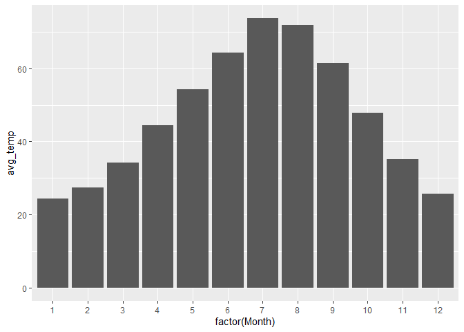

``` r
ggplot(rapidcity_summary) + 
  geom_col(aes(x=factor(Month), y=prop_freeze))
```

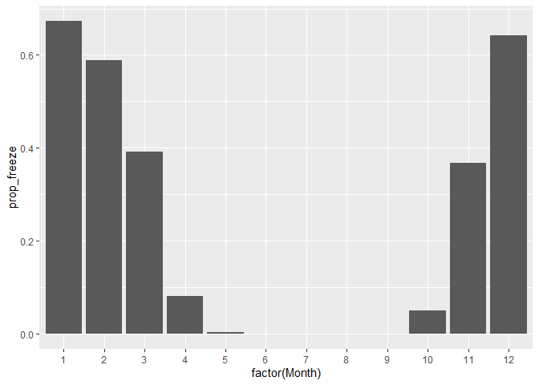

``` r
# Filter data by year before computing summary statistics 
rapidcity %>%
  filter(Year >= 2006 & Year <= 2009) %>%
  group_by(Month) %>%
  summarize(avg_temp = mean(Temp),
            sd_temp = sd(Temp)) %>%
  round(1)
```

    ## # A tibble: 12 x 3
    ##    Month avg_temp sd_temp
    ##    <dbl>    <dbl>   <dbl>
    ##  1     1     27.4    12.6
    ##  2     2     25.3    12.4
    ##  3     3     36.2    11.9
    ##  4     4     44.2    11  
    ##  5     5     56.1     8.7
    ##  6     6     65.5     8.2
    ##  7     7     75.1     7.4
    ##  8     8     71.3     6.5
    ##  9     9     60.7     8.2
    ## 10    10     45.3     9.8
    ## 11    11     37.6    10.2
    ## 12    12     22      11.9

``` r
# Using 'select' allows you to pick out certain columns

rapidcity %>%
  filter(Year == 2009) %>%
  select(Month, Day, Temp)
```

    ##     Month Day Temp
    ## 1       1   1 30.7
    ## 2       1   2 20.3
    ## 3       1   3 16.9
    ## 4       1   4  8.0
    ## 5       1   5 13.9
    ## 6       1   6 28.2
    ## 7       1   7 26.0
    ## 8       1   8 31.5
    ## 9       1   9 30.9
    ## 10      1  10 21.4
    ## 11      1  11 32.4
    ## 12      1  12 29.5
    ## 13      1  13 25.8
    ## 14      1  14 17.1
    ## 15      1  15  3.5
    ## 16      1  16 27.7
    ## 17      1  17 41.0
    ## 18      1  18 44.7
    ## 19      1  19 46.2
    ## 20      1  20 41.6
    ## 21      1  21 42.0
    ## 22      1  22 39.3
    ## 23      1  23 17.7
    ## 24      1  24  1.2
    ## 25      1  25  3.9
    ## 26      1  26  2.7
    ## 27      1  27 -3.9
    ## 28      1  28 22.4
    ## 29      1  29 28.5
    ## 30      1  30 41.8
    ## 31      1  31 38.8
    ## 32      2   1 29.8
    ## 33      2   2 24.4
    ## 34      2   3 23.4
    ## 35      2   4 33.8
    ## 36      2   5 42.6
    ## 37      2   6 44.0
    ## 38      2   7 40.3
    ## 39      2   8 32.6
    ## 40      2   9 35.1
    ## 41      2  10 38.5
    ## 42      2  11 30.7
    ## 43      2  12 28.4
    ## 44      2  13 22.6
    ## 45      2  14 19.7
    ## 46      2  15 24.3
    ## 47      2  16 26.6
    ## 48      2  17 30.7
    ## 49      2  18 22.2
    ## 50      2  19 27.0
    ## 51      2  20 30.1
    ## 52      2  21 18.7
    ## 53      2  22 22.7
    ## 54      2  23 29.6
    ## 55      2  24 39.8
    ## 56      2  25 38.4
    ## 57      2  26 17.0
    ## 58      2  27  5.8
    ## 59      2  28  7.3
    ## 60      3   1 10.4
    ## 61      3   2 28.1
    ## 62      3   3 36.4
    ## 63      3   4 43.2
    ## 64      3   5 40.3
    ## 65      3   6 26.9
    ## 66      3   7 24.7
    ## 67      3   8 31.4
    ## 68      3   9 20.0
    ## 69      3  10  1.9
    ## 70      3  11 -1.3
    ## 71      3  12  9.5
    ## 72      3  13 25.3
    ## 73      3  14 39.8
    ## 74      3  15 43.6
    ## 75      3  16 46.8
    ## 76      3  17 43.7
    ## 77      3  18 43.0
    ## 78      3  19 41.0
    ## 79      3  20 50.6
    ## 80      3  21 51.9
    ## 81      3  22 60.4
    ## 82      3  23 41.8
    ## 83      3  24 24.0
    ## 84      3  25 31.7
    ## 85      3  26 24.6
    ## 86      3  27 21.9
    ## 87      3  28 32.0
    ## 88      3  29 35.9
    ## 89      3  30 31.0
    ## 90      3  31 23.4
    ## 91      4   1 21.1
    ## 92      4   2 28.4
    ## 93      4   3 31.4
    ## 94      4   4 26.3
    ## 95      4   5 24.1
    ## 96      4   6 20.3
    ## 97      4   7 29.9
    ## 98      4   8 34.6
    ## 99      4  10 32.2
    ## 100     4  11 40.1
    ## 101     4  12 43.0
    ## 102     4  13 48.4
    ## 103     4  14 51.5
    ## 104     4  15 53.3
    ## 105     4  16 40.4
    ## 106     4  17 40.4
    ## 107     4  18 43.6
    ## 108     4  19 47.5
    ## 109     4  20 49.3
    ## 110     4  21 55.3
    ## 111     4  22 61.0
    ## 112     4  23 65.0
    ## 113     4  24 41.8
    ## 114     4  25 34.4
    ## 115     4  26 34.2
    ## 116     4  27 36.2
    ## 117     4  28 39.3
    ## 118     4  29 52.7
    ## 119     4  30 44.5
    ## 120     5   1 42.1
    ## 121     5   2 43.9
    ## 122     5   3 49.7
    ## 123     5   4 52.4
    ## 124     5   5 51.5
    ## 125     5   6 56.9
    ## 126     5   7 53.6
    ## 127     5   8 49.2
    ## 128     5   9 44.3
    ## 129     5  10 45.7
    ## 130     5  11 51.9
    ## 131     5  12 60.7
    ## 132     5  13 48.7
    ## 133     5  14 47.7
    ## 134     5  15 52.4
    ## 135     5  16 44.8
    ## 136     5  17 55.2
    ## 137     5  18 66.7
    ## 138     5  19 66.0
    ## 139     5  20 70.6
    ## 140     5  21 54.7
    ## 141     5  22 55.7
    ## 142     5  23 54.5
    ## 143     5  24 57.3
    ## 144     5  25 60.9
    ## 145     5  26 54.4
    ## 146     5  27 53.5
    ## 147     5  28 64.5
    ## 148     5  29 64.0
    ## 149     5  30 65.0
    ## 150     5  31 69.8
    ## 151     6   1 60.8
    ## 152     6   2 52.5
    ## 153     6   3 47.2
    ## 154     6   4 51.2
    ## 155     6   5 56.3
    ## 156     6   6 45.4
    ## 157     6   7 45.0
    ## 158     6   8 46.4
    ## 159     6   9 50.8
    ## 160     6  10 49.8
    ## 161     6  11 49.7
    ## 162     6  12 54.5
    ## 163     6  13 57.8
    ## 164     6  14 62.1
    ## 165     6  15 63.6
    ## 166     6  16 62.6
    ## 167     6  17 63.2
    ## 168     6  18 63.1
    ## 169     6  19 64.8
    ## 170     6  20 64.0
    ## 171     6  21 70.2
    ## 172     6  22 69.5
    ## 173     6  23 68.1
    ## 174     6  24 70.2
    ## 175     6  25 72.7
    ## 176     6  26 74.1
    ## 177     6  27 63.6
    ## 178     6  28 66.1
    ## 179     6  29 70.3
    ## 180     6  30 67.3
    ## 181     7   1 68.6
    ## 182     7   2 70.8
    ## 183     7   3 64.1
    ## 184     7   4 64.0
    ## 185     7   5 65.2
    ## 186     7   6 69.7
    ## 187     7   7 71.8
    ## 188     7   8 67.4
    ## 189     7   9 69.2
    ## 190     7  10 67.9
    ## 191     7  11 67.2
    ## 192     7  12 73.3
    ## 193     7  13 73.0
    ## 194     7  14 69.6
    ## 195     7  15 65.1
    ## 196     7  16 65.2
    ## 197     7  17 63.5
    ## 198     7  18 65.7
    ## 199     7  19 71.2
    ## 200     7  20 73.1
    ## 201     7  21 64.8
    ## 202     7  22 69.5
    ## 203     7  23 73.3
    ## 204     7  24 74.1
    ## 205     7  25 71.3
    ## 206     7  26 75.2
    ## 207     7  27 72.2
    ## 208     7  28 66.2
    ## 209     7  29 61.3
    ## 210     7  30 59.1
    ## 211     7  31 61.2
    ## 212     8   1 62.1
    ## 213     8   2 76.9
    ## 214     8   3 74.3
    ## 215     8   4 68.0
    ## 216     8   5 67.7
    ## 217     8   6 70.7
    ## 218     8   7 73.0
    ## 219     8   8 67.8
    ## 220     8   9 60.0
    ## 221     8  10 65.0
    ## 222     8  11 72.0
    ## 223     8  12 74.9
    ## 224     8  13 75.5
    ## 225     8  14 71.7
    ## 226     8  15 65.3
    ## 227     8  16 58.0
    ## 228     8  17 61.2
    ## 229     8  18 62.7
    ## 230     8  19 64.6
    ## 231     8  20 60.4
    ## 232     8  21 60.8
    ## 233     8  22 66.1
    ## 234     8  23 77.1
    ## 235     8  24 78.4
    ## 236     8  25 68.2
    ## 237     8  26 68.3
    ## 238     8  27 70.9
    ## 239     8  28 69.1
    ## 240     8  29 60.6
    ## 241     8  30 62.3
    ## 242     8  31 65.5
    ## 243     9   1 67.7
    ## 244     9   2 69.9
    ## 245     9   3 63.7
    ## 246     9   4 64.3
    ## 247     9   5 70.3
    ## 248     9   6 70.8
    ## 249     9   7 72.2
    ## 250     9   8 65.1
    ## 251     9   9 59.0
    ## 252     9  10 68.9
    ## 253     9  11 67.2
    ## 254     9  12 54.1
    ## 255     9  13 57.1
    ## 256     9  14 70.1
    ## 257     9  15 70.8
    ## 258     9  16 68.4
    ## 259     9  17 65.3
    ## 260     9  18 66.6
    ## 261     9  19 67.9
    ## 262     9  20 64.4
    ## 263     9  21 53.2
    ## 264     9  22 53.2
    ## 265     9  23 54.8
    ## 266     9  24 55.8
    ## 267     9  25 54.1
    ## 268     9  26 60.0
    ## 269     9  27 58.6
    ## 270     9  28 48.5
    ## 271     9  29 51.7
    ## 272     9  30 61.8
    ## 273    10   1 45.5
    ## 274    10   2 46.7
    ## 275    10   3 37.8
    ## 276    10   4 40.0
    ## 277    10   5 38.7
    ## 278    10   6 39.3
    ## 279    10   7 41.3
    ## 280    10   8 34.6
    ## 281    10   9 29.2
    ## 282    10  10 19.7
    ## 283    10  11 21.9
    ## 284    10  12 25.3
    ## 285    10  13 30.9
    ## 286    10  14 38.1
    ## 287    10  15 39.1
    ## 288    10  16 43.7
    ## 289    10  17 41.8
    ## 290    10  18 57.7
    ## 291    10  19 48.8
    ## 292    10  20 40.1
    ## 293    10  21 37.5
    ## 294    10  22 38.1
    ## 295    10  23 42.4
    ## 296    10  24 46.5
    ## 297    10  25 41.2
    ## 298    10  26 37.5
    ## 299    10  27 45.1
    ## 300    10  28 37.0
    ## 301    10  29 31.3
    ## 302    10  30 32.0
    ## 303    10  31 49.6
    ## 304    11   1 49.8
    ## 305    11   2 43.8
    ## 306    11   3 42.4
    ## 307    11   4 38.8
    ## 308    11   5 43.9
    ## 309    11   6 55.2
    ## 310    11   7 48.0
    ## 311    11   8 45.1
    ## 312    11   9 39.4
    ## 313    11  10 41.1
    ## 314    11  11 43.7
    ## 315    11  12 48.7
    ## 316    11  13 36.4
    ## 317    11  14 30.7
    ## 318    11  15 32.0
    ## 319    11  16 28.5
    ## 320    11  17 39.4
    ## 321    11  18 45.3
    ## 322    11  19 43.3
    ## 323    11  20 34.8
    ## 324    11  21 44.5
    ## 325    11  22 40.9
    ## 326    11  23 35.3
    ## 327    11  24 33.4
    ## 328    11  25 35.2
    ## 329    11  26 36.4
    ## 330    11  27 47.2
    ## 331    11  28 38.5
    ## 332    11  29 31.5
    ## 333    11  30 37.8
    ## 334    12   1 35.6
    ## 335    12   2 23.4
    ## 336    12   3 14.8
    ## 337    12   4 12.5
    ## 338    12   5 23.1
    ## 339    12   6 11.4
    ## 340    12   7  5.6
    ## 341    12   8  5.8
    ## 342    12   9 -2.6
    ## 343    12  10  6.0
    ## 344    12  11 10.0
    ## 345    12  12 19.6
    ## 346    12  13  5.3
    ## 347    12  14 -1.5
    ## 348    12  15 -1.2
    ## 349    12  16 21.6
    ## 350    12  17 33.2
    ## 351    12  18 34.7
    ## 352    12  19 25.9
    ## 353    12  20 33.6
    ## 354    12  21 28.8
    ## 355    12  22 24.2
    ## 356    12  23 20.8
    ## 357    12  24  6.2
    ## 358    12  25  5.7
    ## 359    12  26 15.8
    ## 360    12  27 23.8
    ## 361    12  28 17.3
    ## 362    12  29 13.3
    ## 363    12  30 21.9
    ## 364    12  31 14.0

``` r
#Alternatively, using a  negative sign will remove certain columns.
# Below achieves same result as above
rapidcity %>%
  filter(Year == 2009) %>%
  select(-Year,-z)
```

    ##     Month Day Temp
    ## 1       1   1 30.7
    ## 2       1   2 20.3
    ## 3       1   3 16.9
    ## 4       1   4  8.0
    ## 5       1   5 13.9
    ## 6       1   6 28.2
    ## 7       1   7 26.0
    ## 8       1   8 31.5
    ## 9       1   9 30.9
    ## 10      1  10 21.4
    ## 11      1  11 32.4
    ## 12      1  12 29.5
    ## 13      1  13 25.8
    ## 14      1  14 17.1
    ## 15      1  15  3.5
    ## 16      1  16 27.7
    ## 17      1  17 41.0
    ## 18      1  18 44.7
    ## 19      1  19 46.2
    ## 20      1  20 41.6
    ## 21      1  21 42.0
    ## 22      1  22 39.3
    ## 23      1  23 17.7
    ## 24      1  24  1.2
    ## 25      1  25  3.9
    ## 26      1  26  2.7
    ## 27      1  27 -3.9
    ## 28      1  28 22.4
    ## 29      1  29 28.5
    ## 30      1  30 41.8
    ## 31      1  31 38.8
    ## 32      2   1 29.8
    ## 33      2   2 24.4
    ## 34      2   3 23.4
    ## 35      2   4 33.8
    ## 36      2   5 42.6
    ## 37      2   6 44.0
    ## 38      2   7 40.3
    ## 39      2   8 32.6
    ## 40      2   9 35.1
    ## 41      2  10 38.5
    ## 42      2  11 30.7
    ## 43      2  12 28.4
    ## 44      2  13 22.6
    ## 45      2  14 19.7
    ## 46      2  15 24.3
    ## 47      2  16 26.6
    ## 48      2  17 30.7
    ## 49      2  18 22.2
    ## 50      2  19 27.0
    ## 51      2  20 30.1
    ## 52      2  21 18.7
    ## 53      2  22 22.7
    ## 54      2  23 29.6
    ## 55      2  24 39.8
    ## 56      2  25 38.4
    ## 57      2  26 17.0
    ## 58      2  27  5.8
    ## 59      2  28  7.3
    ## 60      3   1 10.4
    ## 61      3   2 28.1
    ## 62      3   3 36.4
    ## 63      3   4 43.2
    ## 64      3   5 40.3
    ## 65      3   6 26.9
    ## 66      3   7 24.7
    ## 67      3   8 31.4
    ## 68      3   9 20.0
    ## 69      3  10  1.9
    ## 70      3  11 -1.3
    ## 71      3  12  9.5
    ## 72      3  13 25.3
    ## 73      3  14 39.8
    ## 74      3  15 43.6
    ## 75      3  16 46.8
    ## 76      3  17 43.7
    ## 77      3  18 43.0
    ## 78      3  19 41.0
    ## 79      3  20 50.6
    ## 80      3  21 51.9
    ## 81      3  22 60.4
    ## 82      3  23 41.8
    ## 83      3  24 24.0
    ## 84      3  25 31.7
    ## 85      3  26 24.6
    ## 86      3  27 21.9
    ## 87      3  28 32.0
    ## 88      3  29 35.9
    ## 89      3  30 31.0
    ## 90      3  31 23.4
    ## 91      4   1 21.1
    ## 92      4   2 28.4
    ## 93      4   3 31.4
    ## 94      4   4 26.3
    ## 95      4   5 24.1
    ## 96      4   6 20.3
    ## 97      4   7 29.9
    ## 98      4   8 34.6
    ## 99      4  10 32.2
    ## 100     4  11 40.1
    ## 101     4  12 43.0
    ## 102     4  13 48.4
    ## 103     4  14 51.5
    ## 104     4  15 53.3
    ## 105     4  16 40.4
    ## 106     4  17 40.4
    ## 107     4  18 43.6
    ## 108     4  19 47.5
    ## 109     4  20 49.3
    ## 110     4  21 55.3
    ## 111     4  22 61.0
    ## 112     4  23 65.0
    ## 113     4  24 41.8
    ## 114     4  25 34.4
    ## 115     4  26 34.2
    ## 116     4  27 36.2
    ## 117     4  28 39.3
    ## 118     4  29 52.7
    ## 119     4  30 44.5
    ## 120     5   1 42.1
    ## 121     5   2 43.9
    ## 122     5   3 49.7
    ## 123     5   4 52.4
    ## 124     5   5 51.5
    ## 125     5   6 56.9
    ## 126     5   7 53.6
    ## 127     5   8 49.2
    ## 128     5   9 44.3
    ## 129     5  10 45.7
    ## 130     5  11 51.9
    ## 131     5  12 60.7
    ## 132     5  13 48.7
    ## 133     5  14 47.7
    ## 134     5  15 52.4
    ## 135     5  16 44.8
    ## 136     5  17 55.2
    ## 137     5  18 66.7
    ## 138     5  19 66.0
    ## 139     5  20 70.6
    ## 140     5  21 54.7
    ## 141     5  22 55.7
    ## 142     5  23 54.5
    ## 143     5  24 57.3
    ## 144     5  25 60.9
    ## 145     5  26 54.4
    ## 146     5  27 53.5
    ## 147     5  28 64.5
    ## 148     5  29 64.0
    ## 149     5  30 65.0
    ## 150     5  31 69.8
    ## 151     6   1 60.8
    ## 152     6   2 52.5
    ## 153     6   3 47.2
    ## 154     6   4 51.2
    ## 155     6   5 56.3
    ## 156     6   6 45.4
    ## 157     6   7 45.0
    ## 158     6   8 46.4
    ## 159     6   9 50.8
    ## 160     6  10 49.8
    ## 161     6  11 49.7
    ## 162     6  12 54.5
    ## 163     6  13 57.8
    ## 164     6  14 62.1
    ## 165     6  15 63.6
    ## 166     6  16 62.6
    ## 167     6  17 63.2
    ## 168     6  18 63.1
    ## 169     6  19 64.8
    ## 170     6  20 64.0
    ## 171     6  21 70.2
    ## 172     6  22 69.5
    ## 173     6  23 68.1
    ## 174     6  24 70.2
    ## 175     6  25 72.7
    ## 176     6  26 74.1
    ## 177     6  27 63.6
    ## 178     6  28 66.1
    ## 179     6  29 70.3
    ## 180     6  30 67.3
    ## 181     7   1 68.6
    ## 182     7   2 70.8
    ## 183     7   3 64.1
    ## 184     7   4 64.0
    ## 185     7   5 65.2
    ## 186     7   6 69.7
    ## 187     7   7 71.8
    ## 188     7   8 67.4
    ## 189     7   9 69.2
    ## 190     7  10 67.9
    ## 191     7  11 67.2
    ## 192     7  12 73.3
    ## 193     7  13 73.0
    ## 194     7  14 69.6
    ## 195     7  15 65.1
    ## 196     7  16 65.2
    ## 197     7  17 63.5
    ## 198     7  18 65.7
    ## 199     7  19 71.2
    ## 200     7  20 73.1
    ## 201     7  21 64.8
    ## 202     7  22 69.5
    ## 203     7  23 73.3
    ## 204     7  24 74.1
    ## 205     7  25 71.3
    ## 206     7  26 75.2
    ## 207     7  27 72.2
    ## 208     7  28 66.2
    ## 209     7  29 61.3
    ## 210     7  30 59.1
    ## 211     7  31 61.2
    ## 212     8   1 62.1
    ## 213     8   2 76.9
    ## 214     8   3 74.3
    ## 215     8   4 68.0
    ## 216     8   5 67.7
    ## 217     8   6 70.7
    ## 218     8   7 73.0
    ## 219     8   8 67.8
    ## 220     8   9 60.0
    ## 221     8  10 65.0
    ## 222     8  11 72.0
    ## 223     8  12 74.9
    ## 224     8  13 75.5
    ## 225     8  14 71.7
    ## 226     8  15 65.3
    ## 227     8  16 58.0
    ## 228     8  17 61.2
    ## 229     8  18 62.7
    ## 230     8  19 64.6
    ## 231     8  20 60.4
    ## 232     8  21 60.8
    ## 233     8  22 66.1
    ## 234     8  23 77.1
    ## 235     8  24 78.4
    ## 236     8  25 68.2
    ## 237     8  26 68.3
    ## 238     8  27 70.9
    ## 239     8  28 69.1
    ## 240     8  29 60.6
    ## 241     8  30 62.3
    ## 242     8  31 65.5
    ## 243     9   1 67.7
    ## 244     9   2 69.9
    ## 245     9   3 63.7
    ## 246     9   4 64.3
    ## 247     9   5 70.3
    ## 248     9   6 70.8
    ## 249     9   7 72.2
    ## 250     9   8 65.1
    ## 251     9   9 59.0
    ## 252     9  10 68.9
    ## 253     9  11 67.2
    ## 254     9  12 54.1
    ## 255     9  13 57.1
    ## 256     9  14 70.1
    ## 257     9  15 70.8
    ## 258     9  16 68.4
    ## 259     9  17 65.3
    ## 260     9  18 66.6
    ## 261     9  19 67.9
    ## 262     9  20 64.4
    ## 263     9  21 53.2
    ## 264     9  22 53.2
    ## 265     9  23 54.8
    ## 266     9  24 55.8
    ## 267     9  25 54.1
    ## 268     9  26 60.0
    ## 269     9  27 58.6
    ## 270     9  28 48.5
    ## 271     9  29 51.7
    ## 272     9  30 61.8
    ## 273    10   1 45.5
    ## 274    10   2 46.7
    ## 275    10   3 37.8
    ## 276    10   4 40.0
    ## 277    10   5 38.7
    ## 278    10   6 39.3
    ## 279    10   7 41.3
    ## 280    10   8 34.6
    ## 281    10   9 29.2
    ## 282    10  10 19.7
    ## 283    10  11 21.9
    ## 284    10  12 25.3
    ## 285    10  13 30.9
    ## 286    10  14 38.1
    ## 287    10  15 39.1
    ## 288    10  16 43.7
    ## 289    10  17 41.8
    ## 290    10  18 57.7
    ## 291    10  19 48.8
    ## 292    10  20 40.1
    ## 293    10  21 37.5
    ## 294    10  22 38.1
    ## 295    10  23 42.4
    ## 296    10  24 46.5
    ## 297    10  25 41.2
    ## 298    10  26 37.5
    ## 299    10  27 45.1
    ## 300    10  28 37.0
    ## 301    10  29 31.3
    ## 302    10  30 32.0
    ## 303    10  31 49.6
    ## 304    11   1 49.8
    ## 305    11   2 43.8
    ## 306    11   3 42.4
    ## 307    11   4 38.8
    ## 308    11   5 43.9
    ## 309    11   6 55.2
    ## 310    11   7 48.0
    ## 311    11   8 45.1
    ## 312    11   9 39.4
    ## 313    11  10 41.1
    ## 314    11  11 43.7
    ## 315    11  12 48.7
    ## 316    11  13 36.4
    ## 317    11  14 30.7
    ## 318    11  15 32.0
    ## 319    11  16 28.5
    ## 320    11  17 39.4
    ## 321    11  18 45.3
    ## 322    11  19 43.3
    ## 323    11  20 34.8
    ## 324    11  21 44.5
    ## 325    11  22 40.9
    ## 326    11  23 35.3
    ## 327    11  24 33.4
    ## 328    11  25 35.2
    ## 329    11  26 36.4
    ## 330    11  27 47.2
    ## 331    11  28 38.5
    ## 332    11  29 31.5
    ## 333    11  30 37.8
    ## 334    12   1 35.6
    ## 335    12   2 23.4
    ## 336    12   3 14.8
    ## 337    12   4 12.5
    ## 338    12   5 23.1
    ## 339    12   6 11.4
    ## 340    12   7  5.6
    ## 341    12   8  5.8
    ## 342    12   9 -2.6
    ## 343    12  10  6.0
    ## 344    12  11 10.0
    ## 345    12  12 19.6
    ## 346    12  13  5.3
    ## 347    12  14 -1.5
    ## 348    12  15 -1.2
    ## 349    12  16 21.6
    ## 350    12  17 33.2
    ## 351    12  18 34.7
    ## 352    12  19 25.9
    ## 353    12  20 33.6
    ## 354    12  21 28.8
    ## 355    12  22 24.2
    ## 356    12  23 20.8
    ## 357    12  24  6.2
    ## 358    12  25  5.7
    ## 359    12  26 15.8
    ## 360    12  27 23.8
    ## 361    12  28 17.3
    ## 362    12  29 13.3
    ## 363    12  30 21.9
    ## 364    12  31 14.0

``` r
# Mutate allows you to add new variables from old ones
rapidcity_augmented = rapidcity %>%
  mutate(Summer = ifelse(Month == 6 | Month == 7 | Month == 8,
                         yes="summer", no="not_summer"))

rapidcity_augmented
```

    ##      Year Month Day  Temp             z     Summer
    ## 1    1995     1   1  12.6 -1.7294066178 not_summer
    ## 2    1995     1   2  19.9 -1.3653901737 not_summer
    ## 3    1995     1   3   9.2 -1.8989485232 not_summer
    ## 4    1995     1   4   6.2 -2.0485443222 not_summer
    ## 5    1995     1   5  16.0 -1.5598647123 not_summer
    ## 6    1995     1   6  17.8 -1.4701072329 not_summer
    ## 7    1995     1   7  19.8 -1.3703767003 not_summer
    ## 8    1995     1   8  24.2 -1.1509695285 not_summer
    ## 9    1995     1   9  36.3 -0.5475998062 not_summer
    ## 10   1995     1  10  45.4 -0.0938258827 not_summer
    ## 11   1995     1  11  50.9  0.1804330820 not_summer
    ## 12   1995     1  12  42.8 -0.2234755751 not_summer
    ## 13   1995     1  13  36.4 -0.5426132795 not_summer
    ## 14   1995     1  14  25.9 -1.0661985758 not_summer
    ## 15   1995     1  15  25.4 -1.0911312090 not_summer
    ## 16   1995     1  16  24.5 -1.1360099487 not_summer
    ## 17   1995     1  17  22.7 -1.2257674280 not_summer
    ## 18   1995     1  18  25.8 -1.0711851024 not_summer
    ## 19   1995     1  19  33.0 -0.7121551850 not_summer
    ## 20   1995     1  20  33.7 -0.6772494986 not_summer
    ## 21   1995     1  21  22.7 -1.2257674280 not_summer
    ## 22   1995     1  22  24.8 -1.1210503688 not_summer
    ## 23   1995     1  23  25.5 -1.0861446823 not_summer
    ## 24   1995     1  24  30.3 -0.8467914040 not_summer
    ## 25   1995     1  25  25.4 -1.0911312090 not_summer
    ## 26   1995     1  26  31.4 -0.7919396111 not_summer
    ## 27   1995     1  27  34.6 -0.6323707589 not_summer
    ## 28   1995     1  28  34.0 -0.6622899187 not_summer
    ## 29   1995     1  29  30.7 -0.8268452975 not_summer
    ## 30   1995     1  30  35.2 -0.6024515991 not_summer
    ## 31   1995     1  31  44.0 -0.1636372556 not_summer
    ## 32   1995     2   1  49.1  0.0906756026 not_summer
    ## 33   1995     2   2  42.1 -0.2583812616 not_summer
    ## 34   1995     2   3  36.9 -0.5176806464 not_summer
    ## 35   1995     2   4  38.1 -0.4578423268 not_summer
    ## 36   1995     2   5  35.3 -0.5974650725 not_summer
    ## 37   1995     2   6  30.1 -0.8567644573 not_summer
    ## 38   1995     2   7  25.9 -1.0661985758 not_summer
    ## 39   1995     2   8  26.8 -1.0213198361 not_summer
    ## 40   1995     2   9  33.3 -0.6971956051 not_summer
    ## 41   1995     2  10  26.2 -1.0512389959 not_summer
    ## 42   1995     2  11  11.5 -1.7842584107 not_summer
    ## 43   1995     2  12   7.6 -1.9787329493 not_summer
    ## 44   1995     2  13   2.7 -2.2230727543 not_summer
    ## 45   1995     2  14  13.3 -1.6945009314 not_summer
    ## 46   1995     2  15   8.2 -1.9488137895 not_summer
    ## 47   1995     2  16  23.7 -1.1759021617 not_summer
    ## 48   1995     2  17  36.9 -0.5176806464 not_summer
    ## 49   1995     2  18  46.9 -0.0190279833 not_summer
    ## 50   1995     2  19  41.9 -0.2683543148 not_summer
    ## 51   1995     2  20  49.6  0.1156082358 not_summer
    ## 52   1995     2  21  52.0  0.2352848749 not_summer
    ## 53   1995     2  22  48.9  0.0807025494 not_summer
    ## 54   1995     2  23  38.0 -0.4628288534 not_summer
    ## 55   1995     2  24  43.3 -0.1985429420 not_summer
    ## 56   1995     2  25  54.0  0.3350154076 not_summer
    ## 57   1995     2  26  38.1 -0.4578423268 not_summer
    ## 58   1995     2  27  20.9 -1.3155249074 not_summer
    ## 59   1995     2  28   8.7 -1.9238811564 not_summer
    ## 60   1995     3   1   3.7 -2.1732074880 not_summer
    ## 61   1995     3   2   9.0 -1.9089215765 not_summer
    ## 62   1995     3   3  20.2 -1.3504305938 not_summer
    ## 63   1995     3   4  14.0 -1.6595952449 not_summer
    ## 64   1995     3   5   1.3 -2.2928841271 not_summer
    ## 65   1995     3   6  -1.8 -2.4474664527 not_summer
    ## 66   1995     3   7  -2.1 -2.4624260326 not_summer
    ## 67   1995     3   8   4.8 -2.1183556950 not_summer
    ## 68   1995     3   9  27.5 -0.9864141497 not_summer
    ## 69   1995     3  10  49.7  0.1205947624 not_summer
    ## 70   1995     3  11  55.9  0.4297594136 not_summer
    ## 71   1995     3  12  52.9  0.2801636146 not_summer
    ## 72   1995     3  13  49.8  0.1255812890 not_summer
    ## 73   1995     3  14  49.9  0.1305678157 not_summer
    ## 74   1995     3  15  50.1  0.1405408689 not_summer
    ## 75   1995     3  16  52.4  0.2552309815 not_summer
    ## 76   1995     3  17  37.7 -0.4777884333 not_summer
    ## 77   1995     3  18  40.5 -0.3381656877 not_summer
    ## 78   1995     3  19  52.1  0.2402714016 not_summer
    ## 79   1995     3  20  42.9 -0.2184890485 not_summer
    ## 80   1995     3  21  47.0 -0.0140414566 not_summer
    ## 81   1995     3  22  47.8  0.0258507564 not_summer
    ## 82   1995     3  23  45.5 -0.0888393561 not_summer
    ## 83   1995     3  24  48.8  0.0757160227 not_summer
    ## 84   1995     3  25  44.4 -0.1436911490 not_summer
    ## 85   1995     3  26  34.6 -0.6323707589 not_summer
    ## 86   1995     3  27  31.5 -0.7869530845 not_summer
    ## 87   1995     3  28  29.0 -0.9116162502 not_summer
    ## 88   1995     3  29  25.6 -1.0811581557 not_summer
    ## 89   1995     3  30  28.3 -0.9465219367 not_summer
    ## 90   1995     3  31  33.6 -0.6822360252 not_summer
    ## 91   1995     4   1  46.8 -0.0240145099 not_summer
    ## 92   1995     4   2  50.8  0.1754465554 not_summer
    ## 93   1995     4   3  45.1 -0.1087854626 not_summer
    ## 94   1995     4   4  34.4 -0.6423438122 not_summer
    ## 95   1995     4   5  47.2 -0.0040684034 not_summer
    ## 96   1995     4   6  49.3  0.1006486559 not_summer
    ## 97   1995     4   7  49.2  0.0956621293 not_summer
    ## 98   1995     4   8  40.4 -0.3431522143 not_summer
    ## 99   1995     4   9  28.3 -0.9465219367 not_summer
    ## 100  1995     4  10  24.6 -1.1310234220 not_summer
    ## 101  1995     4  11  24.4 -1.1409964753 not_summer
    ## 102  1995     4  12  36.3 -0.5475998062 not_summer
    ## 103  1995     4  13  44.2 -0.1536642023 not_summer
    ## 104  1995     4  14  40.4 -0.3431522143 not_summer
    ## 105  1995     4  15  44.3 -0.1486776757 not_summer
    ## 106  1995     4  16  43.6 -0.1835833621 not_summer
    ## 107  1995     4  17  39.7 -0.3780579007 not_summer
    ## 108  1995     4  18  35.1 -0.6074381257 not_summer
    ## 109  1995     4  19  35.5 -0.5874920192 not_summer
    ## 110  1995     4  20  35.4 -0.5924785459 not_summer
    ## 111  1995     4  21  37.6 -0.4827749600 not_summer
    ## 112  1995     4  22  41.8 -0.2733408415 not_summer
    ## 113  1995     4  23  45.7 -0.0788663028 not_summer
    ## 114  1995     4  24  40.8 -0.3232061078 not_summer
    ## 115  1995     4  25  45.7 -0.0788663028 not_summer
    ## 116  1995     4  26  37.0 -0.5126941198 not_summer
    ## 117  1995     4  27  39.3 -0.3980040072 not_summer
    ## 118  1995     4  28  41.4 -0.2932869480 not_summer
    ## 119  1995     4  29  36.6 -0.5326402263 not_summer
    ## 120  1995     4  30  39.1 -0.4079770605 not_summer
    ## 121  1995     5   1  38.6 -0.4329096937 not_summer
    ## 122  1995     5   2  43.0 -0.2135025219 not_summer
    ## 123  1995     5   3  44.5 -0.1387046224 not_summer
    ## 124  1995     5   4  47.1 -0.0090549300 not_summer
    ## 125  1995     5   5  49.1  0.0906756026 not_summer
    ## 126  1995     5   6  49.8  0.1255812890 not_summer
    ## 127  1995     5   7  52.9  0.2801636146 not_summer
    ## 128  1995     5   8  53.1  0.2901366679 not_summer
    ## 129  1995     5   9  45.3 -0.0988124094 not_summer
    ## 130  1995     5  10  52.2  0.2452579282 not_summer
    ## 131  1995     5  11  56.7  0.4696516266 not_summer
    ## 132  1995     5  12  59.2  0.5943147924 not_summer
    ## 133  1995     5  13  44.7 -0.1287315691 not_summer
    ## 134  1995     5  14  45.2 -0.1037989360 not_summer
    ## 135  1995     5  15  58.7  0.5693821592 not_summer
    ## 136  1995     5  16  59.0  0.5843417391 not_summer
    ## 137  1995     5  17  49.0  0.0856890760 not_summer
    ## 138  1995     5  18  53.3  0.3001097211 not_summer
    ## 139  1995     5  19  58.6  0.5643956326 not_summer
    ## 140  1995     5  20  52.8  0.2751770880 not_summer
    ## 141  1995     5  21  57.3  0.4995707864 not_summer
    ## 142  1995     5  22  50.1  0.1405408689 not_summer
    ## 143  1995     5  23  47.8  0.0258507564 not_summer
    ## 144  1995     5  24  48.4  0.0557699162 not_summer
    ## 145  1995     5  25  50.4  0.1555004488 not_summer
    ## 146  1995     5  26  52.6  0.2652040347 not_summer
    ## 147  1995     5  27  52.3  0.2502444548 not_summer
    ## 148  1995     5  28  52.4  0.2552309815 not_summer
    ## 149  1995     5  29  55.5  0.4098133070 not_summer
    ## 150  1995     5  30  59.4  0.6042878456 not_summer
    ## 151  1995     5  31  58.1  0.5394629994 not_summer
    ## 152  1995     6   1  65.2  0.8935063903     summer
    ## 153  1995     6   2  66.6  0.9633177631     summer
    ## 154  1995     6   3  64.1  0.8386545973     summer
    ## 155  1995     6   4  61.8  0.7239644848     summer
    ## 156  1995     6   5  63.5  0.8087354375     summer
    ## 157  1995     6   6  66.8  0.9732908164     summer
    ## 158  1995     6   7  58.4  0.5544225793     summer
    ## 159  1995     6   8  44.5 -0.1387046224     summer
    ## 160  1995     6   9  43.3 -0.1985429420     summer
    ## 161  1995     6  10  46.9 -0.0190279833     summer
    ## 162  1995     6  11  55.0  0.3848806739     summer
    ## 163  1995     6  12  61.1  0.6890587984     summer
    ## 164  1995     6  13  70.6  1.1627788283     summer
    ## 165  1995     6  14  72.8  1.2724824142     summer
    ## 166  1995     6  15  76.5  1.4569838996     summer
    ## 167  1995     6  16  77.1  1.4869030594     summer
    ## 168  1995     6  17  72.7  1.2674958876     summer
    ## 169  1995     6  18  70.0  1.1328596686     summer
    ## 170  1995     6  19  68.8  1.0730213490     summer
    ## 171  1995     6  20  71.1  1.1877114615     summer
    ## 172  1995     6  21  72.0  1.2325902012     summer
    ## 173  1995     6  22  63.7  0.8187084908     summer
    ## 174  1995     6  23  61.9  0.7289510114     summer
    ## 175  1995     6  24  60.8  0.6740992185     summer
    ## 176  1995     6  25  61.0  0.6840722717     summer
    ## 177  1995     6  26  62.0  0.7339375381     summer
    ## 178  1995     6  27  65.8  0.9234255500     summer
    ## 179  1995     6  28  58.8  0.5743686859     summer
    ## 180  1995     6  29  57.0  0.4846112065     summer
    ## 181  1995     6  30  52.5  0.2602175081     summer
    ## 182  1995     7   1  58.9  0.5793552125     summer
    ## 183  1995     7   2  66.1  0.9383851299     summer
    ## 184  1995     7   3  65.1  0.8885198636     summer
    ## 185  1995     7   4  64.2  0.8436411239     summer
    ## 186  1995     7   5  62.9  0.7788162777     summer
    ## 187  1995     7   6  67.1  0.9882503963     summer
    ## 188  1995     7   7  71.1  1.1877114615     summer
    ## 189  1995     7   8  75.4  1.4021321066     summer
    ## 190  1995     7   9  75.9  1.4270647398     summer
    ## 191  1995     7  10  79.1  1.5866335920     summer
    ## 192  1995     7  11  79.6  1.6115662252     summer
    ## 193  1995     7  12  79.6  1.6115662252     summer
    ## 194  1995     7  13  77.6  1.5118356925     summer
    ## 195  1995     7  14  67.1  0.9882503963     summer
    ## 196  1995     7  15  68.8  1.0730213490     summer
    ## 197  1995     7  16  65.8  0.9234255500     summer
    ## 198  1995     7  17  66.8  0.9732908164     summer
    ## 199  1995     7  18  69.1  1.0879809289     summer
    ## 200  1995     7  19  66.3  0.9483581832     summer
    ## 201  1995     7  20  66.0  0.9333986033     summer
    ## 202  1995     7  21  69.8  1.1228866153     summer
    ## 203  1995     7  22  64.4  0.8536141772     summer
    ## 204  1995     7  23  66.3  0.9483581832     summer
    ## 205  1995     7  24  71.9  1.2276036746     summer
    ## 206  1995     7  25  68.0  1.0331291359     summer
    ## 207  1995     7  26  73.5  1.3073881007     summer
    ## 208  1995     7  27  77.2  1.4918895860     summer
    ## 209  1995     7  28  72.8  1.2724824142     summer
    ## 210  1995     7  29  79.3  1.5966066453     summer
    ## 211  1995     7  30  78.3  1.5467413789     summer
    ## 212  1995     7  31  62.5  0.7588701712     summer
    ## 213  1995     8   1  63.6  0.8137219642     summer
    ## 214  1995     8   2  74.0  1.3323207338     summer
    ## 215  1995     8   3  69.7  1.1179000887     summer
    ## 216  1995     8   4  69.1  1.0879809289     summer
    ## 217  1995     8   5  70.6  1.1627788283     summer
    ## 218  1995     8   6  75.7  1.4170916865     summer
    ## 219  1995     8   7  80.2  1.6414853849     summer
    ## 220  1995     8   8  78.7  1.5666874855     summer
    ## 221  1995     8   9  66.7  0.9683042897     summer
    ## 222  1995     8  10  72.6  1.2625093610     summer
    ## 223  1995     8  11  79.9  1.6265258050     summer
    ## 224  1995     8  12  79.5  1.6065796985     summer
    ## 225  1995     8  13  71.0  1.1827249349     summer
    ## 226  1995     8  14  63.6  0.8137219642     summer
    ## 227  1995     8  15  73.3  1.2974150474     summer
    ## 228  1995     8  16  80.5  1.6564449648     summer
    ## 229  1995     8  17  85.0  1.8808386632     summer
    ## 230  1995     8  18  72.5  1.2575228343     summer
    ## 231  1995     8  19  58.6  0.5643956326     summer
    ## 232  1995     8  20  69.7  1.1179000887     summer
    ## 233  1995     8  21  74.7  1.3672264202     summer
    ## 234  1995     8  22  77.1  1.4869030594     summer
    ## 235  1995     8  23  79.3  1.5966066453     summer
    ## 236  1995     8  24  80.9  1.6763910714     summer
    ## 237  1995     8  25  73.1  1.2874419941     summer
    ## 238  1995     8  26  69.8  1.1228866153     summer
    ## 239  1995     8  27  74.0  1.3323207338     summer
    ## 240  1995     8  28  70.5  1.1577923017     summer
    ## 241  1995     8  29  74.0  1.3323207338     summer
    ## 242  1995     8  30  73.8  1.3223476805     summer
    ## 243  1995     8  31  65.0  0.8835333370     summer
    ## 244  1995     9   1  72.4  1.2525363077 not_summer
    ## 245  1995     9   2  79.3  1.5966066453 not_summer
    ## 246  1995     9   3  74.7  1.3672264202 not_summer
    ## 247  1995     9   4  77.1  1.4869030594 not_summer
    ## 248  1995     9   5  75.0  1.3821860001 not_summer
    ## 249  1995     9   6  68.1  1.0381156626 not_summer
    ## 250  1995     9   7  53.5  0.3100827744 not_summer
    ## 251  1995     9   8  52.5  0.2602175081 not_summer
    ## 252  1995     9   9  61.1  0.6890587984 not_summer
    ## 253  1995     9  10  65.3  0.8984929169 not_summer
    ## 254  1995     9  11  67.4  1.0032099761 not_summer
    ## 255  1995     9  12  67.9  1.0281426093 not_summer
    ## 256  1995     9  13  68.6  1.0630482957 not_summer
    ## 257  1995     9  14  60.9  0.6790857451 not_summer
    ## 258  1995     9  15  71.4  1.2026710414 not_summer
    ## 259  1995     9  16  65.1  0.8885198636 not_summer
    ## 260  1995     9  17  56.2  0.4447189934 not_summer
    ## 261  1995     9  18  56.0  0.4347459402 not_summer
    ## 262  1995     9  19  43.5 -0.1885698887 not_summer
    ## 263  1995     9  20  38.8 -0.4229366404 not_summer
    ## 264  1995     9  21  35.2 -0.6024515991 not_summer
    ## 265  1995     9  22  36.7 -0.5276536996 not_summer
    ## 266  1995     9  23  53.4  0.3050962478 not_summer
    ## 267  1995     9  24  49.3  0.1006486559 not_summer
    ## 268  1995     9  25  51.9  0.2302983483 not_summer
    ## 269  1995     9  26  54.0  0.3350154076 not_summer
    ## 270  1995     9  27  59.6  0.6142608989 not_summer
    ## 271  1995     9  28  64.3  0.8486276506 not_summer
    ## 272  1995     9  29  65.4  0.9034794435 not_summer
    ## 273  1995     9  30  60.3  0.6491665853 not_summer
    ## 274  1995    10   1  54.0  0.3350154076 not_summer
    ## 275  1995    10   2  51.2  0.1953926619 not_summer
    ## 276  1995    10   3  49.4  0.1056351825 not_summer
    ## 277  1995    10   4  49.1  0.0906756026 not_summer
    ## 278  1995    10   5  42.1 -0.2583812616 not_summer
    ## 279  1995    10   6  45.2 -0.1037989360 not_summer
    ## 280  1995    10   7  40.6 -0.3331791610 not_summer
    ## 281  1995    10   8  50.5  0.1604869755 not_summer
    ## 282  1995    10   9  49.8  0.1255812890 not_summer
    ## 283  1995    10  10  47.9  0.0308372831 not_summer
    ## 284  1995    10  11  61.0  0.6840722717 not_summer
    ## 285  1995    10  12  65.8  0.9234255500 not_summer
    ## 286  1995    10  13  48.8  0.0757160227 not_summer
    ## 287  1995    10  14  44.9 -0.1187585159 not_summer
    ## 288  1995    10  15  55.8  0.4247728869 not_summer
    ## 289  1995    10  16  55.9  0.4297594136 not_summer
    ## 290  1995    10  17  57.4  0.5045573130 not_summer
    ## 291  1995    10  18  51.6  0.2153387684 not_summer
    ## 292  1995    10  19  46.0 -0.0639067229 not_summer
    ## 293  1995    10  20  41.6 -0.2833138947 not_summer
    ## 294  1995    10  21  41.7 -0.2783273681 not_summer
    ## 295  1995    10  22  40.6 -0.3331791610 not_summer
    ## 296  1995    10  23  34.3 -0.6473303388 not_summer
    ## 297  1995    10  24  35.0 -0.6124246524 not_summer
    ## 298  1995    10  25  43.0 -0.2135025219 not_summer
    ## 299  1995    10  26  43.5 -0.1885698887 not_summer
    ## 300  1995    10  27  45.4 -0.0938258827 not_summer
    ## 301  1995    10  28  37.5 -0.4877614866 not_summer
    ## 302  1995    10  29  37.7 -0.4777884333 not_summer
    ## 303  1995    10  30  32.4 -0.7420743448 not_summer
    ## 304  1995    10  31  29.4 -0.8916701437 not_summer
    ## 305  1995    11   1  25.7 -1.0761716291 not_summer
    ## 306  1995    11   2  13.7 -1.6745548248 not_summer
    ## 307  1995    11   3   8.5 -1.9338542097 not_summer
    ## 308  1995    11   4  18.4 -1.4401880732 not_summer
    ## 309  1995    11   5  31.2 -0.8019126644 not_summer
    ## 310  1995    11   6  36.7 -0.5276536996 not_summer
    ## 311  1995    11   7  26.1 -1.0562255226 not_summer
    ## 312  1995    11   8  28.0 -0.9614815166 not_summer
    ## 313  1995    11   9  43.4 -0.1935564154 not_summer
    ## 314  1995    11  10  23.2 -1.2008347949 not_summer
    ## 315  1995    11  11  19.4 -1.3903228068 not_summer
    ## 316  1995    11  12  44.2 -0.1536642023 not_summer
    ## 317  1995    11  13  36.9 -0.5176806464 not_summer
    ## 318  1995    11  14  41.1 -0.3082465279 not_summer
    ## 319  1995    11  15  42.8 -0.2234755751 not_summer
    ## 320  1995    11  16  43.5 -0.1885698887 not_summer
    ## 321  1995    11  17  46.0 -0.0639067229 not_summer
    ## 322  1995    11  18  45.7 -0.0788663028 not_summer
    ## 323  1995    11  19  48.3  0.0507833896 not_summer
    ## 324  1995    11  20  36.2 -0.5525863328 not_summer
    ## 325  1995    11  21  28.6 -0.9315623568 not_summer
    ## 326  1995    11  22  42.6 -0.2334486284 not_summer
    ## 327  1995    11  23  32.9 -0.7171417116 not_summer
    ## 328  1995    11  24  43.4 -0.1935564154 not_summer
    ## 329  1995    11  25  43.4 -0.1935564154 not_summer
    ## 330  1995    11  26  43.3 -0.1985429420 not_summer
    ## 331  1995    11  27  21.3 -1.2955788009 not_summer
    ## 332  1995    11  28  14.3 -1.6446356650 not_summer
    ## 333  1995    11  29  27.1 -1.0063602562 not_summer
    ## 334  1995    11  30  52.0  0.2352848749 not_summer
    ## 335  1995    12   1  47.6  0.0158777032 not_summer
    ## 336  1995    12   2  46.5 -0.0389740898 not_summer
    ## 337  1995    12   3  35.9 -0.5675459127 not_summer
    ## 338  1995    12   4  40.5 -0.3381656877 not_summer
    ## 339  1995    12   5  27.3 -0.9963872030 not_summer
    ## 340  1995    12   6  23.4 -1.1908617416 not_summer
    ## 341  1995    12   7  21.4 -1.2905922742 not_summer
    ## 342  1995    12   8   4.7 -2.1233422216 not_summer
    ## 343  1995    12   9  -2.1 -2.4624260326 not_summer
    ## 344  1995    12  10  14.6 -1.6296760851 not_summer
    ## 345  1995    12  11  12.5 -1.7343931444 not_summer
    ## 346  1995    12  12  10.5 -1.8341236770 not_summer
    ## 347  1995    12  13  24.8 -1.1210503688 not_summer
    ## 348  1995    12  14  37.3 -0.4977345399 not_summer
    ## 349  1995    12  15  34.2 -0.6523168654 not_summer
    ## 350  1995    12  16  31.6 -0.7819665578 not_summer
    ## 351  1995    12  17  23.5 -1.1858752150 not_summer
    ## 352  1995    12  18  19.3 -1.3953093335 not_summer
    ## 353  1995    12  19  19.8 -1.3703767003 not_summer
    ## 354  1995    12  20  21.0 -1.3105383807 not_summer
    ## 355  1995    12  21  22.1 -1.2556865878 not_summer
    ## 356  1995    12  22  16.4 -1.5399186058 not_summer
    ## 357  1995    12  23  15.2 -1.5997569254 not_summer
    ## 358  1995    12  24  23.9 -1.1659291084 not_summer
    ## 359  1995    12  25  31.5 -0.7869530845 not_summer
    ## 360  1995    12  26  32.8 -0.7221282383 not_summer
    ## 361  1995    12  27  25.2 -1.1011042622 not_summer
    ## 362  1995    12  28  21.5 -1.2856057476 not_summer
    ## 363  1995    12  29  24.4 -1.1409964753 not_summer
    ## 364  1995    12  30  28.1 -0.9564949899 not_summer
    ## 365  1995    12  31  29.7 -0.8767105638 not_summer
    ## 366  1996     1   1  28.1 -0.9564949899 not_summer
    ## 367  1996     1   2  13.2 -1.6994874580 not_summer
    ## 368  1996     1   3  21.3 -1.2955788009 not_summer
    ## 369  1996     1   4  12.5 -1.7343931444 not_summer
    ## 370  1996     1   5   1.5 -2.2829110738 not_summer
    ## 371  1996     1   6  -2.2 -2.4674125592 not_summer
    ## 372  1996     1   7   7.6 -1.9787329493 not_summer
    ## 373  1996     1   8  35.8 -0.5725324393 not_summer
    ## 374  1996     1   9  35.4 -0.5924785459 not_summer
    ## 375  1996     1  10  37.6 -0.4827749600 not_summer
    ## 376  1996     1  11  36.9 -0.5176806464 not_summer
    ## 377  1996     1  12  44.5 -0.1387046224 not_summer
    ## 378  1996     1  13  46.1 -0.0589201963 not_summer
    ## 379  1996     1  14  33.8 -0.6722629720 not_summer
    ## 380  1996     1  15  26.2 -1.0512389959 not_summer
    ## 381  1996     1  16  42.7 -0.2284621018 not_summer
    ## 382  1996     1  17  17.0 -1.5099994460 not_summer
    ## 383  1996     1  18  -4.5 -2.5821026717 not_summer
    ## 384  1996     1  19 -10.6 -2.8862807962 not_summer
    ## 385  1996     1  20  -4.4 -2.5771161451 not_summer
    ## 386  1996     1  21  30.3 -0.8467914040 not_summer
    ## 387  1996     1  22  11.0 -1.8091910439 not_summer
    ## 388  1996     1  23  11.6 -1.7792718841 not_summer
    ## 389  1996     1  24  11.7 -1.7742853575 not_summer
    ## 390  1996     1  25   2.8 -2.2180862276 not_summer
    ## 391  1996     1  26   0.1 -2.3527224467 not_summer
    ## 392  1996     1  27   1.1 -2.3028571804 not_summer
    ## 393  1996     1  28   0.6 -2.3277898135 not_summer
    ## 394  1996     1  29 -10.4 -2.8763077430 not_summer
    ## 395  1996     1  30 -11.0 -2.9062269027 not_summer
    ## 396  1996     1  31  -5.4 -2.6269814114 not_summer
    ## 397  1996     2   1  -3.8 -2.5471969853 not_summer
    ## 398  1996     2   2 -19.0 -3.3051490332 not_summer
    ## 399  1996     2   3 -11.8 -2.9461191158 not_summer
    ## 400  1996     2   4   2.2 -2.2480053874 not_summer
    ## 401  1996     2   5  23.4 -1.1908617416 not_summer
    ## 402  1996     2   6  37.4 -0.4927480132 not_summer
    ## 403  1996     2   7  43.4 -0.1935564154 not_summer
    ## 404  1996     2   8  43.3 -0.1985429420 not_summer
    ## 405  1996     2   9  47.9  0.0308372831 not_summer
    ## 406  1996     2  10  38.1 -0.4578423268 not_summer
    ## 407  1996     2  11  33.6 -0.6822360252 not_summer
    ## 408  1996     2  12  35.4 -0.5924785459 not_summer
    ## 409  1996     2  13  42.0 -0.2633677882 not_summer
    ## 410  1996     2  14  39.9 -0.3680848474 not_summer
    ## 411  1996     2  15  26.4 -1.0412659427 not_summer
    ## 412  1996     2  16  23.9 -1.1659291084 not_summer
    ## 413  1996     2  17  37.6 -0.4827749600 not_summer
    ## 414  1996     2  18  38.0 -0.4628288534 not_summer
    ## 415  1996     2  19  45.4 -0.0938258827 not_summer
    ## 416  1996     2  20  42.1 -0.2583812616 not_summer
    ## 417  1996     2  21  37.1 -0.5077075931 not_summer
    ## 418  1996     2  22  45.0 -0.1137719893 not_summer
    ## 419  1996     2  23  35.9 -0.5675459127 not_summer
    ## 420  1996     2  24  43.2 -0.2035294686 not_summer
    ## 421  1996     2  25  26.2 -1.0512389959 not_summer
    ## 422  1996     2  26  12.1 -1.7543392509 not_summer
    ## 423  1996     2  27   4.4 -2.1383018015 not_summer
    ## 424  1996     2  28   5.5 -2.0834500086 not_summer
    ## 425  1996     2  29   3.8 -2.1682209613 not_summer
    ## 426  1996     3   1  25.3 -1.0961177356 not_summer
    ## 427  1996     3   2  19.2 -1.4002958601 not_summer
    ## 428  1996     3   3  18.7 -1.4252284933 not_summer
    ## 429  1996     3   4  19.4 -1.3903228068 not_summer
    ## 430  1996     3   5  10.4 -1.8391102037 not_summer
    ## 431  1996     3   6   4.5 -2.1333152749 not_summer
    ## 432  1996     3   7  -0.6 -2.3876281331 not_summer
    ## 433  1996     3   8  -4.0 -2.5571700386 not_summer
    ## 434  1996     3   9  11.3 -1.7942314640 not_summer
    ## 435  1996     3  10  40.7 -0.3281926344 not_summer
    ## 436  1996     3  11  44.2 -0.1536642023 not_summer
    ## 437  1996     3  12  45.8 -0.0738797762 not_summer
    ## 438  1996     3  13  42.8 -0.2234755751 not_summer
    ## 439  1996     3  14  39.5 -0.3880309540 not_summer
    ## 440  1996     3  15  44.8 -0.1237450425 not_summer
    ## 441  1996     3  16  43.9 -0.1686237822 not_summer
    ## 442  1996     3  17  34.7 -0.6273842323 not_summer
    ## 443  1996     3  18  33.1 -0.7071686584 not_summer
    ## 444  1996     3  19  25.6 -1.0811581557 not_summer
    ## 445  1996     3  20  26.6 -1.0312928894 not_summer
    ## 446  1996     3  21  39.1 -0.4079770605 not_summer
    ## 447  1996     3  22  36.1 -0.5575728594 not_summer
    ## 448  1996     3  23  39.9 -0.3680848474 not_summer
    ## 449  1996     3  24  15.0 -1.6097299786 not_summer
    ## 450  1996     3  25   7.5 -1.9837194760 not_summer
    ## 451  1996     3  26  18.9 -1.4152554400 not_summer
    ## 452  1996     3  27  24.8 -1.1210503688 not_summer
    ## 453  1996     3  28  20.5 -1.3354710139 not_summer
    ## 454  1996     3  29  20.5 -1.3354710139 not_summer
    ## 455  1996     3  30  24.6 -1.1310234220 not_summer
    ## 456  1996     3  31  29.5 -0.8866836171 not_summer
    ## 457  1996     4   1  33.0 -0.7121551850 not_summer
    ## 458  1996     4   2  33.6 -0.6822360252 not_summer
    ## 459  1996     4   3  34.1 -0.6573033921 not_summer
    ## 460  1996     4   4  29.3 -0.8966566704 not_summer
    ## 461  1996     4   5  31.3 -0.7969261377 not_summer
    ## 462  1996     4   6  48.5  0.0607564428 not_summer
    ## 463  1996     4   7  46.7 -0.0290010365 not_summer
    ## 464  1996     4   8  53.2  0.2951231945 not_summer
    ## 465  1996     4   9  52.9  0.2801636146 not_summer
    ## 466  1996     4  10  62.6  0.7638566978 not_summer
    ## 467  1996     4  11  46.2 -0.0539336697 not_summer
    ## 468  1996     4  12  27.2 -1.0013737296 not_summer
    ## 469  1996     4  13  31.8 -0.7719935046 not_summer
    ## 470  1996     4  14  33.7 -0.6772494986 not_summer
    ## 471  1996     4  15  40.9 -0.3182195811 not_summer
    ## 472  1996     4  16  47.4  0.0059046499 not_summer
    ## 473  1996     4  17  56.7  0.4696516266 not_summer
    ## 474  1996     4  18  49.6  0.1156082358 not_summer
    ## 475  1996     4  19  49.5  0.1106217092 not_summer
    ## 476  1996     4  20  46.4 -0.0439606164 not_summer
    ## 477  1996     4  21  44.4 -0.1436911490 not_summer
    ## 478  1996     4  22  37.7 -0.4777884333 not_summer
    ## 479  1996     4  23  45.7 -0.0788663028 not_summer
    ## 480  1996     4  24  58.1  0.5394629994 not_summer
    ## 481  1996     4  25  51.5  0.2103522418 not_summer
    ## 482  1996     4  26  45.4 -0.0938258827 not_summer
    ## 483  1996     4  27  43.8 -0.1736103088 not_summer
    ## 484  1996     4  28  38.7 -0.4279231670 not_summer
    ## 485  1996     4  29  37.9 -0.4678153801 not_summer
    ## 486  1996     4  30  45.7 -0.0788663028 not_summer
    ## 487  1996     5   1  42.1 -0.2583812616 not_summer
    ## 488  1996     5   2  47.6  0.0158777032 not_summer
    ## 489  1996     5   3  43.3 -0.1985429420 not_summer
    ## 490  1996     5   4  38.2 -0.4528558002 not_summer
    ## 491  1996     5   5  41.6 -0.2833138947 not_summer
    ## 492  1996     5   6  50.3  0.1505139222 not_summer
    ## 493  1996     5   7  49.5  0.1106217092 not_summer
    ## 494  1996     5   8  49.9  0.1305678157 not_summer
    ## 495  1996     5   9  42.1 -0.2583812616 not_summer
    ## 496  1996     5  10  32.5 -0.7370878182 not_summer
    ## 497  1996     5  11  37.3 -0.4977345399 not_summer
    ## 498  1996     5  12  45.9 -0.0688932496 not_summer
    ## 499  1996     5  13  51.1  0.1904061353 not_summer
    ## 500  1996     5  14  58.4  0.5544225793 not_summer
    ## 501  1996     5  15  63.8  0.8236950174 not_summer
    ## 502  1996     5  16  65.3  0.8984929169 not_summer
    ## 503  1996     5  17  65.6  0.9134524968 not_summer
    ## 504  1996     5  18  63.2  0.7937758576 not_summer
    ## 505  1996     5  19  60.1  0.6391935321 not_summer
    ## 506  1996     5  20  53.2  0.2951231945 not_summer
    ## 507  1996     5  21  50.5  0.1604869755 not_summer
    ## 508  1996     5  22  57.0  0.4846112065 not_summer
    ## 509  1996     5  23  51.4  0.2053657151 not_summer
    ## 510  1996     5  24  47.3  0.0009181233 not_summer
    ## 511  1996     5  25  45.4 -0.0938258827 not_summer
    ## 512  1996     5  26  45.1 -0.1087854626 not_summer
    ## 513  1996     5  27  41.4 -0.2932869480 not_summer
    ## 514  1996     5  28  43.9 -0.1686237822 not_summer
    ## 515  1996     5  29  50.8  0.1754465554 not_summer
    ## 516  1996     5  30  60.1  0.6391935321 not_summer
    ## 517  1996     5  31  58.1  0.5394629994 not_summer
    ## 518  1996     6   1  57.8  0.5245034195     summer
    ## 519  1996     6   2  55.2  0.3948537271     summer
    ## 520  1996     6   3  56.2  0.4447189934     summer
    ## 521  1996     6   4  64.0  0.8336680707     summer
    ## 522  1996     6   5  63.6  0.8137219642     summer
    ## 523  1996     6   6  57.7  0.5195168929     summer
    ## 524  1996     6   7  54.0  0.3350154076     summer
    ## 525  1996     6   8  58.0  0.5344764728     summer
    ## 526  1996     6   9  68.5  1.0580617691     summer
    ## 527  1996     6  10  68.1  1.0381156626     summer
    ## 528  1996     6  11  68.8  1.0730213490     summer
    ## 529  1996     6  12  65.7  0.9184390234     summer
    ## 530  1996     6  13  68.0  1.0331291359     summer
    ## 531  1996     6  14  69.8  1.1228866153     summer
    ## 532  1996     6  15  64.5  0.8586007038     summer
    ## 533  1996     6  16  66.8  0.9732908164     summer
    ## 534  1996     6  17  64.6  0.8635872305     summer
    ## 535  1996     6  18  69.8  1.1228866153     summer
    ## 536  1996     6  19  61.2  0.6940453250     summer
    ## 537  1996     6  20  55.5  0.4098133070     summer
    ## 538  1996     6  21  64.6  0.8635872305     summer
    ## 539  1996     6  22  62.1  0.7389240647     summer
    ## 540  1996     6  23  61.0  0.6840722717     summer
    ## 541  1996     6  24  70.2  1.1428327218     summer
    ## 542  1996     6  25  74.8  1.3722129469     summer
    ## 543  1996     6  26  77.5  1.5068491659     summer
    ## 544  1996     6  27  77.8  1.5218087458     summer
    ## 545  1996     6  28  76.6  1.4619704262     summer
    ## 546  1996     6  29  70.3  1.1478192485     summer
    ## 547  1996     6  30  68.2  1.0431021892     summer
    ## 548  1996     7   1  78.7  1.5666874855     summer
    ## 549  1996     7   2  72.8  1.2724824142     summer
    ## 550  1996     7   3  77.7  1.5168222192     summer
    ## 551  1996     7   4  76.4  1.4519973730     summer
    ## 552  1996     7   5  77.8  1.5218087458     summer
    ## 553  1996     7   6  69.8  1.1228866153     summer
    ## 554  1996     7   7  69.6  1.1129135620     summer
    ## 555  1996     7   8  64.5  0.8586007038     summer
    ## 556  1996     7   9  62.3  0.7488971180     summer
    ## 557  1996     7  10  69.2  1.0929674555     summer
    ## 558  1996     7  11  72.4  1.2525363077     summer
    ## 559  1996     7  12  66.2  0.9433716566     summer
    ## 560  1996     7  13  65.0  0.8835333370     summer
    ## 561  1996     7  14  67.6  1.0131830294     summer
    ## 562  1996     7  15  70.7  1.1677653550     summer
    ## 563  1996     7  16  79.0  1.5816470654     summer
    ## 564  1996     7  17  80.3  1.6464719116     summer
    ## 565  1996     7  18  76.8  1.4719434795     summer
    ## 566  1996     7  19  78.7  1.5666874855     summer
    ## 567  1996     7  20  77.3  1.4968761126     summer
    ## 568  1996     7  21  73.1  1.2874419941     summer
    ## 569  1996     7  22  70.9  1.1777384082     summer
    ## 570  1996     7  23  71.9  1.2276036746     summer
    ## 571  1996     7  24  67.9  1.0281426093     summer
    ## 572  1996     7  25  66.3  0.9483581832     summer
    ## 573  1996     7  26  70.6  1.1627788283     summer
    ## 574  1996     7  27  69.4  1.1029405088     summer
    ## 575  1996     7  28  67.2  0.9932369229     summer
    ## 576  1996     7  29  69.5  1.1079270354     summer
    ## 577  1996     7  30  67.7  1.0181695560     summer
    ## 578  1996     7  31  69.5  1.1079270354     summer
    ## 579  1996     8   1  72.3  1.2475497811     summer
    ## 580  1996     8   2  78.3  1.5467413789     summer
    ## 581  1996     8   3  79.2  1.5916201186     summer
    ## 582  1996     8   4  71.7  1.2176306213     summer
    ## 583  1996     8   5  67.9  1.0281426093     summer
    ## 584  1996     8   6  71.9  1.2276036746     summer
    ## 585  1996     8   7  66.9  0.9782773430     summer
    ## 586  1996     8   8  72.6  1.2625093610     summer
    ## 587  1996     8   9  76.8  1.4719434795     summer
    ## 588  1996     8  10  66.1  0.9383851299     summer
    ## 589  1996     8  11  73.2  1.2924285208     summer
    ## 590  1996     8  12  78.9  1.5766605387     summer
    ## 591  1996     8  13  80.8  1.6714045447     summer
    ## 592  1996     8  14  74.8  1.3722129469     summer
    ## 593  1996     8  15  71.4  1.2026710414     summer
    ## 594  1996     8  16  69.1  1.0879809289     summer
    ## 595  1996     8  17  74.3  1.3472803137     summer
    ## 596  1996     8  18  77.4  1.5018626393     summer
    ## 597  1996     8  19  68.5  1.0580617691     summer
    ## 598  1996     8  20  71.2  1.1926979881     summer
    ## 599  1996     8  21  74.8  1.3722129469     summer
    ## 600  1996     8  22  68.9  1.0780078756     summer
    ## 601  1996     8  23  71.8  1.2226171479     summer
    ## 602  1996     8  24  78.1  1.5367683257     summer
    ## 603  1996     8  25  75.0  1.3821860001     summer
    ## 604  1996     8  26  67.6  1.0131830294     summer
    ## 605  1996     8  27  71.4  1.2026710414     summer
    ## 606  1996     8  28  77.4  1.5018626393     summer
    ## 607  1996     8  29  73.7  1.3173611539     summer
    ## 608  1996     8  30  66.5  0.9583312365     summer
    ## 609  1996     8  31  69.7  1.1179000887     summer
    ## 610  1996     9   1  71.6  1.2126440947 not_summer
    ## 611  1996     9   2  64.5  0.8586007038 not_summer
    ## 612  1996     9   3  67.0  0.9832638696 not_summer
    ## 613  1996     9   4  73.3  1.2974150474 not_summer
    ## 614  1996     9   5  81.7  1.7162832844 not_summer
    ## 615  1996     9   6  61.8  0.7239644848 not_summer
    ## 616  1996     9   7  58.5  0.5594091060 not_summer
    ## 617  1996     9   8  64.8  0.8735602837 not_summer
    ## 618  1996     9   9  70.1  1.1378461952 not_summer
    ## 619  1996     9  10  71.6  1.2126440947 not_summer
    ## 620  1996     9  11  62.4  0.7538836446 not_summer
    ## 621  1996     9  12  61.4  0.7040183783 not_summer
    ## 622  1996     9  13  62.3  0.7488971180 not_summer
    ## 623  1996     9  14  64.1  0.8386545973 not_summer
    ## 624  1996     9  15  59.6  0.6142608989 not_summer
    ## 625  1996     9  16  60.2  0.6441800587 not_summer
    ## 626  1996     9  17  61.1  0.6890587984 not_summer
    ## 627  1996     9  18  53.1  0.2901366679 not_summer
    ## 628  1996     9  19  49.1  0.0906756026 not_summer
    ## 629  1996     9  20  51.2  0.1953926619 not_summer
    ## 630  1996     9  21  52.0  0.2352848749 not_summer
    ## 631  1996     9  22  52.3  0.2502444548 not_summer
    ## 632  1996     9  23  52.7  0.2701905614 not_summer
    ## 633  1996     9  24  49.6  0.1156082358 not_summer
    ## 634  1996     9  25  44.7 -0.1287315691 not_summer
    ## 635  1996     9  26  39.5 -0.3880309540 not_summer
    ## 636  1996     9  27  45.0 -0.1137719893 not_summer
    ## 637  1996     9  28  58.4  0.5544225793 not_summer
    ## 638  1996     9  29  53.8  0.3250423543 not_summer
    ## 639  1996     9  30  59.2  0.5943147924 not_summer
    ## 640  1996    10   1  56.3  0.4497055201 not_summer
    ## 641  1996    10   2  42.9 -0.2184890485 not_summer
    ## 642  1996    10   3  43.6 -0.1835833621 not_summer
    ## 643  1996    10   4  58.5  0.5594091060 not_summer
    ## 644  1996    10   5  64.0  0.8336680707 not_summer
    ## 645  1996    10   6  56.8  0.4746381532 not_summer
    ## 646  1996    10   7  52.0  0.2352848749 not_summer
    ## 647  1996    10   8  56.6  0.4646651000 not_summer
    ## 648  1996    10   9  53.8  0.3250423543 not_summer
    ## 649  1996    10  10  50.4  0.1555004488 not_summer
    ## 650  1996    10  11  63.4  0.8037489109 not_summer
    ## 651  1996    10  12  64.1  0.8386545973 not_summer
    ## 652  1996    10  13  58.7  0.5693821592 not_summer
    ## 653  1996    10  14  58.7  0.5693821592 not_summer
    ## 654  1996    10  15  51.2  0.1953926619 not_summer
    ## 655  1996    10  16  44.2 -0.1536642023 not_summer
    ## 656  1996    10  17  36.6 -0.5326402263 not_summer
    ## 657  1996    10  18  36.6 -0.5326402263 not_summer
    ## 658  1996    10  19  54.5  0.3599480407 not_summer
    ## 659  1996    10  20  42.5 -0.2384351550 not_summer
    ## 660  1996    10  21  35.5 -0.5874920192 not_summer
    ## 661  1996    10  22  35.4 -0.5924785459 not_summer
    ## 662  1996    10  23  43.4 -0.1935564154 not_summer
    ## 663  1996    10  24  38.6 -0.4329096937 not_summer
    ## 664  1996    10  25  43.4 -0.1935564154 not_summer
    ## 665  1996    10  26  40.8 -0.3232061078 not_summer
    ## 666  1996    10  29  32.5 -0.7370878182 not_summer
    ## 667  1996    10  30  25.5 -1.0861446823 not_summer
    ## 668  1996    10  31  25.6 -1.0811581557 not_summer
    ## 669  1996    11   1  30.7 -0.8268452975 not_summer
    ## 670  1996    11   2  38.1 -0.4578423268 not_summer
    ## 671  1996    11   3  43.4 -0.1935564154 not_summer
    ## 672  1996    11   4  43.0 -0.2135025219 not_summer
    ## 673  1996    11   5  35.9 -0.5675459127 not_summer
    ## 674  1996    11   6  36.6 -0.5326402263 not_summer
    ## 675  1996    11   7  32.7 -0.7271147649 not_summer
    ## 676  1996    11   8  31.3 -0.7969261377 not_summer
    ## 677  1996    11   9  35.3 -0.5974650725 not_summer
    ## 678  1996    11  10  24.9 -1.1160638421 not_summer
    ## 679  1996    11  11  19.6 -1.3803497536 not_summer
    ## 680  1996    11  12  20.5 -1.3354710139 not_summer
    ## 681  1996    11  13  23.0 -1.2108078481 not_summer
    ## 682  1996    11  14  27.7 -0.9764410965 not_summer
    ## 683  1996    11  15  29.7 -0.8767105638 not_summer
    ## 684  1996    11  16  18.9 -1.4152554400 not_summer
    ## 685  1996    11  17  13.1 -1.7044739846 not_summer
    ## 686  1996    11  18  11.6 -1.7792718841 not_summer
    ## 687  1996    11  19  17.4 -1.4900533395 not_summer
    ## 688  1996    11  20  19.8 -1.3703767003 not_summer
    ## 689  1996    11  21  13.6 -1.6795413515 not_summer
    ## 690  1996    11  22   9.9 -1.8640428368 not_summer
    ## 691  1996    11  23   8.2 -1.9488137895 not_summer
    ## 692  1996    11  24   6.5 -2.0335847423 not_summer
    ## 693  1996    11  25  13.5 -1.6845278781 not_summer
    ## 694  1996    11  26  13.0 -1.7094605112 not_summer
    ## 695  1996    11  27  17.7 -1.4750937596 not_summer
    ## 696  1996    11  28  28.9 -0.9166027769 not_summer
    ## 697  1996    11  29  32.3 -0.7470608714 not_summer
    ## 698  1996    11  30  28.4 -0.9415354100 not_summer
    ## 699  1996    12   1  26.2 -1.0512389959 not_summer
    ## 700  1996    12   2  31.0 -0.8118857176 not_summer
    ## 701  1996    12   3  23.5 -1.1858752150 not_summer
    ## 702  1996    12   4  24.6 -1.1310234220 not_summer
    ## 703  1996    12   5  25.6 -1.0811581557 not_summer
    ## 704  1996    12   6  33.3 -0.6971956051 not_summer
    ## 705  1996    12   7  32.3 -0.7470608714 not_summer
    ## 706  1996    12   8  25.7 -1.0761716291 not_summer
    ## 707  1996    12   9  40.4 -0.3431522143 not_summer
    ## 708  1996    12  10  34.6 -0.6323707589 not_summer
    ## 709  1996    12  11  32.1 -0.7570339247 not_summer
    ## 710  1996    12  12  32.5 -0.7370878182 not_summer
    ## 711  1996    12  13  34.8 -0.6223977056 not_summer
    ## 712  1996    12  14  26.6 -1.0312928894 not_summer
    ## 713  1996    12  15  19.6 -1.3803497536 not_summer
    ## 714  1996    12  16  24.8 -1.1210503688 not_summer
    ## 715  1996    12  17   9.0 -1.9089215765 not_summer
    ## 716  1996    12  18   3.5 -2.1831805412 not_summer
    ## 717  1996    12  19  -2.5 -2.4823721391 not_summer
    ## 718  1996    12  20  21.8 -1.2706461677 not_summer
    ## 719  1996    12  21  19.2 -1.4002958601 not_summer
    ## 720  1996    12  22  -2.1 -2.4624260326 not_summer
    ## 721  1996    12  23  -6.3 -2.6718601511 not_summer
    ## 722  1996    12  24 -10.6 -2.8862807962 not_summer
    ## 723  1996    12  25  -6.1 -2.6618870978 not_summer
    ## 724  1996    12  26 -10.8 -2.8962538495 not_summer
    ## 725  1996    12  27   2.8 -2.2180862276 not_summer
    ## 726  1996    12  28  10.5 -1.8341236770 not_summer
    ## 727  1996    12  29  -0.6 -2.3876281331 not_summer
    ## 728  1996    12  30  11.7 -1.7742853575 not_summer
    ## 729  1996    12  31  35.7 -0.5775189660 not_summer
    ## 730  1997     1   1  40.9 -0.3182195811 not_summer
    ## 731  1997     1   2  41.8 -0.2733408415 not_summer
    ## 732  1997     1   3  38.0 -0.4628288534 not_summer
    ## 733  1997     1   4  31.5 -0.7869530845 not_summer
    ## 734  1997     1   5  21.2 -1.3005653275 not_summer
    ## 735  1997     1   6  17.7 -1.4750937596 not_summer
    ## 736  1997     1   7  24.8 -1.1210503688 not_summer
    ## 737  1997     1   8  27.8 -0.9714545698 not_summer
    ## 738  1997     1   9  21.6 -1.2806192210 not_summer
    ## 739  1997     1  10  -1.1 -2.4125607663 not_summer
    ## 740  1997     1  11 -10.2 -2.8663346897 not_summer
    ## 741  1997     1  12  -9.6 -2.8364155299 not_summer
    ## 742  1997     1  13  -3.7 -2.5422104587 not_summer
    ## 743  1997     1  14   7.9 -1.9637733694 not_summer
    ## 744  1997     1  15  14.4 -1.6396491384 not_summer
    ## 745  1997     1  16   1.9 -2.2629649673 not_summer
    ## 746  1997     1  17   4.9 -2.1133691684 not_summer
    ## 747  1997     1  18  28.4 -0.9415354100 not_summer
    ## 748  1997     1  19  38.0 -0.4628288534 not_summer
    ## 749  1997     1  20  35.8 -0.5725324393 not_summer
    ## 750  1997     1  21  42.2 -0.2533947349 not_summer
    ## 751  1997     1  22  22.7 -1.2257674280 not_summer
    ## 752  1997     1  23  16.7 -1.5249590259 not_summer
    ## 753  1997     1  24  12.5 -1.7343931444 not_summer
    ## 754  1997     1  25  -5.7 -2.6419409913 not_summer
    ## 755  1997     1  26  -5.2 -2.6170083581 not_summer
    ## 756  1997     1  27  -1.9 -2.4524529793 not_summer
    ## 757  1997     1  28   7.5 -1.9837194760 not_summer
    ## 758  1997     1  29  19.8 -1.3703767003 not_summer
    ## 759  1997     1  30  31.4 -0.7919396111 not_summer
    ## 760  1997     1  31  45.1 -0.1087854626 not_summer
    ## 761  1997     2   1  38.6 -0.4329096937 not_summer
    ## 762  1997     2   2  36.5 -0.5376267529 not_summer
    ## 763  1997     2   3  32.5 -0.7370878182 not_summer
    ## 764  1997     2   4  27.5 -0.9864141497 not_summer
    ## 765  1997     2   5  16.3 -1.5449051324 not_summer
    ## 766  1997     2   6  19.2 -1.4002958601 not_summer
    ## 767  1997     2   7  19.6 -1.3803497536 not_summer
    ## 768  1997     2   8  18.4 -1.4401880732 not_summer
    ## 769  1997     2   9  22.5 -1.2357404813 not_summer
    ## 770  1997     2  10  23.6 -1.1808886883 not_summer
    ## 771  1997     2  11  23.2 -1.2008347949 not_summer
    ## 772  1997     2  12  21.8 -1.2706461677 not_summer
    ## 773  1997     2  13  31.0 -0.8118857176 not_summer
    ## 774  1997     2  14  30.9 -0.8168722443 not_summer
    ## 775  1997     2  15  32.6 -0.7321012915 not_summer
    ## 776  1997     2  16  36.7 -0.5276536996 not_summer
    ## 777  1997     2  17  43.5 -0.1885698887 not_summer
    ## 778  1997     2  18  42.5 -0.2384351550 not_summer
    ## 779  1997     2  19  36.2 -0.5525863328 not_summer
    ## 780  1997     2  20  42.3 -0.2484082083 not_summer
    ## 781  1997     2  21  33.6 -0.6822360252 not_summer
    ## 782  1997     2  22  30.8 -0.8218587709 not_summer
    ## 783  1997     2  23  16.5 -1.5349320792 not_summer
    ## 784  1997     2  24  22.8 -1.2207809014 not_summer
    ## 785  1997     2  25  31.7 -0.7769800312 not_summer
    ## 786  1997     2  26  32.1 -0.7570339247 not_summer
    ## 787  1997     2  27  26.9 -1.0163333095 not_summer
    ## 788  1997     2  28  28.7 -0.9265758301 not_summer
    ## 789  1997     3   1  23.5 -1.1858752150 not_summer
    ## 790  1997     3   2  32.0 -0.7620204513 not_summer
    ## 791  1997     3   3  28.9 -0.9166027769 not_summer
    ## 792  1997     3   4  16.5 -1.5349320792 not_summer
    ## 793  1997     3   5  21.2 -1.3005653275 not_summer
    ## 794  1997     3   6  22.4 -1.2407270079 not_summer
    ## 795  1997     3   7  35.9 -0.5675459127 not_summer
    ## 796  1997     3   8  38.5 -0.4378962203 not_summer
    ## 797  1997     3   9  35.0 -0.6124246524 not_summer
    ## 798  1997     3  10  43.7 -0.1785968355 not_summer
    ## 799  1997     3  11  40.6 -0.3331791610 not_summer
    ## 800  1997     3  12  26.6 -1.0312928894 not_summer
    ## 801  1997     3  13  21.5 -1.2856057476 not_summer
    ## 802  1997     3  14   8.3 -1.9438272629 not_summer
    ## 803  1997     3  15  15.5 -1.5847973455 not_summer
    ## 804  1997     3  16  40.9 -0.3182195811 not_summer
    ## 805  1997     3  17  38.8 -0.4229366404 not_summer
    ## 806  1997     3  18  29.7 -0.8767105638 not_summer
    ## 807  1997     3  19  51.3  0.2003791885 not_summer
    ## 808  1997     3  20  57.1  0.4895977331 not_summer
    ## 809  1997     3  21  51.2  0.1953926619 not_summer
    ## 810  1997     3  22  41.4 -0.2932869480 not_summer
    ## 811  1997     3  23  40.4 -0.3431522143 not_summer
    ## 812  1997     3  24  41.3 -0.2982734746 not_summer
    ## 813  1997     3  25  38.4 -0.4428827469 not_summer
    ## 814  1997     3  26  51.4  0.2053657151 not_summer
    ## 815  1997     3  27  54.3  0.3499749875 not_summer
    ## 816  1997     3  28  39.9 -0.3680848474 not_summer
    ## 817  1997     3  29  40.7 -0.3281926344 not_summer
    ## 818  1997     3  30  40.4 -0.3431522143 not_summer
    ## 819  1997     3  31  51.8  0.2253118217 not_summer
    ## 820  1997     4   1  49.1  0.0906756026 not_summer
    ## 821  1997     4   2  40.6 -0.3331791610 not_summer
    ## 822  1997     4   3  43.8 -0.1736103088 not_summer
    ## 823  1997     4   4  48.8  0.0757160227 not_summer
    ## 824  1997     4   5  27.3 -0.9963872030 not_summer
    ## 825  1997     4   6  22.2 -1.2507000612 not_summer
    ## 826  1997     4   7  18.0 -1.4601341797 not_summer
    ## 827  1997     4   8  15.9 -1.5648512389 not_summer
    ## 828  1997     4   9  20.6 -1.3304844873 not_summer
    ## 829  1997     4  10  17.6 -1.4800802862 not_summer
    ## 830  1997     4  11  16.9 -1.5149859726 not_summer
    ## 831  1997     4  12  22.8 -1.2207809014 not_summer
    ## 832  1997     4  13  22.8 -1.2207809014 not_summer
    ## 833  1997     4  14  39.4 -0.3930174806 not_summer
    ## 834  1997     4  15  43.7 -0.1785968355 not_summer
    ## 835  1997     4  16  40.1 -0.3581117942 not_summer
    ## 836  1997     4  17  51.0  0.1854196086 not_summer
    ## 837  1997     4  18  59.0  0.5843417391 not_summer
    ## 838  1997     4  19  54.7  0.3699210940 not_summer
    ## 839  1997     4  20  55.4  0.4048267804 not_summer
    ## 840  1997     4  21  51.6  0.2153387684 not_summer
    ## 841  1997     4  22  44.4 -0.1436911490 not_summer
    ## 842  1997     4  23  41.4 -0.2932869480 not_summer
    ## 843  1997     4  24  42.8 -0.2234755751 not_summer
    ## 844  1997     4  25  44.6 -0.1337180958 not_summer
    ## 845  1997     4  26  48.4  0.0557699162 not_summer
    ## 846  1997     4  27  47.7  0.0208642298 not_summer
    ## 847  1997     4  28  53.0  0.2851501412 not_summer
    ## 848  1997     4  29  44.5 -0.1387046224 not_summer
    ## 849  1997     4  30  45.7 -0.0788663028 not_summer
    ## 850  1997     5   1  42.7 -0.2284621018 not_summer
    ## 851  1997     5   2  40.8 -0.3232061078 not_summer
    ## 852  1997     5   3  42.0 -0.2633677882 not_summer
    ## 853  1997     5   4  51.9  0.2302983483 not_summer
    ## 854  1997     5   5  55.0  0.3848806739 not_summer
    ## 855  1997     5   6  58.6  0.5643956326 not_summer
    ## 856  1997     5   7  58.9  0.5793552125 not_summer
    ## 857  1997     5   8  50.7  0.1704600287 not_summer
    ## 858  1997     5   9  48.9  0.0807025494 not_summer
    ## 859  1997     5  10  64.1  0.8386545973 not_summer
    ## 860  1997     5  11  54.6  0.3649345673 not_summer
    ## 861  1997     5  12  47.4  0.0059046499 not_summer
    ## 862  1997     5  13  54.1  0.3400019342 not_summer
    ## 863  1997     5  14  52.1  0.2402714016 not_summer
    ## 864  1997     5  15  54.0  0.3350154076 not_summer
    ## 865  1997     5  16  67.0  0.9832638696 not_summer
    ## 866  1997     5  17  67.4  1.0032099761 not_summer
    ## 867  1997     5  18  55.5  0.4098133070 not_summer
    ## 868  1997     5  19  43.8 -0.1736103088 not_summer
    ## 869  1997     5  20  47.8  0.0258507564 not_summer
    ## 870  1997     5  21  61.0  0.6840722717 not_summer
    ## 871  1997     5  22  60.0  0.6342070054 not_summer
    ## 872  1997     5  23  58.2  0.5444495261 not_summer
    ## 873  1997     5  24  55.2  0.3948537271 not_summer
    ## 874  1997     5  25  54.5  0.3599480407 not_summer
    ## 875  1997     5  26  47.5  0.0108911765 not_summer
    ## 876  1997     5  27  42.1 -0.2583812616 not_summer
    ## 877  1997     5  28  43.2 -0.2035294686 not_summer
    ## 878  1997     5  29  50.2  0.1455273956 not_summer
    ## 879  1997     5  30  54.1  0.3400019342 not_summer
    ## 880  1997     5  31  64.4  0.8536141772 not_summer
    ## 881  1997     6   1  70.7  1.1677653550     summer
    ## 882  1997     6   2  64.4  0.8536141772     summer
    ## 883  1997     6   3  63.0  0.7838028044     summer
    ## 884  1997     6   4  63.7  0.8187084908     summer
    ## 885  1997     6   5  64.7  0.8685737571     summer
    ## 886  1997     6   6  66.1  0.9383851299     summer
    ## 887  1997     6   7  66.3  0.9483581832     summer
    ## 888  1997     6   8  68.7  1.0680348224     summer
    ## 889  1997     6   9  67.7  1.0181695560     summer
    ## 890  1997     6  10  63.4  0.8037489109     summer
    ## 891  1997     6  11  61.4  0.7040183783     summer
    ## 892  1997     6  12  59.1  0.5893282658     summer
    ## 893  1997     6  13  58.9  0.5793552125     summer
    ## 894  1997     6  14  64.2  0.8436411239     summer
    ## 895  1997     6  15  64.7  0.8685737571     summer
    ## 896  1997     6  16  65.4  0.9034794435     summer
    ## 897  1997     6  17  67.8  1.0231560827     summer
    ## 898  1997     6  18  66.4  0.9533447098     summer
    ## 899  1997     6  19  66.1  0.9383851299     summer
    ## 900  1997     6  20  64.8  0.8735602837     summer
    ## 901  1997     6  21  65.3  0.8984929169     summer
    ## 902  1997     6  22  72.2  1.2425632544     summer
    ## 903  1997     6  23  74.0  1.3323207338     summer
    ## 904  1997     6  24  66.4  0.9533447098     summer
    ## 905  1997     6  25  61.0  0.6840722717     summer
    ## 906  1997     6  26  66.1  0.9383851299     summer
    ## 907  1997     6  27  74.1  1.3373072604     summer
    ## 908  1997     6  28  71.7  1.2176306213     summer
    ## 909  1997     6  29  70.4  1.1528057751     summer
    ## 910  1997     6  30  68.7  1.0680348224     summer
    ## 911  1997     7   1  70.7  1.1677653550     summer
    ## 912  1997     7   2  58.4  0.5544225793     summer
    ## 913  1997     7   3  58.7  0.5693821592     summer
    ## 914  1997     7   4  59.2  0.5943147924     summer
    ## 915  1997     7   5  66.4  0.9533447098     summer
    ## 916  1997     7   6  64.8  0.8735602837     summer
    ## 917  1997     7   7  70.3  1.1478192485     summer
    ## 918  1997     7   8  69.7  1.1179000887     summer
    ## 919  1997     7   9  74.8  1.3722129469     summer
    ## 920  1997     7  10  78.4  1.5517279056     summer
    ## 921  1997     7  11  74.0  1.3323207338     summer
    ## 922  1997     7  12  71.1  1.1877114615     summer
    ## 923  1997     7  13  67.5  1.0081965028     summer
    ## 924  1997     7  14  69.8  1.1228866153     summer
    ## 925  1997     7  15  76.3  1.4470108463     summer
    ## 926  1997     7  16  81.7  1.7162832844     summer
    ## 927  1997     7  17  80.4  1.6514584382     summer
    ## 928  1997     7  18  78.8  1.5716740121     summer
    ## 929  1997     7  19  71.0  1.1827249349     summer
    ## 930  1997     7  20  67.8  1.0231560827     summer
    ## 931  1997     7  21  67.5  1.0081965028     summer
    ## 932  1997     7  22  71.0  1.1827249349     summer
    ## 933  1997     7  23  75.1  1.3871725268     summer
    ## 934  1997     7  24  74.5  1.3572533670     summer
    ## 935  1997     7  25  73.3  1.2974150474     summer
    ## 936  1997     7  26  73.9  1.3273342072     summer
    ## 937  1997     7  27  71.8  1.2226171479     summer
    ## 938  1997     7  28  67.0  0.9832638696     summer
    ## 939  1997     7  29  61.8  0.7239644848     summer
    ## 940  1997     7  30  61.2  0.6940453250     summer
    ## 941  1997     7  31  71.7  1.2176306213     summer
    ## 942  1997     8   1  72.5  1.2575228343     summer
    ## 943  1997     8   2  73.1  1.2874419941     summer
    ## 944  1997     8   3  75.3  1.3971455800     summer
    ## 945  1997     8   4  73.2  1.2924285208     summer
    ## 946  1997     8   5  68.4  1.0530752425     summer
    ## 947  1997     8   6  68.9  1.0780078756     summer
    ## 948  1997     8   7  66.4  0.9533447098     summer
    ## 949  1997     8   8  71.3  1.1976845148     summer
    ## 950  1997     8   9  67.5  1.0081965028     summer
    ## 951  1997     8  10  56.5  0.4596785733     summer
    ## 952  1997     8  11  56.7  0.4696516266     summer
    ## 953  1997     8  12  64.4  0.8536141772     summer
    ## 954  1997     8  13  63.0  0.7838028044     summer
    ## 955  1997     8  14  63.8  0.8236950174     summer
    ## 956  1997     8  15  66.3  0.9483581832     summer
    ## 957  1997     8  16  60.3  0.6491665853     summer
    ## 958  1997     8  17  58.1  0.5394629994     summer
    ## 959  1997     8  18  62.8  0.7738297511     summer
    ## 960  1997     8  19  68.4  1.0530752425     summer
    ## 961  1997     8  20  66.1  0.9383851299     summer
    ## 962  1997     8  21  67.3  0.9982234495     summer
    ## 963  1997     8  22  71.7  1.2176306213     summer
    ## 964  1997     8  23  74.9  1.3771994735     summer
    ## 965  1997     8  24  74.1  1.3373072604     summer
    ## 966  1997     8  25  73.6  1.3123746273     summer
    ## 967  1997     8  26  72.8  1.2724824142     summer
    ## 968  1997     8  27  69.9  1.1278731419     summer
    ## 969  1997     8  28  69.9  1.1278731419     summer
    ## 970  1997     8  29  73.1  1.2874419941     summer
    ## 971  1997     8  30  70.4  1.1528057751     summer
    ## 972  1997     8  31  72.9  1.2774689409     summer
    ## 973  1997     9   1  70.3  1.1478192485 not_summer
    ## 974  1997     9   2  59.9  0.6292204788 not_summer
    ## 975  1997     9   3  64.4  0.8536141772 not_summer
    ## 976  1997     9   4  73.7  1.3173611539 not_summer
    ## 977  1997     9   5  68.9  1.0780078756 not_summer
    ## 978  1997     9   6  69.3  1.0979539821 not_summer
    ## 979  1997     9   7  70.8  1.1727518816 not_summer
    ## 980  1997     9   8  66.1  0.9383851299 not_summer
    ## 981  1997     9   9  59.3  0.5993013190 not_summer
    ## 982  1997     9  10  62.7  0.7688432245 not_summer
    ## 983  1997     9  11  68.3  1.0480887158 not_summer
    ## 984  1997     9  12  72.0  1.2325902012 not_summer
    ## 985  1997     9  13  66.5  0.9583312365 not_summer
    ## 986  1997     9  14  72.1  1.2375767278 not_summer
    ## 987  1997     9  15  70.0  1.1328596686 not_summer
    ## 988  1997     9  16  67.5  1.0081965028 not_summer
    ## 989  1997     9  17  60.2  0.6441800587 not_summer
    ## 990  1997     9  18  65.8  0.9234255500 not_summer
    ## 991  1997     9  19  52.2  0.2452579282 not_summer
    ## 992  1997     9  20  44.3 -0.1486776757 not_summer
    ## 993  1997     9  21  52.5  0.2602175081 not_summer
    ## 994  1997     9  22  50.0  0.1355543423 not_summer
    ## 995  1997     9  23  52.6  0.2652040347 not_summer
    ## 996  1997     9  24  54.2  0.3449884608 not_summer
    ## 997  1997     9  25  63.5  0.8087354375 not_summer
    ## 998  1997     9  26  65.5  0.9084659702 not_summer
    ## 999  1997     9  27  59.8  0.6242339522 not_summer
    ## 1000 1997     9  28  56.2  0.4447189934 not_summer
    ## 1001 1997     9  29  57.6  0.5145303663 not_summer
    ## 1002 1997     9  30  59.5  0.6092743723 not_summer
    ## 1003 1997    10   1  65.2  0.8935063903 not_summer
    ## 1004 1997    10   2  67.7  1.0181695560 not_summer
    ## 1005 1997    10   3  65.8  0.9234255500 not_summer
    ## 1006 1997    10   4  59.0  0.5843417391 not_summer
    ## 1007 1997    10   5  62.6  0.7638566978 not_summer
    ## 1008 1997    10   6  58.5  0.5594091060 not_summer
    ## 1009 1997    10   7  56.5  0.4596785733 not_summer
    ## 1010 1997    10   8  54.2  0.3449884608 not_summer
    ## 1011 1997    10   9  44.6 -0.1337180958 not_summer
    ## 1012 1997    10  10  57.4  0.5045573130 not_summer
    ## 1013 1997    10  11  63.8  0.8236950174 not_summer
    ## 1014 1997    10  12  44.6 -0.1337180958 not_summer
    ## 1015 1997    10  13  37.1 -0.5077075931 not_summer
    ## 1016 1997    10  14  47.8  0.0258507564 not_summer
    ## 1017 1997    10  15  53.4  0.3050962478 not_summer
    ## 1018 1997    10  16  50.0  0.1355543423 not_summer
    ## 1019 1997    10  17  57.7  0.5195168929 not_summer
    ## 1020 1997    10  18  61.4  0.7040183783 not_summer
    ## 1021 1997    10  19  45.8 -0.0738797762 not_summer
    ## 1022 1997    10  20  40.4 -0.3431522143 not_summer
    ## 1023 1997    10  21  36.2 -0.5525863328 not_summer
    ## 1024 1997    10  22  42.2 -0.2533947349 not_summer
    ## 1025 1997    10  23  46.7 -0.0290010365 not_summer
    ## 1026 1997    10  24  34.6 -0.6323707589 not_summer
    ## 1027 1997    10  25  19.6 -1.3803497536 not_summer
    ## 1028 1997    10  26  15.9 -1.5648512389 not_summer
    ## 1029 1997    10  27  37.3 -0.4977345399 not_summer
    ## 1030 1997    10  28  47.3  0.0009181233 not_summer
    ## 1031 1997    10  29  45.7 -0.0788663028 not_summer
    ## 1032 1997    10  30  49.5  0.1106217092 not_summer
    ## 1033 1997    10  31  49.3  0.1006486559 not_summer
    ## 1034 1997    11   1  48.1  0.0408103363 not_summer
    ## 1035 1997    11   2  43.3 -0.1985429420 not_summer
    ## 1036 1997    11   3  37.7 -0.4777884333 not_summer
    ## 1037 1997    11   4  45.9 -0.0688932496 not_summer
    ## 1038 1997    11   5  40.0 -0.3630983208 not_summer
    ## 1039 1997    11   6  35.0 -0.6124246524 not_summer
    ## 1040 1997    11   7  43.6 -0.1835833621 not_summer
    ## 1041 1997    11   8  40.5 -0.3381656877 not_summer
    ## 1042 1997    11   9  30.9 -0.8168722443 not_summer
    ## 1043 1997    11  10  18.2 -1.4501611264 not_summer
    ## 1044 1997    11  11  21.7 -1.2756326943 not_summer
    ## 1045 1997    11  12  19.9 -1.3653901737 not_summer
    ## 1046 1997    11  13  26.0 -1.0612120492 not_summer
    ## 1047 1997    11  14  16.4 -1.5399186058 not_summer
    ## 1048 1997    11  15  10.2 -1.8490832569 not_summer
    ## 1049 1997    11  16  17.7 -1.4750937596 not_summer
    ## 1050 1997    11  17  30.1 -0.8567644573 not_summer
    ## 1051 1997    11  18  35.8 -0.5725324393 not_summer
    ## 1052 1997    11  19  33.5 -0.6872225518 not_summer
    ## 1053 1997    11  20  34.0 -0.6622899187 not_summer
    ## 1054 1997    11  21  38.4 -0.4428827469 not_summer
    ## 1055 1997    11  22  30.5 -0.8368183508 not_summer
    ## 1056 1997    11  23  25.3 -1.0961177356 not_summer
    ## 1057 1997    11  24  37.9 -0.4678153801 not_summer
    ## 1058 1997    11  25  41.5 -0.2883004213 not_summer
    ## 1059 1997    11  26  31.6 -0.7819665578 not_summer
    ## 1060 1997    11  27  44.3 -0.1486776757 not_summer
    ## 1061 1997    11  28  37.9 -0.4678153801 not_summer
    ## 1062 1997    11  29  40.3 -0.3481387409 not_summer
    ## 1063 1997    11  30  32.4 -0.7420743448 not_summer
    ## 1064 1997    12   1  37.1 -0.5077075931 not_summer
    ## 1065 1997    12   2  34.5 -0.6373572855 not_summer
    ## 1066 1997    12   3  27.1 -1.0063602562 not_summer
    ## 1067 1997    12   4  25.5 -1.0861446823 not_summer
    ## 1068 1997    12   5  15.5 -1.5847973455 not_summer
    ## 1069 1997    12   6  14.1 -1.6546087183 not_summer
    ## 1070 1997    12   7  21.6 -1.2806192210 not_summer
    ## 1071 1997    12   8  19.4 -1.3903228068 not_summer
    ## 1072 1997    12   9  24.5 -1.1360099487 not_summer
    ## 1073 1997    12  10  26.2 -1.0512389959 not_summer
    ## 1074 1997    12  11  30.9 -0.8168722443 not_summer
    ## 1075 1997    12  12  29.3 -0.8966566704 not_summer
    ## 1076 1997    12  13  42.1 -0.2583812616 not_summer
    ## 1077 1997    12  14  39.9 -0.3680848474 not_summer
    ## 1078 1997    12  15  43.8 -0.1736103088 not_summer
    ## 1079 1997    12  16  34.9 -0.6174111790 not_summer
    ## 1080 1997    12  17  41.9 -0.2683543148 not_summer
    ## 1081 1997    12  18  38.9 -0.4179501138 not_summer
    ## 1082 1997    12  19  29.2 -0.9016431970 not_summer
    ## 1083 1997    12  20  19.2 -1.4002958601 not_summer
    ## 1084 1997    12  21  23.9 -1.1659291084 not_summer
    ## 1085 1997    12  22  32.7 -0.7271147649 not_summer
    ## 1086 1997    12  23  25.2 -1.1011042622 not_summer
    ## 1087 1997    12  24  30.1 -0.8567644573 not_summer
    ## 1088 1997    12  25  28.8 -0.9215893035 not_summer
    ## 1089 1997    12  26  34.1 -0.6573033921 not_summer
    ## 1090 1997    12  27  28.8 -0.9215893035 not_summer
    ## 1091 1997    12  28  32.5 -0.7370878182 not_summer
    ## 1092 1997    12  29  37.8 -0.4728019067 not_summer
    ## 1093 1997    12  30  37.2 -0.5027210665 not_summer
    ## 1094 1997    12  31  30.9 -0.8168722443 not_summer
    ## 1095 1998     1   1  45.9 -0.0688932496 not_summer
    ## 1096 1998     1   2  53.1  0.2901366679 not_summer
    ## 1097 1998     1   3  12.8 -1.7194335645 not_summer
    ## 1098 1998     1   4  16.0 -1.5598647123 not_summer
    ## 1099 1998     1   5  17.3 -1.4950398661 not_summer
    ## 1100 1998     1   6  24.9 -1.1160638421 not_summer
    ## 1101 1998     1   7  25.7 -1.0761716291 not_summer
    ## 1102 1998     1   8  24.1 -1.1559560552 not_summer
    ## 1103 1998     1   9   5.8 -2.0684904287 not_summer
    ## 1104 1998     1  10   2.2 -2.2480053874 not_summer
    ## 1105 1998     1  11   0.5 -2.3327763402 not_summer
    ## 1106 1998     1  12  -4.9 -2.6020487782 not_summer
    ## 1107 1998     1  13  -2.1 -2.4624260326 not_summer
    ## 1108 1998     1  14  18.7 -1.4252284933 not_summer
    ## 1109 1998     1  15  27.1 -1.0063602562 not_summer
    ## 1110 1998     1  16  32.5 -0.7370878182 not_summer
    ## 1111 1998     1  17  24.3 -1.1459830019 not_summer
    ## 1112 1998     1  18  28.7 -0.9265758301 not_summer
    ## 1113 1998     1  19  24.5 -1.1360099487 not_summer
    ## 1114 1998     1  20  26.3 -1.0462524693 not_summer
    ## 1115 1998     1  21  16.9 -1.5149859726 not_summer
    ## 1116 1998     1  22  23.4 -1.1908617416 not_summer
    ## 1117 1998     1  23  26.5 -1.0362794160 not_summer
    ## 1118 1998     1  24  24.7 -1.1260368954 not_summer
    ## 1119 1998     1  25  35.4 -0.5924785459 not_summer
    ## 1120 1998     1  26  34.8 -0.6223977056 not_summer
    ## 1121 1998     1  27  36.8 -0.5226671730 not_summer
    ## 1122 1998     1  28  38.6 -0.4329096937 not_summer
    ## 1123 1998     1  29  31.6 -0.7819665578 not_summer
    ## 1124 1998     1  30  36.2 -0.5525863328 not_summer
    ## 1125 1998     1  31  38.9 -0.4179501138 not_summer
    ## 1126 1998     2   1  33.2 -0.7021821317 not_summer
    ## 1127 1998     2   2  29.4 -0.8916701437 not_summer
    ## 1128 1998     2   3  29.9 -0.8667375106 not_summer
    ## 1129 1998     2   4  31.4 -0.7919396111 not_summer
    ## 1130 1998     2   5  34.5 -0.6373572855 not_summer
    ## 1131 1998     2   6  33.0 -0.7121551850 not_summer
    ## 1132 1998     2   7  35.0 -0.6124246524 not_summer
    ## 1133 1998     2   8  39.0 -0.4129635871 not_summer
    ## 1134 1998     2   9  35.0 -0.6124246524 not_summer
    ## 1135 1998     2  10  35.5 -0.5874920192 not_summer
    ## 1136 1998     2  11  32.9 -0.7171417116 not_summer
    ## 1137 1998     2  12  35.0 -0.6124246524 not_summer
    ## 1138 1998     2  13  32.3 -0.7470608714 not_summer
    ## 1139 1998     2  14  35.8 -0.5725324393 not_summer
    ## 1140 1998     2  15  37.3 -0.4977345399 not_summer
    ## 1141 1998     2  16  41.6 -0.2833138947 not_summer
    ## 1142 1998     2  17  36.4 -0.5426132795 not_summer
    ## 1143 1998     2  18  35.6 -0.5825054926 not_summer
    ## 1144 1998     2  19  35.8 -0.5725324393 not_summer
    ## 1145 1998     2  20  29.2 -0.9016431970 not_summer
    ## 1146 1998     2  21  31.6 -0.7819665578 not_summer
    ## 1147 1998     2  22  40.6 -0.3331791610 not_summer
    ## 1148 1998     2  23  39.2 -0.4029905339 not_summer
    ## 1149 1998     2  24  34.7 -0.6273842323 not_summer
    ## 1150 1998     2  25  37.4 -0.4927480132 not_summer
    ## 1151 1998     2  26  28.5 -0.9365488834 not_summer
    ## 1152 1998     2  27  25.9 -1.0661985758 not_summer
    ## 1153 1998     2  28  23.1 -1.2058213215 not_summer
    ## 1154 1998     3   1  20.7 -1.3254979606 not_summer
    ## 1155 1998     3   2  19.9 -1.3653901737 not_summer
    ## 1156 1998     3   3  17.4 -1.4900533395 not_summer
    ## 1157 1998     3   4  17.4 -1.4900533395 not_summer
    ## 1158 1998     3   5  13.9 -1.6645817716 not_summer
    ## 1159 1998     3   6   8.9 -1.9139081031 not_summer
    ## 1160 1998     3   7  15.3 -1.5947703987 not_summer
    ## 1161 1998     3   8  11.6 -1.7792718841 not_summer
    ## 1162 1998     3   9   7.9 -1.9637733694 not_summer
    ## 1163 1998     3  10   2.7 -2.2230727543 not_summer
    ## 1164 1998     3  11  -4.2 -2.5671430918 not_summer
    ## 1165 1998     3  12  28.1 -0.9564949899 not_summer
    ## 1166 1998     3  13  35.1 -0.6074381257 not_summer
    ## 1167 1998     3  14  24.2 -1.1509695285 not_summer
    ## 1168 1998     3  15  22.6 -1.2307539546 not_summer
    ## 1169 1998     3  16  32.8 -0.7221282383 not_summer
    ## 1170 1998     3  17  39.2 -0.4029905339 not_summer
    ## 1171 1998     3  18  30.3 -0.8467914040 not_summer
    ## 1172 1998     3  19  29.9 -0.8667375106 not_summer
    ## 1173 1998     3  20  40.8 -0.3232061078 not_summer
    ## 1174 1998     3  21  36.6 -0.5326402263 not_summer
    ## 1175 1998     3  22  39.0 -0.4129635871 not_summer
    ## 1176 1998     3  23  34.1 -0.6573033921 not_summer
    ## 1177 1998     3  24  44.0 -0.1636372556 not_summer
    ## 1178 1998     3  25  54.3  0.3499749875 not_summer
    ## 1179 1998     3  26  57.3  0.4995707864 not_summer
    ## 1180 1998     3  27  46.9 -0.0190279833 not_summer
    ## 1181 1998     3  28  36.8 -0.5226671730 not_summer
    ## 1182 1998     3  29  32.7 -0.7271147649 not_summer
    ## 1183 1998     3  30  30.8 -0.8218587709 not_summer
    ## 1184 1998     3  31  33.6 -0.6822360252 not_summer
    ## 1185 1998     4   1  37.8 -0.4728019067 not_summer
    ## 1186 1998     4   2  40.1 -0.3581117942 not_summer
    ## 1187 1998     4   3  42.1 -0.2583812616 not_summer
    ## 1188 1998     4   4  41.9 -0.2683543148 not_summer
    ## 1189 1998     4   5  47.6  0.0158777032 not_summer
    ## 1190 1998     4   6  44.5 -0.1387046224 not_summer
    ## 1191 1998     4   7  40.3 -0.3481387409 not_summer
    ## 1192 1998     4   8  38.3 -0.4478692735 not_summer
    ## 1193 1998     4   9  38.6 -0.4329096937 not_summer
    ## 1194 1998     4  10  46.8 -0.0240145099 not_summer
    ## 1195 1998     4  11  56.9  0.4796246799 not_summer
    ## 1196 1998     4  12  61.5  0.7090049049 not_summer
    ## 1197 1998     4  13  46.0 -0.0639067229 not_summer
    ## 1198 1998     4  14  42.5 -0.2384351550 not_summer
    ## 1199 1998     4  15  40.7 -0.3281926344 not_summer
    ## 1200 1998     4  16  34.8 -0.6223977056 not_summer
    ## 1201 1998     4  17  40.3 -0.3481387409 not_summer
    ## 1202 1998     4  18  40.1 -0.3581117942 not_summer
    ## 1203 1998     4  19  38.1 -0.4578423268 not_summer
    ## 1204 1998     4  20  41.4 -0.2932869480 not_summer
    ## 1205 1998     4  21  46.9 -0.0190279833 not_summer
    ## 1206 1998     4  22  51.1  0.1904061353 not_summer
    ## 1207 1998     4  23  58.5  0.5594091060 not_summer
    ## 1208 1998     4  24  63.1  0.7887893310 not_summer
    ## 1209 1998     4  25  57.5  0.5095438397 not_summer
    ## 1210 1998     4  26  51.0  0.1854196086 not_summer
    ## 1211 1998     4  27  45.6 -0.0838528295 not_summer
    ## 1212 1998     4  28  47.9  0.0308372831 not_summer
    ## 1213 1998     4  29  51.3  0.2003791885 not_summer
    ## 1214 1998     4  30  58.7  0.5693821592 not_summer
    ## 1215 1998     5   1  59.7  0.6192474255 not_summer
    ## 1216 1998     5   2  44.9 -0.1187585159 not_summer
    ## 1217 1998     5   3  55.0  0.3848806739 not_summer
    ## 1218 1998     5   4  61.6  0.7139914315 not_summer
    ## 1219 1998     5   5  54.1  0.3400019342 not_summer
    ## 1220 1998     5   6  58.9  0.5793552125 not_summer
    ## 1221 1998     5   7  43.6 -0.1835833621 not_summer
    ## 1222 1998     5   8  40.6 -0.3331791610 not_summer
    ## 1223 1998     5   9  43.9 -0.1686237822 not_summer
    ## 1224 1998     5  10  53.3  0.3001097211 not_summer
    ## 1225 1998     5  11  51.9  0.2302983483 not_summer
    ## 1226 1998     5  12  52.6  0.2652040347 not_summer
    ## 1227 1998     5  13  59.3  0.5993013190 not_summer
    ## 1228 1998     5  14  66.6  0.9633177631 not_summer
    ## 1229 1998     5  15  59.2  0.5943147924 not_summer
    ## 1230 1998     5  16  58.6  0.5643956326 not_summer
    ## 1231 1998     5  17  67.1  0.9882503963 not_summer
    ## 1232 1998     5  18  65.1  0.8885198636 not_summer
    ## 1233 1998     5  19  60.2  0.6441800587 not_summer
    ## 1234 1998     5  20  62.0  0.7339375381 not_summer
    ## 1235 1998     5  21  57.6  0.5145303663 not_summer
    ## 1236 1998     5  22  53.7  0.3200558277 not_summer
    ## 1237 1998     5  23  53.9  0.3300288809 not_summer
    ## 1238 1998     5  24  52.6  0.2652040347 not_summer
    ## 1239 1998     5  25  57.0  0.4846112065 not_summer
    ## 1240 1998     5  26  60.6  0.6641261652 not_summer
    ## 1241 1998     5  27  68.4  1.0530752425 not_summer
    ## 1242 1998     5  28  66.9  0.9782773430 not_summer
    ## 1243 1998     5  29  63.3  0.7987623843 not_summer
    ## 1244 1998     5  30  69.3  1.0979539821 not_summer
    ## 1245 1998     5  31  60.6  0.6641261652 not_summer
    ## 1246 1998     6   1  64.5  0.8586007038     summer
    ## 1247 1998     6   2  56.0  0.4347459402     summer
    ## 1248 1998     6   3  38.8 -0.4229366404     summer
    ## 1249 1998     6   4  42.8 -0.2234755751     summer
    ## 1250 1998     6   5  45.7 -0.0788663028     summer
    ## 1251 1998     6   6  50.1  0.1405408689     summer
    ## 1252 1998     6   7  50.1  0.1405408689     summer
    ## 1253 1998     6   8  47.8  0.0258507564     summer
    ## 1254 1998     6   9  53.5  0.3100827744     summer
    ## 1255 1998     6  10  59.9  0.6292204788     summer
    ## 1256 1998     6  11  60.7  0.6691126919     summer
    ## 1257 1998     6  12  61.6  0.7139914315     summer
    ## 1258 1998     6  13  61.3  0.6990318516     summer
    ## 1259 1998     6  14  59.6  0.6142608989     summer
    ## 1260 1998     6  15  58.9  0.5793552125     summer
    ## 1261 1998     6  16  60.1  0.6391935321     summer
    ## 1262 1998     6  17  55.7  0.4197863603     summer
    ## 1263 1998     6  18  54.3  0.3499749875     summer
    ## 1264 1998     6  19  60.4  0.6541531120     summer
    ## 1265 1998     6  20  61.7  0.7189779582     summer
    ## 1266 1998     6  21  59.8  0.6242339522     summer
    ## 1267 1998     6  22  63.1  0.7887893310     summer
    ## 1268 1998     6  23  64.2  0.8436411239     summer
    ## 1269 1998     6  24  66.8  0.9732908164     summer
    ## 1270 1998     6  25  66.0  0.9333986033     summer
    ## 1271 1998     6  26  73.1  1.2874419941     summer
    ## 1272 1998     6  27  67.7  1.0181695560     summer
    ## 1273 1998     6  28  64.3  0.8486276506     summer
    ## 1274 1998     6  29  68.7  1.0680348224     summer
    ## 1275 1998     6  30  68.0  1.0331291359     summer
    ## 1276 1998     7   1  68.6  1.0630482957     summer
    ## 1277 1998     7   2  73.5  1.3073881007     summer
    ## 1278 1998     7   3  72.1  1.2375767278     summer
    ## 1279 1998     7   4  70.3  1.1478192485     summer
    ## 1280 1998     7   5  73.2  1.2924285208     summer
    ## 1281 1998     7   6  73.1  1.2874419941     summer
    ## 1282 1998     7   7  71.5  1.2076575680     summer
    ## 1283 1998     7   8  73.5  1.3073881007     summer
    ## 1284 1998     7   9  71.2  1.1926979881     summer
    ## 1285 1998     7  10  74.4  1.3522668403     summer
    ## 1286 1998     7  11  75.8  1.4220782132     summer
    ## 1287 1998     7  12  76.2  1.4420243197     summer
    ## 1288 1998     7  13  76.6  1.4619704262     summer
    ## 1289 1998     7  14  77.7  1.5168222192     summer
    ## 1290 1998     7  15  75.9  1.4270647398     summer
    ## 1291 1998     7  16  74.7  1.3672264202     summer
    ## 1292 1998     7  17  80.4  1.6514584382     summer
    ## 1293 1998     7  18  82.6  1.7611620241     summer
    ## 1294 1998     7  19  80.4  1.6514584382     summer
    ## 1295 1998     7  20  83.3  1.7960677105     summer
    ## 1296 1998     7  21  72.4  1.2525363077     summer
    ## 1297 1998     7  22  66.5  0.9583312365     summer
    ## 1298 1998     7  23  64.0  0.8336680707     summer
    ## 1299 1998     7  24  66.3  0.9483581832     summer
    ## 1300 1998     7  25  69.6  1.1129135620     summer
    ## 1301 1998     7  26  72.4  1.2525363077     summer
    ## 1302 1998     7  27  76.2  1.4420243197     summer
    ## 1303 1998     7  28  72.5  1.2575228343     summer
    ## 1304 1998     7  29  65.6  0.9134524968     summer
    ## 1305 1998     7  30  63.8  0.8236950174     summer
    ## 1306 1998     7  31  65.0  0.8835333370     summer
    ## 1307 1998     8   1  71.5  1.2076575680     summer
    ## 1308 1998     8   2  69.3  1.0979539821     summer
    ## 1309 1998     8   3  67.8  1.0231560827     summer
    ## 1310 1998     8   4  64.9  0.8785468104     summer
    ## 1311 1998     8   5  66.4  0.9533447098     summer
    ## 1312 1998     8   6  69.0  1.0829944022     summer
    ## 1313 1998     8   7  69.7  1.1179000887     summer
    ## 1314 1998     8   8  71.4  1.2026710414     summer
    ## 1315 1998     8   9  75.5  1.4071186333     summer
    ## 1316 1998     8  10  71.8  1.2226171479     summer
    ## 1317 1998     8  11  69.0  1.0829944022     summer
    ## 1318 1998     8  12  68.8  1.0730213490     summer
    ## 1319 1998     8  13  73.9  1.3273342072     summer
    ## 1320 1998     8  14  72.3  1.2475497811     summer
    ## 1321 1998     8  15  69.0  1.0829944022     summer
    ## 1322 1998     8  16  83.0  1.7811081306     summer
    ## 1323 1998     8  17  71.5  1.2076575680     summer
    ## 1324 1998     8  18  77.0  1.4819165327     summer
    ## 1325 1998     8  19  75.4  1.4021321066     summer
    ## 1326 1998     8  20  73.6  1.3123746273     summer
    ## 1327 1998     8  21  71.2  1.1926979881     summer
    ## 1328 1998     8  22  74.9  1.3771994735     summer
    ## 1329 1998     8  23  70.8  1.1727518816     summer
    ## 1330 1998     8  24  69.0  1.0829944022     summer
    ## 1331 1998     8  25  66.1  0.9383851299     summer
    ## 1332 1998     8  26  72.7  1.2674958876     summer
    ## 1333 1998     8  27  74.5  1.3572533670     summer
    ## 1334 1998     8  28  75.0  1.3821860001     summer
    ## 1335 1998     8  29  72.8  1.2724824142     summer
    ## 1336 1998     8  30  71.4  1.2026710414     summer
    ## 1337 1998     8  31  74.0  1.3323207338     summer
    ## 1338 1998     9   1  69.4  1.1029405088 not_summer
    ## 1339 1998     9   2  76.5  1.4569838996 not_summer
    ## 1340 1998     9   3  80.1  1.6364988583 not_summer
    ## 1341 1998     9   4  78.3  1.5467413789 not_summer
    ## 1342 1998     9   5  77.9  1.5267952724 not_summer
    ## 1343 1998     9   6  71.9  1.2276036746 not_summer
    ## 1344 1998     9   7  65.8  0.9234255500 not_summer
    ## 1345 1998     9   8  69.3  1.0979539821 not_summer
    ## 1346 1998     9   9  79.6  1.6115662252 not_summer
    ## 1347 1998     9  10  78.6  1.5617009588 not_summer
    ## 1348 1998     9  11  75.3  1.3971455800 not_summer
    ## 1349 1998     9  12  71.0  1.1827249349 not_summer
    ## 1350 1998     9  13  68.0  1.0331291359 not_summer
    ## 1351 1998     9  14  67.0  0.9832638696 not_summer
    ## 1352 1998     9  15  66.8  0.9732908164 not_summer
    ## 1353 1998     9  16  68.6  1.0630482957 not_summer
    ## 1354 1998     9  17  71.9  1.2276036746 not_summer
    ## 1355 1998     9  18  73.3  1.2974150474 not_summer
    ## 1356 1998     9  19  69.3  1.0979539821 not_summer
    ## 1357 1998     9  20  52.4  0.2552309815 not_summer
    ## 1358 1998     9  21  46.9 -0.0190279833 not_summer
    ## 1359 1998     9  22  47.9  0.0308372831 not_summer
    ## 1360 1998     9  23  56.2  0.4447189934 not_summer
    ## 1361 1998     9  24  59.2  0.5943147924 not_summer
    ## 1362 1998     9  25  61.3  0.6990318516 not_summer
    ## 1363 1998     9  26  64.7  0.8685737571 not_summer
    ## 1364 1998     9  27  56.6  0.4646651000 not_summer
    ## 1365 1998     9  28  61.7  0.7189779582 not_summer
    ## 1366 1998     9  29  64.2  0.8436411239 not_summer
    ## 1367 1998     9  30  55.5  0.4098133070 not_summer
    ## 1368 1998    10   1  46.7 -0.0290010365 not_summer
    ## 1369 1998    10   2  42.6 -0.2334486284 not_summer
    ## 1370 1998    10   3  43.0 -0.2135025219 not_summer
    ## 1371 1998    10   4  42.4 -0.2434216817 not_summer
    ## 1372 1998    10   5  38.6 -0.4329096937 not_summer
    ## 1373 1998    10   6  46.1 -0.0589201963 not_summer
    ## 1374 1998    10   7  48.8  0.0757160227 not_summer
    ## 1375 1998    10   8  57.9  0.5294899462 not_summer
    ## 1376 1998    10   9  58.5  0.5594091060 not_summer
    ## 1377 1998    10  10  55.7  0.4197863603 not_summer
    ## 1378 1998    10  11  51.2  0.1953926619 not_summer
    ## 1379 1998    10  12  42.5 -0.2384351550 not_summer
    ## 1380 1998    10  13  45.5 -0.0888393561 not_summer
    ## 1381 1998    10  14  53.3  0.3001097211 not_summer
    ## 1382 1998    10  15  47.5  0.0108911765 not_summer
    ## 1383 1998    10  16  46.2 -0.0539336697 not_summer
    ## 1384 1998    10  17  40.9 -0.3182195811 not_summer
    ## 1385 1998    10  18  43.9 -0.1686237822 not_summer
    ## 1386 1998    10  19  45.0 -0.1137719893 not_summer
    ## 1387 1998    10  20  45.1 -0.1087854626 not_summer
    ## 1388 1998    10  21  45.5 -0.0888393561 not_summer
    ## 1389 1998    10  22  46.5 -0.0389740898 not_summer
    ## 1390 1998    10  23  56.0  0.4347459402 not_summer
    ## 1391 1998    10  24  56.0  0.4347459402 not_summer
    ## 1392 1998    10  25  47.7  0.0208642298 not_summer
    ## 1393 1998    10  26  50.6  0.1654735021 not_summer
    ## 1394 1998    10  27  51.4  0.2053657151 not_summer
    ## 1395 1998    10  28  49.7  0.1205947624 not_summer
    ## 1396 1998    10  29  49.8  0.1255812890 not_summer
    ## 1397 1998    10  30  39.0 -0.4129635871 not_summer
    ## 1398 1998    10  31  39.5 -0.3880309540 not_summer
    ## 1399 1998    11   1  39.3 -0.3980040072 not_summer
    ## 1400 1998    11   2  38.3 -0.4478692735 not_summer
    ## 1401 1998    11   3  32.2 -0.7520473980 not_summer
    ## 1402 1998    11   4  27.4 -0.9914006763 not_summer
    ## 1403 1998    11   5  27.4 -0.9914006763 not_summer
    ## 1404 1998    11   6  28.5 -0.9365488834 not_summer
    ## 1405 1998    11   7  28.5 -0.9365488834 not_summer
    ## 1406 1998    11   8  27.4 -0.9914006763 not_summer
    ## 1407 1998    11   9  30.2 -0.8517779307 not_summer
    ## 1408 1998    11  10  24.6 -1.1310234220 not_summer
    ## 1409 1998    11  11  23.6 -1.1808886883 not_summer
    ## 1410 1998    11  12  25.4 -1.0911312090 not_summer
    ## 1411 1998    11  13  34.3 -0.6473303388 not_summer
    ## 1412 1998    11  14  41.8 -0.2733408415 not_summer
    ## 1413 1998    11  15  37.6 -0.4827749600 not_summer
    ## 1414 1998    11  16  46.0 -0.0639067229 not_summer
    ## 1415 1998    11  17  37.8 -0.4728019067 not_summer
    ## 1416 1998    11  18  29.9 -0.8667375106 not_summer
    ## 1417 1998    11  19  28.6 -0.9315623568 not_summer
    ## 1418 1998    11  20  34.3 -0.6473303388 not_summer
    ## 1419 1998    11  21  37.8 -0.4728019067 not_summer
    ## 1420 1998    11  22  54.1  0.3400019342 not_summer
    ## 1421 1998    11  23  39.7 -0.3780579007 not_summer
    ## 1422 1998    11  24  47.4  0.0059046499 not_summer
    ## 1423 1998    11  25  39.3 -0.3980040072 not_summer
    ## 1424 1998    11  26  46.5 -0.0389740898 not_summer
    ## 1425 1998    11  27  50.7  0.1704600287 not_summer
    ## 1426 1998    11  28  43.4 -0.1935564154 not_summer
    ## 1427 1998    11  29  52.5  0.2602175081 not_summer
    ## 1428 1998    11  30  36.6 -0.5326402263 not_summer
    ## 1429 1998    12   1  50.5  0.1604869755 not_summer
    ## 1430 1998    12   2  50.3  0.1505139222 not_summer
    ## 1431 1998    12   3  44.3 -0.1486776757 not_summer
    ## 1432 1998    12   4  31.6 -0.7819665578 not_summer
    ## 1433 1998    12   5  31.6 -0.7819665578 not_summer
    ## 1434 1998    12   6  24.4 -1.1409964753 not_summer
    ## 1435 1998    12   7  25.1 -1.1060907889 not_summer
    ## 1436 1998    12   8  27.9 -0.9664680432 not_summer
    ## 1437 1998    12   9  35.1 -0.6074381257 not_summer
    ## 1438 1998    12  10  27.5 -0.9864141497 not_summer
    ## 1439 1998    12  11  35.5 -0.5874920192 not_summer
    ## 1440 1998    12  12  34.7 -0.6273842323 not_summer
    ## 1441 1998    12  13  37.0 -0.5126941198 not_summer
    ## 1442 1998    12  14  44.1 -0.1586507289 not_summer
    ## 1443 1998    12  15  34.6 -0.6323707589 not_summer
    ## 1444 1998    12  16  36.8 -0.5226671730 not_summer
    ## 1445 1998    12  17  39.7 -0.3780579007 not_summer
    ## 1446 1998    12  18  32.1 -0.7570339247 not_summer
    ## 1447 1998    12  19   4.2 -2.1482748548 not_summer
    ## 1448 1998    12  20  -1.2 -2.4175472929 not_summer
    ## 1449 1998    12  21  -7.6 -2.7366849973 not_summer
    ## 1450 1998    12  22  -0.2 -2.3676820266 not_summer
    ## 1451 1998    12  23   1.6 -2.2779245472 not_summer
    ## 1452 1998    12  26  26.4 -1.0412659427 not_summer
    ## 1453 1998    12  27  31.7 -0.7769800312 not_summer
    ## 1454 1998    12  28  36.2 -0.5525863328 not_summer
    ## 1455 1998    12  29  15.5 -1.5847973455 not_summer
    ## 1456 1999     1   1  20.2 -1.3504305938 not_summer
    ## 1457 1999     1   2   7.0 -2.0086521091 not_summer
    ## 1458 1999     1   3   3.6 -2.1781940146 not_summer
    ## 1459 1999     1   4   6.0 -2.0585173754 not_summer
    ## 1460 1999     1   5  32.6 -0.7321012915 not_summer
    ## 1461 1999     1   6  20.2 -1.3504305938 not_summer
    ## 1462 1999     1   7   7.7 -1.9737464227 not_summer
    ## 1463 1999     1   8  11.0 -1.8091910439 not_summer
    ## 1464 1999     1   9  15.5 -1.5847973455 not_summer
    ## 1465 1999     1  11  39.1 -0.4079770605 not_summer
    ## 1466 1999     1  12  32.9 -0.7171417116 not_summer
    ## 1467 1999     1  13  24.2 -1.1509695285 not_summer
    ## 1468 1999     1  14  28.9 -0.9166027769 not_summer
    ## 1469 1999     1  15  39.0 -0.4129635871 not_summer
    ## 1470 1999     1  16  32.1 -0.7570339247 not_summer
    ## 1471 1999     1  17  35.0 -0.6124246524 not_summer
    ## 1472 1999     1  18  23.7 -1.1759021617 not_summer
    ## 1473 1999     1  19  37.2 -0.5027210665 not_summer
    ## 1474 1999     1  20  36.7 -0.5276536996 not_summer
    ## 1475 1999     1  21  34.2 -0.6523168654 not_summer
    ## 1476 1999     1  22  31.5 -0.7869530845 not_summer
    ## 1477 1999     1  23  24.8 -1.1210503688 not_summer
    ## 1478 1999     1  24  13.4 -1.6895144047 not_summer
    ## 1479 1999     1  25  13.8 -1.6695682982 not_summer
    ## 1480 1999     1  26  25.9 -1.0661985758 not_summer
    ## 1481 1999     1  27  24.8 -1.1210503688 not_summer
    ## 1482 1999     1  28  20.2 -1.3504305938 not_summer
    ## 1483 1999     1  29  29.9 -0.8667375106 not_summer
    ## 1484 1999     1  30  30.9 -0.8168722443 not_summer
    ## 1485 1999     1  31  40.5 -0.3381656877 not_summer
    ## 1486 1999     2   1  38.9 -0.4179501138 not_summer
    ## 1487 1999     2   2  30.3 -0.8467914040 not_summer
    ## 1488 1999     2   3  41.8 -0.2733408415 not_summer
    ## 1489 1999     2   4  33.1 -0.7071686584 not_summer
    ## 1490 1999     2   5  43.4 -0.1935564154 not_summer
    ## 1491 1999     2   6  34.3 -0.6473303388 not_summer
    ## 1492 1999     2   7  43.7 -0.1785968355 not_summer
    ## 1493 1999     2   8  47.9  0.0308372831 not_summer
    ## 1494 1999     2   9  39.4 -0.3930174806 not_summer
    ## 1495 1999     2  10  40.6 -0.3331791610 not_summer
    ## 1496 1999     2  11  26.1 -1.0562255226 not_summer
    ## 1497 1999     2  12  31.4 -0.7919396111 not_summer
    ## 1498 1999     2  13  35.9 -0.5675459127 not_summer
    ## 1499 1999     2  14  43.5 -0.1885698887 not_summer
    ## 1500 1999     2  15  35.2 -0.6024515991 not_summer
    ## 1501 1999     2  16  31.5 -0.7869530845 not_summer
    ## 1502 1999     2  17  30.2 -0.8517779307 not_summer
    ## 1503 1999     2  18  35.3 -0.5974650725 not_summer
    ## 1504 1999     2  19  30.0 -0.8617509839 not_summer
    ## 1505 1999     2  20  31.7 -0.7769800312 not_summer
    ## 1506 1999     2  21  29.4 -0.8916701437 not_summer
    ## 1507 1999     2  22  33.3 -0.6971956051 not_summer
    ## 1508 1999     2  23  30.4 -0.8418048774 not_summer
    ## 1509 1999     2  24  37.8 -0.4728019067 not_summer
    ## 1510 1999     2  25  46.6 -0.0339875632 not_summer
    ## 1511 1999     2  26  46.9 -0.0190279833 not_summer
    ## 1512 1999     2  27  41.1 -0.3082465279 not_summer
    ## 1513 1999     2  28  38.7 -0.4279231670 not_summer
    ## 1514 1999     3   1  41.7 -0.2783273681 not_summer
    ## 1515 1999     3   2  32.1 -0.7570339247 not_summer
    ## 1516 1999     3   3  25.8 -1.0711851024 not_summer
    ## 1517 1999     3   4  37.2 -0.5027210665 not_summer
    ## 1518 1999     3   5  26.5 -1.0362794160 not_summer
    ## 1519 1999     3   6  19.8 -1.3703767003 not_summer
    ## 1520 1999     3   7  22.6 -1.2307539546 not_summer
    ## 1521 1999     3   8  28.8 -0.9215893035 not_summer
    ## 1522 1999     3   9  22.4 -1.2407270079 not_summer
    ## 1523 1999     3  10  25.1 -1.1060907889 not_summer
    ## 1524 1999     3  11  22.7 -1.2257674280 not_summer
    ## 1525 1999     3  12  28.6 -0.9315623568 not_summer
    ## 1526 1999     3  13  26.6 -1.0312928894 not_summer
    ## 1527 1999     3  14  33.4 -0.6922090785 not_summer
    ## 1528 1999     3  15  45.0 -0.1137719893 not_summer
    ## 1529 1999     3  16  49.1  0.0906756026 not_summer
    ## 1530 1999     3  17  39.7 -0.3780579007 not_summer
    ## 1531 1999     3  18  35.1 -0.6074381257 not_summer
    ## 1532 1999     3  19  44.6 -0.1337180958 not_summer
    ## 1533 1999     3  20  44.5 -0.1387046224 not_summer
    ## 1534 1999     3  21  38.4 -0.4428827469 not_summer
    ## 1535 1999     3  22  41.3 -0.2982734746 not_summer
    ## 1536 1999     3  23  39.0 -0.4129635871 not_summer
    ## 1537 1999     3  24  39.3 -0.3980040072 not_summer
    ## 1538 1999     3  25  40.3 -0.3481387409 not_summer
    ## 1539 1999     3  26  52.8  0.2751770880 not_summer
    ## 1540 1999     3  27  48.5  0.0607564428 not_summer
    ## 1541 1999     3  28  37.3 -0.4977345399 not_summer
    ## 1542 1999     3  29  40.2 -0.3531252676 not_summer
    ## 1543 1999     3  30  51.7  0.2203252950 not_summer
    ## 1544 1999     3  31  49.9  0.1305678157 not_summer
    ## 1545 1999     4   1  33.2 -0.7021821317 not_summer
    ## 1546 1999     4   2  26.0 -1.0612120492 not_summer
    ## 1547 1999     4   3  22.5 -1.2357404813 not_summer
    ## 1548 1999     4   4  23.4 -1.1908617416 not_summer
    ## 1549 1999     4   5  34.8 -0.6223977056 not_summer
    ## 1550 1999     4   6  42.9 -0.2184890485 not_summer
    ## 1551 1999     4   7  50.3  0.1505139222 not_summer
    ## 1552 1999     4   8  48.2  0.0457968629 not_summer
    ## 1553 1999     4   9  45.5 -0.0888393561 not_summer
    ## 1554 1999     4  10  38.8 -0.4229366404 not_summer
    ## 1555 1999     4  11  40.9 -0.3182195811 not_summer
    ## 1556 1999     4  12  40.0 -0.3630983208 not_summer
    ## 1557 1999     4  13  52.2  0.2452579282 not_summer
    ## 1558 1999     4  14  46.2 -0.0539336697 not_summer
    ## 1559 1999     4  15  36.7 -0.5276536996 not_summer
    ## 1560 1999     4  16  35.3 -0.5974650725 not_summer
    ## 1561 1999     4  17  36.4 -0.5426132795 not_summer
    ## 1562 1999     4  18  50.6  0.1654735021 not_summer
    ## 1563 1999     4  19  52.7  0.2701905614 not_summer
    ## 1564 1999     4  20  55.7  0.4197863603 not_summer
    ## 1565 1999     4  21  46.9 -0.0190279833 not_summer
    ## 1566 1999     4  22  41.4 -0.2932869480 not_summer
    ## 1567 1999     4  23  39.8 -0.3730713741 not_summer
    ## 1568 1999     4  24  43.6 -0.1835833621 not_summer
    ## 1569 1999     4  25  45.2 -0.1037989360 not_summer
    ## 1570 1999     4  26  47.5  0.0108911765 not_summer
    ## 1571 1999     4  27  50.9  0.1804330820 not_summer
    ## 1572 1999     4  28  52.4  0.2552309815 not_summer
    ## 1573 1999     4  29  49.9  0.1305678157 not_summer
    ## 1574 1999     4  30  52.6  0.2652040347 not_summer
    ## 1575 1999     5   1  53.9  0.3300288809 not_summer
    ## 1576 1999     5   2  52.7  0.2701905614 not_summer
    ## 1577 1999     5   3  51.7  0.2203252950 not_summer
    ## 1578 1999     5   4  50.6  0.1654735021 not_summer
    ## 1579 1999     5   5  48.8  0.0757160227 not_summer
    ## 1580 1999     5   6  49.2  0.0956621293 not_summer
    ## 1581 1999     5   7  48.5  0.0607564428 not_summer
    ## 1582 1999     5   8  49.6  0.1156082358 not_summer
    ## 1583 1999     5   9  49.0  0.0856890760 not_summer
    ## 1584 1999     5  10  43.2 -0.2035294686 not_summer
    ## 1585 1999     5  11  43.5 -0.1885698887 not_summer
    ## 1586 1999     5  12  47.2 -0.0040684034 not_summer
    ## 1587 1999     5  13  49.2  0.0956621293 not_summer
    ## 1588 1999     5  14  48.7  0.0707294961 not_summer
    ## 1589 1999     5  15  48.4  0.0557699162 not_summer
    ## 1590 1999     5  16  50.5  0.1604869755 not_summer
    ## 1591 1999     5  17  48.1  0.0408103363 not_summer
    ## 1592 1999     5  18  54.8  0.3749076206 not_summer
    ## 1593 1999     5  19  58.8  0.5743686859 not_summer
    ## 1594 1999     5  20  61.7  0.7189779582 not_summer
    ## 1595 1999     5  21  58.8  0.5743686859 not_summer
    ## 1596 1999     5  22  55.9  0.4297594136 not_summer
    ## 1597 1999     5  23  56.5  0.4596785733 not_summer
    ## 1598 1999     5  24  61.6  0.7139914315 not_summer
    ## 1599 1999     5  25  58.1  0.5394629994 not_summer
    ## 1600 1999     5  26  61.9  0.7289510114 not_summer
    ## 1601 1999     5  27  59.3  0.5993013190 not_summer
    ## 1602 1999     5  28  63.0  0.7838028044 not_summer
    ## 1603 1999     5  29  67.2  0.9932369229 not_summer
    ## 1604 1999     5  30  57.6  0.5145303663 not_summer
    ## 1605 1999     5  31  47.3  0.0009181233 not_summer
    ## 1606 1999     6   1  56.3  0.4497055201     summer
    ## 1607 1999     6   2  64.0  0.8336680707     summer
    ## 1608 1999     6   3  67.4  1.0032099761     summer
    ## 1609 1999     6   4  65.9  0.9284120767     summer
    ## 1610 1999     6   5  63.3  0.7987623843     summer
    ## 1611 1999     6   6  58.3  0.5494360527     summer
    ## 1612 1999     6   7  61.8  0.7239644848     summer
    ## 1613 1999     6   8  65.4  0.9034794435     summer
    ## 1614 1999     6   9  63.0  0.7838028044     summer
    ## 1615 1999     6  10  55.3  0.3998402538     summer
    ## 1616 1999     6  11  53.3  0.3001097211     summer
    ## 1617 1999     6  12  58.8  0.5743686859     summer
    ## 1618 1999     6  13  57.2  0.4945842598     summer
    ## 1619 1999     6  14  58.5  0.5594091060     summer
    ## 1620 1999     6  15  54.7  0.3699210940     summer
    ## 1621 1999     6  16  52.6  0.2652040347     summer
    ## 1622 1999     6  17  57.9  0.5294899462     summer
    ## 1623 1999     6  18  66.5  0.9583312365     summer
    ## 1624 1999     6  19  65.9  0.9284120767     summer
    ## 1625 1999     6  20  71.6  1.2126440947     summer
    ## 1626 1999     6  21  73.3  1.2974150474     summer
    ## 1627 1999     6  22  69.3  1.0979539821     summer
    ## 1628 1999     6  23  61.3  0.6990318516     summer
    ## 1629 1999     6  24  68.0  1.0331291359     summer
    ## 1630 1999     6  25  73.7  1.3173611539     summer
    ## 1631 1999     6  26  68.0  1.0331291359     summer
    ## 1632 1999     6  27  61.7  0.7189779582     summer
    ## 1633 1999     6  28  58.5  0.5594091060     summer
    ## 1634 1999     6  29  60.0  0.6342070054     summer
    ## 1635 1999     6  30  60.1  0.6391935321     summer
    ## 1636 1999     7   1  60.0  0.6342070054     summer
    ## 1637 1999     7   2  63.5  0.8087354375     summer
    ## 1638 1999     7   3  69.1  1.0879809289     summer
    ## 1639 1999     7   4  73.4  1.3024015740     summer
    ## 1640 1999     7   5  71.1  1.1877114615     summer
    ## 1641 1999     7   6  64.5  0.8586007038     summer
    ## 1642 1999     7   7  73.5  1.3073881007     summer
    ## 1643 1999     7   8  77.2  1.4918895860     summer
    ## 1644 1999     7   9  67.1  0.9882503963     summer
    ## 1645 1999     7  10  61.2  0.6940453250     summer
    ## 1646 1999     7  11  67.1  0.9882503963     summer
    ## 1647 1999     7  12  74.7  1.3672264202     summer
    ## 1648 1999     7  13  76.5  1.4569838996     summer
    ## 1649 1999     7  14  76.9  1.4769300061     summer
    ## 1650 1999     7  15  77.9  1.5267952724     summer
    ## 1651 1999     7  16  61.8  0.7239644848     summer
    ## 1652 1999     7  17  62.9  0.7788162777     summer
    ## 1653 1999     7  18  68.2  1.0431021892     summer
    ## 1654 1999     7  19  70.9  1.1777384082     summer
    ## 1655 1999     7  20  68.2  1.0431021892     summer
    ## 1656 1999     7  21  76.3  1.4470108463     summer
    ## 1657 1999     7  22  79.0  1.5816470654     summer
    ## 1658 1999     7  23  74.8  1.3722129469     summer
    ## 1659 1999     7  24  78.6  1.5617009588     summer
    ## 1660 1999     7  25  78.2  1.5417548523     summer
    ## 1661 1999     7  26  71.0  1.1827249349     summer
    ## 1662 1999     7  27  78.2  1.5417548523     summer
    ## 1663 1999     7  28  81.3  1.6963371779     summer
    ## 1664 1999     7  29  82.4  1.7511889708     summer
    ## 1665 1999     7  30  79.6  1.6115662252     summer
    ## 1666 1999     7  31  63.6  0.8137219642     summer
    ## 1667 1999     8   1  59.5  0.6092743723     summer
    ## 1668 1999     8   2  64.4  0.8536141772     summer
    ## 1669 1999     8   3  68.3  1.0480887158     summer
    ## 1670 1999     8   4  70.2  1.1428327218     summer
    ## 1671 1999     8   5  71.4  1.2026710414     summer
    ## 1672 1999     8   6  69.8  1.1228866153     summer
    ## 1673 1999     8   7  69.8  1.1228866153     summer
    ## 1674 1999     8   8  72.0  1.2325902012     summer
    ## 1675 1999     8   9  76.9  1.4769300061     summer
    ## 1676 1999     8  10  73.7  1.3173611539     summer
    ## 1677 1999     8  11  74.3  1.3472803137     summer
    ## 1678 1999     8  12  66.6  0.9633177631     summer
    ## 1679 1999     8  13  59.7  0.6192474255     summer
    ## 1680 1999     8  14  68.9  1.0780078756     summer
    ## 1681 1999     8  15  77.3  1.4968761126     summer
    ## 1682 1999     8  16  67.2  0.9932369229     summer
    ## 1683 1999     8  17  70.5  1.1577923017     summer
    ## 1684 1999     8  18  68.3  1.0480887158     summer
    ## 1685 1999     8  19  68.6  1.0630482957     summer
    ## 1686 1999     8  20  74.6  1.3622398936     summer
    ## 1687 1999     8  21  72.0  1.2325902012     summer
    ## 1688 1999     8  22  70.4  1.1528057751     summer
    ## 1689 1999     8  23  70.1  1.1378461952     summer
    ## 1690 1999     8  24  68.0  1.0331291359     summer
    ## 1691 1999     8  25  73.7  1.3173611539     summer
    ## 1692 1999     8  26  77.9  1.5267952724     summer
    ## 1693 1999     8  27  77.0  1.4819165327     summer
    ## 1694 1999     8  28  74.5  1.3572533670     summer
    ## 1695 1999     8  29  71.4  1.2026710414     summer
    ## 1696 1999     8  30  70.3  1.1478192485     summer
    ## 1697 1999     8  31  78.8  1.5716740121     summer
    ## 1698 1999     9   1  67.6  1.0131830294 not_summer
    ## 1699 1999     9   2  58.6  0.5643956326 not_summer
    ## 1700 1999     9   3  54.1  0.3400019342 not_summer
    ## 1701 1999     9   4  51.3  0.2003791885 not_summer
    ## 1702 1999     9   5  53.2  0.2951231945 not_summer
    ## 1703 1999     9   6  65.6  0.9134524968 not_summer
    ## 1704 1999     9   7  64.3  0.8486276506 not_summer
    ## 1705 1999     9   8  53.9  0.3300288809 not_summer
    ## 1706 1999     9   9  55.2  0.3948537271 not_summer
    ## 1707 1999     9  10  60.2  0.6441800587 not_summer
    ## 1708 1999     9  11  62.2  0.7439105913 not_summer
    ## 1709 1999     9  12  49.1  0.0906756026 not_summer
    ## 1710 1999     9  13  51.0  0.1854196086 not_summer
    ## 1711 1999     9  14  52.1  0.2402714016 not_summer
    ## 1712 1999     9  15  52.8  0.2751770880 not_summer
    ## 1713 1999     9  16  59.5  0.6092743723 not_summer
    ## 1714 1999     9  17  64.1  0.8386545973 not_summer
    ## 1715 1999     9  18  63.0  0.7838028044 not_summer
    ## 1716 1999     9  19  51.3  0.2003791885 not_summer
    ## 1717 1999     9  20  50.9  0.1804330820 not_summer
    ## 1718 1999     9  21  55.0  0.3848806739 not_summer
    ## 1719 1999     9  22  65.3  0.8984929169 not_summer
    ## 1720 1999     9  23  68.0  1.0331291359 not_summer
    ## 1721 1999     9  24  64.0  0.8336680707 not_summer
    ## 1722 1999     9  25  62.7  0.7688432245 not_summer
    ## 1723 1999     9  26  52.9  0.2801636146 not_summer
    ## 1724 1999     9  27  40.8 -0.3232061078 not_summer
    ## 1725 1999     9  28  41.8 -0.2733408415 not_summer
    ## 1726 1999     9  29  47.9  0.0308372831 not_summer
    ## 1727 1999     9  30  53.8  0.3250423543 not_summer
    ## 1728 1999    10   1  38.2 -0.4528558002 not_summer
    ## 1729 1999    10   2  33.7 -0.6772494986 not_summer
    ## 1730 1999    10   3  35.7 -0.5775189660 not_summer
    ## 1731 1999    10   4  47.7  0.0208642298 not_summer
    ## 1732 1999    10   5  53.9  0.3300288809 not_summer
    ## 1733 1999    10   6  53.9  0.3300288809 not_summer
    ## 1734 1999    10   7  57.4  0.5045573130 not_summer
    ## 1735 1999    10   8  55.2  0.3948537271 not_summer
    ## 1736 1999    10   9  56.2  0.4447189934 not_summer
    ## 1737 1999    10  10  54.3  0.3499749875 not_summer
    ## 1738 1999    10  11  56.4  0.4546920467 not_summer
    ## 1739 1999    10  12  56.4  0.4546920467 not_summer
    ## 1740 1999    10  13  48.7  0.0707294961 not_summer
    ## 1741 1999    10  14  58.2  0.5444495261 not_summer
    ## 1742 1999    10  15  48.8  0.0757160227 not_summer
    ## 1743 1999    10  16  40.9 -0.3182195811 not_summer
    ## 1744 1999    10  17  36.1 -0.5575728594 not_summer
    ## 1745 1999    10  18  46.3 -0.0489471430 not_summer
    ## 1746 1999    10  19  40.0 -0.3630983208 not_summer
    ## 1747 1999    10  20  48.1  0.0408103363 not_summer
    ## 1748 1999    10  21  56.2  0.4447189934 not_summer
    ## 1749 1999    10  22  50.0  0.1355543423 not_summer
    ## 1750 1999    10  23  44.6 -0.1337180958 not_summer
    ## 1751 1999    10  24  50.7  0.1704600287 not_summer
    ## 1752 1999    10  25  58.3  0.5494360527 not_summer
    ## 1753 1999    10  26  58.2  0.5444495261 not_summer
    ## 1754 1999    10  27  48.0  0.0358238097 not_summer
    ## 1755 1999    10  28  39.8 -0.3730713741 not_summer
    ## 1756 1999    10  29  54.7  0.3699210940 not_summer
    ## 1757 1999    10  30  49.4  0.1056351825 not_summer
    ## 1758 1999    10  31  53.3  0.3001097211 not_summer
    ## 1759 1999    11   1  47.6  0.0158777032 not_summer
    ## 1760 1999    11   2  31.5 -0.7869530845 not_summer
    ## 1761 1999    11   3  47.1 -0.0090549300 not_summer
    ## 1762 1999    11   4  50.3  0.1505139222 not_summer
    ## 1763 1999    11   5  43.5 -0.1885698887 not_summer
    ## 1764 1999    11   6  49.2  0.0956621293 not_summer
    ## 1765 1999    11   7  56.0  0.4347459402 not_summer
    ## 1766 1999    11   8  61.7  0.7189779582 not_summer
    ## 1767 1999    11   9  57.5  0.5095438397 not_summer
    ## 1768 1999    11  10  46.3 -0.0489471430 not_summer
    ## 1769 1999    11  11  53.0  0.2851501412 not_summer
    ## 1770 1999    11  12  52.7  0.2701905614 not_summer
    ## 1771 1999    11  13  59.0  0.5843417391 not_summer
    ## 1772 1999    11  14  46.1 -0.0589201963 not_summer
    ## 1773 1999    11  15  52.4  0.2552309815 not_summer
    ## 1774 1999    11  16  44.1 -0.1586507289 not_summer
    ## 1775 1999    11  17  44.0 -0.1636372556 not_summer
    ## 1776 1999    11  18  40.1 -0.3581117942 not_summer
    ## 1777 1999    11  19  34.0 -0.6622899187 not_summer
    ## 1778 1999    11  20  38.0 -0.4628288534 not_summer
    ## 1779 1999    11  21  41.5 -0.2883004213 not_summer
    ## 1780 1999    11  22  30.4 -0.8418048774 not_summer
    ## 1781 1999    11  23  31.6 -0.7819665578 not_summer
    ## 1782 1999    11  24  29.3 -0.8966566704 not_summer
    ## 1783 1999    11  25  34.5 -0.6373572855 not_summer
    ## 1784 1999    11  26  36.2 -0.5525863328 not_summer
    ## 1785 1999    11  27  34.5 -0.6373572855 not_summer
    ## 1786 1999    11  28  33.9 -0.6672764453 not_summer
    ## 1787 1999    11  29  34.7 -0.6273842323 not_summer
    ## 1788 1999    11  30  39.6 -0.3830444273 not_summer
    ## 1789 1999    12   1  51.5  0.2103522418 not_summer
    ## 1790 1999    12   2  38.0 -0.4628288534 not_summer
    ## 1791 1999    12   3  35.4 -0.5924785459 not_summer
    ## 1792 1999    12   4  33.3 -0.6971956051 not_summer
    ## 1793 1999    12   5  25.2 -1.1011042622 not_summer
    ## 1794 1999    12   6  36.1 -0.5575728594 not_summer
    ## 1795 1999    12   7  32.9 -0.7171417116 not_summer
    ## 1796 1999    12   8  27.6 -0.9814276231 not_summer
    ## 1797 1999    12   9  25.6 -1.0811581557 not_summer
    ## 1798 1999    12  10  27.2 -1.0013737296 not_summer
    ## 1799 1999    12  11  31.3 -0.7969261377 not_summer
    ## 1800 1999    12  12  33.1 -0.7071686584 not_summer
    ## 1801 1999    12  13  33.8 -0.6722629720 not_summer
    ## 1802 1999    12  14  32.5 -0.7370878182 not_summer
    ## 1803 1999    12  15  25.7 -1.0761716291 not_summer
    ## 1804 1999    12  16  33.0 -0.7121551850 not_summer
    ## 1805 1999    12  17  35.9 -0.5675459127 not_summer
    ## 1806 1999    12  18  35.4 -0.5924785459 not_summer
    ## 1807 1999    12  19  29.1 -0.9066297236 not_summer
    ## 1808 1999    12  20  11.9 -1.7643123042 not_summer
    ## 1809 1999    12  21  20.9 -1.3155249074 not_summer
    ## 1810 1999    12  22  17.8 -1.4701072329 not_summer
    ## 1811 1999    12  23  34.9 -0.6174111790 not_summer
    ## 1812 1999    12  24  41.3 -0.2982734746 not_summer
    ## 1813 1999    12  25  43.7 -0.1785968355 not_summer
    ## 1814 1999    12  26  36.9 -0.5176806464 not_summer
    ## 1815 1999    12  27  42.4 -0.2434216817 not_summer
    ## 1816 1999    12  28  52.8  0.2751770880 not_summer
    ## 1817 1999    12  29  44.5 -0.1387046224 not_summer
    ## 1818 1999    12  30  35.8 -0.5725324393 not_summer
    ## 1819 1999    12  31  34.2 -0.6523168654 not_summer
    ## 1820 2000     1   1  26.9 -1.0163333095 not_summer
    ## 1821 2000     1   2  26.4 -1.0412659427 not_summer
    ## 1822 2000     1   3  22.0 -1.2606731144 not_summer
    ## 1823 2000     1   4  14.1 -1.6546087183 not_summer
    ## 1824 2000     1   5  35.8 -0.5725324393 not_summer
    ## 1825 2000     1   6  27.8 -0.9714545698 not_summer
    ## 1826 2000     1   7  27.4 -0.9914006763 not_summer
    ## 1827 2000     1   8  32.4 -0.7420743448 not_summer
    ## 1828 2000     1   9  36.4 -0.5426132795 not_summer
    ## 1829 2000     1  10  30.7 -0.8268452975 not_summer
    ## 1830 2000     1  11  21.9 -1.2656596411 not_summer
    ## 1831 2000     1  12  17.4 -1.4900533395 not_summer
    ## 1832 2000     1  13  21.9 -1.2656596411 not_summer
    ## 1833 2000     1  14  35.8 -0.5725324393 not_summer
    ## 1834 2000     1  15  38.4 -0.4428827469 not_summer
    ## 1835 2000     1  16  26.6 -1.0312928894 not_summer
    ## 1836 2000     1  17  35.3 -0.5974650725 not_summer
    ## 1837 2000     1  18  33.0 -0.7121551850 not_summer
    ## 1838 2000     1  19  30.3 -0.8467914040 not_summer
    ## 1839 2000     1  20  19.4 -1.3903228068 not_summer
    ## 1840 2000     1  21  25.2 -1.1011042622 not_summer
    ## 1841 2000     1  22  31.0 -0.8118857176 not_summer
    ## 1842 2000     1  23  20.9 -1.3155249074 not_summer
    ## 1843 2000     1  24  24.6 -1.1310234220 not_summer
    ## 1844 2000     1  25  16.3 -1.5449051324 not_summer
    ## 1845 2000     1  26  26.2 -1.0512389959 not_summer
    ## 1846 2000     1  27  24.4 -1.1409964753 not_summer
    ## 1847 2000     1  28  28.0 -0.9614815166 not_summer
    ## 1848 2000     1  29  20.9 -1.3155249074 not_summer
    ## 1849 2000     1  30  17.3 -1.4950398661 not_summer
    ## 1850 2000     1  31  17.4 -1.4900533395 not_summer
    ## 1851 2000     2   1  15.9 -1.5648512389 not_summer
    ## 1852 2000     2   2  36.4 -0.5426132795 not_summer
    ## 1853 2000     2   3  36.4 -0.5426132795 not_summer
    ## 1854 2000     2   4  26.8 -1.0213198361 not_summer
    ## 1855 2000     2   5  29.0 -0.9116162502 not_summer
    ## 1856 2000     2   6  33.4 -0.6922090785 not_summer
    ## 1857 2000     2   7  35.2 -0.6024515991 not_summer
    ## 1858 2000     2   8  42.1 -0.2583812616 not_summer
    ## 1859 2000     2   9  41.8 -0.2733408415 not_summer
    ## 1860 2000     2  10  26.8 -1.0213198361 not_summer
    ## 1861 2000     2  11  15.0 -1.6097299786 not_summer
    ## 1862 2000     2  12  22.2 -1.2507000612 not_summer
    ## 1863 2000     2  13  15.2 -1.5997569254 not_summer
    ## 1864 2000     2  14  17.4 -1.4900533395 not_summer
    ## 1865 2000     2  15  23.4 -1.1908617416 not_summer
    ## 1866 2000     2  16  24.0 -1.1609425818 not_summer
    ## 1867 2000     2  17  28.3 -0.9465219367 not_summer
    ## 1868 2000     2  18  22.1 -1.2556865878 not_summer
    ## 1869 2000     2  19  29.6 -0.8816970905 not_summer
    ## 1870 2000     2  20  32.2 -0.7520473980 not_summer
    ## 1871 2000     2  21  48.7  0.0707294961 not_summer
    ## 1872 2000     2  22  50.9  0.1804330820 not_summer
    ## 1873 2000     2  23  46.4 -0.0439606164 not_summer
    ## 1874 2000     2  24  43.0 -0.2135025219 not_summer
    ## 1875 2000     2  25  41.0 -0.3132330545 not_summer
    ## 1876 2000     2  26  33.3 -0.6971956051 not_summer
    ## 1877 2000     2  27  34.9 -0.6174111790 not_summer
    ## 1878 2000     2  28  43.9 -0.1686237822 not_summer
    ## 1879 2000     2  29  43.0 -0.2135025219 not_summer
    ## 1880 2000     3   1  34.0 -0.6622899187 not_summer
    ## 1881 2000     3   2  39.2 -0.4029905339 not_summer
    ## 1882 2000     3   3  44.2 -0.1536642023 not_summer
    ## 1883 2000     3   4  45.7 -0.0788663028 not_summer
    ## 1884 2000     3   5  52.2  0.2452579282 not_summer
    ## 1885 2000     3   6  50.3  0.1505139222 not_summer
    ## 1886 2000     3   7  41.4 -0.2932869480 not_summer
    ## 1887 2000     3   8  36.1 -0.5575728594 not_summer
    ## 1888 2000     3   9  21.3 -1.2955788009 not_summer
    ## 1889 2000     3  10  22.5 -1.2357404813 not_summer
    ## 1890 2000     3  11  29.6 -0.8816970905 not_summer
    ## 1891 2000     3  12  31.9 -0.7670069779 not_summer
    ## 1892 2000     3  13  33.9 -0.6672764453 not_summer
    ## 1893 2000     3  14  36.3 -0.5475998062 not_summer
    ## 1894 2000     3  15  33.3 -0.6971956051 not_summer
    ## 1895 2000     3  16  28.6 -0.9315623568 not_summer
    ## 1896 2000     3  17  37.2 -0.5027210665 not_summer
    ## 1897 2000     3  18  40.4 -0.3431522143 not_summer
    ## 1898 2000     3  19  40.0 -0.3630983208 not_summer
    ## 1899 2000     3  20  36.6 -0.5326402263 not_summer
    ## 1900 2000     3  21  34.8 -0.6223977056 not_summer
    ## 1901 2000     3  22  39.5 -0.3880309540 not_summer
    ## 1902 2000     3  23  46.7 -0.0290010365 not_summer
    ## 1903 2000     3  24  47.7  0.0208642298 not_summer
    ## 1904 2000     3  25  40.9 -0.3182195811 not_summer
    ## 1905 2000     3  26  48.1  0.0408103363 not_summer
    ## 1906 2000     3  27  45.3 -0.0988124094 not_summer
    ## 1907 2000     3  28  40.8 -0.3232061078 not_summer
    ## 1908 2000     3  29  47.1 -0.0090549300 not_summer
    ## 1909 2000     3  30  41.8 -0.2733408415 not_summer
    ## 1910 2000     3  31  39.3 -0.3980040072 not_summer
    ## 1911 2000     4   1  40.8 -0.3232061078 not_summer
    ## 1912 2000     4   2  41.7 -0.2783273681 not_summer
    ## 1913 2000     4   3  33.4 -0.6922090785 not_summer
    ## 1914 2000     4   4  42.0 -0.2633677882 not_summer
    ## 1915 2000     4   5  55.8  0.4247728869 not_summer
    ## 1916 2000     4   6  38.5 -0.4378962203 not_summer
    ## 1917 2000     4   7  36.6 -0.5326402263 not_summer
    ## 1918 2000     4   8  38.4 -0.4428827469 not_summer
    ## 1919 2000     4   9  44.2 -0.1536642023 not_summer
    ## 1920 2000     4  10  44.4 -0.1436911490 not_summer
    ## 1921 2000     4  11  33.1 -0.7071686584 not_summer
    ## 1922 2000     4  12  40.8 -0.3232061078 not_summer
    ## 1923 2000     4  13  55.2  0.3948537271 not_summer
    ## 1924 2000     4  14  37.9 -0.4678153801 not_summer
    ## 1925 2000     4  15  20.7 -1.3254979606 not_summer
    ## 1926 2000     4  16  27.3 -0.9963872030 not_summer
    ## 1927 2000     4  17  46.2 -0.0539336697 not_summer
    ## 1928 2000     4  18  53.8  0.3250423543 not_summer
    ## 1929 2000     4  19  36.6 -0.5326402263 not_summer
    ## 1930 2000     4  20  33.1 -0.7071686584 not_summer
    ## 1931 2000     4  21  39.7 -0.3780579007 not_summer
    ## 1932 2000     4  22  53.2  0.2951231945 not_summer
    ## 1933 2000     4  23  55.7  0.4197863603 not_summer
    ## 1934 2000     4  24  49.8  0.1255812890 not_summer
    ## 1935 2000     4  25  49.7  0.1205947624 not_summer
    ## 1936 2000     4  26  51.7  0.2203252950 not_summer
    ## 1937 2000     4  27  49.7  0.1205947624 not_summer
    ## 1938 2000     4  28  49.0  0.0856890760 not_summer
    ## 1939 2000     4  29  51.4  0.2053657151 not_summer
    ## 1940 2000     4  30  50.1  0.1405408689 not_summer
    ## 1941 2000     5   1  53.7  0.3200558277 not_summer
    ## 1942 2000     5   2  60.9  0.6790857451 not_summer
    ## 1943 2000     5   3  65.8  0.9234255500 not_summer
    ## 1944 2000     5   4  65.1  0.8885198636 not_summer
    ## 1945 2000     5   5  68.3  1.0480887158 not_summer
    ## 1946 2000     5   6  60.2  0.6441800587 not_summer
    ## 1947 2000     5   7  55.9  0.4297594136 not_summer
    ## 1948 2000     5   8  48.2  0.0457968629 not_summer
    ## 1949 2000     5   9  52.1  0.2402714016 not_summer
    ## 1950 2000     5  10  56.8  0.4746381532 not_summer
    ## 1951 2000     5  11  51.6  0.2153387684 not_summer
    ## 1952 2000     5  12  44.1 -0.1586507289 not_summer
    ## 1953 2000     5  13  42.1 -0.2583812616 not_summer
    ## 1954 2000     5  14  50.2  0.1455273956 not_summer
    ## 1955 2000     5  15  56.3  0.4497055201 not_summer
    ## 1956 2000     5  16  59.0  0.5843417391 not_summer
    ## 1957 2000     5  17  54.7  0.3699210940 not_summer
    ## 1958 2000     5  18  46.0 -0.0639067229 not_summer
    ## 1959 2000     5  19  52.5  0.2602175081 not_summer
    ## 1960 2000     5  20  59.2  0.5943147924 not_summer
    ## 1961 2000     5  21  60.7  0.6691126919 not_summer
    ## 1962 2000     5  22  65.5  0.9084659702 not_summer
    ## 1963 2000     5  23  61.3  0.6990318516 not_summer
    ## 1964 2000     5  24  55.9  0.4297594136 not_summer
    ## 1965 2000     5  25  56.5  0.4596785733 not_summer
    ## 1966 2000     5  26  57.3  0.4995707864 not_summer
    ## 1967 2000     5  27  57.4  0.5045573130 not_summer
    ## 1968 2000     5  28  64.2  0.8436411239 not_summer
    ## 1969 2000     5  29  64.2  0.8436411239 not_summer
    ## 1970 2000     5  30  53.8  0.3250423543 not_summer
    ## 1971 2000     5  31  53.7  0.3200558277 not_summer
    ## 1972 2000     6   1  54.1  0.3400019342     summer
    ## 1973 2000     6   2  50.8  0.1754465554     summer
    ## 1974 2000     6   3  62.5  0.7588701712     summer
    ## 1975 2000     6   4  56.2  0.4447189934     summer
    ## 1976 2000     6   5  54.6  0.3649345673     summer
    ## 1977 2000     6   6  67.1  0.9882503963     summer
    ## 1978 2000     6   7  73.4  1.3024015740     summer
    ## 1979 2000     6   8  77.7  1.5168222192     summer
    ## 1980 2000     6   9  76.0  1.4320512664     summer
    ## 1981 2000     6  10  68.9  1.0780078756     summer
    ## 1982 2000     6  11  66.7  0.9683042897     summer
    ## 1983 2000     6  12  67.9  1.0281426093     summer
    ## 1984 2000     6  13  64.8  0.8735602837     summer
    ## 1985 2000     6  14  61.1  0.6890587984     summer
    ## 1986 2000     6  15  62.8  0.7738297511     summer
    ## 1987 2000     6  16  54.5  0.3599480407     summer
    ## 1988 2000     6  17  52.5  0.2602175081     summer
    ## 1989 2000     6  18  58.0  0.5344764728     summer
    ## 1990 2000     6  19  67.5  1.0081965028     summer
    ## 1991 2000     6  20  59.1  0.5893282658     summer
    ## 1992 2000     6  21  60.2  0.6441800587     summer
    ## 1993 2000     6  22  69.0  1.0829944022     summer
    ## 1994 2000     6  23  69.6  1.1129135620     summer
    ## 1995 2000     6  24  65.6  0.9134524968     summer
    ## 1996 2000     6  25  63.9  0.8286815441     summer
    ## 1997 2000     6  26  59.0  0.5843417391     summer
    ## 1998 2000     6  27  56.5  0.4596785733     summer
    ## 1999 2000     6  28  59.7  0.6192474255     summer
    ## 2000 2000     6  29  62.5  0.7588701712     summer
    ## 2001 2000     6  30  70.8  1.1727518816     summer
    ## 2002 2000     7   1  76.1  1.4370377931     summer
    ## 2003 2000     7   2  74.5  1.3572533670     summer
    ## 2004 2000     7   3  74.8  1.3722129469     summer
    ## 2005 2000     7   4  72.9  1.2774689409     summer
    ## 2006 2000     7   5  71.5  1.2076575680     summer
    ## 2007 2000     7   6  77.6  1.5118356925     summer
    ## 2008 2000     7   7  77.9  1.5267952724     summer
    ## 2009 2000     7   8  76.0  1.4320512664     summer
    ## 2010 2000     7   9  72.0  1.2325902012     summer
    ## 2011 2000     7  10  71.0  1.1827249349     summer
    ## 2012 2000     7  11  73.1  1.2874419941     summer
    ## 2013 2000     7  12  76.7  1.4669569529     summer
    ## 2014 2000     7  13  79.3  1.5966066453     summer
    ## 2015 2000     7  14  80.4  1.6514584382     summer
    ## 2016 2000     7  15  77.7  1.5168222192     summer
    ## 2017 2000     7  16  68.9  1.0780078756     summer
    ## 2018 2000     7  17  63.7  0.8187084908     summer
    ## 2019 2000     7  18  64.3  0.8486276506     summer
    ## 2020 2000     7  19  63.9  0.8286815441     summer
    ## 2021 2000     7  20  61.6  0.7139914315     summer
    ## 2022 2000     7  21  63.4  0.8037489109     summer
    ## 2023 2000     7  22  66.9  0.9782773430     summer
    ## 2024 2000     7  23  72.8  1.2724824142     summer
    ## 2025 2000     7  24  79.7  1.6165527518     summer
    ## 2026 2000     7  25  73.3  1.2974150474     summer
    ## 2027 2000     7  26  73.7  1.3173611539     summer
    ## 2028 2000     7  27  78.3  1.5467413789     summer
    ## 2029 2000     7  28  77.7  1.5168222192     summer
    ## 2030 2000     7  29  74.9  1.3771994735     summer
    ## 2031 2000     7  30  77.2  1.4918895860     summer
    ## 2032 2000     7  31  80.2  1.6414853849     summer
    ## 2033 2000     8   1  77.3  1.4968761126     summer
    ## 2034 2000     8   2  73.7  1.3173611539     summer
    ## 2035 2000     8   3  73.2  1.2924285208     summer
    ## 2036 2000     8   4  77.0  1.4819165327     summer
    ## 2037 2000     8   5  78.8  1.5716740121     summer
    ## 2038 2000     8   6  74.7  1.3672264202     summer
    ## 2039 2000     8   7  72.3  1.2475497811     summer
    ## 2040 2000     8   8  72.1  1.2375767278     summer
    ## 2041 2000     8   9  75.7  1.4170916865     summer
    ## 2042 2000     8  10  85.3  1.8957982431     summer
    ## 2043 2000     8  11  84.7  1.8658790833     summer
    ## 2044 2000     8  12  78.0  1.5317817991     summer
    ## 2045 2000     8  13  76.5  1.4569838996     summer
    ## 2046 2000     8  14  82.9  1.7761216040     summer
    ## 2047 2000     8  15  72.4  1.2525363077     summer
    ## 2048 2000     8  16  71.2  1.1926979881     summer
    ## 2049 2000     8  17  69.5  1.1079270354     summer
    ## 2050 2000     8  18  66.4  0.9533447098     summer
    ## 2051 2000     8  19  75.1  1.3871725268     summer
    ## 2052 2000     8  20  73.3  1.2974150474     summer
    ## 2053 2000     8  21  68.8  1.0730213490     summer
    ## 2054 2000     8  22  69.4  1.1029405088     summer
    ## 2055 2000     8  23  72.1  1.2375767278     summer
    ## 2056 2000     8  24  81.8  1.7212698110     summer
    ## 2057 2000     8  25  81.3  1.6963371779     summer
    ## 2058 2000     8  26  75.2  1.3921590534     summer
    ## 2059 2000     8  27  78.5  1.5567144322     summer
    ## 2060 2000     8  28  69.6  1.1129135620     summer
    ## 2061 2000     8  29  65.8  0.9234255500     summer
    ## 2062 2000     8  30  78.3  1.5467413789     summer
    ## 2063 2000     8  31  62.0  0.7339375381     summer
    ## 2064 2000     9   1  68.0  1.0331291359 not_summer
    ## 2065 2000     9   2  75.4  1.4021321066 not_summer
    ## 2066 2000     9   3  73.1  1.2874419941 not_summer
    ## 2067 2000     9   4  73.3  1.2974150474 not_summer
    ## 2068 2000     9   5  77.9  1.5267952724 not_summer
    ## 2069 2000     9   6  72.5  1.2575228343 not_summer
    ## 2070 2000     9   7  60.2  0.6441800587 not_summer
    ## 2071 2000     9   8  70.0  1.1328596686 not_summer
    ## 2072 2000     9   9  71.6  1.2126440947 not_summer
    ## 2073 2000     9  10  61.5  0.7090049049 not_summer
    ## 2074 2000     9  11  62.1  0.7389240647 not_summer
    ## 2075 2000     9  12  61.8  0.7239644848 not_summer
    ## 2076 2000     9  13  69.9  1.1278731419 not_summer
    ## 2077 2000     9  14  65.3  0.8984929169 not_summer
    ## 2078 2000     9  15  66.1  0.9383851299 not_summer
    ## 2079 2000     9  16  73.5  1.3073881007 not_summer
    ## 2080 2000     9  17  73.6  1.3123746273 not_summer
    ## 2081 2000     9  18  79.8  1.6215392784 not_summer
    ## 2082 2000     9  19  62.9  0.7788162777 not_summer
    ## 2083 2000     9  20  52.4  0.2552309815 not_summer
    ## 2084 2000     9  21  51.5  0.2103522418 not_summer
    ## 2085 2000     9  22  43.1 -0.2085159952 not_summer
    ## 2086 2000     9  23  34.3 -0.6473303388 not_summer
    ## 2087 2000     9  24  38.9 -0.4179501138 not_summer
    ## 2088 2000     9  25  47.6  0.0158777032 not_summer
    ## 2089 2000     9  26  57.4  0.5045573130 not_summer
    ## 2090 2000     9  27  59.3  0.5993013190 not_summer
    ## 2091 2000     9  28  62.3  0.7488971180 not_summer
    ## 2092 2000     9  29  67.3  0.9982234495 not_summer
    ## 2093 2000     9  30  64.8  0.8735602837 not_summer
    ## 2094 2000    10   1  60.4  0.6541531120 not_summer
    ## 2095 2000    10   2  52.7  0.2701905614 not_summer
    ## 2096 2000    10   3  46.3 -0.0489471430 not_summer
    ## 2097 2000    10   4  39.8 -0.3730713741 not_summer
    ## 2098 2000    10   5  35.8 -0.5725324393 not_summer
    ## 2099 2000    10   6  30.6 -0.8318318241 not_summer
    ## 2100 2000    10   7  28.6 -0.9315623568 not_summer
    ## 2101 2000    10   8  35.6 -0.5825054926 not_summer
    ## 2102 2000    10   9  49.1  0.0906756026 not_summer
    ## 2103 2000    10  10  51.9  0.2302983483 not_summer
    ## 2104 2000    10  11  55.3  0.3998402538 not_summer
    ## 2105 2000    10  12  56.1  0.4397324668 not_summer
    ## 2106 2000    10  13  55.6  0.4147998337 not_summer
    ## 2107 2000    10  14  48.0  0.0358238097 not_summer
    ## 2108 2000    10  15  43.6 -0.1835833621 not_summer
    ## 2109 2000    10  16  51.4  0.2053657151 not_summer
    ## 2110 2000    10  17  54.1  0.3400019342 not_summer
    ## 2111 2000    10  18  56.9  0.4796246799 not_summer
    ## 2112 2000    10  19  62.8  0.7738297511 not_summer
    ## 2113 2000    10  20  55.2  0.3948537271 not_summer
    ## 2114 2000    10  21  58.3  0.5494360527 not_summer
    ## 2115 2000    10  22  53.0  0.2851501412 not_summer
    ## 2116 2000    10  23  46.4 -0.0439606164 not_summer
    ## 2117 2000    10  24  52.2  0.2452579282 not_summer
    ## 2118 2000    10  25  54.4  0.3549615141 not_summer
    ## 2119 2000    10  26  50.2  0.1455273956 not_summer
    ## 2120 2000    10  27  48.4  0.0557699162 not_summer
    ## 2121 2000    10  28  54.9  0.3798941472 not_summer
    ## 2122 2000    10  29  55.3  0.3998402538 not_summer
    ## 2123 2000    10  30  53.0  0.2851501412 not_summer
    ## 2124 2000    10  31  49.6  0.1156082358 not_summer
    ## 2125 2000    11   1  42.6 -0.2334486284 not_summer
    ## 2126 2000    11   2  40.9 -0.3182195811 not_summer
    ## 2127 2000    11   3  35.5 -0.5874920192 not_summer
    ## 2128 2000    11   4  36.8 -0.5226671730 not_summer
    ## 2129 2000    11   5  40.8 -0.3232061078 not_summer
    ## 2130 2000    11   6  27.1 -1.0063602562 not_summer
    ## 2131 2000    11   7  19.7 -1.3753632270 not_summer
    ## 2132 2000    11   8  23.3 -1.1958482682 not_summer
    ## 2133 2000    11   9  18.0 -1.4601341797 not_summer
    ## 2134 2000    11  10  16.4 -1.5399186058 not_summer
    ## 2135 2000    11  11  16.2 -1.5498916590 not_summer
    ## 2136 2000    11  12  11.2 -1.7992179906 not_summer
    ## 2137 2000    11  13  15.0 -1.6097299786 not_summer
    ## 2138 2000    11  14  19.2 -1.4002958601 not_summer
    ## 2139 2000    11  15  24.3 -1.1459830019 not_summer
    ## 2140 2000    11  16  18.2 -1.4501611264 not_summer
    ## 2141 2000    11  17  18.8 -1.4202419666 not_summer
    ## 2142 2000    11  18  23.5 -1.1858752150 not_summer
    ## 2143 2000    11  19  30.6 -0.8318318241 not_summer
    ## 2144 2000    11  20  22.9 -1.2157943748 not_summer
    ## 2145 2000    11  21  30.4 -0.8418048774 not_summer
    ## 2146 2000    11  22  29.7 -0.8767105638 not_summer
    ## 2147 2000    11  23  34.3 -0.6473303388 not_summer
    ## 2148 2000    11  24  35.0 -0.6124246524 not_summer
    ## 2149 2000    11  25  37.4 -0.4927480132 not_summer
    ## 2150 2000    11  26  28.3 -0.9465219367 not_summer
    ## 2151 2000    11  27  34.7 -0.6273842323 not_summer
    ## 2152 2000    11  28  37.8 -0.4728019067 not_summer
    ## 2153 2000    11  29  29.7 -0.8767105638 not_summer
    ## 2154 2000    11  30  24.7 -1.1260368954 not_summer
    ## 2155 2000    12   1  20.5 -1.3354710139 not_summer
    ## 2156 2000    12   2  22.6 -1.2307539546 not_summer
    ## 2157 2000    12   3  33.5 -0.6872225518 not_summer
    ## 2158 2000    12   4  32.6 -0.7321012915 not_summer
    ## 2159 2000    12   5  22.0 -1.2606731144 not_summer
    ## 2160 2000    12   6  27.6 -0.9814276231 not_summer
    ## 2161 2000    12   7  38.8 -0.4229366404 not_summer
    ## 2162 2000    12   8  28.7 -0.9265758301 not_summer
    ## 2163 2000    12   9  28.7 -0.9265758301 not_summer
    ## 2164 2000    12  10   0.7 -2.3228032869 not_summer
    ## 2165 2000    12  11  -1.9 -2.4524529793 not_summer
    ## 2166 2000    12  12  -9.0 -2.8064963701 not_summer
    ## 2167 2000    12  13  -1.6 -2.4374933994 not_summer
    ## 2168 2000    12  14  11.5 -1.7842584107 not_summer
    ## 2169 2000    12  15  15.1 -1.6047434520 not_summer
    ## 2170 2000    12  16   6.1 -2.0535308488 not_summer
    ## 2171 2000    12  17  11.2 -1.7992179906 not_summer
    ## 2172 2000    12  18  25.7 -1.0761716291 not_summer
    ## 2173 2000    12  19  16.8 -1.5199724993 not_summer
    ## 2174 2000    12  20  26.7 -1.0263063628 not_summer
    ## 2175 2000    12  21   3.0 -2.2081131744 not_summer
    ## 2176 2000    12  22   4.0 -2.1582479081 not_summer
    ## 2177 2000    12  23  12.3 -1.7443661977 not_summer
    ## 2178 2000    12  24   7.4 -1.9887060026 not_summer
    ## 2179 2000    12  25  14.7 -1.6246895585 not_summer
    ## 2180 2000    12  26  17.3 -1.4950398661 not_summer
    ## 2181 2000    12  27  29.9 -0.8667375106 not_summer
    ## 2182 2000    12  28  36.9 -0.5176806464 not_summer
    ## 2183 2000    12  29  28.2 -0.9515084633 not_summer
    ## 2184 2000    12  30  16.4 -1.5399186058 not_summer
    ## 2185 2000    12  31  11.1 -1.8042045172 not_summer
    ## 2186 2001     1   1  13.1 -1.7044739846 not_summer
    ## 2187 2001     1   2  28.8 -0.9215893035 not_summer
    ## 2188 2001     1   3  40.7 -0.3281926344 not_summer
    ## 2189 2001     1   4  44.1 -0.1586507289 not_summer
    ## 2190 2001     1   5  36.6 -0.5326402263 not_summer
    ## 2191 2001     1   6  42.4 -0.2434216817 not_summer
    ## 2192 2001     1   7  38.3 -0.4478692735 not_summer
    ## 2193 2001     1   8  29.0 -0.9116162502 not_summer
    ## 2194 2001     1   9  36.6 -0.5326402263 not_summer
    ## 2195 2001     1  10  34.1 -0.6573033921 not_summer
    ## 2196 2001     1  11  36.1 -0.5575728594 not_summer
    ## 2197 2001     1  12  31.6 -0.7819665578 not_summer
    ## 2198 2001     1  13  28.2 -0.9515084633 not_summer
    ## 2199 2001     1  14  21.0 -1.3105383807 not_summer
    ## 2200 2001     1  15  25.8 -1.0711851024 not_summer
    ## 2201 2001     1  16  20.3 -1.3454440672 not_summer
    ## 2202 2001     1  17  18.2 -1.4501611264 not_summer
    ## 2203 2001     1  18  30.3 -0.8467914040 not_summer
    ## 2204 2001     1  19  18.4 -1.4401880732 not_summer
    ## 2205 2001     1  20  30.8 -0.8218587709 not_summer
    ## 2206 2001     1  21  31.9 -0.7670069779 not_summer
    ## 2207 2001     1  22  34.8 -0.6223977056 not_summer
    ## 2208 2001     1  23  29.0 -0.9116162502 not_summer
    ## 2209 2001     1  24  26.9 -1.0163333095 not_summer
    ## 2210 2001     1  25  33.7 -0.6772494986 not_summer
    ## 2211 2001     1  26  28.7 -0.9265758301 not_summer
    ## 2212 2001     1  27  23.2 -1.2008347949 not_summer
    ## 2213 2001     1  28  24.8 -1.1210503688 not_summer
    ## 2214 2001     1  29  31.1 -0.8068991910 not_summer
    ## 2215 2001     1  30  34.0 -0.6622899187 not_summer
    ## 2216 2001     1  31  25.1 -1.1060907889 not_summer
    ## 2217 2001     2   1  15.3 -1.5947703987 not_summer
    ## 2218 2001     2   2  25.2 -1.1011042622 not_summer
    ## 2219 2001     2   3  40.8 -0.3232061078 not_summer
    ## 2220 2001     2   4  38.5 -0.4378962203 not_summer
    ## 2221 2001     2   5  37.3 -0.4977345399 not_summer
    ## 2222 2001     2   6  29.3 -0.8966566704 not_summer
    ## 2223 2001     2   7  15.6 -1.5798108188 not_summer
    ## 2224 2001     2   8   8.0 -1.9587868428 not_summer
    ## 2225 2001     2   9  -3.9 -2.5521835119 not_summer
    ## 2226 2001     2  10   1.8 -2.2679514939 not_summer
    ## 2227 2001     2  11  -0.5 -2.3826416065 not_summer
    ## 2228 2001     2  12   6.8 -2.0186251624 not_summer
    ## 2229 2001     2  13  17.3 -1.4950398661 not_summer
    ## 2230 2001     2  14   6.5 -2.0335847423 not_summer
    ## 2231 2001     2  15  12.2 -1.7493527243 not_summer
    ## 2232 2001     2  16   7.6 -1.9787329493 not_summer
    ## 2233 2001     2  17   9.0 -1.9089215765 not_summer
    ## 2234 2001     2  18  17.4 -1.4900533395 not_summer
    ## 2235 2001     2  19  35.3 -0.5974650725 not_summer
    ## 2236 2001     2  20  21.9 -1.2656596411 not_summer
    ## 2237 2001     2  21  21.7 -1.2756326943 not_summer
    ## 2238 2001     2  22  27.8 -0.9714545698 not_summer
    ## 2239 2001     2  23  22.0 -1.2606731144 not_summer
    ## 2240 2001     2  24  24.4 -1.1409964753 not_summer
    ## 2241 2001     2  25  20.8 -1.3205114340 not_summer
    ## 2242 2001     2  26  14.0 -1.6595952449 not_summer
    ## 2243 2001     2  27   7.6 -1.9787329493 not_summer
    ## 2244 2001     2  28  13.2 -1.6994874580 not_summer
    ## 2245 2001     3   1  24.5 -1.1360099487 not_summer
    ## 2246 2001     3   2  29.5 -0.8866836171 not_summer
    ## 2247 2001     3   3  34.6 -0.6323707589 not_summer
    ## 2248 2001     3   4  32.1 -0.7570339247 not_summer
    ## 2249 2001     3   5  26.2 -1.0512389959 not_summer
    ## 2250 2001     3   6  30.9 -0.8168722443 not_summer
    ## 2251 2001     3   7  36.9 -0.5176806464 not_summer
    ## 2252 2001     3   8  34.4 -0.6423438122 not_summer
    ## 2253 2001     3   9  37.1 -0.5077075931 not_summer
    ## 2254 2001     3  10  34.5 -0.6373572855 not_summer
    ## 2255 2001     3  11  27.4 -0.9914006763 not_summer
    ## 2256 2001     3  12  33.7 -0.6772494986 not_summer
    ## 2257 2001     3  13  42.4 -0.2434216817 not_summer
    ## 2258 2001     3  14  40.0 -0.3630983208 not_summer
    ## 2259 2001     3  15  30.3 -0.8467914040 not_summer
    ## 2260 2001     3  16  28.6 -0.9315623568 not_summer
    ## 2261 2001     3  17  33.0 -0.7121551850 not_summer
    ## 2262 2001     3  18  40.2 -0.3531252676 not_summer
    ## 2263 2001     3  19  37.8 -0.4728019067 not_summer
    ## 2264 2001     3  20  44.7 -0.1287315691 not_summer
    ## 2265 2001     3  21  42.9 -0.2184890485 not_summer
    ## 2266 2001     3  22  36.5 -0.5376267529 not_summer
    ## 2267 2001     3  23  28.3 -0.9465219367 not_summer
    ## 2268 2001     3  24  24.7 -1.1260368954 not_summer
    ## 2269 2001     3  25  26.5 -1.0362794160 not_summer
    ## 2270 2001     3  26  29.3 -0.8966566704 not_summer
    ## 2271 2001     3  27  36.0 -0.5625593861 not_summer
    ## 2272 2001     3  28  39.9 -0.3680848474 not_summer
    ## 2273 2001     3  29  42.0 -0.2633677882 not_summer
    ## 2274 2001     3  30  38.9 -0.4179501138 not_summer
    ## 2275 2001     3  31  34.2 -0.6523168654 not_summer
    ## 2276 2001     4   1  40.5 -0.3381656877 not_summer
    ## 2277 2001     4   2  37.8 -0.4728019067 not_summer
    ## 2278 2001     4   3  37.8 -0.4728019067 not_summer
    ## 2279 2001     4   4  42.5 -0.2384351550 not_summer
    ## 2280 2001     4   5  41.2 -0.3032600012 not_summer
    ## 2281 2001     4   6  43.8 -0.1736103088 not_summer
    ## 2282 2001     4   7  41.3 -0.2982734746 not_summer
    ## 2283 2001     4   8  43.2 -0.2035294686 not_summer
    ## 2284 2001     4   9  42.5 -0.2384351550 not_summer
    ## 2285 2001     4  10  40.7 -0.3281926344 not_summer
    ## 2286 2001     4  11  41.9 -0.2683543148 not_summer
    ## 2287 2001     4  12  41.0 -0.3132330545 not_summer
    ## 2288 2001     4  13  44.3 -0.1486776757 not_summer
    ## 2289 2001     4  14  41.8 -0.2733408415 not_summer
    ## 2290 2001     4  15  39.2 -0.4029905339 not_summer
    ## 2291 2001     4  16  32.4 -0.7420743448 not_summer
    ## 2292 2001     4  17  34.0 -0.6622899187 not_summer
    ## 2293 2001     4  18  54.5  0.3599480407 not_summer
    ## 2294 2001     4  19  58.6  0.5643956326 not_summer
    ## 2295 2001     4  20  49.5  0.1106217092 not_summer
    ## 2296 2001     4  21  40.5 -0.3381656877 not_summer
    ## 2297 2001     4  22  31.7 -0.7769800312 not_summer
    ## 2298 2001     4  23  34.7 -0.6273842323 not_summer
    ## 2299 2001     4  24  47.4  0.0059046499 not_summer
    ## 2300 2001     4  25  55.8  0.4247728869 not_summer
    ## 2301 2001     4  26  63.3  0.7987623843 not_summer
    ## 2302 2001     4  27  62.3  0.7488971180 not_summer
    ## 2303 2001     4  28  68.1  1.0381156626 not_summer
    ## 2304 2001     4  29  64.2  0.8436411239 not_summer
    ## 2305 2001     4  30  54.1  0.3400019342 not_summer
    ## 2306 2001     5   1  59.7  0.6192474255 not_summer
    ## 2307 2001     5   2  48.9  0.0807025494 not_summer
    ## 2308 2001     5   3  49.4  0.1056351825 not_summer
    ## 2309 2001     5   4  50.7  0.1704600287 not_summer
    ## 2310 2001     5   5  45.6 -0.0838528295 not_summer
    ## 2311 2001     5   6  48.1  0.0408103363 not_summer
    ## 2312 2001     5   7  47.8  0.0258507564 not_summer
    ## 2313 2001     5   8  57.3  0.4995707864 not_summer
    ## 2314 2001     5   9  62.9  0.7788162777 not_summer
    ## 2315 2001     5  10  54.4  0.3549615141 not_summer
    ## 2316 2001     5  11  52.8  0.2751770880 not_summer
    ## 2317 2001     5  12  60.9  0.6790857451 not_summer
    ## 2318 2001     5  13  68.8  1.0730213490 not_summer
    ## 2319 2001     5  14  74.3  1.3472803137 not_summer
    ## 2320 2001     5  15  66.8  0.9732908164 not_summer
    ## 2321 2001     5  16  60.6  0.6641261652 not_summer
    ## 2322 2001     5  17  57.3  0.4995707864 not_summer
    ## 2323 2001     5  18  60.2  0.6441800587 not_summer
    ## 2324 2001     5  19  64.2  0.8436411239 not_summer
    ## 2325 2001     5  20  56.2  0.4447189934 not_summer
    ## 2326 2001     5  21  47.7  0.0208642298 not_summer
    ## 2327 2001     5  22  51.9  0.2302983483 not_summer
    ## 2328 2001     5  23  54.9  0.3798941472 not_summer
    ## 2329 2001     5  24  49.1  0.0906756026 not_summer
    ## 2330 2001     5  25  49.5  0.1106217092 not_summer
    ## 2331 2001     5  26  56.5  0.4596785733 not_summer
    ## 2332 2001     5  27  65.7  0.9184390234 not_summer
    ## 2333 2001     5  28  62.8  0.7738297511 not_summer
    ## 2334 2001     5  29  59.2  0.5943147924 not_summer
    ## 2335 2001     5  30  59.0  0.5843417391 not_summer
    ## 2336 2001     5  31  60.6  0.6641261652 not_summer
    ## 2337 2001     6   1  59.1  0.5893282658     summer
    ## 2338 2001     6   2  59.9  0.6292204788     summer
    ## 2339 2001     6   3  55.7  0.4197863603     summer
    ## 2340 2001     6   4  50.8  0.1754465554     summer
    ## 2341 2001     6   5  51.3  0.2003791885     summer
    ## 2342 2001     6   6  59.8  0.6242339522     summer
    ## 2343 2001     6   7  59.2  0.5943147924     summer
    ## 2344 2001     6   8  62.2  0.7439105913     summer
    ## 2345 2001     6   9  68.5  1.0580617691     summer
    ## 2346 2001     6  10  67.8  1.0231560827     summer
    ## 2347 2001     6  11  69.6  1.1129135620     summer
    ## 2348 2001     6  12  61.1  0.6890587984     summer
    ## 2349 2001     6  13  60.7  0.6691126919     summer
    ## 2350 2001     6  14  55.2  0.3948537271     summer
    ## 2351 2001     6  15  55.6  0.4147998337     summer
    ## 2352 2001     6  16  60.3  0.6491665853     summer
    ## 2353 2001     6  17  64.3  0.8486276506     summer
    ## 2354 2001     6  18  64.9  0.8785468104     summer
    ## 2355 2001     6  19  56.2  0.4447189934     summer
    ## 2356 2001     6  20  57.9  0.5294899462     summer
    ## 2357 2001     6  21  60.4  0.6541531120     summer
    ## 2358 2001     6  22  65.9  0.9284120767     summer
    ## 2359 2001     6  23  75.4  1.4021321066     summer
    ## 2360 2001     6  24  81.9  1.7262563377     summer
    ## 2361 2001     6  25  80.1  1.6364988583     summer
    ## 2362 2001     6  26  72.3  1.2475497811     summer
    ## 2363 2001     6  27  75.6  1.4121051599     summer
    ## 2364 2001     6  28  78.7  1.5666874855     summer
    ## 2365 2001     6  29  75.7  1.4170916865     summer
    ## 2366 2001     6  30  72.6  1.2625093610     summer
    ## 2367 2001     7   1  58.7  0.5693821592     summer
    ## 2368 2001     7   2  61.7  0.7189779582     summer
    ## 2369 2001     7   3  69.9  1.1278731419     summer
    ## 2370 2001     7   4  73.6  1.3123746273     summer
    ## 2371 2001     7   5  76.9  1.4769300061     summer
    ## 2372 2001     7   6  83.1  1.7860946572     summer
    ## 2373 2001     7   7  75.3  1.3971455800     summer
    ## 2374 2001     7   8  73.3  1.2974150474     summer
    ## 2375 2001     7   9  73.3  1.2974150474     summer
    ## 2376 2001     7  10  71.4  1.2026710414     summer
    ## 2377 2001     7  11  72.2  1.2425632544     summer
    ## 2378 2001     7  12  72.8  1.2724824142     summer
    ## 2379 2001     7  13  75.7  1.4170916865     summer
    ## 2380 2001     7  14  75.5  1.4071186333     summer
    ## 2381 2001     7  15  71.0  1.1827249349     summer
    ## 2382 2001     7  16  76.7  1.4669569529     summer
    ## 2383 2001     7  17  78.2  1.5417548523     summer
    ## 2384 2001     7  18  77.9  1.5267952724     summer
    ## 2385 2001     7  19  76.8  1.4719434795     summer
    ## 2386 2001     7  20  76.4  1.4519973730     summer
    ## 2387 2001     7  21  80.9  1.6763910714     summer
    ## 2388 2001     7  22  76.5  1.4569838996     summer
    ## 2389 2001     7  23  74.7  1.3672264202     summer
    ## 2390 2001     7  24  72.8  1.2724824142     summer
    ## 2391 2001     7  25  73.1  1.2874419941     summer
    ## 2392 2001     7  26  69.2  1.0929674555     summer
    ## 2393 2001     7  27  69.3  1.0979539821     summer
    ## 2394 2001     7  28  75.7  1.4170916865     summer
    ## 2395 2001     7  29  76.3  1.4470108463     summer
    ## 2396 2001     7  30  78.2  1.5417548523     summer
    ## 2397 2001     7  31  74.8  1.3722129469     summer
    ## 2398 2001     8   1  73.6  1.3123746273     summer
    ## 2399 2001     8   2  77.2  1.4918895860     summer
    ## 2400 2001     8   3  82.3  1.7462024442     summer
    ## 2401 2001     8   4  85.1  1.8858251899     summer
    ## 2402 2001     8   5  84.2  1.8409464502     summer
    ## 2403 2001     8   6  81.8  1.7212698110     summer
    ## 2404 2001     8   7  87.3  1.9955287758     summer
    ## 2405 2001     8   8  83.7  1.8160138170     summer
    ## 2406 2001     8   9  67.9  1.0281426093     summer
    ## 2407 2001     8  10  63.7  0.8187084908     summer
    ## 2408 2001     8  11  73.0  1.2824554675     summer
    ## 2409 2001     8  12  72.9  1.2774689409     summer
    ## 2410 2001     8  13  72.2  1.2425632544     summer
    ## 2411 2001     8  14  73.2  1.2924285208     summer
    ## 2412 2001     8  15  70.7  1.1677653550     summer
    ## 2413 2001     8  16  65.6  0.9134524968     summer
    ## 2414 2001     8  17  73.0  1.2824554675     summer
    ## 2415 2001     8  18  68.8  1.0730213490     summer
    ## 2416 2001     8  19  69.9  1.1278731419     summer
    ## 2417 2001     8  20  75.0  1.3821860001     summer
    ## 2418 2001     8  21  79.3  1.5966066453     summer
    ## 2419 2001     8  22  75.3  1.3971455800     summer
    ## 2420 2001     8  23  72.9  1.2774689409     summer
    ## 2421 2001     8  24  73.2  1.2924285208     summer
    ## 2422 2001     8  25  76.6  1.4619704262     summer
    ## 2423 2001     8  26  76.8  1.4719434795     summer
    ## 2424 2001     8  27  72.9  1.2774689409     summer
    ## 2425 2001     8  28  73.5  1.3073881007     summer
    ## 2426 2001     8  29  70.2  1.1428327218     summer
    ## 2427 2001     8  30  67.1  0.9882503963     summer
    ## 2428 2001     8  31  70.4  1.1528057751     summer
    ## 2429 2001     9   1  76.0  1.4320512664 not_summer
    ## 2430 2001     9   2  78.5  1.5567144322 not_summer
    ## 2431 2001     9   3  72.1  1.2375767278 not_summer
    ## 2432 2001     9   4  78.8  1.5716740121 not_summer
    ## 2433 2001     9   5  81.7  1.7162832844 not_summer
    ## 2434 2001     9   6  71.5  1.2076575680 not_summer
    ## 2435 2001     9   7  58.9  0.5793552125 not_summer
    ## 2436 2001     9   8  52.8  0.2751770880 not_summer
    ## 2437 2001     9   9  51.4  0.2053657151 not_summer
    ## 2438 2001     9  10  56.9  0.4796246799 not_summer
    ## 2439 2001     9  11  69.6  1.1129135620 not_summer
    ## 2440 2001     9  12  61.8  0.7239644848 not_summer
    ## 2441 2001     9  13  56.2  0.4447189934 not_summer
    ## 2442 2001     9  14  54.4  0.3549615141 not_summer
    ## 2443 2001     9  15  53.1  0.2901366679 not_summer
    ## 2444 2001     9  16  55.5  0.4098133070 not_summer
    ## 2445 2001     9  17  55.2  0.3948537271 not_summer
    ## 2446 2001     9  18  58.9  0.5793552125 not_summer
    ## 2447 2001     9  19  64.0  0.8336680707 not_summer
    ## 2448 2001     9  20  63.1  0.7887893310 not_summer
    ## 2449 2001     9  21  57.3  0.4995707864 not_summer
    ## 2450 2001     9  22  67.2  0.9932369229 not_summer
    ## 2451 2001     9  23  50.2  0.1455273956 not_summer
    ## 2452 2001     9  24  52.1  0.2402714016 not_summer
    ## 2453 2001     9  25  60.4  0.6541531120 not_summer
    ## 2454 2001     9  26  61.7  0.7189779582 not_summer
    ## 2455 2001     9  27  65.2  0.8935063903 not_summer
    ## 2456 2001     9  28  64.5  0.8586007038 not_summer
    ## 2457 2001     9  29  68.4  1.0530752425 not_summer
    ## 2458 2001     9  30  61.4  0.7040183783 not_summer
    ## 2459 2001    10   1  63.3  0.7987623843 not_summer
    ## 2460 2001    10   2  66.2  0.9433716566 not_summer
    ## 2461 2001    10   3  51.6  0.2153387684 not_summer
    ## 2462 2001    10   4  47.6  0.0158777032 not_summer
    ## 2463 2001    10   5  40.3 -0.3481387409 not_summer
    ## 2464 2001    10   6  42.8 -0.2234755751 not_summer
    ## 2465 2001    10   7  51.2  0.1953926619 not_summer
    ## 2466 2001    10   8  60.3  0.6491665853 not_summer
    ## 2467 2001    10   9  52.1  0.2402714016 not_summer
    ## 2468 2001    10  10  48.2  0.0457968629 not_summer
    ## 2469 2001    10  11  42.9 -0.2184890485 not_summer
    ## 2470 2001    10  12  47.4  0.0059046499 not_summer
    ## 2471 2001    10  13  44.7 -0.1287315691 not_summer
    ## 2472 2001    10  14  43.6 -0.1835833621 not_summer
    ## 2473 2001    10  15  41.3 -0.2982734746 not_summer
    ## 2474 2001    10  16  37.2 -0.5027210665 not_summer
    ## 2475 2001    10  17  51.7  0.2203252950 not_summer
    ## 2476 2001    10  18  45.6 -0.0838528295 not_summer
    ## 2477 2001    10  19  46.4 -0.0439606164 not_summer
    ## 2478 2001    10  20  50.8  0.1754465554 not_summer
    ## 2479 2001    10  21  47.8  0.0258507564 not_summer
    ## 2480 2001    10  22  53.0  0.2851501412 not_summer
    ## 2481 2001    10  23  49.7  0.1205947624 not_summer
    ## 2482 2001    10  24  40.2 -0.3531252676 not_summer
    ## 2483 2001    10  25  37.6 -0.4827749600 not_summer
    ## 2484 2001    10  26  35.0 -0.6124246524 not_summer
    ## 2485 2001    10  27  44.4 -0.1436911490 not_summer
    ## 2486 2001    10  28  58.0  0.5344764728 not_summer
    ## 2487 2001    10  29  40.5 -0.3381656877 not_summer
    ## 2488 2001    10  30  45.7 -0.0788663028 not_summer
    ## 2489 2001    10  31  51.1  0.1904061353 not_summer
    ## 2490 2001    11   1  48.9  0.0807025494 not_summer
    ## 2491 2001    11   2  44.2 -0.1536642023 not_summer
    ## 2492 2001    11   3  50.3  0.1505139222 not_summer
    ## 2493 2001    11   4  49.4  0.1056351825 not_summer
    ## 2494 2001    11   5  52.0  0.2352848749 not_summer
    ## 2495 2001    11   6  52.0  0.2352848749 not_summer
    ## 2496 2001    11   7  47.4  0.0059046499 not_summer
    ## 2497 2001    11   8  37.2 -0.5027210665 not_summer
    ## 2498 2001    11   9  45.4 -0.0938258827 not_summer
    ## 2499 2001    11  10  47.1 -0.0090549300 not_summer
    ## 2500 2001    11  11  44.2 -0.1536642023 not_summer
    ## 2501 2001    11  12  48.4  0.0557699162 not_summer
    ## 2502 2001    11  13  46.9 -0.0190279833 not_summer
    ## 2503 2001    11  14  51.0  0.1854196086 not_summer
    ## 2504 2001    11  15  51.7  0.2203252950 not_summer
    ## 2505 2001    11  16  47.2 -0.0040684034 not_summer
    ## 2506 2001    11  17  45.3 -0.0988124094 not_summer
    ## 2507 2001    11  18  40.4 -0.3431522143 not_summer
    ## 2508 2001    11  19  25.3 -1.0961177356 not_summer
    ## 2509 2001    11  20  40.4 -0.3431522143 not_summer
    ## 2510 2001    11  21  43.2 -0.2035294686 not_summer
    ## 2511 2001    11  22  41.7 -0.2783273681 not_summer
    ## 2512 2001    11  23  39.1 -0.4079770605 not_summer
    ## 2513 2001    11  24  39.6 -0.3830444273 not_summer
    ## 2514 2001    11  25  32.2 -0.7520473980 not_summer
    ## 2515 2001    11  26  20.9 -1.3155249074 not_summer
    ## 2516 2001    11  27  10.9 -1.8141775705 not_summer
    ## 2517 2001    11  28   4.1 -2.1532613814 not_summer
    ## 2518 2001    11  29  15.1 -1.6047434520 not_summer
    ## 2519 2001    11  30  25.9 -1.0661985758 not_summer
    ## 2520 2001    12   1  25.1 -1.1060907889 not_summer
    ## 2521 2001    12   2  40.0 -0.3630983208 not_summer
    ## 2522 2001    12   3  41.8 -0.2733408415 not_summer
    ## 2523 2001    12   4  37.7 -0.4777884333 not_summer
    ## 2524 2001    12   5  33.9 -0.6672764453 not_summer
    ## 2525 2001    12   6  35.2 -0.6024515991 not_summer
    ## 2526 2001    12   7  35.0 -0.6124246524 not_summer
    ## 2527 2001    12   8  31.8 -0.7719935046 not_summer
    ## 2528 2001    12   9  38.5 -0.4378962203 not_summer
    ## 2529 2001    12  10  31.4 -0.7919396111 not_summer
    ## 2530 2001    12  11  27.3 -0.9963872030 not_summer
    ## 2531 2001    12  12  24.0 -1.1609425818 not_summer
    ## 2532 2001    12  13  25.1 -1.1060907889 not_summer
    ## 2533 2001    12  14  31.4 -0.7919396111 not_summer
    ## 2534 2001    12  15  32.8 -0.7221282383 not_summer
    ## 2535 2001    12  16  28.9 -0.9166027769 not_summer
    ## 2536 2001    12  17  34.6 -0.6323707589 not_summer
    ## 2537 2001    12  18  35.4 -0.5924785459 not_summer
    ## 2538 2001    12  19  24.4 -1.1409964753 not_summer
    ## 2539 2001    12  20  31.6 -0.7819665578 not_summer
    ## 2540 2001    12  21  33.8 -0.6722629720 not_summer
    ## 2541 2001    12  22  23.5 -1.1858752150 not_summer
    ## 2542 2001    12  23  22.7 -1.2257674280 not_summer
    ## 2543 2001    12  24  21.8 -1.2706461677 not_summer
    ## 2544 2001    12  25  26.9 -1.0163333095 not_summer
    ## 2545 2001    12  26  34.6 -0.6323707589 not_summer
    ## 2546 2001    12  27  32.6 -0.7321012915 not_summer
    ## 2547 2001    12  28  22.7 -1.2257674280 not_summer
    ## 2548 2001    12  29  13.6 -1.6795413515 not_summer
    ## 2549 2001    12  30  10.9 -1.8141775705 not_summer
    ## 2550 2001    12  31   7.7 -1.9737464227 not_summer
    ## 2551 2002     1   1   8.3 -1.9438272629 not_summer
    ## 2552 2002     1   2   9.2 -1.8989485232 not_summer
    ## 2553 2002     1   3  25.2 -1.1011042622 not_summer
    ## 2554 2002     1   4  39.6 -0.3830444273 not_summer
    ## 2555 2002     1   5  34.9 -0.6174111790 not_summer
    ## 2556 2002     1   6  31.9 -0.7670069779 not_summer
    ## 2557 2002     1   7  38.0 -0.4628288534 not_summer
    ## 2558 2002     1   8  47.4  0.0059046499 not_summer
    ## 2559 2002     1   9  44.4 -0.1436911490 not_summer
    ## 2560 2002     1  10  35.1 -0.6074381257 not_summer
    ## 2561 2002     1  11  33.5 -0.6872225518 not_summer
    ## 2562 2002     1  12  32.5 -0.7370878182 not_summer
    ## 2563 2002     1  13  38.9 -0.4179501138 not_summer
    ## 2564 2002     1  14  29.4 -0.8916701437 not_summer
    ## 2565 2002     1  15  17.0 -1.5099994460 not_summer
    ## 2566 2002     1  16  15.5 -1.5847973455 not_summer
    ## 2567 2002     1  17  20.1 -1.3554171204 not_summer
    ## 2568 2002     1  18  12.6 -1.7294066178 not_summer
    ## 2569 2002     1  19  20.3 -1.3454440672 not_summer
    ## 2570 2002     1  20  29.6 -0.8816970905 not_summer
    ## 2571 2002     1  21  33.6 -0.6822360252 not_summer
    ## 2572 2002     1  22  38.8 -0.4229366404 not_summer
    ## 2573 2002     1  23  26.7 -1.0263063628 not_summer
    ## 2574 2002     1  24  26.6 -1.0312928894 not_summer
    ## 2575 2002     1  25  41.9 -0.2683543148 not_summer
    ## 2576 2002     1  26  46.1 -0.0589201963 not_summer
    ## 2577 2002     1  27  31.4 -0.7919396111 not_summer
    ## 2578 2002     1  28  12.9 -1.7144470379 not_summer
    ## 2579 2002     1  29   6.4 -2.0385712689 not_summer
    ## 2580 2002     1  30  13.6 -1.6795413515 not_summer
    ## 2581 2002     1  31  18.2 -1.4501611264 not_summer
    ## 2582 2002     2   1  27.3 -0.9963872030 not_summer
    ## 2583 2002     2   2  32.4 -0.7420743448 not_summer
    ## 2584 2002     2   3  28.0 -0.9614815166 not_summer
    ## 2585 2002     2   4  27.4 -0.9914006763 not_summer
    ## 2586 2002     2   5  29.8 -0.8717240372 not_summer
    ## 2587 2002     2   6  39.3 -0.3980040072 not_summer
    ## 2588 2002     2   7  42.2 -0.2533947349 not_summer
    ## 2589 2002     2   8  37.7 -0.4777884333 not_summer
    ## 2590 2002     2   9  30.1 -0.8567644573 not_summer
    ## 2591 2002     2  10  25.6 -1.0811581557 not_summer
    ## 2592 2002     2  11  39.4 -0.3930174806 not_summer
    ## 2593 2002     2  12  30.9 -0.8168722443 not_summer
    ## 2594 2002     2  13  29.1 -0.9066297236 not_summer
    ## 2595 2002     2  14  40.8 -0.3232061078 not_summer
    ## 2596 2002     2  15  30.2 -0.8517779307 not_summer
    ## 2597 2002     2  16  53.4  0.3050962478 not_summer
    ## 2598 2002     2  17  44.3 -0.1486776757 not_summer
    ## 2599 2002     2  18  42.6 -0.2334486284 not_summer
    ## 2600 2002     2  19  37.0 -0.5126941198 not_summer
    ## 2601 2002     2  20  31.6 -0.7819665578 not_summer
    ## 2602 2002     2  21  40.0 -0.3630983208 not_summer
    ## 2603 2002     2  22  42.5 -0.2384351550 not_summer
    ## 2604 2002     2  23  43.1 -0.2085159952 not_summer
    ## 2605 2002     2  24  22.7 -1.2257674280 not_summer
    ## 2606 2002     2  25  11.1 -1.8042045172 not_summer
    ## 2607 2002     2  26   8.1 -1.9538003162 not_summer
    ## 2608 2002     2  27  16.2 -1.5498916590 not_summer
    ## 2609 2002     2  28  17.9 -1.4651207063 not_summer
    ## 2610 2002     3   1   5.3 -2.0934230619 not_summer
    ## 2611 2002     3   2   2.5 -2.2330458075 not_summer
    ## 2612 2002     3   3   5.9 -2.0635039021 not_summer
    ## 2613 2002     3   4  33.4 -0.6922090785 not_summer
    ## 2614 2002     3   5  39.5 -0.3880309540 not_summer
    ## 2615 2002     3   6  22.0 -1.2606731144 not_summer
    ## 2616 2002     3   7  17.7 -1.4750937596 not_summer
    ## 2617 2002     3   8  11.3 -1.7942314640 not_summer
    ## 2618 2002     3   9   7.5 -1.9837194760 not_summer
    ## 2619 2002     3  10  15.9 -1.5648512389 not_summer
    ## 2620 2002     3  11  31.6 -0.7819665578 not_summer
    ## 2621 2002     3  12  48.2  0.0457968629 not_summer
    ## 2622 2002     3  13  36.7 -0.5276536996 not_summer
    ## 2623 2002     3  14  26.7 -1.0263063628 not_summer
    ## 2624 2002     3  15  17.8 -1.4701072329 not_summer
    ## 2625 2002     3  16  19.5 -1.3853362802 not_summer
    ## 2626 2002     3  17  27.9 -0.9664680432 not_summer
    ## 2627 2002     3  18  25.1 -1.1060907889 not_summer
    ## 2628 2002     3  19  23.6 -1.1808886883 not_summer
    ## 2629 2002     3  20  18.6 -1.4302150199 not_summer
    ## 2630 2002     3  21   6.6 -2.0285982156 not_summer
    ## 2631 2002     3  22   7.8 -1.9687598961 not_summer
    ## 2632 2002     3  23  21.9 -1.2656596411 not_summer
    ## 2633 2002     3  24  21.3 -1.2955788009 not_summer
    ## 2634 2002     3  25  15.4 -1.5897838721 not_summer
    ## 2635 2002     3  26  21.4 -1.2905922742 not_summer
    ## 2636 2002     3  27  32.3 -0.7470608714 not_summer
    ## 2637 2002     3  28  33.4 -0.6922090785 not_summer
    ## 2638 2002     3  29  36.3 -0.5475998062 not_summer
    ## 2639 2002     3  30  36.3 -0.5475998062 not_summer
    ## 2640 2002     3  31  34.9 -0.6174111790 not_summer
    ## 2641 2002     4   1  41.9 -0.2683543148 not_summer
    ## 2642 2002     4   2  20.6 -1.3304844873 not_summer
    ## 2643 2002     4   3  17.2 -1.5000263927 not_summer
    ## 2644 2002     4   4  29.1 -0.9066297236 not_summer
    ## 2645 2002     4   5  38.8 -0.4229366404 not_summer
    ## 2646 2002     4   6  57.5  0.5095438397 not_summer
    ## 2647 2002     4   7  50.8  0.1754465554 not_summer
    ## 2648 2002     4   8  40.0 -0.3630983208 not_summer
    ## 2649 2002     4   9  48.6  0.0657429695 not_summer
    ## 2650 2002     4  10  51.3  0.2003791885 not_summer
    ## 2651 2002     4  11  49.9  0.1305678157 not_summer
    ## 2652 2002     4  12  52.6  0.2652040347 not_summer
    ## 2653 2002     4  13  60.1  0.6391935321 not_summer
    ## 2654 2002     4  14  63.8  0.8236950174 not_summer
    ## 2655 2002     4  15  59.9  0.6292204788 not_summer
    ## 2656 2002     4  16  51.6  0.2153387684 not_summer
    ## 2657 2002     4  17  47.2 -0.0040684034 not_summer
    ## 2658 2002     4  18  48.5  0.0607564428 not_summer
    ## 2659 2002     4  19  33.4 -0.6922090785 not_summer
    ## 2660 2002     4  20  36.0 -0.5625593861 not_summer
    ## 2661 2002     4  21  31.8 -0.7719935046 not_summer
    ## 2662 2002     4  22  45.2 -0.1037989360 not_summer
    ## 2663 2002     4  23  53.6  0.3150693010 not_summer
    ## 2664 2002     4  24  40.6 -0.3331791610 not_summer
    ## 2665 2002     4  25  39.0 -0.4129635871 not_summer
    ## 2666 2002     4  26  39.3 -0.3980040072 not_summer
    ## 2667 2002     4  27  43.1 -0.2085159952 not_summer
    ## 2668 2002     4  28  42.9 -0.2184890485 not_summer
    ## 2669 2002     4  29  51.8  0.2253118217 not_summer
    ## 2670 2002     4  30  49.3  0.1006486559 not_summer
    ## 2671 2002     5   1  38.4 -0.4428827469 not_summer
    ## 2672 2002     5   2  42.0 -0.2633677882 not_summer
    ## 2673 2002     5   3  54.3  0.3499749875 not_summer
    ## 2674 2002     5   4  46.4 -0.0439606164 not_summer
    ## 2675 2002     5   5  55.1  0.3898672005 not_summer
    ## 2676 2002     5   6  47.3  0.0009181233 not_summer
    ## 2677 2002     5   7  37.2 -0.5027210665 not_summer
    ## 2678 2002     5   8  42.0 -0.2633677882 not_summer
    ## 2679 2002     5   9  41.1 -0.3082465279 not_summer
    ## 2680 2002     5  10  47.2 -0.0040684034 not_summer
    ## 2681 2002     5  11  43.2 -0.2035294686 not_summer
    ## 2682 2002     5  12  48.2  0.0457968629 not_summer
    ## 2683 2002     5  13  53.9  0.3300288809 not_summer
    ## 2684 2002     5  14  60.1  0.6391935321 not_summer
    ## 2685 2002     5  15  61.4  0.7040183783 not_summer
    ## 2686 2002     5  16  50.5  0.1604869755 not_summer
    ## 2687 2002     5  17  47.3  0.0009181233 not_summer
    ## 2688 2002     5  18  50.6  0.1654735021 not_summer
    ## 2689 2002     5  19  51.7  0.2203252950 not_summer
    ## 2690 2002     5  20  53.0  0.2851501412 not_summer
    ## 2691 2002     5  21  62.9  0.7788162777 not_summer
    ## 2692 2002     5  22  58.3  0.5494360527 not_summer
    ## 2693 2002     5  23  44.0 -0.1636372556 not_summer
    ## 2694 2002     5  24  39.0 -0.4129635871 not_summer
    ## 2695 2002     5  25  53.9  0.3300288809 not_summer
    ## 2696 2002     5  26  60.4  0.6541531120 not_summer
    ## 2697 2002     5  27  60.4  0.6541531120 not_summer
    ## 2698 2002     5  28  66.2  0.9433716566 not_summer
    ## 2699 2002     5  29  69.9  1.1278731419 not_summer
    ## 2700 2002     5  30  71.8  1.2226171479 not_summer
    ## 2701 2002     5  31  68.8  1.0730213490 not_summer
    ## 2702 2002     6   1  71.5  1.2076575680     summer
    ## 2703 2002     6   2  62.5  0.7588701712     summer
    ## 2704 2002     6   3  58.6  0.5643956326     summer
    ## 2705 2002     6   4  59.5  0.6092743723     summer
    ## 2706 2002     6   5  59.1  0.5893282658     summer
    ## 2707 2002     6   6  69.0  1.0829944022     summer
    ## 2708 2002     6   7  66.1  0.9383851299     summer
    ## 2709 2002     6   8  64.6  0.8635872305     summer
    ## 2710 2002     6   9  71.7  1.2176306213     summer
    ## 2711 2002     6  10  67.9  1.0281426093     summer
    ## 2712 2002     6  11  62.2  0.7439105913     summer
    ## 2713 2002     6  12  62.1  0.7389240647     summer
    ## 2714 2002     6  13  59.2  0.5943147924     summer
    ## 2715 2002     6  14  62.4  0.7538836446     summer
    ## 2716 2002     6  15  68.0  1.0331291359     summer
    ## 2717 2002     6  16  69.5  1.1079270354     summer
    ## 2718 2002     6  17  74.6  1.3622398936     summer
    ## 2719 2002     6  22  81.9  1.7262563377     summer
    ## 2720 2002     6  23  76.5  1.4569838996     summer
    ## 2721 2002     6  24  78.6  1.5617009588     summer
    ## 2722 2002     6  25  80.2  1.6414853849     summer
    ## 2723 2002     6  26  79.9  1.6265258050     summer
    ## 2724 2002     6  27  81.1  1.6863641246     summer
    ## 2725 2002     6  28  86.2  1.9406769828     summer
    ## 2726 2002     6  29  89.4  2.1002458350     summer
    ## 2727 2002     6  30  84.0  1.8309733969     summer
    ## 2728 2002     7   1  78.4  1.5517279056     summer
    ## 2729 2002     7   2  76.9  1.4769300061     summer
    ## 2730 2002     7   3  76.8  1.4719434795     summer
    ## 2731 2002     7   4  85.2  1.8908117165     summer
    ## 2732 2002     7   5  79.7  1.6165527518     summer
    ## 2733 2002     7   6  79.1  1.5866335920     summer
    ## 2734 2002     7   7  75.5  1.4071186333     summer
    ## 2735 2002     7   8  78.3  1.5467413789     summer
    ## 2736 2002     7   9  79.0  1.5816470654     summer
    ## 2737 2002     7  10  71.1  1.1877114615     summer
    ## 2738 2002     7  11  66.2  0.9433716566     summer
    ## 2739 2002     7  12  70.9  1.1777384082     summer
    ## 2740 2002     7  13  77.8  1.5218087458     summer
    ## 2741 2002     7  14  82.0  1.7312428643     summer
    ## 2742 2002     7  15  89.3  2.0952593084     summer
    ## 2743 2002     7  16  88.4  2.0503805687     summer
    ## 2744 2002     7  17  86.7  1.9656096160     summer
    ## 2745 2002     7  18  80.9  1.6763910714     summer
    ## 2746 2002     7  19  82.0  1.7312428643     summer
    ## 2747 2002     7  20  85.1  1.8858251899     summer
    ## 2748 2002     7  21  71.1  1.1877114615     summer
    ## 2749 2002     7  22  69.8  1.1228866153     summer
    ## 2750 2002     7  23  75.1  1.3871725268     summer
    ## 2751 2002     7  24  79.0  1.5816470654     summer
    ## 2752 2002     7  25  79.2  1.5916201186     summer
    ## 2753 2002     7  26  76.4  1.4519973730     summer
    ## 2754 2002     7  27  76.7  1.4669569529     summer
    ## 2755 2002     7  28  73.1  1.2874419941     summer
    ## 2756 2002     7  29  75.0  1.3821860001     summer
    ## 2757 2002     7  30  82.2  1.7412159176     summer
    ## 2758 2002     7  31  83.2  1.7910811839     summer
    ## 2759 2002     8   1  71.4  1.2026710414     summer
    ## 2760 2002     8   2  69.5  1.1079270354     summer
    ## 2761 2002     8   3  82.1  1.7362293909     summer
    ## 2762 2002     8   4  71.4  1.2026710414     summer
    ## 2763 2002     8   5  68.4  1.0530752425     summer
    ## 2764 2002     8   6  75.7  1.4170916865     summer
    ## 2765 2002     8   7  84.9  1.8758521366     summer
    ## 2766 2002     8   8  77.0  1.4819165327     summer
    ## 2767 2002     8   9  65.2  0.8935063903     summer
    ## 2768 2002     8  10  68.8  1.0730213490     summer
    ## 2769 2002     8  11  76.0  1.4320512664     summer
    ## 2770 2002     8  12  62.4  0.7538836446     summer
    ## 2771 2002     8  13  63.5  0.8087354375     summer
    ## 2772 2002     8  14  74.4  1.3522668403     summer
    ## 2773 2002     8  15  69.5  1.1079270354     summer
    ## 2774 2002     8  16  72.4  1.2525363077     summer
    ## 2775 2002     8  17  59.2  0.5943147924     summer
    ## 2776 2002     8  18  60.7  0.6691126919     summer
    ## 2777 2002     8  19  65.3  0.8984929169     summer
    ## 2778 2002     8  20  72.8  1.2724824142     summer
    ## 2779 2002     8  21  69.3  1.0979539821     summer
    ## 2780 2002     8  22  68.8  1.0730213490     summer
    ## 2781 2002     8  23  70.7  1.1677653550     summer
    ## 2782 2002     8  24  69.4  1.1029405088     summer
    ## 2783 2002     8  25  70.4  1.1528057751     summer
    ## 2784 2002     8  26  71.4  1.2026710414     summer
    ## 2785 2002     8  27  59.4  0.6042878456     summer
    ## 2786 2002     8  28  70.8  1.1727518816     summer
    ## 2787 2002     8  29  74.0  1.3323207338     summer
    ## 2788 2002     8  30  75.3  1.3971455800     summer
    ## 2789 2002     8  31  76.9  1.4769300061     summer
    ## 2790 2002     9   1  77.2  1.4918895860 not_summer
    ## 2791 2002     9   2  71.2  1.1926979881 not_summer
    ## 2792 2002     9   3  71.3  1.1976845148 not_summer
    ## 2793 2002     9   4  79.2  1.5916201186 not_summer
    ## 2794 2002     9   5  77.5  1.5068491659 not_summer
    ## 2795 2002     9   6  82.1  1.7362293909 not_summer
    ## 2796 2002     9   8  72.6  1.2625093610 not_summer
    ## 2797 2002     9   9  60.8  0.6740992185 not_summer
    ## 2798 2002     9  10  60.5  0.6591396386 not_summer
    ## 2799 2002     9  11  64.2  0.8436411239 not_summer
    ## 2800 2002     9  12  61.0  0.6840722717 not_summer
    ## 2801 2002     9  13  57.9  0.5294899462 not_summer
    ## 2802 2002     9  14  61.0  0.6840722717 not_summer
    ## 2803 2002     9  15  64.9  0.8785468104 not_summer
    ## 2804 2002     9  16  69.7  1.1179000887 not_summer
    ## 2805 2002     9  17  71.6  1.2126440947 not_summer
    ## 2806 2002     9  18  59.0  0.5843417391 not_summer
    ## 2807 2002     9  19  56.6  0.4646651000 not_summer
    ## 2808 2002     9  20  55.7  0.4197863603 not_summer
    ## 2809 2002     9  21  51.9  0.2302983483 not_summer
    ## 2810 2002     9  22  47.4  0.0059046499 not_summer
    ## 2811 2002     9  23  49.6  0.1156082358 not_summer
    ## 2812 2002     9  24  52.6  0.2652040347 not_summer
    ## 2813 2002     9  25  46.1 -0.0589201963 not_summer
    ## 2814 2002     9  26  47.3  0.0009181233 not_summer
    ## 2815 2002     9  27  49.5  0.1106217092 not_summer
    ## 2816 2002     9  28  45.7 -0.0788663028 not_summer
    ## 2817 2002     9  29  54.3  0.3499749875 not_summer
    ## 2818 2002     9  30  65.1  0.8885198636 not_summer
    ## 2819 2002    10   1  49.2  0.0956621293 not_summer
    ## 2820 2002    10   2  40.7 -0.3281926344 not_summer
    ## 2821 2002    10   3  44.0 -0.1636372556 not_summer
    ## 2822 2002    10   4  48.9  0.0807025494 not_summer
    ## 2823 2002    10   5  45.7 -0.0788663028 not_summer
    ## 2824 2002    10   6  44.6 -0.1337180958 not_summer
    ## 2825 2002    10   7  52.6  0.2652040347 not_summer
    ## 2826 2002    10   8  49.6  0.1156082358 not_summer
    ## 2827 2002    10   9  49.2  0.0956621293 not_summer
    ## 2828 2002    10  10  52.7  0.2701905614 not_summer
    ## 2829 2002    10  11  52.5  0.2602175081 not_summer
    ## 2830 2002    10  12  38.9 -0.4179501138 not_summer
    ## 2831 2002    10  13  40.4 -0.3431522143 not_summer
    ## 2832 2002    10  14  50.2  0.1455273956 not_summer
    ## 2833 2002    10  15  43.2 -0.2035294686 not_summer
    ## 2834 2002    10  16  41.7 -0.2783273681 not_summer
    ## 2835 2002    10  17  40.8 -0.3232061078 not_summer
    ## 2836 2002    10  18  48.6  0.0657429695 not_summer
    ## 2837 2002    10  19  41.3 -0.2982734746 not_summer
    ## 2838 2002    10  20  45.5 -0.0888393561 not_summer
    ## 2839 2002    10  21  34.8 -0.6223977056 not_summer
    ## 2840 2002    10  22  27.8 -0.9714545698 not_summer
    ## 2841 2002    10  23  21.9 -1.2656596411 not_summer
    ## 2842 2002    10  24  25.8 -1.0711851024 not_summer
    ## 2843 2002    10  25  32.8 -0.7221282383 not_summer
    ## 2844 2002    10  26  37.0 -0.5126941198 not_summer
    ## 2845 2002    10  27  35.1 -0.6074381257 not_summer
    ## 2846 2002    10  28  35.6 -0.5825054926 not_summer
    ## 2847 2002    10  29  28.8 -0.9215893035 not_summer
    ## 2848 2002    10  30  15.5 -1.5847973455 not_summer
    ## 2849 2002    10  31  14.4 -1.6396491384 not_summer
    ## 2850 2002    11   1  15.0 -1.6097299786 not_summer
    ## 2851 2002    11   2  21.6 -1.2806192210 not_summer
    ## 2852 2002    11   3  32.3 -0.7470608714 not_summer
    ## 2853 2002    11   4  32.6 -0.7321012915 not_summer
    ## 2854 2002    11   5  39.1 -0.4079770605 not_summer
    ## 2855 2002    11   6  42.0 -0.2633677882 not_summer
    ## 2856 2002    11   7  46.2 -0.0539336697 not_summer
    ## 2857 2002    11   8  48.6  0.0657429695 not_summer
    ## 2858 2002    11   9  49.6  0.1156082358 not_summer
    ## 2859 2002    11  10  34.8 -0.6223977056 not_summer
    ## 2860 2002    11  11  34.5 -0.6373572855 not_summer
    ## 2861 2002    11  12  40.2 -0.3531252676 not_summer
    ## 2862 2002    11  13  46.2 -0.0539336697 not_summer
    ## 2863 2002    11  14  41.8 -0.2733408415 not_summer
    ## 2864 2002    11  15  41.0 -0.3132330545 not_summer
    ## 2865 2002    11  16  37.6 -0.4827749600 not_summer
    ## 2866 2002    11  17  44.7 -0.1287315691 not_summer
    ## 2867 2002    11  18  41.7 -0.2783273681 not_summer
    ## 2868 2002    11  19  44.1 -0.1586507289 not_summer
    ## 2869 2002    11  20  52.7  0.2701905614 not_summer
    ## 2870 2002    11  21  50.4  0.1555004488 not_summer
    ## 2871 2002    11  22  45.9 -0.0688932496 not_summer
    ## 2872 2002    11  23  38.0 -0.4628288534 not_summer
    ## 2873 2002    11  24  24.0 -1.1609425818 not_summer
    ## 2874 2002    11  25  14.5 -1.6346626118 not_summer
    ## 2875 2002    11  26  18.7 -1.4252284933 not_summer
    ## 2876 2002    11  27  26.8 -1.0213198361 not_summer
    ## 2877 2002    11  28  38.8 -0.4229366404 not_summer
    ## 2878 2002    11  29  46.1 -0.0589201963 not_summer
    ## 2879 2002    11  30  32.1 -0.7570339247 not_summer
    ## 2880 2002    12   1  37.6 -0.4827749600 not_summer
    ## 2881 2002    12   2  37.4 -0.4927480132 not_summer
    ## 2882 2002    12   3  25.8 -1.0711851024 not_summer
    ## 2883 2002    12   4  14.1 -1.6546087183 not_summer
    ## 2884 2002    12   5  13.6 -1.6795413515 not_summer
    ## 2885 2002    12   6  30.7 -0.8268452975 not_summer
    ## 2886 2002    12   7  31.6 -0.7819665578 not_summer
    ## 2887 2002    12   8  27.8 -0.9714545698 not_summer
    ## 2888 2002    12   9  31.6 -0.7819665578 not_summer
    ## 2889 2002    12  10  36.2 -0.5525863328 not_summer
    ## 2890 2002    12  11  39.5 -0.3880309540 not_summer
    ## 2891 2002    12  12  35.5 -0.5874920192 not_summer
    ## 2892 2002    12  13  33.2 -0.7021821317 not_summer
    ## 2893 2002    12  14  40.2 -0.3531252676 not_summer
    ## 2894 2002    12  15  43.9 -0.1686237822 not_summer
    ## 2895 2002    12  16  43.8 -0.1736103088 not_summer
    ## 2896 2002    12  17  38.5 -0.4378962203 not_summer
    ## 2897 2002    12  18  34.3 -0.6473303388 not_summer
    ## 2898 2002    12  19  35.1 -0.6074381257 not_summer
    ## 2899 2002    12  20  32.6 -0.7321012915 not_summer
    ## 2900 2002    12  21  22.3 -1.2457135345 not_summer
    ## 2901 2002    12  22  16.7 -1.5249590259 not_summer
    ## 2902 2002    12  23  17.8 -1.4701072329 not_summer
    ## 2903 2002    12  24  16.6 -1.5299455525 not_summer
    ## 2904 2002    12  25  22.5 -1.2357404813 not_summer
    ## 2905 2002    12  26  21.5 -1.2856057476 not_summer
    ## 2906 2002    12  27  32.4 -0.7420743448 not_summer
    ## 2907 2002    12  28  46.6 -0.0339875632 not_summer
    ## 2908 2002    12  29  41.2 -0.3032600012 not_summer
    ## 2909 2002    12  30  39.5 -0.3880309540 not_summer
    ## 2910 2002    12  31  26.1 -1.0562255226 not_summer
    ## 2911 2003     1   1  31.1 -0.8068991910 not_summer
    ## 2912 2003     1   2  27.0 -1.0113467829 not_summer
    ## 2913 2003     1   3  39.4 -0.3930174806 not_summer
    ## 2914 2003     1   4  45.9 -0.0688932496 not_summer
    ## 2915 2003     1   5  34.6 -0.6323707589 not_summer
    ## 2916 2003     1   6  37.9 -0.4678153801 not_summer
    ## 2917 2003     1   7  40.5 -0.3381656877 not_summer
    ## 2918 2003     1   8  46.5 -0.0389740898 not_summer
    ## 2919 2003     1   9  31.0 -0.8118857176 not_summer
    ## 2920 2003     1  10  15.3 -1.5947703987 not_summer
    ## 2921 2003     1  11  12.2 -1.7493527243 not_summer
    ## 2922 2003     1  12  26.7 -1.0263063628 not_summer
    ## 2923 2003     1  13  25.8 -1.0711851024 not_summer
    ## 2924 2003     1  14  14.5 -1.6346626118 not_summer
    ## 2925 2003     1  15  13.6 -1.6795413515 not_summer
    ## 2926 2003     1  16  13.7 -1.6745548248 not_summer
    ## 2927 2003     1  17  12.6 -1.7294066178 not_summer
    ## 2928 2003     1  18  23.5 -1.1858752150 not_summer
    ## 2929 2003     1  19  34.5 -0.6373572855 not_summer
    ## 2930 2003     1  20  27.1 -1.0063602562 not_summer
    ## 2931 2003     1  21  11.1 -1.8042045172 not_summer
    ## 2932 2003     1  22   3.2 -2.1981401211 not_summer
    ## 2933 2003     1  23  -1.0 -2.4075742396 not_summer
    ## 2934 2003     1  24  27.4 -0.9914006763 not_summer
    ## 2935 2003     1  25  21.5 -1.2856057476 not_summer
    ## 2936 2003     1  26   5.1 -2.1033961151 not_summer
    ## 2937 2003     1  27  35.8 -0.5725324393 not_summer
    ## 2938 2003     1  28  38.9 -0.4179501138 not_summer
    ## 2939 2003     1  29  30.1 -0.8567644573 not_summer
    ## 2940 2003     1  30  35.3 -0.5974650725 not_summer
    ## 2941 2003     1  31  37.9 -0.4678153801 not_summer
    ## 2942 2003     2   1  44.9 -0.1187585159 not_summer
    ## 2943 2003     2   2  36.7 -0.5276536996 not_summer
    ## 2944 2003     2   3  23.4 -1.1908617416 not_summer
    ## 2945 2003     2   4  22.3 -1.2457135345 not_summer
    ## 2946 2003     2   5  18.8 -1.4202419666 not_summer
    ## 2947 2003     2   6  10.8 -1.8191640971 not_summer
    ## 2948 2003     2   7   5.4 -2.0884365352 not_summer
    ## 2949 2003     2   8  27.0 -1.0113467829 not_summer
    ## 2950 2003     2   9  15.1 -1.6047434520 not_summer
    ## 2951 2003     2  10  18.8 -1.4202419666 not_summer
    ## 2952 2003     2  11  24.9 -1.1160638421 not_summer
    ## 2953 2003     2  12  21.7 -1.2756326943 not_summer
    ## 2954 2003     2  13  27.1 -1.0063602562 not_summer
    ## 2955 2003     2  14  27.0 -1.0113467829 not_summer
    ## 2956 2003     2  15  16.5 -1.5349320792 not_summer
    ## 2957 2003     2  16  28.3 -0.9465219367 not_summer
    ## 2958 2003     2  17  41.1 -0.3082465279 not_summer
    ## 2959 2003     2  18  36.6 -0.5326402263 not_summer
    ## 2960 2003     2  19  34.8 -0.6223977056 not_summer
    ## 2961 2003     2  20  36.3 -0.5475998062 not_summer
    ## 2962 2003     2  21  32.8 -0.7221282383 not_summer
    ## 2963 2003     2  22  11.4 -1.7892449373 not_summer
    ## 2964 2003     2  23   1.0 -2.3078437070 not_summer
    ## 2965 2003     2  24  -5.0 -2.6070353049 not_summer
    ## 2966 2003     2  25   2.0 -2.2579784407 not_summer
    ## 2967 2003     2  26  18.4 -1.4401880732 not_summer
    ## 2968 2003     2  27  23.3 -1.1958482682 not_summer
    ## 2969 2003     2  28  26.3 -1.0462524693 not_summer
    ## 2970 2003     3   2  18.4 -1.4401880732 not_summer
    ## 2971 2003     3   3  30.5 -0.8368183508 not_summer
    ## 2972 2003     3   4   9.8 -1.8690293634 not_summer
    ## 2973 2003     3   5  14.3 -1.6446356650 not_summer
    ## 2974 2003     3   6  23.5 -1.1858752150 not_summer
    ## 2975 2003     3   7  19.2 -1.4002958601 not_summer
    ## 2976 2003     3   8   6.0 -2.0585173754 not_summer
    ## 2977 2003     3   9   6.0 -2.0585173754 not_summer
    ## 2978 2003     3  10  18.8 -1.4202419666 not_summer
    ## 2979 2003     3  11  38.7 -0.4279231670 not_summer
    ## 2980 2003     3  12  30.8 -0.8218587709 not_summer
    ## 2981 2003     3  13  49.1  0.0906756026 not_summer
    ## 2982 2003     3  14  56.3  0.4497055201 not_summer
    ## 2983 2003     3  15  58.3  0.5494360527 not_summer
    ## 2984 2003     3  16  50.1  0.1405408689 not_summer
    ## 2985 2003     3  17  48.4  0.0557699162 not_summer
    ## 2986 2003     3  18  35.4 -0.5924785459 not_summer
    ## 2987 2003     3  19  34.3 -0.6473303388 not_summer
    ## 2988 2003     3  20  39.1 -0.4079770605 not_summer
    ## 2989 2003     3  21  39.2 -0.4029905339 not_summer
    ## 2990 2003     3  22  46.9 -0.0190279833 not_summer
    ## 2991 2003     3  23  48.4  0.0557699162 not_summer
    ## 2992 2003     3  24  42.2 -0.2533947349 not_summer
    ## 2993 2003     3  25  40.4 -0.3431522143 not_summer
    ## 2994 2003     3  26  44.9 -0.1187585159 not_summer
    ## 2995 2003     3  27  35.7 -0.5775189660 not_summer
    ## 2996 2003     3  28  30.3 -0.8467914040 not_summer
    ## 2997 2003     3  29  26.6 -1.0312928894 not_summer
    ## 2998 2003     3  30  39.9 -0.3680848474 not_summer
    ## 2999 2003     3  31  59.3  0.5993013190 not_summer
    ## 3000 2003     4   1  58.2  0.5444495261 not_summer
    ## 3001 2003     4   2  42.8 -0.2234755751 not_summer
    ## 3002 2003     4   3  37.4 -0.4927480132 not_summer
    ## 3003 2003     4   4  34.5 -0.6373572855 not_summer
    ## 3004 2003     4   5  33.0 -0.7121551850 not_summer
    ## 3005 2003     4   6  34.9 -0.6174111790 not_summer
    ## 3006 2003     4   7  31.8 -0.7719935046 not_summer
    ## 3007 2003     4   8  40.4 -0.3431522143 not_summer
    ## 3008 2003     4   9  51.2  0.1953926619 not_summer
    ## 3009 2003     4  10  57.6  0.5145303663 not_summer
    ## 3010 2003     4  11  54.0  0.3350154076 not_summer
    ## 3011 2003     4  12  61.9  0.7289510114 not_summer
    ## 3012 2003     4  13  65.3  0.8984929169 not_summer
    ## 3013 2003     4  14  63.2  0.7937758576 not_summer
    ## 3014 2003     4  15  55.3  0.3998402538 not_summer
    ## 3015 2003     4  16  46.7 -0.0290010365 not_summer
    ## 3016 2003     4  17  48.4  0.0557699162 not_summer
    ## 3017 2003     4  18  45.3 -0.0988124094 not_summer
    ## 3018 2003     4  19  41.2 -0.3032600012 not_summer
    ## 3019 2003     4  20  49.1  0.0906756026 not_summer
    ## 3020 2003     4  21  51.3  0.2003791885 not_summer
    ## 3021 2003     4  22  53.1  0.2901366679 not_summer
    ## 3022 2003     4  23  53.2  0.2951231945 not_summer
    ## 3023 2003     4  24  47.9  0.0308372831 not_summer
    ## 3024 2003     4  25  45.0 -0.1137719893 not_summer
    ## 3025 2003     4  26  55.3  0.3998402538 not_summer
    ## 3026 2003     4  27  52.6  0.2652040347 not_summer
    ## 3027 2003     4  28  48.1  0.0408103363 not_summer
    ## 3028 2003     4  29  44.8 -0.1237450425 not_summer
    ## 3029 2003     4  30  43.3 -0.1985429420 not_summer
    ## 3030 2003     5   1  44.7 -0.1287315691 not_summer
    ## 3031 2003     5   2  48.5  0.0607564428 not_summer
    ## 3032 2003     5   3  54.9  0.3798941472 not_summer
    ## 3033 2003     5   4  50.7  0.1704600287 not_summer
    ## 3034 2003     5   5  52.1  0.2402714016 not_summer
    ## 3035 2003     5   6  44.1 -0.1586507289 not_summer
    ## 3036 2003     5   7  48.1  0.0408103363 not_summer
    ## 3037 2003     5   8  51.3  0.2003791885 not_summer
    ## 3038 2003     5   9  45.7 -0.0788663028 not_summer
    ## 3039 2003     5  10  44.3 -0.1486776757 not_summer
    ## 3040 2003     5  11  45.4 -0.0938258827 not_summer
    ## 3041 2003     5  12  49.5  0.1106217092 not_summer
    ## 3042 2003     5  13  56.6  0.4646651000 not_summer
    ## 3043 2003     5  14  54.2  0.3449884608 not_summer
    ## 3044 2003     5  15  56.0  0.4347459402 not_summer
    ## 3045 2003     5  16  62.7  0.7688432245 not_summer
    ## 3046 2003     5  17  54.8  0.3749076206 not_summer
    ## 3047 2003     5  18  55.9  0.4297594136 not_summer
    ## 3048 2003     5  19  46.6 -0.0339875632 not_summer
    ## 3049 2003     5  20  43.2 -0.2035294686 not_summer
    ## 3050 2003     5  21  53.5  0.3100827744 not_summer
    ## 3051 2003     5  22  59.4  0.6042878456 not_summer
    ## 3052 2003     5  23  60.3  0.6491665853 not_summer
    ## 3053 2003     5  24  64.0  0.8336680707 not_summer
    ## 3054 2003     5  25  61.5  0.7090049049 not_summer
    ## 3055 2003     5  26  66.1  0.9383851299 not_summer
    ## 3056 2003     5  27  68.7  1.0680348224 not_summer
    ## 3057 2003     5  28  70.9  1.1777384082 not_summer
    ## 3058 2003     5  29  72.0  1.2325902012 not_summer
    ## 3059 2003     5  30  70.6  1.1627788283 not_summer
    ## 3060 2003     5  31  57.8  0.5245034195 not_summer
    ## 3061 2003     6   1  54.9  0.3798941472     summer
    ## 3062 2003     6   2  59.3  0.5993013190     summer
    ## 3063 2003     6   3  57.0  0.4846112065     summer
    ## 3064 2003     6   4  55.6  0.4147998337     summer
    ## 3065 2003     6   5  54.9  0.3798941472     summer
    ## 3066 2003     6   6  54.1  0.3400019342     summer
    ## 3067 2003     6   7  49.2  0.0956621293     summer
    ## 3068 2003     6   8  55.1  0.3898672005     summer
    ## 3069 2003     6   9  61.1  0.6890587984     summer
    ## 3070 2003     6  10  60.6  0.6641261652     summer
    ## 3071 2003     6  11  60.4  0.6541531120     summer
    ## 3072 2003     6  12  64.2  0.8436411239     summer
    ## 3073 2003     6  13  63.5  0.8087354375     summer
    ## 3074 2003     6  14  67.1  0.9882503963     summer
    ## 3075 2003     6  15  70.1  1.1378461952     summer
    ## 3076 2003     6  16  73.7  1.3173611539     summer
    ## 3077 2003     6  17  69.1  1.0879809289     summer
    ## 3078 2003     6  18  68.8  1.0730213490     summer
    ## 3079 2003     6  19  69.5  1.1079270354     summer
    ## 3080 2003     6  20  72.6  1.2625093610     summer
    ## 3081 2003     6  21  70.8  1.1727518816     summer
    ## 3082 2003     6  22  66.4  0.9533447098     summer
    ## 3083 2003     6  23  65.2  0.8935063903     summer
    ## 3084 2003     6  24  53.8  0.3250423543     summer
    ## 3085 2003     6  25  52.7  0.2701905614     summer
    ## 3086 2003     6  26  58.9  0.5793552125     summer
    ## 3087 2003     6  27  67.4  1.0032099761     summer
    ## 3088 2003     6  28  59.9  0.6292204788     summer
    ## 3089 2003     6  29  63.8  0.8236950174     summer
    ## 3090 2003     6  30  71.9  1.2276036746     summer
    ## 3091 2003     7   1  81.6  1.7112967578     summer
    ## 3092 2003     7   2  82.6  1.7611620241     summer
    ## 3093 2003     7   3  79.0  1.5816470654     summer
    ## 3094 2003     7   4  75.4  1.4021321066     summer
    ## 3095 2003     7   5  69.7  1.1179000887     summer
    ## 3096 2003     7   6  70.0  1.1328596686     summer
    ## 3097 2003     7   7  69.4  1.1029405088     summer
    ## 3098 2003     7   8  73.8  1.3223476805     summer
    ## 3099 2003     7   9  75.5  1.4071186333     summer
    ## 3100 2003     7  10  73.7  1.3173611539     summer
    ## 3101 2003     7  11  72.7  1.2674958876     summer
    ## 3102 2003     7  12  74.4  1.3522668403     summer
    ## 3103 2003     7  13  81.3  1.6963371779     summer
    ## 3104 2003     7  14  81.4  1.7013237045     summer
    ## 3105 2003     7  15  77.5  1.5068491659     summer
    ## 3106 2003     7  16  83.6  1.8110272904     summer
    ## 3107 2003     7  17  84.3  1.8459329768     summer
    ## 3108 2003     7  18  77.7  1.5168222192     summer
    ## 3109 2003     7  19  81.0  1.6813775980     summer
    ## 3110 2003     7  20  85.4  1.9007847698     summer
    ## 3111 2003     7  21  77.2  1.4918895860     summer
    ## 3112 2003     7  22  72.5  1.2575228343     summer
    ## 3113 2003     7  23  74.7  1.3672264202     summer
    ## 3114 2003     7  24  87.1  1.9855557225     summer
    ## 3115 2003     7  25  88.3  2.0453940421     summer
    ## 3116 2003     7  26  84.0  1.8309733969     summer
    ## 3117 2003     7  27  73.3  1.2974150474     summer
    ## 3118 2003     7  28  73.0  1.2824554675     summer
    ## 3119 2003     7  29  79.0  1.5816470654     summer
    ## 3120 2003     7  30  75.5  1.4071186333     summer
    ## 3121 2003     7  31  77.1  1.4869030594     summer
    ## 3122 2003     8   1  72.5  1.2575228343     summer
    ## 3123 2003     8   2  72.4  1.2525363077     summer
    ## 3124 2003     8   3  75.8  1.4220782132     summer
    ## 3125 2003     8   4  79.5  1.6065796985     summer
    ## 3126 2003     8   5  77.8  1.5218087458     summer
    ## 3127 2003     8   6  72.5  1.2575228343     summer
    ## 3128 2003     8   7  77.2  1.4918895860     summer
    ## 3129 2003     8   8  79.5  1.6065796985     summer
    ## 3130 2003     8   9  77.4  1.5018626393     summer
    ## 3131 2003     8  10  77.5  1.5068491659     summer
    ## 3132 2003     8  11  75.9  1.4270647398     summer
    ## 3133 2003     8  12  79.2  1.5916201186     summer
    ## 3134 2003     8  13  82.0  1.7312428643     summer
    ## 3135 2003     8  14  83.9  1.8259868703     summer
    ## 3136 2003     8  15  83.7  1.8160138170     summer
    ## 3137 2003     8  16  81.8  1.7212698110     summer
    ## 3138 2003     8  17  80.3  1.6464719116     summer
    ## 3139 2003     8  18  74.5  1.3572533670     summer
    ## 3140 2003     8  19  73.7  1.3173611539     summer
    ## 3141 2003     8  20  77.0  1.4819165327     summer
    ## 3142 2003     8  21  73.0  1.2824554675     summer
    ## 3143 2003     8  22  78.3  1.5467413789     summer
    ## 3144 2003     8  23  88.9  2.0753132019     summer
    ## 3145 2003     8  24  80.8  1.6714045447     summer
    ## 3146 2003     8  25  79.8  1.6215392784     summer
    ## 3147 2003     8  26  79.0  1.5816470654     summer
    ## 3148 2003     8  27  82.7  1.7661485507     summer
    ## 3149 2003     8  28  77.0  1.4819165327     summer
    ## 3150 2003     8  29  63.4  0.8037489109     summer
    ## 3151 2003     8  30  55.8  0.4247728869     summer
    ## 3152 2003     8  31  60.1  0.6391935321     summer
    ## 3153 2003     9   1  67.0  0.9832638696 not_summer
    ## 3154 2003     9   2  70.6  1.1627788283 not_summer
    ## 3155 2003     9   3  64.6  0.8635872305 not_summer
    ## 3156 2003     9   4  69.4  1.1029405088 not_summer
    ## 3157 2003     9   5  79.0  1.5816470654 not_summer
    ## 3158 2003     9   6  76.5  1.4569838996 not_summer
    ## 3159 2003     9   7  76.8  1.4719434795 not_summer
    ## 3160 2003     9   8  71.9  1.2276036746 not_summer
    ## 3161 2003     9   9  68.2  1.0431021892 not_summer
    ## 3162 2003     9  10  61.2  0.6940453250 not_summer
    ## 3163 2003     9  11  58.0  0.5344764728 not_summer
    ## 3164 2003     9  12  59.7  0.6192474255 not_summer
    ## 3165 2003     9  13  51.7  0.2203252950 not_summer
    ## 3166 2003     9  14  53.5  0.3100827744 not_summer
    ## 3167 2003     9  15  62.1  0.7389240647 not_summer
    ## 3168 2003     9  16  64.1  0.8386545973 not_summer
    ## 3169 2003     9  17  57.4  0.5045573130 not_summer
    ## 3170 2003     9  18  44.9 -0.1187585159 not_summer
    ## 3171 2003     9  19  50.8  0.1754465554 not_summer
    ## 3172 2003     9  20  58.8  0.5743686859 not_summer
    ## 3173 2003     9  21  54.2  0.3449884608 not_summer
    ## 3174 2003     9  22  50.5  0.1604869755 not_summer
    ## 3175 2003     9  23  60.8  0.6740992185 not_summer
    ## 3176 2003     9  24  56.8  0.4746381532 not_summer
    ## 3177 2003     9  25  54.5  0.3599480407 not_summer
    ## 3178 2003     9  26  58.8  0.5743686859 not_summer
    ## 3179 2003     9  27  53.2  0.2951231945 not_summer
    ## 3180 2003     9  28  49.0  0.0856890760 not_summer
    ## 3181 2003     9  29  47.8  0.0258507564 not_summer
    ## 3182 2003     9  30  46.2 -0.0539336697 not_summer
    ## 3183 2003    10   1  47.3  0.0009181233 not_summer
    ## 3184 2003    10   2  52.3  0.2502444548 not_summer
    ## 3185 2003    10   3  57.4  0.5045573130 not_summer
    ## 3186 2003    10   4  57.2  0.4945842598 not_summer
    ## 3187 2003    10   5  61.0  0.6840722717 not_summer
    ## 3188 2003    10   6  63.0  0.7838028044 not_summer
    ## 3189 2003    10   7  63.5  0.8087354375 not_summer
    ## 3190 2003    10   8  64.8  0.8735602837 not_summer
    ## 3191 2003    10   9  64.2  0.8436411239 not_summer
    ## 3192 2003    10  10  62.5  0.7588701712 not_summer
    ## 3193 2003    10  11  49.3  0.1006486559 not_summer
    ## 3194 2003    10  12  51.3  0.2003791885 not_summer
    ## 3195 2003    10  13  53.4  0.3050962478 not_summer
    ## 3196 2003    10  14  44.6 -0.1337180958 not_summer
    ## 3197 2003    10  15  43.2 -0.2035294686 not_summer
    ## 3198 2003    10  16  43.1 -0.2085159952 not_summer
    ## 3199 2003    10  17  52.6  0.2652040347 not_summer
    ## 3200 2003    10  18  65.9  0.9284120767 not_summer
    ## 3201 2003    10  19  62.1  0.7389240647 not_summer
    ## 3202 2003    10  20  65.9  0.9284120767 not_summer
    ## 3203 2003    10  21  66.0  0.9333986033 not_summer
    ## 3204 2003    10  22  67.2  0.9932369229 not_summer
    ## 3205 2003    10  23  55.9  0.4297594136 not_summer
    ## 3206 2003    10  24  52.7  0.2701905614 not_summer
    ## 3207 2003    10  25  37.5 -0.4877614866 not_summer
    ## 3208 2003    10  26  42.0 -0.2633677882 not_summer
    ## 3209 2003    10  27  51.6  0.2153387684 not_summer
    ## 3210 2003    10  28  46.3 -0.0489471430 not_summer
    ## 3211 2003    10  29  39.8 -0.3730713741 not_summer
    ## 3212 2003    10  30  33.0 -0.7121551850 not_summer
    ## 3213 2003    10  31  23.3 -1.1958482682 not_summer
    ## 3214 2003    11   1  25.5 -1.0861446823 not_summer
    ## 3215 2003    11   2  25.7 -1.0761716291 not_summer
    ## 3216 2003    11   3  25.6 -1.0811581557 not_summer
    ## 3217 2003    11   4  20.4 -1.3404575405 not_summer
    ## 3218 2003    11   5  14.4 -1.6396491384 not_summer
    ## 3219 2003    11   6  13.7 -1.6745548248 not_summer
    ## 3220 2003    11   7  17.7 -1.4750937596 not_summer
    ## 3221 2003    11   8  17.9 -1.4651207063 not_summer
    ## 3222 2003    11   9  20.7 -1.3254979606 not_summer
    ## 3223 2003    11  10  37.7 -0.4777884333 not_summer
    ## 3224 2003    11  11  39.6 -0.3830444273 not_summer
    ## 3225 2003    11  12  36.3 -0.5475998062 not_summer
    ## 3226 2003    11  13  31.8 -0.7719935046 not_summer
    ## 3227 2003    11  14  41.0 -0.3132330545 not_summer
    ## 3228 2003    11  15  40.9 -0.3182195811 not_summer
    ## 3229 2003    11  16  38.9 -0.4179501138 not_summer
    ## 3230 2003    11  17  45.2 -0.1037989360 not_summer
    ## 3231 2003    11  18  38.6 -0.4329096937 not_summer
    ## 3232 2003    11  19  52.9  0.2801636146 not_summer
    ## 3233 2003    11  20  50.0  0.1355543423 not_summer
    ## 3234 2003    11  21  25.9 -1.0661985758 not_summer
    ## 3235 2003    11  22  15.9 -1.5648512389 not_summer
    ## 3236 2003    11  23   7.1 -2.0036655825 not_summer
    ## 3237 2003    11  24  13.8 -1.6695682982 not_summer
    ## 3238 2003    11  25  26.9 -1.0163333095 not_summer
    ## 3239 2003    11  26  22.0 -1.2606731144 not_summer
    ## 3240 2003    11  27  24.2 -1.1509695285 not_summer
    ## 3241 2003    11  28  21.1 -1.3055518541 not_summer
    ## 3242 2003    11  29  36.1 -0.5575728594 not_summer
    ## 3243 2003    11  30  38.0 -0.4628288534 not_summer
    ## 3244 2003    12   1  32.2 -0.7520473980 not_summer
    ## 3245 2003    12   2  30.9 -0.8168722443 not_summer
    ## 3246 2003    12   3  33.0 -0.7121551850 not_summer
    ## 3247 2003    12   4  32.9 -0.7171417116 not_summer
    ## 3248 2003    12   5  23.6 -1.1808886883 not_summer
    ## 3249 2003    12   6  35.5 -0.5874920192 not_summer
    ## 3250 2003    12   7  43.9 -0.1686237822 not_summer
    ## 3251 2003    12   8  32.2 -0.7520473980 not_summer
    ## 3252 2003    12   9  29.4 -0.8916701437 not_summer
    ## 3253 2003    12  10  21.9 -1.2656596411 not_summer
    ## 3254 2003    12  11  15.5 -1.5847973455 not_summer
    ## 3255 2003    12  12  10.8 -1.8191640971 not_summer
    ## 3256 2003    12  13  23.7 -1.1759021617 not_summer
    ## 3257 2003    12  14  31.5 -0.7869530845 not_summer
    ## 3258 2003    12  15  35.3 -0.5974650725 not_summer
    ## 3259 2003    12  16  28.7 -0.9265758301 not_summer
    ## 3260 2003    12  17  37.0 -0.5126941198 not_summer
    ## 3261 2003    12  18  34.4 -0.6423438122 not_summer
    ## 3262 2003    12  19  30.9 -0.8168722443 not_summer
    ## 3263 2003    12  20  40.8 -0.3232061078 not_summer
    ## 3264 2003    12  21  42.5 -0.2384351550 not_summer
    ## 3265 2003    12  22  35.5 -0.5874920192 not_summer
    ## 3266 2003    12  23  32.5 -0.7370878182 not_summer
    ## 3267 2003    12  24  31.6 -0.7819665578 not_summer
    ## 3268 2003    12  25  38.7 -0.4279231670 not_summer
    ## 3269 2003    12  26  33.8 -0.6722629720 not_summer
    ## 3270 2003    12  27  34.2 -0.6523168654 not_summer
    ## 3271 2003    12  28  27.5 -0.9864141497 not_summer
    ## 3272 2003    12  29  21.8 -1.2706461677 not_summer
    ## 3273 2003    12  30  20.4 -1.3404575405 not_summer
    ## 3274 2003    12  31  23.5 -1.1858752150 not_summer
    ## 3275 2004     1   1  38.3 -0.4478692735 not_summer
    ## 3276 2004     1   2  35.3 -0.5974650725 not_summer
    ## 3277 2004     1   3   8.4 -1.9388407363 not_summer
    ## 3278 2004     1   4   2.4 -2.2380323342 not_summer
    ## 3279 2004     1   5  -5.6 -2.6369544647 not_summer
    ## 3280 2004     1   6  -4.2 -2.5671430918 not_summer
    ## 3281 2004     1   7  11.6 -1.7792718841 not_summer
    ## 3282 2004     1   8  23.1 -1.2058213215 not_summer
    ## 3283 2004     1   9  30.9 -0.8168722443 not_summer
    ## 3284 2004     1  10  30.4 -0.8418048774 not_summer
    ## 3285 2004     1  11  38.4 -0.4428827469 not_summer
    ## 3286 2004     1  12  36.1 -0.5575728594 not_summer
    ## 3287 2004     1  13  33.6 -0.6822360252 not_summer
    ## 3288 2004     1  14  40.0 -0.3630983208 not_summer
    ## 3289 2004     1  15  40.0 -0.3630983208 not_summer
    ## 3290 2004     1  16  39.1 -0.4079770605 not_summer
    ## 3291 2004     1  17  32.5 -0.7370878182 not_summer
    ## 3292 2004     1  18  26.1 -1.0562255226 not_summer
    ## 3293 2004     1  19  21.5 -1.2856057476 not_summer
    ## 3294 2004     1  20  34.2 -0.6523168654 not_summer
    ## 3295 2004     1  21  30.8 -0.8218587709 not_summer
    ## 3296 2004     1  22  30.6 -0.8318318241 not_summer
    ## 3297 2004     1  23  40.7 -0.3281926344 not_summer
    ## 3298 2004     1  24  34.6 -0.6323707589 not_summer
    ## 3299 2004     1  25  19.3 -1.3953093335 not_summer
    ## 3300 2004     1  26   1.6 -2.2779245472 not_summer
    ## 3301 2004     1  27   3.3 -2.1931535945 not_summer
    ## 3302 2004     1  28  -3.7 -2.5422104587 not_summer
    ## 3303 2004     1  29   1.0 -2.3078437070 not_summer
    ## 3304 2004     1  30   7.1 -2.0036655825 not_summer
    ## 3305 2004     1  31  19.7 -1.3753632270 not_summer
    ## 3306 2004     2   1  19.5 -1.3853362802 not_summer
    ## 3307 2004     2   2  18.1 -1.4551476531 not_summer
    ## 3308 2004     2   3  12.4 -1.7393796710 not_summer
    ## 3309 2004     2   4  10.2 -1.8490832569 not_summer
    ## 3310 2004     2   5  16.9 -1.5149859726 not_summer
    ## 3311 2004     2   6  10.2 -1.8490832569 not_summer
    ## 3312 2004     2   7  12.7 -1.7244200911 not_summer
    ## 3313 2004     2   8  28.2 -0.9515084633 not_summer
    ## 3314 2004     2   9  25.4 -1.0911312090 not_summer
    ## 3315 2004     2  10  23.2 -1.2008347949 not_summer
    ## 3316 2004     2  11  20.4 -1.3404575405 not_summer
    ## 3317 2004     2  12   9.7 -1.8740158901 not_summer
    ## 3318 2004     2  13  29.1 -0.9066297236 not_summer
    ## 3319 2004     2  14  24.1 -1.1559560552 not_summer
    ## 3320 2004     2  15  26.1 -1.0562255226 not_summer
    ## 3321 2004     2  16  35.0 -0.6124246524 not_summer
    ## 3322 2004     2  17  35.0 -0.6124246524 not_summer
    ## 3323 2004     2  18  42.0 -0.2633677882 not_summer
    ## 3324 2004     2  19  44.4 -0.1436911490 not_summer
    ## 3325 2004     2  20  37.8 -0.4728019067 not_summer
    ## 3326 2004     2  21  33.8 -0.6722629720 not_summer
    ## 3327 2004     2  22  35.5 -0.5874920192 not_summer
    ## 3328 2004     2  23  30.7 -0.8268452975 not_summer
    ## 3329 2004     2  24  34.9 -0.6174111790 not_summer
    ## 3330 2004     2  25  42.7 -0.2284621018 not_summer
    ## 3331 2004     2  26  42.4 -0.2434216817 not_summer
    ## 3332 2004     2  27  47.5  0.0108911765 not_summer
    ## 3333 2004     2  28  39.2 -0.4029905339 not_summer
    ## 3334 2004     2  29  29.6 -0.8816970905 not_summer
    ## 3335 2004     3   1  24.5 -1.1360099487 not_summer
    ## 3336 2004     3   2  20.4 -1.3404575405 not_summer
    ## 3337 2004     3   3  21.7 -1.2756326943 not_summer
    ## 3338 2004     3   4  24.5 -1.1360099487 not_summer
    ## 3339 2004     3   5  26.5 -1.0362794160 not_summer
    ## 3340 2004     3   6  31.9 -0.7670069779 not_summer
    ## 3341 2004     3   7  33.3 -0.6971956051 not_summer
    ## 3342 2004     3   8  44.2 -0.1536642023 not_summer
    ## 3343 2004     3   9  42.4 -0.2434216817 not_summer
    ## 3344 2004     3  10  43.3 -0.1985429420 not_summer
    ## 3345 2004     3  11  34.3 -0.6473303388 not_summer
    ## 3346 2004     3  12  40.1 -0.3581117942 not_summer
    ## 3347 2004     3  13  46.4 -0.0439606164 not_summer
    ## 3348 2004     3  14  32.2 -0.7520473980 not_summer
    ## 3349 2004     3  15  34.1 -0.6573033921 not_summer
    ## 3350 2004     3  16  43.0 -0.2135025219 not_summer
    ## 3351 2004     3  17  44.7 -0.1287315691 not_summer
    ## 3352 2004     3  18  44.5 -0.1387046224 not_summer
    ## 3353 2004     3  19  59.3  0.5993013190 not_summer
    ## 3354 2004     3  20  45.9 -0.0688932496 not_summer
    ## 3355 2004     3  21  32.4 -0.7420743448 not_summer
    ## 3356 2004     3  22  35.6 -0.5825054926 not_summer
    ## 3357 2004     3  23  45.6 -0.0838528295 not_summer
    ## 3358 2004     3  24  55.3  0.3998402538 not_summer
    ## 3359 2004     3  25  58.1  0.5394629994 not_summer
    ## 3360 2004     3  26  54.5  0.3599480407 not_summer
    ## 3361 2004     3  27  51.0  0.1854196086 not_summer
    ## 3362 2004     3  28  45.4 -0.0938258827 not_summer
    ## 3363 2004     3  29  44.5 -0.1387046224 not_summer
    ## 3364 2004     3  30  42.2 -0.2533947349 not_summer
    ## 3365 2004     3  31  50.6  0.1654735021 not_summer
    ## 3366 2004     4   1  54.8  0.3749076206 not_summer
    ## 3367 2004     4   2  49.8  0.1255812890 not_summer
    ## 3368 2004     4   3  41.3 -0.2982734746 not_summer
    ## 3369 2004     4   4  49.3  0.1006486559 not_summer
    ## 3370 2004     4   5  58.7  0.5693821592 not_summer
    ## 3371 2004     4   6  55.1  0.3898672005 not_summer
    ## 3372 2004     4   7  55.3  0.3998402538 not_summer
    ## 3373 2004     4   8  51.7  0.2203252950 not_summer
    ## 3374 2004     4   9  44.5 -0.1387046224 not_summer
    ## 3375 2004     4  10  37.1 -0.5077075931 not_summer
    ## 3376 2004     4  11  32.7 -0.7271147649 not_summer
    ## 3377 2004     4  12  32.3 -0.7470608714 not_summer
    ## 3378 2004     4  13  46.6 -0.0339875632 not_summer
    ## 3379 2004     4  14  59.2  0.5943147924 not_summer
    ## 3380 2004     4  15  59.9  0.6292204788 not_summer
    ## 3381 2004     4  16  59.6  0.6142608989 not_summer
    ## 3382 2004     4  17  53.2  0.2951231945 not_summer
    ## 3383 2004     4  18  54.3  0.3499749875 not_summer
    ## 3384 2004     4  19  47.8  0.0258507564 not_summer
    ## 3385 2004     4  20  54.2  0.3449884608 not_summer
    ## 3386 2004     4  21  49.9  0.1305678157 not_summer
    ## 3387 2004     4  22  42.4 -0.2434216817 not_summer
    ## 3388 2004     4  23  44.2 -0.1536642023 not_summer
    ## 3389 2004     4  24  48.9  0.0807025494 not_summer
    ## 3390 2004     4  25  48.4  0.0557699162 not_summer
    ## 3391 2004     4  26  49.9  0.1305678157 not_summer
    ## 3392 2004     4  27  61.1  0.6890587984 not_summer
    ## 3393 2004     4  28  63.0  0.7838028044 not_summer
    ## 3394 2004     4  29  36.5 -0.5376267529 not_summer
    ## 3395 2004     4  30  42.2 -0.2533947349 not_summer
    ## 3396 2004     5   1  45.4 -0.0938258827 not_summer
    ## 3397 2004     5   2  44.6 -0.1337180958 not_summer
    ## 3398 2004     5   3  60.4  0.6541531120 not_summer
    ## 3399 2004     5   4  61.5  0.7090049049 not_summer
    ## 3400 2004     5   5  71.2  1.1926979881 not_summer
    ## 3401 2004     5   6  60.6  0.6641261652 not_summer
    ## 3402 2004     5   7  59.8  0.6242339522 not_summer
    ## 3403 2004     5   8  69.6  1.1129135620 not_summer
    ## 3404 2004     5   9  64.7  0.8685737571 not_summer
    ## 3405 2004     5  10  57.4  0.5045573130 not_summer
    ## 3406 2004     5  11  68.3  1.0480887158 not_summer
    ## 3407 2004     5  12  41.9 -0.2683543148 not_summer
    ## 3408 2004     5  13  36.4 -0.5426132795 not_summer
    ## 3409 2004     5  14  44.4 -0.1436911490 not_summer
    ## 3410 2004     5  15  53.9  0.3300288809 not_summer
    ## 3411 2004     5  16  49.0  0.0856890760 not_summer
    ## 3412 2004     5  17  44.4 -0.1436911490 not_summer
    ## 3413 2004     5  18  52.8  0.2751770880 not_summer
    ## 3414 2004     5  19  62.5  0.7588701712 not_summer
    ## 3415 2004     5  20  56.6  0.4646651000 not_summer
    ## 3416 2004     5  21  58.2  0.5444495261 not_summer
    ## 3417 2004     5  22  55.8  0.4247728869 not_summer
    ## 3418 2004     5  23  54.8  0.3749076206 not_summer
    ## 3419 2004     5  24  54.4  0.3549615141 not_summer
    ## 3420 2004     5  25  48.2  0.0457968629 not_summer
    ## 3421 2004     5  26  54.3  0.3499749875 not_summer
    ## 3422 2004     5  27  61.2  0.6940453250 not_summer
    ## 3423 2004     5  28  64.1  0.8386545973 not_summer
    ## 3424 2004     5  29  64.2  0.8436411239 not_summer
    ## 3425 2004     5  30  54.2  0.3449884608 not_summer
    ## 3426 2004     5  31  55.0  0.3848806739 not_summer
    ## 3427 2004     6   1  58.2  0.5444495261     summer
    ## 3428 2004     6   2  56.1  0.4397324668     summer
    ## 3429 2004     6   3  62.0  0.7339375381     summer
    ## 3430 2004     6   4  71.7  1.2176306213     summer
    ## 3431 2004     6   5  71.4  1.2026710414     summer
    ## 3432 2004     6   6  72.6  1.2625093610     summer
    ## 3433 2004     6   7  72.3  1.2475497811     summer
    ## 3434 2004     6   8  61.7  0.7189779582     summer
    ## 3435 2004     6   9  53.5  0.3100827744     summer
    ## 3436 2004     6  10  60.3  0.6491665853     summer
    ## 3437 2004     6  11  59.8  0.6242339522     summer
    ## 3438 2004     6  12  62.9  0.7788162777     summer
    ## 3439 2004     6  13  65.1  0.8885198636     summer
    ## 3440 2004     6  14  64.0  0.8336680707     summer
    ## 3441 2004     6  15  64.6  0.8635872305     summer
    ## 3442 2004     6  16  56.7  0.4696516266     summer
    ## 3443 2004     6  17  54.4  0.3549615141     summer
    ## 3444 2004     6  18  50.9  0.1804330820     summer
    ## 3445 2004     6  19  49.3  0.1006486559     summer
    ## 3446 2004     6  20  57.0  0.4846112065     summer
    ## 3447 2004     6  21  60.8  0.6740992185     summer
    ## 3448 2004     6  22  60.7  0.6691126919     summer
    ## 3449 2004     6  23  66.4  0.9533447098     summer
    ## 3450 2004     6  24  59.2  0.5943147924     summer
    ## 3451 2004     6  25  61.2  0.6940453250     summer
    ## 3452 2004     6  26  63.4  0.8037489109     summer
    ## 3453 2004     6  27  62.5  0.7588701712     summer
    ## 3454 2004     6  28  63.1  0.7887893310     summer
    ## 3455 2004     6  29  70.2  1.1428327218     summer
    ## 3456 2004     6  30  74.5  1.3572533670     summer
    ## 3457 2004     7   1  73.4  1.3024015740     summer
    ## 3458 2004     7   2  78.1  1.5367683257     summer
    ## 3459 2004     7   3  71.3  1.1976845148     summer
    ## 3460 2004     7   4  67.5  1.0081965028     summer
    ## 3461 2004     7   5  61.2  0.6940453250     summer
    ## 3462 2004     7   6  58.5  0.5594091060     summer
    ## 3463 2004     7   7  67.8  1.0231560827     summer
    ## 3464 2004     7   8  70.1  1.1378461952     summer
    ## 3465 2004     7   9  68.6  1.0630482957     summer
    ## 3466 2004     7  10  75.6  1.4121051599     summer
    ## 3467 2004     7  11  73.6  1.3123746273     summer
    ## 3468 2004     7  12  74.9  1.3771994735     summer
    ## 3469 2004     7  13  74.4  1.3522668403     summer
    ## 3470 2004     7  14  78.0  1.5317817991     summer
    ## 3471 2004     7  15  82.1  1.7362293909     summer
    ## 3472 2004     7  16  76.0  1.4320512664     summer
    ## 3473 2004     7  17  76.5  1.4569838996     summer
    ## 3474 2004     7  18  83.8  1.8210003437     summer
    ## 3475 2004     7  19  83.4  1.8010542371     summer
    ## 3476 2004     7  20  79.5  1.6065796985     summer
    ## 3477 2004     7  21  78.0  1.5317817991     summer
    ## 3478 2004     7  22  70.8  1.1727518816     summer
    ## 3479 2004     7  23  60.7  0.6691126919     summer
    ## 3480 2004     7  24  61.0  0.6840722717     summer
    ## 3481 2004     7  25  64.6  0.8635872305     summer
    ## 3482 2004     7  26  73.6  1.3123746273     summer
    ## 3483 2004     7  27  79.3  1.5966066453     summer
    ## 3484 2004     7  28  68.5  1.0580617691     summer
    ## 3485 2004     7  29  67.0  0.9832638696     summer
    ## 3486 2004     7  30  65.5  0.9084659702     summer
    ## 3487 2004     7  31  77.3  1.4968761126     summer
    ## 3488 2004     8   1  79.8  1.6215392784     summer
    ## 3489 2004     8   2  80.3  1.6464719116     summer
    ## 3490 2004     8   3  74.2  1.3422937871     summer
    ## 3491 2004     8   4  64.8  0.8735602837     summer
    ## 3492 2004     8   5  68.8  1.0730213490     summer
    ## 3493 2004     8   6  76.0  1.4320512664     summer
    ## 3494 2004     8   7  76.3  1.4470108463     summer
    ## 3495 2004     8   8  71.5  1.2076575680     summer
    ## 3496 2004     8   9  65.6  0.9134524968     summer
    ## 3497 2004     8  10  62.3  0.7488971180     summer
    ## 3498 2004     8  11  57.0  0.4846112065     summer
    ## 3499 2004     8  12  62.4  0.7538836446     summer
    ## 3500 2004     8  13  58.9  0.5793552125     summer
    ## 3501 2004     8  14  64.2  0.8436411239     summer
    ## 3502 2004     8  15  70.2  1.1428327218     summer
    ## 3503 2004     8  16  70.4  1.1528057751     summer
    ## 3504 2004     8  17  70.5  1.1577923017     summer
    ## 3505 2004     8  18  69.8  1.1228866153     summer
    ## 3506 2004     8  19  58.0  0.5344764728     summer
    ## 3507 2004     8  20  63.1  0.7887893310     summer
    ## 3508 2004     8  21  71.6  1.2126440947     summer
    ## 3509 2004     8  22  76.7  1.4669569529     summer
    ## 3510 2004     8  23  70.6  1.1627788283     summer
    ## 3511 2004     8  24  71.4  1.2026710414     summer
    ## 3512 2004     8  25  72.2  1.2425632544     summer
    ## 3513 2004     8  26  67.3  0.9982234495     summer
    ## 3514 2004     8  27  60.0  0.6342070054     summer
    ## 3515 2004     8  28  58.2  0.5444495261     summer
    ## 3516 2004     8  29  69.6  1.1129135620     summer
    ## 3517 2004     8  30  69.6  1.1129135620     summer
    ## 3518 2004     8  31  76.7  1.4669569529     summer
    ## 3519 2004     9   1  77.1  1.4869030594 not_summer
    ## 3520 2004     9   2  77.1  1.4869030594 not_summer
    ## 3521 2004     9   3  68.7  1.0680348224 not_summer
    ## 3522 2004     9   4  59.1  0.5893282658 not_summer
    ## 3523 2004     9   5  58.0  0.5344764728 not_summer
    ## 3524 2004     9   6  60.1  0.6391935321 not_summer
    ## 3525 2004     9   7  57.0  0.4846112065 not_summer
    ## 3526 2004     9   8  60.2  0.6441800587 not_summer
    ## 3527 2004     9   9  71.6  1.2126440947 not_summer
    ## 3528 2004     9  10  69.3  1.0979539821 not_summer
    ## 3529 2004     9  11  66.6  0.9633177631 not_summer
    ## 3530 2004     9  12  73.9  1.3273342072 not_summer
    ## 3531 2004     9  13  68.4  1.0530752425 not_summer
    ## 3532 2004     9  14  56.1  0.4397324668 not_summer
    ## 3533 2004     9  15  55.8  0.4247728869 not_summer
    ## 3534 2004     9  16  55.6  0.4147998337 not_summer
    ## 3535 2004     9  17  63.7  0.8187084908 not_summer
    ## 3536 2004     9  18  73.8  1.3223476805 not_summer
    ## 3537 2004     9  19  73.3  1.2974150474 not_summer
    ## 3538 2004     9  20  60.6  0.6641261652 not_summer
    ## 3539 2004     9  21  48.2  0.0457968629 not_summer
    ## 3540 2004     9  22  47.9  0.0308372831 not_summer
    ## 3541 2004     9  23  50.6  0.1654735021 not_summer
    ## 3542 2004     9  24  56.8  0.4746381532 not_summer
    ## 3543 2004     9  25  59.9  0.6292204788 not_summer
    ## 3544 2004     9  26  64.3  0.8486276506 not_summer
    ## 3545 2004     9  27  60.4  0.6541531120 not_summer
    ## 3546 2004     9  28  55.2  0.3948537271 not_summer
    ## 3547 2004     9  29  62.3  0.7488971180 not_summer
    ## 3548 2004     9  30  59.8  0.6242339522 not_summer
    ## 3549 2004    10   1  46.9 -0.0190279833 not_summer
    ## 3550 2004    10   2  44.7 -0.1287315691 not_summer
    ## 3551 2004    10   3  57.8  0.5245034195 not_summer
    ## 3552 2004    10   4  50.1  0.1405408689 not_summer
    ## 3553 2004    10   5  58.4  0.5544225793 not_summer
    ## 3554 2004    10   6  58.0  0.5344764728 not_summer
    ## 3555 2004    10   7  60.6  0.6641261652 not_summer
    ## 3556 2004    10   8  59.1  0.5893282658 not_summer
    ## 3557 2004    10   9  59.5  0.6092743723 not_summer
    ## 3558 2004    10  10  61.1  0.6890587984 not_summer
    ## 3559 2004    10  11  55.0  0.3848806739 not_summer
    ## 3560 2004    10  12  54.9  0.3798941472 not_summer
    ## 3561 2004    10  13  47.9  0.0308372831 not_summer
    ## 3562 2004    10  14  46.0 -0.0639067229 not_summer
    ## 3563 2004    10  15  48.2  0.0457968629 not_summer
    ## 3564 2004    10  16  36.5 -0.5376267529 not_summer
    ## 3565 2004    10  17  40.1 -0.3581117942 not_summer
    ## 3566 2004    10  18  44.2 -0.1536642023 not_summer
    ## 3567 2004    10  19  45.7 -0.0788663028 not_summer
    ## 3568 2004    10  20  49.2  0.0956621293 not_summer
    ## 3569 2004    10  21  53.1  0.2901366679 not_summer
    ## 3570 2004    10  22  46.3 -0.0489471430 not_summer
    ## 3571 2004    10  23  45.6 -0.0838528295 not_summer
    ## 3572 2004    10  24  49.1  0.0906756026 not_summer
    ## 3573 2004    10  25  38.0 -0.4628288534 not_summer
    ## 3574 2004    10  26  44.4 -0.1436911490 not_summer
    ## 3575 2004    10  27  48.7  0.0707294961 not_summer
    ## 3576 2004    10  28  59.1  0.5893282658 not_summer
    ## 3577 2004    10  29  50.4  0.1555004488 not_summer
    ## 3578 2004    10  30  42.4 -0.2434216817 not_summer
    ## 3579 2004    10  31  41.3 -0.2982734746 not_summer
    ## 3580 2004    11   1  37.6 -0.4827749600 not_summer
    ## 3581 2004    11   2  34.2 -0.6523168654 not_summer
    ## 3582 2004    11   3  45.0 -0.1137719893 not_summer
    ## 3583 2004    11   4  42.7 -0.2284621018 not_summer
    ## 3584 2004    11   5  47.2 -0.0040684034 not_summer
    ## 3585 2004    11   6  54.7  0.3699210940 not_summer
    ## 3586 2004    11   7  44.5 -0.1387046224 not_summer
    ## 3587 2004    11   8  44.8 -0.1237450425 not_summer
    ## 3588 2004    11   9  47.3  0.0009181233 not_summer
    ## 3589 2004    11  10  46.2 -0.0539336697 not_summer
    ## 3590 2004    11  11  34.7 -0.6273842323 not_summer
    ## 3591 2004    11  12  31.6 -0.7819665578 not_summer
    ## 3592 2004    11  13  34.9 -0.6174111790 not_summer
    ## 3593 2004    11  14  36.9 -0.5176806464 not_summer
    ## 3594 2004    11  15  37.5 -0.4877614866 not_summer
    ## 3595 2004    11  16  36.5 -0.5376267529 not_summer
    ## 3596 2004    11  17  52.2  0.2452579282 not_summer
    ## 3597 2004    11  18  42.2 -0.2533947349 not_summer
    ## 3598 2004    11  19  37.6 -0.4827749600 not_summer
    ## 3599 2004    11  20  30.5 -0.8368183508 not_summer
    ## 3600 2004    11  21  29.8 -0.8717240372 not_summer
    ## 3601 2004    11  22  33.8 -0.6722629720 not_summer
    ## 3602 2004    11  23  30.6 -0.8318318241 not_summer
    ## 3603 2004    11  24  30.3 -0.8467914040 not_summer
    ## 3604 2004    11  25  40.7 -0.3281926344 not_summer
    ## 3605 2004    11  26  41.6 -0.2833138947 not_summer
    ## 3606 2004    11  27  29.8 -0.8717240372 not_summer
    ## 3607 2004    11  28  25.0 -1.1110773155 not_summer
    ## 3608 2004    11  29  18.8 -1.4202419666 not_summer
    ## 3609 2004    11  30  24.1 -1.1559560552 not_summer
    ## 3610 2004    12   1  29.9 -0.8667375106 not_summer
    ## 3611 2004    12   2  31.4 -0.7919396111 not_summer
    ## 3612 2004    12   3  39.7 -0.3780579007 not_summer
    ## 3613 2004    12   4  41.4 -0.2932869480 not_summer
    ## 3614 2004    12   5  31.2 -0.8019126644 not_summer
    ## 3615 2004    12   6  32.5 -0.7370878182 not_summer
    ## 3616 2004    12   7  28.2 -0.9515084633 not_summer
    ## 3617 2004    12   8  39.2 -0.4029905339 not_summer
    ## 3618 2004    12   9  40.7 -0.3281926344 not_summer
    ## 3619 2004    12  10  40.7 -0.3281926344 not_summer
    ## 3620 2004    12  11  43.0 -0.2135025219 not_summer
    ## 3621 2004    12  12  38.6 -0.4329096937 not_summer
    ## 3622 2004    12  13  28.0 -0.9614815166 not_summer
    ## 3623 2004    12  14  26.3 -1.0462524693 not_summer
    ## 3624 2004    12  15  40.1 -0.3581117942 not_summer
    ## 3625 2004    12  16  39.9 -0.3680848474 not_summer
    ## 3626 2004    12  17  37.6 -0.4827749600 not_summer
    ## 3627 2004    12  18  40.5 -0.3381656877 not_summer
    ## 3628 2004    12  19  31.0 -0.8118857176 not_summer
    ## 3629 2004    12  20  42.2 -0.2533947349 not_summer
    ## 3630 2004    12  21  20.2 -1.3504305938 not_summer
    ## 3631 2004    12  22   8.8 -1.9188946298 not_summer
    ## 3632 2004    12  23   2.6 -2.2280592809 not_summer
    ## 3633 2004    12  24  15.0 -1.6097299786 not_summer
    ## 3634 2004    12  25  40.0 -0.3630983208 not_summer
    ## 3635 2004    12  26  27.6 -0.9814276231 not_summer
    ## 3636 2004    12  27  25.1 -1.1060907889 not_summer
    ## 3637 2004    12  28  30.4 -0.8418048774 not_summer
    ## 3638 2004    12  29  35.3 -0.5974650725 not_summer
    ## 3639 2004    12  30  41.7 -0.2783273681 not_summer
    ## 3640 2004    12  31  19.6 -1.3803497536 not_summer
    ## 3641 2005     1   1  14.0 -1.6595952449 not_summer
    ## 3642 2005     1   2   7.2 -1.9986790559 not_summer
    ## 3643 2005     1   3  12.1 -1.7543392509 not_summer
    ## 3644 2005     1   4   6.3 -2.0435577955 not_summer
    ## 3645 2005     1   5  -1.8 -2.4474664527 not_summer
    ## 3646 2005     1   6  -2.9 -2.5023182456 not_summer
    ## 3647 2005     1   7  17.2 -1.5000263927 not_summer
    ## 3648 2005     1   8  14.9 -1.6147165053 not_summer
    ## 3649 2005     1   9  17.2 -1.5000263927 not_summer
    ## 3650 2005     1  10  10.8 -1.8191640971 not_summer
    ## 3651 2005     1  11  18.1 -1.4551476531 not_summer
    ## 3652 2005     1  12  23.9 -1.1659291084 not_summer
    ## 3653 2005     1  13   3.4 -2.1881670678 not_summer
    ## 3654 2005     1  14  -3.9 -2.5521835119 not_summer
    ## 3655 2005     1  15  -0.8 -2.3976011864 not_summer
    ## 3656 2005     1  16  -3.0 -2.5073047722 not_summer
    ## 3657 2005     1  17  12.0 -1.7593257776 not_summer
    ## 3658 2005     1  18  32.0 -0.7620204513 not_summer
    ## 3659 2005     1  19  45.2 -0.1037989360 not_summer
    ## 3660 2005     1  20  46.0 -0.0639067229 not_summer
    ## 3661 2005     1  21  42.0 -0.2633677882 not_summer
    ## 3662 2005     1  22  17.1 -1.5050129194 not_summer
    ## 3663 2005     1  23  38.0 -0.4628288534 not_summer
    ## 3664 2005     1  24  50.0  0.1355543423 not_summer
    ## 3665 2005     1  25  47.5  0.0108911765 not_summer
    ## 3666 2005     1  26  34.2 -0.6523168654 not_summer
    ## 3667 2005     1  27  29.6 -0.8816970905 not_summer
    ## 3668 2005     1  28  37.9 -0.4678153801 not_summer
    ## 3669 2005     1  29  32.9 -0.7171417116 not_summer
    ## 3670 2005     1  30  30.8 -0.8218587709 not_summer
    ## 3671 2005     1  31  35.7 -0.5775189660 not_summer
    ## 3672 2005     2   1  32.1 -0.7570339247 not_summer
    ## 3673 2005     2   2  38.8 -0.4229366404 not_summer
    ## 3674 2005     2   3  45.2 -0.1037989360 not_summer
    ## 3675 2005     2   4  48.3  0.0507833896 not_summer
    ## 3676 2005     2   5  46.8 -0.0240145099 not_summer
    ## 3677 2005     2   6  29.3 -0.8966566704 not_summer
    ## 3678 2005     2   7  17.2 -1.5000263927 not_summer
    ## 3679 2005     2   8   8.3 -1.9438272629 not_summer
    ## 3680 2005     2   9  19.7 -1.3753632270 not_summer
    ## 3681 2005     2  10  28.8 -0.9215893035 not_summer
    ## 3682 2005     2  11  37.3 -0.4977345399 not_summer
    ## 3683 2005     2  12  39.8 -0.3730713741 not_summer
    ## 3684 2005     2  13  48.3  0.0507833896 not_summer
    ## 3685 2005     2  14  38.7 -0.4279231670 not_summer
    ## 3686 2005     2  15  32.6 -0.7321012915 not_summer
    ## 3687 2005     2  16  23.6 -1.1808886883 not_summer
    ## 3688 2005     2  17  27.9 -0.9664680432 not_summer
    ## 3689 2005     2  18  27.2 -1.0013737296 not_summer
    ## 3690 2005     2  19  29.2 -0.9016431970 not_summer
    ## 3691 2005     2  20  24.5 -1.1360099487 not_summer
    ## 3692 2005     2  21  26.0 -1.0612120492 not_summer
    ## 3693 2005     2  22  31.1 -0.8068991910 not_summer
    ## 3694 2005     2  23  34.0 -0.6622899187 not_summer
    ## 3695 2005     2  24  31.6 -0.7819665578 not_summer
    ## 3696 2005     2  25  41.3 -0.2982734746 not_summer
    ## 3697 2005     2  26  42.0 -0.2633677882 not_summer
    ## 3698 2005     2  27  39.3 -0.3980040072 not_summer
    ## 3699 2005     2  28  27.1 -1.0063602562 not_summer
    ## 3700 2005     3   1  29.6 -0.8816970905 not_summer
    ## 3701 2005     3   2  43.7 -0.1785968355 not_summer
    ## 3702 2005     3   3  42.3 -0.2484082083 not_summer
    ## 3703 2005     3   4  45.0 -0.1137719893 not_summer
    ## 3704 2005     3   5  44.1 -0.1586507289 not_summer
    ## 3705 2005     3   6  49.5  0.1106217092 not_summer
    ## 3706 2005     3   7  40.1 -0.3581117942 not_summer
    ## 3707 2005     3   8  37.8 -0.4728019067 not_summer
    ## 3708 2005     3   9  41.2 -0.3032600012 not_summer
    ## 3709 2005     3  10  47.2 -0.0040684034 not_summer
    ## 3710 2005     3  11  45.3 -0.0988124094 not_summer
    ## 3711 2005     3  12  48.8  0.0757160227 not_summer
    ## 3712 2005     3  13  32.6 -0.7321012915 not_summer
    ## 3713 2005     3  14  26.6 -1.0312928894 not_summer
    ## 3714 2005     3  15  25.8 -1.0711851024 not_summer
    ## 3715 2005     3  16  32.6 -0.7321012915 not_summer
    ## 3716 2005     3  17  33.1 -0.7071686584 not_summer
    ## 3717 2005     3  18  28.1 -0.9564949899 not_summer
    ## 3718 2005     3  19  25.2 -1.1011042622 not_summer
    ## 3719 2005     3  20  36.4 -0.5426132795 not_summer
    ## 3720 2005     3  21  35.5 -0.5874920192 not_summer
    ## 3721 2005     3  22  31.2 -0.8019126644 not_summer
    ## 3722 2005     3  23  36.2 -0.5525863328 not_summer
    ## 3723 2005     3  24  34.4 -0.6423438122 not_summer
    ## 3724 2005     3  25  20.7 -1.3254979606 not_summer
    ## 3725 2005     3  26  30.2 -0.8517779307 not_summer
    ## 3726 2005     3  27  43.2 -0.2035294686 not_summer
    ## 3727 2005     3  28  55.3  0.3998402538 not_summer
    ## 3728 2005     3  29  57.9  0.5294899462 not_summer
    ## 3729 2005     3  30  44.1 -0.1586507289 not_summer
    ## 3730 2005     3  31  43.9 -0.1686237822 not_summer
    ## 3731 2005     4   1  39.1 -0.4079770605 not_summer
    ## 3732 2005     4   2  52.4  0.2552309815 not_summer
    ## 3733 2005     4   3  53.9  0.3300288809 not_summer
    ## 3734 2005     4   4  59.5  0.6092743723 not_summer
    ## 3735 2005     4   5  53.4  0.3050962478 not_summer
    ## 3736 2005     4   6  51.1  0.1904061353 not_summer
    ## 3737 2005     4   7  54.1  0.3400019342 not_summer
    ## 3738 2005     4   8  62.5  0.7588701712 not_summer
    ## 3739 2005     4   9  55.5  0.4098133070 not_summer
    ## 3740 2005     4  10  46.3 -0.0489471430 not_summer
    ## 3741 2005     4  11  42.1 -0.2583812616 not_summer
    ## 3742 2005     4  12  44.1 -0.1586507289 not_summer
    ## 3743 2005     4  13  46.3 -0.0489471430 not_summer
    ## 3744 2005     4  14  55.8  0.4247728869 not_summer
    ## 3745 2005     4  15  50.9  0.1804330820 not_summer
    ## 3746 2005     4  16  49.7  0.1205947624 not_summer
    ## 3747 2005     4  17  62.4  0.7538836446 not_summer
    ## 3748 2005     4  18  64.9  0.8785468104 not_summer
    ## 3749 2005     4  19  54.3  0.3499749875 not_summer
    ## 3750 2005     4  20  39.7 -0.3780579007 not_summer
    ## 3751 2005     4  21  40.9 -0.3182195811 not_summer
    ## 3752 2005     4  22  47.2 -0.0040684034 not_summer
    ## 3753 2005     4  23  42.8 -0.2234755751 not_summer
    ## 3754 2005     4  24  47.1 -0.0090549300 not_summer
    ## 3755 2005     4  25  50.0  0.1355543423 not_summer
    ## 3756 2005     4  26  44.8 -0.1237450425 not_summer
    ## 3757 2005     4  27  37.0 -0.5126941198 not_summer
    ## 3758 2005     4  28  33.3 -0.6971956051 not_summer
    ## 3759 2005     4  29  33.4 -0.6922090785 not_summer
    ## 3760 2005     4  30  33.3 -0.6971956051 not_summer
    ## 3761 2005     5   1  33.8 -0.6722629720 not_summer
    ## 3762 2005     5   2  35.3 -0.5974650725 not_summer
    ## 3763 2005     5   3  38.3 -0.4478692735 not_summer
    ## 3764 2005     5   4  49.8  0.1255812890 not_summer
    ## 3765 2005     5   5  57.4  0.5045573130 not_summer
    ## 3766 2005     5   6  60.8  0.6740992185 not_summer
    ## 3767 2005     5   7  61.7  0.7189779582 not_summer
    ## 3768 2005     5   8  52.9  0.2801636146 not_summer
    ## 3769 2005     5   9  52.9  0.2801636146 not_summer
    ## 3770 2005     5  10  50.4  0.1555004488 not_summer
    ## 3771 2005     5  11  41.4 -0.2932869480 not_summer
    ## 3772 2005     5  12  33.7 -0.6772494986 not_summer
    ## 3773 2005     5  13  39.4 -0.3930174806 not_summer
    ## 3774 2005     5  14  47.5  0.0108911765 not_summer
    ## 3775 2005     5  15  50.2  0.1455273956 not_summer
    ## 3776 2005     5  16  61.8  0.7239644848 not_summer
    ## 3777 2005     5  17  64.0  0.8336680707 not_summer
    ## 3778 2005     5  18  61.0  0.6840722717 not_summer
    ## 3779 2005     5  19  65.8  0.9234255500 not_summer
    ## 3780 2005     5  20  70.8  1.1727518816 not_summer
    ## 3781 2005     5  21  69.7  1.1179000887 not_summer
    ## 3782 2005     5  22  63.5  0.8087354375 not_summer
    ## 3783 2005     5  23  63.9  0.8286815441 not_summer
    ## 3784 2005     5  24  60.7  0.6691126919 not_summer
    ## 3785 2005     5  25  54.4  0.3549615141 not_summer
    ## 3786 2005     5  26  53.3  0.3001097211 not_summer
    ## 3787 2005     5  27  54.6  0.3649345673 not_summer
    ## 3788 2005     5  28  55.9  0.4297594136 not_summer
    ## 3789 2005     5  29  51.3  0.2003791885 not_summer
    ## 3790 2005     5  30  49.8  0.1255812890 not_summer
    ## 3791 2005     5  31  50.5  0.1604869755 not_summer
    ## 3792 2005     6   1  57.2  0.4945842598     summer
    ## 3793 2005     6   2  59.3  0.5993013190     summer
    ## 3794 2005     6   3  59.9  0.6292204788     summer
    ## 3795 2005     6   4  61.5  0.7090049049     summer
    ## 3796 2005     6   5  62.4  0.7538836446     summer
    ## 3797 2005     6   6  66.9  0.9782773430     summer
    ## 3798 2005     6   7  65.8  0.9234255500     summer
    ## 3799 2005     6   8  58.9  0.5793552125     summer
    ## 3800 2005     6   9  56.2  0.4447189934     summer
    ## 3801 2005     6  10  56.2  0.4447189934     summer
    ## 3802 2005     6  11  60.4  0.6541531120     summer
    ## 3803 2005     6  12  58.4  0.5544225793     summer
    ## 3804 2005     6  13  57.9  0.5294899462     summer
    ## 3805 2005     6  14  61.4  0.7040183783     summer
    ## 3806 2005     6  15  64.2  0.8436411239     summer
    ## 3807 2005     6  16  69.7  1.1179000887     summer
    ## 3808 2005     6  17  69.6  1.1129135620     summer
    ## 3809 2005     6  18  76.2  1.4420243197     summer
    ## 3810 2005     6  19  75.9  1.4270647398     summer
    ## 3811 2005     6  20  76.2  1.4420243197     summer
    ## 3812 2005     6  21  77.6  1.5118356925     summer
    ## 3813 2005     6  22  77.1  1.4869030594     summer
    ## 3814 2005     6  23  79.4  1.6015931719     summer
    ## 3815 2005     6  24  69.9  1.1278731419     summer
    ## 3816 2005     6  25  71.4  1.2026710414     summer
    ## 3817 2005     6  26  76.4  1.4519973730     summer
    ## 3818 2005     6  27  68.3  1.0480887158     summer
    ## 3819 2005     6  28  71.2  1.1926979881     summer
    ## 3820 2005     6  29  71.8  1.2226171479     summer
    ## 3821 2005     6  30  65.4  0.9034794435     summer
    ## 3822 2005     7   1  65.0  0.8835333370     summer
    ## 3823 2005     7   2  73.9  1.3273342072     summer
    ## 3824 2005     7   3  68.1  1.0381156626     summer
    ## 3825 2005     7   4  67.1  0.9882503963     summer
    ## 3826 2005     7   5  66.2  0.9433716566     summer
    ## 3827 2005     7   6  72.1  1.2375767278     summer
    ## 3828 2005     7   7  77.5  1.5068491659     summer
    ## 3829 2005     7   8  81.1  1.6863641246     summer
    ## 3830 2005     7   9  85.5  1.9057712964     summer
    ## 3831 2005     7  10  82.1  1.7362293909     summer
    ## 3832 2005     7  11  75.2  1.3921590534     summer
    ## 3833 2005     7  12  76.9  1.4769300061     summer
    ## 3834 2005     7  13  81.6  1.7112967578     summer
    ## 3835 2005     7  14  83.7  1.8160138170     summer
    ## 3836 2005     7  15  75.2  1.3921590534     summer
    ## 3837 2005     7  16  85.3  1.8957982431     summer
    ## 3838 2005     7  17  79.5  1.6065796985     summer
    ## 3839 2005     7  18  70.1  1.1378461952     summer
    ## 3840 2005     7  19  81.7  1.7162832844     summer
    ## 3841 2005     7  20  81.9  1.7262563377     summer
    ## 3842 2005     7  21  78.3  1.5467413789     summer
    ## 3843 2005     7  22  79.4  1.6015931719     summer
    ## 3844 2005     7  23  86.8  1.9705961426     summer
    ## 3845 2005     7  24  82.3  1.7462024442     summer
    ## 3846 2005     7  25  70.4  1.1528057751     summer
    ## 3847 2005     7  26  58.0  0.5344764728     summer
    ## 3848 2005     7  27  61.5  0.7090049049     summer
    ## 3849 2005     7  28  73.8  1.3223476805     summer
    ## 3850 2005     7  29  81.1  1.6863641246     summer
    ## 3851 2005     7  30  82.2  1.7412159176     summer
    ## 3852 2005     7  31  78.3  1.5467413789     summer
    ## 3853 2005     8   1  80.4  1.6514584382     summer
    ## 3854 2005     8   2  84.2  1.8409464502     summer
    ## 3855 2005     8   3  75.8  1.4220782132     summer
    ## 3856 2005     8   4  64.5  0.8586007038     summer
    ## 3857 2005     8   5  69.8  1.1228866153     summer
    ## 3858 2005     8   6  79.2  1.5916201186     summer
    ## 3859 2005     8   7  79.4  1.6015931719     summer
    ## 3860 2005     8   8  81.1  1.6863641246     summer
    ## 3861 2005     8   9  77.3  1.4968761126     summer
    ## 3862 2005     8  10  72.2  1.2425632544     summer
    ## 3863 2005     8  11  71.4  1.2026710414     summer
    ## 3864 2005     8  12  65.4  0.9034794435     summer
    ## 3865 2005     8  13  55.0  0.3848806739     summer
    ## 3866 2005     8  14  59.7  0.6192474255     summer
    ## 3867 2005     8  15  65.3  0.8984929169     summer
    ## 3868 2005     8  16  72.8  1.2724824142     summer
    ## 3869 2005     8  17  73.3  1.2974150474     summer
    ## 3870 2005     8  18  69.6  1.1129135620     summer
    ## 3871 2005     8  19  62.2  0.7439105913     summer
    ## 3872 2005     8  20  67.9  1.0281426093     summer
    ## 3873 2005     8  21  71.9  1.2276036746     summer
    ## 3874 2005     8  22  71.1  1.1877114615     summer
    ## 3875 2005     8  23  72.2  1.2425632544     summer
    ## 3876 2005     8  24  70.5  1.1577923017     summer
    ## 3877 2005     8  25  68.2  1.0431021892     summer
    ## 3878 2005     8  26  65.3  0.8984929169     summer
    ## 3879 2005     8  27  70.8  1.1727518816     summer
    ## 3880 2005     8  28  72.3  1.2475497811     summer
    ## 3881 2005     8  29  73.7  1.3173611539     summer
    ## 3882 2005     8  30  75.3  1.3971455800     summer
    ## 3883 2005     8  31  64.2  0.8436411239     summer
    ## 3884 2005     9   1  65.2  0.8935063903 not_summer
    ## 3885 2005     9   2  72.3  1.2475497811 not_summer
    ## 3886 2005     9   3  79.9  1.6265258050 not_summer
    ## 3887 2005     9   4  79.6  1.6115662252 not_summer
    ## 3888 2005     9   5  77.3  1.4968761126 not_summer
    ## 3889 2005     9   6  70.0  1.1328596686 not_summer
    ## 3890 2005     9   7  64.9  0.8785468104 not_summer
    ## 3891 2005     9   8  74.0  1.3323207338 not_summer
    ## 3892 2005     9   9  79.9  1.6265258050 not_summer
    ## 3893 2005     9  10  77.4  1.5018626393 not_summer
    ## 3894 2005     9  11  68.9  1.0780078756 not_summer
    ## 3895 2005     9  12  64.5  0.8586007038 not_summer
    ## 3896 2005     9  13  55.0  0.3848806739 not_summer
    ## 3897 2005     9  14  56.8  0.4746381532 not_summer
    ## 3898 2005     9  15  63.3  0.7987623843 not_summer
    ## 3899 2005     9  16  67.1  0.9882503963 not_summer
    ## 3900 2005     9  17  67.2  0.9932369229 not_summer
    ## 3901 2005     9  18  58.8  0.5743686859 not_summer
    ## 3902 2005     9  19  62.4  0.7538836446 not_summer
    ## 3903 2005     9  20  66.9  0.9782773430 not_summer
    ## 3904 2005     9  21  70.6  1.1627788283 not_summer
    ## 3905 2005     9  22  58.7  0.5693821592 not_summer
    ## 3906 2005     9  23  59.6  0.6142608989 not_summer
    ## 3907 2005     9  24  54.0  0.3350154076 not_summer
    ## 3908 2005     9  25  50.1  0.1405408689 not_summer
    ## 3909 2005     9  26  56.3  0.4497055201 not_summer
    ## 3910 2005     9  27  62.3  0.7488971180 not_summer
    ## 3911 2005     9  28  52.0  0.2352848749 not_summer
    ## 3912 2005     9  29  53.2  0.2951231945 not_summer
    ## 3913 2005     9  30  66.4  0.9533447098 not_summer
    ## 3914 2005    10   1  70.3  1.1478192485 not_summer
    ## 3915 2005    10   2  65.1  0.8885198636 not_summer
    ## 3916 2005    10   3  53.4  0.3050962478 not_summer
    ## 3917 2005    10   4  43.5 -0.1885698887 not_summer
    ## 3918 2005    10   5  34.7 -0.6273842323 not_summer
    ## 3919 2005    10   6  38.8 -0.4229366404 not_summer
    ## 3920 2005    10   7  47.1 -0.0090549300 not_summer
    ## 3921 2005    10   8  52.5  0.2602175081 not_summer
    ## 3922 2005    10   9  49.8  0.1255812890 not_summer
    ## 3923 2005    10  10  43.7 -0.1785968355 not_summer
    ## 3924 2005    10  11  46.5 -0.0389740898 not_summer
    ## 3925 2005    10  12  52.6  0.2652040347 not_summer
    ## 3926 2005    10  13  50.7  0.1704600287 not_summer
    ## 3927 2005    10  14  57.3  0.4995707864 not_summer
    ## 3928 2005    10  15  55.7  0.4197863603 not_summer
    ## 3929 2005    10  16  62.1  0.7389240647 not_summer
    ## 3930 2005    10  17  58.9  0.5793552125 not_summer
    ## 3931 2005    10  18  59.9  0.6292204788 not_summer
    ## 3932 2005    10  19  47.0 -0.0140414566 not_summer
    ## 3933 2005    10  20  49.9  0.1305678157 not_summer
    ## 3934 2005    10  21  49.9  0.1305678157 not_summer
    ## 3935 2005    10  22  41.7 -0.2783273681 not_summer
    ## 3936 2005    10  23  33.6 -0.6822360252 not_summer
    ## 3937 2005    10  24  35.3 -0.5974650725 not_summer
    ## 3938 2005    10  25  50.2  0.1455273956 not_summer
    ## 3939 2005    10  26  49.5  0.1106217092 not_summer
    ## 3940 2005    10  27  49.3  0.1006486559 not_summer
    ## 3941 2005    10  28  57.6  0.5145303663 not_summer
    ## 3942 2005    10  29  52.8  0.2751770880 not_summer
    ## 3943 2005    10  30  45.7 -0.0788663028 not_summer
    ## 3944 2005    10  31  41.5 -0.2883004213 not_summer
    ## 3945 2005    11   1  50.1  0.1405408689 not_summer
    ## 3946 2005    11   2  55.4  0.4048267804 not_summer
    ## 3947 2005    11   3  42.4 -0.2434216817 not_summer
    ## 3948 2005    11   4  39.4 -0.3930174806 not_summer
    ## 3949 2005    11   5  38.5 -0.4378962203 not_summer
    ## 3950 2005    11   6  38.0 -0.4628288534 not_summer
    ## 3951 2005    11   7  43.2 -0.2035294686 not_summer
    ## 3952 2005    11   8  47.8  0.0258507564 not_summer
    ## 3953 2005    11   9  46.0 -0.0639067229 not_summer
    ## 3954 2005    11  10  44.1 -0.1586507289 not_summer
    ## 3955 2005    11  11  57.6  0.5145303663 not_summer
    ## 3956 2005    11  12  50.1  0.1405408689 not_summer
    ## 3957 2005    11  13  39.4 -0.3930174806 not_summer
    ## 3958 2005    11  14  35.3 -0.5974650725 not_summer
    ## 3959 2005    11  15  28.3 -0.9465219367 not_summer
    ## 3960 2005    11  16  21.9 -1.2656596411 not_summer
    ## 3961 2005    11  17  32.1 -0.7570339247 not_summer
    ## 3962 2005    11  18  37.4 -0.4927480132 not_summer
    ## 3963 2005    11  19  43.4 -0.1935564154 not_summer
    ## 3964 2005    11  20  39.2 -0.4029905339 not_summer
    ## 3965 2005    11  21  44.7 -0.1287315691 not_summer
    ## 3966 2005    11  22  45.4 -0.0938258827 not_summer
    ## 3967 2005    11  23  54.3  0.3499749875 not_summer
    ## 3968 2005    11  24  38.3 -0.4478692735 not_summer
    ## 3969 2005    11  25  40.3 -0.3481387409 not_summer
    ## 3970 2005    11  26  37.0 -0.5126941198 not_summer
    ## 3971 2005    11  27  37.4 -0.4927480132 not_summer
    ## 3972 2005    11  28  22.4 -1.2407270079 not_summer
    ## 3973 2005    11  29  23.1 -1.2058213215 not_summer
    ## 3974 2005    11  30  16.2 -1.5498916590 not_summer
    ## 3975 2005    12   1  12.3 -1.7443661977 not_summer
    ## 3976 2005    12   2   9.8 -1.8690293634 not_summer
    ## 3977 2005    12   3   9.0 -1.9089215765 not_summer
    ## 3978 2005    12   4   7.3 -1.9936925292 not_summer
    ## 3979 2005    12   5   4.2 -2.1482748548 not_summer
    ## 3980 2005    12   6   1.8 -2.2679514939 not_summer
    ## 3981 2005    12   7   1.3 -2.2928841271 not_summer
    ## 3982 2005    12   8  -0.9 -2.4025877130 not_summer
    ## 3983 2005    12   9  21.3 -1.2955788009 not_summer
    ## 3984 2005    12  10  39.7 -0.3780579007 not_summer
    ## 3985 2005    12  11  45.2 -0.1037989360 not_summer
    ## 3986 2005    12  12  37.4 -0.4927480132 not_summer
    ## 3987 2005    12  13  34.1 -0.6573033921 not_summer
    ## 3988 2005    12  14  32.8 -0.7221282383 not_summer
    ## 3989 2005    12  15  26.1 -1.0562255226 not_summer
    ## 3990 2005    12  16  18.6 -1.4302150199 not_summer
    ## 3991 2005    12  17   9.8 -1.8690293634 not_summer
    ## 3992 2005    12  18   2.9 -2.2130997010 not_summer
    ## 3993 2005    12  19   9.9 -1.8640428368 not_summer
    ## 3994 2005    12  20  20.1 -1.3554171204 not_summer
    ## 3995 2005    12  21  36.2 -0.5525863328 not_summer
    ## 3996 2005    12  22  43.5 -0.1885698887 not_summer
    ## 3997 2005    12  23  41.8 -0.2733408415 not_summer
    ## 3998 2005    12  24  44.3 -0.1486776757 not_summer
    ## 3999 2005    12  25  41.2 -0.3032600012 not_summer
    ## 4000 2005    12  26  47.8  0.0258507564 not_summer
    ## 4001 2005    12  27  45.7 -0.0788663028 not_summer
    ## 4002 2005    12  28  40.8 -0.3232061078 not_summer
    ## 4003 2005    12  29  37.2 -0.5027210665 not_summer
    ## 4004 2005    12  30  31.7 -0.7769800312 not_summer
    ## 4005 2005    12  31  25.1 -1.1060907889 not_summer
    ## 4006 2006     1   1  28.5 -0.9365488834 not_summer
    ## 4007 2006     1   2  27.8 -0.9714545698 not_summer
    ## 4008 2006     1   3  35.4 -0.5924785459 not_summer
    ## 4009 2006     1   4  34.8 -0.6223977056 not_summer
    ## 4010 2006     1   5  37.9 -0.4678153801 not_summer
    ## 4011 2006     1   6  38.6 -0.4329096937 not_summer
    ## 4012 2006     1   7  42.6 -0.2334486284 not_summer
    ## 4013 2006     1   8  37.9 -0.4678153801 not_summer
    ## 4014 2006     1   9  31.0 -0.8118857176 not_summer
    ## 4015 2006     1  10  36.4 -0.5426132795 not_summer
    ## 4016 2006     1  11  46.1 -0.0589201963 not_summer
    ## 4017 2006     1  12  42.0 -0.2633677882 not_summer
    ## 4018 2006     1  13  33.7 -0.6772494986 not_summer
    ## 4019 2006     1  14  41.5 -0.2883004213 not_summer
    ## 4020 2006     1  15  52.9  0.2801636146 not_summer
    ## 4021 2006     1  16  35.2 -0.6024515991 not_summer
    ## 4022 2006     1  17  26.1 -1.0562255226 not_summer
    ## 4023 2006     1  18  35.0 -0.6124246524 not_summer
    ## 4024 2006     1  19  35.9 -0.5675459127 not_summer
    ## 4025 2006     1  20  31.4 -0.7919396111 not_summer
    ## 4026 2006     1  21  30.9 -0.8168722443 not_summer
    ## 4027 2006     1  22  29.5 -0.8866836171 not_summer
    ## 4028 2006     1  23  31.7 -0.7769800312 not_summer
    ## 4029 2006     1  24  41.8 -0.2733408415 not_summer
    ## 4030 2006     1  25  36.0 -0.5625593861 not_summer
    ## 4031 2006     1  26  39.8 -0.3730713741 not_summer
    ## 4032 2006     1  27  40.7 -0.3281926344 not_summer
    ## 4033 2006     1  28  37.9 -0.4678153801 not_summer
    ## 4034 2006     1  29  34.7 -0.6273842323 not_summer
    ## 4035 2006     1  30  32.5 -0.7370878182 not_summer
    ## 4036 2006     1  31  36.9 -0.5176806464 not_summer
    ## 4037 2006     2   1  31.3 -0.7969261377 not_summer
    ## 4038 2006     2   2  37.9 -0.4678153801 not_summer
    ## 4039 2006     2   3  28.4 -0.9415354100 not_summer
    ## 4040 2006     2   4  28.7 -0.9265758301 not_summer
    ## 4041 2006     2   5  28.3 -0.9465219367 not_summer
    ## 4042 2006     2   6  32.6 -0.7321012915 not_summer
    ## 4043 2006     2   7  29.5 -0.8866836171 not_summer
    ## 4044 2006     2   8  27.0 -1.0113467829 not_summer
    ## 4045 2006     2   9  33.1 -0.7071686584 not_summer
    ## 4046 2006     2  10  25.9 -1.0661985758 not_summer
    ## 4047 2006     2  11  20.8 -1.3205114340 not_summer
    ## 4048 2006     2  12  33.1 -0.7071686584 not_summer
    ## 4049 2006     2  13  43.5 -0.1885698887 not_summer
    ## 4050 2006     2  14  35.0 -0.6124246524 not_summer
    ## 4051 2006     2  15  23.1 -1.2058213215 not_summer
    ## 4052 2006     2  16  12.1 -1.7543392509 not_summer
    ## 4053 2006     2  17  -7.1 -2.7117523641 not_summer
    ## 4054 2006     2  18 -11.5 -2.9311595359 not_summer
    ## 4055 2006     2  19   1.4 -2.2878976005 not_summer
    ## 4056 2006     2  20  15.6 -1.5798108188 not_summer
    ## 4057 2006     2  21  25.5 -1.0861446823 not_summer
    ## 4058 2006     2  22  27.6 -0.9814276231 not_summer
    ## 4059 2006     2  23  29.9 -0.8667375106 not_summer
    ## 4060 2006     2  24  34.0 -0.6622899187 not_summer
    ## 4061 2006     2  25  23.8 -1.1709156351 not_summer
    ## 4062 2006     2  26  32.2 -0.7520473980 not_summer
    ## 4063 2006     2  27  45.7 -0.0788663028 not_summer
    ## 4064 2006     2  28  48.2  0.0457968629 not_summer
    ## 4065 2006     3   1  53.5  0.3100827744 not_summer
    ## 4066 2006     3   2  34.1 -0.6573033921 not_summer
    ## 4067 2006     3   3  32.5 -0.7370878182 not_summer
    ## 4068 2006     3   4  42.0 -0.2633677882 not_summer
    ## 4069 2006     3   5  39.8 -0.3730713741 not_summer
    ## 4070 2006     3   6  43.9 -0.1686237822 not_summer
    ## 4071 2006     3   7  51.0  0.1854196086 not_summer
    ## 4072 2006     3   8  40.7 -0.3281926344 not_summer
    ## 4073 2006     3   9  35.4 -0.5924785459 not_summer
    ## 4074 2006     3  10  31.3 -0.7969261377 not_summer
    ## 4075 2006     3  11  31.6 -0.7819665578 not_summer
    ## 4076 2006     3  12  29.5 -0.8866836171 not_summer
    ## 4077 2006     3  13  22.0 -1.2606731144 not_summer
    ## 4078 2006     3  14  20.5 -1.3354710139 not_summer
    ## 4079 2006     3  15  27.3 -0.9963872030 not_summer
    ## 4080 2006     3  16  23.5 -1.1858752150 not_summer
    ## 4081 2006     3  17  20.4 -1.3404575405 not_summer
    ## 4082 2006     3  18  31.5 -0.7869530845 not_summer
    ## 4083 2006     3  19  27.3 -0.9963872030 not_summer
    ## 4084 2006     3  20  22.1 -1.2556865878 not_summer
    ## 4085 2006     3  21  20.9 -1.3155249074 not_summer
    ## 4086 2006     3  22  23.7 -1.1759021617 not_summer
    ## 4087 2006     3  23  24.3 -1.1459830019 not_summer
    ## 4088 2006     3  24  22.0 -1.2606731144 not_summer
    ## 4089 2006     3  25  24.4 -1.1409964753 not_summer
    ## 4090 2006     3  26  33.9 -0.6672764453 not_summer
    ## 4091 2006     3  27  39.8 -0.3730713741 not_summer
    ## 4092 2006     3  28  41.1 -0.3082465279 not_summer
    ## 4093 2006     3  29  54.8  0.3749076206 not_summer
    ## 4094 2006     3  30  50.5  0.1604869755 not_summer
    ## 4095 2006     3  31  44.2 -0.1536642023 not_summer
    ## 4096 2006     4   1  48.7  0.0707294961 not_summer
    ## 4097 2006     4   2  48.3  0.0507833896 not_summer
    ## 4098 2006     4   3  46.0 -0.0639067229 not_summer
    ## 4099 2006     4   4  48.6  0.0657429695 not_summer
    ## 4100 2006     4   5  59.2  0.5943147924 not_summer
    ## 4101 2006     4   6  53.6  0.3150693010 not_summer
    ## 4102 2006     4   7  36.9 -0.5176806464 not_summer
    ## 4103 2006     4   8  42.0 -0.2633677882 not_summer
    ## 4104 2006     4   9  56.6  0.4646651000 not_summer
    ## 4105 2006     4  10  56.6  0.4646651000 not_summer
    ## 4106 2006     4  11  56.6  0.4646651000 not_summer
    ## 4107 2006     4  12  54.0  0.3350154076 not_summer
    ## 4108 2006     4  13  64.1  0.8386545973 not_summer
    ## 4109 2006     4  14  64.7  0.8685737571 not_summer
    ## 4110 2006     4  15  62.9  0.7788162777 not_summer
    ## 4111 2006     4  16  58.2  0.5444495261 not_summer
    ## 4112 2006     4  17  60.1  0.6391935321 not_summer
    ## 4113 2006     4  18  43.2 -0.2035294686 not_summer
    ## 4114 2006     4  19  35.0 -0.6124246524 not_summer
    ## 4115 2006     4  20  39.8 -0.3730713741 not_summer
    ## 4116 2006     4  21  44.1 -0.1586507289 not_summer
    ## 4117 2006     4  22  53.1  0.2901366679 not_summer
    ## 4118 2006     4  23  51.7  0.2203252950 not_summer
    ## 4119 2006     4  24  33.8 -0.6722629720 not_summer
    ## 4120 2006     4  25  35.4 -0.5924785459 not_summer
    ## 4121 2006     4  26  40.4 -0.3431522143 not_summer
    ## 4122 2006     4  27  53.9  0.3300288809 not_summer
    ## 4123 2006     4  28  51.5  0.2103522418 not_summer
    ## 4124 2006     4  29  51.5  0.2103522418 not_summer
    ## 4125 2006     4  30  49.6  0.1156082358 not_summer
    ## 4126 2006     5   1  51.8  0.2253118217 not_summer
    ## 4127 2006     5   2  50.4  0.1555004488 not_summer
    ## 4128 2006     5   3  47.3  0.0009181233 not_summer
    ## 4129 2006     5   4  42.1 -0.2583812616 not_summer
    ## 4130 2006     5   5  43.7 -0.1785968355 not_summer
    ## 4131 2006     5   6  51.6  0.2153387684 not_summer
    ## 4132 2006     5   7  58.1  0.5394629994 not_summer
    ## 4133 2006     5   8  55.5  0.4098133070 not_summer
    ## 4134 2006     5   9  45.7 -0.0788663028 not_summer
    ## 4135 2006     5  10  38.8 -0.4229366404 not_summer
    ## 4136 2006     5  11  47.9  0.0308372831 not_summer
    ## 4137 2006     5  12  50.6  0.1654735021 not_summer
    ## 4138 2006     5  13  56.2  0.4447189934 not_summer
    ## 4139 2006     5  14  54.3  0.3499749875 not_summer
    ## 4140 2006     5  15  54.7  0.3699210940 not_summer
    ## 4141 2006     5  16  56.9  0.4796246799 not_summer
    ## 4142 2006     5  17  64.9  0.8785468104 not_summer
    ## 4143 2006     5  18  68.6  1.0630482957 not_summer
    ## 4144 2006     5  19  70.4  1.1528057751 not_summer
    ## 4145 2006     5  20  65.5  0.9084659702 not_summer
    ## 4146 2006     5  21  60.6  0.6641261652 not_summer
    ## 4147 2006     5  22  68.7  1.0680348224 not_summer
    ## 4148 2006     5  23  71.0  1.1827249349 not_summer
    ## 4149 2006     5  24  69.2  1.0929674555 not_summer
    ## 4150 2006     5  25  67.3  0.9982234495 not_summer
    ## 4151 2006     5  26  72.6  1.2625093610 not_summer
    ## 4152 2006     5  27  71.0  1.1827249349 not_summer
    ## 4153 2006     5  28  70.0  1.1328596686 not_summer
    ## 4154 2006     5  29  58.6  0.5643956326 not_summer
    ## 4155 2006     5  30  59.0  0.5843417391 not_summer
    ## 4156 2006     5  31  57.0  0.4846112065 not_summer
    ## 4157 2006     6   1  63.1  0.7887893310     summer
    ## 4158 2006     6   2  67.1  0.9882503963     summer
    ## 4159 2006     6   3  70.9  1.1777384082     summer
    ## 4160 2006     6   4  70.6  1.1627788283     summer
    ## 4161 2006     6   5  72.3  1.2475497811     summer
    ## 4162 2006     6   6  70.0  1.1328596686     summer
    ## 4163 2006     6   7  72.0  1.2325902012     summer
    ## 4164 2006     6   8  71.3  1.1976845148     summer
    ## 4165 2006     6   9  70.0  1.1328596686     summer
    ## 4166 2006     6  10  58.9  0.5793552125     summer
    ## 4167 2006     6  11  61.4  0.7040183783     summer
    ## 4168 2006     6  12  68.6  1.0630482957     summer
    ## 4169 2006     6  13  79.4  1.6015931719     summer
    ## 4170 2006     6  14  82.3  1.7462024442     summer
    ## 4171 2006     6  15  70.4  1.1528057751     summer
    ## 4172 2006     6  16  69.0  1.0829944022     summer
    ## 4173 2006     6  17  70.2  1.1428327218     summer
    ## 4174 2006     6  18  69.5  1.1079270354     summer
    ## 4175 2006     6  19  67.5  1.0081965028     summer
    ## 4176 2006     6  20  70.8  1.1727518816     summer
    ## 4177 2006     6  21  69.7  1.1179000887     summer
    ## 4178 2006     6  22  68.9  1.0780078756     summer
    ## 4179 2006     6  23  69.0  1.0829944022     summer
    ## 4180 2006     6  24  67.6  1.0131830294     summer
    ## 4181 2006     6  25  65.3  0.8984929169     summer
    ## 4182 2006     6  26  68.8  1.0730213490     summer
    ## 4183 2006     6  27  71.7  1.2176306213     summer
    ## 4184 2006     6  28  73.5  1.3073881007     summer
    ## 4185 2006     6  29  81.5  1.7063102311     summer
    ## 4186 2006     6  30  81.9  1.7262563377     summer
    ## 4187 2006     7   1  76.7  1.4669569529     summer
    ## 4188 2006     7   2  71.2  1.1926979881     summer
    ## 4189 2006     7   3  75.5  1.4071186333     summer
    ## 4190 2006     7   4  68.8  1.0730213490     summer
    ## 4191 2006     7   5  70.7  1.1677653550     summer
    ## 4192 2006     7   6  76.5  1.4569838996     summer
    ## 4193 2006     7   7  82.4  1.7511889708     summer
    ## 4194 2006     7   8  82.8  1.7711350774     summer
    ## 4195 2006     7   9  76.1  1.4370377931     summer
    ## 4196 2006     7  10  73.3  1.2974150474     summer
    ## 4197 2006     7  11  76.5  1.4569838996     summer
    ## 4198 2006     7  12  83.9  1.8259868703     summer
    ## 4199 2006     7  13  83.2  1.7910811839     summer
    ## 4200 2006     7  14  81.8  1.7212698110     summer
    ## 4201 2006     7  15  89.0  2.0802997285     summer
    ## 4202 2006     7  16  90.7  2.1650706812     summer
    ## 4203 2006     7  17  82.5  1.7561754975     summer
    ## 4204 2006     7  18  84.4  1.8509195035     summer
    ## 4205 2006     7  19  87.9  2.0254479355     summer
    ## 4206 2006     7  20  74.6  1.3622398936     summer
    ## 4207 2006     7  21  68.2  1.0431021892     summer
    ## 4208 2006     7  22  73.0  1.2824554675     summer
    ## 4209 2006     7  23  80.1  1.6364988583     summer
    ## 4210 2006     7  24  85.6  1.9107578230     summer
    ## 4211 2006     7  25  85.8  1.9207308763     summer
    ## 4212 2006     7  26  77.9  1.5267952724     summer
    ## 4213 2006     7  27  80.0  1.6315123317     summer
    ## 4214 2006     7  28  86.1  1.9356904562     summer
    ## 4215 2006     7  29  86.4  1.9506500361     summer
    ## 4216 2006     7  30  89.8  2.1201919415     summer
    ## 4217 2006     7  31  82.4  1.7511889708     summer
    ## 4218 2006     8   1  73.2  1.2924285208     summer
    ## 4219 2006     8   2  68.9  1.0780078756     summer
    ## 4220 2006     8   3  77.8  1.5218087458     summer
    ## 4221 2006     8   4  82.5  1.7561754975     summer
    ## 4222 2006     8   5  81.9  1.7262563377     summer
    ## 4223 2006     8   6  73.3  1.2974150474     summer
    ## 4224 2006     8   7  77.9  1.5267952724     summer
    ## 4225 2006     8   8  75.5  1.4071186333     summer
    ## 4226 2006     8   9  78.0  1.5317817991     summer
    ## 4227 2006     8  10  78.1  1.5367683257     summer
    ## 4228 2006     8  11  78.1  1.5367683257     summer
    ## 4229 2006     8  12  76.3  1.4470108463     summer
    ## 4230 2006     8  13  69.3  1.0979539821     summer
    ## 4231 2006     8  14  68.7  1.0680348224     summer
    ## 4232 2006     8  15  72.3  1.2475497811     summer
    ## 4233 2006     8  16  79.1  1.5866335920     summer
    ## 4234 2006     8  17  75.7  1.4170916865     summer
    ## 4235 2006     8  18  66.6  0.9633177631     summer
    ## 4236 2006     8  19  64.6  0.8635872305     summer
    ## 4237 2006     8  20  72.9  1.2774689409     summer
    ## 4238 2006     8  21  73.2  1.2924285208     summer
    ## 4239 2006     8  22  77.8  1.5218087458     summer
    ## 4240 2006     8  23  80.3  1.6464719116     summer
    ## 4241 2006     8  24  83.1  1.7860946572     summer
    ## 4242 2006     8  25  64.7  0.8685737571     summer
    ## 4243 2006     8  26  61.5  0.7090049049     summer
    ## 4244 2006     8  27  60.6  0.6641261652     summer
    ## 4245 2006     8  28  62.6  0.7638566978     summer
    ## 4246 2006     8  29  65.9  0.9284120767     summer
    ## 4247 2006     8  30  73.1  1.2874419941     summer
    ## 4248 2006     8  31  71.2  1.1926979881     summer
    ## 4249 2006     9   1  55.7  0.4197863603 not_summer
    ## 4250 2006     9   2  54.3  0.3499749875 not_summer
    ## 4251 2006     9   3  56.0  0.4347459402 not_summer
    ## 4252 2006     9   4  59.0  0.5843417391 not_summer
    ## 4253 2006     9   5  62.4  0.7538836446 not_summer
    ## 4254 2006     9   6  66.8  0.9732908164 not_summer
    ## 4255 2006     9   7  70.1  1.1378461952 not_summer
    ## 4256 2006     9   8  61.1  0.6890587984 not_summer
    ## 4257 2006     9   9  55.9  0.4297594136 not_summer
    ## 4258 2006     9  10  59.1  0.5893282658 not_summer
    ## 4259 2006     9  11  59.3  0.5993013190 not_summer
    ## 4260 2006     9  12  62.8  0.7738297511 not_summer
    ## 4261 2006     9  13  67.4  1.0032099761 not_summer
    ## 4262 2006     9  14  73.3  1.2974150474 not_summer
    ## 4263 2006     9  15  70.0  1.1328596686 not_summer
    ## 4264 2006     9  16  55.3  0.3998402538 not_summer
    ## 4265 2006     9  17  47.3  0.0009181233 not_summer
    ## 4266 2006     9  18  43.8 -0.1736103088 not_summer
    ## 4267 2006     9  19  43.6 -0.1835833621 not_summer
    ## 4268 2006     9  20  49.6  0.1156082358 not_summer
    ## 4269 2006     9  21  53.7  0.3200558277 not_summer
    ## 4270 2006     9  22  48.8  0.0757160227 not_summer
    ## 4271 2006     9  23  48.8  0.0757160227 not_summer
    ## 4272 2006     9  24  51.9  0.2302983483 not_summer
    ## 4273 2006     9  25  56.4  0.4546920467 not_summer
    ## 4274 2006     9  26  60.5  0.6591396386 not_summer
    ## 4275 2006     9  27  53.1  0.2901366679 not_summer
    ## 4276 2006     9  28  47.1 -0.0090549300 not_summer
    ## 4277 2006     9  29  62.2  0.7439105913 not_summer
    ## 4278 2006     9  30  62.9  0.7788162777 not_summer
    ## 4279 2006    10   1  67.6  1.0131830294 not_summer
    ## 4280 2006    10   2  63.2  0.7937758576 not_summer
    ## 4281 2006    10   3  60.6  0.6641261652 not_summer
    ## 4282 2006    10   4  46.4 -0.0439606164 not_summer
    ## 4283 2006    10   5  52.6  0.2652040347 not_summer
    ## 4284 2006    10   6  64.0  0.8336680707 not_summer
    ## 4285 2006    10   7  67.1  0.9882503963 not_summer
    ## 4286 2006    10   8  50.6  0.1654735021 not_summer
    ## 4287 2006    10   9  44.1 -0.1586507289 not_summer
    ## 4288 2006    10  10  44.1 -0.1586507289 not_summer
    ## 4289 2006    10  11  37.2 -0.5027210665 not_summer
    ## 4290 2006    10  12  31.5 -0.7869530845 not_summer
    ## 4291 2006    10  13  35.7 -0.5775189660 not_summer
    ## 4292 2006    10  14  37.5 -0.4877614866 not_summer
    ## 4293 2006    10  15  49.0  0.0856890760 not_summer
    ## 4294 2006    10  16  55.6  0.4147998337 not_summer
    ## 4295 2006    10  17  40.0 -0.3630983208 not_summer
    ## 4296 2006    10  18  32.5 -0.7370878182 not_summer
    ## 4297 2006    10  19  40.0 -0.3630983208 not_summer
    ## 4298 2006    10  20  43.5 -0.1885698887 not_summer
    ## 4299 2006    10  21  30.3 -0.8467914040 not_summer
    ## 4300 2006    10  22  33.0 -0.7121551850 not_summer
    ## 4301 2006    10  23  34.6 -0.6323707589 not_summer
    ## 4302 2006    10  24  43.9 -0.1686237822 not_summer
    ## 4303 2006    10  25  42.8 -0.2234755751 not_summer
    ## 4304 2006    10  26  46.8 -0.0240145099 not_summer
    ## 4305 2006    10  27  43.0 -0.2135025219 not_summer
    ## 4306 2006    10  28  47.4  0.0059046499 not_summer
    ## 4307 2006    10  29  51.1  0.1904061353 not_summer
    ## 4308 2006    10  30  37.2 -0.5027210665 not_summer
    ## 4309 2006    10  31  20.4 -1.3404575405 not_summer
    ## 4310 2006    11   1  26.4 -1.0412659427 not_summer
    ## 4311 2006    11   2  23.9 -1.1659291084 not_summer
    ## 4312 2006    11   3  26.7 -1.0263063628 not_summer
    ## 4313 2006    11   4  42.0 -0.2633677882 not_summer
    ## 4314 2006    11   5  48.5  0.0607564428 not_summer
    ## 4315 2006    11   6  47.2 -0.0040684034 not_summer
    ## 4316 2006    11   7  59.2  0.5943147924 not_summer
    ## 4317 2006    11   8  58.8  0.5743686859 not_summer
    ## 4318 2006    11   9  41.8 -0.2733408415 not_summer
    ## 4319 2006    11  10  29.0 -0.9116162502 not_summer
    ## 4320 2006    11  11  30.7 -0.8268452975 not_summer
    ## 4321 2006    11  12  39.9 -0.3680848474 not_summer
    ## 4322 2006    11  13  34.1 -0.6573033921 not_summer
    ## 4323 2006    11  14  36.8 -0.5226671730 not_summer
    ## 4324 2006    11  15  34.9 -0.6174111790 not_summer
    ## 4325 2006    11  16  35.2 -0.6024515991 not_summer
    ## 4326 2006    11  17  42.9 -0.2184890485 not_summer
    ## 4327 2006    11  18  32.9 -0.7171417116 not_summer
    ## 4328 2006    11  19  36.2 -0.5525863328 not_summer
    ## 4329 2006    11  20  48.4  0.0557699162 not_summer
    ## 4330 2006    11  21  46.3 -0.0489471430 not_summer
    ## 4331 2006    11  22  54.9  0.3798941472 not_summer
    ## 4332 2006    11  23  40.8 -0.3232061078 not_summer
    ## 4333 2006    11  24  38.7 -0.4279231670 not_summer
    ## 4334 2006    11  25  26.5 -1.0362794160 not_summer
    ## 4335 2006    11  26  16.5 -1.5349320792 not_summer
    ## 4336 2006    11  27  17.8 -1.4701072329 not_summer
    ## 4337 2006    11  28  20.5 -1.3354710139 not_summer
    ## 4338 2006    11  29   7.9 -1.9637733694 not_summer
    ## 4339 2006    11  30  17.0 -1.5099994460 not_summer
    ## 4340 2006    12   1  28.9 -0.9166027769 not_summer
    ## 4341 2006    12   2  18.3 -1.4451745998 not_summer
    ## 4342 2006    12   3   9.2 -1.8989485232 not_summer
    ## 4343 2006    12   4  30.8 -0.8218587709 not_summer
    ## 4344 2006    12   5  37.7 -0.4777884333 not_summer
    ## 4345 2006    12   6  29.2 -0.9016431970 not_summer
    ## 4346 2006    12   7  11.2 -1.7992179906 not_summer
    ## 4347 2006    12   8  38.0 -0.4628288534 not_summer
    ## 4348 2006    12   9  41.3 -0.2982734746 not_summer
    ## 4349 2006    12  10  36.7 -0.5276536996 not_summer
    ## 4350 2006    12  11  26.6 -1.0312928894 not_summer
    ## 4351 2006    12  12  32.1 -0.7570339247 not_summer
    ## 4352 2006    12  13  39.2 -0.4029905339 not_summer
    ## 4353 2006    12  14  47.9  0.0308372831 not_summer
    ## 4354 2006    12  15  37.5 -0.4877614866 not_summer
    ## 4355 2006    12  16  37.4 -0.4927480132 not_summer
    ## 4356 2006    12  17  25.8 -1.0711851024 not_summer
    ## 4357 2006    12  18  26.0 -1.0612120492 not_summer
    ## 4358 2006    12  19  23.2 -1.2008347949 not_summer
    ## 4359 2006    12  20  33.0 -0.7121551850 not_summer
    ## 4360 2006    12  21  30.6 -0.8318318241 not_summer
    ## 4361 2006    12  22  26.9 -1.0163333095 not_summer
    ## 4362 2006    12  23  34.6 -0.6323707589 not_summer
    ## 4363 2006    12  24  36.7 -0.5276536996 not_summer
    ## 4364 2006    12  25  24.1 -1.1559560552 not_summer
    ## 4365 2006    12  26  38.6 -0.4329096937 not_summer
    ## 4366 2006    12  27  32.0 -0.7620204513 not_summer
    ## 4367 2006    12  28  32.4 -0.7420743448 not_summer
    ## 4368 2006    12  29  27.7 -0.9764410965 not_summer
    ## 4369 2006    12  30  20.2 -1.3504305938 not_summer
    ## 4370 2006    12  31  21.7 -1.2756326943 not_summer
    ## 4371 2007     1   1  24.2 -1.1509695285 not_summer
    ## 4372 2007     1   2  27.6 -0.9814276231 not_summer
    ## 4373 2007     1   3  40.3 -0.3481387409 not_summer
    ## 4374 2007     1   4  39.2 -0.4029905339 not_summer
    ## 4375 2007     1   5  31.7 -0.7769800312 not_summer
    ## 4376 2007     1   6  23.5 -1.1858752150 not_summer
    ## 4377 2007     1   7  31.1 -0.8068991910 not_summer
    ## 4378 2007     1   8  37.0 -0.5126941198 not_summer
    ## 4379 2007     1   9  32.7 -0.7271147649 not_summer
    ## 4380 2007     1  10  41.2 -0.3032600012 not_summer
    ## 4381 2007     1  11  20.4 -1.3404575405 not_summer
    ## 4382 2007     1  12   0.6 -2.3277898135 not_summer
    ## 4383 2007     1  13   5.3 -2.0934230619 not_summer
    ## 4384 2007     1  14  10.7 -1.8241506238 not_summer
    ## 4385 2007     1  15  10.0 -1.8590563102 not_summer
    ## 4386 2007     1  16  19.6 -1.3803497536 not_summer
    ## 4387 2007     1  17  23.7 -1.1759021617 not_summer
    ## 4388 2007     1  18  28.6 -0.9315623568 not_summer
    ## 4389 2007     1  19  25.0 -1.1110773155 not_summer
    ## 4390 2007     1  20  27.4 -0.9914006763 not_summer
    ## 4391 2007     1  21  29.3 -0.8966566704 not_summer
    ## 4392 2007     1  22  25.2 -1.1011042622 not_summer
    ## 4393 2007     1  23  39.6 -0.3830444273 not_summer
    ## 4394 2007     1  24  40.5 -0.3381656877 not_summer
    ## 4395 2007     1  25  42.2 -0.2533947349 not_summer
    ## 4396 2007     1  26  41.4 -0.2932869480 not_summer
    ## 4397 2007     1  27  20.8 -1.3205114340 not_summer
    ## 4398 2007     1  28  16.6 -1.5299455525 not_summer
    ## 4399 2007     1  29  27.2 -1.0013737296 not_summer
    ## 4400 2007     1  30  12.3 -1.7443661977 not_summer
    ## 4401 2007     1  31  19.8 -1.3703767003 not_summer
    ## 4402 2007     2   1  12.5 -1.7343931444 not_summer
    ## 4403 2007     2   2   1.5 -2.2829110738 not_summer
    ## 4404 2007     2   3   3.5 -2.1831805412 not_summer
    ## 4405 2007     2   4  12.7 -1.7244200911 not_summer
    ## 4406 2007     2   5  26.9 -1.0163333095 not_summer
    ## 4407 2007     2   6  37.2 -0.5027210665 not_summer
    ## 4408 2007     2   7  17.0 -1.5099994460 not_summer
    ## 4409 2007     2   8  10.3 -1.8440967303 not_summer
    ## 4410 2007     2   9   9.9 -1.8640428368 not_summer
    ## 4411 2007     2  10  11.9 -1.7643123042 not_summer
    ## 4412 2007     2  11  17.9 -1.4651207063 not_summer
    ## 4413 2007     2  12  14.1 -1.6546087183 not_summer
    ## 4414 2007     2  13  -4.6 -2.5870891983 not_summer
    ## 4415 2007     2  14  -6.0 -2.6569005712 not_summer
    ## 4416 2007     2  15  -9.9 -2.8513751098 not_summer
    ## 4417 2007     2  16  28.0 -0.9614815166 not_summer
    ## 4418 2007     2  17  34.9 -0.6174111790 not_summer
    ## 4419 2007     2  18  41.4 -0.2932869480 not_summer
    ## 4420 2007     2  19  41.0 -0.3132330545 not_summer
    ## 4421 2007     2  20  34.8 -0.6223977056 not_summer
    ## 4422 2007     2  21  41.5 -0.2883004213 not_summer
    ## 4423 2007     2  22  33.2 -0.7021821317 not_summer
    ## 4424 2007     2  23  38.7 -0.4279231670 not_summer
    ## 4425 2007     2  24  34.6 -0.6323707589 not_summer
    ## 4426 2007     2  25  28.5 -0.9365488834 not_summer
    ## 4427 2007     2  26  23.6 -1.1808886883 not_summer
    ## 4428 2007     2  27  23.9 -1.1659291084 not_summer
    ## 4429 2007     2  28  30.5 -0.8368183508 not_summer
    ## 4430 2007     3   1  26.5 -1.0362794160 not_summer
    ## 4431 2007     3   2  21.6 -1.2806192210 not_summer
    ## 4432 2007     3   3  24.1 -1.1559560552 not_summer
    ## 4433 2007     3   4  40.4 -0.3431522143 not_summer
    ## 4434 2007     3   5  39.6 -0.3830444273 not_summer
    ## 4435 2007     3   6  37.4 -0.4927480132 not_summer
    ## 4436 2007     3   7  39.9 -0.3680848474 not_summer
    ## 4437 2007     3   8  46.8 -0.0240145099 not_summer
    ## 4438 2007     3   9  44.6 -0.1337180958 not_summer
    ## 4439 2007     3  10  41.5 -0.2883004213 not_summer
    ## 4440 2007     3  11  47.6  0.0158777032 not_summer
    ## 4441 2007     3  12  57.9  0.5294899462 not_summer
    ## 4442 2007     3  13  61.9  0.7289510114 not_summer
    ## 4443 2007     3  14  42.7 -0.2284621018 not_summer
    ## 4444 2007     3  15  38.4 -0.4428827469 not_summer
    ## 4445 2007     3  16  34.7 -0.6273842323 not_summer
    ## 4446 2007     3  17  47.0 -0.0140414566 not_summer
    ## 4447 2007     3  18  53.5  0.3100827744 not_summer
    ## 4448 2007     3  19  42.9 -0.2184890485 not_summer
    ## 4449 2007     3  20  52.9  0.2801636146 not_summer
    ## 4450 2007     3  21  54.8  0.3749076206 not_summer
    ## 4451 2007     3  22  44.9 -0.1187585159 not_summer
    ## 4452 2007     3  23  49.7  0.1205947624 not_summer
    ## 4453 2007     3  24  51.0  0.1854196086 not_summer
    ## 4454 2007     3  25  56.7  0.4696516266 not_summer
    ## 4455 2007     3  26  58.7  0.5693821592 not_summer
    ## 4456 2007     3  27  47.2 -0.0040684034 not_summer
    ## 4457 2007     3  28  54.9  0.3798941472 not_summer
    ## 4458 2007     3  29  36.1 -0.5575728594 not_summer
    ## 4459 2007     3  30  31.6 -0.7819665578 not_summer
    ## 4460 2007     3  31  34.0 -0.6622899187 not_summer
    ## 4461 2007     4   1  40.9 -0.3182195811 not_summer
    ## 4462 2007     4   2  41.4 -0.2932869480 not_summer
    ## 4463 2007     4   3  32.7 -0.7271147649 not_summer
    ## 4464 2007     4   4  28.3 -0.9465219367 not_summer
    ## 4465 2007     4   5  24.0 -1.1609425818 not_summer
    ## 4466 2007     4   6  20.7 -1.3254979606 not_summer
    ## 4467 2007     4   7  20.8 -1.3205114340 not_summer
    ## 4468 2007     4   8  24.7 -1.1260368954 not_summer
    ## 4469 2007     4   9  36.0 -0.5625593861 not_summer
    ## 4470 2007     4  10  43.3 -0.1985429420 not_summer
    ## 4471 2007     4  11  37.6 -0.4827749600 not_summer
    ## 4472 2007     4  12  33.0 -0.7121551850 not_summer
    ## 4473 2007     4  13  38.6 -0.4329096937 not_summer
    ## 4474 2007     4  14  42.7 -0.2284621018 not_summer
    ## 4475 2007     4  15  53.4  0.3050962478 not_summer
    ## 4476 2007     4  16  56.2  0.4447189934 not_summer
    ## 4477 2007     4  17  47.1 -0.0090549300 not_summer
    ## 4478 2007     4  18  52.6  0.2652040347 not_summer
    ## 4479 2007     4  19  53.6  0.3150693010 not_summer
    ## 4480 2007     4  20  48.8  0.0757160227 not_summer
    ## 4481 2007     4  21  56.1  0.4397324668 not_summer
    ## 4482 2007     4  22  53.0  0.2851501412 not_summer
    ## 4483 2007     4  23  48.3  0.0507833896 not_summer
    ## 4484 2007     4  24  47.7  0.0208642298 not_summer
    ## 4485 2007     4  25  48.3  0.0507833896 not_summer
    ## 4486 2007     4  26  51.1  0.1904061353 not_summer
    ## 4487 2007     4  27  52.3  0.2502444548 not_summer
    ## 4488 2007     4  28  59.0  0.5843417391 not_summer
    ## 4489 2007     4  29  65.0  0.8835333370 not_summer
    ## 4490 2007     4  30  64.2  0.8436411239 not_summer
    ## 4491 2007     5   1  55.6  0.4147998337 not_summer
    ## 4492 2007     5   2  57.8  0.5245034195 not_summer
    ## 4493 2007     5   3  66.2  0.9433716566 not_summer
    ## 4494 2007     5   4  55.8  0.4247728869 not_summer
    ## 4495 2007     5   5  52.3  0.2502444548 not_summer
    ## 4496 2007     5   6  51.8  0.2253118217 not_summer
    ## 4497 2007     5   7  51.5  0.2103522418 not_summer
    ## 4498 2007     5   8  58.6  0.5643956326 not_summer
    ## 4499 2007     5   9  63.1  0.7887893310 not_summer
    ## 4500 2007     5  10  62.6  0.7638566978 not_summer
    ## 4501 2007     5  11  63.5  0.8087354375 not_summer
    ## 4502 2007     5  12  63.2  0.7937758576 not_summer
    ## 4503 2007     5  13  72.9  1.2774689409 not_summer
    ## 4504 2007     5  14  62.8  0.7738297511 not_summer
    ## 4505 2007     5  15  52.3  0.2502444548 not_summer
    ## 4506 2007     5  16  54.8  0.3749076206 not_summer
    ## 4507 2007     5  17  58.8  0.5743686859 not_summer
    ## 4508 2007     5  18  69.7  1.1179000887 not_summer
    ## 4509 2007     5  19  69.0  1.0829944022 not_summer
    ## 4510 2007     5  20  62.7  0.7688432245 not_summer
    ## 4511 2007     5  21  69.4  1.1029405088 not_summer
    ## 4512 2007     5  22  58.8  0.5743686859 not_summer
    ## 4513 2007     5  23  51.9  0.2302983483 not_summer
    ## 4514 2007     5  24  50.4  0.1555004488 not_summer
    ## 4515 2007     5  25  58.9  0.5793552125 not_summer
    ## 4516 2007     5  26  51.1  0.1904061353 not_summer
    ## 4517 2007     5  27  56.5  0.4596785733 not_summer
    ## 4518 2007     5  28  71.1  1.1877114615 not_summer
    ## 4519 2007     5  29  59.2  0.5943147924 not_summer
    ## 4520 2007     5  30  56.2  0.4447189934 not_summer
    ## 4521 2007     5  31  52.1  0.2402714016 not_summer
    ## 4522 2007     6   1  53.8  0.3250423543     summer
    ## 4523 2007     6   2  58.7  0.5693821592     summer
    ## 4524 2007     6   3  67.3  0.9982234495     summer
    ## 4525 2007     6   4  64.8  0.8735602837     summer
    ## 4526 2007     6   5  64.4  0.8536141772     summer
    ## 4527 2007     6   6  71.4  1.2026710414     summer
    ## 4528 2007     6   7  54.2  0.3449884608     summer
    ## 4529 2007     6   8  55.5  0.4098133070     summer
    ## 4530 2007     6   9  64.5  0.8586007038     summer
    ## 4531 2007     6  10  69.8  1.1228866153     summer
    ## 4532 2007     6  11  74.7  1.3672264202     summer
    ## 4533 2007     6  12  72.4  1.2525363077     summer
    ## 4534 2007     6  13  65.1  0.8885198636     summer
    ## 4535 2007     6  14  67.1  0.9882503963     summer
    ## 4536 2007     6  15  68.5  1.0580617691     summer
    ## 4537 2007     6  16  69.0  1.0829944022     summer
    ## 4538 2007     6  17  73.8  1.3223476805     summer
    ## 4539 2007     6  18  64.6  0.8635872305     summer
    ## 4540 2007     6  19  67.0  0.9832638696     summer
    ## 4541 2007     6  20  72.1  1.2375767278     summer
    ## 4542 2007     6  21  74.5  1.3572533670     summer
    ## 4543 2007     6  22  74.4  1.3522668403     summer
    ## 4544 2007     6  23  77.6  1.5118356925     summer
    ## 4545 2007     6  24  84.7  1.8658790833     summer
    ## 4546 2007     6  25  81.1  1.6863641246     summer
    ## 4547 2007     6  26  71.4  1.2026710414     summer
    ## 4548 2007     6  27  68.0  1.0331291359     summer
    ## 4549 2007     6  28  73.9  1.3273342072     summer
    ## 4550 2007     6  29  80.8  1.6714045447     summer
    ## 4551 2007     6  30  80.1  1.6364988583     summer
    ## 4552 2007     7   1  82.1  1.7362293909     summer
    ## 4553 2007     7   2  83.7  1.8160138170     summer
    ## 4554 2007     7   3  74.9  1.3771994735     summer
    ## 4555 2007     7   4  78.0  1.5317817991     summer
    ## 4556 2007     7   5  83.1  1.7860946572     summer
    ## 4557 2007     7   6  80.1  1.6364988583     summer
    ## 4558 2007     7   7  91.9  2.2249090008     summer
    ## 4559 2007     7   8  80.1  1.6364988583     summer
    ## 4560 2007     7   9  76.2  1.4420243197     summer
    ## 4561 2007     7  10  70.8  1.1727518816     summer
    ## 4562 2007     7  11  66.8  0.9732908164     summer
    ## 4563 2007     7  12  73.0  1.2824554675     summer
    ## 4564 2007     7  13  75.7  1.4170916865     summer
    ## 4565 2007     7  14  81.6  1.7112967578     summer
    ## 4566 2007     7  15  78.6  1.5617009588     summer
    ## 4567 2007     7  16  85.0  1.8808386632     summer
    ## 4568 2007     7  17  86.4  1.9506500361     summer
    ## 4569 2007     7  18  82.2  1.7412159176     summer
    ## 4570 2007     7  19  75.2  1.3921590534     summer
    ## 4571 2007     7  20  80.4  1.6514584382     summer
    ## 4572 2007     7  21  87.3  1.9955287758     summer
    ## 4573 2007     7  22  86.6  1.9606230893     summer
    ## 4574 2007     7  23  89.5  2.1052323616     summer
    ## 4575 2007     7  24  89.5  2.1052323616     summer
    ## 4576 2007     7  25  87.0  1.9805691959     summer
    ## 4577 2007     7  26  76.5  1.4569838996     summer
    ## 4578 2007     7  27  73.7  1.3173611539     summer
    ## 4579 2007     7  28  73.0  1.2824554675     summer
    ## 4580 2007     7  29  77.5  1.5068491659     summer
    ## 4581 2007     7  30  80.1  1.6364988583     summer
    ## 4582 2007     7  31  84.4  1.8509195035     summer
    ## 4583 2007     8   1  82.3  1.7462024442     summer
    ## 4584 2007     8   2  74.3  1.3472803137     summer
    ## 4585 2007     8   3  74.0  1.3323207338     summer
    ## 4586 2007     8   4  73.8  1.3223476805     summer
    ## 4587 2007     8   5  79.8  1.6215392784     summer
    ## 4588 2007     8   6  79.7  1.6165527518     summer
    ## 4589 2007     8   7  78.2  1.5417548523     summer
    ## 4590 2007     8   8  75.3  1.3971455800     summer
    ## 4591 2007     8   9  79.5  1.6065796985     summer
    ## 4592 2007     8  10  86.0  1.9307039296     summer
    ## 4593 2007     8  11  80.5  1.6564449648     summer
    ## 4594 2007     8  12  71.0  1.1827249349     summer
    ## 4595 2007     8  13  84.7  1.8658790833     summer
    ## 4596 2007     8  14  82.4  1.7511889708     summer
    ## 4597 2007     8  15  77.9  1.5267952724     summer
    ## 4598 2007     8  16  73.5  1.3073881007     summer
    ## 4599 2007     8  17  77.2  1.4918895860     summer
    ## 4600 2007     8  18  71.0  1.1827249349     summer
    ## 4601 2007     8  19  69.5  1.1079270354     summer
    ## 4602 2007     8  20  70.9  1.1777384082     summer
    ## 4603 2007     8  21  69.2  1.0929674555     summer
    ## 4604 2007     8  22  70.4  1.1528057751     summer
    ## 4605 2007     8  23  62.9  0.7788162777     summer
    ## 4606 2007     8  24  57.9  0.5294899462     summer
    ## 4607 2007     8  25  60.4  0.6541531120     summer
    ## 4608 2007     8  26  72.9  1.2774689409     summer
    ## 4609 2007     8  27  70.6  1.1627788283     summer
    ## 4610 2007     8  29  60.1  0.6391935321     summer
    ## 4611 2007     8  30  69.5  1.1079270354     summer
    ## 4612 2007     8  31  74.2  1.3422937871     summer
    ## 4613 2007     9   1  80.8  1.6714045447 not_summer
    ## 4614 2007     9   2  76.6  1.4619704262 not_summer
    ## 4615 2007     9   3  81.4  1.7013237045 not_summer
    ## 4616 2007     9   4  75.7  1.4170916865 not_summer
    ## 4617 2007     9   5  77.9  1.5267952724 not_summer
    ## 4618 2007     9   6  66.1  0.9383851299 not_summer
    ## 4619 2007     9   7  64.1  0.8386545973 not_summer
    ## 4620 2007     9   8  58.5  0.5594091060 not_summer
    ## 4621 2007     9   9  47.2 -0.0040684034 not_summer
    ## 4622 2007     9  10  48.3  0.0507833896 not_summer
    ## 4623 2007     9  11  59.4  0.6042878456 not_summer
    ## 4624 2007     9  12  64.3  0.8486276506 not_summer
    ## 4625 2007     9  13  59.2  0.5943147924 not_summer
    ## 4626 2007     9  14  46.8 -0.0240145099 not_summer
    ## 4627 2007     9  15  60.9  0.6790857451 not_summer
    ## 4628 2007     9  16  68.0  1.0331291359 not_summer
    ## 4629 2007     9  17  71.0  1.1827249349 not_summer
    ## 4630 2007     9  18  62.2  0.7439105913 not_summer
    ## 4631 2007     9  19  57.0  0.4846112065 not_summer
    ## 4632 2007     9  20  70.6  1.1627788283 not_summer
    ## 4633 2007     9  21  63.8  0.8236950174 not_summer
    ## 4634 2007     9  22  66.7  0.9683042897 not_summer
    ## 4635 2007     9  23  74.6  1.3622398936 not_summer
    ## 4636 2007     9  24  55.4  0.4048267804 not_summer
    ## 4637 2007     9  25  49.2  0.0956621293 not_summer
    ## 4638 2007     9  26  57.1  0.4895977331 not_summer
    ## 4639 2007     9  27  57.5  0.5095438397 not_summer
    ## 4640 2007     9  28  62.4  0.7538836446 not_summer
    ## 4641 2007     9  29  69.3  1.0979539821 not_summer
    ## 4642 2007     9  30  59.2  0.5943147924 not_summer
    ## 4643 2007    10   1  59.9  0.6292204788 not_summer
    ## 4644 2007    10   2  64.4  0.8536141772 not_summer
    ## 4645 2007    10   3  58.1  0.5394629994 not_summer
    ## 4646 2007    10   4  60.0  0.6342070054 not_summer
    ## 4647 2007    10   5  55.7  0.4197863603 not_summer
    ## 4648 2007    10   6  57.3  0.4995707864 not_summer
    ## 4649 2007    10   7  47.1 -0.0090549300 not_summer
    ## 4650 2007    10   8  49.1  0.0906756026 not_summer
    ## 4651 2007    10   9  56.3  0.4497055201 not_summer
    ## 4652 2007    10  10  48.0  0.0358238097 not_summer
    ## 4653 2007    10  11  52.6  0.2652040347 not_summer
    ## 4654 2007    10  12  51.8  0.2253118217 not_summer
    ## 4655 2007    10  13  52.0  0.2352848749 not_summer
    ## 4656 2007    10  14  45.4 -0.0938258827 not_summer
    ## 4657 2007    10  15  44.2 -0.1536642023 not_summer
    ## 4658 2007    10  16  43.3 -0.1985429420 not_summer
    ## 4659 2007    10  17  43.8 -0.1736103088 not_summer
    ## 4660 2007    10  18  47.5  0.0108911765 not_summer
    ## 4661 2007    10  19  47.5  0.0108911765 not_summer
    ## 4662 2007    10  20  51.9  0.2302983483 not_summer
    ## 4663 2007    10  21  45.2 -0.1037989360 not_summer
    ## 4664 2007    10  22  41.4 -0.2932869480 not_summer
    ## 4665 2007    10  23  57.3  0.4995707864 not_summer
    ## 4666 2007    10  24  55.6  0.4147998337 not_summer
    ## 4667 2007    10  25  62.5  0.7588701712 not_summer
    ## 4668 2007    10  26  47.1 -0.0090549300 not_summer
    ## 4669 2007    10  27  38.9 -0.4179501138 not_summer
    ## 4670 2007    10  28  43.9 -0.1686237822 not_summer
    ## 4671 2007    10  29  52.6  0.2652040347 not_summer
    ## 4672 2007    10  30  54.1  0.3400019342 not_summer
    ## 4673 2007    10  31  41.4 -0.2932869480 not_summer
    ## 4674 2007    11   1  43.2 -0.2035294686 not_summer
    ## 4675 2007    11   2  43.4 -0.1935564154 not_summer
    ## 4676 2007    11   3  41.8 -0.2733408415 not_summer
    ## 4677 2007    11   4  49.0  0.0856890760 not_summer
    ## 4678 2007    11   5  41.9 -0.2683543148 not_summer
    ## 4679 2007    11   6  29.7 -0.8767105638 not_summer
    ## 4680 2007    11   7  43.3 -0.1985429420 not_summer
    ## 4681 2007    11   8  52.9  0.2801636146 not_summer
    ## 4682 2007    11   9  49.5  0.1106217092 not_summer
    ## 4683 2007    11  10  50.5  0.1604869755 not_summer
    ## 4684 2007    11  11  53.2  0.2951231945 not_summer
    ## 4685 2007    11  12  44.1 -0.1586507289 not_summer
    ## 4686 2007    11  13  55.6  0.4147998337 not_summer
    ## 4687 2007    11  14  40.7 -0.3281926344 not_summer
    ## 4688 2007    11  15  30.6 -0.8318318241 not_summer
    ## 4689 2007    11  16  48.3  0.0507833896 not_summer
    ## 4690 2007    11  17  49.6  0.1156082358 not_summer
    ## 4691 2007    11  18  45.7 -0.0788663028 not_summer
    ## 4692 2007    11  19  43.8 -0.1736103088 not_summer
    ## 4693 2007    11  20  33.0 -0.7121551850 not_summer
    ## 4694 2007    11  21  25.8 -1.0711851024 not_summer
    ## 4695 2007    11  22  21.3 -1.2955788009 not_summer
    ## 4696 2007    11  23  22.8 -1.2207809014 not_summer
    ## 4697 2007    11  24  27.3 -0.9963872030 not_summer
    ## 4698 2007    11  25  35.8 -0.5725324393 not_summer
    ## 4699 2007    11  26  34.6 -0.6323707589 not_summer
    ## 4700 2007    11  27  21.5 -1.2856057476 not_summer
    ## 4701 2007    11  28  28.7 -0.9265758301 not_summer
    ## 4702 2007    11  29  24.9 -1.1160638421 not_summer
    ## 4703 2007    11  30  16.6 -1.5299455525 not_summer
    ## 4704 2007    12   1  20.6 -1.3304844873 not_summer
    ## 4705 2007    12   2  12.3 -1.7443661977 not_summer
    ## 4706 2007    12   3  30.3 -0.8467914040 not_summer
    ## 4707 2007    12   4  48.4  0.0557699162 not_summer
    ## 4708 2007    12   5  27.2 -1.0013737296 not_summer
    ## 4709 2007    12   6  26.4 -1.0412659427 not_summer
    ## 4710 2007    12   7  20.8 -1.3205114340 not_summer
    ## 4711 2007    12   8  16.3 -1.5449051324 not_summer
    ## 4712 2007    12   9  14.8 -1.6197030319 not_summer
    ## 4713 2007    12  10  16.7 -1.5249590259 not_summer
    ## 4714 2007    12  11  23.4 -1.1908617416 not_summer
    ## 4715 2007    12  12  11.0 -1.8091910439 not_summer
    ## 4716 2007    12  13  27.5 -0.9864141497 not_summer
    ## 4717 2007    12  14  24.3 -1.1459830019 not_summer
    ## 4718 2007    12  15  17.6 -1.4800802862 not_summer
    ## 4719 2007    12  16  23.7 -1.1759021617 not_summer
    ## 4720 2007    12  17  22.2 -1.2507000612 not_summer
    ## 4721 2007    12  18  30.3 -0.8467914040 not_summer
    ## 4722 2007    12  19  30.8 -0.8218587709 not_summer
    ## 4723 2007    12  20  31.7 -0.7769800312 not_summer
    ## 4724 2007    12  21  35.0 -0.6124246524 not_summer
    ## 4725 2007    12  22  18.2 -1.4501611264 not_summer
    ## 4726 2007    12  23  20.8 -1.3205114340 not_summer
    ## 4727 2007    12  24  25.2 -1.1011042622 not_summer
    ## 4728 2007    12  25  33.6 -0.6822360252 not_summer
    ## 4729 2007    12  26  19.0 -1.4102689134 not_summer
    ## 4730 2007    12  27  16.8 -1.5199724993 not_summer
    ## 4731 2007    12  28  15.9 -1.5648512389 not_summer
    ## 4732 2007    12  29  18.4 -1.4401880732 not_summer
    ## 4733 2007    12  30  20.5 -1.3354710139 not_summer
    ## 4734 2007    12  31  25.0 -1.1110773155 not_summer
    ## 4735 2008     1   1  19.2 -1.4002958601 not_summer
    ## 4736 2008     1   2  13.9 -1.6645817716 not_summer
    ## 4737 2008     1   3  31.2 -0.8019126644 not_summer
    ## 4738 2008     1   4  37.3 -0.4977345399 not_summer
    ## 4739 2008     1   5  44.7 -0.1287315691 not_summer
    ## 4740 2008     1   6  38.7 -0.4279231670 not_summer
    ## 4741 2008     1   7  32.6 -0.7321012915 not_summer
    ## 4742 2008     1   8  24.6 -1.1310234220 not_summer
    ## 4743 2008     1   9  27.8 -0.9714545698 not_summer
    ## 4744 2008     1  10  29.6 -0.8816970905 not_summer
    ## 4745 2008     1  11  34.4 -0.6423438122 not_summer
    ## 4746 2008     1  12  28.8 -0.9215893035 not_summer
    ## 4747 2008     1  13  30.2 -0.8517779307 not_summer
    ## 4748 2008     1  14  32.1 -0.7570339247 not_summer
    ## 4749 2008     1  15  31.0 -0.8118857176 not_summer
    ## 4750 2008     1  16  19.7 -1.3753632270 not_summer
    ## 4751 2008     1  17  13.3 -1.6945009314 not_summer
    ## 4752 2008     1  18  15.4 -1.5897838721 not_summer
    ## 4753 2008     1  19   0.5 -2.3327763402 not_summer
    ## 4754 2008     1  20   8.8 -1.9188946298 not_summer
    ## 4755 2008     1  21   4.0 -2.1582479081 not_summer
    ## 4756 2008     1  22  -0.7 -2.3926146597 not_summer
    ## 4757 2008     1  23  15.4 -1.5897838721 not_summer
    ## 4758 2008     1  24   3.3 -2.1931535945 not_summer
    ## 4759 2008     1  25  18.3 -1.4451745998 not_summer
    ## 4760 2008     1  26  27.3 -0.9963872030 not_summer
    ## 4761 2008     1  27  37.3 -0.4977345399 not_summer
    ## 4762 2008     1  28  42.2 -0.2533947349 not_summer
    ## 4763 2008     1  29   1.3 -2.2928841271 not_summer
    ## 4764 2008     1  30   4.4 -2.1383018015 not_summer
    ## 4765 2008     1  31  15.8 -1.5698377656 not_summer
    ## 4766 2008     2   1  30.1 -0.8567644573 not_summer
    ## 4767 2008     2   2  27.7 -0.9764410965 not_summer
    ## 4768 2008     2   3  25.5 -1.0861446823 not_summer
    ## 4769 2008     2   4  26.4 -1.0412659427 not_summer
    ## 4770 2008     2   5  11.4 -1.7892449373 not_summer
    ## 4771 2008     2   6  16.7 -1.5249590259 not_summer
    ## 4772 2008     2   7  24.2 -1.1509695285 not_summer
    ## 4773 2008     2   8  32.4 -0.7420743448 not_summer
    ## 4774 2008     2   9  18.3 -1.4451745998 not_summer
    ## 4775 2008     2  10   0.7 -2.3228032869 not_summer
    ## 4776 2008     2  11  17.0 -1.5099994460 not_summer
    ## 4777 2008     2  13  32.1 -0.7570339247 not_summer
    ## 4778 2008     2  14  20.1 -1.3554171204 not_summer
    ## 4779 2008     2  15  24.0 -1.1609425818 not_summer
    ## 4780 2008     2  16  32.3 -0.7470608714 not_summer
    ## 4781 2008     2  17  31.7 -0.7769800312 not_summer
    ## 4782 2008     2  18  18.9 -1.4152554400 not_summer
    ## 4783 2008     2  19  22.3 -1.2457135345 not_summer
    ## 4784 2008     2  20  14.0 -1.6595952449 not_summer
    ## 4785 2008     2  21  20.6 -1.3304844873 not_summer
    ## 4786 2008     2  22  29.7 -0.8767105638 not_summer
    ## 4787 2008     2  23  34.0 -0.6622899187 not_summer
    ## 4788 2008     2  24  37.0 -0.5126941198 not_summer
    ## 4789 2008     2  25  33.3 -0.6971956051 not_summer
    ## 4790 2008     2  26  26.4 -1.0412659427 not_summer
    ## 4791 2008     2  27  33.3 -0.6971956051 not_summer
    ## 4792 2008     2  28  43.2 -0.2035294686 not_summer
    ## 4793 2008     2  29  41.4 -0.2932869480 not_summer
    ## 4794 2008     3   1  45.6 -0.0838528295 not_summer
    ## 4795 2008     3   2  42.8 -0.2234755751 not_summer
    ## 4796 2008     3   3  32.6 -0.7321012915 not_summer
    ## 4797 2008     3   4  39.8 -0.3730713741 not_summer
    ## 4798 2008     3   5  25.8 -1.0711851024 not_summer
    ## 4799 2008     3   6  22.7 -1.2257674280 not_summer
    ## 4800 2008     3   7  13.5 -1.6845278781 not_summer
    ## 4801 2008     3   8  36.4 -0.5426132795 not_summer
    ## 4802 2008     3   9  36.6 -0.5326402263 not_summer
    ## 4803 2008     3  10  50.6  0.1654735021 not_summer
    ## 4804 2008     3  11  48.8  0.0757160227 not_summer
    ## 4805 2008     3  12  48.1  0.0408103363 not_summer
    ## 4806 2008     3  13  39.2 -0.4029905339 not_summer
    ## 4807 2008     3  14  32.0 -0.7620204513 not_summer
    ## 4808 2008     3  15  29.8 -0.8717240372 not_summer
    ## 4809 2008     3  16  28.4 -0.9415354100 not_summer
    ## 4810 2008     3  17  35.4 -0.5924785459 not_summer
    ## 4811 2008     3  18  39.8 -0.3730713741 not_summer
    ## 4812 2008     3  19  36.2 -0.5525863328 not_summer
    ## 4813 2008     3  20  37.9 -0.4678153801 not_summer
    ## 4814 2008     3  21  33.7 -0.6772494986 not_summer
    ## 4815 2008     3  22  32.9 -0.7171417116 not_summer
    ## 4816 2008     3  23  30.7 -0.8268452975 not_summer
    ## 4817 2008     3  24  41.5 -0.2883004213 not_summer
    ## 4818 2008     3  25  43.2 -0.2035294686 not_summer
    ## 4819 2008     3  26  36.9 -0.5176806464 not_summer
    ## 4820 2008     3  27  29.4 -0.8916701437 not_summer
    ## 4821 2008     3  28  30.5 -0.8368183508 not_summer
    ## 4822 2008     3  29  41.4 -0.2932869480 not_summer
    ## 4823 2008     3  30  31.2 -0.8019126644 not_summer
    ## 4824 2008     3  31  27.5 -0.9864141497 not_summer
    ## 4825 2008     4   1  25.8 -1.0711851024 not_summer
    ## 4826 2008     4   2  35.7 -0.5775189660 not_summer
    ## 4827 2008     4   3  39.4 -0.3930174806 not_summer
    ## 4828 2008     4   4  44.4 -0.1436911490 not_summer
    ## 4829 2008     4   5  44.7 -0.1287315691 not_summer
    ## 4830 2008     4   6  33.7 -0.6772494986 not_summer
    ## 4831 2008     4   7  29.2 -0.9016431970 not_summer
    ## 4832 2008     4   8  35.1 -0.6074381257 not_summer
    ## 4833 2008     4   9  36.2 -0.5525863328 not_summer
    ## 4834 2008     4  10  34.5 -0.6373572855 not_summer
    ## 4835 2008     4  11  34.4 -0.6423438122 not_summer
    ## 4836 2008     4  12  39.4 -0.3930174806 not_summer
    ## 4837 2008     4  13  39.7 -0.3780579007 not_summer
    ## 4838 2008     4  14  51.2  0.1953926619 not_summer
    ## 4839 2008     4  15  65.5  0.9084659702 not_summer
    ## 4840 2008     4  16  44.2 -0.1536642023 not_summer
    ## 4841 2008     4  17  39.4 -0.3930174806 not_summer
    ## 4842 2008     4  18  45.6 -0.0838528295 not_summer
    ## 4843 2008     4  19  52.3  0.2502444548 not_summer
    ## 4844 2008     4  20  55.9  0.4297594136 not_summer
    ## 4845 2008     4  21  34.8 -0.6223977056 not_summer
    ## 4846 2008     4  22  43.6 -0.1835833621 not_summer
    ## 4847 2008     4  23  48.2  0.0457968629 not_summer
    ## 4848 2008     4  24  41.4 -0.2932869480 not_summer
    ## 4849 2008     4  25  35.1 -0.6074381257 not_summer
    ## 4850 2008     4  26  38.1 -0.4578423268 not_summer
    ## 4851 2008     4  27  38.1 -0.4578423268 not_summer
    ## 4852 2008     4  28  44.0 -0.1636372556 not_summer
    ## 4853 2008     4  29  55.6  0.4147998337 not_summer
    ## 4854 2008     4  30  58.4  0.5544225793 not_summer
    ## 4855 2008     5   1  42.3 -0.2484082083 not_summer
    ## 4856 2008     5   2  30.8 -0.8218587709 not_summer
    ## 4857 2008     5   3  34.9 -0.6174111790 not_summer
    ## 4858 2008     5   4  54.1  0.3400019342 not_summer
    ## 4859 2008     5   5  53.8  0.3250423543 not_summer
    ## 4860 2008     5   6  59.1  0.5893282658 not_summer
    ## 4861 2008     5   7  51.0  0.1854196086 not_summer
    ## 4862 2008     5   8  48.5  0.0607564428 not_summer
    ## 4863 2008     5   9  43.7 -0.1785968355 not_summer
    ## 4864 2008     5  10  41.3 -0.2982734746 not_summer
    ## 4865 2008     5  11  45.0 -0.1137719893 not_summer
    ## 4866 2008     5  12  53.0  0.2851501412 not_summer
    ## 4867 2008     5  13  48.2  0.0457968629 not_summer
    ## 4868 2008     5  14  48.9  0.0807025494 not_summer
    ## 4869 2008     5  15  53.5  0.3100827744 not_summer
    ## 4870 2008     5  16  61.0  0.6840722717 not_summer
    ## 4871 2008     5  17  65.6  0.9134524968 not_summer
    ## 4872 2008     5  18  64.8  0.8735602837 not_summer
    ## 4873 2008     5  19  66.8  0.9732908164 not_summer
    ## 4874 2008     5  20  60.5  0.6591396386 not_summer
    ## 4875 2008     5  21  57.3  0.4995707864 not_summer
    ## 4876 2008     5  22  50.7  0.1704600287 not_summer
    ## 4877 2008     5  23  48.4  0.0557699162 not_summer
    ## 4878 2008     5  24  55.2  0.3948537271 not_summer
    ## 4879 2008     5  25  58.2  0.5444495261 not_summer
    ## 4880 2008     5  26  49.6  0.1156082358 not_summer
    ## 4881 2008     5  27  40.2 -0.3531252676 not_summer
    ## 4882 2008     5  28  46.3 -0.0489471430 not_summer
    ## 4883 2008     5  29  55.6  0.4147998337 not_summer
    ## 4884 2008     5  30  58.8  0.5743686859 not_summer
    ## 4885 2008     5  31  58.9  0.5793552125 not_summer
    ## 4886 2008     6   1  61.7  0.7189779582     summer
    ## 4887 2008     6   2  63.8  0.8236950174     summer
    ## 4888 2008     6   3  59.8  0.6242339522     summer
    ## 4889 2008     6   4  59.9  0.6292204788     summer
    ## 4890 2008     6   5  56.3  0.4497055201     summer
    ## 4891 2008     6   6  54.6  0.3649345673     summer
    ## 4892 2008     6   7  57.9  0.5294899462     summer
    ## 4893 2008     6   8  55.7  0.4197863603     summer
    ## 4894 2008     6   9  58.6  0.5643956326     summer
    ## 4895 2008     6  10  55.6  0.4147998337     summer
    ## 4896 2008     6  11  55.1  0.3898672005     summer
    ## 4897 2008     6  12  50.5  0.1604869755     summer
    ## 4898 2008     6  13  59.6  0.6142608989     summer
    ## 4899 2008     6  14  62.9  0.7788162777     summer
    ## 4900 2008     6  15  62.5  0.7588701712     summer
    ## 4901 2008     6  16  57.0  0.4846112065     summer
    ## 4902 2008     6  17  62.4  0.7538836446     summer
    ## 4903 2008     6  18  65.1  0.8885198636     summer
    ## 4904 2008     6  19  66.0  0.9333986033     summer
    ## 4905 2008     6  20  64.5  0.8586007038     summer
    ## 4906 2008     6  21  64.4  0.8536141772     summer
    ## 4907 2008     6  22  66.7  0.9683042897     summer
    ## 4908 2008     6  23  66.4  0.9533447098     summer
    ## 4909 2008     6  24  69.9  1.1278731419     summer
    ## 4910 2008     6  25  71.6  1.2126440947     summer
    ## 4911 2008     6  26  69.3  1.0979539821     summer
    ## 4912 2008     6  27  68.8  1.0730213490     summer
    ## 4913 2008     6  28  62.4  0.7538836446     summer
    ## 4914 2008     6  29  63.4  0.8037489109     summer
    ## 4915 2008     6  30  66.7  0.9683042897     summer
    ## 4916 2008     7   1  73.7  1.3173611539     summer
    ## 4917 2008     7   2  67.2  0.9932369229     summer
    ## 4918 2008     7   3  62.3  0.7488971180     summer
    ## 4919 2008     7   4  67.6  1.0131830294     summer
    ## 4920 2008     7   5  75.1  1.3871725268     summer
    ## 4921 2008     7   6  73.1  1.2874419941     summer
    ## 4922 2008     7   7  71.1  1.1877114615     summer
    ## 4923 2008     7   8  66.2  0.9433716566     summer
    ## 4924 2008     7   9  67.5  1.0081965028     summer
    ## 4925 2008     7  10  76.0  1.4320512664     summer
    ## 4926 2008     7  11  74.1  1.3373072604     summer
    ## 4927 2008     7  12  61.2  0.6940453250     summer
    ## 4928 2008     7  13  67.3  0.9982234495     summer
    ## 4929 2008     7  14  71.1  1.1877114615     summer
    ## 4930 2008     7  15  75.4  1.4021321066     summer
    ## 4931 2008     7  16  73.7  1.3173611539     summer
    ## 4932 2008     7  17  72.1  1.2375767278     summer
    ## 4933 2008     7  18  69.7  1.1179000887     summer
    ## 4934 2008     7  19  70.2  1.1428327218     summer
    ## 4935 2008     7  20  71.7  1.2176306213     summer
    ## 4936 2008     7  21  72.7  1.2674958876     summer
    ## 4937 2008     7  22  72.9  1.2774689409     summer
    ## 4938 2008     7  23  75.3  1.3971455800     summer
    ## 4939 2008     7  24  74.0  1.3323207338     summer
    ## 4940 2008     7  25  68.5  1.0580617691     summer
    ## 4941 2008     7  26  75.2  1.3921590534     summer
    ## 4942 2008     7  27  76.9  1.4769300061     summer
    ## 4943 2008     7  28  76.6  1.4619704262     summer
    ## 4944 2008     7  29  74.9  1.3771994735     summer
    ## 4945 2008     7  30  77.6  1.5118356925     summer
    ## 4946 2008     7  31  77.7  1.5168222192     summer
    ## 4947 2008     8   1  74.7  1.3672264202     summer
    ## 4948 2008     8   2  80.5  1.6564449648     summer
    ## 4949 2008     8   3  75.5  1.4071186333     summer
    ## 4950 2008     8   4  68.1  1.0381156626     summer
    ## 4951 2008     8   5  69.5  1.1079270354     summer
    ## 4952 2008     8   6  69.7  1.1179000887     summer
    ## 4953 2008     8   7  72.7  1.2674958876     summer
    ## 4954 2008     8   8  75.2  1.3921590534     summer
    ## 4955 2008     8   9  73.4  1.3024015740     summer
    ## 4956 2008     8  10  73.1  1.2874419941     summer
    ## 4957 2008     8  11  67.2  0.9932369229     summer
    ## 4958 2008     8  12  69.1  1.0879809289     summer
    ## 4959 2008     8  13  71.2  1.1926979881     summer
    ## 4960 2008     8  14  64.0  0.8336680707     summer
    ## 4961 2008     8  15  56.9  0.4796246799     summer
    ## 4962 2008     8  16  63.4  0.8037489109     summer
    ## 4963 2008     8  17  68.5  1.0580617691     summer
    ## 4964 2008     8  19  71.8  1.2226171479     summer
    ## 4965 2008     8  20  75.7  1.4170916865     summer
    ## 4966 2008     8  21  79.3  1.5966066453     summer
    ## 4967 2008     8  22  71.5  1.2076575680     summer
    ## 4968 2008     8  23  62.1  0.7389240647     summer
    ## 4969 2008     8  24  70.2  1.1428327218     summer
    ## 4970 2008     8  25  74.4  1.3522668403     summer
    ## 4971 2008     8  26  75.0  1.3821860001     summer
    ## 4972 2008     8  27  64.4  0.8536141772     summer
    ## 4973 2008     8  28  66.8  0.9732908164     summer
    ## 4974 2008     8  29  68.4  1.0530752425     summer
    ## 4975 2008     8  30  74.6  1.3622398936     summer
    ## 4976 2008     8  31  80.3  1.6464719116     summer
    ## 4977 2008     9   1  65.4  0.9034794435 not_summer
    ## 4978 2008     9   2  52.5  0.2602175081 not_summer
    ## 4979 2008     9   3  51.6  0.2153387684 not_summer
    ## 4980 2008     9   4  56.4  0.4546920467 not_summer
    ## 4981 2008     9   5  53.9  0.3300288809 not_summer
    ## 4982 2008     9   6  53.3  0.3001097211 not_summer
    ## 4983 2008     9   7  48.6  0.0657429695 not_summer
    ## 4984 2008     9   8  51.4  0.2053657151 not_summer
    ## 4985 2008     9   9  56.5  0.4596785733 not_summer
    ## 4986 2008     9  10  66.0  0.9333986033 not_summer
    ## 4987 2008     9  11  59.1  0.5893282658 not_summer
    ## 4988 2008     9  12  55.7  0.4197863603 not_summer
    ## 4989 2008     9  13  58.6  0.5643956326 not_summer
    ## 4990 2008     9  14  50.8  0.1754465554 not_summer
    ## 4991 2008     9  15  56.9  0.4796246799 not_summer
    ## 4992 2008     9  16  63.8  0.8236950174 not_summer
    ## 4993 2008     9  17  68.6  1.0630482957 not_summer
    ## 4994 2008     9  18  70.6  1.1627788283 not_summer
    ## 4995 2008     9  19  69.7  1.1179000887 not_summer
    ## 4996 2008     9  20  64.0  0.8336680707 not_summer
    ## 4997 2008     9  21  67.5  1.0081965028 not_summer
    ## 4998 2008     9  22  62.2  0.7439105913 not_summer
    ## 4999 2008     9  23  52.5  0.2602175081 not_summer
    ## 5000 2008     9  25  64.3  0.8486276506 not_summer
    ## 5001 2008     9  26  69.0  1.0829944022 not_summer
    ## 5002 2008     9  27  58.5  0.5594091060 not_summer
    ## 5003 2008     9  28  62.9  0.7788162777 not_summer
    ## 5004 2008     9  29  53.7  0.3200558277 not_summer
    ## 5005 2008     9  30  56.4  0.4546920467 not_summer
    ## 5006 2008    10   1  58.0  0.5344764728 not_summer
    ## 5007 2008    10   2  57.6  0.5145303663 not_summer
    ## 5008 2008    10   3  56.7  0.4696516266 not_summer
    ## 5009 2008    10   4  62.8  0.7738297511 not_summer
    ## 5010 2008    10   5  59.9  0.6292204788 not_summer
    ## 5011 2008    10   6  54.8  0.3749076206 not_summer
    ## 5012 2008    10   7  51.2  0.1953926619 not_summer
    ## 5013 2008    10   8  54.9  0.3798941472 not_summer
    ## 5014 2008    10   9  45.3 -0.0988124094 not_summer
    ## 5015 2008    10  10  37.8 -0.4728019067 not_summer
    ## 5016 2008    10  11  35.1 -0.6074381257 not_summer
    ## 5017 2008    10  12  37.1 -0.5077075931 not_summer
    ## 5018 2008    10  13  36.4 -0.5426132795 not_summer
    ## 5019 2008    10  14  42.6 -0.2334486284 not_summer
    ## 5020 2008    10  15  44.1 -0.1586507289 not_summer
    ## 5021 2008    10  16  42.4 -0.2434216817 not_summer
    ## 5022 2008    10  17  48.7  0.0707294961 not_summer
    ## 5023 2008    10  18  52.9  0.2801636146 not_summer
    ## 5024 2008    10  19  54.3  0.3499749875 not_summer
    ## 5025 2008    10  20  45.9 -0.0688932496 not_summer
    ## 5026 2008    10  21  46.7 -0.0290010365 not_summer
    ## 5027 2008    10  22  42.4 -0.2434216817 not_summer
    ## 5028 2008    10  23  35.8 -0.5725324393 not_summer
    ## 5029 2008    10  24  39.5 -0.3880309540 not_summer
    ## 5030 2008    10  25  46.2 -0.0539336697 not_summer
    ## 5031 2008    10  26  36.8 -0.5226671730 not_summer
    ## 5032 2008    10  27  30.4 -0.8418048774 not_summer
    ## 5033 2008    10  28  42.0 -0.2633677882 not_summer
    ## 5034 2008    10  29  49.0  0.0856890760 not_summer
    ## 5035 2008    10  30  58.0  0.5344764728 not_summer
    ## 5036 2008    10  31  50.0  0.1355543423 not_summer
    ## 5037 2008    11   1  52.6  0.2652040347 not_summer
    ## 5038 2008    11   2  54.2  0.3449884608 not_summer
    ## 5039 2008    11   3  58.2  0.5444495261 not_summer
    ## 5040 2008    11   4  47.4  0.0059046499 not_summer
    ## 5041 2008    11   5  43.6 -0.1835833621 not_summer
    ## 5042 2008    11   6  29.6 -0.8816970905 not_summer
    ## 5043 2008    11   7  28.8 -0.9215893035 not_summer
    ## 5044 2008    11   8  32.4 -0.7420743448 not_summer
    ## 5045 2008    11   9  20.3 -1.3454440672 not_summer
    ## 5046 2008    11  10  21.2 -1.3005653275 not_summer
    ## 5047 2008    11  11  31.3 -0.7969261377 not_summer
    ## 5048 2008    11  12  38.5 -0.4378962203 not_summer
    ## 5049 2008    11  13  45.2 -0.1037989360 not_summer
    ## 5050 2008    11  14  35.3 -0.5974650725 not_summer
    ## 5051 2008    11  15  30.9 -0.8168722443 not_summer
    ## 5052 2008    11  16  43.2 -0.2035294686 not_summer
    ## 5053 2008    11  17  33.5 -0.6872225518 not_summer
    ## 5054 2008    11  18  38.7 -0.4279231670 not_summer
    ## 5055 2008    11  19  44.4 -0.1436911490 not_summer
    ## 5056 2008    11  20  27.6 -0.9814276231 not_summer
    ## 5057 2008    11  21  25.7 -1.0761716291 not_summer
    ## 5058 2008    11  22  36.7 -0.5276536996 not_summer
    ## 5059 2008    11  23  36.6 -0.5326402263 not_summer
    ## 5060 2008    11  24  29.9 -0.8667375106 not_summer
    ## 5061 2008    11  25  37.9 -0.4678153801 not_summer
    ## 5062 2008    11  26  34.2 -0.6523168654 not_summer
    ## 5063 2008    11  27  34.8 -0.6223977056 not_summer
    ## 5064 2008    11  28  29.1 -0.9066297236 not_summer
    ## 5065 2008    11  29  32.4 -0.7420743448 not_summer
    ## 5066 2008    11  30  36.8 -0.5226671730 not_summer
    ## 5067 2008    12   1  31.8 -0.7719935046 not_summer
    ## 5068 2008    12   2  37.1 -0.5077075931 not_summer
    ## 5069 2008    12   3  21.3 -1.2955788009 not_summer
    ## 5070 2008    12   4  15.1 -1.6047434520 not_summer
    ## 5071 2008    12   5  16.0 -1.5598647123 not_summer
    ## 5072 2008    12   6  35.4 -0.5924785459 not_summer
    ## 5073 2008    12   7  34.5 -0.6373572855 not_summer
    ## 5074 2008    12   8  34.3 -0.6473303388 not_summer
    ## 5075 2008    12   9  20.2 -1.3504305938 not_summer
    ## 5076 2008    12  10  32.5 -0.7370878182 not_summer
    ## 5077 2008    12  11  34.0 -0.6622899187 not_summer
    ## 5078 2008    12  12  27.0 -1.0113467829 not_summer
    ## 5079 2008    12  13  26.6 -1.0312928894 not_summer
    ## 5080 2008    12  14  -2.4 -2.4773856125 not_summer
    ## 5081 2008    12  15 -12.2 -2.9660652223 not_summer
    ## 5082 2008    12  16  -8.8 -2.7965233169 not_summer
    ## 5083 2008    12  17   4.0 -2.1582479081 not_summer
    ## 5084 2008    12  18  13.0 -1.7094605112 not_summer
    ## 5085 2008    12  19   7.7 -1.9737464227 not_summer
    ## 5086 2008    12  20  -0.9 -2.4025877130 not_summer
    ## 5087 2008    12  21  -1.6 -2.4374933994 not_summer
    ## 5088 2008    12  22   5.8 -2.0684904287 not_summer
    ## 5089 2008    12  23   7.1 -2.0036655825 not_summer
    ## 5090 2008    12  24   4.1 -2.1532613814 not_summer
    ## 5091 2008    12  25  22.2 -1.2507000612 not_summer
    ## 5092 2008    12  26  22.3 -1.2457135345 not_summer
    ## 5093 2008    12  27  18.7 -1.4252284933 not_summer
    ## 5094 2008    12  28  27.9 -0.9664680432 not_summer
    ## 5095 2008    12  29  35.4 -0.5924785459 not_summer
    ## 5096 2008    12  30  35.2 -0.6024515991 not_summer
    ## 5097 2008    12  31  18.3 -1.4451745998 not_summer
    ## 5098 2009     1   1  30.7 -0.8268452975 not_summer
    ## 5099 2009     1   2  20.3 -1.3454440672 not_summer
    ## 5100 2009     1   3  16.9 -1.5149859726 not_summer
    ## 5101 2009     1   4   8.0 -1.9587868428 not_summer
    ## 5102 2009     1   5  13.9 -1.6645817716 not_summer
    ## 5103 2009     1   6  28.2 -0.9515084633 not_summer
    ## 5104 2009     1   7  26.0 -1.0612120492 not_summer
    ## 5105 2009     1   8  31.5 -0.7869530845 not_summer
    ## 5106 2009     1   9  30.9 -0.8168722443 not_summer
    ## 5107 2009     1  10  21.4 -1.2905922742 not_summer
    ## 5108 2009     1  11  32.4 -0.7420743448 not_summer
    ## 5109 2009     1  12  29.5 -0.8866836171 not_summer
    ## 5110 2009     1  13  25.8 -1.0711851024 not_summer
    ## 5111 2009     1  14  17.1 -1.5050129194 not_summer
    ## 5112 2009     1  15   3.5 -2.1831805412 not_summer
    ## 5113 2009     1  16  27.7 -0.9764410965 not_summer
    ## 5114 2009     1  17  41.0 -0.3132330545 not_summer
    ## 5115 2009     1  18  44.7 -0.1287315691 not_summer
    ## 5116 2009     1  19  46.2 -0.0539336697 not_summer
    ## 5117 2009     1  20  41.6 -0.2833138947 not_summer
    ## 5118 2009     1  21  42.0 -0.2633677882 not_summer
    ## 5119 2009     1  22  39.3 -0.3980040072 not_summer
    ## 5120 2009     1  23  17.7 -1.4750937596 not_summer
    ## 5121 2009     1  24   1.2 -2.2978706537 not_summer
    ## 5122 2009     1  25   3.9 -2.1632344347 not_summer
    ## 5123 2009     1  26   2.7 -2.2230727543 not_summer
    ## 5124 2009     1  27  -3.9 -2.5521835119 not_summer
    ## 5125 2009     1  28  22.4 -1.2407270079 not_summer
    ## 5126 2009     1  29  28.5 -0.9365488834 not_summer
    ## 5127 2009     1  30  41.8 -0.2733408415 not_summer
    ## 5128 2009     1  31  38.8 -0.4229366404 not_summer
    ## 5129 2009     2   1  29.8 -0.8717240372 not_summer
    ## 5130 2009     2   2  24.4 -1.1409964753 not_summer
    ## 5131 2009     2   3  23.4 -1.1908617416 not_summer
    ## 5132 2009     2   4  33.8 -0.6722629720 not_summer
    ## 5133 2009     2   5  42.6 -0.2334486284 not_summer
    ## 5134 2009     2   6  44.0 -0.1636372556 not_summer
    ## 5135 2009     2   7  40.3 -0.3481387409 not_summer
    ## 5136 2009     2   8  32.6 -0.7321012915 not_summer
    ## 5137 2009     2   9  35.1 -0.6074381257 not_summer
    ## 5138 2009     2  10  38.5 -0.4378962203 not_summer
    ## 5139 2009     2  11  30.7 -0.8268452975 not_summer
    ## 5140 2009     2  12  28.4 -0.9415354100 not_summer
    ## 5141 2009     2  13  22.6 -1.2307539546 not_summer
    ## 5142 2009     2  14  19.7 -1.3753632270 not_summer
    ## 5143 2009     2  15  24.3 -1.1459830019 not_summer
    ## 5144 2009     2  16  26.6 -1.0312928894 not_summer
    ## 5145 2009     2  17  30.7 -0.8268452975 not_summer
    ## 5146 2009     2  18  22.2 -1.2507000612 not_summer
    ## 5147 2009     2  19  27.0 -1.0113467829 not_summer
    ## 5148 2009     2  20  30.1 -0.8567644573 not_summer
    ## 5149 2009     2  21  18.7 -1.4252284933 not_summer
    ## 5150 2009     2  22  22.7 -1.2257674280 not_summer
    ## 5151 2009     2  23  29.6 -0.8816970905 not_summer
    ## 5152 2009     2  24  39.8 -0.3730713741 not_summer
    ## 5153 2009     2  25  38.4 -0.4428827469 not_summer
    ## 5154 2009     2  26  17.0 -1.5099994460 not_summer
    ## 5155 2009     2  27   5.8 -2.0684904287 not_summer
    ## 5156 2009     2  28   7.3 -1.9936925292 not_summer
    ## 5157 2009     3   1  10.4 -1.8391102037 not_summer
    ## 5158 2009     3   2  28.1 -0.9564949899 not_summer
    ## 5159 2009     3   3  36.4 -0.5426132795 not_summer
    ## 5160 2009     3   4  43.2 -0.2035294686 not_summer
    ## 5161 2009     3   5  40.3 -0.3481387409 not_summer
    ## 5162 2009     3   6  26.9 -1.0163333095 not_summer
    ## 5163 2009     3   7  24.7 -1.1260368954 not_summer
    ## 5164 2009     3   8  31.4 -0.7919396111 not_summer
    ## 5165 2009     3   9  20.0 -1.3604036471 not_summer
    ## 5166 2009     3  10   1.9 -2.2629649673 not_summer
    ## 5167 2009     3  11  -1.3 -2.4225338195 not_summer
    ## 5168 2009     3  12   9.5 -1.8839889433 not_summer
    ## 5169 2009     3  13  25.3 -1.0961177356 not_summer
    ## 5170 2009     3  14  39.8 -0.3730713741 not_summer
    ## 5171 2009     3  15  43.6 -0.1835833621 not_summer
    ## 5172 2009     3  16  46.8 -0.0240145099 not_summer
    ## 5173 2009     3  17  43.7 -0.1785968355 not_summer
    ## 5174 2009     3  18  43.0 -0.2135025219 not_summer
    ## 5175 2009     3  19  41.0 -0.3132330545 not_summer
    ## 5176 2009     3  20  50.6  0.1654735021 not_summer
    ## 5177 2009     3  21  51.9  0.2302983483 not_summer
    ## 5178 2009     3  22  60.4  0.6541531120 not_summer
    ## 5179 2009     3  23  41.8 -0.2733408415 not_summer
    ## 5180 2009     3  24  24.0 -1.1609425818 not_summer
    ## 5181 2009     3  25  31.7 -0.7769800312 not_summer
    ## 5182 2009     3  26  24.6 -1.1310234220 not_summer
    ## 5183 2009     3  27  21.9 -1.2656596411 not_summer
    ## 5184 2009     3  28  32.0 -0.7620204513 not_summer
    ## 5185 2009     3  29  35.9 -0.5675459127 not_summer
    ## 5186 2009     3  30  31.0 -0.8118857176 not_summer
    ## 5187 2009     3  31  23.4 -1.1908617416 not_summer
    ## 5188 2009     4   1  21.1 -1.3055518541 not_summer
    ## 5189 2009     4   2  28.4 -0.9415354100 not_summer
    ## 5190 2009     4   3  31.4 -0.7919396111 not_summer
    ## 5191 2009     4   4  26.3 -1.0462524693 not_summer
    ## 5192 2009     4   5  24.1 -1.1559560552 not_summer
    ## 5193 2009     4   6  20.3 -1.3454440672 not_summer
    ## 5194 2009     4   7  29.9 -0.8667375106 not_summer
    ## 5195 2009     4   8  34.6 -0.6323707589 not_summer
    ## 5196 2009     4  10  32.2 -0.7520473980 not_summer
    ## 5197 2009     4  11  40.1 -0.3581117942 not_summer
    ## 5198 2009     4  12  43.0 -0.2135025219 not_summer
    ## 5199 2009     4  13  48.4  0.0557699162 not_summer
    ## 5200 2009     4  14  51.5  0.2103522418 not_summer
    ## 5201 2009     4  15  53.3  0.3001097211 not_summer
    ## 5202 2009     4  16  40.4 -0.3431522143 not_summer
    ## 5203 2009     4  17  40.4 -0.3431522143 not_summer
    ## 5204 2009     4  18  43.6 -0.1835833621 not_summer
    ## 5205 2009     4  19  47.5  0.0108911765 not_summer
    ## 5206 2009     4  20  49.3  0.1006486559 not_summer
    ## 5207 2009     4  21  55.3  0.3998402538 not_summer
    ## 5208 2009     4  22  61.0  0.6840722717 not_summer
    ## 5209 2009     4  23  65.0  0.8835333370 not_summer
    ## 5210 2009     4  24  41.8 -0.2733408415 not_summer
    ## 5211 2009     4  25  34.4 -0.6423438122 not_summer
    ## 5212 2009     4  26  34.2 -0.6523168654 not_summer
    ## 5213 2009     4  27  36.2 -0.5525863328 not_summer
    ## 5214 2009     4  28  39.3 -0.3980040072 not_summer
    ## 5215 2009     4  29  52.7  0.2701905614 not_summer
    ## 5216 2009     4  30  44.5 -0.1387046224 not_summer
    ## 5217 2009     5   1  42.1 -0.2583812616 not_summer
    ## 5218 2009     5   2  43.9 -0.1686237822 not_summer
    ## 5219 2009     5   3  49.7  0.1205947624 not_summer
    ## 5220 2009     5   4  52.4  0.2552309815 not_summer
    ## 5221 2009     5   5  51.5  0.2103522418 not_summer
    ## 5222 2009     5   6  56.9  0.4796246799 not_summer
    ## 5223 2009     5   7  53.6  0.3150693010 not_summer
    ## 5224 2009     5   8  49.2  0.0956621293 not_summer
    ## 5225 2009     5   9  44.3 -0.1486776757 not_summer
    ## 5226 2009     5  10  45.7 -0.0788663028 not_summer
    ## 5227 2009     5  11  51.9  0.2302983483 not_summer
    ## 5228 2009     5  12  60.7  0.6691126919 not_summer
    ## 5229 2009     5  13  48.7  0.0707294961 not_summer
    ## 5230 2009     5  14  47.7  0.0208642298 not_summer
    ## 5231 2009     5  15  52.4  0.2552309815 not_summer
    ## 5232 2009     5  16  44.8 -0.1237450425 not_summer
    ## 5233 2009     5  17  55.2  0.3948537271 not_summer
    ## 5234 2009     5  18  66.7  0.9683042897 not_summer
    ## 5235 2009     5  19  66.0  0.9333986033 not_summer
    ## 5236 2009     5  20  70.6  1.1627788283 not_summer
    ## 5237 2009     5  21  54.7  0.3699210940 not_summer
    ## 5238 2009     5  22  55.7  0.4197863603 not_summer
    ## 5239 2009     5  23  54.5  0.3599480407 not_summer
    ## 5240 2009     5  24  57.3  0.4995707864 not_summer
    ## 5241 2009     5  25  60.9  0.6790857451 not_summer
    ## 5242 2009     5  26  54.4  0.3549615141 not_summer
    ## 5243 2009     5  27  53.5  0.3100827744 not_summer
    ## 5244 2009     5  28  64.5  0.8586007038 not_summer
    ## 5245 2009     5  29  64.0  0.8336680707 not_summer
    ## 5246 2009     5  30  65.0  0.8835333370 not_summer
    ## 5247 2009     5  31  69.8  1.1228866153 not_summer
    ## 5248 2009     6   1  60.8  0.6740992185     summer
    ## 5249 2009     6   2  52.5  0.2602175081     summer
    ## 5250 2009     6   3  47.2 -0.0040684034     summer
    ## 5251 2009     6   4  51.2  0.1953926619     summer
    ## 5252 2009     6   5  56.3  0.4497055201     summer
    ## 5253 2009     6   6  45.4 -0.0938258827     summer
    ## 5254 2009     6   7  45.0 -0.1137719893     summer
    ## 5255 2009     6   8  46.4 -0.0439606164     summer
    ## 5256 2009     6   9  50.8  0.1754465554     summer
    ## 5257 2009     6  10  49.8  0.1255812890     summer
    ## 5258 2009     6  11  49.7  0.1205947624     summer
    ## 5259 2009     6  12  54.5  0.3599480407     summer
    ## 5260 2009     6  13  57.8  0.5245034195     summer
    ## 5261 2009     6  14  62.1  0.7389240647     summer
    ## 5262 2009     6  15  63.6  0.8137219642     summer
    ## 5263 2009     6  16  62.6  0.7638566978     summer
    ## 5264 2009     6  17  63.2  0.7937758576     summer
    ## 5265 2009     6  18  63.1  0.7887893310     summer
    ## 5266 2009     6  19  64.8  0.8735602837     summer
    ## 5267 2009     6  20  64.0  0.8336680707     summer
    ## 5268 2009     6  21  70.2  1.1428327218     summer
    ## 5269 2009     6  22  69.5  1.1079270354     summer
    ## 5270 2009     6  23  68.1  1.0381156626     summer
    ## 5271 2009     6  24  70.2  1.1428327218     summer
    ## 5272 2009     6  25  72.7  1.2674958876     summer
    ## 5273 2009     6  26  74.1  1.3373072604     summer
    ## 5274 2009     6  27  63.6  0.8137219642     summer
    ## 5275 2009     6  28  66.1  0.9383851299     summer
    ## 5276 2009     6  29  70.3  1.1478192485     summer
    ## 5277 2009     6  30  67.3  0.9982234495     summer
    ## 5278 2009     7   1  68.6  1.0630482957     summer
    ## 5279 2009     7   2  70.8  1.1727518816     summer
    ## 5280 2009     7   3  64.1  0.8386545973     summer
    ## 5281 2009     7   4  64.0  0.8336680707     summer
    ## 5282 2009     7   5  65.2  0.8935063903     summer
    ## 5283 2009     7   6  69.7  1.1179000887     summer
    ## 5284 2009     7   7  71.8  1.2226171479     summer
    ## 5285 2009     7   8  67.4  1.0032099761     summer
    ## 5286 2009     7   9  69.2  1.0929674555     summer
    ## 5287 2009     7  10  67.9  1.0281426093     summer
    ## 5288 2009     7  11  67.2  0.9932369229     summer
    ## 5289 2009     7  12  73.3  1.2974150474     summer
    ## 5290 2009     7  13  73.0  1.2824554675     summer
    ## 5291 2009     7  14  69.6  1.1129135620     summer
    ## 5292 2009     7  15  65.1  0.8885198636     summer
    ## 5293 2009     7  16  65.2  0.8935063903     summer
    ## 5294 2009     7  17  63.5  0.8087354375     summer
    ## 5295 2009     7  18  65.7  0.9184390234     summer
    ## 5296 2009     7  19  71.2  1.1926979881     summer
    ## 5297 2009     7  20  73.1  1.2874419941     summer
    ## 5298 2009     7  21  64.8  0.8735602837     summer
    ## 5299 2009     7  22  69.5  1.1079270354     summer
    ## 5300 2009     7  23  73.3  1.2974150474     summer
    ## 5301 2009     7  24  74.1  1.3373072604     summer
    ## 5302 2009     7  25  71.3  1.1976845148     summer
    ## 5303 2009     7  26  75.2  1.3921590534     summer
    ## 5304 2009     7  27  72.2  1.2425632544     summer
    ## 5305 2009     7  28  66.2  0.9433716566     summer
    ## 5306 2009     7  29  61.3  0.6990318516     summer
    ## 5307 2009     7  30  59.1  0.5893282658     summer
    ## 5308 2009     7  31  61.2  0.6940453250     summer
    ## 5309 2009     8   1  62.1  0.7389240647     summer
    ## 5310 2009     8   2  76.9  1.4769300061     summer
    ## 5311 2009     8   3  74.3  1.3472803137     summer
    ## 5312 2009     8   4  68.0  1.0331291359     summer
    ## 5313 2009     8   5  67.7  1.0181695560     summer
    ## 5314 2009     8   6  70.7  1.1677653550     summer
    ## 5315 2009     8   7  73.0  1.2824554675     summer
    ## 5316 2009     8   8  67.8  1.0231560827     summer
    ## 5317 2009     8   9  60.0  0.6342070054     summer
    ## 5318 2009     8  10  65.0  0.8835333370     summer
    ## 5319 2009     8  11  72.0  1.2325902012     summer
    ## 5320 2009     8  12  74.9  1.3771994735     summer
    ## 5321 2009     8  13  75.5  1.4071186333     summer
    ## 5322 2009     8  14  71.7  1.2176306213     summer
    ## 5323 2009     8  15  65.3  0.8984929169     summer
    ## 5324 2009     8  16  58.0  0.5344764728     summer
    ## 5325 2009     8  17  61.2  0.6940453250     summer
    ## 5326 2009     8  18  62.7  0.7688432245     summer
    ## 5327 2009     8  19  64.6  0.8635872305     summer
    ## 5328 2009     8  20  60.4  0.6541531120     summer
    ## 5329 2009     8  21  60.8  0.6740992185     summer
    ## 5330 2009     8  22  66.1  0.9383851299     summer
    ## 5331 2009     8  23  77.1  1.4869030594     summer
    ## 5332 2009     8  24  78.4  1.5517279056     summer
    ## 5333 2009     8  25  68.2  1.0431021892     summer
    ## 5334 2009     8  26  68.3  1.0480887158     summer
    ## 5335 2009     8  27  70.9  1.1777384082     summer
    ## 5336 2009     8  28  69.1  1.0879809289     summer
    ## 5337 2009     8  29  60.6  0.6641261652     summer
    ## 5338 2009     8  30  62.3  0.7488971180     summer
    ## 5339 2009     8  31  65.5  0.9084659702     summer
    ## 5340 2009     9   1  67.7  1.0181695560 not_summer
    ## 5341 2009     9   2  69.9  1.1278731419 not_summer
    ## 5342 2009     9   3  63.7  0.8187084908 not_summer
    ## 5343 2009     9   4  64.3  0.8486276506 not_summer
    ## 5344 2009     9   5  70.3  1.1478192485 not_summer
    ## 5345 2009     9   6  70.8  1.1727518816 not_summer
    ## 5346 2009     9   7  72.2  1.2425632544 not_summer
    ## 5347 2009     9   8  65.1  0.8885198636 not_summer
    ## 5348 2009     9   9  59.0  0.5843417391 not_summer
    ## 5349 2009     9  10  68.9  1.0780078756 not_summer
    ## 5350 2009     9  11  67.2  0.9932369229 not_summer
    ## 5351 2009     9  12  54.1  0.3400019342 not_summer
    ## 5352 2009     9  13  57.1  0.4895977331 not_summer
    ## 5353 2009     9  14  70.1  1.1378461952 not_summer
    ## 5354 2009     9  15  70.8  1.1727518816 not_summer
    ## 5355 2009     9  16  68.4  1.0530752425 not_summer
    ## 5356 2009     9  17  65.3  0.8984929169 not_summer
    ## 5357 2009     9  18  66.6  0.9633177631 not_summer
    ## 5358 2009     9  19  67.9  1.0281426093 not_summer
    ## 5359 2009     9  20  64.4  0.8536141772 not_summer
    ## 5360 2009     9  21  53.2  0.2951231945 not_summer
    ## 5361 2009     9  22  53.2  0.2951231945 not_summer
    ## 5362 2009     9  23  54.8  0.3749076206 not_summer
    ## 5363 2009     9  24  55.8  0.4247728869 not_summer
    ## 5364 2009     9  25  54.1  0.3400019342 not_summer
    ## 5365 2009     9  26  60.0  0.6342070054 not_summer
    ## 5366 2009     9  27  58.6  0.5643956326 not_summer
    ## 5367 2009     9  28  48.5  0.0607564428 not_summer
    ## 5368 2009     9  29  51.7  0.2203252950 not_summer
    ## 5369 2009     9  30  61.8  0.7239644848 not_summer
    ## 5370 2009    10   1  45.5 -0.0888393561 not_summer
    ## 5371 2009    10   2  46.7 -0.0290010365 not_summer
    ## 5372 2009    10   3  37.8 -0.4728019067 not_summer
    ## 5373 2009    10   4  40.0 -0.3630983208 not_summer
    ## 5374 2009    10   5  38.7 -0.4279231670 not_summer
    ## 5375 2009    10   6  39.3 -0.3980040072 not_summer
    ## 5376 2009    10   7  41.3 -0.2982734746 not_summer
    ## 5377 2009    10   8  34.6 -0.6323707589 not_summer
    ## 5378 2009    10   9  29.2 -0.9016431970 not_summer
    ## 5379 2009    10  10  19.7 -1.3753632270 not_summer
    ## 5380 2009    10  11  21.9 -1.2656596411 not_summer
    ## 5381 2009    10  12  25.3 -1.0961177356 not_summer
    ## 5382 2009    10  13  30.9 -0.8168722443 not_summer
    ## 5383 2009    10  14  38.1 -0.4578423268 not_summer
    ## 5384 2009    10  15  39.1 -0.4079770605 not_summer
    ## 5385 2009    10  16  43.7 -0.1785968355 not_summer
    ## 5386 2009    10  17  41.8 -0.2733408415 not_summer
    ## 5387 2009    10  18  57.7  0.5195168929 not_summer
    ## 5388 2009    10  19  48.8  0.0757160227 not_summer
    ## 5389 2009    10  20  40.1 -0.3581117942 not_summer
    ## 5390 2009    10  21  37.5 -0.4877614866 not_summer
    ## 5391 2009    10  22  38.1 -0.4578423268 not_summer
    ## 5392 2009    10  23  42.4 -0.2434216817 not_summer
    ## 5393 2009    10  24  46.5 -0.0389740898 not_summer
    ## 5394 2009    10  25  41.2 -0.3032600012 not_summer
    ## 5395 2009    10  26  37.5 -0.4877614866 not_summer
    ## 5396 2009    10  27  45.1 -0.1087854626 not_summer
    ## 5397 2009    10  28  37.0 -0.5126941198 not_summer
    ## 5398 2009    10  29  31.3 -0.7969261377 not_summer
    ## 5399 2009    10  30  32.0 -0.7620204513 not_summer
    ## 5400 2009    10  31  49.6  0.1156082358 not_summer
    ## 5401 2009    11   1  49.8  0.1255812890 not_summer
    ## 5402 2009    11   2  43.8 -0.1736103088 not_summer
    ## 5403 2009    11   3  42.4 -0.2434216817 not_summer
    ## 5404 2009    11   4  38.8 -0.4229366404 not_summer
    ## 5405 2009    11   5  43.9 -0.1686237822 not_summer
    ## 5406 2009    11   6  55.2  0.3948537271 not_summer
    ## 5407 2009    11   7  48.0  0.0358238097 not_summer
    ## 5408 2009    11   8  45.1 -0.1087854626 not_summer
    ## 5409 2009    11   9  39.4 -0.3930174806 not_summer
    ## 5410 2009    11  10  41.1 -0.3082465279 not_summer
    ## 5411 2009    11  11  43.7 -0.1785968355 not_summer
    ## 5412 2009    11  12  48.7  0.0707294961 not_summer
    ## 5413 2009    11  13  36.4 -0.5426132795 not_summer
    ## 5414 2009    11  14  30.7 -0.8268452975 not_summer
    ## 5415 2009    11  15  32.0 -0.7620204513 not_summer
    ## 5416 2009    11  16  28.5 -0.9365488834 not_summer
    ## 5417 2009    11  17  39.4 -0.3930174806 not_summer
    ## 5418 2009    11  18  45.3 -0.0988124094 not_summer
    ## 5419 2009    11  19  43.3 -0.1985429420 not_summer
    ## 5420 2009    11  20  34.8 -0.6223977056 not_summer
    ## 5421 2009    11  21  44.5 -0.1387046224 not_summer
    ## 5422 2009    11  22  40.9 -0.3182195811 not_summer
    ## 5423 2009    11  23  35.3 -0.5974650725 not_summer
    ## 5424 2009    11  24  33.4 -0.6922090785 not_summer
    ## 5425 2009    11  25  35.2 -0.6024515991 not_summer
    ## 5426 2009    11  26  36.4 -0.5426132795 not_summer
    ## 5427 2009    11  27  47.2 -0.0040684034 not_summer
    ## 5428 2009    11  28  38.5 -0.4378962203 not_summer
    ## 5429 2009    11  29  31.5 -0.7869530845 not_summer
    ## 5430 2009    11  30  37.8 -0.4728019067 not_summer
    ## 5431 2009    12   1  35.6 -0.5825054926 not_summer
    ## 5432 2009    12   2  23.4 -1.1908617416 not_summer
    ## 5433 2009    12   3  14.8 -1.6197030319 not_summer
    ## 5434 2009    12   4  12.5 -1.7343931444 not_summer
    ## 5435 2009    12   5  23.1 -1.2058213215 not_summer
    ## 5436 2009    12   6  11.4 -1.7892449373 not_summer
    ## 5437 2009    12   7   5.6 -2.0784634820 not_summer
    ## 5438 2009    12   8   5.8 -2.0684904287 not_summer
    ## 5439 2009    12   9  -2.6 -2.4873586657 not_summer
    ## 5440 2009    12  10   6.0 -2.0585173754 not_summer
    ## 5441 2009    12  11  10.0 -1.8590563102 not_summer
    ## 5442 2009    12  12  19.6 -1.3803497536 not_summer
    ## 5443 2009    12  13   5.3 -2.0934230619 not_summer
    ## 5444 2009    12  14  -1.5 -2.4325068728 not_summer
    ## 5445 2009    12  15  -1.2 -2.4175472929 not_summer
    ## 5446 2009    12  16  21.6 -1.2806192210 not_summer
    ## 5447 2009    12  17  33.2 -0.7021821317 not_summer
    ## 5448 2009    12  18  34.7 -0.6273842323 not_summer
    ## 5449 2009    12  19  25.9 -1.0661985758 not_summer
    ## 5450 2009    12  20  33.6 -0.6822360252 not_summer
    ## 5451 2009    12  21  28.8 -0.9215893035 not_summer
    ## 5452 2009    12  22  24.2 -1.1509695285 not_summer
    ## 5453 2009    12  23  20.8 -1.3205114340 not_summer
    ## 5454 2009    12  24   6.2 -2.0485443222 not_summer
    ## 5455 2009    12  25   5.7 -2.0734769553 not_summer
    ## 5456 2009    12  26  15.8 -1.5698377656 not_summer
    ## 5457 2009    12  27  23.8 -1.1709156351 not_summer
    ## 5458 2009    12  28  17.3 -1.4950398661 not_summer
    ## 5459 2009    12  29  13.3 -1.6945009314 not_summer
    ## 5460 2009    12  30  21.9 -1.2656596411 not_summer
    ## 5461 2009    12  31  14.0 -1.6595952449 not_summer
    ## 5462 2010     1   1   5.4 -2.0884365352 not_summer
    ## 5463 2010     1   2   6.1 -2.0535308488 not_summer
    ## 5464 2010     1   3  14.7 -1.6246895585 not_summer
    ## 5465 2010     1   4  15.9 -1.5648512389 not_summer
    ## 5466 2010     1   5  16.6 -1.5299455525 not_summer
    ## 5467 2010     1   6   9.5 -1.8839889433 not_summer
    ## 5468 2010     1   7  -3.1 -2.5122912989 not_summer
    ## 5469 2010     1   8  -9.7 -2.8414020565 not_summer
    ## 5470 2010     1   9   3.2 -2.1981401211 not_summer
    ## 5471 2010     1  10  33.4 -0.6922090785 not_summer
    ## 5472 2010     1  11  31.6 -0.7819665578 not_summer
    ## 5473 2010     1  12  30.4 -0.8418048774 not_summer
    ## 5474 2010     1  13  39.4 -0.3930174806 not_summer
    ## 5475 2010     1  14  35.9 -0.5675459127 not_summer
    ## 5476 2010     1  15  35.3 -0.5974650725 not_summer
    ## 5477 2010     1  16  36.4 -0.5426132795 not_summer
    ## 5478 2010     1  17  34.0 -0.6622899187 not_summer
    ## 5479 2010     1  18  28.0 -0.9614815166 not_summer
    ## 5480 2010     1  19  30.8 -0.8218587709 not_summer
    ## 5481 2010     1  20  31.6 -0.7819665578 not_summer
    ## 5482 2010     1  21  26.7 -1.0263063628 not_summer
    ## 5483 2010     1  22  32.5 -0.7370878182 not_summer
    ## 5484 2010     1  23  30.4 -0.8418048774 not_summer
    ## 5485 2010     1  24  23.2 -1.2008347949 not_summer
    ## 5486 2010     1  25  20.7 -1.3254979606 not_summer
    ## 5487 2010     1  26  15.2 -1.5997569254 not_summer
    ## 5488 2010     1  27  17.8 -1.4701072329 not_summer
    ## 5489 2010     1  28  11.9 -1.7643123042 not_summer
    ## 5490 2010     1  29  19.5 -1.3853362802 not_summer
    ## 5491 2010     1  30  20.1 -1.3554171204 not_summer
    ## 5492 2010     1  31  17.4 -1.4900533395 not_summer
    ## 5493 2010     2   1  13.7 -1.6745548248 not_summer
    ## 5494 2010     2   2  16.2 -1.5498916590 not_summer
    ## 5495 2010     2   3  25.5 -1.0861446823 not_summer
    ## 5496 2010     2   4  22.4 -1.2407270079 not_summer
    ## 5497 2010     2   5  18.1 -1.4551476531 not_summer
    ## 5498 2010     2   6  22.0 -1.2606731144 not_summer
    ## 5499 2010     2   7  25.4 -1.0911312090 not_summer
    ## 5500 2010     2   8   7.4 -1.9887060026 not_summer
    ## 5501 2010     2   9   2.7 -2.2230727543 not_summer
    ## 5502 2010     2  10   9.1 -1.9039350499 not_summer
    ## 5503 2010     2  11  23.6 -1.1808886883 not_summer
    ## 5504 2010     2  12  23.0 -1.2108078481 not_summer
    ## 5505 2010     2  13  29.0 -0.9116162502 not_summer
    ## 5506 2010     2  14  12.8 -1.7194335645 not_summer
    ## 5507 2010     2  15  13.6 -1.6795413515 not_summer
    ## 5508 2010     2  16  13.6 -1.6795413515 not_summer
    ## 5509 2010     2  17  25.9 -1.0661985758 not_summer
    ## 5510 2010     2  18  27.3 -0.9963872030 not_summer
    ## 5511 2010     2  19  24.3 -1.1459830019 not_summer
    ## 5512 2010     2  20  24.1 -1.1559560552 not_summer
    ## 5513 2010     2  21  17.5 -1.4850668128 not_summer
    ## 5514 2010     2  22  18.1 -1.4551476531 not_summer
    ## 5515 2010     2  23  19.5 -1.3853362802 not_summer
    ## 5516 2010     2  24  18.9 -1.4152554400 not_summer
    ## 5517 2010     2  25  32.8 -0.7221282383 not_summer
    ## 5518 2010     2  26  34.7 -0.6273842323 not_summer
    ## 5519 2010     2  27  31.6 -0.7819665578 not_summer
    ## 5520 2010     2  28  27.4 -0.9914006763 not_summer
    ## 5521 2010     3   1  27.9 -0.9664680432 not_summer
    ## 5522 2010     3   2  34.4 -0.6423438122 not_summer
    ## 5523 2010     3   3  30.8 -0.8218587709 not_summer
    ## 5524 2010     3   4  34.4 -0.6423438122 not_summer
    ## 5525 2010     3   5  30.0 -0.8617509839 not_summer
    ## 5526 2010     3   6  30.4 -0.8418048774 not_summer
    ## 5527 2010     3   7  34.3 -0.6473303388 not_summer
    ## 5528 2010     3   8  36.5 -0.5376267529 not_summer
    ## 5529 2010     3   9  37.4 -0.4927480132 not_summer
    ## 5530 2010     3  10  28.2 -0.9515084633 not_summer
    ## 5531 2010     3  11  31.1 -0.8068991910 not_summer
    ## 5532 2010     3  12  36.3 -0.5475998062 not_summer
    ## 5533 2010     3  13  34.6 -0.6323707589 not_summer
    ## 5534 2010     3  14  33.9 -0.6672764453 not_summer
    ## 5535 2010     3  15  37.6 -0.4827749600 not_summer
    ## 5536 2010     3  16  36.4 -0.5426132795 not_summer
    ## 5537 2010     3  17  43.3 -0.1985429420 not_summer
    ## 5538 2010     3  18  44.5 -0.1387046224 not_summer
    ## 5539 2010     3  19  30.6 -0.8318318241 not_summer
    ## 5540 2010     3  20  27.6 -0.9814276231 not_summer
    ## 5541 2010     3  21  38.5 -0.4378962203 not_summer
    ## 5542 2010     3  22  49.4  0.1056351825 not_summer
    ## 5543 2010     3  23  35.2 -0.6024515991 not_summer
    ## 5544 2010     3  24  34.3 -0.6473303388 not_summer
    ## 5545 2010     3  25  39.8 -0.3730713741 not_summer
    ## 5546 2010     3  26  44.8 -0.1237450425 not_summer
    ## 5547 2010     3  27  41.6 -0.2833138947 not_summer
    ## 5548 2010     3  28  45.3 -0.0988124094 not_summer
    ## 5549 2010     3  29  54.8  0.3749076206 not_summer
    ## 5550 2010     3  30  60.0  0.6342070054 not_summer
    ## 5551 2010     3  31  51.4  0.2053657151 not_summer
    ## 5552 2010     4   1  45.6 -0.0838528295 not_summer
    ## 5553 2010     4   2  36.1 -0.5575728594 not_summer
    ## 5554 2010     4   3  36.7 -0.5276536996 not_summer
    ## 5555 2010     4   4  36.8 -0.5226671730 not_summer
    ## 5556 2010     4   5  39.2 -0.4029905339 not_summer
    ## 5557 2010     4   6  39.0 -0.4129635871 not_summer
    ## 5558 2010     4   7  40.5 -0.3381656877 not_summer
    ## 5559 2010     4   8  41.6 -0.2833138947 not_summer
    ## 5560 2010     4   9  44.7 -0.1287315691 not_summer
    ## 5561 2010     4  10  40.4 -0.3431522143 not_summer
    ## 5562 2010     4  11  50.2  0.1455273956 not_summer
    ## 5563 2010     4  12  55.8  0.4247728869 not_summer
    ## 5564 2010     4  13  59.1  0.5893282658 not_summer
    ## 5565 2010     4  14  52.2  0.2452579282 not_summer
    ## 5566 2010     4  15  50.2  0.1455273956 not_summer
    ## 5567 2010     4  16  42.3 -0.2484082083 not_summer
    ## 5568 2010     4  17  43.5 -0.1885698887 not_summer
    ## 5569 2010     4  18  51.8  0.2253118217 not_summer
    ## 5570 2010     4  19  52.3  0.2502444548 not_summer
    ## 5571 2010     4  20  51.9  0.2302983483 not_summer
    ## 5572 2010     4  21  49.1  0.0906756026 not_summer
    ## 5573 2010     4  22  51.1  0.1904061353 not_summer
    ## 5574 2010     4  23  51.7  0.2203252950 not_summer
    ## 5575 2010     4  24  46.3 -0.0489471430 not_summer
    ## 5576 2010     4  25  41.8 -0.2733408415 not_summer
    ## 5577 2010     4  26  38.9 -0.4179501138 not_summer
    ## 5578 2010     4  27  33.3 -0.6971956051 not_summer
    ## 5579 2010     4  28  57.2  0.4945842598 not_summer
    ## 5580 2010     4  29  50.5  0.1604869755 not_summer
    ## 5581 2010     4  30  43.5 -0.1885698887 not_summer
    ## 5582 2010     5   1  45.3 -0.0988124094 not_summer
    ## 5583 2010     5   2  43.1 -0.2085159952 not_summer
    ## 5584 2010     5   3  45.5 -0.0888393561 not_summer
    ## 5585 2010     5   4  50.1  0.1405408689 not_summer
    ## 5586 2010     5   5  46.0 -0.0639067229 not_summer
    ## 5587 2010     5   6  39.2 -0.4029905339 not_summer
    ## 5588 2010     5   7  38.4 -0.4428827469 not_summer
    ## 5589 2010     5   8  37.2 -0.5027210665 not_summer
    ## 5590 2010     5   9  47.4  0.0059046499 not_summer
    ## 5591 2010     5  10  47.7  0.0208642298 not_summer
    ## 5592 2010     5  11  40.5 -0.3381656877 not_summer
    ## 5593 2010     5  12  36.9 -0.5176806464 not_summer
    ## 5594 2010     5  13  35.5 -0.5874920192 not_summer
    ## 5595 2010     5  14  49.1  0.0906756026 not_summer
    ## 5596 2010     5  15  51.9  0.2302983483 not_summer
    ## 5597 2010     5  16  52.9  0.2801636146 not_summer
    ## 5598 2010     5  17  55.2  0.3948537271 not_summer
    ## 5599 2010     5  18  59.3  0.5993013190 not_summer
    ## 5600 2010     5  19  57.4  0.5045573130 not_summer
    ## 5601 2010     5  20  54.1  0.3400019342 not_summer
    ## 5602 2010     5  21  56.6  0.4646651000 not_summer
    ## 5603 2010     5  22  59.0  0.5843417391 not_summer
    ## 5604 2010     5  23  57.0  0.4846112065 not_summer
    ## 5605 2010     5  24  56.6  0.4646651000 not_summer
    ## 5606 2010     5  25  54.2  0.3449884608 not_summer
    ## 5607 2010     5  26  57.4  0.5045573130 not_summer
    ## 5608 2010     5  27  62.6  0.7638566978 not_summer
    ## 5609 2010     5  28  74.1  1.3373072604 not_summer
    ## 5610 2010     5  29  66.4  0.9533447098 not_summer
    ## 5611 2010     5  30  55.5  0.4098133070 not_summer
    ## 5612 2010     5  31  59.3  0.5993013190 not_summer
    ## 5613 2010     6   1  59.6  0.6142608989     summer
    ## 5614 2010     6   2  57.6  0.5145303663     summer
    ## 5615 2010     6   3  59.9  0.6292204788     summer
    ## 5616 2010     6   4  59.7  0.6192474255     summer
    ## 5617 2010     6   5  64.5  0.8586007038     summer
    ## 5618 2010     6   6  59.0  0.5843417391     summer
    ## 5619 2010     6   7  58.0  0.5344764728     summer
    ## 5620 2010     6   8  62.3  0.7488971180     summer
    ## 5621 2010     6   9  58.7  0.5693821592     summer
    ## 5622 2010     6  10  65.0  0.8835333370     summer
    ## 5623 2010     6  11  60.5  0.6591396386     summer
    ## 5624 2010     6  12  54.0  0.3350154076     summer
    ## 5625 2010     6  13  51.9  0.2302983483     summer
    ## 5626 2010     6  14  52.3  0.2502444548     summer
    ## 5627 2010     6  15  55.5  0.4098133070     summer
    ## 5628 2010     6  16  65.1  0.8885198636     summer
    ## 5629 2010     6  17  66.2  0.9433716566     summer
    ## 5630 2010     6  18  60.8  0.6740992185     summer
    ## 5631 2010     6  19  61.3  0.6990318516     summer
    ## 5632 2010     6  20  68.2  1.0431021892     summer
    ## 5633 2010     6  21  64.9  0.8785468104     summer
    ## 5634 2010     6  22  67.2  0.9932369229     summer
    ## 5635 2010     6  23  63.8  0.8236950174     summer
    ## 5636 2010     6  24  61.9  0.7289510114     summer
    ## 5637 2010     6  25  73.8  1.3223476805     summer
    ## 5638 2010     6  26  70.3  1.1478192485     summer
    ## 5639 2010     6  27  68.2  1.0431021892     summer
    ## 5640 2010     6  28  68.8  1.0730213490     summer
    ## 5641 2010     6  29  70.2  1.1428327218     summer
    ## 5642 2010     6  30  76.8  1.4719434795     summer
    ## 5643 2010     7   1  75.4  1.4021321066     summer
    ## 5644 2010     7   2  78.0  1.5317817991     summer
    ## 5645 2010     7   3  72.6  1.2625093610     summer
    ## 5646 2010     7   4  62.9  0.7788162777     summer
    ## 5647 2010     7   5  62.6  0.7638566978     summer
    ## 5648 2010     7   6  59.7  0.6192474255     summer
    ## 5649 2010     7   7  59.6  0.6142608989     summer
    ## 5650 2010     7   8  64.7  0.8685737571     summer
    ## 5651 2010     7   9  69.0  1.0829944022     summer
    ## 5652 2010     7  10  71.2  1.1926979881     summer
    ## 5653 2010     7  11  65.8  0.9234255500     summer
    ## 5654 2010     7  12  64.1  0.8386545973     summer
    ## 5655 2010     7  13  73.7  1.3173611539     summer
    ## 5656 2010     7  14  72.7  1.2674958876     summer
    ## 5657 2010     7  15  68.1  1.0381156626     summer
    ## 5658 2010     7  16  76.0  1.4320512664     summer
    ## 5659 2010     7  17  78.5  1.5567144322     summer
    ## 5660 2010     7  18  71.8  1.2226171479     summer
    ## 5661 2010     7  19  70.8  1.1727518816     summer
    ## 5662 2010     7  20  66.7  0.9683042897     summer
    ## 5663 2010     7  21  68.8  1.0730213490     summer
    ## 5664 2010     7  22  67.8  1.0231560827     summer
    ## 5665 2010     7  23  68.4  1.0530752425     summer
    ## 5666 2010     7  24  66.2  0.9433716566     summer
    ## 5667 2010     7  25  71.7  1.2176306213     summer
    ## 5668 2010     7  26  79.0  1.5816470654     summer
    ## 5669 2010     7  27  79.3  1.5966066453     summer
    ## 5670 2010     7  28  68.0  1.0331291359     summer
    ## 5671 2010     7  29  68.2  1.0431021892     summer
    ## 5672 2010     7  30  75.3  1.3971455800     summer
    ## 5673 2010     7  31  78.3  1.5467413789     summer
    ## 5674 2010     8   1  78.1  1.5367683257     summer
    ## 5675 2010     8   2  76.0  1.4320512664     summer
    ## 5676 2010     8   3  68.3  1.0480887158     summer
    ## 5677 2010     8   4  70.0  1.1328596686     summer
    ## 5678 2010     8   5  69.8  1.1228866153     summer
    ## 5679 2010     8   6  73.2  1.2924285208     summer
    ## 5680 2010     8   7  77.0  1.4819165327     summer
    ## 5681 2010     8   8  74.8  1.3722129469     summer
    ## 5682 2010     8   9  71.6  1.2126440947     summer
    ## 5683 2010     8  10  75.6  1.4121051599     summer
    ## 5684 2010     8  11  76.7  1.4669569529     summer
    ## 5685 2010     8  12  79.6  1.6115662252     summer
    ## 5686 2010     8  13  72.7  1.2674958876     summer
    ## 5687 2010     8  14  65.0  0.8835333370     summer
    ## 5688 2010     8  15  64.1  0.8386545973     summer
    ## 5689 2010     8  16  64.4  0.8536141772     summer
    ## 5690 2010     8  17  66.6  0.9633177631     summer
    ## 5691 2010     8  18  72.6  1.2625093610     summer
    ## 5692 2010     8  19  74.1  1.3373072604     summer
    ## 5693 2010     8  20  75.2  1.3921590534     summer
    ## 5694 2010     8  21  78.2  1.5417548523     summer
    ## 5695 2010     8  22  83.1  1.7860946572     summer
    ## 5696 2010     8  23  76.3  1.4470108463     summer
    ## 5697 2010     8  24  63.3  0.7987623843     summer
    ## 5698 2010     8  25  64.7  0.8685737571     summer
    ## 5699 2010     8  26  71.0  1.1827249349     summer
    ## 5700 2010     8  27  76.9  1.4769300061     summer
    ## 5701 2010     8  28  73.4  1.3024015740     summer
    ## 5702 2010     8  29  74.0  1.3323207338     summer
    ## 5703 2010     8  30  71.8  1.2226171479     summer
    ## 5704 2010     8  31  61.2  0.6940453250     summer
    ## 5705 2010     9   1  62.9  0.7788162777 not_summer
    ## 5706 2010     9   2  61.0  0.6840722717 not_summer
    ## 5707 2010     9   3  57.5  0.5095438397 not_summer
    ## 5708 2010     9   4  62.2  0.7439105913 not_summer
    ## 5709 2010     9   5  68.2  1.0431021892 not_summer
    ## 5710 2010     9   6  60.1  0.6391935321 not_summer
    ## 5711 2010     9   7  54.3  0.3499749875 not_summer
    ## 5712 2010     9   8  62.2  0.7439105913 not_summer
    ## 5713 2010     9   9  74.1  1.3373072604 not_summer
    ## 5714 2010     9  10  61.1  0.6890587984 not_summer
    ## 5715 2010     9  11  58.5  0.5594091060 not_summer
    ## 5716 2010     9  12  63.1  0.7887893310 not_summer
    ## 5717 2010     9  13  63.3  0.7987623843 not_summer
    ## 5718 2010     9  14  64.5  0.8586007038 not_summer
    ## 5719 2010     9  15  60.9  0.6790857451 not_summer
    ## 5720 2010     9  16  59.5  0.6092743723 not_summer
    ## 5721 2010     9  17  58.6  0.5643956326 not_summer
    ## 5722 2010     9  18  39.6 -0.3830444273 not_summer
    ## 5723 2010     9  19  46.3 -0.0489471430 not_summer
    ## 5724 2010     9  20  57.2  0.4945842598 not_summer
    ## 5725 2010     9  21  58.6  0.5643956326 not_summer
    ## 5726 2010     9  22  60.9  0.6790857451 not_summer
    ## 5727 2010     9  23  53.0  0.2851501412 not_summer
    ## 5728 2010     9  24  52.6  0.2652040347 not_summer
    ## 5729 2010     9  25  60.0  0.6342070054 not_summer
    ## 5730 2010     9  26  61.0  0.6840722717 not_summer
    ## 5731 2010     9  27  69.0  1.0829944022 not_summer
    ## 5732 2010     9  28  62.8  0.7738297511 not_summer
    ## 5733 2010     9  29  66.4  0.9533447098 not_summer
    ## 5734 2010     9  30  55.9  0.4297594136 not_summer
    ## 5735 2010    10   1  59.9  0.6292204788 not_summer
    ## 5736 2010    10   2  50.5  0.1604869755 not_summer
    ## 5737 2010    10   3  56.4  0.4546920467 not_summer
    ## 5738 2010    10   4  60.8  0.6740992185 not_summer
    ## 5739 2010    10   5  68.3  1.0480887158 not_summer
    ## 5740 2010    10   6  60.8  0.6740992185 not_summer
    ## 5741 2010    10   7  64.3  0.8486276506 not_summer
    ## 5742 2010    10   8  67.1  0.9882503963 not_summer
    ## 5743 2010    10   9  55.1  0.3898672005 not_summer
    ## 5744 2010    10  10  57.0  0.4846112065 not_summer
    ## 5745 2010    10  11  57.4  0.5045573130 not_summer
    ## 5746 2010    10  12  55.0  0.3848806739 not_summer
    ## 5747 2010    10  13  47.4  0.0059046499 not_summer
    ## 5748 2010    10  14  56.4  0.4546920467 not_summer
    ## 5749 2010    10  15  58.2  0.5444495261 not_summer
    ## 5750 2010    10  16  53.2  0.2951231945 not_summer
    ## 5751 2010    10  17  43.4 -0.1935564154 not_summer
    ## 5752 2010    10  18  46.3 -0.0489471430 not_summer
    ## 5753 2010    10  19  48.4  0.0557699162 not_summer
    ## 5754 2010    10  20  51.9  0.2302983483 not_summer
    ## 5755 2010    10  21  49.6  0.1156082358 not_summer
    ## 5756 2010    10  22  53.2  0.2951231945 not_summer
    ## 5757 2010    10  23  52.0  0.2352848749 not_summer
    ## 5758 2010    10  24  51.5  0.2103522418 not_summer
    ## 5759 2010    10  25  51.9  0.2302983483 not_summer
    ## 5760 2010    10  26  44.4 -0.1436911490 not_summer
    ## 5761 2010    10  27  40.5 -0.3381656877 not_summer
    ## 5762 2010    10  28  40.3 -0.3481387409 not_summer
    ## 5763 2010    10  29  47.0 -0.0140414566 not_summer
    ## 5764 2010    10  30  48.7  0.0707294961 not_summer
    ## 5765 2010    10  31  46.2 -0.0539336697 not_summer
    ## 5766 2010    11   1  50.3  0.1505139222 not_summer
    ## 5767 2010    11   2  50.1  0.1405408689 not_summer
    ## 5768 2010    11   3  48.4  0.0557699162 not_summer
    ## 5769 2010    11   4  40.1 -0.3581117942 not_summer
    ## 5770 2010    11   5  39.4 -0.3930174806 not_summer
    ## 5771 2010    11   6  56.5  0.4596785733 not_summer
    ## 5772 2010    11   7  58.5  0.5594091060 not_summer
    ## 5773 2010    11   8  58.3  0.5494360527 not_summer
    ## 5774 2010    11   9  45.4 -0.0938258827 not_summer
    ## 5775 2010    11  10  38.9 -0.4179501138 not_summer
    ## 5776 2010    11  11  35.3 -0.5974650725 not_summer
    ## 5777 2010    11  12  28.6 -0.9315623568 not_summer
    ## 5778 2010    11  13  34.5 -0.6373572855 not_summer
    ## 5779 2010    11  14  28.5 -0.9365488834 not_summer
    ## 5780 2010    11  15  35.6 -0.5825054926 not_summer
    ## 5781 2010    11  16  31.5 -0.7869530845 not_summer
    ## 5782 2010    11  17  32.1 -0.7570339247 not_summer
    ## 5783 2010    11  18  30.3 -0.8467914040 not_summer
    ## 5784 2010    11  19  32.8 -0.7221282383 not_summer
    ## 5785 2010    11  20  18.2 -1.4501611264 not_summer
    ## 5786 2010    11  21  19.5 -1.3853362802 not_summer
    ## 5787 2010    11  22  10.4 -1.8391102037 not_summer
    ## 5788 2010    11  23  -1.2 -2.4175472929 not_summer
    ## 5789 2010    11  24   7.9 -1.9637733694 not_summer
    ## 5790 2010    11  25   4.2 -2.1482748548 not_summer
    ## 5791 2010    11  26  26.0 -1.0612120492 not_summer
    ## 5792 2010    11  27  29.2 -0.9016431970 not_summer
    ## 5793 2010    11  28  30.1 -0.8567644573 not_summer
    ## 5794 2010    11  29  23.1 -1.2058213215 not_summer
    ## 5795 2010    11  30  22.4 -1.2407270079 not_summer
    ## 5796 2010    12   1  18.6 -1.4302150199 not_summer
    ## 5797 2010    12   2  30.4 -0.8418048774 not_summer
    ## 5798 2010    12   3  29.3 -0.8966566704 not_summer
    ## 5799 2010    12   4  26.4 -1.0412659427 not_summer
    ## 5800 2010    12   5  18.9 -1.4152554400 not_summer
    ## 5801 2010    12   6  21.5 -1.2856057476 not_summer
    ## 5802 2010    12   7  24.9 -1.1160638421 not_summer
    ## 5803 2010    12   8  26.4 -1.0412659427 not_summer
    ## 5804 2010    12   9  39.8 -0.3730713741 not_summer
    ## 5805 2010    12  10  34.8 -0.6223977056 not_summer
    ## 5806 2010    12  11  18.2 -1.4501611264 not_summer
    ## 5807 2010    12  12   9.2 -1.8989485232 not_summer
    ## 5808 2010    12  13  22.6 -1.2307539546 not_summer
    ## 5809 2010    12  14  35.7 -0.5775189660 not_summer
    ## 5810 2010    12  15  36.9 -0.5176806464 not_summer
    ## 5811 2010    12  16  28.7 -0.9265758301 not_summer
    ## 5812 2010    12  17  19.1 -1.4052823867 not_summer
    ## 5813 2010    12  18  17.1 -1.5050129194 not_summer
    ## 5814 2010    12  19  17.3 -1.4950398661 not_summer
    ## 5815 2010    12  20  21.1 -1.3055518541 not_summer
    ## 5816 2010    12  21  16.4 -1.5399186058 not_summer
    ## 5817 2010    12  22  16.0 -1.5598647123 not_summer
    ## 5818 2010    12  23  30.9 -0.8168722443 not_summer
    ## 5819 2010    12  24  22.4 -1.2407270079 not_summer
    ## 5820 2010    12  25  25.6 -1.0811581557 not_summer
    ## 5821 2010    12  26  27.1 -1.0063602562 not_summer
    ## 5822 2010    12  27  37.7 -0.4777884333 not_summer
    ## 5823 2010    12  28  29.2 -0.9016431970 not_summer
    ## 5824 2010    12  29  31.9 -0.7670069779 not_summer
    ## 5825 2010    12  30  16.4 -1.5399186058 not_summer
    ## 5826 2010    12  31   0.9 -2.3128302336 not_summer
    ## 5827 2011     1   1   6.1 -2.0535308488 not_summer
    ## 5828 2011     1   2  12.5 -1.7343931444 not_summer
    ## 5829 2011     1   3  18.0 -1.4601341797 not_summer
    ## 5830 2011     1   4  13.8 -1.6695682982 not_summer
    ## 5831 2011     1   5  24.1 -1.1559560552 not_summer
    ## 5832 2011     1   6  36.5 -0.5376267529 not_summer
    ## 5833 2011     1   7  35.2 -0.6024515991 not_summer
    ## 5834 2011     1   8  20.2 -1.3504305938 not_summer
    ## 5835 2011     1   9  13.3 -1.6945009314 not_summer
    ## 5836 2011     1  10   6.1 -2.0535308488 not_summer
    ## 5837 2011     1  11  -0.2 -2.3676820266 not_summer
    ## 5838 2011     1  12  -3.0 -2.5073047722 not_summer
    ## 5839 2011     1  13  27.4 -0.9914006763 not_summer
    ## 5840 2011     1  14  29.5 -0.8866836171 not_summer
    ## 5841 2011     1  15  14.5 -1.6346626118 not_summer
    ## 5842 2011     1  16  20.3 -1.3454440672 not_summer
    ## 5843 2011     1  17  34.4 -0.6423438122 not_summer
    ## 5844 2011     1  18  12.9 -1.7144470379 not_summer
    ## 5845 2011     1  19  12.2 -1.7493527243 not_summer
    ## 5846 2011     1  20  10.2 -1.8490832569 not_summer
    ## 5847 2011     1  21  27.9 -0.9664680432 not_summer
    ## 5848 2011     1  22  25.0 -1.1110773155 not_summer
    ## 5849 2011     1  23  17.1 -1.5050129194 not_summer
    ## 5850 2011     1  24  33.4 -0.6922090785 not_summer
    ## 5851 2011     1  25  26.5 -1.0362794160 not_summer
    ## 5852 2011     1  26  32.4 -0.7420743448 not_summer
    ## 5853 2011     1  27  42.3 -0.2484082083 not_summer
    ## 5854 2011     1  28  41.3 -0.2982734746 not_summer
    ## 5855 2011     1  29  29.6 -0.8816970905 not_summer
    ## 5856 2011     1  30  18.0 -1.4601341797 not_summer
    ## 5857 2011     1  31   0.8 -2.3178167603 not_summer
    ## 5858 2011     2   1  -8.7 -2.7915367902 not_summer
    ## 5859 2011     2   2  -6.7 -2.6918062576 not_summer
    ## 5860 2011     2   3  17.4 -1.4900533395 not_summer
    ## 5861 2011     2   4  34.9 -0.6174111790 not_summer
    ## 5862 2011     2   5  37.9 -0.4678153801 not_summer
    ## 5863 2011     2   6  29.5 -0.8866836171 not_summer
    ## 5864 2011     2   7  17.6 -1.4800802862 not_summer
    ## 5865 2011     2   8  -1.4 -2.4275203461 not_summer
    ## 5866 2011     2   9   0.0 -2.3577089733 not_summer
    ## 5867 2011     2  10  18.6 -1.4302150199 not_summer
    ## 5868 2011     2  11  32.8 -0.7221282383 not_summer
    ## 5869 2011     2  12  40.3 -0.3481387409 not_summer
    ## 5870 2011     2  13  49.9  0.1305678157 not_summer
    ## 5871 2011     2  14  38.7 -0.4279231670 not_summer
    ## 5872 2011     2  15  49.4  0.1056351825 not_summer
    ## 5873 2011     2  16  48.5  0.0607564428 not_summer
    ## 5874 2011     2  17  46.0 -0.0639067229 not_summer
    ## 5875 2011     2  18  28.1 -0.9564949899 not_summer
    ## 5876 2011     2  19  19.1 -1.4052823867 not_summer
    ## 5877 2011     2  20   7.6 -1.9787329493 not_summer
    ## 5878 2011     2  21   0.5 -2.3327763402 not_summer
    ## 5879 2011     2  22  12.1 -1.7543392509 not_summer
    ## 5880 2011     2  23  20.8 -1.3205114340 not_summer
    ## 5881 2011     2  24   6.1 -2.0535308488 not_summer
    ## 5882 2011     2  25  -6.2 -2.6668736244 not_summer
    ## 5883 2011     2  26  -3.3 -2.5222643521 not_summer
    ## 5884 2011     2  27  12.2 -1.7493527243 not_summer
    ## 5885 2011     2  28  14.5 -1.6346626118 not_summer
    ## 5886 2011     3   1  22.7 -1.2257674280 not_summer
    ## 5887 2011     3   2  -1.1 -2.4125607663 not_summer
    ## 5888 2011     3   3  11.5 -1.7842584107 not_summer
    ## 5889 2011     3   4  23.6 -1.1808886883 not_summer
    ## 5890 2011     3   5  16.6 -1.5299455525 not_summer
    ## 5891 2011     3   6  16.9 -1.5149859726 not_summer
    ## 5892 2011     3   7   6.5 -2.0335847423 not_summer
    ## 5893 2011     3   8   9.1 -1.9039350499 not_summer
    ## 5894 2011     3   9  18.1 -1.4551476531 not_summer
    ## 5895 2011     3  10  30.1 -0.8567644573 not_summer
    ## 5896 2011     3  11  43.7 -0.1785968355 not_summer
    ## 5897 2011     3  12  33.8 -0.6722629720 not_summer
    ## 5898 2011     3  13  31.6 -0.7819665578 not_summer
    ## 5899 2011     3  14  39.8 -0.3730713741 not_summer
    ## 5900 2011     3  15  44.5 -0.1387046224 not_summer
    ## 5901 2011     3  16  50.4  0.1555004488 not_summer
    ## 5902 2011     3  17  44.8 -0.1237450425 not_summer
    ## 5903 2011     3  18  41.3 -0.2982734746 not_summer
    ## 5904 2011     3  19  45.8 -0.0738797762 not_summer
    ## 5905 2011     3  20  50.3  0.1505139222 not_summer
    ## 5906 2011     3  21  43.3 -0.1985429420 not_summer
    ## 5907 2011     3  22  40.1 -0.3581117942 not_summer
    ## 5908 2011     3  23  33.8 -0.6722629720 not_summer
    ## 5909 2011     3  24  30.1 -0.8567644573 not_summer
    ## 5910 2011     3  25  30.7 -0.8268452975 not_summer
    ## 5911 2011     3  26  29.6 -0.8816970905 not_summer
    ## 5912 2011     3  27  30.0 -0.8617509839 not_summer
    ## 5913 2011     3  28  32.1 -0.7570339247 not_summer
    ## 5914 2011     3  29  30.5 -0.8368183508 not_summer
    ## 5915 2011     3  30  34.3 -0.6473303388 not_summer
    ## 5916 2011     3  31  43.2 -0.2035294686 not_summer
    ## 5917 2011     4   1  43.7 -0.1785968355 not_summer
    ## 5918 2011     4   2  47.6  0.0158777032 not_summer
    ## 5919 2011     4   3  49.2  0.0956621293 not_summer
    ## 5920 2011     4   4  35.4 -0.5924785459 not_summer
    ## 5921 2011     4   5  44.1 -0.1586507289 not_summer
    ## 5922 2011     4   6  45.6 -0.0838528295 not_summer
    ## 5923 2011     4   7  50.2  0.1455273956 not_summer
    ## 5924 2011     4   8  52.5  0.2602175081 not_summer
    ## 5925 2011     4   9  42.9 -0.2184890485 not_summer
    ## 5926 2011     4  10  44.1 -0.1586507289 not_summer
    ## 5927 2011     4  11  48.1  0.0408103363 not_summer
    ## 5928 2011     4  12  50.8  0.1754465554 not_summer
    ## 5929 2011     4  13  45.0 -0.1137719893 not_summer
    ## 5930 2011     4  14  35.0 -0.6124246524 not_summer
    ## 5931 2011     4  15  35.9 -0.5675459127 not_summer
    ## 5932 2011     4  16  41.3 -0.2982734746 not_summer
    ## 5933 2011     4  17  36.3 -0.5475998062 not_summer
    ## 5934 2011     4  18  33.8 -0.6722629720 not_summer
    ## 5935 2011     4  19  33.1 -0.7071686584 not_summer
    ## 5936 2011     4  20  34.1 -0.6573033921 not_summer
    ## 5937 2011     4  21  48.1  0.0408103363 not_summer
    ## 5938 2011     4  22  46.6 -0.0339875632 not_summer
    ## 5939 2011     4  23  40.1 -0.3581117942 not_summer
    ## 5940 2011     4  24  42.9 -0.2184890485 not_summer
    ## 5941 2011     4  25  45.4 -0.0938258827 not_summer
    ## 5942 2011     4  26  44.1 -0.1586507289 not_summer
    ## 5943 2011     4  27  43.7 -0.1785968355 not_summer
    ## 5944 2011     4  28  47.9  0.0308372831 not_summer
    ## 5945 2011     4  29  46.6 -0.0339875632 not_summer
    ## 5946 2011     4  30  39.4 -0.3930174806 not_summer
    ## 5947 2011     5   1  42.7 -0.2284621018 not_summer
    ## 5948 2011     5   2  40.5 -0.3381656877 not_summer
    ## 5949 2011     5   3  45.2 -0.1037989360 not_summer
    ## 5950 2011     5   4  54.5  0.3599480407 not_summer
    ## 5951 2011     5   5  48.2  0.0457968629 not_summer
    ## 5952 2011     5   6  54.6  0.3649345673 not_summer
    ## 5953 2011     5   7  56.3  0.4497055201 not_summer
    ## 5954 2011     5   8  59.5  0.6092743723 not_summer
    ## 5955 2011     5   9  58.1  0.5394629994 not_summer
    ## 5956 2011     5  10  58.4  0.5544225793 not_summer
    ## 5957 2011     5  11  48.6  0.0657429695 not_summer
    ## 5958 2011     5  12  44.5 -0.1387046224 not_summer
    ## 5959 2011     5  13  46.6 -0.0339875632 not_summer
    ## 5960 2011     5  14  41.1 -0.3082465279 not_summer
    ## 5961 2011     5  15  44.3 -0.1486776757 not_summer
    ## 5962 2011     5  16  48.2  0.0457968629 not_summer
    ## 5963 2011     5  17  53.2  0.2951231945 not_summer
    ## 5964 2011     5  18  51.2  0.1953926619 not_summer
    ## 5965 2011     5  19  46.6 -0.0339875632 not_summer
    ## 5966 2011     5  20  53.9  0.3300288809 not_summer
    ## 5967 2011     5  21  53.1  0.2901366679 not_summer
    ## 5968 2011     5  22  52.1  0.2402714016 not_summer
    ## 5969 2011     5  23  58.7  0.5693821592 not_summer
    ## 5970 2011     5  24  55.6  0.4147998337 not_summer
    ## 5971 2011     5  25  49.5  0.1106217092 not_summer
    ## 5972 2011     5  26  50.5  0.1604869755 not_summer
    ## 5973 2011     5  27  54.7  0.3699210940 not_summer
    ## 5974 2011     5  28  50.9  0.1804330820 not_summer
    ## 5975 2011     5  29  49.6  0.1156082358 not_summer
    ## 5976 2011     5  30  51.7  0.2203252950 not_summer
    ## 5977 2011     5  31  55.3  0.3998402538 not_summer
    ## 5978 2011     6   1  54.0  0.3350154076     summer
    ## 5979 2011     6   2  66.1  0.9383851299     summer
    ## 5980 2011     6   3  69.1  1.0879809289     summer
    ## 5981 2011     6   4  58.9  0.5793552125     summer
    ## 5982 2011     6   5  65.6  0.9134524968     summer
    ## 5983 2011     6   6  71.2  1.1926979881     summer
    ## 5984 2011     6   7  72.6  1.2625093610     summer
    ## 5985 2011     6   8  55.0  0.3848806739     summer
    ## 5986 2011     6   9  50.7  0.1704600287     summer
    ## 5987 2011     6  10  53.1  0.2901366679     summer
    ## 5988 2011     6  11  55.3  0.3998402538     summer
    ## 5989 2011     6  12  64.3  0.8486276506     summer
    ## 5990 2011     6  13  64.1  0.8386545973     summer
    ## 5991 2011     6  14  63.0  0.7838028044     summer
    ## 5992 2011     6  15  60.2  0.6441800587     summer
    ## 5993 2011     6  16  61.2  0.6940453250     summer
    ## 5994 2011     6  17  60.3  0.6491665853     summer
    ## 5995 2011     6  18  60.9  0.6790857451     summer
    ## 5996 2011     6  19  62.0  0.7339375381     summer
    ## 5997 2011     6  20  59.7  0.6192474255     summer
    ## 5998 2011     6  21  59.1  0.5893282658     summer
    ## 5999 2011     6  22  61.6  0.7139914315     summer
    ## 6000 2011     6  23  62.6  0.7638566978     summer
    ## 6001 2011     6  24  68.3  1.0480887158     summer
    ## 6002 2011     6  25  66.2  0.9433716566     summer
    ## 6003 2011     6  26  66.5  0.9583312365     summer
    ## 6004 2011     6  27  59.4  0.6042878456     summer
    ## 6005 2011     6  28  64.7  0.8685737571     summer
    ## 6006 2011     6  29  79.1  1.5866335920     summer
    ## 6007 2011     6  30  80.0  1.6315123317     summer
    ## 6008 2011     7   1  66.8  0.9732908164     summer
    ## 6009 2011     7   2  66.9  0.9782773430     summer
    ## 6010 2011     7   3  69.6  1.1129135620     summer
    ## 6011 2011     7   4  76.3  1.4470108463     summer
    ## 6012 2011     7   5  72.3  1.2475497811     summer
    ## 6013 2011     7   6  68.1  1.0381156626     summer
    ## 6014 2011     7   7  69.4  1.1029405088     summer
    ## 6015 2011     7   8  74.0  1.3323207338     summer
    ## 6016 2011     7   9  72.8  1.2724824142     summer
    ## 6017 2011     7  10  72.7  1.2674958876     summer
    ## 6018 2011     7  11  70.2  1.1428327218     summer
    ## 6019 2011     7  12  64.3  0.8486276506     summer
    ## 6020 2011     7  13  66.1  0.9383851299     summer
    ## 6021 2011     7  14  76.7  1.4669569529     summer
    ## 6022 2011     7  15  77.9  1.5267952724     summer
    ## 6023 2011     7  16  79.7  1.6165527518     summer
    ## 6024 2011     7  17  85.0  1.8808386632     summer
    ## 6025 2011     7  18  84.0  1.8309733969     summer
    ## 6026 2011     7  19  86.8  1.9705961426     summer
    ## 6027 2011     7  20  80.9  1.6763910714     summer
    ## 6028 2011     7  21  71.5  1.2076575680     summer
    ## 6029 2011     7  22  75.1  1.3871725268     summer
    ## 6030 2011     7  23  73.6  1.3123746273     summer
    ## 6031 2011     7  24  74.1  1.3373072604     summer
    ## 6032 2011     7  25  77.7  1.5168222192     summer
    ## 6033 2011     7  26  71.7  1.2176306213     summer
    ## 6034 2011     7  27  75.0  1.3821860001     summer
    ## 6035 2011     7  28  69.2  1.0929674555     summer
    ## 6036 2011     7  29  73.3  1.2974150474     summer
    ## 6037 2011     7  30  78.6  1.5617009588     summer
    ## 6038 2011     7  31  79.9  1.6265258050     summer
    ## 6039 2011     8   1  85.5  1.9057712964     summer
    ## 6040 2011     8   2  75.1  1.3871725268     summer
    ## 6041 2011     8   3  73.2  1.2924285208     summer
    ## 6042 2011     8   4  70.2  1.1428327218     summer
    ## 6043 2011     8   5  75.6  1.4121051599     summer
    ## 6044 2011     8   6  69.1  1.0879809289     summer
    ## 6045 2011     8   7  69.0  1.0829944022     summer
    ## 6046 2011     8   8  69.7  1.1179000887     summer
    ## 6047 2011     8   9  65.4  0.9034794435     summer
    ## 6048 2011     8  10  64.3  0.8486276506     summer
    ## 6049 2011     8  11  68.0  1.0331291359     summer
    ## 6050 2011     8  12  69.9  1.1278731419     summer
    ## 6051 2011     8  13  67.3  0.9982234495     summer
    ## 6052 2011     8  14  72.4  1.2525363077     summer
    ## 6053 2011     8  15  77.0  1.4819165327     summer
    ## 6054 2011     8  16  74.5  1.3572533670     summer
    ## 6055 2011     8  17  67.9  1.0281426093     summer
    ## 6056 2011     8  18  76.0  1.4320512664     summer
    ## 6057 2011     8  19  66.2  0.9433716566     summer
    ## 6058 2011     8  20  65.2  0.8935063903     summer
    ## 6059 2011     8  21  69.6  1.1129135620     summer
    ## 6060 2011     8  22  77.0  1.4819165327     summer
    ## 6061 2011     8  23  82.4  1.7511889708     summer
    ## 6062 2011     8  24  76.3  1.4470108463     summer
    ## 6063 2011     8  25  77.5  1.5068491659     summer
    ## 6064 2011     8  26  79.9  1.6265258050     summer
    ## 6065 2011     8  27  77.8  1.5218087458     summer
    ## 6066 2011     8  28  77.9  1.5267952724     summer
    ## 6067 2011     8  29  66.7  0.9683042897     summer
    ## 6068 2011     8  30  67.4  1.0032099761     summer
    ## 6069 2011     8  31  74.5  1.3572533670     summer
    ## 6070 2011     9   1  75.2  1.3921590534 not_summer
    ## 6071 2011     9   2  65.8  0.9234255500 not_summer
    ## 6072 2011     9   3  62.8  0.7738297511 not_summer
    ## 6073 2011     9   4  56.7  0.4696516266 not_summer
    ## 6074 2011     9   5  63.3  0.7987623843 not_summer
    ## 6075 2011     9   6  69.3  1.0979539821 not_summer
    ## 6076 2011     9   7  69.5  1.1079270354 not_summer
    ## 6077 2011     9   8  66.2  0.9433716566 not_summer
    ## 6078 2011     9   9  64.8  0.8735602837 not_summer
    ## 6079 2011     9  10  64.2  0.8436411239 not_summer
    ## 6080 2011     9  11  69.0  1.0829944022 not_summer
    ## 6081 2011     9  12  71.1  1.1877114615 not_summer
    ## 6082 2011     9  13  57.2  0.4945842598 not_summer
    ## 6083 2011     9  14  49.0  0.0856890760 not_summer
    ## 6084 2011     9  15  42.9 -0.2184890485 not_summer
    ## 6085 2011     9  16  50.8  0.1754465554 not_summer
    ## 6086 2011     9  17  55.5  0.4098133070 not_summer
    ## 6087 2011     9  18  56.9  0.4796246799 not_summer
    ## 6088 2011     9  19  60.8  0.6740992185 not_summer
    ## 6089 2011     9  20  57.8  0.5245034195 not_summer
    ## 6090 2011     9  21  49.5  0.1106217092 not_summer
    ## 6091 2011     9  22  49.0  0.0856890760 not_summer
    ## 6092 2011     9  23  63.1  0.7887893310 not_summer
    ## 6093 2011     9  24  71.2  1.1926979881 not_summer
    ## 6094 2011     9  25  66.5  0.9583312365 not_summer
    ## 6095 2011     9  26  62.5  0.7588701712 not_summer
    ## 6096 2011     9  27  67.6  1.0131830294 not_summer
    ## 6097 2011     9  28  66.7  0.9683042897 not_summer
    ## 6098 2011     9  29  60.6  0.6641261652 not_summer
    ## 6099 2011     9  30  53.8  0.3250423543 not_summer
    ## 6100 2011    10   1  65.0  0.8835333370 not_summer
    ## 6101 2011    10   2  68.5  1.0580617691 not_summer
    ## 6102 2011    10   3  70.7  1.1677653550 not_summer
    ## 6103 2011    10   4  70.0  1.1328596686 not_summer
    ## 6104 2011    10   5  68.9  1.0780078756 not_summer
    ## 6105 2011    10   6  63.7  0.8187084908 not_summer
    ## 6106 2011    10   7  53.7  0.3200558277 not_summer
    ## 6107 2011    10   8  48.6  0.0657429695 not_summer
    ## 6108 2011    10   9  45.9 -0.0688932496 not_summer
    ## 6109 2011    10  10  49.9  0.1305678157 not_summer
    ## 6110 2011    10  11  50.7  0.1704600287 not_summer
    ## 6111 2011    10  12  55.0  0.3848806739 not_summer
    ## 6112 2011    10  13  49.1  0.0906756026 not_summer
    ## 6113 2011    10  14  46.8 -0.0240145099 not_summer
    ## 6114 2011    10  15  49.3  0.1006486559 not_summer
    ## 6115 2011    10  16  48.2  0.0457968629 not_summer
    ## 6116 2011    10  17  44.4 -0.1436911490 not_summer
    ## 6117 2011    10  18  46.0 -0.0639067229 not_summer
    ## 6118 2011    10  19  41.8 -0.2733408415 not_summer
    ## 6119 2011    10  20  40.2 -0.3531252676 not_summer
    ## 6120 2011    10  21  52.4  0.2552309815 not_summer
    ## 6121 2011    10  22  50.3  0.1505139222 not_summer
    ## 6122 2011    10  23  51.4  0.2053657151 not_summer
    ## 6123 2011    10  24  46.6 -0.0339875632 not_summer
    ## 6124 2011    10  25  43.1 -0.2085159952 not_summer
    ## 6125 2011    10  26  38.4 -0.4428827469 not_summer
    ## 6126 2011    10  27  31.7 -0.7769800312 not_summer
    ## 6127 2011    10  28  40.3 -0.3481387409 not_summer
    ## 6128 2011    10  29  41.4 -0.2932869480 not_summer
    ## 6129 2011    10  30  42.6 -0.2334486284 not_summer
    ## 6130 2011    10  31  46.1 -0.0589201963 not_summer
    ## 6131 2011    11   1  43.7 -0.1785968355 not_summer
    ## 6132 2011    11   2  34.9 -0.6174111790 not_summer
    ## 6133 2011    11   3  30.3 -0.8467914040 not_summer
    ## 6134 2011    11   4  43.1 -0.2085159952 not_summer
    ## 6135 2011    11   5  41.4 -0.2932869480 not_summer
    ## 6136 2011    11   6  34.3 -0.6473303388 not_summer
    ## 6137 2011    11   7  30.6 -0.8318318241 not_summer
    ## 6138 2011    11   8  33.6 -0.6822360252 not_summer
    ## 6139 2011    11   9  34.2 -0.6523168654 not_summer
    ## 6140 2011    11  10  31.7 -0.7769800312 not_summer
    ## 6141 2011    11  11  43.1 -0.2085159952 not_summer
    ## 6142 2011    11  12  44.3 -0.1486776757 not_summer
    ## 6143 2011    11  13  41.9 -0.2683543148 not_summer
    ## 6144 2011    11  14  37.0 -0.5126941198 not_summer
    ## 6145 2011    11  15  31.7 -0.7769800312 not_summer
    ## 6146 2011    11  16  24.7 -1.1260368954 not_summer
    ## 6147 2011    11  17  23.5 -1.1858752150 not_summer
    ## 6148 2011    11  18  38.0 -0.4628288534 not_summer
    ## 6149 2011    11  19  16.8 -1.5199724993 not_summer
    ## 6150 2011    11  20   5.0 -2.1083826417 not_summer
    ## 6151 2011    11  21  16.1 -1.5548781857 not_summer
    ## 6152 2011    11  22  28.6 -0.9315623568 not_summer
    ## 6153 2011    11  23  35.0 -0.6124246524 not_summer
    ## 6154 2011    11  24  43.2 -0.2035294686 not_summer
    ## 6155 2011    11  25  45.4 -0.0938258827 not_summer
    ## 6156 2011    11  26  36.2 -0.5525863328 not_summer
    ## 6157 2011    11  27  31.8 -0.7719935046 not_summer
    ## 6158 2011    11  28  43.3 -0.1985429420 not_summer
    ## 6159 2011    11  29  33.4 -0.6922090785 not_summer

``` r
# Use arrange for sorting
rapidcity %>%
  arrange(Temp)
```

    ##      Year Month Day  Temp             z
    ## 1    1996     2   2 -19.0 -3.3051490332
    ## 2    2008    12  15 -12.2 -2.9660652223
    ## 3    1996     2   3 -11.8 -2.9461191158
    ## 4    2006     2  18 -11.5 -2.9311595359
    ## 5    1996     1  30 -11.0 -2.9062269027
    ## 6    1996    12  26 -10.8 -2.8962538495
    ## 7    1996     1  19 -10.6 -2.8862807962
    ## 8    1996    12  24 -10.6 -2.8862807962
    ## 9    1996     1  29 -10.4 -2.8763077430
    ## 10   1997     1  11 -10.2 -2.8663346897
    ## 11   2007     2  15  -9.9 -2.8513751098
    ## 12   2010     1   8  -9.7 -2.8414020565
    ## 13   1997     1  12  -9.6 -2.8364155299
    ## 14   2000    12  12  -9.0 -2.8064963701
    ## 15   2008    12  16  -8.8 -2.7965233169
    ## 16   2011     2   1  -8.7 -2.7915367902
    ## 17   1998    12  21  -7.6 -2.7366849973
    ## 18   2006     2  17  -7.1 -2.7117523641
    ## 19   2011     2   2  -6.7 -2.6918062576
    ## 20   1996    12  23  -6.3 -2.6718601511
    ## 21   2011     2  25  -6.2 -2.6668736244
    ## 22   1996    12  25  -6.1 -2.6618870978
    ## 23   2007     2  14  -6.0 -2.6569005712
    ## 24   1997     1  25  -5.7 -2.6419409913
    ## 25   2004     1   5  -5.6 -2.6369544647
    ## 26   1996     1  31  -5.4 -2.6269814114
    ## 27   1997     1  26  -5.2 -2.6170083581
    ## 28   2003     2  24  -5.0 -2.6070353049
    ## 29   1998     1  12  -4.9 -2.6020487782
    ## 30   2007     2  13  -4.6 -2.5870891983
    ## 31   1996     1  18  -4.5 -2.5821026717
    ## 32   1996     1  20  -4.4 -2.5771161451
    ## 33   1998     3  11  -4.2 -2.5671430918
    ## 34   2004     1   6  -4.2 -2.5671430918
    ## 35   1996     3   8  -4.0 -2.5571700386
    ## 36   2001     2   9  -3.9 -2.5521835119
    ## 37   2005     1  14  -3.9 -2.5521835119
    ## 38   2009     1  27  -3.9 -2.5521835119
    ## 39   1996     2   1  -3.8 -2.5471969853
    ## 40   1997     1  13  -3.7 -2.5422104587
    ## 41   2004     1  28  -3.7 -2.5422104587
    ## 42   2011     2  26  -3.3 -2.5222643521
    ## 43   2010     1   7  -3.1 -2.5122912989
    ## 44   2005     1  16  -3.0 -2.5073047722
    ## 45   2011     1  12  -3.0 -2.5073047722
    ## 46   2005     1   6  -2.9 -2.5023182456
    ## 47   2009    12   9  -2.6 -2.4873586657
    ## 48   1996    12  19  -2.5 -2.4823721391
    ## 49   2008    12  14  -2.4 -2.4773856125
    ## 50   1996     1   6  -2.2 -2.4674125592
    ## 51   1995     3   7  -2.1 -2.4624260326
    ## 52   1995    12   9  -2.1 -2.4624260326
    ## 53   1996    12  22  -2.1 -2.4624260326
    ## 54   1998     1  13  -2.1 -2.4624260326
    ## 55   1997     1  27  -1.9 -2.4524529793
    ## 56   2000    12  11  -1.9 -2.4524529793
    ## 57   1995     3   6  -1.8 -2.4474664527
    ## 58   2005     1   5  -1.8 -2.4474664527
    ## 59   2000    12  13  -1.6 -2.4374933994
    ## 60   2008    12  21  -1.6 -2.4374933994
    ## 61   2009    12  14  -1.5 -2.4325068728
    ## 62   2011     2   8  -1.4 -2.4275203461
    ## 63   2009     3  11  -1.3 -2.4225338195
    ## 64   1998    12  20  -1.2 -2.4175472929
    ## 65   2009    12  15  -1.2 -2.4175472929
    ## 66   2010    11  23  -1.2 -2.4175472929
    ## 67   1997     1  10  -1.1 -2.4125607663
    ## 68   2011     3   2  -1.1 -2.4125607663
    ## 69   2003     1  23  -1.0 -2.4075742396
    ## 70   2005    12   8  -0.9 -2.4025877130
    ## 71   2008    12  20  -0.9 -2.4025877130
    ## 72   2005     1  15  -0.8 -2.3976011864
    ## 73   2008     1  22  -0.7 -2.3926146597
    ## 74   1996     3   7  -0.6 -2.3876281331
    ## 75   1996    12  29  -0.6 -2.3876281331
    ## 76   2001     2  11  -0.5 -2.3826416065
    ## 77   1998    12  22  -0.2 -2.3676820266
    ## 78   2011     1  11  -0.2 -2.3676820266
    ## 79   2011     2   9   0.0 -2.3577089733
    ## 80   1996     1  26   0.1 -2.3527224467
    ## 81   1998     1  11   0.5 -2.3327763402
    ## 82   2008     1  19   0.5 -2.3327763402
    ## 83   2011     2  21   0.5 -2.3327763402
    ## 84   1996     1  28   0.6 -2.3277898135
    ## 85   2007     1  12   0.6 -2.3277898135
    ## 86   2000    12  10   0.7 -2.3228032869
    ## 87   2008     2  10   0.7 -2.3228032869
    ## 88   2011     1  31   0.8 -2.3178167603
    ## 89   2010    12  31   0.9 -2.3128302336
    ## 90   2003     2  23   1.0 -2.3078437070
    ## 91   2004     1  29   1.0 -2.3078437070
    ## 92   1996     1  27   1.1 -2.3028571804
    ## 93   2009     1  24   1.2 -2.2978706537
    ## 94   1995     3   5   1.3 -2.2928841271
    ## 95   2005    12   7   1.3 -2.2928841271
    ## 96   2008     1  29   1.3 -2.2928841271
    ## 97   2006     2  19   1.4 -2.2878976005
    ## 98   1996     1   5   1.5 -2.2829110738
    ## 99   2007     2   2   1.5 -2.2829110738
    ## 100  1998    12  23   1.6 -2.2779245472
    ## 101  2004     1  26   1.6 -2.2779245472
    ## 102  2001     2  10   1.8 -2.2679514939
    ## 103  2005    12   6   1.8 -2.2679514939
    ## 104  1997     1  16   1.9 -2.2629649673
    ## 105  2009     3  10   1.9 -2.2629649673
    ## 106  2003     2  25   2.0 -2.2579784407
    ## 107  1996     2   4   2.2 -2.2480053874
    ## 108  1998     1  10   2.2 -2.2480053874
    ## 109  2004     1   4   2.4 -2.2380323342
    ## 110  2002     3   2   2.5 -2.2330458075
    ## 111  2004    12  23   2.6 -2.2280592809
    ## 112  1995     2  13   2.7 -2.2230727543
    ## 113  1998     3  10   2.7 -2.2230727543
    ## 114  2009     1  26   2.7 -2.2230727543
    ## 115  2010     2   9   2.7 -2.2230727543
    ## 116  1996     1  25   2.8 -2.2180862276
    ## 117  1996    12  27   2.8 -2.2180862276
    ## 118  2005    12  18   2.9 -2.2130997010
    ## 119  2000    12  21   3.0 -2.2081131744
    ## 120  2003     1  22   3.2 -2.1981401211
    ## 121  2010     1   9   3.2 -2.1981401211
    ## 122  2004     1  27   3.3 -2.1931535945
    ## 123  2008     1  24   3.3 -2.1931535945
    ## 124  2005     1  13   3.4 -2.1881670678
    ## 125  1996    12  18   3.5 -2.1831805412
    ## 126  2007     2   3   3.5 -2.1831805412
    ## 127  2009     1  15   3.5 -2.1831805412
    ## 128  1999     1   3   3.6 -2.1781940146
    ## 129  1995     3   1   3.7 -2.1732074880
    ## 130  1996     2  29   3.8 -2.1682209613
    ## 131  2009     1  25   3.9 -2.1632344347
    ## 132  2000    12  22   4.0 -2.1582479081
    ## 133  2008     1  21   4.0 -2.1582479081
    ## 134  2008    12  17   4.0 -2.1582479081
    ## 135  2001    11  28   4.1 -2.1532613814
    ## 136  2008    12  24   4.1 -2.1532613814
    ## 137  1998    12  19   4.2 -2.1482748548
    ## 138  2005    12   5   4.2 -2.1482748548
    ## 139  2010    11  25   4.2 -2.1482748548
    ## 140  1996     2  27   4.4 -2.1383018015
    ## 141  2008     1  30   4.4 -2.1383018015
    ## 142  1996     3   6   4.5 -2.1333152749
    ## 143  1995    12   8   4.7 -2.1233422216
    ## 144  1995     3   8   4.8 -2.1183556950
    ## 145  1997     1  17   4.9 -2.1133691684
    ## 146  2011    11  20   5.0 -2.1083826417
    ## 147  2003     1  26   5.1 -2.1033961151
    ## 148  2002     3   1   5.3 -2.0934230619
    ## 149  2007     1  13   5.3 -2.0934230619
    ## 150  2009    12  13   5.3 -2.0934230619
    ## 151  2003     2   7   5.4 -2.0884365352
    ## 152  2010     1   1   5.4 -2.0884365352
    ## 153  1996     2  28   5.5 -2.0834500086
    ## 154  2009    12   7   5.6 -2.0784634820
    ## 155  2009    12  25   5.7 -2.0734769553
    ## 156  1998     1   9   5.8 -2.0684904287
    ## 157  2008    12  22   5.8 -2.0684904287
    ## 158  2009     2  27   5.8 -2.0684904287
    ## 159  2009    12   8   5.8 -2.0684904287
    ## 160  2002     3   3   5.9 -2.0635039021
    ## 161  1999     1   4   6.0 -2.0585173754
    ## 162  2003     3   8   6.0 -2.0585173754
    ## 163  2003     3   9   6.0 -2.0585173754
    ## 164  2009    12  10   6.0 -2.0585173754
    ## 165  2000    12  16   6.1 -2.0535308488
    ## 166  2010     1   2   6.1 -2.0535308488
    ## 167  2011     1   1   6.1 -2.0535308488
    ## 168  2011     1  10   6.1 -2.0535308488
    ## 169  2011     2  24   6.1 -2.0535308488
    ## 170  1995     1   4   6.2 -2.0485443222
    ## 171  2009    12  24   6.2 -2.0485443222
    ## 172  2005     1   4   6.3 -2.0435577955
    ## 173  2002     1  29   6.4 -2.0385712689
    ## 174  1996    11  24   6.5 -2.0335847423
    ## 175  2001     2  14   6.5 -2.0335847423
    ## 176  2011     3   7   6.5 -2.0335847423
    ## 177  2002     3  21   6.6 -2.0285982156
    ## 178  2001     2  12   6.8 -2.0186251624
    ## 179  1999     1   2   7.0 -2.0086521091
    ## 180  2003    11  23   7.1 -2.0036655825
    ## 181  2004     1  30   7.1 -2.0036655825
    ## 182  2008    12  23   7.1 -2.0036655825
    ## 183  2005     1   2   7.2 -1.9986790559
    ## 184  2005    12   4   7.3 -1.9936925292
    ## 185  2009     2  28   7.3 -1.9936925292
    ## 186  2000    12  24   7.4 -1.9887060026
    ## 187  2010     2   8   7.4 -1.9887060026
    ## 188  1996     3  25   7.5 -1.9837194760
    ## 189  1997     1  28   7.5 -1.9837194760
    ## 190  2002     3   9   7.5 -1.9837194760
    ## 191  1995     2  12   7.6 -1.9787329493
    ## 192  1996     1   7   7.6 -1.9787329493
    ## 193  2001     2  16   7.6 -1.9787329493
    ## 194  2001     2  27   7.6 -1.9787329493
    ## 195  2011     2  20   7.6 -1.9787329493
    ## 196  1999     1   7   7.7 -1.9737464227
    ## 197  2001    12  31   7.7 -1.9737464227
    ## 198  2008    12  19   7.7 -1.9737464227
    ## 199  2002     3  22   7.8 -1.9687598961
    ## 200  1997     1  14   7.9 -1.9637733694
    ## 201  1998     3   9   7.9 -1.9637733694
    ## 202  2006    11  29   7.9 -1.9637733694
    ## 203  2010    11  24   7.9 -1.9637733694
    ## 204  2001     2   8   8.0 -1.9587868428
    ## 205  2009     1   4   8.0 -1.9587868428
    ## 206  2002     2  26   8.1 -1.9538003162
    ## 207  1995     2  15   8.2 -1.9488137895
    ## 208  1996    11  23   8.2 -1.9488137895
    ## 209  1997     3  14   8.3 -1.9438272629
    ## 210  2002     1   1   8.3 -1.9438272629
    ## 211  2005     2   8   8.3 -1.9438272629
    ## 212  2004     1   3   8.4 -1.9388407363
    ## 213  1995    11   3   8.5 -1.9338542097
    ## 214  1995     2  28   8.7 -1.9238811564
    ## 215  2004    12  22   8.8 -1.9188946298
    ## 216  2008     1  20   8.8 -1.9188946298
    ## 217  1998     3   6   8.9 -1.9139081031
    ## 218  1995     3   2   9.0 -1.9089215765
    ## 219  1996    12  17   9.0 -1.9089215765
    ## 220  2001     2  17   9.0 -1.9089215765
    ## 221  2005    12   3   9.0 -1.9089215765
    ## 222  2010     2  10   9.1 -1.9039350499
    ## 223  2011     3   8   9.1 -1.9039350499
    ## 224  1995     1   3   9.2 -1.8989485232
    ## 225  2002     1   2   9.2 -1.8989485232
    ## 226  2006    12   3   9.2 -1.8989485232
    ## 227  2010    12  12   9.2 -1.8989485232
    ## 228  2009     3  12   9.5 -1.8839889433
    ## 229  2010     1   6   9.5 -1.8839889433
    ## 230  2004     2  12   9.7 -1.8740158901
    ## 231  2003     3   4   9.8 -1.8690293634
    ## 232  2005    12   2   9.8 -1.8690293634
    ## 233  2005    12  17   9.8 -1.8690293634
    ## 234  1996    11  22   9.9 -1.8640428368
    ## 235  2005    12  19   9.9 -1.8640428368
    ## 236  2007     2   9   9.9 -1.8640428368
    ## 237  2007     1  15  10.0 -1.8590563102
    ## 238  2009    12  11  10.0 -1.8590563102
    ## 239  1997    11  15  10.2 -1.8490832569
    ## 240  2004     2   4  10.2 -1.8490832569
    ## 241  2004     2   6  10.2 -1.8490832569
    ## 242  2011     1  20  10.2 -1.8490832569
    ## 243  2007     2   8  10.3 -1.8440967303
    ## 244  1996     3   5  10.4 -1.8391102037
    ## 245  2009     3   1  10.4 -1.8391102037
    ## 246  2010    11  22  10.4 -1.8391102037
    ## 247  1995    12  12  10.5 -1.8341236770
    ## 248  1996    12  28  10.5 -1.8341236770
    ## 249  2007     1  14  10.7 -1.8241506238
    ## 250  2003     2   6  10.8 -1.8191640971
    ## 251  2003    12  12  10.8 -1.8191640971
    ## 252  2005     1  10  10.8 -1.8191640971
    ## 253  2001    11  27  10.9 -1.8141775705
    ## 254  2001    12  30  10.9 -1.8141775705
    ## 255  1996     1  22  11.0 -1.8091910439
    ## 256  1999     1   8  11.0 -1.8091910439
    ## 257  2007    12  12  11.0 -1.8091910439
    ## 258  2000    12  31  11.1 -1.8042045172
    ## 259  2002     2  25  11.1 -1.8042045172
    ## 260  2003     1  21  11.1 -1.8042045172
    ## 261  2000    11  12  11.2 -1.7992179906
    ## 262  2000    12  17  11.2 -1.7992179906
    ## 263  2006    12   7  11.2 -1.7992179906
    ## 264  1996     3   9  11.3 -1.7942314640
    ## 265  2002     3   8  11.3 -1.7942314640
    ## 266  2003     2  22  11.4 -1.7892449373
    ## 267  2008     2   5  11.4 -1.7892449373
    ## 268  2009    12   6  11.4 -1.7892449373
    ## 269  1995     2  11  11.5 -1.7842584107
    ## 270  2000    12  14  11.5 -1.7842584107
    ## 271  2011     3   3  11.5 -1.7842584107
    ## 272  1996     1  23  11.6 -1.7792718841
    ## 273  1996    11  18  11.6 -1.7792718841
    ## 274  1998     3   8  11.6 -1.7792718841
    ## 275  2004     1   7  11.6 -1.7792718841
    ## 276  1996     1  24  11.7 -1.7742853575
    ## 277  1996    12  30  11.7 -1.7742853575
    ## 278  1999    12  20  11.9 -1.7643123042
    ## 279  2007     2  10  11.9 -1.7643123042
    ## 280  2010     1  28  11.9 -1.7643123042
    ## 281  2005     1  17  12.0 -1.7593257776
    ## 282  1996     2  26  12.1 -1.7543392509
    ## 283  2005     1   3  12.1 -1.7543392509
    ## 284  2006     2  16  12.1 -1.7543392509
    ## 285  2011     2  22  12.1 -1.7543392509
    ## 286  2001     2  15  12.2 -1.7493527243
    ## 287  2003     1  11  12.2 -1.7493527243
    ## 288  2011     1  19  12.2 -1.7493527243
    ## 289  2011     2  27  12.2 -1.7493527243
    ## 290  2000    12  23  12.3 -1.7443661977
    ## 291  2005    12   1  12.3 -1.7443661977
    ## 292  2007     1  30  12.3 -1.7443661977
    ## 293  2007    12   2  12.3 -1.7443661977
    ## 294  2004     2   3  12.4 -1.7393796710
    ## 295  1995    12  11  12.5 -1.7343931444
    ## 296  1996     1   4  12.5 -1.7343931444
    ## 297  1997     1  24  12.5 -1.7343931444
    ## 298  2007     2   1  12.5 -1.7343931444
    ## 299  2009    12   4  12.5 -1.7343931444
    ## 300  2011     1   2  12.5 -1.7343931444
    ## 301  1995     1   1  12.6 -1.7294066178
    ## 302  2002     1  18  12.6 -1.7294066178
    ## 303  2003     1  17  12.6 -1.7294066178
    ## 304  2004     2   7  12.7 -1.7244200911
    ## 305  2007     2   4  12.7 -1.7244200911
    ## 306  1998     1   3  12.8 -1.7194335645
    ## 307  2010     2  14  12.8 -1.7194335645
    ## 308  2002     1  28  12.9 -1.7144470379
    ## 309  2011     1  18  12.9 -1.7144470379
    ## 310  1996    11  26  13.0 -1.7094605112
    ## 311  2008    12  18  13.0 -1.7094605112
    ## 312  1996    11  17  13.1 -1.7044739846
    ## 313  2001     1   1  13.1 -1.7044739846
    ## 314  1996     1   2  13.2 -1.6994874580
    ## 315  2001     2  28  13.2 -1.6994874580
    ## 316  1995     2  14  13.3 -1.6945009314
    ## 317  2008     1  17  13.3 -1.6945009314
    ## 318  2009    12  29  13.3 -1.6945009314
    ## 319  2011     1   9  13.3 -1.6945009314
    ## 320  1999     1  24  13.4 -1.6895144047
    ## 321  1996    11  25  13.5 -1.6845278781
    ## 322  2008     3   7  13.5 -1.6845278781
    ## 323  1996    11  21  13.6 -1.6795413515
    ## 324  2001    12  29  13.6 -1.6795413515
    ## 325  2002     1  30  13.6 -1.6795413515
    ## 326  2002    12   5  13.6 -1.6795413515
    ## 327  2003     1  15  13.6 -1.6795413515
    ## 328  2010     2  15  13.6 -1.6795413515
    ## 329  2010     2  16  13.6 -1.6795413515
    ## 330  1995    11   2  13.7 -1.6745548248
    ## 331  2003     1  16  13.7 -1.6745548248
    ## 332  2003    11   6  13.7 -1.6745548248
    ## 333  2010     2   1  13.7 -1.6745548248
    ## 334  1999     1  25  13.8 -1.6695682982
    ## 335  2003    11  24  13.8 -1.6695682982
    ## 336  2011     1   4  13.8 -1.6695682982
    ## 337  1998     3   5  13.9 -1.6645817716
    ## 338  2008     1   2  13.9 -1.6645817716
    ## 339  2009     1   5  13.9 -1.6645817716
    ## 340  1995     3   4  14.0 -1.6595952449
    ## 341  2001     2  26  14.0 -1.6595952449
    ## 342  2005     1   1  14.0 -1.6595952449
    ## 343  2008     2  20  14.0 -1.6595952449
    ## 344  2009    12  31  14.0 -1.6595952449
    ## 345  1997    12   6  14.1 -1.6546087183
    ## 346  2000     1   4  14.1 -1.6546087183
    ## 347  2002    12   4  14.1 -1.6546087183
    ## 348  2007     2  12  14.1 -1.6546087183
    ## 349  1995    11  28  14.3 -1.6446356650
    ## 350  2003     3   5  14.3 -1.6446356650
    ## 351  1997     1  15  14.4 -1.6396491384
    ## 352  2002    10  31  14.4 -1.6396491384
    ## 353  2003    11   5  14.4 -1.6396491384
    ## 354  2002    11  25  14.5 -1.6346626118
    ## 355  2003     1  14  14.5 -1.6346626118
    ## 356  2011     1  15  14.5 -1.6346626118
    ## 357  2011     2  28  14.5 -1.6346626118
    ## 358  1995    12  10  14.6 -1.6296760851
    ## 359  2000    12  25  14.7 -1.6246895585
    ## 360  2010     1   3  14.7 -1.6246895585
    ## 361  2007    12   9  14.8 -1.6197030319
    ## 362  2009    12   3  14.8 -1.6197030319
    ## 363  2005     1   8  14.9 -1.6147165053
    ## 364  1996     3  24  15.0 -1.6097299786
    ## 365  2000     2  11  15.0 -1.6097299786
    ## 366  2000    11  13  15.0 -1.6097299786
    ## 367  2002    11   1  15.0 -1.6097299786
    ## 368  2004    12  24  15.0 -1.6097299786
    ## 369  2000    12  15  15.1 -1.6047434520
    ## 370  2001    11  29  15.1 -1.6047434520
    ## 371  2003     2   9  15.1 -1.6047434520
    ## 372  2008    12   4  15.1 -1.6047434520
    ## 373  1995    12  23  15.2 -1.5997569254
    ## 374  2000     2  13  15.2 -1.5997569254
    ## 375  2010     1  26  15.2 -1.5997569254
    ## 376  1998     3   7  15.3 -1.5947703987
    ## 377  2001     2   1  15.3 -1.5947703987
    ## 378  2003     1  10  15.3 -1.5947703987
    ## 379  2002     3  25  15.4 -1.5897838721
    ## 380  2008     1  18  15.4 -1.5897838721
    ## 381  2008     1  23  15.4 -1.5897838721
    ## 382  1997     3  15  15.5 -1.5847973455
    ## 383  1997    12   5  15.5 -1.5847973455
    ## 384  1998    12  29  15.5 -1.5847973455
    ## 385  1999     1   9  15.5 -1.5847973455
    ## 386  2002     1  16  15.5 -1.5847973455
    ## 387  2002    10  30  15.5 -1.5847973455
    ## 388  2003    12  11  15.5 -1.5847973455
    ## 389  2001     2   7  15.6 -1.5798108188
    ## 390  2006     2  20  15.6 -1.5798108188
    ## 391  2008     1  31  15.8 -1.5698377656
    ## 392  2009    12  26  15.8 -1.5698377656
    ## 393  1997     4   8  15.9 -1.5648512389
    ## 394  1997    10  26  15.9 -1.5648512389
    ## 395  2000     2   1  15.9 -1.5648512389
    ## 396  2002     3  10  15.9 -1.5648512389
    ## 397  2003    11  22  15.9 -1.5648512389
    ## 398  2007    12  28  15.9 -1.5648512389
    ## 399  2010     1   4  15.9 -1.5648512389
    ## 400  1995     1   5  16.0 -1.5598647123
    ## 401  1998     1   4  16.0 -1.5598647123
    ## 402  2008    12   5  16.0 -1.5598647123
    ## 403  2010    12  22  16.0 -1.5598647123
    ## 404  2011    11  21  16.1 -1.5548781857
    ## 405  2000    11  11  16.2 -1.5498916590
    ## 406  2002     2  27  16.2 -1.5498916590
    ## 407  2005    11  30  16.2 -1.5498916590
    ## 408  2010     2   2  16.2 -1.5498916590
    ## 409  1997     2   5  16.3 -1.5449051324
    ## 410  2000     1  25  16.3 -1.5449051324
    ## 411  2007    12   8  16.3 -1.5449051324
    ## 412  1995    12  22  16.4 -1.5399186058
    ## 413  1997    11  14  16.4 -1.5399186058
    ## 414  2000    11  10  16.4 -1.5399186058
    ## 415  2000    12  30  16.4 -1.5399186058
    ## 416  2010    12  21  16.4 -1.5399186058
    ## 417  2010    12  30  16.4 -1.5399186058
    ## 418  1997     2  23  16.5 -1.5349320792
    ## 419  1997     3   4  16.5 -1.5349320792
    ## 420  2003     2  15  16.5 -1.5349320792
    ## 421  2006    11  26  16.5 -1.5349320792
    ## 422  2002    12  24  16.6 -1.5299455525
    ## 423  2007     1  28  16.6 -1.5299455525
    ## 424  2007    11  30  16.6 -1.5299455525
    ## 425  2010     1   5  16.6 -1.5299455525
    ## 426  2011     3   5  16.6 -1.5299455525
    ## 427  1997     1  23  16.7 -1.5249590259
    ## 428  2002    12  22  16.7 -1.5249590259
    ## 429  2007    12  10  16.7 -1.5249590259
    ## 430  2008     2   6  16.7 -1.5249590259
    ## 431  2000    12  19  16.8 -1.5199724993
    ## 432  2007    12  27  16.8 -1.5199724993
    ## 433  2011    11  19  16.8 -1.5199724993
    ## 434  1997     4  11  16.9 -1.5149859726
    ## 435  1998     1  21  16.9 -1.5149859726
    ## 436  2004     2   5  16.9 -1.5149859726
    ## 437  2009     1   3  16.9 -1.5149859726
    ## 438  2011     3   6  16.9 -1.5149859726
    ## 439  1996     1  17  17.0 -1.5099994460
    ## 440  2002     1  15  17.0 -1.5099994460
    ## 441  2006    11  30  17.0 -1.5099994460
    ## 442  2007     2   7  17.0 -1.5099994460
    ## 443  2008     2  11  17.0 -1.5099994460
    ## 444  2009     2  26  17.0 -1.5099994460
    ## 445  2005     1  22  17.1 -1.5050129194
    ## 446  2009     1  14  17.1 -1.5050129194
    ## 447  2010    12  18  17.1 -1.5050129194
    ## 448  2011     1  23  17.1 -1.5050129194
    ## 449  2002     4   3  17.2 -1.5000263927
    ## 450  2005     1   7  17.2 -1.5000263927
    ## 451  2005     1   9  17.2 -1.5000263927
    ## 452  2005     2   7  17.2 -1.5000263927
    ## 453  1998     1   5  17.3 -1.4950398661
    ## 454  2000     1  30  17.3 -1.4950398661
    ## 455  2000    12  26  17.3 -1.4950398661
    ## 456  2001     2  13  17.3 -1.4950398661
    ## 457  2009    12  28  17.3 -1.4950398661
    ## 458  2010    12  19  17.3 -1.4950398661
    ## 459  1996    11  19  17.4 -1.4900533395
    ## 460  1998     3   3  17.4 -1.4900533395
    ## 461  1998     3   4  17.4 -1.4900533395
    ## 462  2000     1  12  17.4 -1.4900533395
    ## 463  2000     1  31  17.4 -1.4900533395
    ## 464  2000     2  14  17.4 -1.4900533395
    ## 465  2001     2  18  17.4 -1.4900533395
    ## 466  2010     1  31  17.4 -1.4900533395
    ## 467  2011     2   3  17.4 -1.4900533395
    ## 468  2010     2  21  17.5 -1.4850668128
    ## 469  1997     4  10  17.6 -1.4800802862
    ## 470  2007    12  15  17.6 -1.4800802862
    ## 471  2011     2   7  17.6 -1.4800802862
    ## 472  1996    11  27  17.7 -1.4750937596
    ## 473  1997     1   6  17.7 -1.4750937596
    ## 474  1997    11  16  17.7 -1.4750937596
    ## 475  2002     3   7  17.7 -1.4750937596
    ## 476  2003    11   7  17.7 -1.4750937596
    ## 477  2009     1  23  17.7 -1.4750937596
    ## 478  1995     1   6  17.8 -1.4701072329
    ## 479  1999    12  22  17.8 -1.4701072329
    ## 480  2002     3  15  17.8 -1.4701072329
    ## 481  2002    12  23  17.8 -1.4701072329
    ## 482  2006    11  27  17.8 -1.4701072329
    ## 483  2010     1  27  17.8 -1.4701072329
    ## 484  2002     2  28  17.9 -1.4651207063
    ## 485  2003    11   8  17.9 -1.4651207063
    ## 486  2007     2  11  17.9 -1.4651207063
    ## 487  1997     4   7  18.0 -1.4601341797
    ## 488  2000    11   9  18.0 -1.4601341797
    ## 489  2011     1   3  18.0 -1.4601341797
    ## 490  2011     1  30  18.0 -1.4601341797
    ## 491  2004     2   2  18.1 -1.4551476531
    ## 492  2005     1  11  18.1 -1.4551476531
    ## 493  2010     2   5  18.1 -1.4551476531
    ## 494  2010     2  22  18.1 -1.4551476531
    ## 495  2011     3   9  18.1 -1.4551476531
    ## 496  1997    11  10  18.2 -1.4501611264
    ## 497  2000    11  16  18.2 -1.4501611264
    ## 498  2001     1  17  18.2 -1.4501611264
    ## 499  2002     1  31  18.2 -1.4501611264
    ## 500  2007    12  22  18.2 -1.4501611264
    ## 501  2010    11  20  18.2 -1.4501611264
    ## 502  2010    12  11  18.2 -1.4501611264
    ## 503  2006    12   2  18.3 -1.4451745998
    ## 504  2008     1  25  18.3 -1.4451745998
    ## 505  2008     2   9  18.3 -1.4451745998
    ## 506  2008    12  31  18.3 -1.4451745998
    ## 507  1995    11   4  18.4 -1.4401880732
    ## 508  1997     2   8  18.4 -1.4401880732
    ## 509  2001     1  19  18.4 -1.4401880732
    ## 510  2003     2  26  18.4 -1.4401880732
    ## 511  2003     3   2  18.4 -1.4401880732
    ## 512  2007    12  29  18.4 -1.4401880732
    ## 513  2002     3  20  18.6 -1.4302150199
    ## 514  2005    12  16  18.6 -1.4302150199
    ## 515  2010    12   1  18.6 -1.4302150199
    ## 516  2011     2  10  18.6 -1.4302150199
    ## 517  1996     3   3  18.7 -1.4252284933
    ## 518  1998     1  14  18.7 -1.4252284933
    ## 519  2002    11  26  18.7 -1.4252284933
    ## 520  2008    12  27  18.7 -1.4252284933
    ## 521  2009     2  21  18.7 -1.4252284933
    ## 522  2000    11  17  18.8 -1.4202419666
    ## 523  2003     2   5  18.8 -1.4202419666
    ## 524  2003     2  10  18.8 -1.4202419666
    ## 525  2003     3  10  18.8 -1.4202419666
    ## 526  2004    11  29  18.8 -1.4202419666
    ## 527  1996     3  26  18.9 -1.4152554400
    ## 528  1996    11  16  18.9 -1.4152554400
    ## 529  2008     2  18  18.9 -1.4152554400
    ## 530  2010     2  24  18.9 -1.4152554400
    ## 531  2010    12   5  18.9 -1.4152554400
    ## 532  2007    12  26  19.0 -1.4102689134
    ## 533  2010    12  17  19.1 -1.4052823867
    ## 534  2011     2  19  19.1 -1.4052823867
    ## 535  1996     3   2  19.2 -1.4002958601
    ## 536  1996    12  21  19.2 -1.4002958601
    ## 537  1997     2   6  19.2 -1.4002958601
    ## 538  1997    12  20  19.2 -1.4002958601
    ## 539  2000    11  14  19.2 -1.4002958601
    ## 540  2003     3   7  19.2 -1.4002958601
    ## 541  2008     1   1  19.2 -1.4002958601
    ## 542  1995    12  18  19.3 -1.3953093335
    ## 543  2004     1  25  19.3 -1.3953093335
    ## 544  1995    11  11  19.4 -1.3903228068
    ## 545  1996     3   4  19.4 -1.3903228068
    ## 546  1997    12   8  19.4 -1.3903228068
    ## 547  2000     1  20  19.4 -1.3903228068
    ## 548  2002     3  16  19.5 -1.3853362802
    ## 549  2004     2   1  19.5 -1.3853362802
    ## 550  2010     1  29  19.5 -1.3853362802
    ## 551  2010     2  23  19.5 -1.3853362802
    ## 552  2010    11  21  19.5 -1.3853362802
    ## 553  1996    11  11  19.6 -1.3803497536
    ## 554  1996    12  15  19.6 -1.3803497536
    ## 555  1997     2   7  19.6 -1.3803497536
    ## 556  1997    10  25  19.6 -1.3803497536
    ## 557  2004    12  31  19.6 -1.3803497536
    ## 558  2007     1  16  19.6 -1.3803497536
    ## 559  2009    12  12  19.6 -1.3803497536
    ## 560  2000    11   7  19.7 -1.3753632270
    ## 561  2004     1  31  19.7 -1.3753632270
    ## 562  2005     2   9  19.7 -1.3753632270
    ## 563  2008     1  16  19.7 -1.3753632270
    ## 564  2009     2  14  19.7 -1.3753632270
    ## 565  2009    10  10  19.7 -1.3753632270
    ## 566  1995     1   7  19.8 -1.3703767003
    ## 567  1995    12  19  19.8 -1.3703767003
    ## 568  1996    11  20  19.8 -1.3703767003
    ## 569  1997     1  29  19.8 -1.3703767003
    ## 570  1999     3   6  19.8 -1.3703767003
    ## 571  2007     1  31  19.8 -1.3703767003
    ## 572  1995     1   2  19.9 -1.3653901737
    ## 573  1997    11  12  19.9 -1.3653901737
    ## 574  1998     3   2  19.9 -1.3653901737
    ## 575  2009     3   9  20.0 -1.3604036471
    ## 576  2002     1  17  20.1 -1.3554171204
    ## 577  2005    12  20  20.1 -1.3554171204
    ## 578  2008     2  14  20.1 -1.3554171204
    ## 579  2010     1  30  20.1 -1.3554171204
    ## 580  1995     3   3  20.2 -1.3504305938
    ## 581  1999     1   1  20.2 -1.3504305938
    ## 582  1999     1   6  20.2 -1.3504305938
    ## 583  1999     1  28  20.2 -1.3504305938
    ## 584  2004    12  21  20.2 -1.3504305938
    ## 585  2006    12  30  20.2 -1.3504305938
    ## 586  2008    12   9  20.2 -1.3504305938
    ## 587  2011     1   8  20.2 -1.3504305938
    ## 588  2001     1  16  20.3 -1.3454440672
    ## 589  2002     1  19  20.3 -1.3454440672
    ## 590  2008    11   9  20.3 -1.3454440672
    ## 591  2009     1   2  20.3 -1.3454440672
    ## 592  2009     4   6  20.3 -1.3454440672
    ## 593  2011     1  16  20.3 -1.3454440672
    ## 594  2003    11   4  20.4 -1.3404575405
    ## 595  2003    12  30  20.4 -1.3404575405
    ## 596  2004     2  11  20.4 -1.3404575405
    ## 597  2004     3   2  20.4 -1.3404575405
    ## 598  2006     3  17  20.4 -1.3404575405
    ## 599  2006    10  31  20.4 -1.3404575405
    ## 600  2007     1  11  20.4 -1.3404575405
    ## 601  1996     3  28  20.5 -1.3354710139
    ## 602  1996     3  29  20.5 -1.3354710139
    ## 603  1996    11  12  20.5 -1.3354710139
    ## 604  2000    12   1  20.5 -1.3354710139
    ## 605  2006     3  14  20.5 -1.3354710139
    ## 606  2006    11  28  20.5 -1.3354710139
    ## 607  2007    12  30  20.5 -1.3354710139
    ## 608  1997     4   9  20.6 -1.3304844873
    ## 609  2002     4   2  20.6 -1.3304844873
    ## 610  2007    12   1  20.6 -1.3304844873
    ## 611  2008     2  21  20.6 -1.3304844873
    ## 612  1998     3   1  20.7 -1.3254979606
    ## 613  2000     4  15  20.7 -1.3254979606
    ## 614  2003    11   9  20.7 -1.3254979606
    ## 615  2005     3  25  20.7 -1.3254979606
    ## 616  2007     4   6  20.7 -1.3254979606
    ## 617  2010     1  25  20.7 -1.3254979606
    ## 618  2001     2  25  20.8 -1.3205114340
    ## 619  2006     2  11  20.8 -1.3205114340
    ## 620  2007     1  27  20.8 -1.3205114340
    ## 621  2007     4   7  20.8 -1.3205114340
    ## 622  2007    12   7  20.8 -1.3205114340
    ## 623  2007    12  23  20.8 -1.3205114340
    ## 624  2009    12  23  20.8 -1.3205114340
    ## 625  2011     2  23  20.8 -1.3205114340
    ## 626  1995     2  27  20.9 -1.3155249074
    ## 627  1999    12  21  20.9 -1.3155249074
    ## 628  2000     1  23  20.9 -1.3155249074
    ## 629  2000     1  29  20.9 -1.3155249074
    ## 630  2001    11  26  20.9 -1.3155249074
    ## 631  2006     3  21  20.9 -1.3155249074
    ## 632  1995    12  20  21.0 -1.3105383807
    ## 633  2001     1  14  21.0 -1.3105383807
    ## 634  2003    11  28  21.1 -1.3055518541
    ## 635  2009     4   1  21.1 -1.3055518541
    ## 636  2010    12  20  21.1 -1.3055518541
    ## 637  1997     1   5  21.2 -1.3005653275
    ## 638  1997     3   5  21.2 -1.3005653275
    ## 639  2008    11  10  21.2 -1.3005653275
    ## 640  1995    11  27  21.3 -1.2955788009
    ## 641  1996     1   3  21.3 -1.2955788009
    ## 642  2000     3   9  21.3 -1.2955788009
    ## 643  2002     3  24  21.3 -1.2955788009
    ## 644  2005    12   9  21.3 -1.2955788009
    ## 645  2007    11  22  21.3 -1.2955788009
    ## 646  2008    12   3  21.3 -1.2955788009
    ## 647  1995    12   7  21.4 -1.2905922742
    ## 648  2002     3  26  21.4 -1.2905922742
    ## 649  2009     1  10  21.4 -1.2905922742
    ## 650  1995    12  28  21.5 -1.2856057476
    ## 651  1997     3  13  21.5 -1.2856057476
    ## 652  2002    12  26  21.5 -1.2856057476
    ## 653  2003     1  25  21.5 -1.2856057476
    ## 654  2004     1  19  21.5 -1.2856057476
    ## 655  2007    11  27  21.5 -1.2856057476
    ## 656  2010    12   6  21.5 -1.2856057476
    ## 657  1997     1   9  21.6 -1.2806192210
    ## 658  1997    12   7  21.6 -1.2806192210
    ## 659  2002    11   2  21.6 -1.2806192210
    ## 660  2007     3   2  21.6 -1.2806192210
    ## 661  2009    12  16  21.6 -1.2806192210
    ## 662  1997    11  11  21.7 -1.2756326943
    ## 663  2001     2  21  21.7 -1.2756326943
    ## 664  2003     2  12  21.7 -1.2756326943
    ## 665  2004     3   3  21.7 -1.2756326943
    ## 666  2006    12  31  21.7 -1.2756326943
    ## 667  1996    12  20  21.8 -1.2706461677
    ## 668  1997     2  12  21.8 -1.2706461677
    ## 669  2001    12  24  21.8 -1.2706461677
    ## 670  2003    12  29  21.8 -1.2706461677
    ## 671  2000     1  11  21.9 -1.2656596411
    ## 672  2000     1  13  21.9 -1.2656596411
    ## 673  2001     2  20  21.9 -1.2656596411
    ## 674  2002     3  23  21.9 -1.2656596411
    ## 675  2002    10  23  21.9 -1.2656596411
    ## 676  2003    12  10  21.9 -1.2656596411
    ## 677  2005    11  16  21.9 -1.2656596411
    ## 678  2009     3  27  21.9 -1.2656596411
    ## 679  2009    10  11  21.9 -1.2656596411
    ## 680  2009    12  30  21.9 -1.2656596411
    ## 681  2000     1   3  22.0 -1.2606731144
    ## 682  2000    12   5  22.0 -1.2606731144
    ## 683  2001     2  23  22.0 -1.2606731144
    ## 684  2002     3   6  22.0 -1.2606731144
    ## 685  2003    11  26  22.0 -1.2606731144
    ## 686  2006     3  13  22.0 -1.2606731144
    ## 687  2006     3  24  22.0 -1.2606731144
    ## 688  2010     2   6  22.0 -1.2606731144
    ## 689  1995    12  21  22.1 -1.2556865878
    ## 690  2000     2  18  22.1 -1.2556865878
    ## 691  2006     3  20  22.1 -1.2556865878
    ## 692  1997     4   6  22.2 -1.2507000612
    ## 693  2000     2  12  22.2 -1.2507000612
    ## 694  2007    12  17  22.2 -1.2507000612
    ## 695  2008    12  25  22.2 -1.2507000612
    ## 696  2009     2  18  22.2 -1.2507000612
    ## 697  2002    12  21  22.3 -1.2457135345
    ## 698  2003     2   4  22.3 -1.2457135345
    ## 699  2008     2  19  22.3 -1.2457135345
    ## 700  2008    12  26  22.3 -1.2457135345
    ## 701  1997     3   6  22.4 -1.2407270079
    ## 702  1999     3   9  22.4 -1.2407270079
    ## 703  2005    11  28  22.4 -1.2407270079
    ## 704  2009     1  28  22.4 -1.2407270079
    ## 705  2010     2   4  22.4 -1.2407270079
    ## 706  2010    11  30  22.4 -1.2407270079
    ## 707  2010    12  24  22.4 -1.2407270079
    ## 708  1997     2   9  22.5 -1.2357404813
    ## 709  1999     4   3  22.5 -1.2357404813
    ## 710  2000     3  10  22.5 -1.2357404813
    ## 711  2002    12  25  22.5 -1.2357404813
    ## 712  1998     3  15  22.6 -1.2307539546
    ## 713  1999     3   7  22.6 -1.2307539546
    ## 714  2000    12   2  22.6 -1.2307539546
    ## 715  2009     2  13  22.6 -1.2307539546
    ## 716  2010    12  13  22.6 -1.2307539546
    ## 717  1995     1  17  22.7 -1.2257674280
    ## 718  1995     1  21  22.7 -1.2257674280
    ## 719  1997     1  22  22.7 -1.2257674280
    ## 720  1999     3  11  22.7 -1.2257674280
    ## 721  2001    12  23  22.7 -1.2257674280
    ## 722  2001    12  28  22.7 -1.2257674280
    ## 723  2002     2  24  22.7 -1.2257674280
    ## 724  2008     3   6  22.7 -1.2257674280
    ## 725  2009     2  22  22.7 -1.2257674280
    ## 726  2011     3   1  22.7 -1.2257674280
    ## 727  1997     2  24  22.8 -1.2207809014
    ## 728  1997     4  12  22.8 -1.2207809014
    ## 729  1997     4  13  22.8 -1.2207809014
    ## 730  2007    11  23  22.8 -1.2207809014
    ## 731  2000    11  20  22.9 -1.2157943748
    ## 732  1996    11  13  23.0 -1.2108078481
    ## 733  2010     2  12  23.0 -1.2108078481
    ## 734  1998     2  28  23.1 -1.2058213215
    ## 735  2004     1   8  23.1 -1.2058213215
    ## 736  2005    11  29  23.1 -1.2058213215
    ## 737  2006     2  15  23.1 -1.2058213215
    ## 738  2009    12   5  23.1 -1.2058213215
    ## 739  2010    11  29  23.1 -1.2058213215
    ## 740  1995    11  10  23.2 -1.2008347949
    ## 741  1997     2  11  23.2 -1.2008347949
    ## 742  2001     1  27  23.2 -1.2008347949
    ## 743  2004     2  10  23.2 -1.2008347949
    ## 744  2006    12  19  23.2 -1.2008347949
    ## 745  2010     1  24  23.2 -1.2008347949
    ## 746  2000    11   8  23.3 -1.1958482682
    ## 747  2003     2  27  23.3 -1.1958482682
    ## 748  2003    10  31  23.3 -1.1958482682
    ## 749  1995    12   6  23.4 -1.1908617416
    ## 750  1996     2   5  23.4 -1.1908617416
    ## 751  1998     1  22  23.4 -1.1908617416
    ## 752  1999     4   4  23.4 -1.1908617416
    ## 753  2000     2  15  23.4 -1.1908617416
    ## 754  2003     2   3  23.4 -1.1908617416
    ## 755  2007    12  11  23.4 -1.1908617416
    ## 756  2009     2   3  23.4 -1.1908617416
    ## 757  2009     3  31  23.4 -1.1908617416
    ## 758  2009    12   2  23.4 -1.1908617416
    ## 759  1995    12  17  23.5 -1.1858752150
    ## 760  1996    12   3  23.5 -1.1858752150
    ## 761  1997     3   1  23.5 -1.1858752150
    ## 762  2000    11  18  23.5 -1.1858752150
    ## 763  2001    12  22  23.5 -1.1858752150
    ## 764  2003     1  18  23.5 -1.1858752150
    ## 765  2003     3   6  23.5 -1.1858752150
    ## 766  2003    12  31  23.5 -1.1858752150
    ## 767  2006     3  16  23.5 -1.1858752150
    ## 768  2007     1   6  23.5 -1.1858752150
    ## 769  2011    11  17  23.5 -1.1858752150
    ## 770  1997     2  10  23.6 -1.1808886883
    ## 771  1998    11  11  23.6 -1.1808886883
    ## 772  2002     3  19  23.6 -1.1808886883
    ## 773  2003    12   5  23.6 -1.1808886883
    ## 774  2005     2  16  23.6 -1.1808886883
    ## 775  2007     2  26  23.6 -1.1808886883
    ## 776  2010     2  11  23.6 -1.1808886883
    ## 777  2011     3   4  23.6 -1.1808886883
    ## 778  1995     2  16  23.7 -1.1759021617
    ## 779  1999     1  18  23.7 -1.1759021617
    ## 780  2003    12  13  23.7 -1.1759021617
    ## 781  2006     3  22  23.7 -1.1759021617
    ## 782  2007     1  17  23.7 -1.1759021617
    ## 783  2007    12  16  23.7 -1.1759021617
    ## 784  2006     2  25  23.8 -1.1709156351
    ## 785  2009    12  27  23.8 -1.1709156351
    ## 786  1995    12  24  23.9 -1.1659291084
    ## 787  1996     2  16  23.9 -1.1659291084
    ## 788  1997    12  21  23.9 -1.1659291084
    ## 789  2005     1  12  23.9 -1.1659291084
    ## 790  2006    11   2  23.9 -1.1659291084
    ## 791  2007     2  27  23.9 -1.1659291084
    ## 792  2000     2  16  24.0 -1.1609425818
    ## 793  2001    12  12  24.0 -1.1609425818
    ## 794  2002    11  24  24.0 -1.1609425818
    ## 795  2007     4   5  24.0 -1.1609425818
    ## 796  2008     2  15  24.0 -1.1609425818
    ## 797  2009     3  24  24.0 -1.1609425818
    ## 798  1998     1   8  24.1 -1.1559560552
    ## 799  2004     2  14  24.1 -1.1559560552
    ## 800  2004    11  30  24.1 -1.1559560552
    ## 801  2006    12  25  24.1 -1.1559560552
    ## 802  2007     3   3  24.1 -1.1559560552
    ## 803  2009     4   5  24.1 -1.1559560552
    ## 804  2010     2  20  24.1 -1.1559560552
    ## 805  2011     1   5  24.1 -1.1559560552
    ## 806  1995     1   8  24.2 -1.1509695285
    ## 807  1998     3  14  24.2 -1.1509695285
    ## 808  1999     1  13  24.2 -1.1509695285
    ## 809  2003    11  27  24.2 -1.1509695285
    ## 810  2007     1   1  24.2 -1.1509695285
    ## 811  2008     2   7  24.2 -1.1509695285
    ## 812  2009    12  22  24.2 -1.1509695285
    ## 813  1998     1  17  24.3 -1.1459830019
    ## 814  2000    11  15  24.3 -1.1459830019
    ## 815  2006     3  23  24.3 -1.1459830019
    ## 816  2007    12  14  24.3 -1.1459830019
    ## 817  2009     2  15  24.3 -1.1459830019
    ## 818  2010     2  19  24.3 -1.1459830019
    ## 819  1995     4  11  24.4 -1.1409964753
    ## 820  1995    12  29  24.4 -1.1409964753
    ## 821  1998    12   6  24.4 -1.1409964753
    ## 822  2000     1  27  24.4 -1.1409964753
    ## 823  2001     2  24  24.4 -1.1409964753
    ## 824  2001    12  19  24.4 -1.1409964753
    ## 825  2006     3  25  24.4 -1.1409964753
    ## 826  2009     2   2  24.4 -1.1409964753
    ## 827  1995     1  16  24.5 -1.1360099487
    ## 828  1997    12   9  24.5 -1.1360099487
    ## 829  1998     1  19  24.5 -1.1360099487
    ## 830  2001     3   1  24.5 -1.1360099487
    ## 831  2004     3   1  24.5 -1.1360099487
    ## 832  2004     3   4  24.5 -1.1360099487
    ## 833  2005     2  20  24.5 -1.1360099487
    ## 834  1995     4  10  24.6 -1.1310234220
    ## 835  1996     3  30  24.6 -1.1310234220
    ## 836  1996    12   4  24.6 -1.1310234220
    ## 837  1998    11  10  24.6 -1.1310234220
    ## 838  2000     1  24  24.6 -1.1310234220
    ## 839  2008     1   8  24.6 -1.1310234220
    ## 840  2009     3  26  24.6 -1.1310234220
    ## 841  1998     1  24  24.7 -1.1260368954
    ## 842  2000    11  30  24.7 -1.1260368954
    ## 843  2001     3  24  24.7 -1.1260368954
    ## 844  2007     4   8  24.7 -1.1260368954
    ## 845  2009     3   7  24.7 -1.1260368954
    ## 846  2011    11  16  24.7 -1.1260368954
    ## 847  1995     1  22  24.8 -1.1210503688
    ## 848  1995    12  13  24.8 -1.1210503688
    ## 849  1996     3  27  24.8 -1.1210503688
    ## 850  1996    12  16  24.8 -1.1210503688
    ## 851  1997     1   7  24.8 -1.1210503688
    ## 852  1999     1  23  24.8 -1.1210503688
    ## 853  1999     1  27  24.8 -1.1210503688
    ## 854  2001     1  28  24.8 -1.1210503688
    ## 855  1996    11  10  24.9 -1.1160638421
    ## 856  1998     1   6  24.9 -1.1160638421
    ## 857  2003     2  11  24.9 -1.1160638421
    ## 858  2007    11  29  24.9 -1.1160638421
    ## 859  2010    12   7  24.9 -1.1160638421
    ## 860  2004    11  28  25.0 -1.1110773155
    ## 861  2007     1  19  25.0 -1.1110773155
    ## 862  2007    12  31  25.0 -1.1110773155
    ## 863  2011     1  22  25.0 -1.1110773155
    ## 864  1998    12   7  25.1 -1.1060907889
    ## 865  1999     3  10  25.1 -1.1060907889
    ## 866  2001     1  31  25.1 -1.1060907889
    ## 867  2001    12   1  25.1 -1.1060907889
    ## 868  2001    12  13  25.1 -1.1060907889
    ## 869  2002     3  18  25.1 -1.1060907889
    ## 870  2004    12  27  25.1 -1.1060907889
    ## 871  2005    12  31  25.1 -1.1060907889
    ## 872  1995    12  27  25.2 -1.1011042622
    ## 873  1997    12  23  25.2 -1.1011042622
    ## 874  1999    12   5  25.2 -1.1011042622
    ## 875  2000     1  21  25.2 -1.1011042622
    ## 876  2001     2   2  25.2 -1.1011042622
    ## 877  2002     1   3  25.2 -1.1011042622
    ## 878  2005     3  19  25.2 -1.1011042622
    ## 879  2007     1  22  25.2 -1.1011042622
    ## 880  2007    12  24  25.2 -1.1011042622
    ## 881  1996     3   1  25.3 -1.0961177356
    ## 882  1997    11  23  25.3 -1.0961177356
    ## 883  2001    11  19  25.3 -1.0961177356
    ## 884  2009     3  13  25.3 -1.0961177356
    ## 885  2009    10  12  25.3 -1.0961177356
    ## 886  1995     1  15  25.4 -1.0911312090
    ## 887  1995     1  25  25.4 -1.0911312090
    ## 888  1998    11  12  25.4 -1.0911312090
    ## 889  2004     2   9  25.4 -1.0911312090
    ## 890  2010     2   7  25.4 -1.0911312090
    ## 891  1995     1  23  25.5 -1.0861446823
    ## 892  1996    10  30  25.5 -1.0861446823
    ## 893  1997    12   4  25.5 -1.0861446823
    ## 894  2003    11   1  25.5 -1.0861446823
    ## 895  2006     2  21  25.5 -1.0861446823
    ## 896  2008     2   3  25.5 -1.0861446823
    ## 897  2010     2   3  25.5 -1.0861446823
    ## 898  1995     3  29  25.6 -1.0811581557
    ## 899  1996     3  19  25.6 -1.0811581557
    ## 900  1996    10  31  25.6 -1.0811581557
    ## 901  1996    12   5  25.6 -1.0811581557
    ## 902  1999    12   9  25.6 -1.0811581557
    ## 903  2002     2  10  25.6 -1.0811581557
    ## 904  2003    11   3  25.6 -1.0811581557
    ## 905  2010    12  25  25.6 -1.0811581557
    ## 906  1995    11   1  25.7 -1.0761716291
    ## 907  1996    12   8  25.7 -1.0761716291
    ## 908  1998     1   7  25.7 -1.0761716291
    ## 909  1999    12  15  25.7 -1.0761716291
    ## 910  2000    12  18  25.7 -1.0761716291
    ## 911  2003    11   2  25.7 -1.0761716291
    ## 912  2008    11  21  25.7 -1.0761716291
    ## 913  1995     1  18  25.8 -1.0711851024
    ## 914  1999     3   3  25.8 -1.0711851024
    ## 915  2001     1  15  25.8 -1.0711851024
    ## 916  2002    10  24  25.8 -1.0711851024
    ## 917  2002    12   3  25.8 -1.0711851024
    ## 918  2003     1  13  25.8 -1.0711851024
    ## 919  2005     3  15  25.8 -1.0711851024
    ## 920  2006    12  17  25.8 -1.0711851024
    ## 921  2007    11  21  25.8 -1.0711851024
    ## 922  2008     3   5  25.8 -1.0711851024
    ## 923  2008     4   1  25.8 -1.0711851024
    ## 924  2009     1  13  25.8 -1.0711851024
    ## 925  1995     1  14  25.9 -1.0661985758
    ## 926  1995     2   7  25.9 -1.0661985758
    ## 927  1998     2  27  25.9 -1.0661985758
    ## 928  1999     1  26  25.9 -1.0661985758
    ## 929  2001    11  30  25.9 -1.0661985758
    ## 930  2003    11  21  25.9 -1.0661985758
    ## 931  2006     2  10  25.9 -1.0661985758
    ## 932  2009    12  19  25.9 -1.0661985758
    ## 933  2010     2  17  25.9 -1.0661985758
    ## 934  1997    11  13  26.0 -1.0612120492
    ## 935  1999     4   2  26.0 -1.0612120492
    ## 936  2005     2  21  26.0 -1.0612120492
    ## 937  2006    12  18  26.0 -1.0612120492
    ## 938  2009     1   7  26.0 -1.0612120492
    ## 939  2010    11  26  26.0 -1.0612120492
    ## 940  1995    11   7  26.1 -1.0562255226
    ## 941  1999     2  11  26.1 -1.0562255226
    ## 942  2002    12  31  26.1 -1.0562255226
    ## 943  2004     1  18  26.1 -1.0562255226
    ## 944  2004     2  15  26.1 -1.0562255226
    ## 945  2005    12  15  26.1 -1.0562255226
    ## 946  2006     1  17  26.1 -1.0562255226
    ## 947  1995     2  10  26.2 -1.0512389959
    ## 948  1996     1  15  26.2 -1.0512389959
    ## 949  1996     2  25  26.2 -1.0512389959
    ## 950  1996    12   1  26.2 -1.0512389959
    ## 951  1997    12  10  26.2 -1.0512389959
    ## 952  2000     1  26  26.2 -1.0512389959
    ## 953  2001     3   5  26.2 -1.0512389959
    ## 954  1998     1  20  26.3 -1.0462524693
    ## 955  2003     2  28  26.3 -1.0462524693
    ## 956  2004    12  14  26.3 -1.0462524693
    ## 957  2009     4   4  26.3 -1.0462524693
    ## 958  1996     2  15  26.4 -1.0412659427
    ## 959  1998    12  26  26.4 -1.0412659427
    ## 960  2000     1   2  26.4 -1.0412659427
    ## 961  2006    11   1  26.4 -1.0412659427
    ## 962  2007    12   6  26.4 -1.0412659427
    ## 963  2008     2   4  26.4 -1.0412659427
    ## 964  2008     2  26  26.4 -1.0412659427
    ## 965  2010    12   4  26.4 -1.0412659427
    ## 966  2010    12   8  26.4 -1.0412659427
    ## 967  1998     1  23  26.5 -1.0362794160
    ## 968  1999     3   5  26.5 -1.0362794160
    ## 969  2001     3  25  26.5 -1.0362794160
    ## 970  2004     3   5  26.5 -1.0362794160
    ## 971  2006    11  25  26.5 -1.0362794160
    ## 972  2007     3   1  26.5 -1.0362794160
    ## 973  2011     1  25  26.5 -1.0362794160
    ## 974  1996     3  20  26.6 -1.0312928894
    ## 975  1996    12  14  26.6 -1.0312928894
    ## 976  1997     3  12  26.6 -1.0312928894
    ## 977  1999     3  13  26.6 -1.0312928894
    ## 978  2000     1  16  26.6 -1.0312928894
    ## 979  2002     1  24  26.6 -1.0312928894
    ## 980  2003     3  29  26.6 -1.0312928894
    ## 981  2005     3  14  26.6 -1.0312928894
    ## 982  2006    12  11  26.6 -1.0312928894
    ## 983  2008    12  13  26.6 -1.0312928894
    ## 984  2009     2  16  26.6 -1.0312928894
    ## 985  2000    12  20  26.7 -1.0263063628
    ## 986  2002     1  23  26.7 -1.0263063628
    ## 987  2002     3  14  26.7 -1.0263063628
    ## 988  2003     1  12  26.7 -1.0263063628
    ## 989  2006    11   3  26.7 -1.0263063628
    ## 990  2010     1  21  26.7 -1.0263063628
    ## 991  1995     2   8  26.8 -1.0213198361
    ## 992  2000     2   4  26.8 -1.0213198361
    ## 993  2000     2  10  26.8 -1.0213198361
    ## 994  2002    11  27  26.8 -1.0213198361
    ## 995  1997     2  27  26.9 -1.0163333095
    ## 996  2000     1   1  26.9 -1.0163333095
    ## 997  2001     1  24  26.9 -1.0163333095
    ## 998  2001    12  25  26.9 -1.0163333095
    ## 999  2003    11  25  26.9 -1.0163333095
    ## 1000 2006    12  22  26.9 -1.0163333095
    ## 1001 2007     2   5  26.9 -1.0163333095
    ## 1002 2009     3   6  26.9 -1.0163333095
    ## 1003 2003     1   2  27.0 -1.0113467829
    ## 1004 2003     2   8  27.0 -1.0113467829
    ## 1005 2003     2  14  27.0 -1.0113467829
    ## 1006 2006     2   8  27.0 -1.0113467829
    ## 1007 2008    12  12  27.0 -1.0113467829
    ## 1008 2009     2  19  27.0 -1.0113467829
    ## 1009 1995    11  29  27.1 -1.0063602562
    ## 1010 1997    12   3  27.1 -1.0063602562
    ## 1011 1998     1  15  27.1 -1.0063602562
    ## 1012 2000    11   6  27.1 -1.0063602562
    ## 1013 2003     1  20  27.1 -1.0063602562
    ## 1014 2003     2  13  27.1 -1.0063602562
    ## 1015 2005     2  28  27.1 -1.0063602562
    ## 1016 2010    12  26  27.1 -1.0063602562
    ## 1017 1996     4  12  27.2 -1.0013737296
    ## 1018 1999    12  10  27.2 -1.0013737296
    ## 1019 2005     2  18  27.2 -1.0013737296
    ## 1020 2007     1  29  27.2 -1.0013737296
    ## 1021 2007    12   5  27.2 -1.0013737296
    ## 1022 1995    12   5  27.3 -0.9963872030
    ## 1023 1997     4   5  27.3 -0.9963872030
    ## 1024 2000     4  16  27.3 -0.9963872030
    ## 1025 2001    12  11  27.3 -0.9963872030
    ## 1026 2002     2   1  27.3 -0.9963872030
    ## 1027 2006     3  15  27.3 -0.9963872030
    ## 1028 2006     3  19  27.3 -0.9963872030
    ## 1029 2007    11  24  27.3 -0.9963872030
    ## 1030 2008     1  26  27.3 -0.9963872030
    ## 1031 2010     2  18  27.3 -0.9963872030
    ## 1032 1998    11   4  27.4 -0.9914006763
    ## 1033 1998    11   5  27.4 -0.9914006763
    ## 1034 1998    11   8  27.4 -0.9914006763
    ## 1035 2000     1   7  27.4 -0.9914006763
    ## 1036 2001     3  11  27.4 -0.9914006763
    ## 1037 2002     2   4  27.4 -0.9914006763
    ## 1038 2003     1  24  27.4 -0.9914006763
    ## 1039 2007     1  20  27.4 -0.9914006763
    ## 1040 2010     2  28  27.4 -0.9914006763
    ## 1041 2011     1  13  27.4 -0.9914006763
    ## 1042 1995     3   9  27.5 -0.9864141497
    ## 1043 1997     2   4  27.5 -0.9864141497
    ## 1044 1998    12  10  27.5 -0.9864141497
    ## 1045 2003    12  28  27.5 -0.9864141497
    ## 1046 2007    12  13  27.5 -0.9864141497
    ## 1047 2008     3  31  27.5 -0.9864141497
    ## 1048 1999    12   8  27.6 -0.9814276231
    ## 1049 2000    12   6  27.6 -0.9814276231
    ## 1050 2004    12  26  27.6 -0.9814276231
    ## 1051 2006     2  22  27.6 -0.9814276231
    ## 1052 2007     1   2  27.6 -0.9814276231
    ## 1053 2008    11  20  27.6 -0.9814276231
    ## 1054 2010     3  20  27.6 -0.9814276231
    ## 1055 1996    11  14  27.7 -0.9764410965
    ## 1056 2006    12  29  27.7 -0.9764410965
    ## 1057 2008     2   2  27.7 -0.9764410965
    ## 1058 2009     1  16  27.7 -0.9764410965
    ## 1059 1997     1   8  27.8 -0.9714545698
    ## 1060 2000     1   6  27.8 -0.9714545698
    ## 1061 2001     2  22  27.8 -0.9714545698
    ## 1062 2002    10  22  27.8 -0.9714545698
    ## 1063 2002    12   8  27.8 -0.9714545698
    ## 1064 2006     1   2  27.8 -0.9714545698
    ## 1065 2008     1   9  27.8 -0.9714545698
    ## 1066 1998    12   8  27.9 -0.9664680432
    ## 1067 2002     3  17  27.9 -0.9664680432
    ## 1068 2005     2  17  27.9 -0.9664680432
    ## 1069 2008    12  28  27.9 -0.9664680432
    ## 1070 2010     3   1  27.9 -0.9664680432
    ## 1071 2011     1  21  27.9 -0.9664680432
    ## 1072 1995    11   8  28.0 -0.9614815166
    ## 1073 2000     1  28  28.0 -0.9614815166
    ## 1074 2002     2   3  28.0 -0.9614815166
    ## 1075 2004    12  13  28.0 -0.9614815166
    ## 1076 2007     2  16  28.0 -0.9614815166
    ## 1077 2010     1  18  28.0 -0.9614815166
    ## 1078 1995    12  30  28.1 -0.9564949899
    ## 1079 1996     1   1  28.1 -0.9564949899
    ## 1080 1998     3  12  28.1 -0.9564949899
    ## 1081 2005     3  18  28.1 -0.9564949899
    ## 1082 2009     3   2  28.1 -0.9564949899
    ## 1083 2011     2  18  28.1 -0.9564949899
    ## 1084 2000    12  29  28.2 -0.9515084633
    ## 1085 2001     1  13  28.2 -0.9515084633
    ## 1086 2004     2   8  28.2 -0.9515084633
    ## 1087 2004    12   7  28.2 -0.9515084633
    ## 1088 2009     1   6  28.2 -0.9515084633
    ## 1089 2010     3  10  28.2 -0.9515084633
    ## 1090 1995     3  30  28.3 -0.9465219367
    ## 1091 1995     4   9  28.3 -0.9465219367
    ## 1092 2000     2  17  28.3 -0.9465219367
    ## 1093 2000    11  26  28.3 -0.9465219367
    ## 1094 2001     3  23  28.3 -0.9465219367
    ## 1095 2003     2  16  28.3 -0.9465219367
    ## 1096 2005    11  15  28.3 -0.9465219367
    ## 1097 2006     2   5  28.3 -0.9465219367
    ## 1098 2007     4   4  28.3 -0.9465219367
    ## 1099 1996    11  30  28.4 -0.9415354100
    ## 1100 1997     1  18  28.4 -0.9415354100
    ## 1101 2006     2   3  28.4 -0.9415354100
    ## 1102 2008     3  16  28.4 -0.9415354100
    ## 1103 2009     2  12  28.4 -0.9415354100
    ## 1104 2009     4   2  28.4 -0.9415354100
    ## 1105 1998     2  26  28.5 -0.9365488834
    ## 1106 1998    11   6  28.5 -0.9365488834
    ## 1107 1998    11   7  28.5 -0.9365488834
    ## 1108 2006     1   1  28.5 -0.9365488834
    ## 1109 2007     2  25  28.5 -0.9365488834
    ## 1110 2009     1  29  28.5 -0.9365488834
    ## 1111 2009    11  16  28.5 -0.9365488834
    ## 1112 2010    11  14  28.5 -0.9365488834
    ## 1113 1995    11  21  28.6 -0.9315623568
    ## 1114 1998    11  19  28.6 -0.9315623568
    ## 1115 1999     3  12  28.6 -0.9315623568
    ## 1116 2000     3  16  28.6 -0.9315623568
    ## 1117 2000    10   7  28.6 -0.9315623568
    ## 1118 2001     3  16  28.6 -0.9315623568
    ## 1119 2007     1  18  28.6 -0.9315623568
    ## 1120 2010    11  12  28.6 -0.9315623568
    ## 1121 2011    11  22  28.6 -0.9315623568
    ## 1122 1997     2  28  28.7 -0.9265758301
    ## 1123 1998     1  18  28.7 -0.9265758301
    ## 1124 2000    12   8  28.7 -0.9265758301
    ## 1125 2000    12   9  28.7 -0.9265758301
    ## 1126 2001     1  26  28.7 -0.9265758301
    ## 1127 2003    12  16  28.7 -0.9265758301
    ## 1128 2006     2   4  28.7 -0.9265758301
    ## 1129 2007    11  28  28.7 -0.9265758301
    ## 1130 2010    12  16  28.7 -0.9265758301
    ## 1131 1997    12  25  28.8 -0.9215893035
    ## 1132 1997    12  27  28.8 -0.9215893035
    ## 1133 1999     3   8  28.8 -0.9215893035
    ## 1134 2001     1   2  28.8 -0.9215893035
    ## 1135 2002    10  29  28.8 -0.9215893035
    ## 1136 2005     2  10  28.8 -0.9215893035
    ## 1137 2008     1  12  28.8 -0.9215893035
    ## 1138 2008    11   7  28.8 -0.9215893035
    ## 1139 2009    12  21  28.8 -0.9215893035
    ## 1140 1996    11  28  28.9 -0.9166027769
    ## 1141 1997     3   3  28.9 -0.9166027769
    ## 1142 1999     1  14  28.9 -0.9166027769
    ## 1143 2001    12  16  28.9 -0.9166027769
    ## 1144 2006    12   1  28.9 -0.9166027769
    ## 1145 1995     3  28  29.0 -0.9116162502
    ## 1146 2000     2   5  29.0 -0.9116162502
    ## 1147 2001     1   8  29.0 -0.9116162502
    ## 1148 2001     1  23  29.0 -0.9116162502
    ## 1149 2006    11  10  29.0 -0.9116162502
    ## 1150 2010     2  13  29.0 -0.9116162502
    ## 1151 1999    12  19  29.1 -0.9066297236
    ## 1152 2002     2  13  29.1 -0.9066297236
    ## 1153 2002     4   4  29.1 -0.9066297236
    ## 1154 2004     2  13  29.1 -0.9066297236
    ## 1155 2008    11  28  29.1 -0.9066297236
    ## 1156 1997    12  19  29.2 -0.9016431970
    ## 1157 1998     2  20  29.2 -0.9016431970
    ## 1158 2005     2  19  29.2 -0.9016431970
    ## 1159 2006    12   6  29.2 -0.9016431970
    ## 1160 2008     4   7  29.2 -0.9016431970
    ## 1161 2009    10   9  29.2 -0.9016431970
    ## 1162 2010    11  27  29.2 -0.9016431970
    ## 1163 2010    12  28  29.2 -0.9016431970
    ## 1164 1996     4   4  29.3 -0.8966566704
    ## 1165 1997    12  12  29.3 -0.8966566704
    ## 1166 1999    11  24  29.3 -0.8966566704
    ## 1167 2001     2   6  29.3 -0.8966566704
    ## 1168 2001     3  26  29.3 -0.8966566704
    ## 1169 2005     2   6  29.3 -0.8966566704
    ## 1170 2007     1  21  29.3 -0.8966566704
    ## 1171 2010    12   3  29.3 -0.8966566704
    ## 1172 1995    10  31  29.4 -0.8916701437
    ## 1173 1998     2   2  29.4 -0.8916701437
    ## 1174 1999     2  21  29.4 -0.8916701437
    ## 1175 2002     1  14  29.4 -0.8916701437
    ## 1176 2003    12   9  29.4 -0.8916701437
    ## 1177 2008     3  27  29.4 -0.8916701437
    ## 1178 1996     3  31  29.5 -0.8866836171
    ## 1179 2001     3   2  29.5 -0.8866836171
    ## 1180 2006     1  22  29.5 -0.8866836171
    ## 1181 2006     2   7  29.5 -0.8866836171
    ## 1182 2006     3  12  29.5 -0.8866836171
    ## 1183 2009     1  12  29.5 -0.8866836171
    ## 1184 2011     1  14  29.5 -0.8866836171
    ## 1185 2011     2   6  29.5 -0.8866836171
    ## 1186 2000     2  19  29.6 -0.8816970905
    ## 1187 2000     3  11  29.6 -0.8816970905
    ## 1188 2002     1  20  29.6 -0.8816970905
    ## 1189 2004     2  29  29.6 -0.8816970905
    ## 1190 2005     1  27  29.6 -0.8816970905
    ## 1191 2005     3   1  29.6 -0.8816970905
    ## 1192 2008     1  10  29.6 -0.8816970905
    ## 1193 2008    11   6  29.6 -0.8816970905
    ## 1194 2009     2  23  29.6 -0.8816970905
    ## 1195 2011     1  29  29.6 -0.8816970905
    ## 1196 2011     3  26  29.6 -0.8816970905
    ## 1197 1995    12  31  29.7 -0.8767105638
    ## 1198 1996    11  15  29.7 -0.8767105638
    ## 1199 1997     3  18  29.7 -0.8767105638
    ## 1200 2000    11  22  29.7 -0.8767105638
    ## 1201 2000    11  29  29.7 -0.8767105638
    ## 1202 2007    11   6  29.7 -0.8767105638
    ## 1203 2008     2  22  29.7 -0.8767105638
    ## 1204 2002     2   5  29.8 -0.8717240372
    ## 1205 2004    11  21  29.8 -0.8717240372
    ## 1206 2004    11  27  29.8 -0.8717240372
    ## 1207 2008     3  15  29.8 -0.8717240372
    ## 1208 2009     2   1  29.8 -0.8717240372
    ## 1209 1998     2   3  29.9 -0.8667375106
    ## 1210 1998     3  19  29.9 -0.8667375106
    ## 1211 1998    11  18  29.9 -0.8667375106
    ## 1212 1999     1  29  29.9 -0.8667375106
    ## 1213 2000    12  27  29.9 -0.8667375106
    ## 1214 2004    12   1  29.9 -0.8667375106
    ## 1215 2006     2  23  29.9 -0.8667375106
    ## 1216 2008    11  24  29.9 -0.8667375106
    ## 1217 2009     4   7  29.9 -0.8667375106
    ## 1218 1999     2  19  30.0 -0.8617509839
    ## 1219 2010     3   5  30.0 -0.8617509839
    ## 1220 2011     3  27  30.0 -0.8617509839
    ## 1221 1995     2   6  30.1 -0.8567644573
    ## 1222 1997    11  17  30.1 -0.8567644573
    ## 1223 1997    12  24  30.1 -0.8567644573
    ## 1224 2002     2   9  30.1 -0.8567644573
    ## 1225 2003     1  29  30.1 -0.8567644573
    ## 1226 2008     2   1  30.1 -0.8567644573
    ## 1227 2009     2  20  30.1 -0.8567644573
    ## 1228 2010    11  28  30.1 -0.8567644573
    ## 1229 2011     3  10  30.1 -0.8567644573
    ## 1230 2011     3  24  30.1 -0.8567644573
    ## 1231 1998    11   9  30.2 -0.8517779307
    ## 1232 1999     2  17  30.2 -0.8517779307
    ## 1233 2002     2  15  30.2 -0.8517779307
    ## 1234 2005     3  26  30.2 -0.8517779307
    ## 1235 2008     1  13  30.2 -0.8517779307
    ## 1236 1995     1  24  30.3 -0.8467914040
    ## 1237 1996     1  21  30.3 -0.8467914040
    ## 1238 1998     3  18  30.3 -0.8467914040
    ## 1239 1999     2   2  30.3 -0.8467914040
    ## 1240 2000     1  19  30.3 -0.8467914040
    ## 1241 2001     1  18  30.3 -0.8467914040
    ## 1242 2001     3  15  30.3 -0.8467914040
    ## 1243 2003     3  28  30.3 -0.8467914040
    ## 1244 2004    11  24  30.3 -0.8467914040
    ## 1245 2006    10  21  30.3 -0.8467914040
    ## 1246 2007    12   3  30.3 -0.8467914040
    ## 1247 2007    12  18  30.3 -0.8467914040
    ## 1248 2010    11  18  30.3 -0.8467914040
    ## 1249 2011    11   3  30.3 -0.8467914040
    ## 1250 1999     2  23  30.4 -0.8418048774
    ## 1251 1999    11  22  30.4 -0.8418048774
    ## 1252 2000    11  21  30.4 -0.8418048774
    ## 1253 2004     1  10  30.4 -0.8418048774
    ## 1254 2004    12  28  30.4 -0.8418048774
    ## 1255 2008    10  27  30.4 -0.8418048774
    ## 1256 2010     1  12  30.4 -0.8418048774
    ## 1257 2010     1  23  30.4 -0.8418048774
    ## 1258 2010     3   6  30.4 -0.8418048774
    ## 1259 2010    12   2  30.4 -0.8418048774
    ## 1260 1997    11  22  30.5 -0.8368183508
    ## 1261 2003     3   3  30.5 -0.8368183508
    ## 1262 2004    11  20  30.5 -0.8368183508
    ## 1263 2007     2  28  30.5 -0.8368183508
    ## 1264 2008     3  28  30.5 -0.8368183508
    ## 1265 2011     3  29  30.5 -0.8368183508
    ## 1266 2000    10   6  30.6 -0.8318318241
    ## 1267 2000    11  19  30.6 -0.8318318241
    ## 1268 2004     1  22  30.6 -0.8318318241
    ## 1269 2004    11  23  30.6 -0.8318318241
    ## 1270 2006    12  21  30.6 -0.8318318241
    ## 1271 2007    11  15  30.6 -0.8318318241
    ## 1272 2010     3  19  30.6 -0.8318318241
    ## 1273 2011    11   7  30.6 -0.8318318241
    ## 1274 1995     1  29  30.7 -0.8268452975
    ## 1275 1996    11   1  30.7 -0.8268452975
    ## 1276 2000     1  10  30.7 -0.8268452975
    ## 1277 2002    12   6  30.7 -0.8268452975
    ## 1278 2004     2  23  30.7 -0.8268452975
    ## 1279 2006    11  11  30.7 -0.8268452975
    ## 1280 2008     3  23  30.7 -0.8268452975
    ## 1281 2009     1   1  30.7 -0.8268452975
    ## 1282 2009     2  11  30.7 -0.8268452975
    ## 1283 2009     2  17  30.7 -0.8268452975
    ## 1284 2009    11  14  30.7 -0.8268452975
    ## 1285 2011     3  25  30.7 -0.8268452975
    ## 1286 1997     2  22  30.8 -0.8218587709
    ## 1287 1998     3  30  30.8 -0.8218587709
    ## 1288 2001     1  20  30.8 -0.8218587709
    ## 1289 2003     3  12  30.8 -0.8218587709
    ## 1290 2004     1  21  30.8 -0.8218587709
    ## 1291 2005     1  30  30.8 -0.8218587709
    ## 1292 2006    12   4  30.8 -0.8218587709
    ## 1293 2007    12  19  30.8 -0.8218587709
    ## 1294 2008     5   2  30.8 -0.8218587709
    ## 1295 2010     1  19  30.8 -0.8218587709
    ## 1296 2010     3   3  30.8 -0.8218587709
    ## 1297 1997     2  14  30.9 -0.8168722443
    ## 1298 1997    11   9  30.9 -0.8168722443
    ## 1299 1997    12  11  30.9 -0.8168722443
    ## 1300 1997    12  31  30.9 -0.8168722443
    ## 1301 1999     1  30  30.9 -0.8168722443
    ## 1302 2001     3   6  30.9 -0.8168722443
    ## 1303 2002     2  12  30.9 -0.8168722443
    ## 1304 2003    12   2  30.9 -0.8168722443
    ## 1305 2003    12  19  30.9 -0.8168722443
    ## 1306 2004     1   9  30.9 -0.8168722443
    ## 1307 2006     1  21  30.9 -0.8168722443
    ## 1308 2008    11  15  30.9 -0.8168722443
    ## 1309 2009     1   9  30.9 -0.8168722443
    ## 1310 2009    10  13  30.9 -0.8168722443
    ## 1311 2010    12  23  30.9 -0.8168722443
    ## 1312 1996    12   2  31.0 -0.8118857176
    ## 1313 1997     2  13  31.0 -0.8118857176
    ## 1314 2000     1  22  31.0 -0.8118857176
    ## 1315 2003     1   9  31.0 -0.8118857176
    ## 1316 2004    12  19  31.0 -0.8118857176
    ## 1317 2006     1   9  31.0 -0.8118857176
    ## 1318 2008     1  15  31.0 -0.8118857176
    ## 1319 2009     3  30  31.0 -0.8118857176
    ## 1320 2001     1  29  31.1 -0.8068991910
    ## 1321 2003     1   1  31.1 -0.8068991910
    ## 1322 2005     2  22  31.1 -0.8068991910
    ## 1323 2007     1   7  31.1 -0.8068991910
    ## 1324 2010     3  11  31.1 -0.8068991910
    ## 1325 1995    11   5  31.2 -0.8019126644
    ## 1326 2004    12   5  31.2 -0.8019126644
    ## 1327 2005     3  22  31.2 -0.8019126644
    ## 1328 2008     1   3  31.2 -0.8019126644
    ## 1329 2008     3  30  31.2 -0.8019126644
    ## 1330 1996     4   5  31.3 -0.7969261377
    ## 1331 1996    11   8  31.3 -0.7969261377
    ## 1332 1999    12  11  31.3 -0.7969261377
    ## 1333 2006     2   1  31.3 -0.7969261377
    ## 1334 2006     3  10  31.3 -0.7969261377
    ## 1335 2008    11  11  31.3 -0.7969261377
    ## 1336 2009    10  29  31.3 -0.7969261377
    ## 1337 1995     1  26  31.4 -0.7919396111
    ## 1338 1997     1  30  31.4 -0.7919396111
    ## 1339 1998     2   4  31.4 -0.7919396111
    ## 1340 1999     2  12  31.4 -0.7919396111
    ## 1341 2001    12  10  31.4 -0.7919396111
    ## 1342 2001    12  14  31.4 -0.7919396111
    ## 1343 2002     1  27  31.4 -0.7919396111
    ## 1344 2004    12   2  31.4 -0.7919396111
    ## 1345 2006     1  20  31.4 -0.7919396111
    ## 1346 2009     3   8  31.4 -0.7919396111
    ## 1347 2009     4   3  31.4 -0.7919396111
    ## 1348 1995     3  27  31.5 -0.7869530845
    ## 1349 1995    12  25  31.5 -0.7869530845
    ## 1350 1997     1   4  31.5 -0.7869530845
    ## 1351 1999     1  22  31.5 -0.7869530845
    ## 1352 1999     2  16  31.5 -0.7869530845
    ## 1353 1999    11   2  31.5 -0.7869530845
    ## 1354 2003    12  14  31.5 -0.7869530845
    ## 1355 2006     3  18  31.5 -0.7869530845
    ## 1356 2006    10  12  31.5 -0.7869530845
    ## 1357 2009     1   8  31.5 -0.7869530845
    ## 1358 2009    11  29  31.5 -0.7869530845
    ## 1359 2010    11  16  31.5 -0.7869530845
    ## 1360 1995    12  16  31.6 -0.7819665578
    ## 1361 1997    11  26  31.6 -0.7819665578
    ## 1362 1998     1  29  31.6 -0.7819665578
    ## 1363 1998     2  21  31.6 -0.7819665578
    ## 1364 1998    12   4  31.6 -0.7819665578
    ## 1365 1998    12   5  31.6 -0.7819665578
    ## 1366 1999    11  23  31.6 -0.7819665578
    ## 1367 2001     1  12  31.6 -0.7819665578
    ## 1368 2001    12  20  31.6 -0.7819665578
    ## 1369 2002     2  20  31.6 -0.7819665578
    ## 1370 2002     3  11  31.6 -0.7819665578
    ## 1371 2002    12   7  31.6 -0.7819665578
    ## 1372 2002    12   9  31.6 -0.7819665578
    ## 1373 2003    12  24  31.6 -0.7819665578
    ## 1374 2004    11  12  31.6 -0.7819665578
    ## 1375 2005     2  24  31.6 -0.7819665578
    ## 1376 2006     3  11  31.6 -0.7819665578
    ## 1377 2007     3  30  31.6 -0.7819665578
    ## 1378 2010     1  11  31.6 -0.7819665578
    ## 1379 2010     1  20  31.6 -0.7819665578
    ## 1380 2010     2  27  31.6 -0.7819665578
    ## 1381 2011     3  13  31.6 -0.7819665578
    ## 1382 1997     2  25  31.7 -0.7769800312
    ## 1383 1998    12  27  31.7 -0.7769800312
    ## 1384 1999     2  20  31.7 -0.7769800312
    ## 1385 2001     4  22  31.7 -0.7769800312
    ## 1386 2005    12  30  31.7 -0.7769800312
    ## 1387 2006     1  23  31.7 -0.7769800312
    ## 1388 2007     1   5  31.7 -0.7769800312
    ## 1389 2007    12  20  31.7 -0.7769800312
    ## 1390 2008     2  17  31.7 -0.7769800312
    ## 1391 2009     3  25  31.7 -0.7769800312
    ## 1392 2011    10  27  31.7 -0.7769800312
    ## 1393 2011    11  10  31.7 -0.7769800312
    ## 1394 2011    11  15  31.7 -0.7769800312
    ## 1395 1996     4  13  31.8 -0.7719935046
    ## 1396 2001    12   8  31.8 -0.7719935046
    ## 1397 2002     4  21  31.8 -0.7719935046
    ## 1398 2003     4   7  31.8 -0.7719935046
    ## 1399 2003    11  13  31.8 -0.7719935046
    ## 1400 2008    12   1  31.8 -0.7719935046
    ## 1401 2011    11  27  31.8 -0.7719935046
    ## 1402 2000     3  12  31.9 -0.7670069779
    ## 1403 2001     1  21  31.9 -0.7670069779
    ## 1404 2002     1   6  31.9 -0.7670069779
    ## 1405 2004     3   6  31.9 -0.7670069779
    ## 1406 2010    12  29  31.9 -0.7670069779
    ## 1407 1997     3   2  32.0 -0.7620204513
    ## 1408 2005     1  18  32.0 -0.7620204513
    ## 1409 2006    12  27  32.0 -0.7620204513
    ## 1410 2008     3  14  32.0 -0.7620204513
    ## 1411 2009     3  28  32.0 -0.7620204513
    ## 1412 2009    10  30  32.0 -0.7620204513
    ## 1413 2009    11  15  32.0 -0.7620204513
    ## 1414 1996    12  11  32.1 -0.7570339247
    ## 1415 1997     2  26  32.1 -0.7570339247
    ## 1416 1998    12  18  32.1 -0.7570339247
    ## 1417 1999     1  16  32.1 -0.7570339247
    ## 1418 1999     3   2  32.1 -0.7570339247
    ## 1419 2001     3   4  32.1 -0.7570339247
    ## 1420 2002    11  30  32.1 -0.7570339247
    ## 1421 2005     2   1  32.1 -0.7570339247
    ## 1422 2005    11  17  32.1 -0.7570339247
    ## 1423 2006    12  12  32.1 -0.7570339247
    ## 1424 2008     1  14  32.1 -0.7570339247
    ## 1425 2008     2  13  32.1 -0.7570339247
    ## 1426 2010    11  17  32.1 -0.7570339247
    ## 1427 2011     3  28  32.1 -0.7570339247
    ## 1428 1998    11   3  32.2 -0.7520473980
    ## 1429 2000     2  20  32.2 -0.7520473980
    ## 1430 2001    11  25  32.2 -0.7520473980
    ## 1431 2003    12   1  32.2 -0.7520473980
    ## 1432 2003    12   8  32.2 -0.7520473980
    ## 1433 2004     3  14  32.2 -0.7520473980
    ## 1434 2006     2  26  32.2 -0.7520473980
    ## 1435 2009     4  10  32.2 -0.7520473980
    ## 1436 1996    11  29  32.3 -0.7470608714
    ## 1437 1996    12   7  32.3 -0.7470608714
    ## 1438 1998     2  13  32.3 -0.7470608714
    ## 1439 2002     3  27  32.3 -0.7470608714
    ## 1440 2002    11   3  32.3 -0.7470608714
    ## 1441 2004     4  12  32.3 -0.7470608714
    ## 1442 2008     2  16  32.3 -0.7470608714
    ## 1443 1995    10  30  32.4 -0.7420743448
    ## 1444 1997    11  30  32.4 -0.7420743448
    ## 1445 2000     1   8  32.4 -0.7420743448
    ## 1446 2001     4  16  32.4 -0.7420743448
    ## 1447 2002     2   2  32.4 -0.7420743448
    ## 1448 2002    12  27  32.4 -0.7420743448
    ## 1449 2004     3  21  32.4 -0.7420743448
    ## 1450 2006    12  28  32.4 -0.7420743448
    ## 1451 2008     2   8  32.4 -0.7420743448
    ## 1452 2008    11   8  32.4 -0.7420743448
    ## 1453 2008    11  29  32.4 -0.7420743448
    ## 1454 2009     1  11  32.4 -0.7420743448
    ## 1455 2011     1  26  32.4 -0.7420743448
    ## 1456 1996     5  10  32.5 -0.7370878182
    ## 1457 1996    10  29  32.5 -0.7370878182
    ## 1458 1996    12  12  32.5 -0.7370878182
    ## 1459 1997     2   3  32.5 -0.7370878182
    ## 1460 1997    12  28  32.5 -0.7370878182
    ## 1461 1998     1  16  32.5 -0.7370878182
    ## 1462 1999    12  14  32.5 -0.7370878182
    ## 1463 2002     1  12  32.5 -0.7370878182
    ## 1464 2003    12  23  32.5 -0.7370878182
    ## 1465 2004     1  17  32.5 -0.7370878182
    ## 1466 2004    12   6  32.5 -0.7370878182
    ## 1467 2006     1  30  32.5 -0.7370878182
    ## 1468 2006     3   3  32.5 -0.7370878182
    ## 1469 2006    10  18  32.5 -0.7370878182
    ## 1470 2008    12  10  32.5 -0.7370878182
    ## 1471 2010     1  22  32.5 -0.7370878182
    ## 1472 1997     2  15  32.6 -0.7321012915
    ## 1473 1999     1   5  32.6 -0.7321012915
    ## 1474 2000    12   4  32.6 -0.7321012915
    ## 1475 2001    12  27  32.6 -0.7321012915
    ## 1476 2002    11   4  32.6 -0.7321012915
    ## 1477 2002    12  20  32.6 -0.7321012915
    ## 1478 2005     2  15  32.6 -0.7321012915
    ## 1479 2005     3  13  32.6 -0.7321012915
    ## 1480 2005     3  16  32.6 -0.7321012915
    ## 1481 2006     2   6  32.6 -0.7321012915
    ## 1482 2008     1   7  32.6 -0.7321012915
    ## 1483 2008     3   3  32.6 -0.7321012915
    ## 1484 2009     2   8  32.6 -0.7321012915
    ## 1485 1996    11   7  32.7 -0.7271147649
    ## 1486 1997    12  22  32.7 -0.7271147649
    ## 1487 1998     3  29  32.7 -0.7271147649
    ## 1488 2004     4  11  32.7 -0.7271147649
    ## 1489 2007     1   9  32.7 -0.7271147649
    ## 1490 2007     4   3  32.7 -0.7271147649
    ## 1491 1995    12  26  32.8 -0.7221282383
    ## 1492 1998     3  16  32.8 -0.7221282383
    ## 1493 2001    12  15  32.8 -0.7221282383
    ## 1494 2002    10  25  32.8 -0.7221282383
    ## 1495 2003     2  21  32.8 -0.7221282383
    ## 1496 2005    12  14  32.8 -0.7221282383
    ## 1497 2010     2  25  32.8 -0.7221282383
    ## 1498 2010    11  19  32.8 -0.7221282383
    ## 1499 2011     2  11  32.8 -0.7221282383
    ## 1500 1995    11  23  32.9 -0.7171417116
    ## 1501 1998     2  11  32.9 -0.7171417116
    ## 1502 1999     1  12  32.9 -0.7171417116
    ## 1503 1999    12   7  32.9 -0.7171417116
    ## 1504 2003    12   4  32.9 -0.7171417116
    ## 1505 2005     1  29  32.9 -0.7171417116
    ## 1506 2006    11  18  32.9 -0.7171417116
    ## 1507 2008     3  22  32.9 -0.7171417116
    ## 1508 1995     1  19  33.0 -0.7121551850
    ## 1509 1996     4   1  33.0 -0.7121551850
    ## 1510 1998     2   6  33.0 -0.7121551850
    ## 1511 1999    12  16  33.0 -0.7121551850
    ## 1512 2000     1  18  33.0 -0.7121551850
    ## 1513 2001     3  17  33.0 -0.7121551850
    ## 1514 2003     4   5  33.0 -0.7121551850
    ## 1515 2003    10  30  33.0 -0.7121551850
    ## 1516 2003    12   3  33.0 -0.7121551850
    ## 1517 2006    10  22  33.0 -0.7121551850
    ## 1518 2006    12  20  33.0 -0.7121551850
    ## 1519 2007     4  12  33.0 -0.7121551850
    ## 1520 2007    11  20  33.0 -0.7121551850
    ## 1521 1996     3  18  33.1 -0.7071686584
    ## 1522 1999     2   4  33.1 -0.7071686584
    ## 1523 1999    12  12  33.1 -0.7071686584
    ## 1524 2000     4  11  33.1 -0.7071686584
    ## 1525 2000     4  20  33.1 -0.7071686584
    ## 1526 2005     3  17  33.1 -0.7071686584
    ## 1527 2006     2   9  33.1 -0.7071686584
    ## 1528 2006     2  12  33.1 -0.7071686584
    ## 1529 2011     4  19  33.1 -0.7071686584
    ## 1530 1998     2   1  33.2 -0.7021821317
    ## 1531 1999     4   1  33.2 -0.7021821317
    ## 1532 2002    12  13  33.2 -0.7021821317
    ## 1533 2007     2  22  33.2 -0.7021821317
    ## 1534 2009    12  17  33.2 -0.7021821317
    ## 1535 1995     2   9  33.3 -0.6971956051
    ## 1536 1996    12   6  33.3 -0.6971956051
    ## 1537 1999     2  22  33.3 -0.6971956051
    ## 1538 1999    12   4  33.3 -0.6971956051
    ## 1539 2000     2  26  33.3 -0.6971956051
    ## 1540 2000     3  15  33.3 -0.6971956051
    ## 1541 2004     3   7  33.3 -0.6971956051
    ## 1542 2005     4  28  33.3 -0.6971956051
    ## 1543 2005     4  30  33.3 -0.6971956051
    ## 1544 2008     2  25  33.3 -0.6971956051
    ## 1545 2008     2  27  33.3 -0.6971956051
    ## 1546 2010     4  27  33.3 -0.6971956051
    ## 1547 1999     3  14  33.4 -0.6922090785
    ## 1548 2000     2   6  33.4 -0.6922090785
    ## 1549 2000     4   3  33.4 -0.6922090785
    ## 1550 2002     3   4  33.4 -0.6922090785
    ## 1551 2002     3  28  33.4 -0.6922090785
    ## 1552 2002     4  19  33.4 -0.6922090785
    ## 1553 2005     4  29  33.4 -0.6922090785
    ## 1554 2009    11  24  33.4 -0.6922090785
    ## 1555 2010     1  10  33.4 -0.6922090785
    ## 1556 2011     1  24  33.4 -0.6922090785
    ## 1557 2011    11  29  33.4 -0.6922090785
    ## 1558 1997    11  19  33.5 -0.6872225518
    ## 1559 2000    12   3  33.5 -0.6872225518
    ## 1560 2002     1  11  33.5 -0.6872225518
    ## 1561 2008    11  17  33.5 -0.6872225518
    ## 1562 1995     3  31  33.6 -0.6822360252
    ## 1563 1996     2  11  33.6 -0.6822360252
    ## 1564 1996     4   2  33.6 -0.6822360252
    ## 1565 1997     2  21  33.6 -0.6822360252
    ## 1566 1998     3  31  33.6 -0.6822360252
    ## 1567 2002     1  21  33.6 -0.6822360252
    ## 1568 2004     1  13  33.6 -0.6822360252
    ## 1569 2005    10  23  33.6 -0.6822360252
    ## 1570 2007    12  25  33.6 -0.6822360252
    ## 1571 2009    12  20  33.6 -0.6822360252
    ## 1572 2011    11   8  33.6 -0.6822360252
    ## 1573 1995     1  20  33.7 -0.6772494986
    ## 1574 1996     4  14  33.7 -0.6772494986
    ## 1575 1999    10   2  33.7 -0.6772494986
    ## 1576 2001     1  25  33.7 -0.6772494986
    ## 1577 2001     3  12  33.7 -0.6772494986
    ## 1578 2005     5  12  33.7 -0.6772494986
    ## 1579 2006     1  13  33.7 -0.6772494986
    ## 1580 2008     3  21  33.7 -0.6772494986
    ## 1581 2008     4   6  33.7 -0.6772494986
    ## 1582 1996     1  14  33.8 -0.6722629720
    ## 1583 1999    12  13  33.8 -0.6722629720
    ## 1584 2001    12  21  33.8 -0.6722629720
    ## 1585 2003    12  26  33.8 -0.6722629720
    ## 1586 2004     2  21  33.8 -0.6722629720
    ## 1587 2004    11  22  33.8 -0.6722629720
    ## 1588 2005     5   1  33.8 -0.6722629720
    ## 1589 2006     4  24  33.8 -0.6722629720
    ## 1590 2009     2   4  33.8 -0.6722629720
    ## 1591 2011     3  12  33.8 -0.6722629720
    ## 1592 2011     3  23  33.8 -0.6722629720
    ## 1593 2011     4  18  33.8 -0.6722629720
    ## 1594 1999    11  28  33.9 -0.6672764453
    ## 1595 2000     3  13  33.9 -0.6672764453
    ## 1596 2001    12   5  33.9 -0.6672764453
    ## 1597 2006     3  26  33.9 -0.6672764453
    ## 1598 2010     3  14  33.9 -0.6672764453
    ## 1599 1995     1  28  34.0 -0.6622899187
    ## 1600 1997    11  20  34.0 -0.6622899187
    ## 1601 1999    11  19  34.0 -0.6622899187
    ## 1602 2000     3   1  34.0 -0.6622899187
    ## 1603 2001     1  30  34.0 -0.6622899187
    ## 1604 2001     4  17  34.0 -0.6622899187
    ## 1605 2005     2  23  34.0 -0.6622899187
    ## 1606 2006     2  24  34.0 -0.6622899187
    ## 1607 2007     3  31  34.0 -0.6622899187
    ## 1608 2008     2  23  34.0 -0.6622899187
    ## 1609 2008    12  11  34.0 -0.6622899187
    ## 1610 2010     1  17  34.0 -0.6622899187
    ## 1611 1996     4   3  34.1 -0.6573033921
    ## 1612 1997    12  26  34.1 -0.6573033921
    ## 1613 1998     3  23  34.1 -0.6573033921
    ## 1614 2001     1  10  34.1 -0.6573033921
    ## 1615 2004     3  15  34.1 -0.6573033921
    ## 1616 2005    12  13  34.1 -0.6573033921
    ## 1617 2006     3   2  34.1 -0.6573033921
    ## 1618 2006    11  13  34.1 -0.6573033921
    ## 1619 2011     4  20  34.1 -0.6573033921
    ## 1620 1995    12  15  34.2 -0.6523168654
    ## 1621 1999     1  21  34.2 -0.6523168654
    ## 1622 1999    12  31  34.2 -0.6523168654
    ## 1623 2001     3  31  34.2 -0.6523168654
    ## 1624 2003    12  27  34.2 -0.6523168654
    ## 1625 2004     1  20  34.2 -0.6523168654
    ## 1626 2004    11   2  34.2 -0.6523168654
    ## 1627 2005     1  26  34.2 -0.6523168654
    ## 1628 2008    11  26  34.2 -0.6523168654
    ## 1629 2009     4  26  34.2 -0.6523168654
    ## 1630 2011    11   9  34.2 -0.6523168654
    ## 1631 1995    10  23  34.3 -0.6473303388
    ## 1632 1998    11  13  34.3 -0.6473303388
    ## 1633 1998    11  20  34.3 -0.6473303388
    ## 1634 1999     2   6  34.3 -0.6473303388
    ## 1635 2000     9  23  34.3 -0.6473303388
    ## 1636 2000    11  23  34.3 -0.6473303388
    ## 1637 2002    12  18  34.3 -0.6473303388
    ## 1638 2003     3  19  34.3 -0.6473303388
    ## 1639 2004     3  11  34.3 -0.6473303388
    ## 1640 2008    12   8  34.3 -0.6473303388
    ## 1641 2010     3   7  34.3 -0.6473303388
    ## 1642 2010     3  24  34.3 -0.6473303388
    ## 1643 2011     3  30  34.3 -0.6473303388
    ## 1644 2011    11   6  34.3 -0.6473303388
    ## 1645 1995     4   4  34.4 -0.6423438122
    ## 1646 2001     3   8  34.4 -0.6423438122
    ## 1647 2003    12  18  34.4 -0.6423438122
    ## 1648 2005     3  24  34.4 -0.6423438122
    ## 1649 2008     1  11  34.4 -0.6423438122
    ## 1650 2008     4  11  34.4 -0.6423438122
    ## 1651 2009     4  25  34.4 -0.6423438122
    ## 1652 2010     3   2  34.4 -0.6423438122
    ## 1653 2010     3   4  34.4 -0.6423438122
    ## 1654 2011     1  17  34.4 -0.6423438122
    ## 1655 1997    12   2  34.5 -0.6373572855
    ## 1656 1998     2   5  34.5 -0.6373572855
    ## 1657 1999    11  25  34.5 -0.6373572855
    ## 1658 1999    11  27  34.5 -0.6373572855
    ## 1659 2001     3  10  34.5 -0.6373572855
    ## 1660 2002    11  11  34.5 -0.6373572855
    ## 1661 2003     1  19  34.5 -0.6373572855
    ## 1662 2003     4   4  34.5 -0.6373572855
    ## 1663 2008     4  10  34.5 -0.6373572855
    ## 1664 2008    12   7  34.5 -0.6373572855
    ## 1665 2010    11  13  34.5 -0.6373572855
    ## 1666 1995     1  27  34.6 -0.6323707589
    ## 1667 1995     3  26  34.6 -0.6323707589
    ## 1668 1996    12  10  34.6 -0.6323707589
    ## 1669 1997    10  24  34.6 -0.6323707589
    ## 1670 1998    12  15  34.6 -0.6323707589
    ## 1671 2001     3   3  34.6 -0.6323707589
    ## 1672 2001    12  17  34.6 -0.6323707589
    ## 1673 2001    12  26  34.6 -0.6323707589
    ## 1674 2003     1   5  34.6 -0.6323707589
    ## 1675 2004     1  24  34.6 -0.6323707589
    ## 1676 2006    10  23  34.6 -0.6323707589
    ## 1677 2006    12  23  34.6 -0.6323707589
    ## 1678 2007     2  24  34.6 -0.6323707589
    ## 1679 2007    11  26  34.6 -0.6323707589
    ## 1680 2009     4   8  34.6 -0.6323707589
    ## 1681 2009    10   8  34.6 -0.6323707589
    ## 1682 2010     3  13  34.6 -0.6323707589
    ## 1683 1996     3  17  34.7 -0.6273842323
    ## 1684 1998     2  24  34.7 -0.6273842323
    ## 1685 1998    12  12  34.7 -0.6273842323
    ## 1686 1999    11  29  34.7 -0.6273842323
    ## 1687 2000    11  27  34.7 -0.6273842323
    ## 1688 2001     4  23  34.7 -0.6273842323
    ## 1689 2004    11  11  34.7 -0.6273842323
    ## 1690 2005    10   5  34.7 -0.6273842323
    ## 1691 2006     1  29  34.7 -0.6273842323
    ## 1692 2007     3  16  34.7 -0.6273842323
    ## 1693 2009    12  18  34.7 -0.6273842323
    ## 1694 2010     2  26  34.7 -0.6273842323
    ## 1695 1996    12  13  34.8 -0.6223977056
    ## 1696 1998     1  26  34.8 -0.6223977056
    ## 1697 1998     4  16  34.8 -0.6223977056
    ## 1698 1999     4   5  34.8 -0.6223977056
    ## 1699 2000     3  21  34.8 -0.6223977056
    ## 1700 2001     1  22  34.8 -0.6223977056
    ## 1701 2002    10  21  34.8 -0.6223977056
    ## 1702 2002    11  10  34.8 -0.6223977056
    ## 1703 2003     2  19  34.8 -0.6223977056
    ## 1704 2006     1   4  34.8 -0.6223977056
    ## 1705 2007     2  20  34.8 -0.6223977056
    ## 1706 2008     4  21  34.8 -0.6223977056
    ## 1707 2008    11  27  34.8 -0.6223977056
    ## 1708 2009    11  20  34.8 -0.6223977056
    ## 1709 2010    12  10  34.8 -0.6223977056
    ## 1710 1997    12  16  34.9 -0.6174111790
    ## 1711 1999    12  23  34.9 -0.6174111790
    ## 1712 2000     2  27  34.9 -0.6174111790
    ## 1713 2002     1   5  34.9 -0.6174111790
    ## 1714 2002     3  31  34.9 -0.6174111790
    ## 1715 2003     4   6  34.9 -0.6174111790
    ## 1716 2004     2  24  34.9 -0.6174111790
    ## 1717 2004    11  13  34.9 -0.6174111790
    ## 1718 2006    11  15  34.9 -0.6174111790
    ## 1719 2007     2  17  34.9 -0.6174111790
    ## 1720 2008     5   3  34.9 -0.6174111790
    ## 1721 2011     2   4  34.9 -0.6174111790
    ## 1722 2011    11   2  34.9 -0.6174111790
    ## 1723 1995    10  24  35.0 -0.6124246524
    ## 1724 1997     3   9  35.0 -0.6124246524
    ## 1725 1997    11   6  35.0 -0.6124246524
    ## 1726 1998     2   7  35.0 -0.6124246524
    ## 1727 1998     2   9  35.0 -0.6124246524
    ## 1728 1998     2  12  35.0 -0.6124246524
    ## 1729 1999     1  17  35.0 -0.6124246524
    ## 1730 2000    11  24  35.0 -0.6124246524
    ## 1731 2001    10  26  35.0 -0.6124246524
    ## 1732 2001    12   7  35.0 -0.6124246524
    ## 1733 2004     2  16  35.0 -0.6124246524
    ## 1734 2004     2  17  35.0 -0.6124246524
    ## 1735 2006     1  18  35.0 -0.6124246524
    ## 1736 2006     2  14  35.0 -0.6124246524
    ## 1737 2006     4  19  35.0 -0.6124246524
    ## 1738 2007    12  21  35.0 -0.6124246524
    ## 1739 2011     4  14  35.0 -0.6124246524
    ## 1740 2011    11  23  35.0 -0.6124246524
    ## 1741 1995     4  18  35.1 -0.6074381257
    ## 1742 1998     3  13  35.1 -0.6074381257
    ## 1743 1998    12   9  35.1 -0.6074381257
    ## 1744 1999     3  18  35.1 -0.6074381257
    ## 1745 2002     1  10  35.1 -0.6074381257
    ## 1746 2002    10  27  35.1 -0.6074381257
    ## 1747 2002    12  19  35.1 -0.6074381257
    ## 1748 2008     4   8  35.1 -0.6074381257
    ## 1749 2008     4  25  35.1 -0.6074381257
    ## 1750 2008    10  11  35.1 -0.6074381257
    ## 1751 2009     2   9  35.1 -0.6074381257
    ## 1752 1995     1  30  35.2 -0.6024515991
    ## 1753 1995     9  21  35.2 -0.6024515991
    ## 1754 1999     2  15  35.2 -0.6024515991
    ## 1755 2000     2   7  35.2 -0.6024515991
    ## 1756 2001    12   6  35.2 -0.6024515991
    ## 1757 2006     1  16  35.2 -0.6024515991
    ## 1758 2006    11  16  35.2 -0.6024515991
    ## 1759 2008    12  30  35.2 -0.6024515991
    ## 1760 2009    11  25  35.2 -0.6024515991
    ## 1761 2010     3  23  35.2 -0.6024515991
    ## 1762 2011     1   7  35.2 -0.6024515991
    ## 1763 1995     2   5  35.3 -0.5974650725
    ## 1764 1996    11   9  35.3 -0.5974650725
    ## 1765 1999     2  18  35.3 -0.5974650725
    ## 1766 1999     4  16  35.3 -0.5974650725
    ## 1767 2000     1  17  35.3 -0.5974650725
    ## 1768 2001     2  19  35.3 -0.5974650725
    ## 1769 2003     1  30  35.3 -0.5974650725
    ## 1770 2003    12  15  35.3 -0.5974650725
    ## 1771 2004     1   2  35.3 -0.5974650725
    ## 1772 2004    12  29  35.3 -0.5974650725
    ## 1773 2005     5   2  35.3 -0.5974650725
    ## 1774 2005    10  24  35.3 -0.5974650725
    ## 1775 2005    11  14  35.3 -0.5974650725
    ## 1776 2008    11  14  35.3 -0.5974650725
    ## 1777 2009    11  23  35.3 -0.5974650725
    ## 1778 2010     1  15  35.3 -0.5974650725
    ## 1779 2010    11  11  35.3 -0.5974650725
    ## 1780 1995     4  20  35.4 -0.5924785459
    ## 1781 1996     1   9  35.4 -0.5924785459
    ## 1782 1996     2  12  35.4 -0.5924785459
    ## 1783 1996    10  22  35.4 -0.5924785459
    ## 1784 1998     1  25  35.4 -0.5924785459
    ## 1785 1999    12   3  35.4 -0.5924785459
    ## 1786 1999    12  18  35.4 -0.5924785459
    ## 1787 2001    12  18  35.4 -0.5924785459
    ## 1788 2003     3  18  35.4 -0.5924785459
    ## 1789 2006     1   3  35.4 -0.5924785459
    ## 1790 2006     3   9  35.4 -0.5924785459
    ## 1791 2006     4  25  35.4 -0.5924785459
    ## 1792 2008     3  17  35.4 -0.5924785459
    ## 1793 2008    12   6  35.4 -0.5924785459
    ## 1794 2008    12  29  35.4 -0.5924785459
    ## 1795 2011     4   4  35.4 -0.5924785459
    ## 1796 1995     4  19  35.5 -0.5874920192
    ## 1797 1996    10  21  35.5 -0.5874920192
    ## 1798 1998     2  10  35.5 -0.5874920192
    ## 1799 1998    12  11  35.5 -0.5874920192
    ## 1800 2000    11   3  35.5 -0.5874920192
    ## 1801 2002    12  12  35.5 -0.5874920192
    ## 1802 2003    12   6  35.5 -0.5874920192
    ## 1803 2003    12  22  35.5 -0.5874920192
    ## 1804 2004     2  22  35.5 -0.5874920192
    ## 1805 2005     3  21  35.5 -0.5874920192
    ## 1806 2010     5  13  35.5 -0.5874920192
    ## 1807 1998     2  18  35.6 -0.5825054926
    ## 1808 2000    10   8  35.6 -0.5825054926
    ## 1809 2002    10  28  35.6 -0.5825054926
    ## 1810 2004     3  22  35.6 -0.5825054926
    ## 1811 2009    12   1  35.6 -0.5825054926
    ## 1812 2010    11  15  35.6 -0.5825054926
    ## 1813 1996    12  31  35.7 -0.5775189660
    ## 1814 1999    10   3  35.7 -0.5775189660
    ## 1815 2003     3  27  35.7 -0.5775189660
    ## 1816 2005     1  31  35.7 -0.5775189660
    ## 1817 2006    10  13  35.7 -0.5775189660
    ## 1818 2008     4   2  35.7 -0.5775189660
    ## 1819 2010    12  14  35.7 -0.5775189660
    ## 1820 1996     1   8  35.8 -0.5725324393
    ## 1821 1997     1  20  35.8 -0.5725324393
    ## 1822 1997    11  18  35.8 -0.5725324393
    ## 1823 1998     2  14  35.8 -0.5725324393
    ## 1824 1998     2  19  35.8 -0.5725324393
    ## 1825 1999    12  30  35.8 -0.5725324393
    ## 1826 2000     1   5  35.8 -0.5725324393
    ## 1827 2000     1  14  35.8 -0.5725324393
    ## 1828 2000    10   5  35.8 -0.5725324393
    ## 1829 2003     1  27  35.8 -0.5725324393
    ## 1830 2007    11  25  35.8 -0.5725324393
    ## 1831 2008    10  23  35.8 -0.5725324393
    ## 1832 1995    12   3  35.9 -0.5675459127
    ## 1833 1996     2  23  35.9 -0.5675459127
    ## 1834 1996    11   5  35.9 -0.5675459127
    ## 1835 1997     3   7  35.9 -0.5675459127
    ## 1836 1999     2  13  35.9 -0.5675459127
    ## 1837 1999    12  17  35.9 -0.5675459127
    ## 1838 2006     1  19  35.9 -0.5675459127
    ## 1839 2009     3  29  35.9 -0.5675459127
    ## 1840 2010     1  14  35.9 -0.5675459127
    ## 1841 2011     4  15  35.9 -0.5675459127
    ## 1842 2001     3  27  36.0 -0.5625593861
    ## 1843 2002     4  20  36.0 -0.5625593861
    ## 1844 2006     1  25  36.0 -0.5625593861
    ## 1845 2007     4   9  36.0 -0.5625593861
    ## 1846 1996     3  22  36.1 -0.5575728594
    ## 1847 1999    10  17  36.1 -0.5575728594
    ## 1848 1999    12   6  36.1 -0.5575728594
    ## 1849 2000     3   8  36.1 -0.5575728594
    ## 1850 2001     1  11  36.1 -0.5575728594
    ## 1851 2003    11  29  36.1 -0.5575728594
    ## 1852 2004     1  12  36.1 -0.5575728594
    ## 1853 2007     3  29  36.1 -0.5575728594
    ## 1854 2010     4   2  36.1 -0.5575728594
    ## 1855 1995    11  20  36.2 -0.5525863328
    ## 1856 1997     2  19  36.2 -0.5525863328
    ## 1857 1997    10  21  36.2 -0.5525863328
    ## 1858 1998     1  30  36.2 -0.5525863328
    ## 1859 1998    12  28  36.2 -0.5525863328
    ## 1860 1999    11  26  36.2 -0.5525863328
    ## 1861 2002    12  10  36.2 -0.5525863328
    ## 1862 2005     3  23  36.2 -0.5525863328
    ## 1863 2005    12  21  36.2 -0.5525863328
    ## 1864 2006    11  19  36.2 -0.5525863328
    ## 1865 2008     3  19  36.2 -0.5525863328
    ## 1866 2008     4   9  36.2 -0.5525863328
    ## 1867 2009     4  27  36.2 -0.5525863328
    ## 1868 2011    11  26  36.2 -0.5525863328
    ## 1869 1995     1   9  36.3 -0.5475998062
    ## 1870 1995     4  12  36.3 -0.5475998062
    ## 1871 2000     3  14  36.3 -0.5475998062
    ## 1872 2002     3  29  36.3 -0.5475998062
    ## 1873 2002     3  30  36.3 -0.5475998062
    ## 1874 2003     2  20  36.3 -0.5475998062
    ## 1875 2003    11  12  36.3 -0.5475998062
    ## 1876 2010     3  12  36.3 -0.5475998062
    ## 1877 2011     4  17  36.3 -0.5475998062
    ## 1878 1995     1  13  36.4 -0.5426132795
    ## 1879 1998     2  17  36.4 -0.5426132795
    ## 1880 1999     4  17  36.4 -0.5426132795
    ## 1881 2000     1   9  36.4 -0.5426132795
    ## 1882 2000     2   2  36.4 -0.5426132795
    ## 1883 2000     2   3  36.4 -0.5426132795
    ## 1884 2004     5  13  36.4 -0.5426132795
    ## 1885 2005     3  20  36.4 -0.5426132795
    ## 1886 2006     1  10  36.4 -0.5426132795
    ## 1887 2008     3   8  36.4 -0.5426132795
    ## 1888 2008    10  13  36.4 -0.5426132795
    ## 1889 2009     3   3  36.4 -0.5426132795
    ## 1890 2009    11  13  36.4 -0.5426132795
    ## 1891 2009    11  26  36.4 -0.5426132795
    ## 1892 2010     1  16  36.4 -0.5426132795
    ## 1893 2010     3  16  36.4 -0.5426132795
    ## 1894 1997     2   2  36.5 -0.5376267529
    ## 1895 2001     3  22  36.5 -0.5376267529
    ## 1896 2004     4  29  36.5 -0.5376267529
    ## 1897 2004    10  16  36.5 -0.5376267529
    ## 1898 2004    11  16  36.5 -0.5376267529
    ## 1899 2010     3   8  36.5 -0.5376267529
    ## 1900 2011     1   6  36.5 -0.5376267529
    ## 1901 1995     4  29  36.6 -0.5326402263
    ## 1902 1996    10  17  36.6 -0.5326402263
    ## 1903 1996    10  18  36.6 -0.5326402263
    ## 1904 1996    11   6  36.6 -0.5326402263
    ## 1905 1998     3  21  36.6 -0.5326402263
    ## 1906 1998    11  30  36.6 -0.5326402263
    ## 1907 2000     3  20  36.6 -0.5326402263
    ## 1908 2000     4   7  36.6 -0.5326402263
    ## 1909 2000     4  19  36.6 -0.5326402263
    ## 1910 2001     1   5  36.6 -0.5326402263
    ## 1911 2001     1   9  36.6 -0.5326402263
    ## 1912 2003     2  18  36.6 -0.5326402263
    ## 1913 2008     3   9  36.6 -0.5326402263
    ## 1914 2008    11  23  36.6 -0.5326402263
    ## 1915 1995     9  22  36.7 -0.5276536996
    ## 1916 1995    11   6  36.7 -0.5276536996
    ## 1917 1997     2  16  36.7 -0.5276536996
    ## 1918 1999     1  20  36.7 -0.5276536996
    ## 1919 1999     4  15  36.7 -0.5276536996
    ## 1920 2002     3  13  36.7 -0.5276536996
    ## 1921 2003     2   2  36.7 -0.5276536996
    ## 1922 2006    12  10  36.7 -0.5276536996
    ## 1923 2006    12  24  36.7 -0.5276536996
    ## 1924 2008    11  22  36.7 -0.5276536996
    ## 1925 2010     4   3  36.7 -0.5276536996
    ## 1926 1998     1  27  36.8 -0.5226671730
    ## 1927 1998     3  28  36.8 -0.5226671730
    ## 1928 1998    12  16  36.8 -0.5226671730
    ## 1929 2000    11   4  36.8 -0.5226671730
    ## 1930 2006    11  14  36.8 -0.5226671730
    ## 1931 2008    10  26  36.8 -0.5226671730
    ## 1932 2008    11  30  36.8 -0.5226671730
    ## 1933 2010     4   4  36.8 -0.5226671730
    ## 1934 1995     2   3  36.9 -0.5176806464
    ## 1935 1995     2  17  36.9 -0.5176806464
    ## 1936 1995    11  13  36.9 -0.5176806464
    ## 1937 1996     1  11  36.9 -0.5176806464
    ## 1938 1999    12  26  36.9 -0.5176806464
    ## 1939 2000    12  28  36.9 -0.5176806464
    ## 1940 2001     3   7  36.9 -0.5176806464
    ## 1941 2004    11  14  36.9 -0.5176806464
    ## 1942 2006     1  31  36.9 -0.5176806464
    ## 1943 2006     4   7  36.9 -0.5176806464
    ## 1944 2008     3  26  36.9 -0.5176806464
    ## 1945 2010     5  12  36.9 -0.5176806464
    ## 1946 2010    12  15  36.9 -0.5176806464
    ## 1947 1995     4  26  37.0 -0.5126941198
    ## 1948 1998    12  13  37.0 -0.5126941198
    ## 1949 2002     2  19  37.0 -0.5126941198
    ## 1950 2002    10  26  37.0 -0.5126941198
    ## 1951 2003    12  17  37.0 -0.5126941198
    ## 1952 2005     4  27  37.0 -0.5126941198
    ## 1953 2005    11  26  37.0 -0.5126941198
    ## 1954 2007     1   8  37.0 -0.5126941198
    ## 1955 2008     2  24  37.0 -0.5126941198
    ## 1956 2009    10  28  37.0 -0.5126941198
    ## 1957 2011    11  14  37.0 -0.5126941198
    ## 1958 1996     2  21  37.1 -0.5077075931
    ## 1959 1997    10  13  37.1 -0.5077075931
    ## 1960 1997    12   1  37.1 -0.5077075931
    ## 1961 2001     3   9  37.1 -0.5077075931
    ## 1962 2004     4  10  37.1 -0.5077075931
    ## 1963 2008    10  12  37.1 -0.5077075931
    ## 1964 2008    12   2  37.1 -0.5077075931
    ## 1965 1997    12  30  37.2 -0.5027210665
    ## 1966 1999     1  19  37.2 -0.5027210665
    ## 1967 1999     3   4  37.2 -0.5027210665
    ## 1968 2000     3  17  37.2 -0.5027210665
    ## 1969 2001    10  16  37.2 -0.5027210665
    ## 1970 2001    11   8  37.2 -0.5027210665
    ## 1971 2002     5   7  37.2 -0.5027210665
    ## 1972 2005    12  29  37.2 -0.5027210665
    ## 1973 2006    10  11  37.2 -0.5027210665
    ## 1974 2006    10  30  37.2 -0.5027210665
    ## 1975 2007     2   6  37.2 -0.5027210665
    ## 1976 2010     5   8  37.2 -0.5027210665
    ## 1977 1995    12  14  37.3 -0.4977345399
    ## 1978 1996     5  11  37.3 -0.4977345399
    ## 1979 1997    10  27  37.3 -0.4977345399
    ## 1980 1998     2  15  37.3 -0.4977345399
    ## 1981 1999     3  28  37.3 -0.4977345399
    ## 1982 2001     2   5  37.3 -0.4977345399
    ## 1983 2005     2  11  37.3 -0.4977345399
    ## 1984 2008     1   4  37.3 -0.4977345399
    ## 1985 2008     1  27  37.3 -0.4977345399
    ## 1986 1996     2   6  37.4 -0.4927480132
    ## 1987 1998     2  25  37.4 -0.4927480132
    ## 1988 2000    11  25  37.4 -0.4927480132
    ## 1989 2002    12   2  37.4 -0.4927480132
    ## 1990 2003     4   3  37.4 -0.4927480132
    ## 1991 2005    11  18  37.4 -0.4927480132
    ## 1992 2005    11  27  37.4 -0.4927480132
    ## 1993 2005    12  12  37.4 -0.4927480132
    ## 1994 2006    12  16  37.4 -0.4927480132
    ## 1995 2007     3   6  37.4 -0.4927480132
    ## 1996 2010     3   9  37.4 -0.4927480132
    ## 1997 1995    10  28  37.5 -0.4877614866
    ## 1998 2003    10  25  37.5 -0.4877614866
    ## 1999 2004    11  15  37.5 -0.4877614866
    ## 2000 2006    10  14  37.5 -0.4877614866
    ## 2001 2006    12  15  37.5 -0.4877614866
    ## 2002 2009    10  21  37.5 -0.4877614866
    ## 2003 2009    10  26  37.5 -0.4877614866
    ## 2004 1995     4  21  37.6 -0.4827749600
    ## 2005 1996     1  10  37.6 -0.4827749600
    ## 2006 1996     2  17  37.6 -0.4827749600
    ## 2007 1998    11  15  37.6 -0.4827749600
    ## 2008 2001    10  25  37.6 -0.4827749600
    ## 2009 2002    11  16  37.6 -0.4827749600
    ## 2010 2002    12   1  37.6 -0.4827749600
    ## 2011 2004    11   1  37.6 -0.4827749600
    ## 2012 2004    11  19  37.6 -0.4827749600
    ## 2013 2004    12  17  37.6 -0.4827749600
    ## 2014 2007     4  11  37.6 -0.4827749600
    ## 2015 2010     3  15  37.6 -0.4827749600
    ## 2016 1995     3  17  37.7 -0.4777884333
    ## 2017 1995    10  29  37.7 -0.4777884333
    ## 2018 1996     4  22  37.7 -0.4777884333
    ## 2019 1997    11   3  37.7 -0.4777884333
    ## 2020 2001    12   4  37.7 -0.4777884333
    ## 2021 2002     2   8  37.7 -0.4777884333
    ## 2022 2003    11  10  37.7 -0.4777884333
    ## 2023 2006    12   5  37.7 -0.4777884333
    ## 2024 2010    12  27  37.7 -0.4777884333
    ## 2025 1997    12  29  37.8 -0.4728019067
    ## 2026 1998     4   1  37.8 -0.4728019067
    ## 2027 1998    11  17  37.8 -0.4728019067
    ## 2028 1998    11  21  37.8 -0.4728019067
    ## 2029 1999     2  24  37.8 -0.4728019067
    ## 2030 2000    11  28  37.8 -0.4728019067
    ## 2031 2001     3  19  37.8 -0.4728019067
    ## 2032 2001     4   2  37.8 -0.4728019067
    ## 2033 2001     4   3  37.8 -0.4728019067
    ## 2034 2004     2  20  37.8 -0.4728019067
    ## 2035 2005     3   8  37.8 -0.4728019067
    ## 2036 2008    10  10  37.8 -0.4728019067
    ## 2037 2009    10   3  37.8 -0.4728019067
    ## 2038 2009    11  30  37.8 -0.4728019067
    ## 2039 1996     4  29  37.9 -0.4678153801
    ## 2040 1997    11  24  37.9 -0.4678153801
    ## 2041 1997    11  28  37.9 -0.4678153801
    ## 2042 2000     4  14  37.9 -0.4678153801
    ## 2043 2003     1   6  37.9 -0.4678153801
    ## 2044 2003     1  31  37.9 -0.4678153801
    ## 2045 2005     1  28  37.9 -0.4678153801
    ## 2046 2006     1   5  37.9 -0.4678153801
    ## 2047 2006     1   8  37.9 -0.4678153801
    ## 2048 2006     1  28  37.9 -0.4678153801
    ## 2049 2006     2   2  37.9 -0.4678153801
    ## 2050 2008     3  20  37.9 -0.4678153801
    ## 2051 2008    11  25  37.9 -0.4678153801
    ## 2052 2011     2   5  37.9 -0.4678153801
    ## 2053 1995     2  23  38.0 -0.4628288534
    ## 2054 1996     2  18  38.0 -0.4628288534
    ## 2055 1997     1   3  38.0 -0.4628288534
    ## 2056 1997     1  19  38.0 -0.4628288534
    ## 2057 1999    11  20  38.0 -0.4628288534
    ## 2058 1999    12   2  38.0 -0.4628288534
    ## 2059 2002     1   7  38.0 -0.4628288534
    ## 2060 2002    11  23  38.0 -0.4628288534
    ## 2061 2003    11  30  38.0 -0.4628288534
    ## 2062 2004    10  25  38.0 -0.4628288534
    ## 2063 2005     1  23  38.0 -0.4628288534
    ## 2064 2005    11   6  38.0 -0.4628288534
    ## 2065 2006    12   8  38.0 -0.4628288534
    ## 2066 2011    11  18  38.0 -0.4628288534
    ## 2067 1995     2   4  38.1 -0.4578423268
    ## 2068 1995     2  26  38.1 -0.4578423268
    ## 2069 1996     2  10  38.1 -0.4578423268
    ## 2070 1996    11   2  38.1 -0.4578423268
    ## 2071 1998     4  19  38.1 -0.4578423268
    ## 2072 2008     4  26  38.1 -0.4578423268
    ## 2073 2008     4  27  38.1 -0.4578423268
    ## 2074 2009    10  14  38.1 -0.4578423268
    ## 2075 2009    10  22  38.1 -0.4578423268
    ## 2076 1996     5   4  38.2 -0.4528558002
    ## 2077 1999    10   1  38.2 -0.4528558002
    ## 2078 1998     4   8  38.3 -0.4478692735
    ## 2079 1998    11   2  38.3 -0.4478692735
    ## 2080 2001     1   7  38.3 -0.4478692735
    ## 2081 2004     1   1  38.3 -0.4478692735
    ## 2082 2005     5   3  38.3 -0.4478692735
    ## 2083 2005    11  24  38.3 -0.4478692735
    ## 2084 1997     3  25  38.4 -0.4428827469
    ## 2085 1997    11  21  38.4 -0.4428827469
    ## 2086 1999     3  21  38.4 -0.4428827469
    ## 2087 2000     1  15  38.4 -0.4428827469
    ## 2088 2000     4   8  38.4 -0.4428827469
    ## 2089 2002     5   1  38.4 -0.4428827469
    ## 2090 2004     1  11  38.4 -0.4428827469
    ## 2091 2007     3  15  38.4 -0.4428827469
    ## 2092 2009     2  25  38.4 -0.4428827469
    ## 2093 2010     5   7  38.4 -0.4428827469
    ## 2094 2011    10  26  38.4 -0.4428827469
    ## 2095 1997     3   8  38.5 -0.4378962203
    ## 2096 2000     4   6  38.5 -0.4378962203
    ## 2097 2001     2   4  38.5 -0.4378962203
    ## 2098 2001    12   9  38.5 -0.4378962203
    ## 2099 2002    12  17  38.5 -0.4378962203
    ## 2100 2005    11   5  38.5 -0.4378962203
    ## 2101 2008    11  12  38.5 -0.4378962203
    ## 2102 2009     2  10  38.5 -0.4378962203
    ## 2103 2009    11  28  38.5 -0.4378962203
    ## 2104 2010     3  21  38.5 -0.4378962203
    ## 2105 1995     5   1  38.6 -0.4329096937
    ## 2106 1996    10  24  38.6 -0.4329096937
    ## 2107 1997     2   1  38.6 -0.4329096937
    ## 2108 1998     1  28  38.6 -0.4329096937
    ## 2109 1998     4   9  38.6 -0.4329096937
    ## 2110 1998    10   5  38.6 -0.4329096937
    ## 2111 2003    11  18  38.6 -0.4329096937
    ## 2112 2004    12  12  38.6 -0.4329096937
    ## 2113 2006     1   6  38.6 -0.4329096937
    ## 2114 2006    12  26  38.6 -0.4329096937
    ## 2115 2007     4  13  38.6 -0.4329096937
    ## 2116 1996     4  28  38.7 -0.4279231670
    ## 2117 1999     2  28  38.7 -0.4279231670
    ## 2118 2003     3  11  38.7 -0.4279231670
    ## 2119 2003    12  25  38.7 -0.4279231670
    ## 2120 2005     2  14  38.7 -0.4279231670
    ## 2121 2006    11  24  38.7 -0.4279231670
    ## 2122 2007     2  23  38.7 -0.4279231670
    ## 2123 2008     1   6  38.7 -0.4279231670
    ## 2124 2008    11  18  38.7 -0.4279231670
    ## 2125 2009    10   5  38.7 -0.4279231670
    ## 2126 2011     2  14  38.7 -0.4279231670
    ## 2127 1995     9  20  38.8 -0.4229366404
    ## 2128 1997     3  17  38.8 -0.4229366404
    ## 2129 1998     6   3  38.8 -0.4229366404
    ## 2130 1999     4  10  38.8 -0.4229366404
    ## 2131 2000    12   7  38.8 -0.4229366404
    ## 2132 2002     1  22  38.8 -0.4229366404
    ## 2133 2002     4   5  38.8 -0.4229366404
    ## 2134 2002    11  28  38.8 -0.4229366404
    ## 2135 2005     2   2  38.8 -0.4229366404
    ## 2136 2005    10   6  38.8 -0.4229366404
    ## 2137 2006     5  10  38.8 -0.4229366404
    ## 2138 2009     1  31  38.8 -0.4229366404
    ## 2139 2009    11   4  38.8 -0.4229366404
    ## 2140 1997    12  18  38.9 -0.4179501138
    ## 2141 1998     1  31  38.9 -0.4179501138
    ## 2142 1999     2   1  38.9 -0.4179501138
    ## 2143 2000     9  24  38.9 -0.4179501138
    ## 2144 2001     3  30  38.9 -0.4179501138
    ## 2145 2002     1  13  38.9 -0.4179501138
    ## 2146 2002    10  12  38.9 -0.4179501138
    ## 2147 2003     1  28  38.9 -0.4179501138
    ## 2148 2003    11  16  38.9 -0.4179501138
    ## 2149 2007    10  27  38.9 -0.4179501138
    ## 2150 2010     4  26  38.9 -0.4179501138
    ## 2151 2010    11  10  38.9 -0.4179501138
    ## 2152 1998     2   8  39.0 -0.4129635871
    ## 2153 1998     3  22  39.0 -0.4129635871
    ## 2154 1998    10  30  39.0 -0.4129635871
    ## 2155 1999     1  15  39.0 -0.4129635871
    ## 2156 1999     3  23  39.0 -0.4129635871
    ## 2157 2002     4  25  39.0 -0.4129635871
    ## 2158 2002     5  24  39.0 -0.4129635871
    ## 2159 2010     4   6  39.0 -0.4129635871
    ## 2160 1995     4  30  39.1 -0.4079770605
    ## 2161 1996     3  21  39.1 -0.4079770605
    ## 2162 1999     1  11  39.1 -0.4079770605
    ## 2163 2001    11  23  39.1 -0.4079770605
    ## 2164 2002    11   5  39.1 -0.4079770605
    ## 2165 2003     3  20  39.1 -0.4079770605
    ## 2166 2004     1  16  39.1 -0.4079770605
    ## 2167 2005     4   1  39.1 -0.4079770605
    ## 2168 2009    10  15  39.1 -0.4079770605
    ## 2169 1998     2  23  39.2 -0.4029905339
    ## 2170 1998     3  17  39.2 -0.4029905339
    ## 2171 2000     3   2  39.2 -0.4029905339
    ## 2172 2001     4  15  39.2 -0.4029905339
    ## 2173 2003     3  21  39.2 -0.4029905339
    ## 2174 2004     2  28  39.2 -0.4029905339
    ## 2175 2004    12   8  39.2 -0.4029905339
    ## 2176 2005    11  20  39.2 -0.4029905339
    ## 2177 2006    12  13  39.2 -0.4029905339
    ## 2178 2007     1   4  39.2 -0.4029905339
    ## 2179 2008     3  13  39.2 -0.4029905339
    ## 2180 2010     4   5  39.2 -0.4029905339
    ## 2181 2010     5   6  39.2 -0.4029905339
    ## 2182 1995     4  27  39.3 -0.3980040072
    ## 2183 1998    11   1  39.3 -0.3980040072
    ## 2184 1998    11  25  39.3 -0.3980040072
    ## 2185 1999     3  24  39.3 -0.3980040072
    ## 2186 2000     3  31  39.3 -0.3980040072
    ## 2187 2002     2   6  39.3 -0.3980040072
    ## 2188 2002     4  26  39.3 -0.3980040072
    ## 2189 2005     2  27  39.3 -0.3980040072
    ## 2190 2009     1  22  39.3 -0.3980040072
    ## 2191 2009     4  28  39.3 -0.3980040072
    ## 2192 2009    10   6  39.3 -0.3980040072
    ## 2193 1997     4  14  39.4 -0.3930174806
    ## 2194 1999     2   9  39.4 -0.3930174806
    ## 2195 2002     2  11  39.4 -0.3930174806
    ## 2196 2003     1   3  39.4 -0.3930174806
    ## 2197 2005     5  13  39.4 -0.3930174806
    ## 2198 2005    11   4  39.4 -0.3930174806
    ## 2199 2005    11  13  39.4 -0.3930174806
    ## 2200 2008     4   3  39.4 -0.3930174806
    ## 2201 2008     4  12  39.4 -0.3930174806
    ## 2202 2008     4  17  39.4 -0.3930174806
    ## 2203 2009    11   9  39.4 -0.3930174806
    ## 2204 2009    11  17  39.4 -0.3930174806
    ## 2205 2010     1  13  39.4 -0.3930174806
    ## 2206 2010    11   5  39.4 -0.3930174806
    ## 2207 2011     4  30  39.4 -0.3930174806
    ## 2208 1996     3  14  39.5 -0.3880309540
    ## 2209 1996     9  26  39.5 -0.3880309540
    ## 2210 1998    10  31  39.5 -0.3880309540
    ## 2211 2000     3  22  39.5 -0.3880309540
    ## 2212 2002     3   5  39.5 -0.3880309540
    ## 2213 2002    12  11  39.5 -0.3880309540
    ## 2214 2002    12  30  39.5 -0.3880309540
    ## 2215 2008    10  24  39.5 -0.3880309540
    ## 2216 1999    11  30  39.6 -0.3830444273
    ## 2217 2001    11  24  39.6 -0.3830444273
    ## 2218 2002     1   4  39.6 -0.3830444273
    ## 2219 2003    11  11  39.6 -0.3830444273
    ## 2220 2007     1  23  39.6 -0.3830444273
    ## 2221 2007     3   5  39.6 -0.3830444273
    ## 2222 2010     9  18  39.6 -0.3830444273
    ## 2223 1995     4  17  39.7 -0.3780579007
    ## 2224 1998    11  23  39.7 -0.3780579007
    ## 2225 1998    12  17  39.7 -0.3780579007
    ## 2226 1999     3  17  39.7 -0.3780579007
    ## 2227 2000     4  21  39.7 -0.3780579007
    ## 2228 2004    12   3  39.7 -0.3780579007
    ## 2229 2005     4  20  39.7 -0.3780579007
    ## 2230 2005    12  10  39.7 -0.3780579007
    ## 2231 2008     4  13  39.7 -0.3780579007
    ## 2232 1999     4  23  39.8 -0.3730713741
    ## 2233 1999    10  28  39.8 -0.3730713741
    ## 2234 2000    10   4  39.8 -0.3730713741
    ## 2235 2003    10  29  39.8 -0.3730713741
    ## 2236 2005     2  12  39.8 -0.3730713741
    ## 2237 2006     1  26  39.8 -0.3730713741
    ## 2238 2006     3   5  39.8 -0.3730713741
    ## 2239 2006     3  27  39.8 -0.3730713741
    ## 2240 2006     4  20  39.8 -0.3730713741
    ## 2241 2008     3   4  39.8 -0.3730713741
    ## 2242 2008     3  18  39.8 -0.3730713741
    ## 2243 2009     2  24  39.8 -0.3730713741
    ## 2244 2009     3  14  39.8 -0.3730713741
    ## 2245 2010     3  25  39.8 -0.3730713741
    ## 2246 2010    12   9  39.8 -0.3730713741
    ## 2247 2011     3  14  39.8 -0.3730713741
    ## 2248 1996     2  14  39.9 -0.3680848474
    ## 2249 1996     3  23  39.9 -0.3680848474
    ## 2250 1997     3  28  39.9 -0.3680848474
    ## 2251 1997    12  14  39.9 -0.3680848474
    ## 2252 2001     3  28  39.9 -0.3680848474
    ## 2253 2003     3  30  39.9 -0.3680848474
    ## 2254 2004    12  16  39.9 -0.3680848474
    ## 2255 2006    11  12  39.9 -0.3680848474
    ## 2256 2007     3   7  39.9 -0.3680848474
    ## 2257 1997    11   5  40.0 -0.3630983208
    ## 2258 1999     4  12  40.0 -0.3630983208
    ## 2259 1999    10  19  40.0 -0.3630983208
    ## 2260 2000     3  19  40.0 -0.3630983208
    ## 2261 2001     3  14  40.0 -0.3630983208
    ## 2262 2001    12   2  40.0 -0.3630983208
    ## 2263 2002     2  21  40.0 -0.3630983208
    ## 2264 2002     4   8  40.0 -0.3630983208
    ## 2265 2004     1  14  40.0 -0.3630983208
    ## 2266 2004     1  15  40.0 -0.3630983208
    ## 2267 2004    12  25  40.0 -0.3630983208
    ## 2268 2006    10  17  40.0 -0.3630983208
    ## 2269 2006    10  19  40.0 -0.3630983208
    ## 2270 2009    10   4  40.0 -0.3630983208
    ## 2271 1997     4  16  40.1 -0.3581117942
    ## 2272 1998     4   2  40.1 -0.3581117942
    ## 2273 1998     4  18  40.1 -0.3581117942
    ## 2274 1999    11  18  40.1 -0.3581117942
    ## 2275 2004     3  12  40.1 -0.3581117942
    ## 2276 2004    10  17  40.1 -0.3581117942
    ## 2277 2004    12  15  40.1 -0.3581117942
    ## 2278 2005     3   7  40.1 -0.3581117942
    ## 2279 2009     4  11  40.1 -0.3581117942
    ## 2280 2009    10  20  40.1 -0.3581117942
    ## 2281 2010    11   4  40.1 -0.3581117942
    ## 2282 2011     3  22  40.1 -0.3581117942
    ## 2283 2011     4  23  40.1 -0.3581117942
    ## 2284 1999     3  29  40.2 -0.3531252676
    ## 2285 2001     3  18  40.2 -0.3531252676
    ## 2286 2001    10  24  40.2 -0.3531252676
    ## 2287 2002    11  12  40.2 -0.3531252676
    ## 2288 2002    12  14  40.2 -0.3531252676
    ## 2289 2008     5  27  40.2 -0.3531252676
    ## 2290 2011    10  20  40.2 -0.3531252676
    ## 2291 1997    11  29  40.3 -0.3481387409
    ## 2292 1998     4   7  40.3 -0.3481387409
    ## 2293 1998     4  17  40.3 -0.3481387409
    ## 2294 1999     3  25  40.3 -0.3481387409
    ## 2295 2001    10   5  40.3 -0.3481387409
    ## 2296 2005    11  25  40.3 -0.3481387409
    ## 2297 2007     1   3  40.3 -0.3481387409
    ## 2298 2009     2   7  40.3 -0.3481387409
    ## 2299 2009     3   5  40.3 -0.3481387409
    ## 2300 2010    10  28  40.3 -0.3481387409
    ## 2301 2011     2  12  40.3 -0.3481387409
    ## 2302 2011    10  28  40.3 -0.3481387409
    ## 2303 1995     4   8  40.4 -0.3431522143
    ## 2304 1995     4  14  40.4 -0.3431522143
    ## 2305 1996    12   9  40.4 -0.3431522143
    ## 2306 1997     3  23  40.4 -0.3431522143
    ## 2307 1997     3  30  40.4 -0.3431522143
    ## 2308 1997    10  20  40.4 -0.3431522143
    ## 2309 2000     3  18  40.4 -0.3431522143
    ## 2310 2001    11  18  40.4 -0.3431522143
    ## 2311 2001    11  20  40.4 -0.3431522143
    ## 2312 2002    10  13  40.4 -0.3431522143
    ## 2313 2003     3  25  40.4 -0.3431522143
    ## 2314 2003     4   8  40.4 -0.3431522143
    ## 2315 2006     4  26  40.4 -0.3431522143
    ## 2316 2007     3   4  40.4 -0.3431522143
    ## 2317 2009     4  16  40.4 -0.3431522143
    ## 2318 2009     4  17  40.4 -0.3431522143
    ## 2319 2010     4  10  40.4 -0.3431522143
    ## 2320 1995     3  18  40.5 -0.3381656877
    ## 2321 1995    12   4  40.5 -0.3381656877
    ## 2322 1997    11   8  40.5 -0.3381656877
    ## 2323 1999     1  31  40.5 -0.3381656877
    ## 2324 2001     4   1  40.5 -0.3381656877
    ## 2325 2001     4  21  40.5 -0.3381656877
    ## 2326 2001    10  29  40.5 -0.3381656877
    ## 2327 2003     1   7  40.5 -0.3381656877
    ## 2328 2004    12  18  40.5 -0.3381656877
    ## 2329 2007     1  24  40.5 -0.3381656877
    ## 2330 2010     4   7  40.5 -0.3381656877
    ## 2331 2010     5  11  40.5 -0.3381656877
    ## 2332 2010    10  27  40.5 -0.3381656877
    ## 2333 2011     5   2  40.5 -0.3381656877
    ## 2334 1995    10   7  40.6 -0.3331791610
    ## 2335 1995    10  22  40.6 -0.3331791610
    ## 2336 1997     3  11  40.6 -0.3331791610
    ## 2337 1997     4   2  40.6 -0.3331791610
    ## 2338 1998     2  22  40.6 -0.3331791610
    ## 2339 1998     5   8  40.6 -0.3331791610
    ## 2340 1999     2  10  40.6 -0.3331791610
    ## 2341 2002     4  24  40.6 -0.3331791610
    ## 2342 1996     3  10  40.7 -0.3281926344
    ## 2343 1997     3  29  40.7 -0.3281926344
    ## 2344 1998     4  15  40.7 -0.3281926344
    ## 2345 2001     1   3  40.7 -0.3281926344
    ## 2346 2001     4  10  40.7 -0.3281926344
    ## 2347 2002    10   2  40.7 -0.3281926344
    ## 2348 2004     1  23  40.7 -0.3281926344
    ## 2349 2004    11  25  40.7 -0.3281926344
    ## 2350 2004    12   9  40.7 -0.3281926344
    ## 2351 2004    12  10  40.7 -0.3281926344
    ## 2352 2006     1  27  40.7 -0.3281926344
    ## 2353 2006     3   8  40.7 -0.3281926344
    ## 2354 2007    11  14  40.7 -0.3281926344
    ## 2355 1995     4  24  40.8 -0.3232061078
    ## 2356 1996    10  26  40.8 -0.3232061078
    ## 2357 1997     5   2  40.8 -0.3232061078
    ## 2358 1998     3  20  40.8 -0.3232061078
    ## 2359 1999     9  27  40.8 -0.3232061078
    ## 2360 2000     3  28  40.8 -0.3232061078
    ## 2361 2000     4   1  40.8 -0.3232061078
    ## 2362 2000     4  12  40.8 -0.3232061078
    ## 2363 2000    11   5  40.8 -0.3232061078
    ## 2364 2001     2   3  40.8 -0.3232061078
    ## 2365 2002     2  14  40.8 -0.3232061078
    ## 2366 2002    10  17  40.8 -0.3232061078
    ## 2367 2003    12  20  40.8 -0.3232061078
    ## 2368 2005    12  28  40.8 -0.3232061078
    ## 2369 2006    11  23  40.8 -0.3232061078
    ## 2370 1996     4  15  40.9 -0.3182195811
    ## 2371 1997     1   1  40.9 -0.3182195811
    ## 2372 1997     3  16  40.9 -0.3182195811
    ## 2373 1998    10  17  40.9 -0.3182195811
    ## 2374 1999     4  11  40.9 -0.3182195811
    ## 2375 1999    10  16  40.9 -0.3182195811
    ## 2376 2000     3  25  40.9 -0.3182195811
    ## 2377 2000    11   2  40.9 -0.3182195811
    ## 2378 2003    11  15  40.9 -0.3182195811
    ## 2379 2005     4  21  40.9 -0.3182195811
    ## 2380 2007     4   1  40.9 -0.3182195811
    ## 2381 2009    11  22  40.9 -0.3182195811
    ## 2382 2000     2  25  41.0 -0.3132330545
    ## 2383 2001     4  12  41.0 -0.3132330545
    ## 2384 2002    11  15  41.0 -0.3132330545
    ## 2385 2003    11  14  41.0 -0.3132330545
    ## 2386 2007     2  19  41.0 -0.3132330545
    ## 2387 2009     1  17  41.0 -0.3132330545
    ## 2388 2009     3  19  41.0 -0.3132330545
    ## 2389 1995    11  14  41.1 -0.3082465279
    ## 2390 1999     2  27  41.1 -0.3082465279
    ## 2391 2002     5   9  41.1 -0.3082465279
    ## 2392 2003     2  17  41.1 -0.3082465279
    ## 2393 2006     3  28  41.1 -0.3082465279
    ## 2394 2009    11  10  41.1 -0.3082465279
    ## 2395 2011     5  14  41.1 -0.3082465279
    ## 2396 2001     4   5  41.2 -0.3032600012
    ## 2397 2002    12  29  41.2 -0.3032600012
    ## 2398 2003     4  19  41.2 -0.3032600012
    ## 2399 2005     3   9  41.2 -0.3032600012
    ## 2400 2005    12  25  41.2 -0.3032600012
    ## 2401 2007     1  10  41.2 -0.3032600012
    ## 2402 2009    10  25  41.2 -0.3032600012
    ## 2403 1997     3  24  41.3 -0.2982734746
    ## 2404 1999     3  22  41.3 -0.2982734746
    ## 2405 1999    12  24  41.3 -0.2982734746
    ## 2406 2001     4   7  41.3 -0.2982734746
    ## 2407 2001    10  15  41.3 -0.2982734746
    ## 2408 2002    10  19  41.3 -0.2982734746
    ## 2409 2004     4   3  41.3 -0.2982734746
    ## 2410 2004    10  31  41.3 -0.2982734746
    ## 2411 2005     2  25  41.3 -0.2982734746
    ## 2412 2006    12   9  41.3 -0.2982734746
    ## 2413 2008     5  10  41.3 -0.2982734746
    ## 2414 2009    10   7  41.3 -0.2982734746
    ## 2415 2011     1  28  41.3 -0.2982734746
    ## 2416 2011     3  18  41.3 -0.2982734746
    ## 2417 2011     4  16  41.3 -0.2982734746
    ## 2418 1995     4  28  41.4 -0.2932869480
    ## 2419 1996     5  27  41.4 -0.2932869480
    ## 2420 1997     3  22  41.4 -0.2932869480
    ## 2421 1997     4  23  41.4 -0.2932869480
    ## 2422 1998     4  20  41.4 -0.2932869480
    ## 2423 1999     4  22  41.4 -0.2932869480
    ## 2424 2000     3   7  41.4 -0.2932869480
    ## 2425 2004    12   4  41.4 -0.2932869480
    ## 2426 2005     5  11  41.4 -0.2932869480
    ## 2427 2007     1  26  41.4 -0.2932869480
    ## 2428 2007     2  18  41.4 -0.2932869480
    ## 2429 2007     4   2  41.4 -0.2932869480
    ## 2430 2007    10  22  41.4 -0.2932869480
    ## 2431 2007    10  31  41.4 -0.2932869480
    ## 2432 2008     2  29  41.4 -0.2932869480
    ## 2433 2008     3  29  41.4 -0.2932869480
    ## 2434 2008     4  24  41.4 -0.2932869480
    ## 2435 2011    10  29  41.4 -0.2932869480
    ## 2436 2011    11   5  41.4 -0.2932869480
    ## 2437 1997    11  25  41.5 -0.2883004213
    ## 2438 1999    11  21  41.5 -0.2883004213
    ## 2439 2005    10  31  41.5 -0.2883004213
    ## 2440 2006     1  14  41.5 -0.2883004213
    ## 2441 2007     2  21  41.5 -0.2883004213
    ## 2442 2007     3  10  41.5 -0.2883004213
    ## 2443 2008     3  24  41.5 -0.2883004213
    ## 2444 1995    10  20  41.6 -0.2833138947
    ## 2445 1996     5   5  41.6 -0.2833138947
    ## 2446 1998     2  16  41.6 -0.2833138947
    ## 2447 2004    11  26  41.6 -0.2833138947
    ## 2448 2009     1  20  41.6 -0.2833138947
    ## 2449 2010     3  27  41.6 -0.2833138947
    ## 2450 2010     4   8  41.6 -0.2833138947
    ## 2451 1995    10  21  41.7 -0.2783273681
    ## 2452 1999     3   1  41.7 -0.2783273681
    ## 2453 2000     4   2  41.7 -0.2783273681
    ## 2454 2001    11  22  41.7 -0.2783273681
    ## 2455 2002    10  16  41.7 -0.2783273681
    ## 2456 2002    11  18  41.7 -0.2783273681
    ## 2457 2004    12  30  41.7 -0.2783273681
    ## 2458 2005    10  22  41.7 -0.2783273681
    ## 2459 1995     4  22  41.8 -0.2733408415
    ## 2460 1997     1   2  41.8 -0.2733408415
    ## 2461 1998    11  14  41.8 -0.2733408415
    ## 2462 1999     2   3  41.8 -0.2733408415
    ## 2463 1999     9  28  41.8 -0.2733408415
    ## 2464 2000     2   9  41.8 -0.2733408415
    ## 2465 2000     3  30  41.8 -0.2733408415
    ## 2466 2001     4  14  41.8 -0.2733408415
    ## 2467 2001    12   3  41.8 -0.2733408415
    ## 2468 2002    11  14  41.8 -0.2733408415
    ## 2469 2005    12  23  41.8 -0.2733408415
    ## 2470 2006     1  24  41.8 -0.2733408415
    ## 2471 2006    11   9  41.8 -0.2733408415
    ## 2472 2007    11   3  41.8 -0.2733408415
    ## 2473 2009     1  30  41.8 -0.2733408415
    ## 2474 2009     3  23  41.8 -0.2733408415
    ## 2475 2009     4  24  41.8 -0.2733408415
    ## 2476 2009    10  17  41.8 -0.2733408415
    ## 2477 2010     4  25  41.8 -0.2733408415
    ## 2478 2011    10  19  41.8 -0.2733408415
    ## 2479 1995     2  19  41.9 -0.2683543148
    ## 2480 1997    12  17  41.9 -0.2683543148
    ## 2481 1998     4   4  41.9 -0.2683543148
    ## 2482 2001     4  11  41.9 -0.2683543148
    ## 2483 2002     1  25  41.9 -0.2683543148
    ## 2484 2002     4   1  41.9 -0.2683543148
    ## 2485 2004     5  12  41.9 -0.2683543148
    ## 2486 2007    11   5  41.9 -0.2683543148
    ## 2487 2011    11  13  41.9 -0.2683543148
    ## 2488 1996     2  13  42.0 -0.2633677882
    ## 2489 1997     5   3  42.0 -0.2633677882
    ## 2490 2000     4   4  42.0 -0.2633677882
    ## 2491 2001     3  29  42.0 -0.2633677882
    ## 2492 2002     5   2  42.0 -0.2633677882
    ## 2493 2002     5   8  42.0 -0.2633677882
    ## 2494 2002    11   6  42.0 -0.2633677882
    ## 2495 2003    10  26  42.0 -0.2633677882
    ## 2496 2004     2  18  42.0 -0.2633677882
    ## 2497 2005     1  21  42.0 -0.2633677882
    ## 2498 2005     2  26  42.0 -0.2633677882
    ## 2499 2006     1  12  42.0 -0.2633677882
    ## 2500 2006     3   4  42.0 -0.2633677882
    ## 2501 2006     4   8  42.0 -0.2633677882
    ## 2502 2006    11   4  42.0 -0.2633677882
    ## 2503 2008    10  28  42.0 -0.2633677882
    ## 2504 2009     1  21  42.0 -0.2633677882
    ## 2505 1995     2   2  42.1 -0.2583812616
    ## 2506 1995    10   5  42.1 -0.2583812616
    ## 2507 1996     2  20  42.1 -0.2583812616
    ## 2508 1996     5   1  42.1 -0.2583812616
    ## 2509 1996     5   9  42.1 -0.2583812616
    ## 2510 1997     5  27  42.1 -0.2583812616
    ## 2511 1997    12  13  42.1 -0.2583812616
    ## 2512 1998     4   3  42.1 -0.2583812616
    ## 2513 2000     2   8  42.1 -0.2583812616
    ## 2514 2000     5  13  42.1 -0.2583812616
    ## 2515 2005     4  11  42.1 -0.2583812616
    ## 2516 2006     5   4  42.1 -0.2583812616
    ## 2517 2009     5   1  42.1 -0.2583812616
    ## 2518 1997     1  21  42.2 -0.2533947349
    ## 2519 1997    10  22  42.2 -0.2533947349
    ## 2520 2002     2   7  42.2 -0.2533947349
    ## 2521 2003     3  24  42.2 -0.2533947349
    ## 2522 2004     3  30  42.2 -0.2533947349
    ## 2523 2004     4  30  42.2 -0.2533947349
    ## 2524 2004    11  18  42.2 -0.2533947349
    ## 2525 2004    12  20  42.2 -0.2533947349
    ## 2526 2007     1  25  42.2 -0.2533947349
    ## 2527 2008     1  28  42.2 -0.2533947349
    ## 2528 1997     2  20  42.3 -0.2484082083
    ## 2529 2005     3   3  42.3 -0.2484082083
    ## 2530 2008     5   1  42.3 -0.2484082083
    ## 2531 2010     4  16  42.3 -0.2484082083
    ## 2532 2011     1  27  42.3 -0.2484082083
    ## 2533 1998    10   4  42.4 -0.2434216817
    ## 2534 1999    12  27  42.4 -0.2434216817
    ## 2535 2001     1   6  42.4 -0.2434216817
    ## 2536 2001     3  13  42.4 -0.2434216817
    ## 2537 2004     2  26  42.4 -0.2434216817
    ## 2538 2004     3   9  42.4 -0.2434216817
    ## 2539 2004     4  22  42.4 -0.2434216817
    ## 2540 2004    10  30  42.4 -0.2434216817
    ## 2541 2005    11   3  42.4 -0.2434216817
    ## 2542 2008    10  16  42.4 -0.2434216817
    ## 2543 2008    10  22  42.4 -0.2434216817
    ## 2544 2009    10  23  42.4 -0.2434216817
    ## 2545 2009    11   3  42.4 -0.2434216817
    ## 2546 1996    10  20  42.5 -0.2384351550
    ## 2547 1997     2  18  42.5 -0.2384351550
    ## 2548 1998     4  14  42.5 -0.2384351550
    ## 2549 1998    10  12  42.5 -0.2384351550
    ## 2550 2001     4   4  42.5 -0.2384351550
    ## 2551 2001     4   9  42.5 -0.2384351550
    ## 2552 2002     2  22  42.5 -0.2384351550
    ## 2553 2003    12  21  42.5 -0.2384351550
    ## 2554 1995    11  22  42.6 -0.2334486284
    ## 2555 1998    10   2  42.6 -0.2334486284
    ## 2556 2000    11   1  42.6 -0.2334486284
    ## 2557 2002     2  18  42.6 -0.2334486284
    ## 2558 2006     1   7  42.6 -0.2334486284
    ## 2559 2008    10  14  42.6 -0.2334486284
    ## 2560 2009     2   5  42.6 -0.2334486284
    ## 2561 2011    10  30  42.6 -0.2334486284
    ## 2562 1996     1  16  42.7 -0.2284621018
    ## 2563 1997     5   1  42.7 -0.2284621018
    ## 2564 2004     2  25  42.7 -0.2284621018
    ## 2565 2004    11   4  42.7 -0.2284621018
    ## 2566 2007     3  14  42.7 -0.2284621018
    ## 2567 2007     4  14  42.7 -0.2284621018
    ## 2568 2011     5   1  42.7 -0.2284621018
    ## 2569 1995     1  12  42.8 -0.2234755751
    ## 2570 1995    11  15  42.8 -0.2234755751
    ## 2571 1996     3  13  42.8 -0.2234755751
    ## 2572 1997     4  24  42.8 -0.2234755751
    ## 2573 1998     6   4  42.8 -0.2234755751
    ## 2574 2001    10   6  42.8 -0.2234755751
    ## 2575 2003     4   2  42.8 -0.2234755751
    ## 2576 2005     4  23  42.8 -0.2234755751
    ## 2577 2006    10  25  42.8 -0.2234755751
    ## 2578 2008     3   2  42.8 -0.2234755751
    ## 2579 1995     3  20  42.9 -0.2184890485
    ## 2580 1996    10   2  42.9 -0.2184890485
    ## 2581 1999     4   6  42.9 -0.2184890485
    ## 2582 2001     3  21  42.9 -0.2184890485
    ## 2583 2001    10  11  42.9 -0.2184890485
    ## 2584 2002     4  28  42.9 -0.2184890485
    ## 2585 2006    11  17  42.9 -0.2184890485
    ## 2586 2007     3  19  42.9 -0.2184890485
    ## 2587 2011     4   9  42.9 -0.2184890485
    ## 2588 2011     4  24  42.9 -0.2184890485
    ## 2589 2011     9  15  42.9 -0.2184890485
    ## 2590 1995     5   2  43.0 -0.2135025219
    ## 2591 1995    10  25  43.0 -0.2135025219
    ## 2592 1996    11   4  43.0 -0.2135025219
    ## 2593 1998    10   3  43.0 -0.2135025219
    ## 2594 2000     2  24  43.0 -0.2135025219
    ## 2595 2000     2  29  43.0 -0.2135025219
    ## 2596 2004     3  16  43.0 -0.2135025219
    ## 2597 2004    12  11  43.0 -0.2135025219
    ## 2598 2006    10  27  43.0 -0.2135025219
    ## 2599 2009     3  18  43.0 -0.2135025219
    ## 2600 2009     4  12  43.0 -0.2135025219
    ## 2601 2000     9  22  43.1 -0.2085159952
    ## 2602 2002     2  23  43.1 -0.2085159952
    ## 2603 2002     4  27  43.1 -0.2085159952
    ## 2604 2003    10  16  43.1 -0.2085159952
    ## 2605 2010     5   2  43.1 -0.2085159952
    ## 2606 2011    10  25  43.1 -0.2085159952
    ## 2607 2011    11   4  43.1 -0.2085159952
    ## 2608 2011    11  11  43.1 -0.2085159952
    ## 2609 1996     2  24  43.2 -0.2035294686
    ## 2610 1997     5  28  43.2 -0.2035294686
    ## 2611 1999     5  10  43.2 -0.2035294686
    ## 2612 2001     4   8  43.2 -0.2035294686
    ## 2613 2001    11  21  43.2 -0.2035294686
    ## 2614 2002     5  11  43.2 -0.2035294686
    ## 2615 2002    10  15  43.2 -0.2035294686
    ## 2616 2003     5  20  43.2 -0.2035294686
    ## 2617 2003    10  15  43.2 -0.2035294686
    ## 2618 2005     3  27  43.2 -0.2035294686
    ## 2619 2005    11   7  43.2 -0.2035294686
    ## 2620 2006     4  18  43.2 -0.2035294686
    ## 2621 2007    11   1  43.2 -0.2035294686
    ## 2622 2008     2  28  43.2 -0.2035294686
    ## 2623 2008     3  25  43.2 -0.2035294686
    ## 2624 2008    11  16  43.2 -0.2035294686
    ## 2625 2009     3   4  43.2 -0.2035294686
    ## 2626 2011     3  31  43.2 -0.2035294686
    ## 2627 2011    11  24  43.2 -0.2035294686
    ## 2628 1995     2  24  43.3 -0.1985429420
    ## 2629 1995     6   9  43.3 -0.1985429420
    ## 2630 1995    11  26  43.3 -0.1985429420
    ## 2631 1996     2   8  43.3 -0.1985429420
    ## 2632 1996     5   3  43.3 -0.1985429420
    ## 2633 1997    11   2  43.3 -0.1985429420
    ## 2634 2003     4  30  43.3 -0.1985429420
    ## 2635 2004     3  10  43.3 -0.1985429420
    ## 2636 2007     4  10  43.3 -0.1985429420
    ## 2637 2007    10  16  43.3 -0.1985429420
    ## 2638 2007    11   7  43.3 -0.1985429420
    ## 2639 2009    11  19  43.3 -0.1985429420
    ## 2640 2010     3  17  43.3 -0.1985429420
    ## 2641 2011     3  21  43.3 -0.1985429420
    ## 2642 2011    11  28  43.3 -0.1985429420
    ## 2643 1995    11   9  43.4 -0.1935564154
    ## 2644 1995    11  24  43.4 -0.1935564154
    ## 2645 1995    11  25  43.4 -0.1935564154
    ## 2646 1996     2   7  43.4 -0.1935564154
    ## 2647 1996    10  23  43.4 -0.1935564154
    ## 2648 1996    10  25  43.4 -0.1935564154
    ## 2649 1996    11   3  43.4 -0.1935564154
    ## 2650 1998    11  28  43.4 -0.1935564154
    ## 2651 1999     2   5  43.4 -0.1935564154
    ## 2652 2005    11  19  43.4 -0.1935564154
    ## 2653 2007    11   2  43.4 -0.1935564154
    ## 2654 2010    10  17  43.4 -0.1935564154
    ## 2655 1995     9  19  43.5 -0.1885698887
    ## 2656 1995    10  26  43.5 -0.1885698887
    ## 2657 1995    11  16  43.5 -0.1885698887
    ## 2658 1997     2  17  43.5 -0.1885698887
    ## 2659 1999     2  14  43.5 -0.1885698887
    ## 2660 1999     5  11  43.5 -0.1885698887
    ## 2661 1999    11   5  43.5 -0.1885698887
    ## 2662 2005    10   4  43.5 -0.1885698887
    ## 2663 2005    12  22  43.5 -0.1885698887
    ## 2664 2006     2  13  43.5 -0.1885698887
    ## 2665 2006    10  20  43.5 -0.1885698887
    ## 2666 2010     4  17  43.5 -0.1885698887
    ## 2667 2010     4  30  43.5 -0.1885698887
    ## 2668 1995     4  16  43.6 -0.1835833621
    ## 2669 1996    10   3  43.6 -0.1835833621
    ## 2670 1997    11   7  43.6 -0.1835833621
    ## 2671 1998     5   7  43.6 -0.1835833621
    ## 2672 1999     4  24  43.6 -0.1835833621
    ## 2673 2000    10  15  43.6 -0.1835833621
    ## 2674 2001    10  14  43.6 -0.1835833621
    ## 2675 2006     9  19  43.6 -0.1835833621
    ## 2676 2008     4  22  43.6 -0.1835833621
    ## 2677 2008    11   5  43.6 -0.1835833621
    ## 2678 2009     3  15  43.6 -0.1835833621
    ## 2679 2009     4  18  43.6 -0.1835833621
    ## 2680 1997     3  10  43.7 -0.1785968355
    ## 2681 1997     4  15  43.7 -0.1785968355
    ## 2682 1999     2   7  43.7 -0.1785968355
    ## 2683 1999    12  25  43.7 -0.1785968355
    ## 2684 2005     3   2  43.7 -0.1785968355
    ## 2685 2005    10  10  43.7 -0.1785968355
    ## 2686 2006     5   5  43.7 -0.1785968355
    ## 2687 2008     5   9  43.7 -0.1785968355
    ## 2688 2009     3  17  43.7 -0.1785968355
    ## 2689 2009    10  16  43.7 -0.1785968355
    ## 2690 2009    11  11  43.7 -0.1785968355
    ## 2691 2011     3  11  43.7 -0.1785968355
    ## 2692 2011     4   1  43.7 -0.1785968355
    ## 2693 2011     4  27  43.7 -0.1785968355
    ## 2694 2011    11   1  43.7 -0.1785968355
    ## 2695 1996     4  27  43.8 -0.1736103088
    ## 2696 1997     4   3  43.8 -0.1736103088
    ## 2697 1997     5  19  43.8 -0.1736103088
    ## 2698 1997    12  15  43.8 -0.1736103088
    ## 2699 2001     4   6  43.8 -0.1736103088
    ## 2700 2002    12  16  43.8 -0.1736103088
    ## 2701 2006     9  18  43.8 -0.1736103088
    ## 2702 2007    10  17  43.8 -0.1736103088
    ## 2703 2007    11  19  43.8 -0.1736103088
    ## 2704 2009    11   2  43.8 -0.1736103088
    ## 2705 1996     3  16  43.9 -0.1686237822
    ## 2706 1996     5  28  43.9 -0.1686237822
    ## 2707 1998     5   9  43.9 -0.1686237822
    ## 2708 1998    10  18  43.9 -0.1686237822
    ## 2709 2000     2  28  43.9 -0.1686237822
    ## 2710 2002    12  15  43.9 -0.1686237822
    ## 2711 2003    12   7  43.9 -0.1686237822
    ## 2712 2005     3  31  43.9 -0.1686237822
    ## 2713 2006     3   6  43.9 -0.1686237822
    ## 2714 2006    10  24  43.9 -0.1686237822
    ## 2715 2007    10  28  43.9 -0.1686237822
    ## 2716 2009     5   2  43.9 -0.1686237822
    ## 2717 2009    11   5  43.9 -0.1686237822
    ## 2718 1995     1  31  44.0 -0.1636372556
    ## 2719 1998     3  24  44.0 -0.1636372556
    ## 2720 1999    11  17  44.0 -0.1636372556
    ## 2721 2002     5  23  44.0 -0.1636372556
    ## 2722 2002    10   3  44.0 -0.1636372556
    ## 2723 2008     4  28  44.0 -0.1636372556
    ## 2724 2009     2   6  44.0 -0.1636372556
    ## 2725 1998    12  14  44.1 -0.1586507289
    ## 2726 1999    11  16  44.1 -0.1586507289
    ## 2727 2000     5  12  44.1 -0.1586507289
    ## 2728 2001     1   4  44.1 -0.1586507289
    ## 2729 2002    11  19  44.1 -0.1586507289
    ## 2730 2003     5   6  44.1 -0.1586507289
    ## 2731 2005     3   5  44.1 -0.1586507289
    ## 2732 2005     3  30  44.1 -0.1586507289
    ## 2733 2005     4  12  44.1 -0.1586507289
    ## 2734 2005    11  10  44.1 -0.1586507289
    ## 2735 2006     4  21  44.1 -0.1586507289
    ## 2736 2006    10   9  44.1 -0.1586507289
    ## 2737 2006    10  10  44.1 -0.1586507289
    ## 2738 2007    11  12  44.1 -0.1586507289
    ## 2739 2008    10  15  44.1 -0.1586507289
    ## 2740 2011     4   5  44.1 -0.1586507289
    ## 2741 2011     4  10  44.1 -0.1586507289
    ## 2742 2011     4  26  44.1 -0.1586507289
    ## 2743 1995     4  13  44.2 -0.1536642023
    ## 2744 1995    11  12  44.2 -0.1536642023
    ## 2745 1996     3  11  44.2 -0.1536642023
    ## 2746 1996    10  16  44.2 -0.1536642023
    ## 2747 2000     3   3  44.2 -0.1536642023
    ## 2748 2000     4   9  44.2 -0.1536642023
    ## 2749 2001    11   2  44.2 -0.1536642023
    ## 2750 2001    11  11  44.2 -0.1536642023
    ## 2751 2004     3   8  44.2 -0.1536642023
    ## 2752 2004     4  23  44.2 -0.1536642023
    ## 2753 2004    10  18  44.2 -0.1536642023
    ## 2754 2006     3  31  44.2 -0.1536642023
    ## 2755 2007    10  15  44.2 -0.1536642023
    ## 2756 2008     4  16  44.2 -0.1536642023
    ## 2757 1995     4  15  44.3 -0.1486776757
    ## 2758 1997     9  20  44.3 -0.1486776757
    ## 2759 1997    11  27  44.3 -0.1486776757
    ## 2760 1998    12   3  44.3 -0.1486776757
    ## 2761 2001     4  13  44.3 -0.1486776757
    ## 2762 2002     2  17  44.3 -0.1486776757
    ## 2763 2003     5  10  44.3 -0.1486776757
    ## 2764 2005    12  24  44.3 -0.1486776757
    ## 2765 2009     5   9  44.3 -0.1486776757
    ## 2766 2011     5  15  44.3 -0.1486776757
    ## 2767 2011    11  12  44.3 -0.1486776757
    ## 2768 1995     3  25  44.4 -0.1436911490
    ## 2769 1996     4  21  44.4 -0.1436911490
    ## 2770 1997     4  22  44.4 -0.1436911490
    ## 2771 2000     4  10  44.4 -0.1436911490
    ## 2772 2001    10  27  44.4 -0.1436911490
    ## 2773 2002     1   9  44.4 -0.1436911490
    ## 2774 2004     2  19  44.4 -0.1436911490
    ## 2775 2004     5  14  44.4 -0.1436911490
    ## 2776 2004     5  17  44.4 -0.1436911490
    ## 2777 2004    10  26  44.4 -0.1436911490
    ## 2778 2008     4   4  44.4 -0.1436911490
    ## 2779 2008    11  19  44.4 -0.1436911490
    ## 2780 2010    10  26  44.4 -0.1436911490
    ## 2781 2011    10  17  44.4 -0.1436911490
    ## 2782 1995     5   3  44.5 -0.1387046224
    ## 2783 1995     6   8  44.5 -0.1387046224
    ## 2784 1996     1  12  44.5 -0.1387046224
    ## 2785 1997     4  29  44.5 -0.1387046224
    ## 2786 1998     4   6  44.5 -0.1387046224
    ## 2787 1999     3  20  44.5 -0.1387046224
    ## 2788 1999    12  29  44.5 -0.1387046224
    ## 2789 2004     3  18  44.5 -0.1387046224
    ## 2790 2004     3  29  44.5 -0.1387046224
    ## 2791 2004     4   9  44.5 -0.1387046224
    ## 2792 2004    11   7  44.5 -0.1387046224
    ## 2793 2009     4  30  44.5 -0.1387046224
    ## 2794 2009    11  21  44.5 -0.1387046224
    ## 2795 2010     3  18  44.5 -0.1387046224
    ## 2796 2011     3  15  44.5 -0.1387046224
    ## 2797 2011     5  12  44.5 -0.1387046224
    ## 2798 1997     4  25  44.6 -0.1337180958
    ## 2799 1997    10   9  44.6 -0.1337180958
    ## 2800 1997    10  12  44.6 -0.1337180958
    ## 2801 1999     3  19  44.6 -0.1337180958
    ## 2802 1999    10  23  44.6 -0.1337180958
    ## 2803 2002    10   6  44.6 -0.1337180958
    ## 2804 2003    10  14  44.6 -0.1337180958
    ## 2805 2004     5   2  44.6 -0.1337180958
    ## 2806 2007     3   9  44.6 -0.1337180958
    ## 2807 1995     5  13  44.7 -0.1287315691
    ## 2808 1996     9  25  44.7 -0.1287315691
    ## 2809 2001     3  20  44.7 -0.1287315691
    ## 2810 2001    10  13  44.7 -0.1287315691
    ## 2811 2002    11  17  44.7 -0.1287315691
    ## 2812 2003     5   1  44.7 -0.1287315691
    ## 2813 2004     3  17  44.7 -0.1287315691
    ## 2814 2004    10   2  44.7 -0.1287315691
    ## 2815 2005    11  21  44.7 -0.1287315691
    ## 2816 2008     1   5  44.7 -0.1287315691
    ## 2817 2008     4   5  44.7 -0.1287315691
    ## 2818 2009     1  18  44.7 -0.1287315691
    ## 2819 2010     4   9  44.7 -0.1287315691
    ## 2820 1996     3  15  44.8 -0.1237450425
    ## 2821 2003     4  29  44.8 -0.1237450425
    ## 2822 2004    11   8  44.8 -0.1237450425
    ## 2823 2005     4  26  44.8 -0.1237450425
    ## 2824 2009     5  16  44.8 -0.1237450425
    ## 2825 2010     3  26  44.8 -0.1237450425
    ## 2826 2011     3  17  44.8 -0.1237450425
    ## 2827 1995    10  14  44.9 -0.1187585159
    ## 2828 1998     5   2  44.9 -0.1187585159
    ## 2829 2003     2   1  44.9 -0.1187585159
    ## 2830 2003     3  26  44.9 -0.1187585159
    ## 2831 2003     9  18  44.9 -0.1187585159
    ## 2832 2007     3  22  44.9 -0.1187585159
    ## 2833 1996     2  22  45.0 -0.1137719893
    ## 2834 1996     9  27  45.0 -0.1137719893
    ## 2835 1998    10  19  45.0 -0.1137719893
    ## 2836 1999     3  15  45.0 -0.1137719893
    ## 2837 2003     4  25  45.0 -0.1137719893
    ## 2838 2004    11   3  45.0 -0.1137719893
    ## 2839 2005     3   4  45.0 -0.1137719893
    ## 2840 2008     5  11  45.0 -0.1137719893
    ## 2841 2009     6   7  45.0 -0.1137719893
    ## 2842 2011     4  13  45.0 -0.1137719893
    ## 2843 1995     4   3  45.1 -0.1087854626
    ## 2844 1996     5  26  45.1 -0.1087854626
    ## 2845 1997     1  31  45.1 -0.1087854626
    ## 2846 1998    10  20  45.1 -0.1087854626
    ## 2847 2009    10  27  45.1 -0.1087854626
    ## 2848 2009    11   8  45.1 -0.1087854626
    ## 2849 1995     5  14  45.2 -0.1037989360
    ## 2850 1995    10   6  45.2 -0.1037989360
    ## 2851 1999     4  25  45.2 -0.1037989360
    ## 2852 2002     4  22  45.2 -0.1037989360
    ## 2853 2003    11  17  45.2 -0.1037989360
    ## 2854 2005     1  19  45.2 -0.1037989360
    ## 2855 2005     2   3  45.2 -0.1037989360
    ## 2856 2005    12  11  45.2 -0.1037989360
    ## 2857 2007    10  21  45.2 -0.1037989360
    ## 2858 2008    11  13  45.2 -0.1037989360
    ## 2859 2011     5   3  45.2 -0.1037989360
    ## 2860 1995     5   9  45.3 -0.0988124094
    ## 2861 2000     3  27  45.3 -0.0988124094
    ## 2862 2001    11  17  45.3 -0.0988124094
    ## 2863 2003     4  18  45.3 -0.0988124094
    ## 2864 2005     3  11  45.3 -0.0988124094
    ## 2865 2008    10   9  45.3 -0.0988124094
    ## 2866 2009    11  18  45.3 -0.0988124094
    ## 2867 2010     3  28  45.3 -0.0988124094
    ## 2868 2010     5   1  45.3 -0.0988124094
    ## 2869 1995     1  10  45.4 -0.0938258827
    ## 2870 1995    10  27  45.4 -0.0938258827
    ## 2871 1996     2  19  45.4 -0.0938258827
    ## 2872 1996     4  26  45.4 -0.0938258827
    ## 2873 1996     5  25  45.4 -0.0938258827
    ## 2874 2001    11   9  45.4 -0.0938258827
    ## 2875 2003     5  11  45.4 -0.0938258827
    ## 2876 2004     3  28  45.4 -0.0938258827
    ## 2877 2004     5   1  45.4 -0.0938258827
    ## 2878 2005    11  22  45.4 -0.0938258827
    ## 2879 2007    10  14  45.4 -0.0938258827
    ## 2880 2009     6   6  45.4 -0.0938258827
    ## 2881 2010    11   9  45.4 -0.0938258827
    ## 2882 2011     4  25  45.4 -0.0938258827
    ## 2883 2011    11  25  45.4 -0.0938258827
    ## 2884 1995     3  23  45.5 -0.0888393561
    ## 2885 1998    10  13  45.5 -0.0888393561
    ## 2886 1998    10  21  45.5 -0.0888393561
    ## 2887 1999     4   9  45.5 -0.0888393561
    ## 2888 2002    10  20  45.5 -0.0888393561
    ## 2889 2009    10   1  45.5 -0.0888393561
    ## 2890 2010     5   3  45.5 -0.0888393561
    ## 2891 1998     4  27  45.6 -0.0838528295
    ## 2892 2001     5   5  45.6 -0.0838528295
    ## 2893 2001    10  18  45.6 -0.0838528295
    ## 2894 2004     3  23  45.6 -0.0838528295
    ## 2895 2004    10  23  45.6 -0.0838528295
    ## 2896 2008     3   1  45.6 -0.0838528295
    ## 2897 2008     4  18  45.6 -0.0838528295
    ## 2898 2010     4   1  45.6 -0.0838528295
    ## 2899 2011     4   6  45.6 -0.0838528295
    ## 2900 1995     4  23  45.7 -0.0788663028
    ## 2901 1995     4  25  45.7 -0.0788663028
    ## 2902 1995    11  18  45.7 -0.0788663028
    ## 2903 1996     4  23  45.7 -0.0788663028
    ## 2904 1996     4  30  45.7 -0.0788663028
    ## 2905 1997     4  30  45.7 -0.0788663028
    ## 2906 1997    10  29  45.7 -0.0788663028
    ## 2907 1998     6   5  45.7 -0.0788663028
    ## 2908 2000     3   4  45.7 -0.0788663028
    ## 2909 2001    10  30  45.7 -0.0788663028
    ## 2910 2002     9  28  45.7 -0.0788663028
    ## 2911 2002    10   5  45.7 -0.0788663028
    ## 2912 2003     5   9  45.7 -0.0788663028
    ## 2913 2004    10  19  45.7 -0.0788663028
    ## 2914 2005    10  30  45.7 -0.0788663028
    ## 2915 2005    12  27  45.7 -0.0788663028
    ## 2916 2006     2  27  45.7 -0.0788663028
    ## 2917 2006     5   9  45.7 -0.0788663028
    ## 2918 2007    11  18  45.7 -0.0788663028
    ## 2919 2009     5  10  45.7 -0.0788663028
    ## 2920 1996     3  12  45.8 -0.0738797762
    ## 2921 1997    10  19  45.8 -0.0738797762
    ## 2922 2011     3  19  45.8 -0.0738797762
    ## 2923 1996     5  12  45.9 -0.0688932496
    ## 2924 1997    11   4  45.9 -0.0688932496
    ## 2925 1998     1   1  45.9 -0.0688932496
    ## 2926 2002    11  22  45.9 -0.0688932496
    ## 2927 2003     1   4  45.9 -0.0688932496
    ## 2928 2004     3  20  45.9 -0.0688932496
    ## 2929 2008    10  20  45.9 -0.0688932496
    ## 2930 2011    10   9  45.9 -0.0688932496
    ## 2931 1995    10  19  46.0 -0.0639067229
    ## 2932 1995    11  17  46.0 -0.0639067229
    ## 2933 1998     4  13  46.0 -0.0639067229
    ## 2934 1998    11  16  46.0 -0.0639067229
    ## 2935 2000     5  18  46.0 -0.0639067229
    ## 2936 2004    10  14  46.0 -0.0639067229
    ## 2937 2005     1  20  46.0 -0.0639067229
    ## 2938 2005    11   9  46.0 -0.0639067229
    ## 2939 2006     4   3  46.0 -0.0639067229
    ## 2940 2010     5   5  46.0 -0.0639067229
    ## 2941 2011     2  17  46.0 -0.0639067229
    ## 2942 2011    10  18  46.0 -0.0639067229
    ## 2943 1996     1  13  46.1 -0.0589201963
    ## 2944 1998    10   6  46.1 -0.0589201963
    ## 2945 1999    11  14  46.1 -0.0589201963
    ## 2946 2002     1  26  46.1 -0.0589201963
    ## 2947 2002     9  25  46.1 -0.0589201963
    ## 2948 2002    11  29  46.1 -0.0589201963
    ## 2949 2006     1  11  46.1 -0.0589201963
    ## 2950 2011    10  31  46.1 -0.0589201963
    ## 2951 1996     4  11  46.2 -0.0539336697
    ## 2952 1998    10  16  46.2 -0.0539336697
    ## 2953 1999     4  14  46.2 -0.0539336697
    ## 2954 2000     4  17  46.2 -0.0539336697
    ## 2955 2002    11   7  46.2 -0.0539336697
    ## 2956 2002    11  13  46.2 -0.0539336697
    ## 2957 2003     9  30  46.2 -0.0539336697
    ## 2958 2004    11  10  46.2 -0.0539336697
    ## 2959 2008    10  25  46.2 -0.0539336697
    ## 2960 2009     1  19  46.2 -0.0539336697
    ## 2961 2010    10  31  46.2 -0.0539336697
    ## 2962 1999    10  18  46.3 -0.0489471430
    ## 2963 1999    11  10  46.3 -0.0489471430
    ## 2964 2000    10   3  46.3 -0.0489471430
    ## 2965 2003    10  28  46.3 -0.0489471430
    ## 2966 2004    10  22  46.3 -0.0489471430
    ## 2967 2005     4  10  46.3 -0.0489471430
    ## 2968 2005     4  13  46.3 -0.0489471430
    ## 2969 2006    11  21  46.3 -0.0489471430
    ## 2970 2008     5  28  46.3 -0.0489471430
    ## 2971 2010     4  24  46.3 -0.0489471430
    ## 2972 2010     9  19  46.3 -0.0489471430
    ## 2973 2010    10  18  46.3 -0.0489471430
    ## 2974 1996     4  20  46.4 -0.0439606164
    ## 2975 2000     2  23  46.4 -0.0439606164
    ## 2976 2000    10  23  46.4 -0.0439606164
    ## 2977 2001    10  19  46.4 -0.0439606164
    ## 2978 2002     5   4  46.4 -0.0439606164
    ## 2979 2004     3  13  46.4 -0.0439606164
    ## 2980 2006    10   4  46.4 -0.0439606164
    ## 2981 2009     6   8  46.4 -0.0439606164
    ## 2982 1995    12   2  46.5 -0.0389740898
    ## 2983 1998    10  22  46.5 -0.0389740898
    ## 2984 1998    11  26  46.5 -0.0389740898
    ## 2985 2003     1   8  46.5 -0.0389740898
    ## 2986 2005    10  11  46.5 -0.0389740898
    ## 2987 2009    10  24  46.5 -0.0389740898
    ## 2988 1999     2  25  46.6 -0.0339875632
    ## 2989 2002    12  28  46.6 -0.0339875632
    ## 2990 2003     5  19  46.6 -0.0339875632
    ## 2991 2004     4  13  46.6 -0.0339875632
    ## 2992 2011     4  22  46.6 -0.0339875632
    ## 2993 2011     4  29  46.6 -0.0339875632
    ## 2994 2011     5  13  46.6 -0.0339875632
    ## 2995 2011     5  19  46.6 -0.0339875632
    ## 2996 2011    10  24  46.6 -0.0339875632
    ## 2997 1996     4   7  46.7 -0.0290010365
    ## 2998 1997    10  23  46.7 -0.0290010365
    ## 2999 1998    10   1  46.7 -0.0290010365
    ## 3000 2000     3  23  46.7 -0.0290010365
    ## 3001 2003     4  16  46.7 -0.0290010365
    ## 3002 2008    10  21  46.7 -0.0290010365
    ## 3003 2009    10   2  46.7 -0.0290010365
    ## 3004 1995     4   1  46.8 -0.0240145099
    ## 3005 1998     4  10  46.8 -0.0240145099
    ## 3006 2005     2   5  46.8 -0.0240145099
    ## 3007 2006    10  26  46.8 -0.0240145099
    ## 3008 2007     3   8  46.8 -0.0240145099
    ## 3009 2007     9  14  46.8 -0.0240145099
    ## 3010 2009     3  16  46.8 -0.0240145099
    ## 3011 2011    10  14  46.8 -0.0240145099
    ## 3012 1995     2  18  46.9 -0.0190279833
    ## 3013 1995     6  10  46.9 -0.0190279833
    ## 3014 1998     3  27  46.9 -0.0190279833
    ## 3015 1998     4  21  46.9 -0.0190279833
    ## 3016 1998     9  21  46.9 -0.0190279833
    ## 3017 1999     2  26  46.9 -0.0190279833
    ## 3018 1999     4  21  46.9 -0.0190279833
    ## 3019 2001    11  13  46.9 -0.0190279833
    ## 3020 2003     3  22  46.9 -0.0190279833
    ## 3021 2004    10   1  46.9 -0.0190279833
    ## 3022 1995     3  21  47.0 -0.0140414566
    ## 3023 2005    10  19  47.0 -0.0140414566
    ## 3024 2007     3  17  47.0 -0.0140414566
    ## 3025 2010    10  29  47.0 -0.0140414566
    ## 3026 1995     5   4  47.1 -0.0090549300
    ## 3027 1999    11   3  47.1 -0.0090549300
    ## 3028 2000     3  29  47.1 -0.0090549300
    ## 3029 2001    11  10  47.1 -0.0090549300
    ## 3030 2005     4  24  47.1 -0.0090549300
    ## 3031 2005    10   7  47.1 -0.0090549300
    ## 3032 2006     9  28  47.1 -0.0090549300
    ## 3033 2007     4  17  47.1 -0.0090549300
    ## 3034 2007    10   7  47.1 -0.0090549300
    ## 3035 2007    10  26  47.1 -0.0090549300
    ## 3036 1995     4   5  47.2 -0.0040684034
    ## 3037 1999     5  12  47.2 -0.0040684034
    ## 3038 2001    11  16  47.2 -0.0040684034
    ## 3039 2002     4  17  47.2 -0.0040684034
    ## 3040 2002     5  10  47.2 -0.0040684034
    ## 3041 2004    11   5  47.2 -0.0040684034
    ## 3042 2005     3  10  47.2 -0.0040684034
    ## 3043 2005     4  22  47.2 -0.0040684034
    ## 3044 2006    11   6  47.2 -0.0040684034
    ## 3045 2007     3  27  47.2 -0.0040684034
    ## 3046 2007     9   9  47.2 -0.0040684034
    ## 3047 2009     6   3  47.2 -0.0040684034
    ## 3048 2009    11  27  47.2 -0.0040684034
    ## 3049 1996     5  24  47.3  0.0009181233
    ## 3050 1997    10  28  47.3  0.0009181233
    ## 3051 1999     5  31  47.3  0.0009181233
    ## 3052 2002     5   6  47.3  0.0009181233
    ## 3053 2002     5  17  47.3  0.0009181233
    ## 3054 2002     9  26  47.3  0.0009181233
    ## 3055 2003    10   1  47.3  0.0009181233
    ## 3056 2004    11   9  47.3  0.0009181233
    ## 3057 2006     5   3  47.3  0.0009181233
    ## 3058 2006     9  17  47.3  0.0009181233
    ## 3059 1996     4  16  47.4  0.0059046499
    ## 3060 1997     5  12  47.4  0.0059046499
    ## 3061 1998    11  24  47.4  0.0059046499
    ## 3062 2001     4  24  47.4  0.0059046499
    ## 3063 2001    10  12  47.4  0.0059046499
    ## 3064 2001    11   7  47.4  0.0059046499
    ## 3065 2002     1   8  47.4  0.0059046499
    ## 3066 2002     9  22  47.4  0.0059046499
    ## 3067 2006    10  28  47.4  0.0059046499
    ## 3068 2008    11   4  47.4  0.0059046499
    ## 3069 2010     5   9  47.4  0.0059046499
    ## 3070 2010    10  13  47.4  0.0059046499
    ## 3071 1997     5  26  47.5  0.0108911765
    ## 3072 1998    10  15  47.5  0.0108911765
    ## 3073 1999     4  26  47.5  0.0108911765
    ## 3074 2004     2  27  47.5  0.0108911765
    ## 3075 2005     1  25  47.5  0.0108911765
    ## 3076 2005     5  14  47.5  0.0108911765
    ## 3077 2007    10  18  47.5  0.0108911765
    ## 3078 2007    10  19  47.5  0.0108911765
    ## 3079 2009     4  19  47.5  0.0108911765
    ## 3080 1995    12   1  47.6  0.0158777032
    ## 3081 1996     5   2  47.6  0.0158777032
    ## 3082 1998     4   5  47.6  0.0158777032
    ## 3083 1999    11   1  47.6  0.0158777032
    ## 3084 2000     9  25  47.6  0.0158777032
    ## 3085 2001    10   4  47.6  0.0158777032
    ## 3086 2007     3  11  47.6  0.0158777032
    ## 3087 2011     4   2  47.6  0.0158777032
    ## 3088 1997     4  27  47.7  0.0208642298
    ## 3089 1998    10  25  47.7  0.0208642298
    ## 3090 1999    10   4  47.7  0.0208642298
    ## 3091 2000     3  24  47.7  0.0208642298
    ## 3092 2001     5  21  47.7  0.0208642298
    ## 3093 2007     4  24  47.7  0.0208642298
    ## 3094 2009     5  14  47.7  0.0208642298
    ## 3095 2010     5  10  47.7  0.0208642298
    ## 3096 1995     3  22  47.8  0.0258507564
    ## 3097 1995     5  23  47.8  0.0258507564
    ## 3098 1997     5  20  47.8  0.0258507564
    ## 3099 1997    10  14  47.8  0.0258507564
    ## 3100 1998     6   8  47.8  0.0258507564
    ## 3101 2001     5   7  47.8  0.0258507564
    ## 3102 2001    10  21  47.8  0.0258507564
    ## 3103 2003     9  29  47.8  0.0258507564
    ## 3104 2004     4  19  47.8  0.0258507564
    ## 3105 2005    11   8  47.8  0.0258507564
    ## 3106 2005    12  26  47.8  0.0258507564
    ## 3107 1995    10  10  47.9  0.0308372831
    ## 3108 1996     2   9  47.9  0.0308372831
    ## 3109 1998     4  28  47.9  0.0308372831
    ## 3110 1998     9  22  47.9  0.0308372831
    ## 3111 1999     2   8  47.9  0.0308372831
    ## 3112 1999     9  29  47.9  0.0308372831
    ## 3113 2003     4  24  47.9  0.0308372831
    ## 3114 2004     9  22  47.9  0.0308372831
    ## 3115 2004    10  13  47.9  0.0308372831
    ## 3116 2006     5  11  47.9  0.0308372831
    ## 3117 2006    12  14  47.9  0.0308372831
    ## 3118 2011     4  28  47.9  0.0308372831
    ## 3119 1999    10  27  48.0  0.0358238097
    ## 3120 2000    10  14  48.0  0.0358238097
    ## 3121 2007    10  10  48.0  0.0358238097
    ## 3122 2009    11   7  48.0  0.0358238097
    ## 3123 1997    11   1  48.1  0.0408103363
    ## 3124 1999     5  17  48.1  0.0408103363
    ## 3125 1999    10  20  48.1  0.0408103363
    ## 3126 2000     3  26  48.1  0.0408103363
    ## 3127 2001     5   6  48.1  0.0408103363
    ## 3128 2003     4  28  48.1  0.0408103363
    ## 3129 2003     5   7  48.1  0.0408103363
    ## 3130 2008     3  12  48.1  0.0408103363
    ## 3131 2011     4  11  48.1  0.0408103363
    ## 3132 2011     4  21  48.1  0.0408103363
    ## 3133 1999     4   8  48.2  0.0457968629
    ## 3134 2000     5   8  48.2  0.0457968629
    ## 3135 2001    10  10  48.2  0.0457968629
    ## 3136 2002     3  12  48.2  0.0457968629
    ## 3137 2002     5  12  48.2  0.0457968629
    ## 3138 2004     5  25  48.2  0.0457968629
    ## 3139 2004     9  21  48.2  0.0457968629
    ## 3140 2004    10  15  48.2  0.0457968629
    ## 3141 2006     2  28  48.2  0.0457968629
    ## 3142 2008     4  23  48.2  0.0457968629
    ## 3143 2008     5  13  48.2  0.0457968629
    ## 3144 2011     5   5  48.2  0.0457968629
    ## 3145 2011     5  16  48.2  0.0457968629
    ## 3146 2011    10  16  48.2  0.0457968629
    ## 3147 1995    11  19  48.3  0.0507833896
    ## 3148 2005     2   4  48.3  0.0507833896
    ## 3149 2005     2  13  48.3  0.0507833896
    ## 3150 2006     4   2  48.3  0.0507833896
    ## 3151 2007     4  23  48.3  0.0507833896
    ## 3152 2007     4  25  48.3  0.0507833896
    ## 3153 2007     9  10  48.3  0.0507833896
    ## 3154 2007    11  16  48.3  0.0507833896
    ## 3155 1995     5  24  48.4  0.0557699162
    ## 3156 1997     4  26  48.4  0.0557699162
    ## 3157 1999     5  15  48.4  0.0557699162
    ## 3158 2000    10  27  48.4  0.0557699162
    ## 3159 2001    11  12  48.4  0.0557699162
    ## 3160 2003     3  17  48.4  0.0557699162
    ## 3161 2003     3  23  48.4  0.0557699162
    ## 3162 2003     4  17  48.4  0.0557699162
    ## 3163 2004     4  25  48.4  0.0557699162
    ## 3164 2006    11  20  48.4  0.0557699162
    ## 3165 2007    12   4  48.4  0.0557699162
    ## 3166 2008     5  23  48.4  0.0557699162
    ## 3167 2009     4  13  48.4  0.0557699162
    ## 3168 2010    10  19  48.4  0.0557699162
    ## 3169 2010    11   3  48.4  0.0557699162
    ## 3170 1996     4   6  48.5  0.0607564428
    ## 3171 1999     3  27  48.5  0.0607564428
    ## 3172 1999     5   7  48.5  0.0607564428
    ## 3173 2002     4  18  48.5  0.0607564428
    ## 3174 2003     5   2  48.5  0.0607564428
    ## 3175 2006    11   5  48.5  0.0607564428
    ## 3176 2008     5   8  48.5  0.0607564428
    ## 3177 2009     9  28  48.5  0.0607564428
    ## 3178 2011     2  16  48.5  0.0607564428
    ## 3179 2002     4   9  48.6  0.0657429695
    ## 3180 2002    10  18  48.6  0.0657429695
    ## 3181 2002    11   8  48.6  0.0657429695
    ## 3182 2006     4   4  48.6  0.0657429695
    ## 3183 2008     9   7  48.6  0.0657429695
    ## 3184 2011     5  11  48.6  0.0657429695
    ## 3185 2011    10   8  48.6  0.0657429695
    ## 3186 1999     5  14  48.7  0.0707294961
    ## 3187 1999    10  13  48.7  0.0707294961
    ## 3188 2000     2  21  48.7  0.0707294961
    ## 3189 2004    10  27  48.7  0.0707294961
    ## 3190 2006     4   1  48.7  0.0707294961
    ## 3191 2008    10  17  48.7  0.0707294961
    ## 3192 2009     5  13  48.7  0.0707294961
    ## 3193 2009    11  12  48.7  0.0707294961
    ## 3194 2010    10  30  48.7  0.0707294961
    ## 3195 1995     3  24  48.8  0.0757160227
    ## 3196 1995    10  13  48.8  0.0757160227
    ## 3197 1997     4   4  48.8  0.0757160227
    ## 3198 1998    10   7  48.8  0.0757160227
    ## 3199 1999     5   5  48.8  0.0757160227
    ## 3200 1999    10  15  48.8  0.0757160227
    ## 3201 2005     3  12  48.8  0.0757160227
    ## 3202 2006     9  22  48.8  0.0757160227
    ## 3203 2006     9  23  48.8  0.0757160227
    ## 3204 2007     4  20  48.8  0.0757160227
    ## 3205 2008     3  11  48.8  0.0757160227
    ## 3206 2009    10  19  48.8  0.0757160227
    ## 3207 1995     2  22  48.9  0.0807025494
    ## 3208 1997     5   9  48.9  0.0807025494
    ## 3209 2001     5   2  48.9  0.0807025494
    ## 3210 2001    11   1  48.9  0.0807025494
    ## 3211 2002    10   4  48.9  0.0807025494
    ## 3212 2004     4  24  48.9  0.0807025494
    ## 3213 2008     5  14  48.9  0.0807025494
    ## 3214 1995     5  17  49.0  0.0856890760
    ## 3215 1999     5   9  49.0  0.0856890760
    ## 3216 2000     4  28  49.0  0.0856890760
    ## 3217 2003     9  28  49.0  0.0856890760
    ## 3218 2004     5  16  49.0  0.0856890760
    ## 3219 2006    10  15  49.0  0.0856890760
    ## 3220 2007    11   4  49.0  0.0856890760
    ## 3221 2008    10  29  49.0  0.0856890760
    ## 3222 2011     9  14  49.0  0.0856890760
    ## 3223 2011     9  22  49.0  0.0856890760
    ## 3224 1995     2   1  49.1  0.0906756026
    ## 3225 1995     5   5  49.1  0.0906756026
    ## 3226 1995    10   4  49.1  0.0906756026
    ## 3227 1996     9  19  49.1  0.0906756026
    ## 3228 1997     4   1  49.1  0.0906756026
    ## 3229 1999     3  16  49.1  0.0906756026
    ## 3230 1999     9  12  49.1  0.0906756026
    ## 3231 2000    10   9  49.1  0.0906756026
    ## 3232 2001     5  24  49.1  0.0906756026
    ## 3233 2003     3  13  49.1  0.0906756026
    ## 3234 2003     4  20  49.1  0.0906756026
    ## 3235 2004    10  24  49.1  0.0906756026
    ## 3236 2007    10   8  49.1  0.0906756026
    ## 3237 2010     4  21  49.1  0.0906756026
    ## 3238 2010     5  14  49.1  0.0906756026
    ## 3239 2011    10  13  49.1  0.0906756026
    ## 3240 1995     4   7  49.2  0.0956621293
    ## 3241 1999     5   6  49.2  0.0956621293
    ## 3242 1999     5  13  49.2  0.0956621293
    ## 3243 1999    11   6  49.2  0.0956621293
    ## 3244 2002    10   1  49.2  0.0956621293
    ## 3245 2002    10   9  49.2  0.0956621293
    ## 3246 2003     6   7  49.2  0.0956621293
    ## 3247 2004    10  20  49.2  0.0956621293
    ## 3248 2007     9  25  49.2  0.0956621293
    ## 3249 2009     5   8  49.2  0.0956621293
    ## 3250 2011     4   3  49.2  0.0956621293
    ## 3251 1995     4   6  49.3  0.1006486559
    ## 3252 1995     9  24  49.3  0.1006486559
    ## 3253 1997    10  31  49.3  0.1006486559
    ## 3254 2002     4  30  49.3  0.1006486559
    ## 3255 2003    10  11  49.3  0.1006486559
    ## 3256 2004     4   4  49.3  0.1006486559
    ## 3257 2004     6  19  49.3  0.1006486559
    ## 3258 2005    10  27  49.3  0.1006486559
    ## 3259 2009     4  20  49.3  0.1006486559
    ## 3260 2011    10  15  49.3  0.1006486559
    ## 3261 1995    10   3  49.4  0.1056351825
    ## 3262 1999    10  30  49.4  0.1056351825
    ## 3263 2001     5   3  49.4  0.1056351825
    ## 3264 2001    11   4  49.4  0.1056351825
    ## 3265 2010     3  22  49.4  0.1056351825
    ## 3266 2011     2  15  49.4  0.1056351825
    ## 3267 1996     4  19  49.5  0.1106217092
    ## 3268 1996     5   7  49.5  0.1106217092
    ## 3269 1997    10  30  49.5  0.1106217092
    ## 3270 2001     4  20  49.5  0.1106217092
    ## 3271 2001     5  25  49.5  0.1106217092
    ## 3272 2002     9  27  49.5  0.1106217092
    ## 3273 2003     5  12  49.5  0.1106217092
    ## 3274 2005     3   6  49.5  0.1106217092
    ## 3275 2005    10  26  49.5  0.1106217092
    ## 3276 2007    11   9  49.5  0.1106217092
    ## 3277 2011     5  25  49.5  0.1106217092
    ## 3278 2011     9  21  49.5  0.1106217092
    ## 3279 1995     2  20  49.6  0.1156082358
    ## 3280 1996     4  18  49.6  0.1156082358
    ## 3281 1996     9  24  49.6  0.1156082358
    ## 3282 1999     5   8  49.6  0.1156082358
    ## 3283 2000    10  31  49.6  0.1156082358
    ## 3284 2002     9  23  49.6  0.1156082358
    ## 3285 2002    10   8  49.6  0.1156082358
    ## 3286 2002    11   9  49.6  0.1156082358
    ## 3287 2006     4  30  49.6  0.1156082358
    ## 3288 2006     9  20  49.6  0.1156082358
    ## 3289 2007    11  17  49.6  0.1156082358
    ## 3290 2008     5  26  49.6  0.1156082358
    ## 3291 2009    10  31  49.6  0.1156082358
    ## 3292 2010    10  21  49.6  0.1156082358
    ## 3293 2011     5  29  49.6  0.1156082358
    ## 3294 1995     3  10  49.7  0.1205947624
    ## 3295 1998    10  28  49.7  0.1205947624
    ## 3296 2000     4  25  49.7  0.1205947624
    ## 3297 2000     4  27  49.7  0.1205947624
    ## 3298 2001    10  23  49.7  0.1205947624
    ## 3299 2005     4  16  49.7  0.1205947624
    ## 3300 2007     3  23  49.7  0.1205947624
    ## 3301 2009     5   3  49.7  0.1205947624
    ## 3302 2009     6  11  49.7  0.1205947624
    ## 3303 1995     3  13  49.8  0.1255812890
    ## 3304 1995     5   6  49.8  0.1255812890
    ## 3305 1995    10   9  49.8  0.1255812890
    ## 3306 1998    10  29  49.8  0.1255812890
    ## 3307 2000     4  24  49.8  0.1255812890
    ## 3308 2004     4   2  49.8  0.1255812890
    ## 3309 2005     5   4  49.8  0.1255812890
    ## 3310 2005     5  30  49.8  0.1255812890
    ## 3311 2005    10   9  49.8  0.1255812890
    ## 3312 2009     6  10  49.8  0.1255812890
    ## 3313 2009    11   1  49.8  0.1255812890
    ## 3314 1995     3  14  49.9  0.1305678157
    ## 3315 1996     5   8  49.9  0.1305678157
    ## 3316 1999     3  31  49.9  0.1305678157
    ## 3317 1999     4  29  49.9  0.1305678157
    ## 3318 2002     4  11  49.9  0.1305678157
    ## 3319 2004     4  21  49.9  0.1305678157
    ## 3320 2004     4  26  49.9  0.1305678157
    ## 3321 2005    10  20  49.9  0.1305678157
    ## 3322 2005    10  21  49.9  0.1305678157
    ## 3323 2011     2  13  49.9  0.1305678157
    ## 3324 2011    10  10  49.9  0.1305678157
    ## 3325 1997     9  22  50.0  0.1355543423
    ## 3326 1997    10  16  50.0  0.1355543423
    ## 3327 1999    10  22  50.0  0.1355543423
    ## 3328 2003    11  20  50.0  0.1355543423
    ## 3329 2005     1  24  50.0  0.1355543423
    ## 3330 2005     4  25  50.0  0.1355543423
    ## 3331 2008    10  31  50.0  0.1355543423
    ## 3332 1995     3  15  50.1  0.1405408689
    ## 3333 1995     5  22  50.1  0.1405408689
    ## 3334 1998     6   6  50.1  0.1405408689
    ## 3335 1998     6   7  50.1  0.1405408689
    ## 3336 2000     4  30  50.1  0.1405408689
    ## 3337 2003     3  16  50.1  0.1405408689
    ## 3338 2004    10   4  50.1  0.1405408689
    ## 3339 2005     9  25  50.1  0.1405408689
    ## 3340 2005    11   1  50.1  0.1405408689
    ## 3341 2005    11  12  50.1  0.1405408689
    ## 3342 2010     5   4  50.1  0.1405408689
    ## 3343 2010    11   2  50.1  0.1405408689
    ## 3344 1997     5  29  50.2  0.1455273956
    ## 3345 2000     5  14  50.2  0.1455273956
    ## 3346 2000    10  26  50.2  0.1455273956
    ## 3347 2001     9  23  50.2  0.1455273956
    ## 3348 2002    10  14  50.2  0.1455273956
    ## 3349 2005     5  15  50.2  0.1455273956
    ## 3350 2005    10  25  50.2  0.1455273956
    ## 3351 2010     4  11  50.2  0.1455273956
    ## 3352 2010     4  15  50.2  0.1455273956
    ## 3353 2011     4   7  50.2  0.1455273956
    ## 3354 1996     5   6  50.3  0.1505139222
    ## 3355 1998    12   2  50.3  0.1505139222
    ## 3356 1999     4   7  50.3  0.1505139222
    ## 3357 1999    11   4  50.3  0.1505139222
    ## 3358 2000     3   6  50.3  0.1505139222
    ## 3359 2001    11   3  50.3  0.1505139222
    ## 3360 2010    11   1  50.3  0.1505139222
    ## 3361 2011     3  20  50.3  0.1505139222
    ## 3362 2011    10  22  50.3  0.1505139222
    ## 3363 1995     5  25  50.4  0.1555004488
    ## 3364 1996    10  10  50.4  0.1555004488
    ## 3365 2002    11  21  50.4  0.1555004488
    ## 3366 2004    10  29  50.4  0.1555004488
    ## 3367 2005     5  10  50.4  0.1555004488
    ## 3368 2006     5   2  50.4  0.1555004488
    ## 3369 2007     5  24  50.4  0.1555004488
    ## 3370 2011     3  16  50.4  0.1555004488
    ## 3371 1995    10   8  50.5  0.1604869755
    ## 3372 1996     5  21  50.5  0.1604869755
    ## 3373 1998    12   1  50.5  0.1604869755
    ## 3374 1999     5  16  50.5  0.1604869755
    ## 3375 2002     5  16  50.5  0.1604869755
    ## 3376 2003     9  22  50.5  0.1604869755
    ## 3377 2005     5  31  50.5  0.1604869755
    ## 3378 2006     3  30  50.5  0.1604869755
    ## 3379 2007    11  10  50.5  0.1604869755
    ## 3380 2008     6  12  50.5  0.1604869755
    ## 3381 2010     4  29  50.5  0.1604869755
    ## 3382 2010    10   2  50.5  0.1604869755
    ## 3383 2011     5  26  50.5  0.1604869755
    ## 3384 1998    10  26  50.6  0.1654735021
    ## 3385 1999     4  18  50.6  0.1654735021
    ## 3386 1999     5   4  50.6  0.1654735021
    ## 3387 2002     5  18  50.6  0.1654735021
    ## 3388 2004     3  31  50.6  0.1654735021
    ## 3389 2004     9  23  50.6  0.1654735021
    ## 3390 2006     5  12  50.6  0.1654735021
    ## 3391 2006    10   8  50.6  0.1654735021
    ## 3392 2008     3  10  50.6  0.1654735021
    ## 3393 2009     3  20  50.6  0.1654735021
    ## 3394 1997     5   8  50.7  0.1704600287
    ## 3395 1998    11  27  50.7  0.1704600287
    ## 3396 1999    10  24  50.7  0.1704600287
    ## 3397 2001     5   4  50.7  0.1704600287
    ## 3398 2003     5   4  50.7  0.1704600287
    ## 3399 2005    10  13  50.7  0.1704600287
    ## 3400 2008     5  22  50.7  0.1704600287
    ## 3401 2011     6   9  50.7  0.1704600287
    ## 3402 2011    10  11  50.7  0.1704600287
    ## 3403 1995     4   2  50.8  0.1754465554
    ## 3404 1996     5  29  50.8  0.1754465554
    ## 3405 2000     6   2  50.8  0.1754465554
    ## 3406 2001     6   4  50.8  0.1754465554
    ## 3407 2001    10  20  50.8  0.1754465554
    ## 3408 2002     4   7  50.8  0.1754465554
    ## 3409 2003     9  19  50.8  0.1754465554
    ## 3410 2008     9  14  50.8  0.1754465554
    ## 3411 2009     6   9  50.8  0.1754465554
    ## 3412 2011     4  12  50.8  0.1754465554
    ## 3413 2011     9  16  50.8  0.1754465554
    ## 3414 1995     1  11  50.9  0.1804330820
    ## 3415 1999     4  27  50.9  0.1804330820
    ## 3416 1999     9  20  50.9  0.1804330820
    ## 3417 2000     2  22  50.9  0.1804330820
    ## 3418 2004     6  18  50.9  0.1804330820
    ## 3419 2005     4  15  50.9  0.1804330820
    ## 3420 2011     5  28  50.9  0.1804330820
    ## 3421 1997     4  17  51.0  0.1854196086
    ## 3422 1998     4  26  51.0  0.1854196086
    ## 3423 1999     9  13  51.0  0.1854196086
    ## 3424 2001    11  14  51.0  0.1854196086
    ## 3425 2004     3  27  51.0  0.1854196086
    ## 3426 2006     3   7  51.0  0.1854196086
    ## 3427 2007     3  24  51.0  0.1854196086
    ## 3428 2008     5   7  51.0  0.1854196086
    ## 3429 1996     5  13  51.1  0.1904061353
    ## 3430 1998     4  22  51.1  0.1904061353
    ## 3431 2001    10  31  51.1  0.1904061353
    ## 3432 2005     4   6  51.1  0.1904061353
    ## 3433 2006    10  29  51.1  0.1904061353
    ## 3434 2007     4  26  51.1  0.1904061353
    ## 3435 2007     5  26  51.1  0.1904061353
    ## 3436 2010     4  22  51.1  0.1904061353
    ## 3437 1995    10   2  51.2  0.1953926619
    ## 3438 1996     9  20  51.2  0.1953926619
    ## 3439 1996    10  15  51.2  0.1953926619
    ## 3440 1997     3  21  51.2  0.1953926619
    ## 3441 1998    10  11  51.2  0.1953926619
    ## 3442 2001    10   7  51.2  0.1953926619
    ## 3443 2003     4   9  51.2  0.1953926619
    ## 3444 2008     4  14  51.2  0.1953926619
    ## 3445 2008    10   7  51.2  0.1953926619
    ## 3446 2009     6   4  51.2  0.1953926619
    ## 3447 2011     5  18  51.2  0.1953926619
    ## 3448 1997     3  19  51.3  0.2003791885
    ## 3449 1998     4  29  51.3  0.2003791885
    ## 3450 1999     9   4  51.3  0.2003791885
    ## 3451 1999     9  19  51.3  0.2003791885
    ## 3452 2001     6   5  51.3  0.2003791885
    ## 3453 2002     4  10  51.3  0.2003791885
    ## 3454 2003     4  21  51.3  0.2003791885
    ## 3455 2003     5   8  51.3  0.2003791885
    ## 3456 2003    10  12  51.3  0.2003791885
    ## 3457 2005     5  29  51.3  0.2003791885
    ## 3458 1996     5  23  51.4  0.2053657151
    ## 3459 1997     3  26  51.4  0.2053657151
    ## 3460 1998    10  27  51.4  0.2053657151
    ## 3461 2000     4  29  51.4  0.2053657151
    ## 3462 2000    10  16  51.4  0.2053657151
    ## 3463 2001     9   9  51.4  0.2053657151
    ## 3464 2008     9   8  51.4  0.2053657151
    ## 3465 2010     3  31  51.4  0.2053657151
    ## 3466 2011    10  23  51.4  0.2053657151
    ## 3467 1996     4  25  51.5  0.2103522418
    ## 3468 1999    12   1  51.5  0.2103522418
    ## 3469 2000     9  21  51.5  0.2103522418
    ## 3470 2006     4  28  51.5  0.2103522418
    ## 3471 2006     4  29  51.5  0.2103522418
    ## 3472 2007     5   7  51.5  0.2103522418
    ## 3473 2009     4  14  51.5  0.2103522418
    ## 3474 2009     5   5  51.5  0.2103522418
    ## 3475 2010    10  24  51.5  0.2103522418
    ## 3476 1995    10  18  51.6  0.2153387684
    ## 3477 1997     4  21  51.6  0.2153387684
    ## 3478 2000     5  11  51.6  0.2153387684
    ## 3479 2001    10   3  51.6  0.2153387684
    ## 3480 2002     4  16  51.6  0.2153387684
    ## 3481 2003    10  27  51.6  0.2153387684
    ## 3482 2006     5   6  51.6  0.2153387684
    ## 3483 2008     9   3  51.6  0.2153387684
    ## 3484 1999     3  30  51.7  0.2203252950
    ## 3485 1999     5   3  51.7  0.2203252950
    ## 3486 2000     4  26  51.7  0.2203252950
    ## 3487 2001    10  17  51.7  0.2203252950
    ## 3488 2001    11  15  51.7  0.2203252950
    ## 3489 2002     5  19  51.7  0.2203252950
    ## 3490 2003     9  13  51.7  0.2203252950
    ## 3491 2004     4   8  51.7  0.2203252950
    ## 3492 2006     4  23  51.7  0.2203252950
    ## 3493 2009     9  29  51.7  0.2203252950
    ## 3494 2010     4  23  51.7  0.2203252950
    ## 3495 2011     5  30  51.7  0.2203252950
    ## 3496 1997     3  31  51.8  0.2253118217
    ## 3497 2002     4  29  51.8  0.2253118217
    ## 3498 2006     5   1  51.8  0.2253118217
    ## 3499 2007     5   6  51.8  0.2253118217
    ## 3500 2007    10  12  51.8  0.2253118217
    ## 3501 2010     4  18  51.8  0.2253118217
    ## 3502 1995     9  25  51.9  0.2302983483
    ## 3503 1997     5   4  51.9  0.2302983483
    ## 3504 1998     5  11  51.9  0.2302983483
    ## 3505 2000    10  10  51.9  0.2302983483
    ## 3506 2001     5  22  51.9  0.2302983483
    ## 3507 2002     9  21  51.9  0.2302983483
    ## 3508 2006     9  24  51.9  0.2302983483
    ## 3509 2007     5  23  51.9  0.2302983483
    ## 3510 2007    10  20  51.9  0.2302983483
    ## 3511 2009     3  21  51.9  0.2302983483
    ## 3512 2009     5  11  51.9  0.2302983483
    ## 3513 2010     4  20  51.9  0.2302983483
    ## 3514 2010     5  15  51.9  0.2302983483
    ## 3515 2010     6  13  51.9  0.2302983483
    ## 3516 2010    10  20  51.9  0.2302983483
    ## 3517 2010    10  25  51.9  0.2302983483
    ## 3518 1995     2  21  52.0  0.2352848749
    ## 3519 1995    11  30  52.0  0.2352848749
    ## 3520 1996     9  21  52.0  0.2352848749
    ## 3521 1996    10   7  52.0  0.2352848749
    ## 3522 2001    11   5  52.0  0.2352848749
    ## 3523 2001    11   6  52.0  0.2352848749
    ## 3524 2005     9  28  52.0  0.2352848749
    ## 3525 2007    10  13  52.0  0.2352848749
    ## 3526 2010    10  23  52.0  0.2352848749
    ## 3527 1995     3  19  52.1  0.2402714016
    ## 3528 1997     5  14  52.1  0.2402714016
    ## 3529 1999     9  14  52.1  0.2402714016
    ## 3530 2000     5   9  52.1  0.2402714016
    ## 3531 2001     9  24  52.1  0.2402714016
    ## 3532 2001    10   9  52.1  0.2402714016
    ## 3533 2003     5   5  52.1  0.2402714016
    ## 3534 2007     5  31  52.1  0.2402714016
    ## 3535 2011     5  22  52.1  0.2402714016
    ## 3536 1995     5  10  52.2  0.2452579282
    ## 3537 1997     9  19  52.2  0.2452579282
    ## 3538 1999     4  13  52.2  0.2452579282
    ## 3539 2000     3   5  52.2  0.2452579282
    ## 3540 2000    10  24  52.2  0.2452579282
    ## 3541 2004    11  17  52.2  0.2452579282
    ## 3542 2010     4  14  52.2  0.2452579282
    ## 3543 1995     5  27  52.3  0.2502444548
    ## 3544 1996     9  22  52.3  0.2502444548
    ## 3545 2003    10   2  52.3  0.2502444548
    ## 3546 2007     4  27  52.3  0.2502444548
    ## 3547 2007     5   5  52.3  0.2502444548
    ## 3548 2007     5  15  52.3  0.2502444548
    ## 3549 2008     4  19  52.3  0.2502444548
    ## 3550 2010     4  19  52.3  0.2502444548
    ## 3551 2010     6  14  52.3  0.2502444548
    ## 3552 1995     3  16  52.4  0.2552309815
    ## 3553 1995     5  28  52.4  0.2552309815
    ## 3554 1998     9  20  52.4  0.2552309815
    ## 3555 1999     4  28  52.4  0.2552309815
    ## 3556 1999    11  15  52.4  0.2552309815
    ## 3557 2000     9  20  52.4  0.2552309815
    ## 3558 2005     4   2  52.4  0.2552309815
    ## 3559 2009     5   4  52.4  0.2552309815
    ## 3560 2009     5  15  52.4  0.2552309815
    ## 3561 2011    10  21  52.4  0.2552309815
    ## 3562 1995     6  30  52.5  0.2602175081
    ## 3563 1995     9   8  52.5  0.2602175081
    ## 3564 1997     9  21  52.5  0.2602175081
    ## 3565 1998    11  29  52.5  0.2602175081
    ## 3566 2000     5  19  52.5  0.2602175081
    ## 3567 2000     6  17  52.5  0.2602175081
    ## 3568 2002    10  11  52.5  0.2602175081
    ## 3569 2005    10   8  52.5  0.2602175081
    ## 3570 2008     9   2  52.5  0.2602175081
    ## 3571 2008     9  23  52.5  0.2602175081
    ## 3572 2009     6   2  52.5  0.2602175081
    ## 3573 2011     4   8  52.5  0.2602175081
    ## 3574 1995     5  26  52.6  0.2652040347
    ## 3575 1997     9  23  52.6  0.2652040347
    ## 3576 1998     5  12  52.6  0.2652040347
    ## 3577 1998     5  24  52.6  0.2652040347
    ## 3578 1999     4  30  52.6  0.2652040347
    ## 3579 1999     6  16  52.6  0.2652040347
    ## 3580 2002     4  12  52.6  0.2652040347
    ## 3581 2002     9  24  52.6  0.2652040347
    ## 3582 2002    10   7  52.6  0.2652040347
    ## 3583 2003     4  27  52.6  0.2652040347
    ## 3584 2003    10  17  52.6  0.2652040347
    ## 3585 2005    10  12  52.6  0.2652040347
    ## 3586 2006    10   5  52.6  0.2652040347
    ## 3587 2007     4  18  52.6  0.2652040347
    ## 3588 2007    10  11  52.6  0.2652040347
    ## 3589 2007    10  29  52.6  0.2652040347
    ## 3590 2008    11   1  52.6  0.2652040347
    ## 3591 2010     9  24  52.6  0.2652040347
    ## 3592 1996     9  23  52.7  0.2701905614
    ## 3593 1999     4  19  52.7  0.2701905614
    ## 3594 1999     5   2  52.7  0.2701905614
    ## 3595 1999    11  12  52.7  0.2701905614
    ## 3596 2000    10   2  52.7  0.2701905614
    ## 3597 2002    10  10  52.7  0.2701905614
    ## 3598 2002    11  20  52.7  0.2701905614
    ## 3599 2003     6  25  52.7  0.2701905614
    ## 3600 2003    10  24  52.7  0.2701905614
    ## 3601 2009     4  29  52.7  0.2701905614
    ## 3602 1995     5  20  52.8  0.2751770880
    ## 3603 1999     3  26  52.8  0.2751770880
    ## 3604 1999     9  15  52.8  0.2751770880
    ## 3605 1999    12  28  52.8  0.2751770880
    ## 3606 2001     5  11  52.8  0.2751770880
    ## 3607 2001     9   8  52.8  0.2751770880
    ## 3608 2004     5  18  52.8  0.2751770880
    ## 3609 2005    10  29  52.8  0.2751770880
    ## 3610 1995     3  12  52.9  0.2801636146
    ## 3611 1995     5   7  52.9  0.2801636146
    ## 3612 1996     4   9  52.9  0.2801636146
    ## 3613 1999     9  26  52.9  0.2801636146
    ## 3614 2003    11  19  52.9  0.2801636146
    ## 3615 2005     5   8  52.9  0.2801636146
    ## 3616 2005     5   9  52.9  0.2801636146
    ## 3617 2006     1  15  52.9  0.2801636146
    ## 3618 2007     3  20  52.9  0.2801636146
    ## 3619 2007    11   8  52.9  0.2801636146
    ## 3620 2008    10  18  52.9  0.2801636146
    ## 3621 2010     5  16  52.9  0.2801636146
    ## 3622 1997     4  28  53.0  0.2851501412
    ## 3623 1999    11  11  53.0  0.2851501412
    ## 3624 2000    10  22  53.0  0.2851501412
    ## 3625 2000    10  30  53.0  0.2851501412
    ## 3626 2001    10  22  53.0  0.2851501412
    ## 3627 2002     5  20  53.0  0.2851501412
    ## 3628 2007     4  22  53.0  0.2851501412
    ## 3629 2008     5  12  53.0  0.2851501412
    ## 3630 2010     9  23  53.0  0.2851501412
    ## 3631 1995     5   8  53.1  0.2901366679
    ## 3632 1996     9  18  53.1  0.2901366679
    ## 3633 1998     1   2  53.1  0.2901366679
    ## 3634 2001     9  15  53.1  0.2901366679
    ## 3635 2003     4  22  53.1  0.2901366679
    ## 3636 2004    10  21  53.1  0.2901366679
    ## 3637 2006     4  22  53.1  0.2901366679
    ## 3638 2006     9  27  53.1  0.2901366679
    ## 3639 2011     5  21  53.1  0.2901366679
    ## 3640 2011     6  10  53.1  0.2901366679
    ## 3641 1996     4   8  53.2  0.2951231945
    ## 3642 1996     5  20  53.2  0.2951231945
    ## 3643 1999     9   5  53.2  0.2951231945
    ## 3644 2000     4  22  53.2  0.2951231945
    ## 3645 2003     4  23  53.2  0.2951231945
    ## 3646 2003     9  27  53.2  0.2951231945
    ## 3647 2004     4  17  53.2  0.2951231945
    ## 3648 2005     9  29  53.2  0.2951231945
    ## 3649 2007    11  11  53.2  0.2951231945
    ## 3650 2009     9  21  53.2  0.2951231945
    ## 3651 2009     9  22  53.2  0.2951231945
    ## 3652 2010    10  16  53.2  0.2951231945
    ## 3653 2010    10  22  53.2  0.2951231945
    ## 3654 2011     5  17  53.2  0.2951231945
    ## 3655 1995     5  18  53.3  0.3001097211
    ## 3656 1998     5  10  53.3  0.3001097211
    ## 3657 1998    10  14  53.3  0.3001097211
    ## 3658 1999     6  11  53.3  0.3001097211
    ## 3659 1999    10  31  53.3  0.3001097211
    ## 3660 2005     5  26  53.3  0.3001097211
    ## 3661 2008     9   6  53.3  0.3001097211
    ## 3662 2009     4  15  53.3  0.3001097211
    ## 3663 1995     9  23  53.4  0.3050962478
    ## 3664 1997    10  15  53.4  0.3050962478
    ## 3665 2002     2  16  53.4  0.3050962478
    ## 3666 2003    10  13  53.4  0.3050962478
    ## 3667 2005     4   5  53.4  0.3050962478
    ## 3668 2005    10   3  53.4  0.3050962478
    ## 3669 2007     4  15  53.4  0.3050962478
    ## 3670 1995     9   7  53.5  0.3100827744
    ## 3671 1998     6   9  53.5  0.3100827744
    ## 3672 2003     5  21  53.5  0.3100827744
    ## 3673 2003     9  14  53.5  0.3100827744
    ## 3674 2004     6   9  53.5  0.3100827744
    ## 3675 2006     3   1  53.5  0.3100827744
    ## 3676 2007     3  18  53.5  0.3100827744
    ## 3677 2008     5  15  53.5  0.3100827744
    ## 3678 2009     5  27  53.5  0.3100827744
    ## 3679 2002     4  23  53.6  0.3150693010
    ## 3680 2006     4   6  53.6  0.3150693010
    ## 3681 2007     4  19  53.6  0.3150693010
    ## 3682 2009     5   7  53.6  0.3150693010
    ## 3683 1998     5  22  53.7  0.3200558277
    ## 3684 2000     5   1  53.7  0.3200558277
    ## 3685 2000     5  31  53.7  0.3200558277
    ## 3686 2006     9  21  53.7  0.3200558277
    ## 3687 2008     9  29  53.7  0.3200558277
    ## 3688 2011    10   7  53.7  0.3200558277
    ## 3689 1996     9  29  53.8  0.3250423543
    ## 3690 1996    10   9  53.8  0.3250423543
    ## 3691 1999     9  30  53.8  0.3250423543
    ## 3692 2000     4  18  53.8  0.3250423543
    ## 3693 2000     5  30  53.8  0.3250423543
    ## 3694 2003     6  24  53.8  0.3250423543
    ## 3695 2007     6   1  53.8  0.3250423543
    ## 3696 2008     5   5  53.8  0.3250423543
    ## 3697 2011     9  30  53.8  0.3250423543
    ## 3698 1998     5  23  53.9  0.3300288809
    ## 3699 1999     5   1  53.9  0.3300288809
    ## 3700 1999     9   8  53.9  0.3300288809
    ## 3701 1999    10   5  53.9  0.3300288809
    ## 3702 1999    10   6  53.9  0.3300288809
    ## 3703 2002     5  13  53.9  0.3300288809
    ## 3704 2002     5  25  53.9  0.3300288809
    ## 3705 2004     5  15  53.9  0.3300288809
    ## 3706 2005     4   3  53.9  0.3300288809
    ## 3707 2006     4  27  53.9  0.3300288809
    ## 3708 2008     9   5  53.9  0.3300288809
    ## 3709 2011     5  20  53.9  0.3300288809
    ## 3710 1995     2  25  54.0  0.3350154076
    ## 3711 1995     9  26  54.0  0.3350154076
    ## 3712 1995    10   1  54.0  0.3350154076
    ## 3713 1996     6   7  54.0  0.3350154076
    ## 3714 1997     5  15  54.0  0.3350154076
    ## 3715 2003     4  11  54.0  0.3350154076
    ## 3716 2005     9  24  54.0  0.3350154076
    ## 3717 2006     4  12  54.0  0.3350154076
    ## 3718 2010     6  12  54.0  0.3350154076
    ## 3719 2011     6   1  54.0  0.3350154076
    ## 3720 1997     5  13  54.1  0.3400019342
    ## 3721 1997     5  30  54.1  0.3400019342
    ## 3722 1998     5   5  54.1  0.3400019342
    ## 3723 1998    11  22  54.1  0.3400019342
    ## 3724 1999     9   3  54.1  0.3400019342
    ## 3725 2000     6   1  54.1  0.3400019342
    ## 3726 2000    10  17  54.1  0.3400019342
    ## 3727 2001     4  30  54.1  0.3400019342
    ## 3728 2003     6   6  54.1  0.3400019342
    ## 3729 2005     4   7  54.1  0.3400019342
    ## 3730 2007    10  30  54.1  0.3400019342
    ## 3731 2008     5   4  54.1  0.3400019342
    ## 3732 2009     9  12  54.1  0.3400019342
    ## 3733 2009     9  25  54.1  0.3400019342
    ## 3734 2010     5  20  54.1  0.3400019342
    ## 3735 1997     9  24  54.2  0.3449884608
    ## 3736 1997    10   8  54.2  0.3449884608
    ## 3737 2003     5  14  54.2  0.3449884608
    ## 3738 2003     9  21  54.2  0.3449884608
    ## 3739 2004     4  20  54.2  0.3449884608
    ## 3740 2004     5  30  54.2  0.3449884608
    ## 3741 2007     6   7  54.2  0.3449884608
    ## 3742 2008    11   2  54.2  0.3449884608
    ## 3743 2010     5  25  54.2  0.3449884608
    ## 3744 1997     3  27  54.3  0.3499749875
    ## 3745 1998     3  25  54.3  0.3499749875
    ## 3746 1998     6  18  54.3  0.3499749875
    ## 3747 1999    10  10  54.3  0.3499749875
    ## 3748 2002     5   3  54.3  0.3499749875
    ## 3749 2002     9  29  54.3  0.3499749875
    ## 3750 2004     4  18  54.3  0.3499749875
    ## 3751 2004     5  26  54.3  0.3499749875
    ## 3752 2005     4  19  54.3  0.3499749875
    ## 3753 2005    11  23  54.3  0.3499749875
    ## 3754 2006     5  14  54.3  0.3499749875
    ## 3755 2006     9   2  54.3  0.3499749875
    ## 3756 2008    10  19  54.3  0.3499749875
    ## 3757 2010     9   7  54.3  0.3499749875
    ## 3758 2000    10  25  54.4  0.3549615141
    ## 3759 2001     5  10  54.4  0.3549615141
    ## 3760 2001     9  14  54.4  0.3549615141
    ## 3761 2004     5  24  54.4  0.3549615141
    ## 3762 2004     6  17  54.4  0.3549615141
    ## 3763 2005     5  25  54.4  0.3549615141
    ## 3764 2009     5  26  54.4  0.3549615141
    ## 3765 1996    10  19  54.5  0.3599480407
    ## 3766 1997     5  25  54.5  0.3599480407
    ## 3767 2000     6  16  54.5  0.3599480407
    ## 3768 2001     4  18  54.5  0.3599480407
    ## 3769 2003     9  25  54.5  0.3599480407
    ## 3770 2004     3  26  54.5  0.3599480407
    ## 3771 2009     5  23  54.5  0.3599480407
    ## 3772 2009     6  12  54.5  0.3599480407
    ## 3773 2011     5   4  54.5  0.3599480407
    ## 3774 1997     5  11  54.6  0.3649345673
    ## 3775 2000     6   5  54.6  0.3649345673
    ## 3776 2005     5  27  54.6  0.3649345673
    ## 3777 2008     6   6  54.6  0.3649345673
    ## 3778 2011     5   6  54.6  0.3649345673
    ## 3779 1997     4  19  54.7  0.3699210940
    ## 3780 1999     6  15  54.7  0.3699210940
    ## 3781 1999    10  29  54.7  0.3699210940
    ## 3782 2000     5  17  54.7  0.3699210940
    ## 3783 2004    11   6  54.7  0.3699210940
    ## 3784 2006     5  15  54.7  0.3699210940
    ## 3785 2009     5  21  54.7  0.3699210940
    ## 3786 2011     5  27  54.7  0.3699210940
    ## 3787 1999     5  18  54.8  0.3749076206
    ## 3788 2003     5  17  54.8  0.3749076206
    ## 3789 2004     4   1  54.8  0.3749076206
    ## 3790 2004     5  23  54.8  0.3749076206
    ## 3791 2006     3  29  54.8  0.3749076206
    ## 3792 2007     3  21  54.8  0.3749076206
    ## 3793 2007     5  16  54.8  0.3749076206
    ## 3794 2008    10   6  54.8  0.3749076206
    ## 3795 2009     9  23  54.8  0.3749076206
    ## 3796 2010     3  29  54.8  0.3749076206
    ## 3797 2000    10  28  54.9  0.3798941472
    ## 3798 2001     5  23  54.9  0.3798941472
    ## 3799 2003     5   3  54.9  0.3798941472
    ## 3800 2003     6   1  54.9  0.3798941472
    ## 3801 2003     6   5  54.9  0.3798941472
    ## 3802 2004    10  12  54.9  0.3798941472
    ## 3803 2006    11  22  54.9  0.3798941472
    ## 3804 2007     3  28  54.9  0.3798941472
    ## 3805 2008    10   8  54.9  0.3798941472
    ## 3806 1995     6  11  55.0  0.3848806739
    ## 3807 1997     5   5  55.0  0.3848806739
    ## 3808 1998     5   3  55.0  0.3848806739
    ## 3809 1999     9  21  55.0  0.3848806739
    ## 3810 2004     5  31  55.0  0.3848806739
    ## 3811 2004    10  11  55.0  0.3848806739
    ## 3812 2005     8  13  55.0  0.3848806739
    ## 3813 2005     9  13  55.0  0.3848806739
    ## 3814 2010    10  12  55.0  0.3848806739
    ## 3815 2011     6   8  55.0  0.3848806739
    ## 3816 2011    10  12  55.0  0.3848806739
    ## 3817 2002     5   5  55.1  0.3898672005
    ## 3818 2003     6   8  55.1  0.3898672005
    ## 3819 2004     4   6  55.1  0.3898672005
    ## 3820 2008     6  11  55.1  0.3898672005
    ## 3821 2010    10   9  55.1  0.3898672005
    ## 3822 1996     6   2  55.2  0.3948537271
    ## 3823 1997     5  24  55.2  0.3948537271
    ## 3824 1999     9   9  55.2  0.3948537271
    ## 3825 1999    10   8  55.2  0.3948537271
    ## 3826 2000     4  13  55.2  0.3948537271
    ## 3827 2000    10  20  55.2  0.3948537271
    ## 3828 2001     6  14  55.2  0.3948537271
    ## 3829 2001     9  17  55.2  0.3948537271
    ## 3830 2004     9  28  55.2  0.3948537271
    ## 3831 2008     5  24  55.2  0.3948537271
    ## 3832 2009     5  17  55.2  0.3948537271
    ## 3833 2009    11   6  55.2  0.3948537271
    ## 3834 2010     5  17  55.2  0.3948537271
    ## 3835 1999     6  10  55.3  0.3998402538
    ## 3836 2000    10  11  55.3  0.3998402538
    ## 3837 2000    10  29  55.3  0.3998402538
    ## 3838 2003     4  15  55.3  0.3998402538
    ## 3839 2003     4  26  55.3  0.3998402538
    ## 3840 2004     3  24  55.3  0.3998402538
    ## 3841 2004     4   7  55.3  0.3998402538
    ## 3842 2005     3  28  55.3  0.3998402538
    ## 3843 2006     9  16  55.3  0.3998402538
    ## 3844 2009     4  21  55.3  0.3998402538
    ## 3845 2011     5  31  55.3  0.3998402538
    ## 3846 2011     6  11  55.3  0.3998402538
    ## 3847 1997     4  20  55.4  0.4048267804
    ## 3848 2005    11   2  55.4  0.4048267804
    ## 3849 2007     9  24  55.4  0.4048267804
    ## 3850 1995     5  29  55.5  0.4098133070
    ## 3851 1996     6  20  55.5  0.4098133070
    ## 3852 1997     5  18  55.5  0.4098133070
    ## 3853 1998     9  30  55.5  0.4098133070
    ## 3854 2001     9  16  55.5  0.4098133070
    ## 3855 2005     4   9  55.5  0.4098133070
    ## 3856 2006     5   8  55.5  0.4098133070
    ## 3857 2007     6   8  55.5  0.4098133070
    ## 3858 2010     5  30  55.5  0.4098133070
    ## 3859 2010     6  15  55.5  0.4098133070
    ## 3860 2011     9  17  55.5  0.4098133070
    ## 3861 2000    10  13  55.6  0.4147998337
    ## 3862 2001     6  15  55.6  0.4147998337
    ## 3863 2003     6   4  55.6  0.4147998337
    ## 3864 2004     9  16  55.6  0.4147998337
    ## 3865 2006    10  16  55.6  0.4147998337
    ## 3866 2007     5   1  55.6  0.4147998337
    ## 3867 2007    10  24  55.6  0.4147998337
    ## 3868 2007    11  13  55.6  0.4147998337
    ## 3869 2008     4  29  55.6  0.4147998337
    ## 3870 2008     5  29  55.6  0.4147998337
    ## 3871 2008     6  10  55.6  0.4147998337
    ## 3872 2011     5  24  55.6  0.4147998337
    ## 3873 1998     6  17  55.7  0.4197863603
    ## 3874 1998    10  10  55.7  0.4197863603
    ## 3875 1999     4  20  55.7  0.4197863603
    ## 3876 2000     4  23  55.7  0.4197863603
    ## 3877 2001     6   3  55.7  0.4197863603
    ## 3878 2002     9  20  55.7  0.4197863603
    ## 3879 2005    10  15  55.7  0.4197863603
    ## 3880 2006     9   1  55.7  0.4197863603
    ## 3881 2007    10   5  55.7  0.4197863603
    ## 3882 2008     6   8  55.7  0.4197863603
    ## 3883 2008     9  12  55.7  0.4197863603
    ## 3884 2009     5  22  55.7  0.4197863603
    ## 3885 1995    10  15  55.8  0.4247728869
    ## 3886 2000     4   5  55.8  0.4247728869
    ## 3887 2001     4  25  55.8  0.4247728869
    ## 3888 2003     8  30  55.8  0.4247728869
    ## 3889 2004     5  22  55.8  0.4247728869
    ## 3890 2004     9  15  55.8  0.4247728869
    ## 3891 2005     4  14  55.8  0.4247728869
    ## 3892 2007     5   4  55.8  0.4247728869
    ## 3893 2009     9  24  55.8  0.4247728869
    ## 3894 2010     4  12  55.8  0.4247728869
    ## 3895 1995     3  11  55.9  0.4297594136
    ## 3896 1995    10  16  55.9  0.4297594136
    ## 3897 1999     5  22  55.9  0.4297594136
    ## 3898 2000     5   7  55.9  0.4297594136
    ## 3899 2000     5  24  55.9  0.4297594136
    ## 3900 2003     5  18  55.9  0.4297594136
    ## 3901 2003    10  23  55.9  0.4297594136
    ## 3902 2005     5  28  55.9  0.4297594136
    ## 3903 2006     9   9  55.9  0.4297594136
    ## 3904 2008     4  20  55.9  0.4297594136
    ## 3905 2010     9  30  55.9  0.4297594136
    ## 3906 1995     9  18  56.0  0.4347459402
    ## 3907 1998     6   2  56.0  0.4347459402
    ## 3908 1998    10  23  56.0  0.4347459402
    ## 3909 1998    10  24  56.0  0.4347459402
    ## 3910 1999    11   7  56.0  0.4347459402
    ## 3911 2003     5  15  56.0  0.4347459402
    ## 3912 2006     9   3  56.0  0.4347459402
    ## 3913 2000    10  12  56.1  0.4397324668
    ## 3914 2004     6   2  56.1  0.4397324668
    ## 3915 2004     9  14  56.1  0.4397324668
    ## 3916 2007     4  21  56.1  0.4397324668
    ## 3917 1995     9  17  56.2  0.4447189934
    ## 3918 1996     6   3  56.2  0.4447189934
    ## 3919 1997     9  28  56.2  0.4447189934
    ## 3920 1998     9  23  56.2  0.4447189934
    ## 3921 1999    10   9  56.2  0.4447189934
    ## 3922 1999    10  21  56.2  0.4447189934
    ## 3923 2000     6   4  56.2  0.4447189934
    ## 3924 2001     5  20  56.2  0.4447189934
    ## 3925 2001     6  19  56.2  0.4447189934
    ## 3926 2001     9  13  56.2  0.4447189934
    ## 3927 2005     6   9  56.2  0.4447189934
    ## 3928 2005     6  10  56.2  0.4447189934
    ## 3929 2006     5  13  56.2  0.4447189934
    ## 3930 2007     4  16  56.2  0.4447189934
    ## 3931 2007     5  30  56.2  0.4447189934
    ## 3932 1996    10   1  56.3  0.4497055201
    ## 3933 1999     6   1  56.3  0.4497055201
    ## 3934 2000     5  15  56.3  0.4497055201
    ## 3935 2003     3  14  56.3  0.4497055201
    ## 3936 2005     9  26  56.3  0.4497055201
    ## 3937 2007    10   9  56.3  0.4497055201
    ## 3938 2008     6   5  56.3  0.4497055201
    ## 3939 2009     6   5  56.3  0.4497055201
    ## 3940 2011     5   7  56.3  0.4497055201
    ## 3941 1999    10  11  56.4  0.4546920467
    ## 3942 1999    10  12  56.4  0.4546920467
    ## 3943 2006     9  25  56.4  0.4546920467
    ## 3944 2008     9   4  56.4  0.4546920467
    ## 3945 2008     9  30  56.4  0.4546920467
    ## 3946 2010    10   3  56.4  0.4546920467
    ## 3947 2010    10  14  56.4  0.4546920467
    ## 3948 1997     8  10  56.5  0.4596785733
    ## 3949 1997    10   7  56.5  0.4596785733
    ## 3950 1999     5  23  56.5  0.4596785733
    ## 3951 2000     5  25  56.5  0.4596785733
    ## 3952 2000     6  27  56.5  0.4596785733
    ## 3953 2001     5  26  56.5  0.4596785733
    ## 3954 2007     5  27  56.5  0.4596785733
    ## 3955 2008     9   9  56.5  0.4596785733
    ## 3956 2010    11   6  56.5  0.4596785733
    ## 3957 1996    10   8  56.6  0.4646651000
    ## 3958 1998     9  27  56.6  0.4646651000
    ## 3959 2002     9  19  56.6  0.4646651000
    ## 3960 2003     5  13  56.6  0.4646651000
    ## 3961 2004     5  20  56.6  0.4646651000
    ## 3962 2006     4   9  56.6  0.4646651000
    ## 3963 2006     4  10  56.6  0.4646651000
    ## 3964 2006     4  11  56.6  0.4646651000
    ## 3965 2010     5  21  56.6  0.4646651000
    ## 3966 2010     5  24  56.6  0.4646651000
    ## 3967 1995     5  11  56.7  0.4696516266
    ## 3968 1996     4  17  56.7  0.4696516266
    ## 3969 1997     8  11  56.7  0.4696516266
    ## 3970 2004     6  16  56.7  0.4696516266
    ## 3971 2007     3  25  56.7  0.4696516266
    ## 3972 2008    10   3  56.7  0.4696516266
    ## 3973 2011     9   4  56.7  0.4696516266
    ## 3974 1996    10   6  56.8  0.4746381532
    ## 3975 2000     5  10  56.8  0.4746381532
    ## 3976 2003     9  24  56.8  0.4746381532
    ## 3977 2004     9  24  56.8  0.4746381532
    ## 3978 2005     9  14  56.8  0.4746381532
    ## 3979 1998     4  11  56.9  0.4796246799
    ## 3980 2000    10  18  56.9  0.4796246799
    ## 3981 2001     9  10  56.9  0.4796246799
    ## 3982 2006     5  16  56.9  0.4796246799
    ## 3983 2008     8  15  56.9  0.4796246799
    ## 3984 2008     9  15  56.9  0.4796246799
    ## 3985 2009     5   6  56.9  0.4796246799
    ## 3986 2011     9  18  56.9  0.4796246799
    ## 3987 1995     6  29  57.0  0.4846112065
    ## 3988 1996     5  22  57.0  0.4846112065
    ## 3989 1998     5  25  57.0  0.4846112065
    ## 3990 2003     6   3  57.0  0.4846112065
    ## 3991 2004     6  20  57.0  0.4846112065
    ## 3992 2004     8  11  57.0  0.4846112065
    ## 3993 2004     9   7  57.0  0.4846112065
    ## 3994 2006     5  31  57.0  0.4846112065
    ## 3995 2007     9  19  57.0  0.4846112065
    ## 3996 2008     6  16  57.0  0.4846112065
    ## 3997 2010     5  23  57.0  0.4846112065
    ## 3998 2010    10  10  57.0  0.4846112065
    ## 3999 1997     3  20  57.1  0.4895977331
    ## 4000 2007     9  26  57.1  0.4895977331
    ## 4001 2009     9  13  57.1  0.4895977331
    ## 4002 1999     6  13  57.2  0.4945842598
    ## 4003 2003    10   4  57.2  0.4945842598
    ## 4004 2005     6   1  57.2  0.4945842598
    ## 4005 2010     4  28  57.2  0.4945842598
    ## 4006 2010     9  20  57.2  0.4945842598
    ## 4007 2011     9  13  57.2  0.4945842598
    ## 4008 1995     5  21  57.3  0.4995707864
    ## 4009 1998     3  26  57.3  0.4995707864
    ## 4010 2000     5  26  57.3  0.4995707864
    ## 4011 2001     5   8  57.3  0.4995707864
    ## 4012 2001     5  17  57.3  0.4995707864
    ## 4013 2001     9  21  57.3  0.4995707864
    ## 4014 2005    10  14  57.3  0.4995707864
    ## 4015 2007    10   6  57.3  0.4995707864
    ## 4016 2007    10  23  57.3  0.4995707864
    ## 4017 2008     5  21  57.3  0.4995707864
    ## 4018 2009     5  24  57.3  0.4995707864
    ## 4019 1995    10  17  57.4  0.5045573130
    ## 4020 1997    10  10  57.4  0.5045573130
    ## 4021 1999    10   7  57.4  0.5045573130
    ## 4022 2000     5  27  57.4  0.5045573130
    ## 4023 2000     9  26  57.4  0.5045573130
    ## 4024 2003     9  17  57.4  0.5045573130
    ## 4025 2003    10   3  57.4  0.5045573130
    ## 4026 2004     5  10  57.4  0.5045573130
    ## 4027 2005     5   5  57.4  0.5045573130
    ## 4028 2010     5  19  57.4  0.5045573130
    ## 4029 2010     5  26  57.4  0.5045573130
    ## 4030 2010    10  11  57.4  0.5045573130
    ## 4031 1998     4  25  57.5  0.5095438397
    ## 4032 1999    11   9  57.5  0.5095438397
    ## 4033 2002     4   6  57.5  0.5095438397
    ## 4034 2007     9  27  57.5  0.5095438397
    ## 4035 2010     9   3  57.5  0.5095438397
    ## 4036 1997     9  29  57.6  0.5145303663
    ## 4037 1998     5  21  57.6  0.5145303663
    ## 4038 1999     5  30  57.6  0.5145303663
    ## 4039 2003     4  10  57.6  0.5145303663
    ## 4040 2005    10  28  57.6  0.5145303663
    ## 4041 2005    11  11  57.6  0.5145303663
    ## 4042 2008    10   2  57.6  0.5145303663
    ## 4043 2010     6   2  57.6  0.5145303663
    ## 4044 1996     6   6  57.7  0.5195168929
    ## 4045 1997    10  17  57.7  0.5195168929
    ## 4046 2009    10  18  57.7  0.5195168929
    ## 4047 1996     6   1  57.8  0.5245034195
    ## 4048 2003     5  31  57.8  0.5245034195
    ## 4049 2004    10   3  57.8  0.5245034195
    ## 4050 2007     5   2  57.8  0.5245034195
    ## 4051 2009     6  13  57.8  0.5245034195
    ## 4052 2011     9  20  57.8  0.5245034195
    ## 4053 1998    10   8  57.9  0.5294899462
    ## 4054 1999     6  17  57.9  0.5294899462
    ## 4055 2001     6  20  57.9  0.5294899462
    ## 4056 2002     9  13  57.9  0.5294899462
    ## 4057 2005     3  29  57.9  0.5294899462
    ## 4058 2005     6  13  57.9  0.5294899462
    ## 4059 2007     3  12  57.9  0.5294899462
    ## 4060 2007     8  24  57.9  0.5294899462
    ## 4061 2008     6   7  57.9  0.5294899462
    ## 4062 1996     6   8  58.0  0.5344764728
    ## 4063 2000     6  18  58.0  0.5344764728
    ## 4064 2001    10  28  58.0  0.5344764728
    ## 4065 2003     9  11  58.0  0.5344764728
    ## 4066 2004     8  19  58.0  0.5344764728
    ## 4067 2004     9   5  58.0  0.5344764728
    ## 4068 2004    10   6  58.0  0.5344764728
    ## 4069 2005     7  26  58.0  0.5344764728
    ## 4070 2008    10   1  58.0  0.5344764728
    ## 4071 2008    10  30  58.0  0.5344764728
    ## 4072 2009     8  16  58.0  0.5344764728
    ## 4073 2010     6   7  58.0  0.5344764728
    ## 4074 1995     5  31  58.1  0.5394629994
    ## 4075 1996     4  24  58.1  0.5394629994
    ## 4076 1996     5  31  58.1  0.5394629994
    ## 4077 1997     8  17  58.1  0.5394629994
    ## 4078 1999     5  25  58.1  0.5394629994
    ## 4079 2004     3  25  58.1  0.5394629994
    ## 4080 2006     5   7  58.1  0.5394629994
    ## 4081 2007    10   3  58.1  0.5394629994
    ## 4082 2011     5   9  58.1  0.5394629994
    ## 4083 1997     5  23  58.2  0.5444495261
    ## 4084 1999    10  14  58.2  0.5444495261
    ## 4085 1999    10  26  58.2  0.5444495261
    ## 4086 2003     4   1  58.2  0.5444495261
    ## 4087 2004     5  21  58.2  0.5444495261
    ## 4088 2004     6   1  58.2  0.5444495261
    ## 4089 2004     8  28  58.2  0.5444495261
    ## 4090 2006     4  16  58.2  0.5444495261
    ## 4091 2008     5  25  58.2  0.5444495261
    ## 4092 2008    11   3  58.2  0.5444495261
    ## 4093 2010    10  15  58.2  0.5444495261
    ## 4094 1999     6   6  58.3  0.5494360527
    ## 4095 1999    10  25  58.3  0.5494360527
    ## 4096 2000    10  21  58.3  0.5494360527
    ## 4097 2002     5  22  58.3  0.5494360527
    ## 4098 2003     3  15  58.3  0.5494360527
    ## 4099 2010    11   8  58.3  0.5494360527
    ## 4100 1995     6   7  58.4  0.5544225793
    ## 4101 1996     5  14  58.4  0.5544225793
    ## 4102 1996     9  28  58.4  0.5544225793
    ## 4103 1997     7   2  58.4  0.5544225793
    ## 4104 2004    10   5  58.4  0.5544225793
    ## 4105 2005     6  12  58.4  0.5544225793
    ## 4106 2008     4  30  58.4  0.5544225793
    ## 4107 2011     5  10  58.4  0.5544225793
    ## 4108 1996     9   7  58.5  0.5594091060
    ## 4109 1996    10   4  58.5  0.5594091060
    ## 4110 1997    10   6  58.5  0.5594091060
    ## 4111 1998     4  23  58.5  0.5594091060
    ## 4112 1998    10   9  58.5  0.5594091060
    ## 4113 1999     6  14  58.5  0.5594091060
    ## 4114 1999     6  28  58.5  0.5594091060
    ## 4115 2004     7   6  58.5  0.5594091060
    ## 4116 2007     9   8  58.5  0.5594091060
    ## 4117 2008     9  27  58.5  0.5594091060
    ## 4118 2010     9  11  58.5  0.5594091060
    ## 4119 2010    11   7  58.5  0.5594091060
    ## 4120 1995     5  19  58.6  0.5643956326
    ## 4121 1995     8  19  58.6  0.5643956326
    ## 4122 1997     5   6  58.6  0.5643956326
    ## 4123 1998     5  16  58.6  0.5643956326
    ## 4124 1999     9   2  58.6  0.5643956326
    ## 4125 2001     4  19  58.6  0.5643956326
    ## 4126 2002     6   3  58.6  0.5643956326
    ## 4127 2006     5  29  58.6  0.5643956326
    ## 4128 2007     5   8  58.6  0.5643956326
    ## 4129 2008     6   9  58.6  0.5643956326
    ## 4130 2008     9  13  58.6  0.5643956326
    ## 4131 2009     9  27  58.6  0.5643956326
    ## 4132 2010     9  17  58.6  0.5643956326
    ## 4133 2010     9  21  58.6  0.5643956326
    ## 4134 1995     5  15  58.7  0.5693821592
    ## 4135 1996    10  13  58.7  0.5693821592
    ## 4136 1996    10  14  58.7  0.5693821592
    ## 4137 1997     7   3  58.7  0.5693821592
    ## 4138 1998     4  30  58.7  0.5693821592
    ## 4139 2001     7   1  58.7  0.5693821592
    ## 4140 2004     4   5  58.7  0.5693821592
    ## 4141 2005     9  22  58.7  0.5693821592
    ## 4142 2007     3  26  58.7  0.5693821592
    ## 4143 2007     6   2  58.7  0.5693821592
    ## 4144 2010     6   9  58.7  0.5693821592
    ## 4145 2011     5  23  58.7  0.5693821592
    ## 4146 1995     6  28  58.8  0.5743686859
    ## 4147 1999     5  19  58.8  0.5743686859
    ## 4148 1999     5  21  58.8  0.5743686859
    ## 4149 1999     6  12  58.8  0.5743686859
    ## 4150 2003     9  20  58.8  0.5743686859
    ## 4151 2003     9  26  58.8  0.5743686859
    ## 4152 2005     9  18  58.8  0.5743686859
    ## 4153 2006    11   8  58.8  0.5743686859
    ## 4154 2007     5  17  58.8  0.5743686859
    ## 4155 2007     5  22  58.8  0.5743686859
    ## 4156 2008     5  30  58.8  0.5743686859
    ## 4157 1995     7   1  58.9  0.5793552125
    ## 4158 1997     5   7  58.9  0.5793552125
    ## 4159 1997     6  13  58.9  0.5793552125
    ## 4160 1998     5   6  58.9  0.5793552125
    ## 4161 1998     6  15  58.9  0.5793552125
    ## 4162 2001     9   7  58.9  0.5793552125
    ## 4163 2001     9  18  58.9  0.5793552125
    ## 4164 2003     6  26  58.9  0.5793552125
    ## 4165 2004     8  13  58.9  0.5793552125
    ## 4166 2005     6   8  58.9  0.5793552125
    ## 4167 2005    10  17  58.9  0.5793552125
    ## 4168 2006     6  10  58.9  0.5793552125
    ## 4169 2007     5  25  58.9  0.5793552125
    ## 4170 2008     5  31  58.9  0.5793552125
    ## 4171 2011     6   4  58.9  0.5793552125
    ## 4172 1995     5  16  59.0  0.5843417391
    ## 4173 1997     4  18  59.0  0.5843417391
    ## 4174 1997    10   4  59.0  0.5843417391
    ## 4175 1999    11  13  59.0  0.5843417391
    ## 4176 2000     5  16  59.0  0.5843417391
    ## 4177 2000     6  26  59.0  0.5843417391
    ## 4178 2001     5  30  59.0  0.5843417391
    ## 4179 2002     9  18  59.0  0.5843417391
    ## 4180 2006     5  30  59.0  0.5843417391
    ## 4181 2006     9   4  59.0  0.5843417391
    ## 4182 2007     4  28  59.0  0.5843417391
    ## 4183 2009     9   9  59.0  0.5843417391
    ## 4184 2010     5  22  59.0  0.5843417391
    ## 4185 2010     6   6  59.0  0.5843417391
    ## 4186 1997     6  12  59.1  0.5893282658
    ## 4187 2000     6  20  59.1  0.5893282658
    ## 4188 2001     6   1  59.1  0.5893282658
    ## 4189 2002     6   5  59.1  0.5893282658
    ## 4190 2004     9   4  59.1  0.5893282658
    ## 4191 2004    10   8  59.1  0.5893282658
    ## 4192 2004    10  28  59.1  0.5893282658
    ## 4193 2006     9  10  59.1  0.5893282658
    ## 4194 2008     5   6  59.1  0.5893282658
    ## 4195 2008     9  11  59.1  0.5893282658
    ## 4196 2009     7  30  59.1  0.5893282658
    ## 4197 2010     4  13  59.1  0.5893282658
    ## 4198 2011     6  21  59.1  0.5893282658
    ## 4199 1995     5  12  59.2  0.5943147924
    ## 4200 1996     9  30  59.2  0.5943147924
    ## 4201 1997     7   4  59.2  0.5943147924
    ## 4202 1998     5  15  59.2  0.5943147924
    ## 4203 1998     9  24  59.2  0.5943147924
    ## 4204 2000     5  20  59.2  0.5943147924
    ## 4205 2001     5  29  59.2  0.5943147924
    ## 4206 2001     6   7  59.2  0.5943147924
    ## 4207 2002     6  13  59.2  0.5943147924
    ## 4208 2002     8  17  59.2  0.5943147924
    ## 4209 2004     4  14  59.2  0.5943147924
    ## 4210 2004     6  24  59.2  0.5943147924
    ## 4211 2006     4   5  59.2  0.5943147924
    ## 4212 2006    11   7  59.2  0.5943147924
    ## 4213 2007     5  29  59.2  0.5943147924
    ## 4214 2007     9  13  59.2  0.5943147924
    ## 4215 2007     9  30  59.2  0.5943147924
    ## 4216 1997     9   9  59.3  0.5993013190
    ## 4217 1998     5  13  59.3  0.5993013190
    ## 4218 1999     5  27  59.3  0.5993013190
    ## 4219 2000     9  27  59.3  0.5993013190
    ## 4220 2003     3  31  59.3  0.5993013190
    ## 4221 2003     6   2  59.3  0.5993013190
    ## 4222 2004     3  19  59.3  0.5993013190
    ## 4223 2005     6   2  59.3  0.5993013190
    ## 4224 2006     9  11  59.3  0.5993013190
    ## 4225 2010     5  18  59.3  0.5993013190
    ## 4226 2010     5  31  59.3  0.5993013190
    ## 4227 1995     5  30  59.4  0.6042878456
    ## 4228 2002     8  27  59.4  0.6042878456
    ## 4229 2003     5  22  59.4  0.6042878456
    ## 4230 2007     9  11  59.4  0.6042878456
    ## 4231 2011     6  27  59.4  0.6042878456
    ## 4232 1997     9  30  59.5  0.6092743723
    ## 4233 1999     8   1  59.5  0.6092743723
    ## 4234 1999     9  16  59.5  0.6092743723
    ## 4235 2002     6   4  59.5  0.6092743723
    ## 4236 2004    10   9  59.5  0.6092743723
    ## 4237 2005     4   4  59.5  0.6092743723
    ## 4238 2010     9  16  59.5  0.6092743723
    ## 4239 2011     5   8  59.5  0.6092743723
    ## 4240 1995     9  27  59.6  0.6142608989
    ## 4241 1996     9  15  59.6  0.6142608989
    ## 4242 1998     6  14  59.6  0.6142608989
    ## 4243 2004     4  16  59.6  0.6142608989
    ## 4244 2005     9  23  59.6  0.6142608989
    ## 4245 2008     6  13  59.6  0.6142608989
    ## 4246 2010     6   1  59.6  0.6142608989
    ## 4247 2010     7   7  59.6  0.6142608989
    ## 4248 1998     5   1  59.7  0.6192474255
    ## 4249 1999     8  13  59.7  0.6192474255
    ## 4250 2000     6  28  59.7  0.6192474255
    ## 4251 2001     5   1  59.7  0.6192474255
    ## 4252 2003     9  12  59.7  0.6192474255
    ## 4253 2005     8  14  59.7  0.6192474255
    ## 4254 2010     6   4  59.7  0.6192474255
    ## 4255 2010     7   6  59.7  0.6192474255
    ## 4256 2011     6  20  59.7  0.6192474255
    ## 4257 1997     9  27  59.8  0.6242339522
    ## 4258 1998     6  21  59.8  0.6242339522
    ## 4259 2001     6   6  59.8  0.6242339522
    ## 4260 2004     5   7  59.8  0.6242339522
    ## 4261 2004     6  11  59.8  0.6242339522
    ## 4262 2004     9  30  59.8  0.6242339522
    ## 4263 2008     6   3  59.8  0.6242339522
    ## 4264 1997     9   2  59.9  0.6292204788
    ## 4265 1998     6  10  59.9  0.6292204788
    ## 4266 2001     6   2  59.9  0.6292204788
    ## 4267 2002     4  15  59.9  0.6292204788
    ## 4268 2003     6  28  59.9  0.6292204788
    ## 4269 2004     4  15  59.9  0.6292204788
    ## 4270 2004     9  25  59.9  0.6292204788
    ## 4271 2005     6   3  59.9  0.6292204788
    ## 4272 2005    10  18  59.9  0.6292204788
    ## 4273 2007    10   1  59.9  0.6292204788
    ## 4274 2008     6   4  59.9  0.6292204788
    ## 4275 2008    10   5  59.9  0.6292204788
    ## 4276 2010     6   3  59.9  0.6292204788
    ## 4277 2010    10   1  59.9  0.6292204788
    ## 4278 1997     5  22  60.0  0.6342070054
    ## 4279 1999     6  29  60.0  0.6342070054
    ## 4280 1999     7   1  60.0  0.6342070054
    ## 4281 2004     8  27  60.0  0.6342070054
    ## 4282 2007    10   4  60.0  0.6342070054
    ## 4283 2009     8   9  60.0  0.6342070054
    ## 4284 2009     9  26  60.0  0.6342070054
    ## 4285 2010     3  30  60.0  0.6342070054
    ## 4286 2010     9  25  60.0  0.6342070054
    ## 4287 1996     5  19  60.1  0.6391935321
    ## 4288 1996     5  30  60.1  0.6391935321
    ## 4289 1998     6  16  60.1  0.6391935321
    ## 4290 1999     6  30  60.1  0.6391935321
    ## 4291 2002     4  13  60.1  0.6391935321
    ## 4292 2002     5  14  60.1  0.6391935321
    ## 4293 2003     8  31  60.1  0.6391935321
    ## 4294 2004     9   6  60.1  0.6391935321
    ## 4295 2006     4  17  60.1  0.6391935321
    ## 4296 2007     8  29  60.1  0.6391935321
    ## 4297 2010     9   6  60.1  0.6391935321
    ## 4298 1996     9  16  60.2  0.6441800587
    ## 4299 1997     9  17  60.2  0.6441800587
    ## 4300 1998     5  19  60.2  0.6441800587
    ## 4301 1999     9  10  60.2  0.6441800587
    ## 4302 2000     5   6  60.2  0.6441800587
    ## 4303 2000     6  21  60.2  0.6441800587
    ## 4304 2000     9   7  60.2  0.6441800587
    ## 4305 2001     5  18  60.2  0.6441800587
    ## 4306 2004     9   8  60.2  0.6441800587
    ## 4307 2011     6  15  60.2  0.6441800587
    ## 4308 1995     9  30  60.3  0.6491665853
    ## 4309 1997     8  16  60.3  0.6491665853
    ## 4310 2001     6  16  60.3  0.6491665853
    ## 4311 2001    10   8  60.3  0.6491665853
    ## 4312 2003     5  23  60.3  0.6491665853
    ## 4313 2004     6  10  60.3  0.6491665853
    ## 4314 2011     6  17  60.3  0.6491665853
    ## 4315 1998     6  19  60.4  0.6541531120
    ## 4316 2000    10   1  60.4  0.6541531120
    ## 4317 2001     6  21  60.4  0.6541531120
    ## 4318 2001     9  25  60.4  0.6541531120
    ## 4319 2002     5  26  60.4  0.6541531120
    ## 4320 2002     5  27  60.4  0.6541531120
    ## 4321 2003     6  11  60.4  0.6541531120
    ## 4322 2004     5   3  60.4  0.6541531120
    ## 4323 2004     9  27  60.4  0.6541531120
    ## 4324 2005     6  11  60.4  0.6541531120
    ## 4325 2007     8  25  60.4  0.6541531120
    ## 4326 2009     3  22  60.4  0.6541531120
    ## 4327 2009     8  20  60.4  0.6541531120
    ## 4328 2002     9  10  60.5  0.6591396386
    ## 4329 2006     9  26  60.5  0.6591396386
    ## 4330 2008     5  20  60.5  0.6591396386
    ## 4331 2010     6  11  60.5  0.6591396386
    ## 4332 1998     5  26  60.6  0.6641261652
    ## 4333 1998     5  31  60.6  0.6641261652
    ## 4334 2001     5  16  60.6  0.6641261652
    ## 4335 2001     5  31  60.6  0.6641261652
    ## 4336 2003     6  10  60.6  0.6641261652
    ## 4337 2004     5   6  60.6  0.6641261652
    ## 4338 2004     9  20  60.6  0.6641261652
    ## 4339 2004    10   7  60.6  0.6641261652
    ## 4340 2006     5  21  60.6  0.6641261652
    ## 4341 2006     8  27  60.6  0.6641261652
    ## 4342 2006    10   3  60.6  0.6641261652
    ## 4343 2009     8  29  60.6  0.6641261652
    ## 4344 2011     9  29  60.6  0.6641261652
    ## 4345 1998     6  11  60.7  0.6691126919
    ## 4346 2000     5  21  60.7  0.6691126919
    ## 4347 2001     6  13  60.7  0.6691126919
    ## 4348 2002     8  18  60.7  0.6691126919
    ## 4349 2004     6  22  60.7  0.6691126919
    ## 4350 2004     7  23  60.7  0.6691126919
    ## 4351 2005     5  24  60.7  0.6691126919
    ## 4352 2009     5  12  60.7  0.6691126919
    ## 4353 1995     6  24  60.8  0.6740992185
    ## 4354 2002     9   9  60.8  0.6740992185
    ## 4355 2003     9  23  60.8  0.6740992185
    ## 4356 2004     6  21  60.8  0.6740992185
    ## 4357 2005     5   6  60.8  0.6740992185
    ## 4358 2009     6   1  60.8  0.6740992185
    ## 4359 2009     8  21  60.8  0.6740992185
    ## 4360 2010     6  18  60.8  0.6740992185
    ## 4361 2010    10   4  60.8  0.6740992185
    ## 4362 2010    10   6  60.8  0.6740992185
    ## 4363 2011     9  19  60.8  0.6740992185
    ## 4364 1995     9  14  60.9  0.6790857451
    ## 4365 2000     5   2  60.9  0.6790857451
    ## 4366 2001     5  12  60.9  0.6790857451
    ## 4367 2007     9  15  60.9  0.6790857451
    ## 4368 2009     5  25  60.9  0.6790857451
    ## 4369 2010     9  15  60.9  0.6790857451
    ## 4370 2010     9  22  60.9  0.6790857451
    ## 4371 2011     6  18  60.9  0.6790857451
    ## 4372 1995     6  25  61.0  0.6840722717
    ## 4373 1995    10  11  61.0  0.6840722717
    ## 4374 1996     6  23  61.0  0.6840722717
    ## 4375 1997     5  21  61.0  0.6840722717
    ## 4376 1997     6  25  61.0  0.6840722717
    ## 4377 2002     9  12  61.0  0.6840722717
    ## 4378 2002     9  14  61.0  0.6840722717
    ## 4379 2003    10   5  61.0  0.6840722717
    ## 4380 2004     7  24  61.0  0.6840722717
    ## 4381 2005     5  18  61.0  0.6840722717
    ## 4382 2008     5  16  61.0  0.6840722717
    ## 4383 2009     4  22  61.0  0.6840722717
    ## 4384 2010     9   2  61.0  0.6840722717
    ## 4385 2010     9  26  61.0  0.6840722717
    ## 4386 1995     6  12  61.1  0.6890587984
    ## 4387 1995     9   9  61.1  0.6890587984
    ## 4388 1996     9  17  61.1  0.6890587984
    ## 4389 2000     6  14  61.1  0.6890587984
    ## 4390 2001     6  12  61.1  0.6890587984
    ## 4391 2003     6   9  61.1  0.6890587984
    ## 4392 2004     4  27  61.1  0.6890587984
    ## 4393 2004    10  10  61.1  0.6890587984
    ## 4394 2006     9   8  61.1  0.6890587984
    ## 4395 2010     9  10  61.1  0.6890587984
    ## 4396 1996     6  19  61.2  0.6940453250
    ## 4397 1997     7  30  61.2  0.6940453250
    ## 4398 1999     7  10  61.2  0.6940453250
    ## 4399 2003     9  10  61.2  0.6940453250
    ## 4400 2004     5  27  61.2  0.6940453250
    ## 4401 2004     6  25  61.2  0.6940453250
    ## 4402 2004     7   5  61.2  0.6940453250
    ## 4403 2008     7  12  61.2  0.6940453250
    ## 4404 2009     7  31  61.2  0.6940453250
    ## 4405 2009     8  17  61.2  0.6940453250
    ## 4406 2010     8  31  61.2  0.6940453250
    ## 4407 2011     6  16  61.2  0.6940453250
    ## 4408 1998     6  13  61.3  0.6990318516
    ## 4409 1998     9  25  61.3  0.6990318516
    ## 4410 1999     6  23  61.3  0.6990318516
    ## 4411 2000     5  23  61.3  0.6990318516
    ## 4412 2009     7  29  61.3  0.6990318516
    ## 4413 2010     6  19  61.3  0.6990318516
    ## 4414 1996     9  12  61.4  0.7040183783
    ## 4415 1997     6  11  61.4  0.7040183783
    ## 4416 1997    10  18  61.4  0.7040183783
    ## 4417 2001     9  30  61.4  0.7040183783
    ## 4418 2002     5  15  61.4  0.7040183783
    ## 4419 2005     6  14  61.4  0.7040183783
    ## 4420 2006     6  11  61.4  0.7040183783
    ## 4421 1998     4  12  61.5  0.7090049049
    ## 4422 2000     9  10  61.5  0.7090049049
    ## 4423 2003     5  25  61.5  0.7090049049
    ## 4424 2004     5   4  61.5  0.7090049049
    ## 4425 2005     6   4  61.5  0.7090049049
    ## 4426 2005     7  27  61.5  0.7090049049
    ## 4427 2006     8  26  61.5  0.7090049049
    ## 4428 1998     5   4  61.6  0.7139914315
    ## 4429 1998     6  12  61.6  0.7139914315
    ## 4430 1999     5  24  61.6  0.7139914315
    ## 4431 2000     7  20  61.6  0.7139914315
    ## 4432 2011     6  22  61.6  0.7139914315
    ## 4433 1998     6  20  61.7  0.7189779582
    ## 4434 1998     9  28  61.7  0.7189779582
    ## 4435 1999     5  20  61.7  0.7189779582
    ## 4436 1999     6  27  61.7  0.7189779582
    ## 4437 1999    11   8  61.7  0.7189779582
    ## 4438 2001     7   2  61.7  0.7189779582
    ## 4439 2001     9  26  61.7  0.7189779582
    ## 4440 2004     6   8  61.7  0.7189779582
    ## 4441 2005     5   7  61.7  0.7189779582
    ## 4442 2008     6   1  61.7  0.7189779582
    ## 4443 1995     6   4  61.8  0.7239644848
    ## 4444 1996     9   6  61.8  0.7239644848
    ## 4445 1997     7  29  61.8  0.7239644848
    ## 4446 1999     6   7  61.8  0.7239644848
    ## 4447 1999     7  16  61.8  0.7239644848
    ## 4448 2000     9  12  61.8  0.7239644848
    ## 4449 2001     9  12  61.8  0.7239644848
    ## 4450 2005     5  16  61.8  0.7239644848
    ## 4451 2009     9  30  61.8  0.7239644848
    ## 4452 1995     6  23  61.9  0.7289510114
    ## 4453 1999     5  26  61.9  0.7289510114
    ## 4454 2003     4  12  61.9  0.7289510114
    ## 4455 2007     3  13  61.9  0.7289510114
    ## 4456 2010     6  24  61.9  0.7289510114
    ## 4457 1995     6  26  62.0  0.7339375381
    ## 4458 1998     5  20  62.0  0.7339375381
    ## 4459 2000     8  31  62.0  0.7339375381
    ## 4460 2004     6   3  62.0  0.7339375381
    ## 4461 2011     6  19  62.0  0.7339375381
    ## 4462 1996     6  22  62.1  0.7389240647
    ## 4463 2000     9  11  62.1  0.7389240647
    ## 4464 2002     6  12  62.1  0.7389240647
    ## 4465 2003     9  15  62.1  0.7389240647
    ## 4466 2003    10  19  62.1  0.7389240647
    ## 4467 2005    10  16  62.1  0.7389240647
    ## 4468 2008     8  23  62.1  0.7389240647
    ## 4469 2009     6  14  62.1  0.7389240647
    ## 4470 2009     8   1  62.1  0.7389240647
    ## 4471 1999     9  11  62.2  0.7439105913
    ## 4472 2001     6   8  62.2  0.7439105913
    ## 4473 2002     6  11  62.2  0.7439105913
    ## 4474 2005     8  19  62.2  0.7439105913
    ## 4475 2006     9  29  62.2  0.7439105913
    ## 4476 2007     9  18  62.2  0.7439105913
    ## 4477 2008     9  22  62.2  0.7439105913
    ## 4478 2010     9   4  62.2  0.7439105913
    ## 4479 2010     9   8  62.2  0.7439105913
    ## 4480 1996     7   9  62.3  0.7488971180
    ## 4481 1996     9  13  62.3  0.7488971180
    ## 4482 2000     9  28  62.3  0.7488971180
    ## 4483 2001     4  27  62.3  0.7488971180
    ## 4484 2004     8  10  62.3  0.7488971180
    ## 4485 2004     9  29  62.3  0.7488971180
    ## 4486 2005     9  27  62.3  0.7488971180
    ## 4487 2008     7   3  62.3  0.7488971180
    ## 4488 2009     8  30  62.3  0.7488971180
    ## 4489 2010     6   8  62.3  0.7488971180
    ## 4490 1996     9  11  62.4  0.7538836446
    ## 4491 2002     6  14  62.4  0.7538836446
    ## 4492 2002     8  12  62.4  0.7538836446
    ## 4493 2004     8  12  62.4  0.7538836446
    ## 4494 2005     4  17  62.4  0.7538836446
    ## 4495 2005     6   5  62.4  0.7538836446
    ## 4496 2005     9  19  62.4  0.7538836446
    ## 4497 2006     9   5  62.4  0.7538836446
    ## 4498 2007     9  28  62.4  0.7538836446
    ## 4499 2008     6  17  62.4  0.7538836446
    ## 4500 2008     6  28  62.4  0.7538836446
    ## 4501 1995     7  31  62.5  0.7588701712
    ## 4502 2000     6   3  62.5  0.7588701712
    ## 4503 2000     6  29  62.5  0.7588701712
    ## 4504 2002     6   2  62.5  0.7588701712
    ## 4505 2003    10  10  62.5  0.7588701712
    ## 4506 2004     5  19  62.5  0.7588701712
    ## 4507 2004     6  27  62.5  0.7588701712
    ## 4508 2005     4   8  62.5  0.7588701712
    ## 4509 2007    10  25  62.5  0.7588701712
    ## 4510 2008     6  15  62.5  0.7588701712
    ## 4511 2011     9  26  62.5  0.7588701712
    ## 4512 1996     4  10  62.6  0.7638566978
    ## 4513 1997    10   5  62.6  0.7638566978
    ## 4514 2006     8  28  62.6  0.7638566978
    ## 4515 2007     5  10  62.6  0.7638566978
    ## 4516 2009     6  16  62.6  0.7638566978
    ## 4517 2010     5  27  62.6  0.7638566978
    ## 4518 2010     7   5  62.6  0.7638566978
    ## 4519 2011     6  23  62.6  0.7638566978
    ## 4520 1997     9  10  62.7  0.7688432245
    ## 4521 1999     9  25  62.7  0.7688432245
    ## 4522 2003     5  16  62.7  0.7688432245
    ## 4523 2007     5  20  62.7  0.7688432245
    ## 4524 2009     8  18  62.7  0.7688432245
    ## 4525 1997     8  18  62.8  0.7738297511
    ## 4526 2000     6  15  62.8  0.7738297511
    ## 4527 2000    10  19  62.8  0.7738297511
    ## 4528 2001     5  28  62.8  0.7738297511
    ## 4529 2006     9  12  62.8  0.7738297511
    ## 4530 2007     5  14  62.8  0.7738297511
    ## 4531 2008    10   4  62.8  0.7738297511
    ## 4532 2010     9  28  62.8  0.7738297511
    ## 4533 2011     9   3  62.8  0.7738297511
    ## 4534 1995     7   5  62.9  0.7788162777
    ## 4535 1999     7  17  62.9  0.7788162777
    ## 4536 2000     9  19  62.9  0.7788162777
    ## 4537 2001     5   9  62.9  0.7788162777
    ## 4538 2002     5  21  62.9  0.7788162777
    ## 4539 2004     6  12  62.9  0.7788162777
    ## 4540 2006     4  15  62.9  0.7788162777
    ## 4541 2006     9  30  62.9  0.7788162777
    ## 4542 2007     8  23  62.9  0.7788162777
    ## 4543 2008     6  14  62.9  0.7788162777
    ## 4544 2008     9  28  62.9  0.7788162777
    ## 4545 2010     7   4  62.9  0.7788162777
    ## 4546 2010     9   1  62.9  0.7788162777
    ## 4547 1997     6   3  63.0  0.7838028044
    ## 4548 1997     8  13  63.0  0.7838028044
    ## 4549 1999     5  28  63.0  0.7838028044
    ## 4550 1999     6   9  63.0  0.7838028044
    ## 4551 1999     9  18  63.0  0.7838028044
    ## 4552 2003    10   6  63.0  0.7838028044
    ## 4553 2004     4  28  63.0  0.7838028044
    ## 4554 2011     6  14  63.0  0.7838028044
    ## 4555 1998     4  24  63.1  0.7887893310
    ## 4556 1998     6  22  63.1  0.7887893310
    ## 4557 2001     9  20  63.1  0.7887893310
    ## 4558 2004     6  28  63.1  0.7887893310
    ## 4559 2004     8  20  63.1  0.7887893310
    ## 4560 2006     6   1  63.1  0.7887893310
    ## 4561 2007     5   9  63.1  0.7887893310
    ## 4562 2009     6  18  63.1  0.7887893310
    ## 4563 2010     9  12  63.1  0.7887893310
    ## 4564 2011     9  23  63.1  0.7887893310
    ## 4565 1996     5  18  63.2  0.7937758576
    ## 4566 2003     4  14  63.2  0.7937758576
    ## 4567 2006    10   2  63.2  0.7937758576
    ## 4568 2007     5  12  63.2  0.7937758576
    ## 4569 2009     6  17  63.2  0.7937758576
    ## 4570 1998     5  29  63.3  0.7987623843
    ## 4571 1999     6   5  63.3  0.7987623843
    ## 4572 2001     4  26  63.3  0.7987623843
    ## 4573 2001    10   1  63.3  0.7987623843
    ## 4574 2005     9  15  63.3  0.7987623843
    ## 4575 2010     8  24  63.3  0.7987623843
    ## 4576 2010     9  13  63.3  0.7987623843
    ## 4577 2011     9   5  63.3  0.7987623843
    ## 4578 1996    10  11  63.4  0.8037489109
    ## 4579 1997     6  10  63.4  0.8037489109
    ## 4580 2000     7  21  63.4  0.8037489109
    ## 4581 2003     8  29  63.4  0.8037489109
    ## 4582 2004     6  26  63.4  0.8037489109
    ## 4583 2008     6  29  63.4  0.8037489109
    ## 4584 2008     8  16  63.4  0.8037489109
    ## 4585 1995     6   5  63.5  0.8087354375
    ## 4586 1997     9  25  63.5  0.8087354375
    ## 4587 1999     7   2  63.5  0.8087354375
    ## 4588 2002     8  13  63.5  0.8087354375
    ## 4589 2003     6  13  63.5  0.8087354375
    ## 4590 2003    10   7  63.5  0.8087354375
    ## 4591 2005     5  22  63.5  0.8087354375
    ## 4592 2007     5  11  63.5  0.8087354375
    ## 4593 2009     7  17  63.5  0.8087354375
    ## 4594 1995     8   1  63.6  0.8137219642
    ## 4595 1995     8  14  63.6  0.8137219642
    ## 4596 1996     6   5  63.6  0.8137219642
    ## 4597 1999     7  31  63.6  0.8137219642
    ## 4598 2009     6  15  63.6  0.8137219642
    ## 4599 2009     6  27  63.6  0.8137219642
    ## 4600 1995     6  22  63.7  0.8187084908
    ## 4601 1997     6   4  63.7  0.8187084908
    ## 4602 2000     7  17  63.7  0.8187084908
    ## 4603 2001     8  10  63.7  0.8187084908
    ## 4604 2004     9  17  63.7  0.8187084908
    ## 4605 2009     9   3  63.7  0.8187084908
    ## 4606 2011    10   6  63.7  0.8187084908
    ## 4607 1996     5  15  63.8  0.8236950174
    ## 4608 1997     8  14  63.8  0.8236950174
    ## 4609 1997    10  11  63.8  0.8236950174
    ## 4610 1998     7  30  63.8  0.8236950174
    ## 4611 2002     4  14  63.8  0.8236950174
    ## 4612 2003     6  29  63.8  0.8236950174
    ## 4613 2007     9  21  63.8  0.8236950174
    ## 4614 2008     6   2  63.8  0.8236950174
    ## 4615 2008     9  16  63.8  0.8236950174
    ## 4616 2010     6  23  63.8  0.8236950174
    ## 4617 2000     6  25  63.9  0.8286815441
    ## 4618 2000     7  19  63.9  0.8286815441
    ## 4619 2005     5  23  63.9  0.8286815441
    ## 4620 1996     6   4  64.0  0.8336680707
    ## 4621 1996    10   5  64.0  0.8336680707
    ## 4622 1998     7  23  64.0  0.8336680707
    ## 4623 1999     6   2  64.0  0.8336680707
    ## 4624 1999     9  24  64.0  0.8336680707
    ## 4625 2001     9  19  64.0  0.8336680707
    ## 4626 2003     5  24  64.0  0.8336680707
    ## 4627 2004     6  14  64.0  0.8336680707
    ## 4628 2005     5  17  64.0  0.8336680707
    ## 4629 2006    10   6  64.0  0.8336680707
    ## 4630 2008     8  14  64.0  0.8336680707
    ## 4631 2008     9  20  64.0  0.8336680707
    ## 4632 2009     5  29  64.0  0.8336680707
    ## 4633 2009     6  20  64.0  0.8336680707
    ## 4634 2009     7   4  64.0  0.8336680707
    ## 4635 1995     6   3  64.1  0.8386545973
    ## 4636 1996     9  14  64.1  0.8386545973
    ## 4637 1996    10  12  64.1  0.8386545973
    ## 4638 1997     5  10  64.1  0.8386545973
    ## 4639 1999     9  17  64.1  0.8386545973
    ## 4640 2003     9  16  64.1  0.8386545973
    ## 4641 2004     5  28  64.1  0.8386545973
    ## 4642 2006     4  13  64.1  0.8386545973
    ## 4643 2007     9   7  64.1  0.8386545973
    ## 4644 2009     7   3  64.1  0.8386545973
    ## 4645 2010     7  12  64.1  0.8386545973
    ## 4646 2010     8  15  64.1  0.8386545973
    ## 4647 2011     6  13  64.1  0.8386545973
    ## 4648 1995     7   4  64.2  0.8436411239
    ## 4649 1997     6  14  64.2  0.8436411239
    ## 4650 1998     6  23  64.2  0.8436411239
    ## 4651 1998     9  29  64.2  0.8436411239
    ## 4652 2000     5  28  64.2  0.8436411239
    ## 4653 2000     5  29  64.2  0.8436411239
    ## 4654 2001     4  29  64.2  0.8436411239
    ## 4655 2001     5  19  64.2  0.8436411239
    ## 4656 2002     9  11  64.2  0.8436411239
    ## 4657 2003     6  12  64.2  0.8436411239
    ## 4658 2003    10   9  64.2  0.8436411239
    ## 4659 2004     5  29  64.2  0.8436411239
    ## 4660 2004     8  14  64.2  0.8436411239
    ## 4661 2005     6  15  64.2  0.8436411239
    ## 4662 2005     8  31  64.2  0.8436411239
    ## 4663 2007     4  30  64.2  0.8436411239
    ## 4664 2011     9  10  64.2  0.8436411239
    ## 4665 1995     9  28  64.3  0.8486276506
    ## 4666 1998     6  28  64.3  0.8486276506
    ## 4667 1999     9   7  64.3  0.8486276506
    ## 4668 2000     7  18  64.3  0.8486276506
    ## 4669 2001     6  17  64.3  0.8486276506
    ## 4670 2004     9  26  64.3  0.8486276506
    ## 4671 2007     9  12  64.3  0.8486276506
    ## 4672 2008     9  25  64.3  0.8486276506
    ## 4673 2009     9   4  64.3  0.8486276506
    ## 4674 2010    10   7  64.3  0.8486276506
    ## 4675 2011     6  12  64.3  0.8486276506
    ## 4676 2011     7  12  64.3  0.8486276506
    ## 4677 2011     8  10  64.3  0.8486276506
    ## 4678 1995     7  22  64.4  0.8536141772
    ## 4679 1997     5  31  64.4  0.8536141772
    ## 4680 1997     6   2  64.4  0.8536141772
    ## 4681 1997     8  12  64.4  0.8536141772
    ## 4682 1997     9   3  64.4  0.8536141772
    ## 4683 1999     8   2  64.4  0.8536141772
    ## 4684 2007     6   5  64.4  0.8536141772
    ## 4685 2007    10   2  64.4  0.8536141772
    ## 4686 2008     6  21  64.4  0.8536141772
    ## 4687 2008     8  27  64.4  0.8536141772
    ## 4688 2009     9  20  64.4  0.8536141772
    ## 4689 2010     8  16  64.4  0.8536141772
    ## 4690 1996     6  15  64.5  0.8586007038
    ## 4691 1996     7   8  64.5  0.8586007038
    ## 4692 1996     9   2  64.5  0.8586007038
    ## 4693 1998     6   1  64.5  0.8586007038
    ## 4694 1999     7   6  64.5  0.8586007038
    ## 4695 2001     9  28  64.5  0.8586007038
    ## 4696 2005     8   4  64.5  0.8586007038
    ## 4697 2005     9  12  64.5  0.8586007038
    ## 4698 2007     6   9  64.5  0.8586007038
    ## 4699 2008     6  20  64.5  0.8586007038
    ## 4700 2009     5  28  64.5  0.8586007038
    ## 4701 2010     6   5  64.5  0.8586007038
    ## 4702 2010     9  14  64.5  0.8586007038
    ## 4703 1996     6  17  64.6  0.8635872305
    ## 4704 1996     6  21  64.6  0.8635872305
    ## 4705 2002     6   8  64.6  0.8635872305
    ## 4706 2003     9   3  64.6  0.8635872305
    ## 4707 2004     6  15  64.6  0.8635872305
    ## 4708 2004     7  25  64.6  0.8635872305
    ## 4709 2006     8  19  64.6  0.8635872305
    ## 4710 2007     6  18  64.6  0.8635872305
    ## 4711 2009     8  19  64.6  0.8635872305
    ## 4712 1997     6   5  64.7  0.8685737571
    ## 4713 1997     6  15  64.7  0.8685737571
    ## 4714 1998     9  26  64.7  0.8685737571
    ## 4715 2004     5   9  64.7  0.8685737571
    ## 4716 2006     4  14  64.7  0.8685737571
    ## 4717 2006     8  25  64.7  0.8685737571
    ## 4718 2010     7   8  64.7  0.8685737571
    ## 4719 2010     8  25  64.7  0.8685737571
    ## 4720 2011     6  28  64.7  0.8685737571
    ## 4721 1996     9   8  64.8  0.8735602837
    ## 4722 1997     6  20  64.8  0.8735602837
    ## 4723 1997     7   6  64.8  0.8735602837
    ## 4724 2000     6  13  64.8  0.8735602837
    ## 4725 2000     9  30  64.8  0.8735602837
    ## 4726 2003    10   8  64.8  0.8735602837
    ## 4727 2004     8   4  64.8  0.8735602837
    ## 4728 2007     6   4  64.8  0.8735602837
    ## 4729 2008     5  18  64.8  0.8735602837
    ## 4730 2009     6  19  64.8  0.8735602837
    ## 4731 2009     7  21  64.8  0.8735602837
    ## 4732 2011     9   9  64.8  0.8735602837
    ## 4733 1998     8   4  64.9  0.8785468104
    ## 4734 2001     6  18  64.9  0.8785468104
    ## 4735 2002     9  15  64.9  0.8785468104
    ## 4736 2005     4  18  64.9  0.8785468104
    ## 4737 2005     9   7  64.9  0.8785468104
    ## 4738 2006     5  17  64.9  0.8785468104
    ## 4739 2010     6  21  64.9  0.8785468104
    ## 4740 1995     8  31  65.0  0.8835333370
    ## 4741 1996     7  13  65.0  0.8835333370
    ## 4742 1998     7  31  65.0  0.8835333370
    ## 4743 2005     7   1  65.0  0.8835333370
    ## 4744 2007     4  29  65.0  0.8835333370
    ## 4745 2009     4  23  65.0  0.8835333370
    ## 4746 2009     5  30  65.0  0.8835333370
    ## 4747 2009     8  10  65.0  0.8835333370
    ## 4748 2010     6  10  65.0  0.8835333370
    ## 4749 2010     8  14  65.0  0.8835333370
    ## 4750 2011    10   1  65.0  0.8835333370
    ## 4751 1995     7   3  65.1  0.8885198636
    ## 4752 1995     9  16  65.1  0.8885198636
    ## 4753 1998     5  18  65.1  0.8885198636
    ## 4754 2000     5   4  65.1  0.8885198636
    ## 4755 2002     9  30  65.1  0.8885198636
    ## 4756 2004     6  13  65.1  0.8885198636
    ## 4757 2005    10   2  65.1  0.8885198636
    ## 4758 2007     6  13  65.1  0.8885198636
    ## 4759 2008     6  18  65.1  0.8885198636
    ## 4760 2009     7  15  65.1  0.8885198636
    ## 4761 2009     9   8  65.1  0.8885198636
    ## 4762 2010     6  16  65.1  0.8885198636
    ## 4763 1995     6   1  65.2  0.8935063903
    ## 4764 1997    10   1  65.2  0.8935063903
    ## 4765 2001     9  27  65.2  0.8935063903
    ## 4766 2002     8   9  65.2  0.8935063903
    ## 4767 2003     6  23  65.2  0.8935063903
    ## 4768 2005     9   1  65.2  0.8935063903
    ## 4769 2009     7   5  65.2  0.8935063903
    ## 4770 2009     7  16  65.2  0.8935063903
    ## 4771 2011     8  20  65.2  0.8935063903
    ## 4772 1995     9  10  65.3  0.8984929169
    ## 4773 1996     5  16  65.3  0.8984929169
    ## 4774 1997     6  21  65.3  0.8984929169
    ## 4775 1999     9  22  65.3  0.8984929169
    ## 4776 2000     9  14  65.3  0.8984929169
    ## 4777 2002     8  19  65.3  0.8984929169
    ## 4778 2003     4  13  65.3  0.8984929169
    ## 4779 2005     8  15  65.3  0.8984929169
    ## 4780 2005     8  26  65.3  0.8984929169
    ## 4781 2006     6  25  65.3  0.8984929169
    ## 4782 2009     8  15  65.3  0.8984929169
    ## 4783 2009     9  17  65.3  0.8984929169
    ## 4784 1995     9  29  65.4  0.9034794435
    ## 4785 1997     6  16  65.4  0.9034794435
    ## 4786 1999     6   8  65.4  0.9034794435
    ## 4787 2005     6  30  65.4  0.9034794435
    ## 4788 2005     8  12  65.4  0.9034794435
    ## 4789 2008     9   1  65.4  0.9034794435
    ## 4790 2011     8   9  65.4  0.9034794435
    ## 4791 1997     9  26  65.5  0.9084659702
    ## 4792 2000     5  22  65.5  0.9084659702
    ## 4793 2004     7  30  65.5  0.9084659702
    ## 4794 2006     5  20  65.5  0.9084659702
    ## 4795 2008     4  15  65.5  0.9084659702
    ## 4796 2009     8  31  65.5  0.9084659702
    ## 4797 1996     5  17  65.6  0.9134524968
    ## 4798 1998     7  29  65.6  0.9134524968
    ## 4799 1999     9   6  65.6  0.9134524968
    ## 4800 2000     6  24  65.6  0.9134524968
    ## 4801 2001     8  16  65.6  0.9134524968
    ## 4802 2004     8   9  65.6  0.9134524968
    ## 4803 2008     5  17  65.6  0.9134524968
    ## 4804 2011     6   5  65.6  0.9134524968
    ## 4805 1996     6  12  65.7  0.9184390234
    ## 4806 2001     5  27  65.7  0.9184390234
    ## 4807 2009     7  18  65.7  0.9184390234
    ## 4808 1995     6  27  65.8  0.9234255500
    ## 4809 1995     7  16  65.8  0.9234255500
    ## 4810 1995    10  12  65.8  0.9234255500
    ## 4811 1997     9  18  65.8  0.9234255500
    ## 4812 1997    10   3  65.8  0.9234255500
    ## 4813 1998     9   7  65.8  0.9234255500
    ## 4814 2000     5   3  65.8  0.9234255500
    ## 4815 2000     8  29  65.8  0.9234255500
    ## 4816 2005     5  19  65.8  0.9234255500
    ## 4817 2005     6   7  65.8  0.9234255500
    ## 4818 2010     7  11  65.8  0.9234255500
    ## 4819 2011     9   2  65.8  0.9234255500
    ## 4820 1999     6   4  65.9  0.9284120767
    ## 4821 1999     6  19  65.9  0.9284120767
    ## 4822 2001     6  22  65.9  0.9284120767
    ## 4823 2003    10  18  65.9  0.9284120767
    ## 4824 2003    10  20  65.9  0.9284120767
    ## 4825 2006     8  29  65.9  0.9284120767
    ## 4826 1995     7  20  66.0  0.9333986033
    ## 4827 1998     6  25  66.0  0.9333986033
    ## 4828 2003    10  21  66.0  0.9333986033
    ## 4829 2008     6  19  66.0  0.9333986033
    ## 4830 2008     9  10  66.0  0.9333986033
    ## 4831 2009     5  19  66.0  0.9333986033
    ## 4832 1995     7   2  66.1  0.9383851299
    ## 4833 1996     8  10  66.1  0.9383851299
    ## 4834 1997     6   6  66.1  0.9383851299
    ## 4835 1997     6  19  66.1  0.9383851299
    ## 4836 1997     6  26  66.1  0.9383851299
    ## 4837 1997     8  20  66.1  0.9383851299
    ## 4838 1997     9   8  66.1  0.9383851299
    ## 4839 1998     8  25  66.1  0.9383851299
    ## 4840 2000     9  15  66.1  0.9383851299
    ## 4841 2002     6   7  66.1  0.9383851299
    ## 4842 2003     5  26  66.1  0.9383851299
    ## 4843 2007     9   6  66.1  0.9383851299
    ## 4844 2009     6  28  66.1  0.9383851299
    ## 4845 2009     8  22  66.1  0.9383851299
    ## 4846 2011     6   2  66.1  0.9383851299
    ## 4847 2011     7  13  66.1  0.9383851299
    ## 4848 1996     7  12  66.2  0.9433716566
    ## 4849 2001    10   2  66.2  0.9433716566
    ## 4850 2002     5  28  66.2  0.9433716566
    ## 4851 2002     7  11  66.2  0.9433716566
    ## 4852 2005     7   5  66.2  0.9433716566
    ## 4853 2007     5   3  66.2  0.9433716566
    ## 4854 2008     7   8  66.2  0.9433716566
    ## 4855 2009     7  28  66.2  0.9433716566
    ## 4856 2010     6  17  66.2  0.9433716566
    ## 4857 2010     7  24  66.2  0.9433716566
    ## 4858 2011     6  25  66.2  0.9433716566
    ## 4859 2011     8  19  66.2  0.9433716566
    ## 4860 2011     9   8  66.2  0.9433716566
    ## 4861 1995     7  19  66.3  0.9483581832
    ## 4862 1995     7  23  66.3  0.9483581832
    ## 4863 1996     7  25  66.3  0.9483581832
    ## 4864 1997     6   7  66.3  0.9483581832
    ## 4865 1997     8  15  66.3  0.9483581832
    ## 4866 1998     7  24  66.3  0.9483581832
    ## 4867 1997     6  18  66.4  0.9533447098
    ## 4868 1997     6  24  66.4  0.9533447098
    ## 4869 1997     7   5  66.4  0.9533447098
    ## 4870 1997     8   7  66.4  0.9533447098
    ## 4871 1998     8   5  66.4  0.9533447098
    ## 4872 2000     8  18  66.4  0.9533447098
    ## 4873 2003     6  22  66.4  0.9533447098
    ## 4874 2004     6  23  66.4  0.9533447098
    ## 4875 2005     9  30  66.4  0.9533447098
    ## 4876 2008     6  23  66.4  0.9533447098
    ## 4877 2010     5  29  66.4  0.9533447098
    ## 4878 2010     9  29  66.4  0.9533447098
    ## 4879 1996     8  30  66.5  0.9583312365
    ## 4880 1997     9  13  66.5  0.9583312365
    ## 4881 1998     7  22  66.5  0.9583312365
    ## 4882 1999     6  18  66.5  0.9583312365
    ## 4883 2011     6  26  66.5  0.9583312365
    ## 4884 2011     9  25  66.5  0.9583312365
    ## 4885 1995     6   2  66.6  0.9633177631
    ## 4886 1998     5  14  66.6  0.9633177631
    ## 4887 1999     8  12  66.6  0.9633177631
    ## 4888 2004     9  11  66.6  0.9633177631
    ## 4889 2006     8  18  66.6  0.9633177631
    ## 4890 2009     9  18  66.6  0.9633177631
    ## 4891 2010     8  17  66.6  0.9633177631
    ## 4892 1995     8   9  66.7  0.9683042897
    ## 4893 2000     6  11  66.7  0.9683042897
    ## 4894 2007     9  22  66.7  0.9683042897
    ## 4895 2008     6  22  66.7  0.9683042897
    ## 4896 2008     6  30  66.7  0.9683042897
    ## 4897 2009     5  18  66.7  0.9683042897
    ## 4898 2010     7  20  66.7  0.9683042897
    ## 4899 2011     8  29  66.7  0.9683042897
    ## 4900 2011     9  28  66.7  0.9683042897
    ## 4901 1995     6   6  66.8  0.9732908164
    ## 4902 1995     7  17  66.8  0.9732908164
    ## 4903 1996     6  16  66.8  0.9732908164
    ## 4904 1998     6  24  66.8  0.9732908164
    ## 4905 1998     9  15  66.8  0.9732908164
    ## 4906 2001     5  15  66.8  0.9732908164
    ## 4907 2006     9   6  66.8  0.9732908164
    ## 4908 2007     7  11  66.8  0.9732908164
    ## 4909 2008     5  19  66.8  0.9732908164
    ## 4910 2008     8  28  66.8  0.9732908164
    ## 4911 2011     7   1  66.8  0.9732908164
    ## 4912 1996     8   7  66.9  0.9782773430
    ## 4913 1998     5  28  66.9  0.9782773430
    ## 4914 2000     7  22  66.9  0.9782773430
    ## 4915 2005     6   6  66.9  0.9782773430
    ## 4916 2005     9  20  66.9  0.9782773430
    ## 4917 2011     7   2  66.9  0.9782773430
    ## 4918 1996     9   3  67.0  0.9832638696
    ## 4919 1997     5  16  67.0  0.9832638696
    ## 4920 1997     7  28  67.0  0.9832638696
    ## 4921 1998     9  14  67.0  0.9832638696
    ## 4922 2003     9   1  67.0  0.9832638696
    ## 4923 2004     7  29  67.0  0.9832638696
    ## 4924 2007     6  19  67.0  0.9832638696
    ## 4925 1995     7   6  67.1  0.9882503963
    ## 4926 1995     7  14  67.1  0.9882503963
    ## 4927 1998     5  17  67.1  0.9882503963
    ## 4928 1999     7   9  67.1  0.9882503963
    ## 4929 1999     7  11  67.1  0.9882503963
    ## 4930 2000     6   6  67.1  0.9882503963
    ## 4931 2001     8  30  67.1  0.9882503963
    ## 4932 2003     6  14  67.1  0.9882503963
    ## 4933 2005     7   4  67.1  0.9882503963
    ## 4934 2005     9  16  67.1  0.9882503963
    ## 4935 2006     6   2  67.1  0.9882503963
    ## 4936 2006    10   7  67.1  0.9882503963
    ## 4937 2007     6  14  67.1  0.9882503963
    ## 4938 2010    10   8  67.1  0.9882503963
    ## 4939 1996     7  28  67.2  0.9932369229
    ## 4940 1999     5  29  67.2  0.9932369229
    ## 4941 1999     8  16  67.2  0.9932369229
    ## 4942 2001     9  22  67.2  0.9932369229
    ## 4943 2003    10  22  67.2  0.9932369229
    ## 4944 2005     9  17  67.2  0.9932369229
    ## 4945 2008     7   2  67.2  0.9932369229
    ## 4946 2008     8  11  67.2  0.9932369229
    ## 4947 2009     7  11  67.2  0.9932369229
    ## 4948 2009     9  11  67.2  0.9932369229
    ## 4949 2010     6  22  67.2  0.9932369229
    ## 4950 1997     8  21  67.3  0.9982234495
    ## 4951 2000     9  29  67.3  0.9982234495
    ## 4952 2004     8  26  67.3  0.9982234495
    ## 4953 2006     5  25  67.3  0.9982234495
    ## 4954 2007     6   3  67.3  0.9982234495
    ## 4955 2008     7  13  67.3  0.9982234495
    ## 4956 2009     6  30  67.3  0.9982234495
    ## 4957 2011     8  13  67.3  0.9982234495
    ## 4958 1995     9  11  67.4  1.0032099761
    ## 4959 1997     5  17  67.4  1.0032099761
    ## 4960 1999     6   3  67.4  1.0032099761
    ## 4961 2003     6  27  67.4  1.0032099761
    ## 4962 2006     9  13  67.4  1.0032099761
    ## 4963 2009     7   8  67.4  1.0032099761
    ## 4964 2011     8  30  67.4  1.0032099761
    ## 4965 1997     7  13  67.5  1.0081965028
    ## 4966 1997     7  21  67.5  1.0081965028
    ## 4967 1997     8   9  67.5  1.0081965028
    ## 4968 1997     9  16  67.5  1.0081965028
    ## 4969 2000     6  19  67.5  1.0081965028
    ## 4970 2004     7   4  67.5  1.0081965028
    ## 4971 2006     6  19  67.5  1.0081965028
    ## 4972 2008     7   9  67.5  1.0081965028
    ## 4973 2008     9  21  67.5  1.0081965028
    ## 4974 1996     7  14  67.6  1.0131830294
    ## 4975 1996     8  26  67.6  1.0131830294
    ## 4976 1999     9   1  67.6  1.0131830294
    ## 4977 2006     6  24  67.6  1.0131830294
    ## 4978 2006    10   1  67.6  1.0131830294
    ## 4979 2008     7   4  67.6  1.0131830294
    ## 4980 2011     9  27  67.6  1.0131830294
    ## 4981 1996     7  30  67.7  1.0181695560
    ## 4982 1997     6   9  67.7  1.0181695560
    ## 4983 1997    10   2  67.7  1.0181695560
    ## 4984 1998     6  27  67.7  1.0181695560
    ## 4985 2009     8   5  67.7  1.0181695560
    ## 4986 2009     9   1  67.7  1.0181695560
    ## 4987 1997     6  17  67.8  1.0231560827
    ## 4988 1997     7  20  67.8  1.0231560827
    ## 4989 1998     8   3  67.8  1.0231560827
    ## 4990 2001     6  10  67.8  1.0231560827
    ## 4991 2004     7   7  67.8  1.0231560827
    ## 4992 2009     8   8  67.8  1.0231560827
    ## 4993 2010     7  22  67.8  1.0231560827
    ## 4994 1995     9  12  67.9  1.0281426093
    ## 4995 1996     7  24  67.9  1.0281426093
    ## 4996 1996     8   5  67.9  1.0281426093
    ## 4997 2000     6  12  67.9  1.0281426093
    ## 4998 2001     8   9  67.9  1.0281426093
    ## 4999 2002     6  10  67.9  1.0281426093
    ## 5000 2005     8  20  67.9  1.0281426093
    ## 5001 2009     7  10  67.9  1.0281426093
    ## 5002 2009     9  19  67.9  1.0281426093
    ## 5003 2011     8  17  67.9  1.0281426093
    ## 5004 1995     7  25  68.0  1.0331291359
    ## 5005 1996     6  13  68.0  1.0331291359
    ## 5006 1998     6  30  68.0  1.0331291359
    ## 5007 1998     9  13  68.0  1.0331291359
    ## 5008 1999     6  24  68.0  1.0331291359
    ## 5009 1999     6  26  68.0  1.0331291359
    ## 5010 1999     8  24  68.0  1.0331291359
    ## 5011 1999     9  23  68.0  1.0331291359
    ## 5012 2000     9   1  68.0  1.0331291359
    ## 5013 2002     6  15  68.0  1.0331291359
    ## 5014 2007     6  27  68.0  1.0331291359
    ## 5015 2007     9  16  68.0  1.0331291359
    ## 5016 2009     8   4  68.0  1.0331291359
    ## 5017 2010     7  28  68.0  1.0331291359
    ## 5018 2011     8  11  68.0  1.0331291359
    ## 5019 1995     9   6  68.1  1.0381156626
    ## 5020 1996     6  10  68.1  1.0381156626
    ## 5021 2001     4  28  68.1  1.0381156626
    ## 5022 2005     7   3  68.1  1.0381156626
    ## 5023 2008     8   4  68.1  1.0381156626
    ## 5024 2009     6  23  68.1  1.0381156626
    ## 5025 2010     7  15  68.1  1.0381156626
    ## 5026 2011     7   6  68.1  1.0381156626
    ## 5027 1996     6  30  68.2  1.0431021892
    ## 5028 1999     7  18  68.2  1.0431021892
    ## 5029 1999     7  20  68.2  1.0431021892
    ## 5030 2003     9   9  68.2  1.0431021892
    ## 5031 2005     8  25  68.2  1.0431021892
    ## 5032 2006     7  21  68.2  1.0431021892
    ## 5033 2009     8  25  68.2  1.0431021892
    ## 5034 2010     6  20  68.2  1.0431021892
    ## 5035 2010     6  27  68.2  1.0431021892
    ## 5036 2010     7  29  68.2  1.0431021892
    ## 5037 2010     9   5  68.2  1.0431021892
    ## 5038 1997     9  11  68.3  1.0480887158
    ## 5039 1999     8   3  68.3  1.0480887158
    ## 5040 1999     8  18  68.3  1.0480887158
    ## 5041 2000     5   5  68.3  1.0480887158
    ## 5042 2004     5  11  68.3  1.0480887158
    ## 5043 2005     6  27  68.3  1.0480887158
    ## 5044 2009     8  26  68.3  1.0480887158
    ## 5045 2010     8   3  68.3  1.0480887158
    ## 5046 2010    10   5  68.3  1.0480887158
    ## 5047 2011     6  24  68.3  1.0480887158
    ## 5048 1997     8   5  68.4  1.0530752425
    ## 5049 1997     8  19  68.4  1.0530752425
    ## 5050 1998     5  27  68.4  1.0530752425
    ## 5051 2001     9  29  68.4  1.0530752425
    ## 5052 2002     8   5  68.4  1.0530752425
    ## 5053 2004     9  13  68.4  1.0530752425
    ## 5054 2008     8  29  68.4  1.0530752425
    ## 5055 2009     9  16  68.4  1.0530752425
    ## 5056 2010     7  23  68.4  1.0530752425
    ## 5057 1996     6   9  68.5  1.0580617691
    ## 5058 1996     8  19  68.5  1.0580617691
    ## 5059 2001     6   9  68.5  1.0580617691
    ## 5060 2004     7  28  68.5  1.0580617691
    ## 5061 2007     6  15  68.5  1.0580617691
    ## 5062 2008     7  25  68.5  1.0580617691
    ## 5063 2008     8  17  68.5  1.0580617691
    ## 5064 2011    10   2  68.5  1.0580617691
    ## 5065 1995     9  13  68.6  1.0630482957
    ## 5066 1998     7   1  68.6  1.0630482957
    ## 5067 1998     9  16  68.6  1.0630482957
    ## 5068 1999     8  19  68.6  1.0630482957
    ## 5069 2004     7   9  68.6  1.0630482957
    ## 5070 2006     5  18  68.6  1.0630482957
    ## 5071 2006     6  12  68.6  1.0630482957
    ## 5072 2008     9  17  68.6  1.0630482957
    ## 5073 2009     7   1  68.6  1.0630482957
    ## 5074 1997     6   8  68.7  1.0680348224
    ## 5075 1997     6  30  68.7  1.0680348224
    ## 5076 1998     6  29  68.7  1.0680348224
    ## 5077 2003     5  27  68.7  1.0680348224
    ## 5078 2004     9   3  68.7  1.0680348224
    ## 5079 2006     5  22  68.7  1.0680348224
    ## 5080 2006     8  14  68.7  1.0680348224
    ## 5081 1995     6  19  68.8  1.0730213490
    ## 5082 1995     7  15  68.8  1.0730213490
    ## 5083 1996     6  11  68.8  1.0730213490
    ## 5084 1998     8  12  68.8  1.0730213490
    ## 5085 2000     8  21  68.8  1.0730213490
    ## 5086 2001     5  13  68.8  1.0730213490
    ## 5087 2001     8  18  68.8  1.0730213490
    ## 5088 2002     5  31  68.8  1.0730213490
    ## 5089 2002     8  10  68.8  1.0730213490
    ## 5090 2002     8  22  68.8  1.0730213490
    ## 5091 2003     6  18  68.8  1.0730213490
    ## 5092 2004     8   5  68.8  1.0730213490
    ## 5093 2006     6  26  68.8  1.0730213490
    ## 5094 2006     7   4  68.8  1.0730213490
    ## 5095 2008     6  27  68.8  1.0730213490
    ## 5096 2010     6  28  68.8  1.0730213490
    ## 5097 2010     7  21  68.8  1.0730213490
    ## 5098 1996     8  22  68.9  1.0780078756
    ## 5099 1997     8   6  68.9  1.0780078756
    ## 5100 1997     9   5  68.9  1.0780078756
    ## 5101 1999     8  14  68.9  1.0780078756
    ## 5102 2000     6  10  68.9  1.0780078756
    ## 5103 2000     7  16  68.9  1.0780078756
    ## 5104 2005     9  11  68.9  1.0780078756
    ## 5105 2006     6  22  68.9  1.0780078756
    ## 5106 2006     8   2  68.9  1.0780078756
    ## 5107 2009     9  10  68.9  1.0780078756
    ## 5108 2011    10   5  68.9  1.0780078756
    ## 5109 1998     8   6  69.0  1.0829944022
    ## 5110 1998     8  11  69.0  1.0829944022
    ## 5111 1998     8  15  69.0  1.0829944022
    ## 5112 1998     8  24  69.0  1.0829944022
    ## 5113 2000     6  22  69.0  1.0829944022
    ## 5114 2002     6   6  69.0  1.0829944022
    ## 5115 2006     6  16  69.0  1.0829944022
    ## 5116 2006     6  23  69.0  1.0829944022
    ## 5117 2007     5  19  69.0  1.0829944022
    ## 5118 2007     6  16  69.0  1.0829944022
    ## 5119 2008     9  26  69.0  1.0829944022
    ## 5120 2010     7   9  69.0  1.0829944022
    ## 5121 2010     9  27  69.0  1.0829944022
    ## 5122 2011     8   7  69.0  1.0829944022
    ## 5123 2011     9  11  69.0  1.0829944022
    ## 5124 1995     7  18  69.1  1.0879809289
    ## 5125 1995     8   4  69.1  1.0879809289
    ## 5126 1996     8  16  69.1  1.0879809289
    ## 5127 1999     7   3  69.1  1.0879809289
    ## 5128 2003     6  17  69.1  1.0879809289
    ## 5129 2008     8  12  69.1  1.0879809289
    ## 5130 2009     8  28  69.1  1.0879809289
    ## 5131 2011     6   3  69.1  1.0879809289
    ## 5132 2011     8   6  69.1  1.0879809289
    ## 5133 1996     7  10  69.2  1.0929674555
    ## 5134 2001     7  26  69.2  1.0929674555
    ## 5135 2006     5  24  69.2  1.0929674555
    ## 5136 2007     8  21  69.2  1.0929674555
    ## 5137 2009     7   9  69.2  1.0929674555
    ## 5138 2011     7  28  69.2  1.0929674555
    ## 5139 1997     9   6  69.3  1.0979539821
    ## 5140 1998     5  30  69.3  1.0979539821
    ## 5141 1998     8   2  69.3  1.0979539821
    ## 5142 1998     9   8  69.3  1.0979539821
    ## 5143 1998     9  19  69.3  1.0979539821
    ## 5144 1999     6  22  69.3  1.0979539821
    ## 5145 2001     7  27  69.3  1.0979539821
    ## 5146 2002     8  21  69.3  1.0979539821
    ## 5147 2004     9  10  69.3  1.0979539821
    ## 5148 2006     8  13  69.3  1.0979539821
    ## 5149 2007     9  29  69.3  1.0979539821
    ## 5150 2008     6  26  69.3  1.0979539821
    ## 5151 2011     9   6  69.3  1.0979539821
    ## 5152 1996     7  27  69.4  1.1029405088
    ## 5153 1998     9   1  69.4  1.1029405088
    ## 5154 2000     8  22  69.4  1.1029405088
    ## 5155 2002     8  24  69.4  1.1029405088
    ## 5156 2003     7   7  69.4  1.1029405088
    ## 5157 2003     9   4  69.4  1.1029405088
    ## 5158 2007     5  21  69.4  1.1029405088
    ## 5159 2011     7   7  69.4  1.1029405088
    ## 5160 1996     7  29  69.5  1.1079270354
    ## 5161 1996     7  31  69.5  1.1079270354
    ## 5162 2000     8  17  69.5  1.1079270354
    ## 5163 2002     6  16  69.5  1.1079270354
    ## 5164 2002     8   2  69.5  1.1079270354
    ## 5165 2002     8  15  69.5  1.1079270354
    ## 5166 2003     6  19  69.5  1.1079270354
    ## 5167 2006     6  18  69.5  1.1079270354
    ## 5168 2007     8  19  69.5  1.1079270354
    ## 5169 2007     8  30  69.5  1.1079270354
    ## 5170 2008     8   5  69.5  1.1079270354
    ## 5171 2009     6  22  69.5  1.1079270354
    ## 5172 2009     7  22  69.5  1.1079270354
    ## 5173 2011     9   7  69.5  1.1079270354
    ## 5174 1996     7   7  69.6  1.1129135620
    ## 5175 1998     7  25  69.6  1.1129135620
    ## 5176 2000     6  23  69.6  1.1129135620
    ## 5177 2000     8  28  69.6  1.1129135620
    ## 5178 2001     6  11  69.6  1.1129135620
    ## 5179 2001     9  11  69.6  1.1129135620
    ## 5180 2004     5   8  69.6  1.1129135620
    ## 5181 2004     8  29  69.6  1.1129135620
    ## 5182 2004     8  30  69.6  1.1129135620
    ## 5183 2005     6  17  69.6  1.1129135620
    ## 5184 2005     8  18  69.6  1.1129135620
    ## 5185 2009     7  14  69.6  1.1129135620
    ## 5186 2011     7   3  69.6  1.1129135620
    ## 5187 2011     8  21  69.6  1.1129135620
    ## 5188 1995     8   3  69.7  1.1179000887
    ## 5189 1995     8  20  69.7  1.1179000887
    ## 5190 1996     8  31  69.7  1.1179000887
    ## 5191 1997     7   8  69.7  1.1179000887
    ## 5192 1998     8   7  69.7  1.1179000887
    ## 5193 2002     9  16  69.7  1.1179000887
    ## 5194 2003     7   5  69.7  1.1179000887
    ## 5195 2005     5  21  69.7  1.1179000887
    ## 5196 2005     6  16  69.7  1.1179000887
    ## 5197 2006     6  21  69.7  1.1179000887
    ## 5198 2007     5  18  69.7  1.1179000887
    ## 5199 2008     7  18  69.7  1.1179000887
    ## 5200 2008     8   6  69.7  1.1179000887
    ## 5201 2008     9  19  69.7  1.1179000887
    ## 5202 2009     7   6  69.7  1.1179000887
    ## 5203 2011     8   8  69.7  1.1179000887
    ## 5204 1995     7  21  69.8  1.1228866153
    ## 5205 1995     8  26  69.8  1.1228866153
    ## 5206 1996     6  14  69.8  1.1228866153
    ## 5207 1996     6  18  69.8  1.1228866153
    ## 5208 1996     7   6  69.8  1.1228866153
    ## 5209 1997     7  14  69.8  1.1228866153
    ## 5210 1999     8   6  69.8  1.1228866153
    ## 5211 1999     8   7  69.8  1.1228866153
    ## 5212 2002     7  22  69.8  1.1228866153
    ## 5213 2004     8  18  69.8  1.1228866153
    ## 5214 2005     8   5  69.8  1.1228866153
    ## 5215 2007     6  10  69.8  1.1228866153
    ## 5216 2009     5  31  69.8  1.1228866153
    ## 5217 2010     8   5  69.8  1.1228866153
    ## 5218 1997     8  27  69.9  1.1278731419
    ## 5219 1997     8  28  69.9  1.1278731419
    ## 5220 2000     9  13  69.9  1.1278731419
    ## 5221 2001     7   3  69.9  1.1278731419
    ## 5222 2001     8  19  69.9  1.1278731419
    ## 5223 2002     5  29  69.9  1.1278731419
    ## 5224 2005     6  24  69.9  1.1278731419
    ## 5225 2008     6  24  69.9  1.1278731419
    ## 5226 2009     9   2  69.9  1.1278731419
    ## 5227 2011     8  12  69.9  1.1278731419
    ## 5228 1995     6  18  70.0  1.1328596686
    ## 5229 1997     9  15  70.0  1.1328596686
    ## 5230 2000     9   8  70.0  1.1328596686
    ## 5231 2003     7   6  70.0  1.1328596686
    ## 5232 2005     9   6  70.0  1.1328596686
    ## 5233 2006     5  28  70.0  1.1328596686
    ## 5234 2006     6   6  70.0  1.1328596686
    ## 5235 2006     6   9  70.0  1.1328596686
    ## 5236 2006     9  15  70.0  1.1328596686
    ## 5237 2010     8   4  70.0  1.1328596686
    ## 5238 2011    10   4  70.0  1.1328596686
    ## 5239 1996     9   9  70.1  1.1378461952
    ## 5240 1999     8  23  70.1  1.1378461952
    ## 5241 2003     6  15  70.1  1.1378461952
    ## 5242 2004     7   8  70.1  1.1378461952
    ## 5243 2005     7  18  70.1  1.1378461952
    ## 5244 2006     9   7  70.1  1.1378461952
    ## 5245 2009     9  14  70.1  1.1378461952
    ## 5246 1996     6  24  70.2  1.1428327218
    ## 5247 1999     8   4  70.2  1.1428327218
    ## 5248 2001     8  29  70.2  1.1428327218
    ## 5249 2004     6  29  70.2  1.1428327218
    ## 5250 2004     8  15  70.2  1.1428327218
    ## 5251 2006     6  17  70.2  1.1428327218
    ## 5252 2008     7  19  70.2  1.1428327218
    ## 5253 2008     8  24  70.2  1.1428327218
    ## 5254 2009     6  21  70.2  1.1428327218
    ## 5255 2009     6  24  70.2  1.1428327218
    ## 5256 2010     6  29  70.2  1.1428327218
    ## 5257 2011     7  11  70.2  1.1428327218
    ## 5258 2011     8   4  70.2  1.1428327218
    ## 5259 1996     6  29  70.3  1.1478192485
    ## 5260 1997     7   7  70.3  1.1478192485
    ## 5261 1997     9   1  70.3  1.1478192485
    ## 5262 1998     7   4  70.3  1.1478192485
    ## 5263 1999     8  30  70.3  1.1478192485
    ## 5264 2005    10   1  70.3  1.1478192485
    ## 5265 2009     6  29  70.3  1.1478192485
    ## 5266 2009     9   5  70.3  1.1478192485
    ## 5267 2010     6  26  70.3  1.1478192485
    ## 5268 1997     6  29  70.4  1.1528057751
    ## 5269 1997     8  30  70.4  1.1528057751
    ## 5270 1999     8  22  70.4  1.1528057751
    ## 5271 2001     8  31  70.4  1.1528057751
    ## 5272 2002     8  25  70.4  1.1528057751
    ## 5273 2004     8  16  70.4  1.1528057751
    ## 5274 2005     7  25  70.4  1.1528057751
    ## 5275 2006     5  19  70.4  1.1528057751
    ## 5276 2006     6  15  70.4  1.1528057751
    ## 5277 2007     8  22  70.4  1.1528057751
    ## 5278 1995     8  28  70.5  1.1577923017
    ## 5279 1999     8  17  70.5  1.1577923017
    ## 5280 2004     8  17  70.5  1.1577923017
    ## 5281 2005     8  24  70.5  1.1577923017
    ## 5282 1995     6  13  70.6  1.1627788283
    ## 5283 1995     8   5  70.6  1.1627788283
    ## 5284 1996     7  26  70.6  1.1627788283
    ## 5285 2003     5  30  70.6  1.1627788283
    ## 5286 2003     9   2  70.6  1.1627788283
    ## 5287 2004     8  23  70.6  1.1627788283
    ## 5288 2005     9  21  70.6  1.1627788283
    ## 5289 2006     6   4  70.6  1.1627788283
    ## 5290 2007     8  27  70.6  1.1627788283
    ## 5291 2007     9  20  70.6  1.1627788283
    ## 5292 2008     9  18  70.6  1.1627788283
    ## 5293 2009     5  20  70.6  1.1627788283
    ## 5294 1996     7  15  70.7  1.1677653550
    ## 5295 1997     6   1  70.7  1.1677653550
    ## 5296 1997     7   1  70.7  1.1677653550
    ## 5297 2001     8  15  70.7  1.1677653550
    ## 5298 2002     8  23  70.7  1.1677653550
    ## 5299 2006     7   5  70.7  1.1677653550
    ## 5300 2009     8   6  70.7  1.1677653550
    ## 5301 2011    10   3  70.7  1.1677653550
    ## 5302 1997     9   7  70.8  1.1727518816
    ## 5303 1998     8  23  70.8  1.1727518816
    ## 5304 2000     6  30  70.8  1.1727518816
    ## 5305 2002     8  28  70.8  1.1727518816
    ## 5306 2003     6  21  70.8  1.1727518816
    ## 5307 2004     7  22  70.8  1.1727518816
    ## 5308 2005     5  20  70.8  1.1727518816
    ## 5309 2005     8  27  70.8  1.1727518816
    ## 5310 2006     6  20  70.8  1.1727518816
    ## 5311 2007     7  10  70.8  1.1727518816
    ## 5312 2009     7   2  70.8  1.1727518816
    ## 5313 2009     9   6  70.8  1.1727518816
    ## 5314 2009     9  15  70.8  1.1727518816
    ## 5315 2010     7  19  70.8  1.1727518816
    ## 5316 1996     7  22  70.9  1.1777384082
    ## 5317 1999     7  19  70.9  1.1777384082
    ## 5318 2002     7  12  70.9  1.1777384082
    ## 5319 2003     5  28  70.9  1.1777384082
    ## 5320 2006     6   3  70.9  1.1777384082
    ## 5321 2007     8  20  70.9  1.1777384082
    ## 5322 2009     8  27  70.9  1.1777384082
    ## 5323 1995     8  13  71.0  1.1827249349
    ## 5324 1997     7  19  71.0  1.1827249349
    ## 5325 1997     7  22  71.0  1.1827249349
    ## 5326 1998     9  12  71.0  1.1827249349
    ## 5327 1999     7  26  71.0  1.1827249349
    ## 5328 2000     7  10  71.0  1.1827249349
    ## 5329 2001     7  15  71.0  1.1827249349
    ## 5330 2006     5  23  71.0  1.1827249349
    ## 5331 2006     5  27  71.0  1.1827249349
    ## 5332 2007     8  12  71.0  1.1827249349
    ## 5333 2007     8  18  71.0  1.1827249349
    ## 5334 2007     9  17  71.0  1.1827249349
    ## 5335 2010     8  26  71.0  1.1827249349
    ## 5336 1995     6  20  71.1  1.1877114615
    ## 5337 1995     7   7  71.1  1.1877114615
    ## 5338 1997     7  12  71.1  1.1877114615
    ## 5339 1999     7   5  71.1  1.1877114615
    ## 5340 2002     7  10  71.1  1.1877114615
    ## 5341 2002     7  21  71.1  1.1877114615
    ## 5342 2005     8  22  71.1  1.1877114615
    ## 5343 2007     5  28  71.1  1.1877114615
    ## 5344 2008     7   7  71.1  1.1877114615
    ## 5345 2008     7  14  71.1  1.1877114615
    ## 5346 2011     9  12  71.1  1.1877114615
    ## 5347 1996     8  20  71.2  1.1926979881
    ## 5348 1998     7   9  71.2  1.1926979881
    ## 5349 1998     8  21  71.2  1.1926979881
    ## 5350 2000     8  16  71.2  1.1926979881
    ## 5351 2002     9   2  71.2  1.1926979881
    ## 5352 2004     5   5  71.2  1.1926979881
    ## 5353 2005     6  28  71.2  1.1926979881
    ## 5354 2006     7   2  71.2  1.1926979881
    ## 5355 2006     8  31  71.2  1.1926979881
    ## 5356 2008     8  13  71.2  1.1926979881
    ## 5357 2009     7  19  71.2  1.1926979881
    ## 5358 2010     7  10  71.2  1.1926979881
    ## 5359 2011     6   6  71.2  1.1926979881
    ## 5360 2011     9  24  71.2  1.1926979881
    ## 5361 1997     8   8  71.3  1.1976845148
    ## 5362 2002     9   3  71.3  1.1976845148
    ## 5363 2004     7   3  71.3  1.1976845148
    ## 5364 2006     6   8  71.3  1.1976845148
    ## 5365 2009     7  25  71.3  1.1976845148
    ## 5366 1995     9  15  71.4  1.2026710414
    ## 5367 1996     8  15  71.4  1.2026710414
    ## 5368 1996     8  27  71.4  1.2026710414
    ## 5369 1998     8   8  71.4  1.2026710414
    ## 5370 1998     8  30  71.4  1.2026710414
    ## 5371 1999     8   5  71.4  1.2026710414
    ## 5372 1999     8  29  71.4  1.2026710414
    ## 5373 2001     7  10  71.4  1.2026710414
    ## 5374 2002     8   1  71.4  1.2026710414
    ## 5375 2002     8   4  71.4  1.2026710414
    ## 5376 2002     8  26  71.4  1.2026710414
    ## 5377 2004     6   5  71.4  1.2026710414
    ## 5378 2004     8  24  71.4  1.2026710414
    ## 5379 2005     6  25  71.4  1.2026710414
    ## 5380 2005     8  11  71.4  1.2026710414
    ## 5381 2007     6   6  71.4  1.2026710414
    ## 5382 2007     6  26  71.4  1.2026710414
    ## 5383 1998     7   7  71.5  1.2076575680
    ## 5384 1998     8   1  71.5  1.2076575680
    ## 5385 1998     8  17  71.5  1.2076575680
    ## 5386 2000     7   5  71.5  1.2076575680
    ## 5387 2001     9   6  71.5  1.2076575680
    ## 5388 2002     6   1  71.5  1.2076575680
    ## 5389 2004     8   8  71.5  1.2076575680
    ## 5390 2008     8  22  71.5  1.2076575680
    ## 5391 2011     7  21  71.5  1.2076575680
    ## 5392 1996     9   1  71.6  1.2126440947
    ## 5393 1996     9  10  71.6  1.2126440947
    ## 5394 1999     6  20  71.6  1.2126440947
    ## 5395 2000     9   9  71.6  1.2126440947
    ## 5396 2002     9  17  71.6  1.2126440947
    ## 5397 2004     8  21  71.6  1.2126440947
    ## 5398 2004     9   9  71.6  1.2126440947
    ## 5399 2008     6  25  71.6  1.2126440947
    ## 5400 2010     8   9  71.6  1.2126440947
    ## 5401 1996     8   4  71.7  1.2176306213
    ## 5402 1997     6  28  71.7  1.2176306213
    ## 5403 1997     7  31  71.7  1.2176306213
    ## 5404 1997     8  22  71.7  1.2176306213
    ## 5405 2002     6   9  71.7  1.2176306213
    ## 5406 2004     6   4  71.7  1.2176306213
    ## 5407 2006     6  27  71.7  1.2176306213
    ## 5408 2008     7  20  71.7  1.2176306213
    ## 5409 2009     8  14  71.7  1.2176306213
    ## 5410 2010     7  25  71.7  1.2176306213
    ## 5411 2011     7  26  71.7  1.2176306213
    ## 5412 1996     8  23  71.8  1.2226171479
    ## 5413 1997     7  27  71.8  1.2226171479
    ## 5414 1998     8  10  71.8  1.2226171479
    ## 5415 2002     5  30  71.8  1.2226171479
    ## 5416 2005     6  29  71.8  1.2226171479
    ## 5417 2008     8  19  71.8  1.2226171479
    ## 5418 2009     7   7  71.8  1.2226171479
    ## 5419 2010     7  18  71.8  1.2226171479
    ## 5420 2010     8  30  71.8  1.2226171479
    ## 5421 1995     7  24  71.9  1.2276036746
    ## 5422 1996     7  23  71.9  1.2276036746
    ## 5423 1996     8   6  71.9  1.2276036746
    ## 5424 1998     9   6  71.9  1.2276036746
    ## 5425 1998     9  17  71.9  1.2276036746
    ## 5426 2003     6  30  71.9  1.2276036746
    ## 5427 2003     9   8  71.9  1.2276036746
    ## 5428 2005     8  21  71.9  1.2276036746
    ## 5429 1995     6  21  72.0  1.2325902012
    ## 5430 1997     9  12  72.0  1.2325902012
    ## 5431 1999     8   8  72.0  1.2325902012
    ## 5432 1999     8  21  72.0  1.2325902012
    ## 5433 2000     7   9  72.0  1.2325902012
    ## 5434 2003     5  29  72.0  1.2325902012
    ## 5435 2006     6   7  72.0  1.2325902012
    ## 5436 2009     8  11  72.0  1.2325902012
    ## 5437 1997     9  14  72.1  1.2375767278
    ## 5438 1998     7   3  72.1  1.2375767278
    ## 5439 2000     8   8  72.1  1.2375767278
    ## 5440 2000     8  23  72.1  1.2375767278
    ## 5441 2001     9   3  72.1  1.2375767278
    ## 5442 2005     7   6  72.1  1.2375767278
    ## 5443 2007     6  20  72.1  1.2375767278
    ## 5444 2008     7  17  72.1  1.2375767278
    ## 5445 1997     6  22  72.2  1.2425632544
    ## 5446 2001     7  11  72.2  1.2425632544
    ## 5447 2001     8  13  72.2  1.2425632544
    ## 5448 2004     8  25  72.2  1.2425632544
    ## 5449 2005     8  10  72.2  1.2425632544
    ## 5450 2005     8  23  72.2  1.2425632544
    ## 5451 2009     7  27  72.2  1.2425632544
    ## 5452 2009     9   7  72.2  1.2425632544
    ## 5453 1996     8   1  72.3  1.2475497811
    ## 5454 1998     8  14  72.3  1.2475497811
    ## 5455 2000     8   7  72.3  1.2475497811
    ## 5456 2001     6  26  72.3  1.2475497811
    ## 5457 2004     6   7  72.3  1.2475497811
    ## 5458 2005     8  28  72.3  1.2475497811
    ## 5459 2005     9   2  72.3  1.2475497811
    ## 5460 2006     6   5  72.3  1.2475497811
    ## 5461 2006     8  15  72.3  1.2475497811
    ## 5462 2011     7   5  72.3  1.2475497811
    ## 5463 1995     9   1  72.4  1.2525363077
    ## 5464 1996     7  11  72.4  1.2525363077
    ## 5465 1998     7  21  72.4  1.2525363077
    ## 5466 1998     7  26  72.4  1.2525363077
    ## 5467 2000     8  15  72.4  1.2525363077
    ## 5468 2002     8  16  72.4  1.2525363077
    ## 5469 2003     8   2  72.4  1.2525363077
    ## 5470 2007     6  12  72.4  1.2525363077
    ## 5471 2011     8  14  72.4  1.2525363077
    ## 5472 1995     8  18  72.5  1.2575228343
    ## 5473 1997     8   1  72.5  1.2575228343
    ## 5474 1998     7  28  72.5  1.2575228343
    ## 5475 2000     9   6  72.5  1.2575228343
    ## 5476 2003     7  22  72.5  1.2575228343
    ## 5477 2003     8   1  72.5  1.2575228343
    ## 5478 2003     8   6  72.5  1.2575228343
    ## 5479 1995     8  10  72.6  1.2625093610
    ## 5480 1996     8   8  72.6  1.2625093610
    ## 5481 2001     6  30  72.6  1.2625093610
    ## 5482 2002     9   8  72.6  1.2625093610
    ## 5483 2003     6  20  72.6  1.2625093610
    ## 5484 2004     6   6  72.6  1.2625093610
    ## 5485 2006     5  26  72.6  1.2625093610
    ## 5486 2010     7   3  72.6  1.2625093610
    ## 5487 2010     8  18  72.6  1.2625093610
    ## 5488 2011     6   7  72.6  1.2625093610
    ## 5489 1995     6  17  72.7  1.2674958876
    ## 5490 1998     8  26  72.7  1.2674958876
    ## 5491 2003     7  11  72.7  1.2674958876
    ## 5492 2008     7  21  72.7  1.2674958876
    ## 5493 2008     8   7  72.7  1.2674958876
    ## 5494 2009     6  25  72.7  1.2674958876
    ## 5495 2010     7  14  72.7  1.2674958876
    ## 5496 2010     8  13  72.7  1.2674958876
    ## 5497 2011     7  10  72.7  1.2674958876
    ## 5498 1995     6  14  72.8  1.2724824142
    ## 5499 1995     7  28  72.8  1.2724824142
    ## 5500 1996     7   2  72.8  1.2724824142
    ## 5501 1997     8  26  72.8  1.2724824142
    ## 5502 1998     8  29  72.8  1.2724824142
    ## 5503 2000     7  23  72.8  1.2724824142
    ## 5504 2001     7  12  72.8  1.2724824142
    ## 5505 2001     7  24  72.8  1.2724824142
    ## 5506 2002     8  20  72.8  1.2724824142
    ## 5507 2005     8  16  72.8  1.2724824142
    ## 5508 2011     7   9  72.8  1.2724824142
    ## 5509 1997     8  31  72.9  1.2774689409
    ## 5510 2000     7   4  72.9  1.2774689409
    ## 5511 2001     8  12  72.9  1.2774689409
    ## 5512 2001     8  23  72.9  1.2774689409
    ## 5513 2001     8  27  72.9  1.2774689409
    ## 5514 2006     8  20  72.9  1.2774689409
    ## 5515 2007     5  13  72.9  1.2774689409
    ## 5516 2007     8  26  72.9  1.2774689409
    ## 5517 2008     7  22  72.9  1.2774689409
    ## 5518 2001     8  11  73.0  1.2824554675
    ## 5519 2001     8  17  73.0  1.2824554675
    ## 5520 2003     7  28  73.0  1.2824554675
    ## 5521 2003     8  21  73.0  1.2824554675
    ## 5522 2006     7  22  73.0  1.2824554675
    ## 5523 2007     7  12  73.0  1.2824554675
    ## 5524 2007     7  28  73.0  1.2824554675
    ## 5525 2009     7  13  73.0  1.2824554675
    ## 5526 2009     8   7  73.0  1.2824554675
    ## 5527 1995     8  25  73.1  1.2874419941
    ## 5528 1996     7  21  73.1  1.2874419941
    ## 5529 1997     8   2  73.1  1.2874419941
    ## 5530 1997     8  29  73.1  1.2874419941
    ## 5531 1998     6  26  73.1  1.2874419941
    ## 5532 1998     7   6  73.1  1.2874419941
    ## 5533 2000     7  11  73.1  1.2874419941
    ## 5534 2000     9   3  73.1  1.2874419941
    ## 5535 2001     7  25  73.1  1.2874419941
    ## 5536 2002     7  28  73.1  1.2874419941
    ## 5537 2006     8  30  73.1  1.2874419941
    ## 5538 2008     7   6  73.1  1.2874419941
    ## 5539 2008     8  10  73.1  1.2874419941
    ## 5540 2009     7  20  73.1  1.2874419941
    ## 5541 1996     8  11  73.2  1.2924285208
    ## 5542 1997     8   4  73.2  1.2924285208
    ## 5543 1998     7   5  73.2  1.2924285208
    ## 5544 2000     8   3  73.2  1.2924285208
    ## 5545 2001     8  14  73.2  1.2924285208
    ## 5546 2001     8  24  73.2  1.2924285208
    ## 5547 2006     8   1  73.2  1.2924285208
    ## 5548 2006     8  21  73.2  1.2924285208
    ## 5549 2010     8   6  73.2  1.2924285208
    ## 5550 2011     8   3  73.2  1.2924285208
    ## 5551 1995     8  15  73.3  1.2974150474
    ## 5552 1996     9   4  73.3  1.2974150474
    ## 5553 1997     7  25  73.3  1.2974150474
    ## 5554 1998     9  18  73.3  1.2974150474
    ## 5555 1999     6  21  73.3  1.2974150474
    ## 5556 2000     7  25  73.3  1.2974150474
    ## 5557 2000     8  20  73.3  1.2974150474
    ## 5558 2000     9   4  73.3  1.2974150474
    ## 5559 2001     7   8  73.3  1.2974150474
    ## 5560 2001     7   9  73.3  1.2974150474
    ## 5561 2003     7  27  73.3  1.2974150474
    ## 5562 2004     9  19  73.3  1.2974150474
    ## 5563 2005     8  17  73.3  1.2974150474
    ## 5564 2006     7  10  73.3  1.2974150474
    ## 5565 2006     8   6  73.3  1.2974150474
    ## 5566 2006     9  14  73.3  1.2974150474
    ## 5567 2009     7  12  73.3  1.2974150474
    ## 5568 2009     7  23  73.3  1.2974150474
    ## 5569 2011     7  29  73.3  1.2974150474
    ## 5570 1999     7   4  73.4  1.3024015740
    ## 5571 2000     6   7  73.4  1.3024015740
    ## 5572 2004     7   1  73.4  1.3024015740
    ## 5573 2008     8   9  73.4  1.3024015740
    ## 5574 2010     8  28  73.4  1.3024015740
    ## 5575 1995     7  26  73.5  1.3073881007
    ## 5576 1998     7   2  73.5  1.3073881007
    ## 5577 1998     7   8  73.5  1.3073881007
    ## 5578 1999     7   7  73.5  1.3073881007
    ## 5579 2000     9  16  73.5  1.3073881007
    ## 5580 2001     8  28  73.5  1.3073881007
    ## 5581 2006     6  28  73.5  1.3073881007
    ## 5582 2007     8  16  73.5  1.3073881007
    ## 5583 1997     8  25  73.6  1.3123746273
    ## 5584 1998     8  20  73.6  1.3123746273
    ## 5585 2000     9  17  73.6  1.3123746273
    ## 5586 2001     7   4  73.6  1.3123746273
    ## 5587 2001     8   1  73.6  1.3123746273
    ## 5588 2004     7  11  73.6  1.3123746273
    ## 5589 2004     7  26  73.6  1.3123746273
    ## 5590 2011     7  23  73.6  1.3123746273
    ## 5591 1996     8  29  73.7  1.3173611539
    ## 5592 1997     9   4  73.7  1.3173611539
    ## 5593 1999     6  25  73.7  1.3173611539
    ## 5594 1999     8  10  73.7  1.3173611539
    ## 5595 1999     8  25  73.7  1.3173611539
    ## 5596 2000     7  26  73.7  1.3173611539
    ## 5597 2000     8   2  73.7  1.3173611539
    ## 5598 2003     6  16  73.7  1.3173611539
    ## 5599 2003     7  10  73.7  1.3173611539
    ## 5600 2003     8  19  73.7  1.3173611539
    ## 5601 2005     8  29  73.7  1.3173611539
    ## 5602 2007     7  27  73.7  1.3173611539
    ## 5603 2008     7   1  73.7  1.3173611539
    ## 5604 2008     7  16  73.7  1.3173611539
    ## 5605 2010     7  13  73.7  1.3173611539
    ## 5606 1995     8  30  73.8  1.3223476805
    ## 5607 2003     7   8  73.8  1.3223476805
    ## 5608 2004     9  18  73.8  1.3223476805
    ## 5609 2005     7  28  73.8  1.3223476805
    ## 5610 2007     6  17  73.8  1.3223476805
    ## 5611 2007     8   4  73.8  1.3223476805
    ## 5612 2010     6  25  73.8  1.3223476805
    ## 5613 1997     7  26  73.9  1.3273342072
    ## 5614 1998     8  13  73.9  1.3273342072
    ## 5615 2004     9  12  73.9  1.3273342072
    ## 5616 2005     7   2  73.9  1.3273342072
    ## 5617 2007     6  28  73.9  1.3273342072
    ## 5618 1995     8   2  74.0  1.3323207338
    ## 5619 1995     8  27  74.0  1.3323207338
    ## 5620 1995     8  29  74.0  1.3323207338
    ## 5621 1997     6  23  74.0  1.3323207338
    ## 5622 1997     7  11  74.0  1.3323207338
    ## 5623 1998     8  31  74.0  1.3323207338
    ## 5624 2002     8  29  74.0  1.3323207338
    ## 5625 2005     9   8  74.0  1.3323207338
    ## 5626 2007     8   3  74.0  1.3323207338
    ## 5627 2008     7  24  74.0  1.3323207338
    ## 5628 2010     8  29  74.0  1.3323207338
    ## 5629 2011     7   8  74.0  1.3323207338
    ## 5630 1997     6  27  74.1  1.3373072604
    ## 5631 1997     8  24  74.1  1.3373072604
    ## 5632 2008     7  11  74.1  1.3373072604
    ## 5633 2009     6  26  74.1  1.3373072604
    ## 5634 2009     7  24  74.1  1.3373072604
    ## 5635 2010     5  28  74.1  1.3373072604
    ## 5636 2010     8  19  74.1  1.3373072604
    ## 5637 2010     9   9  74.1  1.3373072604
    ## 5638 2011     7  24  74.1  1.3373072604
    ## 5639 2004     8   3  74.2  1.3422937871
    ## 5640 2007     8  31  74.2  1.3422937871
    ## 5641 1996     8  17  74.3  1.3472803137
    ## 5642 1999     8  11  74.3  1.3472803137
    ## 5643 2001     5  14  74.3  1.3472803137
    ## 5644 2007     8   2  74.3  1.3472803137
    ## 5645 2009     8   3  74.3  1.3472803137
    ## 5646 1998     7  10  74.4  1.3522668403
    ## 5647 2002     8  14  74.4  1.3522668403
    ## 5648 2003     7  12  74.4  1.3522668403
    ## 5649 2004     7  13  74.4  1.3522668403
    ## 5650 2007     6  22  74.4  1.3522668403
    ## 5651 2008     8  25  74.4  1.3522668403
    ## 5652 1997     7  24  74.5  1.3572533670
    ## 5653 1998     8  27  74.5  1.3572533670
    ## 5654 1999     8  28  74.5  1.3572533670
    ## 5655 2000     7   2  74.5  1.3572533670
    ## 5656 2003     8  18  74.5  1.3572533670
    ## 5657 2004     6  30  74.5  1.3572533670
    ## 5658 2007     6  21  74.5  1.3572533670
    ## 5659 2011     8  16  74.5  1.3572533670
    ## 5660 2011     8  31  74.5  1.3572533670
    ## 5661 1999     8  20  74.6  1.3622398936
    ## 5662 2002     6  17  74.6  1.3622398936
    ## 5663 2006     7  20  74.6  1.3622398936
    ## 5664 2007     9  23  74.6  1.3622398936
    ## 5665 2008     8  30  74.6  1.3622398936
    ## 5666 1995     8  21  74.7  1.3672264202
    ## 5667 1995     9   3  74.7  1.3672264202
    ## 5668 1998     7  16  74.7  1.3672264202
    ## 5669 1999     7  12  74.7  1.3672264202
    ## 5670 2000     8   6  74.7  1.3672264202
    ## 5671 2001     7  23  74.7  1.3672264202
    ## 5672 2003     7  23  74.7  1.3672264202
    ## 5673 2007     6  11  74.7  1.3672264202
    ## 5674 2008     8   1  74.7  1.3672264202
    ## 5675 1996     6  25  74.8  1.3722129469
    ## 5676 1996     8  14  74.8  1.3722129469
    ## 5677 1996     8  21  74.8  1.3722129469
    ## 5678 1997     7   9  74.8  1.3722129469
    ## 5679 1999     7  23  74.8  1.3722129469
    ## 5680 2000     7   3  74.8  1.3722129469
    ## 5681 2001     7  31  74.8  1.3722129469
    ## 5682 2010     8   8  74.8  1.3722129469
    ## 5683 1997     8  23  74.9  1.3771994735
    ## 5684 1998     8  22  74.9  1.3771994735
    ## 5685 2000     7  29  74.9  1.3771994735
    ## 5686 2004     7  12  74.9  1.3771994735
    ## 5687 2007     7   3  74.9  1.3771994735
    ## 5688 2008     7  29  74.9  1.3771994735
    ## 5689 2009     8  12  74.9  1.3771994735
    ## 5690 1995     9   5  75.0  1.3821860001
    ## 5691 1996     8  25  75.0  1.3821860001
    ## 5692 1998     8  28  75.0  1.3821860001
    ## 5693 2001     8  20  75.0  1.3821860001
    ## 5694 2002     7  29  75.0  1.3821860001
    ## 5695 2008     8  26  75.0  1.3821860001
    ## 5696 2011     7  27  75.0  1.3821860001
    ## 5697 1997     7  23  75.1  1.3871725268
    ## 5698 2000     8  19  75.1  1.3871725268
    ## 5699 2002     7  23  75.1  1.3871725268
    ## 5700 2008     7   5  75.1  1.3871725268
    ## 5701 2011     7  22  75.1  1.3871725268
    ## 5702 2011     8   2  75.1  1.3871725268
    ## 5703 2000     8  26  75.2  1.3921590534
    ## 5704 2005     7  11  75.2  1.3921590534
    ## 5705 2005     7  15  75.2  1.3921590534
    ## 5706 2007     7  19  75.2  1.3921590534
    ## 5707 2008     7  26  75.2  1.3921590534
    ## 5708 2008     8   8  75.2  1.3921590534
    ## 5709 2009     7  26  75.2  1.3921590534
    ## 5710 2010     8  20  75.2  1.3921590534
    ## 5711 2011     9   1  75.2  1.3921590534
    ## 5712 1997     8   3  75.3  1.3971455800
    ## 5713 1998     9  11  75.3  1.3971455800
    ## 5714 2001     7   7  75.3  1.3971455800
    ## 5715 2001     8  22  75.3  1.3971455800
    ## 5716 2002     8  30  75.3  1.3971455800
    ## 5717 2005     8  30  75.3  1.3971455800
    ## 5718 2007     8   8  75.3  1.3971455800
    ## 5719 2008     7  23  75.3  1.3971455800
    ## 5720 2010     7  30  75.3  1.3971455800
    ## 5721 1995     7   8  75.4  1.4021321066
    ## 5722 1998     8  19  75.4  1.4021321066
    ## 5723 2000     9   2  75.4  1.4021321066
    ## 5724 2001     6  23  75.4  1.4021321066
    ## 5725 2003     7   4  75.4  1.4021321066
    ## 5726 2008     7  15  75.4  1.4021321066
    ## 5727 2010     7   1  75.4  1.4021321066
    ## 5728 1998     8   9  75.5  1.4071186333
    ## 5729 2001     7  14  75.5  1.4071186333
    ## 5730 2002     7   7  75.5  1.4071186333
    ## 5731 2003     7   9  75.5  1.4071186333
    ## 5732 2003     7  30  75.5  1.4071186333
    ## 5733 2006     7   3  75.5  1.4071186333
    ## 5734 2006     8   8  75.5  1.4071186333
    ## 5735 2008     8   3  75.5  1.4071186333
    ## 5736 2009     8  13  75.5  1.4071186333
    ## 5737 2001     6  27  75.6  1.4121051599
    ## 5738 2004     7  10  75.6  1.4121051599
    ## 5739 2010     8  10  75.6  1.4121051599
    ## 5740 2011     8   5  75.6  1.4121051599
    ## 5741 1995     8   6  75.7  1.4170916865
    ## 5742 2000     8   9  75.7  1.4170916865
    ## 5743 2001     6  29  75.7  1.4170916865
    ## 5744 2001     7  13  75.7  1.4170916865
    ## 5745 2001     7  28  75.7  1.4170916865
    ## 5746 2002     8   6  75.7  1.4170916865
    ## 5747 2006     8  17  75.7  1.4170916865
    ## 5748 2007     7  13  75.7  1.4170916865
    ## 5749 2007     9   4  75.7  1.4170916865
    ## 5750 2008     8  20  75.7  1.4170916865
    ## 5751 1998     7  11  75.8  1.4220782132
    ## 5752 2003     8   3  75.8  1.4220782132
    ## 5753 2005     8   3  75.8  1.4220782132
    ## 5754 1995     7   9  75.9  1.4270647398
    ## 5755 1998     7  15  75.9  1.4270647398
    ## 5756 2003     8  11  75.9  1.4270647398
    ## 5757 2005     6  19  75.9  1.4270647398
    ## 5758 2000     6   9  76.0  1.4320512664
    ## 5759 2000     7   8  76.0  1.4320512664
    ## 5760 2001     9   1  76.0  1.4320512664
    ## 5761 2002     8  11  76.0  1.4320512664
    ## 5762 2004     7  16  76.0  1.4320512664
    ## 5763 2004     8   6  76.0  1.4320512664
    ## 5764 2008     7  10  76.0  1.4320512664
    ## 5765 2010     7  16  76.0  1.4320512664
    ## 5766 2010     8   2  76.0  1.4320512664
    ## 5767 2011     8  18  76.0  1.4320512664
    ## 5768 2000     7   1  76.1  1.4370377931
    ## 5769 2006     7   9  76.1  1.4370377931
    ## 5770 1998     7  12  76.2  1.4420243197
    ## 5771 1998     7  27  76.2  1.4420243197
    ## 5772 2005     6  18  76.2  1.4420243197
    ## 5773 2005     6  20  76.2  1.4420243197
    ## 5774 2007     7   9  76.2  1.4420243197
    ## 5775 1997     7  15  76.3  1.4470108463
    ## 5776 1999     7  21  76.3  1.4470108463
    ## 5777 2001     7  29  76.3  1.4470108463
    ## 5778 2004     8   7  76.3  1.4470108463
    ## 5779 2006     8  12  76.3  1.4470108463
    ## 5780 2010     8  23  76.3  1.4470108463
    ## 5781 2011     7   4  76.3  1.4470108463
    ## 5782 2011     8  24  76.3  1.4470108463
    ## 5783 1996     7   4  76.4  1.4519973730
    ## 5784 2001     7  20  76.4  1.4519973730
    ## 5785 2002     7  26  76.4  1.4519973730
    ## 5786 2005     6  26  76.4  1.4519973730
    ## 5787 1995     6  15  76.5  1.4569838996
    ## 5788 1998     9   2  76.5  1.4569838996
    ## 5789 1999     7  13  76.5  1.4569838996
    ## 5790 2000     8  13  76.5  1.4569838996
    ## 5791 2001     7  22  76.5  1.4569838996
    ## 5792 2002     6  23  76.5  1.4569838996
    ## 5793 2003     9   6  76.5  1.4569838996
    ## 5794 2004     7  17  76.5  1.4569838996
    ## 5795 2006     7   6  76.5  1.4569838996
    ## 5796 2006     7  11  76.5  1.4569838996
    ## 5797 2007     7  26  76.5  1.4569838996
    ## 5798 1996     6  28  76.6  1.4619704262
    ## 5799 1998     7  13  76.6  1.4619704262
    ## 5800 2001     8  25  76.6  1.4619704262
    ## 5801 2007     9   2  76.6  1.4619704262
    ## 5802 2008     7  28  76.6  1.4619704262
    ## 5803 2000     7  12  76.7  1.4669569529
    ## 5804 2001     7  16  76.7  1.4669569529
    ## 5805 2002     7  27  76.7  1.4669569529
    ## 5806 2004     8  22  76.7  1.4669569529
    ## 5807 2004     8  31  76.7  1.4669569529
    ## 5808 2006     7   1  76.7  1.4669569529
    ## 5809 2010     8  11  76.7  1.4669569529
    ## 5810 2011     7  14  76.7  1.4669569529
    ## 5811 1996     7  18  76.8  1.4719434795
    ## 5812 1996     8   9  76.8  1.4719434795
    ## 5813 2001     7  19  76.8  1.4719434795
    ## 5814 2001     8  26  76.8  1.4719434795
    ## 5815 2002     7   3  76.8  1.4719434795
    ## 5816 2003     9   7  76.8  1.4719434795
    ## 5817 2010     6  30  76.8  1.4719434795
    ## 5818 1999     7  14  76.9  1.4769300061
    ## 5819 1999     8   9  76.9  1.4769300061
    ## 5820 2001     7   5  76.9  1.4769300061
    ## 5821 2002     7   2  76.9  1.4769300061
    ## 5822 2002     8  31  76.9  1.4769300061
    ## 5823 2005     7  12  76.9  1.4769300061
    ## 5824 2008     7  27  76.9  1.4769300061
    ## 5825 2009     8   2  76.9  1.4769300061
    ## 5826 2010     8  27  76.9  1.4769300061
    ## 5827 1998     8  18  77.0  1.4819165327
    ## 5828 1999     8  27  77.0  1.4819165327
    ## 5829 2000     8   4  77.0  1.4819165327
    ## 5830 2002     8   8  77.0  1.4819165327
    ## 5831 2003     8  20  77.0  1.4819165327
    ## 5832 2003     8  28  77.0  1.4819165327
    ## 5833 2010     8   7  77.0  1.4819165327
    ## 5834 2011     8  15  77.0  1.4819165327
    ## 5835 2011     8  22  77.0  1.4819165327
    ## 5836 1995     6  16  77.1  1.4869030594
    ## 5837 1995     8  22  77.1  1.4869030594
    ## 5838 1995     9   4  77.1  1.4869030594
    ## 5839 2003     7  31  77.1  1.4869030594
    ## 5840 2004     9   1  77.1  1.4869030594
    ## 5841 2004     9   2  77.1  1.4869030594
    ## 5842 2005     6  22  77.1  1.4869030594
    ## 5843 2009     8  23  77.1  1.4869030594
    ## 5844 1995     7  27  77.2  1.4918895860
    ## 5845 1999     7   8  77.2  1.4918895860
    ## 5846 2000     7  30  77.2  1.4918895860
    ## 5847 2001     8   2  77.2  1.4918895860
    ## 5848 2002     9   1  77.2  1.4918895860
    ## 5849 2003     7  21  77.2  1.4918895860
    ## 5850 2003     8   7  77.2  1.4918895860
    ## 5851 2007     8  17  77.2  1.4918895860
    ## 5852 1996     7  20  77.3  1.4968761126
    ## 5853 1999     8  15  77.3  1.4968761126
    ## 5854 2000     8   1  77.3  1.4968761126
    ## 5855 2004     7  31  77.3  1.4968761126
    ## 5856 2005     8   9  77.3  1.4968761126
    ## 5857 2005     9   5  77.3  1.4968761126
    ## 5858 1996     8  18  77.4  1.5018626393
    ## 5859 1996     8  28  77.4  1.5018626393
    ## 5860 2003     8   9  77.4  1.5018626393
    ## 5861 2005     9  10  77.4  1.5018626393
    ## 5862 1996     6  26  77.5  1.5068491659
    ## 5863 2002     9   5  77.5  1.5068491659
    ## 5864 2003     7  15  77.5  1.5068491659
    ## 5865 2003     8  10  77.5  1.5068491659
    ## 5866 2005     7   7  77.5  1.5068491659
    ## 5867 2007     7  29  77.5  1.5068491659
    ## 5868 2011     8  25  77.5  1.5068491659
    ## 5869 1995     7  13  77.6  1.5118356925
    ## 5870 2000     7   6  77.6  1.5118356925
    ## 5871 2005     6  21  77.6  1.5118356925
    ## 5872 2007     6  23  77.6  1.5118356925
    ## 5873 2008     7  30  77.6  1.5118356925
    ## 5874 1996     7   3  77.7  1.5168222192
    ## 5875 1998     7  14  77.7  1.5168222192
    ## 5876 2000     6   8  77.7  1.5168222192
    ## 5877 2000     7  15  77.7  1.5168222192
    ## 5878 2000     7  28  77.7  1.5168222192
    ## 5879 2003     7  18  77.7  1.5168222192
    ## 5880 2008     7  31  77.7  1.5168222192
    ## 5881 2011     7  25  77.7  1.5168222192
    ## 5882 1996     6  27  77.8  1.5218087458
    ## 5883 1996     7   5  77.8  1.5218087458
    ## 5884 2002     7  13  77.8  1.5218087458
    ## 5885 2003     8   5  77.8  1.5218087458
    ## 5886 2006     8   3  77.8  1.5218087458
    ## 5887 2006     8  22  77.8  1.5218087458
    ## 5888 2011     8  27  77.8  1.5218087458
    ## 5889 1998     9   5  77.9  1.5267952724
    ## 5890 1999     7  15  77.9  1.5267952724
    ## 5891 1999     8  26  77.9  1.5267952724
    ## 5892 2000     7   7  77.9  1.5267952724
    ## 5893 2000     9   5  77.9  1.5267952724
    ## 5894 2001     7  18  77.9  1.5267952724
    ## 5895 2006     7  26  77.9  1.5267952724
    ## 5896 2006     8   7  77.9  1.5267952724
    ## 5897 2007     8  15  77.9  1.5267952724
    ## 5898 2007     9   5  77.9  1.5267952724
    ## 5899 2011     7  15  77.9  1.5267952724
    ## 5900 2011     8  28  77.9  1.5267952724
    ## 5901 2000     8  12  78.0  1.5317817991
    ## 5902 2004     7  14  78.0  1.5317817991
    ## 5903 2004     7  21  78.0  1.5317817991
    ## 5904 2006     8   9  78.0  1.5317817991
    ## 5905 2007     7   4  78.0  1.5317817991
    ## 5906 2010     7   2  78.0  1.5317817991
    ## 5907 1996     8  24  78.1  1.5367683257
    ## 5908 2004     7   2  78.1  1.5367683257
    ## 5909 2006     8  10  78.1  1.5367683257
    ## 5910 2006     8  11  78.1  1.5367683257
    ## 5911 2010     8   1  78.1  1.5367683257
    ## 5912 1999     7  25  78.2  1.5417548523
    ## 5913 1999     7  27  78.2  1.5417548523
    ## 5914 2001     7  17  78.2  1.5417548523
    ## 5915 2001     7  30  78.2  1.5417548523
    ## 5916 2007     8   7  78.2  1.5417548523
    ## 5917 2010     8  21  78.2  1.5417548523
    ## 5918 1995     7  30  78.3  1.5467413789
    ## 5919 1996     8   2  78.3  1.5467413789
    ## 5920 1998     9   4  78.3  1.5467413789
    ## 5921 2000     7  27  78.3  1.5467413789
    ## 5922 2000     8  30  78.3  1.5467413789
    ## 5923 2002     7   8  78.3  1.5467413789
    ## 5924 2003     8  22  78.3  1.5467413789
    ## 5925 2005     7  21  78.3  1.5467413789
    ## 5926 2005     7  31  78.3  1.5467413789
    ## 5927 2010     7  31  78.3  1.5467413789
    ## 5928 1997     7  10  78.4  1.5517279056
    ## 5929 2002     7   1  78.4  1.5517279056
    ## 5930 2009     8  24  78.4  1.5517279056
    ## 5931 2000     8  27  78.5  1.5567144322
    ## 5932 2001     9   2  78.5  1.5567144322
    ## 5933 2010     7  17  78.5  1.5567144322
    ## 5934 1998     9  10  78.6  1.5617009588
    ## 5935 1999     7  24  78.6  1.5617009588
    ## 5936 2002     6  24  78.6  1.5617009588
    ## 5937 2007     7  15  78.6  1.5617009588
    ## 5938 2011     7  30  78.6  1.5617009588
    ## 5939 1995     8   8  78.7  1.5666874855
    ## 5940 1996     7   1  78.7  1.5666874855
    ## 5941 1996     7  19  78.7  1.5666874855
    ## 5942 2001     6  28  78.7  1.5666874855
    ## 5943 1997     7  18  78.8  1.5716740121
    ## 5944 1999     8  31  78.8  1.5716740121
    ## 5945 2000     8   5  78.8  1.5716740121
    ## 5946 2001     9   4  78.8  1.5716740121
    ## 5947 1996     8  12  78.9  1.5766605387
    ## 5948 1996     7  16  79.0  1.5816470654
    ## 5949 1999     7  22  79.0  1.5816470654
    ## 5950 2002     7   9  79.0  1.5816470654
    ## 5951 2002     7  24  79.0  1.5816470654
    ## 5952 2003     7   3  79.0  1.5816470654
    ## 5953 2003     7  29  79.0  1.5816470654
    ## 5954 2003     8  26  79.0  1.5816470654
    ## 5955 2003     9   5  79.0  1.5816470654
    ## 5956 2010     7  26  79.0  1.5816470654
    ## 5957 1995     7  10  79.1  1.5866335920
    ## 5958 2002     7   6  79.1  1.5866335920
    ## 5959 2006     8  16  79.1  1.5866335920
    ## 5960 2011     6  29  79.1  1.5866335920
    ## 5961 1996     8   3  79.2  1.5916201186
    ## 5962 2002     7  25  79.2  1.5916201186
    ## 5963 2002     9   4  79.2  1.5916201186
    ## 5964 2003     8  12  79.2  1.5916201186
    ## 5965 2005     8   6  79.2  1.5916201186
    ## 5966 1995     7  29  79.3  1.5966066453
    ## 5967 1995     8  23  79.3  1.5966066453
    ## 5968 1995     9   2  79.3  1.5966066453
    ## 5969 2000     7  13  79.3  1.5966066453
    ## 5970 2001     8  21  79.3  1.5966066453
    ## 5971 2004     7  27  79.3  1.5966066453
    ## 5972 2008     8  21  79.3  1.5966066453
    ## 5973 2010     7  27  79.3  1.5966066453
    ## 5974 2005     6  23  79.4  1.6015931719
    ## 5975 2005     7  22  79.4  1.6015931719
    ## 5976 2005     8   7  79.4  1.6015931719
    ## 5977 2006     6  13  79.4  1.6015931719
    ## 5978 1995     8  12  79.5  1.6065796985
    ## 5979 2003     8   4  79.5  1.6065796985
    ## 5980 2003     8   8  79.5  1.6065796985
    ## 5981 2004     7  20  79.5  1.6065796985
    ## 5982 2005     7  17  79.5  1.6065796985
    ## 5983 2007     8   9  79.5  1.6065796985
    ## 5984 1995     7  11  79.6  1.6115662252
    ## 5985 1995     7  12  79.6  1.6115662252
    ## 5986 1998     9   9  79.6  1.6115662252
    ## 5987 1999     7  30  79.6  1.6115662252
    ## 5988 2005     9   4  79.6  1.6115662252
    ## 5989 2010     8  12  79.6  1.6115662252
    ## 5990 2000     7  24  79.7  1.6165527518
    ## 5991 2002     7   5  79.7  1.6165527518
    ## 5992 2007     8   6  79.7  1.6165527518
    ## 5993 2011     7  16  79.7  1.6165527518
    ## 5994 2000     9  18  79.8  1.6215392784
    ## 5995 2003     8  25  79.8  1.6215392784
    ## 5996 2004     8   1  79.8  1.6215392784
    ## 5997 2007     8   5  79.8  1.6215392784
    ## 5998 1995     8  11  79.9  1.6265258050
    ## 5999 2002     6  26  79.9  1.6265258050
    ## 6000 2005     9   3  79.9  1.6265258050
    ## 6001 2005     9   9  79.9  1.6265258050
    ## 6002 2011     7  31  79.9  1.6265258050
    ## 6003 2011     8  26  79.9  1.6265258050
    ## 6004 2006     7  27  80.0  1.6315123317
    ## 6005 2011     6  30  80.0  1.6315123317
    ## 6006 1998     9   3  80.1  1.6364988583
    ## 6007 2001     6  25  80.1  1.6364988583
    ## 6008 2006     7  23  80.1  1.6364988583
    ## 6009 2007     6  30  80.1  1.6364988583
    ## 6010 2007     7   6  80.1  1.6364988583
    ## 6011 2007     7   8  80.1  1.6364988583
    ## 6012 2007     7  30  80.1  1.6364988583
    ## 6013 1995     8   7  80.2  1.6414853849
    ## 6014 2000     7  31  80.2  1.6414853849
    ## 6015 2002     6  25  80.2  1.6414853849
    ## 6016 1996     7  17  80.3  1.6464719116
    ## 6017 2003     8  17  80.3  1.6464719116
    ## 6018 2004     8   2  80.3  1.6464719116
    ## 6019 2006     8  23  80.3  1.6464719116
    ## 6020 2008     8  31  80.3  1.6464719116
    ## 6021 1997     7  17  80.4  1.6514584382
    ## 6022 1998     7  17  80.4  1.6514584382
    ## 6023 1998     7  19  80.4  1.6514584382
    ## 6024 2000     7  14  80.4  1.6514584382
    ## 6025 2005     8   1  80.4  1.6514584382
    ## 6026 2007     7  20  80.4  1.6514584382
    ## 6027 1995     8  16  80.5  1.6564449648
    ## 6028 2007     8  11  80.5  1.6564449648
    ## 6029 2008     8   2  80.5  1.6564449648
    ## 6030 1996     8  13  80.8  1.6714045447
    ## 6031 2003     8  24  80.8  1.6714045447
    ## 6032 2007     6  29  80.8  1.6714045447
    ## 6033 2007     9   1  80.8  1.6714045447
    ## 6034 1995     8  24  80.9  1.6763910714
    ## 6035 2001     7  21  80.9  1.6763910714
    ## 6036 2002     7  18  80.9  1.6763910714
    ## 6037 2011     7  20  80.9  1.6763910714
    ## 6038 2003     7  19  81.0  1.6813775980
    ## 6039 2002     6  27  81.1  1.6863641246
    ## 6040 2005     7   8  81.1  1.6863641246
    ## 6041 2005     7  29  81.1  1.6863641246
    ## 6042 2005     8   8  81.1  1.6863641246
    ## 6043 2007     6  25  81.1  1.6863641246
    ## 6044 1999     7  28  81.3  1.6963371779
    ## 6045 2000     8  25  81.3  1.6963371779
    ## 6046 2003     7  13  81.3  1.6963371779
    ## 6047 2003     7  14  81.4  1.7013237045
    ## 6048 2007     9   3  81.4  1.7013237045
    ## 6049 2006     6  29  81.5  1.7063102311
    ## 6050 2003     7   1  81.6  1.7112967578
    ## 6051 2005     7  13  81.6  1.7112967578
    ## 6052 2007     7  14  81.6  1.7112967578
    ## 6053 1996     9   5  81.7  1.7162832844
    ## 6054 1997     7  16  81.7  1.7162832844
    ## 6055 2001     9   5  81.7  1.7162832844
    ## 6056 2005     7  19  81.7  1.7162832844
    ## 6057 2000     8  24  81.8  1.7212698110
    ## 6058 2001     8   6  81.8  1.7212698110
    ## 6059 2003     8  16  81.8  1.7212698110
    ## 6060 2006     7  14  81.8  1.7212698110
    ## 6061 2001     6  24  81.9  1.7262563377
    ## 6062 2002     6  22  81.9  1.7262563377
    ## 6063 2005     7  20  81.9  1.7262563377
    ## 6064 2006     6  30  81.9  1.7262563377
    ## 6065 2006     8   5  81.9  1.7262563377
    ## 6066 2002     7  14  82.0  1.7312428643
    ## 6067 2002     7  19  82.0  1.7312428643
    ## 6068 2003     8  13  82.0  1.7312428643
    ## 6069 2002     8   3  82.1  1.7362293909
    ## 6070 2002     9   6  82.1  1.7362293909
    ## 6071 2004     7  15  82.1  1.7362293909
    ## 6072 2005     7  10  82.1  1.7362293909
    ## 6073 2007     7   1  82.1  1.7362293909
    ## 6074 2002     7  30  82.2  1.7412159176
    ## 6075 2005     7  30  82.2  1.7412159176
    ## 6076 2007     7  18  82.2  1.7412159176
    ## 6077 2001     8   3  82.3  1.7462024442
    ## 6078 2005     7  24  82.3  1.7462024442
    ## 6079 2006     6  14  82.3  1.7462024442
    ## 6080 2007     8   1  82.3  1.7462024442
    ## 6081 1999     7  29  82.4  1.7511889708
    ## 6082 2006     7   7  82.4  1.7511889708
    ## 6083 2006     7  31  82.4  1.7511889708
    ## 6084 2007     8  14  82.4  1.7511889708
    ## 6085 2011     8  23  82.4  1.7511889708
    ## 6086 2006     7  17  82.5  1.7561754975
    ## 6087 2006     8   4  82.5  1.7561754975
    ## 6088 1998     7  18  82.6  1.7611620241
    ## 6089 2003     7   2  82.6  1.7611620241
    ## 6090 2003     8  27  82.7  1.7661485507
    ## 6091 2006     7   8  82.8  1.7711350774
    ## 6092 2000     8  14  82.9  1.7761216040
    ## 6093 1998     8  16  83.0  1.7811081306
    ## 6094 2001     7   6  83.1  1.7860946572
    ## 6095 2006     8  24  83.1  1.7860946572
    ## 6096 2007     7   5  83.1  1.7860946572
    ## 6097 2010     8  22  83.1  1.7860946572
    ## 6098 2002     7  31  83.2  1.7910811839
    ## 6099 2006     7  13  83.2  1.7910811839
    ## 6100 1998     7  20  83.3  1.7960677105
    ## 6101 2004     7  19  83.4  1.8010542371
    ## 6102 2003     7  16  83.6  1.8110272904
    ## 6103 2001     8   8  83.7  1.8160138170
    ## 6104 2003     8  15  83.7  1.8160138170
    ## 6105 2005     7  14  83.7  1.8160138170
    ## 6106 2007     7   2  83.7  1.8160138170
    ## 6107 2004     7  18  83.8  1.8210003437
    ## 6108 2003     8  14  83.9  1.8259868703
    ## 6109 2006     7  12  83.9  1.8259868703
    ## 6110 2002     6  30  84.0  1.8309733969
    ## 6111 2003     7  26  84.0  1.8309733969
    ## 6112 2011     7  18  84.0  1.8309733969
    ## 6113 2001     8   5  84.2  1.8409464502
    ## 6114 2005     8   2  84.2  1.8409464502
    ## 6115 2003     7  17  84.3  1.8459329768
    ## 6116 2006     7  18  84.4  1.8509195035
    ## 6117 2007     7  31  84.4  1.8509195035
    ## 6118 2000     8  11  84.7  1.8658790833
    ## 6119 2007     6  24  84.7  1.8658790833
    ## 6120 2007     8  13  84.7  1.8658790833
    ## 6121 2002     8   7  84.9  1.8758521366
    ## 6122 1995     8  17  85.0  1.8808386632
    ## 6123 2007     7  16  85.0  1.8808386632
    ## 6124 2011     7  17  85.0  1.8808386632
    ## 6125 2001     8   4  85.1  1.8858251899
    ## 6126 2002     7  20  85.1  1.8858251899
    ## 6127 2002     7   4  85.2  1.8908117165
    ## 6128 2000     8  10  85.3  1.8957982431
    ## 6129 2005     7  16  85.3  1.8957982431
    ## 6130 2003     7  20  85.4  1.9007847698
    ## 6131 2005     7   9  85.5  1.9057712964
    ## 6132 2011     8   1  85.5  1.9057712964
    ## 6133 2006     7  24  85.6  1.9107578230
    ## 6134 2006     7  25  85.8  1.9207308763
    ## 6135 2007     8  10  86.0  1.9307039296
    ## 6136 2006     7  28  86.1  1.9356904562
    ## 6137 2002     6  28  86.2  1.9406769828
    ## 6138 2006     7  29  86.4  1.9506500361
    ## 6139 2007     7  17  86.4  1.9506500361
    ## 6140 2007     7  22  86.6  1.9606230893
    ## 6141 2002     7  17  86.7  1.9656096160
    ## 6142 2005     7  23  86.8  1.9705961426
    ## 6143 2011     7  19  86.8  1.9705961426
    ## 6144 2007     7  25  87.0  1.9805691959
    ## 6145 2003     7  24  87.1  1.9855557225
    ## 6146 2001     8   7  87.3  1.9955287758
    ## 6147 2007     7  21  87.3  1.9955287758
    ## 6148 2006     7  19  87.9  2.0254479355
    ## 6149 2003     7  25  88.3  2.0453940421
    ## 6150 2002     7  16  88.4  2.0503805687
    ## 6151 2003     8  23  88.9  2.0753132019
    ## 6152 2006     7  15  89.0  2.0802997285
    ## 6153 2002     7  15  89.3  2.0952593084
    ## 6154 2002     6  29  89.4  2.1002458350
    ## 6155 2007     7  23  89.5  2.1052323616
    ## 6156 2007     7  24  89.5  2.1052323616
    ## 6157 2006     7  30  89.8  2.1201919415
    ## 6158 2006     7  16  90.7  2.1650706812
    ## 6159 2007     7   7  91.9  2.2249090008

``` r
# The default is ascending. We can change that:
rapidcity %>%
  arrange(desc(Temp))
```

    ##      Year Month Day  Temp             z
    ## 1    2007     7   7  91.9  2.2249090008
    ## 2    2006     7  16  90.7  2.1650706812
    ## 3    2006     7  30  89.8  2.1201919415
    ## 4    2007     7  23  89.5  2.1052323616
    ## 5    2007     7  24  89.5  2.1052323616
    ## 6    2002     6  29  89.4  2.1002458350
    ## 7    2002     7  15  89.3  2.0952593084
    ## 8    2006     7  15  89.0  2.0802997285
    ## 9    2003     8  23  88.9  2.0753132019
    ## 10   2002     7  16  88.4  2.0503805687
    ## 11   2003     7  25  88.3  2.0453940421
    ## 12   2006     7  19  87.9  2.0254479355
    ## 13   2001     8   7  87.3  1.9955287758
    ## 14   2007     7  21  87.3  1.9955287758
    ## 15   2003     7  24  87.1  1.9855557225
    ## 16   2007     7  25  87.0  1.9805691959
    ## 17   2005     7  23  86.8  1.9705961426
    ## 18   2011     7  19  86.8  1.9705961426
    ## 19   2002     7  17  86.7  1.9656096160
    ## 20   2007     7  22  86.6  1.9606230893
    ## 21   2006     7  29  86.4  1.9506500361
    ## 22   2007     7  17  86.4  1.9506500361
    ## 23   2002     6  28  86.2  1.9406769828
    ## 24   2006     7  28  86.1  1.9356904562
    ## 25   2007     8  10  86.0  1.9307039296
    ## 26   2006     7  25  85.8  1.9207308763
    ## 27   2006     7  24  85.6  1.9107578230
    ## 28   2005     7   9  85.5  1.9057712964
    ## 29   2011     8   1  85.5  1.9057712964
    ## 30   2003     7  20  85.4  1.9007847698
    ## 31   2000     8  10  85.3  1.8957982431
    ## 32   2005     7  16  85.3  1.8957982431
    ## 33   2002     7   4  85.2  1.8908117165
    ## 34   2001     8   4  85.1  1.8858251899
    ## 35   2002     7  20  85.1  1.8858251899
    ## 36   1995     8  17  85.0  1.8808386632
    ## 37   2007     7  16  85.0  1.8808386632
    ## 38   2011     7  17  85.0  1.8808386632
    ## 39   2002     8   7  84.9  1.8758521366
    ## 40   2000     8  11  84.7  1.8658790833
    ## 41   2007     6  24  84.7  1.8658790833
    ## 42   2007     8  13  84.7  1.8658790833
    ## 43   2006     7  18  84.4  1.8509195035
    ## 44   2007     7  31  84.4  1.8509195035
    ## 45   2003     7  17  84.3  1.8459329768
    ## 46   2001     8   5  84.2  1.8409464502
    ## 47   2005     8   2  84.2  1.8409464502
    ## 48   2002     6  30  84.0  1.8309733969
    ## 49   2003     7  26  84.0  1.8309733969
    ## 50   2011     7  18  84.0  1.8309733969
    ## 51   2003     8  14  83.9  1.8259868703
    ## 52   2006     7  12  83.9  1.8259868703
    ## 53   2004     7  18  83.8  1.8210003437
    ## 54   2001     8   8  83.7  1.8160138170
    ## 55   2003     8  15  83.7  1.8160138170
    ## 56   2005     7  14  83.7  1.8160138170
    ## 57   2007     7   2  83.7  1.8160138170
    ## 58   2003     7  16  83.6  1.8110272904
    ## 59   2004     7  19  83.4  1.8010542371
    ## 60   1998     7  20  83.3  1.7960677105
    ## 61   2002     7  31  83.2  1.7910811839
    ## 62   2006     7  13  83.2  1.7910811839
    ## 63   2001     7   6  83.1  1.7860946572
    ## 64   2006     8  24  83.1  1.7860946572
    ## 65   2007     7   5  83.1  1.7860946572
    ## 66   2010     8  22  83.1  1.7860946572
    ## 67   1998     8  16  83.0  1.7811081306
    ## 68   2000     8  14  82.9  1.7761216040
    ## 69   2006     7   8  82.8  1.7711350774
    ## 70   2003     8  27  82.7  1.7661485507
    ## 71   1998     7  18  82.6  1.7611620241
    ## 72   2003     7   2  82.6  1.7611620241
    ## 73   2006     7  17  82.5  1.7561754975
    ## 74   2006     8   4  82.5  1.7561754975
    ## 75   1999     7  29  82.4  1.7511889708
    ## 76   2006     7   7  82.4  1.7511889708
    ## 77   2006     7  31  82.4  1.7511889708
    ## 78   2007     8  14  82.4  1.7511889708
    ## 79   2011     8  23  82.4  1.7511889708
    ## 80   2001     8   3  82.3  1.7462024442
    ## 81   2005     7  24  82.3  1.7462024442
    ## 82   2006     6  14  82.3  1.7462024442
    ## 83   2007     8   1  82.3  1.7462024442
    ## 84   2002     7  30  82.2  1.7412159176
    ## 85   2005     7  30  82.2  1.7412159176
    ## 86   2007     7  18  82.2  1.7412159176
    ## 87   2002     8   3  82.1  1.7362293909
    ## 88   2002     9   6  82.1  1.7362293909
    ## 89   2004     7  15  82.1  1.7362293909
    ## 90   2005     7  10  82.1  1.7362293909
    ## 91   2007     7   1  82.1  1.7362293909
    ## 92   2002     7  14  82.0  1.7312428643
    ## 93   2002     7  19  82.0  1.7312428643
    ## 94   2003     8  13  82.0  1.7312428643
    ## 95   2001     6  24  81.9  1.7262563377
    ## 96   2002     6  22  81.9  1.7262563377
    ## 97   2005     7  20  81.9  1.7262563377
    ## 98   2006     6  30  81.9  1.7262563377
    ## 99   2006     8   5  81.9  1.7262563377
    ## 100  2000     8  24  81.8  1.7212698110
    ## 101  2001     8   6  81.8  1.7212698110
    ## 102  2003     8  16  81.8  1.7212698110
    ## 103  2006     7  14  81.8  1.7212698110
    ## 104  1996     9   5  81.7  1.7162832844
    ## 105  1997     7  16  81.7  1.7162832844
    ## 106  2001     9   5  81.7  1.7162832844
    ## 107  2005     7  19  81.7  1.7162832844
    ## 108  2003     7   1  81.6  1.7112967578
    ## 109  2005     7  13  81.6  1.7112967578
    ## 110  2007     7  14  81.6  1.7112967578
    ## 111  2006     6  29  81.5  1.7063102311
    ## 112  2003     7  14  81.4  1.7013237045
    ## 113  2007     9   3  81.4  1.7013237045
    ## 114  1999     7  28  81.3  1.6963371779
    ## 115  2000     8  25  81.3  1.6963371779
    ## 116  2003     7  13  81.3  1.6963371779
    ## 117  2002     6  27  81.1  1.6863641246
    ## 118  2005     7   8  81.1  1.6863641246
    ## 119  2005     7  29  81.1  1.6863641246
    ## 120  2005     8   8  81.1  1.6863641246
    ## 121  2007     6  25  81.1  1.6863641246
    ## 122  2003     7  19  81.0  1.6813775980
    ## 123  1995     8  24  80.9  1.6763910714
    ## 124  2001     7  21  80.9  1.6763910714
    ## 125  2002     7  18  80.9  1.6763910714
    ## 126  2011     7  20  80.9  1.6763910714
    ## 127  1996     8  13  80.8  1.6714045447
    ## 128  2003     8  24  80.8  1.6714045447
    ## 129  2007     6  29  80.8  1.6714045447
    ## 130  2007     9   1  80.8  1.6714045447
    ## 131  1995     8  16  80.5  1.6564449648
    ## 132  2007     8  11  80.5  1.6564449648
    ## 133  2008     8   2  80.5  1.6564449648
    ## 134  1997     7  17  80.4  1.6514584382
    ## 135  1998     7  17  80.4  1.6514584382
    ## 136  1998     7  19  80.4  1.6514584382
    ## 137  2000     7  14  80.4  1.6514584382
    ## 138  2005     8   1  80.4  1.6514584382
    ## 139  2007     7  20  80.4  1.6514584382
    ## 140  1996     7  17  80.3  1.6464719116
    ## 141  2003     8  17  80.3  1.6464719116
    ## 142  2004     8   2  80.3  1.6464719116
    ## 143  2006     8  23  80.3  1.6464719116
    ## 144  2008     8  31  80.3  1.6464719116
    ## 145  1995     8   7  80.2  1.6414853849
    ## 146  2000     7  31  80.2  1.6414853849
    ## 147  2002     6  25  80.2  1.6414853849
    ## 148  1998     9   3  80.1  1.6364988583
    ## 149  2001     6  25  80.1  1.6364988583
    ## 150  2006     7  23  80.1  1.6364988583
    ## 151  2007     6  30  80.1  1.6364988583
    ## 152  2007     7   6  80.1  1.6364988583
    ## 153  2007     7   8  80.1  1.6364988583
    ## 154  2007     7  30  80.1  1.6364988583
    ## 155  2006     7  27  80.0  1.6315123317
    ## 156  2011     6  30  80.0  1.6315123317
    ## 157  1995     8  11  79.9  1.6265258050
    ## 158  2002     6  26  79.9  1.6265258050
    ## 159  2005     9   3  79.9  1.6265258050
    ## 160  2005     9   9  79.9  1.6265258050
    ## 161  2011     7  31  79.9  1.6265258050
    ## 162  2011     8  26  79.9  1.6265258050
    ## 163  2000     9  18  79.8  1.6215392784
    ## 164  2003     8  25  79.8  1.6215392784
    ## 165  2004     8   1  79.8  1.6215392784
    ## 166  2007     8   5  79.8  1.6215392784
    ## 167  2000     7  24  79.7  1.6165527518
    ## 168  2002     7   5  79.7  1.6165527518
    ## 169  2007     8   6  79.7  1.6165527518
    ## 170  2011     7  16  79.7  1.6165527518
    ## 171  1995     7  11  79.6  1.6115662252
    ## 172  1995     7  12  79.6  1.6115662252
    ## 173  1998     9   9  79.6  1.6115662252
    ## 174  1999     7  30  79.6  1.6115662252
    ## 175  2005     9   4  79.6  1.6115662252
    ## 176  2010     8  12  79.6  1.6115662252
    ## 177  1995     8  12  79.5  1.6065796985
    ## 178  2003     8   4  79.5  1.6065796985
    ## 179  2003     8   8  79.5  1.6065796985
    ## 180  2004     7  20  79.5  1.6065796985
    ## 181  2005     7  17  79.5  1.6065796985
    ## 182  2007     8   9  79.5  1.6065796985
    ## 183  2005     6  23  79.4  1.6015931719
    ## 184  2005     7  22  79.4  1.6015931719
    ## 185  2005     8   7  79.4  1.6015931719
    ## 186  2006     6  13  79.4  1.6015931719
    ## 187  1995     7  29  79.3  1.5966066453
    ## 188  1995     8  23  79.3  1.5966066453
    ## 189  1995     9   2  79.3  1.5966066453
    ## 190  2000     7  13  79.3  1.5966066453
    ## 191  2001     8  21  79.3  1.5966066453
    ## 192  2004     7  27  79.3  1.5966066453
    ## 193  2008     8  21  79.3  1.5966066453
    ## 194  2010     7  27  79.3  1.5966066453
    ## 195  1996     8   3  79.2  1.5916201186
    ## 196  2002     7  25  79.2  1.5916201186
    ## 197  2002     9   4  79.2  1.5916201186
    ## 198  2003     8  12  79.2  1.5916201186
    ## 199  2005     8   6  79.2  1.5916201186
    ## 200  1995     7  10  79.1  1.5866335920
    ## 201  2002     7   6  79.1  1.5866335920
    ## 202  2006     8  16  79.1  1.5866335920
    ## 203  2011     6  29  79.1  1.5866335920
    ## 204  1996     7  16  79.0  1.5816470654
    ## 205  1999     7  22  79.0  1.5816470654
    ## 206  2002     7   9  79.0  1.5816470654
    ## 207  2002     7  24  79.0  1.5816470654
    ## 208  2003     7   3  79.0  1.5816470654
    ## 209  2003     7  29  79.0  1.5816470654
    ## 210  2003     8  26  79.0  1.5816470654
    ## 211  2003     9   5  79.0  1.5816470654
    ## 212  2010     7  26  79.0  1.5816470654
    ## 213  1996     8  12  78.9  1.5766605387
    ## 214  1997     7  18  78.8  1.5716740121
    ## 215  1999     8  31  78.8  1.5716740121
    ## 216  2000     8   5  78.8  1.5716740121
    ## 217  2001     9   4  78.8  1.5716740121
    ## 218  1995     8   8  78.7  1.5666874855
    ## 219  1996     7   1  78.7  1.5666874855
    ## 220  1996     7  19  78.7  1.5666874855
    ## 221  2001     6  28  78.7  1.5666874855
    ## 222  1998     9  10  78.6  1.5617009588
    ## 223  1999     7  24  78.6  1.5617009588
    ## 224  2002     6  24  78.6  1.5617009588
    ## 225  2007     7  15  78.6  1.5617009588
    ## 226  2011     7  30  78.6  1.5617009588
    ## 227  2000     8  27  78.5  1.5567144322
    ## 228  2001     9   2  78.5  1.5567144322
    ## 229  2010     7  17  78.5  1.5567144322
    ## 230  1997     7  10  78.4  1.5517279056
    ## 231  2002     7   1  78.4  1.5517279056
    ## 232  2009     8  24  78.4  1.5517279056
    ## 233  1995     7  30  78.3  1.5467413789
    ## 234  1996     8   2  78.3  1.5467413789
    ## 235  1998     9   4  78.3  1.5467413789
    ## 236  2000     7  27  78.3  1.5467413789
    ## 237  2000     8  30  78.3  1.5467413789
    ## 238  2002     7   8  78.3  1.5467413789
    ## 239  2003     8  22  78.3  1.5467413789
    ## 240  2005     7  21  78.3  1.5467413789
    ## 241  2005     7  31  78.3  1.5467413789
    ## 242  2010     7  31  78.3  1.5467413789
    ## 243  1999     7  25  78.2  1.5417548523
    ## 244  1999     7  27  78.2  1.5417548523
    ## 245  2001     7  17  78.2  1.5417548523
    ## 246  2001     7  30  78.2  1.5417548523
    ## 247  2007     8   7  78.2  1.5417548523
    ## 248  2010     8  21  78.2  1.5417548523
    ## 249  1996     8  24  78.1  1.5367683257
    ## 250  2004     7   2  78.1  1.5367683257
    ## 251  2006     8  10  78.1  1.5367683257
    ## 252  2006     8  11  78.1  1.5367683257
    ## 253  2010     8   1  78.1  1.5367683257
    ## 254  2000     8  12  78.0  1.5317817991
    ## 255  2004     7  14  78.0  1.5317817991
    ## 256  2004     7  21  78.0  1.5317817991
    ## 257  2006     8   9  78.0  1.5317817991
    ## 258  2007     7   4  78.0  1.5317817991
    ## 259  2010     7   2  78.0  1.5317817991
    ## 260  1998     9   5  77.9  1.5267952724
    ## 261  1999     7  15  77.9  1.5267952724
    ## 262  1999     8  26  77.9  1.5267952724
    ## 263  2000     7   7  77.9  1.5267952724
    ## 264  2000     9   5  77.9  1.5267952724
    ## 265  2001     7  18  77.9  1.5267952724
    ## 266  2006     7  26  77.9  1.5267952724
    ## 267  2006     8   7  77.9  1.5267952724
    ## 268  2007     8  15  77.9  1.5267952724
    ## 269  2007     9   5  77.9  1.5267952724
    ## 270  2011     7  15  77.9  1.5267952724
    ## 271  2011     8  28  77.9  1.5267952724
    ## 272  1996     6  27  77.8  1.5218087458
    ## 273  1996     7   5  77.8  1.5218087458
    ## 274  2002     7  13  77.8  1.5218087458
    ## 275  2003     8   5  77.8  1.5218087458
    ## 276  2006     8   3  77.8  1.5218087458
    ## 277  2006     8  22  77.8  1.5218087458
    ## 278  2011     8  27  77.8  1.5218087458
    ## 279  1996     7   3  77.7  1.5168222192
    ## 280  1998     7  14  77.7  1.5168222192
    ## 281  2000     6   8  77.7  1.5168222192
    ## 282  2000     7  15  77.7  1.5168222192
    ## 283  2000     7  28  77.7  1.5168222192
    ## 284  2003     7  18  77.7  1.5168222192
    ## 285  2008     7  31  77.7  1.5168222192
    ## 286  2011     7  25  77.7  1.5168222192
    ## 287  1995     7  13  77.6  1.5118356925
    ## 288  2000     7   6  77.6  1.5118356925
    ## 289  2005     6  21  77.6  1.5118356925
    ## 290  2007     6  23  77.6  1.5118356925
    ## 291  2008     7  30  77.6  1.5118356925
    ## 292  1996     6  26  77.5  1.5068491659
    ## 293  2002     9   5  77.5  1.5068491659
    ## 294  2003     7  15  77.5  1.5068491659
    ## 295  2003     8  10  77.5  1.5068491659
    ## 296  2005     7   7  77.5  1.5068491659
    ## 297  2007     7  29  77.5  1.5068491659
    ## 298  2011     8  25  77.5  1.5068491659
    ## 299  1996     8  18  77.4  1.5018626393
    ## 300  1996     8  28  77.4  1.5018626393
    ## 301  2003     8   9  77.4  1.5018626393
    ## 302  2005     9  10  77.4  1.5018626393
    ## 303  1996     7  20  77.3  1.4968761126
    ## 304  1999     8  15  77.3  1.4968761126
    ## 305  2000     8   1  77.3  1.4968761126
    ## 306  2004     7  31  77.3  1.4968761126
    ## 307  2005     8   9  77.3  1.4968761126
    ## 308  2005     9   5  77.3  1.4968761126
    ## 309  1995     7  27  77.2  1.4918895860
    ## 310  1999     7   8  77.2  1.4918895860
    ## 311  2000     7  30  77.2  1.4918895860
    ## 312  2001     8   2  77.2  1.4918895860
    ## 313  2002     9   1  77.2  1.4918895860
    ## 314  2003     7  21  77.2  1.4918895860
    ## 315  2003     8   7  77.2  1.4918895860
    ## 316  2007     8  17  77.2  1.4918895860
    ## 317  1995     6  16  77.1  1.4869030594
    ## 318  1995     8  22  77.1  1.4869030594
    ## 319  1995     9   4  77.1  1.4869030594
    ## 320  2003     7  31  77.1  1.4869030594
    ## 321  2004     9   1  77.1  1.4869030594
    ## 322  2004     9   2  77.1  1.4869030594
    ## 323  2005     6  22  77.1  1.4869030594
    ## 324  2009     8  23  77.1  1.4869030594
    ## 325  1998     8  18  77.0  1.4819165327
    ## 326  1999     8  27  77.0  1.4819165327
    ## 327  2000     8   4  77.0  1.4819165327
    ## 328  2002     8   8  77.0  1.4819165327
    ## 329  2003     8  20  77.0  1.4819165327
    ## 330  2003     8  28  77.0  1.4819165327
    ## 331  2010     8   7  77.0  1.4819165327
    ## 332  2011     8  15  77.0  1.4819165327
    ## 333  2011     8  22  77.0  1.4819165327
    ## 334  1999     7  14  76.9  1.4769300061
    ## 335  1999     8   9  76.9  1.4769300061
    ## 336  2001     7   5  76.9  1.4769300061
    ## 337  2002     7   2  76.9  1.4769300061
    ## 338  2002     8  31  76.9  1.4769300061
    ## 339  2005     7  12  76.9  1.4769300061
    ## 340  2008     7  27  76.9  1.4769300061
    ## 341  2009     8   2  76.9  1.4769300061
    ## 342  2010     8  27  76.9  1.4769300061
    ## 343  1996     7  18  76.8  1.4719434795
    ## 344  1996     8   9  76.8  1.4719434795
    ## 345  2001     7  19  76.8  1.4719434795
    ## 346  2001     8  26  76.8  1.4719434795
    ## 347  2002     7   3  76.8  1.4719434795
    ## 348  2003     9   7  76.8  1.4719434795
    ## 349  2010     6  30  76.8  1.4719434795
    ## 350  2000     7  12  76.7  1.4669569529
    ## 351  2001     7  16  76.7  1.4669569529
    ## 352  2002     7  27  76.7  1.4669569529
    ## 353  2004     8  22  76.7  1.4669569529
    ## 354  2004     8  31  76.7  1.4669569529
    ## 355  2006     7   1  76.7  1.4669569529
    ## 356  2010     8  11  76.7  1.4669569529
    ## 357  2011     7  14  76.7  1.4669569529
    ## 358  1996     6  28  76.6  1.4619704262
    ## 359  1998     7  13  76.6  1.4619704262
    ## 360  2001     8  25  76.6  1.4619704262
    ## 361  2007     9   2  76.6  1.4619704262
    ## 362  2008     7  28  76.6  1.4619704262
    ## 363  1995     6  15  76.5  1.4569838996
    ## 364  1998     9   2  76.5  1.4569838996
    ## 365  1999     7  13  76.5  1.4569838996
    ## 366  2000     8  13  76.5  1.4569838996
    ## 367  2001     7  22  76.5  1.4569838996
    ## 368  2002     6  23  76.5  1.4569838996
    ## 369  2003     9   6  76.5  1.4569838996
    ## 370  2004     7  17  76.5  1.4569838996
    ## 371  2006     7   6  76.5  1.4569838996
    ## 372  2006     7  11  76.5  1.4569838996
    ## 373  2007     7  26  76.5  1.4569838996
    ## 374  1996     7   4  76.4  1.4519973730
    ## 375  2001     7  20  76.4  1.4519973730
    ## 376  2002     7  26  76.4  1.4519973730
    ## 377  2005     6  26  76.4  1.4519973730
    ## 378  1997     7  15  76.3  1.4470108463
    ## 379  1999     7  21  76.3  1.4470108463
    ## 380  2001     7  29  76.3  1.4470108463
    ## 381  2004     8   7  76.3  1.4470108463
    ## 382  2006     8  12  76.3  1.4470108463
    ## 383  2010     8  23  76.3  1.4470108463
    ## 384  2011     7   4  76.3  1.4470108463
    ## 385  2011     8  24  76.3  1.4470108463
    ## 386  1998     7  12  76.2  1.4420243197
    ## 387  1998     7  27  76.2  1.4420243197
    ## 388  2005     6  18  76.2  1.4420243197
    ## 389  2005     6  20  76.2  1.4420243197
    ## 390  2007     7   9  76.2  1.4420243197
    ## 391  2000     7   1  76.1  1.4370377931
    ## 392  2006     7   9  76.1  1.4370377931
    ## 393  2000     6   9  76.0  1.4320512664
    ## 394  2000     7   8  76.0  1.4320512664
    ## 395  2001     9   1  76.0  1.4320512664
    ## 396  2002     8  11  76.0  1.4320512664
    ## 397  2004     7  16  76.0  1.4320512664
    ## 398  2004     8   6  76.0  1.4320512664
    ## 399  2008     7  10  76.0  1.4320512664
    ## 400  2010     7  16  76.0  1.4320512664
    ## 401  2010     8   2  76.0  1.4320512664
    ## 402  2011     8  18  76.0  1.4320512664
    ## 403  1995     7   9  75.9  1.4270647398
    ## 404  1998     7  15  75.9  1.4270647398
    ## 405  2003     8  11  75.9  1.4270647398
    ## 406  2005     6  19  75.9  1.4270647398
    ## 407  1998     7  11  75.8  1.4220782132
    ## 408  2003     8   3  75.8  1.4220782132
    ## 409  2005     8   3  75.8  1.4220782132
    ## 410  1995     8   6  75.7  1.4170916865
    ## 411  2000     8   9  75.7  1.4170916865
    ## 412  2001     6  29  75.7  1.4170916865
    ## 413  2001     7  13  75.7  1.4170916865
    ## 414  2001     7  28  75.7  1.4170916865
    ## 415  2002     8   6  75.7  1.4170916865
    ## 416  2006     8  17  75.7  1.4170916865
    ## 417  2007     7  13  75.7  1.4170916865
    ## 418  2007     9   4  75.7  1.4170916865
    ## 419  2008     8  20  75.7  1.4170916865
    ## 420  2001     6  27  75.6  1.4121051599
    ## 421  2004     7  10  75.6  1.4121051599
    ## 422  2010     8  10  75.6  1.4121051599
    ## 423  2011     8   5  75.6  1.4121051599
    ## 424  1998     8   9  75.5  1.4071186333
    ## 425  2001     7  14  75.5  1.4071186333
    ## 426  2002     7   7  75.5  1.4071186333
    ## 427  2003     7   9  75.5  1.4071186333
    ## 428  2003     7  30  75.5  1.4071186333
    ## 429  2006     7   3  75.5  1.4071186333
    ## 430  2006     8   8  75.5  1.4071186333
    ## 431  2008     8   3  75.5  1.4071186333
    ## 432  2009     8  13  75.5  1.4071186333
    ## 433  1995     7   8  75.4  1.4021321066
    ## 434  1998     8  19  75.4  1.4021321066
    ## 435  2000     9   2  75.4  1.4021321066
    ## 436  2001     6  23  75.4  1.4021321066
    ## 437  2003     7   4  75.4  1.4021321066
    ## 438  2008     7  15  75.4  1.4021321066
    ## 439  2010     7   1  75.4  1.4021321066
    ## 440  1997     8   3  75.3  1.3971455800
    ## 441  1998     9  11  75.3  1.3971455800
    ## 442  2001     7   7  75.3  1.3971455800
    ## 443  2001     8  22  75.3  1.3971455800
    ## 444  2002     8  30  75.3  1.3971455800
    ## 445  2005     8  30  75.3  1.3971455800
    ## 446  2007     8   8  75.3  1.3971455800
    ## 447  2008     7  23  75.3  1.3971455800
    ## 448  2010     7  30  75.3  1.3971455800
    ## 449  2000     8  26  75.2  1.3921590534
    ## 450  2005     7  11  75.2  1.3921590534
    ## 451  2005     7  15  75.2  1.3921590534
    ## 452  2007     7  19  75.2  1.3921590534
    ## 453  2008     7  26  75.2  1.3921590534
    ## 454  2008     8   8  75.2  1.3921590534
    ## 455  2009     7  26  75.2  1.3921590534
    ## 456  2010     8  20  75.2  1.3921590534
    ## 457  2011     9   1  75.2  1.3921590534
    ## 458  1997     7  23  75.1  1.3871725268
    ## 459  2000     8  19  75.1  1.3871725268
    ## 460  2002     7  23  75.1  1.3871725268
    ## 461  2008     7   5  75.1  1.3871725268
    ## 462  2011     7  22  75.1  1.3871725268
    ## 463  2011     8   2  75.1  1.3871725268
    ## 464  1995     9   5  75.0  1.3821860001
    ## 465  1996     8  25  75.0  1.3821860001
    ## 466  1998     8  28  75.0  1.3821860001
    ## 467  2001     8  20  75.0  1.3821860001
    ## 468  2002     7  29  75.0  1.3821860001
    ## 469  2008     8  26  75.0  1.3821860001
    ## 470  2011     7  27  75.0  1.3821860001
    ## 471  1997     8  23  74.9  1.3771994735
    ## 472  1998     8  22  74.9  1.3771994735
    ## 473  2000     7  29  74.9  1.3771994735
    ## 474  2004     7  12  74.9  1.3771994735
    ## 475  2007     7   3  74.9  1.3771994735
    ## 476  2008     7  29  74.9  1.3771994735
    ## 477  2009     8  12  74.9  1.3771994735
    ## 478  1996     6  25  74.8  1.3722129469
    ## 479  1996     8  14  74.8  1.3722129469
    ## 480  1996     8  21  74.8  1.3722129469
    ## 481  1997     7   9  74.8  1.3722129469
    ## 482  1999     7  23  74.8  1.3722129469
    ## 483  2000     7   3  74.8  1.3722129469
    ## 484  2001     7  31  74.8  1.3722129469
    ## 485  2010     8   8  74.8  1.3722129469
    ## 486  1995     8  21  74.7  1.3672264202
    ## 487  1995     9   3  74.7  1.3672264202
    ## 488  1998     7  16  74.7  1.3672264202
    ## 489  1999     7  12  74.7  1.3672264202
    ## 490  2000     8   6  74.7  1.3672264202
    ## 491  2001     7  23  74.7  1.3672264202
    ## 492  2003     7  23  74.7  1.3672264202
    ## 493  2007     6  11  74.7  1.3672264202
    ## 494  2008     8   1  74.7  1.3672264202
    ## 495  1999     8  20  74.6  1.3622398936
    ## 496  2002     6  17  74.6  1.3622398936
    ## 497  2006     7  20  74.6  1.3622398936
    ## 498  2007     9  23  74.6  1.3622398936
    ## 499  2008     8  30  74.6  1.3622398936
    ## 500  1997     7  24  74.5  1.3572533670
    ## 501  1998     8  27  74.5  1.3572533670
    ## 502  1999     8  28  74.5  1.3572533670
    ## 503  2000     7   2  74.5  1.3572533670
    ## 504  2003     8  18  74.5  1.3572533670
    ## 505  2004     6  30  74.5  1.3572533670
    ## 506  2007     6  21  74.5  1.3572533670
    ## 507  2011     8  16  74.5  1.3572533670
    ## 508  2011     8  31  74.5  1.3572533670
    ## 509  1998     7  10  74.4  1.3522668403
    ## 510  2002     8  14  74.4  1.3522668403
    ## 511  2003     7  12  74.4  1.3522668403
    ## 512  2004     7  13  74.4  1.3522668403
    ## 513  2007     6  22  74.4  1.3522668403
    ## 514  2008     8  25  74.4  1.3522668403
    ## 515  1996     8  17  74.3  1.3472803137
    ## 516  1999     8  11  74.3  1.3472803137
    ## 517  2001     5  14  74.3  1.3472803137
    ## 518  2007     8   2  74.3  1.3472803137
    ## 519  2009     8   3  74.3  1.3472803137
    ## 520  2004     8   3  74.2  1.3422937871
    ## 521  2007     8  31  74.2  1.3422937871
    ## 522  1997     6  27  74.1  1.3373072604
    ## 523  1997     8  24  74.1  1.3373072604
    ## 524  2008     7  11  74.1  1.3373072604
    ## 525  2009     6  26  74.1  1.3373072604
    ## 526  2009     7  24  74.1  1.3373072604
    ## 527  2010     5  28  74.1  1.3373072604
    ## 528  2010     8  19  74.1  1.3373072604
    ## 529  2010     9   9  74.1  1.3373072604
    ## 530  2011     7  24  74.1  1.3373072604
    ## 531  1995     8   2  74.0  1.3323207338
    ## 532  1995     8  27  74.0  1.3323207338
    ## 533  1995     8  29  74.0  1.3323207338
    ## 534  1997     6  23  74.0  1.3323207338
    ## 535  1997     7  11  74.0  1.3323207338
    ## 536  1998     8  31  74.0  1.3323207338
    ## 537  2002     8  29  74.0  1.3323207338
    ## 538  2005     9   8  74.0  1.3323207338
    ## 539  2007     8   3  74.0  1.3323207338
    ## 540  2008     7  24  74.0  1.3323207338
    ## 541  2010     8  29  74.0  1.3323207338
    ## 542  2011     7   8  74.0  1.3323207338
    ## 543  1997     7  26  73.9  1.3273342072
    ## 544  1998     8  13  73.9  1.3273342072
    ## 545  2004     9  12  73.9  1.3273342072
    ## 546  2005     7   2  73.9  1.3273342072
    ## 547  2007     6  28  73.9  1.3273342072
    ## 548  1995     8  30  73.8  1.3223476805
    ## 549  2003     7   8  73.8  1.3223476805
    ## 550  2004     9  18  73.8  1.3223476805
    ## 551  2005     7  28  73.8  1.3223476805
    ## 552  2007     6  17  73.8  1.3223476805
    ## 553  2007     8   4  73.8  1.3223476805
    ## 554  2010     6  25  73.8  1.3223476805
    ## 555  1996     8  29  73.7  1.3173611539
    ## 556  1997     9   4  73.7  1.3173611539
    ## 557  1999     6  25  73.7  1.3173611539
    ## 558  1999     8  10  73.7  1.3173611539
    ## 559  1999     8  25  73.7  1.3173611539
    ## 560  2000     7  26  73.7  1.3173611539
    ## 561  2000     8   2  73.7  1.3173611539
    ## 562  2003     6  16  73.7  1.3173611539
    ## 563  2003     7  10  73.7  1.3173611539
    ## 564  2003     8  19  73.7  1.3173611539
    ## 565  2005     8  29  73.7  1.3173611539
    ## 566  2007     7  27  73.7  1.3173611539
    ## 567  2008     7   1  73.7  1.3173611539
    ## 568  2008     7  16  73.7  1.3173611539
    ## 569  2010     7  13  73.7  1.3173611539
    ## 570  1997     8  25  73.6  1.3123746273
    ## 571  1998     8  20  73.6  1.3123746273
    ## 572  2000     9  17  73.6  1.3123746273
    ## 573  2001     7   4  73.6  1.3123746273
    ## 574  2001     8   1  73.6  1.3123746273
    ## 575  2004     7  11  73.6  1.3123746273
    ## 576  2004     7  26  73.6  1.3123746273
    ## 577  2011     7  23  73.6  1.3123746273
    ## 578  1995     7  26  73.5  1.3073881007
    ## 579  1998     7   2  73.5  1.3073881007
    ## 580  1998     7   8  73.5  1.3073881007
    ## 581  1999     7   7  73.5  1.3073881007
    ## 582  2000     9  16  73.5  1.3073881007
    ## 583  2001     8  28  73.5  1.3073881007
    ## 584  2006     6  28  73.5  1.3073881007
    ## 585  2007     8  16  73.5  1.3073881007
    ## 586  1999     7   4  73.4  1.3024015740
    ## 587  2000     6   7  73.4  1.3024015740
    ## 588  2004     7   1  73.4  1.3024015740
    ## 589  2008     8   9  73.4  1.3024015740
    ## 590  2010     8  28  73.4  1.3024015740
    ## 591  1995     8  15  73.3  1.2974150474
    ## 592  1996     9   4  73.3  1.2974150474
    ## 593  1997     7  25  73.3  1.2974150474
    ## 594  1998     9  18  73.3  1.2974150474
    ## 595  1999     6  21  73.3  1.2974150474
    ## 596  2000     7  25  73.3  1.2974150474
    ## 597  2000     8  20  73.3  1.2974150474
    ## 598  2000     9   4  73.3  1.2974150474
    ## 599  2001     7   8  73.3  1.2974150474
    ## 600  2001     7   9  73.3  1.2974150474
    ## 601  2003     7  27  73.3  1.2974150474
    ## 602  2004     9  19  73.3  1.2974150474
    ## 603  2005     8  17  73.3  1.2974150474
    ## 604  2006     7  10  73.3  1.2974150474
    ## 605  2006     8   6  73.3  1.2974150474
    ## 606  2006     9  14  73.3  1.2974150474
    ## 607  2009     7  12  73.3  1.2974150474
    ## 608  2009     7  23  73.3  1.2974150474
    ## 609  2011     7  29  73.3  1.2974150474
    ## 610  1996     8  11  73.2  1.2924285208
    ## 611  1997     8   4  73.2  1.2924285208
    ## 612  1998     7   5  73.2  1.2924285208
    ## 613  2000     8   3  73.2  1.2924285208
    ## 614  2001     8  14  73.2  1.2924285208
    ## 615  2001     8  24  73.2  1.2924285208
    ## 616  2006     8   1  73.2  1.2924285208
    ## 617  2006     8  21  73.2  1.2924285208
    ## 618  2010     8   6  73.2  1.2924285208
    ## 619  2011     8   3  73.2  1.2924285208
    ## 620  1995     8  25  73.1  1.2874419941
    ## 621  1996     7  21  73.1  1.2874419941
    ## 622  1997     8   2  73.1  1.2874419941
    ## 623  1997     8  29  73.1  1.2874419941
    ## 624  1998     6  26  73.1  1.2874419941
    ## 625  1998     7   6  73.1  1.2874419941
    ## 626  2000     7  11  73.1  1.2874419941
    ## 627  2000     9   3  73.1  1.2874419941
    ## 628  2001     7  25  73.1  1.2874419941
    ## 629  2002     7  28  73.1  1.2874419941
    ## 630  2006     8  30  73.1  1.2874419941
    ## 631  2008     7   6  73.1  1.2874419941
    ## 632  2008     8  10  73.1  1.2874419941
    ## 633  2009     7  20  73.1  1.2874419941
    ## 634  2001     8  11  73.0  1.2824554675
    ## 635  2001     8  17  73.0  1.2824554675
    ## 636  2003     7  28  73.0  1.2824554675
    ## 637  2003     8  21  73.0  1.2824554675
    ## 638  2006     7  22  73.0  1.2824554675
    ## 639  2007     7  12  73.0  1.2824554675
    ## 640  2007     7  28  73.0  1.2824554675
    ## 641  2009     7  13  73.0  1.2824554675
    ## 642  2009     8   7  73.0  1.2824554675
    ## 643  1997     8  31  72.9  1.2774689409
    ## 644  2000     7   4  72.9  1.2774689409
    ## 645  2001     8  12  72.9  1.2774689409
    ## 646  2001     8  23  72.9  1.2774689409
    ## 647  2001     8  27  72.9  1.2774689409
    ## 648  2006     8  20  72.9  1.2774689409
    ## 649  2007     5  13  72.9  1.2774689409
    ## 650  2007     8  26  72.9  1.2774689409
    ## 651  2008     7  22  72.9  1.2774689409
    ## 652  1995     6  14  72.8  1.2724824142
    ## 653  1995     7  28  72.8  1.2724824142
    ## 654  1996     7   2  72.8  1.2724824142
    ## 655  1997     8  26  72.8  1.2724824142
    ## 656  1998     8  29  72.8  1.2724824142
    ## 657  2000     7  23  72.8  1.2724824142
    ## 658  2001     7  12  72.8  1.2724824142
    ## 659  2001     7  24  72.8  1.2724824142
    ## 660  2002     8  20  72.8  1.2724824142
    ## 661  2005     8  16  72.8  1.2724824142
    ## 662  2011     7   9  72.8  1.2724824142
    ## 663  1995     6  17  72.7  1.2674958876
    ## 664  1998     8  26  72.7  1.2674958876
    ## 665  2003     7  11  72.7  1.2674958876
    ## 666  2008     7  21  72.7  1.2674958876
    ## 667  2008     8   7  72.7  1.2674958876
    ## 668  2009     6  25  72.7  1.2674958876
    ## 669  2010     7  14  72.7  1.2674958876
    ## 670  2010     8  13  72.7  1.2674958876
    ## 671  2011     7  10  72.7  1.2674958876
    ## 672  1995     8  10  72.6  1.2625093610
    ## 673  1996     8   8  72.6  1.2625093610
    ## 674  2001     6  30  72.6  1.2625093610
    ## 675  2002     9   8  72.6  1.2625093610
    ## 676  2003     6  20  72.6  1.2625093610
    ## 677  2004     6   6  72.6  1.2625093610
    ## 678  2006     5  26  72.6  1.2625093610
    ## 679  2010     7   3  72.6  1.2625093610
    ## 680  2010     8  18  72.6  1.2625093610
    ## 681  2011     6   7  72.6  1.2625093610
    ## 682  1995     8  18  72.5  1.2575228343
    ## 683  1997     8   1  72.5  1.2575228343
    ## 684  1998     7  28  72.5  1.2575228343
    ## 685  2000     9   6  72.5  1.2575228343
    ## 686  2003     7  22  72.5  1.2575228343
    ## 687  2003     8   1  72.5  1.2575228343
    ## 688  2003     8   6  72.5  1.2575228343
    ## 689  1995     9   1  72.4  1.2525363077
    ## 690  1996     7  11  72.4  1.2525363077
    ## 691  1998     7  21  72.4  1.2525363077
    ## 692  1998     7  26  72.4  1.2525363077
    ## 693  2000     8  15  72.4  1.2525363077
    ## 694  2002     8  16  72.4  1.2525363077
    ## 695  2003     8   2  72.4  1.2525363077
    ## 696  2007     6  12  72.4  1.2525363077
    ## 697  2011     8  14  72.4  1.2525363077
    ## 698  1996     8   1  72.3  1.2475497811
    ## 699  1998     8  14  72.3  1.2475497811
    ## 700  2000     8   7  72.3  1.2475497811
    ## 701  2001     6  26  72.3  1.2475497811
    ## 702  2004     6   7  72.3  1.2475497811
    ## 703  2005     8  28  72.3  1.2475497811
    ## 704  2005     9   2  72.3  1.2475497811
    ## 705  2006     6   5  72.3  1.2475497811
    ## 706  2006     8  15  72.3  1.2475497811
    ## 707  2011     7   5  72.3  1.2475497811
    ## 708  1997     6  22  72.2  1.2425632544
    ## 709  2001     7  11  72.2  1.2425632544
    ## 710  2001     8  13  72.2  1.2425632544
    ## 711  2004     8  25  72.2  1.2425632544
    ## 712  2005     8  10  72.2  1.2425632544
    ## 713  2005     8  23  72.2  1.2425632544
    ## 714  2009     7  27  72.2  1.2425632544
    ## 715  2009     9   7  72.2  1.2425632544
    ## 716  1997     9  14  72.1  1.2375767278
    ## 717  1998     7   3  72.1  1.2375767278
    ## 718  2000     8   8  72.1  1.2375767278
    ## 719  2000     8  23  72.1  1.2375767278
    ## 720  2001     9   3  72.1  1.2375767278
    ## 721  2005     7   6  72.1  1.2375767278
    ## 722  2007     6  20  72.1  1.2375767278
    ## 723  2008     7  17  72.1  1.2375767278
    ## 724  1995     6  21  72.0  1.2325902012
    ## 725  1997     9  12  72.0  1.2325902012
    ## 726  1999     8   8  72.0  1.2325902012
    ## 727  1999     8  21  72.0  1.2325902012
    ## 728  2000     7   9  72.0  1.2325902012
    ## 729  2003     5  29  72.0  1.2325902012
    ## 730  2006     6   7  72.0  1.2325902012
    ## 731  2009     8  11  72.0  1.2325902012
    ## 732  1995     7  24  71.9  1.2276036746
    ## 733  1996     7  23  71.9  1.2276036746
    ## 734  1996     8   6  71.9  1.2276036746
    ## 735  1998     9   6  71.9  1.2276036746
    ## 736  1998     9  17  71.9  1.2276036746
    ## 737  2003     6  30  71.9  1.2276036746
    ## 738  2003     9   8  71.9  1.2276036746
    ## 739  2005     8  21  71.9  1.2276036746
    ## 740  1996     8  23  71.8  1.2226171479
    ## 741  1997     7  27  71.8  1.2226171479
    ## 742  1998     8  10  71.8  1.2226171479
    ## 743  2002     5  30  71.8  1.2226171479
    ## 744  2005     6  29  71.8  1.2226171479
    ## 745  2008     8  19  71.8  1.2226171479
    ## 746  2009     7   7  71.8  1.2226171479
    ## 747  2010     7  18  71.8  1.2226171479
    ## 748  2010     8  30  71.8  1.2226171479
    ## 749  1996     8   4  71.7  1.2176306213
    ## 750  1997     6  28  71.7  1.2176306213
    ## 751  1997     7  31  71.7  1.2176306213
    ## 752  1997     8  22  71.7  1.2176306213
    ## 753  2002     6   9  71.7  1.2176306213
    ## 754  2004     6   4  71.7  1.2176306213
    ## 755  2006     6  27  71.7  1.2176306213
    ## 756  2008     7  20  71.7  1.2176306213
    ## 757  2009     8  14  71.7  1.2176306213
    ## 758  2010     7  25  71.7  1.2176306213
    ## 759  2011     7  26  71.7  1.2176306213
    ## 760  1996     9   1  71.6  1.2126440947
    ## 761  1996     9  10  71.6  1.2126440947
    ## 762  1999     6  20  71.6  1.2126440947
    ## 763  2000     9   9  71.6  1.2126440947
    ## 764  2002     9  17  71.6  1.2126440947
    ## 765  2004     8  21  71.6  1.2126440947
    ## 766  2004     9   9  71.6  1.2126440947
    ## 767  2008     6  25  71.6  1.2126440947
    ## 768  2010     8   9  71.6  1.2126440947
    ## 769  1998     7   7  71.5  1.2076575680
    ## 770  1998     8   1  71.5  1.2076575680
    ## 771  1998     8  17  71.5  1.2076575680
    ## 772  2000     7   5  71.5  1.2076575680
    ## 773  2001     9   6  71.5  1.2076575680
    ## 774  2002     6   1  71.5  1.2076575680
    ## 775  2004     8   8  71.5  1.2076575680
    ## 776  2008     8  22  71.5  1.2076575680
    ## 777  2011     7  21  71.5  1.2076575680
    ## 778  1995     9  15  71.4  1.2026710414
    ## 779  1996     8  15  71.4  1.2026710414
    ## 780  1996     8  27  71.4  1.2026710414
    ## 781  1998     8   8  71.4  1.2026710414
    ## 782  1998     8  30  71.4  1.2026710414
    ## 783  1999     8   5  71.4  1.2026710414
    ## 784  1999     8  29  71.4  1.2026710414
    ## 785  2001     7  10  71.4  1.2026710414
    ## 786  2002     8   1  71.4  1.2026710414
    ## 787  2002     8   4  71.4  1.2026710414
    ## 788  2002     8  26  71.4  1.2026710414
    ## 789  2004     6   5  71.4  1.2026710414
    ## 790  2004     8  24  71.4  1.2026710414
    ## 791  2005     6  25  71.4  1.2026710414
    ## 792  2005     8  11  71.4  1.2026710414
    ## 793  2007     6   6  71.4  1.2026710414
    ## 794  2007     6  26  71.4  1.2026710414
    ## 795  1997     8   8  71.3  1.1976845148
    ## 796  2002     9   3  71.3  1.1976845148
    ## 797  2004     7   3  71.3  1.1976845148
    ## 798  2006     6   8  71.3  1.1976845148
    ## 799  2009     7  25  71.3  1.1976845148
    ## 800  1996     8  20  71.2  1.1926979881
    ## 801  1998     7   9  71.2  1.1926979881
    ## 802  1998     8  21  71.2  1.1926979881
    ## 803  2000     8  16  71.2  1.1926979881
    ## 804  2002     9   2  71.2  1.1926979881
    ## 805  2004     5   5  71.2  1.1926979881
    ## 806  2005     6  28  71.2  1.1926979881
    ## 807  2006     7   2  71.2  1.1926979881
    ## 808  2006     8  31  71.2  1.1926979881
    ## 809  2008     8  13  71.2  1.1926979881
    ## 810  2009     7  19  71.2  1.1926979881
    ## 811  2010     7  10  71.2  1.1926979881
    ## 812  2011     6   6  71.2  1.1926979881
    ## 813  2011     9  24  71.2  1.1926979881
    ## 814  1995     6  20  71.1  1.1877114615
    ## 815  1995     7   7  71.1  1.1877114615
    ## 816  1997     7  12  71.1  1.1877114615
    ## 817  1999     7   5  71.1  1.1877114615
    ## 818  2002     7  10  71.1  1.1877114615
    ## 819  2002     7  21  71.1  1.1877114615
    ## 820  2005     8  22  71.1  1.1877114615
    ## 821  2007     5  28  71.1  1.1877114615
    ## 822  2008     7   7  71.1  1.1877114615
    ## 823  2008     7  14  71.1  1.1877114615
    ## 824  2011     9  12  71.1  1.1877114615
    ## 825  1995     8  13  71.0  1.1827249349
    ## 826  1997     7  19  71.0  1.1827249349
    ## 827  1997     7  22  71.0  1.1827249349
    ## 828  1998     9  12  71.0  1.1827249349
    ## 829  1999     7  26  71.0  1.1827249349
    ## 830  2000     7  10  71.0  1.1827249349
    ## 831  2001     7  15  71.0  1.1827249349
    ## 832  2006     5  23  71.0  1.1827249349
    ## 833  2006     5  27  71.0  1.1827249349
    ## 834  2007     8  12  71.0  1.1827249349
    ## 835  2007     8  18  71.0  1.1827249349
    ## 836  2007     9  17  71.0  1.1827249349
    ## 837  2010     8  26  71.0  1.1827249349
    ## 838  1996     7  22  70.9  1.1777384082
    ## 839  1999     7  19  70.9  1.1777384082
    ## 840  2002     7  12  70.9  1.1777384082
    ## 841  2003     5  28  70.9  1.1777384082
    ## 842  2006     6   3  70.9  1.1777384082
    ## 843  2007     8  20  70.9  1.1777384082
    ## 844  2009     8  27  70.9  1.1777384082
    ## 845  1997     9   7  70.8  1.1727518816
    ## 846  1998     8  23  70.8  1.1727518816
    ## 847  2000     6  30  70.8  1.1727518816
    ## 848  2002     8  28  70.8  1.1727518816
    ## 849  2003     6  21  70.8  1.1727518816
    ## 850  2004     7  22  70.8  1.1727518816
    ## 851  2005     5  20  70.8  1.1727518816
    ## 852  2005     8  27  70.8  1.1727518816
    ## 853  2006     6  20  70.8  1.1727518816
    ## 854  2007     7  10  70.8  1.1727518816
    ## 855  2009     7   2  70.8  1.1727518816
    ## 856  2009     9   6  70.8  1.1727518816
    ## 857  2009     9  15  70.8  1.1727518816
    ## 858  2010     7  19  70.8  1.1727518816
    ## 859  1996     7  15  70.7  1.1677653550
    ## 860  1997     6   1  70.7  1.1677653550
    ## 861  1997     7   1  70.7  1.1677653550
    ## 862  2001     8  15  70.7  1.1677653550
    ## 863  2002     8  23  70.7  1.1677653550
    ## 864  2006     7   5  70.7  1.1677653550
    ## 865  2009     8   6  70.7  1.1677653550
    ## 866  2011    10   3  70.7  1.1677653550
    ## 867  1995     6  13  70.6  1.1627788283
    ## 868  1995     8   5  70.6  1.1627788283
    ## 869  1996     7  26  70.6  1.1627788283
    ## 870  2003     5  30  70.6  1.1627788283
    ## 871  2003     9   2  70.6  1.1627788283
    ## 872  2004     8  23  70.6  1.1627788283
    ## 873  2005     9  21  70.6  1.1627788283
    ## 874  2006     6   4  70.6  1.1627788283
    ## 875  2007     8  27  70.6  1.1627788283
    ## 876  2007     9  20  70.6  1.1627788283
    ## 877  2008     9  18  70.6  1.1627788283
    ## 878  2009     5  20  70.6  1.1627788283
    ## 879  1995     8  28  70.5  1.1577923017
    ## 880  1999     8  17  70.5  1.1577923017
    ## 881  2004     8  17  70.5  1.1577923017
    ## 882  2005     8  24  70.5  1.1577923017
    ## 883  1997     6  29  70.4  1.1528057751
    ## 884  1997     8  30  70.4  1.1528057751
    ## 885  1999     8  22  70.4  1.1528057751
    ## 886  2001     8  31  70.4  1.1528057751
    ## 887  2002     8  25  70.4  1.1528057751
    ## 888  2004     8  16  70.4  1.1528057751
    ## 889  2005     7  25  70.4  1.1528057751
    ## 890  2006     5  19  70.4  1.1528057751
    ## 891  2006     6  15  70.4  1.1528057751
    ## 892  2007     8  22  70.4  1.1528057751
    ## 893  1996     6  29  70.3  1.1478192485
    ## 894  1997     7   7  70.3  1.1478192485
    ## 895  1997     9   1  70.3  1.1478192485
    ## 896  1998     7   4  70.3  1.1478192485
    ## 897  1999     8  30  70.3  1.1478192485
    ## 898  2005    10   1  70.3  1.1478192485
    ## 899  2009     6  29  70.3  1.1478192485
    ## 900  2009     9   5  70.3  1.1478192485
    ## 901  2010     6  26  70.3  1.1478192485
    ## 902  1996     6  24  70.2  1.1428327218
    ## 903  1999     8   4  70.2  1.1428327218
    ## 904  2001     8  29  70.2  1.1428327218
    ## 905  2004     6  29  70.2  1.1428327218
    ## 906  2004     8  15  70.2  1.1428327218
    ## 907  2006     6  17  70.2  1.1428327218
    ## 908  2008     7  19  70.2  1.1428327218
    ## 909  2008     8  24  70.2  1.1428327218
    ## 910  2009     6  21  70.2  1.1428327218
    ## 911  2009     6  24  70.2  1.1428327218
    ## 912  2010     6  29  70.2  1.1428327218
    ## 913  2011     7  11  70.2  1.1428327218
    ## 914  2011     8   4  70.2  1.1428327218
    ## 915  1996     9   9  70.1  1.1378461952
    ## 916  1999     8  23  70.1  1.1378461952
    ## 917  2003     6  15  70.1  1.1378461952
    ## 918  2004     7   8  70.1  1.1378461952
    ## 919  2005     7  18  70.1  1.1378461952
    ## 920  2006     9   7  70.1  1.1378461952
    ## 921  2009     9  14  70.1  1.1378461952
    ## 922  1995     6  18  70.0  1.1328596686
    ## 923  1997     9  15  70.0  1.1328596686
    ## 924  2000     9   8  70.0  1.1328596686
    ## 925  2003     7   6  70.0  1.1328596686
    ## 926  2005     9   6  70.0  1.1328596686
    ## 927  2006     5  28  70.0  1.1328596686
    ## 928  2006     6   6  70.0  1.1328596686
    ## 929  2006     6   9  70.0  1.1328596686
    ## 930  2006     9  15  70.0  1.1328596686
    ## 931  2010     8   4  70.0  1.1328596686
    ## 932  2011    10   4  70.0  1.1328596686
    ## 933  1997     8  27  69.9  1.1278731419
    ## 934  1997     8  28  69.9  1.1278731419
    ## 935  2000     9  13  69.9  1.1278731419
    ## 936  2001     7   3  69.9  1.1278731419
    ## 937  2001     8  19  69.9  1.1278731419
    ## 938  2002     5  29  69.9  1.1278731419
    ## 939  2005     6  24  69.9  1.1278731419
    ## 940  2008     6  24  69.9  1.1278731419
    ## 941  2009     9   2  69.9  1.1278731419
    ## 942  2011     8  12  69.9  1.1278731419
    ## 943  1995     7  21  69.8  1.1228866153
    ## 944  1995     8  26  69.8  1.1228866153
    ## 945  1996     6  14  69.8  1.1228866153
    ## 946  1996     6  18  69.8  1.1228866153
    ## 947  1996     7   6  69.8  1.1228866153
    ## 948  1997     7  14  69.8  1.1228866153
    ## 949  1999     8   6  69.8  1.1228866153
    ## 950  1999     8   7  69.8  1.1228866153
    ## 951  2002     7  22  69.8  1.1228866153
    ## 952  2004     8  18  69.8  1.1228866153
    ## 953  2005     8   5  69.8  1.1228866153
    ## 954  2007     6  10  69.8  1.1228866153
    ## 955  2009     5  31  69.8  1.1228866153
    ## 956  2010     8   5  69.8  1.1228866153
    ## 957  1995     8   3  69.7  1.1179000887
    ## 958  1995     8  20  69.7  1.1179000887
    ## 959  1996     8  31  69.7  1.1179000887
    ## 960  1997     7   8  69.7  1.1179000887
    ## 961  1998     8   7  69.7  1.1179000887
    ## 962  2002     9  16  69.7  1.1179000887
    ## 963  2003     7   5  69.7  1.1179000887
    ## 964  2005     5  21  69.7  1.1179000887
    ## 965  2005     6  16  69.7  1.1179000887
    ## 966  2006     6  21  69.7  1.1179000887
    ## 967  2007     5  18  69.7  1.1179000887
    ## 968  2008     7  18  69.7  1.1179000887
    ## 969  2008     8   6  69.7  1.1179000887
    ## 970  2008     9  19  69.7  1.1179000887
    ## 971  2009     7   6  69.7  1.1179000887
    ## 972  2011     8   8  69.7  1.1179000887
    ## 973  1996     7   7  69.6  1.1129135620
    ## 974  1998     7  25  69.6  1.1129135620
    ## 975  2000     6  23  69.6  1.1129135620
    ## 976  2000     8  28  69.6  1.1129135620
    ## 977  2001     6  11  69.6  1.1129135620
    ## 978  2001     9  11  69.6  1.1129135620
    ## 979  2004     5   8  69.6  1.1129135620
    ## 980  2004     8  29  69.6  1.1129135620
    ## 981  2004     8  30  69.6  1.1129135620
    ## 982  2005     6  17  69.6  1.1129135620
    ## 983  2005     8  18  69.6  1.1129135620
    ## 984  2009     7  14  69.6  1.1129135620
    ## 985  2011     7   3  69.6  1.1129135620
    ## 986  2011     8  21  69.6  1.1129135620
    ## 987  1996     7  29  69.5  1.1079270354
    ## 988  1996     7  31  69.5  1.1079270354
    ## 989  2000     8  17  69.5  1.1079270354
    ## 990  2002     6  16  69.5  1.1079270354
    ## 991  2002     8   2  69.5  1.1079270354
    ## 992  2002     8  15  69.5  1.1079270354
    ## 993  2003     6  19  69.5  1.1079270354
    ## 994  2006     6  18  69.5  1.1079270354
    ## 995  2007     8  19  69.5  1.1079270354
    ## 996  2007     8  30  69.5  1.1079270354
    ## 997  2008     8   5  69.5  1.1079270354
    ## 998  2009     6  22  69.5  1.1079270354
    ## 999  2009     7  22  69.5  1.1079270354
    ## 1000 2011     9   7  69.5  1.1079270354
    ## 1001 1996     7  27  69.4  1.1029405088
    ## 1002 1998     9   1  69.4  1.1029405088
    ## 1003 2000     8  22  69.4  1.1029405088
    ## 1004 2002     8  24  69.4  1.1029405088
    ## 1005 2003     7   7  69.4  1.1029405088
    ## 1006 2003     9   4  69.4  1.1029405088
    ## 1007 2007     5  21  69.4  1.1029405088
    ## 1008 2011     7   7  69.4  1.1029405088
    ## 1009 1997     9   6  69.3  1.0979539821
    ## 1010 1998     5  30  69.3  1.0979539821
    ## 1011 1998     8   2  69.3  1.0979539821
    ## 1012 1998     9   8  69.3  1.0979539821
    ## 1013 1998     9  19  69.3  1.0979539821
    ## 1014 1999     6  22  69.3  1.0979539821
    ## 1015 2001     7  27  69.3  1.0979539821
    ## 1016 2002     8  21  69.3  1.0979539821
    ## 1017 2004     9  10  69.3  1.0979539821
    ## 1018 2006     8  13  69.3  1.0979539821
    ## 1019 2007     9  29  69.3  1.0979539821
    ## 1020 2008     6  26  69.3  1.0979539821
    ## 1021 2011     9   6  69.3  1.0979539821
    ## 1022 1996     7  10  69.2  1.0929674555
    ## 1023 2001     7  26  69.2  1.0929674555
    ## 1024 2006     5  24  69.2  1.0929674555
    ## 1025 2007     8  21  69.2  1.0929674555
    ## 1026 2009     7   9  69.2  1.0929674555
    ## 1027 2011     7  28  69.2  1.0929674555
    ## 1028 1995     7  18  69.1  1.0879809289
    ## 1029 1995     8   4  69.1  1.0879809289
    ## 1030 1996     8  16  69.1  1.0879809289
    ## 1031 1999     7   3  69.1  1.0879809289
    ## 1032 2003     6  17  69.1  1.0879809289
    ## 1033 2008     8  12  69.1  1.0879809289
    ## 1034 2009     8  28  69.1  1.0879809289
    ## 1035 2011     6   3  69.1  1.0879809289
    ## 1036 2011     8   6  69.1  1.0879809289
    ## 1037 1998     8   6  69.0  1.0829944022
    ## 1038 1998     8  11  69.0  1.0829944022
    ## 1039 1998     8  15  69.0  1.0829944022
    ## 1040 1998     8  24  69.0  1.0829944022
    ## 1041 2000     6  22  69.0  1.0829944022
    ## 1042 2002     6   6  69.0  1.0829944022
    ## 1043 2006     6  16  69.0  1.0829944022
    ## 1044 2006     6  23  69.0  1.0829944022
    ## 1045 2007     5  19  69.0  1.0829944022
    ## 1046 2007     6  16  69.0  1.0829944022
    ## 1047 2008     9  26  69.0  1.0829944022
    ## 1048 2010     7   9  69.0  1.0829944022
    ## 1049 2010     9  27  69.0  1.0829944022
    ## 1050 2011     8   7  69.0  1.0829944022
    ## 1051 2011     9  11  69.0  1.0829944022
    ## 1052 1996     8  22  68.9  1.0780078756
    ## 1053 1997     8   6  68.9  1.0780078756
    ## 1054 1997     9   5  68.9  1.0780078756
    ## 1055 1999     8  14  68.9  1.0780078756
    ## 1056 2000     6  10  68.9  1.0780078756
    ## 1057 2000     7  16  68.9  1.0780078756
    ## 1058 2005     9  11  68.9  1.0780078756
    ## 1059 2006     6  22  68.9  1.0780078756
    ## 1060 2006     8   2  68.9  1.0780078756
    ## 1061 2009     9  10  68.9  1.0780078756
    ## 1062 2011    10   5  68.9  1.0780078756
    ## 1063 1995     6  19  68.8  1.0730213490
    ## 1064 1995     7  15  68.8  1.0730213490
    ## 1065 1996     6  11  68.8  1.0730213490
    ## 1066 1998     8  12  68.8  1.0730213490
    ## 1067 2000     8  21  68.8  1.0730213490
    ## 1068 2001     5  13  68.8  1.0730213490
    ## 1069 2001     8  18  68.8  1.0730213490
    ## 1070 2002     5  31  68.8  1.0730213490
    ## 1071 2002     8  10  68.8  1.0730213490
    ## 1072 2002     8  22  68.8  1.0730213490
    ## 1073 2003     6  18  68.8  1.0730213490
    ## 1074 2004     8   5  68.8  1.0730213490
    ## 1075 2006     6  26  68.8  1.0730213490
    ## 1076 2006     7   4  68.8  1.0730213490
    ## 1077 2008     6  27  68.8  1.0730213490
    ## 1078 2010     6  28  68.8  1.0730213490
    ## 1079 2010     7  21  68.8  1.0730213490
    ## 1080 1997     6   8  68.7  1.0680348224
    ## 1081 1997     6  30  68.7  1.0680348224
    ## 1082 1998     6  29  68.7  1.0680348224
    ## 1083 2003     5  27  68.7  1.0680348224
    ## 1084 2004     9   3  68.7  1.0680348224
    ## 1085 2006     5  22  68.7  1.0680348224
    ## 1086 2006     8  14  68.7  1.0680348224
    ## 1087 1995     9  13  68.6  1.0630482957
    ## 1088 1998     7   1  68.6  1.0630482957
    ## 1089 1998     9  16  68.6  1.0630482957
    ## 1090 1999     8  19  68.6  1.0630482957
    ## 1091 2004     7   9  68.6  1.0630482957
    ## 1092 2006     5  18  68.6  1.0630482957
    ## 1093 2006     6  12  68.6  1.0630482957
    ## 1094 2008     9  17  68.6  1.0630482957
    ## 1095 2009     7   1  68.6  1.0630482957
    ## 1096 1996     6   9  68.5  1.0580617691
    ## 1097 1996     8  19  68.5  1.0580617691
    ## 1098 2001     6   9  68.5  1.0580617691
    ## 1099 2004     7  28  68.5  1.0580617691
    ## 1100 2007     6  15  68.5  1.0580617691
    ## 1101 2008     7  25  68.5  1.0580617691
    ## 1102 2008     8  17  68.5  1.0580617691
    ## 1103 2011    10   2  68.5  1.0580617691
    ## 1104 1997     8   5  68.4  1.0530752425
    ## 1105 1997     8  19  68.4  1.0530752425
    ## 1106 1998     5  27  68.4  1.0530752425
    ## 1107 2001     9  29  68.4  1.0530752425
    ## 1108 2002     8   5  68.4  1.0530752425
    ## 1109 2004     9  13  68.4  1.0530752425
    ## 1110 2008     8  29  68.4  1.0530752425
    ## 1111 2009     9  16  68.4  1.0530752425
    ## 1112 2010     7  23  68.4  1.0530752425
    ## 1113 1997     9  11  68.3  1.0480887158
    ## 1114 1999     8   3  68.3  1.0480887158
    ## 1115 1999     8  18  68.3  1.0480887158
    ## 1116 2000     5   5  68.3  1.0480887158
    ## 1117 2004     5  11  68.3  1.0480887158
    ## 1118 2005     6  27  68.3  1.0480887158
    ## 1119 2009     8  26  68.3  1.0480887158
    ## 1120 2010     8   3  68.3  1.0480887158
    ## 1121 2010    10   5  68.3  1.0480887158
    ## 1122 2011     6  24  68.3  1.0480887158
    ## 1123 1996     6  30  68.2  1.0431021892
    ## 1124 1999     7  18  68.2  1.0431021892
    ## 1125 1999     7  20  68.2  1.0431021892
    ## 1126 2003     9   9  68.2  1.0431021892
    ## 1127 2005     8  25  68.2  1.0431021892
    ## 1128 2006     7  21  68.2  1.0431021892
    ## 1129 2009     8  25  68.2  1.0431021892
    ## 1130 2010     6  20  68.2  1.0431021892
    ## 1131 2010     6  27  68.2  1.0431021892
    ## 1132 2010     7  29  68.2  1.0431021892
    ## 1133 2010     9   5  68.2  1.0431021892
    ## 1134 1995     9   6  68.1  1.0381156626
    ## 1135 1996     6  10  68.1  1.0381156626
    ## 1136 2001     4  28  68.1  1.0381156626
    ## 1137 2005     7   3  68.1  1.0381156626
    ## 1138 2008     8   4  68.1  1.0381156626
    ## 1139 2009     6  23  68.1  1.0381156626
    ## 1140 2010     7  15  68.1  1.0381156626
    ## 1141 2011     7   6  68.1  1.0381156626
    ## 1142 1995     7  25  68.0  1.0331291359
    ## 1143 1996     6  13  68.0  1.0331291359
    ## 1144 1998     6  30  68.0  1.0331291359
    ## 1145 1998     9  13  68.0  1.0331291359
    ## 1146 1999     6  24  68.0  1.0331291359
    ## 1147 1999     6  26  68.0  1.0331291359
    ## 1148 1999     8  24  68.0  1.0331291359
    ## 1149 1999     9  23  68.0  1.0331291359
    ## 1150 2000     9   1  68.0  1.0331291359
    ## 1151 2002     6  15  68.0  1.0331291359
    ## 1152 2007     6  27  68.0  1.0331291359
    ## 1153 2007     9  16  68.0  1.0331291359
    ## 1154 2009     8   4  68.0  1.0331291359
    ## 1155 2010     7  28  68.0  1.0331291359
    ## 1156 2011     8  11  68.0  1.0331291359
    ## 1157 1995     9  12  67.9  1.0281426093
    ## 1158 1996     7  24  67.9  1.0281426093
    ## 1159 1996     8   5  67.9  1.0281426093
    ## 1160 2000     6  12  67.9  1.0281426093
    ## 1161 2001     8   9  67.9  1.0281426093
    ## 1162 2002     6  10  67.9  1.0281426093
    ## 1163 2005     8  20  67.9  1.0281426093
    ## 1164 2009     7  10  67.9  1.0281426093
    ## 1165 2009     9  19  67.9  1.0281426093
    ## 1166 2011     8  17  67.9  1.0281426093
    ## 1167 1997     6  17  67.8  1.0231560827
    ## 1168 1997     7  20  67.8  1.0231560827
    ## 1169 1998     8   3  67.8  1.0231560827
    ## 1170 2001     6  10  67.8  1.0231560827
    ## 1171 2004     7   7  67.8  1.0231560827
    ## 1172 2009     8   8  67.8  1.0231560827
    ## 1173 2010     7  22  67.8  1.0231560827
    ## 1174 1996     7  30  67.7  1.0181695560
    ## 1175 1997     6   9  67.7  1.0181695560
    ## 1176 1997    10   2  67.7  1.0181695560
    ## 1177 1998     6  27  67.7  1.0181695560
    ## 1178 2009     8   5  67.7  1.0181695560
    ## 1179 2009     9   1  67.7  1.0181695560
    ## 1180 1996     7  14  67.6  1.0131830294
    ## 1181 1996     8  26  67.6  1.0131830294
    ## 1182 1999     9   1  67.6  1.0131830294
    ## 1183 2006     6  24  67.6  1.0131830294
    ## 1184 2006    10   1  67.6  1.0131830294
    ## 1185 2008     7   4  67.6  1.0131830294
    ## 1186 2011     9  27  67.6  1.0131830294
    ## 1187 1997     7  13  67.5  1.0081965028
    ## 1188 1997     7  21  67.5  1.0081965028
    ## 1189 1997     8   9  67.5  1.0081965028
    ## 1190 1997     9  16  67.5  1.0081965028
    ## 1191 2000     6  19  67.5  1.0081965028
    ## 1192 2004     7   4  67.5  1.0081965028
    ## 1193 2006     6  19  67.5  1.0081965028
    ## 1194 2008     7   9  67.5  1.0081965028
    ## 1195 2008     9  21  67.5  1.0081965028
    ## 1196 1995     9  11  67.4  1.0032099761
    ## 1197 1997     5  17  67.4  1.0032099761
    ## 1198 1999     6   3  67.4  1.0032099761
    ## 1199 2003     6  27  67.4  1.0032099761
    ## 1200 2006     9  13  67.4  1.0032099761
    ## 1201 2009     7   8  67.4  1.0032099761
    ## 1202 2011     8  30  67.4  1.0032099761
    ## 1203 1997     8  21  67.3  0.9982234495
    ## 1204 2000     9  29  67.3  0.9982234495
    ## 1205 2004     8  26  67.3  0.9982234495
    ## 1206 2006     5  25  67.3  0.9982234495
    ## 1207 2007     6   3  67.3  0.9982234495
    ## 1208 2008     7  13  67.3  0.9982234495
    ## 1209 2009     6  30  67.3  0.9982234495
    ## 1210 2011     8  13  67.3  0.9982234495
    ## 1211 1996     7  28  67.2  0.9932369229
    ## 1212 1999     5  29  67.2  0.9932369229
    ## 1213 1999     8  16  67.2  0.9932369229
    ## 1214 2001     9  22  67.2  0.9932369229
    ## 1215 2003    10  22  67.2  0.9932369229
    ## 1216 2005     9  17  67.2  0.9932369229
    ## 1217 2008     7   2  67.2  0.9932369229
    ## 1218 2008     8  11  67.2  0.9932369229
    ## 1219 2009     7  11  67.2  0.9932369229
    ## 1220 2009     9  11  67.2  0.9932369229
    ## 1221 2010     6  22  67.2  0.9932369229
    ## 1222 1995     7   6  67.1  0.9882503963
    ## 1223 1995     7  14  67.1  0.9882503963
    ## 1224 1998     5  17  67.1  0.9882503963
    ## 1225 1999     7   9  67.1  0.9882503963
    ## 1226 1999     7  11  67.1  0.9882503963
    ## 1227 2000     6   6  67.1  0.9882503963
    ## 1228 2001     8  30  67.1  0.9882503963
    ## 1229 2003     6  14  67.1  0.9882503963
    ## 1230 2005     7   4  67.1  0.9882503963
    ## 1231 2005     9  16  67.1  0.9882503963
    ## 1232 2006     6   2  67.1  0.9882503963
    ## 1233 2006    10   7  67.1  0.9882503963
    ## 1234 2007     6  14  67.1  0.9882503963
    ## 1235 2010    10   8  67.1  0.9882503963
    ## 1236 1996     9   3  67.0  0.9832638696
    ## 1237 1997     5  16  67.0  0.9832638696
    ## 1238 1997     7  28  67.0  0.9832638696
    ## 1239 1998     9  14  67.0  0.9832638696
    ## 1240 2003     9   1  67.0  0.9832638696
    ## 1241 2004     7  29  67.0  0.9832638696
    ## 1242 2007     6  19  67.0  0.9832638696
    ## 1243 1996     8   7  66.9  0.9782773430
    ## 1244 1998     5  28  66.9  0.9782773430
    ## 1245 2000     7  22  66.9  0.9782773430
    ## 1246 2005     6   6  66.9  0.9782773430
    ## 1247 2005     9  20  66.9  0.9782773430
    ## 1248 2011     7   2  66.9  0.9782773430
    ## 1249 1995     6   6  66.8  0.9732908164
    ## 1250 1995     7  17  66.8  0.9732908164
    ## 1251 1996     6  16  66.8  0.9732908164
    ## 1252 1998     6  24  66.8  0.9732908164
    ## 1253 1998     9  15  66.8  0.9732908164
    ## 1254 2001     5  15  66.8  0.9732908164
    ## 1255 2006     9   6  66.8  0.9732908164
    ## 1256 2007     7  11  66.8  0.9732908164
    ## 1257 2008     5  19  66.8  0.9732908164
    ## 1258 2008     8  28  66.8  0.9732908164
    ## 1259 2011     7   1  66.8  0.9732908164
    ## 1260 1995     8   9  66.7  0.9683042897
    ## 1261 2000     6  11  66.7  0.9683042897
    ## 1262 2007     9  22  66.7  0.9683042897
    ## 1263 2008     6  22  66.7  0.9683042897
    ## 1264 2008     6  30  66.7  0.9683042897
    ## 1265 2009     5  18  66.7  0.9683042897
    ## 1266 2010     7  20  66.7  0.9683042897
    ## 1267 2011     8  29  66.7  0.9683042897
    ## 1268 2011     9  28  66.7  0.9683042897
    ## 1269 1995     6   2  66.6  0.9633177631
    ## 1270 1998     5  14  66.6  0.9633177631
    ## 1271 1999     8  12  66.6  0.9633177631
    ## 1272 2004     9  11  66.6  0.9633177631
    ## 1273 2006     8  18  66.6  0.9633177631
    ## 1274 2009     9  18  66.6  0.9633177631
    ## 1275 2010     8  17  66.6  0.9633177631
    ## 1276 1996     8  30  66.5  0.9583312365
    ## 1277 1997     9  13  66.5  0.9583312365
    ## 1278 1998     7  22  66.5  0.9583312365
    ## 1279 1999     6  18  66.5  0.9583312365
    ## 1280 2011     6  26  66.5  0.9583312365
    ## 1281 2011     9  25  66.5  0.9583312365
    ## 1282 1997     6  18  66.4  0.9533447098
    ## 1283 1997     6  24  66.4  0.9533447098
    ## 1284 1997     7   5  66.4  0.9533447098
    ## 1285 1997     8   7  66.4  0.9533447098
    ## 1286 1998     8   5  66.4  0.9533447098
    ## 1287 2000     8  18  66.4  0.9533447098
    ## 1288 2003     6  22  66.4  0.9533447098
    ## 1289 2004     6  23  66.4  0.9533447098
    ## 1290 2005     9  30  66.4  0.9533447098
    ## 1291 2008     6  23  66.4  0.9533447098
    ## 1292 2010     5  29  66.4  0.9533447098
    ## 1293 2010     9  29  66.4  0.9533447098
    ## 1294 1995     7  19  66.3  0.9483581832
    ## 1295 1995     7  23  66.3  0.9483581832
    ## 1296 1996     7  25  66.3  0.9483581832
    ## 1297 1997     6   7  66.3  0.9483581832
    ## 1298 1997     8  15  66.3  0.9483581832
    ## 1299 1998     7  24  66.3  0.9483581832
    ## 1300 1996     7  12  66.2  0.9433716566
    ## 1301 2001    10   2  66.2  0.9433716566
    ## 1302 2002     5  28  66.2  0.9433716566
    ## 1303 2002     7  11  66.2  0.9433716566
    ## 1304 2005     7   5  66.2  0.9433716566
    ## 1305 2007     5   3  66.2  0.9433716566
    ## 1306 2008     7   8  66.2  0.9433716566
    ## 1307 2009     7  28  66.2  0.9433716566
    ## 1308 2010     6  17  66.2  0.9433716566
    ## 1309 2010     7  24  66.2  0.9433716566
    ## 1310 2011     6  25  66.2  0.9433716566
    ## 1311 2011     8  19  66.2  0.9433716566
    ## 1312 2011     9   8  66.2  0.9433716566
    ## 1313 1995     7   2  66.1  0.9383851299
    ## 1314 1996     8  10  66.1  0.9383851299
    ## 1315 1997     6   6  66.1  0.9383851299
    ## 1316 1997     6  19  66.1  0.9383851299
    ## 1317 1997     6  26  66.1  0.9383851299
    ## 1318 1997     8  20  66.1  0.9383851299
    ## 1319 1997     9   8  66.1  0.9383851299
    ## 1320 1998     8  25  66.1  0.9383851299
    ## 1321 2000     9  15  66.1  0.9383851299
    ## 1322 2002     6   7  66.1  0.9383851299
    ## 1323 2003     5  26  66.1  0.9383851299
    ## 1324 2007     9   6  66.1  0.9383851299
    ## 1325 2009     6  28  66.1  0.9383851299
    ## 1326 2009     8  22  66.1  0.9383851299
    ## 1327 2011     6   2  66.1  0.9383851299
    ## 1328 2011     7  13  66.1  0.9383851299
    ## 1329 1995     7  20  66.0  0.9333986033
    ## 1330 1998     6  25  66.0  0.9333986033
    ## 1331 2003    10  21  66.0  0.9333986033
    ## 1332 2008     6  19  66.0  0.9333986033
    ## 1333 2008     9  10  66.0  0.9333986033
    ## 1334 2009     5  19  66.0  0.9333986033
    ## 1335 1999     6   4  65.9  0.9284120767
    ## 1336 1999     6  19  65.9  0.9284120767
    ## 1337 2001     6  22  65.9  0.9284120767
    ## 1338 2003    10  18  65.9  0.9284120767
    ## 1339 2003    10  20  65.9  0.9284120767
    ## 1340 2006     8  29  65.9  0.9284120767
    ## 1341 1995     6  27  65.8  0.9234255500
    ## 1342 1995     7  16  65.8  0.9234255500
    ## 1343 1995    10  12  65.8  0.9234255500
    ## 1344 1997     9  18  65.8  0.9234255500
    ## 1345 1997    10   3  65.8  0.9234255500
    ## 1346 1998     9   7  65.8  0.9234255500
    ## 1347 2000     5   3  65.8  0.9234255500
    ## 1348 2000     8  29  65.8  0.9234255500
    ## 1349 2005     5  19  65.8  0.9234255500
    ## 1350 2005     6   7  65.8  0.9234255500
    ## 1351 2010     7  11  65.8  0.9234255500
    ## 1352 2011     9   2  65.8  0.9234255500
    ## 1353 1996     6  12  65.7  0.9184390234
    ## 1354 2001     5  27  65.7  0.9184390234
    ## 1355 2009     7  18  65.7  0.9184390234
    ## 1356 1996     5  17  65.6  0.9134524968
    ## 1357 1998     7  29  65.6  0.9134524968
    ## 1358 1999     9   6  65.6  0.9134524968
    ## 1359 2000     6  24  65.6  0.9134524968
    ## 1360 2001     8  16  65.6  0.9134524968
    ## 1361 2004     8   9  65.6  0.9134524968
    ## 1362 2008     5  17  65.6  0.9134524968
    ## 1363 2011     6   5  65.6  0.9134524968
    ## 1364 1997     9  26  65.5  0.9084659702
    ## 1365 2000     5  22  65.5  0.9084659702
    ## 1366 2004     7  30  65.5  0.9084659702
    ## 1367 2006     5  20  65.5  0.9084659702
    ## 1368 2008     4  15  65.5  0.9084659702
    ## 1369 2009     8  31  65.5  0.9084659702
    ## 1370 1995     9  29  65.4  0.9034794435
    ## 1371 1997     6  16  65.4  0.9034794435
    ## 1372 1999     6   8  65.4  0.9034794435
    ## 1373 2005     6  30  65.4  0.9034794435
    ## 1374 2005     8  12  65.4  0.9034794435
    ## 1375 2008     9   1  65.4  0.9034794435
    ## 1376 2011     8   9  65.4  0.9034794435
    ## 1377 1995     9  10  65.3  0.8984929169
    ## 1378 1996     5  16  65.3  0.8984929169
    ## 1379 1997     6  21  65.3  0.8984929169
    ## 1380 1999     9  22  65.3  0.8984929169
    ## 1381 2000     9  14  65.3  0.8984929169
    ## 1382 2002     8  19  65.3  0.8984929169
    ## 1383 2003     4  13  65.3  0.8984929169
    ## 1384 2005     8  15  65.3  0.8984929169
    ## 1385 2005     8  26  65.3  0.8984929169
    ## 1386 2006     6  25  65.3  0.8984929169
    ## 1387 2009     8  15  65.3  0.8984929169
    ## 1388 2009     9  17  65.3  0.8984929169
    ## 1389 1995     6   1  65.2  0.8935063903
    ## 1390 1997    10   1  65.2  0.8935063903
    ## 1391 2001     9  27  65.2  0.8935063903
    ## 1392 2002     8   9  65.2  0.8935063903
    ## 1393 2003     6  23  65.2  0.8935063903
    ## 1394 2005     9   1  65.2  0.8935063903
    ## 1395 2009     7   5  65.2  0.8935063903
    ## 1396 2009     7  16  65.2  0.8935063903
    ## 1397 2011     8  20  65.2  0.8935063903
    ## 1398 1995     7   3  65.1  0.8885198636
    ## 1399 1995     9  16  65.1  0.8885198636
    ## 1400 1998     5  18  65.1  0.8885198636
    ## 1401 2000     5   4  65.1  0.8885198636
    ## 1402 2002     9  30  65.1  0.8885198636
    ## 1403 2004     6  13  65.1  0.8885198636
    ## 1404 2005    10   2  65.1  0.8885198636
    ## 1405 2007     6  13  65.1  0.8885198636
    ## 1406 2008     6  18  65.1  0.8885198636
    ## 1407 2009     7  15  65.1  0.8885198636
    ## 1408 2009     9   8  65.1  0.8885198636
    ## 1409 2010     6  16  65.1  0.8885198636
    ## 1410 1995     8  31  65.0  0.8835333370
    ## 1411 1996     7  13  65.0  0.8835333370
    ## 1412 1998     7  31  65.0  0.8835333370
    ## 1413 2005     7   1  65.0  0.8835333370
    ## 1414 2007     4  29  65.0  0.8835333370
    ## 1415 2009     4  23  65.0  0.8835333370
    ## 1416 2009     5  30  65.0  0.8835333370
    ## 1417 2009     8  10  65.0  0.8835333370
    ## 1418 2010     6  10  65.0  0.8835333370
    ## 1419 2010     8  14  65.0  0.8835333370
    ## 1420 2011    10   1  65.0  0.8835333370
    ## 1421 1998     8   4  64.9  0.8785468104
    ## 1422 2001     6  18  64.9  0.8785468104
    ## 1423 2002     9  15  64.9  0.8785468104
    ## 1424 2005     4  18  64.9  0.8785468104
    ## 1425 2005     9   7  64.9  0.8785468104
    ## 1426 2006     5  17  64.9  0.8785468104
    ## 1427 2010     6  21  64.9  0.8785468104
    ## 1428 1996     9   8  64.8  0.8735602837
    ## 1429 1997     6  20  64.8  0.8735602837
    ## 1430 1997     7   6  64.8  0.8735602837
    ## 1431 2000     6  13  64.8  0.8735602837
    ## 1432 2000     9  30  64.8  0.8735602837
    ## 1433 2003    10   8  64.8  0.8735602837
    ## 1434 2004     8   4  64.8  0.8735602837
    ## 1435 2007     6   4  64.8  0.8735602837
    ## 1436 2008     5  18  64.8  0.8735602837
    ## 1437 2009     6  19  64.8  0.8735602837
    ## 1438 2009     7  21  64.8  0.8735602837
    ## 1439 2011     9   9  64.8  0.8735602837
    ## 1440 1997     6   5  64.7  0.8685737571
    ## 1441 1997     6  15  64.7  0.8685737571
    ## 1442 1998     9  26  64.7  0.8685737571
    ## 1443 2004     5   9  64.7  0.8685737571
    ## 1444 2006     4  14  64.7  0.8685737571
    ## 1445 2006     8  25  64.7  0.8685737571
    ## 1446 2010     7   8  64.7  0.8685737571
    ## 1447 2010     8  25  64.7  0.8685737571
    ## 1448 2011     6  28  64.7  0.8685737571
    ## 1449 1996     6  17  64.6  0.8635872305
    ## 1450 1996     6  21  64.6  0.8635872305
    ## 1451 2002     6   8  64.6  0.8635872305
    ## 1452 2003     9   3  64.6  0.8635872305
    ## 1453 2004     6  15  64.6  0.8635872305
    ## 1454 2004     7  25  64.6  0.8635872305
    ## 1455 2006     8  19  64.6  0.8635872305
    ## 1456 2007     6  18  64.6  0.8635872305
    ## 1457 2009     8  19  64.6  0.8635872305
    ## 1458 1996     6  15  64.5  0.8586007038
    ## 1459 1996     7   8  64.5  0.8586007038
    ## 1460 1996     9   2  64.5  0.8586007038
    ## 1461 1998     6   1  64.5  0.8586007038
    ## 1462 1999     7   6  64.5  0.8586007038
    ## 1463 2001     9  28  64.5  0.8586007038
    ## 1464 2005     8   4  64.5  0.8586007038
    ## 1465 2005     9  12  64.5  0.8586007038
    ## 1466 2007     6   9  64.5  0.8586007038
    ## 1467 2008     6  20  64.5  0.8586007038
    ## 1468 2009     5  28  64.5  0.8586007038
    ## 1469 2010     6   5  64.5  0.8586007038
    ## 1470 2010     9  14  64.5  0.8586007038
    ## 1471 1995     7  22  64.4  0.8536141772
    ## 1472 1997     5  31  64.4  0.8536141772
    ## 1473 1997     6   2  64.4  0.8536141772
    ## 1474 1997     8  12  64.4  0.8536141772
    ## 1475 1997     9   3  64.4  0.8536141772
    ## 1476 1999     8   2  64.4  0.8536141772
    ## 1477 2007     6   5  64.4  0.8536141772
    ## 1478 2007    10   2  64.4  0.8536141772
    ## 1479 2008     6  21  64.4  0.8536141772
    ## 1480 2008     8  27  64.4  0.8536141772
    ## 1481 2009     9  20  64.4  0.8536141772
    ## 1482 2010     8  16  64.4  0.8536141772
    ## 1483 1995     9  28  64.3  0.8486276506
    ## 1484 1998     6  28  64.3  0.8486276506
    ## 1485 1999     9   7  64.3  0.8486276506
    ## 1486 2000     7  18  64.3  0.8486276506
    ## 1487 2001     6  17  64.3  0.8486276506
    ## 1488 2004     9  26  64.3  0.8486276506
    ## 1489 2007     9  12  64.3  0.8486276506
    ## 1490 2008     9  25  64.3  0.8486276506
    ## 1491 2009     9   4  64.3  0.8486276506
    ## 1492 2010    10   7  64.3  0.8486276506
    ## 1493 2011     6  12  64.3  0.8486276506
    ## 1494 2011     7  12  64.3  0.8486276506
    ## 1495 2011     8  10  64.3  0.8486276506
    ## 1496 1995     7   4  64.2  0.8436411239
    ## 1497 1997     6  14  64.2  0.8436411239
    ## 1498 1998     6  23  64.2  0.8436411239
    ## 1499 1998     9  29  64.2  0.8436411239
    ## 1500 2000     5  28  64.2  0.8436411239
    ## 1501 2000     5  29  64.2  0.8436411239
    ## 1502 2001     4  29  64.2  0.8436411239
    ## 1503 2001     5  19  64.2  0.8436411239
    ## 1504 2002     9  11  64.2  0.8436411239
    ## 1505 2003     6  12  64.2  0.8436411239
    ## 1506 2003    10   9  64.2  0.8436411239
    ## 1507 2004     5  29  64.2  0.8436411239
    ## 1508 2004     8  14  64.2  0.8436411239
    ## 1509 2005     6  15  64.2  0.8436411239
    ## 1510 2005     8  31  64.2  0.8436411239
    ## 1511 2007     4  30  64.2  0.8436411239
    ## 1512 2011     9  10  64.2  0.8436411239
    ## 1513 1995     6   3  64.1  0.8386545973
    ## 1514 1996     9  14  64.1  0.8386545973
    ## 1515 1996    10  12  64.1  0.8386545973
    ## 1516 1997     5  10  64.1  0.8386545973
    ## 1517 1999     9  17  64.1  0.8386545973
    ## 1518 2003     9  16  64.1  0.8386545973
    ## 1519 2004     5  28  64.1  0.8386545973
    ## 1520 2006     4  13  64.1  0.8386545973
    ## 1521 2007     9   7  64.1  0.8386545973
    ## 1522 2009     7   3  64.1  0.8386545973
    ## 1523 2010     7  12  64.1  0.8386545973
    ## 1524 2010     8  15  64.1  0.8386545973
    ## 1525 2011     6  13  64.1  0.8386545973
    ## 1526 1996     6   4  64.0  0.8336680707
    ## 1527 1996    10   5  64.0  0.8336680707
    ## 1528 1998     7  23  64.0  0.8336680707
    ## 1529 1999     6   2  64.0  0.8336680707
    ## 1530 1999     9  24  64.0  0.8336680707
    ## 1531 2001     9  19  64.0  0.8336680707
    ## 1532 2003     5  24  64.0  0.8336680707
    ## 1533 2004     6  14  64.0  0.8336680707
    ## 1534 2005     5  17  64.0  0.8336680707
    ## 1535 2006    10   6  64.0  0.8336680707
    ## 1536 2008     8  14  64.0  0.8336680707
    ## 1537 2008     9  20  64.0  0.8336680707
    ## 1538 2009     5  29  64.0  0.8336680707
    ## 1539 2009     6  20  64.0  0.8336680707
    ## 1540 2009     7   4  64.0  0.8336680707
    ## 1541 2000     6  25  63.9  0.8286815441
    ## 1542 2000     7  19  63.9  0.8286815441
    ## 1543 2005     5  23  63.9  0.8286815441
    ## 1544 1996     5  15  63.8  0.8236950174
    ## 1545 1997     8  14  63.8  0.8236950174
    ## 1546 1997    10  11  63.8  0.8236950174
    ## 1547 1998     7  30  63.8  0.8236950174
    ## 1548 2002     4  14  63.8  0.8236950174
    ## 1549 2003     6  29  63.8  0.8236950174
    ## 1550 2007     9  21  63.8  0.8236950174
    ## 1551 2008     6   2  63.8  0.8236950174
    ## 1552 2008     9  16  63.8  0.8236950174
    ## 1553 2010     6  23  63.8  0.8236950174
    ## 1554 1995     6  22  63.7  0.8187084908
    ## 1555 1997     6   4  63.7  0.8187084908
    ## 1556 2000     7  17  63.7  0.8187084908
    ## 1557 2001     8  10  63.7  0.8187084908
    ## 1558 2004     9  17  63.7  0.8187084908
    ## 1559 2009     9   3  63.7  0.8187084908
    ## 1560 2011    10   6  63.7  0.8187084908
    ## 1561 1995     8   1  63.6  0.8137219642
    ## 1562 1995     8  14  63.6  0.8137219642
    ## 1563 1996     6   5  63.6  0.8137219642
    ## 1564 1999     7  31  63.6  0.8137219642
    ## 1565 2009     6  15  63.6  0.8137219642
    ## 1566 2009     6  27  63.6  0.8137219642
    ## 1567 1995     6   5  63.5  0.8087354375
    ## 1568 1997     9  25  63.5  0.8087354375
    ## 1569 1999     7   2  63.5  0.8087354375
    ## 1570 2002     8  13  63.5  0.8087354375
    ## 1571 2003     6  13  63.5  0.8087354375
    ## 1572 2003    10   7  63.5  0.8087354375
    ## 1573 2005     5  22  63.5  0.8087354375
    ## 1574 2007     5  11  63.5  0.8087354375
    ## 1575 2009     7  17  63.5  0.8087354375
    ## 1576 1996    10  11  63.4  0.8037489109
    ## 1577 1997     6  10  63.4  0.8037489109
    ## 1578 2000     7  21  63.4  0.8037489109
    ## 1579 2003     8  29  63.4  0.8037489109
    ## 1580 2004     6  26  63.4  0.8037489109
    ## 1581 2008     6  29  63.4  0.8037489109
    ## 1582 2008     8  16  63.4  0.8037489109
    ## 1583 1998     5  29  63.3  0.7987623843
    ## 1584 1999     6   5  63.3  0.7987623843
    ## 1585 2001     4  26  63.3  0.7987623843
    ## 1586 2001    10   1  63.3  0.7987623843
    ## 1587 2005     9  15  63.3  0.7987623843
    ## 1588 2010     8  24  63.3  0.7987623843
    ## 1589 2010     9  13  63.3  0.7987623843
    ## 1590 2011     9   5  63.3  0.7987623843
    ## 1591 1996     5  18  63.2  0.7937758576
    ## 1592 2003     4  14  63.2  0.7937758576
    ## 1593 2006    10   2  63.2  0.7937758576
    ## 1594 2007     5  12  63.2  0.7937758576
    ## 1595 2009     6  17  63.2  0.7937758576
    ## 1596 1998     4  24  63.1  0.7887893310
    ## 1597 1998     6  22  63.1  0.7887893310
    ## 1598 2001     9  20  63.1  0.7887893310
    ## 1599 2004     6  28  63.1  0.7887893310
    ## 1600 2004     8  20  63.1  0.7887893310
    ## 1601 2006     6   1  63.1  0.7887893310
    ## 1602 2007     5   9  63.1  0.7887893310
    ## 1603 2009     6  18  63.1  0.7887893310
    ## 1604 2010     9  12  63.1  0.7887893310
    ## 1605 2011     9  23  63.1  0.7887893310
    ## 1606 1997     6   3  63.0  0.7838028044
    ## 1607 1997     8  13  63.0  0.7838028044
    ## 1608 1999     5  28  63.0  0.7838028044
    ## 1609 1999     6   9  63.0  0.7838028044
    ## 1610 1999     9  18  63.0  0.7838028044
    ## 1611 2003    10   6  63.0  0.7838028044
    ## 1612 2004     4  28  63.0  0.7838028044
    ## 1613 2011     6  14  63.0  0.7838028044
    ## 1614 1995     7   5  62.9  0.7788162777
    ## 1615 1999     7  17  62.9  0.7788162777
    ## 1616 2000     9  19  62.9  0.7788162777
    ## 1617 2001     5   9  62.9  0.7788162777
    ## 1618 2002     5  21  62.9  0.7788162777
    ## 1619 2004     6  12  62.9  0.7788162777
    ## 1620 2006     4  15  62.9  0.7788162777
    ## 1621 2006     9  30  62.9  0.7788162777
    ## 1622 2007     8  23  62.9  0.7788162777
    ## 1623 2008     6  14  62.9  0.7788162777
    ## 1624 2008     9  28  62.9  0.7788162777
    ## 1625 2010     7   4  62.9  0.7788162777
    ## 1626 2010     9   1  62.9  0.7788162777
    ## 1627 1997     8  18  62.8  0.7738297511
    ## 1628 2000     6  15  62.8  0.7738297511
    ## 1629 2000    10  19  62.8  0.7738297511
    ## 1630 2001     5  28  62.8  0.7738297511
    ## 1631 2006     9  12  62.8  0.7738297511
    ## 1632 2007     5  14  62.8  0.7738297511
    ## 1633 2008    10   4  62.8  0.7738297511
    ## 1634 2010     9  28  62.8  0.7738297511
    ## 1635 2011     9   3  62.8  0.7738297511
    ## 1636 1997     9  10  62.7  0.7688432245
    ## 1637 1999     9  25  62.7  0.7688432245
    ## 1638 2003     5  16  62.7  0.7688432245
    ## 1639 2007     5  20  62.7  0.7688432245
    ## 1640 2009     8  18  62.7  0.7688432245
    ## 1641 1996     4  10  62.6  0.7638566978
    ## 1642 1997    10   5  62.6  0.7638566978
    ## 1643 2006     8  28  62.6  0.7638566978
    ## 1644 2007     5  10  62.6  0.7638566978
    ## 1645 2009     6  16  62.6  0.7638566978
    ## 1646 2010     5  27  62.6  0.7638566978
    ## 1647 2010     7   5  62.6  0.7638566978
    ## 1648 2011     6  23  62.6  0.7638566978
    ## 1649 1995     7  31  62.5  0.7588701712
    ## 1650 2000     6   3  62.5  0.7588701712
    ## 1651 2000     6  29  62.5  0.7588701712
    ## 1652 2002     6   2  62.5  0.7588701712
    ## 1653 2003    10  10  62.5  0.7588701712
    ## 1654 2004     5  19  62.5  0.7588701712
    ## 1655 2004     6  27  62.5  0.7588701712
    ## 1656 2005     4   8  62.5  0.7588701712
    ## 1657 2007    10  25  62.5  0.7588701712
    ## 1658 2008     6  15  62.5  0.7588701712
    ## 1659 2011     9  26  62.5  0.7588701712
    ## 1660 1996     9  11  62.4  0.7538836446
    ## 1661 2002     6  14  62.4  0.7538836446
    ## 1662 2002     8  12  62.4  0.7538836446
    ## 1663 2004     8  12  62.4  0.7538836446
    ## 1664 2005     4  17  62.4  0.7538836446
    ## 1665 2005     6   5  62.4  0.7538836446
    ## 1666 2005     9  19  62.4  0.7538836446
    ## 1667 2006     9   5  62.4  0.7538836446
    ## 1668 2007     9  28  62.4  0.7538836446
    ## 1669 2008     6  17  62.4  0.7538836446
    ## 1670 2008     6  28  62.4  0.7538836446
    ## 1671 1996     7   9  62.3  0.7488971180
    ## 1672 1996     9  13  62.3  0.7488971180
    ## 1673 2000     9  28  62.3  0.7488971180
    ## 1674 2001     4  27  62.3  0.7488971180
    ## 1675 2004     8  10  62.3  0.7488971180
    ## 1676 2004     9  29  62.3  0.7488971180
    ## 1677 2005     9  27  62.3  0.7488971180
    ## 1678 2008     7   3  62.3  0.7488971180
    ## 1679 2009     8  30  62.3  0.7488971180
    ## 1680 2010     6   8  62.3  0.7488971180
    ## 1681 1999     9  11  62.2  0.7439105913
    ## 1682 2001     6   8  62.2  0.7439105913
    ## 1683 2002     6  11  62.2  0.7439105913
    ## 1684 2005     8  19  62.2  0.7439105913
    ## 1685 2006     9  29  62.2  0.7439105913
    ## 1686 2007     9  18  62.2  0.7439105913
    ## 1687 2008     9  22  62.2  0.7439105913
    ## 1688 2010     9   4  62.2  0.7439105913
    ## 1689 2010     9   8  62.2  0.7439105913
    ## 1690 1996     6  22  62.1  0.7389240647
    ## 1691 2000     9  11  62.1  0.7389240647
    ## 1692 2002     6  12  62.1  0.7389240647
    ## 1693 2003     9  15  62.1  0.7389240647
    ## 1694 2003    10  19  62.1  0.7389240647
    ## 1695 2005    10  16  62.1  0.7389240647
    ## 1696 2008     8  23  62.1  0.7389240647
    ## 1697 2009     6  14  62.1  0.7389240647
    ## 1698 2009     8   1  62.1  0.7389240647
    ## 1699 1995     6  26  62.0  0.7339375381
    ## 1700 1998     5  20  62.0  0.7339375381
    ## 1701 2000     8  31  62.0  0.7339375381
    ## 1702 2004     6   3  62.0  0.7339375381
    ## 1703 2011     6  19  62.0  0.7339375381
    ## 1704 1995     6  23  61.9  0.7289510114
    ## 1705 1999     5  26  61.9  0.7289510114
    ## 1706 2003     4  12  61.9  0.7289510114
    ## 1707 2007     3  13  61.9  0.7289510114
    ## 1708 2010     6  24  61.9  0.7289510114
    ## 1709 1995     6   4  61.8  0.7239644848
    ## 1710 1996     9   6  61.8  0.7239644848
    ## 1711 1997     7  29  61.8  0.7239644848
    ## 1712 1999     6   7  61.8  0.7239644848
    ## 1713 1999     7  16  61.8  0.7239644848
    ## 1714 2000     9  12  61.8  0.7239644848
    ## 1715 2001     9  12  61.8  0.7239644848
    ## 1716 2005     5  16  61.8  0.7239644848
    ## 1717 2009     9  30  61.8  0.7239644848
    ## 1718 1998     6  20  61.7  0.7189779582
    ## 1719 1998     9  28  61.7  0.7189779582
    ## 1720 1999     5  20  61.7  0.7189779582
    ## 1721 1999     6  27  61.7  0.7189779582
    ## 1722 1999    11   8  61.7  0.7189779582
    ## 1723 2001     7   2  61.7  0.7189779582
    ## 1724 2001     9  26  61.7  0.7189779582
    ## 1725 2004     6   8  61.7  0.7189779582
    ## 1726 2005     5   7  61.7  0.7189779582
    ## 1727 2008     6   1  61.7  0.7189779582
    ## 1728 1998     5   4  61.6  0.7139914315
    ## 1729 1998     6  12  61.6  0.7139914315
    ## 1730 1999     5  24  61.6  0.7139914315
    ## 1731 2000     7  20  61.6  0.7139914315
    ## 1732 2011     6  22  61.6  0.7139914315
    ## 1733 1998     4  12  61.5  0.7090049049
    ## 1734 2000     9  10  61.5  0.7090049049
    ## 1735 2003     5  25  61.5  0.7090049049
    ## 1736 2004     5   4  61.5  0.7090049049
    ## 1737 2005     6   4  61.5  0.7090049049
    ## 1738 2005     7  27  61.5  0.7090049049
    ## 1739 2006     8  26  61.5  0.7090049049
    ## 1740 1996     9  12  61.4  0.7040183783
    ## 1741 1997     6  11  61.4  0.7040183783
    ## 1742 1997    10  18  61.4  0.7040183783
    ## 1743 2001     9  30  61.4  0.7040183783
    ## 1744 2002     5  15  61.4  0.7040183783
    ## 1745 2005     6  14  61.4  0.7040183783
    ## 1746 2006     6  11  61.4  0.7040183783
    ## 1747 1998     6  13  61.3  0.6990318516
    ## 1748 1998     9  25  61.3  0.6990318516
    ## 1749 1999     6  23  61.3  0.6990318516
    ## 1750 2000     5  23  61.3  0.6990318516
    ## 1751 2009     7  29  61.3  0.6990318516
    ## 1752 2010     6  19  61.3  0.6990318516
    ## 1753 1996     6  19  61.2  0.6940453250
    ## 1754 1997     7  30  61.2  0.6940453250
    ## 1755 1999     7  10  61.2  0.6940453250
    ## 1756 2003     9  10  61.2  0.6940453250
    ## 1757 2004     5  27  61.2  0.6940453250
    ## 1758 2004     6  25  61.2  0.6940453250
    ## 1759 2004     7   5  61.2  0.6940453250
    ## 1760 2008     7  12  61.2  0.6940453250
    ## 1761 2009     7  31  61.2  0.6940453250
    ## 1762 2009     8  17  61.2  0.6940453250
    ## 1763 2010     8  31  61.2  0.6940453250
    ## 1764 2011     6  16  61.2  0.6940453250
    ## 1765 1995     6  12  61.1  0.6890587984
    ## 1766 1995     9   9  61.1  0.6890587984
    ## 1767 1996     9  17  61.1  0.6890587984
    ## 1768 2000     6  14  61.1  0.6890587984
    ## 1769 2001     6  12  61.1  0.6890587984
    ## 1770 2003     6   9  61.1  0.6890587984
    ## 1771 2004     4  27  61.1  0.6890587984
    ## 1772 2004    10  10  61.1  0.6890587984
    ## 1773 2006     9   8  61.1  0.6890587984
    ## 1774 2010     9  10  61.1  0.6890587984
    ## 1775 1995     6  25  61.0  0.6840722717
    ## 1776 1995    10  11  61.0  0.6840722717
    ## 1777 1996     6  23  61.0  0.6840722717
    ## 1778 1997     5  21  61.0  0.6840722717
    ## 1779 1997     6  25  61.0  0.6840722717
    ## 1780 2002     9  12  61.0  0.6840722717
    ## 1781 2002     9  14  61.0  0.6840722717
    ## 1782 2003    10   5  61.0  0.6840722717
    ## 1783 2004     7  24  61.0  0.6840722717
    ## 1784 2005     5  18  61.0  0.6840722717
    ## 1785 2008     5  16  61.0  0.6840722717
    ## 1786 2009     4  22  61.0  0.6840722717
    ## 1787 2010     9   2  61.0  0.6840722717
    ## 1788 2010     9  26  61.0  0.6840722717
    ## 1789 1995     9  14  60.9  0.6790857451
    ## 1790 2000     5   2  60.9  0.6790857451
    ## 1791 2001     5  12  60.9  0.6790857451
    ## 1792 2007     9  15  60.9  0.6790857451
    ## 1793 2009     5  25  60.9  0.6790857451
    ## 1794 2010     9  15  60.9  0.6790857451
    ## 1795 2010     9  22  60.9  0.6790857451
    ## 1796 2011     6  18  60.9  0.6790857451
    ## 1797 1995     6  24  60.8  0.6740992185
    ## 1798 2002     9   9  60.8  0.6740992185
    ## 1799 2003     9  23  60.8  0.6740992185
    ## 1800 2004     6  21  60.8  0.6740992185
    ## 1801 2005     5   6  60.8  0.6740992185
    ## 1802 2009     6   1  60.8  0.6740992185
    ## 1803 2009     8  21  60.8  0.6740992185
    ## 1804 2010     6  18  60.8  0.6740992185
    ## 1805 2010    10   4  60.8  0.6740992185
    ## 1806 2010    10   6  60.8  0.6740992185
    ## 1807 2011     9  19  60.8  0.6740992185
    ## 1808 1998     6  11  60.7  0.6691126919
    ## 1809 2000     5  21  60.7  0.6691126919
    ## 1810 2001     6  13  60.7  0.6691126919
    ## 1811 2002     8  18  60.7  0.6691126919
    ## 1812 2004     6  22  60.7  0.6691126919
    ## 1813 2004     7  23  60.7  0.6691126919
    ## 1814 2005     5  24  60.7  0.6691126919
    ## 1815 2009     5  12  60.7  0.6691126919
    ## 1816 1998     5  26  60.6  0.6641261652
    ## 1817 1998     5  31  60.6  0.6641261652
    ## 1818 2001     5  16  60.6  0.6641261652
    ## 1819 2001     5  31  60.6  0.6641261652
    ## 1820 2003     6  10  60.6  0.6641261652
    ## 1821 2004     5   6  60.6  0.6641261652
    ## 1822 2004     9  20  60.6  0.6641261652
    ## 1823 2004    10   7  60.6  0.6641261652
    ## 1824 2006     5  21  60.6  0.6641261652
    ## 1825 2006     8  27  60.6  0.6641261652
    ## 1826 2006    10   3  60.6  0.6641261652
    ## 1827 2009     8  29  60.6  0.6641261652
    ## 1828 2011     9  29  60.6  0.6641261652
    ## 1829 2002     9  10  60.5  0.6591396386
    ## 1830 2006     9  26  60.5  0.6591396386
    ## 1831 2008     5  20  60.5  0.6591396386
    ## 1832 2010     6  11  60.5  0.6591396386
    ## 1833 1998     6  19  60.4  0.6541531120
    ## 1834 2000    10   1  60.4  0.6541531120
    ## 1835 2001     6  21  60.4  0.6541531120
    ## 1836 2001     9  25  60.4  0.6541531120
    ## 1837 2002     5  26  60.4  0.6541531120
    ## 1838 2002     5  27  60.4  0.6541531120
    ## 1839 2003     6  11  60.4  0.6541531120
    ## 1840 2004     5   3  60.4  0.6541531120
    ## 1841 2004     9  27  60.4  0.6541531120
    ## 1842 2005     6  11  60.4  0.6541531120
    ## 1843 2007     8  25  60.4  0.6541531120
    ## 1844 2009     3  22  60.4  0.6541531120
    ## 1845 2009     8  20  60.4  0.6541531120
    ## 1846 1995     9  30  60.3  0.6491665853
    ## 1847 1997     8  16  60.3  0.6491665853
    ## 1848 2001     6  16  60.3  0.6491665853
    ## 1849 2001    10   8  60.3  0.6491665853
    ## 1850 2003     5  23  60.3  0.6491665853
    ## 1851 2004     6  10  60.3  0.6491665853
    ## 1852 2011     6  17  60.3  0.6491665853
    ## 1853 1996     9  16  60.2  0.6441800587
    ## 1854 1997     9  17  60.2  0.6441800587
    ## 1855 1998     5  19  60.2  0.6441800587
    ## 1856 1999     9  10  60.2  0.6441800587
    ## 1857 2000     5   6  60.2  0.6441800587
    ## 1858 2000     6  21  60.2  0.6441800587
    ## 1859 2000     9   7  60.2  0.6441800587
    ## 1860 2001     5  18  60.2  0.6441800587
    ## 1861 2004     9   8  60.2  0.6441800587
    ## 1862 2011     6  15  60.2  0.6441800587
    ## 1863 1996     5  19  60.1  0.6391935321
    ## 1864 1996     5  30  60.1  0.6391935321
    ## 1865 1998     6  16  60.1  0.6391935321
    ## 1866 1999     6  30  60.1  0.6391935321
    ## 1867 2002     4  13  60.1  0.6391935321
    ## 1868 2002     5  14  60.1  0.6391935321
    ## 1869 2003     8  31  60.1  0.6391935321
    ## 1870 2004     9   6  60.1  0.6391935321
    ## 1871 2006     4  17  60.1  0.6391935321
    ## 1872 2007     8  29  60.1  0.6391935321
    ## 1873 2010     9   6  60.1  0.6391935321
    ## 1874 1997     5  22  60.0  0.6342070054
    ## 1875 1999     6  29  60.0  0.6342070054
    ## 1876 1999     7   1  60.0  0.6342070054
    ## 1877 2004     8  27  60.0  0.6342070054
    ## 1878 2007    10   4  60.0  0.6342070054
    ## 1879 2009     8   9  60.0  0.6342070054
    ## 1880 2009     9  26  60.0  0.6342070054
    ## 1881 2010     3  30  60.0  0.6342070054
    ## 1882 2010     9  25  60.0  0.6342070054
    ## 1883 1997     9   2  59.9  0.6292204788
    ## 1884 1998     6  10  59.9  0.6292204788
    ## 1885 2001     6   2  59.9  0.6292204788
    ## 1886 2002     4  15  59.9  0.6292204788
    ## 1887 2003     6  28  59.9  0.6292204788
    ## 1888 2004     4  15  59.9  0.6292204788
    ## 1889 2004     9  25  59.9  0.6292204788
    ## 1890 2005     6   3  59.9  0.6292204788
    ## 1891 2005    10  18  59.9  0.6292204788
    ## 1892 2007    10   1  59.9  0.6292204788
    ## 1893 2008     6   4  59.9  0.6292204788
    ## 1894 2008    10   5  59.9  0.6292204788
    ## 1895 2010     6   3  59.9  0.6292204788
    ## 1896 2010    10   1  59.9  0.6292204788
    ## 1897 1997     9  27  59.8  0.6242339522
    ## 1898 1998     6  21  59.8  0.6242339522
    ## 1899 2001     6   6  59.8  0.6242339522
    ## 1900 2004     5   7  59.8  0.6242339522
    ## 1901 2004     6  11  59.8  0.6242339522
    ## 1902 2004     9  30  59.8  0.6242339522
    ## 1903 2008     6   3  59.8  0.6242339522
    ## 1904 1998     5   1  59.7  0.6192474255
    ## 1905 1999     8  13  59.7  0.6192474255
    ## 1906 2000     6  28  59.7  0.6192474255
    ## 1907 2001     5   1  59.7  0.6192474255
    ## 1908 2003     9  12  59.7  0.6192474255
    ## 1909 2005     8  14  59.7  0.6192474255
    ## 1910 2010     6   4  59.7  0.6192474255
    ## 1911 2010     7   6  59.7  0.6192474255
    ## 1912 2011     6  20  59.7  0.6192474255
    ## 1913 1995     9  27  59.6  0.6142608989
    ## 1914 1996     9  15  59.6  0.6142608989
    ## 1915 1998     6  14  59.6  0.6142608989
    ## 1916 2004     4  16  59.6  0.6142608989
    ## 1917 2005     9  23  59.6  0.6142608989
    ## 1918 2008     6  13  59.6  0.6142608989
    ## 1919 2010     6   1  59.6  0.6142608989
    ## 1920 2010     7   7  59.6  0.6142608989
    ## 1921 1997     9  30  59.5  0.6092743723
    ## 1922 1999     8   1  59.5  0.6092743723
    ## 1923 1999     9  16  59.5  0.6092743723
    ## 1924 2002     6   4  59.5  0.6092743723
    ## 1925 2004    10   9  59.5  0.6092743723
    ## 1926 2005     4   4  59.5  0.6092743723
    ## 1927 2010     9  16  59.5  0.6092743723
    ## 1928 2011     5   8  59.5  0.6092743723
    ## 1929 1995     5  30  59.4  0.6042878456
    ## 1930 2002     8  27  59.4  0.6042878456
    ## 1931 2003     5  22  59.4  0.6042878456
    ## 1932 2007     9  11  59.4  0.6042878456
    ## 1933 2011     6  27  59.4  0.6042878456
    ## 1934 1997     9   9  59.3  0.5993013190
    ## 1935 1998     5  13  59.3  0.5993013190
    ## 1936 1999     5  27  59.3  0.5993013190
    ## 1937 2000     9  27  59.3  0.5993013190
    ## 1938 2003     3  31  59.3  0.5993013190
    ## 1939 2003     6   2  59.3  0.5993013190
    ## 1940 2004     3  19  59.3  0.5993013190
    ## 1941 2005     6   2  59.3  0.5993013190
    ## 1942 2006     9  11  59.3  0.5993013190
    ## 1943 2010     5  18  59.3  0.5993013190
    ## 1944 2010     5  31  59.3  0.5993013190
    ## 1945 1995     5  12  59.2  0.5943147924
    ## 1946 1996     9  30  59.2  0.5943147924
    ## 1947 1997     7   4  59.2  0.5943147924
    ## 1948 1998     5  15  59.2  0.5943147924
    ## 1949 1998     9  24  59.2  0.5943147924
    ## 1950 2000     5  20  59.2  0.5943147924
    ## 1951 2001     5  29  59.2  0.5943147924
    ## 1952 2001     6   7  59.2  0.5943147924
    ## 1953 2002     6  13  59.2  0.5943147924
    ## 1954 2002     8  17  59.2  0.5943147924
    ## 1955 2004     4  14  59.2  0.5943147924
    ## 1956 2004     6  24  59.2  0.5943147924
    ## 1957 2006     4   5  59.2  0.5943147924
    ## 1958 2006    11   7  59.2  0.5943147924
    ## 1959 2007     5  29  59.2  0.5943147924
    ## 1960 2007     9  13  59.2  0.5943147924
    ## 1961 2007     9  30  59.2  0.5943147924
    ## 1962 1997     6  12  59.1  0.5893282658
    ## 1963 2000     6  20  59.1  0.5893282658
    ## 1964 2001     6   1  59.1  0.5893282658
    ## 1965 2002     6   5  59.1  0.5893282658
    ## 1966 2004     9   4  59.1  0.5893282658
    ## 1967 2004    10   8  59.1  0.5893282658
    ## 1968 2004    10  28  59.1  0.5893282658
    ## 1969 2006     9  10  59.1  0.5893282658
    ## 1970 2008     5   6  59.1  0.5893282658
    ## 1971 2008     9  11  59.1  0.5893282658
    ## 1972 2009     7  30  59.1  0.5893282658
    ## 1973 2010     4  13  59.1  0.5893282658
    ## 1974 2011     6  21  59.1  0.5893282658
    ## 1975 1995     5  16  59.0  0.5843417391
    ## 1976 1997     4  18  59.0  0.5843417391
    ## 1977 1997    10   4  59.0  0.5843417391
    ## 1978 1999    11  13  59.0  0.5843417391
    ## 1979 2000     5  16  59.0  0.5843417391
    ## 1980 2000     6  26  59.0  0.5843417391
    ## 1981 2001     5  30  59.0  0.5843417391
    ## 1982 2002     9  18  59.0  0.5843417391
    ## 1983 2006     5  30  59.0  0.5843417391
    ## 1984 2006     9   4  59.0  0.5843417391
    ## 1985 2007     4  28  59.0  0.5843417391
    ## 1986 2009     9   9  59.0  0.5843417391
    ## 1987 2010     5  22  59.0  0.5843417391
    ## 1988 2010     6   6  59.0  0.5843417391
    ## 1989 1995     7   1  58.9  0.5793552125
    ## 1990 1997     5   7  58.9  0.5793552125
    ## 1991 1997     6  13  58.9  0.5793552125
    ## 1992 1998     5   6  58.9  0.5793552125
    ## 1993 1998     6  15  58.9  0.5793552125
    ## 1994 2001     9   7  58.9  0.5793552125
    ## 1995 2001     9  18  58.9  0.5793552125
    ## 1996 2003     6  26  58.9  0.5793552125
    ## 1997 2004     8  13  58.9  0.5793552125
    ## 1998 2005     6   8  58.9  0.5793552125
    ## 1999 2005    10  17  58.9  0.5793552125
    ## 2000 2006     6  10  58.9  0.5793552125
    ## 2001 2007     5  25  58.9  0.5793552125
    ## 2002 2008     5  31  58.9  0.5793552125
    ## 2003 2011     6   4  58.9  0.5793552125
    ## 2004 1995     6  28  58.8  0.5743686859
    ## 2005 1999     5  19  58.8  0.5743686859
    ## 2006 1999     5  21  58.8  0.5743686859
    ## 2007 1999     6  12  58.8  0.5743686859
    ## 2008 2003     9  20  58.8  0.5743686859
    ## 2009 2003     9  26  58.8  0.5743686859
    ## 2010 2005     9  18  58.8  0.5743686859
    ## 2011 2006    11   8  58.8  0.5743686859
    ## 2012 2007     5  17  58.8  0.5743686859
    ## 2013 2007     5  22  58.8  0.5743686859
    ## 2014 2008     5  30  58.8  0.5743686859
    ## 2015 1995     5  15  58.7  0.5693821592
    ## 2016 1996    10  13  58.7  0.5693821592
    ## 2017 1996    10  14  58.7  0.5693821592
    ## 2018 1997     7   3  58.7  0.5693821592
    ## 2019 1998     4  30  58.7  0.5693821592
    ## 2020 2001     7   1  58.7  0.5693821592
    ## 2021 2004     4   5  58.7  0.5693821592
    ## 2022 2005     9  22  58.7  0.5693821592
    ## 2023 2007     3  26  58.7  0.5693821592
    ## 2024 2007     6   2  58.7  0.5693821592
    ## 2025 2010     6   9  58.7  0.5693821592
    ## 2026 2011     5  23  58.7  0.5693821592
    ## 2027 1995     5  19  58.6  0.5643956326
    ## 2028 1995     8  19  58.6  0.5643956326
    ## 2029 1997     5   6  58.6  0.5643956326
    ## 2030 1998     5  16  58.6  0.5643956326
    ## 2031 1999     9   2  58.6  0.5643956326
    ## 2032 2001     4  19  58.6  0.5643956326
    ## 2033 2002     6   3  58.6  0.5643956326
    ## 2034 2006     5  29  58.6  0.5643956326
    ## 2035 2007     5   8  58.6  0.5643956326
    ## 2036 2008     6   9  58.6  0.5643956326
    ## 2037 2008     9  13  58.6  0.5643956326
    ## 2038 2009     9  27  58.6  0.5643956326
    ## 2039 2010     9  17  58.6  0.5643956326
    ## 2040 2010     9  21  58.6  0.5643956326
    ## 2041 1996     9   7  58.5  0.5594091060
    ## 2042 1996    10   4  58.5  0.5594091060
    ## 2043 1997    10   6  58.5  0.5594091060
    ## 2044 1998     4  23  58.5  0.5594091060
    ## 2045 1998    10   9  58.5  0.5594091060
    ## 2046 1999     6  14  58.5  0.5594091060
    ## 2047 1999     6  28  58.5  0.5594091060
    ## 2048 2004     7   6  58.5  0.5594091060
    ## 2049 2007     9   8  58.5  0.5594091060
    ## 2050 2008     9  27  58.5  0.5594091060
    ## 2051 2010     9  11  58.5  0.5594091060
    ## 2052 2010    11   7  58.5  0.5594091060
    ## 2053 1995     6   7  58.4  0.5544225793
    ## 2054 1996     5  14  58.4  0.5544225793
    ## 2055 1996     9  28  58.4  0.5544225793
    ## 2056 1997     7   2  58.4  0.5544225793
    ## 2057 2004    10   5  58.4  0.5544225793
    ## 2058 2005     6  12  58.4  0.5544225793
    ## 2059 2008     4  30  58.4  0.5544225793
    ## 2060 2011     5  10  58.4  0.5544225793
    ## 2061 1999     6   6  58.3  0.5494360527
    ## 2062 1999    10  25  58.3  0.5494360527
    ## 2063 2000    10  21  58.3  0.5494360527
    ## 2064 2002     5  22  58.3  0.5494360527
    ## 2065 2003     3  15  58.3  0.5494360527
    ## 2066 2010    11   8  58.3  0.5494360527
    ## 2067 1997     5  23  58.2  0.5444495261
    ## 2068 1999    10  14  58.2  0.5444495261
    ## 2069 1999    10  26  58.2  0.5444495261
    ## 2070 2003     4   1  58.2  0.5444495261
    ## 2071 2004     5  21  58.2  0.5444495261
    ## 2072 2004     6   1  58.2  0.5444495261
    ## 2073 2004     8  28  58.2  0.5444495261
    ## 2074 2006     4  16  58.2  0.5444495261
    ## 2075 2008     5  25  58.2  0.5444495261
    ## 2076 2008    11   3  58.2  0.5444495261
    ## 2077 2010    10  15  58.2  0.5444495261
    ## 2078 1995     5  31  58.1  0.5394629994
    ## 2079 1996     4  24  58.1  0.5394629994
    ## 2080 1996     5  31  58.1  0.5394629994
    ## 2081 1997     8  17  58.1  0.5394629994
    ## 2082 1999     5  25  58.1  0.5394629994
    ## 2083 2004     3  25  58.1  0.5394629994
    ## 2084 2006     5   7  58.1  0.5394629994
    ## 2085 2007    10   3  58.1  0.5394629994
    ## 2086 2011     5   9  58.1  0.5394629994
    ## 2087 1996     6   8  58.0  0.5344764728
    ## 2088 2000     6  18  58.0  0.5344764728
    ## 2089 2001    10  28  58.0  0.5344764728
    ## 2090 2003     9  11  58.0  0.5344764728
    ## 2091 2004     8  19  58.0  0.5344764728
    ## 2092 2004     9   5  58.0  0.5344764728
    ## 2093 2004    10   6  58.0  0.5344764728
    ## 2094 2005     7  26  58.0  0.5344764728
    ## 2095 2008    10   1  58.0  0.5344764728
    ## 2096 2008    10  30  58.0  0.5344764728
    ## 2097 2009     8  16  58.0  0.5344764728
    ## 2098 2010     6   7  58.0  0.5344764728
    ## 2099 1998    10   8  57.9  0.5294899462
    ## 2100 1999     6  17  57.9  0.5294899462
    ## 2101 2001     6  20  57.9  0.5294899462
    ## 2102 2002     9  13  57.9  0.5294899462
    ## 2103 2005     3  29  57.9  0.5294899462
    ## 2104 2005     6  13  57.9  0.5294899462
    ## 2105 2007     3  12  57.9  0.5294899462
    ## 2106 2007     8  24  57.9  0.5294899462
    ## 2107 2008     6   7  57.9  0.5294899462
    ## 2108 1996     6   1  57.8  0.5245034195
    ## 2109 2003     5  31  57.8  0.5245034195
    ## 2110 2004    10   3  57.8  0.5245034195
    ## 2111 2007     5   2  57.8  0.5245034195
    ## 2112 2009     6  13  57.8  0.5245034195
    ## 2113 2011     9  20  57.8  0.5245034195
    ## 2114 1996     6   6  57.7  0.5195168929
    ## 2115 1997    10  17  57.7  0.5195168929
    ## 2116 2009    10  18  57.7  0.5195168929
    ## 2117 1997     9  29  57.6  0.5145303663
    ## 2118 1998     5  21  57.6  0.5145303663
    ## 2119 1999     5  30  57.6  0.5145303663
    ## 2120 2003     4  10  57.6  0.5145303663
    ## 2121 2005    10  28  57.6  0.5145303663
    ## 2122 2005    11  11  57.6  0.5145303663
    ## 2123 2008    10   2  57.6  0.5145303663
    ## 2124 2010     6   2  57.6  0.5145303663
    ## 2125 1998     4  25  57.5  0.5095438397
    ## 2126 1999    11   9  57.5  0.5095438397
    ## 2127 2002     4   6  57.5  0.5095438397
    ## 2128 2007     9  27  57.5  0.5095438397
    ## 2129 2010     9   3  57.5  0.5095438397
    ## 2130 1995    10  17  57.4  0.5045573130
    ## 2131 1997    10  10  57.4  0.5045573130
    ## 2132 1999    10   7  57.4  0.5045573130
    ## 2133 2000     5  27  57.4  0.5045573130
    ## 2134 2000     9  26  57.4  0.5045573130
    ## 2135 2003     9  17  57.4  0.5045573130
    ## 2136 2003    10   3  57.4  0.5045573130
    ## 2137 2004     5  10  57.4  0.5045573130
    ## 2138 2005     5   5  57.4  0.5045573130
    ## 2139 2010     5  19  57.4  0.5045573130
    ## 2140 2010     5  26  57.4  0.5045573130
    ## 2141 2010    10  11  57.4  0.5045573130
    ## 2142 1995     5  21  57.3  0.4995707864
    ## 2143 1998     3  26  57.3  0.4995707864
    ## 2144 2000     5  26  57.3  0.4995707864
    ## 2145 2001     5   8  57.3  0.4995707864
    ## 2146 2001     5  17  57.3  0.4995707864
    ## 2147 2001     9  21  57.3  0.4995707864
    ## 2148 2005    10  14  57.3  0.4995707864
    ## 2149 2007    10   6  57.3  0.4995707864
    ## 2150 2007    10  23  57.3  0.4995707864
    ## 2151 2008     5  21  57.3  0.4995707864
    ## 2152 2009     5  24  57.3  0.4995707864
    ## 2153 1999     6  13  57.2  0.4945842598
    ## 2154 2003    10   4  57.2  0.4945842598
    ## 2155 2005     6   1  57.2  0.4945842598
    ## 2156 2010     4  28  57.2  0.4945842598
    ## 2157 2010     9  20  57.2  0.4945842598
    ## 2158 2011     9  13  57.2  0.4945842598
    ## 2159 1997     3  20  57.1  0.4895977331
    ## 2160 2007     9  26  57.1  0.4895977331
    ## 2161 2009     9  13  57.1  0.4895977331
    ## 2162 1995     6  29  57.0  0.4846112065
    ## 2163 1996     5  22  57.0  0.4846112065
    ## 2164 1998     5  25  57.0  0.4846112065
    ## 2165 2003     6   3  57.0  0.4846112065
    ## 2166 2004     6  20  57.0  0.4846112065
    ## 2167 2004     8  11  57.0  0.4846112065
    ## 2168 2004     9   7  57.0  0.4846112065
    ## 2169 2006     5  31  57.0  0.4846112065
    ## 2170 2007     9  19  57.0  0.4846112065
    ## 2171 2008     6  16  57.0  0.4846112065
    ## 2172 2010     5  23  57.0  0.4846112065
    ## 2173 2010    10  10  57.0  0.4846112065
    ## 2174 1998     4  11  56.9  0.4796246799
    ## 2175 2000    10  18  56.9  0.4796246799
    ## 2176 2001     9  10  56.9  0.4796246799
    ## 2177 2006     5  16  56.9  0.4796246799
    ## 2178 2008     8  15  56.9  0.4796246799
    ## 2179 2008     9  15  56.9  0.4796246799
    ## 2180 2009     5   6  56.9  0.4796246799
    ## 2181 2011     9  18  56.9  0.4796246799
    ## 2182 1996    10   6  56.8  0.4746381532
    ## 2183 2000     5  10  56.8  0.4746381532
    ## 2184 2003     9  24  56.8  0.4746381532
    ## 2185 2004     9  24  56.8  0.4746381532
    ## 2186 2005     9  14  56.8  0.4746381532
    ## 2187 1995     5  11  56.7  0.4696516266
    ## 2188 1996     4  17  56.7  0.4696516266
    ## 2189 1997     8  11  56.7  0.4696516266
    ## 2190 2004     6  16  56.7  0.4696516266
    ## 2191 2007     3  25  56.7  0.4696516266
    ## 2192 2008    10   3  56.7  0.4696516266
    ## 2193 2011     9   4  56.7  0.4696516266
    ## 2194 1996    10   8  56.6  0.4646651000
    ## 2195 1998     9  27  56.6  0.4646651000
    ## 2196 2002     9  19  56.6  0.4646651000
    ## 2197 2003     5  13  56.6  0.4646651000
    ## 2198 2004     5  20  56.6  0.4646651000
    ## 2199 2006     4   9  56.6  0.4646651000
    ## 2200 2006     4  10  56.6  0.4646651000
    ## 2201 2006     4  11  56.6  0.4646651000
    ## 2202 2010     5  21  56.6  0.4646651000
    ## 2203 2010     5  24  56.6  0.4646651000
    ## 2204 1997     8  10  56.5  0.4596785733
    ## 2205 1997    10   7  56.5  0.4596785733
    ## 2206 1999     5  23  56.5  0.4596785733
    ## 2207 2000     5  25  56.5  0.4596785733
    ## 2208 2000     6  27  56.5  0.4596785733
    ## 2209 2001     5  26  56.5  0.4596785733
    ## 2210 2007     5  27  56.5  0.4596785733
    ## 2211 2008     9   9  56.5  0.4596785733
    ## 2212 2010    11   6  56.5  0.4596785733
    ## 2213 1999    10  11  56.4  0.4546920467
    ## 2214 1999    10  12  56.4  0.4546920467
    ## 2215 2006     9  25  56.4  0.4546920467
    ## 2216 2008     9   4  56.4  0.4546920467
    ## 2217 2008     9  30  56.4  0.4546920467
    ## 2218 2010    10   3  56.4  0.4546920467
    ## 2219 2010    10  14  56.4  0.4546920467
    ## 2220 1996    10   1  56.3  0.4497055201
    ## 2221 1999     6   1  56.3  0.4497055201
    ## 2222 2000     5  15  56.3  0.4497055201
    ## 2223 2003     3  14  56.3  0.4497055201
    ## 2224 2005     9  26  56.3  0.4497055201
    ## 2225 2007    10   9  56.3  0.4497055201
    ## 2226 2008     6   5  56.3  0.4497055201
    ## 2227 2009     6   5  56.3  0.4497055201
    ## 2228 2011     5   7  56.3  0.4497055201
    ## 2229 1995     9  17  56.2  0.4447189934
    ## 2230 1996     6   3  56.2  0.4447189934
    ## 2231 1997     9  28  56.2  0.4447189934
    ## 2232 1998     9  23  56.2  0.4447189934
    ## 2233 1999    10   9  56.2  0.4447189934
    ## 2234 1999    10  21  56.2  0.4447189934
    ## 2235 2000     6   4  56.2  0.4447189934
    ## 2236 2001     5  20  56.2  0.4447189934
    ## 2237 2001     6  19  56.2  0.4447189934
    ## 2238 2001     9  13  56.2  0.4447189934
    ## 2239 2005     6   9  56.2  0.4447189934
    ## 2240 2005     6  10  56.2  0.4447189934
    ## 2241 2006     5  13  56.2  0.4447189934
    ## 2242 2007     4  16  56.2  0.4447189934
    ## 2243 2007     5  30  56.2  0.4447189934
    ## 2244 2000    10  12  56.1  0.4397324668
    ## 2245 2004     6   2  56.1  0.4397324668
    ## 2246 2004     9  14  56.1  0.4397324668
    ## 2247 2007     4  21  56.1  0.4397324668
    ## 2248 1995     9  18  56.0  0.4347459402
    ## 2249 1998     6   2  56.0  0.4347459402
    ## 2250 1998    10  23  56.0  0.4347459402
    ## 2251 1998    10  24  56.0  0.4347459402
    ## 2252 1999    11   7  56.0  0.4347459402
    ## 2253 2003     5  15  56.0  0.4347459402
    ## 2254 2006     9   3  56.0  0.4347459402
    ## 2255 1995     3  11  55.9  0.4297594136
    ## 2256 1995    10  16  55.9  0.4297594136
    ## 2257 1999     5  22  55.9  0.4297594136
    ## 2258 2000     5   7  55.9  0.4297594136
    ## 2259 2000     5  24  55.9  0.4297594136
    ## 2260 2003     5  18  55.9  0.4297594136
    ## 2261 2003    10  23  55.9  0.4297594136
    ## 2262 2005     5  28  55.9  0.4297594136
    ## 2263 2006     9   9  55.9  0.4297594136
    ## 2264 2008     4  20  55.9  0.4297594136
    ## 2265 2010     9  30  55.9  0.4297594136
    ## 2266 1995    10  15  55.8  0.4247728869
    ## 2267 2000     4   5  55.8  0.4247728869
    ## 2268 2001     4  25  55.8  0.4247728869
    ## 2269 2003     8  30  55.8  0.4247728869
    ## 2270 2004     5  22  55.8  0.4247728869
    ## 2271 2004     9  15  55.8  0.4247728869
    ## 2272 2005     4  14  55.8  0.4247728869
    ## 2273 2007     5   4  55.8  0.4247728869
    ## 2274 2009     9  24  55.8  0.4247728869
    ## 2275 2010     4  12  55.8  0.4247728869
    ## 2276 1998     6  17  55.7  0.4197863603
    ## 2277 1998    10  10  55.7  0.4197863603
    ## 2278 1999     4  20  55.7  0.4197863603
    ## 2279 2000     4  23  55.7  0.4197863603
    ## 2280 2001     6   3  55.7  0.4197863603
    ## 2281 2002     9  20  55.7  0.4197863603
    ## 2282 2005    10  15  55.7  0.4197863603
    ## 2283 2006     9   1  55.7  0.4197863603
    ## 2284 2007    10   5  55.7  0.4197863603
    ## 2285 2008     6   8  55.7  0.4197863603
    ## 2286 2008     9  12  55.7  0.4197863603
    ## 2287 2009     5  22  55.7  0.4197863603
    ## 2288 2000    10  13  55.6  0.4147998337
    ## 2289 2001     6  15  55.6  0.4147998337
    ## 2290 2003     6   4  55.6  0.4147998337
    ## 2291 2004     9  16  55.6  0.4147998337
    ## 2292 2006    10  16  55.6  0.4147998337
    ## 2293 2007     5   1  55.6  0.4147998337
    ## 2294 2007    10  24  55.6  0.4147998337
    ## 2295 2007    11  13  55.6  0.4147998337
    ## 2296 2008     4  29  55.6  0.4147998337
    ## 2297 2008     5  29  55.6  0.4147998337
    ## 2298 2008     6  10  55.6  0.4147998337
    ## 2299 2011     5  24  55.6  0.4147998337
    ## 2300 1995     5  29  55.5  0.4098133070
    ## 2301 1996     6  20  55.5  0.4098133070
    ## 2302 1997     5  18  55.5  0.4098133070
    ## 2303 1998     9  30  55.5  0.4098133070
    ## 2304 2001     9  16  55.5  0.4098133070
    ## 2305 2005     4   9  55.5  0.4098133070
    ## 2306 2006     5   8  55.5  0.4098133070
    ## 2307 2007     6   8  55.5  0.4098133070
    ## 2308 2010     5  30  55.5  0.4098133070
    ## 2309 2010     6  15  55.5  0.4098133070
    ## 2310 2011     9  17  55.5  0.4098133070
    ## 2311 1997     4  20  55.4  0.4048267804
    ## 2312 2005    11   2  55.4  0.4048267804
    ## 2313 2007     9  24  55.4  0.4048267804
    ## 2314 1999     6  10  55.3  0.3998402538
    ## 2315 2000    10  11  55.3  0.3998402538
    ## 2316 2000    10  29  55.3  0.3998402538
    ## 2317 2003     4  15  55.3  0.3998402538
    ## 2318 2003     4  26  55.3  0.3998402538
    ## 2319 2004     3  24  55.3  0.3998402538
    ## 2320 2004     4   7  55.3  0.3998402538
    ## 2321 2005     3  28  55.3  0.3998402538
    ## 2322 2006     9  16  55.3  0.3998402538
    ## 2323 2009     4  21  55.3  0.3998402538
    ## 2324 2011     5  31  55.3  0.3998402538
    ## 2325 2011     6  11  55.3  0.3998402538
    ## 2326 1996     6   2  55.2  0.3948537271
    ## 2327 1997     5  24  55.2  0.3948537271
    ## 2328 1999     9   9  55.2  0.3948537271
    ## 2329 1999    10   8  55.2  0.3948537271
    ## 2330 2000     4  13  55.2  0.3948537271
    ## 2331 2000    10  20  55.2  0.3948537271
    ## 2332 2001     6  14  55.2  0.3948537271
    ## 2333 2001     9  17  55.2  0.3948537271
    ## 2334 2004     9  28  55.2  0.3948537271
    ## 2335 2008     5  24  55.2  0.3948537271
    ## 2336 2009     5  17  55.2  0.3948537271
    ## 2337 2009    11   6  55.2  0.3948537271
    ## 2338 2010     5  17  55.2  0.3948537271
    ## 2339 2002     5   5  55.1  0.3898672005
    ## 2340 2003     6   8  55.1  0.3898672005
    ## 2341 2004     4   6  55.1  0.3898672005
    ## 2342 2008     6  11  55.1  0.3898672005
    ## 2343 2010    10   9  55.1  0.3898672005
    ## 2344 1995     6  11  55.0  0.3848806739
    ## 2345 1997     5   5  55.0  0.3848806739
    ## 2346 1998     5   3  55.0  0.3848806739
    ## 2347 1999     9  21  55.0  0.3848806739
    ## 2348 2004     5  31  55.0  0.3848806739
    ## 2349 2004    10  11  55.0  0.3848806739
    ## 2350 2005     8  13  55.0  0.3848806739
    ## 2351 2005     9  13  55.0  0.3848806739
    ## 2352 2010    10  12  55.0  0.3848806739
    ## 2353 2011     6   8  55.0  0.3848806739
    ## 2354 2011    10  12  55.0  0.3848806739
    ## 2355 2000    10  28  54.9  0.3798941472
    ## 2356 2001     5  23  54.9  0.3798941472
    ## 2357 2003     5   3  54.9  0.3798941472
    ## 2358 2003     6   1  54.9  0.3798941472
    ## 2359 2003     6   5  54.9  0.3798941472
    ## 2360 2004    10  12  54.9  0.3798941472
    ## 2361 2006    11  22  54.9  0.3798941472
    ## 2362 2007     3  28  54.9  0.3798941472
    ## 2363 2008    10   8  54.9  0.3798941472
    ## 2364 1999     5  18  54.8  0.3749076206
    ## 2365 2003     5  17  54.8  0.3749076206
    ## 2366 2004     4   1  54.8  0.3749076206
    ## 2367 2004     5  23  54.8  0.3749076206
    ## 2368 2006     3  29  54.8  0.3749076206
    ## 2369 2007     3  21  54.8  0.3749076206
    ## 2370 2007     5  16  54.8  0.3749076206
    ## 2371 2008    10   6  54.8  0.3749076206
    ## 2372 2009     9  23  54.8  0.3749076206
    ## 2373 2010     3  29  54.8  0.3749076206
    ## 2374 1997     4  19  54.7  0.3699210940
    ## 2375 1999     6  15  54.7  0.3699210940
    ## 2376 1999    10  29  54.7  0.3699210940
    ## 2377 2000     5  17  54.7  0.3699210940
    ## 2378 2004    11   6  54.7  0.3699210940
    ## 2379 2006     5  15  54.7  0.3699210940
    ## 2380 2009     5  21  54.7  0.3699210940
    ## 2381 2011     5  27  54.7  0.3699210940
    ## 2382 1997     5  11  54.6  0.3649345673
    ## 2383 2000     6   5  54.6  0.3649345673
    ## 2384 2005     5  27  54.6  0.3649345673
    ## 2385 2008     6   6  54.6  0.3649345673
    ## 2386 2011     5   6  54.6  0.3649345673
    ## 2387 1996    10  19  54.5  0.3599480407
    ## 2388 1997     5  25  54.5  0.3599480407
    ## 2389 2000     6  16  54.5  0.3599480407
    ## 2390 2001     4  18  54.5  0.3599480407
    ## 2391 2003     9  25  54.5  0.3599480407
    ## 2392 2004     3  26  54.5  0.3599480407
    ## 2393 2009     5  23  54.5  0.3599480407
    ## 2394 2009     6  12  54.5  0.3599480407
    ## 2395 2011     5   4  54.5  0.3599480407
    ## 2396 2000    10  25  54.4  0.3549615141
    ## 2397 2001     5  10  54.4  0.3549615141
    ## 2398 2001     9  14  54.4  0.3549615141
    ## 2399 2004     5  24  54.4  0.3549615141
    ## 2400 2004     6  17  54.4  0.3549615141
    ## 2401 2005     5  25  54.4  0.3549615141
    ## 2402 2009     5  26  54.4  0.3549615141
    ## 2403 1997     3  27  54.3  0.3499749875
    ## 2404 1998     3  25  54.3  0.3499749875
    ## 2405 1998     6  18  54.3  0.3499749875
    ## 2406 1999    10  10  54.3  0.3499749875
    ## 2407 2002     5   3  54.3  0.3499749875
    ## 2408 2002     9  29  54.3  0.3499749875
    ## 2409 2004     4  18  54.3  0.3499749875
    ## 2410 2004     5  26  54.3  0.3499749875
    ## 2411 2005     4  19  54.3  0.3499749875
    ## 2412 2005    11  23  54.3  0.3499749875
    ## 2413 2006     5  14  54.3  0.3499749875
    ## 2414 2006     9   2  54.3  0.3499749875
    ## 2415 2008    10  19  54.3  0.3499749875
    ## 2416 2010     9   7  54.3  0.3499749875
    ## 2417 1997     9  24  54.2  0.3449884608
    ## 2418 1997    10   8  54.2  0.3449884608
    ## 2419 2003     5  14  54.2  0.3449884608
    ## 2420 2003     9  21  54.2  0.3449884608
    ## 2421 2004     4  20  54.2  0.3449884608
    ## 2422 2004     5  30  54.2  0.3449884608
    ## 2423 2007     6   7  54.2  0.3449884608
    ## 2424 2008    11   2  54.2  0.3449884608
    ## 2425 2010     5  25  54.2  0.3449884608
    ## 2426 1997     5  13  54.1  0.3400019342
    ## 2427 1997     5  30  54.1  0.3400019342
    ## 2428 1998     5   5  54.1  0.3400019342
    ## 2429 1998    11  22  54.1  0.3400019342
    ## 2430 1999     9   3  54.1  0.3400019342
    ## 2431 2000     6   1  54.1  0.3400019342
    ## 2432 2000    10  17  54.1  0.3400019342
    ## 2433 2001     4  30  54.1  0.3400019342
    ## 2434 2003     6   6  54.1  0.3400019342
    ## 2435 2005     4   7  54.1  0.3400019342
    ## 2436 2007    10  30  54.1  0.3400019342
    ## 2437 2008     5   4  54.1  0.3400019342
    ## 2438 2009     9  12  54.1  0.3400019342
    ## 2439 2009     9  25  54.1  0.3400019342
    ## 2440 2010     5  20  54.1  0.3400019342
    ## 2441 1995     2  25  54.0  0.3350154076
    ## 2442 1995     9  26  54.0  0.3350154076
    ## 2443 1995    10   1  54.0  0.3350154076
    ## 2444 1996     6   7  54.0  0.3350154076
    ## 2445 1997     5  15  54.0  0.3350154076
    ## 2446 2003     4  11  54.0  0.3350154076
    ## 2447 2005     9  24  54.0  0.3350154076
    ## 2448 2006     4  12  54.0  0.3350154076
    ## 2449 2010     6  12  54.0  0.3350154076
    ## 2450 2011     6   1  54.0  0.3350154076
    ## 2451 1998     5  23  53.9  0.3300288809
    ## 2452 1999     5   1  53.9  0.3300288809
    ## 2453 1999     9   8  53.9  0.3300288809
    ## 2454 1999    10   5  53.9  0.3300288809
    ## 2455 1999    10   6  53.9  0.3300288809
    ## 2456 2002     5  13  53.9  0.3300288809
    ## 2457 2002     5  25  53.9  0.3300288809
    ## 2458 2004     5  15  53.9  0.3300288809
    ## 2459 2005     4   3  53.9  0.3300288809
    ## 2460 2006     4  27  53.9  0.3300288809
    ## 2461 2008     9   5  53.9  0.3300288809
    ## 2462 2011     5  20  53.9  0.3300288809
    ## 2463 1996     9  29  53.8  0.3250423543
    ## 2464 1996    10   9  53.8  0.3250423543
    ## 2465 1999     9  30  53.8  0.3250423543
    ## 2466 2000     4  18  53.8  0.3250423543
    ## 2467 2000     5  30  53.8  0.3250423543
    ## 2468 2003     6  24  53.8  0.3250423543
    ## 2469 2007     6   1  53.8  0.3250423543
    ## 2470 2008     5   5  53.8  0.3250423543
    ## 2471 2011     9  30  53.8  0.3250423543
    ## 2472 1998     5  22  53.7  0.3200558277
    ## 2473 2000     5   1  53.7  0.3200558277
    ## 2474 2000     5  31  53.7  0.3200558277
    ## 2475 2006     9  21  53.7  0.3200558277
    ## 2476 2008     9  29  53.7  0.3200558277
    ## 2477 2011    10   7  53.7  0.3200558277
    ## 2478 2002     4  23  53.6  0.3150693010
    ## 2479 2006     4   6  53.6  0.3150693010
    ## 2480 2007     4  19  53.6  0.3150693010
    ## 2481 2009     5   7  53.6  0.3150693010
    ## 2482 1995     9   7  53.5  0.3100827744
    ## 2483 1998     6   9  53.5  0.3100827744
    ## 2484 2003     5  21  53.5  0.3100827744
    ## 2485 2003     9  14  53.5  0.3100827744
    ## 2486 2004     6   9  53.5  0.3100827744
    ## 2487 2006     3   1  53.5  0.3100827744
    ## 2488 2007     3  18  53.5  0.3100827744
    ## 2489 2008     5  15  53.5  0.3100827744
    ## 2490 2009     5  27  53.5  0.3100827744
    ## 2491 1995     9  23  53.4  0.3050962478
    ## 2492 1997    10  15  53.4  0.3050962478
    ## 2493 2002     2  16  53.4  0.3050962478
    ## 2494 2003    10  13  53.4  0.3050962478
    ## 2495 2005     4   5  53.4  0.3050962478
    ## 2496 2005    10   3  53.4  0.3050962478
    ## 2497 2007     4  15  53.4  0.3050962478
    ## 2498 1995     5  18  53.3  0.3001097211
    ## 2499 1998     5  10  53.3  0.3001097211
    ## 2500 1998    10  14  53.3  0.3001097211
    ## 2501 1999     6  11  53.3  0.3001097211
    ## 2502 1999    10  31  53.3  0.3001097211
    ## 2503 2005     5  26  53.3  0.3001097211
    ## 2504 2008     9   6  53.3  0.3001097211
    ## 2505 2009     4  15  53.3  0.3001097211
    ## 2506 1996     4   8  53.2  0.2951231945
    ## 2507 1996     5  20  53.2  0.2951231945
    ## 2508 1999     9   5  53.2  0.2951231945
    ## 2509 2000     4  22  53.2  0.2951231945
    ## 2510 2003     4  23  53.2  0.2951231945
    ## 2511 2003     9  27  53.2  0.2951231945
    ## 2512 2004     4  17  53.2  0.2951231945
    ## 2513 2005     9  29  53.2  0.2951231945
    ## 2514 2007    11  11  53.2  0.2951231945
    ## 2515 2009     9  21  53.2  0.2951231945
    ## 2516 2009     9  22  53.2  0.2951231945
    ## 2517 2010    10  16  53.2  0.2951231945
    ## 2518 2010    10  22  53.2  0.2951231945
    ## 2519 2011     5  17  53.2  0.2951231945
    ## 2520 1995     5   8  53.1  0.2901366679
    ## 2521 1996     9  18  53.1  0.2901366679
    ## 2522 1998     1   2  53.1  0.2901366679
    ## 2523 2001     9  15  53.1  0.2901366679
    ## 2524 2003     4  22  53.1  0.2901366679
    ## 2525 2004    10  21  53.1  0.2901366679
    ## 2526 2006     4  22  53.1  0.2901366679
    ## 2527 2006     9  27  53.1  0.2901366679
    ## 2528 2011     5  21  53.1  0.2901366679
    ## 2529 2011     6  10  53.1  0.2901366679
    ## 2530 1997     4  28  53.0  0.2851501412
    ## 2531 1999    11  11  53.0  0.2851501412
    ## 2532 2000    10  22  53.0  0.2851501412
    ## 2533 2000    10  30  53.0  0.2851501412
    ## 2534 2001    10  22  53.0  0.2851501412
    ## 2535 2002     5  20  53.0  0.2851501412
    ## 2536 2007     4  22  53.0  0.2851501412
    ## 2537 2008     5  12  53.0  0.2851501412
    ## 2538 2010     9  23  53.0  0.2851501412
    ## 2539 1995     3  12  52.9  0.2801636146
    ## 2540 1995     5   7  52.9  0.2801636146
    ## 2541 1996     4   9  52.9  0.2801636146
    ## 2542 1999     9  26  52.9  0.2801636146
    ## 2543 2003    11  19  52.9  0.2801636146
    ## 2544 2005     5   8  52.9  0.2801636146
    ## 2545 2005     5   9  52.9  0.2801636146
    ## 2546 2006     1  15  52.9  0.2801636146
    ## 2547 2007     3  20  52.9  0.2801636146
    ## 2548 2007    11   8  52.9  0.2801636146
    ## 2549 2008    10  18  52.9  0.2801636146
    ## 2550 2010     5  16  52.9  0.2801636146
    ## 2551 1995     5  20  52.8  0.2751770880
    ## 2552 1999     3  26  52.8  0.2751770880
    ## 2553 1999     9  15  52.8  0.2751770880
    ## 2554 1999    12  28  52.8  0.2751770880
    ## 2555 2001     5  11  52.8  0.2751770880
    ## 2556 2001     9   8  52.8  0.2751770880
    ## 2557 2004     5  18  52.8  0.2751770880
    ## 2558 2005    10  29  52.8  0.2751770880
    ## 2559 1996     9  23  52.7  0.2701905614
    ## 2560 1999     4  19  52.7  0.2701905614
    ## 2561 1999     5   2  52.7  0.2701905614
    ## 2562 1999    11  12  52.7  0.2701905614
    ## 2563 2000    10   2  52.7  0.2701905614
    ## 2564 2002    10  10  52.7  0.2701905614
    ## 2565 2002    11  20  52.7  0.2701905614
    ## 2566 2003     6  25  52.7  0.2701905614
    ## 2567 2003    10  24  52.7  0.2701905614
    ## 2568 2009     4  29  52.7  0.2701905614
    ## 2569 1995     5  26  52.6  0.2652040347
    ## 2570 1997     9  23  52.6  0.2652040347
    ## 2571 1998     5  12  52.6  0.2652040347
    ## 2572 1998     5  24  52.6  0.2652040347
    ## 2573 1999     4  30  52.6  0.2652040347
    ## 2574 1999     6  16  52.6  0.2652040347
    ## 2575 2002     4  12  52.6  0.2652040347
    ## 2576 2002     9  24  52.6  0.2652040347
    ## 2577 2002    10   7  52.6  0.2652040347
    ## 2578 2003     4  27  52.6  0.2652040347
    ## 2579 2003    10  17  52.6  0.2652040347
    ## 2580 2005    10  12  52.6  0.2652040347
    ## 2581 2006    10   5  52.6  0.2652040347
    ## 2582 2007     4  18  52.6  0.2652040347
    ## 2583 2007    10  11  52.6  0.2652040347
    ## 2584 2007    10  29  52.6  0.2652040347
    ## 2585 2008    11   1  52.6  0.2652040347
    ## 2586 2010     9  24  52.6  0.2652040347
    ## 2587 1995     6  30  52.5  0.2602175081
    ## 2588 1995     9   8  52.5  0.2602175081
    ## 2589 1997     9  21  52.5  0.2602175081
    ## 2590 1998    11  29  52.5  0.2602175081
    ## 2591 2000     5  19  52.5  0.2602175081
    ## 2592 2000     6  17  52.5  0.2602175081
    ## 2593 2002    10  11  52.5  0.2602175081
    ## 2594 2005    10   8  52.5  0.2602175081
    ## 2595 2008     9   2  52.5  0.2602175081
    ## 2596 2008     9  23  52.5  0.2602175081
    ## 2597 2009     6   2  52.5  0.2602175081
    ## 2598 2011     4   8  52.5  0.2602175081
    ## 2599 1995     3  16  52.4  0.2552309815
    ## 2600 1995     5  28  52.4  0.2552309815
    ## 2601 1998     9  20  52.4  0.2552309815
    ## 2602 1999     4  28  52.4  0.2552309815
    ## 2603 1999    11  15  52.4  0.2552309815
    ## 2604 2000     9  20  52.4  0.2552309815
    ## 2605 2005     4   2  52.4  0.2552309815
    ## 2606 2009     5   4  52.4  0.2552309815
    ## 2607 2009     5  15  52.4  0.2552309815
    ## 2608 2011    10  21  52.4  0.2552309815
    ## 2609 1995     5  27  52.3  0.2502444548
    ## 2610 1996     9  22  52.3  0.2502444548
    ## 2611 2003    10   2  52.3  0.2502444548
    ## 2612 2007     4  27  52.3  0.2502444548
    ## 2613 2007     5   5  52.3  0.2502444548
    ## 2614 2007     5  15  52.3  0.2502444548
    ## 2615 2008     4  19  52.3  0.2502444548
    ## 2616 2010     4  19  52.3  0.2502444548
    ## 2617 2010     6  14  52.3  0.2502444548
    ## 2618 1995     5  10  52.2  0.2452579282
    ## 2619 1997     9  19  52.2  0.2452579282
    ## 2620 1999     4  13  52.2  0.2452579282
    ## 2621 2000     3   5  52.2  0.2452579282
    ## 2622 2000    10  24  52.2  0.2452579282
    ## 2623 2004    11  17  52.2  0.2452579282
    ## 2624 2010     4  14  52.2  0.2452579282
    ## 2625 1995     3  19  52.1  0.2402714016
    ## 2626 1997     5  14  52.1  0.2402714016
    ## 2627 1999     9  14  52.1  0.2402714016
    ## 2628 2000     5   9  52.1  0.2402714016
    ## 2629 2001     9  24  52.1  0.2402714016
    ## 2630 2001    10   9  52.1  0.2402714016
    ## 2631 2003     5   5  52.1  0.2402714016
    ## 2632 2007     5  31  52.1  0.2402714016
    ## 2633 2011     5  22  52.1  0.2402714016
    ## 2634 1995     2  21  52.0  0.2352848749
    ## 2635 1995    11  30  52.0  0.2352848749
    ## 2636 1996     9  21  52.0  0.2352848749
    ## 2637 1996    10   7  52.0  0.2352848749
    ## 2638 2001    11   5  52.0  0.2352848749
    ## 2639 2001    11   6  52.0  0.2352848749
    ## 2640 2005     9  28  52.0  0.2352848749
    ## 2641 2007    10  13  52.0  0.2352848749
    ## 2642 2010    10  23  52.0  0.2352848749
    ## 2643 1995     9  25  51.9  0.2302983483
    ## 2644 1997     5   4  51.9  0.2302983483
    ## 2645 1998     5  11  51.9  0.2302983483
    ## 2646 2000    10  10  51.9  0.2302983483
    ## 2647 2001     5  22  51.9  0.2302983483
    ## 2648 2002     9  21  51.9  0.2302983483
    ## 2649 2006     9  24  51.9  0.2302983483
    ## 2650 2007     5  23  51.9  0.2302983483
    ## 2651 2007    10  20  51.9  0.2302983483
    ## 2652 2009     3  21  51.9  0.2302983483
    ## 2653 2009     5  11  51.9  0.2302983483
    ## 2654 2010     4  20  51.9  0.2302983483
    ## 2655 2010     5  15  51.9  0.2302983483
    ## 2656 2010     6  13  51.9  0.2302983483
    ## 2657 2010    10  20  51.9  0.2302983483
    ## 2658 2010    10  25  51.9  0.2302983483
    ## 2659 1997     3  31  51.8  0.2253118217
    ## 2660 2002     4  29  51.8  0.2253118217
    ## 2661 2006     5   1  51.8  0.2253118217
    ## 2662 2007     5   6  51.8  0.2253118217
    ## 2663 2007    10  12  51.8  0.2253118217
    ## 2664 2010     4  18  51.8  0.2253118217
    ## 2665 1999     3  30  51.7  0.2203252950
    ## 2666 1999     5   3  51.7  0.2203252950
    ## 2667 2000     4  26  51.7  0.2203252950
    ## 2668 2001    10  17  51.7  0.2203252950
    ## 2669 2001    11  15  51.7  0.2203252950
    ## 2670 2002     5  19  51.7  0.2203252950
    ## 2671 2003     9  13  51.7  0.2203252950
    ## 2672 2004     4   8  51.7  0.2203252950
    ## 2673 2006     4  23  51.7  0.2203252950
    ## 2674 2009     9  29  51.7  0.2203252950
    ## 2675 2010     4  23  51.7  0.2203252950
    ## 2676 2011     5  30  51.7  0.2203252950
    ## 2677 1995    10  18  51.6  0.2153387684
    ## 2678 1997     4  21  51.6  0.2153387684
    ## 2679 2000     5  11  51.6  0.2153387684
    ## 2680 2001    10   3  51.6  0.2153387684
    ## 2681 2002     4  16  51.6  0.2153387684
    ## 2682 2003    10  27  51.6  0.2153387684
    ## 2683 2006     5   6  51.6  0.2153387684
    ## 2684 2008     9   3  51.6  0.2153387684
    ## 2685 1996     4  25  51.5  0.2103522418
    ## 2686 1999    12   1  51.5  0.2103522418
    ## 2687 2000     9  21  51.5  0.2103522418
    ## 2688 2006     4  28  51.5  0.2103522418
    ## 2689 2006     4  29  51.5  0.2103522418
    ## 2690 2007     5   7  51.5  0.2103522418
    ## 2691 2009     4  14  51.5  0.2103522418
    ## 2692 2009     5   5  51.5  0.2103522418
    ## 2693 2010    10  24  51.5  0.2103522418
    ## 2694 1996     5  23  51.4  0.2053657151
    ## 2695 1997     3  26  51.4  0.2053657151
    ## 2696 1998    10  27  51.4  0.2053657151
    ## 2697 2000     4  29  51.4  0.2053657151
    ## 2698 2000    10  16  51.4  0.2053657151
    ## 2699 2001     9   9  51.4  0.2053657151
    ## 2700 2008     9   8  51.4  0.2053657151
    ## 2701 2010     3  31  51.4  0.2053657151
    ## 2702 2011    10  23  51.4  0.2053657151
    ## 2703 1997     3  19  51.3  0.2003791885
    ## 2704 1998     4  29  51.3  0.2003791885
    ## 2705 1999     9   4  51.3  0.2003791885
    ## 2706 1999     9  19  51.3  0.2003791885
    ## 2707 2001     6   5  51.3  0.2003791885
    ## 2708 2002     4  10  51.3  0.2003791885
    ## 2709 2003     4  21  51.3  0.2003791885
    ## 2710 2003     5   8  51.3  0.2003791885
    ## 2711 2003    10  12  51.3  0.2003791885
    ## 2712 2005     5  29  51.3  0.2003791885
    ## 2713 1995    10   2  51.2  0.1953926619
    ## 2714 1996     9  20  51.2  0.1953926619
    ## 2715 1996    10  15  51.2  0.1953926619
    ## 2716 1997     3  21  51.2  0.1953926619
    ## 2717 1998    10  11  51.2  0.1953926619
    ## 2718 2001    10   7  51.2  0.1953926619
    ## 2719 2003     4   9  51.2  0.1953926619
    ## 2720 2008     4  14  51.2  0.1953926619
    ## 2721 2008    10   7  51.2  0.1953926619
    ## 2722 2009     6   4  51.2  0.1953926619
    ## 2723 2011     5  18  51.2  0.1953926619
    ## 2724 1996     5  13  51.1  0.1904061353
    ## 2725 1998     4  22  51.1  0.1904061353
    ## 2726 2001    10  31  51.1  0.1904061353
    ## 2727 2005     4   6  51.1  0.1904061353
    ## 2728 2006    10  29  51.1  0.1904061353
    ## 2729 2007     4  26  51.1  0.1904061353
    ## 2730 2007     5  26  51.1  0.1904061353
    ## 2731 2010     4  22  51.1  0.1904061353
    ## 2732 1997     4  17  51.0  0.1854196086
    ## 2733 1998     4  26  51.0  0.1854196086
    ## 2734 1999     9  13  51.0  0.1854196086
    ## 2735 2001    11  14  51.0  0.1854196086
    ## 2736 2004     3  27  51.0  0.1854196086
    ## 2737 2006     3   7  51.0  0.1854196086
    ## 2738 2007     3  24  51.0  0.1854196086
    ## 2739 2008     5   7  51.0  0.1854196086
    ## 2740 1995     1  11  50.9  0.1804330820
    ## 2741 1999     4  27  50.9  0.1804330820
    ## 2742 1999     9  20  50.9  0.1804330820
    ## 2743 2000     2  22  50.9  0.1804330820
    ## 2744 2004     6  18  50.9  0.1804330820
    ## 2745 2005     4  15  50.9  0.1804330820
    ## 2746 2011     5  28  50.9  0.1804330820
    ## 2747 1995     4   2  50.8  0.1754465554
    ## 2748 1996     5  29  50.8  0.1754465554
    ## 2749 2000     6   2  50.8  0.1754465554
    ## 2750 2001     6   4  50.8  0.1754465554
    ## 2751 2001    10  20  50.8  0.1754465554
    ## 2752 2002     4   7  50.8  0.1754465554
    ## 2753 2003     9  19  50.8  0.1754465554
    ## 2754 2008     9  14  50.8  0.1754465554
    ## 2755 2009     6   9  50.8  0.1754465554
    ## 2756 2011     4  12  50.8  0.1754465554
    ## 2757 2011     9  16  50.8  0.1754465554
    ## 2758 1997     5   8  50.7  0.1704600287
    ## 2759 1998    11  27  50.7  0.1704600287
    ## 2760 1999    10  24  50.7  0.1704600287
    ## 2761 2001     5   4  50.7  0.1704600287
    ## 2762 2003     5   4  50.7  0.1704600287
    ## 2763 2005    10  13  50.7  0.1704600287
    ## 2764 2008     5  22  50.7  0.1704600287
    ## 2765 2011     6   9  50.7  0.1704600287
    ## 2766 2011    10  11  50.7  0.1704600287
    ## 2767 1998    10  26  50.6  0.1654735021
    ## 2768 1999     4  18  50.6  0.1654735021
    ## 2769 1999     5   4  50.6  0.1654735021
    ## 2770 2002     5  18  50.6  0.1654735021
    ## 2771 2004     3  31  50.6  0.1654735021
    ## 2772 2004     9  23  50.6  0.1654735021
    ## 2773 2006     5  12  50.6  0.1654735021
    ## 2774 2006    10   8  50.6  0.1654735021
    ## 2775 2008     3  10  50.6  0.1654735021
    ## 2776 2009     3  20  50.6  0.1654735021
    ## 2777 1995    10   8  50.5  0.1604869755
    ## 2778 1996     5  21  50.5  0.1604869755
    ## 2779 1998    12   1  50.5  0.1604869755
    ## 2780 1999     5  16  50.5  0.1604869755
    ## 2781 2002     5  16  50.5  0.1604869755
    ## 2782 2003     9  22  50.5  0.1604869755
    ## 2783 2005     5  31  50.5  0.1604869755
    ## 2784 2006     3  30  50.5  0.1604869755
    ## 2785 2007    11  10  50.5  0.1604869755
    ## 2786 2008     6  12  50.5  0.1604869755
    ## 2787 2010     4  29  50.5  0.1604869755
    ## 2788 2010    10   2  50.5  0.1604869755
    ## 2789 2011     5  26  50.5  0.1604869755
    ## 2790 1995     5  25  50.4  0.1555004488
    ## 2791 1996    10  10  50.4  0.1555004488
    ## 2792 2002    11  21  50.4  0.1555004488
    ## 2793 2004    10  29  50.4  0.1555004488
    ## 2794 2005     5  10  50.4  0.1555004488
    ## 2795 2006     5   2  50.4  0.1555004488
    ## 2796 2007     5  24  50.4  0.1555004488
    ## 2797 2011     3  16  50.4  0.1555004488
    ## 2798 1996     5   6  50.3  0.1505139222
    ## 2799 1998    12   2  50.3  0.1505139222
    ## 2800 1999     4   7  50.3  0.1505139222
    ## 2801 1999    11   4  50.3  0.1505139222
    ## 2802 2000     3   6  50.3  0.1505139222
    ## 2803 2001    11   3  50.3  0.1505139222
    ## 2804 2010    11   1  50.3  0.1505139222
    ## 2805 2011     3  20  50.3  0.1505139222
    ## 2806 2011    10  22  50.3  0.1505139222
    ## 2807 1997     5  29  50.2  0.1455273956
    ## 2808 2000     5  14  50.2  0.1455273956
    ## 2809 2000    10  26  50.2  0.1455273956
    ## 2810 2001     9  23  50.2  0.1455273956
    ## 2811 2002    10  14  50.2  0.1455273956
    ## 2812 2005     5  15  50.2  0.1455273956
    ## 2813 2005    10  25  50.2  0.1455273956
    ## 2814 2010     4  11  50.2  0.1455273956
    ## 2815 2010     4  15  50.2  0.1455273956
    ## 2816 2011     4   7  50.2  0.1455273956
    ## 2817 1995     3  15  50.1  0.1405408689
    ## 2818 1995     5  22  50.1  0.1405408689
    ## 2819 1998     6   6  50.1  0.1405408689
    ## 2820 1998     6   7  50.1  0.1405408689
    ## 2821 2000     4  30  50.1  0.1405408689
    ## 2822 2003     3  16  50.1  0.1405408689
    ## 2823 2004    10   4  50.1  0.1405408689
    ## 2824 2005     9  25  50.1  0.1405408689
    ## 2825 2005    11   1  50.1  0.1405408689
    ## 2826 2005    11  12  50.1  0.1405408689
    ## 2827 2010     5   4  50.1  0.1405408689
    ## 2828 2010    11   2  50.1  0.1405408689
    ## 2829 1997     9  22  50.0  0.1355543423
    ## 2830 1997    10  16  50.0  0.1355543423
    ## 2831 1999    10  22  50.0  0.1355543423
    ## 2832 2003    11  20  50.0  0.1355543423
    ## 2833 2005     1  24  50.0  0.1355543423
    ## 2834 2005     4  25  50.0  0.1355543423
    ## 2835 2008    10  31  50.0  0.1355543423
    ## 2836 1995     3  14  49.9  0.1305678157
    ## 2837 1996     5   8  49.9  0.1305678157
    ## 2838 1999     3  31  49.9  0.1305678157
    ## 2839 1999     4  29  49.9  0.1305678157
    ## 2840 2002     4  11  49.9  0.1305678157
    ## 2841 2004     4  21  49.9  0.1305678157
    ## 2842 2004     4  26  49.9  0.1305678157
    ## 2843 2005    10  20  49.9  0.1305678157
    ## 2844 2005    10  21  49.9  0.1305678157
    ## 2845 2011     2  13  49.9  0.1305678157
    ## 2846 2011    10  10  49.9  0.1305678157
    ## 2847 1995     3  13  49.8  0.1255812890
    ## 2848 1995     5   6  49.8  0.1255812890
    ## 2849 1995    10   9  49.8  0.1255812890
    ## 2850 1998    10  29  49.8  0.1255812890
    ## 2851 2000     4  24  49.8  0.1255812890
    ## 2852 2004     4   2  49.8  0.1255812890
    ## 2853 2005     5   4  49.8  0.1255812890
    ## 2854 2005     5  30  49.8  0.1255812890
    ## 2855 2005    10   9  49.8  0.1255812890
    ## 2856 2009     6  10  49.8  0.1255812890
    ## 2857 2009    11   1  49.8  0.1255812890
    ## 2858 1995     3  10  49.7  0.1205947624
    ## 2859 1998    10  28  49.7  0.1205947624
    ## 2860 2000     4  25  49.7  0.1205947624
    ## 2861 2000     4  27  49.7  0.1205947624
    ## 2862 2001    10  23  49.7  0.1205947624
    ## 2863 2005     4  16  49.7  0.1205947624
    ## 2864 2007     3  23  49.7  0.1205947624
    ## 2865 2009     5   3  49.7  0.1205947624
    ## 2866 2009     6  11  49.7  0.1205947624
    ## 2867 1995     2  20  49.6  0.1156082358
    ## 2868 1996     4  18  49.6  0.1156082358
    ## 2869 1996     9  24  49.6  0.1156082358
    ## 2870 1999     5   8  49.6  0.1156082358
    ## 2871 2000    10  31  49.6  0.1156082358
    ## 2872 2002     9  23  49.6  0.1156082358
    ## 2873 2002    10   8  49.6  0.1156082358
    ## 2874 2002    11   9  49.6  0.1156082358
    ## 2875 2006     4  30  49.6  0.1156082358
    ## 2876 2006     9  20  49.6  0.1156082358
    ## 2877 2007    11  17  49.6  0.1156082358
    ## 2878 2008     5  26  49.6  0.1156082358
    ## 2879 2009    10  31  49.6  0.1156082358
    ## 2880 2010    10  21  49.6  0.1156082358
    ## 2881 2011     5  29  49.6  0.1156082358
    ## 2882 1996     4  19  49.5  0.1106217092
    ## 2883 1996     5   7  49.5  0.1106217092
    ## 2884 1997    10  30  49.5  0.1106217092
    ## 2885 2001     4  20  49.5  0.1106217092
    ## 2886 2001     5  25  49.5  0.1106217092
    ## 2887 2002     9  27  49.5  0.1106217092
    ## 2888 2003     5  12  49.5  0.1106217092
    ## 2889 2005     3   6  49.5  0.1106217092
    ## 2890 2005    10  26  49.5  0.1106217092
    ## 2891 2007    11   9  49.5  0.1106217092
    ## 2892 2011     5  25  49.5  0.1106217092
    ## 2893 2011     9  21  49.5  0.1106217092
    ## 2894 1995    10   3  49.4  0.1056351825
    ## 2895 1999    10  30  49.4  0.1056351825
    ## 2896 2001     5   3  49.4  0.1056351825
    ## 2897 2001    11   4  49.4  0.1056351825
    ## 2898 2010     3  22  49.4  0.1056351825
    ## 2899 2011     2  15  49.4  0.1056351825
    ## 2900 1995     4   6  49.3  0.1006486559
    ## 2901 1995     9  24  49.3  0.1006486559
    ## 2902 1997    10  31  49.3  0.1006486559
    ## 2903 2002     4  30  49.3  0.1006486559
    ## 2904 2003    10  11  49.3  0.1006486559
    ## 2905 2004     4   4  49.3  0.1006486559
    ## 2906 2004     6  19  49.3  0.1006486559
    ## 2907 2005    10  27  49.3  0.1006486559
    ## 2908 2009     4  20  49.3  0.1006486559
    ## 2909 2011    10  15  49.3  0.1006486559
    ## 2910 1995     4   7  49.2  0.0956621293
    ## 2911 1999     5   6  49.2  0.0956621293
    ## 2912 1999     5  13  49.2  0.0956621293
    ## 2913 1999    11   6  49.2  0.0956621293
    ## 2914 2002    10   1  49.2  0.0956621293
    ## 2915 2002    10   9  49.2  0.0956621293
    ## 2916 2003     6   7  49.2  0.0956621293
    ## 2917 2004    10  20  49.2  0.0956621293
    ## 2918 2007     9  25  49.2  0.0956621293
    ## 2919 2009     5   8  49.2  0.0956621293
    ## 2920 2011     4   3  49.2  0.0956621293
    ## 2921 1995     2   1  49.1  0.0906756026
    ## 2922 1995     5   5  49.1  0.0906756026
    ## 2923 1995    10   4  49.1  0.0906756026
    ## 2924 1996     9  19  49.1  0.0906756026
    ## 2925 1997     4   1  49.1  0.0906756026
    ## 2926 1999     3  16  49.1  0.0906756026
    ## 2927 1999     9  12  49.1  0.0906756026
    ## 2928 2000    10   9  49.1  0.0906756026
    ## 2929 2001     5  24  49.1  0.0906756026
    ## 2930 2003     3  13  49.1  0.0906756026
    ## 2931 2003     4  20  49.1  0.0906756026
    ## 2932 2004    10  24  49.1  0.0906756026
    ## 2933 2007    10   8  49.1  0.0906756026
    ## 2934 2010     4  21  49.1  0.0906756026
    ## 2935 2010     5  14  49.1  0.0906756026
    ## 2936 2011    10  13  49.1  0.0906756026
    ## 2937 1995     5  17  49.0  0.0856890760
    ## 2938 1999     5   9  49.0  0.0856890760
    ## 2939 2000     4  28  49.0  0.0856890760
    ## 2940 2003     9  28  49.0  0.0856890760
    ## 2941 2004     5  16  49.0  0.0856890760
    ## 2942 2006    10  15  49.0  0.0856890760
    ## 2943 2007    11   4  49.0  0.0856890760
    ## 2944 2008    10  29  49.0  0.0856890760
    ## 2945 2011     9  14  49.0  0.0856890760
    ## 2946 2011     9  22  49.0  0.0856890760
    ## 2947 1995     2  22  48.9  0.0807025494
    ## 2948 1997     5   9  48.9  0.0807025494
    ## 2949 2001     5   2  48.9  0.0807025494
    ## 2950 2001    11   1  48.9  0.0807025494
    ## 2951 2002    10   4  48.9  0.0807025494
    ## 2952 2004     4  24  48.9  0.0807025494
    ## 2953 2008     5  14  48.9  0.0807025494
    ## 2954 1995     3  24  48.8  0.0757160227
    ## 2955 1995    10  13  48.8  0.0757160227
    ## 2956 1997     4   4  48.8  0.0757160227
    ## 2957 1998    10   7  48.8  0.0757160227
    ## 2958 1999     5   5  48.8  0.0757160227
    ## 2959 1999    10  15  48.8  0.0757160227
    ## 2960 2005     3  12  48.8  0.0757160227
    ## 2961 2006     9  22  48.8  0.0757160227
    ## 2962 2006     9  23  48.8  0.0757160227
    ## 2963 2007     4  20  48.8  0.0757160227
    ## 2964 2008     3  11  48.8  0.0757160227
    ## 2965 2009    10  19  48.8  0.0757160227
    ## 2966 1999     5  14  48.7  0.0707294961
    ## 2967 1999    10  13  48.7  0.0707294961
    ## 2968 2000     2  21  48.7  0.0707294961
    ## 2969 2004    10  27  48.7  0.0707294961
    ## 2970 2006     4   1  48.7  0.0707294961
    ## 2971 2008    10  17  48.7  0.0707294961
    ## 2972 2009     5  13  48.7  0.0707294961
    ## 2973 2009    11  12  48.7  0.0707294961
    ## 2974 2010    10  30  48.7  0.0707294961
    ## 2975 2002     4   9  48.6  0.0657429695
    ## 2976 2002    10  18  48.6  0.0657429695
    ## 2977 2002    11   8  48.6  0.0657429695
    ## 2978 2006     4   4  48.6  0.0657429695
    ## 2979 2008     9   7  48.6  0.0657429695
    ## 2980 2011     5  11  48.6  0.0657429695
    ## 2981 2011    10   8  48.6  0.0657429695
    ## 2982 1996     4   6  48.5  0.0607564428
    ## 2983 1999     3  27  48.5  0.0607564428
    ## 2984 1999     5   7  48.5  0.0607564428
    ## 2985 2002     4  18  48.5  0.0607564428
    ## 2986 2003     5   2  48.5  0.0607564428
    ## 2987 2006    11   5  48.5  0.0607564428
    ## 2988 2008     5   8  48.5  0.0607564428
    ## 2989 2009     9  28  48.5  0.0607564428
    ## 2990 2011     2  16  48.5  0.0607564428
    ## 2991 1995     5  24  48.4  0.0557699162
    ## 2992 1997     4  26  48.4  0.0557699162
    ## 2993 1999     5  15  48.4  0.0557699162
    ## 2994 2000    10  27  48.4  0.0557699162
    ## 2995 2001    11  12  48.4  0.0557699162
    ## 2996 2003     3  17  48.4  0.0557699162
    ## 2997 2003     3  23  48.4  0.0557699162
    ## 2998 2003     4  17  48.4  0.0557699162
    ## 2999 2004     4  25  48.4  0.0557699162
    ## 3000 2006    11  20  48.4  0.0557699162
    ## 3001 2007    12   4  48.4  0.0557699162
    ## 3002 2008     5  23  48.4  0.0557699162
    ## 3003 2009     4  13  48.4  0.0557699162
    ## 3004 2010    10  19  48.4  0.0557699162
    ## 3005 2010    11   3  48.4  0.0557699162
    ## 3006 1995    11  19  48.3  0.0507833896
    ## 3007 2005     2   4  48.3  0.0507833896
    ## 3008 2005     2  13  48.3  0.0507833896
    ## 3009 2006     4   2  48.3  0.0507833896
    ## 3010 2007     4  23  48.3  0.0507833896
    ## 3011 2007     4  25  48.3  0.0507833896
    ## 3012 2007     9  10  48.3  0.0507833896
    ## 3013 2007    11  16  48.3  0.0507833896
    ## 3014 1999     4   8  48.2  0.0457968629
    ## 3015 2000     5   8  48.2  0.0457968629
    ## 3016 2001    10  10  48.2  0.0457968629
    ## 3017 2002     3  12  48.2  0.0457968629
    ## 3018 2002     5  12  48.2  0.0457968629
    ## 3019 2004     5  25  48.2  0.0457968629
    ## 3020 2004     9  21  48.2  0.0457968629
    ## 3021 2004    10  15  48.2  0.0457968629
    ## 3022 2006     2  28  48.2  0.0457968629
    ## 3023 2008     4  23  48.2  0.0457968629
    ## 3024 2008     5  13  48.2  0.0457968629
    ## 3025 2011     5   5  48.2  0.0457968629
    ## 3026 2011     5  16  48.2  0.0457968629
    ## 3027 2011    10  16  48.2  0.0457968629
    ## 3028 1997    11   1  48.1  0.0408103363
    ## 3029 1999     5  17  48.1  0.0408103363
    ## 3030 1999    10  20  48.1  0.0408103363
    ## 3031 2000     3  26  48.1  0.0408103363
    ## 3032 2001     5   6  48.1  0.0408103363
    ## 3033 2003     4  28  48.1  0.0408103363
    ## 3034 2003     5   7  48.1  0.0408103363
    ## 3035 2008     3  12  48.1  0.0408103363
    ## 3036 2011     4  11  48.1  0.0408103363
    ## 3037 2011     4  21  48.1  0.0408103363
    ## 3038 1999    10  27  48.0  0.0358238097
    ## 3039 2000    10  14  48.0  0.0358238097
    ## 3040 2007    10  10  48.0  0.0358238097
    ## 3041 2009    11   7  48.0  0.0358238097
    ## 3042 1995    10  10  47.9  0.0308372831
    ## 3043 1996     2   9  47.9  0.0308372831
    ## 3044 1998     4  28  47.9  0.0308372831
    ## 3045 1998     9  22  47.9  0.0308372831
    ## 3046 1999     2   8  47.9  0.0308372831
    ## 3047 1999     9  29  47.9  0.0308372831
    ## 3048 2003     4  24  47.9  0.0308372831
    ## 3049 2004     9  22  47.9  0.0308372831
    ## 3050 2004    10  13  47.9  0.0308372831
    ## 3051 2006     5  11  47.9  0.0308372831
    ## 3052 2006    12  14  47.9  0.0308372831
    ## 3053 2011     4  28  47.9  0.0308372831
    ## 3054 1995     3  22  47.8  0.0258507564
    ## 3055 1995     5  23  47.8  0.0258507564
    ## 3056 1997     5  20  47.8  0.0258507564
    ## 3057 1997    10  14  47.8  0.0258507564
    ## 3058 1998     6   8  47.8  0.0258507564
    ## 3059 2001     5   7  47.8  0.0258507564
    ## 3060 2001    10  21  47.8  0.0258507564
    ## 3061 2003     9  29  47.8  0.0258507564
    ## 3062 2004     4  19  47.8  0.0258507564
    ## 3063 2005    11   8  47.8  0.0258507564
    ## 3064 2005    12  26  47.8  0.0258507564
    ## 3065 1997     4  27  47.7  0.0208642298
    ## 3066 1998    10  25  47.7  0.0208642298
    ## 3067 1999    10   4  47.7  0.0208642298
    ## 3068 2000     3  24  47.7  0.0208642298
    ## 3069 2001     5  21  47.7  0.0208642298
    ## 3070 2007     4  24  47.7  0.0208642298
    ## 3071 2009     5  14  47.7  0.0208642298
    ## 3072 2010     5  10  47.7  0.0208642298
    ## 3073 1995    12   1  47.6  0.0158777032
    ## 3074 1996     5   2  47.6  0.0158777032
    ## 3075 1998     4   5  47.6  0.0158777032
    ## 3076 1999    11   1  47.6  0.0158777032
    ## 3077 2000     9  25  47.6  0.0158777032
    ## 3078 2001    10   4  47.6  0.0158777032
    ## 3079 2007     3  11  47.6  0.0158777032
    ## 3080 2011     4   2  47.6  0.0158777032
    ## 3081 1997     5  26  47.5  0.0108911765
    ## 3082 1998    10  15  47.5  0.0108911765
    ## 3083 1999     4  26  47.5  0.0108911765
    ## 3084 2004     2  27  47.5  0.0108911765
    ## 3085 2005     1  25  47.5  0.0108911765
    ## 3086 2005     5  14  47.5  0.0108911765
    ## 3087 2007    10  18  47.5  0.0108911765
    ## 3088 2007    10  19  47.5  0.0108911765
    ## 3089 2009     4  19  47.5  0.0108911765
    ## 3090 1996     4  16  47.4  0.0059046499
    ## 3091 1997     5  12  47.4  0.0059046499
    ## 3092 1998    11  24  47.4  0.0059046499
    ## 3093 2001     4  24  47.4  0.0059046499
    ## 3094 2001    10  12  47.4  0.0059046499
    ## 3095 2001    11   7  47.4  0.0059046499
    ## 3096 2002     1   8  47.4  0.0059046499
    ## 3097 2002     9  22  47.4  0.0059046499
    ## 3098 2006    10  28  47.4  0.0059046499
    ## 3099 2008    11   4  47.4  0.0059046499
    ## 3100 2010     5   9  47.4  0.0059046499
    ## 3101 2010    10  13  47.4  0.0059046499
    ## 3102 1996     5  24  47.3  0.0009181233
    ## 3103 1997    10  28  47.3  0.0009181233
    ## 3104 1999     5  31  47.3  0.0009181233
    ## 3105 2002     5   6  47.3  0.0009181233
    ## 3106 2002     5  17  47.3  0.0009181233
    ## 3107 2002     9  26  47.3  0.0009181233
    ## 3108 2003    10   1  47.3  0.0009181233
    ## 3109 2004    11   9  47.3  0.0009181233
    ## 3110 2006     5   3  47.3  0.0009181233
    ## 3111 2006     9  17  47.3  0.0009181233
    ## 3112 1995     4   5  47.2 -0.0040684034
    ## 3113 1999     5  12  47.2 -0.0040684034
    ## 3114 2001    11  16  47.2 -0.0040684034
    ## 3115 2002     4  17  47.2 -0.0040684034
    ## 3116 2002     5  10  47.2 -0.0040684034
    ## 3117 2004    11   5  47.2 -0.0040684034
    ## 3118 2005     3  10  47.2 -0.0040684034
    ## 3119 2005     4  22  47.2 -0.0040684034
    ## 3120 2006    11   6  47.2 -0.0040684034
    ## 3121 2007     3  27  47.2 -0.0040684034
    ## 3122 2007     9   9  47.2 -0.0040684034
    ## 3123 2009     6   3  47.2 -0.0040684034
    ## 3124 2009    11  27  47.2 -0.0040684034
    ## 3125 1995     5   4  47.1 -0.0090549300
    ## 3126 1999    11   3  47.1 -0.0090549300
    ## 3127 2000     3  29  47.1 -0.0090549300
    ## 3128 2001    11  10  47.1 -0.0090549300
    ## 3129 2005     4  24  47.1 -0.0090549300
    ## 3130 2005    10   7  47.1 -0.0090549300
    ## 3131 2006     9  28  47.1 -0.0090549300
    ## 3132 2007     4  17  47.1 -0.0090549300
    ## 3133 2007    10   7  47.1 -0.0090549300
    ## 3134 2007    10  26  47.1 -0.0090549300
    ## 3135 1995     3  21  47.0 -0.0140414566
    ## 3136 2005    10  19  47.0 -0.0140414566
    ## 3137 2007     3  17  47.0 -0.0140414566
    ## 3138 2010    10  29  47.0 -0.0140414566
    ## 3139 1995     2  18  46.9 -0.0190279833
    ## 3140 1995     6  10  46.9 -0.0190279833
    ## 3141 1998     3  27  46.9 -0.0190279833
    ## 3142 1998     4  21  46.9 -0.0190279833
    ## 3143 1998     9  21  46.9 -0.0190279833
    ## 3144 1999     2  26  46.9 -0.0190279833
    ## 3145 1999     4  21  46.9 -0.0190279833
    ## 3146 2001    11  13  46.9 -0.0190279833
    ## 3147 2003     3  22  46.9 -0.0190279833
    ## 3148 2004    10   1  46.9 -0.0190279833
    ## 3149 1995     4   1  46.8 -0.0240145099
    ## 3150 1998     4  10  46.8 -0.0240145099
    ## 3151 2005     2   5  46.8 -0.0240145099
    ## 3152 2006    10  26  46.8 -0.0240145099
    ## 3153 2007     3   8  46.8 -0.0240145099
    ## 3154 2007     9  14  46.8 -0.0240145099
    ## 3155 2009     3  16  46.8 -0.0240145099
    ## 3156 2011    10  14  46.8 -0.0240145099
    ## 3157 1996     4   7  46.7 -0.0290010365
    ## 3158 1997    10  23  46.7 -0.0290010365
    ## 3159 1998    10   1  46.7 -0.0290010365
    ## 3160 2000     3  23  46.7 -0.0290010365
    ## 3161 2003     4  16  46.7 -0.0290010365
    ## 3162 2008    10  21  46.7 -0.0290010365
    ## 3163 2009    10   2  46.7 -0.0290010365
    ## 3164 1999     2  25  46.6 -0.0339875632
    ## 3165 2002    12  28  46.6 -0.0339875632
    ## 3166 2003     5  19  46.6 -0.0339875632
    ## 3167 2004     4  13  46.6 -0.0339875632
    ## 3168 2011     4  22  46.6 -0.0339875632
    ## 3169 2011     4  29  46.6 -0.0339875632
    ## 3170 2011     5  13  46.6 -0.0339875632
    ## 3171 2011     5  19  46.6 -0.0339875632
    ## 3172 2011    10  24  46.6 -0.0339875632
    ## 3173 1995    12   2  46.5 -0.0389740898
    ## 3174 1998    10  22  46.5 -0.0389740898
    ## 3175 1998    11  26  46.5 -0.0389740898
    ## 3176 2003     1   8  46.5 -0.0389740898
    ## 3177 2005    10  11  46.5 -0.0389740898
    ## 3178 2009    10  24  46.5 -0.0389740898
    ## 3179 1996     4  20  46.4 -0.0439606164
    ## 3180 2000     2  23  46.4 -0.0439606164
    ## 3181 2000    10  23  46.4 -0.0439606164
    ## 3182 2001    10  19  46.4 -0.0439606164
    ## 3183 2002     5   4  46.4 -0.0439606164
    ## 3184 2004     3  13  46.4 -0.0439606164
    ## 3185 2006    10   4  46.4 -0.0439606164
    ## 3186 2009     6   8  46.4 -0.0439606164
    ## 3187 1999    10  18  46.3 -0.0489471430
    ## 3188 1999    11  10  46.3 -0.0489471430
    ## 3189 2000    10   3  46.3 -0.0489471430
    ## 3190 2003    10  28  46.3 -0.0489471430
    ## 3191 2004    10  22  46.3 -0.0489471430
    ## 3192 2005     4  10  46.3 -0.0489471430
    ## 3193 2005     4  13  46.3 -0.0489471430
    ## 3194 2006    11  21  46.3 -0.0489471430
    ## 3195 2008     5  28  46.3 -0.0489471430
    ## 3196 2010     4  24  46.3 -0.0489471430
    ## 3197 2010     9  19  46.3 -0.0489471430
    ## 3198 2010    10  18  46.3 -0.0489471430
    ## 3199 1996     4  11  46.2 -0.0539336697
    ## 3200 1998    10  16  46.2 -0.0539336697
    ## 3201 1999     4  14  46.2 -0.0539336697
    ## 3202 2000     4  17  46.2 -0.0539336697
    ## 3203 2002    11   7  46.2 -0.0539336697
    ## 3204 2002    11  13  46.2 -0.0539336697
    ## 3205 2003     9  30  46.2 -0.0539336697
    ## 3206 2004    11  10  46.2 -0.0539336697
    ## 3207 2008    10  25  46.2 -0.0539336697
    ## 3208 2009     1  19  46.2 -0.0539336697
    ## 3209 2010    10  31  46.2 -0.0539336697
    ## 3210 1996     1  13  46.1 -0.0589201963
    ## 3211 1998    10   6  46.1 -0.0589201963
    ## 3212 1999    11  14  46.1 -0.0589201963
    ## 3213 2002     1  26  46.1 -0.0589201963
    ## 3214 2002     9  25  46.1 -0.0589201963
    ## 3215 2002    11  29  46.1 -0.0589201963
    ## 3216 2006     1  11  46.1 -0.0589201963
    ## 3217 2011    10  31  46.1 -0.0589201963
    ## 3218 1995    10  19  46.0 -0.0639067229
    ## 3219 1995    11  17  46.0 -0.0639067229
    ## 3220 1998     4  13  46.0 -0.0639067229
    ## 3221 1998    11  16  46.0 -0.0639067229
    ## 3222 2000     5  18  46.0 -0.0639067229
    ## 3223 2004    10  14  46.0 -0.0639067229
    ## 3224 2005     1  20  46.0 -0.0639067229
    ## 3225 2005    11   9  46.0 -0.0639067229
    ## 3226 2006     4   3  46.0 -0.0639067229
    ## 3227 2010     5   5  46.0 -0.0639067229
    ## 3228 2011     2  17  46.0 -0.0639067229
    ## 3229 2011    10  18  46.0 -0.0639067229
    ## 3230 1996     5  12  45.9 -0.0688932496
    ## 3231 1997    11   4  45.9 -0.0688932496
    ## 3232 1998     1   1  45.9 -0.0688932496
    ## 3233 2002    11  22  45.9 -0.0688932496
    ## 3234 2003     1   4  45.9 -0.0688932496
    ## 3235 2004     3  20  45.9 -0.0688932496
    ## 3236 2008    10  20  45.9 -0.0688932496
    ## 3237 2011    10   9  45.9 -0.0688932496
    ## 3238 1996     3  12  45.8 -0.0738797762
    ## 3239 1997    10  19  45.8 -0.0738797762
    ## 3240 2011     3  19  45.8 -0.0738797762
    ## 3241 1995     4  23  45.7 -0.0788663028
    ## 3242 1995     4  25  45.7 -0.0788663028
    ## 3243 1995    11  18  45.7 -0.0788663028
    ## 3244 1996     4  23  45.7 -0.0788663028
    ## 3245 1996     4  30  45.7 -0.0788663028
    ## 3246 1997     4  30  45.7 -0.0788663028
    ## 3247 1997    10  29  45.7 -0.0788663028
    ## 3248 1998     6   5  45.7 -0.0788663028
    ## 3249 2000     3   4  45.7 -0.0788663028
    ## 3250 2001    10  30  45.7 -0.0788663028
    ## 3251 2002     9  28  45.7 -0.0788663028
    ## 3252 2002    10   5  45.7 -0.0788663028
    ## 3253 2003     5   9  45.7 -0.0788663028
    ## 3254 2004    10  19  45.7 -0.0788663028
    ## 3255 2005    10  30  45.7 -0.0788663028
    ## 3256 2005    12  27  45.7 -0.0788663028
    ## 3257 2006     2  27  45.7 -0.0788663028
    ## 3258 2006     5   9  45.7 -0.0788663028
    ## 3259 2007    11  18  45.7 -0.0788663028
    ## 3260 2009     5  10  45.7 -0.0788663028
    ## 3261 1998     4  27  45.6 -0.0838528295
    ## 3262 2001     5   5  45.6 -0.0838528295
    ## 3263 2001    10  18  45.6 -0.0838528295
    ## 3264 2004     3  23  45.6 -0.0838528295
    ## 3265 2004    10  23  45.6 -0.0838528295
    ## 3266 2008     3   1  45.6 -0.0838528295
    ## 3267 2008     4  18  45.6 -0.0838528295
    ## 3268 2010     4   1  45.6 -0.0838528295
    ## 3269 2011     4   6  45.6 -0.0838528295
    ## 3270 1995     3  23  45.5 -0.0888393561
    ## 3271 1998    10  13  45.5 -0.0888393561
    ## 3272 1998    10  21  45.5 -0.0888393561
    ## 3273 1999     4   9  45.5 -0.0888393561
    ## 3274 2002    10  20  45.5 -0.0888393561
    ## 3275 2009    10   1  45.5 -0.0888393561
    ## 3276 2010     5   3  45.5 -0.0888393561
    ## 3277 1995     1  10  45.4 -0.0938258827
    ## 3278 1995    10  27  45.4 -0.0938258827
    ## 3279 1996     2  19  45.4 -0.0938258827
    ## 3280 1996     4  26  45.4 -0.0938258827
    ## 3281 1996     5  25  45.4 -0.0938258827
    ## 3282 2001    11   9  45.4 -0.0938258827
    ## 3283 2003     5  11  45.4 -0.0938258827
    ## 3284 2004     3  28  45.4 -0.0938258827
    ## 3285 2004     5   1  45.4 -0.0938258827
    ## 3286 2005    11  22  45.4 -0.0938258827
    ## 3287 2007    10  14  45.4 -0.0938258827
    ## 3288 2009     6   6  45.4 -0.0938258827
    ## 3289 2010    11   9  45.4 -0.0938258827
    ## 3290 2011     4  25  45.4 -0.0938258827
    ## 3291 2011    11  25  45.4 -0.0938258827
    ## 3292 1995     5   9  45.3 -0.0988124094
    ## 3293 2000     3  27  45.3 -0.0988124094
    ## 3294 2001    11  17  45.3 -0.0988124094
    ## 3295 2003     4  18  45.3 -0.0988124094
    ## 3296 2005     3  11  45.3 -0.0988124094
    ## 3297 2008    10   9  45.3 -0.0988124094
    ## 3298 2009    11  18  45.3 -0.0988124094
    ## 3299 2010     3  28  45.3 -0.0988124094
    ## 3300 2010     5   1  45.3 -0.0988124094
    ## 3301 1995     5  14  45.2 -0.1037989360
    ## 3302 1995    10   6  45.2 -0.1037989360
    ## 3303 1999     4  25  45.2 -0.1037989360
    ## 3304 2002     4  22  45.2 -0.1037989360
    ## 3305 2003    11  17  45.2 -0.1037989360
    ## 3306 2005     1  19  45.2 -0.1037989360
    ## 3307 2005     2   3  45.2 -0.1037989360
    ## 3308 2005    12  11  45.2 -0.1037989360
    ## 3309 2007    10  21  45.2 -0.1037989360
    ## 3310 2008    11  13  45.2 -0.1037989360
    ## 3311 2011     5   3  45.2 -0.1037989360
    ## 3312 1995     4   3  45.1 -0.1087854626
    ## 3313 1996     5  26  45.1 -0.1087854626
    ## 3314 1997     1  31  45.1 -0.1087854626
    ## 3315 1998    10  20  45.1 -0.1087854626
    ## 3316 2009    10  27  45.1 -0.1087854626
    ## 3317 2009    11   8  45.1 -0.1087854626
    ## 3318 1996     2  22  45.0 -0.1137719893
    ## 3319 1996     9  27  45.0 -0.1137719893
    ## 3320 1998    10  19  45.0 -0.1137719893
    ## 3321 1999     3  15  45.0 -0.1137719893
    ## 3322 2003     4  25  45.0 -0.1137719893
    ## 3323 2004    11   3  45.0 -0.1137719893
    ## 3324 2005     3   4  45.0 -0.1137719893
    ## 3325 2008     5  11  45.0 -0.1137719893
    ## 3326 2009     6   7  45.0 -0.1137719893
    ## 3327 2011     4  13  45.0 -0.1137719893
    ## 3328 1995    10  14  44.9 -0.1187585159
    ## 3329 1998     5   2  44.9 -0.1187585159
    ## 3330 2003     2   1  44.9 -0.1187585159
    ## 3331 2003     3  26  44.9 -0.1187585159
    ## 3332 2003     9  18  44.9 -0.1187585159
    ## 3333 2007     3  22  44.9 -0.1187585159
    ## 3334 1996     3  15  44.8 -0.1237450425
    ## 3335 2003     4  29  44.8 -0.1237450425
    ## 3336 2004    11   8  44.8 -0.1237450425
    ## 3337 2005     4  26  44.8 -0.1237450425
    ## 3338 2009     5  16  44.8 -0.1237450425
    ## 3339 2010     3  26  44.8 -0.1237450425
    ## 3340 2011     3  17  44.8 -0.1237450425
    ## 3341 1995     5  13  44.7 -0.1287315691
    ## 3342 1996     9  25  44.7 -0.1287315691
    ## 3343 2001     3  20  44.7 -0.1287315691
    ## 3344 2001    10  13  44.7 -0.1287315691
    ## 3345 2002    11  17  44.7 -0.1287315691
    ## 3346 2003     5   1  44.7 -0.1287315691
    ## 3347 2004     3  17  44.7 -0.1287315691
    ## 3348 2004    10   2  44.7 -0.1287315691
    ## 3349 2005    11  21  44.7 -0.1287315691
    ## 3350 2008     1   5  44.7 -0.1287315691
    ## 3351 2008     4   5  44.7 -0.1287315691
    ## 3352 2009     1  18  44.7 -0.1287315691
    ## 3353 2010     4   9  44.7 -0.1287315691
    ## 3354 1997     4  25  44.6 -0.1337180958
    ## 3355 1997    10   9  44.6 -0.1337180958
    ## 3356 1997    10  12  44.6 -0.1337180958
    ## 3357 1999     3  19  44.6 -0.1337180958
    ## 3358 1999    10  23  44.6 -0.1337180958
    ## 3359 2002    10   6  44.6 -0.1337180958
    ## 3360 2003    10  14  44.6 -0.1337180958
    ## 3361 2004     5   2  44.6 -0.1337180958
    ## 3362 2007     3   9  44.6 -0.1337180958
    ## 3363 1995     5   3  44.5 -0.1387046224
    ## 3364 1995     6   8  44.5 -0.1387046224
    ## 3365 1996     1  12  44.5 -0.1387046224
    ## 3366 1997     4  29  44.5 -0.1387046224
    ## 3367 1998     4   6  44.5 -0.1387046224
    ## 3368 1999     3  20  44.5 -0.1387046224
    ## 3369 1999    12  29  44.5 -0.1387046224
    ## 3370 2004     3  18  44.5 -0.1387046224
    ## 3371 2004     3  29  44.5 -0.1387046224
    ## 3372 2004     4   9  44.5 -0.1387046224
    ## 3373 2004    11   7  44.5 -0.1387046224
    ## 3374 2009     4  30  44.5 -0.1387046224
    ## 3375 2009    11  21  44.5 -0.1387046224
    ## 3376 2010     3  18  44.5 -0.1387046224
    ## 3377 2011     3  15  44.5 -0.1387046224
    ## 3378 2011     5  12  44.5 -0.1387046224
    ## 3379 1995     3  25  44.4 -0.1436911490
    ## 3380 1996     4  21  44.4 -0.1436911490
    ## 3381 1997     4  22  44.4 -0.1436911490
    ## 3382 2000     4  10  44.4 -0.1436911490
    ## 3383 2001    10  27  44.4 -0.1436911490
    ## 3384 2002     1   9  44.4 -0.1436911490
    ## 3385 2004     2  19  44.4 -0.1436911490
    ## 3386 2004     5  14  44.4 -0.1436911490
    ## 3387 2004     5  17  44.4 -0.1436911490
    ## 3388 2004    10  26  44.4 -0.1436911490
    ## 3389 2008     4   4  44.4 -0.1436911490
    ## 3390 2008    11  19  44.4 -0.1436911490
    ## 3391 2010    10  26  44.4 -0.1436911490
    ## 3392 2011    10  17  44.4 -0.1436911490
    ## 3393 1995     4  15  44.3 -0.1486776757
    ## 3394 1997     9  20  44.3 -0.1486776757
    ## 3395 1997    11  27  44.3 -0.1486776757
    ## 3396 1998    12   3  44.3 -0.1486776757
    ## 3397 2001     4  13  44.3 -0.1486776757
    ## 3398 2002     2  17  44.3 -0.1486776757
    ## 3399 2003     5  10  44.3 -0.1486776757
    ## 3400 2005    12  24  44.3 -0.1486776757
    ## 3401 2009     5   9  44.3 -0.1486776757
    ## 3402 2011     5  15  44.3 -0.1486776757
    ## 3403 2011    11  12  44.3 -0.1486776757
    ## 3404 1995     4  13  44.2 -0.1536642023
    ## 3405 1995    11  12  44.2 -0.1536642023
    ## 3406 1996     3  11  44.2 -0.1536642023
    ## 3407 1996    10  16  44.2 -0.1536642023
    ## 3408 2000     3   3  44.2 -0.1536642023
    ## 3409 2000     4   9  44.2 -0.1536642023
    ## 3410 2001    11   2  44.2 -0.1536642023
    ## 3411 2001    11  11  44.2 -0.1536642023
    ## 3412 2004     3   8  44.2 -0.1536642023
    ## 3413 2004     4  23  44.2 -0.1536642023
    ## 3414 2004    10  18  44.2 -0.1536642023
    ## 3415 2006     3  31  44.2 -0.1536642023
    ## 3416 2007    10  15  44.2 -0.1536642023
    ## 3417 2008     4  16  44.2 -0.1536642023
    ## 3418 1998    12  14  44.1 -0.1586507289
    ## 3419 1999    11  16  44.1 -0.1586507289
    ## 3420 2000     5  12  44.1 -0.1586507289
    ## 3421 2001     1   4  44.1 -0.1586507289
    ## 3422 2002    11  19  44.1 -0.1586507289
    ## 3423 2003     5   6  44.1 -0.1586507289
    ## 3424 2005     3   5  44.1 -0.1586507289
    ## 3425 2005     3  30  44.1 -0.1586507289
    ## 3426 2005     4  12  44.1 -0.1586507289
    ## 3427 2005    11  10  44.1 -0.1586507289
    ## 3428 2006     4  21  44.1 -0.1586507289
    ## 3429 2006    10   9  44.1 -0.1586507289
    ## 3430 2006    10  10  44.1 -0.1586507289
    ## 3431 2007    11  12  44.1 -0.1586507289
    ## 3432 2008    10  15  44.1 -0.1586507289
    ## 3433 2011     4   5  44.1 -0.1586507289
    ## 3434 2011     4  10  44.1 -0.1586507289
    ## 3435 2011     4  26  44.1 -0.1586507289
    ## 3436 1995     1  31  44.0 -0.1636372556
    ## 3437 1998     3  24  44.0 -0.1636372556
    ## 3438 1999    11  17  44.0 -0.1636372556
    ## 3439 2002     5  23  44.0 -0.1636372556
    ## 3440 2002    10   3  44.0 -0.1636372556
    ## 3441 2008     4  28  44.0 -0.1636372556
    ## 3442 2009     2   6  44.0 -0.1636372556
    ## 3443 1996     3  16  43.9 -0.1686237822
    ## 3444 1996     5  28  43.9 -0.1686237822
    ## 3445 1998     5   9  43.9 -0.1686237822
    ## 3446 1998    10  18  43.9 -0.1686237822
    ## 3447 2000     2  28  43.9 -0.1686237822
    ## 3448 2002    12  15  43.9 -0.1686237822
    ## 3449 2003    12   7  43.9 -0.1686237822
    ## 3450 2005     3  31  43.9 -0.1686237822
    ## 3451 2006     3   6  43.9 -0.1686237822
    ## 3452 2006    10  24  43.9 -0.1686237822
    ## 3453 2007    10  28  43.9 -0.1686237822
    ## 3454 2009     5   2  43.9 -0.1686237822
    ## 3455 2009    11   5  43.9 -0.1686237822
    ## 3456 1996     4  27  43.8 -0.1736103088
    ## 3457 1997     4   3  43.8 -0.1736103088
    ## 3458 1997     5  19  43.8 -0.1736103088
    ## 3459 1997    12  15  43.8 -0.1736103088
    ## 3460 2001     4   6  43.8 -0.1736103088
    ## 3461 2002    12  16  43.8 -0.1736103088
    ## 3462 2006     9  18  43.8 -0.1736103088
    ## 3463 2007    10  17  43.8 -0.1736103088
    ## 3464 2007    11  19  43.8 -0.1736103088
    ## 3465 2009    11   2  43.8 -0.1736103088
    ## 3466 1997     3  10  43.7 -0.1785968355
    ## 3467 1997     4  15  43.7 -0.1785968355
    ## 3468 1999     2   7  43.7 -0.1785968355
    ## 3469 1999    12  25  43.7 -0.1785968355
    ## 3470 2005     3   2  43.7 -0.1785968355
    ## 3471 2005    10  10  43.7 -0.1785968355
    ## 3472 2006     5   5  43.7 -0.1785968355
    ## 3473 2008     5   9  43.7 -0.1785968355
    ## 3474 2009     3  17  43.7 -0.1785968355
    ## 3475 2009    10  16  43.7 -0.1785968355
    ## 3476 2009    11  11  43.7 -0.1785968355
    ## 3477 2011     3  11  43.7 -0.1785968355
    ## 3478 2011     4   1  43.7 -0.1785968355
    ## 3479 2011     4  27  43.7 -0.1785968355
    ## 3480 2011    11   1  43.7 -0.1785968355
    ## 3481 1995     4  16  43.6 -0.1835833621
    ## 3482 1996    10   3  43.6 -0.1835833621
    ## 3483 1997    11   7  43.6 -0.1835833621
    ## 3484 1998     5   7  43.6 -0.1835833621
    ## 3485 1999     4  24  43.6 -0.1835833621
    ## 3486 2000    10  15  43.6 -0.1835833621
    ## 3487 2001    10  14  43.6 -0.1835833621
    ## 3488 2006     9  19  43.6 -0.1835833621
    ## 3489 2008     4  22  43.6 -0.1835833621
    ## 3490 2008    11   5  43.6 -0.1835833621
    ## 3491 2009     3  15  43.6 -0.1835833621
    ## 3492 2009     4  18  43.6 -0.1835833621
    ## 3493 1995     9  19  43.5 -0.1885698887
    ## 3494 1995    10  26  43.5 -0.1885698887
    ## 3495 1995    11  16  43.5 -0.1885698887
    ## 3496 1997     2  17  43.5 -0.1885698887
    ## 3497 1999     2  14  43.5 -0.1885698887
    ## 3498 1999     5  11  43.5 -0.1885698887
    ## 3499 1999    11   5  43.5 -0.1885698887
    ## 3500 2005    10   4  43.5 -0.1885698887
    ## 3501 2005    12  22  43.5 -0.1885698887
    ## 3502 2006     2  13  43.5 -0.1885698887
    ## 3503 2006    10  20  43.5 -0.1885698887
    ## 3504 2010     4  17  43.5 -0.1885698887
    ## 3505 2010     4  30  43.5 -0.1885698887
    ## 3506 1995    11   9  43.4 -0.1935564154
    ## 3507 1995    11  24  43.4 -0.1935564154
    ## 3508 1995    11  25  43.4 -0.1935564154
    ## 3509 1996     2   7  43.4 -0.1935564154
    ## 3510 1996    10  23  43.4 -0.1935564154
    ## 3511 1996    10  25  43.4 -0.1935564154
    ## 3512 1996    11   3  43.4 -0.1935564154
    ## 3513 1998    11  28  43.4 -0.1935564154
    ## 3514 1999     2   5  43.4 -0.1935564154
    ## 3515 2005    11  19  43.4 -0.1935564154
    ## 3516 2007    11   2  43.4 -0.1935564154
    ## 3517 2010    10  17  43.4 -0.1935564154
    ## 3518 1995     2  24  43.3 -0.1985429420
    ## 3519 1995     6   9  43.3 -0.1985429420
    ## 3520 1995    11  26  43.3 -0.1985429420
    ## 3521 1996     2   8  43.3 -0.1985429420
    ## 3522 1996     5   3  43.3 -0.1985429420
    ## 3523 1997    11   2  43.3 -0.1985429420
    ## 3524 2003     4  30  43.3 -0.1985429420
    ## 3525 2004     3  10  43.3 -0.1985429420
    ## 3526 2007     4  10  43.3 -0.1985429420
    ## 3527 2007    10  16  43.3 -0.1985429420
    ## 3528 2007    11   7  43.3 -0.1985429420
    ## 3529 2009    11  19  43.3 -0.1985429420
    ## 3530 2010     3  17  43.3 -0.1985429420
    ## 3531 2011     3  21  43.3 -0.1985429420
    ## 3532 2011    11  28  43.3 -0.1985429420
    ## 3533 1996     2  24  43.2 -0.2035294686
    ## 3534 1997     5  28  43.2 -0.2035294686
    ## 3535 1999     5  10  43.2 -0.2035294686
    ## 3536 2001     4   8  43.2 -0.2035294686
    ## 3537 2001    11  21  43.2 -0.2035294686
    ## 3538 2002     5  11  43.2 -0.2035294686
    ## 3539 2002    10  15  43.2 -0.2035294686
    ## 3540 2003     5  20  43.2 -0.2035294686
    ## 3541 2003    10  15  43.2 -0.2035294686
    ## 3542 2005     3  27  43.2 -0.2035294686
    ## 3543 2005    11   7  43.2 -0.2035294686
    ## 3544 2006     4  18  43.2 -0.2035294686
    ## 3545 2007    11   1  43.2 -0.2035294686
    ## 3546 2008     2  28  43.2 -0.2035294686
    ## 3547 2008     3  25  43.2 -0.2035294686
    ## 3548 2008    11  16  43.2 -0.2035294686
    ## 3549 2009     3   4  43.2 -0.2035294686
    ## 3550 2011     3  31  43.2 -0.2035294686
    ## 3551 2011    11  24  43.2 -0.2035294686
    ## 3552 2000     9  22  43.1 -0.2085159952
    ## 3553 2002     2  23  43.1 -0.2085159952
    ## 3554 2002     4  27  43.1 -0.2085159952
    ## 3555 2003    10  16  43.1 -0.2085159952
    ## 3556 2010     5   2  43.1 -0.2085159952
    ## 3557 2011    10  25  43.1 -0.2085159952
    ## 3558 2011    11   4  43.1 -0.2085159952
    ## 3559 2011    11  11  43.1 -0.2085159952
    ## 3560 1995     5   2  43.0 -0.2135025219
    ## 3561 1995    10  25  43.0 -0.2135025219
    ## 3562 1996    11   4  43.0 -0.2135025219
    ## 3563 1998    10   3  43.0 -0.2135025219
    ## 3564 2000     2  24  43.0 -0.2135025219
    ## 3565 2000     2  29  43.0 -0.2135025219
    ## 3566 2004     3  16  43.0 -0.2135025219
    ## 3567 2004    12  11  43.0 -0.2135025219
    ## 3568 2006    10  27  43.0 -0.2135025219
    ## 3569 2009     3  18  43.0 -0.2135025219
    ## 3570 2009     4  12  43.0 -0.2135025219
    ## 3571 1995     3  20  42.9 -0.2184890485
    ## 3572 1996    10   2  42.9 -0.2184890485
    ## 3573 1999     4   6  42.9 -0.2184890485
    ## 3574 2001     3  21  42.9 -0.2184890485
    ## 3575 2001    10  11  42.9 -0.2184890485
    ## 3576 2002     4  28  42.9 -0.2184890485
    ## 3577 2006    11  17  42.9 -0.2184890485
    ## 3578 2007     3  19  42.9 -0.2184890485
    ## 3579 2011     4   9  42.9 -0.2184890485
    ## 3580 2011     4  24  42.9 -0.2184890485
    ## 3581 2011     9  15  42.9 -0.2184890485
    ## 3582 1995     1  12  42.8 -0.2234755751
    ## 3583 1995    11  15  42.8 -0.2234755751
    ## 3584 1996     3  13  42.8 -0.2234755751
    ## 3585 1997     4  24  42.8 -0.2234755751
    ## 3586 1998     6   4  42.8 -0.2234755751
    ## 3587 2001    10   6  42.8 -0.2234755751
    ## 3588 2003     4   2  42.8 -0.2234755751
    ## 3589 2005     4  23  42.8 -0.2234755751
    ## 3590 2006    10  25  42.8 -0.2234755751
    ## 3591 2008     3   2  42.8 -0.2234755751
    ## 3592 1996     1  16  42.7 -0.2284621018
    ## 3593 1997     5   1  42.7 -0.2284621018
    ## 3594 2004     2  25  42.7 -0.2284621018
    ## 3595 2004    11   4  42.7 -0.2284621018
    ## 3596 2007     3  14  42.7 -0.2284621018
    ## 3597 2007     4  14  42.7 -0.2284621018
    ## 3598 2011     5   1  42.7 -0.2284621018
    ## 3599 1995    11  22  42.6 -0.2334486284
    ## 3600 1998    10   2  42.6 -0.2334486284
    ## 3601 2000    11   1  42.6 -0.2334486284
    ## 3602 2002     2  18  42.6 -0.2334486284
    ## 3603 2006     1   7  42.6 -0.2334486284
    ## 3604 2008    10  14  42.6 -0.2334486284
    ## 3605 2009     2   5  42.6 -0.2334486284
    ## 3606 2011    10  30  42.6 -0.2334486284
    ## 3607 1996    10  20  42.5 -0.2384351550
    ## 3608 1997     2  18  42.5 -0.2384351550
    ## 3609 1998     4  14  42.5 -0.2384351550
    ## 3610 1998    10  12  42.5 -0.2384351550
    ## 3611 2001     4   4  42.5 -0.2384351550
    ## 3612 2001     4   9  42.5 -0.2384351550
    ## 3613 2002     2  22  42.5 -0.2384351550
    ## 3614 2003    12  21  42.5 -0.2384351550
    ## 3615 1998    10   4  42.4 -0.2434216817
    ## 3616 1999    12  27  42.4 -0.2434216817
    ## 3617 2001     1   6  42.4 -0.2434216817
    ## 3618 2001     3  13  42.4 -0.2434216817
    ## 3619 2004     2  26  42.4 -0.2434216817
    ## 3620 2004     3   9  42.4 -0.2434216817
    ## 3621 2004     4  22  42.4 -0.2434216817
    ## 3622 2004    10  30  42.4 -0.2434216817
    ## 3623 2005    11   3  42.4 -0.2434216817
    ## 3624 2008    10  16  42.4 -0.2434216817
    ## 3625 2008    10  22  42.4 -0.2434216817
    ## 3626 2009    10  23  42.4 -0.2434216817
    ## 3627 2009    11   3  42.4 -0.2434216817
    ## 3628 1997     2  20  42.3 -0.2484082083
    ## 3629 2005     3   3  42.3 -0.2484082083
    ## 3630 2008     5   1  42.3 -0.2484082083
    ## 3631 2010     4  16  42.3 -0.2484082083
    ## 3632 2011     1  27  42.3 -0.2484082083
    ## 3633 1997     1  21  42.2 -0.2533947349
    ## 3634 1997    10  22  42.2 -0.2533947349
    ## 3635 2002     2   7  42.2 -0.2533947349
    ## 3636 2003     3  24  42.2 -0.2533947349
    ## 3637 2004     3  30  42.2 -0.2533947349
    ## 3638 2004     4  30  42.2 -0.2533947349
    ## 3639 2004    11  18  42.2 -0.2533947349
    ## 3640 2004    12  20  42.2 -0.2533947349
    ## 3641 2007     1  25  42.2 -0.2533947349
    ## 3642 2008     1  28  42.2 -0.2533947349
    ## 3643 1995     2   2  42.1 -0.2583812616
    ## 3644 1995    10   5  42.1 -0.2583812616
    ## 3645 1996     2  20  42.1 -0.2583812616
    ## 3646 1996     5   1  42.1 -0.2583812616
    ## 3647 1996     5   9  42.1 -0.2583812616
    ## 3648 1997     5  27  42.1 -0.2583812616
    ## 3649 1997    12  13  42.1 -0.2583812616
    ## 3650 1998     4   3  42.1 -0.2583812616
    ## 3651 2000     2   8  42.1 -0.2583812616
    ## 3652 2000     5  13  42.1 -0.2583812616
    ## 3653 2005     4  11  42.1 -0.2583812616
    ## 3654 2006     5   4  42.1 -0.2583812616
    ## 3655 2009     5   1  42.1 -0.2583812616
    ## 3656 1996     2  13  42.0 -0.2633677882
    ## 3657 1997     5   3  42.0 -0.2633677882
    ## 3658 2000     4   4  42.0 -0.2633677882
    ## 3659 2001     3  29  42.0 -0.2633677882
    ## 3660 2002     5   2  42.0 -0.2633677882
    ## 3661 2002     5   8  42.0 -0.2633677882
    ## 3662 2002    11   6  42.0 -0.2633677882
    ## 3663 2003    10  26  42.0 -0.2633677882
    ## 3664 2004     2  18  42.0 -0.2633677882
    ## 3665 2005     1  21  42.0 -0.2633677882
    ## 3666 2005     2  26  42.0 -0.2633677882
    ## 3667 2006     1  12  42.0 -0.2633677882
    ## 3668 2006     3   4  42.0 -0.2633677882
    ## 3669 2006     4   8  42.0 -0.2633677882
    ## 3670 2006    11   4  42.0 -0.2633677882
    ## 3671 2008    10  28  42.0 -0.2633677882
    ## 3672 2009     1  21  42.0 -0.2633677882
    ## 3673 1995     2  19  41.9 -0.2683543148
    ## 3674 1997    12  17  41.9 -0.2683543148
    ## 3675 1998     4   4  41.9 -0.2683543148
    ## 3676 2001     4  11  41.9 -0.2683543148
    ## 3677 2002     1  25  41.9 -0.2683543148
    ## 3678 2002     4   1  41.9 -0.2683543148
    ## 3679 2004     5  12  41.9 -0.2683543148
    ## 3680 2007    11   5  41.9 -0.2683543148
    ## 3681 2011    11  13  41.9 -0.2683543148
    ## 3682 1995     4  22  41.8 -0.2733408415
    ## 3683 1997     1   2  41.8 -0.2733408415
    ## 3684 1998    11  14  41.8 -0.2733408415
    ## 3685 1999     2   3  41.8 -0.2733408415
    ## 3686 1999     9  28  41.8 -0.2733408415
    ## 3687 2000     2   9  41.8 -0.2733408415
    ## 3688 2000     3  30  41.8 -0.2733408415
    ## 3689 2001     4  14  41.8 -0.2733408415
    ## 3690 2001    12   3  41.8 -0.2733408415
    ## 3691 2002    11  14  41.8 -0.2733408415
    ## 3692 2005    12  23  41.8 -0.2733408415
    ## 3693 2006     1  24  41.8 -0.2733408415
    ## 3694 2006    11   9  41.8 -0.2733408415
    ## 3695 2007    11   3  41.8 -0.2733408415
    ## 3696 2009     1  30  41.8 -0.2733408415
    ## 3697 2009     3  23  41.8 -0.2733408415
    ## 3698 2009     4  24  41.8 -0.2733408415
    ## 3699 2009    10  17  41.8 -0.2733408415
    ## 3700 2010     4  25  41.8 -0.2733408415
    ## 3701 2011    10  19  41.8 -0.2733408415
    ## 3702 1995    10  21  41.7 -0.2783273681
    ## 3703 1999     3   1  41.7 -0.2783273681
    ## 3704 2000     4   2  41.7 -0.2783273681
    ## 3705 2001    11  22  41.7 -0.2783273681
    ## 3706 2002    10  16  41.7 -0.2783273681
    ## 3707 2002    11  18  41.7 -0.2783273681
    ## 3708 2004    12  30  41.7 -0.2783273681
    ## 3709 2005    10  22  41.7 -0.2783273681
    ## 3710 1995    10  20  41.6 -0.2833138947
    ## 3711 1996     5   5  41.6 -0.2833138947
    ## 3712 1998     2  16  41.6 -0.2833138947
    ## 3713 2004    11  26  41.6 -0.2833138947
    ## 3714 2009     1  20  41.6 -0.2833138947
    ## 3715 2010     3  27  41.6 -0.2833138947
    ## 3716 2010     4   8  41.6 -0.2833138947
    ## 3717 1997    11  25  41.5 -0.2883004213
    ## 3718 1999    11  21  41.5 -0.2883004213
    ## 3719 2005    10  31  41.5 -0.2883004213
    ## 3720 2006     1  14  41.5 -0.2883004213
    ## 3721 2007     2  21  41.5 -0.2883004213
    ## 3722 2007     3  10  41.5 -0.2883004213
    ## 3723 2008     3  24  41.5 -0.2883004213
    ## 3724 1995     4  28  41.4 -0.2932869480
    ## 3725 1996     5  27  41.4 -0.2932869480
    ## 3726 1997     3  22  41.4 -0.2932869480
    ## 3727 1997     4  23  41.4 -0.2932869480
    ## 3728 1998     4  20  41.4 -0.2932869480
    ## 3729 1999     4  22  41.4 -0.2932869480
    ## 3730 2000     3   7  41.4 -0.2932869480
    ## 3731 2004    12   4  41.4 -0.2932869480
    ## 3732 2005     5  11  41.4 -0.2932869480
    ## 3733 2007     1  26  41.4 -0.2932869480
    ## 3734 2007     2  18  41.4 -0.2932869480
    ## 3735 2007     4   2  41.4 -0.2932869480
    ## 3736 2007    10  22  41.4 -0.2932869480
    ## 3737 2007    10  31  41.4 -0.2932869480
    ## 3738 2008     2  29  41.4 -0.2932869480
    ## 3739 2008     3  29  41.4 -0.2932869480
    ## 3740 2008     4  24  41.4 -0.2932869480
    ## 3741 2011    10  29  41.4 -0.2932869480
    ## 3742 2011    11   5  41.4 -0.2932869480
    ## 3743 1997     3  24  41.3 -0.2982734746
    ## 3744 1999     3  22  41.3 -0.2982734746
    ## 3745 1999    12  24  41.3 -0.2982734746
    ## 3746 2001     4   7  41.3 -0.2982734746
    ## 3747 2001    10  15  41.3 -0.2982734746
    ## 3748 2002    10  19  41.3 -0.2982734746
    ## 3749 2004     4   3  41.3 -0.2982734746
    ## 3750 2004    10  31  41.3 -0.2982734746
    ## 3751 2005     2  25  41.3 -0.2982734746
    ## 3752 2006    12   9  41.3 -0.2982734746
    ## 3753 2008     5  10  41.3 -0.2982734746
    ## 3754 2009    10   7  41.3 -0.2982734746
    ## 3755 2011     1  28  41.3 -0.2982734746
    ## 3756 2011     3  18  41.3 -0.2982734746
    ## 3757 2011     4  16  41.3 -0.2982734746
    ## 3758 2001     4   5  41.2 -0.3032600012
    ## 3759 2002    12  29  41.2 -0.3032600012
    ## 3760 2003     4  19  41.2 -0.3032600012
    ## 3761 2005     3   9  41.2 -0.3032600012
    ## 3762 2005    12  25  41.2 -0.3032600012
    ## 3763 2007     1  10  41.2 -0.3032600012
    ## 3764 2009    10  25  41.2 -0.3032600012
    ## 3765 1995    11  14  41.1 -0.3082465279
    ## 3766 1999     2  27  41.1 -0.3082465279
    ## 3767 2002     5   9  41.1 -0.3082465279
    ## 3768 2003     2  17  41.1 -0.3082465279
    ## 3769 2006     3  28  41.1 -0.3082465279
    ## 3770 2009    11  10  41.1 -0.3082465279
    ## 3771 2011     5  14  41.1 -0.3082465279
    ## 3772 2000     2  25  41.0 -0.3132330545
    ## 3773 2001     4  12  41.0 -0.3132330545
    ## 3774 2002    11  15  41.0 -0.3132330545
    ## 3775 2003    11  14  41.0 -0.3132330545
    ## 3776 2007     2  19  41.0 -0.3132330545
    ## 3777 2009     1  17  41.0 -0.3132330545
    ## 3778 2009     3  19  41.0 -0.3132330545
    ## 3779 1996     4  15  40.9 -0.3182195811
    ## 3780 1997     1   1  40.9 -0.3182195811
    ## 3781 1997     3  16  40.9 -0.3182195811
    ## 3782 1998    10  17  40.9 -0.3182195811
    ## 3783 1999     4  11  40.9 -0.3182195811
    ## 3784 1999    10  16  40.9 -0.3182195811
    ## 3785 2000     3  25  40.9 -0.3182195811
    ## 3786 2000    11   2  40.9 -0.3182195811
    ## 3787 2003    11  15  40.9 -0.3182195811
    ## 3788 2005     4  21  40.9 -0.3182195811
    ## 3789 2007     4   1  40.9 -0.3182195811
    ## 3790 2009    11  22  40.9 -0.3182195811
    ## 3791 1995     4  24  40.8 -0.3232061078
    ## 3792 1996    10  26  40.8 -0.3232061078
    ## 3793 1997     5   2  40.8 -0.3232061078
    ## 3794 1998     3  20  40.8 -0.3232061078
    ## 3795 1999     9  27  40.8 -0.3232061078
    ## 3796 2000     3  28  40.8 -0.3232061078
    ## 3797 2000     4   1  40.8 -0.3232061078
    ## 3798 2000     4  12  40.8 -0.3232061078
    ## 3799 2000    11   5  40.8 -0.3232061078
    ## 3800 2001     2   3  40.8 -0.3232061078
    ## 3801 2002     2  14  40.8 -0.3232061078
    ## 3802 2002    10  17  40.8 -0.3232061078
    ## 3803 2003    12  20  40.8 -0.3232061078
    ## 3804 2005    12  28  40.8 -0.3232061078
    ## 3805 2006    11  23  40.8 -0.3232061078
    ## 3806 1996     3  10  40.7 -0.3281926344
    ## 3807 1997     3  29  40.7 -0.3281926344
    ## 3808 1998     4  15  40.7 -0.3281926344
    ## 3809 2001     1   3  40.7 -0.3281926344
    ## 3810 2001     4  10  40.7 -0.3281926344
    ## 3811 2002    10   2  40.7 -0.3281926344
    ## 3812 2004     1  23  40.7 -0.3281926344
    ## 3813 2004    11  25  40.7 -0.3281926344
    ## 3814 2004    12   9  40.7 -0.3281926344
    ## 3815 2004    12  10  40.7 -0.3281926344
    ## 3816 2006     1  27  40.7 -0.3281926344
    ## 3817 2006     3   8  40.7 -0.3281926344
    ## 3818 2007    11  14  40.7 -0.3281926344
    ## 3819 1995    10   7  40.6 -0.3331791610
    ## 3820 1995    10  22  40.6 -0.3331791610
    ## 3821 1997     3  11  40.6 -0.3331791610
    ## 3822 1997     4   2  40.6 -0.3331791610
    ## 3823 1998     2  22  40.6 -0.3331791610
    ## 3824 1998     5   8  40.6 -0.3331791610
    ## 3825 1999     2  10  40.6 -0.3331791610
    ## 3826 2002     4  24  40.6 -0.3331791610
    ## 3827 1995     3  18  40.5 -0.3381656877
    ## 3828 1995    12   4  40.5 -0.3381656877
    ## 3829 1997    11   8  40.5 -0.3381656877
    ## 3830 1999     1  31  40.5 -0.3381656877
    ## 3831 2001     4   1  40.5 -0.3381656877
    ## 3832 2001     4  21  40.5 -0.3381656877
    ## 3833 2001    10  29  40.5 -0.3381656877
    ## 3834 2003     1   7  40.5 -0.3381656877
    ## 3835 2004    12  18  40.5 -0.3381656877
    ## 3836 2007     1  24  40.5 -0.3381656877
    ## 3837 2010     4   7  40.5 -0.3381656877
    ## 3838 2010     5  11  40.5 -0.3381656877
    ## 3839 2010    10  27  40.5 -0.3381656877
    ## 3840 2011     5   2  40.5 -0.3381656877
    ## 3841 1995     4   8  40.4 -0.3431522143
    ## 3842 1995     4  14  40.4 -0.3431522143
    ## 3843 1996    12   9  40.4 -0.3431522143
    ## 3844 1997     3  23  40.4 -0.3431522143
    ## 3845 1997     3  30  40.4 -0.3431522143
    ## 3846 1997    10  20  40.4 -0.3431522143
    ## 3847 2000     3  18  40.4 -0.3431522143
    ## 3848 2001    11  18  40.4 -0.3431522143
    ## 3849 2001    11  20  40.4 -0.3431522143
    ## 3850 2002    10  13  40.4 -0.3431522143
    ## 3851 2003     3  25  40.4 -0.3431522143
    ## 3852 2003     4   8  40.4 -0.3431522143
    ## 3853 2006     4  26  40.4 -0.3431522143
    ## 3854 2007     3   4  40.4 -0.3431522143
    ## 3855 2009     4  16  40.4 -0.3431522143
    ## 3856 2009     4  17  40.4 -0.3431522143
    ## 3857 2010     4  10  40.4 -0.3431522143
    ## 3858 1997    11  29  40.3 -0.3481387409
    ## 3859 1998     4   7  40.3 -0.3481387409
    ## 3860 1998     4  17  40.3 -0.3481387409
    ## 3861 1999     3  25  40.3 -0.3481387409
    ## 3862 2001    10   5  40.3 -0.3481387409
    ## 3863 2005    11  25  40.3 -0.3481387409
    ## 3864 2007     1   3  40.3 -0.3481387409
    ## 3865 2009     2   7  40.3 -0.3481387409
    ## 3866 2009     3   5  40.3 -0.3481387409
    ## 3867 2010    10  28  40.3 -0.3481387409
    ## 3868 2011     2  12  40.3 -0.3481387409
    ## 3869 2011    10  28  40.3 -0.3481387409
    ## 3870 1999     3  29  40.2 -0.3531252676
    ## 3871 2001     3  18  40.2 -0.3531252676
    ## 3872 2001    10  24  40.2 -0.3531252676
    ## 3873 2002    11  12  40.2 -0.3531252676
    ## 3874 2002    12  14  40.2 -0.3531252676
    ## 3875 2008     5  27  40.2 -0.3531252676
    ## 3876 2011    10  20  40.2 -0.3531252676
    ## 3877 1997     4  16  40.1 -0.3581117942
    ## 3878 1998     4   2  40.1 -0.3581117942
    ## 3879 1998     4  18  40.1 -0.3581117942
    ## 3880 1999    11  18  40.1 -0.3581117942
    ## 3881 2004     3  12  40.1 -0.3581117942
    ## 3882 2004    10  17  40.1 -0.3581117942
    ## 3883 2004    12  15  40.1 -0.3581117942
    ## 3884 2005     3   7  40.1 -0.3581117942
    ## 3885 2009     4  11  40.1 -0.3581117942
    ## 3886 2009    10  20  40.1 -0.3581117942
    ## 3887 2010    11   4  40.1 -0.3581117942
    ## 3888 2011     3  22  40.1 -0.3581117942
    ## 3889 2011     4  23  40.1 -0.3581117942
    ## 3890 1997    11   5  40.0 -0.3630983208
    ## 3891 1999     4  12  40.0 -0.3630983208
    ## 3892 1999    10  19  40.0 -0.3630983208
    ## 3893 2000     3  19  40.0 -0.3630983208
    ## 3894 2001     3  14  40.0 -0.3630983208
    ## 3895 2001    12   2  40.0 -0.3630983208
    ## 3896 2002     2  21  40.0 -0.3630983208
    ## 3897 2002     4   8  40.0 -0.3630983208
    ## 3898 2004     1  14  40.0 -0.3630983208
    ## 3899 2004     1  15  40.0 -0.3630983208
    ## 3900 2004    12  25  40.0 -0.3630983208
    ## 3901 2006    10  17  40.0 -0.3630983208
    ## 3902 2006    10  19  40.0 -0.3630983208
    ## 3903 2009    10   4  40.0 -0.3630983208
    ## 3904 1996     2  14  39.9 -0.3680848474
    ## 3905 1996     3  23  39.9 -0.3680848474
    ## 3906 1997     3  28  39.9 -0.3680848474
    ## 3907 1997    12  14  39.9 -0.3680848474
    ## 3908 2001     3  28  39.9 -0.3680848474
    ## 3909 2003     3  30  39.9 -0.3680848474
    ## 3910 2004    12  16  39.9 -0.3680848474
    ## 3911 2006    11  12  39.9 -0.3680848474
    ## 3912 2007     3   7  39.9 -0.3680848474
    ## 3913 1999     4  23  39.8 -0.3730713741
    ## 3914 1999    10  28  39.8 -0.3730713741
    ## 3915 2000    10   4  39.8 -0.3730713741
    ## 3916 2003    10  29  39.8 -0.3730713741
    ## 3917 2005     2  12  39.8 -0.3730713741
    ## 3918 2006     1  26  39.8 -0.3730713741
    ## 3919 2006     3   5  39.8 -0.3730713741
    ## 3920 2006     3  27  39.8 -0.3730713741
    ## 3921 2006     4  20  39.8 -0.3730713741
    ## 3922 2008     3   4  39.8 -0.3730713741
    ## 3923 2008     3  18  39.8 -0.3730713741
    ## 3924 2009     2  24  39.8 -0.3730713741
    ## 3925 2009     3  14  39.8 -0.3730713741
    ## 3926 2010     3  25  39.8 -0.3730713741
    ## 3927 2010    12   9  39.8 -0.3730713741
    ## 3928 2011     3  14  39.8 -0.3730713741
    ## 3929 1995     4  17  39.7 -0.3780579007
    ## 3930 1998    11  23  39.7 -0.3780579007
    ## 3931 1998    12  17  39.7 -0.3780579007
    ## 3932 1999     3  17  39.7 -0.3780579007
    ## 3933 2000     4  21  39.7 -0.3780579007
    ## 3934 2004    12   3  39.7 -0.3780579007
    ## 3935 2005     4  20  39.7 -0.3780579007
    ## 3936 2005    12  10  39.7 -0.3780579007
    ## 3937 2008     4  13  39.7 -0.3780579007
    ## 3938 1999    11  30  39.6 -0.3830444273
    ## 3939 2001    11  24  39.6 -0.3830444273
    ## 3940 2002     1   4  39.6 -0.3830444273
    ## 3941 2003    11  11  39.6 -0.3830444273
    ## 3942 2007     1  23  39.6 -0.3830444273
    ## 3943 2007     3   5  39.6 -0.3830444273
    ## 3944 2010     9  18  39.6 -0.3830444273
    ## 3945 1996     3  14  39.5 -0.3880309540
    ## 3946 1996     9  26  39.5 -0.3880309540
    ## 3947 1998    10  31  39.5 -0.3880309540
    ## 3948 2000     3  22  39.5 -0.3880309540
    ## 3949 2002     3   5  39.5 -0.3880309540
    ## 3950 2002    12  11  39.5 -0.3880309540
    ## 3951 2002    12  30  39.5 -0.3880309540
    ## 3952 2008    10  24  39.5 -0.3880309540
    ## 3953 1997     4  14  39.4 -0.3930174806
    ## 3954 1999     2   9  39.4 -0.3930174806
    ## 3955 2002     2  11  39.4 -0.3930174806
    ## 3956 2003     1   3  39.4 -0.3930174806
    ## 3957 2005     5  13  39.4 -0.3930174806
    ## 3958 2005    11   4  39.4 -0.3930174806
    ## 3959 2005    11  13  39.4 -0.3930174806
    ## 3960 2008     4   3  39.4 -0.3930174806
    ## 3961 2008     4  12  39.4 -0.3930174806
    ## 3962 2008     4  17  39.4 -0.3930174806
    ## 3963 2009    11   9  39.4 -0.3930174806
    ## 3964 2009    11  17  39.4 -0.3930174806
    ## 3965 2010     1  13  39.4 -0.3930174806
    ## 3966 2010    11   5  39.4 -0.3930174806
    ## 3967 2011     4  30  39.4 -0.3930174806
    ## 3968 1995     4  27  39.3 -0.3980040072
    ## 3969 1998    11   1  39.3 -0.3980040072
    ## 3970 1998    11  25  39.3 -0.3980040072
    ## 3971 1999     3  24  39.3 -0.3980040072
    ## 3972 2000     3  31  39.3 -0.3980040072
    ## 3973 2002     2   6  39.3 -0.3980040072
    ## 3974 2002     4  26  39.3 -0.3980040072
    ## 3975 2005     2  27  39.3 -0.3980040072
    ## 3976 2009     1  22  39.3 -0.3980040072
    ## 3977 2009     4  28  39.3 -0.3980040072
    ## 3978 2009    10   6  39.3 -0.3980040072
    ## 3979 1998     2  23  39.2 -0.4029905339
    ## 3980 1998     3  17  39.2 -0.4029905339
    ## 3981 2000     3   2  39.2 -0.4029905339
    ## 3982 2001     4  15  39.2 -0.4029905339
    ## 3983 2003     3  21  39.2 -0.4029905339
    ## 3984 2004     2  28  39.2 -0.4029905339
    ## 3985 2004    12   8  39.2 -0.4029905339
    ## 3986 2005    11  20  39.2 -0.4029905339
    ## 3987 2006    12  13  39.2 -0.4029905339
    ## 3988 2007     1   4  39.2 -0.4029905339
    ## 3989 2008     3  13  39.2 -0.4029905339
    ## 3990 2010     4   5  39.2 -0.4029905339
    ## 3991 2010     5   6  39.2 -0.4029905339
    ## 3992 1995     4  30  39.1 -0.4079770605
    ## 3993 1996     3  21  39.1 -0.4079770605
    ## 3994 1999     1  11  39.1 -0.4079770605
    ## 3995 2001    11  23  39.1 -0.4079770605
    ## 3996 2002    11   5  39.1 -0.4079770605
    ## 3997 2003     3  20  39.1 -0.4079770605
    ## 3998 2004     1  16  39.1 -0.4079770605
    ## 3999 2005     4   1  39.1 -0.4079770605
    ## 4000 2009    10  15  39.1 -0.4079770605
    ## 4001 1998     2   8  39.0 -0.4129635871
    ## 4002 1998     3  22  39.0 -0.4129635871
    ## 4003 1998    10  30  39.0 -0.4129635871
    ## 4004 1999     1  15  39.0 -0.4129635871
    ## 4005 1999     3  23  39.0 -0.4129635871
    ## 4006 2002     4  25  39.0 -0.4129635871
    ## 4007 2002     5  24  39.0 -0.4129635871
    ## 4008 2010     4   6  39.0 -0.4129635871
    ## 4009 1997    12  18  38.9 -0.4179501138
    ## 4010 1998     1  31  38.9 -0.4179501138
    ## 4011 1999     2   1  38.9 -0.4179501138
    ## 4012 2000     9  24  38.9 -0.4179501138
    ## 4013 2001     3  30  38.9 -0.4179501138
    ## 4014 2002     1  13  38.9 -0.4179501138
    ## 4015 2002    10  12  38.9 -0.4179501138
    ## 4016 2003     1  28  38.9 -0.4179501138
    ## 4017 2003    11  16  38.9 -0.4179501138
    ## 4018 2007    10  27  38.9 -0.4179501138
    ## 4019 2010     4  26  38.9 -0.4179501138
    ## 4020 2010    11  10  38.9 -0.4179501138
    ## 4021 1995     9  20  38.8 -0.4229366404
    ## 4022 1997     3  17  38.8 -0.4229366404
    ## 4023 1998     6   3  38.8 -0.4229366404
    ## 4024 1999     4  10  38.8 -0.4229366404
    ## 4025 2000    12   7  38.8 -0.4229366404
    ## 4026 2002     1  22  38.8 -0.4229366404
    ## 4027 2002     4   5  38.8 -0.4229366404
    ## 4028 2002    11  28  38.8 -0.4229366404
    ## 4029 2005     2   2  38.8 -0.4229366404
    ## 4030 2005    10   6  38.8 -0.4229366404
    ## 4031 2006     5  10  38.8 -0.4229366404
    ## 4032 2009     1  31  38.8 -0.4229366404
    ## 4033 2009    11   4  38.8 -0.4229366404
    ## 4034 1996     4  28  38.7 -0.4279231670
    ## 4035 1999     2  28  38.7 -0.4279231670
    ## 4036 2003     3  11  38.7 -0.4279231670
    ## 4037 2003    12  25  38.7 -0.4279231670
    ## 4038 2005     2  14  38.7 -0.4279231670
    ## 4039 2006    11  24  38.7 -0.4279231670
    ## 4040 2007     2  23  38.7 -0.4279231670
    ## 4041 2008     1   6  38.7 -0.4279231670
    ## 4042 2008    11  18  38.7 -0.4279231670
    ## 4043 2009    10   5  38.7 -0.4279231670
    ## 4044 2011     2  14  38.7 -0.4279231670
    ## 4045 1995     5   1  38.6 -0.4329096937
    ## 4046 1996    10  24  38.6 -0.4329096937
    ## 4047 1997     2   1  38.6 -0.4329096937
    ## 4048 1998     1  28  38.6 -0.4329096937
    ## 4049 1998     4   9  38.6 -0.4329096937
    ## 4050 1998    10   5  38.6 -0.4329096937
    ## 4051 2003    11  18  38.6 -0.4329096937
    ## 4052 2004    12  12  38.6 -0.4329096937
    ## 4053 2006     1   6  38.6 -0.4329096937
    ## 4054 2006    12  26  38.6 -0.4329096937
    ## 4055 2007     4  13  38.6 -0.4329096937
    ## 4056 1997     3   8  38.5 -0.4378962203
    ## 4057 2000     4   6  38.5 -0.4378962203
    ## 4058 2001     2   4  38.5 -0.4378962203
    ## 4059 2001    12   9  38.5 -0.4378962203
    ## 4060 2002    12  17  38.5 -0.4378962203
    ## 4061 2005    11   5  38.5 -0.4378962203
    ## 4062 2008    11  12  38.5 -0.4378962203
    ## 4063 2009     2  10  38.5 -0.4378962203
    ## 4064 2009    11  28  38.5 -0.4378962203
    ## 4065 2010     3  21  38.5 -0.4378962203
    ## 4066 1997     3  25  38.4 -0.4428827469
    ## 4067 1997    11  21  38.4 -0.4428827469
    ## 4068 1999     3  21  38.4 -0.4428827469
    ## 4069 2000     1  15  38.4 -0.4428827469
    ## 4070 2000     4   8  38.4 -0.4428827469
    ## 4071 2002     5   1  38.4 -0.4428827469
    ## 4072 2004     1  11  38.4 -0.4428827469
    ## 4073 2007     3  15  38.4 -0.4428827469
    ## 4074 2009     2  25  38.4 -0.4428827469
    ## 4075 2010     5   7  38.4 -0.4428827469
    ## 4076 2011    10  26  38.4 -0.4428827469
    ## 4077 1998     4   8  38.3 -0.4478692735
    ## 4078 1998    11   2  38.3 -0.4478692735
    ## 4079 2001     1   7  38.3 -0.4478692735
    ## 4080 2004     1   1  38.3 -0.4478692735
    ## 4081 2005     5   3  38.3 -0.4478692735
    ## 4082 2005    11  24  38.3 -0.4478692735
    ## 4083 1996     5   4  38.2 -0.4528558002
    ## 4084 1999    10   1  38.2 -0.4528558002
    ## 4085 1995     2   4  38.1 -0.4578423268
    ## 4086 1995     2  26  38.1 -0.4578423268
    ## 4087 1996     2  10  38.1 -0.4578423268
    ## 4088 1996    11   2  38.1 -0.4578423268
    ## 4089 1998     4  19  38.1 -0.4578423268
    ## 4090 2008     4  26  38.1 -0.4578423268
    ## 4091 2008     4  27  38.1 -0.4578423268
    ## 4092 2009    10  14  38.1 -0.4578423268
    ## 4093 2009    10  22  38.1 -0.4578423268
    ## 4094 1995     2  23  38.0 -0.4628288534
    ## 4095 1996     2  18  38.0 -0.4628288534
    ## 4096 1997     1   3  38.0 -0.4628288534
    ## 4097 1997     1  19  38.0 -0.4628288534
    ## 4098 1999    11  20  38.0 -0.4628288534
    ## 4099 1999    12   2  38.0 -0.4628288534
    ## 4100 2002     1   7  38.0 -0.4628288534
    ## 4101 2002    11  23  38.0 -0.4628288534
    ## 4102 2003    11  30  38.0 -0.4628288534
    ## 4103 2004    10  25  38.0 -0.4628288534
    ## 4104 2005     1  23  38.0 -0.4628288534
    ## 4105 2005    11   6  38.0 -0.4628288534
    ## 4106 2006    12   8  38.0 -0.4628288534
    ## 4107 2011    11  18  38.0 -0.4628288534
    ## 4108 1996     4  29  37.9 -0.4678153801
    ## 4109 1997    11  24  37.9 -0.4678153801
    ## 4110 1997    11  28  37.9 -0.4678153801
    ## 4111 2000     4  14  37.9 -0.4678153801
    ## 4112 2003     1   6  37.9 -0.4678153801
    ## 4113 2003     1  31  37.9 -0.4678153801
    ## 4114 2005     1  28  37.9 -0.4678153801
    ## 4115 2006     1   5  37.9 -0.4678153801
    ## 4116 2006     1   8  37.9 -0.4678153801
    ## 4117 2006     1  28  37.9 -0.4678153801
    ## 4118 2006     2   2  37.9 -0.4678153801
    ## 4119 2008     3  20  37.9 -0.4678153801
    ## 4120 2008    11  25  37.9 -0.4678153801
    ## 4121 2011     2   5  37.9 -0.4678153801
    ## 4122 1997    12  29  37.8 -0.4728019067
    ## 4123 1998     4   1  37.8 -0.4728019067
    ## 4124 1998    11  17  37.8 -0.4728019067
    ## 4125 1998    11  21  37.8 -0.4728019067
    ## 4126 1999     2  24  37.8 -0.4728019067
    ## 4127 2000    11  28  37.8 -0.4728019067
    ## 4128 2001     3  19  37.8 -0.4728019067
    ## 4129 2001     4   2  37.8 -0.4728019067
    ## 4130 2001     4   3  37.8 -0.4728019067
    ## 4131 2004     2  20  37.8 -0.4728019067
    ## 4132 2005     3   8  37.8 -0.4728019067
    ## 4133 2008    10  10  37.8 -0.4728019067
    ## 4134 2009    10   3  37.8 -0.4728019067
    ## 4135 2009    11  30  37.8 -0.4728019067
    ## 4136 1995     3  17  37.7 -0.4777884333
    ## 4137 1995    10  29  37.7 -0.4777884333
    ## 4138 1996     4  22  37.7 -0.4777884333
    ## 4139 1997    11   3  37.7 -0.4777884333
    ## 4140 2001    12   4  37.7 -0.4777884333
    ## 4141 2002     2   8  37.7 -0.4777884333
    ## 4142 2003    11  10  37.7 -0.4777884333
    ## 4143 2006    12   5  37.7 -0.4777884333
    ## 4144 2010    12  27  37.7 -0.4777884333
    ## 4145 1995     4  21  37.6 -0.4827749600
    ## 4146 1996     1  10  37.6 -0.4827749600
    ## 4147 1996     2  17  37.6 -0.4827749600
    ## 4148 1998    11  15  37.6 -0.4827749600
    ## 4149 2001    10  25  37.6 -0.4827749600
    ## 4150 2002    11  16  37.6 -0.4827749600
    ## 4151 2002    12   1  37.6 -0.4827749600
    ## 4152 2004    11   1  37.6 -0.4827749600
    ## 4153 2004    11  19  37.6 -0.4827749600
    ## 4154 2004    12  17  37.6 -0.4827749600
    ## 4155 2007     4  11  37.6 -0.4827749600
    ## 4156 2010     3  15  37.6 -0.4827749600
    ## 4157 1995    10  28  37.5 -0.4877614866
    ## 4158 2003    10  25  37.5 -0.4877614866
    ## 4159 2004    11  15  37.5 -0.4877614866
    ## 4160 2006    10  14  37.5 -0.4877614866
    ## 4161 2006    12  15  37.5 -0.4877614866
    ## 4162 2009    10  21  37.5 -0.4877614866
    ## 4163 2009    10  26  37.5 -0.4877614866
    ## 4164 1996     2   6  37.4 -0.4927480132
    ## 4165 1998     2  25  37.4 -0.4927480132
    ## 4166 2000    11  25  37.4 -0.4927480132
    ## 4167 2002    12   2  37.4 -0.4927480132
    ## 4168 2003     4   3  37.4 -0.4927480132
    ## 4169 2005    11  18  37.4 -0.4927480132
    ## 4170 2005    11  27  37.4 -0.4927480132
    ## 4171 2005    12  12  37.4 -0.4927480132
    ## 4172 2006    12  16  37.4 -0.4927480132
    ## 4173 2007     3   6  37.4 -0.4927480132
    ## 4174 2010     3   9  37.4 -0.4927480132
    ## 4175 1995    12  14  37.3 -0.4977345399
    ## 4176 1996     5  11  37.3 -0.4977345399
    ## 4177 1997    10  27  37.3 -0.4977345399
    ## 4178 1998     2  15  37.3 -0.4977345399
    ## 4179 1999     3  28  37.3 -0.4977345399
    ## 4180 2001     2   5  37.3 -0.4977345399
    ## 4181 2005     2  11  37.3 -0.4977345399
    ## 4182 2008     1   4  37.3 -0.4977345399
    ## 4183 2008     1  27  37.3 -0.4977345399
    ## 4184 1997    12  30  37.2 -0.5027210665
    ## 4185 1999     1  19  37.2 -0.5027210665
    ## 4186 1999     3   4  37.2 -0.5027210665
    ## 4187 2000     3  17  37.2 -0.5027210665
    ## 4188 2001    10  16  37.2 -0.5027210665
    ## 4189 2001    11   8  37.2 -0.5027210665
    ## 4190 2002     5   7  37.2 -0.5027210665
    ## 4191 2005    12  29  37.2 -0.5027210665
    ## 4192 2006    10  11  37.2 -0.5027210665
    ## 4193 2006    10  30  37.2 -0.5027210665
    ## 4194 2007     2   6  37.2 -0.5027210665
    ## 4195 2010     5   8  37.2 -0.5027210665
    ## 4196 1996     2  21  37.1 -0.5077075931
    ## 4197 1997    10  13  37.1 -0.5077075931
    ## 4198 1997    12   1  37.1 -0.5077075931
    ## 4199 2001     3   9  37.1 -0.5077075931
    ## 4200 2004     4  10  37.1 -0.5077075931
    ## 4201 2008    10  12  37.1 -0.5077075931
    ## 4202 2008    12   2  37.1 -0.5077075931
    ## 4203 1995     4  26  37.0 -0.5126941198
    ## 4204 1998    12  13  37.0 -0.5126941198
    ## 4205 2002     2  19  37.0 -0.5126941198
    ## 4206 2002    10  26  37.0 -0.5126941198
    ## 4207 2003    12  17  37.0 -0.5126941198
    ## 4208 2005     4  27  37.0 -0.5126941198
    ## 4209 2005    11  26  37.0 -0.5126941198
    ## 4210 2007     1   8  37.0 -0.5126941198
    ## 4211 2008     2  24  37.0 -0.5126941198
    ## 4212 2009    10  28  37.0 -0.5126941198
    ## 4213 2011    11  14  37.0 -0.5126941198
    ## 4214 1995     2   3  36.9 -0.5176806464
    ## 4215 1995     2  17  36.9 -0.5176806464
    ## 4216 1995    11  13  36.9 -0.5176806464
    ## 4217 1996     1  11  36.9 -0.5176806464
    ## 4218 1999    12  26  36.9 -0.5176806464
    ## 4219 2000    12  28  36.9 -0.5176806464
    ## 4220 2001     3   7  36.9 -0.5176806464
    ## 4221 2004    11  14  36.9 -0.5176806464
    ## 4222 2006     1  31  36.9 -0.5176806464
    ## 4223 2006     4   7  36.9 -0.5176806464
    ## 4224 2008     3  26  36.9 -0.5176806464
    ## 4225 2010     5  12  36.9 -0.5176806464
    ## 4226 2010    12  15  36.9 -0.5176806464
    ## 4227 1998     1  27  36.8 -0.5226671730
    ## 4228 1998     3  28  36.8 -0.5226671730
    ## 4229 1998    12  16  36.8 -0.5226671730
    ## 4230 2000    11   4  36.8 -0.5226671730
    ## 4231 2006    11  14  36.8 -0.5226671730
    ## 4232 2008    10  26  36.8 -0.5226671730
    ## 4233 2008    11  30  36.8 -0.5226671730
    ## 4234 2010     4   4  36.8 -0.5226671730
    ## 4235 1995     9  22  36.7 -0.5276536996
    ## 4236 1995    11   6  36.7 -0.5276536996
    ## 4237 1997     2  16  36.7 -0.5276536996
    ## 4238 1999     1  20  36.7 -0.5276536996
    ## 4239 1999     4  15  36.7 -0.5276536996
    ## 4240 2002     3  13  36.7 -0.5276536996
    ## 4241 2003     2   2  36.7 -0.5276536996
    ## 4242 2006    12  10  36.7 -0.5276536996
    ## 4243 2006    12  24  36.7 -0.5276536996
    ## 4244 2008    11  22  36.7 -0.5276536996
    ## 4245 2010     4   3  36.7 -0.5276536996
    ## 4246 1995     4  29  36.6 -0.5326402263
    ## 4247 1996    10  17  36.6 -0.5326402263
    ## 4248 1996    10  18  36.6 -0.5326402263
    ## 4249 1996    11   6  36.6 -0.5326402263
    ## 4250 1998     3  21  36.6 -0.5326402263
    ## 4251 1998    11  30  36.6 -0.5326402263
    ## 4252 2000     3  20  36.6 -0.5326402263
    ## 4253 2000     4   7  36.6 -0.5326402263
    ## 4254 2000     4  19  36.6 -0.5326402263
    ## 4255 2001     1   5  36.6 -0.5326402263
    ## 4256 2001     1   9  36.6 -0.5326402263
    ## 4257 2003     2  18  36.6 -0.5326402263
    ## 4258 2008     3   9  36.6 -0.5326402263
    ## 4259 2008    11  23  36.6 -0.5326402263
    ## 4260 1997     2   2  36.5 -0.5376267529
    ## 4261 2001     3  22  36.5 -0.5376267529
    ## 4262 2004     4  29  36.5 -0.5376267529
    ## 4263 2004    10  16  36.5 -0.5376267529
    ## 4264 2004    11  16  36.5 -0.5376267529
    ## 4265 2010     3   8  36.5 -0.5376267529
    ## 4266 2011     1   6  36.5 -0.5376267529
    ## 4267 1995     1  13  36.4 -0.5426132795
    ## 4268 1998     2  17  36.4 -0.5426132795
    ## 4269 1999     4  17  36.4 -0.5426132795
    ## 4270 2000     1   9  36.4 -0.5426132795
    ## 4271 2000     2   2  36.4 -0.5426132795
    ## 4272 2000     2   3  36.4 -0.5426132795
    ## 4273 2004     5  13  36.4 -0.5426132795
    ## 4274 2005     3  20  36.4 -0.5426132795
    ## 4275 2006     1  10  36.4 -0.5426132795
    ## 4276 2008     3   8  36.4 -0.5426132795
    ## 4277 2008    10  13  36.4 -0.5426132795
    ## 4278 2009     3   3  36.4 -0.5426132795
    ## 4279 2009    11  13  36.4 -0.5426132795
    ## 4280 2009    11  26  36.4 -0.5426132795
    ## 4281 2010     1  16  36.4 -0.5426132795
    ## 4282 2010     3  16  36.4 -0.5426132795
    ## 4283 1995     1   9  36.3 -0.5475998062
    ## 4284 1995     4  12  36.3 -0.5475998062
    ## 4285 2000     3  14  36.3 -0.5475998062
    ## 4286 2002     3  29  36.3 -0.5475998062
    ## 4287 2002     3  30  36.3 -0.5475998062
    ## 4288 2003     2  20  36.3 -0.5475998062
    ## 4289 2003    11  12  36.3 -0.5475998062
    ## 4290 2010     3  12  36.3 -0.5475998062
    ## 4291 2011     4  17  36.3 -0.5475998062
    ## 4292 1995    11  20  36.2 -0.5525863328
    ## 4293 1997     2  19  36.2 -0.5525863328
    ## 4294 1997    10  21  36.2 -0.5525863328
    ## 4295 1998     1  30  36.2 -0.5525863328
    ## 4296 1998    12  28  36.2 -0.5525863328
    ## 4297 1999    11  26  36.2 -0.5525863328
    ## 4298 2002    12  10  36.2 -0.5525863328
    ## 4299 2005     3  23  36.2 -0.5525863328
    ## 4300 2005    12  21  36.2 -0.5525863328
    ## 4301 2006    11  19  36.2 -0.5525863328
    ## 4302 2008     3  19  36.2 -0.5525863328
    ## 4303 2008     4   9  36.2 -0.5525863328
    ## 4304 2009     4  27  36.2 -0.5525863328
    ## 4305 2011    11  26  36.2 -0.5525863328
    ## 4306 1996     3  22  36.1 -0.5575728594
    ## 4307 1999    10  17  36.1 -0.5575728594
    ## 4308 1999    12   6  36.1 -0.5575728594
    ## 4309 2000     3   8  36.1 -0.5575728594
    ## 4310 2001     1  11  36.1 -0.5575728594
    ## 4311 2003    11  29  36.1 -0.5575728594
    ## 4312 2004     1  12  36.1 -0.5575728594
    ## 4313 2007     3  29  36.1 -0.5575728594
    ## 4314 2010     4   2  36.1 -0.5575728594
    ## 4315 2001     3  27  36.0 -0.5625593861
    ## 4316 2002     4  20  36.0 -0.5625593861
    ## 4317 2006     1  25  36.0 -0.5625593861
    ## 4318 2007     4   9  36.0 -0.5625593861
    ## 4319 1995    12   3  35.9 -0.5675459127
    ## 4320 1996     2  23  35.9 -0.5675459127
    ## 4321 1996    11   5  35.9 -0.5675459127
    ## 4322 1997     3   7  35.9 -0.5675459127
    ## 4323 1999     2  13  35.9 -0.5675459127
    ## 4324 1999    12  17  35.9 -0.5675459127
    ## 4325 2006     1  19  35.9 -0.5675459127
    ## 4326 2009     3  29  35.9 -0.5675459127
    ## 4327 2010     1  14  35.9 -0.5675459127
    ## 4328 2011     4  15  35.9 -0.5675459127
    ## 4329 1996     1   8  35.8 -0.5725324393
    ## 4330 1997     1  20  35.8 -0.5725324393
    ## 4331 1997    11  18  35.8 -0.5725324393
    ## 4332 1998     2  14  35.8 -0.5725324393
    ## 4333 1998     2  19  35.8 -0.5725324393
    ## 4334 1999    12  30  35.8 -0.5725324393
    ## 4335 2000     1   5  35.8 -0.5725324393
    ## 4336 2000     1  14  35.8 -0.5725324393
    ## 4337 2000    10   5  35.8 -0.5725324393
    ## 4338 2003     1  27  35.8 -0.5725324393
    ## 4339 2007    11  25  35.8 -0.5725324393
    ## 4340 2008    10  23  35.8 -0.5725324393
    ## 4341 1996    12  31  35.7 -0.5775189660
    ## 4342 1999    10   3  35.7 -0.5775189660
    ## 4343 2003     3  27  35.7 -0.5775189660
    ## 4344 2005     1  31  35.7 -0.5775189660
    ## 4345 2006    10  13  35.7 -0.5775189660
    ## 4346 2008     4   2  35.7 -0.5775189660
    ## 4347 2010    12  14  35.7 -0.5775189660
    ## 4348 1998     2  18  35.6 -0.5825054926
    ## 4349 2000    10   8  35.6 -0.5825054926
    ## 4350 2002    10  28  35.6 -0.5825054926
    ## 4351 2004     3  22  35.6 -0.5825054926
    ## 4352 2009    12   1  35.6 -0.5825054926
    ## 4353 2010    11  15  35.6 -0.5825054926
    ## 4354 1995     4  19  35.5 -0.5874920192
    ## 4355 1996    10  21  35.5 -0.5874920192
    ## 4356 1998     2  10  35.5 -0.5874920192
    ## 4357 1998    12  11  35.5 -0.5874920192
    ## 4358 2000    11   3  35.5 -0.5874920192
    ## 4359 2002    12  12  35.5 -0.5874920192
    ## 4360 2003    12   6  35.5 -0.5874920192
    ## 4361 2003    12  22  35.5 -0.5874920192
    ## 4362 2004     2  22  35.5 -0.5874920192
    ## 4363 2005     3  21  35.5 -0.5874920192
    ## 4364 2010     5  13  35.5 -0.5874920192
    ## 4365 1995     4  20  35.4 -0.5924785459
    ## 4366 1996     1   9  35.4 -0.5924785459
    ## 4367 1996     2  12  35.4 -0.5924785459
    ## 4368 1996    10  22  35.4 -0.5924785459
    ## 4369 1998     1  25  35.4 -0.5924785459
    ## 4370 1999    12   3  35.4 -0.5924785459
    ## 4371 1999    12  18  35.4 -0.5924785459
    ## 4372 2001    12  18  35.4 -0.5924785459
    ## 4373 2003     3  18  35.4 -0.5924785459
    ## 4374 2006     1   3  35.4 -0.5924785459
    ## 4375 2006     3   9  35.4 -0.5924785459
    ## 4376 2006     4  25  35.4 -0.5924785459
    ## 4377 2008     3  17  35.4 -0.5924785459
    ## 4378 2008    12   6  35.4 -0.5924785459
    ## 4379 2008    12  29  35.4 -0.5924785459
    ## 4380 2011     4   4  35.4 -0.5924785459
    ## 4381 1995     2   5  35.3 -0.5974650725
    ## 4382 1996    11   9  35.3 -0.5974650725
    ## 4383 1999     2  18  35.3 -0.5974650725
    ## 4384 1999     4  16  35.3 -0.5974650725
    ## 4385 2000     1  17  35.3 -0.5974650725
    ## 4386 2001     2  19  35.3 -0.5974650725
    ## 4387 2003     1  30  35.3 -0.5974650725
    ## 4388 2003    12  15  35.3 -0.5974650725
    ## 4389 2004     1   2  35.3 -0.5974650725
    ## 4390 2004    12  29  35.3 -0.5974650725
    ## 4391 2005     5   2  35.3 -0.5974650725
    ## 4392 2005    10  24  35.3 -0.5974650725
    ## 4393 2005    11  14  35.3 -0.5974650725
    ## 4394 2008    11  14  35.3 -0.5974650725
    ## 4395 2009    11  23  35.3 -0.5974650725
    ## 4396 2010     1  15  35.3 -0.5974650725
    ## 4397 2010    11  11  35.3 -0.5974650725
    ## 4398 1995     1  30  35.2 -0.6024515991
    ## 4399 1995     9  21  35.2 -0.6024515991
    ## 4400 1999     2  15  35.2 -0.6024515991
    ## 4401 2000     2   7  35.2 -0.6024515991
    ## 4402 2001    12   6  35.2 -0.6024515991
    ## 4403 2006     1  16  35.2 -0.6024515991
    ## 4404 2006    11  16  35.2 -0.6024515991
    ## 4405 2008    12  30  35.2 -0.6024515991
    ## 4406 2009    11  25  35.2 -0.6024515991
    ## 4407 2010     3  23  35.2 -0.6024515991
    ## 4408 2011     1   7  35.2 -0.6024515991
    ## 4409 1995     4  18  35.1 -0.6074381257
    ## 4410 1998     3  13  35.1 -0.6074381257
    ## 4411 1998    12   9  35.1 -0.6074381257
    ## 4412 1999     3  18  35.1 -0.6074381257
    ## 4413 2002     1  10  35.1 -0.6074381257
    ## 4414 2002    10  27  35.1 -0.6074381257
    ## 4415 2002    12  19  35.1 -0.6074381257
    ## 4416 2008     4   8  35.1 -0.6074381257
    ## 4417 2008     4  25  35.1 -0.6074381257
    ## 4418 2008    10  11  35.1 -0.6074381257
    ## 4419 2009     2   9  35.1 -0.6074381257
    ## 4420 1995    10  24  35.0 -0.6124246524
    ## 4421 1997     3   9  35.0 -0.6124246524
    ## 4422 1997    11   6  35.0 -0.6124246524
    ## 4423 1998     2   7  35.0 -0.6124246524
    ## 4424 1998     2   9  35.0 -0.6124246524
    ## 4425 1998     2  12  35.0 -0.6124246524
    ## 4426 1999     1  17  35.0 -0.6124246524
    ## 4427 2000    11  24  35.0 -0.6124246524
    ## 4428 2001    10  26  35.0 -0.6124246524
    ## 4429 2001    12   7  35.0 -0.6124246524
    ## 4430 2004     2  16  35.0 -0.6124246524
    ## 4431 2004     2  17  35.0 -0.6124246524
    ## 4432 2006     1  18  35.0 -0.6124246524
    ## 4433 2006     2  14  35.0 -0.6124246524
    ## 4434 2006     4  19  35.0 -0.6124246524
    ## 4435 2007    12  21  35.0 -0.6124246524
    ## 4436 2011     4  14  35.0 -0.6124246524
    ## 4437 2011    11  23  35.0 -0.6124246524
    ## 4438 1997    12  16  34.9 -0.6174111790
    ## 4439 1999    12  23  34.9 -0.6174111790
    ## 4440 2000     2  27  34.9 -0.6174111790
    ## 4441 2002     1   5  34.9 -0.6174111790
    ## 4442 2002     3  31  34.9 -0.6174111790
    ## 4443 2003     4   6  34.9 -0.6174111790
    ## 4444 2004     2  24  34.9 -0.6174111790
    ## 4445 2004    11  13  34.9 -0.6174111790
    ## 4446 2006    11  15  34.9 -0.6174111790
    ## 4447 2007     2  17  34.9 -0.6174111790
    ## 4448 2008     5   3  34.9 -0.6174111790
    ## 4449 2011     2   4  34.9 -0.6174111790
    ## 4450 2011    11   2  34.9 -0.6174111790
    ## 4451 1996    12  13  34.8 -0.6223977056
    ## 4452 1998     1  26  34.8 -0.6223977056
    ## 4453 1998     4  16  34.8 -0.6223977056
    ## 4454 1999     4   5  34.8 -0.6223977056
    ## 4455 2000     3  21  34.8 -0.6223977056
    ## 4456 2001     1  22  34.8 -0.6223977056
    ## 4457 2002    10  21  34.8 -0.6223977056
    ## 4458 2002    11  10  34.8 -0.6223977056
    ## 4459 2003     2  19  34.8 -0.6223977056
    ## 4460 2006     1   4  34.8 -0.6223977056
    ## 4461 2007     2  20  34.8 -0.6223977056
    ## 4462 2008     4  21  34.8 -0.6223977056
    ## 4463 2008    11  27  34.8 -0.6223977056
    ## 4464 2009    11  20  34.8 -0.6223977056
    ## 4465 2010    12  10  34.8 -0.6223977056
    ## 4466 1996     3  17  34.7 -0.6273842323
    ## 4467 1998     2  24  34.7 -0.6273842323
    ## 4468 1998    12  12  34.7 -0.6273842323
    ## 4469 1999    11  29  34.7 -0.6273842323
    ## 4470 2000    11  27  34.7 -0.6273842323
    ## 4471 2001     4  23  34.7 -0.6273842323
    ## 4472 2004    11  11  34.7 -0.6273842323
    ## 4473 2005    10   5  34.7 -0.6273842323
    ## 4474 2006     1  29  34.7 -0.6273842323
    ## 4475 2007     3  16  34.7 -0.6273842323
    ## 4476 2009    12  18  34.7 -0.6273842323
    ## 4477 2010     2  26  34.7 -0.6273842323
    ## 4478 1995     1  27  34.6 -0.6323707589
    ## 4479 1995     3  26  34.6 -0.6323707589
    ## 4480 1996    12  10  34.6 -0.6323707589
    ## 4481 1997    10  24  34.6 -0.6323707589
    ## 4482 1998    12  15  34.6 -0.6323707589
    ## 4483 2001     3   3  34.6 -0.6323707589
    ## 4484 2001    12  17  34.6 -0.6323707589
    ## 4485 2001    12  26  34.6 -0.6323707589
    ## 4486 2003     1   5  34.6 -0.6323707589
    ## 4487 2004     1  24  34.6 -0.6323707589
    ## 4488 2006    10  23  34.6 -0.6323707589
    ## 4489 2006    12  23  34.6 -0.6323707589
    ## 4490 2007     2  24  34.6 -0.6323707589
    ## 4491 2007    11  26  34.6 -0.6323707589
    ## 4492 2009     4   8  34.6 -0.6323707589
    ## 4493 2009    10   8  34.6 -0.6323707589
    ## 4494 2010     3  13  34.6 -0.6323707589
    ## 4495 1997    12   2  34.5 -0.6373572855
    ## 4496 1998     2   5  34.5 -0.6373572855
    ## 4497 1999    11  25  34.5 -0.6373572855
    ## 4498 1999    11  27  34.5 -0.6373572855
    ## 4499 2001     3  10  34.5 -0.6373572855
    ## 4500 2002    11  11  34.5 -0.6373572855
    ## 4501 2003     1  19  34.5 -0.6373572855
    ## 4502 2003     4   4  34.5 -0.6373572855
    ## 4503 2008     4  10  34.5 -0.6373572855
    ## 4504 2008    12   7  34.5 -0.6373572855
    ## 4505 2010    11  13  34.5 -0.6373572855
    ## 4506 1995     4   4  34.4 -0.6423438122
    ## 4507 2001     3   8  34.4 -0.6423438122
    ## 4508 2003    12  18  34.4 -0.6423438122
    ## 4509 2005     3  24  34.4 -0.6423438122
    ## 4510 2008     1  11  34.4 -0.6423438122
    ## 4511 2008     4  11  34.4 -0.6423438122
    ## 4512 2009     4  25  34.4 -0.6423438122
    ## 4513 2010     3   2  34.4 -0.6423438122
    ## 4514 2010     3   4  34.4 -0.6423438122
    ## 4515 2011     1  17  34.4 -0.6423438122
    ## 4516 1995    10  23  34.3 -0.6473303388
    ## 4517 1998    11  13  34.3 -0.6473303388
    ## 4518 1998    11  20  34.3 -0.6473303388
    ## 4519 1999     2   6  34.3 -0.6473303388
    ## 4520 2000     9  23  34.3 -0.6473303388
    ## 4521 2000    11  23  34.3 -0.6473303388
    ## 4522 2002    12  18  34.3 -0.6473303388
    ## 4523 2003     3  19  34.3 -0.6473303388
    ## 4524 2004     3  11  34.3 -0.6473303388
    ## 4525 2008    12   8  34.3 -0.6473303388
    ## 4526 2010     3   7  34.3 -0.6473303388
    ## 4527 2010     3  24  34.3 -0.6473303388
    ## 4528 2011     3  30  34.3 -0.6473303388
    ## 4529 2011    11   6  34.3 -0.6473303388
    ## 4530 1995    12  15  34.2 -0.6523168654
    ## 4531 1999     1  21  34.2 -0.6523168654
    ## 4532 1999    12  31  34.2 -0.6523168654
    ## 4533 2001     3  31  34.2 -0.6523168654
    ## 4534 2003    12  27  34.2 -0.6523168654
    ## 4535 2004     1  20  34.2 -0.6523168654
    ## 4536 2004    11   2  34.2 -0.6523168654
    ## 4537 2005     1  26  34.2 -0.6523168654
    ## 4538 2008    11  26  34.2 -0.6523168654
    ## 4539 2009     4  26  34.2 -0.6523168654
    ## 4540 2011    11   9  34.2 -0.6523168654
    ## 4541 1996     4   3  34.1 -0.6573033921
    ## 4542 1997    12  26  34.1 -0.6573033921
    ## 4543 1998     3  23  34.1 -0.6573033921
    ## 4544 2001     1  10  34.1 -0.6573033921
    ## 4545 2004     3  15  34.1 -0.6573033921
    ## 4546 2005    12  13  34.1 -0.6573033921
    ## 4547 2006     3   2  34.1 -0.6573033921
    ## 4548 2006    11  13  34.1 -0.6573033921
    ## 4549 2011     4  20  34.1 -0.6573033921
    ## 4550 1995     1  28  34.0 -0.6622899187
    ## 4551 1997    11  20  34.0 -0.6622899187
    ## 4552 1999    11  19  34.0 -0.6622899187
    ## 4553 2000     3   1  34.0 -0.6622899187
    ## 4554 2001     1  30  34.0 -0.6622899187
    ## 4555 2001     4  17  34.0 -0.6622899187
    ## 4556 2005     2  23  34.0 -0.6622899187
    ## 4557 2006     2  24  34.0 -0.6622899187
    ## 4558 2007     3  31  34.0 -0.6622899187
    ## 4559 2008     2  23  34.0 -0.6622899187
    ## 4560 2008    12  11  34.0 -0.6622899187
    ## 4561 2010     1  17  34.0 -0.6622899187
    ## 4562 1999    11  28  33.9 -0.6672764453
    ## 4563 2000     3  13  33.9 -0.6672764453
    ## 4564 2001    12   5  33.9 -0.6672764453
    ## 4565 2006     3  26  33.9 -0.6672764453
    ## 4566 2010     3  14  33.9 -0.6672764453
    ## 4567 1996     1  14  33.8 -0.6722629720
    ## 4568 1999    12  13  33.8 -0.6722629720
    ## 4569 2001    12  21  33.8 -0.6722629720
    ## 4570 2003    12  26  33.8 -0.6722629720
    ## 4571 2004     2  21  33.8 -0.6722629720
    ## 4572 2004    11  22  33.8 -0.6722629720
    ## 4573 2005     5   1  33.8 -0.6722629720
    ## 4574 2006     4  24  33.8 -0.6722629720
    ## 4575 2009     2   4  33.8 -0.6722629720
    ## 4576 2011     3  12  33.8 -0.6722629720
    ## 4577 2011     3  23  33.8 -0.6722629720
    ## 4578 2011     4  18  33.8 -0.6722629720
    ## 4579 1995     1  20  33.7 -0.6772494986
    ## 4580 1996     4  14  33.7 -0.6772494986
    ## 4581 1999    10   2  33.7 -0.6772494986
    ## 4582 2001     1  25  33.7 -0.6772494986
    ## 4583 2001     3  12  33.7 -0.6772494986
    ## 4584 2005     5  12  33.7 -0.6772494986
    ## 4585 2006     1  13  33.7 -0.6772494986
    ## 4586 2008     3  21  33.7 -0.6772494986
    ## 4587 2008     4   6  33.7 -0.6772494986
    ## 4588 1995     3  31  33.6 -0.6822360252
    ## 4589 1996     2  11  33.6 -0.6822360252
    ## 4590 1996     4   2  33.6 -0.6822360252
    ## 4591 1997     2  21  33.6 -0.6822360252
    ## 4592 1998     3  31  33.6 -0.6822360252
    ## 4593 2002     1  21  33.6 -0.6822360252
    ## 4594 2004     1  13  33.6 -0.6822360252
    ## 4595 2005    10  23  33.6 -0.6822360252
    ## 4596 2007    12  25  33.6 -0.6822360252
    ## 4597 2009    12  20  33.6 -0.6822360252
    ## 4598 2011    11   8  33.6 -0.6822360252
    ## 4599 1997    11  19  33.5 -0.6872225518
    ## 4600 2000    12   3  33.5 -0.6872225518
    ## 4601 2002     1  11  33.5 -0.6872225518
    ## 4602 2008    11  17  33.5 -0.6872225518
    ## 4603 1999     3  14  33.4 -0.6922090785
    ## 4604 2000     2   6  33.4 -0.6922090785
    ## 4605 2000     4   3  33.4 -0.6922090785
    ## 4606 2002     3   4  33.4 -0.6922090785
    ## 4607 2002     3  28  33.4 -0.6922090785
    ## 4608 2002     4  19  33.4 -0.6922090785
    ## 4609 2005     4  29  33.4 -0.6922090785
    ## 4610 2009    11  24  33.4 -0.6922090785
    ## 4611 2010     1  10  33.4 -0.6922090785
    ## 4612 2011     1  24  33.4 -0.6922090785
    ## 4613 2011    11  29  33.4 -0.6922090785
    ## 4614 1995     2   9  33.3 -0.6971956051
    ## 4615 1996    12   6  33.3 -0.6971956051
    ## 4616 1999     2  22  33.3 -0.6971956051
    ## 4617 1999    12   4  33.3 -0.6971956051
    ## 4618 2000     2  26  33.3 -0.6971956051
    ## 4619 2000     3  15  33.3 -0.6971956051
    ## 4620 2004     3   7  33.3 -0.6971956051
    ## 4621 2005     4  28  33.3 -0.6971956051
    ## 4622 2005     4  30  33.3 -0.6971956051
    ## 4623 2008     2  25  33.3 -0.6971956051
    ## 4624 2008     2  27  33.3 -0.6971956051
    ## 4625 2010     4  27  33.3 -0.6971956051
    ## 4626 1998     2   1  33.2 -0.7021821317
    ## 4627 1999     4   1  33.2 -0.7021821317
    ## 4628 2002    12  13  33.2 -0.7021821317
    ## 4629 2007     2  22  33.2 -0.7021821317
    ## 4630 2009    12  17  33.2 -0.7021821317
    ## 4631 1996     3  18  33.1 -0.7071686584
    ## 4632 1999     2   4  33.1 -0.7071686584
    ## 4633 1999    12  12  33.1 -0.7071686584
    ## 4634 2000     4  11  33.1 -0.7071686584
    ## 4635 2000     4  20  33.1 -0.7071686584
    ## 4636 2005     3  17  33.1 -0.7071686584
    ## 4637 2006     2   9  33.1 -0.7071686584
    ## 4638 2006     2  12  33.1 -0.7071686584
    ## 4639 2011     4  19  33.1 -0.7071686584
    ## 4640 1995     1  19  33.0 -0.7121551850
    ## 4641 1996     4   1  33.0 -0.7121551850
    ## 4642 1998     2   6  33.0 -0.7121551850
    ## 4643 1999    12  16  33.0 -0.7121551850
    ## 4644 2000     1  18  33.0 -0.7121551850
    ## 4645 2001     3  17  33.0 -0.7121551850
    ## 4646 2003     4   5  33.0 -0.7121551850
    ## 4647 2003    10  30  33.0 -0.7121551850
    ## 4648 2003    12   3  33.0 -0.7121551850
    ## 4649 2006    10  22  33.0 -0.7121551850
    ## 4650 2006    12  20  33.0 -0.7121551850
    ## 4651 2007     4  12  33.0 -0.7121551850
    ## 4652 2007    11  20  33.0 -0.7121551850
    ## 4653 1995    11  23  32.9 -0.7171417116
    ## 4654 1998     2  11  32.9 -0.7171417116
    ## 4655 1999     1  12  32.9 -0.7171417116
    ## 4656 1999    12   7  32.9 -0.7171417116
    ## 4657 2003    12   4  32.9 -0.7171417116
    ## 4658 2005     1  29  32.9 -0.7171417116
    ## 4659 2006    11  18  32.9 -0.7171417116
    ## 4660 2008     3  22  32.9 -0.7171417116
    ## 4661 1995    12  26  32.8 -0.7221282383
    ## 4662 1998     3  16  32.8 -0.7221282383
    ## 4663 2001    12  15  32.8 -0.7221282383
    ## 4664 2002    10  25  32.8 -0.7221282383
    ## 4665 2003     2  21  32.8 -0.7221282383
    ## 4666 2005    12  14  32.8 -0.7221282383
    ## 4667 2010     2  25  32.8 -0.7221282383
    ## 4668 2010    11  19  32.8 -0.7221282383
    ## 4669 2011     2  11  32.8 -0.7221282383
    ## 4670 1996    11   7  32.7 -0.7271147649
    ## 4671 1997    12  22  32.7 -0.7271147649
    ## 4672 1998     3  29  32.7 -0.7271147649
    ## 4673 2004     4  11  32.7 -0.7271147649
    ## 4674 2007     1   9  32.7 -0.7271147649
    ## 4675 2007     4   3  32.7 -0.7271147649
    ## 4676 1997     2  15  32.6 -0.7321012915
    ## 4677 1999     1   5  32.6 -0.7321012915
    ## 4678 2000    12   4  32.6 -0.7321012915
    ## 4679 2001    12  27  32.6 -0.7321012915
    ## 4680 2002    11   4  32.6 -0.7321012915
    ## 4681 2002    12  20  32.6 -0.7321012915
    ## 4682 2005     2  15  32.6 -0.7321012915
    ## 4683 2005     3  13  32.6 -0.7321012915
    ## 4684 2005     3  16  32.6 -0.7321012915
    ## 4685 2006     2   6  32.6 -0.7321012915
    ## 4686 2008     1   7  32.6 -0.7321012915
    ## 4687 2008     3   3  32.6 -0.7321012915
    ## 4688 2009     2   8  32.6 -0.7321012915
    ## 4689 1996     5  10  32.5 -0.7370878182
    ## 4690 1996    10  29  32.5 -0.7370878182
    ## 4691 1996    12  12  32.5 -0.7370878182
    ## 4692 1997     2   3  32.5 -0.7370878182
    ## 4693 1997    12  28  32.5 -0.7370878182
    ## 4694 1998     1  16  32.5 -0.7370878182
    ## 4695 1999    12  14  32.5 -0.7370878182
    ## 4696 2002     1  12  32.5 -0.7370878182
    ## 4697 2003    12  23  32.5 -0.7370878182
    ## 4698 2004     1  17  32.5 -0.7370878182
    ## 4699 2004    12   6  32.5 -0.7370878182
    ## 4700 2006     1  30  32.5 -0.7370878182
    ## 4701 2006     3   3  32.5 -0.7370878182
    ## 4702 2006    10  18  32.5 -0.7370878182
    ## 4703 2008    12  10  32.5 -0.7370878182
    ## 4704 2010     1  22  32.5 -0.7370878182
    ## 4705 1995    10  30  32.4 -0.7420743448
    ## 4706 1997    11  30  32.4 -0.7420743448
    ## 4707 2000     1   8  32.4 -0.7420743448
    ## 4708 2001     4  16  32.4 -0.7420743448
    ## 4709 2002     2   2  32.4 -0.7420743448
    ## 4710 2002    12  27  32.4 -0.7420743448
    ## 4711 2004     3  21  32.4 -0.7420743448
    ## 4712 2006    12  28  32.4 -0.7420743448
    ## 4713 2008     2   8  32.4 -0.7420743448
    ## 4714 2008    11   8  32.4 -0.7420743448
    ## 4715 2008    11  29  32.4 -0.7420743448
    ## 4716 2009     1  11  32.4 -0.7420743448
    ## 4717 2011     1  26  32.4 -0.7420743448
    ## 4718 1996    11  29  32.3 -0.7470608714
    ## 4719 1996    12   7  32.3 -0.7470608714
    ## 4720 1998     2  13  32.3 -0.7470608714
    ## 4721 2002     3  27  32.3 -0.7470608714
    ## 4722 2002    11   3  32.3 -0.7470608714
    ## 4723 2004     4  12  32.3 -0.7470608714
    ## 4724 2008     2  16  32.3 -0.7470608714
    ## 4725 1998    11   3  32.2 -0.7520473980
    ## 4726 2000     2  20  32.2 -0.7520473980
    ## 4727 2001    11  25  32.2 -0.7520473980
    ## 4728 2003    12   1  32.2 -0.7520473980
    ## 4729 2003    12   8  32.2 -0.7520473980
    ## 4730 2004     3  14  32.2 -0.7520473980
    ## 4731 2006     2  26  32.2 -0.7520473980
    ## 4732 2009     4  10  32.2 -0.7520473980
    ## 4733 1996    12  11  32.1 -0.7570339247
    ## 4734 1997     2  26  32.1 -0.7570339247
    ## 4735 1998    12  18  32.1 -0.7570339247
    ## 4736 1999     1  16  32.1 -0.7570339247
    ## 4737 1999     3   2  32.1 -0.7570339247
    ## 4738 2001     3   4  32.1 -0.7570339247
    ## 4739 2002    11  30  32.1 -0.7570339247
    ## 4740 2005     2   1  32.1 -0.7570339247
    ## 4741 2005    11  17  32.1 -0.7570339247
    ## 4742 2006    12  12  32.1 -0.7570339247
    ## 4743 2008     1  14  32.1 -0.7570339247
    ## 4744 2008     2  13  32.1 -0.7570339247
    ## 4745 2010    11  17  32.1 -0.7570339247
    ## 4746 2011     3  28  32.1 -0.7570339247
    ## 4747 1997     3   2  32.0 -0.7620204513
    ## 4748 2005     1  18  32.0 -0.7620204513
    ## 4749 2006    12  27  32.0 -0.7620204513
    ## 4750 2008     3  14  32.0 -0.7620204513
    ## 4751 2009     3  28  32.0 -0.7620204513
    ## 4752 2009    10  30  32.0 -0.7620204513
    ## 4753 2009    11  15  32.0 -0.7620204513
    ## 4754 2000     3  12  31.9 -0.7670069779
    ## 4755 2001     1  21  31.9 -0.7670069779
    ## 4756 2002     1   6  31.9 -0.7670069779
    ## 4757 2004     3   6  31.9 -0.7670069779
    ## 4758 2010    12  29  31.9 -0.7670069779
    ## 4759 1996     4  13  31.8 -0.7719935046
    ## 4760 2001    12   8  31.8 -0.7719935046
    ## 4761 2002     4  21  31.8 -0.7719935046
    ## 4762 2003     4   7  31.8 -0.7719935046
    ## 4763 2003    11  13  31.8 -0.7719935046
    ## 4764 2008    12   1  31.8 -0.7719935046
    ## 4765 2011    11  27  31.8 -0.7719935046
    ## 4766 1997     2  25  31.7 -0.7769800312
    ## 4767 1998    12  27  31.7 -0.7769800312
    ## 4768 1999     2  20  31.7 -0.7769800312
    ## 4769 2001     4  22  31.7 -0.7769800312
    ## 4770 2005    12  30  31.7 -0.7769800312
    ## 4771 2006     1  23  31.7 -0.7769800312
    ## 4772 2007     1   5  31.7 -0.7769800312
    ## 4773 2007    12  20  31.7 -0.7769800312
    ## 4774 2008     2  17  31.7 -0.7769800312
    ## 4775 2009     3  25  31.7 -0.7769800312
    ## 4776 2011    10  27  31.7 -0.7769800312
    ## 4777 2011    11  10  31.7 -0.7769800312
    ## 4778 2011    11  15  31.7 -0.7769800312
    ## 4779 1995    12  16  31.6 -0.7819665578
    ## 4780 1997    11  26  31.6 -0.7819665578
    ## 4781 1998     1  29  31.6 -0.7819665578
    ## 4782 1998     2  21  31.6 -0.7819665578
    ## 4783 1998    12   4  31.6 -0.7819665578
    ## 4784 1998    12   5  31.6 -0.7819665578
    ## 4785 1999    11  23  31.6 -0.7819665578
    ## 4786 2001     1  12  31.6 -0.7819665578
    ## 4787 2001    12  20  31.6 -0.7819665578
    ## 4788 2002     2  20  31.6 -0.7819665578
    ## 4789 2002     3  11  31.6 -0.7819665578
    ## 4790 2002    12   7  31.6 -0.7819665578
    ## 4791 2002    12   9  31.6 -0.7819665578
    ## 4792 2003    12  24  31.6 -0.7819665578
    ## 4793 2004    11  12  31.6 -0.7819665578
    ## 4794 2005     2  24  31.6 -0.7819665578
    ## 4795 2006     3  11  31.6 -0.7819665578
    ## 4796 2007     3  30  31.6 -0.7819665578
    ## 4797 2010     1  11  31.6 -0.7819665578
    ## 4798 2010     1  20  31.6 -0.7819665578
    ## 4799 2010     2  27  31.6 -0.7819665578
    ## 4800 2011     3  13  31.6 -0.7819665578
    ## 4801 1995     3  27  31.5 -0.7869530845
    ## 4802 1995    12  25  31.5 -0.7869530845
    ## 4803 1997     1   4  31.5 -0.7869530845
    ## 4804 1999     1  22  31.5 -0.7869530845
    ## 4805 1999     2  16  31.5 -0.7869530845
    ## 4806 1999    11   2  31.5 -0.7869530845
    ## 4807 2003    12  14  31.5 -0.7869530845
    ## 4808 2006     3  18  31.5 -0.7869530845
    ## 4809 2006    10  12  31.5 -0.7869530845
    ## 4810 2009     1   8  31.5 -0.7869530845
    ## 4811 2009    11  29  31.5 -0.7869530845
    ## 4812 2010    11  16  31.5 -0.7869530845
    ## 4813 1995     1  26  31.4 -0.7919396111
    ## 4814 1997     1  30  31.4 -0.7919396111
    ## 4815 1998     2   4  31.4 -0.7919396111
    ## 4816 1999     2  12  31.4 -0.7919396111
    ## 4817 2001    12  10  31.4 -0.7919396111
    ## 4818 2001    12  14  31.4 -0.7919396111
    ## 4819 2002     1  27  31.4 -0.7919396111
    ## 4820 2004    12   2  31.4 -0.7919396111
    ## 4821 2006     1  20  31.4 -0.7919396111
    ## 4822 2009     3   8  31.4 -0.7919396111
    ## 4823 2009     4   3  31.4 -0.7919396111
    ## 4824 1996     4   5  31.3 -0.7969261377
    ## 4825 1996    11   8  31.3 -0.7969261377
    ## 4826 1999    12  11  31.3 -0.7969261377
    ## 4827 2006     2   1  31.3 -0.7969261377
    ## 4828 2006     3  10  31.3 -0.7969261377
    ## 4829 2008    11  11  31.3 -0.7969261377
    ## 4830 2009    10  29  31.3 -0.7969261377
    ## 4831 1995    11   5  31.2 -0.8019126644
    ## 4832 2004    12   5  31.2 -0.8019126644
    ## 4833 2005     3  22  31.2 -0.8019126644
    ## 4834 2008     1   3  31.2 -0.8019126644
    ## 4835 2008     3  30  31.2 -0.8019126644
    ## 4836 2001     1  29  31.1 -0.8068991910
    ## 4837 2003     1   1  31.1 -0.8068991910
    ## 4838 2005     2  22  31.1 -0.8068991910
    ## 4839 2007     1   7  31.1 -0.8068991910
    ## 4840 2010     3  11  31.1 -0.8068991910
    ## 4841 1996    12   2  31.0 -0.8118857176
    ## 4842 1997     2  13  31.0 -0.8118857176
    ## 4843 2000     1  22  31.0 -0.8118857176
    ## 4844 2003     1   9  31.0 -0.8118857176
    ## 4845 2004    12  19  31.0 -0.8118857176
    ## 4846 2006     1   9  31.0 -0.8118857176
    ## 4847 2008     1  15  31.0 -0.8118857176
    ## 4848 2009     3  30  31.0 -0.8118857176
    ## 4849 1997     2  14  30.9 -0.8168722443
    ## 4850 1997    11   9  30.9 -0.8168722443
    ## 4851 1997    12  11  30.9 -0.8168722443
    ## 4852 1997    12  31  30.9 -0.8168722443
    ## 4853 1999     1  30  30.9 -0.8168722443
    ## 4854 2001     3   6  30.9 -0.8168722443
    ## 4855 2002     2  12  30.9 -0.8168722443
    ## 4856 2003    12   2  30.9 -0.8168722443
    ## 4857 2003    12  19  30.9 -0.8168722443
    ## 4858 2004     1   9  30.9 -0.8168722443
    ## 4859 2006     1  21  30.9 -0.8168722443
    ## 4860 2008    11  15  30.9 -0.8168722443
    ## 4861 2009     1   9  30.9 -0.8168722443
    ## 4862 2009    10  13  30.9 -0.8168722443
    ## 4863 2010    12  23  30.9 -0.8168722443
    ## 4864 1997     2  22  30.8 -0.8218587709
    ## 4865 1998     3  30  30.8 -0.8218587709
    ## 4866 2001     1  20  30.8 -0.8218587709
    ## 4867 2003     3  12  30.8 -0.8218587709
    ## 4868 2004     1  21  30.8 -0.8218587709
    ## 4869 2005     1  30  30.8 -0.8218587709
    ## 4870 2006    12   4  30.8 -0.8218587709
    ## 4871 2007    12  19  30.8 -0.8218587709
    ## 4872 2008     5   2  30.8 -0.8218587709
    ## 4873 2010     1  19  30.8 -0.8218587709
    ## 4874 2010     3   3  30.8 -0.8218587709
    ## 4875 1995     1  29  30.7 -0.8268452975
    ## 4876 1996    11   1  30.7 -0.8268452975
    ## 4877 2000     1  10  30.7 -0.8268452975
    ## 4878 2002    12   6  30.7 -0.8268452975
    ## 4879 2004     2  23  30.7 -0.8268452975
    ## 4880 2006    11  11  30.7 -0.8268452975
    ## 4881 2008     3  23  30.7 -0.8268452975
    ## 4882 2009     1   1  30.7 -0.8268452975
    ## 4883 2009     2  11  30.7 -0.8268452975
    ## 4884 2009     2  17  30.7 -0.8268452975
    ## 4885 2009    11  14  30.7 -0.8268452975
    ## 4886 2011     3  25  30.7 -0.8268452975
    ## 4887 2000    10   6  30.6 -0.8318318241
    ## 4888 2000    11  19  30.6 -0.8318318241
    ## 4889 2004     1  22  30.6 -0.8318318241
    ## 4890 2004    11  23  30.6 -0.8318318241
    ## 4891 2006    12  21  30.6 -0.8318318241
    ## 4892 2007    11  15  30.6 -0.8318318241
    ## 4893 2010     3  19  30.6 -0.8318318241
    ## 4894 2011    11   7  30.6 -0.8318318241
    ## 4895 1997    11  22  30.5 -0.8368183508
    ## 4896 2003     3   3  30.5 -0.8368183508
    ## 4897 2004    11  20  30.5 -0.8368183508
    ## 4898 2007     2  28  30.5 -0.8368183508
    ## 4899 2008     3  28  30.5 -0.8368183508
    ## 4900 2011     3  29  30.5 -0.8368183508
    ## 4901 1999     2  23  30.4 -0.8418048774
    ## 4902 1999    11  22  30.4 -0.8418048774
    ## 4903 2000    11  21  30.4 -0.8418048774
    ## 4904 2004     1  10  30.4 -0.8418048774
    ## 4905 2004    12  28  30.4 -0.8418048774
    ## 4906 2008    10  27  30.4 -0.8418048774
    ## 4907 2010     1  12  30.4 -0.8418048774
    ## 4908 2010     1  23  30.4 -0.8418048774
    ## 4909 2010     3   6  30.4 -0.8418048774
    ## 4910 2010    12   2  30.4 -0.8418048774
    ## 4911 1995     1  24  30.3 -0.8467914040
    ## 4912 1996     1  21  30.3 -0.8467914040
    ## 4913 1998     3  18  30.3 -0.8467914040
    ## 4914 1999     2   2  30.3 -0.8467914040
    ## 4915 2000     1  19  30.3 -0.8467914040
    ## 4916 2001     1  18  30.3 -0.8467914040
    ## 4917 2001     3  15  30.3 -0.8467914040
    ## 4918 2003     3  28  30.3 -0.8467914040
    ## 4919 2004    11  24  30.3 -0.8467914040
    ## 4920 2006    10  21  30.3 -0.8467914040
    ## 4921 2007    12   3  30.3 -0.8467914040
    ## 4922 2007    12  18  30.3 -0.8467914040
    ## 4923 2010    11  18  30.3 -0.8467914040
    ## 4924 2011    11   3  30.3 -0.8467914040
    ## 4925 1998    11   9  30.2 -0.8517779307
    ## 4926 1999     2  17  30.2 -0.8517779307
    ## 4927 2002     2  15  30.2 -0.8517779307
    ## 4928 2005     3  26  30.2 -0.8517779307
    ## 4929 2008     1  13  30.2 -0.8517779307
    ## 4930 1995     2   6  30.1 -0.8567644573
    ## 4931 1997    11  17  30.1 -0.8567644573
    ## 4932 1997    12  24  30.1 -0.8567644573
    ## 4933 2002     2   9  30.1 -0.8567644573
    ## 4934 2003     1  29  30.1 -0.8567644573
    ## 4935 2008     2   1  30.1 -0.8567644573
    ## 4936 2009     2  20  30.1 -0.8567644573
    ## 4937 2010    11  28  30.1 -0.8567644573
    ## 4938 2011     3  10  30.1 -0.8567644573
    ## 4939 2011     3  24  30.1 -0.8567644573
    ## 4940 1999     2  19  30.0 -0.8617509839
    ## 4941 2010     3   5  30.0 -0.8617509839
    ## 4942 2011     3  27  30.0 -0.8617509839
    ## 4943 1998     2   3  29.9 -0.8667375106
    ## 4944 1998     3  19  29.9 -0.8667375106
    ## 4945 1998    11  18  29.9 -0.8667375106
    ## 4946 1999     1  29  29.9 -0.8667375106
    ## 4947 2000    12  27  29.9 -0.8667375106
    ## 4948 2004    12   1  29.9 -0.8667375106
    ## 4949 2006     2  23  29.9 -0.8667375106
    ## 4950 2008    11  24  29.9 -0.8667375106
    ## 4951 2009     4   7  29.9 -0.8667375106
    ## 4952 2002     2   5  29.8 -0.8717240372
    ## 4953 2004    11  21  29.8 -0.8717240372
    ## 4954 2004    11  27  29.8 -0.8717240372
    ## 4955 2008     3  15  29.8 -0.8717240372
    ## 4956 2009     2   1  29.8 -0.8717240372
    ## 4957 1995    12  31  29.7 -0.8767105638
    ## 4958 1996    11  15  29.7 -0.8767105638
    ## 4959 1997     3  18  29.7 -0.8767105638
    ## 4960 2000    11  22  29.7 -0.8767105638
    ## 4961 2000    11  29  29.7 -0.8767105638
    ## 4962 2007    11   6  29.7 -0.8767105638
    ## 4963 2008     2  22  29.7 -0.8767105638
    ## 4964 2000     2  19  29.6 -0.8816970905
    ## 4965 2000     3  11  29.6 -0.8816970905
    ## 4966 2002     1  20  29.6 -0.8816970905
    ## 4967 2004     2  29  29.6 -0.8816970905
    ## 4968 2005     1  27  29.6 -0.8816970905
    ## 4969 2005     3   1  29.6 -0.8816970905
    ## 4970 2008     1  10  29.6 -0.8816970905
    ## 4971 2008    11   6  29.6 -0.8816970905
    ## 4972 2009     2  23  29.6 -0.8816970905
    ## 4973 2011     1  29  29.6 -0.8816970905
    ## 4974 2011     3  26  29.6 -0.8816970905
    ## 4975 1996     3  31  29.5 -0.8866836171
    ## 4976 2001     3   2  29.5 -0.8866836171
    ## 4977 2006     1  22  29.5 -0.8866836171
    ## 4978 2006     2   7  29.5 -0.8866836171
    ## 4979 2006     3  12  29.5 -0.8866836171
    ## 4980 2009     1  12  29.5 -0.8866836171
    ## 4981 2011     1  14  29.5 -0.8866836171
    ## 4982 2011     2   6  29.5 -0.8866836171
    ## 4983 1995    10  31  29.4 -0.8916701437
    ## 4984 1998     2   2  29.4 -0.8916701437
    ## 4985 1999     2  21  29.4 -0.8916701437
    ## 4986 2002     1  14  29.4 -0.8916701437
    ## 4987 2003    12   9  29.4 -0.8916701437
    ## 4988 2008     3  27  29.4 -0.8916701437
    ## 4989 1996     4   4  29.3 -0.8966566704
    ## 4990 1997    12  12  29.3 -0.8966566704
    ## 4991 1999    11  24  29.3 -0.8966566704
    ## 4992 2001     2   6  29.3 -0.8966566704
    ## 4993 2001     3  26  29.3 -0.8966566704
    ## 4994 2005     2   6  29.3 -0.8966566704
    ## 4995 2007     1  21  29.3 -0.8966566704
    ## 4996 2010    12   3  29.3 -0.8966566704
    ## 4997 1997    12  19  29.2 -0.9016431970
    ## 4998 1998     2  20  29.2 -0.9016431970
    ## 4999 2005     2  19  29.2 -0.9016431970
    ## 5000 2006    12   6  29.2 -0.9016431970
    ## 5001 2008     4   7  29.2 -0.9016431970
    ## 5002 2009    10   9  29.2 -0.9016431970
    ## 5003 2010    11  27  29.2 -0.9016431970
    ## 5004 2010    12  28  29.2 -0.9016431970
    ## 5005 1999    12  19  29.1 -0.9066297236
    ## 5006 2002     2  13  29.1 -0.9066297236
    ## 5007 2002     4   4  29.1 -0.9066297236
    ## 5008 2004     2  13  29.1 -0.9066297236
    ## 5009 2008    11  28  29.1 -0.9066297236
    ## 5010 1995     3  28  29.0 -0.9116162502
    ## 5011 2000     2   5  29.0 -0.9116162502
    ## 5012 2001     1   8  29.0 -0.9116162502
    ## 5013 2001     1  23  29.0 -0.9116162502
    ## 5014 2006    11  10  29.0 -0.9116162502
    ## 5015 2010     2  13  29.0 -0.9116162502
    ## 5016 1996    11  28  28.9 -0.9166027769
    ## 5017 1997     3   3  28.9 -0.9166027769
    ## 5018 1999     1  14  28.9 -0.9166027769
    ## 5019 2001    12  16  28.9 -0.9166027769
    ## 5020 2006    12   1  28.9 -0.9166027769
    ## 5021 1997    12  25  28.8 -0.9215893035
    ## 5022 1997    12  27  28.8 -0.9215893035
    ## 5023 1999     3   8  28.8 -0.9215893035
    ## 5024 2001     1   2  28.8 -0.9215893035
    ## 5025 2002    10  29  28.8 -0.9215893035
    ## 5026 2005     2  10  28.8 -0.9215893035
    ## 5027 2008     1  12  28.8 -0.9215893035
    ## 5028 2008    11   7  28.8 -0.9215893035
    ## 5029 2009    12  21  28.8 -0.9215893035
    ## 5030 1997     2  28  28.7 -0.9265758301
    ## 5031 1998     1  18  28.7 -0.9265758301
    ## 5032 2000    12   8  28.7 -0.9265758301
    ## 5033 2000    12   9  28.7 -0.9265758301
    ## 5034 2001     1  26  28.7 -0.9265758301
    ## 5035 2003    12  16  28.7 -0.9265758301
    ## 5036 2006     2   4  28.7 -0.9265758301
    ## 5037 2007    11  28  28.7 -0.9265758301
    ## 5038 2010    12  16  28.7 -0.9265758301
    ## 5039 1995    11  21  28.6 -0.9315623568
    ## 5040 1998    11  19  28.6 -0.9315623568
    ## 5041 1999     3  12  28.6 -0.9315623568
    ## 5042 2000     3  16  28.6 -0.9315623568
    ## 5043 2000    10   7  28.6 -0.9315623568
    ## 5044 2001     3  16  28.6 -0.9315623568
    ## 5045 2007     1  18  28.6 -0.9315623568
    ## 5046 2010    11  12  28.6 -0.9315623568
    ## 5047 2011    11  22  28.6 -0.9315623568
    ## 5048 1998     2  26  28.5 -0.9365488834
    ## 5049 1998    11   6  28.5 -0.9365488834
    ## 5050 1998    11   7  28.5 -0.9365488834
    ## 5051 2006     1   1  28.5 -0.9365488834
    ## 5052 2007     2  25  28.5 -0.9365488834
    ## 5053 2009     1  29  28.5 -0.9365488834
    ## 5054 2009    11  16  28.5 -0.9365488834
    ## 5055 2010    11  14  28.5 -0.9365488834
    ## 5056 1996    11  30  28.4 -0.9415354100
    ## 5057 1997     1  18  28.4 -0.9415354100
    ## 5058 2006     2   3  28.4 -0.9415354100
    ## 5059 2008     3  16  28.4 -0.9415354100
    ## 5060 2009     2  12  28.4 -0.9415354100
    ## 5061 2009     4   2  28.4 -0.9415354100
    ## 5062 1995     3  30  28.3 -0.9465219367
    ## 5063 1995     4   9  28.3 -0.9465219367
    ## 5064 2000     2  17  28.3 -0.9465219367
    ## 5065 2000    11  26  28.3 -0.9465219367
    ## 5066 2001     3  23  28.3 -0.9465219367
    ## 5067 2003     2  16  28.3 -0.9465219367
    ## 5068 2005    11  15  28.3 -0.9465219367
    ## 5069 2006     2   5  28.3 -0.9465219367
    ## 5070 2007     4   4  28.3 -0.9465219367
    ## 5071 2000    12  29  28.2 -0.9515084633
    ## 5072 2001     1  13  28.2 -0.9515084633
    ## 5073 2004     2   8  28.2 -0.9515084633
    ## 5074 2004    12   7  28.2 -0.9515084633
    ## 5075 2009     1   6  28.2 -0.9515084633
    ## 5076 2010     3  10  28.2 -0.9515084633
    ## 5077 1995    12  30  28.1 -0.9564949899
    ## 5078 1996     1   1  28.1 -0.9564949899
    ## 5079 1998     3  12  28.1 -0.9564949899
    ## 5080 2005     3  18  28.1 -0.9564949899
    ## 5081 2009     3   2  28.1 -0.9564949899
    ## 5082 2011     2  18  28.1 -0.9564949899
    ## 5083 1995    11   8  28.0 -0.9614815166
    ## 5084 2000     1  28  28.0 -0.9614815166
    ## 5085 2002     2   3  28.0 -0.9614815166
    ## 5086 2004    12  13  28.0 -0.9614815166
    ## 5087 2007     2  16  28.0 -0.9614815166
    ## 5088 2010     1  18  28.0 -0.9614815166
    ## 5089 1998    12   8  27.9 -0.9664680432
    ## 5090 2002     3  17  27.9 -0.9664680432
    ## 5091 2005     2  17  27.9 -0.9664680432
    ## 5092 2008    12  28  27.9 -0.9664680432
    ## 5093 2010     3   1  27.9 -0.9664680432
    ## 5094 2011     1  21  27.9 -0.9664680432
    ## 5095 1997     1   8  27.8 -0.9714545698
    ## 5096 2000     1   6  27.8 -0.9714545698
    ## 5097 2001     2  22  27.8 -0.9714545698
    ## 5098 2002    10  22  27.8 -0.9714545698
    ## 5099 2002    12   8  27.8 -0.9714545698
    ## 5100 2006     1   2  27.8 -0.9714545698
    ## 5101 2008     1   9  27.8 -0.9714545698
    ## 5102 1996    11  14  27.7 -0.9764410965
    ## 5103 2006    12  29  27.7 -0.9764410965
    ## 5104 2008     2   2  27.7 -0.9764410965
    ## 5105 2009     1  16  27.7 -0.9764410965
    ## 5106 1999    12   8  27.6 -0.9814276231
    ## 5107 2000    12   6  27.6 -0.9814276231
    ## 5108 2004    12  26  27.6 -0.9814276231
    ## 5109 2006     2  22  27.6 -0.9814276231
    ## 5110 2007     1   2  27.6 -0.9814276231
    ## 5111 2008    11  20  27.6 -0.9814276231
    ## 5112 2010     3  20  27.6 -0.9814276231
    ## 5113 1995     3   9  27.5 -0.9864141497
    ## 5114 1997     2   4  27.5 -0.9864141497
    ## 5115 1998    12  10  27.5 -0.9864141497
    ## 5116 2003    12  28  27.5 -0.9864141497
    ## 5117 2007    12  13  27.5 -0.9864141497
    ## 5118 2008     3  31  27.5 -0.9864141497
    ## 5119 1998    11   4  27.4 -0.9914006763
    ## 5120 1998    11   5  27.4 -0.9914006763
    ## 5121 1998    11   8  27.4 -0.9914006763
    ## 5122 2000     1   7  27.4 -0.9914006763
    ## 5123 2001     3  11  27.4 -0.9914006763
    ## 5124 2002     2   4  27.4 -0.9914006763
    ## 5125 2003     1  24  27.4 -0.9914006763
    ## 5126 2007     1  20  27.4 -0.9914006763
    ## 5127 2010     2  28  27.4 -0.9914006763
    ## 5128 2011     1  13  27.4 -0.9914006763
    ## 5129 1995    12   5  27.3 -0.9963872030
    ## 5130 1997     4   5  27.3 -0.9963872030
    ## 5131 2000     4  16  27.3 -0.9963872030
    ## 5132 2001    12  11  27.3 -0.9963872030
    ## 5133 2002     2   1  27.3 -0.9963872030
    ## 5134 2006     3  15  27.3 -0.9963872030
    ## 5135 2006     3  19  27.3 -0.9963872030
    ## 5136 2007    11  24  27.3 -0.9963872030
    ## 5137 2008     1  26  27.3 -0.9963872030
    ## 5138 2010     2  18  27.3 -0.9963872030
    ## 5139 1996     4  12  27.2 -1.0013737296
    ## 5140 1999    12  10  27.2 -1.0013737296
    ## 5141 2005     2  18  27.2 -1.0013737296
    ## 5142 2007     1  29  27.2 -1.0013737296
    ## 5143 2007    12   5  27.2 -1.0013737296
    ## 5144 1995    11  29  27.1 -1.0063602562
    ## 5145 1997    12   3  27.1 -1.0063602562
    ## 5146 1998     1  15  27.1 -1.0063602562
    ## 5147 2000    11   6  27.1 -1.0063602562
    ## 5148 2003     1  20  27.1 -1.0063602562
    ## 5149 2003     2  13  27.1 -1.0063602562
    ## 5150 2005     2  28  27.1 -1.0063602562
    ## 5151 2010    12  26  27.1 -1.0063602562
    ## 5152 2003     1   2  27.0 -1.0113467829
    ## 5153 2003     2   8  27.0 -1.0113467829
    ## 5154 2003     2  14  27.0 -1.0113467829
    ## 5155 2006     2   8  27.0 -1.0113467829
    ## 5156 2008    12  12  27.0 -1.0113467829
    ## 5157 2009     2  19  27.0 -1.0113467829
    ## 5158 1997     2  27  26.9 -1.0163333095
    ## 5159 2000     1   1  26.9 -1.0163333095
    ## 5160 2001     1  24  26.9 -1.0163333095
    ## 5161 2001    12  25  26.9 -1.0163333095
    ## 5162 2003    11  25  26.9 -1.0163333095
    ## 5163 2006    12  22  26.9 -1.0163333095
    ## 5164 2007     2   5  26.9 -1.0163333095
    ## 5165 2009     3   6  26.9 -1.0163333095
    ## 5166 1995     2   8  26.8 -1.0213198361
    ## 5167 2000     2   4  26.8 -1.0213198361
    ## 5168 2000     2  10  26.8 -1.0213198361
    ## 5169 2002    11  27  26.8 -1.0213198361
    ## 5170 2000    12  20  26.7 -1.0263063628
    ## 5171 2002     1  23  26.7 -1.0263063628
    ## 5172 2002     3  14  26.7 -1.0263063628
    ## 5173 2003     1  12  26.7 -1.0263063628
    ## 5174 2006    11   3  26.7 -1.0263063628
    ## 5175 2010     1  21  26.7 -1.0263063628
    ## 5176 1996     3  20  26.6 -1.0312928894
    ## 5177 1996    12  14  26.6 -1.0312928894
    ## 5178 1997     3  12  26.6 -1.0312928894
    ## 5179 1999     3  13  26.6 -1.0312928894
    ## 5180 2000     1  16  26.6 -1.0312928894
    ## 5181 2002     1  24  26.6 -1.0312928894
    ## 5182 2003     3  29  26.6 -1.0312928894
    ## 5183 2005     3  14  26.6 -1.0312928894
    ## 5184 2006    12  11  26.6 -1.0312928894
    ## 5185 2008    12  13  26.6 -1.0312928894
    ## 5186 2009     2  16  26.6 -1.0312928894
    ## 5187 1998     1  23  26.5 -1.0362794160
    ## 5188 1999     3   5  26.5 -1.0362794160
    ## 5189 2001     3  25  26.5 -1.0362794160
    ## 5190 2004     3   5  26.5 -1.0362794160
    ## 5191 2006    11  25  26.5 -1.0362794160
    ## 5192 2007     3   1  26.5 -1.0362794160
    ## 5193 2011     1  25  26.5 -1.0362794160
    ## 5194 1996     2  15  26.4 -1.0412659427
    ## 5195 1998    12  26  26.4 -1.0412659427
    ## 5196 2000     1   2  26.4 -1.0412659427
    ## 5197 2006    11   1  26.4 -1.0412659427
    ## 5198 2007    12   6  26.4 -1.0412659427
    ## 5199 2008     2   4  26.4 -1.0412659427
    ## 5200 2008     2  26  26.4 -1.0412659427
    ## 5201 2010    12   4  26.4 -1.0412659427
    ## 5202 2010    12   8  26.4 -1.0412659427
    ## 5203 1998     1  20  26.3 -1.0462524693
    ## 5204 2003     2  28  26.3 -1.0462524693
    ## 5205 2004    12  14  26.3 -1.0462524693
    ## 5206 2009     4   4  26.3 -1.0462524693
    ## 5207 1995     2  10  26.2 -1.0512389959
    ## 5208 1996     1  15  26.2 -1.0512389959
    ## 5209 1996     2  25  26.2 -1.0512389959
    ## 5210 1996    12   1  26.2 -1.0512389959
    ## 5211 1997    12  10  26.2 -1.0512389959
    ## 5212 2000     1  26  26.2 -1.0512389959
    ## 5213 2001     3   5  26.2 -1.0512389959
    ## 5214 1995    11   7  26.1 -1.0562255226
    ## 5215 1999     2  11  26.1 -1.0562255226
    ## 5216 2002    12  31  26.1 -1.0562255226
    ## 5217 2004     1  18  26.1 -1.0562255226
    ## 5218 2004     2  15  26.1 -1.0562255226
    ## 5219 2005    12  15  26.1 -1.0562255226
    ## 5220 2006     1  17  26.1 -1.0562255226
    ## 5221 1997    11  13  26.0 -1.0612120492
    ## 5222 1999     4   2  26.0 -1.0612120492
    ## 5223 2005     2  21  26.0 -1.0612120492
    ## 5224 2006    12  18  26.0 -1.0612120492
    ## 5225 2009     1   7  26.0 -1.0612120492
    ## 5226 2010    11  26  26.0 -1.0612120492
    ## 5227 1995     1  14  25.9 -1.0661985758
    ## 5228 1995     2   7  25.9 -1.0661985758
    ## 5229 1998     2  27  25.9 -1.0661985758
    ## 5230 1999     1  26  25.9 -1.0661985758
    ## 5231 2001    11  30  25.9 -1.0661985758
    ## 5232 2003    11  21  25.9 -1.0661985758
    ## 5233 2006     2  10  25.9 -1.0661985758
    ## 5234 2009    12  19  25.9 -1.0661985758
    ## 5235 2010     2  17  25.9 -1.0661985758
    ## 5236 1995     1  18  25.8 -1.0711851024
    ## 5237 1999     3   3  25.8 -1.0711851024
    ## 5238 2001     1  15  25.8 -1.0711851024
    ## 5239 2002    10  24  25.8 -1.0711851024
    ## 5240 2002    12   3  25.8 -1.0711851024
    ## 5241 2003     1  13  25.8 -1.0711851024
    ## 5242 2005     3  15  25.8 -1.0711851024
    ## 5243 2006    12  17  25.8 -1.0711851024
    ## 5244 2007    11  21  25.8 -1.0711851024
    ## 5245 2008     3   5  25.8 -1.0711851024
    ## 5246 2008     4   1  25.8 -1.0711851024
    ## 5247 2009     1  13  25.8 -1.0711851024
    ## 5248 1995    11   1  25.7 -1.0761716291
    ## 5249 1996    12   8  25.7 -1.0761716291
    ## 5250 1998     1   7  25.7 -1.0761716291
    ## 5251 1999    12  15  25.7 -1.0761716291
    ## 5252 2000    12  18  25.7 -1.0761716291
    ## 5253 2003    11   2  25.7 -1.0761716291
    ## 5254 2008    11  21  25.7 -1.0761716291
    ## 5255 1995     3  29  25.6 -1.0811581557
    ## 5256 1996     3  19  25.6 -1.0811581557
    ## 5257 1996    10  31  25.6 -1.0811581557
    ## 5258 1996    12   5  25.6 -1.0811581557
    ## 5259 1999    12   9  25.6 -1.0811581557
    ## 5260 2002     2  10  25.6 -1.0811581557
    ## 5261 2003    11   3  25.6 -1.0811581557
    ## 5262 2010    12  25  25.6 -1.0811581557
    ## 5263 1995     1  23  25.5 -1.0861446823
    ## 5264 1996    10  30  25.5 -1.0861446823
    ## 5265 1997    12   4  25.5 -1.0861446823
    ## 5266 2003    11   1  25.5 -1.0861446823
    ## 5267 2006     2  21  25.5 -1.0861446823
    ## 5268 2008     2   3  25.5 -1.0861446823
    ## 5269 2010     2   3  25.5 -1.0861446823
    ## 5270 1995     1  15  25.4 -1.0911312090
    ## 5271 1995     1  25  25.4 -1.0911312090
    ## 5272 1998    11  12  25.4 -1.0911312090
    ## 5273 2004     2   9  25.4 -1.0911312090
    ## 5274 2010     2   7  25.4 -1.0911312090
    ## 5275 1996     3   1  25.3 -1.0961177356
    ## 5276 1997    11  23  25.3 -1.0961177356
    ## 5277 2001    11  19  25.3 -1.0961177356
    ## 5278 2009     3  13  25.3 -1.0961177356
    ## 5279 2009    10  12  25.3 -1.0961177356
    ## 5280 1995    12  27  25.2 -1.1011042622
    ## 5281 1997    12  23  25.2 -1.1011042622
    ## 5282 1999    12   5  25.2 -1.1011042622
    ## 5283 2000     1  21  25.2 -1.1011042622
    ## 5284 2001     2   2  25.2 -1.1011042622
    ## 5285 2002     1   3  25.2 -1.1011042622
    ## 5286 2005     3  19  25.2 -1.1011042622
    ## 5287 2007     1  22  25.2 -1.1011042622
    ## 5288 2007    12  24  25.2 -1.1011042622
    ## 5289 1998    12   7  25.1 -1.1060907889
    ## 5290 1999     3  10  25.1 -1.1060907889
    ## 5291 2001     1  31  25.1 -1.1060907889
    ## 5292 2001    12   1  25.1 -1.1060907889
    ## 5293 2001    12  13  25.1 -1.1060907889
    ## 5294 2002     3  18  25.1 -1.1060907889
    ## 5295 2004    12  27  25.1 -1.1060907889
    ## 5296 2005    12  31  25.1 -1.1060907889
    ## 5297 2004    11  28  25.0 -1.1110773155
    ## 5298 2007     1  19  25.0 -1.1110773155
    ## 5299 2007    12  31  25.0 -1.1110773155
    ## 5300 2011     1  22  25.0 -1.1110773155
    ## 5301 1996    11  10  24.9 -1.1160638421
    ## 5302 1998     1   6  24.9 -1.1160638421
    ## 5303 2003     2  11  24.9 -1.1160638421
    ## 5304 2007    11  29  24.9 -1.1160638421
    ## 5305 2010    12   7  24.9 -1.1160638421
    ## 5306 1995     1  22  24.8 -1.1210503688
    ## 5307 1995    12  13  24.8 -1.1210503688
    ## 5308 1996     3  27  24.8 -1.1210503688
    ## 5309 1996    12  16  24.8 -1.1210503688
    ## 5310 1997     1   7  24.8 -1.1210503688
    ## 5311 1999     1  23  24.8 -1.1210503688
    ## 5312 1999     1  27  24.8 -1.1210503688
    ## 5313 2001     1  28  24.8 -1.1210503688
    ## 5314 1998     1  24  24.7 -1.1260368954
    ## 5315 2000    11  30  24.7 -1.1260368954
    ## 5316 2001     3  24  24.7 -1.1260368954
    ## 5317 2007     4   8  24.7 -1.1260368954
    ## 5318 2009     3   7  24.7 -1.1260368954
    ## 5319 2011    11  16  24.7 -1.1260368954
    ## 5320 1995     4  10  24.6 -1.1310234220
    ## 5321 1996     3  30  24.6 -1.1310234220
    ## 5322 1996    12   4  24.6 -1.1310234220
    ## 5323 1998    11  10  24.6 -1.1310234220
    ## 5324 2000     1  24  24.6 -1.1310234220
    ## 5325 2008     1   8  24.6 -1.1310234220
    ## 5326 2009     3  26  24.6 -1.1310234220
    ## 5327 1995     1  16  24.5 -1.1360099487
    ## 5328 1997    12   9  24.5 -1.1360099487
    ## 5329 1998     1  19  24.5 -1.1360099487
    ## 5330 2001     3   1  24.5 -1.1360099487
    ## 5331 2004     3   1  24.5 -1.1360099487
    ## 5332 2004     3   4  24.5 -1.1360099487
    ## 5333 2005     2  20  24.5 -1.1360099487
    ## 5334 1995     4  11  24.4 -1.1409964753
    ## 5335 1995    12  29  24.4 -1.1409964753
    ## 5336 1998    12   6  24.4 -1.1409964753
    ## 5337 2000     1  27  24.4 -1.1409964753
    ## 5338 2001     2  24  24.4 -1.1409964753
    ## 5339 2001    12  19  24.4 -1.1409964753
    ## 5340 2006     3  25  24.4 -1.1409964753
    ## 5341 2009     2   2  24.4 -1.1409964753
    ## 5342 1998     1  17  24.3 -1.1459830019
    ## 5343 2000    11  15  24.3 -1.1459830019
    ## 5344 2006     3  23  24.3 -1.1459830019
    ## 5345 2007    12  14  24.3 -1.1459830019
    ## 5346 2009     2  15  24.3 -1.1459830019
    ## 5347 2010     2  19  24.3 -1.1459830019
    ## 5348 1995     1   8  24.2 -1.1509695285
    ## 5349 1998     3  14  24.2 -1.1509695285
    ## 5350 1999     1  13  24.2 -1.1509695285
    ## 5351 2003    11  27  24.2 -1.1509695285
    ## 5352 2007     1   1  24.2 -1.1509695285
    ## 5353 2008     2   7  24.2 -1.1509695285
    ## 5354 2009    12  22  24.2 -1.1509695285
    ## 5355 1998     1   8  24.1 -1.1559560552
    ## 5356 2004     2  14  24.1 -1.1559560552
    ## 5357 2004    11  30  24.1 -1.1559560552
    ## 5358 2006    12  25  24.1 -1.1559560552
    ## 5359 2007     3   3  24.1 -1.1559560552
    ## 5360 2009     4   5  24.1 -1.1559560552
    ## 5361 2010     2  20  24.1 -1.1559560552
    ## 5362 2011     1   5  24.1 -1.1559560552
    ## 5363 2000     2  16  24.0 -1.1609425818
    ## 5364 2001    12  12  24.0 -1.1609425818
    ## 5365 2002    11  24  24.0 -1.1609425818
    ## 5366 2007     4   5  24.0 -1.1609425818
    ## 5367 2008     2  15  24.0 -1.1609425818
    ## 5368 2009     3  24  24.0 -1.1609425818
    ## 5369 1995    12  24  23.9 -1.1659291084
    ## 5370 1996     2  16  23.9 -1.1659291084
    ## 5371 1997    12  21  23.9 -1.1659291084
    ## 5372 2005     1  12  23.9 -1.1659291084
    ## 5373 2006    11   2  23.9 -1.1659291084
    ## 5374 2007     2  27  23.9 -1.1659291084
    ## 5375 2006     2  25  23.8 -1.1709156351
    ## 5376 2009    12  27  23.8 -1.1709156351
    ## 5377 1995     2  16  23.7 -1.1759021617
    ## 5378 1999     1  18  23.7 -1.1759021617
    ## 5379 2003    12  13  23.7 -1.1759021617
    ## 5380 2006     3  22  23.7 -1.1759021617
    ## 5381 2007     1  17  23.7 -1.1759021617
    ## 5382 2007    12  16  23.7 -1.1759021617
    ## 5383 1997     2  10  23.6 -1.1808886883
    ## 5384 1998    11  11  23.6 -1.1808886883
    ## 5385 2002     3  19  23.6 -1.1808886883
    ## 5386 2003    12   5  23.6 -1.1808886883
    ## 5387 2005     2  16  23.6 -1.1808886883
    ## 5388 2007     2  26  23.6 -1.1808886883
    ## 5389 2010     2  11  23.6 -1.1808886883
    ## 5390 2011     3   4  23.6 -1.1808886883
    ## 5391 1995    12  17  23.5 -1.1858752150
    ## 5392 1996    12   3  23.5 -1.1858752150
    ## 5393 1997     3   1  23.5 -1.1858752150
    ## 5394 2000    11  18  23.5 -1.1858752150
    ## 5395 2001    12  22  23.5 -1.1858752150
    ## 5396 2003     1  18  23.5 -1.1858752150
    ## 5397 2003     3   6  23.5 -1.1858752150
    ## 5398 2003    12  31  23.5 -1.1858752150
    ## 5399 2006     3  16  23.5 -1.1858752150
    ## 5400 2007     1   6  23.5 -1.1858752150
    ## 5401 2011    11  17  23.5 -1.1858752150
    ## 5402 1995    12   6  23.4 -1.1908617416
    ## 5403 1996     2   5  23.4 -1.1908617416
    ## 5404 1998     1  22  23.4 -1.1908617416
    ## 5405 1999     4   4  23.4 -1.1908617416
    ## 5406 2000     2  15  23.4 -1.1908617416
    ## 5407 2003     2   3  23.4 -1.1908617416
    ## 5408 2007    12  11  23.4 -1.1908617416
    ## 5409 2009     2   3  23.4 -1.1908617416
    ## 5410 2009     3  31  23.4 -1.1908617416
    ## 5411 2009    12   2  23.4 -1.1908617416
    ## 5412 2000    11   8  23.3 -1.1958482682
    ## 5413 2003     2  27  23.3 -1.1958482682
    ## 5414 2003    10  31  23.3 -1.1958482682
    ## 5415 1995    11  10  23.2 -1.2008347949
    ## 5416 1997     2  11  23.2 -1.2008347949
    ## 5417 2001     1  27  23.2 -1.2008347949
    ## 5418 2004     2  10  23.2 -1.2008347949
    ## 5419 2006    12  19  23.2 -1.2008347949
    ## 5420 2010     1  24  23.2 -1.2008347949
    ## 5421 1998     2  28  23.1 -1.2058213215
    ## 5422 2004     1   8  23.1 -1.2058213215
    ## 5423 2005    11  29  23.1 -1.2058213215
    ## 5424 2006     2  15  23.1 -1.2058213215
    ## 5425 2009    12   5  23.1 -1.2058213215
    ## 5426 2010    11  29  23.1 -1.2058213215
    ## 5427 1996    11  13  23.0 -1.2108078481
    ## 5428 2010     2  12  23.0 -1.2108078481
    ## 5429 2000    11  20  22.9 -1.2157943748
    ## 5430 1997     2  24  22.8 -1.2207809014
    ## 5431 1997     4  12  22.8 -1.2207809014
    ## 5432 1997     4  13  22.8 -1.2207809014
    ## 5433 2007    11  23  22.8 -1.2207809014
    ## 5434 1995     1  17  22.7 -1.2257674280
    ## 5435 1995     1  21  22.7 -1.2257674280
    ## 5436 1997     1  22  22.7 -1.2257674280
    ## 5437 1999     3  11  22.7 -1.2257674280
    ## 5438 2001    12  23  22.7 -1.2257674280
    ## 5439 2001    12  28  22.7 -1.2257674280
    ## 5440 2002     2  24  22.7 -1.2257674280
    ## 5441 2008     3   6  22.7 -1.2257674280
    ## 5442 2009     2  22  22.7 -1.2257674280
    ## 5443 2011     3   1  22.7 -1.2257674280
    ## 5444 1998     3  15  22.6 -1.2307539546
    ## 5445 1999     3   7  22.6 -1.2307539546
    ## 5446 2000    12   2  22.6 -1.2307539546
    ## 5447 2009     2  13  22.6 -1.2307539546
    ## 5448 2010    12  13  22.6 -1.2307539546
    ## 5449 1997     2   9  22.5 -1.2357404813
    ## 5450 1999     4   3  22.5 -1.2357404813
    ## 5451 2000     3  10  22.5 -1.2357404813
    ## 5452 2002    12  25  22.5 -1.2357404813
    ## 5453 1997     3   6  22.4 -1.2407270079
    ## 5454 1999     3   9  22.4 -1.2407270079
    ## 5455 2005    11  28  22.4 -1.2407270079
    ## 5456 2009     1  28  22.4 -1.2407270079
    ## 5457 2010     2   4  22.4 -1.2407270079
    ## 5458 2010    11  30  22.4 -1.2407270079
    ## 5459 2010    12  24  22.4 -1.2407270079
    ## 5460 2002    12  21  22.3 -1.2457135345
    ## 5461 2003     2   4  22.3 -1.2457135345
    ## 5462 2008     2  19  22.3 -1.2457135345
    ## 5463 2008    12  26  22.3 -1.2457135345
    ## 5464 1997     4   6  22.2 -1.2507000612
    ## 5465 2000     2  12  22.2 -1.2507000612
    ## 5466 2007    12  17  22.2 -1.2507000612
    ## 5467 2008    12  25  22.2 -1.2507000612
    ## 5468 2009     2  18  22.2 -1.2507000612
    ## 5469 1995    12  21  22.1 -1.2556865878
    ## 5470 2000     2  18  22.1 -1.2556865878
    ## 5471 2006     3  20  22.1 -1.2556865878
    ## 5472 2000     1   3  22.0 -1.2606731144
    ## 5473 2000    12   5  22.0 -1.2606731144
    ## 5474 2001     2  23  22.0 -1.2606731144
    ## 5475 2002     3   6  22.0 -1.2606731144
    ## 5476 2003    11  26  22.0 -1.2606731144
    ## 5477 2006     3  13  22.0 -1.2606731144
    ## 5478 2006     3  24  22.0 -1.2606731144
    ## 5479 2010     2   6  22.0 -1.2606731144
    ## 5480 2000     1  11  21.9 -1.2656596411
    ## 5481 2000     1  13  21.9 -1.2656596411
    ## 5482 2001     2  20  21.9 -1.2656596411
    ## 5483 2002     3  23  21.9 -1.2656596411
    ## 5484 2002    10  23  21.9 -1.2656596411
    ## 5485 2003    12  10  21.9 -1.2656596411
    ## 5486 2005    11  16  21.9 -1.2656596411
    ## 5487 2009     3  27  21.9 -1.2656596411
    ## 5488 2009    10  11  21.9 -1.2656596411
    ## 5489 2009    12  30  21.9 -1.2656596411
    ## 5490 1996    12  20  21.8 -1.2706461677
    ## 5491 1997     2  12  21.8 -1.2706461677
    ## 5492 2001    12  24  21.8 -1.2706461677
    ## 5493 2003    12  29  21.8 -1.2706461677
    ## 5494 1997    11  11  21.7 -1.2756326943
    ## 5495 2001     2  21  21.7 -1.2756326943
    ## 5496 2003     2  12  21.7 -1.2756326943
    ## 5497 2004     3   3  21.7 -1.2756326943
    ## 5498 2006    12  31  21.7 -1.2756326943
    ## 5499 1997     1   9  21.6 -1.2806192210
    ## 5500 1997    12   7  21.6 -1.2806192210
    ## 5501 2002    11   2  21.6 -1.2806192210
    ## 5502 2007     3   2  21.6 -1.2806192210
    ## 5503 2009    12  16  21.6 -1.2806192210
    ## 5504 1995    12  28  21.5 -1.2856057476
    ## 5505 1997     3  13  21.5 -1.2856057476
    ## 5506 2002    12  26  21.5 -1.2856057476
    ## 5507 2003     1  25  21.5 -1.2856057476
    ## 5508 2004     1  19  21.5 -1.2856057476
    ## 5509 2007    11  27  21.5 -1.2856057476
    ## 5510 2010    12   6  21.5 -1.2856057476
    ## 5511 1995    12   7  21.4 -1.2905922742
    ## 5512 2002     3  26  21.4 -1.2905922742
    ## 5513 2009     1  10  21.4 -1.2905922742
    ## 5514 1995    11  27  21.3 -1.2955788009
    ## 5515 1996     1   3  21.3 -1.2955788009
    ## 5516 2000     3   9  21.3 -1.2955788009
    ## 5517 2002     3  24  21.3 -1.2955788009
    ## 5518 2005    12   9  21.3 -1.2955788009
    ## 5519 2007    11  22  21.3 -1.2955788009
    ## 5520 2008    12   3  21.3 -1.2955788009
    ## 5521 1997     1   5  21.2 -1.3005653275
    ## 5522 1997     3   5  21.2 -1.3005653275
    ## 5523 2008    11  10  21.2 -1.3005653275
    ## 5524 2003    11  28  21.1 -1.3055518541
    ## 5525 2009     4   1  21.1 -1.3055518541
    ## 5526 2010    12  20  21.1 -1.3055518541
    ## 5527 1995    12  20  21.0 -1.3105383807
    ## 5528 2001     1  14  21.0 -1.3105383807
    ## 5529 1995     2  27  20.9 -1.3155249074
    ## 5530 1999    12  21  20.9 -1.3155249074
    ## 5531 2000     1  23  20.9 -1.3155249074
    ## 5532 2000     1  29  20.9 -1.3155249074
    ## 5533 2001    11  26  20.9 -1.3155249074
    ## 5534 2006     3  21  20.9 -1.3155249074
    ## 5535 2001     2  25  20.8 -1.3205114340
    ## 5536 2006     2  11  20.8 -1.3205114340
    ## 5537 2007     1  27  20.8 -1.3205114340
    ## 5538 2007     4   7  20.8 -1.3205114340
    ## 5539 2007    12   7  20.8 -1.3205114340
    ## 5540 2007    12  23  20.8 -1.3205114340
    ## 5541 2009    12  23  20.8 -1.3205114340
    ## 5542 2011     2  23  20.8 -1.3205114340
    ## 5543 1998     3   1  20.7 -1.3254979606
    ## 5544 2000     4  15  20.7 -1.3254979606
    ## 5545 2003    11   9  20.7 -1.3254979606
    ## 5546 2005     3  25  20.7 -1.3254979606
    ## 5547 2007     4   6  20.7 -1.3254979606
    ## 5548 2010     1  25  20.7 -1.3254979606
    ## 5549 1997     4   9  20.6 -1.3304844873
    ## 5550 2002     4   2  20.6 -1.3304844873
    ## 5551 2007    12   1  20.6 -1.3304844873
    ## 5552 2008     2  21  20.6 -1.3304844873
    ## 5553 1996     3  28  20.5 -1.3354710139
    ## 5554 1996     3  29  20.5 -1.3354710139
    ## 5555 1996    11  12  20.5 -1.3354710139
    ## 5556 2000    12   1  20.5 -1.3354710139
    ## 5557 2006     3  14  20.5 -1.3354710139
    ## 5558 2006    11  28  20.5 -1.3354710139
    ## 5559 2007    12  30  20.5 -1.3354710139
    ## 5560 2003    11   4  20.4 -1.3404575405
    ## 5561 2003    12  30  20.4 -1.3404575405
    ## 5562 2004     2  11  20.4 -1.3404575405
    ## 5563 2004     3   2  20.4 -1.3404575405
    ## 5564 2006     3  17  20.4 -1.3404575405
    ## 5565 2006    10  31  20.4 -1.3404575405
    ## 5566 2007     1  11  20.4 -1.3404575405
    ## 5567 2001     1  16  20.3 -1.3454440672
    ## 5568 2002     1  19  20.3 -1.3454440672
    ## 5569 2008    11   9  20.3 -1.3454440672
    ## 5570 2009     1   2  20.3 -1.3454440672
    ## 5571 2009     4   6  20.3 -1.3454440672
    ## 5572 2011     1  16  20.3 -1.3454440672
    ## 5573 1995     3   3  20.2 -1.3504305938
    ## 5574 1999     1   1  20.2 -1.3504305938
    ## 5575 1999     1   6  20.2 -1.3504305938
    ## 5576 1999     1  28  20.2 -1.3504305938
    ## 5577 2004    12  21  20.2 -1.3504305938
    ## 5578 2006    12  30  20.2 -1.3504305938
    ## 5579 2008    12   9  20.2 -1.3504305938
    ## 5580 2011     1   8  20.2 -1.3504305938
    ## 5581 2002     1  17  20.1 -1.3554171204
    ## 5582 2005    12  20  20.1 -1.3554171204
    ## 5583 2008     2  14  20.1 -1.3554171204
    ## 5584 2010     1  30  20.1 -1.3554171204
    ## 5585 2009     3   9  20.0 -1.3604036471
    ## 5586 1995     1   2  19.9 -1.3653901737
    ## 5587 1997    11  12  19.9 -1.3653901737
    ## 5588 1998     3   2  19.9 -1.3653901737
    ## 5589 1995     1   7  19.8 -1.3703767003
    ## 5590 1995    12  19  19.8 -1.3703767003
    ## 5591 1996    11  20  19.8 -1.3703767003
    ## 5592 1997     1  29  19.8 -1.3703767003
    ## 5593 1999     3   6  19.8 -1.3703767003
    ## 5594 2007     1  31  19.8 -1.3703767003
    ## 5595 2000    11   7  19.7 -1.3753632270
    ## 5596 2004     1  31  19.7 -1.3753632270
    ## 5597 2005     2   9  19.7 -1.3753632270
    ## 5598 2008     1  16  19.7 -1.3753632270
    ## 5599 2009     2  14  19.7 -1.3753632270
    ## 5600 2009    10  10  19.7 -1.3753632270
    ## 5601 1996    11  11  19.6 -1.3803497536
    ## 5602 1996    12  15  19.6 -1.3803497536
    ## 5603 1997     2   7  19.6 -1.3803497536
    ## 5604 1997    10  25  19.6 -1.3803497536
    ## 5605 2004    12  31  19.6 -1.3803497536
    ## 5606 2007     1  16  19.6 -1.3803497536
    ## 5607 2009    12  12  19.6 -1.3803497536
    ## 5608 2002     3  16  19.5 -1.3853362802
    ## 5609 2004     2   1  19.5 -1.3853362802
    ## 5610 2010     1  29  19.5 -1.3853362802
    ## 5611 2010     2  23  19.5 -1.3853362802
    ## 5612 2010    11  21  19.5 -1.3853362802
    ## 5613 1995    11  11  19.4 -1.3903228068
    ## 5614 1996     3   4  19.4 -1.3903228068
    ## 5615 1997    12   8  19.4 -1.3903228068
    ## 5616 2000     1  20  19.4 -1.3903228068
    ## 5617 1995    12  18  19.3 -1.3953093335
    ## 5618 2004     1  25  19.3 -1.3953093335
    ## 5619 1996     3   2  19.2 -1.4002958601
    ## 5620 1996    12  21  19.2 -1.4002958601
    ## 5621 1997     2   6  19.2 -1.4002958601
    ## 5622 1997    12  20  19.2 -1.4002958601
    ## 5623 2000    11  14  19.2 -1.4002958601
    ## 5624 2003     3   7  19.2 -1.4002958601
    ## 5625 2008     1   1  19.2 -1.4002958601
    ## 5626 2010    12  17  19.1 -1.4052823867
    ## 5627 2011     2  19  19.1 -1.4052823867
    ## 5628 2007    12  26  19.0 -1.4102689134
    ## 5629 1996     3  26  18.9 -1.4152554400
    ## 5630 1996    11  16  18.9 -1.4152554400
    ## 5631 2008     2  18  18.9 -1.4152554400
    ## 5632 2010     2  24  18.9 -1.4152554400
    ## 5633 2010    12   5  18.9 -1.4152554400
    ## 5634 2000    11  17  18.8 -1.4202419666
    ## 5635 2003     2   5  18.8 -1.4202419666
    ## 5636 2003     2  10  18.8 -1.4202419666
    ## 5637 2003     3  10  18.8 -1.4202419666
    ## 5638 2004    11  29  18.8 -1.4202419666
    ## 5639 1996     3   3  18.7 -1.4252284933
    ## 5640 1998     1  14  18.7 -1.4252284933
    ## 5641 2002    11  26  18.7 -1.4252284933
    ## 5642 2008    12  27  18.7 -1.4252284933
    ## 5643 2009     2  21  18.7 -1.4252284933
    ## 5644 2002     3  20  18.6 -1.4302150199
    ## 5645 2005    12  16  18.6 -1.4302150199
    ## 5646 2010    12   1  18.6 -1.4302150199
    ## 5647 2011     2  10  18.6 -1.4302150199
    ## 5648 1995    11   4  18.4 -1.4401880732
    ## 5649 1997     2   8  18.4 -1.4401880732
    ## 5650 2001     1  19  18.4 -1.4401880732
    ## 5651 2003     2  26  18.4 -1.4401880732
    ## 5652 2003     3   2  18.4 -1.4401880732
    ## 5653 2007    12  29  18.4 -1.4401880732
    ## 5654 2006    12   2  18.3 -1.4451745998
    ## 5655 2008     1  25  18.3 -1.4451745998
    ## 5656 2008     2   9  18.3 -1.4451745998
    ## 5657 2008    12  31  18.3 -1.4451745998
    ## 5658 1997    11  10  18.2 -1.4501611264
    ## 5659 2000    11  16  18.2 -1.4501611264
    ## 5660 2001     1  17  18.2 -1.4501611264
    ## 5661 2002     1  31  18.2 -1.4501611264
    ## 5662 2007    12  22  18.2 -1.4501611264
    ## 5663 2010    11  20  18.2 -1.4501611264
    ## 5664 2010    12  11  18.2 -1.4501611264
    ## 5665 2004     2   2  18.1 -1.4551476531
    ## 5666 2005     1  11  18.1 -1.4551476531
    ## 5667 2010     2   5  18.1 -1.4551476531
    ## 5668 2010     2  22  18.1 -1.4551476531
    ## 5669 2011     3   9  18.1 -1.4551476531
    ## 5670 1997     4   7  18.0 -1.4601341797
    ## 5671 2000    11   9  18.0 -1.4601341797
    ## 5672 2011     1   3  18.0 -1.4601341797
    ## 5673 2011     1  30  18.0 -1.4601341797
    ## 5674 2002     2  28  17.9 -1.4651207063
    ## 5675 2003    11   8  17.9 -1.4651207063
    ## 5676 2007     2  11  17.9 -1.4651207063
    ## 5677 1995     1   6  17.8 -1.4701072329
    ## 5678 1999    12  22  17.8 -1.4701072329
    ## 5679 2002     3  15  17.8 -1.4701072329
    ## 5680 2002    12  23  17.8 -1.4701072329
    ## 5681 2006    11  27  17.8 -1.4701072329
    ## 5682 2010     1  27  17.8 -1.4701072329
    ## 5683 1996    11  27  17.7 -1.4750937596
    ## 5684 1997     1   6  17.7 -1.4750937596
    ## 5685 1997    11  16  17.7 -1.4750937596
    ## 5686 2002     3   7  17.7 -1.4750937596
    ## 5687 2003    11   7  17.7 -1.4750937596
    ## 5688 2009     1  23  17.7 -1.4750937596
    ## 5689 1997     4  10  17.6 -1.4800802862
    ## 5690 2007    12  15  17.6 -1.4800802862
    ## 5691 2011     2   7  17.6 -1.4800802862
    ## 5692 2010     2  21  17.5 -1.4850668128
    ## 5693 1996    11  19  17.4 -1.4900533395
    ## 5694 1998     3   3  17.4 -1.4900533395
    ## 5695 1998     3   4  17.4 -1.4900533395
    ## 5696 2000     1  12  17.4 -1.4900533395
    ## 5697 2000     1  31  17.4 -1.4900533395
    ## 5698 2000     2  14  17.4 -1.4900533395
    ## 5699 2001     2  18  17.4 -1.4900533395
    ## 5700 2010     1  31  17.4 -1.4900533395
    ## 5701 2011     2   3  17.4 -1.4900533395
    ## 5702 1998     1   5  17.3 -1.4950398661
    ## 5703 2000     1  30  17.3 -1.4950398661
    ## 5704 2000    12  26  17.3 -1.4950398661
    ## 5705 2001     2  13  17.3 -1.4950398661
    ## 5706 2009    12  28  17.3 -1.4950398661
    ## 5707 2010    12  19  17.3 -1.4950398661
    ## 5708 2002     4   3  17.2 -1.5000263927
    ## 5709 2005     1   7  17.2 -1.5000263927
    ## 5710 2005     1   9  17.2 -1.5000263927
    ## 5711 2005     2   7  17.2 -1.5000263927
    ## 5712 2005     1  22  17.1 -1.5050129194
    ## 5713 2009     1  14  17.1 -1.5050129194
    ## 5714 2010    12  18  17.1 -1.5050129194
    ## 5715 2011     1  23  17.1 -1.5050129194
    ## 5716 1996     1  17  17.0 -1.5099994460
    ## 5717 2002     1  15  17.0 -1.5099994460
    ## 5718 2006    11  30  17.0 -1.5099994460
    ## 5719 2007     2   7  17.0 -1.5099994460
    ## 5720 2008     2  11  17.0 -1.5099994460
    ## 5721 2009     2  26  17.0 -1.5099994460
    ## 5722 1997     4  11  16.9 -1.5149859726
    ## 5723 1998     1  21  16.9 -1.5149859726
    ## 5724 2004     2   5  16.9 -1.5149859726
    ## 5725 2009     1   3  16.9 -1.5149859726
    ## 5726 2011     3   6  16.9 -1.5149859726
    ## 5727 2000    12  19  16.8 -1.5199724993
    ## 5728 2007    12  27  16.8 -1.5199724993
    ## 5729 2011    11  19  16.8 -1.5199724993
    ## 5730 1997     1  23  16.7 -1.5249590259
    ## 5731 2002    12  22  16.7 -1.5249590259
    ## 5732 2007    12  10  16.7 -1.5249590259
    ## 5733 2008     2   6  16.7 -1.5249590259
    ## 5734 2002    12  24  16.6 -1.5299455525
    ## 5735 2007     1  28  16.6 -1.5299455525
    ## 5736 2007    11  30  16.6 -1.5299455525
    ## 5737 2010     1   5  16.6 -1.5299455525
    ## 5738 2011     3   5  16.6 -1.5299455525
    ## 5739 1997     2  23  16.5 -1.5349320792
    ## 5740 1997     3   4  16.5 -1.5349320792
    ## 5741 2003     2  15  16.5 -1.5349320792
    ## 5742 2006    11  26  16.5 -1.5349320792
    ## 5743 1995    12  22  16.4 -1.5399186058
    ## 5744 1997    11  14  16.4 -1.5399186058
    ## 5745 2000    11  10  16.4 -1.5399186058
    ## 5746 2000    12  30  16.4 -1.5399186058
    ## 5747 2010    12  21  16.4 -1.5399186058
    ## 5748 2010    12  30  16.4 -1.5399186058
    ## 5749 1997     2   5  16.3 -1.5449051324
    ## 5750 2000     1  25  16.3 -1.5449051324
    ## 5751 2007    12   8  16.3 -1.5449051324
    ## 5752 2000    11  11  16.2 -1.5498916590
    ## 5753 2002     2  27  16.2 -1.5498916590
    ## 5754 2005    11  30  16.2 -1.5498916590
    ## 5755 2010     2   2  16.2 -1.5498916590
    ## 5756 2011    11  21  16.1 -1.5548781857
    ## 5757 1995     1   5  16.0 -1.5598647123
    ## 5758 1998     1   4  16.0 -1.5598647123
    ## 5759 2008    12   5  16.0 -1.5598647123
    ## 5760 2010    12  22  16.0 -1.5598647123
    ## 5761 1997     4   8  15.9 -1.5648512389
    ## 5762 1997    10  26  15.9 -1.5648512389
    ## 5763 2000     2   1  15.9 -1.5648512389
    ## 5764 2002     3  10  15.9 -1.5648512389
    ## 5765 2003    11  22  15.9 -1.5648512389
    ## 5766 2007    12  28  15.9 -1.5648512389
    ## 5767 2010     1   4  15.9 -1.5648512389
    ## 5768 2008     1  31  15.8 -1.5698377656
    ## 5769 2009    12  26  15.8 -1.5698377656
    ## 5770 2001     2   7  15.6 -1.5798108188
    ## 5771 2006     2  20  15.6 -1.5798108188
    ## 5772 1997     3  15  15.5 -1.5847973455
    ## 5773 1997    12   5  15.5 -1.5847973455
    ## 5774 1998    12  29  15.5 -1.5847973455
    ## 5775 1999     1   9  15.5 -1.5847973455
    ## 5776 2002     1  16  15.5 -1.5847973455
    ## 5777 2002    10  30  15.5 -1.5847973455
    ## 5778 2003    12  11  15.5 -1.5847973455
    ## 5779 2002     3  25  15.4 -1.5897838721
    ## 5780 2008     1  18  15.4 -1.5897838721
    ## 5781 2008     1  23  15.4 -1.5897838721
    ## 5782 1998     3   7  15.3 -1.5947703987
    ## 5783 2001     2   1  15.3 -1.5947703987
    ## 5784 2003     1  10  15.3 -1.5947703987
    ## 5785 1995    12  23  15.2 -1.5997569254
    ## 5786 2000     2  13  15.2 -1.5997569254
    ## 5787 2010     1  26  15.2 -1.5997569254
    ## 5788 2000    12  15  15.1 -1.6047434520
    ## 5789 2001    11  29  15.1 -1.6047434520
    ## 5790 2003     2   9  15.1 -1.6047434520
    ## 5791 2008    12   4  15.1 -1.6047434520
    ## 5792 1996     3  24  15.0 -1.6097299786
    ## 5793 2000     2  11  15.0 -1.6097299786
    ## 5794 2000    11  13  15.0 -1.6097299786
    ## 5795 2002    11   1  15.0 -1.6097299786
    ## 5796 2004    12  24  15.0 -1.6097299786
    ## 5797 2005     1   8  14.9 -1.6147165053
    ## 5798 2007    12   9  14.8 -1.6197030319
    ## 5799 2009    12   3  14.8 -1.6197030319
    ## 5800 2000    12  25  14.7 -1.6246895585
    ## 5801 2010     1   3  14.7 -1.6246895585
    ## 5802 1995    12  10  14.6 -1.6296760851
    ## 5803 2002    11  25  14.5 -1.6346626118
    ## 5804 2003     1  14  14.5 -1.6346626118
    ## 5805 2011     1  15  14.5 -1.6346626118
    ## 5806 2011     2  28  14.5 -1.6346626118
    ## 5807 1997     1  15  14.4 -1.6396491384
    ## 5808 2002    10  31  14.4 -1.6396491384
    ## 5809 2003    11   5  14.4 -1.6396491384
    ## 5810 1995    11  28  14.3 -1.6446356650
    ## 5811 2003     3   5  14.3 -1.6446356650
    ## 5812 1997    12   6  14.1 -1.6546087183
    ## 5813 2000     1   4  14.1 -1.6546087183
    ## 5814 2002    12   4  14.1 -1.6546087183
    ## 5815 2007     2  12  14.1 -1.6546087183
    ## 5816 1995     3   4  14.0 -1.6595952449
    ## 5817 2001     2  26  14.0 -1.6595952449
    ## 5818 2005     1   1  14.0 -1.6595952449
    ## 5819 2008     2  20  14.0 -1.6595952449
    ## 5820 2009    12  31  14.0 -1.6595952449
    ## 5821 1998     3   5  13.9 -1.6645817716
    ## 5822 2008     1   2  13.9 -1.6645817716
    ## 5823 2009     1   5  13.9 -1.6645817716
    ## 5824 1999     1  25  13.8 -1.6695682982
    ## 5825 2003    11  24  13.8 -1.6695682982
    ## 5826 2011     1   4  13.8 -1.6695682982
    ## 5827 1995    11   2  13.7 -1.6745548248
    ## 5828 2003     1  16  13.7 -1.6745548248
    ## 5829 2003    11   6  13.7 -1.6745548248
    ## 5830 2010     2   1  13.7 -1.6745548248
    ## 5831 1996    11  21  13.6 -1.6795413515
    ## 5832 2001    12  29  13.6 -1.6795413515
    ## 5833 2002     1  30  13.6 -1.6795413515
    ## 5834 2002    12   5  13.6 -1.6795413515
    ## 5835 2003     1  15  13.6 -1.6795413515
    ## 5836 2010     2  15  13.6 -1.6795413515
    ## 5837 2010     2  16  13.6 -1.6795413515
    ## 5838 1996    11  25  13.5 -1.6845278781
    ## 5839 2008     3   7  13.5 -1.6845278781
    ## 5840 1999     1  24  13.4 -1.6895144047
    ## 5841 1995     2  14  13.3 -1.6945009314
    ## 5842 2008     1  17  13.3 -1.6945009314
    ## 5843 2009    12  29  13.3 -1.6945009314
    ## 5844 2011     1   9  13.3 -1.6945009314
    ## 5845 1996     1   2  13.2 -1.6994874580
    ## 5846 2001     2  28  13.2 -1.6994874580
    ## 5847 1996    11  17  13.1 -1.7044739846
    ## 5848 2001     1   1  13.1 -1.7044739846
    ## 5849 1996    11  26  13.0 -1.7094605112
    ## 5850 2008    12  18  13.0 -1.7094605112
    ## 5851 2002     1  28  12.9 -1.7144470379
    ## 5852 2011     1  18  12.9 -1.7144470379
    ## 5853 1998     1   3  12.8 -1.7194335645
    ## 5854 2010     2  14  12.8 -1.7194335645
    ## 5855 2004     2   7  12.7 -1.7244200911
    ## 5856 2007     2   4  12.7 -1.7244200911
    ## 5857 1995     1   1  12.6 -1.7294066178
    ## 5858 2002     1  18  12.6 -1.7294066178
    ## 5859 2003     1  17  12.6 -1.7294066178
    ## 5860 1995    12  11  12.5 -1.7343931444
    ## 5861 1996     1   4  12.5 -1.7343931444
    ## 5862 1997     1  24  12.5 -1.7343931444
    ## 5863 2007     2   1  12.5 -1.7343931444
    ## 5864 2009    12   4  12.5 -1.7343931444
    ## 5865 2011     1   2  12.5 -1.7343931444
    ## 5866 2004     2   3  12.4 -1.7393796710
    ## 5867 2000    12  23  12.3 -1.7443661977
    ## 5868 2005    12   1  12.3 -1.7443661977
    ## 5869 2007     1  30  12.3 -1.7443661977
    ## 5870 2007    12   2  12.3 -1.7443661977
    ## 5871 2001     2  15  12.2 -1.7493527243
    ## 5872 2003     1  11  12.2 -1.7493527243
    ## 5873 2011     1  19  12.2 -1.7493527243
    ## 5874 2011     2  27  12.2 -1.7493527243
    ## 5875 1996     2  26  12.1 -1.7543392509
    ## 5876 2005     1   3  12.1 -1.7543392509
    ## 5877 2006     2  16  12.1 -1.7543392509
    ## 5878 2011     2  22  12.1 -1.7543392509
    ## 5879 2005     1  17  12.0 -1.7593257776
    ## 5880 1999    12  20  11.9 -1.7643123042
    ## 5881 2007     2  10  11.9 -1.7643123042
    ## 5882 2010     1  28  11.9 -1.7643123042
    ## 5883 1996     1  24  11.7 -1.7742853575
    ## 5884 1996    12  30  11.7 -1.7742853575
    ## 5885 1996     1  23  11.6 -1.7792718841
    ## 5886 1996    11  18  11.6 -1.7792718841
    ## 5887 1998     3   8  11.6 -1.7792718841
    ## 5888 2004     1   7  11.6 -1.7792718841
    ## 5889 1995     2  11  11.5 -1.7842584107
    ## 5890 2000    12  14  11.5 -1.7842584107
    ## 5891 2011     3   3  11.5 -1.7842584107
    ## 5892 2003     2  22  11.4 -1.7892449373
    ## 5893 2008     2   5  11.4 -1.7892449373
    ## 5894 2009    12   6  11.4 -1.7892449373
    ## 5895 1996     3   9  11.3 -1.7942314640
    ## 5896 2002     3   8  11.3 -1.7942314640
    ## 5897 2000    11  12  11.2 -1.7992179906
    ## 5898 2000    12  17  11.2 -1.7992179906
    ## 5899 2006    12   7  11.2 -1.7992179906
    ## 5900 2000    12  31  11.1 -1.8042045172
    ## 5901 2002     2  25  11.1 -1.8042045172
    ## 5902 2003     1  21  11.1 -1.8042045172
    ## 5903 1996     1  22  11.0 -1.8091910439
    ## 5904 1999     1   8  11.0 -1.8091910439
    ## 5905 2007    12  12  11.0 -1.8091910439
    ## 5906 2001    11  27  10.9 -1.8141775705
    ## 5907 2001    12  30  10.9 -1.8141775705
    ## 5908 2003     2   6  10.8 -1.8191640971
    ## 5909 2003    12  12  10.8 -1.8191640971
    ## 5910 2005     1  10  10.8 -1.8191640971
    ## 5911 2007     1  14  10.7 -1.8241506238
    ## 5912 1995    12  12  10.5 -1.8341236770
    ## 5913 1996    12  28  10.5 -1.8341236770
    ## 5914 1996     3   5  10.4 -1.8391102037
    ## 5915 2009     3   1  10.4 -1.8391102037
    ## 5916 2010    11  22  10.4 -1.8391102037
    ## 5917 2007     2   8  10.3 -1.8440967303
    ## 5918 1997    11  15  10.2 -1.8490832569
    ## 5919 2004     2   4  10.2 -1.8490832569
    ## 5920 2004     2   6  10.2 -1.8490832569
    ## 5921 2011     1  20  10.2 -1.8490832569
    ## 5922 2007     1  15  10.0 -1.8590563102
    ## 5923 2009    12  11  10.0 -1.8590563102
    ## 5924 1996    11  22   9.9 -1.8640428368
    ## 5925 2005    12  19   9.9 -1.8640428368
    ## 5926 2007     2   9   9.9 -1.8640428368
    ## 5927 2003     3   4   9.8 -1.8690293634
    ## 5928 2005    12   2   9.8 -1.8690293634
    ## 5929 2005    12  17   9.8 -1.8690293634
    ## 5930 2004     2  12   9.7 -1.8740158901
    ## 5931 2009     3  12   9.5 -1.8839889433
    ## 5932 2010     1   6   9.5 -1.8839889433
    ## 5933 1995     1   3   9.2 -1.8989485232
    ## 5934 2002     1   2   9.2 -1.8989485232
    ## 5935 2006    12   3   9.2 -1.8989485232
    ## 5936 2010    12  12   9.2 -1.8989485232
    ## 5937 2010     2  10   9.1 -1.9039350499
    ## 5938 2011     3   8   9.1 -1.9039350499
    ## 5939 1995     3   2   9.0 -1.9089215765
    ## 5940 1996    12  17   9.0 -1.9089215765
    ## 5941 2001     2  17   9.0 -1.9089215765
    ## 5942 2005    12   3   9.0 -1.9089215765
    ## 5943 1998     3   6   8.9 -1.9139081031
    ## 5944 2004    12  22   8.8 -1.9188946298
    ## 5945 2008     1  20   8.8 -1.9188946298
    ## 5946 1995     2  28   8.7 -1.9238811564
    ## 5947 1995    11   3   8.5 -1.9338542097
    ## 5948 2004     1   3   8.4 -1.9388407363
    ## 5949 1997     3  14   8.3 -1.9438272629
    ## 5950 2002     1   1   8.3 -1.9438272629
    ## 5951 2005     2   8   8.3 -1.9438272629
    ## 5952 1995     2  15   8.2 -1.9488137895
    ## 5953 1996    11  23   8.2 -1.9488137895
    ## 5954 2002     2  26   8.1 -1.9538003162
    ## 5955 2001     2   8   8.0 -1.9587868428
    ## 5956 2009     1   4   8.0 -1.9587868428
    ## 5957 1997     1  14   7.9 -1.9637733694
    ## 5958 1998     3   9   7.9 -1.9637733694
    ## 5959 2006    11  29   7.9 -1.9637733694
    ## 5960 2010    11  24   7.9 -1.9637733694
    ## 5961 2002     3  22   7.8 -1.9687598961
    ## 5962 1999     1   7   7.7 -1.9737464227
    ## 5963 2001    12  31   7.7 -1.9737464227
    ## 5964 2008    12  19   7.7 -1.9737464227
    ## 5965 1995     2  12   7.6 -1.9787329493
    ## 5966 1996     1   7   7.6 -1.9787329493
    ## 5967 2001     2  16   7.6 -1.9787329493
    ## 5968 2001     2  27   7.6 -1.9787329493
    ## 5969 2011     2  20   7.6 -1.9787329493
    ## 5970 1996     3  25   7.5 -1.9837194760
    ## 5971 1997     1  28   7.5 -1.9837194760
    ## 5972 2002     3   9   7.5 -1.9837194760
    ## 5973 2000    12  24   7.4 -1.9887060026
    ## 5974 2010     2   8   7.4 -1.9887060026
    ## 5975 2005    12   4   7.3 -1.9936925292
    ## 5976 2009     2  28   7.3 -1.9936925292
    ## 5977 2005     1   2   7.2 -1.9986790559
    ## 5978 2003    11  23   7.1 -2.0036655825
    ## 5979 2004     1  30   7.1 -2.0036655825
    ## 5980 2008    12  23   7.1 -2.0036655825
    ## 5981 1999     1   2   7.0 -2.0086521091
    ## 5982 2001     2  12   6.8 -2.0186251624
    ## 5983 2002     3  21   6.6 -2.0285982156
    ## 5984 1996    11  24   6.5 -2.0335847423
    ## 5985 2001     2  14   6.5 -2.0335847423
    ## 5986 2011     3   7   6.5 -2.0335847423
    ## 5987 2002     1  29   6.4 -2.0385712689
    ## 5988 2005     1   4   6.3 -2.0435577955
    ## 5989 1995     1   4   6.2 -2.0485443222
    ## 5990 2009    12  24   6.2 -2.0485443222
    ## 5991 2000    12  16   6.1 -2.0535308488
    ## 5992 2010     1   2   6.1 -2.0535308488
    ## 5993 2011     1   1   6.1 -2.0535308488
    ## 5994 2011     1  10   6.1 -2.0535308488
    ## 5995 2011     2  24   6.1 -2.0535308488
    ## 5996 1999     1   4   6.0 -2.0585173754
    ## 5997 2003     3   8   6.0 -2.0585173754
    ## 5998 2003     3   9   6.0 -2.0585173754
    ## 5999 2009    12  10   6.0 -2.0585173754
    ## 6000 2002     3   3   5.9 -2.0635039021
    ## 6001 1998     1   9   5.8 -2.0684904287
    ## 6002 2008    12  22   5.8 -2.0684904287
    ## 6003 2009     2  27   5.8 -2.0684904287
    ## 6004 2009    12   8   5.8 -2.0684904287
    ## 6005 2009    12  25   5.7 -2.0734769553
    ## 6006 2009    12   7   5.6 -2.0784634820
    ## 6007 1996     2  28   5.5 -2.0834500086
    ## 6008 2003     2   7   5.4 -2.0884365352
    ## 6009 2010     1   1   5.4 -2.0884365352
    ## 6010 2002     3   1   5.3 -2.0934230619
    ## 6011 2007     1  13   5.3 -2.0934230619
    ## 6012 2009    12  13   5.3 -2.0934230619
    ## 6013 2003     1  26   5.1 -2.1033961151
    ## 6014 2011    11  20   5.0 -2.1083826417
    ## 6015 1997     1  17   4.9 -2.1133691684
    ## 6016 1995     3   8   4.8 -2.1183556950
    ## 6017 1995    12   8   4.7 -2.1233422216
    ## 6018 1996     3   6   4.5 -2.1333152749
    ## 6019 1996     2  27   4.4 -2.1383018015
    ## 6020 2008     1  30   4.4 -2.1383018015
    ## 6021 1998    12  19   4.2 -2.1482748548
    ## 6022 2005    12   5   4.2 -2.1482748548
    ## 6023 2010    11  25   4.2 -2.1482748548
    ## 6024 2001    11  28   4.1 -2.1532613814
    ## 6025 2008    12  24   4.1 -2.1532613814
    ## 6026 2000    12  22   4.0 -2.1582479081
    ## 6027 2008     1  21   4.0 -2.1582479081
    ## 6028 2008    12  17   4.0 -2.1582479081
    ## 6029 2009     1  25   3.9 -2.1632344347
    ## 6030 1996     2  29   3.8 -2.1682209613
    ## 6031 1995     3   1   3.7 -2.1732074880
    ## 6032 1999     1   3   3.6 -2.1781940146
    ## 6033 1996    12  18   3.5 -2.1831805412
    ## 6034 2007     2   3   3.5 -2.1831805412
    ## 6035 2009     1  15   3.5 -2.1831805412
    ## 6036 2005     1  13   3.4 -2.1881670678
    ## 6037 2004     1  27   3.3 -2.1931535945
    ## 6038 2008     1  24   3.3 -2.1931535945
    ## 6039 2003     1  22   3.2 -2.1981401211
    ## 6040 2010     1   9   3.2 -2.1981401211
    ## 6041 2000    12  21   3.0 -2.2081131744
    ## 6042 2005    12  18   2.9 -2.2130997010
    ## 6043 1996     1  25   2.8 -2.2180862276
    ## 6044 1996    12  27   2.8 -2.2180862276
    ## 6045 1995     2  13   2.7 -2.2230727543
    ## 6046 1998     3  10   2.7 -2.2230727543
    ## 6047 2009     1  26   2.7 -2.2230727543
    ## 6048 2010     2   9   2.7 -2.2230727543
    ## 6049 2004    12  23   2.6 -2.2280592809
    ## 6050 2002     3   2   2.5 -2.2330458075
    ## 6051 2004     1   4   2.4 -2.2380323342
    ## 6052 1996     2   4   2.2 -2.2480053874
    ## 6053 1998     1  10   2.2 -2.2480053874
    ## 6054 2003     2  25   2.0 -2.2579784407
    ## 6055 1997     1  16   1.9 -2.2629649673
    ## 6056 2009     3  10   1.9 -2.2629649673
    ## 6057 2001     2  10   1.8 -2.2679514939
    ## 6058 2005    12   6   1.8 -2.2679514939
    ## 6059 1998    12  23   1.6 -2.2779245472
    ## 6060 2004     1  26   1.6 -2.2779245472
    ## 6061 1996     1   5   1.5 -2.2829110738
    ## 6062 2007     2   2   1.5 -2.2829110738
    ## 6063 2006     2  19   1.4 -2.2878976005
    ## 6064 1995     3   5   1.3 -2.2928841271
    ## 6065 2005    12   7   1.3 -2.2928841271
    ## 6066 2008     1  29   1.3 -2.2928841271
    ## 6067 2009     1  24   1.2 -2.2978706537
    ## 6068 1996     1  27   1.1 -2.3028571804
    ## 6069 2003     2  23   1.0 -2.3078437070
    ## 6070 2004     1  29   1.0 -2.3078437070
    ## 6071 2010    12  31   0.9 -2.3128302336
    ## 6072 2011     1  31   0.8 -2.3178167603
    ## 6073 2000    12  10   0.7 -2.3228032869
    ## 6074 2008     2  10   0.7 -2.3228032869
    ## 6075 1996     1  28   0.6 -2.3277898135
    ## 6076 2007     1  12   0.6 -2.3277898135
    ## 6077 1998     1  11   0.5 -2.3327763402
    ## 6078 2008     1  19   0.5 -2.3327763402
    ## 6079 2011     2  21   0.5 -2.3327763402
    ## 6080 1996     1  26   0.1 -2.3527224467
    ## 6081 2011     2   9   0.0 -2.3577089733
    ## 6082 1998    12  22  -0.2 -2.3676820266
    ## 6083 2011     1  11  -0.2 -2.3676820266
    ## 6084 2001     2  11  -0.5 -2.3826416065
    ## 6085 1996     3   7  -0.6 -2.3876281331
    ## 6086 1996    12  29  -0.6 -2.3876281331
    ## 6087 2008     1  22  -0.7 -2.3926146597
    ## 6088 2005     1  15  -0.8 -2.3976011864
    ## 6089 2005    12   8  -0.9 -2.4025877130
    ## 6090 2008    12  20  -0.9 -2.4025877130
    ## 6091 2003     1  23  -1.0 -2.4075742396
    ## 6092 1997     1  10  -1.1 -2.4125607663
    ## 6093 2011     3   2  -1.1 -2.4125607663
    ## 6094 1998    12  20  -1.2 -2.4175472929
    ## 6095 2009    12  15  -1.2 -2.4175472929
    ## 6096 2010    11  23  -1.2 -2.4175472929
    ## 6097 2009     3  11  -1.3 -2.4225338195
    ## 6098 2011     2   8  -1.4 -2.4275203461
    ## 6099 2009    12  14  -1.5 -2.4325068728
    ## 6100 2000    12  13  -1.6 -2.4374933994
    ## 6101 2008    12  21  -1.6 -2.4374933994
    ## 6102 1995     3   6  -1.8 -2.4474664527
    ## 6103 2005     1   5  -1.8 -2.4474664527
    ## 6104 1997     1  27  -1.9 -2.4524529793
    ## 6105 2000    12  11  -1.9 -2.4524529793
    ## 6106 1995     3   7  -2.1 -2.4624260326
    ## 6107 1995    12   9  -2.1 -2.4624260326
    ## 6108 1996    12  22  -2.1 -2.4624260326
    ## 6109 1998     1  13  -2.1 -2.4624260326
    ## 6110 1996     1   6  -2.2 -2.4674125592
    ## 6111 2008    12  14  -2.4 -2.4773856125
    ## 6112 1996    12  19  -2.5 -2.4823721391
    ## 6113 2009    12   9  -2.6 -2.4873586657
    ## 6114 2005     1   6  -2.9 -2.5023182456
    ## 6115 2005     1  16  -3.0 -2.5073047722
    ## 6116 2011     1  12  -3.0 -2.5073047722
    ## 6117 2010     1   7  -3.1 -2.5122912989
    ## 6118 2011     2  26  -3.3 -2.5222643521
    ## 6119 1997     1  13  -3.7 -2.5422104587
    ## 6120 2004     1  28  -3.7 -2.5422104587
    ## 6121 1996     2   1  -3.8 -2.5471969853
    ## 6122 2001     2   9  -3.9 -2.5521835119
    ## 6123 2005     1  14  -3.9 -2.5521835119
    ## 6124 2009     1  27  -3.9 -2.5521835119
    ## 6125 1996     3   8  -4.0 -2.5571700386
    ## 6126 1998     3  11  -4.2 -2.5671430918
    ## 6127 2004     1   6  -4.2 -2.5671430918
    ## 6128 1996     1  20  -4.4 -2.5771161451
    ## 6129 1996     1  18  -4.5 -2.5821026717
    ## 6130 2007     2  13  -4.6 -2.5870891983
    ## 6131 1998     1  12  -4.9 -2.6020487782
    ## 6132 2003     2  24  -5.0 -2.6070353049
    ## 6133 1997     1  26  -5.2 -2.6170083581
    ## 6134 1996     1  31  -5.4 -2.6269814114
    ## 6135 2004     1   5  -5.6 -2.6369544647
    ## 6136 1997     1  25  -5.7 -2.6419409913
    ## 6137 2007     2  14  -6.0 -2.6569005712
    ## 6138 1996    12  25  -6.1 -2.6618870978
    ## 6139 2011     2  25  -6.2 -2.6668736244
    ## 6140 1996    12  23  -6.3 -2.6718601511
    ## 6141 2011     2   2  -6.7 -2.6918062576
    ## 6142 2006     2  17  -7.1 -2.7117523641
    ## 6143 1998    12  21  -7.6 -2.7366849973
    ## 6144 2011     2   1  -8.7 -2.7915367902
    ## 6145 2008    12  16  -8.8 -2.7965233169
    ## 6146 2000    12  12  -9.0 -2.8064963701
    ## 6147 1997     1  12  -9.6 -2.8364155299
    ## 6148 2010     1   8  -9.7 -2.8414020565
    ## 6149 2007     2  15  -9.9 -2.8513751098
    ## 6150 1997     1  11 -10.2 -2.8663346897
    ## 6151 1996     1  29 -10.4 -2.8763077430
    ## 6152 1996     1  19 -10.6 -2.8862807962
    ## 6153 1996    12  24 -10.6 -2.8862807962
    ## 6154 1996    12  26 -10.8 -2.8962538495
    ## 6155 1996     1  30 -11.0 -2.9062269027
    ## 6156 2006     2  18 -11.5 -2.9311595359
    ## 6157 1996     2   3 -11.8 -2.9461191158
    ## 6158 2008    12  15 -12.2 -2.9660652223
    ## 6159 1996     2   2 -19.0 -3.3051490332

``` r
# Find the 5 coldest months
rapidcity %>%
  group_by(Year, Month) %>%
  summarize(avg_temp = mean(Temp),
            coldest_day = min(Temp),
            warmest_day = max(Temp)) %>%
  arrange(avg_temp) %>%
  head(5) %>%
  round(1)
```

    ## `summarise()` has grouped output by 'Year'. You can override using the `.groups` argument.

    ## # A tibble: 5 x 5
    ## # Groups:   Year [4]
    ##    Year Month avg_temp coldest_day warmest_day
    ##   <dbl> <dbl>    <dbl>       <dbl>       <dbl>
    ## 1  1996     1     14.9       -11          46.1
    ## 2  2009    12     16.4        -2.6        35.6
    ## 3  2000    12     17.3        -9          38.8
    ## 4  1996    12     17.5       -10.8        40.4
    ## 5  2001     2     17.6        -3.9        40.8

``` r
titanic = read.csv("data/titanic.csv") # Load in the titanic data set
head(titanic)
```

    ##                              name survived    sex     age passengerClass
    ## 1   Allen, Miss. Elisabeth Walton      yes female 29.0000            1st
    ## 2  Allison, Master. Hudson Trevor      yes   male  0.9167            1st
    ## 3    Allison, Miss. Helen Loraine       no female  2.0000            1st
    ## 4 Allison, Mr. Hudson Joshua Crei       no   male 30.0000            1st
    ## 5 Allison, Mrs. Hudson J C (Bessi       no female 25.0000            1st
    ## 6             Anderson, Mr. Harry      yes   male 48.0000            1st

``` r
# A bit more complex wranlging
surv_adults = titanic %>%
  mutate(age_bracket = ifelse(age >= 18,
                              yes="adult", no="child")) %>%
  filter(age_bracket == "adult") %>%
  group_by(sex, passengerClass) %>%
  summarize(total_count = n(),
            surv_count = sum(survived == 'yes'),
            surv_pct = surv_count/total_count)
```

    ## `summarise()` has grouped output by 'sex'. You can override using the `.groups` argument.

``` r
surv_adults
```

    ## # A tibble: 6 x 5
    ## # Groups:   sex [2]
    ##   sex    passengerClass total_count surv_count surv_pct
    ##   <chr>  <chr>                <int>      <int>    <dbl>
    ## 1 female 1st                    125        121   0.968 
    ## 2 female 2nd                     85         74   0.871 
    ## 3 female 3rd                    106         47   0.443 
    ## 4 male   1st                    144         47   0.326 
    ## 5 male   2nd                    143         12   0.0839
    ## 6 male   3rd                    289         45   0.156

``` r
ggplot(surv_adults) + 
  geom_col(aes(x=sex, y=surv_pct,fill=sex)) + 
  facet_wrap(~passengerClass, nrow=1)
```

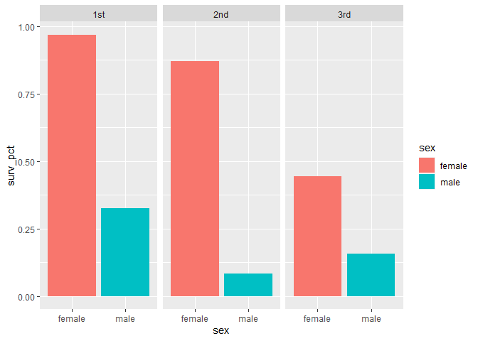

``` r
toyimports  = read.csv("data/toyimports.csv") # Load in the titanic data set
head(toyimports )
```

    ##   partner year         partner_name product                        product_name
    ## 1     ARE 1998 United Arab Emirates  950341 Toys representing animals or non-hu
    ## 2     ARE 2000 United Arab Emirates  950349 Toys representing animals or non-hu
    ## 3     ARE 2003 United Arab Emirates  950349 Toys representing animals or non-hu
    ## 4     ARE 2005 United Arab Emirates  950320 Reduced-size ("scale") model assemb
    ## 5     ARG 1996            Argentina  950341 Toys representing animals or non-hu
    ## 6     ARG 1996            Argentina  950310  Electric trains, including tracks,
    ##   US_report_import  pop2000 region
    ## 1            1.060  3247000      7
    ## 2           12.012  3247000      7
    ## 3            4.650  3247000      7
    ## 4           49.236  3247000      7
    ## 5            0.000 36895710      2
    ## 6           10.850 36895710      2

``` r
country_totals = toyimports %>%
  group_by(partner_name) %>%
  summarize(total_dollar_value = sum(US_report_import)) %>%
  arrange(desc(total_dollar_value))

country_totals
```

    ## # A tibble: 129 x 2
    ##    partner_name     total_dollar_value
    ##    <chr>                         <dbl>
    ##  1 China                     26842305.
    ##  2 Denmark                    1034990.
    ##  3 Canada                      572309.
    ##  4 Hong Kong, China            545186.
    ##  5 Switzerland                 400969.
    ##  6 Korea, Rep.                 350612.
    ##  7 Germany                     312891.
    ##  8 Japan                       253160.
    ##  9 Thailand                    226155.
    ## 10 Indonesia                   213807.
    ## # ... with 119 more rows

``` r
top3_partner_names = c('China', 'Denmark', 'Canada')


top3_byyear = toyimports %>%
  filter(partner_name %in% top3_partner_names) %>%
  group_by(year, partner_name) %>%
  summarize(yearly_dollar_value = sum(US_report_import))
```

    ## `summarise()` has grouped output by 'year'. You can override using the `.groups` argument.

``` r
ggplot(top3_byyear) +  
  geom_line(aes(x=year, y=yearly_dollar_value, color=partner_name)) +
  scale_color_brewer(type='qual') + 
  scale_y_log10() + 
  scale_x_continuous(breaks = 1996:2005) + 
  labs(x="Year", y = "Dollar value of imports (log scale)",
       title="Toy imports from the U.S.'s top-3 partners, 1996-2005")
```

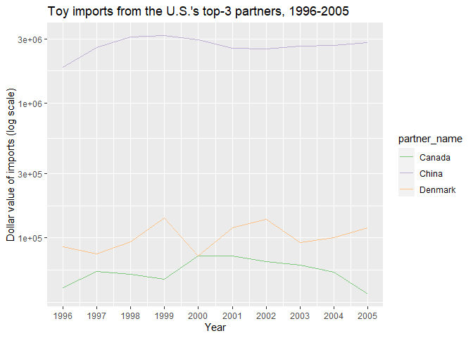

### Data Wrangle shortcuts

``` r
mean(~age,data=titanic) # Calcualte the mean
```

    ## [1] 29.88113

``` r
mean(age ~ sex, data=titanic) # Calcualte the mean by category
```

    ##   female     male 
    ## 28.68707 30.58523

``` r
prop(~survived, data=titanic) # Proportion of titanic survivors
```

    ##   prop_no 
    ## 0.5917782

``` r
favstats(age ~ sex, data=titanic) # combo of all the good stuff
```

    ##      sex    min Q1 median Q3 max     mean       sd   n missing
    ## 1 female 0.1667 19     27 38  76 28.68707 14.57700 388       0
    ## 2   male 0.3333 21     28 39  80 30.58523 14.28057 658       0

## Regression

``` r
heartrate = read.csv('data/heartrate.csv')
head(heartrate)
```

    ##   age hrmax
    ## 1  25   190
    ## 2  43   176
    ## 3  19   203
    ## 4  31   177
    ## 5  23   183
    ## 6  27   201

``` r
ggplot(heartrate) + 
  geom_point(aes(x=age, y=hrmax)) + 
  geom_smooth(aes(x=age, y=hrmax), method='lm')
```

    ## `geom_smooth()` using formula 'y ~ x'

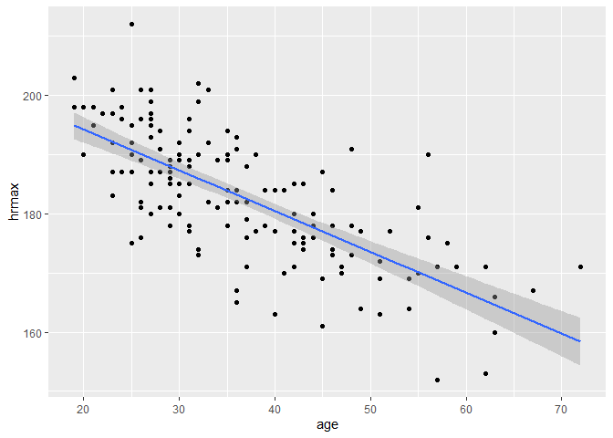

``` r
model_hr = lm(hrmax ~ age, data=heartrate)
coef(model_hr)
```

    ## (Intercept)         age 
    ## 207.9306683  -0.6878927

``` r
y_hats = predict(model_hr)

plot(y_hats,heartrate$hrmax)
```

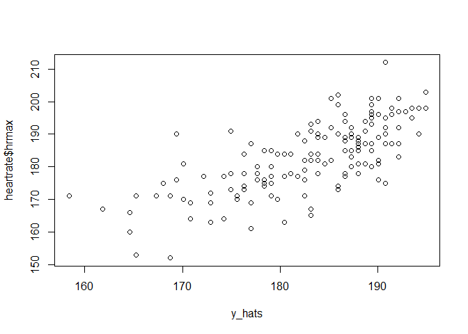

``` r
plot(heartrate$age,model_hr$residuals)
```


``` r
ebola = read.csv('data/ebola.csv')
head(ebola)
```

    ##         Date Day GuinSus GuinDeath GuinLab LibSus LibDeath LibLab NigSus
    ## 1 2014-03-25   0      86        59       0      0        0      0      0
    ## 2 2014-03-26   1      86        60       1      0        0      0      0
    ## 3 2014-03-27   2     103        66       4      0        0      0      0
    ## 4 2014-03-31   6     112        70      24      0        0      0      0
    ## 5 2014-04-01   7     122        80      24      0        0      0      0
    ## 6 2014-04-02   8     127        83      35      0        0      0      0
    ##   NigDeath NigLab SLSus SLDeath SLLab SenSus SenDeath SenLab totalSus
    ## 1        0      0     0       0     0      0        0      0       86
    ## 2        0      0     0       0     0      0        0      0       86
    ## 3        0      0     0       0     0      0        0      0      103
    ## 4        0      0     0       0     0      0        0      0      112
    ## 5        0      0     0       0     0      0        0      0      122
    ## 6        0      0     0       0     0      0        0      0      127
    ##   totalDeath totalLab
    ## 1         59        0
    ## 2         60        1
    ## 3         66        4
    ## 4         70       24
    ## 5         80       24
    ## 6         83       35

``` r
# Looks exponential so lienar regression seems suspect at first
ggplot(ebola) + 
  geom_line(aes(x=Day, y = totalSus))
```

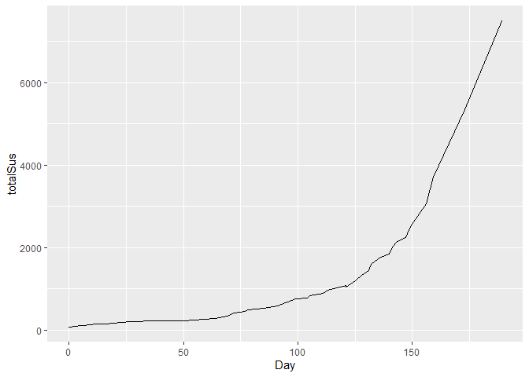

``` r
# But we can change the y var
# total cases over time: logarithm scale for y variable
ggplot(ebola) + 
  geom_line(aes(x=Day, y = log(totalSus)))
```

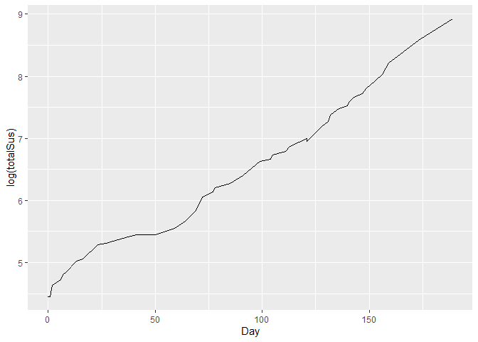

``` r
# this looks like something that could be fit with linear regression

# linear model for log(cases) versus time
lm_ebola = lm(log(totalSus) ~ Day, data=ebola)
coef(lm_ebola)
```

    ## (Intercept)         Day 
    ##  4.53843517  0.02157854

``` r
# total cases over time with reference line
ggplot(ebola) + 
   geom_line(aes(x=Day, y = log(totalSus))) + 
   geom_abline(intercept = 4.54, slope = 0.0216, color='red')
```

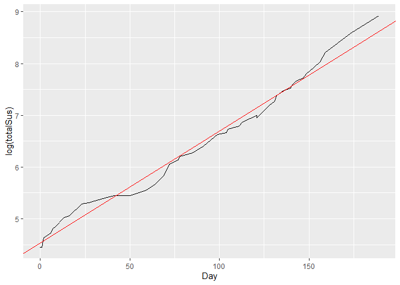

``` r
# Power Law

animals = read.csv('data/animals.csv')
head(animals)
```

    ##             animal     body  brain
    ## 1 African elephant 6654.000 5712.0
    ## 2   Asian elephant 2547.000 4603.0
    ## 3              Cat    3.300   25.6
    ## 4       Chimpanzee   52.160  440.0
    ## 5       Chinchilla    0.425    6.4
    ## 6              Cow  465.000  423.0

``` r
# Hard to see any relationship at first because of dramtic scale difference
ggplot(animals) + 
  geom_point(aes(x=body, y=brain))
```

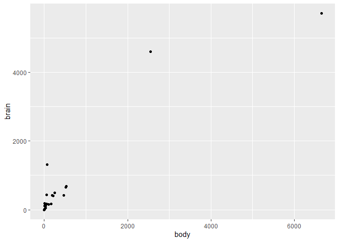

``` r
# But, taking the log of both variables helps squish everything together!
ggplot(animals) + 
  geom_point(aes(x=log(body), y=log(brain)))
```

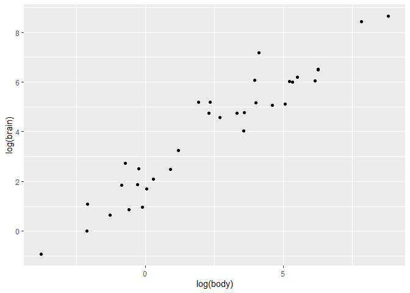

``` r
# Eestimating demand function!

milk = read.csv('data/milk.csv')
head(milk)
```

    ##   price sales
    ## 1  3.48    15
    ## 2  3.12    11
    ## 3  2.95    21
    ## 4  2.68    30
    ## 5  3.62    11
    ## 6  4.32    11

``` r
# Based on the below plot, we can see a lienar relaitonship doesn't exactly make sense.

ggplot(milk) + geom_point(aes(x=price,y=sales))
```

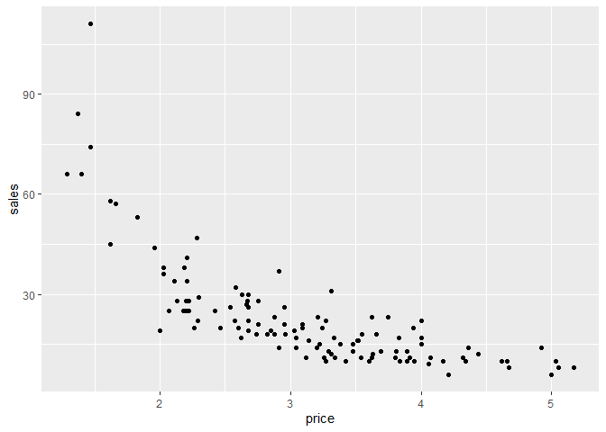

``` r
# Probably a power law?
ggplot(milk) +
   geom_point(aes(x=log(price), y=log(sales)))
```

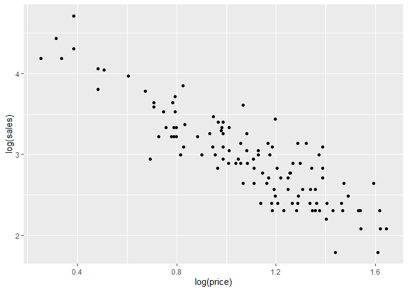

``` r
# Oh yea. Now we can estimate that function
lm_milk = lm(log(sales) ~ log(price), data=milk)
coef(lm_milk)
```

    ## (Intercept)  log(price) 
    ##    4.720604   -1.618578
